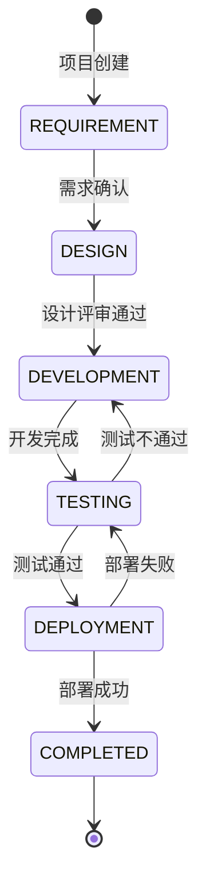
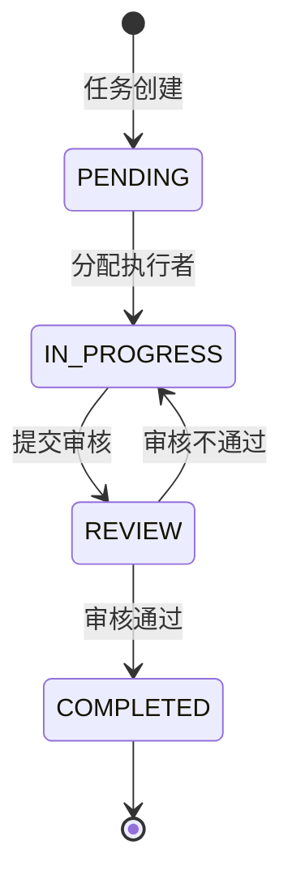

# 三省六部工作流状态机定义

## 概述

本文档定义三省六部技能系统中项目和任务的状态流转规则，确保工作流程的规范性和可追溯性。

---

## 一、项目状态枚举与流转

### 1.1 项目状态枚举

| 状态代码 | 状态名称 | 说明 |
|---------|---------|------|
| `REQUIREMENT` | 需求分析 | 项目启动，进行需求调研和分析 |
| `DESIGN` | 设计 | 系统设计、架构设计、数据库设计等 |
| `DEVELOPMENT` | 开发 | 编码实现阶段 |
| `TESTING` | 测试 | 功能测试、集成测试、性能测试等 |
| `DEPLOYMENT` | 部署 | 系统部署和上线准备 |
| `COMPLETED` | 完成 | 项目交付完成 |

### 1.2 项目状态流转图



### 1.3 项目状态流转规则

#### 需求分析 (REQUIREMENT)

| 条件类型 | 具体条件 |
|---------|---------|
| **进入条件** | 项目创建，分配项目经理 |
| **退出条件** | 需求文档评审通过，获得利益相关方确认 |

#### 设计 (DESIGN)

| 条件类型 | 具体条件 |
|---------|---------|
| **进入条件** | 需求分析阶段完成，需求文档已确认 |
| **退出条件** | 设计文档评审通过，技术方案确认 |

#### 开发 (DEVELOPMENT)

| 条件类型 | 具体条件 |
|---------|---------|
| **进入条件** | 设计阶段完成，设计文档已评审 |
| **退出条件** | 所有任务开发完成，代码审查通过 |

#### 测试 (TESTING)

| 条件类型 | 具体条件 |
|---------|---------|
| **进入条件** | 开发阶段完成，代码已合并 |
| **退出条件** | 所有测试用例通过，无严重缺陷 |

#### 部署 (DEPLOYMENT)

| 条件类型 | 具体条件 |
|---------|---------|
| **进入条件** | 测试阶段完成，测试报告已确认 |
| **退出条件** | 生产环境部署成功，验收通过 |

#### 完成 (COMPLETED)

| 条件类型 | 具体条件 |
|---------|---------|
| **进入条件** | 部署成功，用户验收通过 |
| **退出条件** | 无（终态） |

---

## 二、任务状态枚举与流转

### 2.1 任务状态枚举

| 状态代码 | 状态名称 | 说明 |
|---------|---------|------|
| `PENDING` | 待分配 | 任务已创建，等待分配执行者 |
| `IN_PROGRESS` | 进行中 | 任务正在执行中 |
| `REVIEW` | 待审核 | 任务完成，等待审核 |
| `COMPLETED` | 已完成 | 任务审核通过，已完成 |

### 2.2 任务状态流转图



### 2.3 任务状态流转规则

#### 待分配 (PENDING)

| 条件类型 | 具体条件 |
|---------|---------|
| **进入条件** | 任务创建，填写任务描述和预期产出 |
| **退出条件** | 分配执行者，设定截止日期 |

#### 进行中 (IN_PROGRESS)

| 条件类型 | 具体条件 |
|---------|---------|
| **进入条件** | 执行者确认接受任务 |
| **退出条件** | 提交任务成果，申请审核 |

#### 待审核 (REVIEW)

| 条件类型 | 具体条件 |
|---------|---------|
| **进入条件** | 执行者提交任务成果 |
| **退出条件** | 审核者完成审核（通过/不通过） |

#### 已完成 (COMPLETED)

| 条件类型 | 具体条件 |
|---------|---------|
| **进入条件** | 审核通过，成果确认 |
| **退出条件** | 无（终态） |

---

## 三、状态转换条件

### 3.1 允许的状态转换

#### 项目状态允许转换

| 当前状态 | 目标状态 | 转换条件 |
|---------|---------|---------|
| REQUIREMENT | DESIGN | 需求文档评审通过 |
| DESIGN | DEVELOPMENT | 设计评审通过 |
| DEVELOPMENT | TESTING | 所有开发任务完成 |
| TESTING | DEVELOPMENT | 发现严重缺陷需修复 |
| TESTING | DEPLOYMENT | 测试全部通过 |
| DEPLOYMENT | COMPLETED | 部署成功且验收通过 |
| DEPLOYMENT | TESTING | 部署失败需重新测试 |

#### 任务状态允许转换

| 当前状态 | 目标状态 | 转换条件 |
|---------|---------|---------|
| PENDING | IN_PROGRESS | 执行者确认接受任务 |
| IN_PROGRESS | REVIEW | 提交任务成果 |
| REVIEW | IN_PROGRESS | 审核不通过，需修改 |
| REVIEW | COMPLETED | 审核通过 |

### 3.2 禁止的状态转换

#### 项目状态禁止转换

| 当前状态 | 禁止转换到 | 原因 |
|---------|-----------|------|
| REQUIREMENT | TESTING | 必须经过设计和开发阶段 |
| REQUIREMENT | DEPLOYMENT | 必须经过完整开发流程 |
| DESIGN | DEPLOYMENT | 必须经过开发和测试阶段 |
| DEVELOPMENT | COMPLETED | 必须经过测试和部署阶段 |
| COMPLETED | * | 已完成项目不可回退 |

#### 任务状态禁止转换

| 当前状态 | 禁止转换到 | 原因 |
|---------|-----------|------|
| PENDING | REVIEW | 必须先执行任务 |
| PENDING | COMPLETED | 必须经过执行和审核 |
| IN_PROGRESS | COMPLETED | 必须经过审核 |
| COMPLETED | * | 已完成任务不可回退 |

---

## 四、状态转换事件

### 4.1 事件类型定义

#### 项目事件

| 事件代码 | 事件名称 | 触发条件 | 目标状态 |
|---------|---------|---------|---------|
| `PROJECT_CREATE` | 项目创建 | 项目初始化 | REQUIREMENT |
| `REQUIREMENT_APPROVED` | 需求确认 | 需求评审通过 | DESIGN |
| `DESIGN_APPROVED` | 设计确认 | 设计评审通过 | DEVELOPMENT |
| `DEV_COMPLETED` | 开发完成 | 所有任务完成 | TESTING |
| `TEST_FAILED` | 测试失败 | 发现严重缺陷 | DEVELOPMENT |
| `TEST_PASSED` | 测试通过 | 测试全部通过 | DEPLOYMENT |
| `DEPLOY_SUCCESS` | 部署成功 | 生产环境部署成功 | COMPLETED |
| `DEPLOY_FAILED` | 部署失败 | 部署过程出错 | TESTING |

#### 任务事件

| 事件代码 | 事件名称 | 触发条件 | 目标状态 |
|---------|---------|---------|---------|
| `TASK_CREATE` | 任务创建 | 新建任务 | PENDING |
| `TASK_ASSIGNED` | 任务分配 | 分配执行者 | IN_PROGRESS |
| `TASK_SUBMIT` | 任务提交 | 提交成果 | REVIEW |
| `REVIEW_REJECTED` | 审核拒绝 | 审核不通过 | IN_PROGRESS |
| `REVIEW_APPROVED` | 审核通过 | 审核通过 | COMPLETED |

### 4.2 事件处理规则

#### 事件处理流程

```
事件触发 → 状态校验 → 条件检查 → 状态转换 → 记录日志 → 通知相关方
```

#### 事件处理规则表

| 规则编号 | 规则名称 | 规则描述 |
|---------|---------|---------|
| R001 | 状态前置校验 | 转换前必须验证当前状态是否允许转换 |
| R002 | 条件完整性检查 | 必须满足所有退出条件才能转换状态 |
| R003 | 权限验证 | 状态转换操作者必须有相应权限 |
| R004 | 审计日志 | 所有状态转换必须记录操作日志 |
| R005 | 通知机制 | 状态转换后必须通知相关利益方 |
| R006 | 回滚保护 | 终态（COMPLETED）不可回滚 |
| R007 | 并发控制 | 同一资源同时只能有一个状态转换操作 |

### 4.3 事件处理器伪代码

```python
class StateMachine:
    def handle_event(self, entity, event):
        # 1. 状态前置校验
        if not self.is_valid_transition(entity.state, event.target_state):
            raise InvalidTransitionError(
                f"Cannot transition from {entity.state} to {event.target_state}"
            )
        
        # 2. 条件完整性检查
        if not self.check_exit_conditions(entity, entity.state):
            raise ConditionNotMetError(
                f"Exit conditions not met for state {entity.state}"
            )
        
        # 3. 权限验证
        if not self.has_permission(event.operator, event.action):
            raise PermissionDeniedError(
                f"Operator {event.operator} has no permission for {event.action}"
            )
        
        # 4. 状态转换
        old_state = entity.state
        entity.state = event.target_state
        
        # 5. 记录日志
        self.log_transition(
            entity_id=entity.id,
            from_state=old_state,
            to_state=event.target_state,
            operator=event.operator,
            timestamp=datetime.now()
        )
        
        # 6. 通知相关方
        self.notify_stakeholders(entity, event)
        
        return entity
```

---

## 五、状态机配置示例

### 5.1 项目状态机配置

```json
{
  "entity_type": "project",
  "states": [
    {"code": "REQUIREMENT", "name": "需求分析", "initial": true},
    {"code": "DESIGN", "name": "设计"},
    {"code": "DEVELOPMENT", "name": "开发"},
    {"code": "TESTING", "name": "测试"},
    {"code": "DEPLOYMENT", "name": "部署"},
    {"code": "COMPLETED", "name": "完成", "final": true}
  ],
  "transitions": [
    {
      "from": "REQUIREMENT",
      "to": "DESIGN",
      "event": "REQUIREMENT_APPROVED",
      "conditions": ["requirement_doc_approved", "stakeholder_confirmed"]
    },
    {
      "from": "DESIGN",
      "to": "DEVELOPMENT",
      "event": "DESIGN_APPROVED",
      "conditions": ["design_doc_approved", "tech_stack_confirmed"]
    },
    {
      "from": "DEVELOPMENT",
      "to": "TESTING",
      "event": "DEV_COMPLETED",
      "conditions": ["all_tasks_completed", "code_review_passed"]
    },
    {
      "from": "TESTING",
      "to": "DEVELOPMENT",
      "event": "TEST_FAILED",
      "conditions": ["critical_bugs_found"]
    },
    {
      "from": "TESTING",
      "to": "DEPLOYMENT",
      "event": "TEST_PASSED",
      "conditions": ["all_tests_passed", "no_critical_bugs"]
    },
    {
      "from": "DEPLOYMENT",
      "to": "COMPLETED",
      "event": "DEPLOY_SUCCESS",
      "conditions": ["production_deployed", "acceptance_passed"]
    },
    {
      "from": "DEPLOYMENT",
      "to": "TESTING",
      "event": "DEPLOY_FAILED",
      "conditions": ["deploy_error_occurred"]
    }
  ]
}
```

### 5.2 任务状态机配置

```json
{
  "entity_type": "task",
  "states": [
    {"code": "PENDING", "name": "待分配", "initial": true},
    {"code": "IN_PROGRESS", "name": "进行中"},
    {"code": "REVIEW", "name": "待审核"},
    {"code": "COMPLETED", "name": "已完成", "final": true}
  ],
  "transitions": [
    {
      "from": "PENDING",
      "to": "IN_PROGRESS",
      "event": "TASK_ASSIGNED",
      "conditions": ["assignee_confirmed", "due_date_set"]
    },
    {
      "from": "IN_PROGRESS",
      "to": "REVIEW",
      "event": "TASK_SUBMIT",
      "conditions": ["deliverable_submitted"]
    },
    {
      "from": "REVIEW",
      "to": "IN_PROGRESS",
      "event": "REVIEW_REJECTED",
      "conditions": ["review_feedback_provided"]
    },
    {
      "from": "REVIEW",
      "to": "COMPLETED",
      "event": "REVIEW_APPROVED",
      "conditions": ["review_approved", "deliverable_accepted"]
    }
  ]
}
```

---

## 六、附录

### 6.1 ASCII 状态流转图

#### 项目状态流转图

```
                    ┌─────────────────┐
                    │   REQUIREMENT   │
                    │    (需求分析)    │
                    └────────┬────────┘
                             │ 需求确认
                             ▼
                    ┌─────────────────┐
                    │     DESIGN      │
                    │      (设计)      │
                    └────────┬────────┘
                             │ 设计评审通过
                             ▼
                    ┌─────────────────┐
                    │  DEVELOPMENT    │
                    │     (开发)       │
                    └────────┬────────┘
                             │ 开发完成
                             ▼
                    ┌─────────────────┐
              ┌─────│    TESTING      │─────┐
              │     │     (测试)       │     │
              │     └─────────────────┘     │
              │ 测试不通过                   │ 测试通过
              ▼                             ▼
    ┌─────────────────┐           ┌─────────────────┐
    │  DEVELOPMENT    │           │   DEPLOYMENT    │
    │     (开发)       │           │     (部署)       │
    └─────────────────┘           └────────┬────────┘
                                           │ 部署成功
                                           ▼
                                  ┌─────────────────┐
                                  │   COMPLETED     │
                                  │     (完成)       │
                                  └─────────────────┘
```

#### 任务状态流转图

```
    ┌─────────────────┐
    │    PENDING      │
    │    (待分配)      │
    └────────┬────────┘
             │ 分配执行者
             ▼
    ┌─────────────────┐
    │  IN_PROGRESS    │
    │    (进行中)      │
    └────────┬────────┘
             │ 提交审核
             ▼
    ┌─────────────────┐
    │     REVIEW      │
    │    (待审核)      │
    └────────┬────────┘
             │ 审核通过
             ▼
    ┌─────────────────┐
    │   COMPLETED     │
    │    (已完成)      │
    └─────────────────┘
```

### 6.2 状态机术语表

| 术语 | 英文 | 定义 |
|-----|------|------|
| 状态 | State | 实体在生命周期中的某个阶段 |
| 转换 | Transition | 从一个状态到另一个状态的变化 |
| 事件 | Event | 触发状态转换的动作或条件 |
| 条件 | Condition | 状态转换必须满足的规则 |
| 初始状态 | Initial State | 实体创建时的默认状态 |
| 终态 | Final State | 实体生命周期结束的状态 |
| 守卫条件 | Guard Condition | 决定转换是否可以执行的条件 |

---

**文档版本**: v1.0  
**最后更新**: 2026-03-26  
**维护者**: 三省六部技能团队
