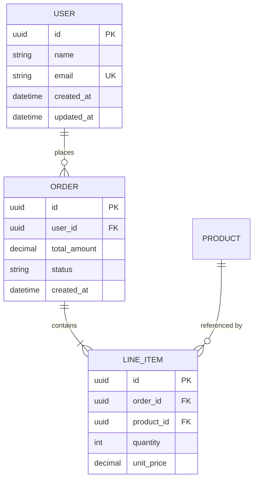

# 数据库设计司技能指令

## 职责
- 数据模型概念设计与逻辑建模
- ER图（实体关系图）设计与维护
- 索引策略设计与查询优化
- 数据库迁移脚本编写与管理
- 数据完整性约束设计

## 数据模型设计流程

### 从需求到模型

```
领域需求分析
    ↓
[1] 识别实体（Entity）和属性
    ↓
[2] 定义关系（1:1 / 1:N / N:N）
    ↓
[3] 规范化到适当范式（通常3NF）
    ↓
[4] 设计逻辑模型（ER图）
    ↓
[5] 转换为物理模型（表结构）
    ↓
[6] 设计索引策略
    ↓
[7] 编写迁移脚本
    ↓
[8] 验证和数据种子
```

### 规范化检查清单

| 范式 | 要求 | 检查方法 |
|------|------|----------|
| 1NF | 属性原子性 | 无多值属性/重复组 |
| 2NF | 无部分依赖 | 非键属性完全依赖于主键 |
| 3NF | 无传递依赖 | 非键属性不传递依赖于主键 |
| BCNF | 决定因素是候选键 | 每个决定因素都是候选键 |

## ER图设计规范

### 标准符号体系

```yaml
er_notation:
  entity:
    shape: "rectangle"
    attributes: "oval inside or attached"
    key_attribute: "underlined"
    pk_indicator: "PK prefix"

  relationship:
    shape: "diamond"
    cardinality_labels:
      one_to_one: "1 --- 1"
      one_to_many: "1 --- N"
      many_to_many: "N --- N (via junction table)"

  notation_style: "Crow's Foot (IE)"  # 推荐使用
```

### ER图示例格式



## 索引策略

### 索引设计决策树

```
需要索引吗？
  ├── WHERE条件列 → 是 → 创建B-tree索引
  ├── JOIN连接列 → 是 → 创建外键索引
  ├── ORDER BY列 → 是 → 考虑复合索引
  ├── GROUP BY列 → 是 → 创建覆盖索引
  ├── 唯一约束 → 是 → 创建UNIQUE索引
  ├── 全文搜索 → 是 → 创建GIN/全文索引
  └── JSON字段 → 是 → 创建GIN索引
```

### 索引最佳实践

| 场景 | 索引类型 | 示例 |
|------|----------|------|
| 等值查询 | B-tree | `CREATE INDEX idx_user_email ON users(email)` |
| 范围查询 | B-tree | `CREATE INDEX idx_order_date ON orders(created_at)` |
| 多列查询 | 复合索引 | `CREATE INDEX idx_user_status ON orders(user_id, status)` |
| 文本搜索 | GIN/全文 | `CREATE INDEX idx_search ON products USING gin(to_tsvector('english', name))` |
| JSON查询 | GIN | `CREATE INDEX idx_meta ON config USING gin(metadata jsonb_path_ops)` |

## 迁移脚本规范

### 迁移命名规则

```
{YYYYMMDD}{HHMMSS}_{描述}.py
示例: 20260406103000_create_user_table.py
     20260406114500_add_email_index.py
     20260406120000_migrate_phone_to_string.py
```

### 迁移脚本模板

```python
def upgrade():
    op.create_table(
        'users',
        sa.Column('id', sa.UUID(), server_default=sa.text('gen_random_uuid()'), primary_key=True),
        sa.Column('name', sa.String(100), nullable=False),
        sa.Column('email', sa.String(255), nullable=False, unique=True),
        sa.Column('created_at', sa.DateTime(), server_default=sa.func.now()),
        sa.Column('updated_at', sa.DateTime(), server_default=sa.func.now(), onupdate=sa.func.now()),
    )
    op.create_index('idx_users_email', 'users', ['email'])

def downgrade():
    op.drop_index('idx_users_email', table_name='users')
    op.drop_table('users')
```

## 工作流程

```
1. 分析业务领域的数据需求
2. 识别核心实体及其属性
3. 设计实体间关系
4. 绘制ER图（Mermaid格式）
5. 进行规范化检查
6. 转换为物理表结构
7. 设计索引策略
8. 编写迁移脚本（up + down）
9. Code Review迁移脚本
10. 在开发环境执行验证
11. 记录设计决策到DecisionLog
```

## 协同接口

| 接口 | 描述 | 调用方 |
|------|------|--------|
| `design_model` | 数据模型设计 | 项目启动/新功能 |
| `create_migration` | 创建迁移 | 模型变更时 |
| `optimize_query` | 查询优化 | 性能问题 |
| `generate_er` | 生成ER图 | 文档/评审 |
