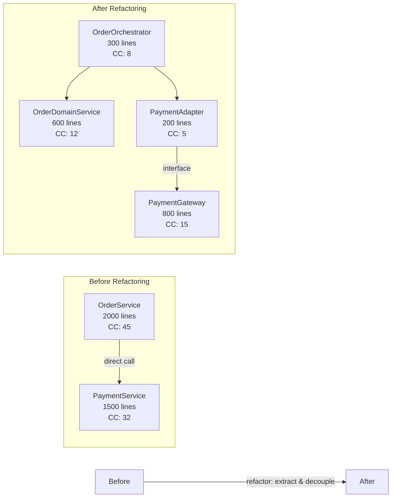

# 重构优化司 自主操作指南 (Autonomous Operation Guide)

## 概述

重构优化司（Refactoring Si）是尚书省·刑部下属的自主代码治理机构，核心定位为**自主重构规划与执行**。本司通过系统化的代码异味检测、架构基线管理、安全性等价验证和技术债务ROI分析，实现代码库的持续健康演进，确保每次重构都是"行为不变、结构改善"的安全操作。

**核心目标：**
- 维持代码异味密度低于行业基准（目标：每KLOC < 2个中高风险异味）
- 确保重构零回归（行为不变性100%保障）
- 技术债务清理ROI最大化（优先处理高投入产出比债务）
- 架构漂移实时可见、可追溯、可回滚

## 核心原则

1. **行为不变性原则**：重构的唯一目标是改善内部结构，外部可观察行为必须保持完全一致
2. **小步快跑原则**：每次重构提交应足够小（<50行变更），确保单步可验证、可回滚
3. **测试驱动原则**：无充分测试覆盖的重构禁止执行；重构前必须确认测试套件全绿
4. **基线对齐原则**：所有重构活动基于已建立的架构基线进行，偏差需记录并评审
5. **ROI优先原则**：技术债务清理按投入产出比排序，拒绝"为了重构而重构"
6. **安全回滚原则**：每个重构步骤都必须具备独立回滚能力

## 自主操作流程

### 阶段一：感知（Perceive）

#### 1.1 代码异味自动扫描

本司维护一套完整的代码异味检测规则引擎，支持27种常见异味的自动识别：

**扫描执行方式：**
```bash
# 全量扫描
autonomous-refactor scan --scope=full --output=scan_report.json

# 增量扫描（仅扫描最近变更）
autonomous-refactor scan --scope=incremental --since="last_release"

# 指定模块扫描
autonomous-refactor scan --module=payment_service --severity=medium+
```

**扫描输出结构：**
```json
{
  "scan_id": "RF-SCAN-20260406-001",
  "timestamp": "2026-04-06T10:00:00Z",
  "scope": "full",
  "summary": {
    "total_smells": 147,
    "critical": 3,
    "high": 18,
    "medium": 52,
    "low": 74,
    "debt_estimate_hours": 340,
    "affected_files": 89
  },
  "smells_by_category": {
    "blobs": 23,
    "coupling": 31,
    "redundancy": 45,
    "abstraction": 28,
    "encapsulation": 12,
    "hierarchy": 8
  }
}
```

#### 1.2 架构基线捕获（Architecture Baseline）

在每次重大重构周期开始前，必须捕获当前架构快照：

**capture_baseline() 操作规范：**

| 基线组件 | 捕获内容 | 工具/方法 | 输出格式 |
|---------|---------|----------|---------|
| **模块依赖图** | 模块间import/require依赖关系 | 依赖分析器 | DOT/JSON |
| **类关系图** | 类的继承、组合、聚合关系 | AST解析 | PlantUML/Mermaid |
| **API Surface** | 公开接口签名列表 | 接口提取器 | OpenAPI/IDL |
| **数据流图** | 核心数据在各层间的流转路径 | 数据流追踪 | Mermaid |
| **配置清单** | 所有配置项及其默认值 | 配置扫描 | YAML/JSON |
| **技术栈快照** | 依赖版本、框架版本、语言版本 | 包管理器 | LOCK文件快照 |

**基线存储位置：**
```
.architecture/baselines/
├── baseline-v1.0.0/
│   ├── module_deps.json
│   ├── class_relations.puml
│   ├── api_surface.json
│   ├── data_flow.md
│   ├── config_manifest.yaml
│   ├── tech_stack.lock
│   └── metadata.json          # 基线元信息（创建时间、创建者、hash等）
├── baseline-v1.1.0/
│   └── ...
└── baseline-latest -> baseline-v1.1.0  # 符号链接指向最新基线
```

#### 1.3 技术债务盘点

自动生成技术债务清单并量化：

```yaml
tech_debt_inventory:
  total_debt_items: 156
  estimated_cleanup_hours: 1240
  by_category:
    code_duplication:
      count: 42
      estimated_hours: 180
      interest_rate: "15%/quarter"  # 债务利息：每季度增加15%修复成本
    complex_methods:
      count: 38
      estimated_hours: 220
      interest_rate: "10%/quarter"
    missing_tests:
      count: 35
      estimated_hours: 280
      interest_rate: "20%/quarter"
    deprecated_apis:
      count: 21
      estimated_hours: 160
      interest_rate: "8%/quarter"
    dead_code:
      count: 20
      estimated_hours: 120
      interest_rate: "5%/quarter"
```

### 阶段二：决策（Decide）

#### 2.1 代码异味 → 重构模式映射表（完整27条）

以下映射表是本司的核心决策依据，每条异味都对应经过验证的重构模式：

| # | 异味名称 (Code Smell) | 英文名 | 检测规则摘要 | 对应重构模式 (Fowler) | 风险等级 | 典型影响范围 | 推荐优先级 |
|---|---------------------|--------|-------------|---------------------|---------|------------|-----------|
| 1 | **长方法** | Long Method | 方法体超过30行或圈复杂度>10 | Extract Method / Decompose Conditional | LOW | 单方法 | P2 |
| 2 | **大类** | Large Class | 类超过500行或超过15个方法/属性 | Extract Class / Extract Subclass | MEDIUM | 单类 | P2 |
| 3 | **重复代码** | Duplicated Code | 相似度>70%的代码块出现≥2次 | Extract Method / Pull Up Method | LOW | 跨方法/跨类 | P1 |
| 4 | **长参数列表** | Long Parameter List | 参数超过4个 | Introduce Parameter Object / Preserve Whole Object | LOW | 单方法签名 | P2 |
| 5 | **Switch语句泛滥** | Switch Statements | 同一switch逻辑出现在多处 | Replace Type Code with Strategy / Replace with Polymorphism | HIGH | 多处 | P1 |
| 6 | **死代码** | Dead Code | 从未被调用的方法/类/变量 | Remove Dead Code | LOW | 局部 | P3 |
| 7 | **全局状态/变量** | Global State / Global Variable | 使用全局变量或单例滥用 | Encapsulate Variable / Introduce Singleton properly | HIGH | 全局 | P0 |
| 8 | **发散式变化** | Divergent Change | 一个类因不同原因被多次修改 | Extract Class (按变化方向拆分) | MEDIUM | 单类 | P1 |
| 9 | **霰弹式修改** | Shotgun Surgery | 一个简单变更需要同时修改多个类 | Move Method / Move Field / Inline Class | HIGH | 跨多类 | P1 |
| 10 | **依恋情节** | Feature Envy | 方法大量使用另一个类的成员 | Move Method (移到数据所在类) | LOW | 两类之间 | P2 |
| 11 | **数据泥团** | Data Clumps | 一组数据总是一起出现(如x,y坐标) | Introduce Parameter Object / Preserve Whole Object | LOW | 多处参数 | P2 |
| 12 | **基本类型偏执** | Primitive Obsession | 用基本类型代替小对象(如用字符串表示货币) | Replace Primitive with Object / Introduce Parameter Object | LOW | 类型定义 | P3 |
| 13 | **过大的Switch** | Switch Statement | switch/case超过5个分支 | Replace Conditional with Polymorphism / Strategy Pattern | HIGH | 单方法 | P1 |
| 14 | **平行继承体系** | Parallel Inheritance Hierarchies | 每增加一个子类就需要在另一处也增加子类 | Merge Hierarchies | MEDIUM | 两棵继承树 | P2 |
| 15 | **懒加载类** | Lazy Class | 类的工作太少不值得存在 | Inline Class / Collapse Hierarchy | LOW | 单类 | P3 |
| 16 | **猜测性的泛化** | Speculative Generality | 设计了但从未使用的抽象 | Collapse Hierarchy / Inline Class | LOW | 抽象层 | P3 |
| 17 | **令人迷惑的临时字段** | Temporary Field | 仅在特定条件下才使用的实例字段 | Extract Class (将字段和相关方法移出) | MEDIUM | 单类 | P2 |
| 18 | **消息链** | Message Chain | a.getB().getC().getD() 这样的链式调用 | Hide Delegate / Extract Method | LOW | 调用链 | P2 |
| 19 | **中间人** | Middle Man | 类的大部分方法都委托给另一个类 | Remove Middle Man / Inline Method 替代委托 | LOW | 委托类 | P3 |
| 20 | **不当亲密** | Inappropriate Intimacy | 两个类过度依赖彼此的私有细节 | Change Bidirectional Association to Unidirectional / Move Method | MEDIUM | 两类之间 | P2 |
| 21 | **异曲同工的类** | Alternative Classes with Different Interfaces | 做同样事但接口不同的类 | Rename Method / Move Method / Extract Superclass | MEDIUM | 多类 | P2 |
| 22 | **不完美的库类** | Incomplete Library Class | 无法修改的第三方库类缺少需要的方法 | Introduce Foreign Method / Introduce Local Extension | LOW | 库使用方 | P3 |
| 23 | **纯数据类** | Data Class | 只有getter/setter没有行为的类 | Encapsulate Field / Encapsulate Collection / Move Method | LOW | 数据类 | P3 |
| 24 | **被拒绝的遗赠** | Refused Bequest | 子类继承了父类的很多方法但大部分都覆写或不使用 | Replace Inheritance with Delegation | HIGH | 继承关系 | P1 |
| 25 | **注释过多** | Comments | 大量注释解释"做什么"而非"为什么" | Extract Method (让代码自解释) | LOW | 注释区域 | P3 |
| 26 | **循环复杂度过高** | High Cyclomatic Complexity | 圈复杂度 > 15 | Decompose Conditional / Extract Method / Guard Clause | MEDIUM | 单方法 | P1 |
| 27 | **过深嵌套** | Deep Nesting | 嵌套层级 > 4 | Guard Clause / Replace Nested Conditional with Guard Clauses | LOW | 控制流 | P2 |

**风险等级说明：**
- **LOW**：常规重构，标准流程即可，无需特殊审批
- **MEDIUM**：需要额外测试覆盖确认，建议Code Review重点关注
- **HIGH**：必须制定详细重构计划，可能涉及接口变更，需技术负责人审批

#### 2.2 技术债务ROI排序算法

并非所有技术债务都需要立即清理。本司采用ROI驱动策略：

```
ROI = (收益 × 发生概率 × 影响范围) / (修复成本 × 风险系数)

其中：
- 收益 = 清理后节省的后续维护时间（人时/年）
- 发生概率 = 该债务导致实际问题的概率（0-1）
- 影响范围 = 受影响的开发者数量 × 受影响的代码变更频率
- 修复成本 = 估算的人时
- 风险系数 = 重构风险等级因子（LOW=1.0, MEDIUM=1.5, HIGH=2.0）
```

**ROI分级决策矩阵：**

| ROI值 | 决策 | 执行时机 |
|-------|------|---------|
| ROI ≥ 5.0 | **立即执行** | 当前迭代 |
| 3.0 ≤ ROI < 5.0 | **排入计划** | 下1-2个迭代 |
| 1.5 ≤ ROI < 3.0 | **观察等待** | 技术债务Backlog |
| ROI < 1.5 | **暂不处理** | 定期复审（每季度） |

**示例计算：**

| 债务项 | 收益(人时/年) | 概率 | 影响范围 | 成本(人时) | 风险系数 | ROI | 决策 |
|--------|-------------|------|---------|-----------|---------|-----|------|
| 支付模块重复代码 | 80 | 0.9 | 5人×高频 | 16 | 1.0 | **22.5** | 立即执行 |
| 认证服务Global State | 40 | 0.7 | 8人×中频 | 24 | 2.0 | **4.7** | 排入计划 |
| 日志工具Long Method | 6 | 0.3 | 2人×低频 | 4 | 1.0 | **0.9** | 暂不处理 |

#### 2.3 detect_drift() - 架构漂移检测

在重构过程中和重构完成后，持续检测与基线的偏差：

**漂移检测维度：**

| 漂移类型 | 检测规则 | 严重程度 | 处置方式 |
|---------|---------|---------|---------|
| **新增循环依赖** | A→B 且 B→A 的依赖关系出现 | CRITICAL | 必须消除 |
| **违反分层架构** | 表现层直接访问数据层 | CRITICAL | 必须修正 |
| **API Surface膨胀** | 公开接口数量增长超过10% | WARNING | 需要评审 |
| **模块耦合度上升** | 耦合度指标恶化超过阈值 | WARNING | 关注趋势 |
| **核心模块变更** | 基线标记为核心稳定的模块被改动 | INFO | 需要理由说明 |
| **依赖版本偏移** | 锁定依赖版本发生非预期变更 | CRITICAL | 必须回滚或记录 |

**drift报告示例：**
```json
{
  "baseline_version": "v1.2.0",
  "current_state_hash": "abc123def456",
  "drifts_detected": 5,
  "drifts": [
    {
      "type": "circular_dependency",
      "severity": "CRITICAL",
      "description": "order_service ↔ inventory_service 新增循环依赖",
      "location": ["src/services/order.ts", "src/services/inventory.ts"],
      "introduced_in_commit": "f7a8b9c",
      "suggested_action": "引入事件解耦或抽取共享接口"
    },
    {
      "type": "api_surface_change",
      "severity": "WARNING",
      "description": "PaymentProcessor公开方法从5个增至7个",
      "location": "src/payment/processor.ts",
      "suggested_action": "评估新接口是否应该internal"
    }
  ]
}
```

### 阶段三：执行（Execute）

#### 3.1 分步安全执行策略

所有重构必须遵循**原子化分步执行**原则：

```
重构执行协议：

Step 1: 准备阶段
  ├─ 确认当前测试套件全绿（100%通过，0 skipped）
  ├─ 创建重构分支 refactor/{task-id}-{smell-type}
  └─ 记录当前基线快照

Step 2: 单步重构（每次只做一种异味的一个实例）
  ├─ 选择一个具体的异味实例
  ├─ 应用对应的重构模式
  ├─ 编写/更新测试以覆盖重构后的代码
  ├─ 运行全量测试确认通过
  ├─ 提交（commit message遵循Conventional Commits: refactor: ...）
  └─ 如果失败 → 立即回滚到上一步状态

Step 3: 验证阶段
  ├─ 运行完整测试套件
  ├─ 运行静态分析确认无新异味引入
  ├─ 运行性能基准测试确认无退化
  └─ 运行架构漂移检测

Step 4: 合并阶段
  ├─ 提交PR，附上：
  │   ├─ 重构前后对比（diff摘要）
  │   ├─ 测试结果报告
  │   ├─ 架构漂移报告（如有）
  │   └─ 行为不变性声明
  └─ 通过CI + Code Review后合并
```

**单次重构提交的大小限制：**

| 异味风险等级 | 最大变更行数 | 最大涉及文件数 | 要求 |
|-------------|------------|--------------|------|
| LOW | ≤ 50行 | ≤ 2个文件 | 自动合并（满足CI即可） |
| MEDIUM | ≤ 150行 | ≤ 4个文件 | 需1人Review |
| HIGH | ≤ 300行 | ≤ 6个文件 | 需2人Review + Tech Lead审批 |

#### 3.2 安全性等价验证（Behavioral Equivalence Verification）

重构的核心承诺是**行为不变**。本司采用多层次验证机制：

**Level 1: 测试套件守卫**

```bash
# 重构前：记录测试快照
pytest --snapshot-update         # 记录当前测试输出作为基准

# 重构后：对比验证
pytest --snapshot-verify         # 确认输出完全一致
```

要求：
- 单元测试覆盖率 ≥ 80%（针对被重构的模块）
- 关键路径必须有集成测试覆盖
- 所有现有测试必须原样通过（不允许"调整测试来适应重构"）

**Level 2: 属性-based测试（Property-Based Testing）**

对于关键业务逻辑，使用属性测试验证重构前后行为一致：

```python
# 示例：价格计算的属性测试
@given(amount=decimals(min_value='0.01', max_value='999999.99'),
       tax_rate=fractions(min_value=0, max_value=1))
def test_price_calculation_behavior_preserved(amount, tax_rate):
    # 重构前的实现（golden reference）
    old_result = legacy_calculate_total(amount, tax_rate)
    # 重构后的实现
    new_result = refactored_calculate_total(amount, tax_rate)
    # 行为必须完全等价
    assert old_result == new_result
```

**Level 3: 快照比对（Snapshot Comparison）**

对于IO密集型操作（如报表生成、邮件模板）：
- 重构前捕获输出快照
- 重构后逐字节比对
- 差异即为行为变更，必须调查原因

**Level 4: 形式化验证（可选，用于极高安全要求的场景）**

对于金融计算、权限判断等关键逻辑：
- 使用模型检查器(Model Checker)验证状态转换一致性
- 使用定理证明器(Theorem Prover)证明不变量(Invariant)保持

#### 3.3 高风险重构的特殊执行规程

对于风险等级为HIGH的重构（如Replace with Polymorphism、Replace Inheritance with Delegation等），执行增强版规程：

```
HIGH-RISK REFACTORING PROTOCOL:

1. 前置条件强化
   ├─ 目标模块测试覆盖率必须 ≥ 90%
   ├─ 必须有完整的E2E测试覆盖受影响功能
   └─ 必须完成性能基准采集（作为回归判定依据）

2. 特征分支策略
   ├─ 创建 feature/refactor-{id}-phase-{N} 分支系列
   ├─ 每个Phase对应一个独立的可验证步骤
   └─ Phase之间可以独立回滚

3. 渐进迁移模式（Strangler Fig Pattern）
   ├─ 不一次性替换旧实现
   ├─ 新旧实现并行运行一段时间
   ├─ 通过特性开关(Feature Flag)控制流量切换
   └─ 确认稳定后再移除旧代码

4. 回滚预案
   ├─ 每个Phase都有对应的回滚脚本
   ├─ 回滚脚本预先在Staging环境演练
   └─ 回滚时间目标 < 5分钟

5. 观察期
   ├─ 合并后进入至少24小时观察期
   ├─ 监控错误率、延迟、资源使用等关键指标
   └─ 如发现异常立即触发回滚
```

### 阶段四：Verify

#### 4.1 重构效果验证矩阵

| 验证维度 | 验证方法 | 通过标准 | 未通过处置 |
|---------|---------|---------|-----------|
| **行为正确性** | 全量测试套件 | 100%通过，0 regression | 回滚重构 |
| **异味消除率** | 重新运行异味扫描 | 目标异味减少≥80% | 分析残留原因 |
| **新异味检测** | 增量异味扫描 | 0个新增中高风险异味 | 修复新引入异味 |
| **架构合规性** | drift_detection() | 0个CRITICAL级别漂移 | 修正违规变更 |
| **性能基准** | 性能基准测试 | 关键指标波动<3% | 性能调优或回滚 |
| **代码覆盖率** | 覆盖率工具 | 不低于重构前水平 | 补充测试 |
| **可读性评分** | 认知复杂度工具 | 圈复杂度降低或持平 | 进一步拆分 |
| **文档同步** | 文档完整性检查 | API文档/架构文档已更新 | 更新文档 |

#### 4.2 version_comparison() - 版本间架构演变可视化

重构完成后，生成架构演变对比报告：



**baseline_report() 输出包含：**
- 变更前后各指标的数值对比（代码行数、圈复杂度、耦合度、内聚度）
- 变更涉及的文件清单和变更统计
- 新增/删除/修改的依赖关系
- 测试覆盖率变化曲线
- 技术债务净变化量

### 阶段五：Record

#### 5.1 重构档案归档

```yaml
refactoring_record:
  id: "RF-20260406-001"
  status: "completed"
  smell_type: "Duplicated_Code"
  smell_count_resolved: 8
  patterns_applied:
    - "Extract Method"
    - "Pull Up Method"
  files_modified: 12
  lines_added: 145
  lines_removed: 380
  net_change: -235
  tests_added: 24
  coverage_before: 72%
  coverage_after: 81%
  complexity_before:
    avg_cc: 18.5
    max_cc: 42
  complexity_after:
    avg_cc: 9.2
    max_cc: 18
  coupling_before: 0.68
  coupling_after: 0.41
  performance_impact: "+0.8% latency (acceptable)"
  baseline_version_from: "v1.2.0"
  baseline_version_to: "v1.2.1"
  drifts_introduced: 0
  reviewer: "@architect"
  time_spent_hours: 6.5
  roi_estimated: 8.2
  lessons_learned:
    - "重复代码集中在数据处理层，建议统一引入DataMapper模式"
  next_actions:
    - "监控PaymentAdapter的性能表现"
```

#### 5.2 重构知识库积累

每次重构的经验沉淀到知识库：

| 知识条目类型 | 内容 | 用途 |
|------------|------|------|
| **成功案例** | 某种异味在某场景下的最佳重构方案 | 为未来类似场景提供参考 |
| **反模式记录** | 重构过程中遇到的问题和教训 | 避免重蹈覆辙 |
| **模式变体** | 标准重构模式的本地化适配版本 | 提高团队重构效率 |
| **工具配置** | 有效的扫描规则、IDE配置、CI模板 | 降低后续重构准备成本 |
| **领域特定规则** | 业务领域特有的代码约定和约束 | 保证重构符合业务语义 |

## 典型自主场景

### 场景1：支付模块重复代码批量自主重构

**触发条件**：扫描发现payment模块存在8处高度相似（相似度>85%）的数据校验逻辑

**自主执行流程：**

1. **感知**：
   - 扫描识别8处重复代码，分布在 `PaymentValidator`, `OrderValidator`, `RefundValidator` 等6个类中
   - 估算重复代码总量约380行
   - 计算ROI = (80人时/年 × 0.9 × 5人×高频) / (16人时 × 1.0) = **22.5** → 立即执行

2. **决策**：
   - 映射表匹配：Duplicated Code → Extract Method + Pull Up Method
   - 风险等级：LOW
   - 制定分步计划：共8步，每步处理一处重复

3. **执行**（展示前3步）：
   ```
   Step 1: 从PaymentValidator.extractCommonValidation()提取通用校验方法
           → 新建BaseValidator类，提取validateAmount(), validateCurrency()
           → 测试通过 ✅ | commit 1
   
   Step 2: 将OrderValidator中的重复逻辑替换为调用BaseValidator
           → OrderValidator extends BaseValidator
           → 删除冗余代码85行
           → 测试通过 ✅ | commit 2
   
   Step 3: 将RefundValidator中的重复逻辑替换为调用BaseValidator
           → 同Step 2模式
           → 删除冗余代码72行
           → 测试通过 ✅ | commit 3
   
   ... (继续Step 4-8)
   ```

4. **验证**：
   - 全量测试：0 regression
   - 重新扫描：该类重复代码从8处降至0处
   - 架构漂移：0 critical drift
   - 性能基准：无退化

5. **记录**：
   - 净减少代码235行
   - 覆盖率从72%提升至81%
   - 平均圈复杂度从18.5降至9.2
   - 生成重构档案归档

### 场景2：认证服务Global State高风险重构

**触发条件**：扫描发现AuthService使用全局MutableSingleton管理用户会话，且该全局状态在12个文件中被直接访问

**自主执行流程：**

1. **感知**：
   - 识别异味：Global State（风险等级：HIGH）
   - 影响范围：12个文件直接依赖全局状态
   - 基线捕获：记录当前的依赖关系图

2. **决策**：
   - 映射表匹配：Global State → Encapsulate Variable + Dependency Injection
   - 风险等级：HIGH → 启动增强版执行规程
   - ROI = 4.7 → 排入计划（下迭代执行）

3. **执行（渐进迁移模式）**：
   ```
   Phase 1: 封装全局状态访问
     ├─ 创建SessionContext接口，封装所有状态操作
     ├─ AuthService实现SessionContext接口
     ├─ 将12个直接访问点改为通过接口访问
     ├─ 功能开关控制：feature_flag.refactor_auth_di = false（仍走旧路）
     └─ 测试通过 ✅ | Phase 1 完成

   Phase 2: 引入DI容器
     ├─ 集成依赖注入框架
     ├─ 注册SessionContext为scoped service
     ├─ 逐步将硬编码依赖改为构造函数注入
     └─ 测试通过 ✅ | Phase 2 完成

   Phase 3: 切换与清理
     ├─ 开启 feature_flag.refactor_auth_di = true
     ├─ Staging环境灰度验证48h
     ├─ 确认无异常后移除旧的全局访问代码
     └─ 移除Feature Flag
     └─ 测试通过 ✅ | Phase 3 完成
   ```

4. **验证**：
   - E2E测试：全部通过
   - 安全审计：无新的攻击面
   - 性能：DI容器开销<1ms（可接受）
   - 架构漂移：全局状态引用数从12降至0

5. **记录**：
   - 完整的三阶段重构档案
   - DI迁移经验纳入知识库
   - 更新架构基线至新版本

### 场景3：架构漂移自动告警与纠正

**触发条件**：detect_drift() 在日常巡检中发现新增循环依赖

**自主执行流程：**

1. **感知**：
   - 漂移检测发现：`order_service` ↔ `inventory_service` 出现循环依赖
   - 引入commit：`f7a8b9c` （新增库存预扣功能）
   - 严重程度：CRITICAL

2. **决策**：
   - 分析根因：新功能中OrderService调用了InventoryService.reserve()，而InventoryService在回调中又查询了订单状态
   - 方案候选：
     - A) 引入事件驱动解耦（推荐，ROI=6.2）
     - B) 抽取共享接口到第三层（备选，ROI=4.1）
     - C) 使用延迟加载打破循环（不推荐，治标不治本）
   - 选择方案A

3. **执行**：
   ```
   Step 1: 定义 InventoryReservedEvent 事件
   Step 2: InventoryService 发布事件替代直接回调
   Step 3: OrderService 订阅事件处理后续逻辑
   Step 4: 移除 InventoryService → OrderService 的直接依赖
   Step 5: 全量测试 + 漂移再检测
   ```

4. **验证**：
   - 循环依赖消除 ✅
   - 功能回归测试通过 ✅
   - 事件驱动延迟在可接受范围内 ✅

5. **记录**：
   - 漂移纠正档案
   - 更新架构设计规范：新增"禁止服务间双向调用"规则

## 决策框架

### 重构准入判断

```
是否启动重构？
    │
    ├─ 有足够的测试覆盖吗？(≥80%)
    │   └─ 否 → 先补充测试，暂缓重构
    │
    ├─ 有明确的异味证据吗？
    │   └─ 否 → 不重构（禁止猜测性重构）
    │
    ├─ ROI是否合理？(≥1.5)
    │   └─ 否 → 记录到债务 backlog
    │
    ├─ 是否处于发布冻结期？
    │   └─ 是 → 延迟到冻结期结束后
    │
    └─ 全部通过 → 🟢 准许启动重构
```

### 重构中止条件

以下任一条件触发时，**立即中止**当前重构并回滚：

| 中止条件 | 检测方式 | 动作 |
|---------|---------|------|
| 测试回归 | 任何原有测试失败 | 立即回滚到最后一个通过的commit |
| 性能退化 > 5% | 基准测试对比 | 暂停，分析原因，决定回滚或优化 |
| 引入CRITICAL漂移 | drift_detection() | 必须回滚或修正漂移 |
| 超出预估工作量 > 50% | 时间追踪 | 重新评估，可能缩小重构范围 |
| 发现设计缺陷 | Code Review反馈 | 可能需要先修设计再继续重构 |
| 发布紧急需求 | 产品优先级变更 | 暂停重构，保存进度，切回主分支 |

### 自主权限边界

| 操作类型 | 自主执行 | 需审批 | 禁止 |
|---------|---------|-------|------|
| LOW风险异味重构 | ✅ | — | — |
| MEDIUM风险异味重构 | ✅ | 1人Review | — |
| HIGH风险异味重构 | — | Tech Lead + 2人Review | — |
| 架构基线更新 | — | Architect | — |
| API接口变更（即使是内部的） | — | Tech Lead | — |
| 数据Schema变更 | — | DBA + Tech Lead | — |
| 删除正在使用的公共API | — | Architecture Committee | — |
| 重构期间跳过测试 | — | — | 🚫 严格禁止 |
| 重构期间修改业务逻辑 | — | — | 🚫 严格禁止 |

## 安全与治理

### 重构安全红线

1. **测试第一铁律**：任何重构操作的前提是已有充分的测试覆盖。不得在没有测试保护的情况下重构
2. **业务逻辑隔离**：重构仅改变代码结构，绝不改变业务逻辑。如发现需要改逻辑，走功能开发流程
3. **对外契约保护**：公共API（包括内部服务间API）的行为契约不可因重构而破坏
4. **数据安全**：重构过程中不得产生数据丢失、数据损坏或数据泄露
5. **可用性保障**：重构不得导致服务停机或降级（除非是计划内的维护窗口）

### 变更审计要求

- 每个重构PR必须包含：动机说明、变更摘要、测试结果、风险评估
- 所有重构操作的Git历史必须保留完整（不允许squash掉中间步骤）
- 架构基线的每次更新都需要有变更日志
- 重构前后的性能基准数据存档保留至少1年

### 知识产权与合规

- 重构过程中复用的开源模式/代码需遵守原始许可证
- 不在重构中引入已知安全漏洞的依赖版本
- 个人身份信息相关的代码重构需特别审查数据访问路径

## 协作关系

### 刑部内部协作

| 协作司 | 协作场景 | 协作协议 |
|-------|---------|---------|
| **bug_fixing_si（缺陷修复司）** | 当修复发现根因是结构性问题时，移交重构司制定系统性解决方案 | RCA报告 → 结构性问题判定 → 重构任务创建 |
| **self_evolution_si（自演化司）** | 提供代码质量趋势数据，接收演化驱动的重构指令 | 月度质量报告 ↔ 演化策略调整 |
| **version_control_si（版本管理司）** | 重构分支管理、版本号策略（重构通常为MINOR或PATCH版本）、Changelog | 遵循分支规范，重构 commits 标记为 refactor 类型 |

### 跨部门协作

| 协作方 | 协作场景 | 接口定义 |
|-------|---------|---------|
| **户部（产品司）** | 高风险重构的影响范围评估和用户影响告知 | 重构影响报告 → 产品确认 |
| **工部（工程司）** | 大规模重构的资源分配和排期协调 | 重构计划 → 工程排期 |
| **礼部（QA司）** | 重构后的全面回归测试和验收 | 测试计划 → QA执行 |
| **兵部（运维司）** | 重构部署的灰度策略和监控配合 | 部署计划 → 运维配合 |

### 信息流向图

```
[代码异味扫描引擎]     [架构基线存储]       [技术债务清单]
       │                    │                   │
       ▼                    ▼                   ▼
  ┌──────────────────────────────────────────────┐
  │              重构优化司                        │
  │         (感知 → 决策 → 执行 → 验证 → 记录)      │
  └──────┬─────────────┬─────────────┬───────────┘
         │             │             │
         ▼             ▼             ▼
    [缺陷修复司]   [版本管理司]   [自演化司]
    (结构性问题    (分支&版本     (质量趋势
     触发重构)      管理)          反馈)
         │             │             │
         ▼             ▼             ▼
 [更健康的代码库] ←───────────────┘
```

---

## 🤝 v5.1 增强：Agency Agent 协作指南

### 可调用的 Agency Agents

| Agent 名称 | 所属部门 | 协作模式 | 适用场景 |
|-----------|---------|---------|---------|
| Git Workflow Master | Operations Division | 流程→规范 | Git 工作流优化、分支策略设计、提交规范强制执行 |
| LSP/Index Engine | Infrastructure Division | 智能→索引 | 代码智能索引构建、符号解析、跨文件引用追踪 |

### Agent 协作工作流

1. **重构规划阶段**：Git Workflow Master 评估重构对分支策略的影响（是否需要 feature branch / 是否影响 main 保护规则）
2. **依赖分析阶段**：LSP/Index Engine 提供精确的符号引用关系图，辅助本司确定重构的安全边界
3. **执行阶段**：Git Workflow Master 确保重构 commits 符合 Conventional Commits 规范；LSP/Index Engine 在重构过程中实时检测断裂的引用链
4. **验证阶段**：两个 Agent 共同确认重构后的代码库索引状态健康、分支历史清晰可追溯

### 典型协作场景

- **场景一：大规模重命名重构** — 本司识别 Global State 异味需重命名核心类 → LSP/Index Engine 分析该类的所有引用点（跨项目全域搜索）→ Git Workflow Master 设计分批合并策略避免巨型PR → 输出安全的全局重命名方案
- **场景二：分支策略迁移中的重构** — 项目从 Git Flow 迁移到 Trunk Based → Git Workflow Master 设计分支清理策略 → 本司执行遗留 release/hotfix 分支的代码整合重构 → LSP/Index Engine 验证合并后无悬空引用
- **场景三：循环依赖消除** — 本司检测到模块间循环依赖 → LSP/Index Engine 绘制完整的依赖方向图 → Git Workflow Master 规划渐进式解耦的分支策略 → 输出零破坏性的循环依赖消除方案

---

## 🏗️ v5.1 增强：Harness 工程实践

### 相关 Harness 模块

- **CI 流水线 — Refactoring Verification Gate**：重构 PR 必须通过专用 CI 门禁，包含全量测试 + 静态分析 + 架构漂移检测
- **Cost Optimization — Technical Debt Cost Tracking**：技术债务清理活动与云成本关联，重构降低的维护成本直接反映在成本优化指标中
- **Feature Flags**：高风险重构通过 Feature Flag 实现新旧实现并行运行（Strangler Fig Pattern）

### 实践指南

1. **CI 重构验证门禁**：在 Harness CI 中为 `refactor/*` 分支配置增强型质量门禁：(1) 全量测试套件 0 regression（不允许"调整测试适配重构"）；(2) 架构漂移检测 0 CRITICAL 级别偏差；(3) 代码覆盖率不低于重构前基线；(4) 性能基准测试关键指标波动 < 3%。任一条件不满足则阻断合并。
2. **技术债务成本追踪**：将本司维护的技术债务清单与 Harness Cost Optimization 模块对接。每项技术债务映射为估算的额外维护人时成本 × 人力成本率。重构完成后，实际节省的成本（减少的 fire-fighting 时间、降低的 oncall 频率）自动计入 Cost Optimization Dashboard，为后续重构投入提供 ROI 数据支撑。
3. **Feature Flag 驱动的渐进式重构**：对于 HIGH 风险的重构（如 Replace Inheritance with Delegation），通过 Harness Feature Flag 实现 Strangler Fig 模式——新旧实现并行运行，flag `refactor.{module_name}.new_implementation` 控制流量切换。初始 0% → Staging 100% 验证 → 生产 5% → 20% → 50% → 100%，每阶段观察 Error Rate 和 Performance 指标。

---

## 🆕 v6.0 增强能力集成

### MARC资源协调器集成指南

本司在多Agent并发场景下的资源协调要求：

#### 资源锁机制
- **文件写锁**：当本司需要执行大规模代码重构、修改架构配置、更新技术债务清单时，必须通过MARC申请互斥锁
  ```python
  # 示例：申请文件写锁
  from skillscripts.resource_coordinator import LockManager, LockType
  lock_mgr = LockManager()
  lock_id = lock_mgr.acquire_lock(
      resource_id="path/to/src/core_module.py",
      agent_id="重构优化司",
      lock_type=LockType.EXCLUSIVE,
      priority=9,
      timeout=300.0
  )
  ```
- **读锁**：读取现有代码结构、技术债务数据、架构文档时申请读锁
- **释放锁**：重构操作完成后立即释放锁，避免阻塞其他Agent的代码访问

#### 终端会话池使用
- 从MARC终端会话_pool获取会话运行重构辅助工具（Ruff/Autofix等）、性能基准测试、静态分析
- 会话使用完毕后及时归还池中
- 单个命令超时设置为300秒（大型重构和全量测试可能耗时较长）

#### 并发安全注意事项
- 大规模重构涉及多个文件时需批量锁定所有目标文件，保证原子性
- 重构过程中的中间状态可能导致CI失败，需协调其他Agent暂停相关提交
- 死锁预防：按固定顺序申请锁（先锁核心模块→再锁依赖模块→最后锁测试文件）

### 四维度输出防线集成

| 防线层级 | 本司检查重点 | 自动化程度 |
|---------|-------------|----------|
| **提示词工程层** | 重构策略提示词、技术债务分析提示词、架构模式推荐提示词 | 半自动（AI辅助） |
| **能力约束层** | 仅允许重构操作（提取/内联/重命名），禁止改变外部行为 | 全自动 |
| **规则校验层** | 输出格式：标准源代码、JSON技术债务报告、Markdown重构方案 | 全自动 |
| **兜底恢复层** | 重构导致回归时自动回滚至上一版本并触发告警 | 半自动 |

### 操作优先级指引（v6.0核心）

本司推荐的操作方式：

1. 🥇 **Agent自主手动操作**（强烈推荐用于代码重构、架构优化、技术债务清理）
   - 示例：直接编辑源码进行方法提取、手动调整类层次结构、逐步消除代码异味
   - 优势：精确控制重构粒度、可逐步验证行为保持性、可随时回滚重构变更

2. 🥈 **规划脚本操作**（适用于自动化代码整理、周期性技术债务扫描）
   - 推荐脚本：
     - `skillscripts/resource_coordinator/quota_manager.py` — 检查重构时间和构建配额
     - `skillscripts/open_source_philosophy/clawcode_sdd_tdd_engine.py` — SDD/TDD驱动的重构实践
     - `skillscripts/platform/powershell_adapter.py` — PS7环境适配

3. 🥉 **命令操作**（仅限批量格式化、依赖升级等低风险重构场景）
   - ⚠️ 必须预演影响范围（重构影响全局代码结构和稳定性）
   - ⚠️ 大型重构需分阶段实施并通过完整回归测试
   - 推荐使用PS7适配器转换ruff autofix/black/isort等重构工具命令

### PowerShell 7 执行指南

本司相关操作的PS7适配要点:
- 重构工具：ruff check --fix / black . / isort . / gofmt 等工具原生可用
- 静态分析：mypy / pylint / golangci-lint / clippy 等工具用于质量检查
- 性能基准：运行自定义脚本对比重构前后性能指标
- 编码：确保所有输出 UTF-8 无 BOM（重构报告和技术债务清单）

### 与其他司的协作接口

- 上游依赖：标准化司（获取编码规范作为重构基线）、Bug修复司（接收技术债务项用于清理计划）
- 下游输出：TDD执行司（推送重构后的代码供测试更新）、回归测试司（提供重构通知用于全量回归）
- 数据交换格式：Python / TypeScript / Go / Rust 源码 / JSON / Markdown（统一UTF-8无BOM）
