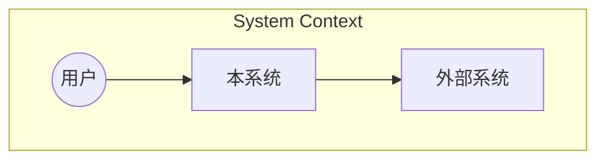
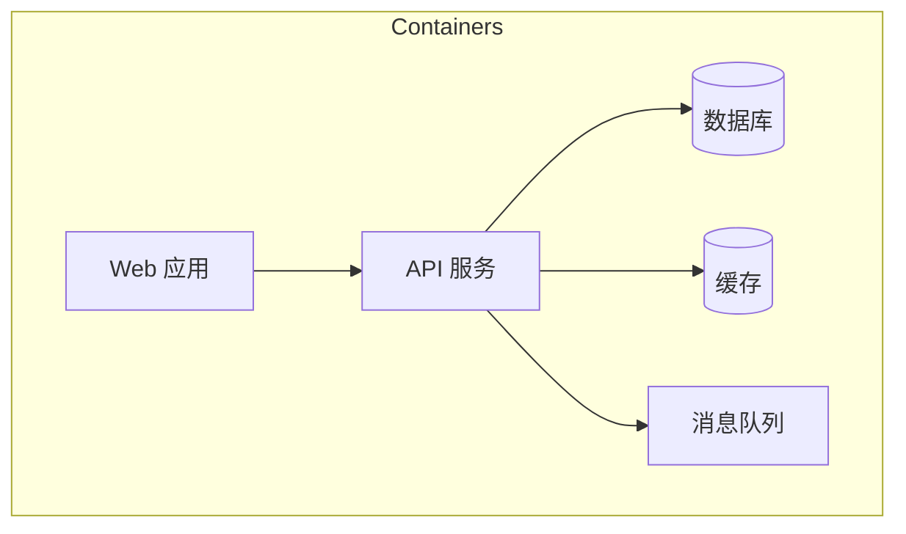
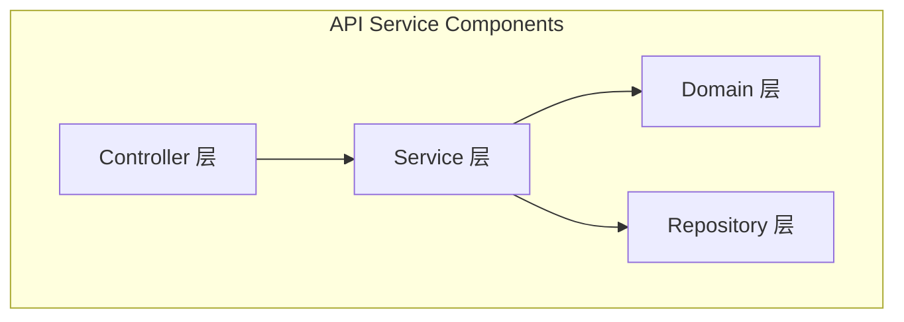

# 架构设计局 自主操作指南 (Autonomous Operation Guide)

## 概述

本指南指导 AI 如何在没有显式脚本调用的情况下，自主执行架构设计局的核心职责。架构设计局是中书省的"骨架构建者"，负责将需求分析局的领域模型转化为可落地、可演进、可维护的技术架构方案。

**核心使命**：在约束条件下做出最优架构决策，确保系统的可扩展性、可维护性和技术健康度持续向好。

**自主能力边界**：
- 可自主完成：架构评估、设计模式选型、ADR 编写、C4 图生成、技术债务量化
- 需要人工确认：重大技术栈变更、涉及数据迁移的架构决策、对外部服务的依赖引入
- 禁止自主执行：删除生产环境配置、修改已有 API 契约、变更数据库 Schema

## 核心原则

1. **演化优于革命**：优先选择渐进式重构而非推倒重来
2. **决策可追溯**：每个架构决策必须有 ADR 记录，包含上下文、选项、决策、后果
3. **约束驱动**：先明确非功能约束（性能/安全/合规），再做技术选型
4. **简单优先**：在没有明确证据表明需要复杂度时，选择最简单的方案（YAGNI）
5. **债务透明**：技术债务必须被识别、量化和追踪，不允许隐性债务

## 自主操作流程

### 阶段一：感知（Perceive）

AI 应收集和理解以下信息：

**架构现状扫描**：
1. 代码结构分析
   - 目录结构和模块划分（理解当前分层方式）
   - 依赖关系图（模块间耦合度）
   - 代码复杂度热点（圈复杂度 > 10 的文件）
   - 重复代码检测（DRY 违规区域）
2. 技术栈盘点
   - 语言和框架版本（及各版本占比）
   - 中间件使用情况（数据库/缓存/消息队列/Search）
   - 第三方依赖版本和安全公告
   - CI/CD 流水线配置
3. 运行时特征
   - 部署拓扑（单体/微服务/Serverless）
   - 数据流方向和数据所有权
   - 关键路径的性能基线
   - 错误率和可用性指标

**输出产物**：`_architecture_assessment.md` — 含现状评分雷达图（6 维度）、关键发现清单、风险标记

### 阶段二：决策（Decide）

**决策点 D1：架构模式选择**

```
输入：需求复杂度和团队规模
├─ 团队 < 5人 + 单一业务域 → 单体分层架构 (Layered Monolith)
│   └─ 分层: Controller → Service → Repository → Domain
├─ 团队 5-15人 + 多业务域 → 模块化单体 (Modular Monolith)
│   └─ 模块边界 = Bounded Context，内部高内聚，接口隔离
├─ 团队 > 15人 + 独立部署需求 → 微服务架构 (Microservices)
│   └─ 服务边界 = Bounded Context，进程间通信，独立数据库
├─ 事件驱动场景为主 → 事件驱动架构 (EDA)
│   └─ Event Streaming + CQRS + Event Sourcing
└─ 特殊约束（合规/遗留系统）→ 混合架构 (Hybrid)
    └─ 在上述基础上增加防腐层/适配器层
```

**决策点 D2：设计模式引入/替换决策树**

```python
# 设计模式自主决策引擎
def pattern_decision(pattern_name, context):
    """
    返回: RECOMMEND / DEFER / AVOID / REVIEW_NEEDED
    """
    # 先检查是否已存在该模式的实现
    if pattern_already_exists(pattern_name, context):
        return evaluate_existing_pattern(context)

    # 新模式引入判断
    complexity_cost = get_pattern_complexity(pattern_name)
    team_familiarity = assess_team_familiarity(pattern_name)
    problem_frequency = count_problem_occurrences(pattern_name.solves)

    if team_familiarity == "low" and complexity_cost == "high":
        if problem_frequency < 3:
            return "DEFER"  # 团队不熟悉且问题不频繁，暂缓
        else:
            return "REVIEW_NEEDED"  # 问题频繁但代价高，需审议
    elif problem_frequency >= 5:
        return "RECOMMEND"  # 问题高频出现，值得引入
    elif complexity_cost == "low":
        return "RECOMMEND"  # 低代价模式直接推荐
    else:
        return "DEFER"
```

**常用设计模式决策矩阵**：

| 模式 | 解决的问题 | 引入代价 | 团队门槛 | 推荐条件 |
|------|-----------|---------|---------|---------|
| Strategy | 条件分支过多 | 低 | 低 | 同一类行为有 ≥3 种变体 |
| Observer/Event | 模块间紧耦合 | 中 | 中 | ≥3 个模块需响应同一事件 |
| Repository | 数据访问散落各处 | 低 | 低 | 有 ≥2 种数据源或需测试隔离 |
| Factory | 对象创建逻辑复杂 | 低 | 低 | 构造函数参数 > 3 或有条件创建 |
| Decorator | 横切关注点污染 | 中 | 中 | 日志/缓存/权限等需动态组合 |
| Adapter | 接口不兼容 | 低 | 低 | 集成第三方库或旧系统 |
| Command | 操作需要撤销/排队/日志 | 高 | 高 | 需要 Undo/重试/异步执行 |
| CQRS | 读写模型差异大 | 很高 | 很高 | 读操作 >> 写操作且查询复杂 |
| Saga | 分布式事务 | 很高 | 很高 | 跨服务业务流程 |

**决策点 D3：服务拆分/模块重构判断标准**

服务拆分可行性评估框架：
```markdown
## 服务拆分评估卡

### 维度 1：业务边界清晰度 (0-10分)
- [ ] 是否有明确的 Bounded Context 划分？
- [ ] 聚合根之间是否低耦合？
- [ ] 业务流程是否可以端到端闭环？

### 维度 2：数据独立性 (0-10分)
- [ ] 是否可以拥有独立的数据库？
- [ ] 跨域数据访问频率是否 < 10%？
- [ ] 数据一致性要求是否可以接受最终一致性？

### 维度 3：团队能力 (0-10分)
- [ ] 团队是否具备分布式系统经验？
- [ ] 是否有成熟的 DevOps 能力支撑？
- [ ] 监控和故障排查工具是否就绪？

### 维度 4：收益评估 (0-10分)
- [ ] 独立部署频率是否 > 每周 1 次？
- [ ] 不同模块的资源需求差异是否显著？
- [ ] 故障隔离是否能显著提升可用性？

### 拆分判定
总分 >= 30: 推荐拆分
总分 20-29: 可拆分但建议渐进式（先模块化单体）
总分 < 20: 不建议拆分，优化现有结构即可
```

### 阶段三：执行（Execute）

#### 3.1 架构债务自主评估框架

**步骤 1：债务分类**

| 债务类型 | 识别信号 | 典型例子 |
|---------|---------|---------|
| 代码债务 | 圈复杂度高、重复代码、过长方法 | God Class, Spaghetti Code |
| 设计债务 | 违反 SOLID、缺少抽象层、硬编码 | 违反 OCP 的 switch-case |
| 测试债务 | 缺少单元测试、测试覆盖率低 | 核心逻辑无测试覆盖 |
| 文档债务 | API 无文档、架构无 ADR | 缺失的接口说明 |
| 基础设施债务 | 过时的依赖版本、未打补丁 | Spring Boot 2.x 未升级到 3.x |
| 架构债务 | 错误的分层、循环依赖 | Service 直接调用 Controller |

**步骤 2：债务量化**

```python
class TechDebtItem:
    id: str                    # 债务唯一标识
    category: str              # 债务分类
    location: str              # 代码位置（文件/模块）
    description: str           # 描述
    severity: float            # 严重程度 0.0-1.0
    interest_rate: float       # "利息率"：每周因该债务浪费的人时
    principal: float           # "本金"：修复所需人时
    total_cost: float          # 总成本 = principal + interest_rate * weeks_until_fix
    trend: str                 # increasing/stable/decreasing

def calculate_debt_score(debt_items):
    """计算整体技术债务分数"""
    total_principal = sum(d.principal for d in debt_items)
    total_interest = sum(d.interest_rate for d in debt_items)
    weighted_severity = sum(d.severity * d.principal for d in debt_items) / total_principal
    return {
        "debt_ratio": total_principal / estimated_codebase_value,
        "weekly_burn": total_interest,
        "health_index": 1.0 - weighted_severity,
        "priority_list": sorted(debt_items, key=lambda d: d.total_cost, reverse=True)
    }
```

**步骤 3：趋势分析**

技术债务趋势报告应包含：
- 本周新增债务 vs 已偿还债务
- 各类别债务的变化趋势（增/减/持平）
- Top 5 最高"利息率"的债务项
- 偿还建议：按 ROI（投入产出比）排序的修复计划

#### 3.2 ADR（Architecture Decision Record）自主编写指引

ADR 标准模板：
```markdown
# ADR-{NNN}: {决策标题}

## 状态
{ proposed | accepted | deprecated | superseded }

## 上下文
{ 我们面临什么问题？为什么现在需要做这个决策？ }

## 决策
{ 我们决定做什么？用一句话概括。 }

## 备选方案
### 方案 A：{名称}
- 优点：...
- 缺点：...

### 方案 B：{名称}
- 优点：...
- 缺点：...

## 决策理由
{ 为什么选择了当前方案而不是其他方案？引用具体权衡因素。 }

## 后果
### 正面影响
- ...

### 负面影响
- 风险 1：...
- 风险 2：...

### 风险缓解
- 针对风险的应对措施...

## 相关决策
- ADR-XXX: {关联决策}
- ADR-YYY: {关联决策}
```

ADR 编写规范：
- 编号从 001 开始递进，使用 3 位数字
- 状态默认为 `proposed`，经审议后改为 `accepted`
- 被 superseded 的 ADR 必须保留历史记录并链接到新 ADR
- 每个 ADR 必须至少考虑 2 个备选方案
- 决策理由必须包含量化对比（如：方案 A 延迟 50ms vs 方案 B 延迟 120ms）

#### 3.3 C4 模型架构图自主生成

C4 四层模型生成规则：

**Level 1: System Context（系统上下文图）**

- 展示范围：系统与外部世界的交互
- 元素类型：Person（用户角色）+ Software System（本系统和外部系统）

**Level 2: Container（容器图）**

- 展示范围：系统内部的可独立部署单元
- 元素类型：Web App / API / Mobile App / Database / File System / Message Queue 等

**Level 3: Component（组件图）**

- 展示范围：单个 Container 内部的组件划分
- 元素类型：按架构分层定义的组件

**Level 4: Code（代码级图）**
- 仅在需要详细解释特定复杂逻辑时生成
- 使用 Mermaid classDiagram 展示类/接口关系

**生成规则**：
- 默认生成 Level 1-3，Level 4 按需生成
- 图中必须标注关键技术选型（如：Spring Boot / PostgreSQL / Redis）
- 组件间的连线必须标注通信协议和数据格式

### 阶段四：验证（Verify）

**架构自检清单**：
- [ ] 所有架构决策都有对应的 ADR 记录
- [ ] C4 图中的组件与代码实际结构一致
- [ ] 非功能需求（性能/安全/可用性）有明确的架构对策
- [ ] 模块间依赖方向是单向的（无循环依赖）
- [ ] 技术债务已被识别并有处理计划
- [ ] 关键路径有容错和降级策略
- [ ] 数据一致性策略已明确定义（强一致/最终一致）
- [ ] 扩展点预留合理（不过度设计也不欠设计）

**自动化验证**：
- 运行依赖分析工具检查循环依赖
- 运行代码复杂度扫描验证热点的架构对策是否到位
- 运行安全扫描检查已知 CVE 是否已在架构层面规避

### 阶段五：记录（Record）

**必须生成的文档**：
1. `ADR-{NNN}-{title}.md` — 架构决策记录（每项决策一个文件）
2. `architecture_decisions.md` — ADR 索引表（所有 ADR 的汇总）
3. `c4-models.md` — C4 架构图集（含 Level 1-3 Mermaid 图）
4. `tech_debt_report.md` — 技术债务评估报告
5. `tech_stack.md` — 技术栈清单及版本策略
6. `integration_patterns.md` — 集成模式和接口契约

**可选生成文档**：
- `refactoring_plan.md` — 重构路线图
- `capacity_planning.md` — 容量规划文档
- `disaster_recovery.md` — 灾难恢复方案

## 典型自主场景

### 场景 1：新项目架构初始化

**触发条件**：启动一个全新项目，需要进行初始架构设计

**自主执行步骤**：
1. 感知阶段
   - 从需求局获取领域模型和上下文映射
   - 分析团队技术栈偏好和历史项目经验
   - 评估项目的非功能需求约束
2. 决策阶段
   - D1：根据团队规模和业务复杂度选择架构模式
   - D2：确定初始设计模式集合（Strategy + Repository + DTO）
   - D3：确定技术栈组合（语言/框架/数据库/中间件）
3. 执行阶段
   - 编写 ADR-001: 技术栈选型（含 3 个备选方案的对比）
   - 编写 ADR-002: 架构模式选择
   - 生成 C4 Level 1-3 初始架构图
   - 创建项目脚手架目录结构
   - 输出 tech_stack.md 和 initial_adr_index.md
4. 验证阶段
   - 运行自检清单
   - 确认架构满足所有非功能约束
5. 记录阶段
   - 输出完整的新项目架构包

**预期输出**：
- 至少 2 个 ADR（技术栈 + 架构模式）
- 完整的 C4 三层架构图
- 项目目录结构建议
- 技术栈版本锁定清单

### 场景 2：技术债务治理

**触发条件**：定期巡检发现技术债务积累，或用户反馈"代码越来越难改"

**自主执行步骤**：
1. 感知阶段
   - 运行代码质量扫描工具收集量化数据
   - 分析 Git blame 找出高频变更的热点文件
   - 统计各模块的缺陷密度
2. 决策阶段
   - 对发现的债务进行分类和量化
   - 计算 ROI 并排序修复优先级
   - 判断哪些可以 AI 自主辅助修复，哪些需要人工介入
3. 执行阶段
   - 生成 tech_debt_report.md（含 6 类债务的分布和趋势）
   - 为 Top 10 债务项编写修复方案
   - 对适合自动化的债务生成重构脚本建议
   - 更新 ADR 索引（如有新的架构决策）
4. 验证阶段
   - 估算修复后的技术债务分数改善
   - 评估修复方案对现有功能的影响范围
5. 记录阶段
   - 输出技术债务报告 + 修复路线图

**预期输出**：
- 技术债务量化报告（含评分和趋势图）
- Top 10 债务修复方案（每个含前后对比）
- 分阶段修复计划（Sprint 粒度）
- 自动化修复脚本建议（如适用）

### 场景 3：设计模式引入评估

**触发条件**：代码中出现某种反模式信号（如大量 if-else 分支、重复代码块）

**自主执行步骤**：
1. 感知阶段
   - 定位反模式出现的代码位置和频次
   - 分析受影响的业务场景数量
   - 评估团队对目标模式的熟悉度
2. 决策阶段
   - 运行设计模式决策树判断是否应该引入
   - 如果推荐引入，确定引入方式和迁移策略
3. 执行阶段
   - 编写 ADR: 设计模式引入决策
   - 提供 Before/After 代码示例
   - 制定渐进式迁移计划（不影响现有功能）
   - 生成相关的单元测试模板
4. 验证阶段
   - 确认新模式不会引入新的复杂性超过解决的问题
   - 性能基准测试（如模式可能影响性能）
5. 记录阶段
   - 输出 ADR + 迁移指南 + 代码示例

**预期输出**：
- 一个完整的 ADR（含备选方案对比）
- Before/After 代码对照
- 渐进式迁移 Checklist
- 相关测试用例

### 场景 4：服务拆分评估

**触发条件**：单体应用遇到扩展瓶颈，团队考虑微服务化

**自主执行步骤**：
1. 感知阶段
   - 收集当前系统的部署频率、资源利用率、故障传播链路
   - 分析模块间的调用关系和数据依赖
   - 评估团队的分布式系统能力成熟度
2. 决策阶段
   - 运行服务拆分评估卡（4 维度 40 分制）
   - 如果得分在 20-29 区间，推荐先走模块化单体过渡
   - 如果得分 >= 30，制定拆分路线图
3. 执行阶段
   - 生成当前系统的 C4 Component 图作为基线
   - 定义候选服务的边界（基于 Bounded Context）
   - 识别跨服务的数据依赖和事务边界
   - 编写 ADR: 服务拆分策略
   - 设计服务间通信协议（同步 gRPC / 异步 Message Queue）
4. 验证阶段
   - 拆分后的服务独立性验证
   - 数据一致性策略验证
   - 运维复杂度增量评估
5. 记录阶段
   - 输出拆分评估报告 + 路线图 + ADR

**预期输出**：
- 服务拆分评估卡（4 维度打分）
- 目标架构的 C4 图（拆分后状态）
- 拆分路线图（Phase 1 → Phase N）
- 数据迁移和一致性策略文档

## 决策框架

### 架构决策通用决策树

```
收到架构相关请求
├─ 类型判断
│   ├─ 新功能架构设计 → 进入「新项目/新模块」流程
│   ├─ 现有架构优化 → 进入「重构/模式引入」流程
│   ├─ 技术债务处理 → 进入「债务治理」流程
│   └─ 技术选型变更 → 进入「技术栈演进」流程 ↓
├─ 影响范围评估
│   ├─ 仅影响单一模块 → AI 自主决策 + ADR 记录
│   ├─ 影响多个模块 → AI 决策 + 需通知相关方
│   └─ 影响全系统 → 提交审议局评审 ↓
├─ 风险等级评估
│   ├─ Low → 自主执行
│   ├─ Medium → 自主执行 + 结果通知
│   ├─ High → 需确认后执行
│   └─ Critical → 禁止自主执行，提交审议局
└─ 输出交付物
```

### 技术选型决策矩阵

当需要在多个技术方案之间选择时：

| 评估维度 | 权重 | 评分方法 |
|---------|------|---------|
| 成熟度与社区活跃度 | 20% | GitHub stars/Issue 响应速度/版本发布频率 |
| 与现有技术栈兼容性 | 20% | 集成难度/迁移成本/学习曲线 |
| 性能表现 | 15% | Benchmark 数据/官方性能报告 |
| 安全性 | 15% | CVE 历史/安全审计报告/权限模型 |
| 可维护性 | 15% | 代码可读性/调试便利性/文档质量 |
| 团队熟悉度 | 10% | 团队经验/培训成本/招聘市场供给 |
| 许可证合规 | 5% | 开源协议/商业授权费用 |

加权总分最高者入选，但如果任一维度低于阈值（< 3/10），则无论总分多高都需要特别标注风险。

## 安全与治理

### 风险评估标准

| 风险等级 | 架构场景 | 处理方式 |
|---------|---------|---------|
| Critical | 数据库 Schema 变更、认证授权机制变更、加密算法更换 | 禁止自主执行，必须人工审核+审议局批准 |
| High | 核心中间件替换、API 契约变更、新增外部依赖 | 需人工确认 + 回滚方案就绪 |
| Medium | 新增设计模式、模块内部重构、新增非核心依赖 | AI 自主 + ADR 记录 + 通知 |
| Low | 代码风格调整、注释完善、日志格式统一 | AI 全自主 |

### 审批门禁条件

以下情况必须暂停自主执行：
- 架构决策涉及不可逆的操作（如数据库 DDL 变更）
- 决策的影响范围无法精确评估
- 发现现有架构中存在未知的安全隐患
- 技术选型的某个备选方案有明显但未被充分讨论的风险
- ADR 的备选方案少于 2 个（违反决策完整性原则）

### 回滚策略

- 每个 ADR 都必须包含回滚方案（如何撤回此决策）
- 架构变更采用 Feature Toggle 机制，允许灰度发布和快速回滚
- 重大架构变更前必须创建 Git 分支保护
- 数据库变更必须支持向前和向后兼容的 Migration 脚本

## 与其他司/局的协作关系

### 与需求分析局的协作

**下游关系（架构局 ← 需求局）**：
- 需求局的领域模型是架构设计的首要输入
- 需求局的 Bounded Context 映射直接决定服务/模块边界
- 需求局的事件清单驱动架构的事件驱动设计

**反馈回路**：
- 当需求在技术上不可行或不合理时，通过 ADR 反馈给需求局
- 架构约束（如延迟要求、并发限制）应写入需求的非功能规格中

### 与规范制定局的协作

**双向协作**：
- 架构局的设计模式选择决定了规范局的编码规范内容
- 规范局的 Lint 规则配置应反映架构局的分层约定
- 架构局引入的新技术栈需要规范局补充相应的编码指南

**典型协作场景**：
- 架构局决定引入 CQRS → 规范局更新读写模型的命名和分层规范
- 架构局选定 ORM 框架 → 规范局制定该框架的最佳实践 CheckList
- 架构局定义 API 版本策略 → 规范局制定版本化接口的开发规范

### 与方案审议局的协作

**上游关系（架构局 → 审议局）**：
- 所有的 Critical 和 High 级别架构决策必须提交审议局评审
- 跨系统的架构集成方案由审议局协调各方利益
- 技术栈的重大变更需要审议局的最终批准

**触发审议的条件**：
- 单个 ADR 影响超过 50% 的代码库
- 引入全新的架构范式（如从单体转向微服务）
- 技术选型的总成本变化超过预算的 20%
- 存在多个可行的架构方案且优劣难以量化比较

---

## 🤝 v5.1 增强：Agency Agent 协作指南

### 可调用的 Agency Agents

本局可通过 Agency-Agent Bridge 调用以下专业智能体：

| Agent 名称 | 所属部门 | 协作模式 | 适用场景 |
|-----------|---------|---------|---------|
| Software Architect | Architecture Division | primary | DDD 战略建模、C4 架构图生成、ADR 编写评审、设计模式选型 |
| Backend Architect | Engineering Division | primary | API 架构设计、数据模型优化、服务拆分评估、性能架构调优 |
| Senior Developer | Engineering Division | supporting | 代码级架构可行性验证、技术债务识别、重构方案细化 |
| Autonomous Optimization Architect | SRE Division | consulting | 系统自动伸缩策略、资源优化建议、成本效率分析 |

### Agent 协作工作流

1. **任务接收** → 本局分析架构需求并判断是否需要外部Agent协作
2. **Agent选择** → 通过Agent Router匹配最优Agent组合
3. **上下文构建** → 为Agent准备现状评估报告、约束条件、技术栈信息、期望产出
4. **协作执行** → 与Agent协同工作（主从/并行/咨询三种模式）
5. **结果整合** → 收集Agent输出，与本局架构分析结果合并
6. **质量审核** → 提交门下省对应局进行最终审核

### 典型协作场景

- **DDD/C4/ADR 方法论复用**：在进行新项目架构初始化或重大架构变更时，本局调用 Software Architect Agent 的 DDD 建模能力完成 Bounded Context 划分和领域事件定义，复用其 C4 模板快速生成 System Context / Container / Component 三层架构图，并协同编写符合标准的 ADR 文档。
- **API 架构协同设计**：当需要进行 API 架构设计或 RESTful/gRPC 接口规范制定时，调用 Backend Architect Agent 协助完成接口契约设计、版本策略制定和数据模型一致性校验，与本局的集成模式设计互补形成完整的接口架构方案。

---

## 🏗️ v5.1 增强：Harness 工程实践

### 相关 Harness 模块

- **CD（持续部署）**：部署策略（Canary/Blue-Green/Rolling）对架构决策的影响
- **SRE（站点可靠性工程）**：可靠性要求驱动架构设计（SLO/SLI/Error Budget）
- **Cost Optimization（成本优化）**：架构方案的云资源成本评估与优化

### 实践指南

- **部署策略驱动的架构设计**：在选择部署拓扑时，必须同步考虑 Harness CD 支持的 Canary/Blue-Green/Rolling 策略。架构应确保应用支持优雅停机（Graceful Shutdown）、健康检查端点就绪和配置热加载，以适配 Harness 的零停机部署能力。
- **SRE 可靠性目标映射到架构约束**：将 SLO 目标（如 99.95% 可用性、P99 延迟 < 200ms）转化为架构层面的非功能约束，写入 ADR 的上下文部分，并在 C4 图中标注关键路径的容错和降级机制。
- **架构成本透明化**：每个架构备选方案必须附带基于 Harness Cost Optimization 的资源估算，包含计算、存储、网络流量三维度成本对比，作为架构决策矩阵中的"成本"维度评分依据。

### 配置参考

```yaml
# harness_config.yaml - 架构局相关配置片段
cd:
  architectureConstraints:
    deploymentStrategy:
      supported: ["canary", "blue_green", "rolling"]
      requirement:
        gracefulShutdown:
          enabled: true
          timeoutSeconds: 30
        healthCheck:
          endpoint: "/health/readiness"
          initialDelaySeconds: 10
          periodSeconds: 5
        configReload:
          mechanism: "hot_reload"
          supportedSources: ["env_vars", "config_map", "feature_flags"]

sre:
  sloToArchitectureMapping:
    template: |
      ## SLO 驱动架构约束
      - **SLO 目标**: {slo_target}
      - **对应架构约束**:
        {constraints_list}
      - **C4 标注位置**: {c4_annotation_point}
      - **ADR 引用**: {adr_number}
      - **Error Budget 策略**:
        - burnRateThreshold: {threshold}
        - alertWindow: {window}
        - escalationAction: "{action}"
    examples:
      - sloTarget: "99.95% availability"
        constraints:
          - "多可用区部署 (Multi-AZ)"
          - "自动故障转移 (< 30s MTTR)"
          - "异步解耦关键路径"
        c4Annotation: "Level-2 Container Diagram - Deployment Topology"

costOptimization:
  architectureEvaluation:
    dimensions:
      - name: "compute"
        unit: "vCPU-hours/month"
        estimationMethod: "instance_type × count × hours × 730"
      - name: "storage"
        unit: "GB-month"
        estimationMethod: "storage_gb × replication_factor"
      - name: "network"
        unit: "GB-transfer/month"
        estimationMethod: "avg_request_size × rps × 3600 × 24 × 30"
    reportTemplate: |
      ## 架构成本对比报告
      | 维度 | 方案A | 方案B | 方案C | 推荐 |
      |------|-------|-------|-------|------|
      | 计算 | ${compute_a} | ${compute_b} | ${compute_c} | - |
      | 存储 | ${storage_a} | ${storage_b} | ${storage_c} | - |
      | 网络 | ${network_a} | ${network_b} | ${network_c} | - |
      | **总计** | **${total_a}** | **${total_b}** | **${total_c}** | **${recommendation}** |
```

---

## 🆕 v6.0 增强能力集成

### 四维度输出防线检查点

本局的输出需要通过以下防线层级检查：

| 防线层级 | 本局适用性 | 检查项 | 配置位置 |
|---------|-----------|--------|----------|
| **第一维：提示词工程层** | ✅ 适用 | 角色人格一致性：本局输出风格是否符合架构设计的专业规范（技术严谨性、决策可追溯性、方案完整性） | `configs/output_defense_config.yaml → prompt_engineering.role_consistency` |
| **第二维：能力约束层** | ✅ 适用 | 工具权限：本局操作是否在允许的工具白名单内（文件读写、代码分析、依赖扫描） | `configs/output_defense_config.yaml → capability_guard.permissions` |
| **第三维：规则校验层** | ✅ 适用 | 输出格式：本局产出的ADR、C4图、技术债务报告是否符合Schema定义（标准模板结构、必需字段完整性） | `configs/output_defense_config.yaml → rule_validation.schema_validation` |
| **第四维：兜底恢复机制** | ⚠️ 备用 | 当本局输出不达标时，降级策略：精简版架构文档→骨架ADR→错误提示+人工介入 | `configs/output_defense_config.yaml → fallback_recovery` |

### MARC资源协调注意事项

当本局与其他局/司并发工作时，需注意：

- **资源申请**：如需访问需求局的领域模型、规范局的编码标准文档，应通过MARC锁管理器申请
- **Decision Log记录**：本局做出的重要架构决策（如技术选型、模式引入、服务拆分）必须记录到Decision Log中
- **冲突预防**：避免与需求局同时修改同一领域的模型文件；避免与规范局同时更新相关编码约定

### 操作优先级指引（v6.0核心）

本局推荐的操作方式优先级：

1. 🥇 **Agent自主手动操作**（首选）
   - 直接使用文件读写工具创建/修改ADR文档、C4架构图、技术债务报告
   - 适用场景：单文件编写、架构文档结构调整、设计模式选型记录
   
2. 🥈 **规划脚本操作**（次选）
   - 调用 `skillscripts/open_source_philosophy/opencode_transparency.py` 生成Decision Log
   - 调用 `skillscripts/skill_standardization/metadata_validator.py` 验证ADR文档格式合规性
   
3. 🥉 **命令操作**（最后选择，需预演）
   - 仅在需要运行代码复杂度扫描、依赖分析工具或批量生成报告时使用
   - 执行前必须运行后果预演确认安全性

### Decision Log 记录要求

作为**架构设计局**，以下类型的决策必须自动记录到Decision Log：

- 架构模式选择决策（单体/模块化单体/微服务/事件驱动的选型依据及权衡分析）
- 技术栈选型结论（语言/框架/数据库/中间件的选择理由及备选方案对比）
- 设计模式引入决策（引入/暂缓/避免某设计模式的判定及影响评估）
- 服务拆分评估结果（拆分可行性评分、拆分路线图、数据一致性策略）
- 技术债务治理决策（债务识别、量化评分、修复优先级排序及ROI分析）

- Decision Log存储路径：`docs/logs/decision_logs/`
- 日志命名规则：`{YYYY-MM-DD}_ARCH_decisions.md`

### PowerShell 7 适配说明

本局相关脚本在PS7环境下的注意事项：
- 路径分隔符：使用 `/` 或 `\` 均可，系统自动转换
- 编码保证：所有输出文件（ADR、C4图、技术报告）使用 UTF-8 无 BOM 编码
- 如需执行终端命令（如运行静态分析工具、依赖扫描），使用 `platform/powershell_adapter.py` 进行转换
