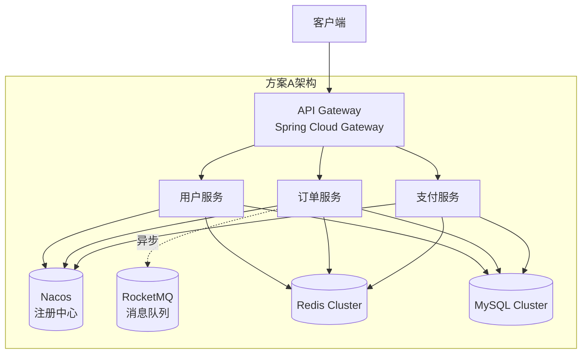
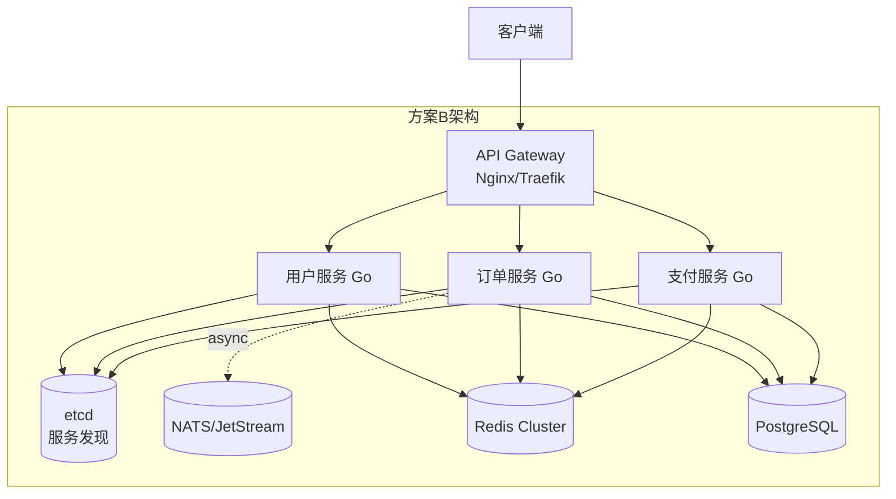
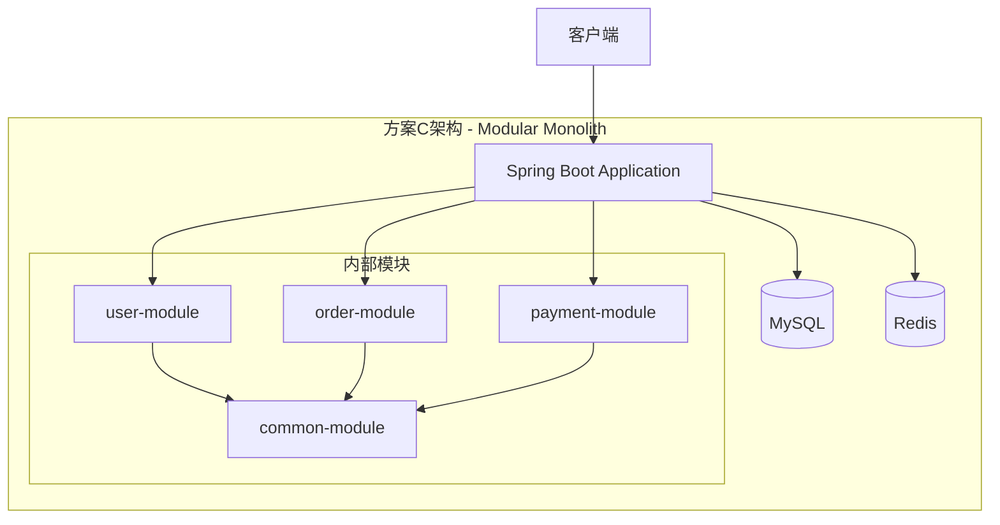
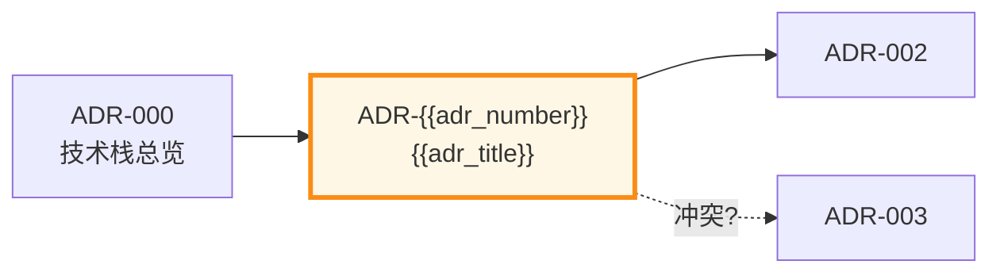

<!--
  模板说明: ADR (Architecture Decision Record) 架构决策记录
  用途: 记录重要的架构技术决策及其背景、选项对比和影响分析，确保决策可追溯
  变量列表:
    {{adr_number}}           - ADR编号 (如 ADR-001)
    {{adr_title}}            - 决策标题
    {{adr_status}}           - 状态 (Proposed/Accepted/Deprecated/Superceded)
    {{decision_date}}        - 决策日期
    {{deciders}}             - 决策参与者
    {{context}}              - 当前背景/问题陈述
    {{options}}              - 候选方案列表（至少3个）
    {{decision}}             - 最终决策及理由
    {{consequences_positive}}- 正面影响
    {{consequences_negative}}- 负面影响
    {{related_adrs}}         - 相关ADR引用
    {{references}}           - 参考链接
  使用方式: 每个重要架构决策创建一个ADR文件，文件名格式为 NNNR-标题.md
  参考: Michael Nygard's ADR format, https://adr.github.io/
-->

# ADR-{{adr_number | default('001')}}: {{adr_title | default('[决策标题]')}}

> **状态**: {{adr_status | default('Proposed')}} | **日期**: {{decision_date | default('YYYY-MM-DD')}}
> **决策者**: {{deciders | default('架构组 / Tech Lead')}}

---

## 📌 状态图

```
Proposed → Accepted → ✅ (长期有效)
                ↓
          Deprecated → Superceded by ADR-XXX
```

当前状态: **{{adr_status | default('🔵 Proposed - 待讨论')}}**

---

## 1. Context（背景与问题）

<!-- COMMENT: 描述做这个决策的上下文，以及需要解决的核心问题是什么 -->

{{context}}

**示例背景**:

{{project_name | default('本项目')}} 当前处于 {{project_phase | default('系统设计阶段')}}。团队需要在以下方面做出技术选型：

### 1.1 问题陈述

<!-- COMMENT: 清晰定义要解决的问题，使用 INVEST 原则确保问题可验证 -->

> **问题**: {{problem_statement | default('我们需要选择一种适合项目需求的技术方案来解决 [具体问题]，当前面临以下挑战：')}}

| 挑战维度 | 具体描述 |
|----------|----------|
| **业务需求** | <!-- COMMENT: 业务层面要求 --> 需支持高并发读写，预计QPS达到10,000+ |
| **技术约束** | <!-- COMMENT: 技术层面的限制 --> 团队熟悉Java生态，但也在评估Go语言方案 |
| **性能目标** | <!-- COMMENT: 性能指标要求 --> P99延迟 < 100ms，吞吐量 > 5000 TPS |
| **运维能力** | <!-- COMMENT: 运维团队能力 --> 目前有2名DevOps，K8s经验有限 |
| **成本预算** | <!-- COMMENT: 成本考量 --> 月度云资源预算 ≤ ¥50,000 |

### 1.2 影响范围

此决策将影响以下模块/组件：

- [ ] 前端应用层
- [ ] API网关层
- [ ] 核心服务层
- [ ] 数据存储层
- [ ] 基础设施层
- [ ] DevOps流水线
- [ ] 其他: _________________

---

## 2. Considered Options（候选方案）

<!-- COMMENT: 列出至少3个候选方案，每个方案需包含优缺点对比。建议使用决策矩阵进行量化评分 -->

### 方案 A: {{option_a_name | default('[方案A名称]')}}

#### 描述

{{option_a_description | default('详细描述方案A的技术实现思路、架构模式、关键组件等')}}

**示例描述**:
采用微服务架构，基于Spring Cloud Alibaba体系构建。各业务领域拆分为独立服务，通过Nacos进行服务注册与发现，Sentinel负责流量控制与熔断降级，RocketMQ处理异步消息。

#### 架构图



#### 优势 (Pros)

| # | 优势 | 详细说明 |
|---|------|----------|
| 1 | 🟢 生态成熟 | Spring Cloud拥有丰富的开源组件和生产级案例 |
| 2 | 🟢 团队熟悉 | 团队成员均有3年以上Java/Spring经验 |
| 3 | 🟢 社区活跃 | 遇到问题可快速找到解决方案 |
| 4 | 🟢 可观测性好 | 与Prometheus/Grafana/ELK集成完善 |

#### 劣势 (Cons)

| # | 劣势 | 影响程度 | 缓解措施 |
|---|------|----------|----------|
| 1 | 🔴 资源占用高 | JVM内存开销大 | 容器资源合理配置 |
| 2 | 🔴 启动较慢 | Spring Boot冷启动5-15s | GraalVM Native Image |
| 3 | 🟡 复杂度高 | 微服务治理复杂 | 引入Service Mesh简化 |

#### 评分

| 维度 | 评分(1-5) | 说明 |
|------|-----------|------|
| 技术成熟度 | ⭐⭐⭐⭐⭐ | 生产级成熟方案 |
| 开发效率 | ⭐⭐⭐⭐ | 框架约定减少样板代码 |
| 性能表现 | ⭐⭐⭐ | JVM GC存在延迟毛刺 |
| 运维复杂度 | ⭐⭐⭐ | 微服务数量多时运维压力大 |
| 成本控制 | ⭐⭐⭐ | Java内存需求较高 |
| **总分** | **21/30** | |

---

### 方案 B: {{option_b_name | default('[方案B名称]')}}

#### 描述

{{option_b_description | default('详细描述方案B的技术实现思路、架构模式、关键组件等')}}

**示例描述**:
采用Go语言 + gRPC微服务架构。核心服务使用Go编写以获得高性能，通过gRPC实现服务间通信，使用etcd作为服务注册中心，Gin/Echo框架处理HTTP API。

#### 架构图



#### 优势 (Pros)

| # | 优势 | 详细说明 |
|---|------|----------|
| 1 | 🟢 高性能 | Goroutine轻量并发，P99延迟更低 |
| 2 | 🟢 低资源占用 | 单个服务内存仅需50-200MB |
| 3 | 🟢 快速编译部署 | 二进制直接运行，无运行时依赖 |
| 4 | 🟢 云原生友好 | 容器镜像小(10-30MB)，启动快(<100ms) |

#### 劣势 (Cons)

| # | 劣势 | 影响程度 | 缓解措施 |
|---|------|----------|----------|
| 1 | 🔴 学习曲线 | 团队Go经验不足 | 前期培训+结对编程 |
| 2 | 🔴 生态相对较小 | 第三方库不如Java丰富 | 核心库自研或谨慎选型 |
| 3 | 🟡 错误处理繁琐 | 大量 `if err != nil` | 使用错误包装库改进 |

#### 评分

| 维度 | 评分(1-5) | 说明 |
|------|-----------|------|
| 技术成熟度 | ⭐⭐⭐⭐ | Go 1.22+已非常稳定 |
| 开发效率 | ⭐⭐⭐ | 错误处理增加代码量 |
| 性能表现 | ⭐⭐⭐⭐⭐ | 天生适合高并发场景 |
| 运维复杂度 | ⭐⭐⭐⭐ | 二进制部署简单 |
| 成本控制 | ⭐⭐⭐⭐⭐ | 资源利用率极高 |
| **总分** | **23/30** | |

---

### 方案 C: {{option_c_name | default('[方案C名称]')}}

#### 描述

{{option_c_description | default('详细描述方案C的技术实现思路（可以是混合方案或保守方案）')}}

**示例描述**:
采用单体架构优先策略（Modular Monolith）。初期使用Spring Boot单体应用快速交付，内部按DDD领域划分模块边界。当明确出现性能瓶颈或团队规模扩大后，再逐步拆分为微服务。

#### 架构图



#### 优势 (Pros)

| # | 优势 | 详细说明 |
|---|------|----------|
| 1 | 🟢 快速交付 | 无分布式复杂性，开发调试简单 |
| 2 | 🟢 部署简单 | 单一制品物，CI/CD流水线简洁 |
| 3 | 🟢 事务一致性强 | 本地事务即可保证数据一致性 |
| 4 | 🟢 团队门槛低 | 不需要掌握分布式系统知识 |

#### 劣势 (Cons)

| # | 劣势 | 影响程度 | 缓解措施 |
|---|------|----------|----------|
| 1 | 🔴 扩展性受限 | 只能整体水平扩展 | 关键路径异步化 |
| 2 | 🔴 技术债务累积 | 代码耦合风险 | 严格模块化约束 |
| 3 | 🟡 故障隔离差 | 一个Bug可能影响全站 | 熔断机制/Bulkhead |

#### 评分

| 维度 | 评分(1-5) | 说明 |
|------|-----------|------|
| 技术成熟度 | ⭐⭐⭐⭐⭐ | 最传统的可靠方案 |
| 开发效率 | ⭐⭐⭐⭐⭐ | 最快的开发速度 |
| 性能表现 | ⭐⭐⭐ | 受限于单进程 |
| 运维复杂度 | ⭐⭐⭐⭐⭐ | 极简运维 |
| 成本控制 | ⭐⭐⭐⭐⭐ | 单实例即可运行 |
| **总分** | **24/30** | |

---

## 3. Decision Matrix（决策矩阵）

<!-- COMMENT: 对所有候选方案在关键维度上进行加权评分比较 -->

| 评估维度 | 权重 | 方案 A | 方案 B | 方案 C | 备注 |
|----------|:----:|:------:|:------:|:------:|------|
| **性能与扩展性** | 25% | 3.0 | 5.0 | 3.0 | P99延迟、吞吐量 |
| **开发效率** | 20% | 4.0 | 3.0 | 5.0 | 上手速度、编码体验 |
| **运维复杂度** | 15% | 3.0 | 4.0 | 5.0 | 部署、监控、故障排查 |
| **团队匹配度** | 20% | 5.0 | 2.0 | 5.0 | 技术栈熟悉程度 |
| **成本效益** | 10% | 3.0 | 5.0 | 5.0 | 资源消耗、云费用 |
| **风险可控性** | 10% | 4.0 | 3.0 | 5.0 | 技术风险、供应商锁定 |
| **加权总分** | **100%** | **3.65** | **3.60** | **4.20** | **→ 推荐 C** |

---

## 4. Decision（最终决策）

<!-- COMMENT: 明确写出最终选择了哪个方案，以及做出该选择的核心理由 -->

### ✅ 选择方案: **{{final_decision | default('方案 C: Modular Monolith (模块化单体)')}}**

### 决策理由

{{decision_rationale | default('基于以上分析和决策矩阵评分，我们选择方案C，主要理由如下：')}}

1. **🎯 匹配当前阶段**: 项目处于MVP阶段，首要目标是快速验证产品价值而非追求极致性能。Modular Monolith可以在2周内交付可用版本，而微服务方案至少需要6-8周的基建投入。

2. **👥 团队因素**: 团队5人全部精通Java/Spring生态，Go语言学习成本会显著拖慢初期进度。采用熟悉的栈可以最大化开发效率。

3. **💰 成本最优**: 单体应用初期只需2核4G服务器即可运行，月成本约¥500；而微服务方案至少需要3台服务器+中间件，月成本约¥3000+。

4. **🔄 渐进式演进**: Modular Monolith并非最终形态。我们在代码层面保持清晰的模块边界(DDD限界上下文)，当某个模块成为瓶颈时，可以低成本地将其抽取为独立服务（Strangler Fig Pattern）。

5. **✅ YAGNI原则**: "You Aren't Gonna Need It" — 当前阶段不需要微服务的分布式能力，过早引入会增加不必要的复杂度。

### 决策条件/假设

<!-- COMMENT: 此决策成立的前提条件和假设 -->

| # | 假设条件 | 验证方式 | 如果不成立则... |
|---|----------|----------|------------------|
| H1 | QPS < 1000 在未来12个月内 | 业务预估模型 | 重新评估是否需要拆分 |
| H2 | 团队规模不超过10人 | 组织规划 | 考虑引入微服务治理 |
| H3 | 数据量单库可承载 (< 500GB) | 容量规划 | 引入分库分表方案 |
| H4 | 部署频率 < 5次/天 | 发布节奏 | 优化CI/CD流程 |

---

## 5. Consequences（后果分析）

### ✅ 正面影响

{{consequences_positive}}

| 影响 | 详细描述 | 受益方 |
|------|----------|--------|
| **交付加速** | 预计开发周期缩短40%，从14周缩短至8周 | 产品/业务 |
| **降低成本** | 初期基础设施成本降低80% | 财务/Ops |
| **降低风险** | 减少分布式系统的故障面 | 全团队 |
| **提升质量** | 本地事务保证数据一致性，减少分布式事务复杂度 | QA/用户 |
| **易于测试** | 单进程内集成测试简单可靠 | 开发/QA |
| **快速迭代** | 单体部署使发布周期缩短至小时级 | 产品/DevOps |

### ⚠️ 负面影响 / 需要注意的风险

{{consequences_negative}}

| 风险 | 详细描述 | 严重程度 | 缓解计划 |
|------|----------|----------|----------|
| **扩展瓶颈** | 当流量超过单机承载能力时，只能整体水平扩展 | 中 | 关键路径提前识别并准备异步化方案 |
| **技术债务** | 如果模块边界管理不当，可能演变为"大泥球" | 中高 | 强制Code Review + 架构守卫规则 |
| **部署耦合** | 任何一个小改动都需要重新部署整个应用 | 低 | 功能开关(Feature Flag) + 灰度发布 |
| **技术栈锁定** | 后续迁移到其他语言/框架成本较高 | 低 | 保持模块接口清晰，便于抽取 |
| **团队认知** | 可能导致团队缺乏分布式系统经验 | 低 | 安排技术分享和PoC项目 |

---

## 6. Implementation Plan（实施计划）

<!-- COMMENT: 如果决策被接受，简要描述实施步骤和时间安排 -->

| 阶段 | 任务 | 负责人 | 预计时间 | 产出物 |
|------|------|--------|----------|--------|
| Phase 1 | 项目脚手架搭建，确定模块划分 | Tech Lead | 3天 | 项目骨架代码 |
| Phase 2 | 基础设施搭建(DB/Redis/CI) | DevOps | 2天 | 可运行的基础环境 |
| Phase 3 | 核心模块开发 | 全团队 | 4周 | MVP版本 |
| Phase 4 | 性能压测与调优 | Backend Lead | 1周 | 压测报告 |
| Phase 5 | 生产环境部署上线 | Ops | 3天 | 线上运行版本 |

---

## 7. Related ADRs（相关决策引用）

<!-- COMMENT: 引用与此ADR相关的其他架构决策记录 -->

| ADR编号 | 标题 | 关系 | 说明 |
|---------|------|------|------|
| ADR-000 | [模板示例] 项目技术栈总览 | 父决策 | 定义了整体技术方向 |
| ADR-002 | {{related_adr_2 | default('[待定]')}} | {{relation_2 | default('子决策')}} | {{relation_note_2 | default('')}} |
| ADR-003 | {{related_adr_3 | default('[待定]')}} | {{relation_3 | default('关联')}} | {{relation_note_3 | default('')}} |
| <!-- COMMENT: 添加更多相关ADR --> | | | |



---

## 8. References（参考资料）

{{references}}

| 资料 | 链接/引用 | 类型 |
|------|-----------|------|
| Martin Fowler - Modular Monolith | https://martinfowler.com/articles/modular-monolith.html | 文章 |
| Sam Newman - Building Microservices (2nd Ed.) | O'Reilly出版 | 书籍 |
| ADR官方规范 | https://adr.github.io/ | 规范 |
| 团队内部技术评审会议纪要 | `docs/meetings/arch-review-2024.md` | 内部文档 |
| PoC原型代码仓库 | `github.com/org/poc-modular-monolith` | 代码 |
| <!-- COMMENT: 添加更多参考 --> | | |

---

## 附录: 决策审批

| 角色 | 姓名 | 意见 | 签字 | 日期 |
|------|------|------|------|------|
| 提议人 | _________________ | | | |
| 技术负责人 | _________________ | ✅ Approve / ❌ Reject / 💬 Comment | | |
| 架构委员会 | _________________ | | | |
| 利益相关者 | _________________ | | | |

---

> **ADR元信息**
>
> - **创建日期**: {{created_date | default('YYYY-MM-DD')}}
> - **最后更新**: {{last_updated | default('YYYY-MM-DD')}}
> - **存放位置**: `docs/architecture/adrs/ADR-{{adr_number | default('001')}}.md`
> - **标签**: {{tags | default('architecture, decision, tech-stack')}}
>
> *此ADR遵循 [ADR规范](https://adr.github.io/) 格式编写。*
