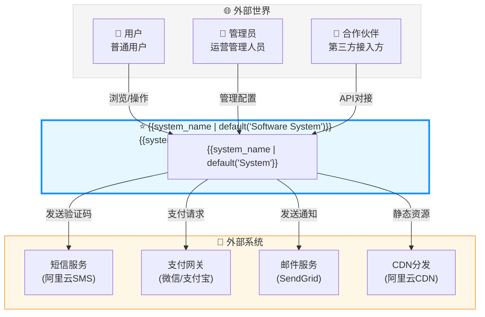
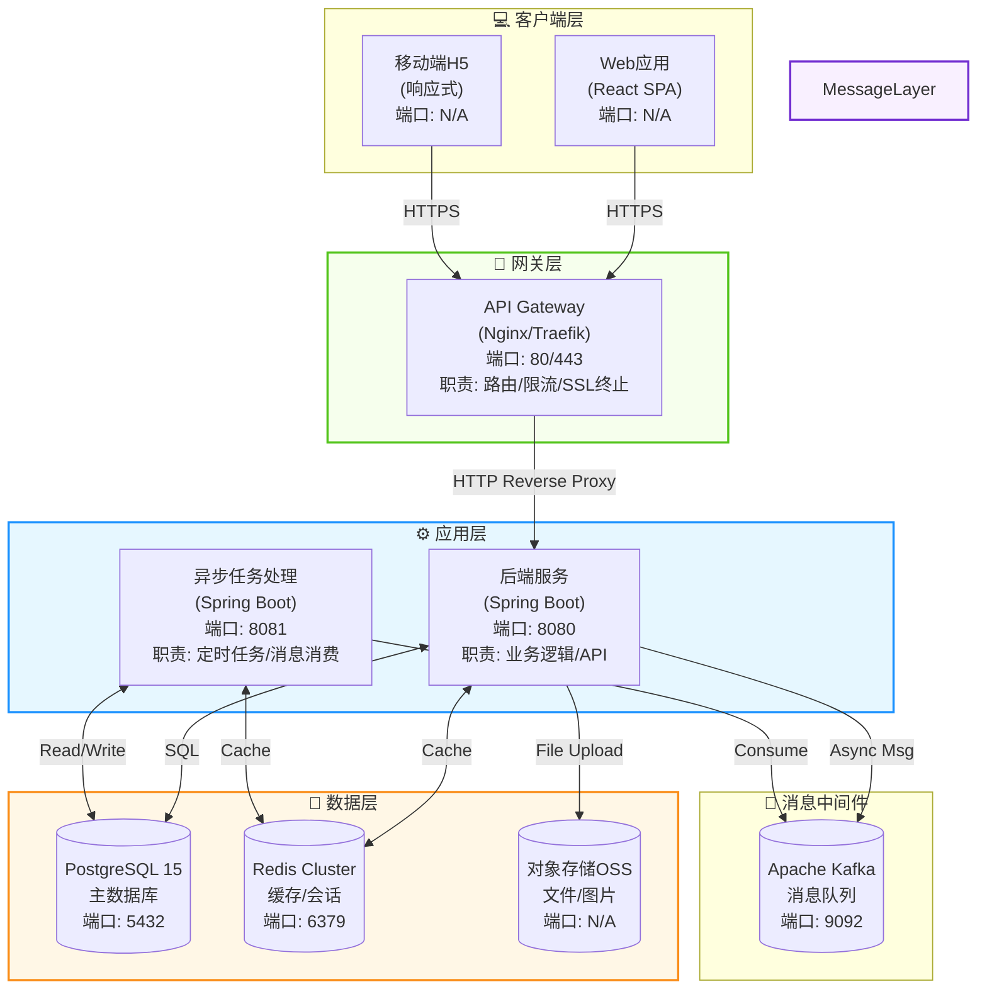
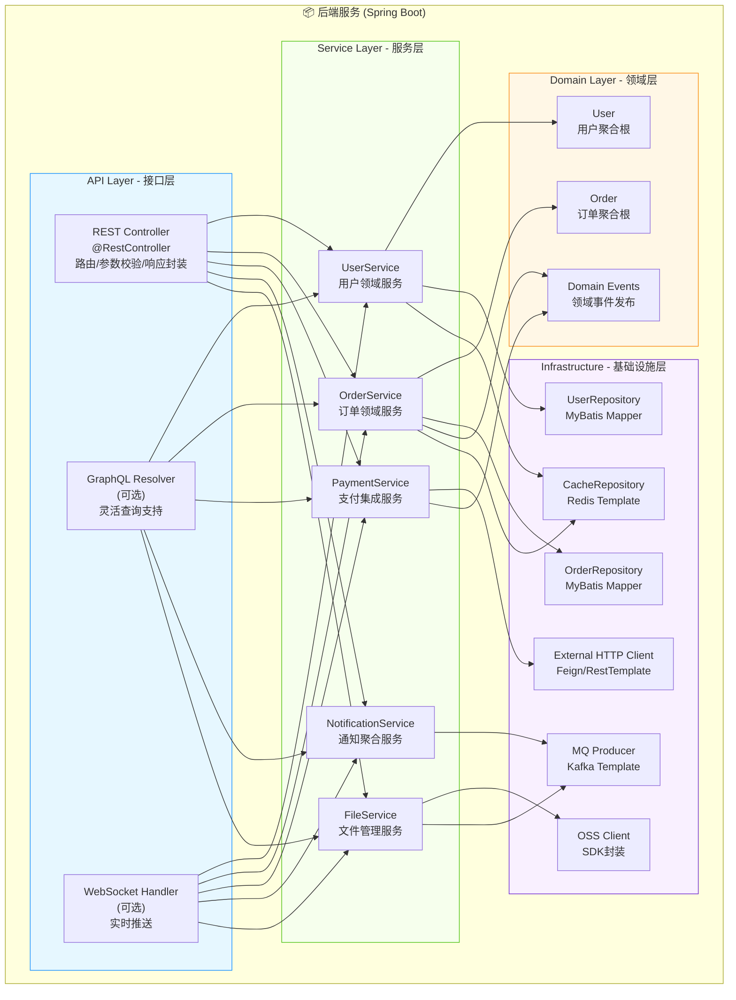
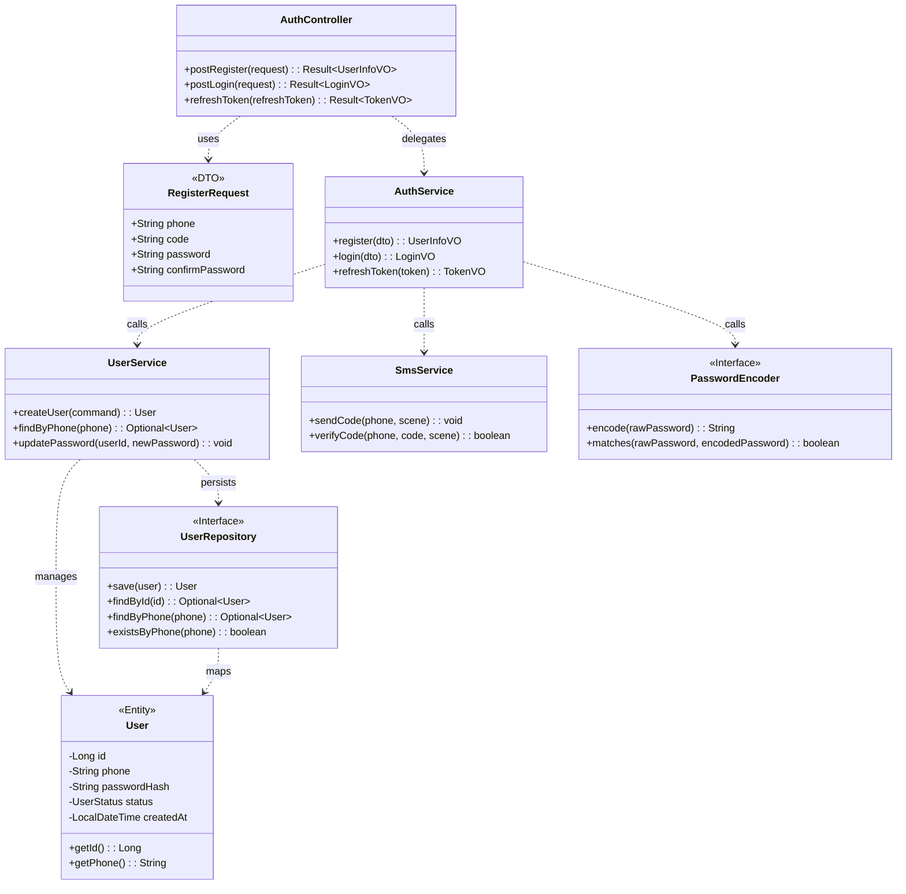
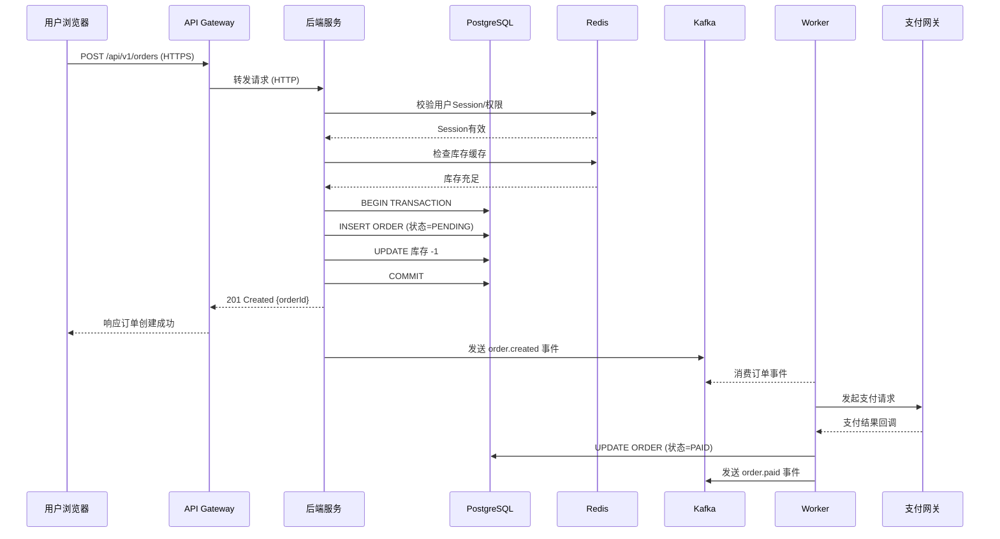

<!--
  模板说明: C4 Model Architecture Document (C4架构模型文档)
  用途: 使用C4模型（Context/Container/Component/Code）分层描述软件架构，从宏观到微观
  变量列表:
    {{system_name}}           - 系统名称
    {{system_description}}    - 系统描述
    {{organization}}          - 组织名称
    {{c1_actors}}             - C1层: 外部用户/系统列表
    {{c2_containers}}         - C2层: 容器(应用/数据存储)列表
    {{c3_components}}         - C3层: 组件列表
    {{c4_code_elements}}      - C4层: 代码元素(类/接口)列表
    {{tech_stack_table}}      - 技术选型汇总表
    {{data_flow_description}} - 数据流描述
  使用方式: 按C1→C2→C3→C4逐层填充，每层的Mermaid图可导出为PNG/SVG用于演示
  参考: https://c4model.com/
-->

# {{system_name | default('[系统名称]')}} — C4 架构模型文档

> **版本**: {{version | default('v1.0')}} | **更新日期**: {{date | default('YYYY-MM-DD')}}
> **架构师**: {{architect | default('[架构师姓名]')}}

---

## C4模型层级概览

```
┌─────────────────────────────────────────────────────────┐
│  Level 1: System Context   系统上下文 (宏观视角)        │  ← 利益相关者/管理层
├─────────────────────────────────────────────────────────┤
│  Level 2: Container         容器视图 (应用边界)         │  ← 技术负责人/DevOps
├─────────────────────────────────────────────────────────┤
│  Level 3: Component         组件视图 (内部结构)         │  ← 开发人员
├─────────────────────────────────────────────────────────┤
│  Level 4: Code              代码视图 (实现细节)         │  ← 开发人员(按需)
└─────────────────────────────────────────────────────────┘
```

---

## C1: System Context (系统上下文图)

### 描述

<!-- COMMENT: C1展示系统在全局中的位置，包括与它交互的所有用户和外部系统 -->

{{system_name | default('本系统')}} 是一个 **{{system_description | default('[简短描述系统定位]')}}**，属于 **{{organization | default('[组织名称]')}}** 的核心业务平台。

### 系统上下文图



### 外部参与者说明

| 参与者类型 | 名称 | 描述 | 主要交互 |
|------------|------|------|----------|
| 👤 用户 | 最终用户 | 使用产品核心功能的终端用户 | 浏览、下单、支付、查看数据 |
| 👤 管理员 | 运营人员 | 负责内容管理和运营配置的后台用户 | 数据管理、报表查看、用户管理 |
| 🏢 合作伙伴 | 第三方系统 | 通过API与本系统集成的外部组织 | 数据同步、业务联动 |

### 外部系统说明

| 系统 | 类型 | 协议 | 用途 | SLA要求 |
|------|------|------|------|---------|
| 阿里云SMS | SaaS服务 | REST API | 发送短信验证码/通知 | 可用性99.9% |
| 微信/支付宝支付 | 第三方支付 | HTTPS + SDK | 处理在线支付交易 | 可用性99.99% |
| SendGrid | 邮件服务 | SMTP/REST API | 发送邮件通知 | 可用性99.9% |
| 阿里云CDN | 基础设施 | HTTP/HTTPS | 静态资源加速分发 | 可用性99.95% |

---

## C2: Container (容器图)

### 描述

<!-- COMMENT: C2展示系统内部的独立部署单元（容器），如Web应用、API服务、数据库、缓存等 -->

{{system_name}} 内部由以下**可独立部署的容器**组成：

### 容器架构图



### 容器详细说明

#### C2-01: Web前端应用 (Single Page Application)

| 属性 | 说明 |
|------|------|
| **技术栈** | React 18 + TypeScript + Vite + Ant Design 5 |
| **职责** | 提供用户交互界面，渲染页面，处理用户输入 |
| **通信方式** | 通过RESTful API与后端通信 (JSON over HTTP) |
| **部署方式** | 构建为静态文件，由Nginx托管或CDN分发 |
| **代码仓库** | `github.com/org/{{system_name | lower}}-frontend` |

**主要功能模块**:
- 📝 用户认证（登录/注册/找回密码）
- 📊 核心业务仪表盘
- 📋 数据管理CRUD界面
- ⚙️ 个人设置中心

---

#### C2-02: API网关 (API Gateway)

| 属性 | 说明 |
|------|------|
| **技术栈** | Nginx 1.24 / Traefik 3.x |
| **职责** | 反向代理、路由分发、SSL终止、速率限制、静态资源服务 |
| **通信方式** | 接收HTTPS请求，转发HTTP至后端服务 |
| **部署方式** | Docker容器，Kubernetes Deployment |

**关键配置项**:
```nginx
# 示例Nginx配置片段
upstream backend {
    server backend-service:8080;
    keepalive 32;
}

server {
    listen 443 ssl http2;
    server_name api.{{domain | default('example.com')}};

    # SSL证书
    ssl_certificate     /etc/nginx/ssl/fullchain.pem;
    ssl_certificate_key /etc/nginx/ssl/privkey.pem;

    # 速率限制
    limit_req_zone $binary_remote_addr zone=api_limit:10m rate=30r/s;

    location /api/ {
        limit_req zone=api_limit burst=50 nodelay;
        proxy_pass http://backend;
        proxy_set_header Host $host;
        proxy_set_header X-Real-IP $remote_addr;
        proxy_set_header X-Forwarded-For $proxy_add_x_forwarded_for;
        proxy_set_header X-Forwarded-Proto $scheme;
    }
}
```

---

#### C2-03: 后端服务 (Backend Service)

| 属性 | 说明 |
|------|------|
| **技术栈** | Java 17 + Spring Boot 3.2 + MyBatis-Plus |
| **职责** | 业务逻辑处理、API接口提供、数据访问编排 |
| **通信方式** | 暴露RESTful API (JSON)，内部调用其他服务 |
| **部署方式** | Docker镜像，K8s Deployment (Replicas: 3) |
| **代码仓库** | `github.com/org/{{system_name | lower}}-backend` |

**技术约束**:
- JVM堆内存: `-Xmx2g -Xms2g`
- GC算法: G1GC
- 连接池: HikariCP (最大20连接)
- 线程池: Tomcat默认(200线程)

---

#### C2-04: 异步任务处理器 (Worker Service)

| 属性 | 说明 |
|------|------|
| **技术栈** | Spring Boot 3.2 + Spring Kafka |
| **职责** | 异步消息消费、定时任务执行、耗时操作后台处理 |
| **通信方式** | 从Kafka消费消息，读写数据库和缓存 |
| **部署方式** | Docker镜像，K8s Deployment (Replicas: 2) |

**处理的任务类型**:
| 任务类型 | 触发方式 | 执行频率 | 超时时间 |
|----------|----------|----------|----------|
| 邮件发送 | Kafka消息 | 实时消费 | 30s |
| 数据报表生成 | 定时调度(Cron) | 每日凌晨2点 | 10min |
| 文件处理 | Kafka消息 | 实时消费 | 5min |
| 缓存预热 | 定时调度 | 每6小时 | 15min |

---

#### C2-05: PostgreSQL 主数据库

| 属性 | 说明 |
|------|------|
| **技术栈** | PostgreSQL 15.x |
| **职责** | 持久化存储所有核心业务数据 |
| **部署方式** | 主从复制 (1主2从) + PgBouncer连接池 |
| **容量规划** | 初始100GB，自动扩容至1TB |

**关键配置**:
```ini
# postgresql.conf 关键参数
max_connections = 300
shared_buffers = 2GB
effective_cache_size = 6GB
work_mem = 64MB
maintenance_work_mem = 512MB
wal_level = replica
max_wal_senders = 3
hot_standby = on
```

---

#### C2-06: Redis 缓存集群

| 属性 | 说明 |
|------|------|
| **技术栈** | Redis 7.x Cluster (6节点, 3主3从) |
| **职责** | 会话缓存、热点数据缓存、分布式锁、限流计数器 |
| **部署方式** | Kubernetes StatefulSet |
| **内存规划** | 总计16GB (每节点约2.7GB) |

**缓存策略**:

| 数据类型 | Key模式 | TTL | 淘汰策略 |
|----------|---------|-----|----------|
| 用户Session | `session:{user_id}` | 7天 | 不过期(主动删除) |
| 热点数据 | `hot:{biz_type}:{id}` | 30分钟 | LRU |
| 验证码 | `sms_code:{phone}` | 5分钟 | 过期删除 |
| 分布式锁 | `lock:{resource}:{tx_id}` | 30秒 | 过期删除 |
| API限流计数 | `rate:{ip}:{endpoint}` | 60秒窗口 | 过期删除 |

---

#### C2-07: 对象存储 (OSS)

| 属性 | 说明 |
|------|------|
| **技术栈** | 阿里云OSS / MinIO (自建可选) |
| **职责** | 存储用户上传的图片、文件、导出报表等 |
| **部署方式** | 云服务或自建MinIO集群 |

**存储桶(Bucket)规划**:

| Bucket名称 | 用途 | 访问权限 | 生命周期规则 |
|------------|------|----------|--------------|
| `{{system_name | lower}}-avatar` | 用户头像 | 公共读 | 无 |
| `{{system_name | lower}}-uploads` | 用户上传文件 | 私有 | 90天后转低频 |
| `{{system_name | lower}}-exports` | 导出报表 | 私有 | 7天后自动删除 |
| `{{system_name | lower}}-static` | 前端静态资源 | 公共读 | 无 |

---

#### C2-08: Apache Kafka 消息队列

| 属性 | 说明 |
|------|------|
| **技术栈** | Apache Kafka 3.6.x (3 broker集群) |
| **职责** | 异步解耦、事件驱动、削峰填谷 |
| **部署方式** | Kubernetes StatefulSet + ZooKeeper |

**Topic规划**:

| Topic名称 | 分区数 | 副本数 | 生产者 | 消费者 | 保留时间 |
|-----------|--------|--------|--------|--------|----------|
| `user.registered` | 6 | 3 | Backend | Worker(邮件) | 7天 |
| `order.created` | 12 | 3 | Backend | Worker(库存/通知) | 7天 |
| `notification.send` | 3 | 3 | Backend/Multiple | Worker(SMS/Email/Push) | 3天 |
| `file.uploaded` | 3 | 3 | Backend | Worker(处理) | 1天 |

---

## C3: Component (组件图)

### 描述

<!-- COMMENT: C3展示每个容器内部的组件结构和组件间的交互关系。以下以后端服务为例 -->

### 后端服务组件图



### 组件详细说明

#### API层组件

| 组件名 | 类名示例 | 职责 | 对外暴露 |
|--------|----------|------|----------|
| 用户API控制器 | `UserController` | 处理 `/api/v1/users/*` 路由请求 | REST |
| 认证API控制器 | `AuthController` | 处理登录/注册/Token刷新 | REST |
| 订单API控制器 | `OrderController` | 处理 `/api/v1/orders/*` 路由请求 | REST |
| 全局异常处理 | `GlobalExceptionHandler` | 统一异常捕获与格式化响应 | 内部 |
| 请求日志拦截器 | `RequestLogInterceptor` | 记录请求/响应日志 | 内部 |
| JWT认证过滤器 | `JwtAuthenticationFilter` | Token解析与身份注入 | 内部 |

#### 服务层组件

| 组件名 | 职责 | 依赖组件 | 复杂度 |
|--------|------|----------|--------|
| AuthService | 身份认证与授权 | UserRepository, CacheRepo, JwtUtil | 中 |
| UserService | 用户CRUD与业务规则 | UserRepository, CacheRepo, FileService | 低 |
| OrderService | 订单全生命周期管理 | OrderRepository, PaymentService, MQProducer | 高 |
| PaymentService | 支付流程编排 | ExternalClient, OrderRepo, DomainEvent | 高 |
| SearchService | 多维度搜索与筛选 | ElasticsearchClient (可选), Repo | 中 |

#### 基础设施层组件

| 组件名 | 技术 | 职责 |
|--------|------|------|
| UserRepository | MyBatis-Plus | 用户数据持久化 |
| OrderRepository | MyBatis-Plus | 订单数据持久化 |
| CacheRepository | RedisTemplate (Lettuce) | 缓存读写操作 |
| MQProducer | KafkaTemplate | 消息生产与发送 |
| SmsClient | 阿里云SMS SDK | 短信发送 |
| AlipayClient | Alipay SDK | 支付宝支付对接 |
| WxPayClient | WeChat Pay SDK | 微信支付对接 |
| OssClient | 阿里云OSS SDK | 文件上传下载 |

---

## C4: Code (代码层)

### 描述

<!-- COMMENT: C4展示关键类/接口的代码级细节。仅对核心或复杂的类进行展示。以用户注册为例 -->

### 用户注册相关代码结构



### 关键接口定义

<!-- COMMENT: 展示核心接口的签名和契约 -->

#### IUserService 接口

```java
/**
 * 用户领域服务接口
 * 定义用户相关的所有业务能力
 */
public interface IUserService {

    /**
     * 注册新用户
     * @param command 注册命令（包含手机号、密码、验证码等）
     * @return 创建的用户信息
     * @throws BusinessException 当业务规则不满足时抛出
     */
    UserInfoVO register(RegisterCommand command);

    /**
     * 用户登录
     * @param command 登录命令
     * @return 登录结果（含Token）
     */
    LoginResultVO login(LoginCommand command);

    /**
     * 更新用户信息
     * @param userId 用户ID
     * @param command 更新命令
     */
    void updateProfile(Long userId, UpdateProfileCommand command);

    /**
     * 上传头像
     * @param userId 用户ID
     * @param file 头像文件
     * @return 头像URL
     */
    String uploadAvatar(Long userId, MultipartFile file);
}
```

#### UserRepository 接口

```java
/**
 * 用户数据访问接口
 * 基于MyBatis-Plus实现
 */
@Mapper
public interface UserRepository extends BaseMapper<UserEntity> {

    /**
     * 根据手机号查询用户（用于登录判断）
     */
    @Select("SELECT * FROM users WHERE phone = #{phone} AND deleted = 0")
    Optional<UserEntity> selectByPhone(@Param("phone") String phone);

    /**
     * 统计活跃用户数
     */
    @Select("SELECT COUNT(*) FROM users WHERE status = 1 AND last_login_at > #{since}")
    long countActiveUsers(@Param("since") LocalDateTime since);
}
```

---

## 技术选型总表

| 层面 | 选型 | 版本 | 选型理由 | 替代方案 |
|------|------|------|----------|----------|
| **前端框架** | React 18 | ^18.2 | 团队熟悉度最高，生态最丰富 | Vue 3, Angular |
| **构建工具** | Vite 5 | ^5.0 | 极速HMR，ESM原生支持 | Webpack 5, esbuild |
| **UI组件库** | Ant Design 5 | ^5.12 | 企业级设计规范，组件丰富 | Element Plus, Shadcn/ui |
| **状态管理** | Zustand | ^4.4 | 轻量简洁，TypeScript友好 | Redux Toolkit, Jotai |
| **后端框架** | Spring Boot 3.2 | ^3.2 | 企业级Java生态标准 | Quarkus, Micronaut |
| **ORM框架** | MyBatis-Plus | ^3.5 | SQL可控性强，国内生态好 | JPA/Hibernate, jOOQ |
| **数据库** | PostgreSQL 15 | >= 15 | JSON支持优秀，开源免费 | MySQL 8.0, TiDB |
| **缓存** | Redis 7 Cluster | >= 7.0 | 高性能，数据结构丰富 | Memcached, Dragonfly |
| **消息队列** | Apache Kafka | ^3.6 | 高吞吐，持久化可靠 | RabbitMQ, RocketMQ |
| **对象存储** | 阿里云OSS | - | 成熟稳定，集成方便 | MinIO, AWS S3 |
| **容器编排** | Kubernetes | ^1.28 | 行业标准，云原生首选 | Docker Swarm, Nomad |
| **CI/CD** | GitHub Actions | - | 与GitHub深度集成 | GitLab CI, Jenkins |
| **监控** | Prometheus + Grafana | - | 云原生监控事实标准 | Datadog, New Relic |
| **日志** | ELK Stack (Elasticsearch + Logstash + Kibana) | ^8.0 | 日志分析能力强 | Loki, Graylog |
| **链路追踪** | Jaeger | ^1.50 | OpenTelemetry兼容 | Zipkin, SkyWalking |

---

## 数据流图

### 核心业务流程: 用户下单



### 数据流向矩阵

| 数据流 | 起点 → 终点 | 协议 | 格式 | 频率 | 可靠性要求 |
|--------|-------------|------|------|------|------------|
| 用户请求 | Browser → Nginx | HTTPS | JSON | 高频 | 至少一次 |
| API转发 | Nginx → Backend | HTTP | JSON | 高频 | 至少一次 |
| 数据库写 | Backend → PostgreSQL | TCP | SQL | 中频 | 精确一次 |
| 缓存读写 | Backend ↔ Redis | TCP | RESP | 高频 | 可接受丢失 |
| 消息发送 | Backend → Kafka | TCP | 二进制 | 中频 | 精确一次 |
| 文件上传 | Backend → OSS | HTTPS | Multipart | 低频 | 精确一次 |
| 支付调用 | Backend → 支付网关 | HTTPS | XML/JSON | 低频 | 精确一次 |

---

## 非功能需求映射

| NFR类别 | 要求值 | 责任组件 | 验证方式 |
|---------|--------|----------|----------|
| **可用性 99.9%** | 月故障≤43分钟 | 全部组件 | Prometheus告警 |
| **P99延迟 < 500ms** | 核心API | Backend + DB + Redis | APM工具 |
| **并发 5000 QPS** | 正常负载 | 全部组件 | JMeter压测 |
| **数据安全** | 加密传输+存储 | Nginx(SSL) + DB(加密字段) | 安全扫描 |
| **可扩展性** | 水平扩展能力 | Stateless服务+K8s HPA | 扩容测试 |

---

*本文档遵循 [C4 Model](https://c4model.com/) 规范编写，使用Mermaid图表可视化架构。*
