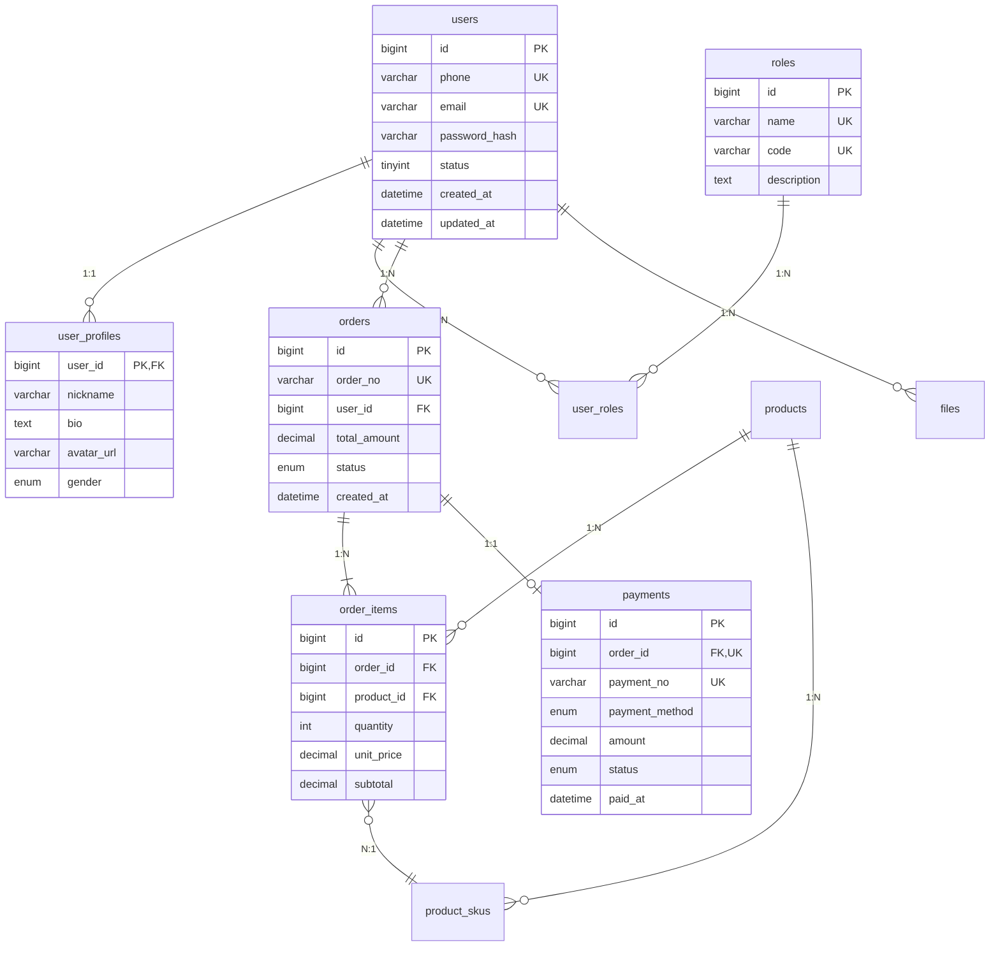
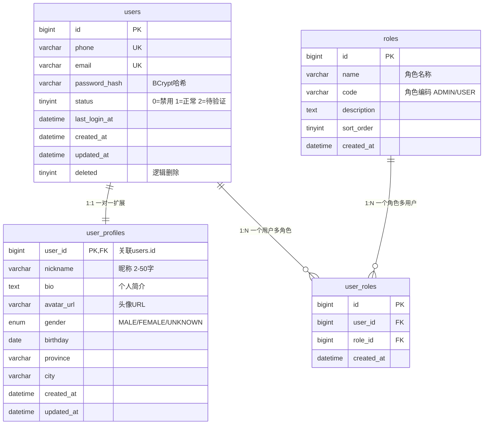
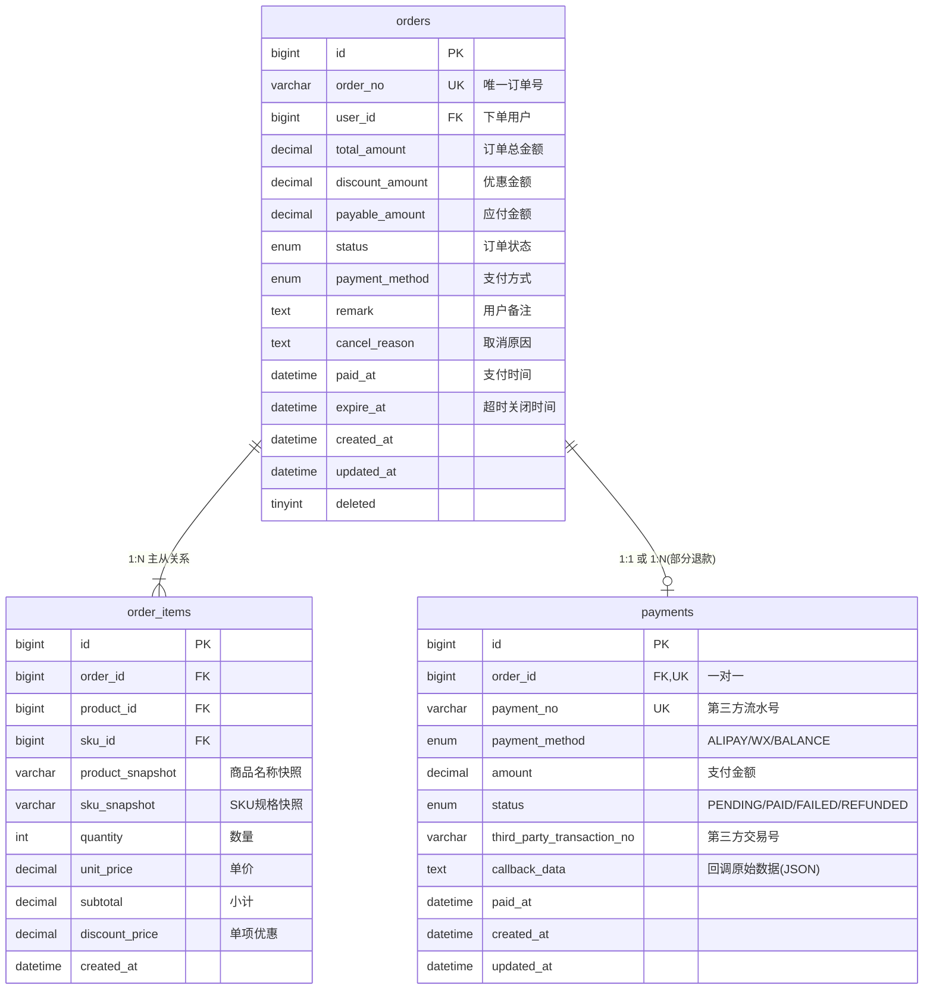

<!--
  模板说明: Database Design Document (数据库设计文档)
  用途: 完整描述数据库的ER模型、表结构、索引策略、数据字典等，作为DBA和开发的核心参考
  变量列表:
    {{db_name}}               - 数据库名称
    {{db_type}}               - 数据库类型 (PostgreSQL/MySQL/MongoDB)
    {{db_version}}            - 数据库版本
    {{db_charset}}            - 字符集
    {{db_collation}}          - 排序规则
    {{table_list}}            - 表列表
    {{er_diagram}}            - ER图(Mermaid)
    {{index_design}}          - 索引设计
    {{partition_strategy}}    - 分区策略
    {{migration_scripts}}     - 迁移脚本
    {{data_dictionary}}       - 数据字典
    {{sql_nosql_rationale}}   - SQL/NoSQL选择理由
  使用方式: 配合数据库迁移工具(Flyway/Liquibase)使用，此文档为设计层面的完整记录
-->

# {{db_name | default('[项目名称]')}} — 数据库设计文档

> **数据库**: {{db_type | default('PostgreSQL 15')}} | **字符集**: {{db_charset | default('UTF8MB4')}}
> **版本**: {{version | default('v1.0')}} | **更新日期**: {{date | default('YYYY-MM-DD')}}
> **负责人**: {{dba | default('[DBA姓名]')}}

---

## 📋 目录

- [1. 数据库概述](#1-数据库概述)
- [2. ER模型](#2-er模型)
- [3. 表结构详细定义](#3-表结构详细定义)
- [4. 索引设计](#4-索引设计)
- [5. 分区策略](#5-分区策略)
- [6. 约束与触发器](#6-约束与触发器)
- [7. 数据字典](#7-数据字典)
- [8. 数据迁移脚本](#8-数据迁移脚本)
- [9. SQL/NoSQL选型理由](#9-sqlnosql选型理由)
- [10. 备份与恢复策略](#10-备份与恢复策略)

---

## 1. 数据库概述

### 1.1 基本信息

| 属性 | 值 |
|------|-----|
| **数据库名称** | `{{db_name | default('skiller_db')}}` |
| **数据库类型** | {{db_type | default('PostgreSQL 15.x')}} |
| **默认字符集** | `{{db_charset | default('UTF8')}}` |
| **排序规则** | `{{db_collation | default('zh_CN.utf8')}}` |
| **时区设置** | `Asia/Shanghai` |
| **连接池配置** | 最大30连接，最小5连接，空闲超时300s |

### 1.2 设计原则

| 原则 | 说明 | 应用示例 |
|------|------|----------|
| **第三范式(3NF)** | 消除传递依赖，减少冗余 | 用户信息独立于订单表 |
| **适度反范式** | 为性能允许合理冗余 | 订单表冗余商品快照信息 |
| **命名规范** | 小写+下划线，见名知意 | `user_profile`, `order_item` |
| **软删除** | 使用deleted标记而非物理删除 | 所有核心表含`deleted`字段 |
| **审计字段** | 统一包含created_at/updated_at | 每张业务表必备 |
| **ID策略** | BIGINT自增或Snowflake雪花ID | 根据分布式需求选择 |

### 1.3 表清单总览

| 序号 | 表名 | 中文名 | 类型 | 预估行数 | 说明 |
|------|------|--------|------|----------|------|
| 1 | users | 用户表 | 核心业务 | ~100万 | 存储用户基本信息 |
| 2 | user_profiles | 用户详情表 | 扩展信息 | ~100万 | 用户扩展属性（1:1） |
| 3 | roles | 角色表 | 基础数据 | ~10 | RBAC角色定义 |
| 4 | user_roles | 用户角色关联表 | 关联关系 | ~150万 | 多对多关系 |
| 5 | orders | 订单主表 | 核心业务 | ~500万 | 订单主记录 |
| 6 | order_items | 订单明细表 | 核心业务 | ~1500万 | 订单项明细 |
| 7 | products | 商品表 | 核心业务 | ~5万 | 商品基础信息 |
| 8 | product_skus | 商品SKU表 | 核心业务 | ~20万 | 商品规格变体 |
| 9 | payments | 支付记录表 | 核心业务 | ~500万 | 支付流水 |
| 10 | files | 文件记录表 | 辅助功能 | ~50万 | 上传文件元数据 |
| 11 | sms_logs | 短信发送日志 | 日志表 | ~1000万 | 短信发送记录 |
| 12 | operation_logs | 操作日志表 | 日志表 | ~5000万 | 用户操作审计 |
| <!-- COMMENT: 添加更多表 --> | | | | | |

---

## 2. ER模型

### 2.1 全局ER图



### 2.2 模块化ER图 (按领域)

#### 用户领域 ER 图



#### 订单领域 ER 图



---

## 3. 表结构详细定义

### 3.1 users (用户表)

**中文说明**: 存储所有注册用户的基本认证信息和账户状态。

```sql
CREATE TABLE users (
    id              BIGINT          NOT NULL AUTO_INCREMENT COMMENT '用户唯一标识',
    phone           VARCHAR(20)     NOT NULL COMMENT '手机号',
    email           VARCHAR(100)    DEFAULT NULL COMMENT '邮箱地址',
    password_hash   VARCHAR(255)    NOT NULL COMMENT 'BCrypt加密密码',
    status          TINYINT         NOT NULL DEFAULT 1 COMMENT '状态: 0=禁用 1=正常 2=待验证',
    last_login_at   DATETIME        DEFAULT NULL COMMENT '最后登录时间',
    login_ip        VARCHAR(45)     DEFAULT NULL COMMENT '最后登录IP',
    login_fail_count TINYINT        NOT NULL DEFAULT 0 COMMENT '连续登录失败次数',
    lock_until      DATETIME        DEFAULT NULL COMMENT '账号锁定截止时间',
    created_at      DATETIME        NOT NULL DEFAULT CURRENT_TIMESTAMP COMMENT '创建时间',
    updated_at      DATETIME        NOT NULL DEFAULT CURRENT_TIMESTAMP ON UPDATE CURRENT_TIMESTAMP COMMENT '更新时间',
    deleted         TINYINT         NOT NULL DEFAULT 0 COMMENT '逻辑删除: 0=正常 1=已删除',

    PRIMARY KEY (id),
    UNIQUE KEY uk_phone (phone),
    UNIQUE KEY uk_email (email),
    KEY idx_status (status),
    KEY idx_created_at (created_at),
    KEY idx_deleted (deleted)
) ENGINE=InnoDB DEFAULT CHARSET=utf8mb4 COLLATE=utf8mb4_unicode_ci COMMENT='用户表';
```

#### 字段详解

| 字段名 | 数据类型 | 允许NULL | 默认值 | 约束 | 说明 |
|--------|----------|----------|--------|------|------|
| id | BIGINT | NO | - | PK, AUTO_INCREMENT | 用户唯一标识，全局递增 |
| phone | VARCHAR(20) | NO | - | UNIQUE | 注册手机号，用于登录 |
| email | VARCHAR(100) | YES | NULL | UNIQUE | 邮箱地址，可选填写 |
| password_hash | VARCHAR(255) | NO | - | - | BCrypt加密后的密码(cost=12) |
| status | TINYINT | NO | 1 | CHECK(0,1,2) | 账户状态枚举 |
| last_login_at | DATETIME | YES | NULL | - | 最后成功登录时间戳 |
| login_ip | VARCHAR(45) | YES | NULL | - | 最后登录IP(IPv6兼容) |
| login_fail_count | TINYINT | NO | 0 | - | 连续失败计数，达到阈值自动锁定 |
| lock_until | DATETIME | YES | NULL | - | 账户锁定解除时间 |
| created_at | DATETIME | NO | CURRENT_TIMESTAMP | - | 记录创建时间 |
| updated_at | DATETIME | NO | CURRENT_TIMESTAMP ON UPDATE | - | 记录最后修改时间 |
| deleted | TINYINT | NO | 0 | CHECK(0,1) | 软删除标记 |

---

### 3.2 user_profiles (用户详情表)

**中文说明**: 存储用户的扩展个人信息，与users表为1:1关系。

```sql
CREATE TABLE user_profiles (
    user_id         BIGINT          NOT NULL COMMENT '用户ID，关联users.id',
    nickname        VARCHAR(50)     NOT NULL DEFAULT '' COMMENT '昵称',
    avatar_url      VARCHAR(500)    DEFAULT NULL COMMENT '头像URL',
    bio             VARCHAR(500)    DEFAULT NULL COMMENT '个人简介',
    gender          ENUM('MALE','FEMALE','UNKNOWN') NOT NULL DEFAULT 'UNKNOWN' COMMENT '性别',
    birthday        DATE            DEFAULT NULL COMMENT '生日',
    province        VARCHAR(50)     DEFAULT NULL COMMENT '省份',
    city            VARCHAR(50)     DEFAULT NULL COMMENT '城市',
    custom_fields   JSON            DEFAULT NULL COMMENT '自定义扩展字段',
    created_at      DATETIME        NOT NULL DEFAULT CURRENT_TIMESTAMP,
    updated_at      DATETIME        NOT NULL DEFAULT CURRENT_TIMESTAMP ON UPDATE CURRENT_TIMESTAMP,

    PRIMARY KEY (user_id),
    CONSTRAINT fk_user_profile_user FOREIGN KEY (user_id) REFERENCES users(id) ON DELETE CASCADE
) ENGINE=InnoDB DEFAULT CHARSET=utf8mb4 COLLATE=utf8mb4_unicode_ci COMMENT='用户详情表';
```

#### 字段详解

| 字段名 | 数据类型 | 允许NULL | 默认值 | 约束 | 说明 |
|--------|----------|----------|--------|------|------|
| user_id | BIGINT | NO | - | PK, FK → users.id | 复用users的主键作为主键 |
| nickname | VARCHAR(50) | NO | '' | - | 用户显示名称 |
| avatar_url | VARCHAR(500) | YES | NULL | - | CDN上的头像文件路径 |
| bio | VARCHAR(500) | YES | NULL | - | 个人简介文本 |
| gender | ENUM | NO | UNKNOWN | - | 性别枚举 |
| birthday | DATE | YES | NULL | - | 出生日期 |
| province | VARCHAR(50) | YES | NULL | - | 所在省份 |
| city | VARCHAR(50) | YES | NULL | - | 所在城市 |
| custom_fields | JSON | YES | NULL | - | 灵活扩展字段，避免频繁DDL |

---

### 3.3 orders (订单主表)

**中文说明**: 记录所有订单的主信息，是订单领域的聚合根。

```sql
CREATE TABLE orders (
    id                  BIGINT          NOT NULL AUTO_INCREMENT,
    order_no            VARCHAR(32)     NOT NULL COMMENT '订单号(业务编号)',
    user_id             BIGINT          NOT NULL COMMENT '下单用户ID',
    total_amount        DECIMAL(12,2)   NOT NULL DEFAULT 0.00 COMMENT '订单总金额(原价)',
    discount_amount     DECIMAL(12,2)   NOT NULL DEFAULT 0.00 COMMENT '优惠减免金额',
    payable_amount      DECIMAL(12,2)   NOT NULL DEFAULT 0.00 COMMENT '实际应付金额',
    status              ENUM(
                          'PENDING_PAYMENT','PAID','SHIPPED',
                          'DELIVERED','COMPLETED','CANCELLED','REFUNDING'
                        ) NOT NULL DEFAULT 'PENDING_PAYMENT' COMMENT '订单状态',
    payment_method      ENUM('ALIPAY','WECHAT_PAY','BALANCE') DEFAULT NULL COMMENT '支付方式',
    remark              VARCHAR(500)    DEFAULT NULL COMMENT '用户备注',
    cancel_reason       VARCHAR(200)    DEFAULT NULL COMMENT '取消原因',
    source              VARCHAR(20)     NOT NULL DEFAULT 'WEB' COMMENT '来源渠道: WEB/H5/APP/API',
    recipient_name      VARCHAR(50)     NOT NULL COMMENT '收货人姓名',
    recipient_phone     VARCHAR(20)     NOT NULL COMMENT '收货人电话',
    recipient_province  VARCHAR(50)     NOT NULL COMMENT '收货省份',
    recipient_city      VARCHAR(50)     NOT NULL COMMENT '收货城市',
    recipient_district  VARCHAR(50)     NOT NULL COMMENT '收货区县',
    recipient_address   VARCHAR(200)    NOT NULL COMMENT '详细地址',
    full_address        VARCHAR(400)    DEFAULT NULL COMMENT '完整地址(冗余)',
    coupon_code         VARCHAR(32)     DEFAULT NULL COMMENT '使用的优惠券码',
    paid_at             DATETIME        DEFAULT NULL COMMENT '支付完成时间',
    shipped_at          DATETIME        DEFAULT NULL COMMENT '发货时间',
    delivered_at        DATETIME        DEFAULT NULL COMMENT '签收时间',
    completed_at        DATETIME        DEFAULT NULL COMMENT '确认完成时间',
    cancelled_at        DATETIME        DEFAULT NULL COMMENT '取消时间',
    expire_at           DATETIME        NOT NULL COMMENT '待支付超时关闭时间',
    version             INT             NOT NULL DEFAULT 0 COMMENT '乐观锁版本号',
    created_at          DATETIME        NOT NULL DEFAULT CURRENT_TIMESTAMP,
    updated_at          DATETIME        NOT NULL DEFAULT CURRENT_TIMESTAMP ON UPDATE CURRENT_TIMESTAMP,
    deleted             TINYINT         NOT NULL DEFAULT 0,

    PRIMARY KEY (id),
    UNIQUE KEY uk_order_no (order_no),
    KEY idx_user_id (user_id),
    KEY idx_status (status),
    KEY idx_user_status (user_id, status),
    KEY idx_created_at (created_at),
    KEY idx_paid_at (paid_at),
    KEY idx_expire_at_expire_status (expire_at, status),
    CONSTRAINT fk_order_user FOREIGN KEY (user_id) REFERENCES users(id)
) ENGINE=InnoDB DEFAULT CHARSET=utf8mb4 COLLATE=utf8mb4_unicode_ci COMMENT='订单主表';
```

#### 字段详解

| 字段名 | 数据类型 | 允许NULL | 默认值 | 说明 |
|--------|----------|----------|--------|------|
| id | BIGINT | NO | AUTO_INCREMENT | 自增主键 |
| order_no | VARCHAR(32) | NO | - | 业务订单号，格式: ORD + 时间戳 + 随机数 |
| user_id | BIGINT | NO | - | 下单用户，外键→users.id |
| total_amount | DECIMAL(12,2) | NO | 0.00 | 所有商品原价总和 |
| discount_amount | DECIMAL(12,2) | NO | 0.00 | 优惠券/满减等总优惠 |
| payable_amount | DECIMAL(12,2) | NO | 0.00 | total - discount = 应付金额 |
| status | ENUM | NO | PENDING_PAYMENT | 订单状态机驱动 |
| remark | VARCHAR(500) | YES | NULL | 用户下单时的备注信息 |
| recipient_* | various | NO | - | 收货地址信息（冗余存储） |
| expire_at | DATETIME | NO | - | 未支付订单的超时关闭时间 |
| version | INT | NO | 0 | 乐观锁，防止并发修改冲突 |

---

### 3.4 order_items (订单明细表)

**中文说明**: 记录每个订单中的商品明细项。

```sql
CREATE TABLE order_items (
    id                  BIGINT          NOT NULL AUTO_INCREMENT,
    order_id            BIGINT          NOT NULL COMMENT '订单ID',
    product_id          BIGINT          NOT NULL COMMENT '商品ID',
    sku_id              BIGINT          NOT NULL COMMENT 'SKU ID',
    product_snapshot    VARCHAR(200)    NOT NULL COMMENT '商品名称快照(下单时)',
    sku_snapshot        VARCHAR(200)    NOT NULL COMMENT 'SKU规格快照(下单时)',
    product_image       VARCHAR(500)    DEFAULT NULL COMMENT '商品图片快照',
    quantity            INT             NOT NULL DEFAULT 1 COMMENT '购买数量',
    unit_price          DECIMAL(12,2)   NOT NULL COMMENT '购买时单价',
    subtotal            DECIMAL(12,2)   NOT NULL COMMENT '小计(单价×数量)',
    discount_price      DECIMAL(12,2)   NOT NULL DEFAULT 0.00 COMMENT '单品优惠',
    created_at          DATETIME        NOT NULL DEFAULT CURRENT_TIMESTAMP,

    PRIMARY KEY (id),
    KEY idx_order_id (order_id),
    KEY idx_product_id (product_id),
    CONSTRAINT fk_order_item_order FOREIGN KEY (order_id) REFERENCES orders(id) ON DELETE CASCADE,
    CONSTRAINT fk_order_item_product FOREIGN KEY (product_id) REFERENCES products(id)
) ENGINE=InnoDB DEFAULT CHARSET=utf8mb4 COLLATE=utf8mb4_unicode_ci COMMENT='订单明细表';
```

---

### 3.5 payments (支付记录表)

**中文说明**: 记录所有支付操作的流水信息。

```sql
CREATE TABLE payments (
    id                          BIGINT          NOT NULL AUTO_INCREMENT,
    order_id                    BIGINT          NOT NULL COMMENT '关联订单ID',
    payment_no                  VARCHAR(64)     NOT NULL COMMENT '内部支付流水号',
    payment_method              ENUM('ALIPAY','WECHAT_PAY','BALANCE') NOT NULL,
    amount                      DECIMAL(12,2)   NOT NULL COMMENT '支付金额',
    status                      ENUM('PENDING','PAID','FAILED','REFUNDED','PARTIAL_REFUND')
                                                        NOT NULL DEFAULT 'PENDING',
    third_party_transaction_no  VARCHAR(100)    DEFAULT NULL COMMENT '第三方交易号',
    callback_data               TEXT            DEFAULT NULL COMMENT '回调原始JSON数据',
    refund_amount               DECIMAL(12,2)   NOT NULL DEFAULT 0.00 COMMENT '已退款金额',
    refund_reason               VARCHAR(200)    DEFAULT NULL COMMENT '退款原因',
    paid_at                     DATETIME        DEFAULT NULL,
    refunded_at                 DATETIME        DEFAULT NULL,
    created_at                  DATETIME        NOT NULL DEFAULT CURRENT_TIMESTAMP,
    updated_at                  DATETIME        NOT NULL DEFAULT CURRENT_TIMESTAMP ON UPDATE CURRENT_TIMESTAMP,

    PRIMARY KEY (id),
    UNIQUE KEY uk_payment_no (payment_no),
    UNIQUE KEY uk_order_id (order_id),
    KEY idx_third_party_no (third_party_transaction_no),
    KEY idx_status_created (status, created_at),
    CONSTRAINT fk_payment_order FOREIGN KEY (order_id) REFERENCES orders(id)
) ENGINE=InnoDB DEFAULT CHARSET=utf8mb4 COLLATE=utf8mb4_unicode_ci COMMENT='支付记录表';
```

---

### 3.6 sms_logs (短信发送日志表)

**中文说明**: 记录每条短信的发送情况，用于审计和防刷。

```sql
CREATE TABLE sms_logs (
    id              BIGINT          NOT NULL AUTO_INCREMENT,
    phone           VARCHAR(20)     NOT NULL COMMENT '目标手机号',
    scene           VARCHAR(20)     NOT NULL COMMENT '使用场景: REGISTER/LOGIN/RESET等',
    code            VARCHAR(10)     DEFAULT NULL COMMENT '验证码内容(明文存储需注意安全)',
    template_id     VARCHAR(64)     NOT NULL COMMENT '短信模板ID',
    provider        VARCHAR(20)     NOT NULL DEFAULT 'ALIYUN' COMMENT '服务商',
    provider_msg_id VARCHAR(100)    DEFAULT NULL COMMENT '服务商返回的消息ID',
    status          ENUM('SENT','DELIVERED','FAILED') NOT NULL DEFAULT 'SENT',
    error_code      VARCHAR(32)     DEFAULT NULL COMMENT '错误码',
    error_message   VARCHAR(200)    DEFAULT NULL COMMENT '错误信息',
    ip_address      VARCHAR(45)     DEFAULT NULL COMMENT '请求方IP',
    created_at      DATETIME        NOT NULL DEFAULT CURRENT_TIMESTAMP,

    PRIMARY KEY (id),
    KEY idx_phone_scene (phone, scene),
    KEY idx_phone_created (phone, created_at),
    KEY idx_status_created (status, created_at)
) ENGINE=InnoDB DEFAULT CHARSET=utf8mb4 COLLATE=utf8mb4_unicode_ci COMMENT='短信发送日志表'
PARTITION BY RANGE (TO_DAYS(created_at)) (
    PARTITION p202401 VALUES LESS THAN (TO_DAYS('2024-02-01')),
    PARTITION p202402 VALUES LESS THAN (TO_DAYS('2024-03-01')),
    PARTITION p202403 VALUES LESS THAN (TO_DAYS('2024-04-01')),
    PARTITION p_future VALUES LESS THAN MAXVALUE
);
```

---

## 4. 索引设计

### 4.1 索引汇总表

| 索引名 | 所属表 | 索引字段 | 类型 | 唯一 | 说明 | 创建原因 |
|--------|--------|----------|------|------|------|----------|
| PRIMARY | users | id | BTREE | ✅ | 主键 | 默认创建 |
| uk_phone | users | phone | BTREE | ✅ | 唯一索引 | 手机号登录查询 |
| uk_email | users | email | BTREE | ✅ | 唯一索引 | 邮箱唯一性约束 |
| idx_status | users | status | BTREE | ❌ | 普通索引 | 按状态筛选用户 |
| uk_order_no | orders | order_no | BTREE | ✅ | 唯一索引 | 业务订单号精确查找 |
| idx_user_id | orders | user_id | BTREE | ❌ | 普通索引 | 查询某用户的所有订单 |
| idx_user_status | orders | (user_id, status) | BTREE | ❌ | 复合索引 | 用户+状态联合查询(覆盖订单列表) |
| idx_expire_status | orders | (expire_at, status) | BTREE | ❌ | 复合索引 | 定时任务扫描超时未支付订单 |
| idx_order_id | order_items | order_id | BTREE | ❌ | 普通索引 | 按订单查明细 |
| uk_payment_no | payments | payment_no | BTREE | ✅ | 唯一索引 | 支付流水号防重复 |
| idx_phone_scene | sms_logs | (phone, scene) | BTREE | ❌ | 复合索引 | 同手机号同场景频率检查 |
| idx_phone_created | sms_logs | (phone, created_at) | BTREE | ❌ | 复合索引 | 防刷限流统计查询 |

### 4.2 索引设计原则

| 原则 | 说明 | 示例 |
|------|------|------|
| **最左前缀** | 复合索引遵循最左匹配原则 | `(user_id, status)` 可用 `WHERE user_id=?` 但不能只用 `WHERE status=?` |
| **选择性高优先** | 在区分度高的列上建索引 | 手机号选择性远高于性别 |
| **覆盖索引** | 索引包含查询所需全部字段避免回表 | 订单列表查询只需order_no和status |
| **避免过多索引** | 单表索引不超过5个(特殊情况除外) | 写入性能考虑 |
| **监控慢查询** | 定期分析slow log优化缺失索引 | pt-index-usage工具 |

---

## 5. 分区策略

### 5.1 分区表规划

<!-- COMMENT: 仅对大表(预计超过千万行)进行分区 -->

| 表名 | 分区类型 | 分区键 | 分区粒度 | 预期数据量 | 理由 |
|------|----------|--------|----------|------------|------|
| sms_logs | RANGE | created_at | 按月 | >1000万/年 | 日志类数据按时间归档 |
| operation_logs | RANGE | created_at | 按月 | >5000万/年 | 操作审计日志量大 |
| orders | HASH(可选) | user_id | 按用户ID取模 | >500万 | 分布式查询优化 |
| <!-- COMMENT: 其他需要分区的表 --> | | | | | |

### 5.2 分区维护脚本

```sql
-- 自动添加下月分区 (建议通过定时任务执行)
ALTER TABLE sms_logs ADD PARTITION (
    PARTITION p{{next_month | default('202404')}} VALUES LESS THAN (TO_DAYS('{{next_month_end | default('2024-05-01')}}'))
);

-- 归档旧分区数据 (超过保留期的分区)
ALTER TABLE sms_logs DROP PARTITION p{{old_month | default('202301')}};
```

---

## 6. 约束与触发器

### 6.1 外键约束

| 子表 | 子表字段 | 父表 | 父表字段 | 删除规则 | 更新规则 |
|------|----------|------|----------|----------|----------|
| user_profiles | user_id | users | id | CASCADE | CASCADE |
| user_roles | user_id | users | id | CASCADE | CASCADE |
| user_roles | role_id | roles | id | CASCADE | RESTRICT |
| orders | user_id | users | id | RESTRICT | RESTRICT |
| order_items | order_id | orders | id | CASCADE | CASCADE |
| order_items | product_id | products | id | RESTRICT | RESTRICT |
| payments | order_id | orders | id | RESTRICT | RESTRICT |

### 6.2 CHECK约束示例

```sql
-- MySQL 8.0+ / PostgreSQL 支持
ALTER TABLE orders ADD CONSTRAINT chk_payable_amount
    CHECK (payable_amount >= 0 AND payable_amount <= total_amount);

ALTER TABLE order_items ADD CONSTRAINT chk_quantity
    CHECK (quantity > 0 AND quantity <= 999);

ALTER TABLE users ADD CONSTRAINT chk_status
    CHECK (status IN (0, 1, 2));
```

---

## 7. 数据字典

### 7.1 枚举值定义

#### users.status (用户状态)

| 值 | 名称 | 说明 | 可执行操作 |
|----|------|------|-----------|
| 0 | DISABLED | 已禁用 | 无法登录，管理员可恢复 |
| 1 | ACTIVE | 正常 | 所有操作可用 |
| 2 | PENDING_VERIFICATION | 待验证 | 需完成身份验证后激活 |

#### orders.status (订单状态)

| 值 | 名称 | 说明 | 可流转到 |
|----|------|------|----------|
| PENDING_PAYMENT | 待支付 | 已创建，等待付款 | PAID, CANCELLED |
| PAID | 已付款 | 支付完成 | SHIPPED, REFUNDING |
| SHIPPED | 已发货 | 商家已发货 | DELIVERED |
| DELIVERED | 已签收 | 用户已签收 | COMPLETED, REFUNDING |
| COMPLETED | 已完成 | 交易结束 | - |
| CANCELLED | 已取消 | 订单关闭 | - |
| REFUNDING | 退款中 | 申请退款中 | COMPLETED(退款完成) |

#### payments.payment_method (支付方式)

| 值 | 名称 | 手续费率 |
|----|------|----------|
| ALIPAY | 支付宝 | 0.6% |
| WECHAT_PAY | 微信支付 | 0.6% |
| BALANCE | 余额支付 | 0% |

### 7.2 字段编码规范

| 数据类别 | 编码规则 | 示例 |
|----------|----------|------|
| 订单号 | ORD + yyyyMMdd + 6位随机 | ORD202403201A3F82 |
| 支付流水号 | PAY + 时间戳 + 4位随机 | PAY1710931200ABCD |
| 文件ID | F + 时间戳 + 3位序列 | F1710931200001 |
| 短信模板ID | SMS_ + 场景 + 3位数字 | SMS_REG001 |

---

## 8. 数据迁移脚本

### 8.1 版本化迁移管理

<!-- COMMENT: 推荐使用Flyway/Liquibase管理数据库变更。以下为手动SQL参考 -->

#### V1.0.0__init_schema.sql (初始化)

```sql
-- 创建数据库
CREATE DATABASE IF NOT EXISTS {{db_name | default('skiller_db')}}
    CHARACTER SET utf8mb4
    COLLATE utf8mb4_unicode_ci;

USE {{db_name | default('skiller_db')}};

-- 按顺序创建所有表 (注意外键依赖顺序)
-- 1. 基础数据表 (无外键依赖)
SOURCE tables/01_roles.sql;
-- 2. 用户相关表
SOURCE tables/02_users.sql;
SOURCE tables/03_user_profiles.sql;
SOURCE tables/04_user_roles.sql;
-- 3. 商品相关表
SOURCE tables/05_products.sql;
SOURCE tables/06_product_skus.sql;
-- 4. 订单相关表
SOURCE tables/07_orders.sql;
SOURCE tables/08_order_items.sql;
SOURCE tables/09_payments.sql;
-- 5. 功能辅助表
SOURCE tables/10_files.sql;
-- 6. 日志表
SOURCE tables/11_sms_logs.sql;
SOURCE tables/12_operation_logs.sql;

-- 插入初始数据
SOURCE data/init_roles.sql;
```

#### V1.1.0__add_coupon_system.sql (迭代变更)

```sql
-- 新增优惠券系统相关表
CREATE TABLE coupons (
    id              BIGINT NOT NULL AUTO_INCREMENT,
    code            VARCHAR(32) NOT NULL COMMENT '优惠券码',
    name            VARCHAR(100) NOT NULL COMMENT '优惠券名称',
    type            ENUM('FIXED','PERCENT') NOT NULL COMMENT '类型: 固定金额/百分比折扣',
    value           DECIMAL(12,2) NOT NULL COMMENT '优惠值',
    min_amount      DECIMAL(12,2) NOT NULL DEFAULT 0 COMMENT '最低消费金额',
    max_discount    DECIMAL(12,2) DEFAULT NULL COMMENT '最大优惠上限(仅PERCENT类型)',
    total_count     INT NOT NULL COMMENT '发放总量',
    used_count      INT NOT NULL DEFAULT 0 COMMENT '已使用数量',
    valid_from      DATETIME NOT NULL COMMENT '有效期开始',
    valid_until     DATETIME NOT NULL COMMENT '有效期结束',
    status          ENUM('ACTIVE','DISABLED','EXPIRED') NOT NULL DEFAULT 'ACTIVE',
    created_at      DATETIME NOT NULL DEFAULT CURRENT_TIMESTAMP,
    updated_at      DATETIME NOT NULL DEFAULT CURRENT_TIMESTAMP ON UPDATE CURRENT_TIMESTAMP,

    PRIMARY KEY (id),
    UNIQUE KEY uk_code (code)
) ENGINE=InnoDB DEFAULT CHARSET=utf8mb4 COMMENT='优惠券表';

CREATE TABLE user_coupons (
    id              BIGINT NOT NULL AUTO_INCREMENT,
    user_id         BIGINT NOT NULL,
    coupon_id       BIGINT NOT NULL,
    order_id        BIGINT DEFAULT NULL COMMENT '使用的订单ID',
    status          ENUM('UNUSED','USED','EXPIRED') NOT NULL DEFAULT 'UNUSED',
    used_at         DATETIME DEFAULT NULL,
    created_at      DATETIME NOT NULL DEFAULT CURRENT_TIMESTAMP,

    PRIMARY KEY (id),
    KEY idx_user_status (user_id, status),
    KEY idx_coupon_id (coupon_id),
    CONSTRAINT fk_uc_user FOREIGN KEY (user_id) REFERENCES users(id),
    CONSTRAINT fk_uc_coupon FOREIGN KEY (coupon_id) REFERENCES coupons(id)
) ENGINE=InnoDB DEFAULT CHARSET=utf8mb4 COMMENT='用户优惠券表';

-- orders 表新增优惠券字段
ALTER TABLE orders ADD COLUMN coupon_id BIGINT DEFAULT NULL COMMENT '使用的优惠券ID' AFTER coupon_code;
ALTER TABLE orders ADD CONSTRAINT fk_order_coupon FOREIGN KEY (coupon_id) REFERENCES coupons(id);
```

---

## 9. SQL/NoSQL 选型理由

### 为什么选择 {{db_type | default('PostgreSQL/MySQL')}}？

| 对比维度 | PostgreSQL | MySQL | MongoDB | **我们的选择** |
|----------|-----------|-------|---------|---------------|
| **ACID事务** | ✅ 完整支持 | ✅ InnoDB支持 | ⚠️ 多文档事务有限 | 需要**强一致性**的事务支持（订单/支付流程） |
| **JSON支持** | ✅ JSONB(二进制，可索引) | ✅ JSON(文本为主) | ✅ 原生文档 | 需要**灵活的扩展字段**(custom_fields用JSONB) |
| **复杂查询** | ✅ CTE/窗口函数/GIS | ⚠️ 8.0后改善 | ❌ 聚合能力弱 | 需要**复杂统计分析**(运营报表) |
| **并发性能** | ✅ MVCC优秀 | ✅ InnoDB成熟 | ✅ 写入性能好 | 读多写少场景，**两者均可** |
| **生态工具** | ✅ pgAdmin/pdump | ✅ Workbench/mysqldump | ✅ Compass | 团队更熟悉**MySQL生态** |
| **运维成本** | 中 | 低 | 中低 | 选择**运维成本最低**方案 |
| **云服务支持** | RDS/Aurora | RDS/Aurora(最成熟) | Atlas | 云厂商**MySQL支持最广泛** |
| **许可证** | MIT(自由) | GPL(双协议) | SSPL(有争议) | **商业友好度**考虑 |

### 最终结论

选择 **{{db_type | default('MySQL 8.0')}}** 作为主数据库的理由：

1. **🎯 事务可靠性**: 订单和支付流程需要严格的ACID保证，MySQL InnoDB引擎提供企业级事务支持
2. **👥 团队匹配**: 开发团队在MySQL方面有丰富经验，学习成本最低
3. **📊 分析能力**: 运营报表需要的GROUP BY、窗口函数等在MySQL 8.0中已完善
4. **💰 成本效益**: 云上RDS for MySQL价格最优，运维工具链成熟
5. **🔄 扩展性**: 通过读写分离+分库分表(ShardingSphere)应对未来增长

### Redis作为补充

对于缓存、会话、实时计数等场景，使用 **Redis 7 Cluster** 作为补充存储：

| 场景 | 存储位置 | 数据结构 | TTL |
|------|----------|----------|-----|
| 用户Session | Redis | String (Hash) | 7天 |
| 热点商品数据 | Redis | Hash / String | 30分钟 |
| API限流计数 | Redis | String (INCR) | 滑动窗口 |
| 验证码 | Redis | String | 5分钟 |
| 分布式锁 | Redis | String (SET NX EX) | 30秒 |
| 实时排行榜 | Redis | Sorted Set | 动态刷新 |

---

## 10. 备份与恢复策略

### 10.1 备份策略

| 备份类型 | 频率 | 保留期 | 方式 | 存储 |
|----------|------|--------|------|------|
| 全量备份 | 每天 02:00 | 30天 | mysqldump / xtrabackup | OSS冷存储 |
| 增量备份(WAL/binlog) | 实时 | 7天 | binlog流式传输 | 本地+OSS |
| 逻辑备份 | 每周 | 90天 | pg_dump / mysqldump | 异地OSS |

### 10.2 恢复演练计划

| 演练类型 | 频率 | 目标RTO | 负责人 |
|----------|------|---------|--------|
| 单表误删恢复 | 每季度 | ≤15分钟 | DBA |
| 全库灾难恢复 | 半年 | ≤2小时 | DBA + Ops |
| 跨区域容灾切换 | 年度 | ≤30分钟 | 全团队 |

---

*本文档由 {{dba | default('DBA团队')}} 维护，任何数据库结构变更必须同步更新本文档。*
