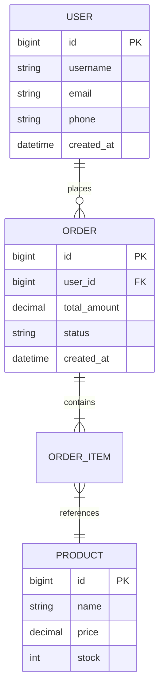

<!--
  模板说明: PRD (Product Requirements Document) 产品需求文档
  用途: 用于完整描述产品的功能需求、非功能需求、用户场景等，作为开发团队的核心参考文档
  变量列表:
    {{project_name}}       - 项目名称
    {{version}}            - 文档版本号 (如 v1.0)
    {{date}}               - 文档日期 (YYYY-MM-DD格式)
    {{author}}             - 作者/负责人
    {{status}}             - 文档状态 (Draft/Review/Approved/Archived)
    {{stakeholder}}        - 利益相关者列表
    {{background}}         - 项目背景描述
    {{objectives}}         - 项目目标列表
    {{success_metrics}}    - 成功指标（可量化）
    {{out_of_scope}}       - 不在范围内的事项
    {{user_roles}}         - 用户角色定义
    {{user_journey}}       - 用户旅程地图
    {{scenarios}}          - 使用场景列表
    {{features_p0}}        - P0优先级功能清单
    {{features_p1}}        - P1优先级功能清单
    {{features_p2}}        - P2优先级功能清单
    {{nfr_performance}}    - 非功能需求-性能
    {{nfr_security}}       - 非功能需求-安全
    {{nfr_availability}}   - 非功能需求-可用性
    {{nfr_compatibility}}  - 非功能需求-兼容性
    {{nfr_maintainability}}- 非功能需求-可维护性
    {{data_entities}}      - 数据实体关系
    {{data_dictionary}}    - 数据字典
    {{data_flow}}          - 数据流描述
    {{ui_principles}}      - UI/UX交互原则
    {{visual_specs}}       - 视觉规范
    {{accessibility}}      - 无障碍要求
    {{tech_stack}}         - 技术栈约束
    {{time_constraint}}    - 时间约束
    {{budget_constraint}}  - 预算约束
    {{team_constraint}}    - 团队约束
    {{third_party_deps}}   - 第三方依赖
    {{risk_matrix}}        - 风险评估矩阵
    {{glossary}}           - 术语表
    {{competitive_analysis}}- 竞品分析
    {{references}}         - 参考文档
  使用方式: 将此文件复制为具体项目的PRD，替换所有{{变量}}占位符为实际内容
-->

# {{project_name}} — 产品需求文档 (PRD)

> **版本**: {{version}} | **日期**: {{date}} | **作者**: {{author}} | **状态**: {{status}}

---

## 📋 文档变更记录

| 版本 | 日期 | 作者 | 变更内容 | 状态 |
|------|------|------|----------|------|
| v0.1 | {{date}} | {{author}} | 初稿创建 | Draft |
| <!-- COMMENT: 每次修改请在此追加一行记录 --> | | | | |

---

## 1. 项目背景与目标

### 1.1 背景

<!-- COMMENT: 描述为什么需要做这个项目，当前痛点是什么，市场机会或内部需求 -->

{{background}}

**示例**: 当前系统存在以下核心问题：
- 用户注册流程繁琐，转化率低于行业平均水平15%
- 缺乏统一的数据分析能力，运营决策缺乏数据支撑
- 竞品已推出类似功能，市场窗口期约6个月

### 1.2 目标

<!-- COMMENT: 列出项目要达成的SMART目标 -->

{{objectives}}

**示例目标**:

| 编号 | 目标描述 | 衡量标准 | 截止时间 |
|------|----------|----------|----------|
| O1 | 提升用户注册转化率 | 注册转化率从25%提升至40% | Q2结束 |
| O2 | 实现数据驱动决策 | 上线后30天内完成3份数据分析报告 | 上线后30天 |
| O3 | 建立可扩展架构 | 支撑未来12个月10倍业务增长 | 上线时 |

### 1.3 成功指标

<!-- COMMENT: 定义如何判断项目是否成功，必须可量化、可测量 -->

{{success_metrics}}

**示例**:

| 指标名称 | 当前值 | 目标值 | 测量方式 | 验收时间 |
|----------|--------|--------|----------|----------|
| 日活跃用户(DAU) | 5,000 | 20,000 | 埋点统计 | 上线后90天 |
| 页面平均加载时间 | 3.2s | <1.5s | APM监控 | 上线时 |
| 系统可用性(SLA) | N/A | 99.9% | 监控告警 | 持续 |
| 用户满意度(NPS) | 32 | >60 | 问卷调查 | 上线后60天 |

### 1.4 不在范围内

<!-- COMMENT: 明确列出本次迭代不做的事情，防止范围蔓延 -->

{{out_of_scope}}

**示例**:
- ❌ 移动端App原生开发（仅支持H5/小程序）
- ❌ 国际化多语言支持
- ❌ 第三方支付对接（仅支持内部支付）
- ❌ 高级权限管理系统（RBAC基础版即可）

---

## 2. 用户画像与场景

### 2.1 用户角色

<!-- COMMENT: 定义目标用户群体及其特征 -->

{{user_roles}}

#### 角色卡片示例

| 角色 | 姓名(虚拟) | 年龄 | 职责 | 核心诉求 | 痛点 | 使用频率 |
|------|-----------|------|------|----------|------|----------|
| **管理员** | 张经理 | 35岁 | 运营总监 | 快速查看数据报表 | 手工统计耗时 | 每日多次 |
| **普通用户** | 李同学 | 22岁 | 大学生 | 一键完成操作 | 流程复杂 | 每周2-3次 |
| **访客** | 王先生 | 45岁 | 企业采购 | 了解产品功能 | 信息不透明 | 偶尔访问 |

### 2.2 用户旅程地图

<!-- COMMENT: 描述用户从接触到完成目标的全流程体验 -->

{{user_journey}}

```
阶段: 发现 → 注册 → 首次使用 → 日常使用 → 推荐/流失
      ↓        ↓         ↓           ↓          ↓
情绪: 😐好奇 → 😟疑虑 → 😀惊喜 → 🙂满意 → 🤩推荐
触点: 广告 → 登录页 → 引导页 → 功能区 → 分享按钮
痛点: 信息少 → 表单长 → 找不到 → 操作繁 → 无入口
```

### 2.3 使用场景

<!-- COMMENT: 具体的用户使用场景描述 -->

{{scenarios}}

**场景示例**:

> **场景1: 管理员导出月度报表**
>
> 张经理需要在每月5号前向管理层提交上月的运营数据报告。他登录系统后，进入"数据中心"模块，选择时间范围和指标维度，点击"导出"按钮，系统自动生成Excel格式的报表并下载到本地。整个过程应在2分钟内完成。

---

## 3. 功能需求列表

<!-- COMMENT: 所有功能按P0/P1/P2三级优先级排列。P0=必须有(Must Have), P1=应该有(Should Have), P2=可以有(Could Have) -->

### 3.1 P0 — 必须有 (Must Have)

{{features_p0}}

| 功能ID | 功能名称 | 功能描述 | 优先级 | 验收标准 | 所属迭代 |
|--------|----------|----------|--------|----------|----------|
| F001 | 用户注册与登录 | 支持手机号+验证码、邮箱+密码两种方式注册登录 | P0 | 1. 注册成功率>98%<br>2. 登录响应<500ms<br>3. 支持记住登录状态7天 | Sprint 1 |
| F002 | 个人信息管理 | 用户可查看和修改基本信息（昵称、头像、简介） | P0 | 1. 头像上传支持JPG/PNG，≤2MB<br>2. 修改实时生效<br>3. 敏感信息二次确认 | Sprint 1 |
| F003 | 核心业务功能A | <!-- COMMENT: 替换为实际功能 --> | P0 | <!-- COMMENT: 填写验收标准 --> | Sprint 1 |
| F004 | 核心业务功能B | <!-- COMMENT: 替换为实际功能 --> | P0 | <!-- COMMENT: 填写验收标准 --> | Sprint 2 |
| <!-- COMMENT: 继续添加P0功能 --> | | | | | |

### 3.2 P1 — 应该有 (Should Have)

{{features_p1}}

| 功能ID | 功能名称 | 功能描述 | 优先级 | 验收标准 | 所属迭代 |
|--------|----------|----------|--------|----------|----------|
| F101 | 数据搜索与筛选 | 支持关键词搜索和多维度组合筛选 | P1 | 1. 搜索结果返回<1s<br>2. 支持5个以上筛选项<br>3. 搜索结果高亮关键词 | Sprint 3 |
| F102 | 数据导出功能 | 支持将数据导出为Excel/CSV格式 | P1 | 1. 单次导出上限10万条<br>2. 导出进度可视化<br>3. 异步导出通知 | Sprint 3 |
| F103 | 消息通知中心 | 统一展示系统消息、业务通知、提醒 | P1 | 1. 支持已读/未读标记<br>2. 支持批量操作<br>3. 实时推送延迟<3s | Sprint 4 |
| <!-- COMMENT: 继续添加P1功能 --> | | | | | |

### 3.3 P2 — 可以有 (Could Have)

{{features_p2}}

| 功能ID | 功能名称 | 功能描述 | 优先级 | 验收标准 | 所属迭代 |
|--------|----------|----------|--------|----------|----------|
| F201 | 深色模式 | 支持亮色/暗色主题切换 | P2 | 1. 切换无闪烁<br>2. 记住用户偏好<br>3. 全页面覆盖 | Sprint 5 |
| F202 | 键盘快捷键 | 为高频操作提供键盘快捷键 | P2 | 1. 至少覆盖10个常用操作<br>2. 快捷键面板可查<br>3. 与浏览器快捷键不冲突 | Sprint 5 |
| F203 | 批量导入功能 | 支持通过Excel模板批量导入数据 | P2 | 1. 支持模板下载<br>2. 错误数据行内标注<br>3. 导入结果反馈 | Sprint 6 |
| <!-- COMMENT: 继续添加P2功能 --> | | | | | |

---

## 4. 非功能性需求

### 4.1 性能需求

{{nfr_performance}}

| 指标项 | 要求值 | 测量方法 | 备注 |
|--------|--------|----------|------|
| 页面首屏加载时间(FCP) | ≤ 1.5s | Lighthouse / RUM | 95分位数 |
| API接口响应时间(P99) | ≤ 500ms | APM工具 | 核心接口 |
| 并发用户数支持 | ≥ 5,000 | 压测工具(JMeter) | 正常负载下 |
| 数据库查询响应(P95) | ≤ 200ms | 慢查询日志 | 复杂查询除外 |
| 文件上传速度 | ≥ 5MB/s | 客户端计时 | 100MB文件测试 |

### 4.2 安全需求

{{nfr_security}}

| 安全领域 | 要求 | 实现方式 | 验证方法 |
|----------|------|----------|----------|
| 身份认证 | JWT Token + Refresh机制 | OAuth2.0 + 双因素认证(可选) | 渗透测试 |
| 数据传输 | 全链路HTTPS加密 | TLS 1.3 | SSL Labs A+评级 |
| 密码存储 | BCrypt哈希加盐 | salt长度≥16位 | 代码审查 |
| SQL注入防护 | 参数化查询 + ORM框架 | MyBatis/Hibernate | SAST扫描 |
| XSS防护 | 输入过滤 + CSP策略 | DOMPurify + Content-Security-Policy | DAST扫描 |
| 权限控制 | RBAC模型，最小权限原则 | 自研或集成Casbin | 权限矩阵审计 |
| 日志审计 | 关键操作留痕 | 结构化日志(ELK) | 日志回溯验证 |
| 数据脱敏 | 敏感字段掩码显示 | ***规则配置 | UI检查 |

### 4.3 可用性需求

{{nfr_availability}}

| 可用性指标 | 目标值 | 计算方式 | SLA承诺 |
|------------|--------|----------|---------|
| 系统可用性 | ≥ 99.9% | (总时间-故障时间)/总时间 × 100% | 月度SLA |
| 计划内维护窗口 | 每月≤4小时 | 提前48小时通知 | 维护公告 |
| 故障恢复时间(RTO) | ≤ 30分钟 | 从发现到恢复服务 | 应急预案 |
| 数据恢复点目标(RPO) | ≤ 5分钟 | 最大可接受数据丢失量 | 备份策略 |
| 降级方案 | 核心功能可用 | 非关键功能优雅降级 | 熔断机制 |

### 4.4 兼容性需求

{{nfr_compatibility}}

| 兼容类别 | 要求范围 | 测试覆盖 |
|----------|----------|----------|
| 浏览器 | Chrome ≥ 90, Firefox ≥ 88, Safari ≥ 14, Edge ≥ 90 | 全部必测 |
| 移动端 | iOS Safari ≥ 14, Android Chrome ≥ 90 | 响应式适配 |
| 屏幕分辨率 | 1920×1080(桌面), 375×667(移动端最小) | 断点测试 |
| 操作系统 | Windows 10+, macOS 11+, Ubuntu 20.04+ | 主要OS |
| API版本 | 向后兼容至少2个大版本 | 版本管理策略 |

### 4.5 可维护性需求

{{nfr_maintainability}}

| 维护性维度 | 标准 | 工具/方法 |
|------------|------|-----------|
| 代码覆盖率 | 单元测试≥80%, 集成测试≥60% | Jest / Pytest |
| 代码复杂度 | 圈复杂度≤15 per function | SonarQube |
| 文档完整性 | API文档覆盖率100% | Swagger/OpenAPI |
| 可观测性 | 三大支柱全覆盖(Log/Metric/Trace) | ELK + Prometheus + Jaeger |
| 配置管理 | 环境配置外部化，12-Factor | Config Server / .env |
| CI/CD流水线 | 主分支PR自动触发 | GitHub Actions / GitLab CI |

---

## 5. 数据需求

### 5.1 实体关系概述

<!-- COMMENT: 描述系统中的核心数据实体及其关系，建议配合ER图 -->

{{data_entities}}



### 5.2 数据字典

<!-- COMMENT: 对每个实体的字段进行详细说明 -->

{{data_dictionary}}

#### User（用户表）

| 字段名 | 数据类型 | 约束 | 默认值 | 说明 |
|--------|----------|------|--------|------|
| id | BIGINT | PRIMARY KEY, AUTO_INCREMENT | - | 用户唯一标识 |
| username | VARCHAR(50) | NOT NULL, UNIQUE | - | 用户名，2-50字符 |
| email | VARCHAR(100) | NOT NULL, UNIQUE | - | 邮箱地址 |
| phone | VARCHAR(20) | UNIQUE | NULL | 手机号（可选） |
| password_hash | VARCHAR(255) | NOT NULL | - | BCrypt加密后的密码 |
| avatar_url | VARCHAR(500) | | NULL | 头像URL |
| status | TINYINT | NOT NULL | 1 | 状态: 0=禁用, 1=正常, 2=待验证 |
| last_login_at | DATETIME | | NULL | 最后登录时间 |
| created_at | DATETIME | NOT NULL | CURRENT_TIMESTAMP | 创建时间 |
| updated_at | DATETIME | NOT NULL | CURRENT_TIMESTAMP ON UPDATE | 更新时间 |

### 5.3 数据流

<!-- COMMENT: 描述关键业务数据的流转过程 -->

{{data_flow}}

**核心数据流示例: 用户下单流程**

```
[用户] --选择商品--> [购物车] --提交订单--> [订单服务]
                                              |
                                    +---------+---------+
                                    ↓                   ↓
                              [库存扣减]           [支付服务]
                                    |                   |
                                    ↓                   ↓
                              [订单确认] <--支付成功--- [支付回调]
                                    |
                                    ↓
                              [通知服务] --> [用户]收到订单确认
```

---

## 6. UI/UX需求

### 6.1 交互设计原则

{{ui_principles}}

| 原则 | 说明 | 示例 |
|------|------|------|
| **一致性** | 相同功能在不同页面保持一致的交互方式 | 所有删除操作均需二次确认弹窗 |
| **即时反馈** | 用户操作后300ms内给出视觉/状态反馈 | 按钮点击态、Loading骨架屏 |
| **容错性** | 允许撤销操作，错误信息清晰可理解 | 表单校验提示定位到具体字段 |
| **效率优先** | 减少用户操作步骤，支持快捷操作 | 批量操作、键盘快捷键 |
| **渐进式披露** | 信息按需展示，避免认知过载 | 高级选项默认折叠 |

### 6.2 视觉规范

{{visual_specs}}

| 设计元素 | 规范值 | 备注 |
|----------|--------|------|
| 主色调 | #1890FF (Ant Design Blue) | 品牌主色 |
| 辅助色 | #52C41A (成功), #FF4D4F (错误), #FAAD14 (警告) | 语义化色彩 |
| 字体 | -apple-system, BlinkMacSystemFont, 'Segoe UI', Roboto | 系统字体栈 |
| 标题字号 | H1: 30px / H2: 24px / H3: 20px / H4: 16px | 字重600 |
| 正文字号 | 14px (桌面) / 16px (移动端) | 行高1.5 |
| 圆角 | 按钮8px, 卡片8px, 输入框4px | 统一圆角体系 |
| 间距基准 | 8px网格系统 | 使用8的倍数 |
| 图标尺寸 | 16px(行内), 24px(导航), 48px(图标按钮) | 线宽1.5px |
| 阴影 | 0 2px 8px rgba(0,0,0,0.09) | 卡片阴影 |
| 动画时长 | 200ms(微交互), 300ms(转场) | ease-out缓动 |

### 6.3 无障碍要求

{{accessibility}}

| WCAG级别 | 要求 | 实现细节 |
|----------|------|----------|
| **A级(必须)** | 图片替代文本 | 所有包含alt属性 |
| **A级(必须)** | 键盘可访问 | 所有交互元素可通过Tab键到达 |
| **AA级(应该)** | 色彩对比度 | 文本对比度≥4.5:1, 大文本≥3:1 |
| **AA级(应该)** | 焦点可见 | 焦点轮廓明显可见(非仅颜色区分) |
| **AAA级(理想)** | 字体缩放 | 支持200%缩放不丢失内容/功能 |
| **屏幕阅读器** | ARIA标签 | 动态内容区域使用aria-live |

---

## 7. 约束条件

### 7.1 技术栈约束

{{tech_stack}}

| 层面 | 技术/工具 | 版本约束 | 选型理由 |
|------|-----------|----------|----------|
| 前端框架 | React / Vue 3 | ^18.0 / ^3.3 | 团队技术栈统一 |
| UI组件库 | Ant Design 5.x / Element Plus | ^5.0 | 企业级UI规范 |
| 后端框架 | Spring Boot 3.x / FastAPI | ^3.2 / ^0.100 | 微服务就绪 |
| 数据库 | PostgreSQL 15 / MySQL 8.0 | >= 15 / >= 8.0 | ACID事务支持 |
| 缓存 | Redis 7.x | >= 7.0 | 会话缓存/分布式锁 |
| 消息队列 | Apache Kafka / RabbitMQ | ^3.6 / ^3.12 | 异步解耦 |
| 容器化 | Docker + Kubernetes | >= 24.0 / >= 1.28 | 云原生部署 |
| CI/CD | GitHub Actions / GitLab CI | - | 自动化流水线 |

### 7.2 时间约束

{{time_constraint}}

| 里程碑 | 计划日期 | 交付物 | 负责人 |
|--------|----------|--------|--------|
| 需求评审完成 | {{date}} | PRD v1.0 Approved | Product Owner |
| 技术方案评审 | +2周 | 架构设计文档 | Tech Lead |
| Alpha版本发布 | +6周 | 内部测试版 | 开发团队 |
| Beta版本发布 | +10周 | 有限用户公测 | QA团队 |
| 正式版本(GA) | +14周 | 生产环境上线 | 全团队 |
| 稳定期运维 | +26周 | SLA达标运行 | Ops团队 |

### 7.3 预算约束

{{budget_constraint}}

| 类别 | 预算(万元) | 说明 |
|------|-----------|------|
| 云资源成本 | {{budget_cloud | default('待定')}} | 服务器/数据库/CDN等 |
| 第三方服务 | {{budget_3rd_party | default('待定')}} | 支付/短信/地图等API |
| 人力成本 | {{budget_hr | default('待定')}} | 团队人力投入 |
| 应急储备 | 总预算的15% | 风险应对缓冲 |
| **合计** | {{budget_total | default('待定')}} | - |

### 7.4 团队约束

{{team_constraint}}

| 角色 | 人数 | 职责 | 可用时间 |
|------|------|------|----------|
| 产品经理 | 1 | 需求管理/优先级排序/验收 | 100% |
| 前端开发 | 2 | UI实现/交互逻辑/性能优化 | 100% |
| 后端开发 | 3 | API开发/数据库设计/系统集成 | 100% |
| 测试工程师 | 1 | 用例设计/自动化测试/质量保障 | 100% |
| DevOps工程师 | 0.5 | CI/CD/部署/监控 | 50% |
| UI设计师 | 0.5 | 视觉设计/交互原型 | 50% |

### 7.5 第三方依赖

{{third_party_deps}}

| 服务/库 | 用途 | 许可证 | 风险等级 | 备选方案 |
|---------|------|--------|----------|----------|
| <!-- COMMENT: 列出所有第三方依赖 --> | | | | |

---

## 8. 风险评估

<!-- COMMENT: 风险矩阵：影响程度(1-5) × 发生可能性(1-5)，风险值=影响×可能性 -->

{{risk_matrix}}

| 风险ID | 风险描述 | 影响程度(1-5) | 可能性(1-5) | 风险值 | 风险等级 | 缓解措施 | 负责人 | 状态 |
|--------|----------|---------------|-------------|--------|----------|----------|--------|------|
| R01 | 核心技术人员离职 | 5 | 2 | 10 | 中 | 知识共享/文档完善/交叉培训 | Tech Lead | 监控中 |
| R02 | 第三方API服务不可用 | 4 | 3 | 12 | 中高 | 降级方案/多供应商策略 | Backend Lead | 监控中 |
| R03 | 需求变更频繁导致延期 | 4 | 4 | 16 | 高 | 冻结需求基线/变更控制流程 | PM | 监控中 |
| R04 | 性能不达标 | 3 | 3 | 9 | 中 | 早期压测/性能预算预留 | 全团队 | 监控中 |
| R05 | 安全漏洞暴露 | 5 | 2 | 10 | 中 | 安全编码规范/SAST+DAST扫描 | Security | 监控中 |
| R06 | 数据迁移失败 | 4 | 2 | 8 | 中低 | 灰度迁移/回滚预案 | DBA | 监控中 |
| <!-- COMMENT: 继续添加风险项 --> | | | | | | | | |

**风险等级划分**:
- 🔴 **高风险** (风险值 ≥ 15): 需立即制定应对计划，上报管理层
- 🟡 **中高风险** (10 ≤ 风险值 < 15): 制定缓解措施，每周跟踪
- 🟠 **中等风险** (6 ≤ 风险值 < 10): 记录在案，每两周回顾
- 🟢 **低风险** (风险值 < 6): 接受风险，持续观察

---

## 9. 术语表

{{glossary}}

| 术语 | 英文全称 | 定义 | 首次出现章节 |
|------|----------|------|--------------|
| PRD | Product Requirements Document | 产品需求文档，描述产品功能的正式文档 | 本文档 |
| MVP | Minimum Viable Product | 最小可行产品，包含核心功能的最小版本 | §1.2 |
| SLA | Service Level Agreement | 服务水平协议，定义服务质量承诺 | §4.3 |
| RBAC | Role-Based Access Control | 基于角色的访问控制模型 | §4.2 |
| RTO | Recovery Time Objective | 恢复时间目标，从故障到恢复的最大时长 | §4.3 |
| RPO | Recovery Point Objective | 恢复点目标，最大可接受的数据丢失量 | §4.3 |
| DAU | Daily Active Users | 日活跃用户数 | §1.3 |
| FC | First Contentful Paint | 首次内容绘制，Web性能指标 | §4.1 |
| WCAG | Web Content Accessibility Guidelines | Web内容无障碍指南 | §6.3 |
| APM | Application Performance Management | 应用性能管理工具/平台 | §4.1 |
| <!-- COMMENT: 继续添加术语 --> | | | |

---

## 附录

### A. 竞品分析

{{competitive_analysis}}

| 竞品 | 核心优势 | 核心劣势 | 我们的机会 | 差异化策略 |
|------|----------|----------|------------|------------|
| 竞品A | 市占有率高 | 价格昂贵 | 性价比市场 | 更优定价+本地化 |
| 竞品B | 功能丰富 | 学习曲线陡峭 | 易用性需求 | 简洁UI+引导式体验 |
| 竞品C | 新兴技术 | 生态不成熟 | 企业信任度 | 稳定性+专业服务 |
| <!-- COMMENT: 添加更多竞品 --> | | | | |

### B. 参考文档

{{references}}

| 文档名称 | 链接/路径 | 相关章节 | 负责人 |
|----------|-----------|----------|--------|
| 技术架构设计文档 | `docs/architecture/design.md` | §7.1 | Tech Lead |
| API接口文档 | `docs/api/openapi.yaml` | §3 | Backend Lead |
| 数据库设计文档 | `docs/database/schema.sql` | §5 | DBA |
| UI设计稿 | `designs/Figma/` | §6 | Designer |
| 项目排期计划 | `docs/planning/gantt.md` | §7.2 | PM |
| <!-- COMMENT: 添加更多参考文档 --> | | | |

---

> **文档审批**

| 角色 | 姓名 | 签字 | 日期 |
|------|------|------|------|
| 产品负责人 | _________________ | | |
| 技术负责人 | _________________ | | |
| 测试负责人 | _________________ | | |
| 项目经理 | _________________ | | |

---

*本文档基于 {{project_name}} 项目需求编写，最后更新于 {{date}}。*
