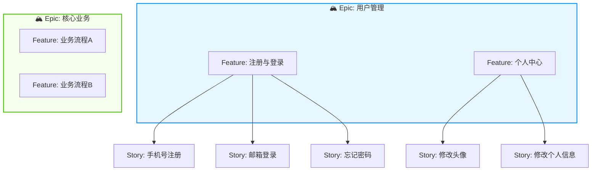

<!--
  模板说明: User Story 用户故事文档
  用途: 以用户视角描述功能需求，配合验收标准(AC)和故事地图，用于敏捷开发迭代规划
  变量列表:
    {{project_name}}          - 项目/产品名称
    {{sprint_name}}           - 迭代名称 (如 Sprint 12)
    {{epic_list}}             - Epic（史诗）列表
    {{feature_list}}          - Feature（特性）列表
    {{story_list}}            - Story（用户故事）列表
    {{story_id}}              - 故事唯一标识
    {{story_title}}           - 故事标题
    {{user_role}}             - 用户角色
    {{user_want}}             - 用户想要什么
    {{user_benefit}}          - 用户获得的价值
    {{acceptance_criteria}}   - 验收标准列表
    {{story_points}}          - 故事点估算
    {{complexity}}            - 复杂度评估
    {{priority}}              - 优先级
    {{dependencies}}          - 依赖关系
    {{assignee}}              - 负责人
    {{iteration}}             - 所属迭代
  使用方式: 每个Sprint创建一份Story文件，或按Epic组织，替换{{变量}}为实际内容
-->

# {{project_name}} — 用户故事 (User Stories)

> **迭代**: {{sprint_name | default('Sprint 1')}} | **更新日期**: {{date | default('YYYY-MM-DD')}} | **负责人**: {{product_owner | default('Product Owner')}}

---

## 📖 故事地图总览

<!-- COMMENT: 故事地图按 Epic → Feature → Story 三层结构组织，帮助团队理解全貌 -->



---

## 🗺️ Epic 列表

| Epic ID | Epic 名称 | 描述 | 关联 Feature 数 | 状态 | 目标迭代 |
|---------|-----------|------|-----------------|------|----------|
| E-001 | 用户管理 | 覆盖用户从注册到日常使用的完整生命周期 | 4 | 🟢 进行中 | Sprint 1-2 |
| E-002 | 核心业务 | <!-- COMMENT: 替换 --> | 0 | ⚪ 待开始 | Sprint 3-5 |
| E-003 | 数据分析 | <!-- COMMENT: 替换 --> | 0 | ⚪ 待开始 | Sprint 6+ |
| <!-- COMMENT: 继续添加Epic --> | | | | | |

---

## 📦 Feature 列表

### Feature: 注册与登录 (F-001)

**所属 Epic**: E-001 | **优先级**: P0 | **状态**: 🟢 开发中

| Feature ID | 描述 | 包含 Story 数 | 预估总故事点 |
|------------|------|---------------|--------------|
| F-001 | 提供多种注册登录方式，确保安全便捷的用户接入体验 | 5 | 21 |

---

## 🃏 用户故事详情

---

### 📌 Story {{story_id | default('US-001')}}: {{story_title | default('作为新用户，我希望通过手机号快速注册账号')}}

#### 故事卡片

| 字段 | 内容 |
|------|------|
| **As a** (角色) | {{user_role | default('新用户')}} |
| **I want to** (想要) | {{user_want | default('通过手机号 + 验证码的方式快速注册一个新账号')}} |
| **So that** (以便) | {{user_benefit | default('我可以立即开始使用产品的核心功能，无需等待邮箱验证')}} |

#### 元数据

| 属性 | 值 |
|------|-----|
| **故事ID** | US-001 |
| **优先级** | {{priority | default('P0 - Must Have')}} |
| **故事点** | {{story_points | default('5')}} (基于斐波那契数列: 1,2,3,5,8,13,21...) |
| **复杂度** | {{complexity | default('中等 - 涉及前端表单、后端API、短信服务三方集成')}} |
| **所属迭代** | {{iteration | default('Sprint 1')}} |
| **负责人** | {{assignee | default('张三 (前端) / 李四 (后端)')}} |
| **依赖项** | {{dependencies | default('无前置依赖')}} |
| **状态** | 🔵 Todo → 🟡 In Progress → 🟢 Done |

#### 验收标准 (Acceptance Criteria)

<!-- COMMENT: 使用 Given/When/Then 格式编写可测试的验收条件 -->

**AC-1: 基本注册流程**

```gherkin
Scenario: 用户通过手机号成功注册新账号
  Given 用户在注册页面
  And 用户输入有效的手机号码 "13800138000"
  And 点击"获取验证码"按钮
  When 系统发送短信验证码至该手机号
  And 用户在60秒内输入正确的6位验证码
  And 设置密码符合规则（8-20位，含字母和数字）
  And 同意《用户协议》和《隐私政策》
  And 点击"注册"按钮
  Then 系统创建新用户账号
  And 自动登录并跳转至首页
  And 显示注册成功提示消息
```

**AC-2: 输入校验**

```gherkin
Scenario Outline: 注册表单字段校验
  Given 用户在注册页面填写注册信息
  When 输入的手机号为 "<phone>"
  Then 系统显示 "<expected_message>"

  Examples:
    | phone               | expected_message                |
    | ""                  | 请输入手机号码                   |
    | "12345"             | 请输入正确的11位手机号码          |
    | "13800138000"(已注册)| 该手机号已被注册，请直接登录       |
```

**AC-3: 安全要求**

```gherkin
Scenario: 防止短信轰炸
  Given 用户已点击获取验证码
  When 在60秒倒计时结束前再次点击获取验证码
  Then 按钮保持禁用状态
  And 显示剩余等待秒数

Scenario: 密码强度校验
  Given 用户设置密码
  When 密码不符合安全规则
  Then 实时显示密码强度指示器
  And 明确提示不满足的规则（如：需包含大写字母）
```

**AC-4: 异常场景**

```gherkin
Scenario: 验证码过期后提交
  Given 用户已获取验证码但超过5分钟未使用
  When 用户输入过期的验证码并提交注册
  Then 显示"验证码已过期，请重新获取"
  And 不消耗用户的尝试次数

Scenario: 网络异常时的体验
  Given 用户在弱网络环境下操作
  When 点击注册按钮后网络中断
  Then 显示友好的网络错误提示
  And 提供"重试"按钮
  And 已填写的表单数据保留不丢失
```

#### 技术备注

<!-- COMMENT: 开发者在此记录技术实现要点、注意事项等 -->

- [ ] 前端：表单组件复用现有 `Form` 组件库，新增 `PhoneInput` 和 `VerificationCodeInput`
- [ ] 后端：调用短信网关接口（阿里云SMS/腾讯云SMS），需要配置模板ID
- [ ] 安全：验证码存储于Redis，TTL=300秒，限制同一IP每分钟最多3次请求
- [ ] 性能：注册接口响应时间目标 < 500ms (P99)
- [ ] 测试：需覆盖正常流 + 至少5个异常分支的自动化用例

#### 关联信息

| 类型 | 标识 | 说明 |
|------|------|------|
| PRD需求 | F001 | 对应PRD中的用户注册功能 |
| 设计稿 | `Figma/RegisterFlow` | 注册流程设计稿链接 |
| API文档 | `POST /api/v1/auth/register` | 注册接口定义 |
| 任务拆分 | TASK-101 ~ TASK-108 | 开发任务子项 |
| Issue | #123 | Jira/GitHub Issue 编号 |

---

### 📌 Story US-002: 作为已注册用户，我希望通过手机号+密码快速登录

#### 故事卡片

| 字段 | 内容 |
|------|------|
| **As a** | 已注册用户 |
| **I want to** | 通过手机号和密码快速登录系统 |
| **So that** | 我可以访问我的个人数据和已保存的内容 |

#### 元数据

| 属性 | 值 |
|------|-----|
| **故事ID** | US-002 |
| **优先级** | P0 - Must Have |
| **故事点** | 3 |
| **复杂度** | 低 - 标准登录逻辑 |
| **所属迭代** | Sprint 1 |
| **负责人** | 待分配 |
| **依赖项** | US-001 (注册完成后才有用户可登录) |
| **状态** | 🔵 Todo |

#### 验收标准

**AC-1: 正常登录**

```gherkin
Scenario: 使用正确凭证成功登录
  Given 用户在登录页面
  And 用户输入已注册的手机号和正确密码
  When 点击"登录"按钮
  Then 系统验证凭据成功
  And 生成JWT Token并设置到Cookie/LocalStorage
  And 跳转到用户上次访问的页面或首页
  And 登录状态在7天内保持有效
```

**AC-2: 登录失败处理**

```gherkin
Scenario: 密码错误时给出明确反馈
  Given 用户输入正确的手机号
  But 输入错误的密码
  When 点击"登录"按钮
  Then 显示"手机号或密码错误"提示
  And 记录失败次数
  And 连续失败5次后触发账户锁定15分钟

Scenario: 未注册手机号登录
  Given 用户输入未注册过的手机号
  When 尝试登录
  Then 提示"该手机号尚未注册"
  And 提供"去注册"快捷入口
```

**AC-3: 记住登录状态**

```gherkin
Scenario: 选择记住我选项
  Given 用户勾选"记住我(7天)"选项
  And 成功登录
  When 7天内再次访问网站
  Then 自动恢复登录状态
  And 无需重新输入密码
```

#### 技术备注

- [ ] Token策略: Access Token(15min) + Refresh Token(7d)，双Token机制
- [ ] 安全: 登录接口限流(同IP 10次/分钟)，密码错误计数器(Redis)
- [ ] 日志: 记录登录IP、设备指纹、时间用于安全审计
- [ ] 兼容: 支持SSO单点登录预留接口

---

### 📌 Story US-003: 作为忘记密码的用户，我希望通过手机验证码重置密码

#### 故事卡片

| 字段 | 内容 |
|------|------|
| **As a** | 忘记密码的用户 |
| **I want to** | 通过手机验证码重置我的密码 |
| **So that** | 我可以重新获得账号访问权限，无需联系客服 |

#### 元数据

| 属性 | 值 |
|------|-----|
| **故事ID** | US-003 |
| **优先级** | P0 - Must Have |
| **故事点** | 5 |
| **复杂度** | 中 - 涉及身份验证+密码重置流程 |
| **所属迭代** | Sprint 1 |
| **负责人** | 待分配 |
| **依赖项** | US-001 (依赖注册时绑定的手机号) |
| **状态** | 🔵 Todo |

#### 验收标准

**AC-1: 找回密码完整流程**

```gherkin
Scenario: 通过手机验证码重置密码
  Given 用户在登录页点击"忘记密码"
  And 输入注册时绑定的手机号
  And 获取并输入正确的验证码
  When 输入两次一致的新密码
  And 符合密码强度规则
  And 点击"确认重置"
  Then 密码更新成功
  And 自动使用新密码登录
  And 提示"密码已重置，建议勿与他人共享"
```

**AC-2: 安全防护**

```gherkin
Scenario: 重置密码后的旧密码失效
  Given 用户A完成密码重置
  When 使用旧密码尝试登录
  Then 登录失败
  And 提示密码错误
```

#### 技术备注

- [ ] 重置密码后应使所有活跃Session失效（强制重新登录）
- [ ] 新密码不能与最近3次使用的密码相同（密码历史检查）
- [ ] 发送密码变更通知邮件/SMS给用户

---

### 📌 Story US-004: 作为用户，我希望上传和更换个人头像

#### 故事卡片

| 字段 | 内容 |
|------|------|
| **As a** | 已登录用户 |
| **I want to** | 上传自定义图片作为个人头像 |
| **So that** | 我的个人资料更加个性化和易于识别 |

#### 元数据

| 属性 | 值 |
|------|-----|
| **故事ID** | US-004 |
| **优先级** | P1 - Should Have |
| **故事点** | 3 |
| **复杂度** | 低 - 文件上传标准实现 |
| **所属迭代** | Sprint 2 |
| **负责人** | 待分配 |
| **依赖项** | US-002 (需先能登录) |
| **状态** | 🔵 Todo |

#### 验收标准

**AC-1: 头像上传**

```gherkin
Scenario: 上传有效图片作为头像
  Given 用户已登录并在个人设置页面
  When 点击头像区域选择本地图片文件(JPG/PNG, ≤2MB)
  And 图片尺寸在 200x200 到 4096x4096 之间
  Then 显示裁剪预览界面
  And 用户调整裁剪区域后确认
  Then 头像更新为裁剪后的圆形图片
  And 图片自动压缩优化后上传至OSS
```

**AC-2: 格式与大小限制**

```gherkin
Scenario Outline: 无效文件类型拒绝
  Given 用户选择上传文件
  When 文件格式为 "<file_type>"
  Then 系统拒绝上传
  And 提示"仅支持JPG、PNG、GIF格式"

  Examples:
    | file_type |
    | .bmp      |
    | .svg      |
    | .exe      |
    | (大于2MB) |
```

#### 技术备注

- [ ] 前端使用 `canvas` 进行客户端裁剪和压缩
- [ ] 后端接收Base64或multipart/form-data
- [ ] 存储至对象存储(OSS/S3)，生成多尺寸缩略图(48px/96px/192px)
- [ ] CDN加速头像访问

---

### 📌 Story US-005: 作为用户，我希望编辑个人基本信息

#### 故事卡片

| 字段 | 内容 |
|------|------|
| **As a** | 已登录用户 |
| **I want to** | 编辑昵称、个人简介、性别等基本信息 |
| **So that** | 我的个人资料保持准确和最新 |

#### 元数据

| 属性 | 值 |
|------|-----|
| **故事ID** | US-005 |
| **优先级** | P1 - Should Have |
| **故事点** | 3 |
| **复杂度** | 低 - CRUD操作 |
| **所属迭代** | Sprint 2 |
| **负责人** | 待分配 |
| **依赖项** | US-002 |
| **状态** | 🔵 Todo |

#### 验收标准

**AC-1: 信息编辑与实时预览**

```gherkin
Scenario: 成功修改昵称和个人简介
  Given 用户进入个人信息编辑页面
  When 修改昵称为"新的昵称"
  And 修改个人简介为"这是我的简介"
  And 点击"保存"
  Then 信息更新成功
  And 页面各处显示更新后的昵称
  And 显示"保存成功"Toast提示
```

**AC-2: 敏感信息修改二次确认**

```gherkin
Scenario: 修改绑定手机号需要验证
  Given 用户点击修改手机号
  When 输入新手机号
  Then 要求输入当前密码验证身份
  And 向新旧手机号分别发送验证码
  And 双方验证通过后才完成更改
```

#### 技术备注

- [ ] 敏感字段修改需要二次认证（密码/SMS验证码）
- [ ] 修改日志审计（谁、何时、改了什么）
- [ ] 昵称唯一性检查（可选，视业务需求）

---

## 📊 Sprint 规划汇总

### 本Sprint Backlog

| Story ID | 故事标题 | 优先级 | 故事点 | 负责人 | 状态 | 依赖 |
|----------|----------|--------|--------|--------|------|------|
| US-001 | 手机号注册 | P0 | 5 | 张三/李四 | 🟢 Done | 无 |
| US-002 | 手机号+密码登录 | P0 | 3 | 李四 | 🟡 In Progress | US-001 |
| US-003 | 忘记密码重置 | P0 | 5 | 李四 | 🔵 Todo | US-001 |
| US-004 | 上传更换头像 | P1 | 3 | 张三 | 🔵 Todo | US-002 |
| US-005 | 编辑个人信息 | P1 | 3 | 张三/李四 | 🔵 Todo | US-002 |
| **合计** | | | **19** | | | |

### 速度(Velocity)参考

| Sprint | 承诺故事点 | 完成故事点 | 实际速度 | 团队容量 |
|--------|-----------|-----------|----------|----------|
| Sprint 0 (历史) | 13 | 11 | 11 | 3人 |
| Sprint 1 (当前) | 19 | - | - | 3人 |
| Sprint 2 (预估) | ~20 | - | - | 3人 |

### 依赖关系图

```
US-001 (注册)
   ├──→ US-002 (登录)
   │         ├──→ US-004 (头像)
   │         └──→ US-005 (个人信息)
   └──→ US-003 (找回密码)
```

---

## 📝 定义完成 (Definition of Done - DoD)

每个Story完成后必须满足以下条件：

- [ ] **代码**: 所有代码已合并至主分支并通过Code Review
- [ ] **测试**: 单元测试覆盖率 ≥ 80%，所有AC对应的自动化测试通过
- [ ] **文档**: API文档已更新，README如有必要也已更新
- [ ] **部署**: 已部署至Staging环境并可访问
- [ ] **验收**: Product Owner已验收通过（Demo演示）
- [ ] **无阻塞性Bug**: 无P0/P1级别的已知缺陷
- [ ] **性能**: 接口响应时间满足NFR要求
- [ ] **安全**: 无已知安全漏洞（SAST/DAST扫描通过）

---

*本文档由 {{project_name}} 团队维护，遵循敏捷开发实践。*
