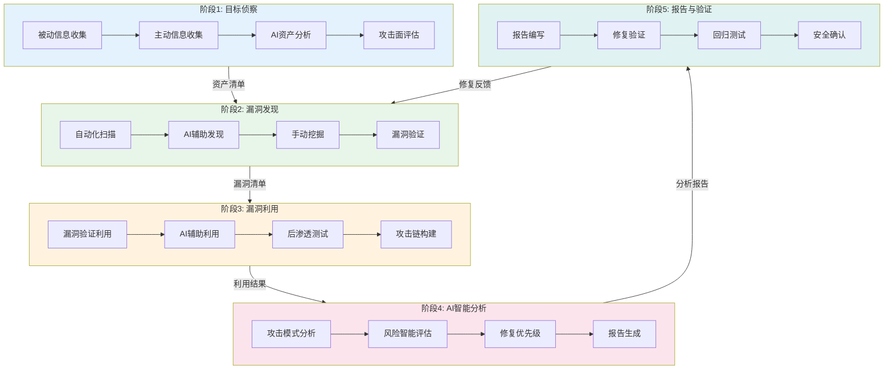
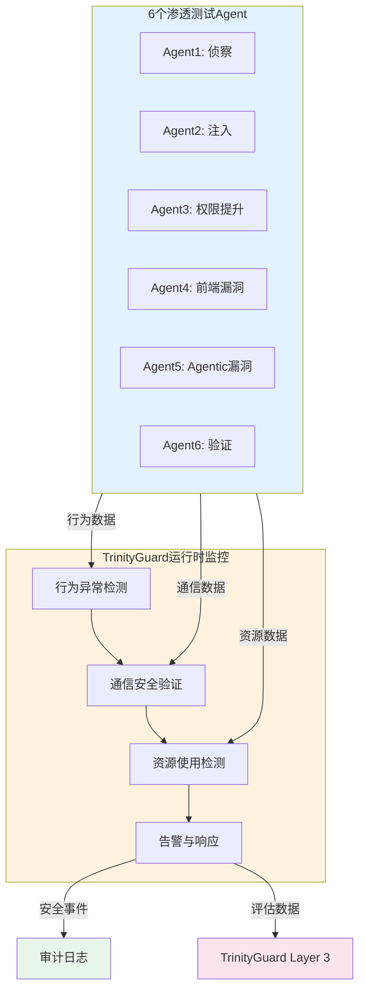

---
> 权威来源：_yaml/ai-pentest.yaml（YAML为准，本文档为可读参考）
metadata:
  name: AI渗透测试工作流
  version: "3.2.0"
  description: AI驱动渗透测试与Agentic安全验证
  platform: all
  min_agents: 2
  max_agents: 4
phases:
- id: phase-5
  name: AI渗透测试验证
  order: 0
  optional: false
  trigger_condition: 用户请求AI渗透测试或安全评估
  agents:
    primary:
    - ai-penetration-tester
    - penetration-tester
    - security-auditor
    supporting: []
  inputs:
  - name: 测试目标范围
    type: document
    required: true
  - name: 测试授权书
    type: document
    required: true
  outputs:
  - name: 资产清单
    type: document
    validation: 关键资产已识别
  - name: 攻击面地图
    type: document
    validation: 攻击面已分析
  - name: 漏洞清单
    type: document
    validation: 漏洞已验证且误报已排除
  - name: 渗透测试报告
    type: document
    validation: 报告完整准确
  - name: AI分析报告
    type: document
    validation: 分析结果准确且建议可执行
  - name: 修复验证报告
    type: document
    validation: 高危漏洞已修复
  quality_gates:
  - gate_id: GATE-001-A
    blocking: true
    pass_criteria: 授权范围已确认
  - gate_id: GATE-001-B
    blocking: true
    pass_criteria: 关键资产已识别
  - gate_id: GATE-012-A
    blocking: true
    pass_criteria: 扫描覆盖完整
  - gate_id: GATE-012-B
    blocking: true
    pass_criteria: 漏洞已验证
  - gate_id: GATE-012-C
    blocking: true
    pass_criteria: 误报已排除
  - gate_id: AI-PENTEST
    blocking: true
    pass_criteria: 关键漏洞已验证利用
  - gate_id: DOC-COMPLETENESS
    blocking: true
    pass_criteria: 报告完整准确
  timeout_minutes: 240
  retry:
    max_attempts: 3
    backoff: exponential
agent_matrix:
  ai-penetration-tester:
    phases:
    - phase-5
    role: primary
    max_parallel_instances: 1
  penetration-tester:
    phases:
    - phase-5
    role: primary
    max_parallel_instances: 1
  security-auditor:
    phases:
    - phase-5
    role: primary
    max_parallel_instances: 1
exception_handling:
  phase_failure:
    action: retry_then_escalate
    escalation_target: orchestrator
    max_retries: 3
  agent_unavailable:
    action: substitute_and_continue
    substitute_agent: penetration-tester
  quality_gate_blocked:
    action: auto_fix_then_pause
    auto_fix_agents:
    - ai-penetration-tester
    - penetration-tester
---

# AI渗透测试工作流

## 工作流名称
AI Penetration Testing Workflow（AI驱动的渗透测试工作流）

## 描述
利用AI技术增强的渗透测试工作流，结合自动化扫描与智能分析，高效识别系统安全漏洞。该工作流融合传统渗透测试方法与AI辅助分析，提供更全面、更智能的安全测试能力。

## 触发条件
- 用户请求AI渗透测试
- 安全评估需求
- 系统上线前安全验证
- 红队演练
- 安全合规要求
- 用户明确要求"AI渗透测试"、"智能渗透"、"红队测试"

## 涉及的Agent

### 核心Agent
| Agent | 角色 | 职责 |
|-------|------|------|
| ai-penetration-tester | AI渗透测试工程师 | AI辅助渗透、智能分析 |
| penetration-tester | 渗透测试工程师 | 传统渗透测试、漏洞验证 |
| security-auditor | 安全审计师 | 安全评估、风险分析 |

### 支撑Agent
| Agent | 角色 | 职责 |
|-------|------|------|
| security-tester | 安全测试工程师 | 自动化测试执行 |
| compliance-officer | 合规官 | 测试授权、合规确认 |

## 阶段定义

### 阶段1：目标侦察（Reconnaissance） **执行者**: ai-penetration-tester

**输入**:
- 测试目标范围
- 测试授权书

**活动**:
1. 被动信息收集
   - 域名信息收集
   - WHOIS查询
   - 搜索引擎信息
   - 社交工程信息
2. 主动信息收集
   - 端口扫描
   - 服务识别
   - 目录枚举
   - 子域名发现
3. AI辅助分析
   - 智能资产发现
   - 攻击面分析
   - 目标优先级排序

**输出**:
- 资产清单
- 攻击面地图
- 目标优先级列表

**质量门禁**:
- [ ] 授权范围已确认
- [ ] 关键资产已识别
- [ ] 攻击面已分析

---

### 阶段2：漏洞发现（Vulnerability Discovery） **执行者**: ai-penetration-tester, penetration-tester

**输入**:
- 资产清单
- 攻击面地图

**活动**:
1. 自动化漏洞扫描
   - 网络漏洞扫描
   - Web应用扫描
   - API安全测试
2. AI辅助漏洞发现
   - 智能模糊测试
   - 参数污染测试
   - 逻辑漏洞检测
   - 零日漏洞推测
3. 手动漏洞挖掘
   - 业务逻辑分析
   - 权限绕过测试
   - 认证机制测试

**输出**:
- 漏洞清单
- 漏洞详情报告
- AI分析建议

**质量门禁**:
- [ ] 扫描覆盖完整
- [ ] 漏洞已验证
- [ ] 误报已排除

---

### 阶段2.5：TrinityGuard运行时监控层检查

**执行者**: security-auditor

**输入**:
- 漏洞清单
- Agent行为数据
- 通信流量数据

**活动**:
1. Agent行为实时监控
   - 目标一致性监控（偏离度≤15%）
   - 工具调用模式异常检测（越权调用=0）
   - 输出内容安全检测（敏感信息泄露=0）
   - 决策路径异常检测（推理链断裂=0）
2. 通信安全监控
   - Agent间消息完整性校验
   - 通信加密状态监控（TLS 1.3+）
   - 重放攻击检测（Nonce+时间窗口）
   - 通信频率异常检测
3. 资源使用监控
   - CPU/内存使用异常检测
   - 网络流量异常检测
   - 工具调用频率异常检测
   - Token消耗异常检测
4. LLM Judge Factory评判
   - 调度安全评估Judge执行评判
   - 聚合评判结果，解决冲突
   - 生成综合安全评分（0-100）

**输出**:
- 运行时监控报告
- 安全评分
- 异常行为告警列表

**质量门禁**:
- [ ] 6个Agent行为监控全部启用
- [ ] Agent间通信安全验证全部通过
- [ ] 资源使用异常检测全部启用
- [ ] 无未处理的安全告警
- [ ] LLM Judge Factory综合评分≥80

---

### 阶段3：漏洞利用（Exploitation） **执行者**: penetration-tester

**输入**:
- 漏洞清单
- 测试环境

**活动**:
1. 漏洞验证利用
   - PoC开发与验证
   - 漏洞利用链构造
   - 权限获取测试
2. AI辅助利用
   - 智能Payload生成
   - 绕过技术建议
   - 利用路径优化
3. 后渗透测试
   - 权限提升
   - 横向移动
   - 持久化测试

**输出**:
- 漏洞利用报告
- PoC代码
- 攻击链图

**质量门禁**:
- [ ] 关键漏洞已验证
- [ ] 攻击路径已记录
- [ ] 测试痕迹已清理

---

### 阶段4：AI智能分析（AI Analysis） **执行者**: ai-penetration-tester

**输入**:
- 测试数据
- 漏洞利用结果

**活动**:
1. 攻击模式分析
   - 攻击路径建模
   - 攻击成本评估
   - 攻击者画像
2. 风险智能评估
   - 漏洞组合分析
   - 业务影响评估
   - 修复优先级建议
3. AI生成报告
   - 自然语言报告
   - 修复建议生成
   - 安全趋势分析

**输出**:
- AI分析报告
- 风险评估矩阵
- 修复优先级建议

**质量门禁**:
- [ ] 分析结果准确
- [ ] 建议可执行
- [ ] 报告清晰易懂

---

### 阶段5：报告与修复验证（Reporting & Verification） **执行者**: penetration-tester, security-auditor

**输入**:
- 测试结果
- AI分析报告

**活动**:
1. 渗透测试报告编写
   - 执行摘要
   - 详细发现
   - 风险评级
   - 修复建议
2. 修复验证测试
   - 修复效果验证
   - 回归测试
   - 安全确认

**输出**:
- 渗透测试报告
- 修复验证报告
- 安全改进建议

**质量门禁**:
- [ ] 报告完整准确
- [ ] 高危漏洞已修复
- [ ] 验证测试通过

## 流程图


## 输出产物清单

| 阶段 | 输出产物 | 格式 |
|------|----------|------|
| 目标侦察 | 资产清单 | Markdown/Excel |
| 目标侦察 | 攻击面地图 | Mermaid |
| 目标侦察 | 目标优先级列表 | Markdown |
| 漏洞发现 | 漏洞清单 | Markdown/JSON |
| 漏洞发现 | 漏洞详情报告 | Markdown |
| 漏洞利用 | 漏洞利用报告 | PDF |
| 漏洞利用 | PoC代码 | Python/脚本 |
| 漏洞利用 | 攻击链图 | Mermaid |
| AI分析 | AI分析报告 | Markdown/PDF |
| AI分析 | 风险评估矩阵 | Markdown |
| 报告验证 | 渗透测试报告 | PDF |
| 报告验证 | 修复验证报告 | Markdown |

## AI辅助能力

### 智能侦察
- **资产发现**: AI自动发现关联资产和隐藏服务
- **信息关联**: 自动关联多源信息，发现潜在攻击面
- **优先级排序**: 基于风险模型智能排序测试目标

### 智能漏洞发现
- **模糊测试优化**: AI生成针对性测试用例
- **逻辑漏洞检测**: 分析业务逻辑，发现设计缺陷
- **零日推测**: 基于已知模式推测潜在漏洞

### 智能利用
- **Payload生成**: AI生成定制化攻击载荷
- **绕过技术**: 智能推荐WAF/过滤绕过方法
- **利用优化**: 优化攻击路径，提高成功率

### 智能报告
- **自然语言生成**: 自动生成易读的测试报告
- **修复建议**: 智能生成针对性修复建议
- **趋势分析**: 分析安全趋势，预测未来风险

## 渗透测试方法论

### PTES标准
遵循渗透测试执行标准（PTES）：
1. 前期交互
2. 信息收集
3. 威胁建模
4. 漏洞分析
5. 漏洞利用
6. 后渗透
7. 报告

### OWASP测试指南
Web应用测试覆盖：
- 信息收集
- 配置管理
- 身份认证
- 授权测试
- 会话管理
- 输入验证
- 错误处理
- 密码学
- 业务逻辑

## 安全合规要求

### 测试授权
- [ ] 书面授权已获取
- [ ] 测试范围已明确
- [ ] 测试时间已确认
- [ ] 紧急联系人已确认

### 测试约束
- 不影响业务正常运行
- 不泄露敏感数据
- 不安装持久化后门
- 测试完成后清理痕迹

### 数据保护
- 测试数据加密存储
- 敏感信息脱敏处理
- 报告安全传输
- 数据定期销毁

## 执行建议

1. **授权优先**: 确保获得合法授权后再开始测试
2. **安全边界**: 明确测试范围，避免越权
3. **数据保护**: 保护测试过程中获取的敏感数据
4. **及时沟通**: 发现高危漏洞立即通知
5. **痕迹清理**: 测试完成后清理所有测试痕迹
6. **知识更新**: 持续学习新的攻击技术和防御方法

## 工具推荐

### 侦察工具
- Nmap, Masscan
- Subfinder, Amass
- Shodan, Censys
- theHarvester

### 漏洞扫描
- Nessus, OpenVAS
- Burp Suite, OWASP ZAP
- Nuclei, Goby

### 利用框架
- Metasploit
- Cobalt Strike
- ExploitDB

### AI辅助工具
- GPT Security Tools
- AI Fuzzing Frameworks
- ML-based Vulnerability Scanners

## 安全修复闭环

AI渗透测试发现的漏洞须遵循完整的安全修复闭环流程（6步闭环）：

### 闭环流程：Discovery → Verification → Fix → Regression Test → Re-test → Closure Confirmation

| 步骤 | 名称 | 负责Agent | 验证标准 | 输出产物 |
|------|------|-----------|---------|---------|
| 1 | Discovery（漏洞发现） | ai-penetration-tester / penetration-tester | 漏洞已记录，含PoC和CVSS评分 | 漏洞报告（含PoC、CVSS、影响范围） |
| 2 | Verification（漏洞验证） | security-auditor | 漏洞真实性确认，排除误报 | 漏洞验证报告（确认/误报/需补充信息） |
| 3 | Fix（修复实施） | backend-developer / frontend-developer | 修复代码通过代码审查，无新增安全问题 | 修复代码 + 修复说明文档 |
| 4 | Regression Test（回归测试） | unit-tester / test-architect | 回归测试全部通过，修复未引入新缺陷 | 回归测试报告（覆盖率+通过率） |
| 5 | Re-test（复测确认） | penetration-tester / ai-penetration-tester | 原漏洞不可复现，无残留风险 | 复测报告（漏洞已修复确认） |
| 6 | Closure Confirmation（闭环确认） | security-auditor | 漏洞已验证修复 + 回归测试通过 + 复测确认无残留风险 | 安全修复闭环确认书 |

### 闭环详细定义

闭环详细定义见[security-audit.md](security-audit.md)

### 闭环门禁

每个步骤必须通过以下验证才能进入下一步：

- **Discovery → Verification**: 漏洞报告包含完整PoC和CVSS评分
- **Verification → Fix**: security-auditor确认漏洞真实性（非误报）
- **Fix → Regression Test**: 修复代码通过GATE-009代码审查门禁
- **Regression Test → Re-test**: 回归测试100%通过，无新增失败用例
- **Re-test → Closure Confirmation**: 原漏洞PoC不可复现
- **Closure Confirmation**: SECURITY-FIX-CLOSED门禁通过（漏洞已验证修复 + 回归测试通过 + 复测确认无残留风险）

### 闭环异常处理

| 异常场景 | 处理方式 |
|----------|---------|
| Verification判定为误报 | 关闭漏洞，记录误报原因 |
| Fix引入新安全问题 | 回滚修复，重新进入Fix步骤 |
| Regression Test失败 | 返回Fix步骤修复新引入的问题 |
| Re-test发现残留风险 | 返回Fix步骤补充修复 |
| 闭环超时（>7天未关闭） | 自动升级为P0，通知Orchestrator介入 |

---

## 6-Agent协作渗透测试

### 概述
6-Agent协作渗透测试是一种多Agent协同工作模式，6个专业化Agent按流水线方式依次执行渗透测试任务，每个Agent的发现作为下一个Agent的输入，形成完整的攻击链验证。所有Agent在Docker沙箱中执行，确保测试环境隔离安全。

### 6个Agent角色定义

| Agent | 角色 | 职责 | 输入 | 输出 |
|-------|------|------|------|------|
| Agent 1 | 侦察（Recon） | 信息收集、攻击面分析、入口点识别 | 测试目标、授权范围 | 资产清单、攻击面地图、入口点列表 |
| Agent 2 | 注入（Injection） | SQL注入/XSS/命令注入验证 | 攻击面地图、入口点列表 | 已验证注入漏洞清单 |
| Agent 3 | 权限提升（Privilege Escalation） | 认证绕过、权限提升、横向移动 | 注入漏洞清单、认证信息 | 权限提升路径、越权访问证明 |
| Agent 4 | 前端漏洞（Frontend Vuln） | DOM XSS、CSRF、Clickjacking | 权限提升路径、前端入口 | 前端漏洞清单、利用证明 |
| Agent 5 | Agentic漏洞（Agentic Vuln） | 目标劫持、工具滥用、记忆投毒 | 前端漏洞、Agent接口信息 | Agentic漏洞清单、攻击向量 |
| Agent 6 | 验证（Verification） | 漏洞可利用性验证、影响评估、修复建议 | 全部漏洞清单 | CVSS评分报告、修复建议 |

### Agent间数据流转

```
Agent1(侦察) ──→ Agent2(注入) ──→ Agent3(权限提升) ──→ Agent4(前端漏洞)
    │                   │                   │                    │
    │ 资产清单          │ 注入漏洞          │ 提权路径           │ 前端漏洞
    │ 攻击面地图        │ 利用载荷          │ 越权证明           │ DOM信息
    ↓                   ↓                   ↓                    ↓
                                                            Agent5(Agentic漏洞)
                                                                │
                                                                │ Agentic漏洞
                                                                │ 攻击向量
                                                                ↓
                                                            Agent6(验证)
                                                                │
                                                                │ CVSS评分
                                                                │ 修复建议
                                                                ↓
                                                          最终渗透测试报告
```

### 各Agent详细工作流

#### Agent 1: 侦察（Reconnaissance）

**职责**: 信息收集、攻击面分析、入口点识别

**活动**:
1. 被动信息收集
   - 域名/子域名发现
   - WHOIS/DNS信息收集
   - 搜索引擎信息（Google Dorking）
   - 社交工程信息收集
2. 主动信息收集
   - 端口扫描（Nmap/Masscan）
   - 服务识别和版本探测
   - 目录枚举和路径发现
   - API端点发现
3. 攻击面分析
   - 识别所有入口点（Web/API/IPC/文件接口）
   - 技术栈指纹识别
   - 攻击面优先级排序
4. 入口点识别
   - Web入口点（URL/参数/头部）
   - API入口点（端点/认证/参数）
   - Agent入口点（提示接口/工具接口/记忆接口）

**输出**: 资产清单、攻击面地图、入口点列表

**质量门禁**:
- [ ] 授权范围已确认
- [ ] 关键资产已识别
- [ ] 攻击面已分析
- [ ] 入口点已分类

---

#### Agent 2: 注入（Injection）

**职责**: SQL注入/XSS/命令注入验证

**活动**:
1. SQL注入验证
   - 基于Agent1提供的入口点测试SQL注入
   - 联合查询注入/盲注/时间盲注
   - 自动化Payload生成与变异
2. XSS验证
   - 反射型XSS/存储型XSS/DOM XSS初步检测
   - 绕过WAF/过滤器的XSS载荷
   - XSS影响评估（Cookie窃取/键盘记录）
3. 命令注入验证
   - OS命令注入（Linux/Windows）
   - 代码注入（eval/反序列化）
   - LDAP注入/XML注入
4. 注入漏洞分类
   - 按OWASP Top 10分类注入漏洞
   - 标注可利用性和影响程度
   - 生成注入漏洞利用载荷

**输入**: 攻击面地图、入口点列表（来自Agent1）

**输出**: 已验证注入漏洞清单、利用载荷

**质量门禁**:
- [ ] 所有入口点已测试
- [ ] 注入漏洞已验证（非误报）
- [ ] 利用载荷已生成

---

#### Agent 3: 权限提升（Privilege Escalation）

**职责**: 认证绕过、权限提升、横向移动

**活动**:
1. 认证绕过
   - 基于Agent2的注入漏洞尝试认证绕过
   - JWT弱密钥/算法混淆攻击
   - 会话固定/会话劫持测试
   - OAuth/SSO配置缺陷利用
2. 权限提升
   - 垂直提权（普通用户→管理员）
   - 水平提权（用户A→用户B）
   - API越权测试（IDOR）
   - RBAC/ABAC配置缺陷利用
3. 横向移动
   - 内网服务发现
   - 凭证复用测试
   - 信任关系利用
   - 横向移动路径规划

**输入**: 注入漏洞清单、认证信息（来自Agent2）

**输出**: 权限提升路径、越权访问证明

**质量门禁**:
- [ ] 认证绕过已验证
- [ ] 权限提升路径已记录
- [ ] 横向移动范围已确认

---

#### Agent 4: 前端漏洞（Frontend Vulnerabilities）

**职责**: DOM XSS、CSRF、Clickjacking

**活动**:
1. DOM XSS深度测试
   - 基于Agent3的权限提升路径测试前端入口
   - Source/Sink分析
   - DOM Clobbering攻击
   - Prototype Pollution
2. CSRF验证
   - 跨站请求伪造测试
   - SameSite Cookie配置检查
   - CSRF Token有效性验证
   - JSON CSRF测试
3. Clickjacking
   - X-Frame-Options/CSP frame-ancestors检查
   - 视觉欺骗攻击验证
   - Drag-and-Drop攻击
4. 其他前端漏洞
   - PostMessage滥用
   - Service Worker劫持
   - Web Worker安全
   - 浏览器存储安全（LocalStorage/SessionStorage）

**输入**: 权限提升路径、前端入口（来自Agent3）

**输出**: 前端漏洞清单、利用证明

**质量门禁**:
- [ ] DOM XSS已深度测试
- [ ] CSRF已验证
- [ ] Clickjacking已检查

---

#### Agent 5: Agentic漏洞（Agentic Vulnerabilities）

**职责**: 目标劫持、工具滥用、记忆投毒

**活动**:
1. 目标劫持测试（ASI01）
   - 直接提示注入测试
   - 间接注入测试（文档/网页/API响应）
   - 目标完整性校验（driftScore测试）
2. 工具滥用测试（ASI02）
   - 未授权工具访问测试
   - 工具参数注入测试
   - 递归调用检测
3. 记忆投毒测试（ASI06）
   - 长期记忆完整性校验
   - RAG数据源投毒测试
   - 记忆隔离验证
4. 其他Agentic漏洞
   - 身份冒充测试（ASI03）
   - 供应链攻击测试（ASI04）
   - 过度自主测试（ASI09）

**输入**: 前端漏洞、Agent接口信息（来自Agent4）

**输出**: Agentic漏洞清单、攻击向量

**质量门禁**:
- [ ] OWASP ASI01/02/06已测试
- [ ] Agentic漏洞已验证
- [ ] 攻击向量已记录

---

#### Agent 6: 验证（Verification）

**职责**: 漏洞可利用性验证、影响评估、修复建议

**活动**:
1. 漏洞可利用性验证
   - 汇总Agent1-5的全部漏洞发现
   - 独立验证每个漏洞的可利用性
   - 排除误报，确认真实漏洞
   - 构建完整攻击链验证
2. 影响评估
   - CVSS v3.1评分计算
   - 业务影响评估
   - 攻击成本评估
   - 数据影响范围评估
3. 修复建议
   - 按优先级排序修复项（P0-P3）
   - 生成针对性修复方案
   - 提供修复代码示例
   - 评估修复成本和影响

**输入**: 全部漏洞清单（来自Agent1-5）

**输出**: CVSS评分报告、修复建议、最终渗透测试报告

**质量门禁**:
- [ ] 所有关键漏洞已验证
- [ ] CVSS评分已计算
- [ ] 修复建议已生成
- [ ] 最终报告完整

### Docker沙箱执行环境

所有6个Agent在Docker沙箱中执行，确保测试环境隔离安全（参考AgentForge沙箱架构）。

```yaml
sandbox_config:
  base_image: agentforge/sandbox:latest
  network_mode: isolated
  resource_limits:
    cpu: "2.0"
    memory: "4g"
    pids: 100
  security_options:
    - no-new-privileges
    - seccomp:unconfined
  volumes:
    - /tmp/pentest-workspace:/workspace
  environment:
    - PENTEST_MODE=collaborative
    - AGENT_COUNT=6
    - SANDBOX_TIMEOUT=3600
```

### 6-Agent协作渗透测试质量门禁

- [ ] 6个Agent全部执行完毕
- [ ] Agent间数据传递完整无遗漏
- [ ] 所有Critical/High漏洞已验证
- [ ] CVSS评分已计算
- [ ] 最终报告包含完整攻击链
- [ ] Docker沙箱环境已清理

---

## TrinityGuard运行时监控

### 概述
在AI渗透测试执行过程中，TrinityGuard运行时监控层（Detection-Guard）提供实时安全保障，确保6个渗透测试Agent在执行测试时行为合规、通信安全、资源可控。运行时监控与渗透测试流程并行执行，不影响测试效率的同时提供安全防护。

### 实时Agent行为监控

#### 监控目标
在渗透测试执行期间，对每个Agent的行为进行实时监控，确保Agent不偏离授权范围、不执行破坏性操作、不泄露敏感数据。

#### 行为监控项

| 监控维度 | 监控内容 | 告警阈值 | 响应动作 |
|----------|----------|----------|----------|
| 目标一致性 | Agent当前行为与授权测试目标偏离度 | 偏离度 > 15% | 暂停Agent，通知安全审计师 |
| 工具调用合规 | 工具调用是否在授权范围内 | 越权调用 >= 1次 | 阻断调用，记录审计日志 |
| 输出内容安全 | 输出是否包含敏感信息或非预期内容 | 敏感信息泄露 >= 1次 | 过滤输出，触发安全告警 |
| 操作频率 | Agent操作频率是否超出正常基线 | 超出基线3sigma | 限流，记录异常行为 |
| 决策路径 | Agent决策是否遵循预期推理链 | 推理链断裂 >= 1次 | 标记异常，人工审查 |

#### 行为监控执行流程

```
1. 授权范围加载 → 加载测试授权书定义的合法操作范围
2. 行为基线初始化 → 基于测试计划建立Agent行为基线
3. 实时行为采集 → 采集Agent的工具调用、输出内容、决策路径
4. 偏离度计算 → 实时计算Agent行为与授权目标的偏离度
5. 异常告警 → 偏离度超阈值时触发告警并执行响应动作
6. 行为审计 → 所有Agent行为记录到审计日志
```

### 6个渗透测试Agent通信安全验证

#### 通信安全要求
渗透测试过程中，6个Agent之间传递漏洞信息、攻击路径和测试结果，通信安全至关重要，防止攻击者通过中间人攻击篡改测试指令或窃取测试数据。

#### 通信安全验证项

| Agent对 | 通信内容 | 安全要求 | 验证方法 |
|---------|----------|----------|----------|
| 侦察→注入 | 攻击面信息、入口点 | 加密传输 + 签名校验 | 验证消息签名和加密状态 |
| 注入→权限提升 | 已验证漏洞、利用路径 | 加密传输 + 完整性校验 | 验证消息哈希和序列号 |
| 权限提升→前端漏洞 | 认证绕过信息、提权路径 | 加密传输 + 防重放 | 验证Nonce和时间戳 |
| 前端漏洞→Agentic漏洞 | 前端漏洞发现、DOM信息 | 加密传输 + 签名校验 | 验证消息签名和加密状态 |
| Agentic漏洞→验证 | Agentic漏洞发现、攻击向量 | 加密传输 + 完整性校验 | 验证消息哈希和序列号 |
| 验证→报告 | 全部漏洞验证结果 | 加密传输 + 防篡改 | 验证端到端完整性 |

#### 通信安全监控执行步骤

```
1. 通信通道建立 → 6个Agent间建立加密通信通道（TLS 1.3+）
2. 身份认证验证 → 每个Agent通信前验证对方身份令牌
3. 消息完整性监控 → 实时校验每条消息的签名和哈希
4. 重放攻击检测 → 基于Nonce和时间窗口检测重放消息
5. 通信频率监控 → 检测异常的消息洪泛或静默行为
6. 通信审计 → 所有Agent间通信记录到安全审计日志
```

### 资源使用异常检测

#### 资源监控目标
渗透测试过程中，Agent可能因漏洞利用操作触发资源异常（如DoS测试、模糊测试），需监控资源使用确保测试不影响系统稳定性。

#### 资源监控项

| 资源类型 | 监控指标 | 告警阈值 | 响应动作 |
|----------|----------|----------|----------|
| CPU使用率 | Agent进程CPU占用 | > 80%持续5分钟 | 限流，通知测试工程师 |
| 内存使用 | Agent进程内存占用 | > 预算的90% | 触发GC，记录异常 |
| 网络流量 | Agent出站流量 | > 基线的5倍 | 限速，检查数据外泄 |
| 工具调用频率 | 每分钟工具调用次数 | > 60次/分钟 | 限流，记录审计日志 |
| Token消耗 | Agent Token使用量 | > 预算的80% | 触发上下文压缩 |
| Docker容器资源 | 沙箱容器资源使用 | > 配额的90% | 扩容或限流 |

#### 资源监控执行步骤

```
1. 资源基线建立 → 记录正常测试状态下的资源使用基线
2. 实时资源采集 → 采集Agent和Docker沙箱的资源使用数据
3. 异常检测 → 基于统计模型检测资源使用异常
4. 告警触发 → 资源超阈值时触发告警
5. 自动响应 → 执行限流/限速/压缩等自动响应
6. 资源审计 → 记录资源异常事件到审计日志
```

### TrinityGuard运行时监控质量门禁

- [ ] 6个Agent行为监控全部启用
- [ ] Agent间通信安全验证全部通过
- [ ] 资源使用异常检测全部启用
- [ ] 无未处理的安全告警
- [ ] 运行时监控数据已记录到审计日志
- [ ] 监控结果已输入TrinityGuard Layer 2评估

### TrinityGuard运行时监控流程图

