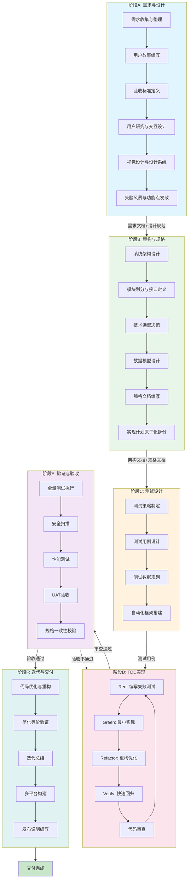
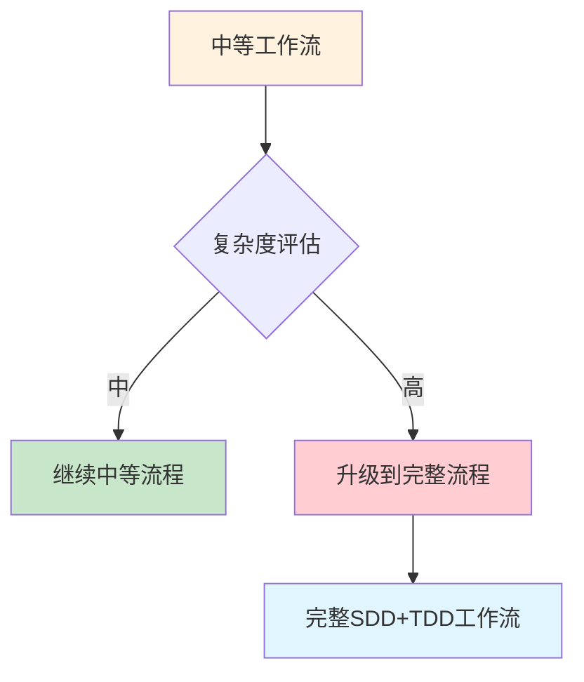
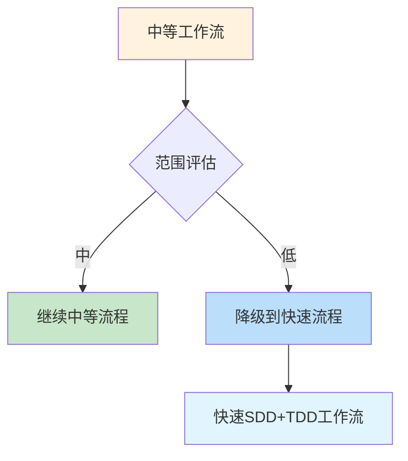

---
metadata:
  name: SDD+TDD中等规模开发工作流
  version: "3.2.0"
  description: 中等规模6阶段SDD+TDD融合开发工作流，填补fast(4阶段)与full(9阶段)之间的空白
  platform: all
  min_agents: 5
  max_agents: 12
phases:
  - id: phase-A
    name: 需求与设计
    order: 0
    optional: false
    trigger_condition: 用户请求中等规模开发或中型项目
    agents:
      primary: [product-manager, ui-designer, ux-designer]
      supporting: [brainstorming-facilitator, design-system-generator]
    inputs:
      - name: 用户需求描述
        type: document
        required: true
      - name: 业务背景信息
        type: document
        required: true
      - name: 用户画像
        type: document
        required: false
    outputs:
      - name: 需求规格说明书
        type: document
        validation: 需求已获用户确认
      - name: 用户故事列表
        type: document
        validation: 符合INVEST原则
      - name: 验收标准文档
        type: document
        validation: 验收标准明确可测试
      - name: UX研究报告
        type: document
        validation: 用户旅程完整
      - name: 高保真设计稿
        type: document
        validation: 设计评审通过
      - name: 设计系统定义
        type: document
        validation: 设计令牌与技术栈兼容
    quality_gates:
      - gate_id: DESIGN-SYSTEM-COMPLETE
        blocking: true
        pass_criteria: 设计系统完整且设计令牌与技术栈兼容
      - gate_id: ANTI-PATTERN-CHECK
        blocking: true
        pass_criteria: 无已知反模式
      - gate_id: BRAINSTORM-COMPLETE
        blocking: true
        pass_criteria: 需求探索完成且核心功能点明确
      - gate_id: GATE-001
        blocking: true
        pass_criteria: 需求完整性检查通过
      - gate_id: GATE-002
        blocking: true
        pass_criteria: 规格一致性检查通过
    timeout_minutes: 120
    retry:
      max_attempts: 2
      backoff: fixed
  - id: phase-B
    name: 架构与规格
    order: 1
    optional: false
    trigger_condition: 需求与设计阶段完成
    agents:
      primary: [system-architect]
      supporting: [specification-keeper, technical-writer]
    inputs:
      - name: 需求规格说明书
        type: document
        required: true
        source_phase: phase-A
      - name: 用户故事列表
        type: document
        required: true
        source_phase: phase-A
      - name: 设计系统定义
        type: document
        required: true
        source_phase: phase-A
    outputs:
      - name: 架构设计文档
        type: document
        validation: 符合SOLID原则
      - name: API接口规范
        type: document
        validation: 接口定义清晰完整
      - name: 数据模型图
        type: document
      - name: 技术决策记录
        type: document
        validation: 技术选型有充分理由
      - name: 规格文档
        type: document
        validation: 规格与需求一致
    quality_gates:
      - gate_id: GATE-003
        blocking: true
        pass_criteria: 架构设计符合SOLID原则
      - gate_id: GATE-004
        blocking: true
        pass_criteria: 接口定义清晰完整
      - gate_id: PLAN-ATOMIC
        blocking: true
        pass_criteria: 实现计划已原子化拆分
    timeout_minutes: 90
    retry:
      max_attempts: 2
      backoff: fixed
  - id: phase-C
    name: 测试设计
    order: 2
    optional: false
    trigger_condition: 架构与规格阶段完成
    agents:
      primary: [test-architect]
      supporting: [unit-tester]
    inputs:
      - name: 架构设计文档
        type: document
        required: true
        source_phase: phase-B
      - name: 用户故事列表
        type: document
        required: true
        source_phase: phase-A
    outputs:
      - name: 测试策略文档
        type: document
      - name: 测试用例清单
        type: document
        validation: 覆盖所有用户故事
      - name: 测试数据方案
        type: document
    quality_gates:
      - gate_id: GATE-005
        blocking: true
        pass_criteria: 测试覆盖所有用户故事
      - gate_id: GATE-006
        blocking: true
        pass_criteria: 测试用例可自动化执行且边界条件已覆盖
    timeout_minutes: 60
    retry:
      max_attempts: 2
      backoff: fixed
  - id: phase-D
    name: TDD实现
    order: 3
    optional: false
    trigger_condition: 测试设计阶段完成
    agents:
      primary: [fullstack-engineer, unit-tester, code-reviewer]
      supporting: [subagent-dispatcher]
    inputs:
      - name: 架构设计文档
        type: document
        required: true
        source_phase: phase-B
      - name: 测试用例清单
        type: document
        required: true
        source_phase: phase-C
      - name: 规格文档
        type: document
        required: true
        source_phase: phase-B
    outputs:
      - name: 源代码文件
        type: code
        validation: 代码审查通过
      - name: 单元测试文件
        type: code
        validation: 覆盖率>=70%
      - name: 代码覆盖率报告
        type: document
        validation: 覆盖率>=70%
      - name: 代码审查报告
        type: document
      - name: 改进建议清单
        type: document
    quality_gates:
      - gate_id: GATE-007
        blocking: true
        pass_criteria: 代码质量门禁通过
      - gate_id: TEST-PASS
        blocking: true
        pass_criteria: 所有测试用例通过
      - gate_id: GATE-009
        blocking: true
        pass_criteria: 代码审查通过
      - gate_id: SUBAGENT-REVIEW
        blocking: true
        pass_criteria: 子代理审查完成
      - gate_id: REVIEW-CONFIDENCE
        blocking: true
        pass_criteria: 审查置信度>=80
      - gate_id: FILE-ENCODING
        blocking: true
        pass_criteria: 所有源代码文件为UTF-8 without BOM
      - gate_id: COMMENT-LANGUAGE
        blocking: true
        pass_criteria: 业务注释包含中文说明
      - gate_id: SCRIPT-SECURITY
        blocking: true
        pass_criteria: 无安全风险脚本
      - gate_id: SPEC-CONSISTENCY
        blocking: true
        pass_criteria: 所有Spec-Drift标记已按影响级别复核
    timeout_minutes: 240
    retry:
      max_attempts: 3
      backoff: exponential
  - id: phase-E
    name: 验证与验收
    order: 4
    optional: false
    trigger_condition: TDD实现阶段完成
    agents:
      primary: [qa-engineer, security-auditor, performance-tester, product-manager]
      supporting: []
    inputs:
      - name: 通过审查的代码
        type: code
        required: true
        source_phase: phase-D
      - name: 测试用例清单
        type: document
        required: true
        source_phase: phase-C
      - name: 用户故事和验收标准
        type: document
        required: true
        source_phase: phase-A
    outputs:
      - name: 测试执行报告
        type: document
        validation: 通过率和覆盖率达标
      - name: 安全审计报告
        type: document
        validation: 无P0/P1安全问题
      - name: 性能测试报告
        type: document
      - name: 用户验收测试报告
        type: document
      - name: 正式发布建议
        type: document
        validation: 批准或驳回
    quality_gates:
      - gate_id: GATE-011
        blocking: true
        pass_criteria: 端到端测试门禁通过
      - gate_id: GATE-012
        blocking: true
        pass_criteria: 安全扫描门禁通过
      - gate_id: GATE-013
        blocking: true
        pass_criteria: 部署就绪门禁通过
      - gate_id: GATE-014
        blocking: true
        pass_criteria: 生产验证门禁通过
      - gate_id: AGENTIC-SECURITY
        blocking: true
        pass_criteria: Agentic安全合规通过
      - gate_id: PLAYWRIGHT-E2E-PASS
        blocking: true
        pass_criteria: Playwright E2E测试通过
    timeout_minutes: 120
    retry:
      max_attempts: 2
      backoff: fixed
  - id: phase-F
    name: 迭代与交付
    order: 5
    optional: false
    trigger_condition: 验证与验收阶段通过
    agents:
      primary: [refactoring-specialist, build-release-engineer]
      supporting: [cicd-specialist]
    inputs:
      - name: 验证通过的代码
        type: code
        required: true
        source_phase: phase-E
      - name: 正式发布建议
        type: document
        required: true
        source_phase: phase-E
    outputs:
      - name: 优化后的代码
        type: code
        validation: 重构验证通过
      - name: 迭代总结报告
        type: document
      - name: 发布说明文档
        type: document
        validation: 发布说明完整
      - name: 多平台安装包
        type: artifact
        validation: 所有平台构建成功（如适用）
    quality_gates:
      - gate_id: GATE-015
        blocking: true
        pass_criteria: 演化闭环门禁通过
      - gate_id: SIMPLIFICATION-BEHAVIOR
        blocking: true
        pass_criteria: 简化行为等价验证通过
      - gate_id: CHESTERTON-FENCE
        blocking: true
        pass_criteria: Chesterton's Fence检查通过
      - gate_id: DOC-COMPLETENESS
        blocking: true
        pass_criteria: 文档完整性检查通过
      - gate_id: DESKTOP-BUILD
        blocking: false
        pass_criteria: 桌面构建成功（仅桌面项目）
    timeout_minutes: 180
    retry:
      max_attempts: 3
      backoff: exponential
agent_matrix:
  product-manager:
    phases: [phase-A, phase-E]
    role: primary
    max_parallel_instances: 1
  brainstorming-facilitator:
    phases: [phase-A]
    role: supporting
    max_parallel_instances: 1
  ui-designer:
    phases: [phase-A]
    role: primary
    max_parallel_instances: 1
  ux-designer:
    phases: [phase-A]
    role: primary
    max_parallel_instances: 1
  design-system-generator:
    phases: [phase-A]
    role: supporting
    max_parallel_instances: 1
  system-architect:
    phases: [phase-B]
    role: primary
    max_parallel_instances: 1
  specification-keeper:
    phases: [phase-B]
    role: supporting
    max_parallel_instances: 1
  technical-writer:
    phases: [phase-B]
    role: supporting
    max_parallel_instances: 1
  test-architect:
    phases: [phase-C]
    role: primary
    max_parallel_instances: 1
  unit-tester:
    phases: [phase-C, phase-D]
    role: primary
    max_parallel_instances: 2
  fullstack-engineer:
    phases: [phase-D]
    role: primary
    max_parallel_instances: 2
  code-reviewer:
    phases: [phase-D]
    role: primary
    max_parallel_instances: 2
  subagent-dispatcher:
    phases: [phase-D]
    role: supporting
    max_parallel_instances: 1
  qa-engineer:
    phases: [phase-E]
    role: primary
    max_parallel_instances: 1
  security-auditor:
    phases: [phase-E]
    role: primary
    max_parallel_instances: 1
  performance-tester:
    phases: [phase-E]
    role: primary
    max_parallel_instances: 1
  refactoring-specialist:
    phases: [phase-F]
    role: primary
    max_parallel_instances: 1
  build-release-engineer:
    phases: [phase-F]
    role: primary
    max_parallel_instances: 1
  cicd-specialist:
    phases: [phase-F]
    role: supporting
    max_parallel_instances: 1
exception_handling:
  phase_failure:
    action: retry_then_escalate
    escalation_target: orchestrator
    max_retries: 3
  agent_unavailable:
    action: substitute_and_continue
    substitute_agent: fullstack-engineer
  quality_gate_blocked:
    action: auto_fix_then_pause
    auto_fix_agents: [fullstack-engineer, refactoring-specialist]
---

# SDD+TDD 中等工作流

## 工作流名称
SDD+TDD Medium Development Workflow（中等规模开发工作流）

## 描述
中等规模的SDD+TDD融合开发工作流，适用于中型项目（20-100文件、5-20模块）。该工作流将完整9阶段流程合并为6阶段，在保留核心质量保障机制的同时提升开发效率。相比快速工作流，增加了独立的设计阶段、架构规格阶段和测试策略阶段；相比完整工作流，合并了需求与设计、验证与验收、迭代与交付等阶段，减少流程开销。支持桌面应用开发场景。

## 触发条件
- 用户请求中等规模开发
- 项目规模：中型（预估开发周期 2-6周，20-100文件，5-20模块）
- 多模块但非全新系统的开发
- 功能模块群开发
- 用户明确要求"中等"、"medium"、"标准流程"

## 涉及的Agent

### 核心Agent
| Agent | 角色 | 职责 |
|-------|------|------|
| product-manager | 产品经理 | 需求分析、用户故事编写、验收确认 |
| ux-designer | UX设计师 | 用户研究、交互设计 |
| ui-designer | UI设计师 | 视觉设计、设计系统定义 |
| system-architect | 系统架构师 | 架构设计、技术选型、接口定义 |
| test-architect | 测试架构师 | 测试策略设计、测试用例规划 |
| fullstack-engineer | 全栈工程师 | 代码实现 |
| unit-tester | 单元测试工程师 | TDD测试编写 |
| code-reviewer | 代码审查工程师 | 代码质量把关 |
| qa-engineer | QA工程师 | 全量测试执行 |
| security-auditor | 安全审计师 | 安全扫描与审计 |
| performance-tester | 性能测试工程师 | 性能基准测试 |
| refactoring-specialist | 重构专家 | 代码优化与重构 |
| build-release-engineer | 构建发布工程师 | 构建、打包、发布 |

### 支撑Agent
| Agent | 角色 | 职责 |
|-------|------|------|
| brainstorming-facilitator | 头脑风暴引导师 | 需求探索与功能点发散 |
| design-system-generator | 设计系统生成器 | 设计令牌生成与技术栈适配 |
| specification-keeper | 规格守护者 | 规格一致性维护、Spec-Drift复核 |
| technical-writer | 技术文档工程师 | 技术文档编写与维护 |
| subagent-dispatcher | 子代理调度器 | 复杂任务拆分与子代理编排 |
| cicd-specialist | CI/CD专家 | 流水线配置与自动化部署 |

### 可选Agent
| Agent | 角色 | 触发条件 |
|-------|------|----------|
| orchestrator | 编排器 | 需要跨阶段协调时 |
| integration-tester | 集成测试工程师 | 涉及多模块集成时 |
| desktop-developer | 桌面开发工程师 | 涉及桌面特定代码时 |
| frontend-stylist | 前端样式工程师 | 涉及复杂UI实现时 |
| documentation-engineer | 文档工程师 | 需要完整用户文档时 |
| devops-engineer | DevOps工程师 | 涉及基础设施配置时 |

### 增量实施约束

所有Agent在执行复杂任务时必须遵循增量实施规范：
- **工作模式**：分解复杂任务 → 实现单个步骤 → 测试验证 → 重复
- **死循环检测**：若在同一错误上连续3次尝试失败，必须停止执行
- **反模式记录**：将失败模式记录到知识库的anti-patterns目录
- **重启流程**：从头重新开始，而非继续在错误方向上尝试

此约束参考@hivehub/rulebook的增量实施规范，与完整工作流中的增量实施约束保持一致。

## 阶段定义

### 阶段A：需求与设计（Requirements & Design）
> 合并完整工作流的阶段0（UX/UI设计）与阶段1（需求分析）

**执行者**: product-manager, ui-designer, ux-designer
**辅助**: brainstorming-facilitator, design-system-generator

**输入**:
- 用户需求描述
- 业务背景信息
- 用户画像（可选）

**活动**:
1. 需求收集与整理
2. 用户故事编写（User Story）
3. 验收标准定义（Acceptance Criteria）
4. 用户研究与交互设计
5. 视觉设计与设计系统定义
6. 头脑风暴与核心功能点发散
7. 优先级排序

**输出**:
- 需求规格说明书
- 用户故事列表
- 验收标准文档
- UX研究报告
- 高保真设计稿
- 设计系统定义

**质量门禁**:
- [ ] 设计系统完整且设计令牌与技术栈兼容 → **DESIGN-SYSTEM-COMPLETE**（设计系统完整性门禁）
- [ ] 无已知反模式 → **ANTI-PATTERN-CHECK**（反模式检查门禁）
- [ ] 需求探索完成且核心功能点明确 → **BRAINSTORM-COMPLETE**（头脑风暴完成门禁）
- [ ] 需求完整性检查通过 → **GATE-001**（需求完整性门禁）
- [ ] 规格一致性检查通过 → **GATE-002**（规格一致性门禁）

**时长**: 2-4小时

---

### 阶段B：架构与规格（Architecture & Specification）
> 对应完整工作流的阶段2（架构设计），增加规格文档输出

**执行者**: system-architect
**辅助**: specification-keeper, technical-writer

**输入**:
- 需求规格说明书（来自阶段A）
- 用户故事列表（来自阶段A）
- 设计系统定义（来自阶段A）

**活动**:
1. 系统架构设计
2. 模块划分与接口定义
3. 技术选型决策
4. 数据模型设计
5. 规格文档编写（Specification Keeper维护一致性）
6. 实现计划原子化拆分

**输出**:
- 架构设计文档
- API接口规范
- 数据模型图
- 技术决策记录（ADR）
- 规格文档

**质量门禁**:
- [ ] 架构设计符合SOLID原则 → **GATE-003**（架构设计门禁）
- [ ] 接口定义清晰完整 → **GATE-004**（接口定义门禁）
- [ ] 实现计划已原子化拆分 → **PLAN-ATOMIC**（原子化计划门禁）

**时长**: 1.5-3小时

---

### 阶段C：测试设计（Test Design）
> 对应完整工作流的阶段3（测试策略）

**执行者**: test-architect
**辅助**: unit-tester

**输入**:
- 架构设计文档（来自阶段B）
- 用户故事列表（来自阶段A）

**活动**:
1. 测试策略制定
2. 测试用例设计（覆盖所有用户故事）
3. 测试数据规划
4. 边界条件与异常场景覆盖
5. 自动化测试框架搭建

**输出**:
- 测试策略文档
- 测试用例清单
- 测试数据方案

**质量门禁**:
- [ ] 测试覆盖所有用户故事 → **GATE-005**（测试覆盖门禁）
- [ ] 测试用例可自动化执行且边界条件已覆盖 → **GATE-006**（测试质量门禁）

**时长**: 1-2小时

---

### 阶段D：TDD实现（TDD Implementation）
> 对应完整工作流的阶段4（TDD开发与代码审查）

**执行者**: fullstack-engineer, unit-tester, code-reviewer
**辅助**: subagent-dispatcher

**输入**:
- 架构设计文档（来自阶段B）
- 测试用例清单（来自阶段C）
- 规格文档（来自阶段B）

**活动**:
1. **Red**: 编写失败的测试用例
2. **Green**: 编写最小代码使测试通过
3. **Refactor**: 重构代码优化结构
4. **Verify**: 快速回归验证重构未引入新问题
5. 循环迭代直到功能完成
6. **代码审查**（code-reviewer执行）：
   - 代码规范检查
   - 设计模式审查
   - 安全漏洞扫描
   - 性能问题识别
7. 子代理审查（subagent-dispatcher编排复杂任务）

**规格漂移处理**:
- **低影响漂移**（仅影响单个函数或组件内部实现细节）：Agent可自行补全，但需在提交信息中标记 `Spec-Drift: [low] <说明>`，并在PR中阐述变更。Specification Keeper事后审核。
- **中影响漂移**（影响模块间接口或数据格式）：Agent立即暂停，上报Orchestrator。Orchestrator联合System Architect快速评估，若方案明确且风险可控，授权修改并通知Specification Keeper更新规格；若出现不确定因素，转为高影响处理。
- **高影响漂移**（影响外部API契约、安全模型、关键业务逻辑）：触发人机协作断点，等待Product Manager或人类负责人确认。此级别漂移不得由Agent自主决策。

**输出**:
- 源代码文件
- 单元测试文件
- 代码覆盖率报告
- 代码审查报告
- 改进建议清单
- **脚本清理提醒**：实现完成后确认所有临时修改脚本已删除（遵循 script-standards.md 五步闭环规范）[强制]

**质量门禁**:
- [ ] 代码质量门禁通过 → **GATE-007**（代码质量门禁）
- [ ] 所有测试用例通过 → **TEST-PASS**（测试通过门禁）
- [ ] 代码审查通过 → **GATE-009**（代码审查门禁）
- [ ] 子代理审查完成 → **SUBAGENT-REVIEW**（子代理审查门禁）
- [ ] 审查置信度>=80 → **REVIEW-CONFIDENCE**（审查置信度门禁）
- [ ] 所有源代码文件为UTF-8 without BOM → **FILE-ENCODING**（文件编码格式门禁）**[强制]**
- [ ] 业务注释包含中文说明 → **COMMENT-LANGUAGE**（注释语言规范门禁）**[强制]**
- [ ] 无安全风险脚本 → **SCRIPT-SECURITY**（脚本安全门禁）**[强制]**
- [ ] 所有Spec-Drift标记已按影响级别复核 → **SPEC-CONSISTENCY**（规格一致性门禁）

> **强制门控说明**: FILE-ENCODING、COMMENT-LANGUAGE 和 SCRIPT-SECURITY 为规格定义中的 **[强制]** 要求，即使在中等模式下也 **不可跳过**。这是确保代码库编码一致性、注释规范性和脚本安全性的底线保障。

**时长**: 根据任务复杂度，4-8小时

---

### 阶段E：验证与验收（Verification & Acceptance）
> 合并完整工作流的阶段5（验证）与阶段6（验收）

**执行者**: qa-engineer, security-auditor, performance-tester, product-manager

**输入**:
- 通过审查的代码（来自阶段D）
- 测试用例清单（来自阶段C）
- 用户故事和验收标准（来自阶段A）

**活动**:
1. 全量测试执行（单元+集成+E2E）
2. 安全扫描（SAST + 依赖漏洞）
3. 性能基准测试
4. 用户验收测试（UAT）：基于用户故事和验收标准
5. 规格一致性校验（Spec-Drift复核）
6. 文档完整性检查
7. Playwright E2E测试执行
8. 桌面验证（如适用）：窗口渲染/菜单响应/IPC通信

**输出**:
- 测试执行报告
- 安全审计报告
- 性能测试报告
- 用户验收测试报告
- 正式发布建议（批准或驳回）

**质量门禁**:
- [ ] 端到端测试门禁通过 → **GATE-011**（端到端门禁）
- [ ] 安全扫描门禁通过 → **GATE-012**（安全扫描门禁）
- [ ] 部署就绪门禁通过 → **GATE-013**（部署就绪门禁）
- [ ] 生产验证门禁通过 → **GATE-014**（生产验证门禁）
- [ ] Agentic安全合规通过 → **AGENTIC-SECURITY**（Agentic安全合规门禁）
- [ ] Playwright E2E测试通过 → **PLAYWRIGHT-E2E-PASS**（E2E测试门禁）

**时长**: 2-4小时

---

### 阶段F：迭代与交付（Iteration & Delivery）
> 合并完整工作流的阶段7（迭代）与阶段8（构建与发布）

**执行者**: refactoring-specialist, build-release-engineer
**辅助**: cicd-specialist

**输入**:
- 验证通过的代码（来自阶段E）
- 正式发布建议（来自阶段E）

**活动**:
1. 代码优化与重构（Chesterton's Fence检查）
2. 简化行为等价验证
3. 迭代总结与模式学习
4. 多平台构建（如适用）
5. CI/CD流水线配置
6. 发布说明编写
7. 文档完整性最终检查
8. 桌面构建与打包（如适用）

**输出**:
- 优化后的代码
- 迭代总结报告
- 发布说明文档
- 多平台安装包（如适用）

**质量门禁**:
- [ ] 演化闭环门禁通过 → **GATE-015**（演化闭环门禁）
- [ ] 简化行为等价验证通过 → **SIMPLIFICATION-BEHAVIOR**（简化等价门禁）
- [ ] Chesterton's Fence检查通过 → **CHESTERTON-FENCE**（重构安全门禁）
- [ ] 文档完整性检查通过 → **DOC-COMPLETENESS**（文档完整性门禁）
- [ ] 桌面构建成功（仅桌面项目） → **DESKTOP-BUILD**（桌面构建门禁）**[可选]**

**时长**: 3-6小时

### 规格漂移处理（中等模式）

中等模式下区分三级漂移：

- **低影响漂移**（仅影响单个函数或组件内部实现细节）：Agent可自行补全，但需在提交信息中标记 `Spec-Drift: [low] <说明>`，并在PR中阐述变更。Specification Keeper事后审核。
- **中影响漂移**（影响模块间接口或数据格式）：Agent立即暂停，上报Orchestrator。Orchestrator联合System Architect快速评估，若方案明确且风险可控，授权修改并通知Specification Keeper更新规格；若出现不确定因素，转为高影响处理。
- **高影响漂移**（影响外部API契约、安全模型、关键业务逻辑）：触发人机协作断点，等待Product Manager或人类负责人确认。此级别漂移不得由Agent自主决策。

> 快速模式仅区分两级漂移，详见 [sdd-tdd-fast.md](sdd-tdd-fast.md)；完整的三级漂移处理与完整工作流一致，详见 [sdd-tdd-full.md](sdd-tdd-full.md)

## 流程图



## 输出产物清单

| 阶段 | 输出产物 | 格式 |
|------|----------|------|
| 需求与设计 | 需求规格说明书 | Markdown |
| 需求与设计 | 用户故事列表 | Markdown |
| 需求与设计 | 验收标准文档 | Markdown |
| 需求与设计 | UX研究报告 | Markdown |
| 需求与设计 | 高保真设计稿 | Figma/Sketch |
| 需求与设计 | 设计系统定义 | JSON/CSS Variables |
| 架构与规格 | 架构设计文档 | Markdown + Mermaid |
| 架构与规格 | API接口规范 | OpenAPI/Swagger |
| 架构与规格 | 数据模型图 | Mermaid |
| 架构与规格 | 技术决策记录 | Markdown |
| 架构与规格 | 规格文档 | Markdown |
| 测试设计 | 测试策略文档 | Markdown |
| 测试设计 | 测试用例清单 | Markdown |
| 测试设计 | 测试数据方案 | JSON/YAML |
| TDD实现 | 源代码文件 | 各语言源文件 |
| TDD实现 | 单元测试文件 | 测试文件 |
| TDD实现 | 代码覆盖率报告 | HTML/Markdown |
| TDD实现 | 代码审查报告 | Markdown |
| TDD实现 | 改进建议清单 | Markdown |
| 验证与验收 | 测试执行报告 | Markdown + HTML |
| 验证与验收 | 安全审计报告 | Markdown |
| 验证与验收 | 性能测试报告 | Markdown + HTML |
| 验证与验收 | 用户验收测试报告 | Markdown |
| 验证与验收 | 正式发布建议 | Markdown |
| 迭代与交付 | 优化后的代码 | 各语言源文件 |
| 迭代与交付 | 迭代总结报告 | Markdown |
| 迭代与交付 | 发布说明文档 | Markdown |
| 迭代与交付 | 多平台安装包 | MSI/DMG/AppImage（如适用） |

## 与其他工作流的对比

| 维度 | 快速工作流 | 中等工作流 | 完整工作流 |
|------|------------|------------|------------|
| 阶段数 | 4 | 6 | 9 |
| 核心Agent数 | 3 | 13 | 15+ |
| 总Agent数（含可选） | 3-5 | 19-25 | 30+ |
| 文档要求 | 简化 | 标准 | 完整 |
| 测试覆盖 | >= 60% | >= 70% | >= 80% |
| 适用周期 | < 2周 | 2-6周 | > 6周 |
| 适用规模 | < 20文件 | 20-100文件 | 100+文件 |
| 模块数 | 1-3 | 5-20 | 20+ |
| 架构设计 | 简化 | 标准 | 完整 |
| 集成测试 | 可选 | 推荐 | 必须 |
| 安全审计 | 可选 | 必须 | 必须+渗透测试 |
| 性能测试 | 可选 | 推荐 | 必须 |
| 设计系统 | 可选 | 必须 | 必须+可访问性 |
| 规格漂移 | 两级 | 三级 | 三级+自动复核 |
| 人机协作断点 | 2种 | 3种 | 4种 |

## 适用场景

### ✅ 推荐使用
- 多模块功能开发
- 中型新项目（5-20模块）
- 系统重构（中等规模）
- API服务开发
- 带UI的中型应用
- 跨2-3模块的功能增强

### ❌ 不推荐使用
- 单一Bug修复（用快速工作流）
- 小型配置变更（用快速工作流）
- 大型全新系统（用完整工作流）
- 安全关键系统（用完整工作流）
- 100+文件的大型项目（用完整工作流）

## 执行建议

1. **时间分配**: 需求与设计15% + 架构与规格12% + 测试设计8% + TDD实现35% + 验证与验收15% + 迭代与交付15%
2. **并行策略**: 阶段B和阶段C可部分并行（架构确定后即可开始测试策略）
3. **迭代周期**: 建议每个完整周期不超过6周
4. **文档同步**: 每阶段输出必须及时更新文档
5. **质量底线**: 代码覆盖率>=70%，无P0/P1安全问题
6. **桌面优先**: 如项目包含桌面端，建议优先在单一平台验证后再扩展跨平台

### 人机协作断点（中等模式）

中等模式下定义3种触发条件：

- **安全漏洞**：安全扫描发现高危零日漏洞时，系统自动暂停并生成决策报告，等待人类评估业务风险
- **高影响Spec漂移**：影响外部API契约、安全模型或关键业务逻辑的规格漂移，等待Product Manager或人类负责人确认
- **连续失败**：连续3次迭代仍未收敛（相同Gate重复失败）时，系统自动暂停并生成决策报告，等待人类输入

决策报告格式：
```markdown
## 决策报告 #[ID]
- **触发条件**: [安全漏洞/高影响Spec漂移/连续失败]
- **当前状态**: [简要描述]
- **已尝试方案**: [列出已尝试的修复方案]
- **建议决策**: [Orchestrator的建议]
- **等待人类输入**: [需要确认的具体问题]
```

> 快速模式仅2种触发条件，详见 [sdd-tdd-fast.md](sdd-tdd-fast.md)；完整模式4种触发条件，详见 [sdd-tdd-full.md](sdd-tdd-full.md)

## Desktop Medium Track（桌面中等通道）

当开发中型桌面应用时，在以下阶段增加桌面专项活动：

### 阶段A桌面补充
- 桌面窗口尺寸设计（最小/默认/全屏布局）
- 系统菜单结构设计（应用菜单、右键菜单、托盘菜单）

### 阶段B桌面补充
- 桌面框架选型ADR（Electron/Tauri/Qt等评估）
- 跨平台架构决策（共享逻辑 vs 平台特定实现）

### 阶段D桌面补充
- 桌面IPC通信实现（主进程与渲染进程通信）
- 跨平台并行开发（共享逻辑 + 平台适配层）

### 阶段E桌面补充
- 窗口行为自动化测试
- 跨平台兼容性矩阵测试（Windows/macOS/Linux）

### 阶段F桌面补充
- 多平台构建（Windows/macOS/Linux并行构建）
- 代码签名与公证（Apple Notarization / Windows Authenticode）
- 自动更新配置

### 何时使用中等桌面通道 vs 完整桌面工作流

| 场景 | 中等通道 | 完整桌面工作流 |
|------|----------|----------------|
| 单一平台桌面应用 | ✅ | ❌ |
| 2-3模块桌面功能 | ✅ | ❌ |
| 桌面框架升级 | ❌ | ✅ |
| 代码签名/公证问题 | ❌ | ✅ |
| 自动更新机制修改 | ❌ | ✅ |
| 跨3+平台兼容性问题 | ❌ | ✅ |
| 原生模块深度集成 | ❌ | ✅ |

## 升级与降级机制

### 升级到完整工作流

当中等工作流中发现以下情况时，应升级到完整工作流：
- 需求复杂度超出预期（模块数>20）
- 发现架构层面问题需要深度迭代
- 安全风险较高（需要AI渗透测试）
- 涉及3+平台跨平台开发
- 用户要求更高质量保障（覆盖率>=80%）



### 降级到快速工作流

当以下情况发生时，可降级到快速工作流：
- 需求范围缩减至1-3个模块
- 仅需Bug修复或小改动
- 时间紧迫需要快速交付
- 用户明确要求简化流程


