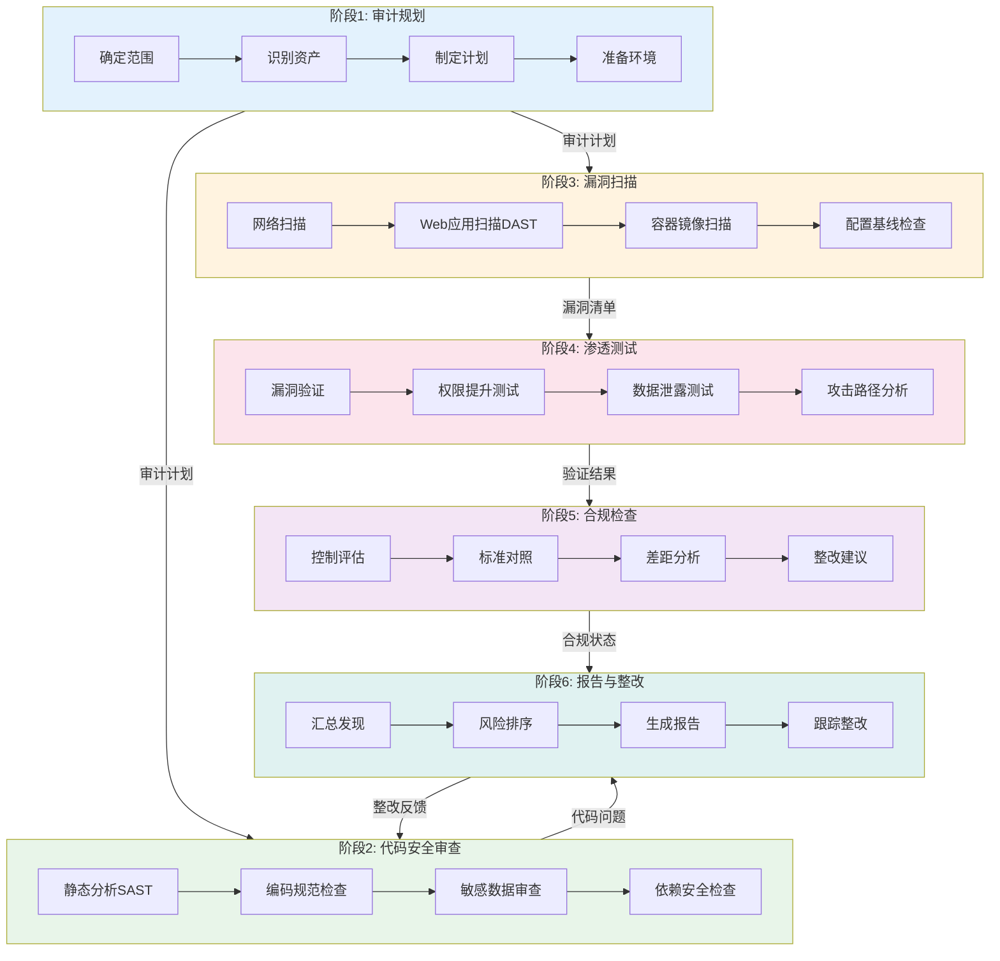
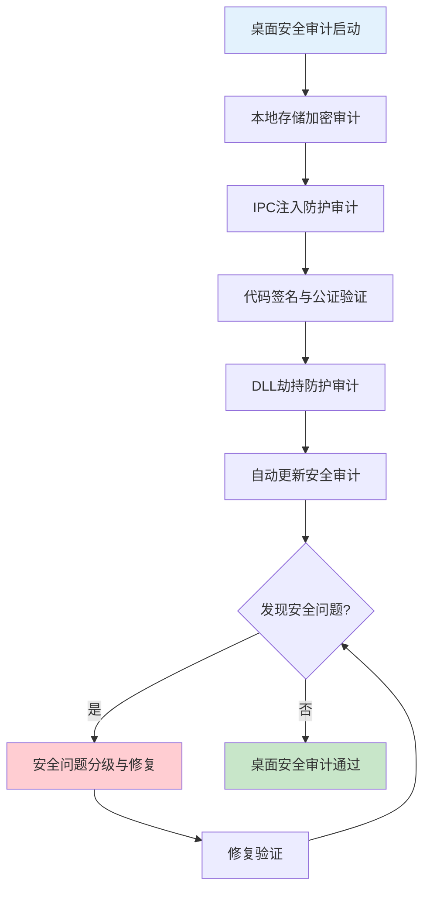
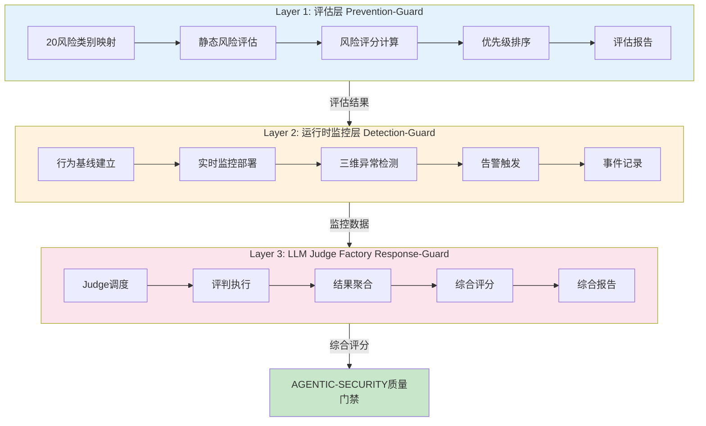

---
> 权威来源：_yaml/security-audit.yaml（YAML为准，本文档为可读参考）
metadata:
  name: 安全审计与合规验证工作流
  version: "3.2.0"
  description: 安全审计合规验证与Agentic安全工作流
  platform: all
  min_agents: 2
  max_agents: 5
phases:
- id: phase-1
  name: 审计规划
  order: 1
  optional: false
  trigger_condition: 用户请求安全审计或定期安全检查
  agents:
    primary:
    - security-auditor
    supporting: []
  inputs:
  - name: 审计范围定义
    type: document
    required: true
  - name: 系统架构文档
    type: document
    required: true
  outputs:
  - name: 审计计划书
    type: document
    validation: 审计范围和重点明确
  quality_gates:
  - gate_id: GATE-001
    blocking: true
    pass_criteria: 审计范围和重点明确
  timeout_minutes: 60
  retry:
    max_attempts: 2
    backoff: fixed
- id: phase-2
  name: 代码安全审查
  order: 2
  optional: false
  trigger_condition: 审计规划完成
  agents:
    primary:
    - security-auditor
    supporting:
    - code-reviewer
  inputs:
  - name: 审计计划书
    type: document
    required: true
    source_phase: phase-1
  outputs:
  - name: 代码安全审查报告
    type: document
    validation: 高风险代码已识别
  quality_gates:
  - gate_id: GATE-012
    blocking: true
    pass_criteria: 代码安全审查完成
  timeout_minutes: 120
  retry:
    max_attempts: 2
    backoff: fixed
- id: phase-3
  name: 漏洞扫描
  order: 3
  optional: false
  trigger_condition: 代码安全审查完成
  agents:
    primary:
    - security-auditor
    supporting: []
  inputs:
  - name: 代码安全审查报告
    type: document
    required: true
    source_phase: phase-2
  outputs:
  - name: 漏洞扫描报告
    type: document
    validation: 漏洞已分类和评级
  quality_gates:
  - gate_id: GATE-012
    blocking: true
    pass_criteria: 漏洞扫描完成且已分类
  timeout_minutes: 90
  retry:
    max_attempts: 2
    backoff: fixed
- id: phase-4
  name: 渗透测试
  order: 4
  optional: false
  trigger_condition: 漏洞扫描完成
  agents:
    primary:
    - penetration-tester
    - security-auditor
    supporting: []
  inputs:
  - name: 漏洞扫描报告
    type: document
    required: true
    source_phase: phase-3
  outputs:
  - name: 渗透测试报告
    type: document
    validation: 关键漏洞已验证
  quality_gates:
  - gate_id: AI-PENTEST
    blocking: true
    pass_criteria: 渗透测试完成
  timeout_minutes: 120
  retry:
    max_attempts: 2
    backoff: fixed
- id: phase-5
  name: 合规检查
  order: 5
  optional: false
  trigger_condition: 渗透测试完成
  agents:
    primary:
    - compliance-officer
    - security-auditor
    supporting: []
  inputs:
  - name: 渗透测试报告
    type: document
    required: true
    source_phase: phase-4
  outputs:
  - name: 合规检查报告
    type: document
    validation: 合规状态已评估
  quality_gates:
  - gate_id: GATE-012
    blocking: true
    pass_criteria: 合规检查完成
  timeout_minutes: 90
  retry:
    max_attempts: 2
    backoff: fixed
- id: phase-6
  name: 报告与整改
  order: 6
  optional: false
  trigger_condition: 合规检查完成
  agents:
    primary:
    - security-auditor
    - compliance-officer
    supporting: []
  inputs:
  - name: 合规检查报告
    type: document
    required: true
    source_phase: phase-5
  outputs:
  - name: 安全审计总报告
    type: document
    validation: 报告完整且整改建议明确
  - name: 整改跟踪清单
    type: document
    validation: 整改项已分配责任人
  quality_gates:
  - gate_id: DOC-COMPLETENESS
    blocking: true
    pass_criteria: 审计报告完整
  - gate_id: GATE-012
    blocking: true
    pass_criteria: 无P0/P1安全问题
  timeout_minutes: 60
  retry:
    max_attempts: 2
    backoff: fixed
agent_matrix:
  security-auditor:
    phases:
    - phase-1
    - phase-2
    - phase-3
    - phase-4
    - phase-5
    - phase-6
    role: primary
    max_parallel_instances: 1
  code-reviewer:
    phases:
    - phase-2
    role: supporting
    max_parallel_instances: 1
  penetration-tester:
    phases:
    - phase-4
    role: primary
    max_parallel_instances: 1
  compliance-officer:
    phases:
    - phase-5
    - phase-6
    role: primary
    max_parallel_instances: 1
exception_handling:
  phase_failure:
    action: retry_then_escalate
    escalation_target: orchestrator
    max_retries: 3
  agent_unavailable:
    action: substitute_and_continue
    substitute_agent: security-auditor
  quality_gate_blocked:
    action: auto_fix_then_pause
    auto_fix_agents:
    - security-auditor
    - penetration-tester
---


# 安全审计工作流

## 工作流名称
Security Audit Workflow（安全审计工作流）

## 描述
全面的安全审计工作流，涵盖代码安全审查、漏洞扫描、合规检查和安全报告生成。该工作流旨在识别和修复潜在的安全风险，确保系统符合安全标准和法规要求。包含Agentic安全审计（OWASP Agentic Top 10 2026）和桌面安全审计专项。

## 触发条件
- 用户请求安全审计
- 定期安全检查
- 重大版本发布前
- 安全事件响应
- 合规审计需求
- 用户明确要求"安全审计"、"安全检查"、"漏洞扫描"

## 涉及的Agent

### 核心Agent
| Agent | 角色 | 职责 |
|-------|------|------|
| security-auditor | 安全审计师 | 安全评估、漏洞分析 |
| penetration-tester | 渗透测试工程师 | 渗透测试、漏洞验证 |
| compliance-officer | 合规官 | 合规检查、标准对照 |

### 支撑Agent
| Agent | 角色 | 职责 |
|-------|------|------|
| code-reviewer | 代码审查工程师 | 代码安全审查 |
| devops-engineer | DevOps工程师 | 安全配置检查 |
| cicd-specialist | CI/CD专家 | 安全流水线集成 |
| desktop-security-auditor | 桌面安全审计师 | 桌面应用安全专项审计 |
| ai-security-researcher | AI安全研究员 | Agentic安全威胁分析 |

## 阶段定义

### 阶段1：审计规划（Audit Planning）
**执行者**: security-auditor

**输入**:
- 审计范围定义
- 系统架构文档
- 资产清单

**活动**:
1. 确定审计范围和目标
2. 识别关键资产和系统
3. 制定审计计划
4. 准备审计工具和环境
5. 注入CodeGuard secure-by-default安全约束（规划阶段：在审计前注入安全编码规则作为默认约束）

**输出**:
- 审计计划书
- 资产清单
- 风险评估矩阵
- 安全编码约束清单（CodeGuard规划阶段产出）

**质量门禁**:
- [ ] 审计范围明确
- [ ] 关键资产已识别
- [ ] 审计计划已批准

---

### 阶段2：代码安全审查（Code Security Review）
**执行者**: security-auditor, code-reviewer

**输入**:
- 源代码仓库
- 代码安全规则

**活动**:
1. 静态代码分析（SAST）
2. 安全编码规范检查
3. TrinityGuard评估层检查
   - TG-R01~R20 风险类别静态评估
   - 提示注入/权限滥用/数据泄露重点检查
   - 目标劫持/工具滥用/记忆投毒风险评估
   - 评估结果汇总与风险量化评分
4. 敏感数据处理审查
5. 第三方依赖安全检查
6. CodeGuard生成阶段检查（代码生成过程中实时检查安全规则合规性）

**输出**:
- SAST扫描报告
- 代码安全问题清单
- 依赖漏洞报告
- 安全规则合规性报告（CodeGuard生成阶段产出）

**质量门禁**:
- [ ] 所有代码已扫描
- [ ] 高危漏洞已识别
- [ ] 依赖漏洞已评估

---

### 阶段3：漏洞扫描（Vulnerability Scanning）
**执行者**: security-auditor

**输入**:
- 目标系统
- 扫描配置

**活动**:
1. 网络漏洞扫描
2. Web应用扫描（DAST）
3. 容器镜像扫描
4. 配置基线检查

**输出**:
- 漏洞扫描报告
- 配置问题清单
- 风险评级报告

**质量门禁**:
- [ ] 扫描覆盖完整
- [ ] 漏洞已分类评级
- [ ] 紧急漏洞已标记

---

### 阶段4：渗透测试（Penetration Testing）
**执行者**: penetration-tester

**输入**:
- 漏洞扫描报告
- 测试授权

**活动**:
1. 漏洞验证与利用
2. 权限提升测试
3. 数据泄露测试
4. 攻击路径分析

**输出**:
- 渗透测试报告
- 漏洞利用证明
- 攻击链分析

**质量门禁**:
- [ ] 关键漏洞已验证
- [ ] 攻击路径已记录
- [ ] 测试环境已恢复

---

### 阶段5：合规检查（Compliance Check）
**执行者**: compliance-officer

**输入**:
- 系统配置
- 审计证据
- 合规标准

**活动**:
1. 安全控制评估
2. 合规标准对照
3. 差距分析
4. 整改建议

**输出**:
- 合规检查报告
- 差距分析报告
- 整改计划

**质量门禁**:
- [ ] 合规标准已对照
- [ ] 差距已识别
- [ ] 整改计划已制定

---

### 阶段6：报告与整改（Reporting & Remediation）
**执行者**: security-auditor

**输入**:
- 各阶段审计结果
- 整改计划

**活动**:
1. 汇总审计发现
2. 风险优先级排序
3. 生成审计报告
4. 跟踪整改进度

**输出**:
- 安全审计报告
- 风险清单
- 整改跟踪表

**质量门禁**:
- [ ] 报告完整准确
- [ ] 风险已评级
- [ ] 整改责任已分配

## 流程图



## 输出产物清单

| 阶段 | 输出产物 | 格式 |
|------|----------|------|
| 审计规划 | 审计计划书 | Markdown |
| 审计规划 | 资产清单 | Markdown/Excel |
| 审计规划 | 风险评估矩阵 | Markdown |
| 代码审查 | SAST扫描报告 | HTML/PDF |
| 代码审查 | 依赖漏洞报告 | JSON/Markdown |
| 漏洞扫描 | 漏洞扫描报告 | HTML/PDF |
| 漏洞扫描 | 配置问题清单 | Markdown |
| 渗透测试 | 渗透测试报告 | PDF |
| 渗透测试 | 攻击链分析 | Mermaid |
| 合规检查 | 合规检查报告 | PDF |
| 合规检查 | 差距分析报告 | Markdown |
| 报告整改 | 安全审计报告 | PDF |
| 报告整改 | 整改跟踪表 | Excel/Markdown |

## 安全风险评级标准

### 严重程度分级

| 级别 | 描述 | 响应时间 | 示例 |
|------|------|----------|------|
| **Critical** | 可直接导致系统被完全控制或数据泄露 | 立即修复 | SQL注入、RCE |
| **High** | 可导致敏感数据泄露或权限提升 | 24小时内 | XSS、认证绕过 |
| **Medium** | 可能导致有限的数据泄露或服务中断 | 7天内 | 信息泄露、CSRF |
| **Low** | 影响有限，难以利用 | 30天内 | 版本信息泄露 |
| **Info** | 信息性问题，建议改进 | 下次迭代 | 缺少安全头 |

## 常见安全检查项

### 代码安全
- [ ] 输入验证和输出编码
- [ ] SQL注入防护
- [ ] XSS防护
- [ ] CSRF防护
- [ ] 认证和会话管理
- [ ] 访问控制
- [ ] 加密存储
- [ ] 敏感数据处理
- [ ] 日志和监控
- [ ] 错误处理

### 基础设施安全
- [ ] 网络隔离
- [ ] 防火墙配置
- [ ] 入侵检测
- [ ] 补丁管理
- [ ] 备份恢复
- [ ] 访问日志
- [ ] 加密传输
- [ ] 密钥管理

### 合规标准参考
- OWASP Top 10
- CWE/SANS Top 25
- PCI DSS
- ISO 27001
- SOC 2
- GDPR
- 等保2.0

## 执行建议

1. **定期执行**: 建议每季度进行一次全面审计
2. **自动化集成**: 将安全扫描集成到CI/CD流水线
3. **持续监控**: 部署安全监控和告警系统
4. **培训教育**: 定期进行安全意识培训
5. **应急响应**: 建立安全事件响应机制

## 审计工具推荐

### SAST工具
- SonarQube
- Checkmarx
- Fortify
- Semgrep

### DAST工具
- OWASP ZAP
- Burp Suite
- Acunetix

### 依赖扫描
- Snyk
- Dependabot
- OWASP Dependency-Check

### 容器安全
- Trivy
- Clair
- Anchore

## Agentic安全审计（OWASP Agentic Top 10 2026）

### 概述
随着AI Agent在软件系统中的广泛应用，Agentic安全威胁成为新的攻击面。本节基于OWASP Agentic Top 10 2026，提供针对AI Agent系统的安全审计框架。

### OWASP Agentic Top 10 2026 审计项

| 编号 | 威胁类别 | 审计要点 | 风险等级 |
|------|----------|----------|----------|
| AG01 | Agent提示注入（Prompt Injection） | 系统提示是否可被用户输入覆盖；是否存在间接提示注入向量 | Critical |
| AG02 | Agent权限越界（Privilege Escalation） | Agent是否可突破预设权限边界；工具调用是否有权限校验 | Critical |
| AG03 | 敏感数据泄露（Sensitive Data Exposure） | Agent响应是否泄露系统提示/内部指令；是否意外暴露用户数据 | High |
| AG04 | 供应链攻击（Supply Chain Attack） | Agent依赖的工具/MCP服务是否可信；第三方插件是否有安全审查 | High |
| AG05 | 不安全输出处理（Insecure Output Handling） | Agent输出是否经过消毒后再执行/渲染；是否存在命令注入风险 | High |
| AG06 | Agent过度自主（Excessive Agency） | Agent是否有不必要的操作权限；是否缺少人工确认机制 | Medium |
| AG07 | 系统提示泄露（System Prompt Leakage） | 是否可通过技巧获取系统提示；系统提示是否包含敏感信息 | Medium |
| AG08 | 不安全的记忆管理（Insecure Memory Management） | Agent长期记忆是否加密存储；记忆数据是否可被未授权访问 | Medium |
| AG09 | 拒绝服务（Denial of Service） | 是否可触发Agent无限循环/资源耗尽；是否有请求频率限制 | Medium |
| AG10 | 不安全的工具集成（Insecure Tool Integration） | MCP服务是否验证调用者身份；工具参数是否有输入验证 | High |

### Agentic安全审计流程

```
1. Agent架构审查 → 识别所有Agent入口点和权限边界
2. 提示注入测试 → 系统性测试直接/间接提示注入向量
3. 权限边界验证 → 验证Agent工具调用权限是否严格受限
4. 输出安全验证 → 检查Agent输出是否经过安全处理
5. 供应链审计 → 审查Agent依赖的所有外部服务/工具
6. 记忆安全检查 → 验证Agent记忆存储的加密和访问控制
```

### Agentic安全质量门禁
- [ ] 所有Agent入口点已识别并记录
- [ ] 提示注入测试通过（无直接/间接注入成功）
- [ ] Agent权限边界严格受限
- [ ] 输出经过消毒处理
- [ ] 第三方工具/MCP服务已安全审查
- [ ] 记忆数据加密存储

---

## 桌面安全审计（Desktop Security Audit）

### 概述
桌面应用面临与Web应用不同的安全威胁，包括本地存储安全、IPC通信安全、代码签名验证、DLL劫持防护和自动更新安全等。本节提供桌面应用专项安全审计框架。

### 桌面安全审计项

#### 1. 本地存储加密（Local Storage Encryption）
- [ ] 敏感数据（令牌/密钥/密码）是否使用系统密钥链存储
- [ ] macOS: 使用Keychain Services
- [ ] Windows: 使用DPAPI / Windows Credential Manager
- [ ] Linux: 使用libsecret / kwallet
- [ ] 本地数据库（SQLite/LevelDB）是否加密
- [ ] 临时文件是否安全清除
- [ ] 日志文件是否脱敏处理

#### 2. IPC注入防护（IPC Injection Prevention）
- [ ] IPC通道是否有身份验证机制
- [ ] 渲染进程是否可被外部页面注入IPC消息
- [ ] IPC消息是否有完整性校验
- [ ] 主进程是否验证IPC消息来源
- [ ] 是否存在不安全的`nodeIntegration`配置
- [ ] 是否存在不安全的`contextIsolation`配置（应为true）
- [ ] preload脚本是否最小化暴露API

#### 3. 代码签名与公证（Code Signing & Notarization）
- [ ] Windows: Authenticode签名是否有效
- [ ] macOS: 代码签名是否有效（codesign验证）
- [ ] macOS: Apple Notarization是否通过
- [ ] 签名证书是否在有效期内
- [ ] 签名是否覆盖所有可执行文件和动态库
- [ ] 是否存在未签名的第三方依赖

#### 4. DLL劫持防护（DLL Hijacking Prevention）
- [ ] 应用是否使用绝对路径加载DLL
- [ ] DLL搜索顺序是否安全
- [ ] 是否存在可被劫持的DLL加载点
- [ ] Windows: 是否使用SetDllDirectory安全化搜索路径
- [ ] 是否验证加载DLL的签名/哈希

#### 5. 自动更新安全（Auto-Update Security）
- [ ] 更新包是否通过HTTPS下载
- [ ] 更新包是否有签名验证
- [ ] 更新服务器是否有证书锁定（Certificate Pinning）
- [ ] 更新回滚机制是否安全
- [ ] 是否存在降级攻击风险
- [ ] 更新过程中是否验证完整性（SHA256校验）
- [ ] 是否支持强制最小版本更新

### 桌面安全审计流程



### 桌面安全质量门禁
- [ ] 敏感数据使用系统密钥链存储
- [ ] IPC通信有身份验证和完整性校验
- [ ] 代码签名和公证全部通过
- [ ] 无DLL劫持风险
- [ ] 自动更新有签名验证和完整性校验
- [ ] 无高危桌面安全漏洞

---

## AI渗透测试增强（AI-Enhanced Penetration Testing）

### 概述
利用多Agent协作进行智能化渗透测试，通过多个专业化AI Agent并行执行侦察、漏洞发现和利用验证，提升渗透测试的覆盖度和效率。

### 多Agent侦察架构

| Agent | 角色 | 侦察目标 |
|-------|------|----------|
| recon-agent | 侦察Agent | 信息收集、攻击面映射 |
| vuln-discovery-agent | 漏洞发现Agent | 自动化漏洞扫描与识别 |
| exploit-agent | 利用验证Agent | 漏洞利用与影响验证 |
| report-agent | 报告Agent | 测试结果汇总与报告生成 |

### AI渗透测试流程

```
1. 侦察阶段（Reconnaissance）
   - recon-agent: 自动收集目标信息（技术栈/端口/服务）
   - 攻击面映射: 识别所有入口点（API/UI/IPC/文件接口）
   - 桌面应用额外侦察: 安装包分析/配置文件扫描/网络流量分析

2. 漏洞发现阶段（Vulnerability Discovery）
   - vuln-discovery-agent: 基于OWASP Top 10 + Agentic Top 10自动扫描
   - 桌面应用额外扫描: IPC通道探测/本地存储分析/DLL依赖检查
   - 模糊测试: 对输入接口进行自动化模糊测试

3. 利用验证阶段（Exploit Verification）
   - exploit-agent: 对发现漏洞进行安全利用验证
   - 影响评估: 评估漏洞实际影响范围和严重程度
   - 桌面应用额外验证: 提权测试/沙箱逃逸测试

4. 报告生成阶段（Report Generation）
   - report-agent: 汇总所有测试结果
   - 生成结构化渗透测试报告
   - 提供修复建议和优先级排序
```

### AI渗透测试质量门禁
- [ ] 侦察覆盖所有攻击面
- [ ] 漏洞发现覆盖OWASP Top 10 + Agentic Top 10
- [ ] 桌面应用特有攻击面已覆盖
- [ ] 所有关键漏洞已验证
- [ ] 渗透测试报告完整

## 安全修复5步闭环

安全漏洞从发现到修复遵循严格的5步闭环流程，确保每个漏洞都经过验证、修复和回归测试。

### Step 1: AI Penetration Tester 发现漏洞
- **输入**：目标应用代码库、配置文件、运行时环境
- **动作**：执行自动化渗透测试，生成漏洞报告
- **输出**：漏洞报告（含CVE编号、严重程度、PoC、影响范围）
- **验证**：漏洞报告须包含可复现的PoC

### Step 2: Security Auditor 验证漏洞
- **输入**：AI Penetration Tester的漏洞报告
- **动作**：验证漏洞真实性，排除误报，评估实际影响
- **输出**：验证结果（确认/误报/需补充信息）+ 修复优先级
- **验证**：确认的漏洞须附带独立验证证据

### Step 3: Developer 修复漏洞
- **输入**：验证确认的漏洞 + 修复优先级
- **动作**：编写修复代码，遵循Surgical Changes原则
- **输出**：修复代码 + 修复说明
- **验证**：修复代码通过Code Reviewer审查

### Step 4: Test Architect 生成回归测试
- **输入**：修复代码 + 漏洞PoC
- **动作**：编写回归测试用例，确保漏洞不再复现
- **输出**：回归测试用例（单元测试 + 集成测试）
- **验证**：回归测试在修复前失败、修复后通过

### Step 5: AI Penetration Tester 复测
- **输入**：修复后的代码 + 回归测试通过报告
- **动作**：重新执行渗透测试，验证漏洞已修复且无新漏洞引入
- **输出**：复测报告（PASS/FAIL）
- **验证**：原漏洞不可复现 + 无新漏洞引入

### 闭环规则
- 任何Step失败则回退到上一个Step
- Step 5 FAIL时，回到Step 3重新修复
- 连续3次Step 5 FAIL，升级至人工介入
- 所有Step的输入/输出记录至 `.skill-logs/security-fix-loop.jsonl`
- CodeGuard审查阶段：修复代码提交前必须经过安全规则合规性审查（审查阶段：对修复代码进行安全审查和漏洞检测，确保修复未引入新风险）

---

## TrinityGuard三层风险评估

### 概述
TrinityGuard是面向多Agent系统（MAS）的安全评估与监控框架，采用三层守护架构对Agent系统进行全生命周期安全风险评估。本节将TrinityGuard三层评估集成到安全审计工作流中，为Agentic安全提供系统化的风险识别、运行时监控和智能评判能力。

### Layer 1: 评估层（Prevention-Guard）

评估层在安全审计的规划阶段和代码审查阶段执行，对系统进行静态风险评估，覆盖20个风险类别。

#### 20个风险类别

| 编号 | 风险类别 | 审计要点 | 风险等级 | 对应ASI |
|------|----------|----------|----------|---------|
| TG-R01 | 提示注入（Prompt Injection） | 系统提示是否可被用户输入覆盖；是否存在间接注入向量 | Critical | ASI01 |
| TG-R02 | 权限滥用（Permission Abuse） | Agent是否可突破预设权限边界；工具调用是否有权限校验 | Critical | ASI03 |
| TG-R03 | 数据泄露（Data Leakage） | Agent响应是否泄露系统提示/内部指令；是否意外暴露用户数据 | High | ASI05 |
| TG-R04 | 目标劫持（Goal Hijacking） | Agent是否可被诱导偏离原始任务目标；目标完整性校验机制 | Critical | ASI01 |
| TG-R05 | 工具滥用（Tool Misuse） | Agent是否可调用未授权工具；工具参数是否有输入验证 | Critical | ASI02 |
| TG-R06 | 记忆投毒（Memory Poisoning） | Agent长期记忆是否加密存储；记忆数据是否可被未授权修改 | High | ASI06 |
| TG-R07 | 身份冒充（Identity Impersonation） | Agent间身份认证是否可靠；是否存在身份伪造可能 | High | ASI03 |
| TG-R08 | 供应链攻击（Supply Chain Attack） | Agent依赖的工具/MCP服务是否可信；第三方插件是否有安全审查 | High | ASI04 |
| TG-R09 | 不安全输出处理（Insecure Output Handling） | Agent输出是否经过消毒后再执行/渲染；是否存在命令注入风险 | High | ASI05 |
| TG-R10 | 过度自主（Excessive Agency） | Agent是否有不必要的操作权限；是否缺少人工确认机制 | Medium | ASI09 |
| TG-R11 | 系统提示泄露（System Prompt Leakage） | 是否可通过技巧获取系统提示；系统提示是否包含敏感信息 | Medium | ASI01 |
| TG-R12 | 不安全记忆管理（Insecure Memory Management） | 记忆存储是否加密；记忆访问是否有权限控制 | Medium | ASI06 |
| TG-R13 | 拒绝服务（Denial of Service） | 是否可触发Agent无限循环/资源耗尽；是否有请求频率限制 | Medium | ASI08 |
| TG-R14 | 不安全工具集成（Insecure Tool Integration） | MCP服务是否验证调用者身份；工具参数是否有输入验证 | High | ASI02 |
| TG-R15 | 级联故障（Cascading Failure） | 单Agent故障是否可传播至整个系统；是否有熔断机制 | Medium | ASI08 |
| TG-R16 | Agent间通信不安全（Insecure Inter-Agent Comm） | Agent间消息是否加密传输；是否有消息完整性校验 | High | ASI07 |
| TG-R17 | 意外代码执行（Unexpected Code Execution） | Agent生成代码是否在沙箱中执行；是否有代码签名验证 | Critical | ASI05 |
| TG-R18 | 可观测性缺失（Observability Gaps） | Agent行为是否有完整审计日志；异常行为是否有告警 | Medium | ASI10 |
| TG-R19 | 伦理违规（Ethical Violations） | Agent输出是否经过伦理审查；是否有内容过滤机制 | Low | ASI09 |
| TG-R20 | 不可解释性（Unexplainability） | Agent决策是否可追溯；是否有决策日志和推理链记录 | Low | ASI10 |

#### 评估层执行步骤

```
1. 风险类别映射 → 根据系统架构映射20个风险类别到具体组件
2. 静态风险评估 → 对每个风险类别执行静态分析评估
3. 风险评分计算 → 基于攻击可行性和影响程度计算风险评分
4. 风险优先级排序 → 按风险评分排序，确定审计重点
5. 评估报告生成 → 输出TrinityGuard评估层风险报告
```

#### 评估层质量门禁
- [ ] 20个风险类别全部评估完毕
- [ ] Critical级别风险已标记并进入修复流程
- [ ] 风险评分与OWASP ASI风险矩阵对齐
- [ ] 评估报告已纳入安全审计总报告

### Layer 2: 运行时监控层（Detection-Guard）

运行时监控层在渗透测试和系统运行阶段执行，对Agent行为进行实时监控和异常检测。

#### 监控维度

**1. Agent行为异常检测**
- Agent目标一致性监控：实时比对Agent当前行为与原始目标的偏离度
- 工具调用模式异常：检测非常规工具调用序列和频率异常
- 输出内容异常：检测Agent输出是否包含敏感信息或非预期内容
- 决策路径异常：检测Agent决策是否偏离预期推理链

**2. 通信安全监控**
- Agent间消息完整性校验：验证消息签名和哈希
- 通信加密状态监控：确保所有A2A通信使用加密通道
- 重放攻击检测：基于时间戳和Nonce检测重放消息
- 通信频率异常：检测异常的消息洪泛或静默行为

**3. 资源使用异常检测**
- CPU/内存使用异常：检测Agent是否触发资源耗尽攻击
- 网络流量异常：检测异常的数据外泄或通信模式
- 工具调用频率异常：检测超出基线的工具调用频率
- Token消耗异常：检测超出预算的Token使用模式

#### 运行时监控执行步骤

```
1. 基线建立 → 基于正常Agent行为建立监控基线
2. 实时监控 → 部署运行时监控探针，采集Agent行为数据
3. 异常检测 → 基于统计模型和规则引擎检测异常行为
4. 告警触发 → 异常行为触发安全告警，通知安全审计师
5. 事件记录 → 记录安全事件到审计日志，支持事后溯源
```

#### 运行时监控质量门禁
- [ ] Agent行为基线已建立
- [ ] 三维监控（行为/通信/资源）全部启用
- [ ] 异常检测规则已配置并测试
- [ ] 安全告警通道已验证

### Layer 3: LLM Judge Factory（Response-Guard）

LLM Judge Factory层在安全审计报告生成阶段执行，统一协调多个安全评估Judge对审计结果进行智能评判。

#### Judge类型

| Judge | 评判领域 | 评判标准 |
|-------|----------|----------|
| Prompt Injection Judge | 提示注入风险评判 | 注入向量覆盖率、检测准确率、绕过难度 |
| Permission Judge | 权限安全评判 | 权限边界完整性、越权检测率、最小权限合规 |
| Data Leakage Judge | 数据泄露风险评判 | 敏感数据识别率、泄露路径覆盖率、防护有效性 |
| Tool Safety Judge | 工具安全评判 | 工具权限合规率、参数验证覆盖率、滥用检测率 |
| Memory Integrity Judge | 记忆安全评判 | 记忆加密合规率、完整性校验覆盖率、投毒检测率 |
| Communication Judge | 通信安全评判 | 加密覆盖率、消息完整性验证率、重放防护率 |
| Agency Judge | 自主性评判 | 审批门禁覆盖率、操作审计完整性、权限约束合规 |
| Observability Judge | 可观测性评判 | 日志覆盖率、告警及时性、溯源完整性 |

#### LLM Judge Factory执行步骤

```
1. Judge调度 → 根据审计范围和风险类别调度对应Judge
2. 评判执行 → 每个Judge独立执行评判，输出评判结果
3. 结果聚合 → 聚合所有Judge评判结果，消除冲突和重复
4. 综合评分 → 计算TrinityGuard综合安全评分（0-100）
5. 报告生成 → 生成TrinityGuard三层评估综合报告
```

#### LLM Judge Factory质量门禁
- [ ] 所有相关Judge已调度并执行
- [ ] 评判结果无冲突或冲突已解决
- [ ] 综合安全评分已计算
- [ ] 评估报告已纳入安全审计总报告

### TrinityGuard与AGENTIC-SECURITY质量门禁集成

TrinityGuard三层评估结果直接输入到AGENTIC-SECURITY质量门禁，作为门禁通过/阻塞的判定依据：

```yaml
AGENTIC-SECURITY门禁增强:
  Layer1评估层:
    - 20个风险类别评估全部完成
    - 无Critical级别未缓解风险
    - 风险评分与OWASP ASI对齐
  Layer2运行时监控层:
    - 三维监控全部启用
    - 无未处理的安全告警
    - 异常行为检测率 >= 95%
  Layer3_LLM_Judge_Factory:
    - 所有相关Judge已执行
    - 综合安全评分 >= 80
    - 无Judge评判冲突未解决
  通过条件: 三层评估全部满足 + AGENTIC-SECURITY原始检查项通过
  阻塞级别: BLOCK
```

### TrinityGuard三层评估流程图

