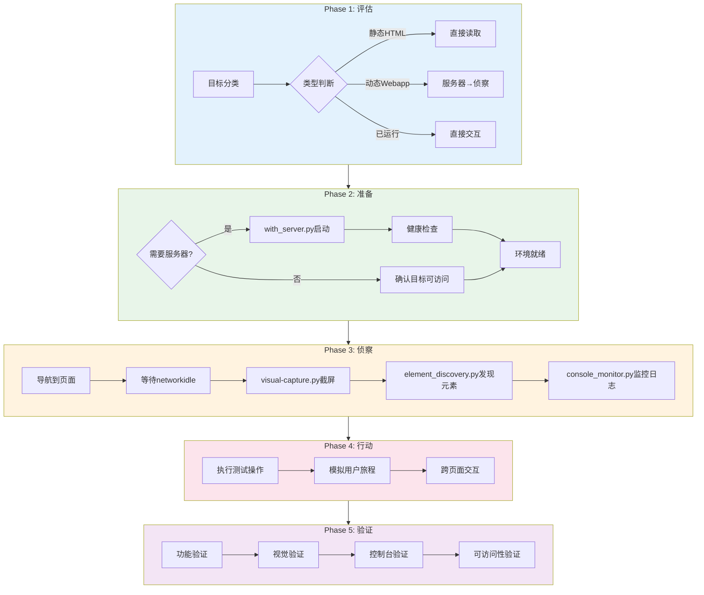

---
metadata:
  name: Playwright Webapp自动化测试工作流
  version: "3.2.0"
  description: Playwright驱动的Web应用自动化测试工作流，覆盖评估、准备、侦察、行动、验证五个阶段
  platform: all
  min_agents: 2
  max_agents: 4
phases:
- id: phase-eval
  name: 评估
  order: 1
  optional: false
  trigger_condition: 用户请求Webapp自动化测试或Playwright测试
  agents:
    primary:
    - e2e-tester
    - test-architect
    supporting: []
  inputs:
  - name: 测试目标
    type: document
    required: true
  - name: 测试范围
    type: document
    required: false
  outputs:
  - name: 测试策略文档
    type: document
    validation: 测试目标已分类
  - name: 目标分类结果
    type: document
    validation: 分类为静态HTML/动态Webapp/已运行服务
  - name: 浏览器配置
    type: config
    validation: 浏览器类型已确认
  quality_gates:
  - gate_id: GATE-001
    blocking: true
    pass_criteria: 测试目标已分类（静态HTML/动态Webapp/已运行服务）
  timeout_minutes: 30
  retry:
    max_attempts: 2
    backoff: exponential
- id: phase-prepare
  name: 准备
  order: 2
  optional: false
  agents:
    primary:
    - e2e-tester
    - devops-engineer
    supporting: []
  inputs:
  - name: 测试策略文档
    type: document
    required: true
  - name: 服务器启动命令
    type: config
    required: false
  outputs:
  - name: 服务器就绪确认
    type: document
    validation: 服务器启动成功或环境配置完成
  - name: 环境配置文档
    type: document
    validation: Playwright浏览器已安装
  quality_gates:
  - gate_id: GATE-005
    blocking: true
    pass_criteria: 服务器启动成功或环境配置完成
  timeout_minutes: 60
  retry:
    max_attempts: 3
    backoff: exponential
  trigger_condition: 评估完成
- id: phase-recon
  name: 侦察
  order: 3
  optional: false
  agents:
    primary:
    - e2e-tester
    supporting: []
  inputs:
  - name: 目标URL
    type: url
    required: true
  outputs:
  - name: 页面截图
    type: image
    validation: 截图已捕获
  - name: 元素发现报告
    type: json
    validation: 页面元素已识别
  - name: 控制台日志报告
    type: json
    validation: 日志已捕获
  - name: 选择器映射表
    type: document
    validation: 关键元素选择器已记录
  quality_gates:
  - gate_id: GATE-011
    blocking: true
    pass_criteria: 页面已导航且networkidle
  - gate_id: GATE-011
    blocking: true
    pass_criteria: 页面元素已识别
  timeout_minutes: 30
  retry:
    max_attempts: 2
    backoff: fixed
  trigger_condition: 准备完成
- id: phase-action
  name: 行动
  order: 4
  optional: false
  agents:
    primary:
    - e2e-tester
    supporting: []
  inputs:
  - name: 选择器映射表
    type: document
    required: true
  - name: 测试用例
    type: document
    required: true
  outputs:
  - name: 测试操作日志
    type: log
    validation: 操作已执行
  - name: 操作截图
    type: image
    validation: 关键步骤已截图
  - name: 中间状态验证结果
    type: json
    validation: 验证点已检查
  quality_gates:
  - gate_id: TEST-PASS
    blocking: true
    pass_criteria: 测试操作已执行
  timeout_minutes: 60
  retry:
    max_attempts: 2
    backoff: fixed
  trigger_condition: 侦察完成
- id: phase-verify
  name: 验证
  order: 5
  optional: false
  agents:
    primary:
    - e2e-tester
    - qa-engineer
    supporting: []
  inputs:
  - name: 测试操作日志
    type: log
    required: true
  - name: 基线截图
    type: image
    required: false
  outputs:
  - name: E2E测试报告
    type: document
    validation: Playwright E2E测试全部通过+无超时
  - name: 视觉回归报告
    type: json
    validation: 截屏对比无回归
  - name: 控制台验证报告
    type: json
    validation: 无error级别日志
  - name: 可访问性报告
    type: document
    validation: WCAG合规
  quality_gates:
  - gate_id: PLAYWRIGHT-E2E-PASS
    blocking: true
    pass_criteria: Playwright E2E测试全部通过+无超时
  - gate_id: VISUAL-REGRESSION-PASS
    blocking: false
    pass_criteria: 截屏对比无回归(阈值<0.1%)
  - gate_id: CONSOLE-ERROR-FREE
    blocking: false
    pass_criteria: 浏览器控制台无error级别日志
  timeout_minutes: 60
  retry:
    max_attempts: 2
    backoff: exponential
  trigger_condition: 行动完成
agent_matrix:
  e2e-tester:
    phases:
    - phase-eval
    - phase-prepare
    - phase-recon
    - phase-action
    - phase-verify
    role: primary
    max_parallel_instances: 1
  test-architect:
    phases:
    - phase-eval
    role: primary
    max_parallel_instances: 1
  devops-engineer:
    phases:
    - phase-prepare
    role: primary
    max_parallel_instances: 1
  qa-engineer:
    phases:
    - phase-verify
    role: primary
    max_parallel_instances: 1
exception_handling:
  phase_failure:
    action: retry_then_escalate
    escalation_target: orchestrator
    max_retries: 3
  agent_unavailable:
    action: substitute_and_continue
    substitute_agent: e2e-tester
  quality_gate_blocked:
    action: auto_fix_then_pause
    auto_fix_agents:
    - e2e-tester
    - devops-engineer
---


# Playwright Webapp自动化测试工作流

## 工作流名称：Playwright Webapp Testing Workflow（Playwright Web应用自动化测试工作流）

## 描述
基于Playwright的Web应用自动化测试工作流，通过评估-准备-侦察-行动-验证五阶段模型，实现从服务器启动到测试验证的全流程自动化。支持静态HTML、动态Web应用和已运行服务三种场景的智能适配。

## 触发条件
- 用户请求Playwright自动化测试
- 用户提及"Webapp测试"、"E2E自动化"、"浏览器测试"
- `/test --playwright` 命令触发
- 需要对Web应用进行功能/视觉/控制台验证

## 决策树
```
目标类型判断
├── 静态HTML文件
│   └── 直接读取文件 → 跳过服务器启动 → 直接进入侦察阶段
├── 动态Webapp（需要构建/启动）
│   └── 使用with_server.py启动开发服务器 → 等待就绪 → 进入侦察阶段
└── 已运行的服务
    └── 直接连接 → 跳过服务器启动 → 进入侦察阶段
```

## 涉及的Agent

### 核心Agent
| Agent | 角色 | 职责 |
|-------|------|------|
| e2e-tester | E2E测试工程师 | 测试设计、执行、验证 |
| test-architect | 测试架构师 | 测试策略制定、目标分类 |
| devops-engineer | DevOps工程师 | 服务器启动、环境配置 |
| qa-engineer | QA工程师 | 质量汇总与聚合 |

## 阶段定义

### Phase 1：评估（Evaluation） **执行者**: e2e-tester, test-architect

**输入**:
- 测试目标（document，必填）
- 测试范围（document，选填）

**活动**:
1. 目标分类决策
   - 静态HTML：直接文件路径，无需服务器
   - 动态Webapp：需要构建和启动开发服务器
   - 已运行服务：直接使用现有URL
2. 测试范围确定
   - 功能测试需求
   - 视觉回归测试需求
   - 控制台监控需求
   - 跨浏览器测试需求
3. 浏览器选择
   - chromium（默认）
   - firefox
   - webkit

**输出**:
- 测试策略文档
- 目标分类结果
- 浏览器配置

**质量门禁**:
- [ ] 测试目标已分类（静态HTML/动态Webapp/已运行服务）

---

### Phase 2：准备（Preparation） **执行者**: e2e-tester, devops-engineer

**输入**:
- 测试策略文档（document，必填）
- 服务器启动命令（config，选填）

**活动**:
1. 服务器启动（动态Webapp场景）
   - 使用 `with_server.py` 管理服务器生命周期
   - 支持多服务器模式（前后端分离）
   - 健康检查确认服务器就绪
2. 环境配置
   - Playwright浏览器安装确认
   - 测试数据准备
   - 环境变量设置
3. 静态HTML/已运行服务场景
   - 跳过服务器启动
   - 确认目标可访问

**输出**:
- 服务器就绪确认
- 环境配置文档

**质量门禁**:
- [ ] 服务器启动成功或环境配置完成

**with_server.py使用示例**:
```bash
# 单服务器
python scripts/with_server.py \
  --server "npm run dev" \
  --port 3000 \
  --command "python scripts/element_discovery.py --url http://localhost:3000"

# 多服务器（前后端分离）
python scripts/with_server.py \
  --server "npm run dev" --server "python -m api.server" \
  --port 3000 --port 8000 \
  --command "pytest tests/e2e/"
```

---

### Phase 3：侦察（Reconnaissance） **执行者**: e2e-tester

**输入**:
- 目标URL（url，必填）

**活动**:
1. 页面导航
   - 使用Playwright导航到目标页面
   - 等待 `networkidle` 状态
2. 截屏记录
   - 使用 `visual-capture.py` 捕获全页截图
   - 作为测试基线或当前状态记录
3. 元素发现
   - 使用 `element_discovery.py` 识别页面元素
   - 发现按钮、链接、输入框、表单、图片、标题
   - 生成选择器映射表
4. 控制台监控
   - 使用 `console_monitor.py` 捕获初始控制台日志
   - 识别页面加载时的错误和警告

**输出**:
- 页面截图
- 元素发现报告（JSON）
- 控制台日志报告（JSON）
- 选择器映射表

**质量门禁**:
- [ ] 页面已导航且networkidle
- [ ] 页面元素已识别

---

### Phase 4：行动（Action） **执行者**: e2e-tester

**输入**:
- 选择器映射表（document，必填）
- 测试用例（document，必填）

**活动**:
1. 测试操作执行
   - 基于侦察阶段发现的选择器执行操作
   - 点击按钮、填写表单、导航链接
   - 等待元素可见/可交互后再操作
2. 用户旅程模拟
   - 执行关键业务流程
   - 验证页面跳转和数据变化
3. 跨页面操作
   - 多页面导航测试
   - 表单提交和验证
   - 文件上传测试

**输出**:
- 测试操作日志
- 操作截图
- 中间状态验证结果

**质量门禁**:
- [ ] 测试操作已执行

---

### Phase 5：验证（Verification） **执行者**: e2e-tester, qa-engineer

**输入**:
- 测试操作日志（log，必填）
- 基线截图（image，选填）

**活动**:
1. 功能验证
   - 断言页面内容正确
   - 验证交互结果
   - 检查数据一致性
2. 视觉验证
   - 使用 `visual-capture.py` 进行截屏对比
   - 像素级差异分析
   - 布局偏移检测
3. 控制台验证
   - 使用 `console_monitor.py` 检查error级别日志
   - 确认无JavaScript错误
4. 可访问性验证
   - WCAG合规检查
   - 键盘导航验证

**输出**:
- E2E测试报告
- 视觉回归测试报告
- 控制台日志报告
- 可访问性报告

**质量门禁**:
- [ ] PLAYWRIGHT-E2E-PASS: Playwright E2E测试全部通过+无超时
- [ ] VISUAL-REGRESSION-PASS: 截屏对比无回归(阈值<0.1%)
- [ ] CONSOLE-ERROR-FREE: 浏览器控制台无error级别日志

## 流程图


## 输出产物清单

| 阶段 | 输出产物 | 格式 |
|------|----------|------|
| 评估 | 测试策略文档 | Markdown |
| 准备 | 环境配置文档 | Markdown |
| 侦察 | 页面截图 | PNG |
| 侦察 | 元素发现报告 | JSON |
| 侦察 | 控制台日志报告 | JSON |
| 行动 | 测试操作日志 | Log |
| 验证 | E2E测试报告 | HTML/JSON |
| 验证 | 视觉回归报告 | JSON |
| 验证 | 控制台验证报告 | JSON |

## 工具脚本

| 脚本 | 用途 | 阶段 |
|------|------|------|
| `scripts/with_server.py` | 服务器生命周期管理 | Phase 2 |
| `scripts/element_discovery.py` | 页面元素发现 | Phase 3 |
| `scripts/console_monitor.py` | 控制台日志监控 | Phase 3/5 |
| `scripts/visual-capture.py` | 截屏与视觉对比 | Phase 3/5 |

## 执行建议

1. **先侦察后行动**：始终先完成侦察阶段，了解页面结构和元素后再执行操作
2. **智能等待**：使用 `networkidle` 和选择器等待，避免固定等待
3. **多浏览器验证**：关键流程应在chromium/firefox/webkit上验证
4. **服务器清理**：测试完成后确保服务器进程被正确清理
5. **基线管理**：视觉回归测试需维护截图基线