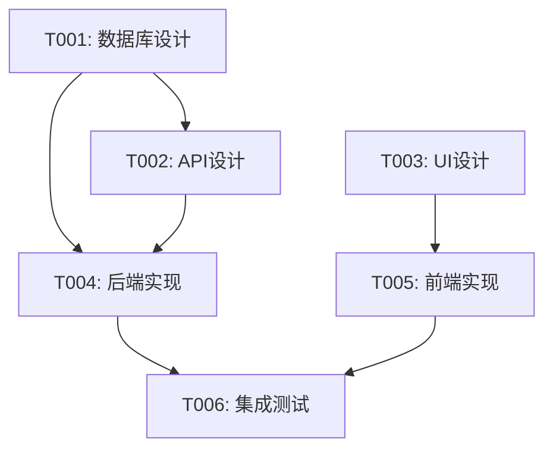

# /plan 命令

## 命令描述

基于澄清后的需求制定详细的实施计划，包括任务分解、Agent分配、依赖分析和时间估算。该命令是SDD流程的核心规划环节。

## 触发条件

| 触发方式 | 说明 |
|----------|------|
| 命令输入 | 用户输入 `/plan` |
| 关键词触发 | 用户提及"架构规划"、"计划制定"、"任务分解" |
| 自动触发 | `/sprint` 命令执行时自动调用Plan阶段 |
| 流程触发 | `/clarify` 完成后自动进入Plan阶段 |

## 命令名称与语法

```
/plan [--input=<需求文件>] [--method=<方法>] [--constraints=<约束>]
```

## 参数定义

| 参数 | 类型 | 必填 | 默认值 | 说明 |
|------|------|------|--------|------|
| `--input` | path | 否 | .sprint/artifacts/requirements/ | 澄清后的需求文件路径 |
| `--method` | enum | 否 | auto | 规划方法：auto/agile/waterfall/kanban |
| `--constraints` | json | 否 | {} | 约束条件（时间、资源、技术） |
| `--parallelism` | int | 否 | 3 | 最大并行任务数 |
| `--granularity` | enum | 否 | medium | 任务粒度：coarse/medium/fine |
| `--save` | flag | 否 | true | 保存计划到文件 |

## 执行流程

> 标准五步框架：1. 输入验证 → 2. Agent调度 → 3. 任务执行 → 4. 结果验证 → 5. 输出交付

### 执行步骤

1. **输入验证**：校验`--input`路径存在且包含有效需求文件、`--method`参数合法、`--constraints` JSON格式正确
2. **Agent调度**：product-manager主导任务优先级，system-architect负责技术依赖分析，fullstack-engineer估算工作量
3. **任务执行**：执行任务分解→依赖分析→Agent分配→时间估算→风险评估→计划优化的完整规划流程
4. **结果验证**：执行GATE-003和PLAN-ATOMIC门禁检查，验证任务分解完整、依赖无循环、每个任务满足原子性
5. **输出交付**：生成implementation-plan.md和task-graph.json，保存到.sprint/artifacts/planning/

```
┌─────────────────────────────────────────────────────────────┐
│                    计划制定流程                              │
├─────────────────────────────────────────────────────────────┤
│                                                             │
│  ┌──────────────┐                                          │
│  │  加载需求     │                                          │
│  └──────┬───────┘                                          │
│         │                                                   │
│         ▼                                                   │
│  ┌──────────────┐    ┌──────────────┐                      │
│  │  任务分解     │───▶│  依赖分析     │                      │
│  └──────────────┘    └──────┬───────┘                      │
│                             │                               │
│         ┌───────────────────┼───────────────────┐          │
│         │                   │                   │          │
│         ▼                   ▼                   ▼          │
│  ┌──────────────┐    ┌──────────────┐    ┌──────────────┐  │
│  │  Agent分配    │    │  时间估算     │    │  风险评估     │  │
│  └──────┬───────┘    └──────────────┘    └──────────────┘  │
│         │                                                   │
│         ▼                                                   │
│  ┌──────────────┐    ┌──────────────┐                      │
│  │  计划优化     │───▶│  输出产物     │                      │
│  └──────────────┘    └──────────────┘                      │
│                                                             │
└─────────────────────────────────────────────────────────────┘
```

### 步骤详情

1. **任务分解**
   - 功能点拆分
   - 技术任务识别
   - 测试任务规划
   - 文档任务安排

2. **依赖分析**
   - 技术依赖
   - 数据依赖
   - 外部依赖
   - 关键路径识别

3. **Agent分配**
   - 能力匹配
   - 负载均衡
   - 协作关系
   - 备选方案

4. **时间估算**
   - 历史数据参考
   - 复杂度评估
   - 缓冲时间
   - 里程碑设定

5. **风险评估**
   - 技术风险
   - 资源风险
   - 进度风险
   - 应对策略

6. **计划优化**
   - 并行化优化
   - 资源冲突解决
   - 关键路径优化
   - 迭代调整

## 涉及Agent

| Agent | 角色 | 职责 |
|-------|------|------|
| product-manager | 主导 | 任务优先级、里程碑定义 |
| system-architect | 辅助 | 技术依赖、架构决策 |
| fullstack-engineer | 辅助 | 工作量估算 |
| test-architect | 辅助 | 测试策略、测试任务 |
| devops-engineer | 辅助 | 部署任务、环境准备 |

## 输出格式

### implementation-plan.md

```markdown
# 实施计划

## 项目概览
- **项目名称**: [项目名]
- **计划版本**: v1.0
- **创建时间**: 2024-01-15
- **预计工期**: [工期]

## 任务分解

### Phase 1: 设计阶段
| 任务ID | 任务名称 | Agent | 预估时间 | 依赖 |
|--------|----------|-------|----------|------|
| T001 | 数据库设计 | database-engineer | 2h | - |
| T002 | API设计 | backend-developer | 3h | T001 |
| T003 | UI设计 | ui-designer | 4h | - |

### Phase 2: 实现阶段
| 任务ID | 任务名称 | Agent | 预估时间 | 依赖 |
|--------|----------|-------|----------|------|
| T004 | 后端实现 | backend-developer | 8h | T001,T002 |
| T005 | 前端实现 | frontend-developer | 6h | T003 |
| T006 | 集成测试 | integration-tester | 4h | T004,T005 |

## 依赖图



## 时间线

| 里程碑 | 预计完成 | 关键交付物 |
|--------|----------|------------|
| M1: 设计完成 | Day 1 | 设计文档、API规格 |
| M2: 开发完成 | Day 3 | 源代码、单元测试 |
| M3: 测试完成 | Day 4 | 测试报告 |
| M4: 发布就绪 | Day 5 | 部署包、文档 |

## 资源分配

### Agent分配矩阵
| Agent | 任务列表 | 总工时 | 负载率 |
|-------|----------|--------|--------|
| backend-developer | T002,T004 | 11h | 55% |
| frontend-developer | T005 | 6h | 30% |
| database-engineer | T001 | 2h | 10% |

## 风险评估

| 风险ID | 风险描述 | 概率 | 影响 | 缓解措施 |
|--------|----------|------|------|----------|
| R001 | API设计变更 | 中 | 高 | 预留缓冲时间 |
| R002 | 第三方服务不稳定 | 低 | 高 | 准备Mock方案 |

## 验收标准
- [ ] 所有任务完成
- [ ] 测试覆盖率 ≥ 80%
- [ ] 代码审查通过
- [ ] 文档完整
```

### task-graph.json

```json
{
  "version": "1.0",
  "tasks": [
    {
      "id": "T001",
      "name": "数据库设计",
      "agent": "database-engineer",
      "estimated_hours": 2,
      "dependencies": [],
      "status": "pending",
      "priority": "high"
    }
  ],
  "critical_path": ["T001", "T002", "T004", "T006"],
  "total_duration_hours": 16
}
```

## 任务分解模板

### 按功能模块分解

```
功能模块
├── 数据层
│   ├── 数据模型设计
│   ├── 数据库迁移
│   └── 数据访问层
├── 业务层
│   ├── 业务逻辑
│   ├── API接口
│   └── 集成服务
├── 表现层
│   ├── UI组件
│   ├── 状态管理
│   └── 路由配置
└── 测试层
    ├── 单元测试
    ├── 集成测试
    └── E2E测试
```

### 按开发阶段分解

```
开发阶段
├── 规格阶段
│   ├── API规格编写
│   └── 接口契约定义
├── 设计阶段
│   ├── 架构设计
│   └── 详细设计
├── 实现阶段
│   ├── TDD开发
│   └── 代码审查
└── 验证阶段
    ├── 测试执行
    └── 验收测试
```

## 示例用法

### 示例1：自动规划

```
/plan
```

### 示例2：指定输入文件

```
/plan --input=./docs/requirements.md
```

### 示例3：带约束条件

```
/plan --constraints='{"deadline":"2024-02-01","max_agents":5}'
```

### 示例4：细粒度任务

```
/plan --granularity=fine --parallelism=5
```

## 约束条件格式

```json
{
  "deadline": "2024-02-01",
  "max_agents": 5,
  "required_agents": ["backend-developer", "frontend-developer"],
  "excluded_agents": ["mobile-developer"],
  "technology": ["React", "Node.js", "PostgreSQL"],
  "budget_hours": 100
}
```

## 计划调整

当计划需要调整时：

```
/plan --adjust
```

系统会：
1. 分析当前进度
2. 识别偏差原因
3. 重新计算依赖
4. 生成调整方案
5. 更新时间线

## 质量门禁

| 门禁标识 | 阻塞级别(BLOCK/WARN) | 通过标准 |
|----------|----------------------|----------|
| GATE-003 | BLOCK | 任务分解完整、依赖关系无循环、关键路径已识别 |
| GATE-004 | BLOCK | 技术选型合理、风险评估完成、备选方案已评估 |
| PLAN-ATOMIC | BLOCK | 每个任务≤5分钟+含文件路径+含验证步骤+任务不可再分 |
| PLAN-PERSISTENCE | WARN | 重大决策前已重新读取计划文件、2-Action Rule执行 |

计划制定完成后自动执行：

- [ ] 所有任务有明确Agent
- [ ] 依赖关系无循环
- [ ] 关键路径已识别
- [ ] 风险已评估
- [ ] 时间估算合理

## 相关脚本

- `scripts/init-session.py` - 会话初始化器，创建规划会话和工作目录结构

---

## 相关命令

- `/clarify` - 需求澄清
- `/spec` - 规格编写
- `/implement` - 开始实施
- `/sprint` - 启动完整冲刺
