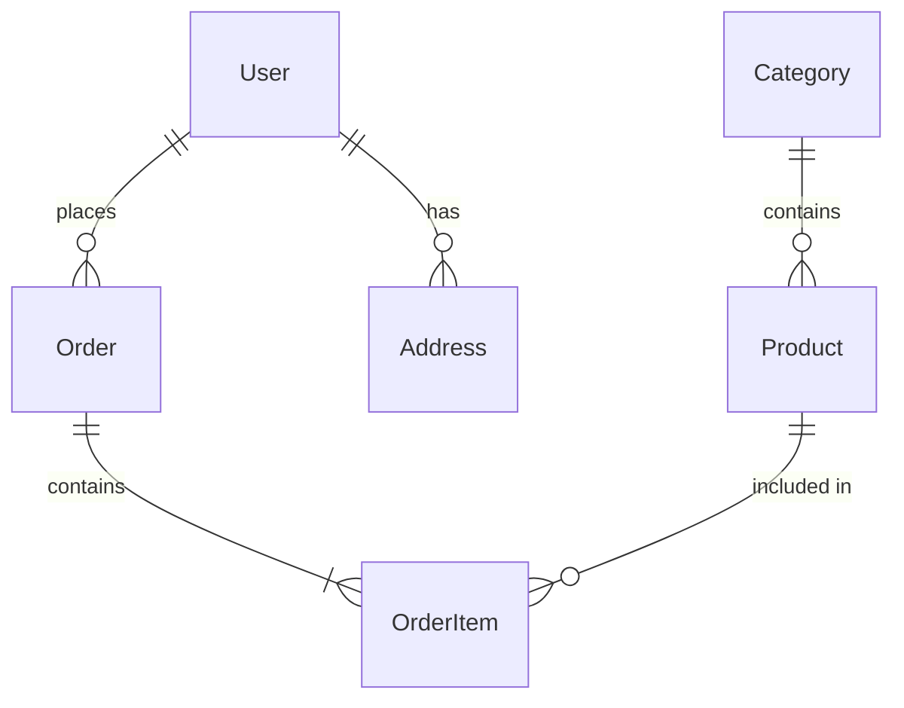

# /spec 命令

## 命令描述

编写技术规格文档，定义API契约、数据模型、接口规范和技术标准。该命令确保开发团队有清晰的技术指导，是SDD流程中文档驱动的核心环节。

## 触发条件

| 触发方式 | 说明 |
|----------|------|
| 命令输入 | 用户输入 `/spec` |
| 关键词触发 | 用户提及"规格编写"、"API规格"、"技术规格" |
| 自动触发 | `/sprint` 命令执行时自动调用Spec阶段 |
| 流程触发 | `/plan` 完成后自动进入Spec阶段 |

## 命令名称与语法

```
/spec [--type=<类型>] [--format=<格式>] [--template=<模板>]
```

## 参数定义

| 参数 | 类型 | 必填 | 默认值 | 说明 |
|------|------|------|--------|------|
| `--type` | enum | 否 | all | 规格类型：all/api/data/architecture/security |
| `--format` | enum | 否 | openapi | 输出格式：openapi/asyncapi/graphql/protobuf |
| `--template` | path | 否 | default | 自定义模板路径 |
| `--validate` | flag | 否 | true | 验证规格完整性 |
| `--generate-code` | flag | 否 | false | 生成骨架代码 |
| `--language` | list | 否 | auto | 目标语言：typescript/python/go/java |

## 执行流程

> 标准五步框架：1. 输入验证 → 2. Agent调度 → 3. 任务执行 → 4. 结果验证 → 5. 输出交付

### 执行步骤

1. **输入验证**：校验`--type`参数合法、`--template`路径存在、`--format`与`--type`兼容；加载计划文件
2. **Agent调度**：system-architect主导架构规格，specification-keeper维护一致性，backend-developer和database-engineer分别负责API和数据规格
3. **任务执行**：根据`--type`参数并行或串行编写API/数据/架构/安全规格，执行规格验证
4. **结果验证**：执行GATE-002和GATE-004门禁检查，验证API定义完整、数据模型一致、接口契约100%通过
5. **输出交付**：生成api-spec.yaml、data-model.md、architecture.md等规格文档，保存到.sprint/artifacts/spec/

```
┌─────────────────────────────────────────────────────────────┐
│                    规格编写流程                              │
├─────────────────────────────────────────────────────────────┤
│                                                             │
│  ┌──────────────┐                                          │
│  │  加载计划     │                                          │
│  └──────┬───────┘                                          │
│         │                                                   │
│         ▼                                                   │
│  ┌──────────────────────────────────────────────┐          │
│  │              规格类型选择                      │          │
│  └──┬───────────┬───────────┬───────────┬───────┘          │
│     │           │           │           │                   │
│     ▼           ▼           ▼           ▼                   │
│  ┌──────┐   ┌──────┐   ┌──────┐   ┌──────┐                │
│  │ API  │   │ 数据 │   │ 架构 │   │ 安全 │                │
│  │ 规格 │   │ 规格 │   │ 规格 │   │ 规格 │                │
│  └──┬───┘   └──┬───┘   └──┬───┘   └──┬───┘                │
│     │           │           │           │                   │
│     └───────────┴───────────┴───────────┘                   │
│                     │                                       │
│                     ▼                                       │
│  ┌──────────────┐    ┌──────────────┐                      │
│  │  规格验证     │───▶│  输出产物     │                      │
│  └──────────────┘    └──────────────┘                      │
│                                                             │
└─────────────────────────────────────────────────────────────┘
```

### 规格类型详情

1. **API规格**
   - RESTful API定义
   - GraphQL Schema
   - gRPC Proto文件
   - WebSocket事件

2. **数据规格**
   - 数据模型定义
   - 数据库Schema
   - 数据迁移脚本
   - 数据验证规则

3. **架构规格**
   - 系统架构图
   - 组件交互图
   - 部署架构
   - 技术栈说明

4. **安全规格**
   - 认证授权方案
   - 数据加密标准
   - 安全审计要求
   - 合规性要求

## 涉及Agent

| Agent | 角色 | 职责 |
|-------|------|------|
| system-architect | 主导 | 架构规格、技术选型 |
| specification-keeper | 辅助 | 规格一致性维护、版本管理、变更控制 |
| backend-developer | 辅助 | API规格、数据规格 |
| database-engineer | 辅助 | 数据模型、Schema |
| security-auditor | 辅助 | 安全规格 |
| technical-writer | 辅助 | 文档整理 |

## 输出格式

### api-spec.yaml (OpenAPI 3.1)

```yaml
openapi: 3.1.0
info:
  title: 用户服务API
  version: 1.0.0
  description: 用户管理相关API接口

servers:
  - url: https://api.example.com/v1
    description: 生产环境
  - url: https://api-staging.example.com/v1
    description: 测试环境

paths:
  /users:
    get:
      summary: 获取用户列表
      operationId: listUsers
      tags:
        - Users
      parameters:
        - name: page
          in: query
          schema:
            type: integer
            default: 1
        - name: limit
          in: query
          schema:
            type: integer
            default: 20
            maximum: 100
      responses:
        '200':
          description: 成功返回用户列表
          content:
            application/json:
              schema:
                $ref: '#/components/schemas/UserList'
        '400':
          $ref: '#/components/responses/BadRequest'
        '401':
          $ref: '#/components/responses/Unauthorized'

    post:
      summary: 创建用户
      operationId: createUser
      tags:
        - Users
      requestBody:
        required: true
        content:
          application/json:
            schema:
              $ref: '#/components/schemas/CreateUserRequest'
      responses:
        '201':
          description: 用户创建成功
          content:
            application/json:
              schema:
                $ref: '#/components/schemas/User'

  /users/{userId}:
    get:
      summary: 获取用户详情
      operationId: getUser
      tags:
        - Users
      parameters:
        - name: userId
          in: path
          required: true
          schema:
            type: string
            format: uuid
      responses:
        '200':
          description: 成功返回用户详情
          content:
            application/json:
              schema:
                $ref: '#/components/schemas/User'
        '404':
          $ref: '#/components/responses/NotFound'

components:
  schemas:
    User:
      type: object
      required:
        - id
        - email
        - createdAt
      properties:
        id:
          type: string
          format: uuid
          description: 用户唯一标识
        email:
          type: string
          format: email
          description: 用户邮箱
        name:
          type: string
          maxLength: 100
          description: 用户名称
        avatar:
          type: string
          format: uri
          description: 头像URL
        status:
          type: string
          enum: [active, inactive, suspended]
          default: active
        createdAt:
          type: string
          format: date-time
        updatedAt:
          type: string
          format: date-time

    CreateUserRequest:
      type: object
      required:
        - email
        - password
      properties:
        email:
          type: string
          format: email
        password:
          type: string
          format: password
          minLength: 8
        name:
          type: string
          maxLength: 100

    UserList:
      type: object
      properties:
        data:
          type: array
          items:
            $ref: '#/components/schemas/User'
        pagination:
          $ref: '#/components/schemas/Pagination'

    Pagination:
      type: object
      properties:
        page:
          type: integer
        limit:
          type: integer
        total:
          type: integer
        totalPages:
          type: integer

  responses:
    BadRequest:
      description: 请求参数错误
      content:
        application/json:
          schema:
            $ref: '#/components/schemas/Error'
    Unauthorized:
      description: 未授权
    NotFound:
      description: 资源不存在

    Error:
      type: object
      properties:
        code:
          type: string
        message:
          type: string
        details:
          type: array
          items:
            type: object
            properties:
              field:
                type: string
              message:
                type: string

  securitySchemes:
    BearerAuth:
      type: http
      scheme: bearer
      bearerFormat: JWT

security:
  - BearerAuth: []
```

### data-model.md

```markdown
# 数据模型规格

## 实体关系图



## 数据表定义

### users 表

| 字段 | 类型 | 约束 | 说明 |
|------|------|------|------|
| id | UUID | PK | 主键 |
| email | VARCHAR(255) | UNIQUE, NOT NULL | 邮箱 |
| password_hash | VARCHAR(255) | NOT NULL | 密码哈希 |
| name | VARCHAR(100) | | 用户名 |
| status | ENUM | DEFAULT 'active' | 状态 |
| created_at | TIMESTAMP | NOT NULL | 创建时间 |
| updated_at | TIMESTAMP | | 更新时间 |

### 索引定义

```sql
CREATE INDEX idx_users_email ON users(email);
CREATE INDEX idx_users_status ON users(status);
CREATE INDEX idx_users_created_at ON users(created_at);
```

## 数据验证规则

| 字段 | 规则 |
|------|------|
| email | 邮箱格式，最大255字符 |
| password | 最少8字符，包含大小写和数字 |
| name | 最大100字符，允许中文 |
```

### architecture.md

```markdown
# 系统架构规格

## 整体架构

```
┌─────────────────────────────────────────────────────────────┐
│                        客户端层                              │
│  ┌─────────┐  ┌─────────┐  ┌─────────┐                    │
│  │ Web App │  │iOS App  │  │Android  │                    │
│  └────┬────┘  └────┬────┘  └────┬────┘                    │
└───────┼────────────┼────────────┼──────────────────────────┘
        │            │            │
        └────────────┼────────────┘
                     │
┌────────────────────▼───────────────────────────────────────┐
│                        API网关层                            │
│  ┌─────────────────────────────────────────────────────┐  │
│  │  API Gateway (Kong/Nginx)                           │  │
│  │  - 认证/授权  - 限流  - 路由  - 日志                  │  │
│  └─────────────────────────────────────────────────────┘  │
└─────────────────────────┬─────────────────────────────────┘
                          │
┌─────────────────────────▼─────────────────────────────────┐
│                        服务层                              │
│  ┌──────────┐  ┌──────────┐  ┌──────────┐                │
│  │ 用户服务  │  │ 订单服务  │  │ 商品服务  │                │
│  └─────┬────┘  └─────┬────┘  └─────┬────┘                │
│        │             │             │                      │
│        └─────────────┼─────────────┘                      │
│                      │                                    │
│  ┌───────────────────▼───────────────────┐               │
│  │         消息队列 (RabbitMQ)            │               │
│  └───────────────────────────────────────┘               │
└─────────────────────────┬─────────────────────────────────┘
                          │
┌─────────────────────────▼─────────────────────────────────┐
│                        数据层                              │
│  ┌──────────┐  ┌──────────┐  ┌──────────┐                │
│  │PostgreSQL│  │  Redis   │  │   S3     │                │
│  │ 主数据库  │  │  缓存    │  │ 文件存储  │                │
│  └──────────┘  └──────────┘  └──────────┘                │
└───────────────────────────────────────────────────────────┘
```

## 技术栈

| 层级 | 技术选型 | 版本 |
|------|----------|------|
| 前端 | React + TypeScript | 18.x |
| API网关 | Kong | 3.x |
| 后端 | Node.js + NestJS | 20.x |
| 数据库 | PostgreSQL | 15.x |
| 缓存 | Redis | 7.x |
| 消息队列 | RabbitMQ | 3.x |
| 容器 | Docker + Kubernetes | - |

## 服务通信

| 通信方式 | 使用场景 |
|----------|----------|
| REST API | 同步请求、CRUD操作 |
| gRPC | 服务间高性能调用 |
| 消息队列 | 异步任务、事件驱动 |
| WebSocket | 实时通信 |
```

## 示例用法

### 示例1：生成所有规格

```
/spec
```

### 示例2：仅生成API规格

```
/spec --type=api
```

### 示例3：生成GraphQL规格

```
/spec --type=api --format=graphql
```

### 示例4：生成并验证

```
/spec --validate --generate-code --language=typescript
```

### 示例5：使用自定义模板

```
/spec --template=./templates/api-spec-template.yaml
```

## 规格验证规则

### API规格验证

| 检查项 | 说明 |
|--------|------|
| 路径命名 | 遵循RESTful规范 |
| 响应码 | 包含所有必要响应码 |
| 认证 | 安全方案已定义 |
| 版本控制 | API版本已指定 |
| 描述 | 所有字段有描述 |

### 数据规格验证

| 检查项 | 说明 |
|--------|------|
| 主键定义 | 每个表有主键 |
| 索引优化 | 查询字段有索引 |
| 外键约束 | 关系已定义 |
| 数据类型 | 类型选择合理 |
| 默认值 | 必要字段有默认值 |

## 代码生成

启用 `--generate-code` 时，自动生成：

```
generated/
├── typescript/
│   ├── models/
│   │   └── user.ts
│   ├── api/
│   │   └── userApi.ts
│   └── schemas/
│       └── validation.ts
├── python/
│   ├── models/
│   │   └── user.py
│   └── api/
│       └── user_api.py
└── docs/
    └── api-docs.html
```

## 质量门禁

| 门禁标识 | 阻塞级别(BLOCK/WARN) | 通过标准 |
|----------|----------------------|----------|
| GATE-002 | BLOCK | 所有API有完整定义、数据模型关系完整、版本信息完整 |
| GATE-004 | BLOCK | 技术选型合理、架构图清晰、安全要求明确 |
| SPEC-CONSISTENCY | BLOCK | 规格文档与代码实现100%一致、Spec-Drift标记项已确认 |

规格编写完成后自动执行：

- [ ] 所有API有完整定义
- [ ] 数据模型关系完整
- [ ] 架构图清晰
- [ ] 安全要求明确
- [ ] 版本信息完整

## 相关脚本

- `scripts/spec-drift-detector.py` - 规格偏移检测器，检测代码实现与规格文档之间的偏差
- `scripts/api-contract-validator.py` - API契约验证器，验证接口契约完整性

---

## 相关命令

- `/plan` - 计划制定
- `/design` - 设计流程
- `/implement` - 开始实施
- `/sprint` - 启动完整冲刺
