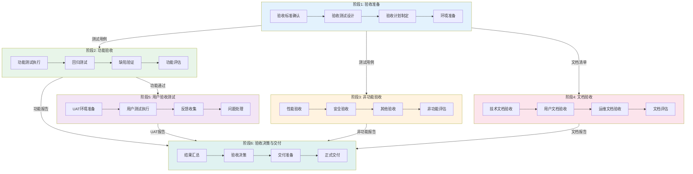

---
metadata:
  name: 用户验收与部署验证工作流
  version: "3.2.0"
  description: 用户验收部署验证与桌面专项验收
  platform: all
  min_agents: 2
  max_agents: 5
phases:
- id: phase-1
  name: 验收准备
  order: 1
  optional: false
  trigger_condition: 开发完成且通过验证阶段
  agents:
    primary:
    - product-manager
    - test-architect
    supporting:
    - e2e-tester
    - security-auditor
    - performance-tester
    - documentation-engineer
    - desktop-developer
    - build-release-engineer
  inputs:
  - name: 验证通过的产物
    type: document
    required: true
  - name: 用户故事和验收标准
    type: document
    required: true
  outputs:
  - name: 验收计划
    type: document
    validation: 验收范围和标准明确
  quality_gates:
  - gate_id: GATE-001
    blocking: true
    pass_criteria: 验收标准确认
  - gate_id: GATE-005
    blocking: true
    pass_criteria: 测试覆盖完整
  timeout_minutes: 60
  retry:
    max_attempts: 2
    backoff: fixed
- id: phase-2
  name: 功能验收
  order: 2
  optional: false
  trigger_condition: 验收准备完成
  agents:
    primary:
    - e2e-tester
    - product-manager
    supporting: []
  inputs:
  - name: 验收计划
    type: document
    required: true
    source_phase: phase-1
  outputs:
  - name: 功能验收报告
    type: document
    validation: 核心功能通过
  quality_gates:
  - gate_id: TEST-PASS
    blocking: true
    pass_criteria: 核心功能验收通过
  - gate_id: GATE-012
    blocking: true
    pass_criteria: 无P0/P1缺陷
  timeout_minutes: 120
  retry:
    max_attempts: 2
    backoff: fixed
- id: phase-3
  name: 非功能验收
  order: 3
  optional: false
  trigger_condition: 功能验收完成
  agents:
    primary:
    - performance-tester
    - security-auditor
    supporting: []
  inputs:
  - name: 功能验收报告
    type: document
    required: true
    source_phase: phase-2
  outputs:
  - name: 性能验收报告
    type: document
  - name: 安全验收报告
    type: document
  quality_gates:
  - gate_id: PERFORMANCE
    blocking: true
    pass_criteria: 性能达标
  - gate_id: GATE-012
    blocking: true
    pass_criteria: 无高危漏洞
  timeout_minutes: 120
  retry:
    max_attempts: 2
    backoff: fixed
- id: phase-3-5
  name: 桌面安装验证
  order: 4
  optional: false
  trigger_condition: 非功能验收完成且项目包含桌面端
  agents:
    primary:
    - desktop-developer
    - build-release-engineer
    supporting: []
  inputs:
  - name: 非功能验收报告
    type: document
    required: true
    source_phase: phase-3
  outputs:
  - name: 桌面安装验证报告
    type: document
    validation: 安装卸载正常
  quality_gates:
  - gate_id: DESKTOP-BUILD
    blocking: true
    pass_criteria: 安装包构建成功
  timeout_minutes: 90
  retry:
    max_attempts: 2
    backoff: fixed
- id: phase-3-6
  name: 自动更新验证
  order: 5
  optional: false
  trigger_condition: 桌面安装验证完成
  agents:
    primary:
    - build-release-engineer
    - desktop-developer
    supporting: []
  inputs:
  - name: 桌面安装验证报告
    type: document
    required: true
    source_phase: phase-3-5
  outputs:
  - name: 自动更新验证报告
    type: document
    validation: 自动更新功能正常
  quality_gates:
  - gate_id: DESKTOP-UPDATE
    blocking: true
    pass_criteria: 自动更新验证通过
  timeout_minutes: 60
  retry:
    max_attempts: 2
    backoff: fixed
- id: phase-3-7
  name: 跨平台兼容性验证
  order: 6
  optional: false
  trigger_condition: 自动更新验证完成
  agents:
    primary:
    - desktop-developer
    - e2e-tester
    supporting: []
  inputs:
  - name: 自动更新验证报告
    type: document
    required: true
    source_phase: phase-3-6
  outputs:
  - name: 跨平台兼容性报告
    type: document
    validation: 三平台功能一致性>95%
  quality_gates:
  - gate_id: DESKTOP-CROSS
    blocking: true
    pass_criteria: 跨平台一致性达标
  timeout_minutes: 90
  retry:
    max_attempts: 2
    backoff: fixed
- id: phase-4
  name: 文档验收
  order: 7
  optional: false
  trigger_condition: 跨平台兼容性验证完成或跳过桌面端验证
  agents:
    primary:
    - documentation-engineer
    - technical-writer
    supporting: []
  inputs:
  - name: 全部验收报告
    type: document
    required: true
  outputs:
  - name: 文档验收报告
    type: document
    validation: 文档覆盖完整
  quality_gates:
  - gate_id: DOC-COMPLETENESS
    blocking: true
    pass_criteria: 文档覆盖完整
  timeout_minutes: 60
  retry:
    max_attempts: 2
    backoff: fixed
- id: phase-5
  name: 用户验收测试
  order: 8
  optional: false
  trigger_condition: 文档验收完成
  agents:
    primary:
    - product-manager
    supporting: []
  inputs:
  - name: 文档验收报告
    type: document
    required: true
    source_phase: phase-4
  outputs:
  - name: UAT报告
    type: document
    validation: 用户验收通过
  quality_gates:
  - gate_id: UX-ACCEPTANCE
    blocking: true
    pass_criteria: 用户验收测试通过
  timeout_minutes: 120
  retry:
    max_attempts: 2
    backoff: fixed
- id: phase-6
  name: 验收决策与交付
  order: 9
  optional: false
  trigger_condition: 用户验收测试完成
  agents:
    primary:
    - product-manager
    - e2e-tester
    supporting: []
  inputs:
  - name: UAT报告
    type: document
    required: true
    source_phase: phase-5
  outputs:
  - name: 验收决策报告
    type: document
    validation: 验收决策已做出
  - name: 交付清单
    type: document
    validation: 交付物完整
  quality_gates:
  - gate_id: GATE-013
    blocking: true
    pass_criteria: 验收决策已做出且交付物就绪
  timeout_minutes: 60
  retry:
    max_attempts: 2
    backoff: fixed
agent_matrix:
  product-manager:
    phases:
    - phase-1
    - phase-2
    - phase-5
    - phase-6
    role: primary
    max_parallel_instances: 1
  test-architect:
    phases:
    - phase-1
    role: primary
    max_parallel_instances: 1
  e2e-tester:
    phases:
    - phase-2
    - phase-3-7
    - phase-6
    role: primary
    max_parallel_instances: 1
  performance-tester:
    phases:
    - phase-3
    role: primary
    max_parallel_instances: 1
  security-auditor:
    phases:
    - phase-3
    role: primary
    max_parallel_instances: 1
  desktop-developer:
    phases:
    - phase-3-5
    - phase-3-6
    - phase-3-7
    role: primary
    max_parallel_instances: 1
  build-release-engineer:
    phases:
    - phase-3-5
    - phase-3-6
    role: primary
    max_parallel_instances: 1
  documentation-engineer:
    phases:
    - phase-4
    role: primary
    max_parallel_instances: 1
  technical-writer:
    phases:
    - phase-4
    role: primary
    max_parallel_instances: 1
exception_handling:
  phase_failure:
    action: retry_then_escalate
    escalation_target: orchestrator
    max_retries: 3
  agent_unavailable:
    action: substitute_and_continue
    substitute_agent: product-manager
  quality_gate_blocked:
    action: auto_fix_then_pause
    auto_fix_agents:
    - e2e-tester
    - test-architect
---

# 验收工作流

## 工作流名称
Acceptance Workflow（验收工作流）

## 描述
完整的软件验收工作流，涵盖功能验收、性能验收、安全验收和用户验收测试。该工作流确保交付物满足需求规格和用户期望，是软件交付前的最后一道质量防线。包含桌面安装验证、自动更新验证和跨平台兼容性验证。

## 触发条件
- 用户请求验收测试
- 开发完成后交付前
- 里程碑节点验收
- 合同交付验收
- 用户明确要求"验收"、"UAT"、"交付验收"

## 涉及的Agent

### 核心Agent
| Agent | 角色 | 职责 |
|-------|------|------|
| product-manager | 产品经理 | 验收标准确认、业务验收 |
| test-architect | 测试架构师 | 验收测试设计 |
| e2e-tester | E2E测试工程师 | 端到端验收测试 |

### 支撑Agent
| Agent | 角色 | 职责 |
|-------|------|------|
| security-auditor | 安全审计师 | 安全验收 |
| performance-tester | 性能测试工程师 | 性能验收 |
| documentation-engineer | 文档工程师 | 文档验收 |
| technical-writer | 技术文档工程师 | 用户手册验收 |
| desktop-developer | 桌面开发工程师 | 桌面安装与兼容性验证 |
| build-release-engineer | 构建发布工程师 | 桌面构建与自动更新验证 |

## 阶段定义

### 阶段1：验收准备（Acceptance Preparation）
**执行者**: product-manager, test-architect

**输入**:
- 需求规格说明书
- 用户故事列表
- 验收标准

**活动**:
1. 验收标准确认
   - 功能验收标准
   - 性能验收标准
   - 安全验收标准
   - 用户体验标准
2. 验收测试设计
   - 验收测试用例
   - 测试数据准备
   - 验收环境确认
3. 验收计划制定
   - 验收时间安排
   - 参与人员确定
   - 验收流程确认

**输出**:
- 验收标准文档
- 验收测试用例
- 验收计划书

**质量门禁**:
- [ ] 验收标准已确认
- [ ] 测试用例覆盖完整
- [ ] 验收计划已批准

---

### 阶段2：功能验收（Functional Acceptance）
**执行者**: e2e-tester, product-manager

**输入**:
- 验收测试用例
- 待验收系统

**活动**:
1. 功能测试执行
   - 核心功能验证
   - 业务流程验证
   - 边界条件测试
   - 异常处理验证
2. 回归测试
   - 已修复缺陷验证
   - 功能影响评估
   - 稳定性验证
3. 功能验收评估
   - 功能完成度评估
   - 缺陷统计与分析
   - 验收结论

**输出**:
- 功能验收报告
- 缺陷清单
- 验收评估报告

**质量门禁**:
- [ ] 核心功能全部通过
- [ ] 无P0/P1级未修复缺陷
- [ ] 功能完成度 >= 100%

---

### 阶段3：非功能验收（Non-functional Acceptance）
**执行者**: performance-tester, security-auditor

**输入**:
- 性能验收标准
- 安全验收标准
- 待验收系统

**活动**:
1. 性能验收
   - 性能指标验证
   - 负载测试验证
   - 性能基线确认
2. 安全验收
   - 安全测试验证
   - 漏洞修复确认
   - 安全合规检查
3. 其他非功能验收
   - 可用性验收
   - 可维护性验收
   - 兼容性验收

**输出**:
- 性能验收报告
- 安全验收报告
- 非功能验收汇总

**质量门禁**:
- [ ] 性能指标达标
- [ ] 无高危安全漏洞
- [ ] 合规要求满足

---

### 阶段3.5：桌面安装验证（Desktop Installation Verification）
**执行者**: desktop-developer, build-release-engineer

**输入**:
- 多平台安装包
- 安装测试用例

**活动**:
1. Windows安装验证
   - MSI/EXE安装包正常安装
   - 安装路径和快捷方式正确
   - 卸载功能正常（无残留文件/注册表）
   - 升级安装保留用户数据
2. macOS安装验证
   - DMG安装包正常挂载和安装
   - 应用拖入Applications文件夹正常
   - 代码签名和公证验证通过
   - 卸载功能正常
3. Linux安装验证
   - AppImage/DEB/RPM包正常安装
   - 桌面快捷方式和应用菜单正确
   - 依赖库完整
   - 卸载功能正常

**输出**:
- 桌面安装验证报告
- 各平台安装问题清单

**质量门禁**:
- [ ] 所有目标平台安装成功
- [ ] 安装/卸载/升级流程无错误
- [ ] 代码签名和公证验证通过
- [ ] 无残留文件或注册表项

---

### 阶段3.6：自动更新验证（Auto-Update Verification）
**执行者**: build-release-engineer, desktop-developer

**输入**:
- 自动更新配置
- 更新测试服务器

**活动**:
1. 增量更新验证
   - 小版本增量更新正常下载和安装
   - 更新后应用版本号正确
   - 更新过程用户数据保留
2. 全量更新验证
   - 大版本全量更新正常下载和安装
   - 更新包完整性校验通过
3. 更新回滚验证
   - 更新失败时自动回滚到上一版本
   - 回滚后应用功能正常
4. 更新安全验证
   - 更新包签名验证通过
   - 更新下载使用HTTPS
   - 无降级攻击风险

**输出**:
- 自动更新验证报告
- 更新问题清单

**质量门禁**:
- [ ] 增量更新和全量更新均正常
- [ ] 更新后数据完整保留
- [ ] 更新失败可安全回滚
- [ ] 更新包签名验证通过

---

### 阶段3.7：跨平台兼容性验证（Cross-Platform Compatibility Verification）
**执行者**: desktop-developer, e2e-tester

**输入**:
- 各平台安装包
- 跨平台测试用例

**活动**:
1. 功能一致性验证
   - 核心功能在所有平台行为一致
   - 平台特有功能正常工作
   - 数据格式跨平台兼容
2. UI一致性验证
   - 窗口布局在各平台正确显示
   - 系统菜单符合各平台规范
   - 字体和图标在各平台正常渲染
3. 性能基线验证
   - 启动时间在各平台达标
   - 内存占用在各平台合理
   - CPU使用率在各平台正常
4. 平台集成验证
   - 文件关联和协议注册正确
   - 系统通知在各平台正常
   - 拖拽功能在各平台正常
   - 系统快捷键无冲突

**输出**:
- 跨平台兼容性验证报告
- 平台差异问题清单
- 性能基线对比表

**质量门禁**:
- [ ] 核心功能在所有平台行为一致
- [ ] UI在各平台正确显示
- [ ] 性能指标在各平台达标
- [ ] 平台集成功能正常

---

### 阶段4：文档验收（Documentation Acceptance）
**执行者**: documentation-engineer, technical-writer

**输入**:
- 文档清单
- 文档标准

**活动**:
1. 技术文档验收
   - 架构文档完整性
   - API文档准确性
   - 部署文档可用性
2. 用户文档验收
   - 用户手册完整性
   - 操作指南准确性
   - FAQ覆盖度
3. 运维文档验收
   - 运维手册完整性
   - 监控配置文档
   - 应急预案文档

**输出**:
- 文档验收报告
- 文档问题清单
- 文档改进建议

**质量门禁**:
- [ ] 必要文档齐全
- [ ] 文档内容准确
- [ ] 文档格式规范

---

### 阶段5：用户验收测试（User Acceptance Testing）
**执行者**: product-manager, 用户代表

**输入**:
- 验收测试用例
- 用户手册
- 待验收系统

**活动**:
1. UAT环境准备
   - UAT环境部署
   - 用户账号准备
   - 测试数据准备
2. 用户测试执行
   - 用户操作测试
   - 业务场景验证
   - 用户反馈收集
3. UAT问题处理
   - 问题记录与分类
   - 问题修复与验证
   - 用户确认

**输出**:
- UAT测试报告
- 用户反馈清单
- UAT问题跟踪表

**质量门禁**:
- [ ] 用户代表参与测试
- [ ] 关键业务场景通过
- [ ] 用户满意度 >= 80%

---

### 阶段6：验收决策与交付（Decision & Delivery）
**执行者**: product-manager

**输入**:
- 各阶段验收报告
- 缺陷清单
- 用户反馈

**活动**:
1. 验收结果汇总
   - 功能验收结果
   - 非功能验收结果
   - 文档验收结果
   - UAT结果
2. 验收决策
   - 验收通过/有条件通过/不通过
   - 遗留问题处理方案
   - 风险评估与缓解措施
3. 交付准备
   - 交付清单确认
   - 交付物打包
   - 交付说明编写

**输出**:
- 验收报告
- 交付清单
- 交付说明文档

**质量门禁**:
- [ ] 所有验收项已评估
- [ ] 验收决策已做出
- [ ] 交付物已准备就绪

## 流程图

## 输出产物清单

| 阶段 | 输出产物 | 格式 |
|------|----------|------|
| 验收准备 | 验收标准文档 | Markdown |
| 验收准备 | 验收测试用例 | Markdown/Excel |
| 验收准备 | 验收计划书 | Markdown |
| 功能验收 | 功能验收报告 | Markdown/PDF |
| 功能验收 | 缺陷清单 | Excel/Markdown |
| 非功能验收 | 性能验收报告 | Markdown/PDF |
| 非功能验收 | 安全验收报告 | Markdown/PDF |
| 桌面安装验证 | 桌面安装验证报告 | Markdown/PDF |
| 桌面安装验证 | 各平台安装问题清单 | Excel/Markdown |
| 自动更新验证 | 自动更新验证报告 | Markdown/PDF |
| 自动更新验证 | 更新问题清单 | Excel/Markdown |
| 跨平台验证 | 跨平台兼容性验证报告 | Markdown/PDF |
| 跨平台验证 | 平台差异问题清单 | Excel/Markdown |
| 跨平台验证 | 性能基线对比表 | Excel/Markdown |
| 文档验收 | 文档验收报告 | Markdown |
| UAT | UAT测试报告 | Markdown/PDF |
| UAT | 用户反馈清单 | Excel/Markdown |
| 验收决策 | 验收报告 | PDF |
| 验收决策 | 交付清单 | Excel/Markdown |
| 验收决策 | 交付说明文档 | Markdown |

## 验收标准模板

### 功能验收标准
| 维度 | 标准 | 验证方式 |
|------|------|----------|
| 功能完整性 | 所有需求功能已实现 | 需求追溯矩阵 |
| 功能正确性 | 功能按预期工作 | 测试用例执行 |
| 业务流程 | 业务流程完整正确 | 端到端测试 |
| 数据完整性 | 数据处理正确完整 | 数据验证测试 |
| 错误处理 | 异常情况正确处理 | 异常测试 |

### 性能验收标准
| 指标 | 标准 | 验证方式 |
|------|------|----------|
| 响应时间 | P95 < 3秒 | 性能测试 |
| 吞吐量 | >= 目标TPS | 负载测试 |
| 并发用户 | >= 目标并发数 | 并发测试 |
| 资源利用率 | CPU < 80%, 内存 < 85% | 监控数据 |

### 安全验收标准
| 维度 | 标准 | 验证方式 |
|------|------|----------|
| 漏洞修复 | 无高危漏洞 | 安全扫描 |
| 认证授权 | 认证授权机制有效 | 安全测试 |
| 数据保护 | 敏感数据加密存储 | 安全审计 |
| 合规性 | 符合安全合规要求 | 合规检查 |

### 文档验收标准
| 文档类型 | 标准 | 验证方式 |
|----------|------|----------|
| 用户手册 | 完整、准确、易懂 | 文档审查 |
| API文档 | 完整、准确、最新 | 文档审查 |
| 部署文档 | 步骤清晰、可执行 | 实际部署验证 |
| 运维文档 | 覆盖日常运维场景 | 文档审查 |

### 桌面验收标准
| 维度 | 标准 | 验证方式 |
|------|------|----------|
| 安装验证 | 所有目标平台安装/卸载/升级正常 | 安装测试 |
| 代码签名 | Windows Authenticode + macOS Notarization通过 | 签名验证 |
| 自动更新 | 增量/全量更新正常，回滚安全 | 更新测试 |
| 跨平台一致性 | 核心功能在所有平台行为一致 | 跨平台测试 |
| 性能基线 | 启动时间 < 3s，内存占用 < 200MB（空闲） | 性能测试 |
| 平台集成 | 文件关联/通知/拖拽/快捷键正常 | 集成测试 |
| 本地安全 | 敏感数据加密存储，IPC通信安全 | 安全审计 |

## 验收决策标准

### 验收通过
- 所有核心功能验收通过
- 无P0/P1级未修复缺陷
- P2级缺陷 <= 3个且不影响核心功能
- 性能指标达标
- 无高危安全漏洞
- 用户满意度 >= 80%
- 桌面应用：所有目标平台安装/卸载/升级正常
- 桌面应用：代码签名和公证验证通过
- 桌面应用：自动更新功能验证通过
- 桌面应用：跨平台核心功能一致

### 有条件通过
- 核心功能验收通过
- P1级缺陷 <= 2个且有规避方案
- P2级缺陷 <= 5个
- 性能指标基本达标（偏差 < 10%）
- 中危漏洞 <= 3个且有缓解措施
- 用户满意度 >= 70%
- 遗留问题有明确修复计划
- 桌面应用：非核心平台存在已知兼容性问题但有规避方案

### 验收不通过
- 核心功能验收不通过
- 存在P0级缺陷
- P1级缺陷 > 2个
- 性能指标严重不达标
- 存在高危安全漏洞
- 用户满意度 < 70%
- 桌面应用：核心平台安装失败
- 桌面应用：代码签名/公证验证失败
- 桌面应用：自动更新存在安全漏洞

## 执行建议

1. **早期介入**: 验收准备应在开发后期提前开始
2. **用户参与**: 确保真实用户参与UAT
3. **环境一致**: UAT环境应尽量接近生产环境
4. **问题跟踪**: 所有发现的问题都应记录跟踪
5. **沟通透明**: 验收进度和问题及时沟通
6. **文档先行**: 文档验收应在功能验收前完成
7. **风险意识**: 关注遗留风险并制定缓解措施

## 验收会议

### 验收评审会议
- **参与人**: 产品经理、开发代表、测试代表、用户代表
- **内容**: 验收结果汇报、问题讨论、验收决策
- **输出**: 验收会议纪要、验收决策结论

### 交付确认会议
- **参与人**: 产品经理、用户代表、运维代表
- **内容**: 交付物确认、培训安排、运维交接
- **输出**: 交付确认书、培训计划、运维交接文档
