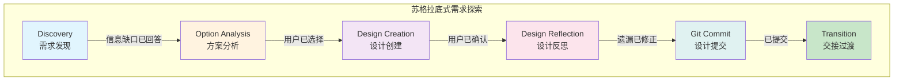

---
metadata:
  name: 6阶段苏格拉底式需求探索工作流
  version: "3.2.0"
  description: 通过6阶段苏格拉底式对话引导从模糊想法到结构化设计文档
  platform: all
  min_agents: 1
  max_agents: 3
phases:
- id: phase-1
  name: Discovery
  order: 0
  optional: false
  trigger_condition: 用户输入探索主题
  agents:
    primary:
    - brainstorming-facilitator
    supporting: []
  inputs:
  - name: 探索主题
    type: document
    required: true
  outputs:
  - name: 信息缺口清单
    type: document
    validation: 高优先级缺口已全部回答
  - name: Discovery问答记录
    type: document
    validation: 所有问题有对应回答
  quality_gates:
  - gate_id: BRAINSTORM-COMPLETE-A
    blocking: true
    pass_criteria: 设计文档已生成+用户确认+6阶段全部完成
  - gate_id: BRAINSTORM-COMPLETE-B
    blocking: true
    pass_criteria: 高优先级信息缺口已全部回答
  timeout_minutes: 30
  retry:
    max_attempts: 2
    backoff: fixed
- id: phase-2
  name: Option Analysis
  order: 1
  optional: false
  trigger_condition: Discovery阶段完成
  agents:
    primary:
    - brainstorming-facilitator
    supporting:
    - product-manager
  inputs:
  - name: 信息缺口清单
    type: document
    required: true
    source_phase: phase-1
  - name: Discovery问答记录
    type: document
    required: true
    source_phase: phase-1
  outputs:
  - name: 方案对比矩阵
    type: document
    validation: 至少2个方案含Trade-off分析
  - name: 用户选择结果
    type: document
    validation: 用户已选择方案
  quality_gates:
  - gate_id: BRAINSTORM-COMPLETE
    blocking: true
    pass_criteria: 至少2个方案+Trade-off对比+用户已选择
  timeout_minutes: 20
  retry:
    max_attempts: 2
    backoff: fixed
- id: phase-3
  name: Design Creation
  order: 2
  optional: false
  trigger_condition: Option Analysis阶段完成
  agents:
    primary:
    - brainstorming-facilitator
    supporting:
    - system-architect
  inputs:
  - name: 用户选择结果
    type: document
    required: true
    source_phase: phase-2
  - name: Discovery问答记录
    type: document
    required: true
    source_phase: phase-1
  outputs:
  - name: 结构化设计文档
    type: document
    validation: 包含8个必要章节+用户已确认
  quality_gates:
  - gate_id: BRAINSTORM-COMPLETE
    blocking: true
    pass_criteria: 设计文档包含目标/范围/架构/数据模型/接口/约束/风险/验证标准
  timeout_minutes: 15
  retry:
    max_attempts: 2
    backoff: fixed
- id: phase-4
  name: Design Reflection
  order: 3
  optional: false
  trigger_condition: Design Creation阶段完成
  agents:
    primary:
    - brainstorming-facilitator
    supporting: []
  inputs:
  - name: 结构化设计文档
    type: document
    required: true
    source_phase: phase-3
  outputs:
  - name: 反思修正记录
    type: document
    validation: 至少3个挑战性问题+遗漏已修正
  - name: 最终设计文档
    type: document
    validation: 用户已确认修正
  quality_gates:
  - gate_id: BRAINSTORM-COMPLETE
    blocking: true
    pass_criteria: 至少3个挑战性问题+遗漏已修正+用户已确认
  timeout_minutes: 15
  retry:
    max_attempts: 2
    backoff: fixed
- id: phase-5
  name: Git Commit
  order: 4
  optional: false
  trigger_condition: Design Reflection阶段完成
  agents:
    primary:
    - brainstorming-facilitator
    supporting: []
  inputs:
  - name: 最终设计文档
    type: document
    required: true
    source_phase: phase-4
  outputs:
  - name: 设计文档文件
    type: document
    validation: 已保存到.agent_cache/<task>/design-document.md
  - name: Git提交记录
    type: document
    validation: 已提交到设计分支
  quality_gates:
  - gate_id: BRAINSTORM-COMPLETE
    blocking: true
    pass_criteria: 设计文档已保存+已提交到设计分支
  timeout_minutes: 5
  retry:
    max_attempts: 2
    backoff: fixed
- id: phase-6
  name: Transition
  order: 5
  optional: false
  trigger_condition: Git Commit阶段完成
  agents:
    primary:
    - brainstorming-facilitator
    supporting: []
  inputs:
  - name: 最终设计文档
    type: document
    required: true
    source_phase: phase-4
  - name: Git提交记录
    type: document
    required: true
    source_phase: phase-5
  outputs:
  - name: 交接摘要
    type: document
    validation: 包含关键决策+架构注意事项+建议下一步
  quality_gates:
  - gate_id: BRAINSTORM-COMPLETE
    blocking: true
    pass_criteria: 交接摘要已生成+包含关键决策和下一步建议
  timeout_minutes: 5
  retry:
    max_attempts: 1
    backoff: fixed
agent_matrix:
  brainstorming-facilitator:
    phases:
    - phase-1
    - phase-2
    - phase-3
    - phase-4
    - phase-5
    - phase-6
    role: primary
    max_parallel_instances: 1
  product-manager:
    phases:
    - phase-2
    role: supporting
    max_parallel_instances: 1
  system-architect:
    phases:
    - phase-3
    role: supporting
    max_parallel_instances: 1
exception_handling:
  phase_failure:
    action: retry_then_escalate
    escalation_target: orchestrator
    max_retries: 2
  agent_unavailable:
    action: substitute_and_continue
    substitute_agent: product-manager
  quality_gate_blocked:
    action: pause_and_notify
    auto_fix_agents:
    - brainstorming-facilitator
---

# 6阶段苏格拉底式需求探索工作流

## 工作流名称：Socratic Brainstorming Workflow（苏格拉底式需求探索工作流）

## 描述
通过6阶段苏格拉底式对话，引导用户从模糊想法逐步探索到结构化设计文档。每个阶段都有明确的目标、输入、输出和质量门禁，确保需求探索过程结构化、可追溯、高质量。

## 触发条件
- 用户执行 `/brainstorm` 命令
- 用户描述模糊需求，需要结构化探索
- 需要从想法到设计文档的完整探索过程
- 用户明确要求"头脑风暴"、"需求探索"、"brainstorm"

## 涉及的Agent

### 核心Agent
| Agent | 角色 | 职责 |
|-------|------|------|
| Brainstorming Facilitator | 主导 | 6阶段苏格拉底式引导、提问、分析 |
| Product Manager | 辅助 | 需求优先级评估、验收标准建议 |
| System Architect | 辅助 | 技术可行性评估、架构约束识别 |

### 增量实施约束

所有Agent在执行复杂任务时必须遵循增量实施规范：
- **工作模式**：分解复杂任务 → 实现单个步骤 → 测试验证 → 重复
- **死循环检测**：若在同一错误上连续3次尝试失败，必须停止执行
- **反模式记录**：将失败模式记录到知识库的anti-patterns目录
- **重启流程**：从头重新开始，而非继续在错误方向上尝试

## 阶段定义

### 阶段1：Discovery（需求发现）
**执行者**: brainstorming-facilitator

**输入**:
- 探索主题

**活动**:
1. 接收探索主题，扫描代码库了解现有架构
2. 识别与主题相关的信息缺口（技术约束、业务规则、用户期望）
3. 按优先级排序信息缺口
4. 每次只问1个问题，等待用户回答后再问下一个
5. 记录所有回答和假设

**输出**:
- 信息缺口清单
- Discovery问答记录

**质量门禁**:
- [ ] 高优先级信息缺口已全部回答 → **BRAINSTORM-COMPLETE**（需求探索完整性门禁）

**时长**: 10-30分钟

---

### 阶段2：Option Analysis（方案分析）
**执行者**: brainstorming-facilitator, product-manager

**输入**:
- 信息缺口清单
- Discovery问答记录

**活动**:
1. 基于Phase 1的回答，生成2-4个可行方案
2. 对每个方案进行Trade-off分析（实现复杂度、性能影响、可维护性、扩展性、风险等级）
3. 呈现对比矩阵，突出关键差异
4. 等待用户选择方案

**输出**:
- 方案对比矩阵
- 用户选择结果

**质量门禁**:
- [ ] 至少2个方案含Trade-off分析 → **option_analysis_complete**
- [ ] 用户已选择方案

**时长**: 5-20分钟

---

### 阶段3：Design Creation（设计创建）
**执行者**: brainstorming-facilitator, system-architect

**输入**:
- 用户选择结果
- Discovery问答记录

**活动**:
1. 基于选定方案，生成结构化设计文档
2. 包含8个必要章节：目标与范围、架构设计、数据模型、接口定义、约束与假设、风险评估、实施路径、验证标准
3. 呈现设计文档给用户确认
4. 记录用户的修改意见

**输出**:
- 结构化设计文档

**质量门禁**:
- [ ] 设计文档包含8个必要章节 → **design_document_created**
- [ ] 用户已确认设计

**时长**: 5-15分钟

---

### 阶段4：Design Reflection（设计反思）
**执行者**: brainstorming-facilitator

**输入**:
- 结构化设计文档

**活动**:
1. 从反面角度审视设计文档
2. 提出至少3个挑战性问题
3. 识别遗漏的场景、边界条件、异常处理
4. 根据发现修正设计文档
5. 用户确认修正

**输出**:
- 反思修正记录
- 最终设计文档

**质量门禁**:
- [ ] 至少3个挑战性问题 → **design_reflected**
- [ ] 遗漏已修正
- [ ] 用户已确认最终设计

**时长**: 5-15分钟

---

### 阶段5：Git Commit（设计提交）
**执行者**: brainstorming-facilitator

**输入**:
- 最终设计文档

**活动**:
1. 将最终设计文档保存到 `.agent_cache/<task>/design-document.md`
2. 创建设计分支 `design/<task-name>`
3. 提交设计文档到该分支

**输出**:
- 设计文档文件
- Git提交记录

**质量门禁**:
- [ ] 设计文档已保存 → **design_committed**
- [ ] 已提交到设计分支

**时长**: 1-5分钟

---

### 阶段6：Transition（交接过渡）
**执行者**: brainstorming-facilitator

**输入**:
- 最终设计文档
- Git提交记录

**活动**:
1. 生成交接摘要
2. 标注关键决策点和约束
3. 传递设计文档路径
4. 建议下一步操作

**输出**:
- 交接摘要

**质量门禁**:
- [ ] 交接摘要已生成 → **transition_complete**
- [ ] 包含关键决策和下一步建议

**时长**: 1-5分钟

## 流程图


## 输出产物清单

| 阶段 | 输出产物 | 格式 | 下游消费者 |
|------|----------|------|-----------|
| Discovery | 信息缺口清单 | Markdown | Phase 2 (Option Analysis) |
| Discovery | 问答记录 | Markdown | Phase 2, Phase 3 |
| Option Analysis | 方案对比矩阵 | Markdown | Phase 3 (Design Creation) |
| Option Analysis | 用户选择结果 | Markdown | Phase 3 |
| Design Creation | 结构化设计文档 | Markdown | Phase 4, System Architect |
| Design Reflection | 反思修正记录 | Markdown | Phase 5 |
| Design Reflection | 最终设计文档 | Markdown | Phase 5, Phase 6 |
| Git Commit | 设计文档文件 | Markdown | Phase 6 |
| Git Commit | Git提交记录 | Git Log | Phase 6 |
| Transition | 交接摘要 | Markdown | /plan 命令 |
| Transition | 设计偏好 | JSON | **Phase 0 (Design System Generator)** |

### Brainstorming 与 Phase 0 协调

Brainstorming Phase 6 (Transition) 输出的 `design-preferences.json` 文件保存到 `.agent_cache/<task>/design-preferences.json`，作为 Phase 0 Design System Generator 的输入之一。Design System Generator 读取该文件获取用户在需求探索阶段表达的UI/UX偏好（风格倾向、配色偏好、字体情绪、行业类型），在5域并行搜索的推理引擎 Step 4（决策规则处理）中作为用户偏好加权因子，确保设计系统与用户期望一致。

## 适用场景

### ✅ 推荐使用
- 从模糊想法开始的需求探索
- 需要结构化设计文档的场景
- 复杂需求的深度分析
- 技术方案选型决策
- 新功能的设计阶段

### ❌ 不推荐使用
- 需求已经非常明确
- 简单的Bug修复
- 配置变更
- 已有详细规格的实现

## 执行建议

1. **提问节奏**：每次1个问题，给用户充分思考时间
2. **方案数量**：2-4个为宜，过多增加选择困难
3. **反思深度**：至少3个挑战性问题，确保设计质量
4. **文档规范**：严格遵循8章节结构
5. **交接清晰**：确保下一步操作明确

### 人机协作断点

- **方案选择**：用户必须亲自选择方案，Agent不可代选
- **设计确认**：设计文档必须用户确认后才可提交
- **反思修正**：修正方案需用户确认
- **连续失败**：同一问题3次未获得有效回答时，暂停并请求用户重新描述需求

决策报告格式：

```markdown
## 决策报告 #[ID]
- **触发条件**: [方案选择/设计确认/连续失败]
- **当前状态**: [简要描述]
- **待决策项**: [需要用户确认的具体问题]
- **建议**: [Agent的建议及理由]
```
