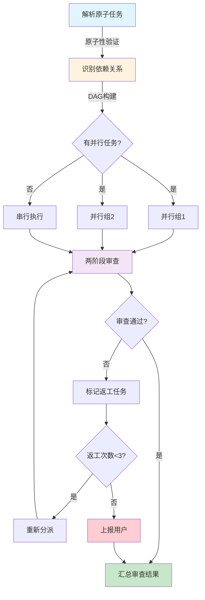

---
metadata:
  name: 子代理调度+两阶段审查工作流
  version: "3.2.0"
  description: 原子任务解析、并行/串行调度、独立子代理创建、两阶段审查、返工管理
  platform: all
  min_agents: 2
  max_agents: 10
phases:
- id: phase-1
  name: 解析原子任务
  order: 0
  optional: false
  trigger_condition: 计划文件已就绪
  agents:
    primary:
    - subagent-dispatcher
    supporting: []
  inputs:
  - name: 计划文件
    type: document
    required: true
  outputs:
  - name: 原子任务列表
    type: document
    validation: 每个任务≤5分钟+含文件路径+含验证步骤
  quality_gates:
  - gate_id: PLAN-ATOMIC
    blocking: true
    pass_criteria: 每个任务≤5分钟+含文件路径+含验证步骤
  timeout_minutes: 10
  retry:
    max_attempts: 2
    backoff: fixed
- id: phase-2
  name: 识别依赖关系
  order: 1
  optional: false
  trigger_condition: 原子任务列表已生成
  agents:
    primary:
    - subagent-dispatcher
    supporting: []
  inputs:
  - name: 原子任务列表
    type: document
    required: true
    source_phase: phase-1
  outputs:
  - name: 任务依赖DAG
    type: document
    validation: 无循环依赖+并行/串行分组完成
  - name: 关键路径
    type: document
    validation: 关键路径已识别
  quality_gates:
  - gate_id: PLAN-ATOMIC
    blocking: true
    pass_criteria: 依赖图无循环依赖
  timeout_minutes: 5
  retry:
    max_attempts: 2
    backoff: fixed
- id: phase-3
  name: 创建子代理
  order: 2
  optional: false
  trigger_condition: 依赖关系已识别
  agents:
    primary:
    - subagent-dispatcher
    supporting:
    - orchestrator
  inputs:
  - name: 原子任务列表
    type: document
    required: true
    source_phase: phase-1
  - name: 任务依赖DAG
    type: document
    required: true
    source_phase: phase-2
  outputs:
  - name: 子代理调度计划
    type: document
    validation: 每个任务已匹配Agent+上下文已注入
  - name: 执行结果
    type: code
    validation: 子代理已完成任务
  quality_gates:
  - gate_id: SUBAGENT-REVIEW
    blocking: true
    pass_criteria: 所有子代理已创建并开始执行
  timeout_minutes: 60
  retry:
    max_attempts: 3
    backoff: exponential
- id: phase-4
  name: 两阶段审查
  order: 3
  optional: false
  trigger_condition: 子代理任务执行完成
  agents:
    primary:
    - subagent-dispatcher
    supporting:
    - code-reviewer
  inputs:
  - name: 执行结果
    type: code
    required: true
    source_phase: phase-3
  - name: 计划文件
    type: document
    required: true
  outputs:
  - name: Stage 1审查报告
    type: document
    validation: 计划合规率100%
  - name: Stage 2审查报告
    type: document
    validation: 代码质量评分≥80
  quality_gates:
  - gate_id: SUBAGENT-REVIEW
    blocking: true
    pass_criteria: 两阶段审查通过+无返工任务
  timeout_minutes: 30
  retry:
    max_attempts: 2
    backoff: fixed
- id: phase-5
  name: 汇总审查结果
  order: 4
  optional: false
  trigger_condition: 两阶段审查完成
  agents:
    primary:
    - subagent-dispatcher
    supporting: []
  inputs:
  - name: Stage 1审查报告
    type: document
    required: true
    source_phase: phase-4
  - name: Stage 2审查报告
    type: document
    required: true
    source_phase: phase-4
  outputs:
  - name: 审查汇总报告
    type: document
    validation: 包含通过/返工/阻塞统计
  - name: 返工任务清单
    type: document
    validation: 返工任务已标记原因和次数
  quality_gates:
  - gate_id: GATE-009
    blocking: true
    pass_criteria: 汇总报告已生成+返工任务已标记
  timeout_minutes: 10
  retry:
    max_attempts: 1
    backoff: fixed
- id: phase-6
  name: 返工重新分派
  order: 5
  optional: true
  trigger_condition: 存在需返工的任务
  agents:
    primary:
    - subagent-dispatcher
    supporting: []
  inputs:
  - name: 返工任务清单
    type: document
    required: true
    source_phase: phase-5
  outputs:
  - name: 返工执行结果
    type: code
    validation: 返工任务已重新执行
  - name: 返工审查报告
    type: document
    validation: 返工后审查通过或达到上限
  quality_gates:
  - gate_id: TEST-PASS
    blocking: true
    pass_criteria: 所有返工任务通过审查或已上报
  timeout_minutes: 30
  retry:
    max_attempts: 3
    backoff: exponential
agent_matrix:
  subagent-dispatcher:
    phases:
    - phase-1
    - phase-2
    - phase-3
    - phase-4
    - phase-5
    - phase-6
    role: primary
    max_parallel_instances: 1
  orchestrator:
    phases:
    - phase-3
    role: supporting
    max_parallel_instances: 1
  code-reviewer:
    phases:
    - phase-4
    role: supporting
    max_parallel_instances: 2
exception_handling:
  phase_failure:
    action: retry_then_escalate
    escalation_target: orchestrator
    max_retries: 3
  agent_unavailable:
    action: substitute_and_continue
    substitute_agent: fullstack-engineer
  quality_gate_blocked:
    action: auto_fix_then_pause
    auto_fix_agents:
    - subagent-dispatcher
---

# 子代理调度+两阶段审查工作流

## 工作流名称：Subagent-Driven Workflow（子代理调度+两阶段审查工作流）

## 描述
基于计划文件的子代理调度工作流，将原子任务分派给独立子代理执行，通过两阶段审查（计划合规性+代码质量）确保交付质量，并管理返工循环直至所有任务达标。

## 触发条件
- 用户执行 `/execute-plan` 命令
- 计划文件已就绪，需要调度子代理执行
- 需要并行执行多个独立任务
- 需要严格的质量审查流程

## 涉及的Agent

### 核心Agent
| Agent | 角色 | 职责 |
|-------|------|------|
| Subagent Dispatcher | 主导 | 任务解析、调度、审查、返工管理 |
| Orchestrator | 辅助 | 全局编排、冲突仲裁 |
| Code Reviewer | 审查 | Stage 2代码质量审查 |

### 动态子代理
| Agent类型 | 触发条件 | 职责 |
|-----------|----------|------|
| Fullstack Engineer | 通用开发任务 | 子代理任务执行 |
| Backend Developer | 后端任务 | 后端子代理执行 |
| Frontend Developer | 前端任务 | 前端子代理执行 |
| Unit Tester | 测试任务 | 测试子代理执行 |

### 增量实施约束

所有Agent在执行复杂任务时必须遵循增量实施规范：
- **工作模式**：分解复杂任务 → 实现单个步骤 → 测试验证 → 重复
- **死循环检测**：若在同一错误上连续3次尝试失败，必须停止执行
- **反模式记录**：将失败模式记录到知识库的anti-patterns目录
- **重启流程**：从头重新开始，而非继续在错误方向上尝试

## 阶段定义

### 阶段1：解析原子任务 **执行者**: subagent-dispatcher

**输入**:
- 计划文件（implementation-plan.md 或 task-graph.json）

**活动**:
1. 读取计划文件，提取任务列表
2. 验证每个任务的原子性（≤5分钟可完成、含文件路径、含验证步骤）
3. 对非原子任务进行二次拆分
4. 生成标准化原子任务列表

**输出**:
- 原子任务列表

**质量门禁**:
- [ ] 每个任务≤5分钟 → **PLAN-ATOMIC**（原子性门禁）
- [ ] 每个任务含文件路径
- [ ] 每个任务含验证步骤

**时长**: 5-10分钟

---

### 阶段2：识别依赖关系 **执行者**: subagent-dispatcher

**输入**:
- 原子任务列表

**活动**:
1. 构建任务依赖图（DAG）
2. 检测循环依赖（存在则报错）
3. 识别可并行任务组（无相互依赖的任务）
4. 识别串行任务链（有依赖关系的任务序列）
5. 计算关键路径

**输出**:
- 任务依赖DAG
- 关键路径

**质量门禁**:
- [ ] 依赖图无循环依赖 → **dag_no_cycle**
- [ ] 并行/串行分组完成
- [ ] 关键路径已识别

**时长**: 3-5分钟

---

### 阶段3：创建子代理
**执行者**: subagent-dispatcher, orchestrator

**输入**:
- 原子任务列表
- 任务依赖DAG

**活动**:
1. 根据任务类型匹配Agent能力
2. 为每个任务创建独立子代理实例
3. 注入干净上下文（仅包含任务描述+相关代码片段+验证标准）
4. 按并行/串行策略调度执行
5. 监控子代理执行状态

**输出**:
- 子代理调度计划
- 执行结果

**质量门禁**:
- [ ] 所有子代理已创建并开始执行 → **agents_dispatched**
- [ ] 每个子代理上下文干净
- [ ] 并行/串行策略正确执行

**时长**: 根据任务复杂度，最长60分钟

---

### 阶段4：两阶段审查
**执行者**: subagent-dispatcher, code-reviewer

**输入**:
- 执行结果
- 计划文件

**活动**:

**Stage 1: 计划合规性审查**
1. 检查所有规格要求是否已实现
2. 检查接口契约是否严格遵循
3. 检查数据模型是否与设计一致
4. 检查验收标准是否全部满足
5. 检查无超出范围的修改

**Stage 2: 代码质量审查**
1. 检查圈复杂度≤10（单函数）
2. 检查无硬编码密钥/配置
3. 检查测试覆盖率≥80%
4. 检查代码规范
5. 检查安全漏洞

**输出**:
- Stage 1审查报告
- Stage 2审查报告

**质量门禁**:
- [ ] 两阶段审查通过 → **SUBAGENT-REVIEW**（子代理审查门禁）
- [ ] 计划合规率100%
- [ ] 代码质量评分≥80

**时长**: 10-30分钟

---

### 阶段5：汇总审查结果 **执行者**: subagent-dispatcher

**输入**:
- Stage 1审查报告
- Stage 2审查报告

**活动**:
1. 收集所有子代理的审查结果
2. 生成汇总报告
3. 标记需返工的任务
4. 统计整体质量指标

**输出**:
- 审查汇总报告
- 返工任务清单

**质量门禁**:
- [ ] 汇总报告已生成 → **review_summary_complete**
- [ ] 返工任务已标记原因和次数

**时长**: 5-10分钟

---

### 阶段6：返工重新分派 **执行者**: subagent-dispatcher

**输入**:
- 返工任务清单

**活动**:
1. 为每个返工任务生成针对性修正指令
2. 重新创建子代理（干净上下文 + 修正指令）
3. 执行返工任务
4. 重新执行两阶段审查
5. 返工次数超过3次的任务上报用户

**输出**:
- 返工执行结果
- 返工审查报告

**质量门禁**:
- [ ] 所有返工任务通过审查或已上报 → **rework_complete**
- [ ] 无超过3次返工的任务（除非已上报）

**时长**: 根据返工量，最长30分钟

## 流程图



## 输出产物清单

| 阶段 | 输出产物 | 格式 |
|------|----------|------|
| 解析原子任务 | 原子任务列表 | Markdown/JSON |
| 识别依赖关系 | 任务依赖DAG | Mermaid/JSON |
| 识别依赖关系 | 关键路径 | Markdown |
| 创建子代理 | 子代理调度计划 | Markdown |
| 创建子代理 | 执行结果 | 源代码 |
| 两阶段审查 | Stage 1审查报告 | Markdown |
| 两阶段审查 | Stage 2审查报告 | Markdown |
| 汇总审查结果 | 审查汇总报告 | Markdown |
| 汇总审查结果 | 返工任务清单 | Markdown |
| 返工重新分派 | 返工执行结果 | 源代码 |
| 返工重新分派 | 返工审查报告 | Markdown |

## 适用场景

### ✅ 推荐使用
- 多任务并行实施
- 需要严格质量审查的项目
- 大型功能的分阶段实施
- 团队协作开发
- 需要可追溯交付质量的场景

### ❌ 不推荐使用
- 单一简单任务
- 快速原型验证
- 紧急Bug修复
- 配置变更

## 执行建议

1. **原子性优先**：确保每个任务足够小，≤5分钟可完成
2. **并行最大化**：充分利用并行能力，但不超过并行上限
3. **审查严格性**：两阶段审查不可跳过
4. **返工效率**：返工指令必须精准，避免反复修改
5. **上报及时**：3次返工失败必须上报，不可无限重试

### 人机协作断点

- **返工3次失败**：同一任务3次返工仍未通过，自动暂停并上报用户决策
- **循环依赖检测**：任务依赖图存在循环时，暂停并请求用户调整计划
- **Agent不可用**：关键Agent不可用且无替代时，暂停并请求用户决策

决策报告格式：
```markdown
## 决策报告 #[ID]
- **触发条件**: [返工3次/循环依赖/Agent不可用]
- **当前状态**: [简要描述]
- **已尝试方案**: [列出已尝试的修复方案]
- **建议决策**: [Subagent Dispatcher的建议]
- **等待人类输入**: [需要确认的具体问题]
```
