# Xuansto Skill API 规格说明书

> **版本**: 8.0.0
> **Skill目录**: `.trae/skills/xuansto-skill-v2/`
> **MCP Server**: `xuansto-mcp-server/`
> **日期**: 2026-05-25

---

## 目录

1. [现有API调用清单](#1-现有api调用清单)
2. [接口依赖拓扑图](#2-接口依赖拓扑图)
3. [重构后API设计](#3-重构后api设计)
4. [接口契约](#4-接口契约)
5. [异常处理、重试与降级方案](#5-异常处理重试与降级方案)

---

## 1. 现有API调用清单

### 1.1 内部API（模块间调用）

#### 1.1.1 KnowledgeServer → SQLite（db_engine.py）

| 方法 | 签名 | 说明 |
|------|------|------|
| `add_entry` | `add_entry(entry_data: dict) -> dict` | 新增知识条目，返回含`id`的条目字典 |
| `get_entry` | `get_entry(entry_id: str) -> dict \| None` | 按ID获取条目，不存在返回`None` |
| `update_entry` | `update_entry(entry_id: str, updates: dict) -> dict \| None` | 更新条目字段，版本冲突返回`{error: "version_conflict"}` |
| `delete_entry` | `delete_entry(entry_id: str) -> bool` | 删除条目，返回是否成功 |
| `count_entries` | `count_entries() -> dict` | 统计条目数量，含`total`及按`scope`分组 |
| `get_all_entries` | `get_all_entries() -> list[dict]` | 获取全部条目列表 |
| `count_by_embedding_status` | `count_by_embedding_status() -> dict` | 按`embedding_status`统计（`pending`/`ready`） |
| `update_embedding_status` | `update_embedding_status(entry_id: str, status: str) -> None` | 更新条目的嵌入状态 |
| `restore_version` | `restore_version(entry_id: str, target_version: int) -> dict \| None` | 恢复到指定版本 |
| `get_version_history` | `get_version_history(entry_id: str) -> list[dict]` | 获取条目版本历史 |

#### 1.1.2 KnowledgeServer → ChromaDB（vector_engine.py）

| 方法 | 签名 | 说明 |
|------|------|------|
| `add_embedding` | `add_embedding(entry_id: str, content: str, metadata: dict) -> None` | 添加向量嵌入 |
| `search` | `search(query: str, top_k: int, filters: dict) -> list[dict]` | 语义搜索，返回相似条目列表 |
| `get_vector_count` | `get_vector_count() -> int` | 获取向量总数 |
| `get_all_ids` | `get_all_ids() -> set[str]` | 获取全部向量ID集合 |
| `delete_embedding` | `delete_embedding(entry_id: str) -> None` | 删除指定条目的向量 |

#### 1.1.3 KnowledgeServer → DedupChecker（dedup.py）

| 方法 | 签名 | 说明 |
|------|------|------|
| `check_duplicate` | `check_duplicate(entry_data: dict) -> dict` | 检查重复，返回`{action: "merge"|"skip"|"keep_both", similarity_score, existing_id}` |
| `merge_entries` | `merge_entries(existing: dict, new: dict) -> dict` | 合并重复条目，返回合并后数据 |

#### 1.1.4 KnowledgeServer → DegradationManager（degradation.py）

| 方法 | 签名 | 说明 |
|------|------|------|
| `get_search_strategy` | `get_search_strategy() -> str` | 获取当前搜索策略：`hybrid`/`semantic_only`/`keyword_only` |
| `level` | 属性 | 当前降级等级（0-2） |
| `level_name` | 属性 | 当前降级等级名称 |

#### 1.1.5 KnowledgeServer → ProgressiveLoader（progressive_loader.py）

| 方法 | 签名 | 说明 |
|------|------|------|
| `advance_phase` | `advance_phase(target_phase: int) -> dict` | 推进到指定加载阶段 |
| `get_available_resources` | `get_available_resources(phase: int) -> list[dict]` | 获取指定阶段可用资源 |
| `get_disclosure_note` | `get_disclosure_note(phase: int) -> str` | 获取阶段披露说明 |

#### 1.1.6 KnowledgeServer → EmbeddingManager（embedding.py）

| 方法 | 签名 | 说明 |
|------|------|------|
| `generate_embedding` | `generate_embedding(content: str) -> list[float]` | 生成文本嵌入向量 |
| `degraded` | 属性 | 嵌入服务是否降级 |
| `level` | 属性 | 嵌入降级等级 |
| `level_name` | 属性 | 嵌入降级等级名称 |
| `dimension` | 属性 | 当前嵌入维度 |

#### 1.1.7 KnowledgeServer → Exporter（exporter.py）

| 方法 | 签名 | 说明 |
|------|------|------|
| `export_entry` | `export_entry(entry_id: str) -> None` | 导出条目到文件 |

#### 1.1.8 MCPToolFallback → scripts/（degradation.py）

通过 `subprocess.run` 调用以下14个降级脚本：

| 脚本文件 | 对应MCP工具 | 说明 |
|----------|------------|------|
| `skill-test.py` | `skill_analyze`, `agent_status`, `quality_gate_check` | 技能分析/Agent状态/门禁检查 |
| `knowledge-server.py` | `knowledge_search`, `knowledge_inject` | 知识检索/注入 |
| `spec-drift-detector.py` | `spec_drift_detect` | 规格漂移检测 |
| `agentic-security-scanner.py` | `security_scan` | 安全扫描 |
| `code-simplifier.py` | `code_simplify` | 代码简化 |
| `init-session.py` | `session_manage`（save/init） | 会话初始化 |
| `session-catchup.py` | `session_manage`（load/detect/restore） | 会话恢复 |
| `session-persist.py` | `session_manage`（save/load/list） | 会话持久化 |
| `project-initializer.py` | `workflow_dispatch`, `project_init` | 项目初始化 |
| `context-compressor.py` | `context_compress` | 上下文压缩 |
| `health-checker.py` | `server_health` | 健康检查 |
| `decision-log.py` | `decision_log` | 决策日志 |
| `token-budget-guard.py` | `token_budget`, `hook_manage` | Token预算/编码检查 |
| `test-reporter.py` | `metrics_report` | 指标报告 |

### 1.2 外部API

#### 1.2.1 MCP协议（stdio传输）

基于 MCP (Model Context Protocol) 标准，通过 stdio 传输层提供：

| 操作 | 说明 |
|------|------|
| `list_tools` | 列出所有已注册的MCP工具（20个） |
| `call_tool` | 调用指定MCP工具，传入参数，返回结果 |

MCP Server 名称：`xuansto-mcp-server`，版本 `8.0.0`

#### 1.2.2 HTTP API（FastAPI/uvicorn）

知识库 HTTP REST API，基础路径 `/v1/knowledge/`：

| 端点 | 方法 | 说明 |
|------|------|------|
| `/v1/knowledge/health` | GET | 健康检查，返回引擎状态、降级等级、嵌入状态 |
| `/v1/health/consistency` | GET | 数据一致性检查（SQLite vs ChromaDB） |
| `/v1/knowledge/search` | POST | 知识检索（支持hybrid/semantic_only/keyword_only策略） |
| `/v1/knowledge/stats` | POST | 统计信息（条目数、嵌入状态、降级等级） |
| `/v1/knowledge/add` | POST | 新增知识条目（含去重检查和敏感内容过滤） |
| `/v1/knowledge/get/{entry_id}` | GET | 获取指定条目 |
| `/v1/knowledge/{entry_id}` | GET | 获取指定条目（兼容旧版） |
| `/v1/knowledge/update/{entry_id}` | PUT | 更新条目（含乐观锁版本冲突重试） |
| `/v1/knowledge/{entry_id}` | PUT | 更新条目（兼容旧版） |
| `/v1/knowledge/delete/{entry_id}` | DELETE | 删除条目 |
| `/v1/knowledge/{entry_id}` | DELETE | 删除条目（兼容旧版） |
| `/v1/knowledge/rollback` | POST | 版本回滚 |
| `/v1/knowledge/{entry_id}/versions` | GET | 获取版本历史 |
| `/v1/knowledge/progressive_search` | POST | 渐进式检索（按任务类型和Token预算） |
| `/v1/knowledge/deep_load` | POST | 深度加载指定条目完整内容 |
| `/v1/knowledge/web_update` | POST | 从网络更新/创建知识条目 |
| `/v1/knowledge/auto_retrieve` | POST | 自动检索（按任务类型和项目路径） |
| `/v1/knowledge/backup` | POST | 创建备份（full/incremental/snapshot） |
| `/ws` | WebSocket | 实时变更通知（created/updated/deleted/rolled_back/web_updated/web_created） |

#### 1.2.3 Web搜索（web_search.py）

| 方法 | 签名 | 说明 |
|------|------|------|
| `search_official_docs` | `search_official_docs(query: str, tech_stack: list = None) -> list[dict]` | 搜索官方文档，返回结果列表 |
| `extract_and_structure` | `extract_and_structure(results: list, existing_entry: dict = None) -> dict` | 从搜索结果提取结构化内容 |
| `detect_stale_entries` | `detect_stale_entries(entries: list) -> list[dict]` | 检测过时条目 |
| `detect_new_tech_dependencies` | `detect_new_tech_dependencies(tech_stack: list) -> list[dict]` | 检测新技术依赖 |
| `auto_ingest_tech_knowledge` | `auto_ingest_tech_knowledge(tech_stack: list) -> dict` | 自动摄入技术知识 |

---

## 2. 接口依赖拓扑图

```mermaid
graph TB
    subgraph "Skill层（.trae/skills/xuansto-skill-v2/）"
        SKILL[Skill命令路由]
        SKILL --> |命令分发| CMD[commands/*.md]
    end

    subgraph "MCP Server层（xuansto-mcp-server/）"
        MCP[MCP FastMCP Server<br/>stdio传输]
        MCP --> |工具注册| TOOLS[20个MCP工具]

        subgraph "MCP工具"
            TOOLS --> SA[skill_analyze]
            TOOLS --> KS[knowledge_search]
            TOOLS --> KI[knowledge_inject]
            TOOLS --> QG[quality_gate_check]
            TOOLS --> SD[spec_drift_detect]
            TOOLS --> SS[security_scan]
            TOOLS --> CS[code_simplify]
            TOOLS --> SM[session_manage]
            TOOLS --> WD[workflow_dispatch]
            TOOLS --> AS[agent_status]
            TOOLS --> AM[agent_manage]
            TOOLS --> HM[hook_manage]
            TOOLS --> RLS[resource_load_status]
            TOOLS --> CC[context_compress]
            TOOLS --> SH[server_health]
            TOOLS --> DL[decision_log]
            TOOLS --> TB[token_budget]
            TOOLS --> PI[project_init]
            TOOLS --> MR[metrics_report]
            TOOLS --> CM[config_manage]
        end

        subgraph "核心模块"
            TOOLS --> ERR[errors.py<br/>错误处理]
            TOOLS --> DEG[degradation.py<br/>降级管理]
            TOOLS --> HOOK[hook_engine.py<br/>Hook引擎]
            TOOLS --> RATE[rate_limiter.py<br/>限流器]
            TOOLS --> PROTO[protocol.py<br/>调用协议]
            TOOLS --> CACHE[cache.py<br/>LRU缓存]
            TOOLS --> DB[database.py<br/>SQLite]
            TOOLS --> SEARCH[search_engine.py<br/>搜索引擎]
            TOOLS --> VALID[validator.py<br/>输入校验]
        end

        DEG --> |脚本降级| SCRIPTS[scripts/*.py<br/>14个降级脚本]
        DEG --> |内联降级| INLINE[_inline_*函数<br/>20个内联降级]
    end

    subgraph "知识库层（knowledge_server/）"
        KB[KnowledgeServer]
        KB --> SQLITE[db_engine.py<br/>SQLite]
        KB --> CHROMA[vector_engine.py<br/>ChromaDB]
        KB --> DEDUP[dedup.py<br/>去重检查]
        KB --> KBDEG[degradation.py<br/>降级管理]
        KB --> PROG[progressive_loader.py<br/>渐进加载]
        KB --> EMBED[embedding.py<br/>嵌入生成]
        KB --> EXPORT[exporter.py<br/>导出器]
        KB --> WEB[web_search.py<br/>网络搜索]
        KB --> HYBRID[hybrid_search.py<br/>混合搜索]
    end

    subgraph "外部接口"
        HTTP[HTTP API<br/>FastAPI/uvicorn]
        MCPSTDIO[MCP stdio<br/>协议传输]
        WS[WebSocket<br/>实时通知]
    end

    SKILL --> |MCP调用| MCP
    KB --> |注册路由| HTTP
    KB --> |MCP工具| MCPSTDIO
    KB --> |变更广播| WS
    CHROMA --> |向量存储| VECSTORE[(ChromaDB<br/>向量数据库)]
    SQLITE --> |关系存储| SQLITEDB[(SQLite<br/>知识库)]
    WEB --> |HTTP请求| INTERNET((互联网))

    style MCP fill:#4a90d9,color:#fff
    style KB fill:#e67e22,color:#fff
    style HTTP fill:#27ae60,color:#fff
    style MCPSTDIO fill:#27ae60,color:#fff
    style DEG fill:#e74c3c,color:#fff
```



### 调用链路说明

1. **Skill → MCP Server**：Skill命令通过MCP协议（stdio）调用MCP工具
2. **MCP工具 → 核心模块**：工具函数调用核心模块（数据库、搜索引擎、缓存等）
3. **MCP工具 → 降级链**：工具失败时，依次尝试脚本降级 → 内联降级 → 最小响应
4. **知识库 → 存储层**：KnowledgeServer同时操作SQLite和ChromaDB
5. **知识库 → 外部**：通过HTTP API和MCP stdio对外暴露，WebSocket推送变更通知

---

## 3. 重构后API设计

### 3.1 Skill ↔ MCP Server Tool 调用协议

#### 3.1.1 命令→工具映射

Skill命令通过MCP `call_tool` 调用对应的MCP工具：

| Skill命令 | MCP工具 | 参数映射 |
|-----------|---------|---------|
| `/init` | `project_init` | `action="init"`, `name`, `stack`, `directory` |
| `/plan` | `workflow_dispatch` | `action="start"`, `workflow="sdd-tdd-full"` |
| `/implement` | `workflow_dispatch` | `action="phase"`, `phase_action="advance"` |
| `/test` | `quality_gate_check` | `gate_ids=["test_coverage", "test_quality"]` |
| `/review` | `skill_analyze` | `depth="detailed"` |
| `/fix` | `security_scan` + `code_simplify` | `severity_threshold="medium"`, `scope="recent"` |
| `/status` | `server_health` | `action="check"` |
| `/agent-status` | `agent_status` | `action="list"` |
| `/audit` | `security_scan` | `severity_threshold="low"`, `include_agentic=True` |
| `/simplify` | `code_simplify` | `scope="dir"` |
| `/learn` | `knowledge_search` | `action="retrieve"`, `query` |
| `/brainstorm` | `decision_log` | `action="log"` |
| `/execute-plan` | `workflow_dispatch` | `action="status"` |
| `/rollback` | `session_manage` | `action="restore"` |
| `/deploy` | `quality_gate_check` | `gate_ids=["deploy_readiness"]` |

#### 3.1.2 参数传递协议

```json
{
  "tool_name": "knowledge_search",
  "arguments": {
    "action": "retrieve",
    "query": "React hooks best practices",
    "top_k": 5,
    "search_type": "hybrid",
    "scope": "workspace"
  }
}
```

参数传递规则：
- 所有参数通过 `arguments` 对象传递，键名与工具的 `inputSchema` 字段一致
- 必填参数缺失时返回 `ERR_VALIDATION` 错误
- 枚举参数值不匹配时返回校验错误
- 额外参数（`extra="forbid"`）将被拒绝

#### 3.1.3 结果处理协议

```json
{
  "error": false,
  "api_version": "3.0.0",
  "data": {
    "results": [...],
    "total": 5,
    "strategy": "hybrid"
  }
}
```

错误响应：
```json
{
  "error": true,
  "error_code": "ERR_VALIDATION",
  "message": "参数校验失败",
  "details": {...},
  "retryable": false
}
```

### 3.2 MCP Server 对外接口

#### 3.2.1 双传输架构

```
                    ┌─────────────────────┐
                    │   MCP Server v8.0   │
                    │  (FastMCP Instance)  │
                    └──────┬──────────────┘
                           │
              ┌────────────┼────────────┐
              │            │            │
    ┌─────────▼──┐  ┌──────▼─────┐  ┌──▼──────────┐
    │ stdio传输   │  │ HTTP API   │  │ WebSocket   │
    │ (MCP协议)  │  │ (FastAPI)  │  │ (实时通知)  │
    └────────────┘  └────────────┘  └─────────────┘
```

- **MCP stdio**：主传输通道，用于Skill ↔ MCP Server通信，支持 `list_tools`、`call_tool`
- **HTTP API**：辅助传输，用于外部系统集成和调试，端口默认 `8765`
- **WebSocket**：实时变更通知推送（`/ws`）

#### 3.2.2 MCP工具清单（20个）

| 工具名 | 分类 | 只读 | 说明 |
|--------|------|------|------|
| `skill_analyze` | 分析 | ✅ | 技能结构分析 |
| `knowledge_search` | 知识 | ✅ | 知识检索 |
| `knowledge_inject` | 知识 | ❌ | 知识注入/沉淀 |
| `quality_gate_check` | 质量 | ✅ | 门禁检查 |
| `spec_drift_detect` | 质量 | ✅ | 规格漂移检测 |
| `security_scan` | 安全 | ✅ | 安全扫描 |
| `code_simplify` | 代码 | ✅ | 代码简化建议 |
| `session_manage` | 会话 | ❌ | 会话管理 |
| `workflow_dispatch` | 工作流 | ❌ | 工作流调度 |
| `agent_status` | Agent | ✅ | Agent状态查询 |
| `agent_manage` | Agent | ❌ | Agent实例管理 |
| `hook_manage` | 系统 | ❌ | Hook管理 |
| `resource_load_status` | 资源 | ✅ | 渐进式加载状态 |
| `context_compress` | 上下文 | ✅ | 上下文压缩 |
| `server_health` | 系统 | ✅ | 服务器健康检查 |
| `decision_log` | 决策 | ❌ | 决策日志 |
| `token_budget` | 预算 | ✅ | Token预算管理 |
| `project_init` | 项目 | ❌ | 项目初始化 |
| `metrics_report` | 监控 | ✅ | 指标报告 |
| `config_manage` | 配置 | ❌ | 配置管理 |

### 3.3 渐进式加载相关接口

`resource_load_status` 工具提供7种操作，控制渐进式加载生命周期：

#### 3.3.1 操作清单

| action | 说明 | 关键参数 |
|--------|------|---------|
| `status` | 查询资源加载状态 | `phase`, `resource_ids` |
| `preload` | 预加载指定阶段资源 | `phase`, `resource_uris`, `priority`, `batch_mode`, `auto_upgrade` |
| `cache` | 查看缓存状态 | 无 |
| `clear_cache` | 清除缓存 | 无 |
| `loading_progress` | 查询加载进度 | 无 |
| `token_report` | Token使用报告 | 无 |
| `disclosure_transition` | 阶段转换评估 | `target_phase` |

#### 3.3.2 阶段体系

| 阶段 | 名称 | Token预算 | 可用功能 |
|------|------|-----------|---------|
| Phase 0 | skeleton | 2000 | 命令路由 |
| Phase 1 | functional | 5000 | 命令执行、门禁检查、核心Agent |
| Phase 2 | enhanced | 10000 | 知识检索、参考文档、Agent注册表 |
| Phase 3 | full | 20000 | 全部功能、完整脚本集、模板库 |

#### 3.3.3 资源状态

| 状态 | 说明 |
|------|------|
| `loaded` | 已加载到缓存 |
| `available` | 文件存在但未加载 |
| `missing` | 文件不存在 |
| `stale` | 缓存内容与源文件不一致 |
| `expired` | 缓存已过期（TTL超时） |

---

## 4. 接口契约

### 4.1 请求Schema（inputSchema）

所有MCP工具的 `inputSchema` 遵循 JSON Schema draft 2020-12 规范。

#### 4.1.1 skill_analyze

```json
{
  "$schema": "https://json-schema.org/draft/2020-12/schema",
  "type": "object",
  "properties": {
    "skill_path": {
      "type": "string",
      "description": "技能根目录路径"
    },
    "include_scripts": {
      "type": "boolean",
      "default": true,
      "description": "是否分析scripts目录"
    },
    "include_agents": {
      "type": "boolean",
      "default": true,
      "description": "是否分析agents目录"
    },
    "depth": {
      "type": "string",
      "default": "basic",
      "description": "分析深度: 1/basic=基础, 2/detailed=详细, 3/full/comprehensive=全面"
    }
  },
  "required": ["skill_path"],
  "additionalProperties": false
}
```

#### 4.1.2 knowledge_search

```json
{
  "$schema": "https://json-schema.org/draft/2020-12/schema",
  "type": "object",
  "properties": {
    "action": {
      "type": "string",
      "const": "retrieve",
      "description": "操作类型: retrieve"
    },
    "query": {
      "type": ["string", "null"],
      "default": null,
      "description": "搜索查询文本"
    },
    "top_k": {
      "type": "integer",
      "default": 5,
      "minimum": 1,
      "maximum": 50,
      "description": "返回结果数量上限"
    },
    "search_type": {
      "type": "string",
      "enum": ["hybrid", "semantic_only", "keyword_only"],
      "default": "hybrid",
      "description": "搜索策略"
    },
    "scope": {
      "type": ["string", "null"],
      "enum": ["general", "workspace", "experience", null],
      "default": null,
      "description": "限定搜索范围"
    },
    "min_confidence": {
      "type": "number",
      "default": 0.0,
      "minimum": 0.0,
      "maximum": 1.0,
      "description": "最低置信度阈值"
    }
  },
  "required": ["action"],
  "additionalProperties": false
}
```

#### 4.1.3 knowledge_inject

```json
{
  "$schema": "https://json-schema.org/draft/2020-12/schema",
  "type": "object",
  "properties": {
    "action": {
      "type": "string",
      "enum": ["inject", "list_available", "precipitate", "add", "update"],
      "description": "操作类型"
    },
    "topics": {
      "type": ["array", "null"],
      "items": {"type": "string"},
      "default": null,
      "description": "知识主题列表(inject时使用)"
    },
    "scope": {
      "type": "string",
      "enum": ["general", "workspace", "experience"],
      "default": "general",
      "description": "知识范围"
    },
    "max_tokens": {
      "type": "integer",
      "default": 5000,
      "minimum": 100,
      "maximum": 50000,
      "description": "最大注入Token数量"
    },
    "relevance_threshold": {
      "type": "number",
      "default": 0.5,
      "minimum": 0.0,
      "maximum": 1.0,
      "description": "相关性阈值"
    },
    "category": {
      "type": ["string", "null"],
      "default": null,
      "description": "经验分类(precipitate时使用)"
    },
    "title": {
      "type": ["string", "null"],
      "default": null,
      "description": "经验标题(precipitate/add/update时使用)"
    },
    "content": {
      "type": ["string", "null"],
      "default": null,
      "description": "经验内容(precipitate/add/update时使用)"
    },
    "tags": {
      "type": ["array", "null"],
      "items": {"type": "string"},
      "default": null,
      "description": "标签列表"
    },
    "confidence": {
      "type": "number",
      "default": 0.8,
      "minimum": 0.0,
      "maximum": 1.0,
      "description": "置信度(precipitate时使用)"
    },
    "entry_id": {
      "type": ["string", "null"],
      "default": null,
      "description": "知识条目ID(update时使用)"
    }
  },
  "required": ["action"],
  "additionalProperties": false
}
```

#### 4.1.4 quality_gate_check

```json
{
  "$schema": "https://json-schema.org/draft/2020-12/schema",
  "type": "object",
  "properties": {
    "gate_ids": {
      "type": ["array", "null"],
      "items": {"type": "string"},
      "default": null,
      "description": "要检查的门禁ID列表，为空则检查全部"
    },
    "phase": {
      "type": ["string", "null"],
      "default": null,
      "description": "按阶段过滤门禁(0-8)"
    },
    "project_path": {
      "type": "string",
      "default": ".",
      "description": "项目根目录路径"
    },
    "severity_filter": {
      "type": "string",
      "enum": ["all", "BLOCK", "WARN"],
      "default": "all",
      "description": "严重级别过滤"
    },
    "force_refresh": {
      "type": "boolean",
      "default": false,
      "description": "强制刷新缓存"
    }
  },
  "additionalProperties": false
}
```

#### 4.1.5 spec_drift_detect

```json
{
  "$schema": "https://json-schema.org/draft/2020-12/schema",
  "type": "object",
  "properties": {
    "spec_dir": {
      "type": "string",
      "default": ".trae/specs",
      "description": "规格文档目录"
    },
    "src_dir": {
      "type": "string",
      "default": ".",
      "description": "源代码目录"
    }
  },
  "additionalProperties": false
}
```

#### 4.1.6 security_scan

```json
{
  "$schema": "https://json-schema.org/draft/2020-12/schema",
  "type": "object",
  "properties": {
    "target": {
      "type": "string",
      "default": ".",
      "description": "目标扫描目录"
    },
    "severity_threshold": {
      "type": "string",
      "enum": ["critical", "high", "medium", "low"],
      "default": "medium",
      "description": "最低报告严重级别"
    },
    "include_agentic": {
      "type": "boolean",
      "default": true,
      "description": "是否包含OWASP Agentic Top 10检查"
    },
    "include_dependency": {
      "type": "boolean",
      "default": true,
      "description": "是否包含依赖漏洞扫描"
    }
  },
  "additionalProperties": false
}
```

#### 4.1.7 code_simplify

```json
{
  "$schema": "https://json-schema.org/draft/2020-12/schema",
  "type": "object",
  "properties": {
    "target": {
      "type": "string",
      "description": "目标文件或目录路径"
    },
    "scope": {
      "type": "string",
      "enum": ["file", "dir", "recent"],
      "default": "recent",
      "description": "扫描范围"
    },
    "include_dedup": {
      "type": "boolean",
      "default": true,
      "description": "是否包含重复代码检测"
    }
  },
  "required": ["target"],
  "additionalProperties": false
}
```

#### 4.1.8 session_manage

```json
{
  "$schema": "https://json-schema.org/draft/2020-12/schema",
  "type": "object",
  "properties": {
    "action": {
      "type": "string",
      "enum": ["save", "load", "list", "detect", "verify", "track", "restore"],
      "description": "操作类型"
    },
    "completed_tasks": {
      "type": ["array", "null"],
      "items": {"type": "string"},
      "default": null,
      "description": "已完成任务列表(save时使用)"
    },
    "pending_tasks": {
      "type": ["array", "null"],
      "items": {"type": "string"},
      "default": null,
      "description": "未完成任务列表"
    },
    "decisions": {
      "type": ["array", "null"],
      "items": {"type": "string"},
      "default": null,
      "description": "关键决策列表"
    },
    "experience": {
      "type": ["array", "null"],
      "items": {"type": "string"},
      "default": null,
      "description": "经验沉淀列表(save时使用)"
    },
    "error_log": {
      "type": ["array", "null"],
      "items": {"type": "string"},
      "default": null,
      "description": "错误日志(detect时使用)"
    },
    "pattern_path": {
      "type": ["string", "null"],
      "default": null,
      "description": "模式文件路径(verify时使用)"
    },
    "success": {
      "type": "boolean",
      "default": true,
      "description": "验证是否成功(verify时使用)"
    },
    "current_phase": {
      "type": ["integer", "null"],
      "default": null,
      "description": "当前阶段编号(track时使用)"
    },
    "current_task": {
      "type": ["string", "null"],
      "default": null,
      "description": "当前任务描述(track时使用)"
    }
  },
  "required": ["action"],
  "additionalProperties": false
}
```

#### 4.1.9 workflow_dispatch

```json
{
  "$schema": "https://json-schema.org/draft/2020-12/schema",
  "type": "object",
  "properties": {
    "action": {
      "type": "string",
      "enum": ["start", "status", "abort", "phase", "recover", "snapshots"],
      "description": "操作类型"
    },
    "workflow": {
      "type": ["string", "null"],
      "default": null,
      "description": "工作流名称(start时使用): sdd-tdd-full, sdd-tdd-medium, sdd-tdd-fast等"
    },
    "project_path": {
      "type": "string",
      "default": ".",
      "description": "项目根目录路径(start时使用)"
    },
    "workflow_id": {
      "type": ["string", "null"],
      "default": null,
      "description": "工作流实例ID"
    },
    "phase_action": {
      "type": ["string", "null"],
      "enum": ["advance", "current", null],
      "default": null,
      "description": "阶段操作(phase时使用)"
    },
    "snapshot_phase": {
      "type": ["integer", "null"],
      "default": null,
      "description": "恢复到指定阶段的快照(recover时使用)"
    }
  },
  "required": ["action"],
  "additionalProperties": false
}
```

#### 4.1.10 agent_status

```json
{
  "$schema": "https://json-schema.org/draft/2020-12/schema",
  "type": "object",
  "properties": {
    "action": {
      "type": "string",
      "enum": ["list", "by_phase", "detail", "match", "merge", "merge_policy"],
      "description": "操作类型"
    },
    "phase": {
      "type": ["integer", "null"],
      "default": null,
      "minimum": 0,
      "maximum": 8,
      "description": "按阶段查询Agent"
    },
    "agent_name": {
      "type": ["string", "null"],
      "default": null,
      "description": "Agent名称(detail时使用)"
    },
    "capabilities": {
      "type": ["array", "null"],
      "items": {"type": "string"},
      "default": null,
      "description": "Agent能力列表(match时使用)"
    },
    "project_file_count": {
      "type": ["integer", "null"],
      "default": null,
      "minimum": 0,
      "description": "项目文件数量(merge时使用)"
    }
  },
  "required": ["action"],
  "additionalProperties": false
}
```

#### 4.1.11 agent_manage

```json
{
  "$schema": "https://json-schema.org/draft/2020-12/schema",
  "type": "object",
  "properties": {
    "action": {
      "type": "string",
      "enum": ["create", "assign", "release", "instance_status", "destroy", "schedule"],
      "description": "操作类型"
    },
    "agent_type": {
      "type": ["string", "null"],
      "default": null,
      "description": "Agent类型(create时使用)"
    },
    "capabilities": {
      "type": ["array", "null"],
      "items": {"type": "string"},
      "default": null,
      "description": "Agent能力列表(create时使用)"
    },
    "agent_id": {
      "type": ["string", "null"],
      "default": null,
      "description": "Agent实例ID"
    },
    "task": {
      "type": ["string", "null"],
      "default": null,
      "description": "分配的任务描述(assign时使用)"
    }
  },
  "required": ["action"],
  "additionalProperties": false
}
```

#### 4.1.12 hook_manage

```json
{
  "$schema": "https://json-schema.org/draft/2020-12/schema",
  "type": "object",
  "properties": {
    "action": {
      "type": "string",
      "enum": ["list", "execute"],
      "description": "操作类型"
    },
    "profile": {
      "type": "string",
      "enum": ["minimal", "standard", "strict"],
      "default": "standard",
      "description": "Hook配置级别"
    },
    "hook_name": {
      "type": ["string", "null"],
      "default": null,
      "description": "Hook名称(execute时使用)"
    },
    "context": {
      "type": ["object", "null"],
      "default": null,
      "description": "执行上下文(execute时使用)"
    }
  },
  "required": ["action"],
  "additionalProperties": false
}
```

#### 4.1.13 resource_load_status

```json
{
  "$schema": "https://json-schema.org/draft/2020-12/schema",
  "type": "object",
  "properties": {
    "action": {
      "type": "string",
      "enum": ["status", "preload", "cache", "clear_cache", "loading_progress", "token_report", "disclosure_transition"],
      "description": "操作类型"
    },
    "phase": {
      "type": ["integer", "null"],
      "default": null,
      "minimum": 0,
      "maximum": 3,
      "description": "目标加载阶段(0-3)"
    },
    "resource_ids": {
      "type": ["array", "null"],
      "items": {"type": "string"},
      "default": null,
      "description": "指定资源ID列表"
    },
    "resource_uris": {
      "type": ["array", "null"],
      "items": {"type": "string"},
      "default": null,
      "description": "资源URI列表(preload时使用)"
    },
    "priority": {
      "type": "string",
      "enum": ["critical", "normal", "background"],
      "default": "normal",
      "description": "预加载优先级"
    },
    "batch_mode": {
      "type": "boolean",
      "default": false,
      "description": "是否批量预加载模式"
    },
    "auto_upgrade": {
      "type": "boolean",
      "default": false,
      "description": "自动升级阶段(Token预算超限时)"
    },
    "target_phase": {
      "type": ["string", "null"],
      "default": null,
      "description": "目标阶段名称(disclosure_transition时使用): skeleton, functional, enhanced, full"
    }
  },
  "required": ["action"],
  "additionalProperties": false
}
```

#### 4.1.14 context_compress

```json
{
  "$schema": "https://json-schema.org/draft/2020-12/schema",
  "type": "object",
  "properties": {
    "content": {
      "type": "string",
      "description": "待压缩的文本内容"
    },
    "strategy": {
      "type": "string",
      "enum": ["semantic", "selective", "lossless"],
      "default": "semantic",
      "description": "压缩策略"
    },
    "target_tokens": {
      "type": "integer",
      "default": 2000,
      "minimum": 100,
      "maximum": 50000,
      "description": "目标Token数量"
    },
    "preserve_sections": {
      "type": ["array", "null"],
      "items": {"type": "string"},
      "default": null,
      "description": "必须保留的章节标题列表"
    }
  },
  "required": ["content"],
  "additionalProperties": false
}
```

#### 4.1.15 server_health

```json
{
  "$schema": "https://json-schema.org/draft/2020-12/schema",
  "type": "object",
  "properties": {
    "action": {
      "type": "string",
      "enum": ["check", "negotiate_version", "capabilities"],
      "description": "操作类型"
    },
    "client_version": {
      "type": ["string", "null"],
      "default": null,
      "description": "客户端API版本(negotiate_version时使用)"
    }
  },
  "required": ["action"],
  "additionalProperties": false
}
```

#### 4.1.16 decision_log

```json
{
  "$schema": "https://json-schema.org/draft/2020-12/schema",
  "type": "object",
  "properties": {
    "action": {
      "type": "string",
      "enum": ["log", "list", "query", "update", "export", "stats"],
      "description": "操作类型"
    },
    "title": {"type": ["string", "null"], "default": null},
    "description": {"type": ["string", "null"], "default": null},
    "context": {"type": ["string", "null"], "default": null},
    "alternatives": {"type": ["array", "null"], "items": {"type": "string"}, "default": null},
    "decision": {"type": ["string", "null"], "default": null},
    "rationale": {"type": ["string", "null"], "default": null},
    "impact": {"type": ["string", "null"], "default": null},
    "decided_by": {"type": ["string", "null"], "default": null},
    "keyword": {"type": ["string", "null"], "default": null},
    "tag": {"type": ["string", "null"], "default": null},
    "date_from": {"type": ["string", "null"], "default": null},
    "date_to": {"type": ["string", "null"], "default": null},
    "limit": {"type": "integer", "default": 20, "minimum": 1, "maximum": 100},
    "offset": {"type": "integer", "default": 0, "minimum": 0, "maximum": 10000},
    "format": {"type": "string", "enum": ["json", "markdown"], "default": "json"},
    "decision_id": {"type": ["string", "null"], "default": null},
    "status": {
      "type": ["string", "null"],
      "enum": ["proposed", "accepted", "deprecated", "superseded", null],
      "default": null
    }
  },
  "required": ["action"],
  "additionalProperties": false
}
```

#### 4.1.17 token_budget

```json
{
  "$schema": "https://json-schema.org/draft/2020-12/schema",
  "type": "object",
  "properties": {
    "action": {
      "type": "string",
      "enum": ["status", "set_budget", "recommend", "report", "enforce"],
      "description": "操作类型"
    },
    "total_budget": {"type": ["integer", "null"], "default": null, "minimum": 1000},
    "phase_allocations": {"type": ["object", "null"], "default": null},
    "project_size": {"type": ["string", "null"], "enum": ["small", "medium", "large", null], "default": null},
    "complexity": {"type": ["string", "null"], "enum": ["low", "medium", "high", null], "default": null},
    "team_size": {"type": ["integer", "null"], "default": null, "minimum": 1, "maximum": 50},
    "period": {"type": "string", "enum": ["daily", "weekly", "session"], "default": "session"}
  },
  "required": ["action"],
  "additionalProperties": false
}
```

#### 4.1.18 project_init

```json
{
  "$schema": "https://json-schema.org/draft/2020-12/schema",
  "type": "object",
  "properties": {
    "action": {
      "type": "string",
      "enum": ["create", "validate", "detect_stack", "init", "detect", "configure"],
      "description": "操作类型"
    },
    "name": {"type": ["string", "null"], "default": null},
    "description": {"type": ["string", "null"], "default": null},
    "stack": {"type": ["array", "null"], "items": {"type": "string"}, "default": null},
    "template": {"type": ["string", "null"], "default": null},
    "directory": {"type": ["string", "null"], "default": null},
    "project_path": {"type": ["string", "null"], "default": null}
  },
  "required": ["action"],
  "additionalProperties": false
}
```

#### 4.1.19 metrics_report

```json
{
  "$schema": "https://json-schema.org/draft/2020-12/schema",
  "type": "object",
  "properties": {
    "action": {
      "type": "string",
      "enum": ["query", "summary", "evaluate"],
      "description": "操作类型"
    },
    "tool_name": {"type": ["string", "null"], "default": null},
    "time_range": {
      "type": "string",
      "enum": ["1h", "6h", "24h", "7d", "all"],
      "default": "all"
    },
    "metric_type": {
      "type": "string",
      "enum": ["calls", "errors", "latency", "all"],
      "default": "all"
    },
    "criterion": {
      "type": "string",
      "enum": ["error_rate", "availability", "latency", "all"],
      "default": "all"
    }
  },
  "required": ["action"],
  "additionalProperties": false
}
```

#### 4.1.20 config_manage

```json
{
  "$schema": "https://json-schema.org/draft/2020-12/schema",
  "type": "object",
  "properties": {
    "action": {
      "type": "string",
      "enum": ["reload", "status", "validate"],
      "description": "操作类型"
    }
  },
  "required": ["action"],
  "additionalProperties": false
}
```

### 4.2 响应Schema（outputSchema）

#### 4.2.1 通用成功响应

```json
{
  "$schema": "https://json-schema.org/draft/2020-12/schema",
  "type": "object",
  "properties": {
    "error": {
      "type": "boolean",
      "const": false,
      "description": "是否为错误响应"
    },
    "api_version": {
      "type": "string",
      "description": "API版本号",
      "examples": ["3.0.0"]
    },
    "data": {
      "type": "object",
      "description": "响应数据，结构因工具而异"
    },
    "degradation_level": {
      "type": ["string", "null"],
      "description": "降级级别（降级响应时存在）"
    },
    "degraded": {
      "type": "boolean",
      "description": "是否为降级响应"
    }
  },
  "required": ["error", "api_version"]
}
```

#### 4.2.2 通用错误响应

```json
{
  "$schema": "https://json-schema.org/draft/2020-12/schema",
  "type": "object",
  "properties": {
    "error": {
      "type": "boolean",
      "const": true
    },
    "error_code": {
      "type": "string",
      "description": "错误码，如 ERR_VALIDATION, ERR_NOT_FOUND 等"
    },
    "code": {
      "type": "string",
      "description": "（已废弃，请使用error_code）错误码"
    },
    "message": {
      "type": "string",
      "description": "错误消息"
    },
    "details": {
      "type": "object",
      "description": "错误详情"
    },
    "retryable": {
      "type": "boolean",
      "description": "是否可重试"
    },
    "language": {
      "type": "string",
      "description": "消息语言"
    },
    "message_i18n": {
      "type": ["string", "null"],
      "description": "国际化消息（非中文时存在）"
    },
    "_deprecated_exception_type": {
      "type": "string",
      "description": "原始异常类型"
    },
    "_migration_note": {
      "type": "string",
      "description": "迁移提示"
    }
  },
  "required": ["error", "error_code", "message", "retryable"]
}
```

#### 4.2.3 knowledge_search 响应

```json
{
  "$schema": "https://json-schema.org/draft/2020-12/schema",
  "type": "object",
  "properties": {
    "error": {"type": "boolean", "const": false},
    "api_version": {"type": "string"},
    "data": {
      "type": "object",
      "properties": {
        "results": {
          "type": "array",
          "items": {
            "type": "object",
            "properties": {
              "id": {"type": "string"},
              "title": {"type": "string"},
              "content": {"type": "string"},
              "scope": {"type": "string", "enum": ["general", "workspace", "experience"]},
              "tags": {"type": "array", "items": {"type": "string"}},
              "confidence": {"type": "number"},
              "score": {"type": "number"},
              "source_rating": {"type": "integer"},
              "type": {"type": "string"},
              "category": {"type": "string"}
            }
          }
        },
        "total": {"type": "integer"},
        "strategy": {"type": "string"},
        "query": {"type": "string"}
      }
    }
  }
}
```

#### 4.2.4 resource_load_status 响应（action=status）

```json
{
  "$schema": "https://json-schema.org/draft/2020-12/schema",
  "type": "object",
  "properties": {
    "error": {"type": "boolean", "const": false},
    "api_version": {"type": "string"},
    "data": {
      "type": "object",
      "properties": {
        "resources": {
          "type": "array",
          "items": {
            "type": "object",
            "properties": {
              "id": {"type": "string"},
              "type": {"type": "string"},
              "path": {"type": "string"},
              "status": {"type": "string", "enum": ["loaded", "available", "missing", "stale", "expired"]},
              "phase": {"type": ["integer", "null"]}
            }
          }
        },
        "total": {"type": "integer"},
        "loaded": {"type": "integer"},
        "stale": {"type": "integer"},
        "expired": {"type": "integer"},
        "available_functions": {
          "type": "object",
          "properties": {
            "command_routing": {"type": "boolean"},
            "command_execution": {"type": "boolean"},
            "quality_gates": {"type": "boolean"},
            "knowledge_search": {"type": "boolean"},
            "reference_docs": {"type": "boolean"},
            "agent_details": {"type": "boolean"},
            "full_scripts": {"type": "boolean"}
          }
        },
        "disclosure_note": {"type": "string"},
        "upgrade_hint": {"type": "string"},
        "available_commands": {"type": "array", "items": {"type": "string"}},
        "token_budget": {"type": "integer"},
        "token_usage": {"type": "object"},
        "transitions": {"type": "array"}
      }
    }
  }
}
```

#### 4.2.5 server_health 响应（action=check）

```json
{
  "$schema": "https://json-schema.org/draft/2020-12/schema",
  "type": "object",
  "properties": {
    "error": {"type": "boolean", "const": false},
    "api_version": {"type": "string"},
    "data": {
      "type": "object",
      "properties": {
        "status": {"type": "string", "enum": ["healthy", "degraded", "unhealthy"]},
        "version": {"type": "string"},
        "uptime_seconds": {"type": "number"},
        "mcp_available": {"type": "boolean"},
        "tools_registered": {"type": "integer"},
        "degradation": {
          "type": "object",
          "properties": {
            "level": {"type": "string"},
            "name": {"type": "string"},
            "components": {"type": "object"}
          }
        },
        "database": {
          "type": "object",
          "properties": {
            "available": {"type": "boolean"},
            "entry_count": {"type": "integer"}
          }
        }
      }
    }
  }
}
```

### 4.3 版本管理建议

#### 4.3.1 API版本3.0.0

采用语义化版本控制（SemVer）：

| 版本段 | 含义 | 变更规则 |
|--------|------|---------|
| **主版本**（3） | 不兼容的API变更 | 删除工具、修改必填参数、改变响应结构 |
| **次版本**（0） | 向后兼容的功能新增 | 新增工具、新增可选参数、新增响应字段 |
| **修订号**（0） | 向后兼容的问题修复 | Bug修复、性能优化、文档更新 |

#### 4.3.2 版本协商机制

通过 `server_health` 工具的 `negotiate_version` 操作：

```json
{
  "action": "negotiate_version",
  "client_version": "3.0.0"
}
```

响应：
```json
{
  "error": false,
  "api_version": "3.0.0",
  "data": {
    "negotiated_version": "3.0.0",
    "compatible": true,
    "server_version": "3.0.0",
    "supported_versions": ["3.0.0", "2.1.0", "2.0.0"],
    "deprecated_features": [],
    "breaking_changes": []
  }
}
```

#### 4.3.3 版本兼容性策略

- 客户端与服务器主版本号一致时完全兼容
- 客户端次版本号 ≤ 服务器次版本号时兼容
- 修订号差异不影响兼容性
- 不兼容时返回降级建议和迁移指南

---

## 5. 异常处理、重试与降级方案

### 5.1 错误码体系

#### 5.1.1 MCP标准错误码

| 错误码 | 名称 | 说明 |
|--------|------|------|
| -32700 | ParseError | JSON解析失败 |
| -32600 | InvalidRequest | 请求格式不合法 |
| -32601 | MethodNotFound | 方法/工具不存在 |
| -32602 | InvalidParams | 参数无效 |
| -32603 | InternalError | 服务器内部错误 |

#### 5.1.2 应用错误码

| 错误码 | 常量 | HTTP状态码 | 说明 |
|--------|------|-----------|------|
| -32100 | `ERR_VALIDATION` | 400 | 参数校验失败 |
| -32101 | `ERR_NOT_FOUND` | 404 | 资源未找到 |
| -32102 | `ERR_TIMEOUT` | 408 | 操作超时 |
| -32103 | `ERR_DEGRADATION` | 503 | 服务降级 |
| -32104 | `ERR_CONFIG` | 500 | 配置错误 |
| -32105 | `ERR_INTERNAL` | 500 | 内部错误 |
| -32106 | `ERR_RATE_LIMIT` | 429 | 请求频率超限 |
| -32107 | `ERR_PERMISSION` | 403 | 权限不足 |

#### 5.1.3 异常类层次

```
XuanstoMCPError (基类)
├── ValidationError          → ERR_VALIDATION
├── PathNotFoundError        → ERR_NOT_FOUND
├── ScriptExecutionError     → ERR_INTERNAL
├── DegradationError         → ERR_DEGRADATION
└── RetryExhaustedError      → ERR_INTERNAL
```

#### 5.1.4 错误分类

| 类别 | 错误码 | 可重试 | 说明 |
|------|--------|--------|------|
| **瞬态错误** | TIMEOUT, CONNECTION_ERROR, CONNECTION_RESET, SERVICE_UNAVAILABLE, DEGRADATION, RATE_LIMITED | ✅ | 网络抖动、服务暂时不可用 |
| **永久错误** | VALIDATION_ERROR, PATH_NOT_FOUND, WORKFLOW_NOT_FOUND, PERMISSION_DENIED, INVALID_INPUT | ❌ | 参数错误、资源不存在 |

### 5.2 降级策略

#### 5.2.1 四级降级链

```
MCP工具调用 ──失败──→ 脚本降级 ──失败──→ 内联降级 ──失败──→ 错误响应
   (Level 0)          (Level 1)         (Level 2)        (Level 3)
```

| 级别 | 名称 | 机制 | 响应标记 |
|------|------|------|---------|
| Level 0 | MCP工具 | 直接调用MCP工具函数 | `degraded: false` |
| Level 1 | 脚本降级 | `subprocess.run`调用Python脚本 | `degraded: true, source: "fallback"` |
| Level 2 | 内联降级 | 调用`_inline_*`函数 | `degraded: true, degradation_level: "inline"` |
| Level 3 | 最小响应 | 返回空结果/默认值 | `degraded: true, degradation_level: "minimal"` |

#### 5.2.2 降级管理器（DegradationManager）

管理4个组件的健康状态和降级：

| 组件 | 降级级别 | 说明 |
|------|---------|------|
| `search_engine` | `chromadb` → `sqlite_fts` → `keyword` | 搜索引擎降级链 |
| `knowledge_base` | `full` → `workspace_only` → `no_knowledge` | 知识库降级链 |
| `hooks` | `full_hooks` → `essential_only` → `no_hooks` | Hook系统降级链 |
| `resources` | `full_resources` → `cached_only` → `minimal` | 资源加载降级链 |

整体降级等级映射：

| 组件级别 | 映射到 | 整体等级 |
|---------|--------|---------|
| chromadb / full / full_hooks / full_resources / normal | → | L1_NORMAL |
| sqlite_fts / workspace_only / essential_only / cached_only / degraded | → | L2_LOCAL_SEMANTIC |
| keyword / no_knowledge / no_hooks / minimal / unavailable | → | L3_BM25_ONLY |

#### 5.2.3 降级恢复机制

- **健康检查间隔**：30秒（可配置）
- **恢复退避**：基础5秒，指数退避（×2），最大300秒，加随机抖动
- **状态持久化**：降级状态写入 `degradation_state.json`，含SHA-256完整性校验
- **自动恢复**：健康监控线程定期检查并尝试恢复

#### 5.2.4 降级配置热更新

- 支持通过 `fallback_config.yaml` 动态配置降级映射
- 使用 `watchfiles`（如可用）或5秒轮询检测配置变更
- 配置变更自动刷新 `FALLBACK_MAP`

### 5.3 重试机制

#### 5.3.1 3-Strike Protocol

```
Strike 1: 自动修复
    ↓ 失败
Strike 2: 换策略
    ↓ 失败
Strike 3: 升级处理
```

| Strike | 策略 | 说明 |
|--------|------|------|
| Strike 1 | 自动修复 | 重试相同调用，修正参数（如版本冲突时刷新版本号） |
| Strike 2 | 换策略 | 切换到降级方案（脚本降级/内联降级） |
| Strike 3 | 升级处理 | 返回错误响应，通知上层 |

#### 5.3.2 重试配置

| 错误类型 | 最大重试 | 延迟策略 | 基础延迟 |
|---------|---------|---------|---------|
| `version_conflict` | 3次 | 立即重试（无延迟） | 0秒 |
| `service_error` | 2次 | 指数退避 | 1秒 |
| `embedding_failure` | 5次 | 固定延迟 | 60秒 |
| 通用瞬态错误 | 3次 | 指数退避 | 1秒 |

#### 5.3.3 重试流程

```
retry_tool_call(tool_name, fn, kwargs, max_retries=3, base_delay=1.0):
    for attempt in 0..max_retries:
        try:
            result = fn(**kwargs)
            return result
        except PermanentError:
            raise  # 永久错误不重试
        except TransientError:
            if attempt == max_retries:
                raise RetryExhaustedError
            delay = base_delay * (2 ** attempt)
            sleep(delay)
```

#### 5.3.4 Hook拦截与重试

工具调用经过Hook引擎拦截：

```
Pre-Hook执行 → 安全检查 → 限流检查 → 工具调用(含重试) → Post-Hook执行
     │              │           │              │                │
     ↓              ↓           ↓              ↓                ↓
  block?        security?   rate_limit?    retry_tool_call   修改结果?
```

- Pre-Hook返回`block`时，直接返回阻止响应
- 安全Hook执行失败时，默认阻止（安全优先）
- 限流超限时返回`ERR_RATE_LIMIT`错误
- 所有Hook错误收集到`hook_errors`字段

---

## 附录

### A. HTTP API认证模型

| 模式 | 认证方式 | 权限级别 |
|------|---------|---------|
| 本地模式 | 无需认证 | 完全访问 |
| 远程模式 | `X-API-Key` Header | `read-only` / `read-write` / `admin` |

权限矩阵：

| 操作 | read-only | read-write | admin |
|------|-----------|------------|-------|
| GET / 搜索 | ✅ | ✅ | ✅ |
| POST 新增 | ❌ | ✅ | ✅ |
| PUT 更新 | ❌ | ✅ | ✅ |
| DELETE 删除 | ❌ | ✅ | ✅ |
| 备份/回滚 | ❌ | ❌ | ✅ |

### B. WebSocket通知类型

| type | 触发场景 | 数据 |
|------|---------|------|
| `created` | 新增条目 | `{entry_id, timestamp}` |
| `updated` | 更新条目 | `{entry_id, timestamp}` |
| `deleted` | 删除条目 | `{entry_id, timestamp}` |
| `rolled_back` | 版本回滚 | `{entry_id, target_version, timestamp}` |
| `web_updated` | 网络更新 | `{entry_id, timestamp}` |
| `web_created` | 网络创建 | `{entry_id, timestamp}` |

### C. MCP通知类型

| 通知 | 触发场景 |
|------|---------|
| `degradation_change` | 降级等级变更 |
| `phase_transition` | 渐进式加载阶段推进 |
| `phase_degradation` | 渐进式加载阶段降级 |
| `tools/list_changed` | 工具列表变更（阶段变更触发） |
| `token_budget_exceeded` | Token预算超限 |

### D. 数据库Schema版本

当前Schema版本：**12**

核心表：
- `knowledge_entries` — 知识条目主表
- `knowledge_tags` — 标签关联表
- `knowledge_fts` — FTS5全文搜索虚拟表
- `version_history` — 版本历史表
- `dedup_log` — 去重日志表
- `usage_logs` — 使用日志表
- `backup_history` — 备份历史表
- `reconciliation_log` — 一致性校验日志表
