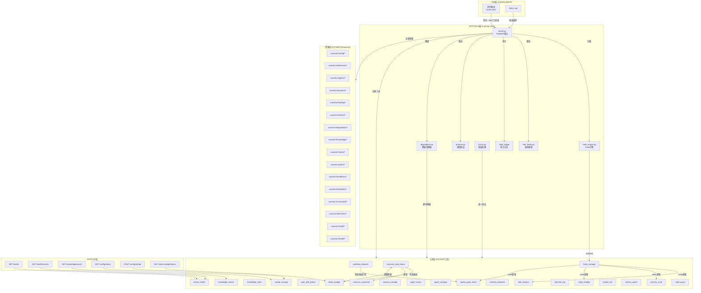

# Xuansto Skill V2 API 规格说明书

> 版本: 8.4.0 | MCP工具数量: 20 | MCP资源数量: 27 | HTTP API端点: 6
> 生成日期: 2026-05-26

---

## 目录

1. [现有API调用清单](#1-现有api调用清单)
   - 1.1 [内部API（模块间调用）](#11-内部api模块间调用)
   - 1.2 [外部API（HTTP/SDK）](#12-外部apihttpsdk)
2. [接口依赖拓扑图](#2-接口依赖拓扑图)
3. [重构后API设计](#3-重构后api设计)
   - 3.1 [Skill ↔ MCP Server Tool调用协议](#31-skill--mcp-server-tool调用协议)
   - 3.2 [MCP Server外部接口](#32-mcp-server外部接口)
   - 3.3 [渐进式加载相关接口](#33-渐进式加载相关接口)
4. [接口契约](#4-接口契约)
   - 4.1 [统一响应Schema](#41-统一响应schema)
   - 4.2 [错误码体系](#42-错误码体系)
   - 4.3 [各工具请求/响应Schema](#43-各工具请求响应schema)
   - 4.4 [版本管理建议](#44-版本管理建议)
5. [异常处理、重试与降级方案](#5-异常处理重试与降级方案)
   - 5.1 [异常分类与处理策略](#51-异常分类与处理策略)
   - 5.2 [重试机制](#52-重试机制)
   - 5.3 [降级体系](#53-降级体系)
   - 5.4 [速率限制](#54-速率限制)

---

## 1. 现有API调用清单

### 1.1 内部API（模块间调用）

内部API指 `xuansto_mcp` 包内各模块之间的函数级调用关系。

#### 1.1.1 Server核心层 → 工具层

| 调用方 | 被调用方 | 调用方式 | 说明 |
|--------|---------|---------|------|
| `server.py` | 各tool模块`.register(mcp)` | 函数调用 | 注册20个MCP工具到FastMCP实例 |
| `server.py` → `_with_hook_interception` | `hook_engine.execute_pre_hooks` | 异步调用 | 工具执行前拦截 |
| `server.py` → `_with_hook_interception` | `hook_engine.execute_post_hooks` | 异步调用 | 工具执行后拦截 |
| `server.py` → `_with_hook_interception` | `rate_limiter.check_rate_limit` | 同步调用 | 速率限制检查 |
| `server.py` → `_with_hook_interception` | `errors.retry_tool_call` | 异步调用 | 可重试错误的自动重试 |
| `server.py` → `_with_hook_interception` | `server_health.record_tool_call` | 同步调用 | 记录工具调用指标 |
| `server.py` → `_with_hook_interception` | `resource_load_status.record_token_usage` | 同步调用 | 记录Token使用量 |
| `server.py` → `_with_hook_interception` | `audit_logger.get_audit_logger().log()` | 同步调用 | 审计日志记录 |

#### 1.1.2 工具层 → 核心层

| 调用方 | 被调用方 | 调用方式 | 说明 |
|--------|---------|---------|------|
| 所有tool模块 | `errors.make_success_response` | 同步调用 | 构造成功响应 |
| 所有tool模块 | `errors.make_error_response` | 同步调用 | 构造错误响应 |
| 所有tool模块 | `validator.validate_input` | 同步调用 | Pydantic参数校验 |
| `workflow_dispatch` | `quality_gate_check`内部函数 | 同步调用 | 阶段推进时执行门禁 |
| `token_budget` → `enforce` | `resource_load_status.degrade_phase` | 同步调用 | Token超限触发阶段降级 |
| `resource_load_status` → `advance_phase` | `token_budget._set_budget` | 同步调用 | 阶段推进时更新Token预算 |
| `resource_load_status` → `advance_phase` | `notifications.send_mcp_notification` | 同步调用 | 阶段转换通知 |
| `resource_load_status` → `advance_phase` | `resource_subscribe.notify_subscribers` | 同步调用 | 资源变更通知订阅者 |
| `hook_manage` | `subprocess_utils.run_script` | 同步调用 | Hook脚本执行 |
| `decision_log` | `database.persist_state` | 同步调用 | 决策记录双写 |
| `token_budget` | `database.persist_state` / `load_state` | 同步调用 | 预算状态持久化 |
| `metrics_report` | `server_health._TOOL_METRICS` | 同步调用 | 读取工具调用指标 |

#### 1.1.3 Hook引擎内部调用

| 调用方 | 被调用方 | 说明 |
|--------|---------|------|
| `hook_engine.execute_pre_hooks` | `hook_manage.execute_pre_hooks` | 注册为全局pre-hook |
| `hook_engine.execute_post_hooks` | `hook_manage.execute_post_hooks` | 注册为全局post-hook |
| `hook_manage.execute_pre_hooks` | `INLINE_HOOK_LOGIC[hook_name]` | 内嵌Hook逻辑执行 |
| `hook_manage.execute_post_hooks` | `INLINE_HOOK_LOGIC["decision-log-persist"]` | 决策日志后置Hook |

#### 1.1.4 降级系统内部调用

| 调用方 | 被调用方 | 说明 |
|--------|---------|------|
| `degradation.DegradationManager` | 各组件`check_fn` / `recover_fn` | 健康检查与恢复 |
| `degradation.DegradationExecutor` | `FALLBACK_MAP[tool_name]` | 工具降级执行 |
| 各`*_fallback`函数 | `run_script_fallback` | 脚本降级 |
| 各`*_fallback`函数 | `_try_inline_fallback` | 内嵌降级 |
| `errors.DegradationCoordinator` | `degradation.get_fallback` | 协调降级 |

### 1.2 外部API（HTTP/SDK）

#### 1.2.1 MCP协议接口（stdio / streamable-http）

MCP Server通过标准MCP协议对外暴露工具和资源，支持两种传输方式：

| 传输方式 | 配置 | 说明 |
|---------|------|------|
| `stdio` | `XUANSTO_TRANSPORT=stdio`（默认） | 标准输入输出，适用于IDE集成 |
| `streamable-http` | `XUANSTO_TRANSPORT=streamable-http` | HTTP长连接，`XUANSTO_HOST`/`XUANSTO_PORT`可配置 |

**MCP工具调用协议**：客户端通过MCP SDK调用 `tools/call` 方法，传入工具名和参数。

**MCP资源读取协议**：客户端通过MCP SDK调用 `resources/read` 方法，传入资源URI。

**MCP通知协议**：服务器主动推送通知，包括 `phase_transition`、`phase_degradation`、`tools/list_changed`、`resource_updated`、`token_budget_exceeded`、`degradation_change`。

#### 1.2.2 HTTP API端点（FastAPI，需安装fastapi）

| 方法 | 路径 | 参数 | 返回值 | 认证 | 说明 |
|------|------|------|--------|------|------|
| GET | `/health` | 无 | `{status, data: {status, api_version, min_supported_version, services: {chromadb: {available, latency_ms}}}}` | 无 | 健康检查 |
| GET | `/health/version` | `client_api_version: string (query)` | `{status, data: {server_version, client_version, compatible, deprecated_features, new_features, upgrade_suggestion}}` | 无 | API版本协商 |
| GET | `/knowledge/search` | `query: string, top_k: int=5, scope: string|null` | `{status, data: {results: [{source, content, match_type, relevance}], total}}` | 无 | 知识检索 |
| GET | `/config/status` | 无 | `{status, data: {skill_root, work_dir, gate_scripts_count, ...}}` | 无 | 配置状态 |
| POST | `/config/reload` | 无 | `{status, data: {reloaded, ...}}` | 无 | 重载配置 |
| GET | `/token-budget/status` | 无 | `{status, data: {total_budget, used, remaining, phase_allocations, usage_by_phase}}` | 无 | Token预算状态 |

---

## 2. 接口依赖拓扑图



---

## 3. 重构后API设计

### 3.1 Skill ↔ MCP Server Tool调用协议

Skill层通过MCP协议调用Server工具，遵循以下调用链：

```
Skill命令 → routes.yaml路由 → MCP工具链 → server.py拦截 → Hook前置 → 速率限制 → 工具执行 → Hook后置 → 响应
```

#### 3.1.1 调用协议规范

| 项目 | 规范 |
|------|------|
| 传输协议 | MCP stdio 或 streamable-http |
| 调用方法 | `tools/call` |
| 参数格式 | JSON，每个工具定义Pydantic Schema |
| 响应格式 | 统一 `{status, data, error, metadata}` |
| 超时 | 单工具30秒，工具链120秒 |
| 重试 | 瞬态错误最多3次，指数退避 |
| 降级 | MCP工具 → 脚本降级 → 内嵌降级 → 最小响应 |

#### 3.1.2 命令路由到MCP工具链映射

| 命令 | MCP工具链 | 降级策略 |
|------|----------|---------|
| `/init` | skill_analyze → knowledge_search → workflow_dispatch → project_init → decision_log | 知识检索: ChromaDB→SQLite FTS→关键词 |
| `/brainstorm` | knowledge_search → workflow_dispatch | 知识检索→降级链 |
| `/clarify` | knowledge_search → workflow_dispatch → quality_gate_check | 知识检索→降级链；门禁→内嵌检查 |
| `/plan` | skill_analyze → knowledge_search → agent_status → workflow_dispatch → decision_log → token_budget | 项目分析→基础扫描；决策→内联记录 |
| `/spec` | workflow_dispatch → quality_gate_check → spec_drift_detect | 门禁失败→修复建议 |
| `/design` | quality_gate_check → knowledge_search → workflow_dispatch | 设计门禁→内嵌检查 |
| `/implement` | workflow_dispatch → quality_gate_check → hook_manage | 门禁失败→阻止实现 |
| `/test` | quality_gate_check → workflow_dispatch | 测试门禁FAIL→具体失败文件 |
| `/review` | quality_gate_check → security_scan → code_simplify | 安全/简化→内嵌降级 |
| `/audit` | security_scan → quality_gate_check → spec_drift_detect | 安全扫描→内嵌agentic+dependency |
| `/simplify` | code_simplify → quality_gate_check → context_compress | 简化→内嵌；压缩→脚本降级 |
| `/refactor` | code_simplify → quality_gate_check → context_compress | 门禁→内嵌；压缩→脚本降级 |
| `/accept` | quality_gate_check → workflow_dispatch | 门禁→增量缓存 |
| `/learn` | knowledge_search → knowledge_inject → session_manage | ChromaDB→SQLite FTS→关键词 |
| `/execute-plan` | workflow_dispatch → session_manage | 工作流→手动Phase推进 |
| `/loop` | workflow_dispatch → session_manage → resource_load_status → token_budget → decision_log | 逐步降级: MCP完整→MCP简化→脚本降级 |
| `/fix` | session_manage → quality_gate_check → hook_manage | 会话→内存临时状态 |
| `/deploy` | quality_gate_check → server_health → workflow_dispatch | 健康检查→基础状态 |
| `/build` | skill_analyze → quality_gate_check → server_health | 构建门禁→内嵌检查 |
| `/status` | workflow_dispatch → session_manage → server_health | 工作流状态→持久化文件 |
| `/sprint` | workflow_dispatch → session_manage → resource_load_status → token_budget → project_init | 快速工作流→精简Phase |

### 3.2 MCP Server外部接口

#### 3.2.1 MCP工具接口（20个）

所有工具通过MCP `tools/call` 方法调用，参数以JSON传递。

| # | 工具名 | 操作(actions) | 核心参数 | 只读 | 说明 |
|---|--------|-------------|---------|------|------|
| 1 | `skill_analyze` | (无action) | skill_path, include_scripts, include_agents, depth | 否 | 技能项目结构分析 |
| 2 | `knowledge_search` | retrieve, inject, precipitate | query, top_k, search_type, scope, content, knowledge_type | 否 | 三层知识库检索/注入/沉淀 |
| 3 | `knowledge_inject` | inject, batch, search, delete | topics, scope, content, metadata | 否 | 知识注入（独立工具） |
| 4 | `quality_gate_check` | (无action) | gate_ids, phase, project_path, severity_filter, force_refresh | 否 | 54项质量门禁检查 |
| 5 | `spec_drift_detect` | (无action) | spec_dir, src_dir | 是 | 规格-代码偏差检测 |
| 6 | `security_scan` | (无action) | target, severity_threshold, include_agentic, include_dependency | 是 | OWASP安全扫描 |
| 7 | `code_simplify` | (无action) | target, scope, include_dedup | 是 | 代码简化分析 |
| 8 | `session_manage` | save, load, list, detect, verify, track, restore | completed_tasks, pending_tasks, decisions, error_log, current_phase | 否 | 会话状态管理 |
| 9 | `workflow_dispatch` | start, status, abort, phase | workflow, project_path, workflow_id, phase_action | 否 | 工作流调度 |
| 10 | `agent_status` | list, by_phase, detail | phase, agent_name | 是 | Agent状态查询 |
| 11 | `agent_manage` | register, unregister, update, list, detail, assign, release, bulk_assign | agent_name, layer, role, phase, capabilities, agent_id | 否 | Agent注册与管理 |
| 12 | `hook_manage` | list, execute | profile, hook_name, context | 否 | Hook管理（16个Hook） |
| 13 | `resource_load_status` | status, preload, cache, clear_cache, loading_progress, token_report, disclosure_transition, transition_check, features, metrics | phase, resource_ids, resource_uris, priority, batch_mode, auto_upgrade, target_phase | 是 | 渐进式加载状态管理 |
| 14 | `resource_subscribe` | subscribe, unsubscribe, list | uri, client_id | 否 | 资源订阅管理 |
| 15 | `context_compress` | (无action) | content, strategy, target_tokens, preserve_sections | 是 | 上下文压缩 |
| 16 | `server_health` | (默认), version, negotiate_version, capabilities | client_version, client_api_version | 是 | 服务器健康检查 |
| 17 | `decision_log` | log, list, query, update, export, stats, reconcile, configure | title, context, decision, rationale, keyword, decision_id, status, export_format | 否 | 决策日志管理 |
| 18 | `token_budget` | status, set_budget, set_from_phase, recommend, report, enforce | total_budget, phase_allocations, project_size, complexity, team_size, period, phase | 否 | Token预算管理 |
| 19 | `project_init` | create, init, validate, detect_stack, detect, configure | name, description, stack, template, directory, project_path | 否 | 项目初始化 |
| 20 | `metrics_report` | query, summary, evaluate | tool_name, time_range, metric_type, criterion | 是 | 指标报告 |
| 21 | `config_manage` | reload, status, validate | action | 否 | 配置管理 |
| 22 | `audit_query` | (无action) | tool_name, date_range, limit | 是 | 审计日志查询 |

#### 3.2.2 MCP资源接口（27个）

所有资源通过MCP `resources/read` 方法读取，返回字符串内容。

| # | URI模式 | 类型 | 说明 |
|---|---------|------|------|
| 1 | `xuansto://config/skill` | 配置 | 技能配置文件 |
| 2 | `xuansto://references/quality-gates` | 参考 | 质量门禁文档 |
| 3 | `xuansto://references/agent-registry` | 参考 | Agent注册表 |
| 4 | `xuansto://references/workflow-phases` | 参考 | 工作流阶段定义 |
| 5 | `xuansto://templates/{name}` | 模板 | 模板文件（参数化） |
| 6 | `xuansto://sessions/latest` | 会话 | 最新会话记录 |
| 7 | `xuansto://sessions/{session_id}` | 会话 | 指定会话记录（参数化） |
| 8 | `xuansto://agents/{name}` | Agent | 按名称查询Agent |
| 9 | `xuansto://agents/{layer}/{name}` | Agent | 按层级+名称查询Agent |
| 10 | `xuansto://loading/status` | 状态 | 渐进式加载状态 |
| 11 | `xuansto://metrics/summary` | 指标 | 工具调用指标摘要 |
| 12 | `xuansto://degradation/status` | 降级 | 降级管理器状态 |
| 13 | `xuansto://skill/config` | 配置 | 统一技能配置 |
| 14 | `xuansto://skill/constraints` | 约束 | 技能约束配置 |
| 15 | `xuansto://agents/registry` | Agent | Agent完整注册表 |
| 16 | `xuansto://gates/definitions` | 门禁 | 质量门禁定义 |
| 17 | `xuansto://workflows/definitions` | 工作流 | 工作流定义 |
| 18 | `xuansto://hooks/definitions` | Hook | Hook定义 |
| 19 | `xuansto://knowledge/status` | 知识库 | 知识库状态 |
| 20 | `xuansto://knowledge/stats` | 知识库 | 知识库统计 |
| 21 | `xuansto://templates/index` | 模板 | 模板索引 |
| 22 | `xuansto://commands/routes` | 命令 | 命令路由表 |
| 23 | `xuansto://session/state` | 会话 | 会话状态 |
| 24 | `xuansto://health/status` | 健康 | 健康状态 |
| 25 | `xuansto://audit/log` | 审计 | 审计日志 |
| 26 | `xuansto://decisions/latest` | 决策 | 最新决策记录 |
| 27 | `xuansto://workflows/active` | 工作流 | 活跃工作流实例 |

#### 3.2.3 MCP Prompt接口

| Prompt名 | 参数 | 说明 |
|----------|------|------|
| `xuansto_workflow` | task_description: string | 执行xuansto工作流 |
| `xuansto_analysis` | skill_path: string | 分析指定技能 |

#### 3.2.4 MCP通知接口

服务器主动推送的通知类型：

| 通知类型 | 触发条件 | 数据结构 |
|---------|---------|---------|
| `phase_transition` | 阶段推进 | `{from, to, status, loaded_resources}` |
| `phase_degradation` | 阶段降级 | `{from, to, reason}` |
| `tools/list_changed` | 工具列表变更 | `{reason, from_phase, to_phase}` |
| `resource_updated` | 资源更新 | `{uri, subscribers, event_data}` |
| `token_budget_exceeded` | Token预算超限 | `{phase, estimated_tokens, token_budget, suggested_phase}` |
| `degradation_change` | 降级状态变更 | `{component, old_level, new_level, overall_level}` |

### 3.3 渐进式加载相关接口

#### 3.3.1 资源列表接口

`resource_load_status(action="status")` 返回当前各Phase的资源加载状态：

| Phase | 名称 | Token预算 | 资源数 | 可用功能 |
|-------|------|----------|--------|---------|
| 0 | skeleton | 2000 | 1 | 命令路由(受限) |
| 1 | functional | 5000 | 6 | 命令执行、工作流推进、门禁检查、核心Agent |
| 2 | enhanced | 10000 | 8 | 知识检索、参考文档、Agent完整注册表 |
| 3 | full | 20000 | 22 | 完整脚本集、模板库、全部Agent定义 |

#### 3.3.2 进度报告接口

`resource_load_status(action="loading_progress")` 返回：

```json
{
  "current_phase": 1,
  "target_phase": 2,
  "progress": 0.65,
  "loaded_resources": ["skill-config", "agent-registry", "quality-gates"],
  "pending_resources": ["knowledge-general", "sdd-tdd-full"],
  "estimated_time_remaining_ms": 3500,
  "total_resources": 6,
  "loaded_count": 4,
  "progress_percent": 66.67,
  "loading": true,
  "budget_status": {
    "current_phase": 1,
    "token_budget": 5000,
    "estimated_tokens": 3200,
    "usage_ratio": 0.64,
    "budget_exceeded_80pct": false
  }
}
```

#### 3.3.3 状态查询接口

`resource_load_status(action="transition_check")` 返回阶段转换条件检查：

```json
{
  "current_phase": "skeleton",
  "current_phase_index": 0,
  "next_phase": "functional",
  "next_phase_index": 1,
  "can_advance": true,
  "conditions_met": true,
  "missing": [],
  "description": "核心工具和基础资源已加载",
  "current_tools_available": 5,
  "min_tools_available": 5,
  "current_resources_loaded": 3,
  "min_resources_loaded": 3
}
```

#### 3.3.4 阶段转换条件

| 转换 | 最低工具数 | 最低资源数 | 说明 |
|------|----------|----------|------|
| skeleton → functional | 5 | 3 | 核心工具和基础资源已加载 |
| functional → enhanced | 12 | 10 | 大部分工具和参考文档已加载 |
| enhanced → full | 20 | 18 | 所有工具、资源和Hook系统已加载 |

#### 3.3.5 Disclosure Transition接口

`resource_load_status(action="disclosure_transition")` 返回阶段转换所需资源估算：

```json
{
  "current_phase": "skeleton",
  "target_phase": "full",
  "required_resources": ["agent-registry", "quality-gates", "brainstorm-workflow", "..."],
  "estimated_tokens": 18500,
  "available_alternatives": ["functional", "enhanced"],
  "transition_hint": "升级到功能阶段(Phase 1)可解锁：命令执行、工作流推进...",
  "can_advance": false
}
```

---

## 4. 接口契约

### 4.1 统一响应Schema

所有MCP工具和HTTP API返回统一的响应格式：

#### 成功响应

```json
{
  "status": "success",
  "data": { },
  "error": null,
  "metadata": {
    "api_version": "2.5.0"
  }
}
```

#### 降级响应

```json
{
  "status": "success",
  "data": { },
  "error": null,
  "metadata": {
    "api_version": "2.5.0",
    "degradation_level": "inline",
    "degraded": true
  }
}
```

#### 错误响应

```json
{
  "status": "error",
  "data": null,
  "error": {
    "code": "ERR_VALIDATION",
    "message": "参数校验失败",
    "details": { },
    "retryable": false
  },
  "metadata": {
    "language": "zh"
  }
}
```

### 4.2 错误码体系

#### 系统级错误码

| 错误码 | HTTP状态 | 分类 | 可重试 | 说明 |
|--------|---------|------|--------|------|
| `ERR_VALIDATION` | 400 | client | 否 | 参数校验失败 |
| `ERR_NOT_FOUND` | 404 | client | 否 | 资源未找到 |
| `ERR_TIMEOUT` | 408 | transient | 是 | 操作超时 |
| `ERR_DEGRADATION` | 503 | transient | 是 | 服务降级 |
| `ERR_CONFIG` | 500 | server | 否 | 配置错误 |
| `ERR_INTERNAL` | 500 | server | 否 | 内部错误 |
| `ERR_RATE_LIMIT` | 429 | transient | 是 | 请求频率超限 |
| `ERR_PERMISSION` | 403 | client | 否 | 权限不足 |
| `ERR_WORKFLOW_NOT_FOUND` | 404 | client | 否 | 工作流实例不存在 |
| `ERR_DUPLICATE` | 409 | client | 否 | 重复检测 |
| `ERR_VERSION_CONFLICT` | 409 | transient | 是 | 版本冲突 |
| `ERR_UNAUTHORIZED` | 401 | client | 否 | 未授权 |
| `ERR_SERVICE_UNAVAILABLE` | 503 | transient | 是 | 服务不可用 |

#### 工具级错误码（ErrorCodes）

| 错误码 | 说明 |
|--------|------|
| `TOOL_NOT_FOUND` | 工具不存在 |
| `INVALID_PARAMS` | 无效参数 |
| `EXECUTION_FAILED` | 执行失败 |
| `RATE_LIMITED` | 频率限制 |
| `BLOCKED_BY_HOOK` | 被Hook拦截 |
| `SECURITY_VIOLATION` | 安全违规 |
| `DEGRADED` | 降级响应 |
| `TIMEOUT` | 超时 |
| `NOT_FOUND` | 未找到 |
| `INTERNAL_ERROR` | 内部错误 |
| `WORKFLOW_NOT_FOUND` | 工作流未找到 |
| `UNAUTHORIZED` | 未授权 |
| `DUPLICATE_DETECTED` | 重复检测 |
| `VERSION_CONFLICT` | 版本冲突 |
| `SERVICE_UNAVAILABLE` | 服务不可用 |

### 4.3 各工具请求/响应Schema

#### 4.3.1 skill_analyze

**请求参数：**

| 名称 | 类型 | 必填 | 默认值 | 说明 |
|------|------|------|--------|------|
| skill_path | string | 是 | — | 技能根目录路径 |
| include_scripts | boolean | 否 | true | 是否分析scripts目录 |
| include_agents | boolean | 否 | true | 是否分析agents目录 |
| depth | string | 否 | "basic" | 分析深度: basic/full |

**响应data字段：**

```json
{
  "metadata": { "name": "...", "version": "..." },
  "structure": { "root": "...", "exists": true, "directories": [], "files_count": 5 },
  "agents": [{ "name": "Orchestrator", "layer": "编排层" }],
  "dependencies": { "total_scripts": 25, "by_type": {} },
  "issues": [{ "type": "missing_file", "file": "SKILL.md", "severity": "critical" }],
  "project_scale": "medium",
  "recommended_workflow": "sdd-tdd-medium",
  "scale_details": { "file_count": 50, "loc_count": 8000, "scale": "medium", "recommended_workflow": "sdd-tdd-medium", "workflow_phases": 6 }
}
```

#### 4.3.2 knowledge_search

**请求参数：**

| 名称 | 类型 | 必填 | 默认值 | 说明 |
|------|------|------|--------|------|
| action | string | 否 | "retrieve" | retrieve/inject/precipitate |
| query | string\|null | 否 | null | 搜索查询文本 |
| top_k | integer | 否 | 5 | 返回结果数量(1-50) |
| search_type | string | 否 | "hybrid" | hybrid/semantic_only/keyword_only |
| scope | string\|null | 否 | null | general/workspace/experience |
| min_confidence | float | 否 | 0.0 | 最低置信度(0.0-1.0) |
| content | string\|null | 否 | null | 注入内容(inject时) |
| knowledge_type | string | 否 | "general" | general/workspace/experience |
| metadata | object\|null | 否 | null | 附加元数据 |
| pattern_ids | array\|null | 否 | null | 模式ID列表(precipitate时) |

**响应data字段（retrieve）：**

```json
{
  "results": [{ "source": "...", "content": "...", "match_type": "semantic", "relevance": 0.85 }],
  "total": 3,
  "strategy": "chromadb_semantic"
}
```

#### 4.3.3 quality_gate_check

**请求参数：**

| 名称 | 类型 | 必填 | 默认值 | 说明 |
|------|------|------|--------|------|
| gate_ids | array\|null | 否 | null | 门禁ID列表 |
| phase | string\|null | 否 | null | 按阶段过滤(0-8) |
| project_path | string | 否 | "." | 项目根目录 |
| severity_filter | string | 否 | "all" | all/BLOCK/WARN |
| force_refresh | boolean | 否 | false | 强制刷新缓存 |

**响应data字段：**

```json
{
  "checks": [{ "gate_id": "TEST-PASS", "status": "PASS", "details": {}, "suggestion": "" }],
  "summary": { "total": 10, "passed": 7, "failed": 2, "skipped": 1, "blocked": true },
  "cache_info": { "hit": false, "hit_count": 0, "miss_count": 10 }
}
```

#### 4.3.4 spec_drift_detect

**请求参数：**

| 名称 | 类型 | 必填 | 默认值 | 说明 |
|------|------|------|--------|------|
| spec_dir | string | 否 | ".trae/specs" | 规格文档目录 |
| src_dir | string | 否 | "." | 源代码目录 |

**响应data字段：**

```json
{
  "total_specs": 3, "total_pending_tasks": 12,
  "drifts": [{ "task": "...", "spec_file": "...", "has_implementation": true, "potential_files": [] }],
  "implementation_rate": 0.58
}
```

#### 4.3.5 security_scan

**请求参数：**

| 名称 | 类型 | 必填 | 默认值 | 说明 |
|------|------|------|--------|------|
| target | string | 否 | "." | 目标扫描目录 |
| severity_threshold | string | 否 | "medium" | critical/high/medium/low |
| include_agentic | boolean | 否 | true | 是否包含OWASP Agentic检查 |
| include_dependency | boolean | 否 | true | 是否包含依赖漏洞扫描 |

**响应data字段：**

```json
{
  "agentic_scan": { "vulnerabilities": [], "total": 3, "by_severity": {} },
  "dependency_scan": { "dependencies": [], "total": 15, "vulnerable_count": 1 }
}
```

#### 4.3.6 code_simplify

**请求参数：**

| 名称 | 类型 | 必填 | 默认值 | 说明 |
|------|------|------|--------|------|
| target | string | 是 | — | 目标文件或目录 |
| scope | string | 否 | "recent" | file/dir/recent |
| include_dedup | boolean | 否 | true | 是否包含重复代码检测 |

**响应data字段：**

```json
{
  "simplification": { "suggestions": [], "total": 8, "by_type": {} },
  "deduplication": { "duplicates": [], "total_groups": 2, "total_duplicate_lines": 18 }
}
```

#### 4.3.7 session_manage

**请求参数：**

| 名称 | 类型 | 必填 | 默认值 | 说明 |
|------|------|------|--------|------|
| action | string | 是 | — | save/load/list/detect/verify/track/restore |
| completed_tasks | array\|null | 否 | null | 已完成任务列表 |
| pending_tasks | array\|null | 否 | null | 未完成任务列表 |
| decisions | array\|null | 否 | null | 关键决策列表 |
| experience | array\|null | 否 | null | 经验沉淀列表 |
| error_log | array\|null | 否 | null | 错误日志(detect时) |
| pattern_path | string\|null | 否 | null | 模式文件路径(verify时) |
| success | boolean | 否 | true | 验证是否成功(verify时) |
| current_phase | integer\|null | 否 | null | 当前阶段编号(track时) |
| current_task | string\|null | 否 | null | 当前任务描述(track时) |

#### 4.3.8 workflow_dispatch

**请求参数：**

| 名称 | 类型 | 必填 | 默认值 | 说明 |
|------|------|------|--------|------|
| action | string | 是 | — | start/status/abort/phase |
| workflow | string\|null | 否 | null | 工作流名称(start时) |
| project_path | string | 否 | "." | 项目根目录 |
| workflow_id | string\|null | 否 | null | 工作流实例ID |
| phase_action | string\|null | 否 | null | advance/current(phase时) |

#### 4.3.9 agent_status

**请求参数：**

| 名称 | 类型 | 必填 | 默认值 | 说明 |
|------|------|------|--------|------|
| action | string | 是 | — | list/by_phase/detail |
| phase | integer\|null | 否 | null | 阶段编号(0-8) |
| agent_name | string\|null | 否 | null | Agent名称 |

#### 4.3.10 agent_manage

**请求参数：**

| 名称 | 类型 | 必填 | 默认值 | 说明 |
|------|------|------|--------|------|
| action | string | 是 | — | register/unregister/update/list/detail/assign/release/bulk_assign |
| agent_name | string\|null | 否 | null | Agent名称 |
| layer | string\|null | 否 | null | 层级 |
| role | string\|null | 否 | null | 角色 |
| phase | integer\|null | 否 | null | 阶段 |
| capabilities | array\|null | 否 | null | 能力列表 |
| agent_id | string\|null | 否 | null | Agent ID |

#### 4.3.11 hook_manage

**请求参数：**

| 名称 | 类型 | 必填 | 默认值 | 说明 |
|------|------|------|--------|------|
| action | string | 是 | — | list/execute |
| profile | string | 否 | "standard" | minimal/standard/strict |
| hook_name | string\|null | 否 | null | Hook名称(execute时必填) |
| context | object\|null | 否 | null | 执行上下文 |

**Hook Profile配置：**

| Profile | Hook数量 | 包含的Hook |
|---------|---------|-----------|
| minimal | 2 | security-block, session-save |
| standard | 10 | security-block, token-budget-check, auto-format, encoding-check, load-context, kb-health-check, session-save, git-status-check, experience-precipitate, save-state |
| strict | 16 | 全部16个Hook |

#### 4.3.12 resource_load_status

**请求参数：**

| 名称 | 类型 | 必填 | 默认值 | 说明 |
|------|------|------|--------|------|
| action | string | 是 | — | status/preload/cache/clear_cache/loading_progress/token_report/disclosure_transition/transition_check/features/metrics |
| phase | integer\|null | 否 | null | 目标阶段 |
| resource_ids | array\|null | 否 | null | 指定资源ID列表 |
| resource_uris | array\|null | 否 | null | 资源URI列表(preload时) |
| priority | string | 否 | "normal" | critical/normal/background |
| batch_mode | boolean | 否 | false | 批量并发加载 |
| auto_upgrade | boolean | 否 | false | Token超限时自动升级阶段 |
| target_phase | string\|null | 否 | null | 目标阶段名称(skeleton/functional/enhanced/full) |

#### 4.3.13 resource_subscribe

**请求参数：**

| 名称 | 类型 | 必填 | 默认值 | 说明 |
|------|------|------|--------|------|
| action | string | 是 | — | subscribe/unsubscribe/list |
| uri | string\|null | 否 | null | 资源URI(必须以xuansto://开头) |
| client_id | string\|null | 否 | null | 客户端ID |

#### 4.3.14 context_compress

**请求参数：**

| 名称 | 类型 | 必填 | 默认值 | 说明 |
|------|------|------|--------|------|
| content | string | 是 | — | 待压缩文本 |
| strategy | string | 否 | "semantic" | semantic/selective/lossless |
| target_tokens | integer | 否 | 2000 | 目标Token数(100-50000) |
| preserve_sections | array\|null | 否 | null | 必须保留的章节标题 |

**响应data字段：**

```json
{
  "compressed": "...",
  "original_tokens": 5000,
  "compressed_tokens": 1800,
  "actual_tokens": 1800,
  "target_deviation": -200,
  "compression_ratio": 0.36,
  "strategy": "semantic",
  "token_method": "tiktoken"
}
```

#### 4.3.15 server_health

**请求参数：**

| 名称 | 类型 | 必填 | 默认值 | 说明 |
|------|------|------|--------|------|
| action | string | 否 | (默认) | (默认)/version/negotiate_version/capabilities |
| client_version | string\|null | 否 | null | 客户端版本(negotiate_version时) |
| client_api_version | string\|null | 否 | null | 客户端API版本(version时) |

#### 4.3.16 decision_log

**请求参数：**

| 名称 | 类型 | 必填 | 默认值 | 说明 |
|------|------|------|--------|------|
| action | string | 是 | — | log/list/query/update/export/stats/reconcile/configure |
| title | string\|null | 否 | null | 决策标题(log时必填) |
| description | string\|null | 否 | null | 决策描述 |
| context | string\|null | 否 | null | 上下文 |
| alternatives | array\|null | 否 | null | 备选方案 |
| decision | string\|null | 否 | null | 最终决策 |
| rationale | string\|null | 否 | null | 理由 |
| impact | string\|null | 否 | null | 影响 |
| decided_by | string\|null | 否 | null | 决策者 |
| keyword | string\|null | 否 | null | 搜索关键词(query时) |
| tag | string\|null | 否 | null | 标签(query时) |
| date_from | string\|null | 否 | null | 起始日期 |
| date_to | string\|null | 否 | null | 截止日期 |
| limit | integer | 否 | 20 | 分页大小 |
| offset | integer | 否 | 0 | 分页偏移 |
| export_format | string | 否 | "json" | json/markdown(export时) |
| decision_id | string\|null | 否 | null | 决策ID(update时) |
| status | string\|null | 否 | null | proposed/accepted/deprecated/superseded |
| file_backup | boolean\|null | 否 | null | 是否启用文件备份(configure时) |

#### 4.3.17 token_budget

**请求参数：**

| 名称 | 类型 | 必填 | 默认值 | 说明 |
|------|------|------|--------|------|
| action | string | 是 | — | status/set_budget/set_from_phase/recommend/report/enforce |
| total_budget | integer\|null | 否 | null | 总Token预算 |
| phase_allocations | object\|null | 否 | null | 阶段分配 |
| project_size | string\|null | 否 | null | small/medium/large(recommend时) |
| complexity | string\|null | 否 | null | low/medium/high(recommend时) |
| team_size | integer\|null | 否 | null | 团队人数(recommend时) |
| period | string | 否 | "session" | session/daily/weekly(report时) |
| phase | string\|null | 否 | null | skeleton/functional/enhanced/full(set_from_phase时) |

#### 4.3.18 project_init

**请求参数：**

| 名称 | 类型 | 必填 | 默认值 | 说明 |
|------|------|------|--------|------|
| action | string | 是 | — | create/init/validate/detect_stack/detect/configure |
| name | string\|null | 否 | null | 项目名称(create时必填) |
| description | string\|null | 否 | null | 项目描述 |
| stack | array\|null | 否 | null | 技术栈列表 |
| template | string\|null | 否 | null | 模板名称 |
| directory | string\|null | 否 | null | 项目目录 |
| project_path | string\|null | 否 | null | 项目路径(validate/detect/configure时) |

#### 4.3.19 metrics_report

**请求参数：**

| 名称 | 类型 | 必填 | 默认值 | 说明 |
|------|------|------|--------|------|
| action | string | 是 | — | query/summary/evaluate |
| tool_name | string\|null | 否 | null | 工具名(query时) |
| time_range | string | 否 | "all" | 1h/6h/24h/7d/all |
| metric_type | string | 否 | "all" | calls/errors/latency/all |
| criterion | string | 否 | "all" | error_rate/availability/latency/all(evaluate时) |

#### 4.3.20 config_manage

**请求参数：**

| 名称 | 类型 | 必填 | 默认值 | 说明 |
|------|------|------|--------|------|
| action | string | 是 | — | reload/status/validate |

#### 4.3.21 audit_query

**请求参数：**

| 名称 | 类型 | 必填 | 默认值 | 说明 |
|------|------|------|--------|------|
| tool_name | string\|null | 否 | null | 按工具名过滤 |
| date_range | string\|null | 否 | null | 日期范围(YYYY-MM-DD:YYYY-MM-DD) |
| limit | integer | 否 | 50 | 返回条数(最大500) |

### 4.4 版本管理建议

#### 当前版本信息

| 项目 | 版本 |
|------|------|
| MCP Server | 2.5.0 |
| Skill约束 | 8.4.0 |
| MCP API | 2.5.0 |
| 最低兼容版本 | 2.0.0 |

#### 版本协商协议

通过 `server_health(action="negotiate_version", client_version="x.y.z")` 进行版本协商：

- 主版本号相同：兼容，返回新特性列表
- 客户端在最低兼容版本：兼容但标记为deprecated特性
- 主版本号不同：不兼容，返回升级建议

#### 版本管理建议

1. **语义化版本控制**：遵循 `MAJOR.MINOR.PATCH`，MAJOR变更表示不兼容API变更
2. **API变更日志**：通过 `API_CHANGELOG` 字典记录每个版本的变更
3. **向后兼容**：MINOR版本新增字段不破坏现有客户端
4. **废弃标记**：通过 `negotiate_version` 返回 `deprecated_features` 列表
5. **最低兼容版本**：`MCP_MIN_SUPPORTED_VERSION` 定义最低支持版本

---

## 5. 异常处理、重试与降级方案

### 5.1 异常分类与处理策略

#### 异常类型分类

| 分类 | 错误码 | 处理策略 | 示例 |
|------|--------|---------|------|
| **客户端错误** | ERR_VALIDATION, ERR_NOT_FOUND, ERR_PERMISSION, ERR_DUPLICATE | 直接返回错误，不重试 | 参数缺失、路径不存在 |
| **瞬态错误** | ERR_TIMEOUT, ERR_DEGRADATION, ERR_RATE_LIMIT, ERR_SERVICE_UNAVAILABLE | 自动重试+降级 | 网络超时、服务暂时不可用 |
| **服务端错误** | ERR_INTERNAL, ERR_CONFIG | 返回错误，记录日志 | 内部异常、配置错误 |

#### 异常类层次

```
XuanstoMCPError (基类)
├── PathNotFoundError         — 路径不存在
├── ScriptExecutionError      — 脚本执行失败
├── DegradationError          — 服务降级
├── ValidationError           — 参数校验失败
└── RetryExhaustedError       — 重试耗尽
```

#### 判断函数

| 函数 | 说明 |
|------|------|
| `is_transient_error(error)` | 判断是否为瞬态错误（可重试） |
| `is_permanent_error(error)` | 判断是否为永久错误（不可重试） |
| `is_retryable_error(error)` | 判断是否可重试（同is_transient_error） |

### 5.2 重试机制

#### 重试配置

| 错误类型 | 最大重试次数 | 基础延迟 | 退避策略 |
|---------|------------|---------|---------|
| version_conflict | 3 | 0 | 立即重试 |
| service_error | 2 | 1.0s | 指数退避 |
| embedding_failure | 5 | 60.0s | 固定延迟 |
| 默认（工具调用） | 3 | 1.0s | 指数退避(2^attempt) |

#### 重试流程

```
工具调用 → 异常?
  → 永久错误? → 直接抛出，不重试
  → 瞬态错误? → 重试(attempt/max_retries)
    → 成功? → 返回结果
    → 失败? → delay = base_delay * 2^attempt → 继续重试
  → 重试耗尽? → 抛出 RetryExhaustedError
```

#### 协议层重试

`protocol.py` 中的 `SkillToolCallProtocol` 定义了：

- 单工具超时: 30秒 (`TOOL_CALL_TIMEOUT_SECONDS`)
- 工具链超时: 120秒 (`CHAIN_TIMEOUT_SECONDS`)
- 链最大重试: 2次 (`MAX_CHAIN_RETRIES`)

### 5.3 降级体系

#### 5.3.1 降级管理器（DegradationManager）

监控4个组件的健康状态，自动降级和恢复：

| 组件 | 健康级别 | 检查方式 | 恢复方式 |
|------|---------|---------|---------|
| search_engine | chromadb → sqlite_fts → keyword | ChromaDB连接测试 | ChromaDB重连 |
| knowledge_base | full → workspace_only → no_knowledge | 文件存在性检查 | 文件存在性检查 |
| hooks | full_hooks → essential_only → no_hooks | hooks.json存在性 | hooks.json存在性 |
| resources | full_resources → cached_only → minimal | DATA_DIR存在性 | DATA_DIR存在性 |

#### 降级级别映射

| 组件级别 | 全局降级级别 |
|---------|------------|
| chromadb / full / full_hooks / full_resources / normal | L1_NORMAL |
| sqlite_fts / workspace_only / essential_only / cached_only / degraded | L2_LOCAL_SEMANTIC |
| keyword / no_knowledge / no_hooks / minimal / unavailable | L3_BM25_ONLY |

#### 恢复机制

- 健康检查间隔: 30秒
- 恢复退避: 基础5秒，指数退避(2^attempt)，最大300秒，含随机抖动
- 恢复成功: 级别提升一级
- 恢复失败: 增加退避时间

#### 5.3.2 工具降级链

每个MCP工具都有三级降级链：

```
MCP工具(完整功能) → 脚本降级(python scripts/xxx.py --format json) → 内嵌降级(_inline_xxx函数) → 最小响应
```

**20个工具的降级映射：**

| 工具 | 脚本降级 | 内嵌降级函数 | 最小响应 |
|------|---------|------------|---------|
| skill_analyze | scripts/skill_analyze.py | _inline_skill_analyze | {skill_path, analyzed: false} |
| knowledge_search | scripts/knowledge_search.py | _inline_knowledge_search | {query, results: []} |
| knowledge_inject | scripts/knowledge_inject.py | _inline_knowledge_inject | {action, injected_count: 0} |
| quality_gate_check | scripts/quality_gate_check.py | _inline_quality_gate | {checks: [...]} |
| spec_drift_detect | scripts/spec_drift_detect.py | _inline_spec_drift | {spec_dir, src_dir, drifts: []} |
| security_scan | scripts/security_scan.py | _inline_security_scan | {target, issues: []} |
| code_simplify | scripts/code_simplify.py | _inline_code_simplify | {target, scope, simplified: false} |
| session_manage | scripts/session_manage.py | _inline_session_manage | {action, status: unavailable} |
| workflow_dispatch | scripts/workflow_dispatch.py | _inline_workflow_dispatch | {action, status: unavailable} |
| agent_status | scripts/agent_status.py | _inline_agent_status | {agents: [], total: 0} |
| hook_manage | scripts/hook_manage.py | _inline_hook_manage | {hooks: []} |
| resource_load_status | (无脚本) | _inline_resource_load_status | {resources: {}} |
| context_compress | scripts/context_compress.py | _inline_context_compress | {strategy, compressed: false} |
| server_health | scripts/server_health.py | _inline_server_health | {status: degraded} |
| decision_log | scripts/decision_log.py | _inline_decision_log | {action, entries: []} |
| token_budget | scripts/token_budget.py | _inline_token_budget | {action, budget: {}} |
| project_init | scripts/project_init.py | _inline_project_init | {action, initialized: false} |
| agent_manage | (无脚本) | _inline_agent_manage | {action, managed: false} |
| metrics_report | scripts/metrics_report.py | _inline_metrics_report | {action, metrics: {}} |
| config_manage | (无脚本) | _inline_config_manage | {action, config: {}} |

#### 5.3.3 知识检索降级链

知识检索有独立的深度降级链：

```
ChromaDB语义搜索 → SQLite FTS5全文搜索 → 关键词文件扫描(keyword_fallback)
```

降级级别通过 `degradation_level` 字段标识：
- `"chromadb"` — ChromaDB语义搜索成功
- `"sqlite_fts5"` — 降级到SQLite FTS5
- `"keyword_fallback"` — 降级到关键词扫描

#### 5.3.4 渐进式加载降级

Token预算超限时自动触发阶段降级：

| Token使用率 | 动作 |
|------------|------|
| < 80% | 正常运行 |
| ≥ 80% | 触发 `context_compress` 建议 |
| ≥ 95% | 触发 `degrade_phase`，阶段降一级 |

#### 5.3.5 降级配置热更新

降级映射支持从以下来源加载，并支持热更新：

1. **constraints.yaml** — `degradation.tool_fallbacks` 节（优先级最高）
2. **fallback_config.yaml** — `fallback_map` 节
3. **FALLBACK_MAP** — 代码内置默认映射

热更新方式：
- `watchfiles` 库可用时：监听配置文件变更
- `watchfiles` 不可用时：5秒轮询检查

### 5.4 速率限制

#### Token Bucket算法

每个工具独立维护令牌桶：

| 参数 | 值 | 说明 |
|------|---|------|
| max_tokens | 60 | 桶容量 |
| refill_rate | 1.0/s | 令牌补充速率 |
| retry_after | 60秒 | 超限后建议等待时间 |

#### 速率限制流程

```
工具调用 → check_rate_limit(tool_name)
  → 允许? → 继续执行
  → 拒绝? → 返回 ERR_RATE_LIMITED 错误
    {error_code: "ERR_RATE_LIMITED", retry_after_seconds: 60}
```

#### 自定义速率限制

通过 `configure_tool_limit(tool_name, max_tokens, refill_rate)` 可为特定工具配置独立限制。

通过 `reset_all_limits()` 可重置所有工具的速率限制。
