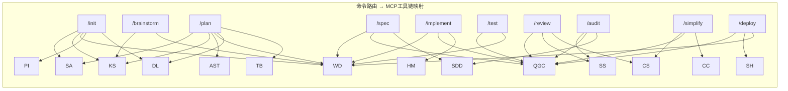
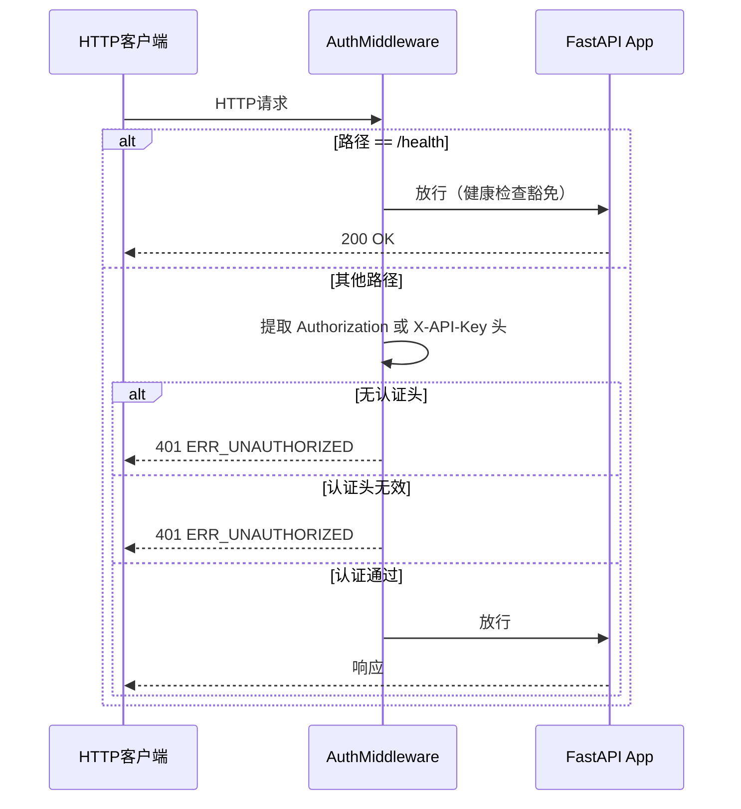

# Xuansto Skill V2 API 接口规格说明书

> 版本: v9.0.0 | API Contract: v3.0.0 | 最低兼容: v2.0.0
> 生成日期: 2026-05-27

## 目录

- [1. 现有 API 调用清单](#1-现有-api-调用清单)
  - [1.1 MCP Tool 调用（22个工具）](#11-mcp-tool-调用22个工具)
  - [1.2 MCP Resource（22个资源）](#12-mcp-resource22个资源)
  - [1.3 MCP Prompt（2个提示）](#13-mcp-prompt2个提示)
  - [1.4 Hook 拦截机制](#14-hook-拦截机制)
  - [1.5 降级链](#15-降级链)
- [2. 接口依赖拓扑图](#2-接口依赖拓扑图)
- [3. HTTP 认证中间件](#3-http-认证中间件)
- [4. Hook 拦截复用机制](#4-hook-拦截复用机制)
- [5. 接口契约](#5-接口契约)
  - [5.1 统一响应格式](#51-统一响应格式)
  - [5.2 各工具 Request/Response Schema](#52-各工具-requestresponse-schema)
  - [5.3 HTTP API 端点契约](#53-http-api-端点契约)
  - [5.4 CLI 命令契约](#54-cli-命令契约)
  - [5.5 版本管理](#55-版本管理)
- [6. 异常处理、重试与降级方案](#6-异常处理重试与降级方案)
  - [6.1 错误码体系](#61-错误码体系)
  - [6.2 重试策略](#62-重试策略)
  - [6.3 降级路径](#63-降级路径)

---

## 1. 现有 API 调用清单

### 1.1 MCP Tool 调用（22个工具）

所有工具通过 FastMCP 框架注册，经 `_with_hook_interception` 包装后统一拦截。注册入口位于 `server.py` L173-L197。

| # | 工具名 | 必填参数 | 可选参数 | 读写 | 幂等 | 源文件 |
|---|--------|---------|---------|------|------|--------|
| 1 | `skill_analyze` | `skill_path` | `include_scripts`, `include_agents`, `depth` | 只读 | 是 | `tools/skill_analyze.py` |
| 2 | `knowledge_search` | `action` | `query`, `top_k`, `search_type`, `scope`, `min_confidence`, `keep_last_n` | 只读 | 是 | `tools/knowledge_search.py` |
| 3 | `knowledge_inject` | `action` | `topics`, `scope`, `max_tokens`, `relevance_threshold`, `category`, `title`, `content`, `tags`, `confidence`, `entry_id` | 读写 | 否 | `tools/knowledge_inject.py` |
| 4 | `quality_gate_check` | — | `gate_ids`, `phase`, `project_path`, `severity_filter`, `force_refresh` | 只读 | 是 | `tools/quality_gate_check.py` |
| 5 | `spec_drift_detect` | — | `spec_dir`, `src_dir` | 只读 | 是 | `tools/spec_drift_detect.py` |
| 6 | `security_scan` | — | `target`, `severity_threshold`, `include_agentic`, `include_dependency` | 只读 | 否 | `tools/security_scan.py` |
| 7 | `code_simplify` | `target` | `scope`, `include_dedup` | 只读 | 否 | `tools/code_simplify.py` |
| 8 | `session_manage` | `action` | `completed_tasks`, `pending_tasks`, `decisions`, `experience`, `error_log`, `pattern_path`, `success`, `current_phase`, `current_task` | 读写 | 否 | `tools/session_manage.py` |
| 9 | `workflow_dispatch` | `action` | `workflow`, `project_path`, `workflow_id`, `phase_action`, `snapshot_phase` | 读写 | 否 | `tools/workflow_dispatch.py` |
| 10 | `agent_status` | `action` | `phase`, `agent_name`, `capabilities`, `project_file_count` | 只读 | 是 | `tools/agent_status.py` |
| 11 | `agent_manage` | `action` | `agent_type`, `capabilities`, `agent_id`, `task` | 读写 | 否 | `tools/agent_manage.py` |
| 12 | `hook_manage` | `action` | `profile`, `hook_name`, `context`, `phase` | 读写 | 否 | `tools/hook_manage.py` |
| 13 | `resource_load_status` | `action` | `phase`, `resource_ids`, `resource_uris`, `priority`, `batch_mode`, `auto_upgrade`, `target_phase` | 读写 | 否 | `tools/resource_load_status.py` |
| 14 | `resource_subscribe` | `action` | `uri`, `client_id` | 读写 | 否 | `tools/resource_subscribe.py` |
| 15 | `context_compress` | `content` | `strategy`, `target_tokens`, `preserve_sections` | 只读 | 否 | `tools/context_compress.py` |
| 16 | `server_health` | `action` | `client_version`, `client_api_version` | 只读 | 是 | `tools/server_health.py` |
| 17 | `decision_log` | `action` | `title`, `description`, `context`, `alternatives`, `decision`, `rationale`, `impact`, `decided_by`, `keyword`, `tag`, `date_from`, `date_to`, `limit`, `offset`, `format`, `decision_id`, `status`, `file_backup` | 读写 | 否 | `tools/decision_log.py` |
| 18 | `token_budget` | `action` | `total_budget`, `phase_allocations`, `project_size`, `complexity`, `team_size`, `period`, `phase` | 读写 | 否 | `tools/token_budget.py` |
| 19 | `project_init` | `action` | `name`, `description`, `stack`, `template`, `directory`, `project_path` | 读写 | 否 | `tools/project_init.py` |
| 20 | `metrics_report` | `action` | `tool_name`, `time_range`, `metric_type`, `criterion` | 只读 | 是 | `tools/metrics_report.py` |
| 21 | `config_manage` | `action` | — | 读写 | 否 | `tools/config_manage.py` |
| 22 | `audit_query` | — | `tool_name`, `date_range`, `limit` | 只读 | 是 | `tools/audit_query.py` |

所有22个工具均通过 `validate_path_safety`（`core/validator.py` L29-L60）统一执行路径安全校验，防止路径遍历、空字节注入和绝对路径逃逸。

### 1.2 MCP Resource（22个资源）

所有资源通过 `xuansto://` URI 方案注册，位于 `resources/skill_resources.py`。每个资源读取均经过 `validate_path_safety` 校验。

| # | URI | 类型 | 描述 |
|---|-----|------|------|
| 1 | `xuansto://config/skill` | 静态 | 技能配置文件(.skill-config.yaml) |
| 2 | `xuansto://templates/{name}` | 模板 | 按名称获取模板文件 |
| 3 | `xuansto://sessions/latest` | 静态 | 最新会话记录 |
| 4 | `xuansto://sessions/{session_id}` | 模板 | 按ID获取会话 |
| 5 | `xuansto://agents/{name}` | 模板 | 按名称获取Agent定义 |
| 6 | `xuansto://agents/{layer}/{name}` | 模板 | 按层级和名称获取Agent |
| 7 | `xuansto://loading/status` | 静态 | 渐进加载状态(含Phase/Token预算/转换历史) |
| 8 | `xuansto://loading/requirements` | 静态 | 渐进加载需求(Phase资源/转换条件) |
| 9 | `xuansto://metrics/summary` | 静态 | 工具调用指标汇总 |
| 10 | `xuansto://degradation/status` | 静态 | 降级管理器状态 |
| 11 | `xuansto://skill/constraints` | 静态 | 技能约束配置 |
| 12 | `xuansto://agents/registry` | 静态 | Agent注册表 |
| 13 | `xuansto://gates/definitions` | 静态 | 质量门禁定义 |
| 14 | `xuansto://workflows/definitions` | 静态 | 工作流定义 |
| 15 | `xuansto://hooks/definitions` | 静态 | Hook定义 |
| 16 | `xuansto://knowledge/stats` | 静态 | 知识库统计 |
| 17 | `xuansto://templates/index` | 静态 | 模板索引 |
| 18 | `xuansto://commands/routes` | 静态 | 命令路由表 |
| 19 | `xuansto://session/state` | 静态 | 当前会话状态 |
| 20 | `xuansto://health/status` | 静态 | 健康状态 |
| 21 | `xuansto://audit/log` | 静态 | 审计日志(最近50条) |
| 22 | `xuansto://decisions/latest` | 静态 | 最近决策记录 |
| 23 | `xuansto://workflows/active` | 静态 | 活跃工作流实例 |
| 24 | `xuansto://agents/list` | 静态 | Agent列表(含Phase映射) |
| 25 | `xuansto://sessions/list` | 静态 | 会话列表 |
| 26 | `xuansto://gates/list` | 静态 | 门禁列表(含Inline/Script标记) |
| 27 | `xuansto://workflows/list` | 静态 | 工作流列表 |
| 28 | `xuansto://audit/recent` | 静态 | 最近审计(含统计摘要) |
| 29 | `xuansto://decisions/recent` | 静态 | 最近决策 |
| 30 | `xuansto://references/summary/{name}` | 模板 | 参考文档摘要 |

### 1.3 MCP Prompt（2个提示）

| # | Prompt名 | 参数 | 描述 |
|---|---------|------|------|
| 1 | `xuansto_workflow` | `task_description: str` | 工作流执行提示 |
| 2 | `xuansto_analysis` | `skill_path: str` | 技能分析提示 |

### 1.4 Hook 拦截机制

所有 Tool 调用经 `_with_hook_interception` 包装（`server.py` L52-L156），执行流程：

```
Tool调用 → Pre-Hook执行 → 安全Hook检查 → 速率限制 → 重试执行 → Post-Hook执行 → 返回结果
```

| Hook类型 | 枚举值 | 触发时机 |
|---------|--------|---------|
| PRE | `HookType.PRE` | Tool调用前 |
| POST | `HookType.POST` | Tool调用后 |
| PHASE_ENTER | `HookType.PHASE_ENTER` | 工作流阶段进入 |
| PHASE_EXIT | `HookType.PHASE_EXIT` | 工作流阶段退出 |
| GATE_PASS | `HookType.GATE_PASS` | 门禁通过 |
| GATE_FAIL | `HookType.GATE_FAIL` | 门禁失败 |
| SESSION_START | `HookType.SESSION_START` | 会话开始 |
| SESSION_STOP | `HookType.SESSION_STOP` | 会话结束 |

**Hook 差异化超时**（`hook_engine.py` L44-L57）：

| Hook类别 | 超时 | 示例Hook |
|---------|------|---------|
| 安全类 | 5s | `security-block`, `dangerous-cmd-confirm` |
| 编码类 | 10s | `auto-format`, `encoding-check`, `console-log-detect`, `type-check` |
| 其他 | 30s | 默认超时（`DEFAULT_HOOK_TIMEOUT_SECONDS`） |

关键行为：
- Pre-Hook 返回 `status: "block"` 时，Tool调用被阻止
- Security Hook 失败时默认阻止
- Hook 连续失败5次触发告警（`_HOOK_FAILURE_THRESHOLD`）
- Hook 超时后跳过执行，不阻塞主流程

### 1.5 降级链

降级链路: `MCP Tool → Script Fallback → Inline Fallback → Minimal Response`

完整降级映射定义于 `degradation.py` L1119-L1142（`FALLBACK_MAP`），覆盖全部22个工具。

| 工具名 | Script降级 | Inline降级 | Minimal响应 |
|--------|-----------|-----------|------------|
| `skill_analyze` | `skill-test.py --analyze` | `_inline_skill_analyze` | `{analyzed: False}` |
| `knowledge_search` | `knowledge-server.py --search` | `_inline_knowledge_search` | `{results: []}` |
| `knowledge_inject` | `knowledge-server.py --inject` | `_inline_knowledge_inject` | `{injected_count: 0}` |
| `quality_gate_check` | `skill-test.py --gate` | `_inline_quality_gate` | `{checks: SKIP}` |
| `spec_drift_detect` | `spec-drift-detector.py` | `_inline_spec_drift` | `{drifts: []}` |
| `security_scan` | `agentic-security-scanner.py` | `_inline_agentic_scan` | `{issues: []}` |
| `code_simplify` | `code-simplifier.py` | `_inline_simplify` | `{simplified: False}` |
| `session_manage` | `init-session.py` / `session-catchup.py` | `_inline_session_manage` | `{status: unavailable}` |
| `workflow_dispatch` | `project-initializer.py` | 内联状态读取 | `{status: unavailable}` |
| `agent_status` | `skill-test.py --agents` | `_inline_agent_status` | `{agents: []}` |
| `agent_manage` | — | `_inline_agent_manage` | `{managed: False}` |
| `hook_manage` | 按Hook名映射脚本 | `_inline_hook_manage` | `{hooks: []}` |
| `resource_load_status` | 状态文件读取 | `_inline_resource_load_status` | `{resources: {}}` |
| `resource_subscribe` | — | `_inline_resource_subscribe` | `{subscriptions: {}}` |
| `context_compress` | `context-compressor.py` | `_inline_context_compress` | `{compressed: False}` |
| `server_health` | `health-checker.py` | `_inline_server_health` | `{status: degraded}` |
| `decision_log` | `decision-log.py` | `_inline_decision_log` | `{entries: []}` |
| `token_budget` | `token-budget-guard.py` | `_inline_token_budget` | `{budget: {}}` |
| `project_init` | `project-initializer.py` | `_inline_project_init` | `{initialized: False}` |
| `metrics_report` | `test-reporter.py` | `_inline_metrics_report` | `{metrics: {}}` |
| `config_manage` | — | `_inline_config_manage` | `{config: {}}` |
| `audit_query` | — | `_inline_audit_query` | `{entries: []}` |

---

## 2. 接口依赖拓扑图

```mermaid
graph TB
    subgraph "外部调用层"
        CLI[CLI xuansto-cli]
        MCP_STDIO[MCP stdio 传输]
        MCP_HTTP[MCP streamable-http 传输]
        HTTP_API[FastAPI HTTP API]
    end

    subgraph "认证层"
        AUTH[AuthMiddleware<br/>XUANSTO_API_KEY]
    end

    subgraph "MCP 协议层"
        FASTMCP[FastMCP Server]
    end

    subgraph "拦截层"
        HOOK_PRE[Pre-Hook 拦截<br/>安全5s/编码10s/其他30s]
        RATE_LIMIT[速率限制 TokenBucket<br/>差异化配额]
        HOOK_POST[Post-Hook 拦截]
    end

    subgraph "核心工具层 22 Tools"
        SA[skill_analyze]
        KS[knowledge_search]
        KI[knowledge_inject]
        QGC[quality_gate_check]
        SDD[spec_drift_detect]
        SS[security_scan]
        CS[code_simplify]
        SM[session_manage]
        WD[workflow_dispatch]
        AST[agent_status]
        AM[agent_manage]
        HM[hook_manage]
        RLS[resource_load_status]
        RS[resource_subscribe]
        CC[context_compress]
        SH[server_health]
        DL[decision_log]
        TB[token_budget]
        PI[project_init]
        MR[metrics_report]
        CM[config_manage]
        AQ[audit_query]
    end

    subgraph "路径校验层"
        VP[validate_path_safety<br/>统一路径校验]
    end

    subgraph "搜索引擎层"
        CHROMA[ChromaDB 语义搜索]
        SQLITE_FTS[SQLite FTS5 BM25]
        KEYWORD[关键词 TF-IDF]
    end

    subgraph "降级层"
        SCRIPT[Script 降级 scripts/*.py]
        INLINE[Inline 降级 _inline_*]
        MINIMAL[Minimal 响应]
        DE[DegradationExecutor<br/>统一30s超时]
    end

    subgraph "资源层 22+ Resources"
        RES[xuansto:// Resources]
    end

    CLI --> FASTMCP
    MCP_STDIO --> FASTMCP
    MCP_HTTP --> FASTMCP
    HTTP_API --> AUTH
    AUTH --> HOOK_PRE
    HTTP_API --> HOOK_PRE

    FASTMCP --> HOOK_PRE
    HOOK_PRE --> RATE_LIMIT
    RATE_LIMIT --> SA & KS & KI & QGC & SDD & SS & CS
    RATE_LIMIT --> SM & WD & AST & AM & HM & RLS
    RATE_LIMIT --> RS & CC & SH & DL & TB & PI & MR & CM & AQ

    SA & KS & KI & QGC & SDD & SS & CS & SM & WD & AST & AM & HM
        & RLS & RS & CC & SH & DL & TB & PI & MR & CM & AQ --> VP
    SA & KS & KI & QGC & SDD & SS & CS & SM & WD & AST & AM & HM
        & RLS & RS & CC & SH & DL & TB & PI & MR & CM & AQ --> HOOK_POST

    KS --> CHROMA
    KS --> SQLITE_FTS
    KS --> KEYWORD
    KI --> CHROMA
    KI --> SQLITE_FTS

    CHROMA -.->|降级| SQLITE_FTS
    SQLITE_FTS -.->|降级| KEYWORD

    SA & KS & KI & QGC & SDD & SS & CS & SM & WD & AST & AM & HM
        & RLS & RS & CC & SH & DL & TB & PI & MR & CM -.->|MCP失败| DE
    DE --> SCRIPT
    SCRIPT -.->|脚本失败| INLINE
    INLINE -.->|内联失败| MINIMAL

    FASTMCP --> RES

    style CHROMA fill:#4CAF50,color:#fff
    style SQLITE_FTS fill:#FF9800,color:#fff
    style KEYWORD fill:#f44336,color:#fff
    style AUTH fill:#2196F3,color:#fff
    style DE fill:#9C27B0,color:#fff
    style SCRIPT fill:#9C27B0,color:#fff
    style INLINE fill:#673AB7,color:#fff
    style MINIMAL fill:#795548,color:#fff
    style VP fill:#00BCD4,color:#fff
```



---

## 3. HTTP 认证中间件

HTTP API 认证中间件实现于 `server.py` L239-L273，当环境变量 `XUANSTO_API_KEY` 非空时自动启用。

### 3.1 认证流程



### 3.2 认证方式

| 认证头 | 格式 | 示例 |
|--------|------|------|
| `Authorization: Bearer` | `Bearer <api_key>` | `Authorization: Bearer my-secret-key` |
| `Authorization: ApiKey` | `ApiKey <api_key>` | `Authorization: ApiKey my-secret-key` |
| `X-API-Key` | `<api_key>` | `X-API-Key: my-secret-key` |

### 3.3 配置

| 环境变量 | 默认值 | 描述 |
|---------|--------|------|
| `XUANSTO_API_KEY` | `""` (空=不启用认证) | API密钥，非空时启用认证中间件 |
| `XUANSTO_TRANSPORT` | `"stdio"` | 传输方式，`streamable-http` 时启用HTTP API |
| `XUANSTO_HOST` | `"127.0.0.1"` | HTTP监听地址 |
| `XUANSTO_PORT` | `"8000"` | HTTP监听端口 |

### 3.4 豁免路径

| 路径 | 豁免原因 |
|------|---------|
| `/health` | 健康检查端点需无认证访问，供负载均衡器/监控探针使用 |

### 3.5 认证失败响应

```json
{
  "status": "error",
  "error": {
    "code": "ERR_UNAUTHORIZED",
    "message": "Authentication required. Provide Authorization: Bearer <key> or X-API-Key header"
  }
}
```

或（密钥无效时）：

```json
{
  "status": "error",
  "error": {
    "code": "ERR_UNAUTHORIZED",
    "message": "Invalid API key"
  }
}
```

### 3.6 启动逻辑

```
XUANSTO_TRANSPORT=streamable-http 时:
  ├── XUANSTO_API_KEY 非空:
  │     ├── FastAPI 可用 → create_api_app() + _create_auth_middleware() + uvicorn.run()
  │     └── FastAPI 不可用 → mcp.run(streamable-http) (无认证)
  └── XUANSTO_API_KEY 为空:
        └── mcp.run(streamable-http) (无认证)
```

---

## 4. Hook 拦截复用机制

HTTP API 端点通过 `_run_hooks_and_rate_limit`（`api/api_routes.py` L28-L78）复用 MCP Tool 的 Hook 拦截和速率限制机制，确保 HTTP 和 MCP 两条调用路径行为一致。

### 4.1 复用流程对比


### 4.2 _run_hooks_and_rate_limit 实现

该函数在 HTTP API 端点处理函数开头调用，执行与 MCP Tool 拦截层相同的检查：

| 检查步骤 | 行为 | 返回 |
|---------|------|------|
| 1. Pre-Hook 执行 | `engine.execute_pre_hooks(tool_name, kwargs)` | — |
| 2. Security Hook 检查 | 遍历 `pre_errors`，检查是否含 `security` 关键字 | 失败→403 JSONResponse |
| 3. Pre-Hook Block 检查 | 遍历 `pre_results`，检查 `status: "block"` | 阻止→403 JSONResponse |
| 4. 速率限制 | `check_rate_limit(tool_name)` | 超限→429 JSONResponse |
| 5. 全部通过 | 返回 `None` | 继续执行端点逻辑 |

### 4.3 复用端点清单

| HTTP端点 | 对应Tool名 | kwargs构造 |
|---------|-----------|-----------|
| `GET /knowledge/search` | `knowledge_search` | `{"query": query, "top_k": top_k, "scope": scope}` |
| `GET /config/status` | `config_manage` | `{"action": "status"}` |
| `POST /config/reload` | `config_manage` | `{"action": "reload"}` |
| `GET /token-budget/status` | `token_budget` | `{"action": "status"}` |

`/health` 和 `/health/version` 端点为只读健康检查，不经过 Hook 拦截。

---

## 5. 接口契约

### 5.1 统一响应格式

所有 Tool 调用和 HTTP API 返回统一的 JSON 响应结构，定义于 `core/errors.py` L40-L48 和 L336-L347。

#### 成功响应

```json
{
  "status": "success",
  "data": { },
  "error": null,
  "metadata": {
    "api_version": "3.0.0",
    "degradation_level": "chromadb",
    "degraded": true
  }
}
```

#### 错误响应

```json
{
  "status": "error",
  "data": null,
  "error": {
    "code": "ERR_VALIDATION",
    "message": "参数校验失败",
    "details": { },
    "retryable": false,
    "message_i18n": "Validation failed"
  },
  "metadata": {
    "language": "zh"
  }
}
```

#### Hook 拦截响应

```json
{
  "status": "error",
  "data": null,
  "error": {
    "code": "BLOCKED_BY_HOOK",
    "message": "Pre-hook blocked execution"
  },
  "metadata": {},
  "tool": "security_scan",
  "action": "blocked",
  "hook": "security_check",
  "hook_errors": []
}
```

#### HTTP API Hook 拦截响应

```json
{
  "status": "success",
  "data": {
    "blocked": true,
    "reason": "Pre-hook blocked execution",
    "hook": "security-block"
  },
  "error": null,
  "metadata": { "api_version": "3.0.0" }
}
```

### 5.2 各工具 Request/Response Schema

所有工具的输入校验 Schema 定义于 `models/schemas.py`，使用 Pydantic BaseModel + `ConfigDict(extra="forbid")` 严格模式。

#### 5.2.1 skill_analyze

**Request** (`SkillAnalyzeInput`):

| 参数 | 类型 | 必填 | 默认值 | 约束 | 描述 |
|------|------|------|--------|------|------|
| `skill_path` | `str` | 是 | — | — | 技能根目录路径 |
| `include_scripts` | `bool` | 否 | `True` | — | 是否分析scripts目录 |
| `include_agents` | `bool` | 否 | `True` | — | 是否分析agents目录 |
| `depth` | `str` | 否 | `"basic"` | `basic`/`1`, `detailed`/`2`, `full`/`3` | 分析深度 |

**Response**:

```json
{
  "status": "success",
  "data": {
    "metadata": { },
    "structure": { "root": "", "exists": true, "directories": [], "files_count": 0 },
    "depth_level": 1,
    "agents": [],
    "dependencies": { },
    "issues": [],
    "project_scale": "small",
    "recommended_workflow": "sdd-tdd-fast",
    "scale_details": { }
  }
}
```

#### 5.2.2 knowledge_search

**Request** (`KnowledgeSearchInput`):

| 参数 | 类型 | 必填 | 默认值 | 约束 | 描述 |
|------|------|------|--------|------|------|
| `action` | `Literal["retrieve", "cleanup_versions"]` | 是 | — | — | 操作类型 |
| `query` | `str \| None` | 否 | `None` | retrieve时必填 | 搜索查询文本 |
| `top_k` | `int` | 否 | `5` | 1-50 | 返回结果数量上限 |
| `search_type` | `Literal["hybrid", "semantic_only", "keyword_only"]` | 否 | `"hybrid"` | — | 搜索策略 |
| `scope` | `Literal["general", "workspace", "experience"] \| None` | 否 | `None` | — | 搜索范围 |
| `min_confidence` | `float` | 否 | `0.0` | 0.0-1.0 | 最低置信度阈值 |
| `keep_last_n` | `int` | 否 | `10` | 1-100 | 版本清理保留数量 |

**Response**:

```json
{
  "status": "success",
  "data": {
    "results": [
      { "source": "", "content": "", "match_type": "semantic|fts5|keyword", "relevance": 0.85 }
    ],
    "total": 5,
    "strategy": "chromadb_semantic|sqlite_fts5_bm25|keyword_tfidf"
  },
  "metadata": { "api_version": "3.0.0", "degradation_level": "chromadb" }
}
```

#### 5.2.3 knowledge_inject

**Request** (`KnowledgeInjectInput`):

| 参数 | 类型 | 必填 | 默认值 | 约束 | 描述 |
|------|------|------|--------|------|------|
| `action` | `Literal["inject", "list_available", "precipitate", "add", "update"]` | 是 | — | — | 操作类型 |
| `topics` | `list[str] \| None` | 否 | `None` | inject时必填 | 知识主题列表 |
| `scope` | `Literal["general", "workspace", "experience"]` | 否 | `"general"` | — | 知识范围 |
| `max_tokens` | `int` | 否 | `5000` | 100-50000 | 最大注入Token数量 |
| `relevance_threshold` | `float` | 否 | `0.5` | 0.0-1.0 | 相关性阈值 |
| `category` | `str \| None` | 否 | `None` | precipitate时必填 | 经验分类 |
| `title` | `str \| None` | 否 | `None` | precipitate/add/update时必填 | 标题 |
| `content` | `str \| None` | 否 | `None` | precipitate/add/update时必填 | 内容 |
| `tags` | `list[str] \| None` | 否 | `None` | — | 标签列表 |
| `confidence` | `float` | 否 | `0.8` | 0.0-1.0 | 置信度 |
| `entry_id` | `str \| None` | 否 | `None` | update时必填 | 知识条目ID |

#### 5.2.4 quality_gate_check

**Request** (`QualityGateCheckInput`):

| 参数 | 类型 | 必填 | 默认值 | 约束 | 描述 |
|------|------|------|--------|------|------|
| `gate_ids` | `list[str] \| None` | 否 | `None` | 为空则检查全部 | 门禁ID列表 |
| `phase` | `str \| None` | 否 | `None` | 0-8 | 按阶段过滤 |
| `project_path` | `str` | 否 | `"."` | — | 项目根目录 |
| `severity_filter` | `Literal["all", "BLOCK", "WARN"]` | 否 | `"all"` | — | 严重级别过滤 |
| `force_refresh` | `bool` | 否 | `False` | — | 强制刷新缓存 |

**Response**:

```json
{
  "status": "success",
  "data": {
    "checks": [
      { "gate_id": "GATE-007", "status": "PASS|FAIL|SKIP|BLOCKED|ERROR", "source": "script|inline|cache|hard_gate", "details": {} }
    ],
    "summary": {
      "total": 54, "passed": 40, "failed": 5, "skipped": 9, "blocked": true,
      "hard_gate_blocked": 0
    },
    "cache_info": { "hit": false, "hit_count": 0, "miss_count": 54, "cache_age_seconds": 0 }
  }
}
```

#### 5.2.5 workflow_dispatch

**Request** (`WorkflowDispatchInput`):

| 参数 | 类型 | 必填 | 默认值 | 约束 | 描述 |
|------|------|------|--------|------|------|
| `action` | `Literal["start", "status", "abort", "phase", "recover", "snapshots"]` | 是 | — | — | 操作类型 |
| `workflow` | `str \| None` | 否 | `None` | start时必填 | 工作流名称 |
| `project_path` | `str` | 否 | `"."` | — | 项目根目录 |
| `workflow_id` | `str \| None` | 否 | `None` | status/abort/phase/recover/snapshots时必填 | 工作流实例ID |
| `phase_action` | `Literal["advance", "current"] \| None` | 否 | `None` | phase时使用 | 阶段操作 |
| `snapshot_phase` | `int \| None` | 否 | `None` | recover时使用 | 恢复到指定阶段 |

#### 5.2.6 session_manage

> **v9.0.0**: SQLite `session_states` 为唯一权威源，文件导出可选。workflow_dispatch/session_manage 启动时从 SQLite 恢复会话状态。

**Request** (`SessionManageInput`):

| 参数 | 类型 | 必填 | 默认值 | 约束 | 描述 |
|------|------|------|--------|------|------|
| `action` | `Literal["save", "load", "list", "detect", "verify", "track", "restore"]` | 是 | — | — | 操作类型 |
| `completed_tasks` | `list[str] \| None` | 否 | `None` | save时使用 | 已完成任务 |
| `pending_tasks` | `list[str] \| None` | 否 | `None` | save/track时使用 | 未完成任务 |
| `decisions` | `list[str] \| None` | 否 | `None` | save时使用 | 关键决策 |
| `experience` | `list[str] \| None` | 否 | `None` | save时使用 | 经验沉淀 |
| `error_log` | `list[str] \| None` | 否 | `None` | detect时使用 | 错误日志 |
| `pattern_path` | `str \| None` | 否 | `None` | verify时使用 | 模式文件路径 |
| `success` | `bool` | 否 | `True` | verify时使用 | 验证是否成功 |
| `current_phase` | `int \| None` | 否 | `None` | track时使用 | 当前阶段编号 |
| `current_task` | `str \| None` | 否 | `None` | track时使用 | 当前任务描述 |

#### 5.2.7 agent_status

**Request** (`AgentStatusInput`):

| 参数 | 类型 | 必填 | 默认值 | 约束 | 描述 |
|------|------|------|--------|------|------|
| `action` | `Literal["list", "by_phase", "detail", "match", "merge", "merge_policy"]` | 是 | — | — | 操作类型 |
| `phase` | `int \| None` | 否 | `None` | 0-8 | 按阶段查询/过滤 |
| `agent_name` | `str \| None` | 否 | `None` | detail时使用 | Agent名称 |
| `capabilities` | `list[str] \| None` | 否 | `None` | match时使用 | Agent能力列表 |
| `project_file_count` | `int \| None` | 否 | `None` | ≥0 | merge时使用 |

#### 5.2.8 agent_manage

**Request** (`AgentManageInput`):

| 参数 | 类型 | 必填 | 默认值 | 约束 | 描述 |
|------|------|------|--------|------|------|
| `action` | `Literal["create", "assign", "release", "instance_status", "destroy", "schedule"]` | 是 | — | — | 操作类型 |
| `agent_type` | `str \| None` | 否 | `None` | create时使用 | Agent类型 |
| `capabilities` | `list[str] \| None` | 否 | `None` | create时使用 | Agent能力列表 |
| `agent_id` | `str \| None` | 否 | `None` | assign/release/instance_status/destroy时使用 | Agent实例ID |
| `task` | `str \| None` | 否 | `None` | assign时使用 | 分配的任务描述 |

#### 5.2.9 其他工具 Schema 概要

| 工具 | 必填参数 | action枚举值 |
|------|---------|-------------|
| `spec_drift_detect` | — | — (无action) |
| `security_scan` | — | — (无action) |
| `code_simplify` | `target` | — (无action) |
| `hook_manage` | `action` | `list, execute, get_active_profile` |
| `resource_load_status` | `action` | `status, preload, cache, clear_cache, loading_progress, token_report, disclosure_transition, transition_check, features, metrics, get_requirements, rollback, get_hook_profile` |
| `resource_subscribe` | `action` | `subscribe, unsubscribe, list` |
| `server_health` | `action` | `check, negotiate_version, capabilities, version` | v9.0.0: 版本协商统一到此Tool，api_routes调用server_health |
| `context_compress` | `content` | — (无action) |
| `decision_log` | `action` | `log, list, query, update, export, stats, reconcile, configure` |
| `token_budget` | `action` | `status, set_budget, recommend, report, enforce, set_from_phase` | v9.0.0: 新增recommend action（动态调整建议），dynamic_scaling配置 |
| `project_init` | `action` | `create, validate, detect_stack, init, detect, configure` |
| `metrics_report` | `action` | `query, summary, evaluate` |
| `config_manage` | `action` | `reload, status, validate` |
| `audit_query` | — | — (无action) |

### 5.3 HTTP API 端点契约

HTTP API 通过 FastAPI 提供，位于 `api/api_routes.py`。所有端点（除 `/health`）均经过 AuthMiddleware 认证和 `_run_hooks_and_rate_limit` 拦截。

| 方法 | 路径 | 参数 | 认证 | Hook拦截 | 对应Tool | 描述 |
|------|------|------|------|---------|---------|------|
| GET | `/health` | — | 豁免 | 否 | — | 健康检查 |
| GET | `/health/version` | `client_api_version?: str` | 是 | 否 | — | API版本协商 |
| GET | `/knowledge/search` | `query: str, top_k?: int, scope?: str` | 是 | 是 | `knowledge_search` | 知识检索 |
| GET | `/config/status` | — | 是 | 是 | `config_manage` | 配置状态查询 |
| POST | `/config/reload` | — | 是 | 是 | `config_manage` | 配置重载 |
| GET | `/token-budget/status` | — | 是 | 是 | `token_budget` | 预算状态查询 |

### 5.4 CLI 命令契约

CLI 位于 `cli.py`，通过 `xuansto-cli` 命令调用。CLI 通过 `_invoke_tool` 直接调用 MCP Tool 函数，复用完整的 Hook 拦截链。

| 命令 | 子命令 | 参数 | 路由到Tool | 描述 |
|------|--------|------|-----------|------|
| `health` | — | — | `server_health(check)` | 健康检查 |
| `invoke` | — | `tool: str, --params: JSON` | 任意Tool | 调用任意MCP工具 |
| `gate` | — | `gate_id: str, --project-path: str` | `quality_gate_check` | 执行质量门禁 |
| `version` | — | — | — | 显示版本号 |
| `config` | — | — | — | 显示当前配置 |
| `reload` | — | — | `config_manage(reload)` | 重载配置 |
| `workflow` | `start` | `workflow_name: str` | `workflow_dispatch(start)` | 启动工作流 |
| `workflow` | `status` | `--workflow-id: str` | `workflow_dispatch(status)` | 查询工作流状态 |
| `workflow` | `recover` | `--workflow-id: str, --phase: int` | `workflow_dispatch(recover)` | 从快照恢复 |
| `workflow` | `snapshots` | `--workflow-id: str` | `workflow_dispatch(snapshots)` | 列出快照 |
| `session` | `save` | `--label: str` | `session_manage(track)` | 保存会话 |
| `session` | `load` | `--session-id: str` | `session_manage(restore)` | 加载会话 |
| `session` | `list` | — | `session_manage(list)` | 列出会话 |
| `agent` | `list` | — | `agent_status(list)` | 列出Agent |
| `agent` | `create` | `--type: str, --capabilities: list` | `agent_manage(create)` | 创建Agent |
| `agent` | `match` | `--capabilities: list` | `agent_status(match)` | 按能力匹配Agent |

**CLI 路由映射修正**（v8.9.0-dev）：
- `agent list` → `agent_status(list)` — 查询操作路由到只读工具
- `agent create` → `agent_manage(create)` — 生命周期操作路由到管理工具
- `agent match` → `agent_status(match)` — 匹配查询路由到只读工具

### 5.5 版本管理

API版本定义于 `core/config.py` L480-L481。

| 字段 | 值 | 描述 |
|------|-----|------|
| `MCP_API_VERSION` | `3.0.0` | 当前API版本 |
| `MCP_MIN_SUPPORTED_VERSION` | `2.0.0` | 最低兼容版本 |

#### 版本历史

| 版本 | 主要变更 |
|------|---------|
| 1.0.0 | 初始API，13个核心工具，基础Resource URI |
| 2.0.0 | 可插拔搜索引擎、HookEngine插件系统、YAML降级配置、配置热重载 |
| 3.0.0 | 渐进加载、拆分 agent_status/agent_manage、拆分 knowledge_search/knowledge_inject、HTTP认证中间件、Hook拦截复用、差异化超时与限流 |

#### 兼容性规则

| 场景 | 协商版本 | 兼容性 |
|------|---------|--------|
| 客户端主版本 = 服务端主版本 | `server_current` | 完全兼容 |
| 客户端主版本 = 最低支持版本 | `min_supported` | 降级兼容 |
| 客户端主版本不匹配 | `server_current` | 不兼容 |

---

## 6. 异常处理、重试与降级方案

### 6.1 错误码体系

错误码定义于 `core/errors.py`。

#### 6.1.1 内部错误码（ERR_*）

| 错误码 | HTTP状态 | 类别 | 可重试 | 描述 |
|--------|---------|------|--------|------|
| `ERR_VALIDATION` | 400 | client | 否 | 参数校验失败 |
| `ERR_NOT_FOUND` | 404 | client | 否 | 资源未找到 |
| `ERR_TIMEOUT` | 408 | transient | 是 | 操作超时 |
| `ERR_DEGRADATION` | 503 | transient | 是 | 服务降级 |
| `ERR_CONFIG` | 500 | server | 否 | 配置错误 |
| `ERR_INTERNAL` | 500 | server | 否 | 内部错误 |
| `ERR_RATE_LIMIT` | 429 | transient | 是 | 请求频率超限 |
| `ERR_PERMISSION` | 403 | client | 否 | 权限不足 |
| `ERR_WORKFLOW_NOT_FOUND` | 404 | client | 否 | 工作流未找到 |
| `ERR_DUPLICATE` | 409 | client | 否 | 重复检测 |
| `ERR_VERSION_CONFLICT` | 409 | transient | 是 | 版本冲突 |
| `ERR_UNAUTHORIZED` | 401 | client | 否 | 未授权 |
| `ERR_SERVICE_UNAVAILABLE` | 503 | transient | 是 | 服务不可用 |

#### 6.1.2 Tool 拦截错误码（ErrorCodes）

| 错误码 | 描述 | 触发场景 |
|--------|------|---------|
| `TOOL_NOT_FOUND` | 工具不存在 | CLI调用未注册工具 |
| `INVALID_PARAMS` | 参数无效 | 参数校验失败 |
| `EXECUTION_FAILED` | 执行失败 | 工具执行异常 |
| `RATE_LIMITED` | 速率限制 | TokenBucket耗尽 |
| `BLOCKED_BY_HOOK` | Hook阻止 | Pre-Hook返回block |
| `SECURITY_VIOLATION` | 安全违规 | Security Hook失败 |
| `DEGRADED` | 已降级 | 降级执行 |
| `TIMEOUT` | 超时 | 执行超时 |
| `NOT_FOUND` | 未找到 | 资源不存在 |
| `INTERNAL_ERROR` | 内部错误 | 未知异常 |
| `WORKFLOW_NOT_FOUND` | 工作流未找到 | 工作流ID无效 |
| `UNAUTHORIZED` | 未授权 | 认证失败 |
| `DUPLICATE_DETECTED` | 重复检测 | 重复操作 |
| `VERSION_CONFLICT` | 版本冲突 | 版本不匹配 |
| `SERVICE_UNAVAILABLE` | 服务不可用 | 服务宕机 |

#### 6.1.3 异常类层次

```
XuanstoMCPError (errors.py L117)
├── PathNotFoundError (L125) — code: PATH_NOT_FOUND
├── ScriptExecutionError (L134) — code: SCRIPT_EXECUTION_ERROR
├── DegradationError (L143) — code: DEGRADATION
├── ValidationError (L152) — code: VALIDATION_ERROR
└── RetryExhaustedError (L162) — code: RETRY_EXHAUSTED
```

### 6.2 重试策略

#### 6.2.1 通用重试（retry_tool_call）

| 参数 | 值 | 源码位置 |
|------|-----|---------|
| 最大重试次数 | 3 | errors.py L226 |
| 基础延迟 | 1.0s | errors.py L227 |
| 退避策略 | 指数退避: `delay = base * 2^attempt` | errors.py L245 |
| 瞬态错误判定 | `is_transient_error()` | errors.py L190-L201 |
| 永久错误判定 | `is_permanent_error()` | errors.py L204-L207 |

**瞬态错误集合**（`_TRANSIENT_ERROR_CODES`）:
`TIMEOUT`, `CONNECTION_ERROR`, `CONNECTION_RESET`, `SERVICE_UNAVAILABLE`, `DEGRADATION`, `RATE_LIMITED`

**永久错误集合**（`_PERMANENT_ERROR_CODES`）:
`VALIDATION_ERROR`, `PATH_NOT_FOUND`, `WORKFLOW_NOT_FOUND`, `PERMISSION_DENIED`, `INVALID_INPUT`

#### 6.2.2 分类重试（protocol.py）

| 错误类型 | 最大重试 | 延迟 | 退避策略 |
|---------|---------|------|---------|
| `version_conflict` | 3 | 0s | immediate |
| `service_error` | 2 | 1.0s | exponential |
| `embedding_failure` | 5 | 60.0s | fixed |

### 6.3 降级路径

#### 6.3.1 降级管理器（DegradationManager）

定义于 `degradation.py` L105-L449。

**组件注册**:

| 组件 | 健康检查 | 恢复函数 | 降级级别 |
|------|---------|---------|---------|
| `search_engine` | `_check_search_engine` | `_recover_search_engine` | chromadb → sqlite_fts → keyword |
| `knowledge_base` | `_check_knowledge_base` | `_recover_knowledge_base` | full → workspace_only → no_knowledge |
| `hooks` | `_check_hooks` | `_recover_hooks` | full_hooks → essential_only → no_hooks |
| `resources` | `_check_resources` | `_recover_resources` | full_resources → cached_only → minimal |

**整体降级级别映射**:

| 组件级别 | 映射到 |
|---------|--------|
| chromadb / full / full_hooks / full_resources / normal | `L1_NORMAL` |
| sqlite_fts / workspace_only / essential_only / cached_only / degraded | `L2_LOCAL_SEMANTIC` |
| keyword / no_knowledge / no_hooks / minimal / unavailable | `L3_BM25_ONLY` |

**恢复机制**:

| 参数 | 值 |
|------|-----|
| 健康检查间隔 | 30s（可配置） |
| 恢复退避基础 | 5s |
| 最大退避 | 300s |
| 退避倍数 | 2x |
| 随机抖动 | 0-50% |

#### 6.3.2 知识检索降级链


#### 6.3.3 Tool 降级执行器（DegradationExecutor）

定义于 `degradation.py` L1145-L1198。

| 参数 | 值 | 源码位置 |
|------|-----|---------|
| 降级超时 | **30s**（统一） | degradation.py L1146 |
| 降级映射 | `FALLBACK_MAP`（22个工具，全覆盖） | degradation.py L1119-L1142 |
| 最小响应 | `{tool, status: unavailable, degraded: true}` | degradation.py L1192-L1198 |

降级配置热加载:
1. 优先从 `constraints.yaml` 的 `degradation.tool_fallbacks` 加载
2. 其次从 `fallback_config.yaml` 加载
3. 默认使用硬编码 `FALLBACK_MAP`
4. 通过 `watchfiles` 或 5s 轮询检测配置变更

#### 6.3.4 降级状态持久化

降级状态持久化到 `{WORK_DIR}/degradation_state.json`，包含 SHA256 完整性校验和 `schema_version` 标记。

```json
{
  "overall_level": "L1_NORMAL",
  "components": {
    "search_engine": { "name": "search_engine", "level": "chromadb", "last_check_healthy": true, "recovery_attempts": 0 },
    "knowledge_base": { "name": "knowledge_base", "level": "full", "last_check_healthy": true },
    "hooks": { "name": "hooks", "level": "full_hooks", "last_check_healthy": true },
    "resources": { "name": "resources", "level": "full_resources", "last_check_healthy": true }
  },
  "health_interval": 30.0,
  "started": true,
  "schema_version": "1.0",
  "_timestamp": "2026-05-27T00:00:00+00:00",
  "_hash": "sha256..."
}
```

#### 6.3.5 速率限制（差异化配置）

速率限制实现于 `core/rate_limiter.py`，采用 TokenBucket 算法，按工具差异化配置。

**差异化配额**（`_TOOL_RATE_LIMITS`）:

| 工具 | 最大令牌 | 填充速率 (token/s) | 等效QPS | 描述 |
|------|---------|-------------------|--------|------|
| `quality_gate_check` | 120 | 2.0 | ~2/s | 高频门禁检查，放宽配额 |
| `config_manage` | 10 | 1/6 ≈ 0.167 | ~1/6min | 低频配置操作，严格限制 |
| `security_scan` | 30 | 0.5 | ~1/2s | 中频安全扫描，适度限制 |
| 其他工具 | 60 | 1.0 | ~1/s | 默认配额 |

**限流响应**:

```json
{
  "status": "error",
  "data": null,
  "error": {
    "code": "ERR_RATE_LIMITED",
    "message": "Rate limit exceeded for tool: config_manage"
  },
  "details": {
    "error_code": "ERR_RATE_LIMITED",
    "retry_after_seconds": 6.0,
    "available_tokens": 0,
    "rate_limit": {
      "max_tokens": 10,
      "refill_rate": 0.167
    }
  }
}
```

#### 6.3.6 路径安全校验（统一）

所有22个工具和所有Resource端点均通过 `validate_path_safety`（`core/validator.py` L29-L60）执行统一路径安全校验。

| 检查项 | 行为 |
|--------|------|
| 空字节检测 | 拒绝含 `\x00` 的路径 |
| 路径遍历检测 | 拒绝含 `..` 的路径 |
| 绝对路径检测 | 默认拒绝绝对路径（`allow_absolute=False`） |
| 目录逃逸检测 | 当指定 `allowed_base_dirs` 时，确保解析后路径不逃逸 |
| 名称白名单 | `validate_name_parameter` 仅允许 `[a-zA-Z0-9_\-./]` |
