# Xuansto MCP Server API 规范文档

> 版本：8.0.0 | API版本：3.0.0 | 更新日期：2026-05-26
> 适用范围：xuansto-mcp-server HTTP API + MCP stdio Tool/Resource/Prompt 接口

---

## 1. 版本信息

| 项目 | 版本 | 说明 |
|------|------|------|
| MCP Server | 8.0.0 | `server.py` FastMCP instructions |
| MCP API | 3.0.0 | `MCP_API_VERSION` 常量 |
| 最低兼容API | 2.0.0 | `MCP_MIN_SUPPORTED_VERSION` |
| Skill最低版本 | 8.0.0 | `SKILL_MIN_VERSION` |
| HTTP API | 1.0.0 | FastAPI app version |

**API变更日志**：

| 版本 | 变更内容 |
|------|----------|
| 1.0.0 | 初始版本，基础工具集 |
| 2.0.0 | 可插拔搜索引擎架构(SearchEngine Protocol)、HookEngine插件系统、YAML降级配置、watchfiles热重载 |
| 3.0.0 | 渐进式加载(phase-based resource preloading)、增强loading_progress、累积阶段预加载、阶段历史追踪 |

---

## 2. HTTP API 接口

**代码位置**：[api/api_routes.py](file:///c:/Users/86156/.trae-cn/worktrees/skiller/develop-main-branch-YzihpS/xuansto-mcp-server/src/xuansto_mcp/api/api_routes.py)

> 注意：根级 `api_routes.py` 与 `api/api_routes.py` 内容完全相同，为重复文件。

### 2.1 端点列表

| 方法 | 路径 | 功能 | 认证 |
|------|------|------|------|
| GET | `/health` | 健康检查 | 无 |
| GET | `/health/version` | 版本协商 | 无 |
| GET | `/knowledge/search` | 知识库搜索 | 无 |
| GET | `/config/status` | 配置状态查询 | 无 |
| POST | `/config/reload` | 配置热重载 | 无 |
| GET | `/token-budget/status` | Token预算状态 | 无 |

### 2.2 端点详细定义

#### GET /health

健康检查，返回服务器状态和API版本。

**请求参数**：无

**响应**：

```json
{
  "error": false,
  "api_version": "3.0.0",
  "data": {
    "status": "healthy",
    "api_version": "3.0.0",
    "min_supported_version": "2.0.0",
    "services": {
      "chromadb": "healthy|unavailable|error"
    }
  }
}
```

#### GET /health/version

版本协商，检查客户端与服务器API兼容性。

**请求参数**：

| 参数 | 类型 | 必填 | 说明 |
|------|------|------|------|
| `client_api_version` | string | 否 | 客户端API版本号 |

**响应（无client_api_version）**：

```json
{
  "error": false,
  "api_version": "3.0.0",
  "data": {
    "server_version": "3.0.0",
    "min_supported_version": "2.0.0",
    "api_changelog": {
      "2.0.0": ["..."],
      "3.0.0": ["..."]
    }
  }
}
```

**响应（有client_api_version）**：

```json
{
  "error": false,
  "api_version": "3.0.0",
  "data": {
    "compatible": true,
    "server_version": "3.0.0",
    "client_version": "3.0.0",
    "negotiated_version": "3.0.0"
  }
}
```

#### GET /knowledge/search

知识库搜索，使用hybrid搜索引擎。

**请求参数**：

| 参数 | 类型 | 必填 | 默认 | 说明 |
|------|------|------|------|------|
| `query` | string | 是 | — | 搜索查询文本 |
| `top_k` | integer | 否 | 5 | 返回结果数量上限 |
| `scope` | string | 否 | null | 限定搜索范围 |

**响应**：

```json
{
  "error": false,
  "api_version": "3.0.0",
  "data": {
    "results": [
      {
        "source": "string",
        "content": "string",
        "match_type": "string",
        "relevance": 0.95
      }
    ],
    "total": 3
  }
}
```

#### GET /config/status

查询当前配置状态。

**请求参数**：无

**响应**：

```json
{
  "error": false,
  "api_version": "3.0.0",
  "data": {
    "gate_scripts_count": 5,
    "gates_by_phase_count": 9,
    "hook_scripts_count": 15,
    "degradation_health_check_interval": 30.0
  }
}
```

#### POST /config/reload

触发配置热重载。

**请求参数**：无

**响应**：

```json
{
  "error": false,
  "api_version": "3.0.0",
  "data": {
    "gate_scripts_count": 5,
    "gates_by_phase_count": 9,
    "hook_scripts_count": 15,
    "validation_warnings": [],
    "reload_details": {
      "constraints": {"loaded": true, "path": "...", "changed_fields": []},
      "skill_config": {"loaded": true, "path": "...", "changed_fields": []}
    }
  }
}
```

#### GET /token-budget/status

查询Token预算状态。

**请求参数**：无

**响应**：

```json
{
  "error": false,
  "api_version": "3.0.0",
  "data": {
    "total_budget": 100000,
    "used": 35000,
    "remaining": 65000,
    "phase_allocations": {}
  }
}
```

### 2.3 统一响应格式

**代码位置**：[core/errors.py](file:///c:/Users/86156/.trae-cn/worktrees/skiller/develop-main-branch-YzihpS/xuansto-mcp-server/src/xuansto_mcp/core/errors.py)

成功响应：

```json
{
  "error": false,
  "api_version": "3.0.0",
  "data": { ... }
}
```

错误响应：

```json
{
  "error": true,
  "error_code": "ERR_VALIDATION",
  "code": "ERR_VALIDATION",
  "message": "参数校验失败",
  "details": {},
  "retryable": false,
  "language": "zh",
  "_deprecated_exception_type": "VALIDATION_ERROR",
  "_migration_note": "Field 'code' is deprecated; use 'error_code' instead."
}
```

**错误码→HTTP状态码映射**：

| 错误码 | HTTP状态码 |
|--------|-----------|
| ERR_VALIDATION | 400 |
| ERR_PERMISSION | 403 |
| ERR_NOT_FOUND | 404 |
| ERR_TIMEOUT | 408 |
| ERR_RATE_LIMIT | 429 |
| ERR_DEGRADATION | 503 |
| ERR_CONFIG | 500 |
| ERR_INTERNAL | 500 |

---

## 3. MCP Tool 接口（stdio JSON-RPC）

**代码位置**：[server.py](file:///c:/Users/86156/.trae-cn/worktrees/skiller/develop-main-branch-YzihpS/xuansto-mcp-server/src/xuansto_mcp/server.py) + [tools/](file:///c:/Users/86156/.trae-cn/worktrees/skiller/develop-main-branch-YzihpS/xuansto-mcp-server/src/xuansto_mcp/tools/)

### 3.1 工具注册机制

20个工具模块通过 `tool_module.register(mcp)` 动态注册。`server.py` 替换 `mcp.tool` 为 `_tool_with_hooks`，实现以下拦截链：

```
客户端调用 → PreHook拦截 → 限流检查 → 重试执行 → PostHook拦截 → 返回结果
```

**拦截流程**（代码位置：[server.py#L50-L154](file:///c:/Users/86156/.trae-cn/worktrees/skiller/develop-main-branch-YzihpS/xuansto-mcp-server/src/xuansto_mcp/server.py#L50-L154)）：

1. **PreHook执行**：`engine.execute_pre_hooks(tool_name, kwargs)`
2. **安全阻断检查**：security hook失败 → 返回 `SECURITY_VIOLATION`
3. **PreHook阻断检查**：`status == "block"` → 返回 `BLOCKED_BY_HOOK`
4. **限流检查**：`check_rate_limit(tool_name)` → 返回 `RATE_LIMITED`
5. **重试执行**：`retry_tool_call(tool_name, tool_fn, kwargs, max_retries=3, base_delay=1.0)`
6. **Token使用记录**：`record_token_usage(tool_name, input_text, output_text)`
7. **PostHook执行**：`engine.execute_post_hooks(tool_name, kwargs, result)`
8. **审计日志**：`audit.log(tool_name, kwargs, result, latency, success)`

### 3.2 20个MCP工具详细定义

**Schema代码位置**：[models/schemas.py](file:///c:/Users/86156/.trae-cn/worktrees/skiller/develop-main-branch-YzihpS/xuansto-mcp-server/src/xuansto_mcp/models/schemas.py)

#### skill_analyze

项目结构分析。

| 参数 | 类型 | 必填 | 默认 | 说明 |
|------|------|------|------|------|
| skill_path | string | 是 | — | 技能根目录路径 |
| include_scripts | boolean | 否 | true | 是否分析scripts目录 |
| include_agents | boolean | 否 | true | 是否分析agents目录 |
| depth | string | 否 | "basic" | 分析深度: 1/basic=基础, 2/detailed=详细, 3/full/comprehensive=全面 |

#### knowledge_search

三层知识库检索。

| 参数 | 类型 | 必填 | 默认 | 说明 |
|------|------|------|------|------|
| action | Literal["retrieve", "cleanup_versions"] | 是 | — | 操作类型 |
| query | string | 否 | null | 搜索查询文本 |
| top_k | integer | 否 | 5 | 返回结果数量上限(1-50) |
| search_type | Literal["hybrid", "semantic_only", "keyword_only"] | 否 | "hybrid" | 搜索策略 |
| scope | Literal["general", "workspace", "experience"] | 否 | null | 限定搜索范围 |
| min_confidence | float | 否 | 0.0 | 最低置信度阈值(0.0-1.0) |
| keep_last_n | integer | 否 | 10 | 版本清理保留数量(1-100, cleanup_versions时使用) |

#### knowledge_inject

知识注入到上下文。

| 参数 | 类型 | 必填 | 默认 | 说明 |
|------|------|------|------|------|
| action | Literal["inject", "list_available", "precipitate", "add", "update"] | 是 | — | 操作类型 |
| topics | list[string] | 否 | null | 知识主题列表(inject时使用) |
| scope | Literal["general", "workspace", "experience"] | 否 | "general" | 知识范围 |
| max_tokens | integer | 否 | 5000 | 最大注入Token数量(100-50000) |
| relevance_threshold | float | 否 | 0.5 | 相关性阈值(0.0-1.0) |
| category | string | 否 | null | 经验分类(precipitate时使用) |
| title | string | 否 | null | 经验标题(precipitate/add/update时使用) |
| content | string | 否 | null | 经验内容(precipitate/add/update时使用) |
| tags | list[string] | 否 | null | 标签列表(precipitate/add/update时使用) |
| confidence | float | 否 | 0.8 | 置信度(precipitate时使用, 0.0-1.0) |
| entry_id | string | 否 | null | 知识条目ID(update时使用) |

#### quality_gate_check

54项质量门禁检查。

| 参数 | 类型 | 必填 | 默认 | 说明 |
|------|------|------|------|------|
| gate_ids | list[string] | 否 | null | 要检查的门禁ID列表，为空则检查全部 |
| phase | string | 否 | null | 按阶段过滤门禁(0-8) |
| project_path | string | 否 | "." | 项目根目录路径 |
| severity_filter | Literal["all", "BLOCK", "WARN"] | 否 | "all" | 严重级别过滤 |
| force_refresh | boolean | 否 | false | 强制刷新缓存 |

#### spec_drift_detect

规格偏差检测。

| 参数 | 类型 | 必填 | 默认 | 说明 |
|------|------|------|------|------|
| spec_dir | string | 否 | ".trae/specs" | 规格文档目录 |
| src_dir | string | 否 | "." | 源代码目录 |

#### security_scan

OWASP+依赖漏洞扫描。

| 参数 | 类型 | 必填 | 默认 | 说明 |
|------|------|------|------|------|
| target | string | 否 | "." | 目标扫描目录 |
| severity_threshold | Literal["critical", "high", "medium", "low"] | 否 | "medium" | 最低报告严重级别 |
| include_agentic | boolean | 否 | true | 是否包含OWASP Agentic Top 10检查 |
| include_dependency | boolean | 否 | true | 是否包含依赖漏洞扫描 |

#### code_simplify

代码简化分析。

| 参数 | 类型 | 必填 | 默认 | 说明 |
|------|------|------|------|------|
| target | string | 是 | — | 目标文件或目录路径 |
| scope | Literal["file", "dir", "recent"] | 否 | "recent" | 扫描范围 |
| include_dedup | boolean | 否 | true | 是否包含重复代码检测 |

#### session_manage

会话状态管理。

| 参数 | 类型 | 必填 | 默认 | 说明 |
|------|------|------|------|------|
| action | Literal["save", "load", "list", "detect", "verify", "track", "restore"] | 是 | — | 操作类型 |
| completed_tasks | list[string] | 否 | null | 已完成任务列表(save时使用) |
| pending_tasks | list[string] | 否 | null | 未完成任务列表(save/track时使用) |
| decisions | list[string] | 否 | null | 关键决策列表(save/track时使用) |
| experience | list[string] | 否 | null | 经验沉淀列表(save时使用) |
| error_log | list[string] | 否 | null | 错误日志(detect时使用) |
| pattern_path | string | 否 | null | 模式文件路径(verify时使用) |
| success | boolean | 否 | true | 验证是否成功(verify时使用) |
| current_phase | integer | 否 | null | 当前阶段编号(track时使用) |
| current_task | string | 否 | null | 当前任务描述(track时使用) |

#### workflow_dispatch

工作流调度。

| 参数 | 类型 | 必填 | 默认 | 说明 |
|------|------|------|------|------|
| action | Literal["start", "status", "abort", "phase", "recover", "snapshots"] | 是 | — | 操作类型 |
| workflow | string | 否 | null | 工作流名称(start时使用) |
| project_path | string | 否 | "." | 项目根目录路径(start时使用) |
| workflow_id | string | 否 | null | 工作流实例ID |
| phase_action | Literal["advance", "current"] | 否 | null | 阶段操作(phase时使用) |
| snapshot_phase | integer | 否 | null | 恢复到指定阶段快照(recover时使用) |

#### agent_status

Agent状态查询。

| 参数 | 类型 | 必填 | 默认 | 说明 |
|------|------|------|------|------|
| action | Literal["list", "by_phase", "detail", "match", "merge", "merge_policy"] | 是 | — | 操作类型 |
| phase | integer | 否 | null | 按阶段查询(0-8) |
| agent_name | string | 否 | null | Agent名称(detail时使用) |
| capabilities | list[string] | 否 | null | Agent能力列表(match时使用) |
| project_file_count | integer | 否 | null | 项目文件数量(merge时使用) |

#### agent_manage

Agent实例管理。

| 参数 | 类型 | 必填 | 默认 | 说明 |
|------|------|------|------|------|
| action | Literal["create", "assign", "release", "instance_status", "destroy", "schedule"] | 是 | — | 操作类型 |
| agent_type | string | 否 | null | Agent类型(create时使用) |
| capabilities | list[string] | 否 | null | Agent能力列表(create时使用) |
| agent_id | string | 否 | null | Agent实例ID |
| task | string | 否 | null | 分配的任务描述(assign时使用) |

#### hook_manage

Hook管理。

| 参数 | 类型 | 必填 | 默认 | 说明 |
|------|------|------|------|------|
| action | Literal["list", "execute"] | 是 | — | 操作类型 |
| profile | Literal["minimal", "standard", "strict"] | 否 | "standard" | Hook配置级别 |
| hook_name | string | 否 | null | Hook名称(execute时使用) |
| context | dict | 否 | null | 执行上下文(execute时使用) |

#### resource_load_status

渐进式加载状态管理。

| 参数 | 类型 | 必填 | 默认 | 说明 |
|------|------|------|------|------|
| action | Literal["status", "preload", "cache", "clear_cache", "loading_progress", "token_report", "disclosure_transition", "transition_check", "features", "metrics"] | 是 | — | 操作类型 |
| phase | integer | 否 | null | 目标加载阶段(0-3) |
| resource_ids | list[string] | 否 | null | 指定资源ID列表 |
| resource_uris | list[string] | 否 | null | 资源URI列表(preload时使用) |
| priority | Literal["critical", "normal", "background"] | 否 | "normal" | 预加载优先级 |
| batch_mode | boolean | 否 | false | 批量预加载模式 |
| auto_upgrade | boolean | 否 | false | 自动升级阶段 |
| target_phase | string | 否 | null | 目标阶段名称(disclosure_transition时使用) |

#### context_compress

上下文压缩。

| 参数 | 类型 | 必填 | 默认 | 说明 |
|------|------|------|------|------|
| content | string | 是 | — | 待压缩的文本内容 |
| strategy | Literal["semantic", "selective", "lossless"] | 否 | "semantic" | 压缩策略 |
| target_tokens | integer | 否 | 2000 | 目标Token数量(100-50000) |
| preserve_sections | list[string] | 否 | null | 必须保留的章节标题列表 |

#### server_health

服务器健康检查。

| 参数 | 类型 | 必填 | 默认 | 说明 |
|------|------|------|------|------|
| action | Literal["check", "negotiate_version", "capabilities", "version"] | 是 | — | 操作类型 |
| client_version | string | 否 | null | 客户端API版本(negotiate_version时使用) |
| client_api_version | string | 否 | null | 客户端API版本(version时使用，与client_version等效) |

#### decision_log

决策日志管理。

| 参数 | 类型 | 必填 | 默认 | 说明 |
|------|------|------|------|------|
| action | Literal["log", "list", "query", "update", "export", "stats"] | 是 | — | 操作类型 |
| title | string | 否 | null | 决策标题(log时使用) |
| description | string | 否 | null | 决策描述(log时使用) |
| context | string | 否 | null | 决策上下文(log/query时使用) |
| alternatives | list[string] | 否 | null | 备选方案列表(log时使用) |
| decision | string | 否 | null | 最终决策(log时使用) |
| rationale | string | 否 | null | 决策理由(log时使用) |
| impact | string | 否 | null | 影响范围(log时使用) |
| decided_by | string | 否 | null | 决策者(log时使用) |
| keyword | string | 否 | null | 搜索关键词(query时使用) |
| tag | string | 否 | null | 标签过滤(query时使用) |
| date_from | string | 否 | null | 起始日期(ISO8601) |
| date_to | string | 否 | null | 截止日期(ISO8601) |
| limit | integer | 否 | 20 | 返回数量上限(1-100) |
| offset | integer | 否 | 0 | 偏移量(0-10000) |
| format | Literal["json", "markdown"] | 否 | "json" | 导出格式(export时使用) |
| decision_id | string | 否 | null | 决策ID(update时使用) |
| status | Literal["proposed", "accepted", "deprecated", "superseded"] | 否 | null | 决策状态(log/update时使用) |

#### token_budget

Token预算管理。

| 参数 | 类型 | 必填 | 默认 | 说明 |
|------|------|------|------|------|
| action | Literal["status", "set_budget", "recommend", "report", "enforce", "set_from_phase"] | 是 | — | 操作类型 |
| total_budget | integer | 否 | null | 总Token预算(≥1000, set_budget时使用) |
| phase_allocations | dict | 否 | null | 阶段分配(set_budget时使用) |
| project_size | Literal["small", "medium", "large"] | 否 | null | 项目规模(recommend时使用) |
| complexity | Literal["low", "medium", "high"] | 否 | null | 复杂度(recommend时使用) |
| team_size | integer | 否 | null | 团队人数(1-50, recommend时使用) |
| period | Literal["daily", "weekly", "session"] | 否 | "session" | 报告周期(report时使用) |
| phase | string | 否 | null | 阶段名称(set_from_phase时使用) |

#### project_init

项目初始化。

| 参数 | 类型 | 必填 | 默认 | 说明 |
|------|------|------|------|------|
| action | Literal["create", "validate", "detect_stack", "init", "detect", "configure"] | 是 | — | 操作类型 |
| name | string | 否 | null | 项目名称(create/init时使用) |
| description | string | 否 | null | 项目描述 |
| stack | list[string] | 否 | null | 技术栈列表 |
| template | string | 否 | null | 项目模板(create/init时使用) |
| directory | string | 否 | null | 项目目录(create/init时使用) |
| project_path | string | 否 | null | 项目路径(validate/detect/configure时使用) |

#### metrics_report

指标报告。

| 参数 | 类型 | 必填 | 默认 | 说明 |
|------|------|------|------|------|
| action | Literal["query", "summary", "evaluate"] | 是 | — | 操作类型 |
| tool_name | string | 否 | null | 工具名称(query时使用) |
| time_range | Literal["1h", "6h", "24h", "7d", "all"] | 否 | "all" | 时间范围 |
| metric_type | Literal["calls", "errors", "latency", "all"] | 否 | "all" | 指标类型 |
| criterion | Literal["error_rate", "availability", "latency", "all"] | 否 | "all" | 评估标准 |

#### config_manage

配置管理。

| 参数 | 类型 | 必填 | 默认 | 说明 |
|------|------|------|------|------|
| action | Literal["reload", "status", "validate"] | 是 | — | 操作类型 |

---

## 4. MCP Resource 接口

**代码位置**：[resources/skill_resources.py](file:///c:/Users/86156/.trae-cn/worktrees/skiller/develop-main-branch-YzihpS/xuansto-mcp-server/src/xuansto_mcp/resources/skill_resources.py)

25个只读Resource，通过 `xuansto://` URI scheme访问。

### 4.1 Resource列表

| URI | 功能 | 参数 | 降级处理 |
|-----|------|------|----------|
| `xuansto://config/skill` | Skill运行时配置(.skill-config.yaml) | 无 | 返回degraded JSON |
| `xuansto://references/quality-gates` | 质量门禁参考文档 | 无 | 返回degraded JSON |
| `xuansto://references/agent-registry` | Agent注册表参考文档 | 无 | 返回degraded JSON |
| `xuansto://references/workflow-phases` | 工作流Phase参考文档 | 无 | 返回degraded JSON |
| `xuansto://templates/{name}` | 模板文件 | name: 模板名 | 路径安全验证 |
| `xuansto://sessions/latest` | 最新会话记录 | 无 | 返回"无会话记录" |
| `xuansto://sessions/{session_id}` | 指定会话记录 | session_id | 路径安全验证 |
| `xuansto://agents/{name}` | 按名称查找Agent | name: Agent名 | 返回not_found JSON |
| `xuansto://agents/{layer}/{name}` | 按层级+名称查找Agent | layer, name | 路径安全验证 |
| `xuansto://loading/status` | 渐进式加载状态快照 | 无 | 返回degraded JSON |
| `xuansto://metrics/summary` | 指标汇总 | 无 | 返回degraded JSON |
| `xuansto://degradation/status` | 降级状态 | 无 | 返回degraded JSON |
| `xuansto://skill/config` | 统一Skill配置 | 无 | 返回not_found JSON |
| `xuansto://skill/constraints` | Skill约束规则 | 无 | 返回默认约束JSON |
| `xuansto://agents/registry` | Agent注册表(Resource版) | 无 | 返回Agent列表JSON |
| `xuansto://gates/definitions` | 质量门禁定义 | 无 | 返回GATE_SCRIPTS_MAP |
| `xuansto://workflows/definitions` | 工作流定义 | 无 | 返回工作流列表JSON |
| `xuansto://hooks/definitions` | Hook定义 | 无 | 返回HOOK_SCRIPTS_MAP |
| `xuansto://knowledge/status` | 知识库状态 | 无 | 返回degraded JSON |
| `xuansto://knowledge/stats` | 知识库统计(含scope分组) | 无 | 返回degraded JSON |
| `xuansto://templates/index` | 模板索引 | 无 | 返回degraded JSON |
| `xuansto://commands/routes` | 命令路由索引 | 无 | 返回degraded JSON |
| `xuansto://session/state` | 会话状态(DB优先) | 无 | 返回no_active_session |
| `xuansto://health/status` | 健康状态(Resource版) | 无 | 返回degraded JSON |
| `xuansto://audit/log` | 审计日志(最近50条) | 无 | 返回degraded JSON |

### 4.2 Resource订阅机制

**代码位置**：[skill_resources.py#L30-L62](file:///c:/Users/86156/.trae-cn/worktrees/skiller/develop-main-branch-YzihpS/xuansto-mcp-server/src/xuansto_mcp/resources/skill_resources.py#L30-L62)

Resource支持订阅/取消订阅机制：

| 函数 | 功能 |
|------|------|
| `subscribe_resource(uri, client_id)` | 订阅Resource变更通知 |
| `unsubscribe_resource(uri, client_id)` | 取消订阅 |
| `get_subscriptions(uri)` | 查询订阅状态 |

### 4.3 降级Resource响应格式

```json
{
  "status": "degraded",
  "uri": "xuansto://...",
  "message": "Resource unavailable: xuansto://...",
  "error": "error details",
  "timestamp": 1716720000.0
}
```

---

## 5. MCP Prompt 接口

**代码位置**：[server.py#L214-L220](file:///c:/Users/86156/.trae-cn/worktrees/skiller/develop-main-branch-YzihpS/xuansto-mcp-server/src/xuansto_mcp/server.py#L214-L220)

| Prompt名称 | 参数 | 输出 |
|------------|------|------|
| `xuansto_workflow` | task_description: string | "Execute xuansto workflow for: {task_description}" |
| `xuansto_analysis` | skill_path: string | "Analyze skill at: {skill_path}" |

---

## 6. 接口依赖拓扑图

```mermaid
graph TB
    subgraph "客户端层"
        SKILL_CLIENT["Skill客户端<br/>(xuansto-skill-v2)"]
        HTTP_CLIENT["HTTP客户端<br/>(FastAPI)"]
    end

    subgraph "MCP Server入口"
        SERVER["server.py<br/>FastMCP v8.0.0<br/>Hook拦截+限流+重试"]
    end

    subgraph "HTTP API层"
        API["api/api_routes.py<br/>6个HTTP端点"]
        API_ROOT["api_routes.py<br/>根级副本(重复)"]
    end

    subgraph "MCP Tool层 (20个)"
        T1["skill_analyze"]
        T2["knowledge_search"]
        T3["knowledge_inject"]
        T4["quality_gate_check"]
        T5["spec_drift_detect"]
        T6["security_scan"]
        T7["code_simplify"]
        T8["session_manage"]
        T9["workflow_dispatch"]
        T10["agent_status"]
        T11["agent_manage"]
        T12["hook_manage"]
        T13["resource_load_status"]
        T14["context_compress"]
        T15["server_health"]
        T16["decision_log"]
        T17["token_budget"]
        T18["project_init"]
        T19["metrics_report"]
        T20["config_manage"]
    end

    subgraph "MCP Resource层 (25个)"
        R_CONFIG["xuansto://config/*<br/>xuansto://skill/*"]
        R_REFS["xuansto://references/*"]
        R_AGENTS["xuansto://agents/*"]
        R_SESSIONS["xuansto://sessions/*<br/>xuansto://session/*"]
        R_TEMPLATES["xuansto://templates/*"]
        R_STATUS["xuansto://loading/status<br/>xuansto://health/status<br/>xuansto://degradation/status<br/>xuansto://metrics/summary"]
        R_KNOWLEDGE["xuansto://knowledge/*"]
        R_OTHER["xuansto://gates/*<br/>xuansto://workflows/*<br/>xuansto://hooks/*<br/>xuansto://commands/*<br/>xuansto://audit/*"]
    end

    subgraph "核心基础设施层"
        HOOK_ENGINE["hook_engine.py<br/>8种HookType"]
        RATE_LIMITER["rate_limiter.py<br/>TokenBucket"]
        ERRORS["errors.py<br/>统一错误+重试+异常分类"]
        DEGRADATION["degradation.py<br/>DegradationManager<br/>DegradationExecutor<br/>FALLBACK_MAP(20)"]
        CONFIG["config.py<br/>路径/配置/热重载"]
        DB["database.py<br/>SQLite(13张表)"]
        SEARCH["search_engine.py<br/>4种搜索引擎"]
        NOTIFICATIONS["notifications.py<br/>6种事件"]
        AUDIT["audit_logger.py<br/>审计日志"]
        CACHE["cache.py<br/>LRUCache"]
        VALIDATOR["validator.py<br/>路径安全验证"]
    end

    subgraph "降级脚本层"
        SCRIPTS["scripts/*.py<br/>50+降级脚本"]
    end

    SKILL_CLIENT -->|"stdio JSON-RPC"| SERVER
    HTTP_CLIENT -->|"HTTP GET/POST"| API
    HTTP_CLIENT -->|"HTTP GET/POST"| API_ROOT

    SERVER --> T1 & T2 & T3 & T4 & T5 & T6 & T7 & T8 & T9 & T10
    SERVER --> T11 & T12 & T13 & T14 & T15 & T16 & T17 & T18 & T19 & T20

    SERVER --> R_CONFIG & R_REFS & R_AGENTS & R_SESSIONS & R_TEMPLATES & R_STATUS & R_KNOWLEDGE & R_OTHER

    SERVER --> HOOK_ENGINE
    SERVER --> RATE_LIMITER
    SERVER --> ERRORS

    T2 & T3 --> SEARCH
    T8 & T9 & T10 & T11 & T16 --> DB
    T4 & T6 & T7 & T15 --> CONFIG
    T1 & T8 & T9 --> DEGRADATION

    API --> CONFIG
    API --> SEARCH
    API --> ERRORS

    DEGRADATION --> CONFIG
    DEGRADATION --> ERRORS
    DEGRADATION --> SCRIPTS

    HOOK_ENGINE --> CONFIG
    R_STATUS --> DEGRADATION
    R_SESSIONS --> DB
    R_KNOWLEDGE --> DB

    CONFIG -->|"watchfiles/polling热重载"| CONFIG

    style SERVER fill:#f3e5f5,stroke:#7b1fa2,stroke-width:2px
    style DEGRADATION fill:#fff3e0,stroke:#ef6c00,stroke-width:2px
    style SEARCH fill:#e8f5e9,stroke:#2e7d32,stroke-width:2px
    style DB fill:#e3f2fd,stroke:#1565c0,stroke-width:2px
    style API fill:#e0f2f1,stroke:#00695c,stroke-width:2px
    style SCRIPTS fill:#f5f5f5,stroke:#616161,stroke-width:1px
```



---

## 7. Skill ↔ MCP Server Tool 调用协议

### 7.1 调用流程

```
Skill触发 → 命令路由匹配 → MCP工具调用(stdio JSON-RPC) → Hook拦截 → 限流 → 重试执行 → 返回结果
                                                                                      ↓
                                                                              MCP不可用时降级
                                                                                      ↓
                                                                        scripts/xxx.py --format json
                                                                                      ↓
                                                                        内联降级(_try_inline_fallback)
                                                                                      ↓
                                                                        最小化响应
```

### 7.2 版本协商协议

**代码位置**：[core/config.py#L432-L451](file:///c:/Users/86156/.trae-cn/worktrees/skiller/develop-main-branch-YzihpS/xuansto-mcp-server/src/xuansto_mcp/core/config.py#L432-L451)

Skill客户端通过 `server_health(action="negotiate_version", client_version="3.0.0")` 协商版本：

| 客户端版本 | 服务器版本 | 结果 |
|-----------|-----------|------|
| 3.0.0 | 3.0.0 | compatible=true, negotiated_version=3.0.0 |
| 2.0.0 | 3.0.0 | compatible=true, negotiated_version=2.0.0 |
| 1.0.0 | 3.0.0 | compatible=false (低于min_supported 2.0.0) |
| 4.0.0 | 3.0.0 | compatible=true (向前兼容) |

### 7.3 降级协议

**代码位置**：[core/degradation.py](file:///c:/Users/86156/.trae-cn/worktrees/skiller/develop-main-branch-YzihpS/xuansto-mcp-server/src/xuansto_mcp/core/degradation.py)

三级降级链：

```
Level 1: MCP工具正常调用
    ↓ (MCP Server不可用)
Level 2: 脚本降级 — 执行 scripts/xxx.py --format json
    ↓ (脚本执行失败)
Level 3: 内联降级 — _try_inline_fallback() 返回最小化响应
```

**DegradationManager** 监控4个组件健康状态：

| 组件 | 检查方式 | 降级条件 |
|------|----------|----------|
| search_engine | 调用search()测试 | ImportError/运行时异常 |
| knowledge_base | 检查DB/ChromaDB存在 | 文件不存在 |
| hooks | Hook执行结果 | 连续5次失败 |
| resources | Resource读取结果 | 异常/文件不存在 |

**DegradationLevel**：

| 级别 | 说明 |
|------|------|
| L1_NORMAL | 全部正常 |
| L2_PARTIAL | 部分组件降级，使用fallback |
| L3_MINIMAL | 大部分组件降级，仅核心功能 |
| L4_OFFLINE | MCP Server完全不可用，脚本降级 |

### 7.4 通知协议

**代码位置**：[core/notifications.py](file:///c:/Users/86156/.trae-cn/worktrees/skiller/develop-main-branch-YzihpS/xuansto-mcp-server/src/xuansto_mcp/core/notifications.py)

6种通知事件：

| 事件类型 | 触发条件 |
|----------|----------|
| `degradation_change` | 降级级别变更 |
| `phase_transition` | 渐进式加载阶段转换 |
| `phase_degradation` | 阶段加载降级 |
| `token_budget_exceeded` | Token预算超限 |
| `gate_failed` | 质量门禁检查失败 |
| `config_change` | 配置文件变更 |

两种通知回调接口：

| 接口 | 方法 | 说明 |
|------|------|------|
| `NotificationCallback` | `send(message, level)` | 简单文本通知 |
| `MCPNotificationCallback` | `send_notification(event_type, data)` | 结构化MCP通知 |

---

## 8. 数据库Schema

**代码位置**：[core/database.py](file:///c:/Users/86156/.trae-cn/worktrees/skiller/develop-main-branch-YzihpS/xuansto-mcp-server/src/xuansto_mcp/core/database.py)

SQLite WAL模式，13张表，19个索引。

### 8.1 表定义

| 表名 | 主键 | 用途 | 关键字段 |
|------|------|------|----------|
| workflow_instances | id (TEXT) | 工作流实例 | workflow_type, current_phase, status, data_json |
| session_states | id (TEXT) | 会话状态 | session_data_json |
| resource_load_states | id (TEXT) | 资源加载状态 | phase, resources_json |
| degradation_states | id (TEXT) | 降级状态 | component_name, level, data_json |
| error_patterns | id (TEXT) | 错误模式 | pattern, error_type, data_json |
| metrics | id (AUTO) | 指标数据 | tool_name, metric_type, value_json, timestamp |
| decision_records | id (TEXT) | 决策记录 | workflow_id, decision_data_json |
| knowledge_entries | id (TEXT) | 知识条目 | title, content, scope, tags_json, sync_status, deleted_at |
| reconciliation_log | id (AUTO) | 双写一致性日志 | entry_id, store, issue_type, details_json, resolved |
| token_budget_states | id (TEXT) | Token预算状态 | total_budget, used, phase_allocations_json, usage_by_phase_json |
| experience_patterns | id (TEXT) | 经验模式 | error_type, pattern_json, confidence, status, occurrence_count |
| agent_states | agent_id (TEXT) | Agent实例状态 | agent_name, agent_type, phase, status, config_json |
| workflow_states | workflow_id (TEXT) | 工作流运行时状态 | workflow_type, current_phase, project_path, completed_phases_json, tasks_json, decisions_json |

### 8.2 索引定义

| 索引名 | 表 | 字段 |
|--------|-----|------|
| idx_workflow_instances_status | workflow_instances | status |
| idx_workflow_instances_updated_at | workflow_instances | updated_at |
| idx_session_states_updated_at | session_states | updated_at |
| idx_resource_load_states_phase | resource_load_states | phase |
| idx_degradation_states_component | degradation_states | component_name |
| idx_error_patterns_error_type | error_patterns | error_type |
| idx_metrics_tool_name | metrics | tool_name |
| idx_metrics_timestamp | metrics | timestamp |
| idx_metrics_metric_type | metrics | metric_type |
| idx_decision_records_workflow_id | decision_records | workflow_id |
| idx_knowledge_entries_scope | knowledge_entries | scope |
| idx_knowledge_entries_deleted_at | knowledge_entries | deleted_at |
| idx_reconciliation_log_resolved | reconciliation_log | resolved |
| idx_reconciliation_log_entry_id | reconciliation_log | entry_id |
| idx_token_budget_states_session | token_budget_states | session_id |
| idx_experience_patterns_error_type | experience_patterns | error_type |
| idx_experience_patterns_status | experience_patterns | status |
| idx_agent_states_status | agent_states | status |
| idx_agent_states_agent_type | agent_states | agent_type |
| idx_workflow_states_status | workflow_states | status |
| idx_workflow_states_workflow_type | workflow_states | workflow_type |

### 8.3 双写机制

**代码位置**：[database.py#L321-L355](file:///c:/Users/86156/.trae-cn/worktrees/skiller/develop-main-branch-YzihpS/xuansto-mcp-server/src/xuansto_mcp/core/database.py#L321-L355)

知识条目写入流程：

```
persist_knowledge_dual_write(entry_id, data, chroma_write_fn)
    1. SQLite写入: sync_status = "pending"
    2. ChromaDB写入: chroma_write_fn(entry_id, data)
       ├─ 成功: SQLite更新 sync_status = "ready" → 返回 {"status": "synced"}
       └─ 失败: reconciliation_log记录 → 返回 {"status": "pending"}
```

一致性修复流程：

```
reconcile_knowledge_stores(chroma_write_fn)
    1. 查询所有 sync_status != "ready" 的条目
    2. 逐条尝试ChromaDB写入
       ├─ 成功: 更新sync_status + reconciliation_log(repair_success, resolved=1)
       └─ 失败: reconciliation_log(repair_failed)
    3. 返回 {total_pending, repaired, failed, success_rate}
```

### 8.4 persist_state/load_state 安全约束

`persist_state` 和 `load_state` 仅允许访问以下11张表（不含 agent_states 和 workflow_states，这两张表通过专用函数访问）：

```python
_VALID_TABLES = {
    "workflow_instances", "session_states", "resource_load_states",
    "degradation_states", "error_patterns", "metrics",
    "decision_records", "knowledge_entries", "reconciliation_log",
    "token_budget_states", "experience_patterns",
}
```

`agent_states` 和 `workflow_states` 通过专用函数访问：`save_agent_state`/`load_agent_states`/`delete_agent_state` 和 `save_workflow_state`/`load_workflow_states`/`delete_workflow_state`。

---

## 9. Hook系统

**代码位置**：[core/hook_engine.py](file:///c:/Users/86156/.trae-cn/worktrees/skiller/develop-main-branch-YzihpS/xuansto-mcp-server/src/xuansto_mcp/core/hook_engine.py)

### 9.1 HookType枚举

| 类型 | 说明 | 注册方式 |
|------|------|----------|
| PRE | 工具调用前 | 按tool_name或全局 |
| POST | 工具调用后 | 按tool_name或全局 |
| PHASE_ENTER | Phase进入时 | 按tool_name或全局 |
| PHASE_EXIT | Phase退出时 | 按tool_name或全局 |
| GATE_PASS | 门禁通过时 | 按tool_name或全局 |
| GATE_FAIL | 门禁失败时 | 按tool_name或全局 |
| SESSION_START | 会话开始时 | 全局 |
| SESSION_STOP | 会话结束时 | 全局 |

### 9.2 Hook执行机制

- **超时控制**：默认30秒，可通过hooks.json配置
- **失败阈值**：连续5次失败触发告警
- **动态加载**：从hooks.json加载，支持module+function方式注册
- **异步支持**：同时支持同步和异步HookHandler

### 9.3 Hook拦截流程（server.py）

```
_with_hook_interception(tool_name, tool_fn)
    1. execute_pre_hooks → 检查block结果
    2. security hook失败 → SECURITY_VIOLATION
    3. pre-hook block → BLOCKED_BY_HOOK
    4. check_rate_limit → RATE_LIMITED
    5. retry_tool_call(max_retries=3, base_delay=1.0)
    6. record_token_usage
    7. execute_post_hooks
    8. audit.log
```

---

## 10. 搜索引擎架构

**代码位置**：[core/search_engine.py](file:///c:/Users/86156/.trae-cn/worktrees/skiller/develop-main-branch-YzihpS/xuansto-mcp-server/src/xuansto_mcp/core/search_engine.py)

### 10.1 SearchEngine Protocol

```python
class SearchEngine(Protocol):
    def search(self, query: str, top_k: int, filters: dict) -> list[SearchResult]: ...
    def is_available(self) -> bool: ...
```

### 10.2 四种搜索引擎

| 引擎 | 类名 | 搜索方式 | 降级条件 |
|------|------|----------|----------|
| chromadb | ChromaDBSearchEngine | 向量语义搜索 | ImportError/运行时异常 |
| sqlite_fts5 | SQLiteFTSSearchEngine | FTS5 BM25全文检索 | OperationalError |
| simple | SimpleSearchEngine | 文件关键词匹配 | 始终可用 |
| hybrid | HybridSearchEngine | ChromaDB(0.6)+FTS5(0.4)混合 | ChromaDB不可用时降级到FTS5 |

### 10.3 自动检测逻辑

```
ChromaDB可用 + SQLite存在 → hybrid
ChromaDB可用 + SQLite不存在 → chromadb
ChromaDB不可用 + SQLite存在 → sqlite_fts5
均不可用 → simple
```

---

## 11. 错误处理体系

**代码位置**：[core/errors.py](file:///c:/Users/86156/.trae-cn/worktrees/skiller/develop-main-branch-YzihpS/xuansto-mcp-server/src/xuansto_mcp/core/errors.py)

### 11.1 错误分类

| 类别 | 错误码 | 是否可重试 |
|------|--------|-----------|
| 瞬态错误 | TIMEOUT, CONNECTION_ERROR, CONNECTION_RESET, SERVICE_UNAVAILABLE, DEGRADATION, RATE_LIMITED | 是 |
| 永久错误 | VALIDATION_ERROR, PATH_NOT_FOUND, WORKFLOW_NOT_FOUND, PERMISSION_DENIED, INVALID_INPUT | 否 |

### 11.2 异常层次

```
XuanstoMCPError (base)
├── PathNotFoundError (code=PATH_NOT_FOUND)
├── ScriptExecutionError (code=SCRIPT_EXECUTION_ERROR)
├── DegradationError (code=DEGRADATION)
├── ValidationError (code=VALIDATION_ERROR)
└── RetryExhaustedError (code=RETRY_EXHAUSTED)
```

### 11.3 重试策略

- 最大重试次数：3
- 基础延迟：1秒
- 退避策略：指数退避 (delay = base_delay × 2^attempt)
- 仅瞬态错误触发重试
- 永久错误立即抛出

### 11.4 DegradationCoordinator

当工具执行失败时，`DegradationCoordinator` 按以下顺序处理：

1. 查找注册的error_code handler
2. 调用 `get_fallback(tool_name)` 获取降级函数
3. 执行降级函数，标记 `degraded: true`
4. 均失败则返回 `make_error_response(error)`

---

## 12. 配置热重载机制

**代码位置**：[core/config.py#L200-L368](file:///c:/Users/86156/.trae-cn/worktrees/skiller/develop-main-branch-YzihpS/xuansto-mcp-server/src/xuansto_mcp/core/config.py#L200-L368)

### 12.1 监控文件

| 文件 | 说明 |
|------|------|
| `.xuansto-config.yaml` | 主配置文件 |
| `constraints.yaml` | 约束规则 |
| `.skill-config.yaml` | 运行时配置 |

### 12.2 监控方式

| 方式 | 优先级 | 说明 |
|------|--------|------|
| watchfiles | 高 | 事件驱动，实时响应 |
| polling | 低 | 5秒轮询，watchfiles不可用时降级 |
| SIGHUP | 补充 | Unix信号触发重载（Windows不可用） |

### 12.3 重载流程

```
reload_config()
    1. 读取.xuansto-config.yaml
    2. Pydantic校验(SkillConfigModel)
    3. 更新全局变量(GATE_SCRIPTS_MAP等)
    4. _load_constraints() → 更新约束配置
    5. _load_skill_config() → 更新运行时配置
    6. _notify_config_change() → 通知变更
```

---

## 附录A：MCP Server启动流程

**代码位置**：[server.py#L229-L248](file:///c:/Users/86156/.trae-cn/worktrees/skiller/develop-main-branch-YzihpS/xuansto-mcp-server/src/xuansto_mcp/server.py#L229-L248)

```
main()
    1. setup_logging()
    2. start_config_watcher()          # 配置热重载守护线程
    3. init_db()                       # 初始化SQLite(13张表+19索引)
    4. restore_on_startup()            # 恢复会话状态
    5. workflow_load_on_startup()      # 恢复工作流状态
    6. agent_load_on_startup()         # 恢复Agent状态
    7. health_load_on_startup()        # 恢复健康检查状态
    8. metrics_load_on_startup()       # 恢复指标数据
    9. degradation_load_on_startup()   # 恢复降级状态
    10. start_fallback_watcher()       # 降级配置热重载守护线程
    11. mcp.run(transport="stdio")     # 启动MCP Server
```

## 附录B：已知问题与计划

| ID | 问题 | 计划版本 |
|----|------|----------|
| ARCH-05 | MCP Server未暴露Resource | ✅ 已实现25个Resource |
| ARCH-11 | 错误处理不统一(部分工具返回字符串) | v8.3.0 |
| DB-01 | 双写一致性风险(SQLite+ChromaDB) | v8.3.0 |
| DB-02 | reconciliation_log无自动修复调度 | v8.3.0 |
| API-01 | HTTP API与MCP stdio无统一Schema | v8.3.0 |
| API-02 | HTTP API仅6个端点，未覆盖全部工具 | v8.3.0 |
