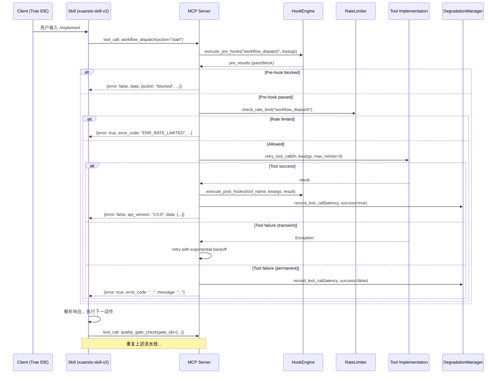
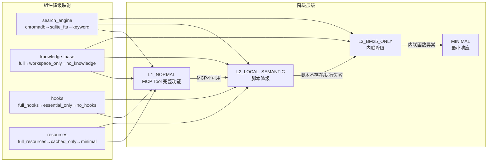
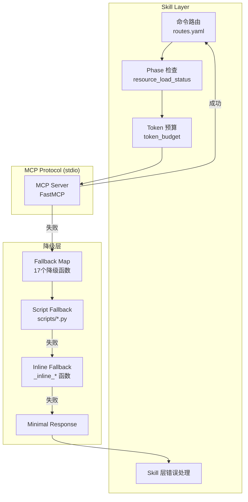
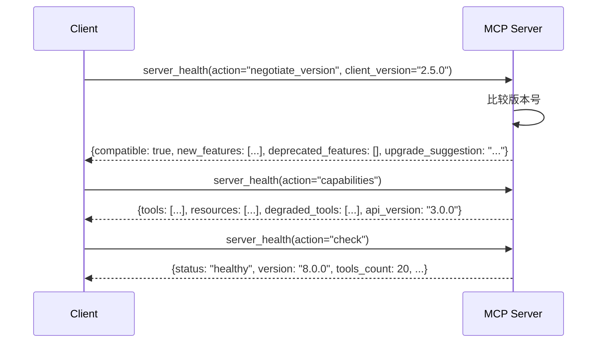
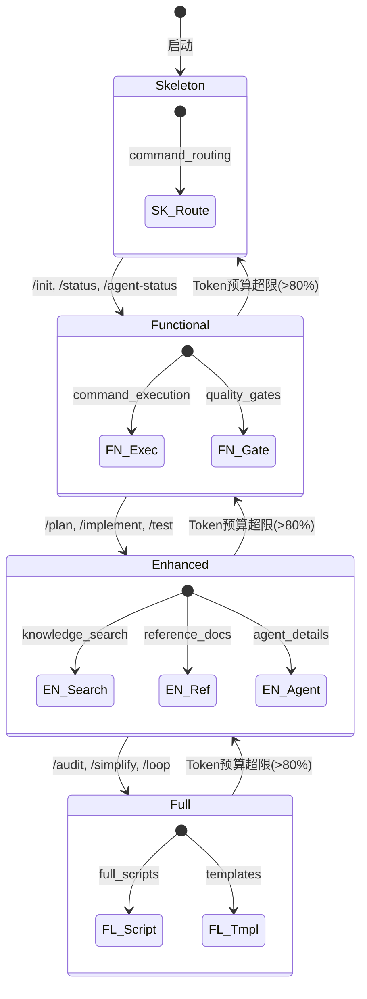
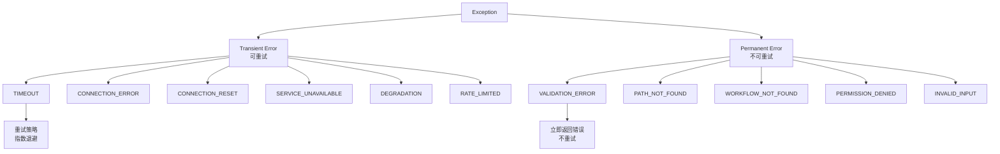

# Xuansto Skill MCP Server API 规范文档 v8.0.0

> 基于源码事实自动生成 | 最后更新: 2026-05-23
> 源码版本: xuansto-mcp-server v8.0.0 | MCP API Version: 3.0.0 | Min Supported: 2.0.0

---

## 目录

1. [架构概览](#1-架构概览)
2. [API 调用清单](#2-api-调用清单)
3. [接口依赖拓扑图](#3-接口依赖拓扑图)
4. [重构后的 API 设计](#4-重构后的-api-设计)
5. [接口契约](#5-接口契约)
6. [异常处理、重试与降级方案](#6-异常处理重试与降级方案)

---

## 1. 架构概览

### 1.1 传输协议

| 属性 | 值 |
|------|-----|
| 协议 | MCP (Model Context Protocol) |
| 传输层 | stdio |
| 服务名 | `xuansto-mcp-server` |
| API 版本 | `3.0.0` |
| 最低兼容版本 | `2.0.0` |
| 注册工具数 | 20 |
| 注册资源数 | 8 |

### 1.2 请求处理流水线

```
Client Request
    │
    ▼
┌──────────────────────────┐
│  Pre-Hook 拦截           │  ← HookEngine.execute_pre_hooks()
│  (安全Hook失败→默认阻断)  │
└──────────┬───────────────┘
           │ block? → 返回 blocked 响应
           ▼ pass
┌──────────────────────────┐
│  速率限制检查             │  ← TokenBucket.consume()
│  (令牌桶: 60 tokens/1rps) │
└──────────┬───────────────┘
           │ limited? → 返回 ERR_RATE_LIMITED
           ▼ allowed
┌──────────────────────────┐
│  重试执行 (transient)     │  ← retry_tool_call()
│  max_retries=3           │    指数退避: base_delay * 2^attempt
│  仅重试瞬态错误           │
└──────────┬───────────────┘
           │
           ▼
┌──────────────────────────┐
│  Post-Hook 拦截          │  ← HookEngine.execute_post_hooks()
│  (错误收集，不阻断)       │
└──────────┬───────────────┘
           │
           ▼
      Client Response
```

### 1.3 降级链路

```
MCP Tool (主路径)
    │ 失败
    ▼
Script Fallback (脚本降级)
    │ 失败
    ▼
Inline Fallback (内联降级)
    │ 失败
    ▼
Minimal Response (最小响应)
```

---

## 2. API 调用清单

### 2.1 MCP Tools（20 个工具）

#### 2.1.1 skill_analyze — 技能项目结构分析

| 属性 | 值 |
|------|-----|
| 只读 | 是 |
| 幂等 | 是 |
| 破坏性 | 否 |
| 降级脚本 | `scripts/skill-test.py --analyze` |

**请求参数 JSON Schema:**

```json
{
  "type": "object",
  "properties": {
    "skill_path": { "type": "string", "description": "技能根目录路径" },
    "include_scripts": { "type": "boolean", "default": true, "description": "是否分析scripts目录" },
    "include_agents": { "type": "boolean", "default": true, "description": "是否分析agents目录" },
    "depth": { "type": "string", "enum": ["basic", "full"], "default": "basic", "description": "分析深度" }
  },
  "required": ["skill_path"],
  "additionalProperties": false
}
```

**响应 JSON Schema:**

```json
{
  "type": "object",
  "properties": {
    "error": { "type": "boolean" },
    "api_version": { "type": "string" },
    "data": {
      "type": "object",
      "properties": {
        "metadata": {
          "type": "object",
          "properties": {
            "name": { "type": "string" },
            "version": { "type": "string" },
            "agents_summary": { "type": "string" },
            "tags": { "type": "array", "items": { "type": "string" } }
          }
        },
        "structure": {
          "type": "object",
          "properties": {
            "root": { "type": "string" },
            "directories": { "type": "array", "items": { "type": "string" } },
            "file_count": { "type": "integer" },
            "total_lines": { "type": "integer" }
          }
        },
        "agents": {
          "type": "object",
          "properties": {
            "total": { "type": "integer" },
            "layers": { "type": "integer" },
            "by_layer": { "type": "object", "additionalProperties": { "type": "integer" } }
          }
        },
        "dependencies": {
          "type": "object",
          "properties": {
            "mcp_server": { "type": "string" },
            "scripts": { "type": "array", "items": { "type": "string" } },
            "python_version": { "type": "string" }
          }
        },
        "issues": {
          "type": "array",
          "items": {
            "type": "object",
            "properties": {
              "severity": { "type": "string", "enum": ["WARN", "ERROR"] },
              "code": { "type": "string" },
              "message": { "type": "string" },
              "path": { "type": "string" }
            }
          }
        }
      }
    }
  }
}
```

---

#### 2.1.2 knowledge_search — 三层知识库混合检索

| 属性 | 值 |
|------|-----|
| 只读 | 是 |
| 幂等 | 是 |
| 破坏性 | 否 |
| 降级链 | ChromaDB → SQLite FTS5 → keyword_fallback |

**请求参数 JSON Schema:**

```json
{
  "type": "object",
  "properties": {
    "action": { "type": "string", "enum": ["retrieve"], "description": "操作类型" },
    "query": { "type": ["string", "null"], "description": "搜索查询文本" },
    "top_k": { "type": "integer", "minimum": 1, "maximum": 50, "default": 5, "description": "返回结果数量上限" },
    "search_type": { "type": "string", "enum": ["hybrid", "semantic_only", "keyword_only"], "default": "hybrid", "description": "搜索策略" },
    "scope": { "type": ["string", "null"], "enum": ["general", "workspace", "experience", null], "description": "限定搜索范围" },
    "min_confidence": { "type": "number", "minimum": 0.0, "maximum": 1.0, "default": 0.0, "description": "最低置信度阈值" }
  },
  "required": ["action"],
  "additionalProperties": false
}
```

**响应 JSON Schema:**

```json
{
  "type": "object",
  "properties": {
    "error": { "type": "boolean" },
    "api_version": { "type": "string" },
    "data": {
      "type": "object",
      "properties": {
        "results": {
          "type": "array",
          "items": {
            "type": "object",
            "properties": {
              "id": { "type": "string" },
              "content": { "type": "string" },
              "source": { "type": "string" },
              "confidence": { "type": "number" },
              "metadata": {
                "type": "object",
                "properties": {
                  "category": { "type": "string" },
                  "tags": { "type": "array", "items": { "type": "string" } },
                  "created_at": { "type": "string" }
                }
              }
            }
          }
        },
        "total_matches": { "type": "integer" },
        "search_type_used": { "type": "string" },
        "degraded": { "type": "boolean" }
      }
    }
  }
}
```

---

#### 2.1.3 knowledge_inject — 知识注入与经验沉淀

| 属性 | 值 |
|------|-----|
| 只读 | 否 |
| 幂等 | 否 |
| 破坏性 | 否 |
| 降级脚本 | `scripts/knowledge-server.py --inject` |

**请求参数 JSON Schema:**

```json
{
  "type": "object",
  "properties": {
    "action": { "type": "string", "enum": ["inject", "list_available", "precipitate", "add", "update"], "description": "操作类型" },
    "topics": { "type": ["array", "null"], "items": { "type": "string" }, "description": "知识主题列表(inject时使用)" },
    "scope": { "type": "string", "enum": ["general", "workspace", "experience"], "default": "general", "description": "知识范围" },
    "max_tokens": { "type": "integer", "minimum": 100, "maximum": 50000, "default": 5000, "description": "最大注入Token数量" },
    "relevance_threshold": { "type": "number", "minimum": 0.0, "maximum": 1.0, "default": 0.5, "description": "相关性阈值" },
    "category": { "type": ["string", "null"], "description": "经验分类(precipitate时使用)" },
    "title": { "type": ["string", "null"], "description": "经验标题(precipitate/add/update时使用)" },
    "content": { "type": ["string", "null"], "description": "经验内容(precipitate/add/update时使用)" },
    "tags": { "type": ["array", "null"], "items": { "type": "string" }, "description": "标签列表" },
    "confidence": { "type": "number", "minimum": 0.0, "maximum": 1.0, "default": 0.8, "description": "置信度" },
    "entry_id": { "type": ["string", "null"], "description": "知识条目ID(update时使用)" }
  },
  "required": ["action"],
  "additionalProperties": false
}
```

---

#### 2.1.4 quality_gate_check — 54项质量门禁检查

| 属性 | 值 |
|------|-----|
| 只读 | 是 |
| 幂等 | 是 |
| 破坏性 | 否 |
| 降级脚本 | `scripts/skill-test.py --gate` |

**请求参数 JSON Schema:**

```json
{
  "type": "object",
  "properties": {
    "gate_ids": { "type": ["array", "null"], "items": { "type": "string" }, "description": "要检查的门禁ID列表" },
    "phase": { "type": ["string", "null"], "description": "按阶段过滤门禁(0-8)" },
    "project_path": { "type": "string", "default": ".", "description": "项目根目录路径" },
    "severity_filter": { "type": "string", "enum": ["all", "BLOCK", "WARN"], "default": "all", "description": "严重级别过滤" },
    "force_refresh": { "type": "boolean", "default": false, "description": "强制刷新缓存" }
  },
  "additionalProperties": false
}
```

**响应 JSON Schema:**

```json
{
  "type": "object",
  "properties": {
    "error": { "type": "boolean" },
    "api_version": { "type": "string" },
    "data": {
      "type": "object",
      "properties": {
        "gates_checked": { "type": "integer" },
        "gates_passed": { "type": "integer" },
        "gates_failed": { "type": "integer" },
        "results": {
          "type": "array",
          "items": {
            "type": "object",
            "properties": {
              "gate_id": { "type": "string" },
              "status": { "type": "string", "enum": ["PASS", "FAIL", "SKIP"] },
              "severity": { "type": "string", "enum": ["BLOCK", "WARN"] },
              "message": { "type": "string" },
              "details": { "type": "object" }
            }
          }
        },
        "phase": { "type": "string" },
        "can_proceed": { "type": "boolean" }
      }
    }
  }
}
```

---

#### 2.1.5 spec_drift_detect — 规格偏差检测

| 属性 | 值 |
|------|-----|
| 只读 | 是 |
| 幂等 | 是 |
| 破坏性 | 否 |
| 降级脚本 | `scripts/spec-drift-detector.py` |

**请求参数 JSON Schema:**

```json
{
  "type": "object",
  "properties": {
    "spec_dir": { "type": "string", "default": ".trae/specs", "description": "规格文档目录" },
    "src_dir": { "type": "string", "default": ".", "description": "源代码目录" }
  },
  "additionalProperties": false
}
```

---

#### 2.1.6 security_scan — OWASP Agentic Top 10 + 依赖漏洞扫描

| 属性 | 值 |
|------|-----|
| 只读 | 是 |
| 幂等 | 是 |
| 破坏性 | 否 |
| 降级脚本 | `scripts/agentic-security-scanner.py` |

**请求参数 JSON Schema:**

```json
{
  "type": "object",
  "properties": {
    "target": { "type": "string", "default": ".", "description": "目标扫描目录" },
    "severity_threshold": { "type": "string", "enum": ["critical", "high", "medium", "low"], "default": "medium", "description": "最低报告严重级别" },
    "include_agentic": { "type": "boolean", "default": true, "description": "是否包含OWASP Agentic Top 10检查" },
    "include_dependency": { "type": "boolean", "default": true, "description": "是否包含依赖漏洞扫描" }
  },
  "additionalProperties": false
}
```

---

#### 2.1.7 code_simplify — 代码简化分析

| 属性 | 值 |
|------|-----|
| 只读 | 是 |
| 幂等 | 是 |
| 破坏性 | 否 |
| 降级脚本 | `scripts/code-simplifier.py` |

**请求参数 JSON Schema:**

```json
{
  "type": "object",
  "properties": {
    "target": { "type": "string", "description": "目标文件或目录路径" },
    "scope": { "type": "string", "enum": ["file", "dir", "recent"], "default": "recent", "description": "扫描范围" },
    "include_dedup": { "type": "boolean", "default": true, "description": "是否包含重复代码检测" }
  },
  "required": ["target"],
  "additionalProperties": false
}
```

---

#### 2.1.8 session_manage — 会话状态管理

| 属性 | 值 |
|------|-----|
| 只读 | 否 |
| 幂等 | 否 |
| 破坏性 | 否 |
| 降级脚本 | `scripts/init-session.py` / `scripts/session-catchup.py` / `scripts/session-persist.py` |

**请求参数 JSON Schema:**

```json
{
  "type": "object",
  "properties": {
    "action": { "type": "string", "enum": ["save", "load", "list", "detect", "verify", "track", "restore"], "description": "操作类型" },
    "completed_tasks": { "type": ["array", "null"], "items": { "type": "string" }, "description": "已完成任务列表" },
    "pending_tasks": { "type": ["array", "null"], "items": { "type": "string" }, "description": "未完成任务列表" },
    "decisions": { "type": ["array", "null"], "items": { "type": "string" }, "description": "关键决策列表" },
    "experience": { "type": ["array", "null"], "items": { "type": "string" }, "description": "经验沉淀列表" },
    "error_log": { "type": ["array", "null"], "items": { "type": "string" }, "description": "错误日志" },
    "pattern_path": { "type": ["string", "null"], "description": "模式文件路径" },
    "success": { "type": "boolean", "default": true, "description": "验证是否成功" },
    "current_phase": { "type": ["integer", "null"], "description": "当前阶段编号" },
    "current_task": { "type": ["string", "null"], "description": "当前任务描述" }
  },
  "required": ["action"],
  "additionalProperties": false
}
```

---

#### 2.1.9 workflow_dispatch — 工作流调度

| 属性 | 值 |
|------|-----|
| 只读 | 否 |
| 幂等 | 否 |
| 破坏性 | 否 |
| 降级脚本 | `scripts/project-initializer.py` (start) / 内联Phase推进 |

**请求参数 JSON Schema:**

```json
{
  "type": "object",
  "properties": {
    "action": { "type": "string", "enum": ["start", "status", "abort", "phase", "recover", "snapshots"], "description": "操作类型" },
    "workflow": { "type": ["string", "null"], "description": "工作流名称(start时使用)" },
    "project_path": { "type": "string", "default": ".", "description": "项目根目录路径" },
    "workflow_id": { "type": ["string", "null"], "description": "工作流实例ID" },
    "phase_action": { "type": ["string", "null"], "enum": ["advance", "current", null], "description": "阶段操作" },
    "snapshot_phase": { "type": ["integer", "null"], "description": "恢复到指定阶段的快照" }
  },
  "required": ["action"],
  "additionalProperties": false
}
```

---

#### 2.1.10 agent_status — Agent 状态查询

| 属性 | 值 |
|------|-----|
| 只读 | 是 |
| 幂等 | 是 |
| 破坏性 | 否 |
| 降级 | 静态注册表查询 / `scripts/skill-test.py --agents` |

**请求参数 JSON Schema:**

```json
{
  "type": "object",
  "properties": {
    "action": { "type": "string", "enum": ["list", "by_phase", "detail", "match", "merge"], "description": "操作类型" },
    "phase": { "type": ["integer", "null"], "minimum": 0, "maximum": 8, "description": "按阶段查询(0-8)" },
    "agent_name": { "type": ["string", "null"], "description": "Agent名称" },
    "capabilities": { "type": ["array", "null"], "items": { "type": "string" }, "description": "Agent能力列表" },
    "project_file_count": { "type": ["integer", "null"], "minimum": 0, "description": "项目文件数量(merge时使用)" }
  },
  "required": ["action"],
  "additionalProperties": false
}
```

---

#### 2.1.11 agent_manage — Agent 实例生命周期管理

| 属性 | 值 |
|------|-----|
| 只读 | 否 |
| 幂等 | 否 |
| 破坏性 | 是(destroy操作) |
| 降级 | 静态注册表查询 |

**请求参数 JSON Schema:**

```json
{
  "type": "object",
  "properties": {
    "action": { "type": "string", "enum": ["create", "assign", "release", "instance_status", "destroy", "schedule"], "description": "操作类型" },
    "agent_type": { "type": ["string", "null"], "description": "Agent类型(create时使用)" },
    "capabilities": { "type": ["array", "null"], "items": { "type": "string" }, "description": "Agent能力列表" },
    "agent_id": { "type": ["string", "null"], "description": "Agent实例ID" },
    "task": { "type": ["string", "null"], "description": "分配的任务描述(assign时使用)" }
  },
  "required": ["action"],
  "additionalProperties": false
}
```

---

#### 2.1.12 hook_manage — Hook 管理

| 属性 | 值 |
|------|-----|
| 只读 | 否(execute操作) |
| 幂等 | 是 |
| 破坏性 | 否 |
| 降级脚本 | `scripts/check-encoding.py` / `scripts/token-budget-guard.py` / `scripts/session-persist.py` |

**请求参数 JSON Schema:**

```json
{
  "type": "object",
  "properties": {
    "action": { "type": "string", "enum": ["list", "execute"], "description": "操作类型" },
    "profile": { "type": "string", "enum": ["minimal", "standard", "strict"], "default": "standard", "description": "Hook配置级别" },
    "hook_name": { "type": ["string", "null"], "description": "Hook名称(execute时使用)" },
    "context": { "type": ["object", "null"], "additionalProperties": {}, "description": "执行上下文" }
  },
  "required": ["action"],
  "additionalProperties": false
}
```

---

#### 2.1.13 resource_load_status — 渐进式加载状态管理

| 属性 | 值 |
|------|-----|
| 只读 | 是(preload除外) |
| 幂等 | 是 |
| 破坏性 | 否 |
| 降级 | 内联状态检查(读取文件系统) |

**请求参数 JSON Schema:**

```json
{
  "type": "object",
  "properties": {
    "action": {
      "type": "string",
      "enum": ["status", "preload", "cache", "clear_cache", "loading_progress", "token_report", "disclosure_transition"],
      "description": "操作类型"
    },
    "phase": { "type": ["integer", "null"], "minimum": 0, "maximum": 3, "description": "目标加载阶段(0-3)" },
    "resource_ids": { "type": ["array", "null"], "items": { "type": "string" }, "description": "指定资源ID列表" },
    "resource_uris": { "type": ["array", "null"], "items": { "type": "string" }, "description": "资源URI列表(preload时使用)" },
    "priority": { "type": "string", "enum": ["critical", "normal", "background"], "default": "normal", "description": "预加载优先级" },
    "batch_mode": { "type": "boolean", "default": false, "description": "是否批量预加载模式" },
    "auto_upgrade": { "type": "boolean", "default": false, "description": "自动升级阶段(Token预算超限时)" },
    "target_phase": { "type": ["string", "null"], "description": "目标阶段名称(disclosure_transition时使用): skeleton/functional/enhanced/full" }
  },
  "required": ["action"],
  "additionalProperties": false
}
```

**渐进式加载阶段映射:**

| Phase | 名称 | Token预算 | 可用功能 |
|-------|------|-----------|----------|
| 0 | skeleton | 2,000 | command_routing |
| 1 | functional | 5,000 | +command_execution, quality_gates |
| 2 | enhanced | 10,000 | +knowledge_search, reference_docs, agent_details |
| 3 | full | 20,000 | +full_scripts (全部功能) |

**DisclosureTransition Schema:**

```json
{
  "type": "object",
  "properties": {
    "from_phase": { "type": "string", "description": "源阶段名称" },
    "to_phase": { "type": "string", "description": "目标阶段名称" },
    "started_at": { "type": ["string", "null"], "description": "转换开始时间(ISO8601)" },
    "completed_at": { "type": ["string", "null"], "description": "转换完成时间(ISO8601)" },
    "resources_affected": { "type": "array", "items": { "type": "string" }, "description": "受影响的资源ID列表" },
    "status": { "type": "string", "enum": ["pending", "in_progress", "completed", "failed"], "description": "转换状态" },
    "current_phase": { "type": "string", "description": "当前阶段名称" },
    "target_phase": { "type": "string", "description": "目标阶段名称(状态机)" },
    "required_resources": { "type": "array", "items": { "type": "string" }, "description": "转换所需资源列表" },
    "estimated_tokens": { "type": "integer", "description": "估算Token数量" },
    "available_alternatives": { "type": "array", "items": { "type": "string" }, "description": "可用替代阶段列表" },
    "transition_hint": { "type": "string", "description": "转换提示信息" }
  },
  "additionalProperties": false
}
```

---

#### 2.1.14 context_compress — 上下文压缩

| 属性 | 值 |
|------|-----|
| 只读 | 是 |
| 幂等 | 是 |
| 破坏性 | 否 |
| 降级脚本 | `scripts/context-compressor.py` |

**请求参数 JSON Schema:**

```json
{
  "type": "object",
  "properties": {
    "content": { "type": "string", "description": "待压缩的文本内容" },
    "strategy": { "type": "string", "enum": ["semantic", "selective", "lossless"], "default": "semantic", "description": "压缩策略" },
    "target_tokens": { "type": "integer", "minimum": 100, "maximum": 50000, "default": 2000, "description": "目标Token数量" },
    "preserve_sections": { "type": ["array", "null"], "items": { "type": "string" }, "description": "必须保留的章节标题列表" }
  },
  "required": ["content"],
  "additionalProperties": false
}
```

---

#### 2.1.15 server_health — 服务器健康检查与版本协商

| 属性 | 值 |
|------|-----|
| 只读 | 是 |
| 幂等 | 是 |
| 破坏性 | 否 |
| 降级脚本 | `scripts/health-checker.py` |

**请求参数 JSON Schema:**

```json
{
  "type": "object",
  "properties": {
    "action": { "type": "string", "enum": ["check", "negotiate_version", "capabilities"], "description": "操作类型" },
    "client_version": { "type": ["string", "null"], "description": "客户端API版本(negotiate_version时使用)" }
  },
  "required": ["action"],
  "additionalProperties": false
}
```

**check 响应 JSON Schema:**

```json
{
  "type": "object",
  "properties": {
    "error": { "type": "boolean" },
    "api_version": { "type": "string" },
    "data": {
      "type": "object",
      "properties": {
        "status": { "type": "string", "enum": ["healthy", "degraded", "unhealthy"] },
        "version": { "type": "string" },
        "api_version": { "type": "string" },
        "api_changelog": { "type": "object", "additionalProperties": { "type": "array", "items": { "type": "string" } } },
        "uptime_seconds": { "type": "number" },
        "tools_count": { "type": "integer" },
        "resources_count": { "type": "integer" },
        "active_workflows": { "type": "integer" },
        "degradation_stats": { "type": "object", "additionalProperties": { "type": "integer" } },
        "performance_metrics": {
          "type": "object",
          "additionalProperties": {
            "type": "object",
            "properties": {
              "call_count": { "type": "integer" },
              "error_count": { "type": "integer" },
              "error_rate": { "type": "number" },
              "latency_p50_ms": { "type": "number" },
              "latency_p95_ms": { "type": "number" },
              "latency_p99_ms": { "type": "number" }
            }
          }
        },
        "services": {
          "type": "object",
          "properties": {
            "chromadb": {
              "type": "object",
              "properties": {
                "available": { "type": "boolean" },
                "latency_ms": { "type": "number" },
                "reason": { "type": ["string", "null"] }
              }
            }
          }
        },
        "config": {
          "type": "object",
          "properties": {
            "data_dir": { "type": "string" },
            "skill_root": { "type": "string" },
            "work_dir": { "type": "string" },
            "data_dir_exists": { "type": "boolean" },
            "skill_root_exists": { "type": "boolean" }
          }
        },
        "path_warnings": {
          "type": "array",
          "items": {
            "type": "object",
            "properties": {
              "path": { "type": "string" },
              "exists": { "type": "boolean" },
              "type": { "type": "string" }
            }
          }
        }
      }
    }
  }
}
```

**negotiate_version 响应 JSON Schema:**

```json
{
  "type": "object",
  "properties": {
    "error": { "type": "boolean" },
    "api_version": { "type": "string" },
    "data": {
      "type": "object",
      "properties": {
        "server_version": { "type": "string" },
        "client_version": { "type": "string" },
        "min_supported_version": { "type": "string" },
        "compatible": { "type": "boolean" },
        "deprecated_features": { "type": "array", "items": { "type": "string" } },
        "new_features": { "type": "array", "items": { "type": "string" } },
        "upgrade_suggestion": { "type": "string" }
      }
    }
  }
}
```

---

#### 2.1.16 decision_log — 决策日志管理

| 属性 | 值 |
|------|-----|
| 只读 | 否(log/update操作) |
| 幂等 | 否 |
| 破坏性 | 否 |
| 降级脚本 | `scripts/decision-log.py` |

**请求参数 JSON Schema:**

```json
{
  "type": "object",
  "properties": {
    "action": { "type": "string", "enum": ["log", "list", "query", "update", "export", "stats"], "description": "操作类型" },
    "title": { "type": ["string", "null"], "description": "决策标题(log时使用)" },
    "description": { "type": ["string", "null"], "description": "决策描述" },
    "context": { "type": ["string", "null"], "description": "决策上下文" },
    "alternatives": { "type": ["array", "null"], "items": { "type": "string" }, "description": "备选方案列表" },
    "decision": { "type": ["string", "null"], "description": "最终决策" },
    "rationale": { "type": ["string", "null"], "description": "决策理由" },
    "impact": { "type": ["string", "null"], "description": "影响范围" },
    "decided_by": { "type": ["string", "null"], "description": "决策者" },
    "keyword": { "type": ["string", "null"], "description": "搜索关键词(query时使用)" },
    "tag": { "type": ["string", "null"], "description": "标签过滤" },
    "date_from": { "type": ["string", "null"], "description": "起始日期(ISO8601)" },
    "date_to": { "type": ["string", "null"], "description": "截止日期(ISO8601)" },
    "limit": { "type": "integer", "minimum": 1, "maximum": 100, "default": 20, "description": "返回数量上限" },
    "offset": { "type": "integer", "minimum": 0, "maximum": 10000, "default": 0, "description": "偏移量" },
    "format": { "type": "string", "enum": ["json", "markdown"], "default": "json", "description": "导出格式" },
    "decision_id": { "type": ["string", "null"], "description": "决策ID(update时使用)" },
    "status": { "type": ["string", "null"], "enum": ["proposed", "accepted", "deprecated", "superseded", null], "description": "决策状态" }
  },
  "required": ["action"],
  "additionalProperties": false
}
```

---

#### 2.1.17 token_budget — Token 预算管理

| 属性 | 值 |
|------|-----|
| 只读 | 否(set_budget操作) |
| 幂等 | 是 |
| 破坏性 | 否 |
| 降级脚本 | `scripts/token-budget-guard.py` |

**请求参数 JSON Schema:**

```json
{
  "type": "object",
  "properties": {
    "action": { "type": "string", "enum": ["status", "set_budget", "recommend", "report"], "description": "操作类型" },
    "total_budget": { "type": ["integer", "null"], "minimum": 1000, "description": "总Token预算" },
    "phase_allocations": { "type": ["object", "null"], "additionalProperties": { "type": "integer" }, "description": "阶段分配" },
    "project_size": { "type": ["string", "null"], "enum": ["small", "medium", "large", null], "description": "项目规模" },
    "complexity": { "type": ["string", "null"], "enum": ["low", "medium", "high", null], "description": "复杂度" },
    "team_size": { "type": ["integer", "null"], "minimum": 1, "maximum": 50, "description": "团队人数" },
    "period": { "type": "string", "enum": ["daily", "weekly", "session"], "default": "session", "description": "报告周期" }
  },
  "required": ["action"],
  "additionalProperties": false
}
```

---

#### 2.1.18 project_init — 项目初始化管理

| 属性 | 值 |
|------|-----|
| 只读 | 否(create操作) |
| 幂等 | 否 |
| 破坏性 | 否 |
| 降级脚本 | `scripts/project-initializer.py` |

**请求参数 JSON Schema:**

```json
{
  "type": "object",
  "properties": {
    "action": { "type": "string", "enum": ["create", "validate", "detect_stack"], "description": "操作类型" },
    "name": { "type": ["string", "null"], "description": "项目名称(create时使用)" },
    "description": { "type": ["string", "null"], "description": "项目描述" },
    "stack": { "type": ["array", "null"], "items": { "type": "string" }, "description": "技术栈列表" },
    "template": { "type": ["string", "null"], "description": "项目模板" },
    "directory": { "type": ["string", "null"], "description": "项目目录" },
    "project_path": { "type": ["string", "null"], "description": "项目路径(validate/detect_stack时使用)" }
  },
  "required": ["action"],
  "additionalProperties": false
}
```

---

#### 2.1.19 metrics_report — 指标报告

| 属性 | 值 |
|------|-----|
| 只读 | 是 |
| 幂等 | 是 |
| 破坏性 | 否 |
| 降级 | 内联指标读取(从tool_metrics.json) |

**请求参数 JSON Schema:**

```json
{
  "type": "object",
  "properties": {
    "action": { "type": "string", "enum": ["query", "summary"], "description": "操作类型" },
    "tool_name": { "type": ["string", "null"], "description": "工具名称(query时使用)" },
    "time_range": { "type": "string", "enum": ["1h", "6h", "24h", "7d", "all"], "default": "all", "description": "时间范围" },
    "metric_type": { "type": "string", "enum": ["calls", "errors", "latency", "all"], "default": "all", "description": "指标类型" }
  },
  "required": ["action"],
  "additionalProperties": false
}
```

---

#### 2.1.20 config_manage — 配置管理

| 属性 | 值 |
|------|-----|
| 只读 | 否(reload操作) |
| 幂等 | 是 |
| 破坏性 | 否 |
| 降级 | 无(直接操作内存配置) |

**请求参数 JSON Schema:**

```json
{
  "type": "object",
  "properties": {
    "action": { "type": "string", "enum": ["reload", "status", "validate"], "description": "操作类型" }
  },
  "required": ["action"],
  "additionalProperties": false
}
```

---

### 2.2 MCP Resources（8 个资源）

Resources 为只读快照，用于检查服务器当前状态。修改状态应使用 Tools。

| URI | 类型 | 描述 | 参数 |
|-----|------|------|------|
| `xuansto://config/skill` | 静态 | 技能配置文件(.skill-config.yaml) | 无 |
| `xuansto://references/quality-gates` | 静态 | 质量门禁参考文档 | 无 |
| `xuansto://references/agent-registry` | 静态 | Agent注册表 | 无 |
| `xuansto://references/workflow-phases` | 静态 | 工作流阶段定义 | 无 |
| `xuansto://templates/{name}` | 模板 | 项目模板内容 | name: 模板名 |
| `xuansto://sessions/latest` | 静态 | 最近会话记录 | 无 |
| `xuansto://sessions/{session_id}` | 模板 | 指定会话记录 | session_id: 会话ID |
| `xuansto://agents/{layer}/{name}` | 模板 | Agent定义文件 | layer: 层级, name: Agent名 |
| `xuansto://loading/status` | 静态 | 渐进式加载状态 | 无 |
| `xuansto://metrics/summary` | 静态 | 指标汇总 | 无 |
| `xuansto://degradation/status` | 静态 | 降级状态 | 无 |

> 注: `xuansto://loading/status`、`xuansto://metrics/summary`、`xuansto://degradation/status` 返回 JSON 字符串，其余返回 Markdown 文本。所有资源在不可用时返回降级 JSON。

---

### 2.3 CLI 接口（xuansto-cli）

| 命令 | 子命令 | 参数 | 映射 MCP Tool |
|------|--------|------|---------------|
| `health` | — | — | server_health(action="check") |
| `invoke` | — | tool, --params | 直接调用 Tool |
| `gate` | — | gate_id, --project-path | quality_gate_check |
| `version` | — | — | 读取 __version__ |
| `config` | — | — | 读取 DATA_DIR/SKILL_ROOT/WORK_DIR |
| `reload` | — | — | config_manage(action="reload") |
| `workflow` | start | workflow_name | workflow_dispatch(action="start") |
| `workflow` | status | --workflow-id | workflow_dispatch(action="status") |
| `workflow` | recover | --workflow-id, --phase | workflow_dispatch(action="recover") |
| `workflow` | snapshots | --workflow-id | workflow_dispatch(action="snapshots") |
| `session` | save | --label | session_manage(action="track") |
| `session` | load | --session-id | session_manage(action="restore") |
| `session` | list | — | session_manage(action="list") |
| `agent` | list | — | agent_status(action="list") |
| `agent` | create | --type, --capabilities | agent_status(action="create") |
| `agent` | match | --capabilities | agent_status(action="match") |

---

### 2.4 命令路由（Skill ↔ MCP Tool 映射）

基于 `routes.yaml` 的命令路由，按优先级匹配: 精确匹配 > 语义匹配 > 更具体命令优先 > 默认/sprint兜底。

| 命令 | 意图 | Phase | 使用的 MCP Tools |
|------|------|-------|-------------------|
| `/init` | 从零开始新项目 | 0 | skill_analyze, knowledge_search, workflow_dispatch, project_init, decision_log |
| `/brainstorm` | 头脑风暴 | 1 | knowledge_search, workflow_dispatch |
| `/clarify` | 澄清需求 | 1 | knowledge_search, workflow_dispatch, quality_gate_check |
| `/plan` | 规划架构 | 2 | skill_analyze, knowledge_search, agent_status, workflow_dispatch, decision_log, token_budget |
| `/spec` | 写规格文档 | 2 | workflow_dispatch, quality_gate_check, spec_drift_detect |
| `/design` | 设计 | 2 | quality_gate_check, knowledge_search, workflow_dispatch |
| `/implement` | 写代码 | 4 | workflow_dispatch, quality_gate_check, hook_manage |
| `/test` | 跑测试 | 5 | quality_gate_check, workflow_dispatch |
| `/review` | 代码审查 | 5 | quality_gate_check, security_scan, code_simplify |
| `/audit` | 安全审计 | 5 | security_scan, quality_gate_check, spec_drift_detect |
| `/simplify` | 代码简化 | 7 | code_simplify, quality_gate_check, context_compress |
| `/refactor` | 代码重构 | 7 | code_simplify, quality_gate_check, context_compress |
| `/accept` | 验收确认 | 6 | quality_gate_check, workflow_dispatch |
| `/deploy` | 部署交付 | 8 | quality_gate_check, server_health, workflow_dispatch |
| `/build` | 构建项目 | 8 | skill_analyze, quality_gate_check, server_health |
| `/fix` | 修复Bug | 4 | session_manage, quality_gate_check, hook_manage |
| `/loop` | 自主循环 | — | workflow_dispatch, session_manage, resource_load_status, token_budget, decision_log |
| `/sprint` | 冲刺 | 0 | workflow_dispatch, session_manage, resource_load_status, token_budget, project_init |
| `/learn` | 知识学习 | — | knowledge_search, knowledge_inject, session_manage |
| `/status` | 查询进度 | — | workflow_dispatch, session_manage, server_health |

---

## 3. 接口依赖拓扑图

### 3.1 核心模块依赖

```mermaid
graph TB
    subgraph "MCP Server (FastMCP)"
        SERVER[server.py<br/>FastMCP 实例]
    end

    subgraph "请求处理流水线"
        HE[HookEngine<br/>hook_engine.py]
        RL[RateLimiter<br/>rate_limiter.py]
        RT[RetryEngine<br/>errors.py:retry_tool_call]
        DM[DegradationManager<br/>degradation.py]
    end

    subgraph "20 MCP Tools"
        T1[skill_analyze]
        T2[knowledge_search]
        T3[knowledge_inject]
        T4[quality_gate_check]
        T5[spec_drift_detect]
        T6[security_scan]
        T7[code_simplify]
        T8[session_manage]
        T9[workflow_dispatch]
        T10[agent_status]
        T11[agent_manage]
        T12[hook_manage]
        T13[resource_load_status]
        T14[context_compress]
        T15[server_health]
        T16[decision_log]
        T17[token_budget]
        T18[project_init]
        T19[metrics_report]
        T20[config_manage]
    end

    subgraph "8 MCP Resources"
        R1[xuansto://config/skill]
        R2[xuansto://references/*]
        R3[xuansto://templates/*]
        R4[xuansto://sessions/*]
        R5[xuansto://agents/*]
        R6[xuansto://loading/status]
        R7[xuansto://metrics/summary]
        R8[xuansto://degradation/status]
    end

    subgraph "基础设施"
        CFG[config.py<br/>配置管理+热重载]
        VAL[validator.py<br/>路径安全+输入校验]
        ERR[errors.py<br/>错误码+响应构建]
        LOG[logging_config.py]
        DB[database.py]
        NOTIFY[notifications.py]
        CACHE[cache.py<br/>LRUCache]
        AW[atomic_write.py]
    end

    SERVER --> HE
    SERVER --> RL
    SERVER --> RT
    SERVER --> DM

    HE --> T12
    RL --> SERVER
    RT --> ERR

    T1 --> VAL
    T2 --> DM
    T3 --> DM
    T4 --> VAL
    T5 --> VAL
    T6 --> VAL
    T7 --> VAL
    T8 --> DB
    T9 --> DB
    T10 --> VAL
    T11 --> DB
    T13 --> CACHE
    T13 --> AW
    T15 --> DM
    T15 --> RL
    T16 --> DB
    T17 --> CFG
    T18 --> VAL
    T19 --> T15
    T20 --> CFG

    R1 --> CFG
    R2 --> CFG
    R3 --> VAL
    R4 --> CFG
    R5 --> CFG
    R6 --> T13
    R7 --> T15
    R8 --> DM

    DM --> NOTIFY
    T13 --> NOTIFY
```



### 3.2 Skill ↔ MCP Tool 调用协议



### 3.3 降级链路拓扑



---

## 4. 重构后的 API 设计

### 4.1 Skill ↔ MCP Tool 调用协议

Skill 层通过 MCP Protocol (stdio) 与 MCP Server 交互。调用协议遵循以下规则:

1. **命令路由**: Skill 根据用户意图匹配 `routes.yaml` 中的命令，确定需要调用的 MCP Tools 序列
2. **渐进式加载**: 调用前检查 `resource_load_status` 确认当前 Phase 是否支持所需功能
3. **Token 预算**: 长操作前调用 `token_budget(action="status")` 确认预算充足
4. **错误恢复**: 工具调用失败时，Skill 层可选择降级脚本或内联逻辑



### 4.2 MCP Server 外部接口

MCP Server 对外暴露两类接口:

| 接口类型 | 数量 | 传输 | 描述 |
|----------|------|------|------|
| Tools | 20 | stdio | 交互式操作，有副作用 |
| Resources | 8+ | stdio | 只读状态快照 |

**版本协商流程:**



### 4.3 渐进式加载接口

渐进式加载通过 `resource_load_status` 工具和 `xuansto://loading/status` 资源协同工作:



**Phase 推进 API 调用序列:**

```
1. resource_load_status(action="disclosure_transition", target_phase="enhanced")
   → 返回: required_resources, estimated_tokens, can_advance

2. resource_load_status(action="preload", phase=2, priority="normal", auto_upgrade=true)
   → 返回: preloaded[], phase_name, estimated_tokens, budget_check

3. resource_load_status(action="loading_progress")
   → 返回: progress, loaded_resources, pending_resources

4. resource_load_status(action="status", phase=2)
   → 返回: resources[], available_functions, disclosure_note
```

---

## 5. 接口契约

### 5.1 统一响应格式

#### 成功响应

```json
{
  "error": false,
  "api_version": "3.0.0",
  "data": { },
  "degradation_level": "L1_NORMAL | L2_LOCAL_SEMANTIC | L3_BM25_ONLY | inline | minimal"
}
```

| 字段 | 类型 | 必选 | 描述 |
|------|------|------|------|
| error | boolean | 是 | 固定为 false |
| api_version | string | 是 | 服务器 API 版本 |
| data | object | 否 | 业务数据 |
| degradation_level | string | 否 | 降级级别(仅降级时出现) |

#### 错误响应

```json
{
  "error": true,
  "error_code": "ERR_VALIDATION | ERR_NOT_FOUND | ERR_TIMEOUT | ERR_DEGRADATION | ERR_CONFIG | ERR_INTERNAL | ERR_RATE_LIMIT | ERR_PERMISSION",
  "message": "错误描述(中文)",
  "details": { },
  "_deprecated_exception_type": "VALIDATION_ERROR | PATH_NOT_FOUND | ...",
  "_migration_note": "Field 'code' is deprecated; use 'error_code' instead. ...",
  "language": "zh",
  "message_i18n": "Validation failed (仅language!=zh时出现)"
}
```

| 字段 | 类型 | 必选 | 描述 |
|------|------|------|------|
| error | boolean | 是 | 固定为 true |
| error_code | string | 是 | 统一错误码(推荐使用) |
| message | string | 是 | 错误描述 |
| details | object | 是 | 错误详情 |
| _deprecated_exception_type | string | 是 | 原始异常类型(兼容字段) |
| _migration_note | string | 是 | 迁移说明 |
| language | string | 是 | 响应语言 |
| message_i18n | string | 否 | 国际化消息 |

### 5.2 统一错误码体系

| error_code | 中文 | 英文 | HTTP 等价 |
|------------|------|------|-----------|
| `ERR_VALIDATION` | 参数校验失败 | Validation failed | 400 |
| `ERR_NOT_FOUND` | 资源未找到 | Resource not found | 404 |
| `ERR_TIMEOUT` | 操作超时 | Operation timed out | 408 |
| `ERR_DEGRADATION` | 服务降级 | Service degradation | 503 |
| `ERR_CONFIG` | 配置错误 | Configuration error | 500 |
| `ERR_INTERNAL` | 内部错误 | Internal error | 500 |
| `ERR_RATE_LIMIT` | 请求频率超限 | Rate limit exceeded | 429 |
| `ERR_PERMISSION` | 权限不足 | Permission denied | 403 |

**异常类型到错误码映射:**

| 异常类型 (code) | 映射 error_code |
|-----------------|-----------------|
| VALIDATION_ERROR | ERR_VALIDATION |
| PATH_NOT_FOUND | ERR_NOT_FOUND |
| NOT_FOUND | ERR_NOT_FOUND |
| AGENT_BUSY | ERR_PERMISSION |
| SCRIPT_EXECUTION_ERROR | ERR_INTERNAL |
| DEGRADATION | ERR_DEGRADATION |
| RECOVER_FAILED | ERR_INTERNAL |
| TIMEOUT | ERR_TIMEOUT |
| INTERNAL_ERROR | ERR_INTERNAL |
| YAML_PARSE_ERROR | ERR_CONFIG |
| RETRY_EXHAUSTED | ERR_INTERNAL |

### 5.3 版本管理

**当前版本矩阵:**

| 组件 | 版本 |
|------|------|
| MCP API | 3.0.0 |
| 最低兼容 | 2.0.0 |
| Server | 8.0.0 |

**API Changelog:**

| 版本 | 新特性 |
|------|--------|
| 2.0.0 | 可插拔搜索引擎架构(SearchEngine Protocol)、HookEngine插件系统、YAML降级配置、watchfiles事件驱动配置热重载 |
| 3.0.0 | 渐进式加载(phase-based resource preloading)、增强loading_progress、累积阶段预加载、Phase历史追踪 |

**版本协商规则:**

| 场景 | compatible | 行为 |
|------|-----------|------|
| 主版本相同，次版本落后 | true | 返回 new_features 列表 |
| 主版本相同，次版本相同 | true | 无需升级 |
| 客户端为最低支持版本 | true | 返回 deprecated_features + new_features |
| 客户端主版本 > 服务端 | false | 建议降级客户端或升级服务端 |
| 主版本不匹配 | false | 不兼容，建议升级 |

### 5.4 输入校验

所有工具输入通过 Pydantic BaseModel 校验 (`validate_input()`)，额外路径安全校验通过 `validate_path_safety()` 和 `validate_name_parameter()`:

| 校验规则 | 描述 |
|----------|------|
| additionalProperties: false | 禁止未知字段 |
| 类型严格 | 所有字段有明确类型 |
| 范围约束 | min/max/enum/ge/le |
| 路径遍历检测 | 禁止 `..` 和绝对路径 |
| Null字节检测 | 禁止 `\x00` |
| 白名单字符 | name 参数仅允许 `[a-zA-Z0-9_\-./]` |

---

## 6. 异常处理、重试与降级方案

### 6.1 错误分类



### 6.2 重试策略

| 参数 | 值 | 描述 |
|------|-----|------|
| max_retries | 3 | 最大重试次数 |
| base_delay | 1.0s | 基础延迟 |
| 退避策略 | 指数退避 | delay = base_delay × 2^attempt |
| 抖动 | 无 | 无随机抖动(代码中未实现) |
| 仅重试 | Transient Error | TIMEOUT, CONNECTION_ERROR, DEGRADATION 等 |
| 不重试 | Permanent Error | VALIDATION_ERROR, PATH_NOT_FOUND 等 |

**重试时序:**

```
Attempt 0: 立即执行
Attempt 1: 等待 1.0s
Attempt 2: 等待 2.0s
Attempt 3: 等待 4.0s
→ 抛出 RetryExhaustedError
```

### 6.3 速率限制

| 参数 | 值 | 描述 |
|------|-----|------|
| 算法 | Token Bucket | 令牌桶 |
| max_tokens | 60.0 | 桶容量(每工具) |
| refill_rate | 1.0/s | 令牌补充速率 |
| 粒度 | 每工具 | 每个工具独立限流 |
| 超限响应 | ERR_RATE_LIMITED | retry_after_seconds: 60s |

**可配置:** `configure_tool_limit(tool_name, max_tokens, refill_rate)`

### 6.4 降级方案

#### 6.4.1 四级降级链

| 级别 | 名称 | 行为 | degradation_level 标记 |
|------|------|------|----------------------|
| L1 | MCP Tool | 完整功能 | 无(省略) |
| L2 | Script Fallback | 执行脚本，返回解析结果 | 无 |
| L3 | Inline Fallback | 执行内联函数 | `inline` |
| L4 | Minimal Response | 返回空结果占位 | `minimal` |

#### 6.4.2 工具降级映射表

| 工具 | 降级脚本 | 内联函数 | 最小响应 |
|------|----------|----------|----------|
| skill_analyze | `skill-test.py --analyze` | `_inline_skill_analyze` | `{skill_path, analyzed: false}` |
| knowledge_search | `knowledge-server.py --search` | `_inline_knowledge_search` | `{query, results: []}` |
| knowledge_inject | `knowledge-server.py --inject` | `_inline_knowledge_inject` | `{action, injected_count: 0}` |
| quality_gate_check | `skill-test.py --gate` | `_inline_quality_gate` | `{checks: [...]}` |
| spec_drift_detect | `spec-drift-detector.py` | `_inline_spec_drift` | `{drifts: []}` |
| security_scan | `agentic-security-scanner.py` | `_inline_agentic_scan` | `{issues: [], scanned: false}` |
| code_simplify | `code-simplifier.py` | `_inline_simplify` | `{simplified: false}` |
| session_manage | `init-session.py` / `session-catchup.py` / `session-persist.py` | `_inline_session_manage` | `{status: "unavailable"}` |
| workflow_dispatch | `project-initializer.py` | `_load_workflow` | `{status: "unavailable"}` |
| agent_status | `skill-test.py --agents` | `_inline_agent_status` | `{agents: [], total: 0}` |
| hook_manage | `check-encoding.py` / `token-budget-guard.py` / `session-persist.py` | `_inline_hook_manage` | `{hooks: []}` |
| resource_load_status | (无脚本) | `_inline_resource_load_status` | `{resources: {}}` |
| context_compress | `context-compressor.py` | `_inline_context_compress` | `{compressed: false}` |
| server_health | `health-checker.py` | `_inline_server_health` | `{status: "degraded"}` |
| decision_log | `decision-log.py` | `_inline_decision_log` | `{entries: []}` |
| token_budget | `token-budget-guard.py` | `_inline_token_budget` | `{budget: {}}` |
| project_init | `project-initializer.py` | `_inline_project_init` | `{initialized: false}` |

> 注: metrics_report 和 config_manage 无 FALLBACK_MAP 条目，降级时直接从持久化文件读取或操作内存配置。

#### 6.4.3 DegradationManager 组件健康监控

| 组件 | 健康检查 | 恢复函数 | 降级级别 |
|------|----------|----------|----------|
| search_engine | `_check_search_engine()` | `_recover_search_engine()` | chromadb → sqlite_fts → keyword |
| knowledge_base | `_check_knowledge_base()` | `_recover_knowledge_base()` | full → workspace_only → no_knowledge |
| hooks | `_check_hooks()` | `_recover_hooks()` | full_hooks → essential_only → no_hooks |
| resources | `_check_resources()` | `_recover_resources()` | full_resources → cached_only → minimal |

**健康监控参数:**

| 参数 | 值 | 描述 |
|------|-----|------|
| 检查间隔 | 30s | `_DEFAULT_HEALTH_INTERVAL` |
| 恢复退避基数 | 5s | `_BASE_RECOVERY_BACKOFF` |
| 最大退避 | 300s | `_MAX_RECOVERY_BACKOFF` |
| 退避乘数 | 2x | `_BACKOFF_MULTIPLIER` |
| 状态持久化 | JSON | `degradation_state.json` (SHA256校验) |
| 通知机制 | MCP Notification | `send_mcp_notification("degradation_change", ...)` |

#### 6.4.4 Hook 失败熔断

| 参数 | 值 | 描述 |
|------|-----|------|
| 失败阈值 | 5次 | `_HOOK_FAILURE_THRESHOLD` |
| 安全Hook失败 | 默认阻断 | security hook 失败 → 阻断工具执行 |
| 普通Hook失败 | 不阻断 | 错误收集到 `hook_errors` 字段 |
| 失败计数重置 | 成功执行时 | `_reset_hook_failure_count()` |

### 6.5 降级配置热重载

降级映射表支持通过 YAML 配置文件动态调整:

- 配置路径: `DATA_DIR/fallback_config.yaml`
- 热重载: watchfiles(优先) 或 5s 轮询
- 格式: `fallback_map: {tool_name: {inline: "fallback_function_name"}}`

---

## 附录 A: 工具注解 (ToolAnnotations) 汇总

| 工具 | readOnly | destructive | idempotent | openWorld |
|------|----------|-------------|------------|-----------|
| server_health | ✓ | ✗ | ✓ | ✗ |
| resource_load_status | ✓ | ✗ | ✓ | ✗ |
| metrics_report | ✓ | ✗ | ✓ | ✗ |
| config_manage | ✗ | ✗ | ✓ | ✗ |

> 注: 仅上述4个工具在代码中显式声明了 ToolAnnotations，其余工具使用 FastMCP 默认值。

## 附录 B: 持久化文件清单

| 文件 | 路径 | 描述 |
|------|------|------|
| tool_metrics.json | WORK_DIR/ | 工具调用指标(call_count, error_count, latencies) |
| degradation_stats.json | WORK_DIR/ | 降级计数 |
| degradation_state.json | WORK_DIR/ | 降级管理器状态(SHA256校验) |
| resource_state.json | WORK_DIR/ | 资源加载状态(SHA256校验) |
| session-*.md | WORK_DIR/sessions/ | 会话记录 |
| hooks.json | SKILL_ROOT/hooks/ | Hook配置 |
| .xuansto-config.yaml | SKILL_ROOT/ | 主配置文件 |
| fallback_config.yaml | DATA_DIR/ | 降级映射配置 |

## 附录 C: 环境变量

| 变量 | 描述 | 默认值 |
|------|------|--------|
| SKILL_ROOT / XUANSTO_SKILL_ROOT | 技能根目录 | 自动检测 `.trae/skills/xuansto-skill-v2` |
| XUANSTO_WORK_DIR | 工作目录 | `{project_root}/.xuansto` |
