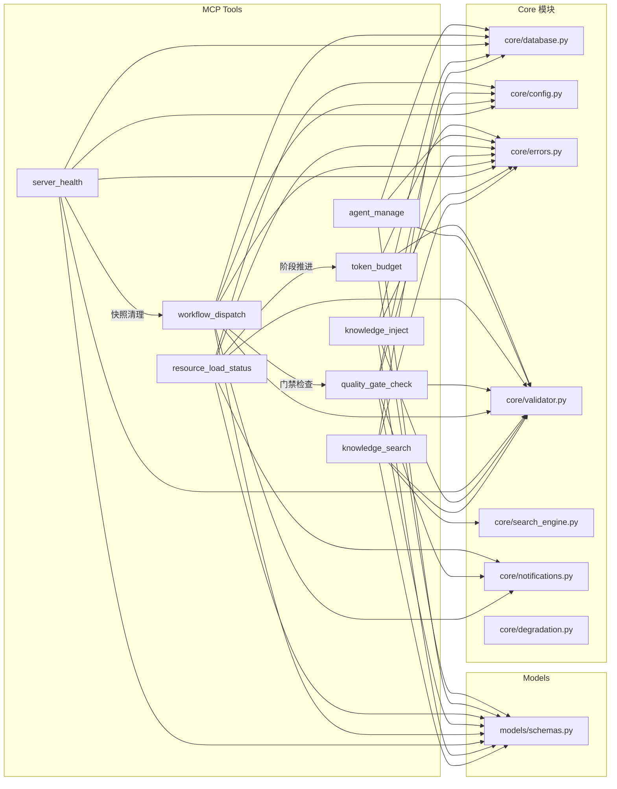
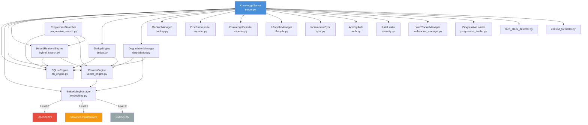
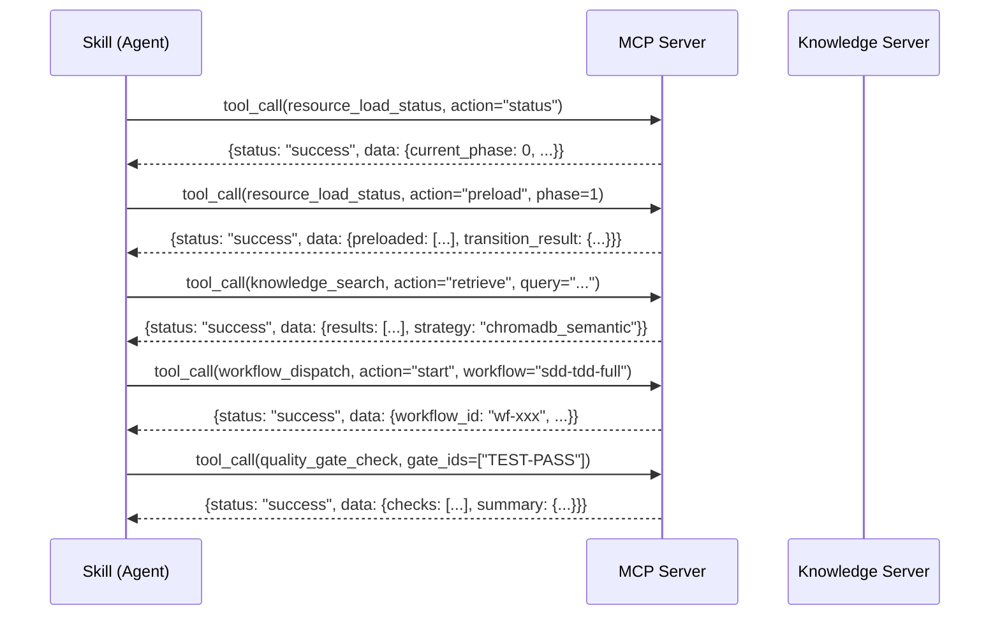
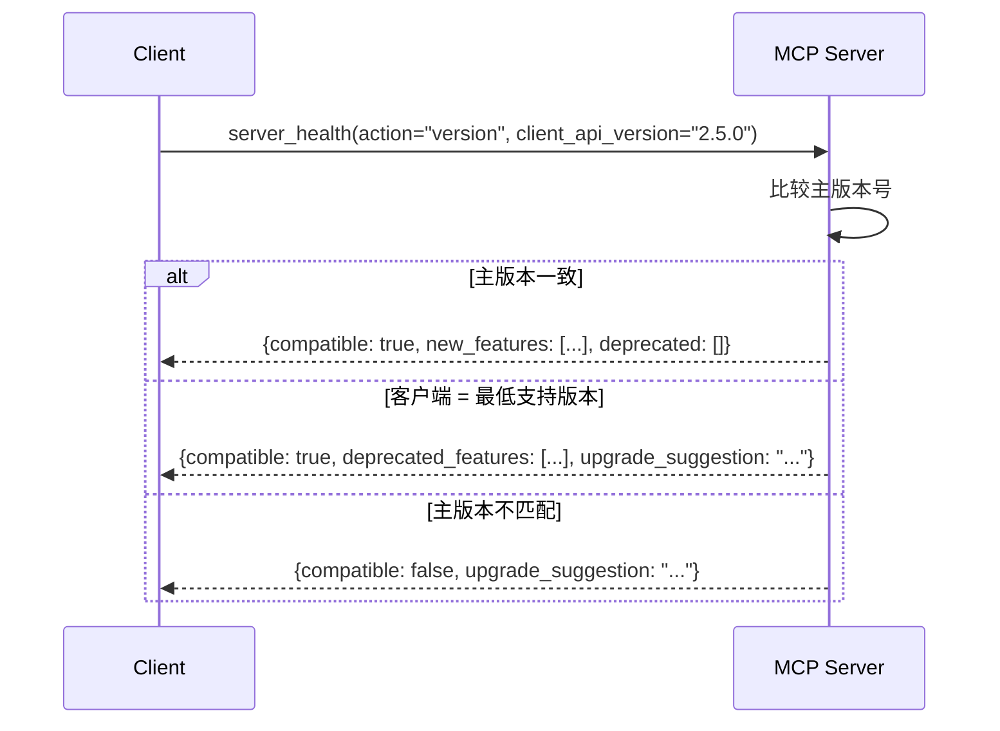
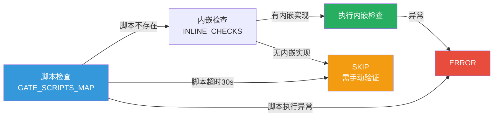
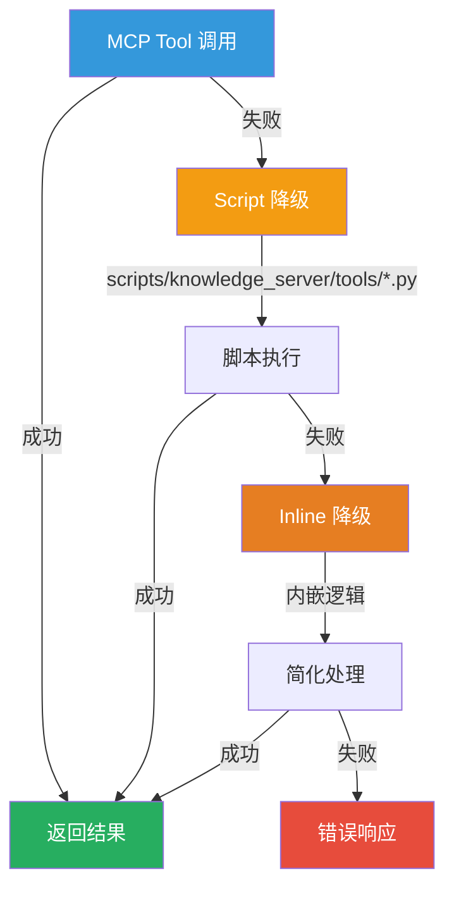

# Xuansto Skill V2 API 规格说明书

> **版本**: 3.0.0  
> **日期**: 2026-05-26  
> **状态**: 规格设计稿  
> **适用范围**: xuansto-mcp-server + knowledge_server 全量接口

---

## 目录

1. [现有API调用清单](#1-现有api调用清单)
2. [接口依赖拓扑图](#2-接口依赖拓扑图)
3. [重构后API设计](#3-重构后api设计)
4. [接口契约](#4-接口契约)
5. [异常处理、重试与降级方案](#5-异常处理重试与降级方案)

---

## 1. 现有API调用清单

### 1.1 MCP Server 工具接口（stdio / streamable-http）

MCP Server 提供 **20 个 Tool**，定义于 `xuansto-mcp-server/src/xuansto_mcp/tools/`，所有 Tool 统一返回 `{status, data, metadata}` 格式。

| # | Tool 名称 | 源文件 | 只读 | 核心参数 | 说明 |
|---|-----------|--------|------|----------|------|
| 1 | `skill_analyze` | `skill_analyze.py` | ✅ | `action, target, depth` | Skill配置与结构分析 |
| 2 | `knowledge_search` | `knowledge_search.py` | ✅ | `action, query, top_k, search_type, scope, min_confidence` | 三层知识库混合检索 |
| 3 | `knowledge_inject` | `knowledge_inject.py` | ❌ | `action, title, content, scope, tags` | 知识库写入（inject/precipitate/add/update） |
| 4 | `quality_gate_check` | `quality_gate_check.py` | ✅ | `gate_ids, phase, project_path, severity_filter, force_refresh` | 54项质量门禁检查 |
| 5 | `spec_drift_detect` | `spec_drift_detect.py` | ✅ | `spec_path, implementation_path` | 规格偏移检测 |
| 6 | `security_scan` | `security_scan.py` | ✅ | `target_path, scan_type, severity` | 安全扫描 |
| 7 | `code_simplify` | `code_simplify.py` | ❌ | `action, file_path, target_complexity` | 代码简化 |
| 8 | `session_manage` | `session_manage.py` | ❌ | `action, session_id, data` | 会话状态管理 |
| 9 | `workflow_dispatch` | `workflow_dispatch.py` | ❌ | `action, workflow, project_path, workflow_id, phase_action` | 工作流调度（start/status/abort/phase/recover/snapshots） |
| 10 | `agent_status` | `agent_status.py` | ✅ | `action, agent_id` | Agent状态查询 |
| 11 | `agent_manage` | `agent_manage.py` | ❌ | `action, agent_type, capabilities, agent_id, task` | Agent实例管理（create/assign/release/destroy/instance_status/schedule） |
| 12 | `hook_manage` | `hook_manage.py` | ❌ | `action, hook_id, hook_type, config` | Hook生命周期管理 |
| 13 | `resource_load_status` | `resource_load_status.py` | ✅ | `action, phase, resource_ids, resource_uris, priority, batch_mode, auto_upgrade, target_phase` | 渐进式加载状态管理（status/preload/cache/clear_cache/loading_progress/token_report/disclosure_transition/transition_check/features/metrics） |
| 14 | `context_compress` | `context_compress.py` | ✅ | `action, content, target_tokens, strategy` | 上下文压缩 |
| 15 | `server_health` | `server_health.py` | ✅ | `action, client_version, client_api_version` | 服务器健康检查与版本协商 |
| 16 | `decision_log` | `decision_log.py` | ❌ | `action, title, context, decision, rationale, alternatives, decision_id, status` | 决策日志记录 |
| 17 | `token_budget` | `token_budget.py` | ❌ | `action, total_budget, allocation, priority` | Token预算管理 |
| 18 | `project_init` | `project_init.py` | ❌ | `action, project_path, template, config` | 项目初始化 |
| 19 | `metrics_report` | `metrics_report.py` | ✅ | `action, time_range, tool_name` | 工具指标报告 |
| 20 | `config_manage` | `config_manage.py` | ❌ | `action, key, value, scope` | 配置管理 |

### 1.2 MCP Server 资源接口（25+ Resources）

定义于 `xuansto-mcp-server/src/xuansto_mcp/resources/skill_resources.py`，所有 Resource 为只读快照。

| # | URI 模式 | 类型 | 说明 |
|---|----------|------|------|
| 1 | `xuansto://config/skill` | config | Skill主配置文件 |
| 2 | `xuansto://references/quality-gates` | reference | 质量门禁参考文档 |
| 3 | `xuansto://references/agent-registry` | reference | Agent注册表 |
| 4 | `xuansto://references/workflow-phases` | reference | 工作流阶段定义 |
| 5 | `xuansto://templates/{name}` | template | 模板文件（动态参数） |
| 6 | `xuansto://sessions/latest` | session | 最新会话记录 |
| 7 | `xuansto://sessions/{session_id}` | session | 指定会话记录（动态参数） |
| 8 | `xuansto://agents/{name}` | agent | Agent定义文件（动态参数） |
| 9 | `xuansto://agents/{layer}/{name}` | agent | 按层级Agent定义（动态参数） |
| 10 | `xuansto://loading/status` | loading | 渐进式加载状态 |
| 11 | `xuansto://metrics/summary` | metrics | 工具指标汇总 |
| 12 | `xuansto://degradation/status` | degradation | 降级状态 |
| 13 | `xuansto://skill/config` | config | Skill统一配置 |
| 14 | `xuansto://skill/constraints` | config | Skill约束配置 |
| 15 | `xuansto://agents/registry` | agent | Agent完整注册表 |
| 16 | `xuansto://gates/definitions` | gate | 质量门禁定义 |
| 17 | `xuansto://workflows/definitions` | workflow | 工作流定义列表 |
| 18 | `xuansto://hooks/definitions` | hook | Hook定义列表 |
| 19 | `xuansto://knowledge/status` | knowledge | 知识库状态（DB+Chroma） |
| 20 | `xuansto://knowledge/stats` | knowledge | 知识库统计（含scope分组） |
| 21 | `xuansto://templates/index` | template | 模板索引 |
| 22 | `xuansto://commands/routes` | command | 命令路由列表 |
| 23 | `xuansto://session/state` | session | 会话状态 |
| 24 | `xuansto://health/status` | health | 健康状态 |
| 25 | `xuansto://audit/log` | audit | 审计日志 |
| 26 | `xuansto://decisions/latest` | decision | 最近决策记录 |
| 27 | `xuansto://workflows/active` | workflow | 活跃工作流实例 |

### 1.3 HTTP API 接口（FastAPI）

定义于 `scripts/knowledge_server/api.py` 和 `api_routes.py`，版本 `KB_VERSION = "2.0.0"`。

#### 1.3.1 健康与运维端点

| 方法 | 路径 | 源文件位置 | 说明 |
|------|------|-----------|------|
| GET | `/v1/knowledge/health` | `api.py:137` | 健康检查（SQLite/Chroma/Embedding/降级状态） |
| GET | `/v1/health/consistency` | `api.py:164` | 数据一致性检查（SQLite vs Chroma差异） |
| POST | `/v1/knowledge/backup` | `api.py:201` | 创建备份（full/incremental/snapshot） |
| POST | `/v1/knowledge/rollback` | `api_routes.py:396` | 版本回滚 |

#### 1.3.2 CRUD 端点

| 方法 | 路径 | 源文件位置 | 说明 |
|------|------|-----------|------|
| POST | `/v1/knowledge/search` | `api_routes.py:19` | 知识检索（hybrid/semantic_only/keyword_only） |
| POST | `/v1/knowledge/stats` | `api_routes.py:73` | 知识库统计 |
| GET | `/v1/knowledge/get/{entry_id}` | `api_routes.py:126` | 获取知识条目（新路径） |
| GET | `/v1/knowledge/{entry_id}` | `api_routes.py:130` | 获取知识条目（兼容路径） |
| POST | `/v1/knowledge/add` | `api_routes.py:134` | 新增知识条目（含去重） |
| PUT | `/v1/knowledge/update/{entry_id}` | `api_routes.py:356` | 更新知识条目（新路径） |
| PUT | `/v1/knowledge/{entry_id}` | `api_routes.py:360` | 更新知识条目（兼容路径） |
| DELETE | `/v1/knowledge/delete/{entry_id}` | `api_routes.py:388` | 删除知识条目（新路径） |
| DELETE | `/v1/knowledge/{entry_id}` | `api_routes.py:392` | 删除知识条目（兼容路径） |
| GET | `/v1/knowledge/{entry_id}/versions` | `api_routes.py:443` | 版本历史 |

#### 1.3.3 高级检索端点

| 方法 | 路径 | 源文件位置 | 说明 |
|------|------|-----------|------|
| POST | `/v1/knowledge/progressive_search` | `api_routes.py:452` | 渐进式检索 |
| POST | `/v1/knowledge/deep_load` | `api_routes.py:486` | 深度加载 |
| POST | `/v1/knowledge/auto_retrieve` | `api_routes.py:655` | 自动检索 |
| POST | `/v1/knowledge/web_update` | `api_routes.py:500` | 网络知识更新 |

#### 1.3.4 WebSocket 端点

| 路径 | 源文件位置 | 说明 |
|------|-----------|------|
| `/ws` | `api.py:123` | 实时事件推送（created/updated/deleted/rolled_back/web_*） |

#### 1.3.5 中间件栈

| 中间件 | 源文件位置 | 说明 |
|--------|-----------|------|
| `CORSMiddleware` | `api.py:231` | CORS跨域（可配置origins） |
| `shutdown_middleware` | `api.py:23` | 关闭期间拒绝请求（503） |
| `auth_and_rate_limit_middleware` | `api.py:43` | 限流 + API Key认证（远程模式） |
| `global_exception_handler` | `api.py:108` | 全局异常捕获（500） |

### 1.4 内部API模块间调用

Knowledge Server 内部模块调用链（`scripts/knowledge_server/`）：

| 调用方 | 被调用方 | 调用方式 | 说明 |
|--------|---------|---------|------|
| `server.py:KnowledgeServer` | `db_engine.py:SQLiteEngine` | 构造注入 | SQLite CRUD + 版本管理 |
| `server.py:KnowledgeServer` | `vector_engine.py:ChromaEngine` | 构造注入 | ChromaDB向量操作 |
| `server.py:KnowledgeServer` | `embedding.py:EmbeddingManager` | 构造注入 | 向量嵌入（OpenAI/本地/BM25降级） |
| `server.py:KnowledgeServer` | `hybrid_search.py:HybridRetrievalEngine` | 构造注入 | 混合检索策略 |
| `server.py:KnowledgeServer` | `progressive_search.py:ProgressiveSearcher` | 构造注入 | 渐进式检索 |
| `server.py:KnowledgeServer` | `dedup.py:DedupEngine` | 构造注入 | 去重检测与合并 |
| `server.py:KnowledgeServer` | `degradation.py:DegradationManager` | 构造注入 | 降级管理（4级） |
| `server.py:KnowledgeServer` | `backup.py:BackupManager` | 构造注入 | 备份管理 |
| `server.py:KnowledgeServer` | `auth.py:ApiKeyAuth` | 构造注入 | API Key认证 |
| `server.py:KnowledgeServer` | `security.py:RateLimiter` | 构造注入 | 速率限制 |
| `server.py:KnowledgeServer` | `websocket_manager.py:WebSocketManager` | 构造注入 | WebSocket广播 |
| `server.py:KnowledgeServer` | `lifecycle.py:LifecycleManager` | 构造注入 | 生命周期管理 |
| `server.py:KnowledgeServer` | `sync.py:IncrementalSync` | 构造注入 | 增量同步 |
| `server.py:KnowledgeServer` | `importer.py:FirstRunImporter` | 构造注入 | 首次导入 |
| `server.py:KnowledgeServer` | `exporter.py:KnowledgeExporter` | 构造注入 | 知识导出 |
| `api_routes.py` | `server.*` | 闭包引用 | HTTP路由调用Server引擎 |
| `api.py` | `server.*` | 闭包引用 | 中间件/健康检查调用Server引擎 |
| `degradation.py` | `embedding.py` | 构造注入 | 降级决策依赖Embedding级别 |
| `hybrid_search.py` | `db_engine.py`, `vector_engine.py` | 构造注入 | 混合检索组合两个引擎 |

### 1.5 外部API依赖

| 外部服务 | SDK/库 | 配置方式 | 可选性 | 说明 |
|----------|--------|---------|--------|------|
| OpenAI Embeddings | `openai` Python SDK | `OPENAI_API_KEY` 环境变量 | 可选 | `text-embedding-3-small`，1536维 |
| sentence-transformers | `sentence_transformers` Python库 | 自动检测 | 可选 | 本地语义嵌入，384维 |
| ChromaDB | `chromadb` Python库 | `KNOWLEDGE_CHROMA_PATH` | 可选 | 向量存储与检索 |
| FastAPI + Uvicorn | `fastapi`, `uvicorn` | HTTP模式启动 | 可选 | HTTP API服务 |
| Pydantic | `pydantic` | FastAPI依赖 | 可选 | 请求模型验证 |
| PyYAML | `yaml` | 自动检测 | 可选 | YAML配置解析 |

---

## 2. 接口依赖拓扑图

### 2.1 系统整体架构拓扑

```mermaid
graph TB
    subgraph "客户端层"
        CLI[CLI / IDE]
        LLM[LLM Agent]
        WS_CLIENT[WebSocket Client]
    end

    subgraph "传输层"
        STDIO[stdio transport]
        HTTP[streamable-http<br/>XUANSTO_TRANSPORT env]
    end

    subgraph "MCP Server (v3.0.0)"
        direction TB
        MCP_CORE[FastMCP Core]
        
        subgraph "20 Tools"
            T_KS[knowledge_search]
            T_KI[knowledge_inject]
            T_QG[quality_gate_check]
            T_WD[workflow_dispatch]
            T_AM[agent_manage]
            T_RLS[resource_load_status]
            T_SH[server_health]
            T_DL[decision_log]
            T_TB[token_budget]
            T_SM[session_manage]
            T_HM[hook_manage]
            T_CM[config_manage]
            T_SA[skill_analyze]
            T_SD[spec_drift_detect]
            T_SS[security_scan]
            T_CS[code_simplify]
            T_AS[agent_status]
            T_CC[context_compress]
            T_PI[project_init]
            T_MR[metrics_report]
        end

        subgraph "25+ Resources"
            R_CONFIG[xuansto://config/*]
            R_REF[xuansto://references/*]
            R_AGENT[xuansto://agents/*]
            R_SESSION[xuansto://sessions/*]
            R_KNOWLEDGE[xuansto://knowledge/*]
            R_LOADING[xuansto://loading/*]
            R_METRICS[xuansto://metrics/*]
            R_HEALTH[xuansto://health/*]
            R_OTHER[xuansto://templates/*<br/>xuansto://workflows/*<br/>xuansto://gates/*<br/>xuansto://hooks/*<br/>xuansto://audit/*<br/>xuansto://decisions/*<br/>xuansto://commands/*]
        end
    end

    subgraph "Knowledge Server (HTTP API v2.0.0)"
        direction TB
        FASTAPI[FastAPI App]
        
        subgraph "中间件栈"
            MW_CORS[CORSMiddleware]
            MW_SHUTDOWN[Shutdown Middleware]
            MW_AUTH[Auth + Rate Limit]
            MW_ERR[Global Exception Handler]
        end

        subgraph "HTTP Routes"
            H_HEALTH[/v1/knowledge/health<br/>/v1/health/consistency]
            H_CRUD[/v1/knowledge/search<br/>/v1/knowledge/add<br/>/v1/knowledge/get/*<br/>/v1/knowledge/update/*<br/>/v1/knowledge/delete/*]
            H_ADV[/v1/knowledge/progressive_search<br/>/v1/knowledge/deep_load<br/>/v1/knowledge/auto_retrieve<br/>/v1/knowledge/web_update]
            H_OPS[/v1/knowledge/backup<br/>/v1/knowledge/rollback<br/>/v1/knowledge/stats]
            H_WS[/ws WebSocket]
        end
    end

    subgraph "内部引擎层"
        SQLITE[SQLiteEngine<br/>db_engine.py]
        CHROMA[ChromaEngine<br/>vector_engine.py]
        EMBED[EmbeddingManager<br/>embedding.py]
        HYBRID[HybridRetrievalEngine<br/>hybrid_search.py]
        PROG[ProgressiveSearcher<br/>progressive_search.py]
        DEDUP[DedupEngine<br/>dedup.py]
        DEGR[DegradationManager<br/>degradation.py]
        BACKUP[BackupManager<br/>backup.py]
        AUTH[ApiKeyAuth<br/>auth.py]
        WS_MGR[WebSocketManager<br/>websocket_manager.py]
        LIFECYCLE[LifecycleManager<br/>lifecycle.py]
        SYNC[IncrementalSync<br/>sync.py]
    end

    subgraph "外部服务"
        OPENAI[OpenAI API<br/>text-embedding-3-small]
        ST[sentence-transformers<br/>本地384维]
        CHROMADB[ChromaDB<br/>PersistentClient]
    end

    CLI --> STDIO --> MCP_CORE
    LLM --> STDIO --> MCP_CORE
    LLM --> HTTP --> FASTAPI
    WS_CLIENT --> H_WS

    MCP_CORE --> T_KS & T_KI & T_QG & T_WD & T_AM & T_RLS & T_SH
    MCP_CORE --> R_CONFIG & R_REF & R_AGENT & R_SESSION & R_KNOWLEDGE & R_LOADING & R_METRICS & R_HEALTH & R_OTHER

    FASTAPI --> MW_CORS --> MW_SHUTDOWN --> MW_AUTH --> MW_ERR
    MW_ERR --> H_HEALTH & H_CRUD & H_ADV & H_OPS & H_WS

    H_CRUD --> SQLITE & CHROMA & HYBRID & DEDUP & DEGR
    H_ADV --> PROG & HYBRID & DEGR
    H_HEALTH --> SQLITE & CHROMA & EMBED & DEGR
    H_OPS --> BACKUP & SQLITE & CHROMA
    H_WS --> WS_MGR

    SQLITE --> CHROMA
    CHROMA --> EMBED
    HYBRID --> SQLITE & CHROMA
    PROG --> SQLITE & CHROMA & HYBRID
    DEDUP --> SQLITE & CHROMA
    DEGR --> CHROMA & EMBED & SQLITE

    EMBED -->|API Key可用| OPENAI
    EMBED -->|OpenAI不可用| ST
    CHROMA --> CHROMADB
```

### 2.2 MCP Tool 内部调用拓扑



### 2.3 Knowledge Server 内部模块调用拓扑



---

## 3. 重构后API设计

### 3.1 Skill ↔ MCP Tool 调用协议

当前 Skill（`.trae/skills/xuansto-skill-v2/`）通过 MCP stdio 协议调用 MCP Server 的 Tool。重构后需明确 Skill 层与 MCP Tool 层的调用契约：



**调用协议规则**：

1. **渐进式调用**：Skill 必须先调用 `resource_load_status(action="status")` 获取当前阶段，再决定是否需要 `preload` 升级
2. **阶段门控**：`knowledge_search` 在 Phase 0（skeleton）不可用，需先升级到 Phase 2（enhanced）
3. **写入隔离**：`knowledge_search` 仅支持 `retrieve`/`cleanup_versions`，写入操作必须使用 `knowledge_inject`
4. **工作流绑定**：`workflow_dispatch` 的 `phase` 推进自动触发 `quality_gate_check`
5. **Token预算联动**：`resource_load_status` 的阶段推进自动调用 `token_budget` 更新预算

### 3.2 MCP Server 对外接口设计

#### 3.2.1 传输配置

来源：`xuansto-mcp-server/mcp-config.json`

```json
{
  "mcpServers": {
    "xuansto-mcp-server": {
      "command": "uvx",
      "args": ["--from", "git+https://github.com/xuanyuanchumo/xuansto#subdirectory=xuansto-mcp-server", "xuansto-mcp"]
    },
    "xuansto-mcp-server-http": {
      "url": "http://127.0.0.1:8000/mcp",
      "transport": "streamable-http",
      "note": "XUANSTO_TRANSPORT=streamable-http XUANSTO_PORT=8000"
    }
  }
}
```

| 传输方式 | 启动方式 | 默认端口 | 适用场景 |
|----------|---------|---------|---------|
| stdio | `uvx xuansto-mcp` | N/A | 本地IDE集成（默认） |
| streamable-http | `XUANSTO_TRANSPORT=streamable-http XUANSTO_PORT=8000` | 8000 | 远程/多客户端 |

#### 3.2.2 版本协商

来源：`xuansto-mcp-server/src/xuansto_mcp/tools/server_health.py` 中的 `_negotiate_api_version`

```
MCP_API_VERSION = "3.0.0"
MCP_MIN_SUPPORTED_VERSION = "2.0.0"
```

协商规则：
- 主版本号一致 → 兼容，返回新增特性列表
- 客户端主版本 = 最低支持主版本 → 兼容但警告，返回弃用/新增特性
- 客户端主版本 > 服务端 → 不兼容
- 客户端主版本 < 最低支持 → 不兼容

### 3.3 渐进式加载接口设计

来源：`xuansto-mcp-server/src/xuansto_mcp/tools/resource_load_status.py`

#### 3.3.1 四阶段模型

| Phase | 名称 | Token预算 | 可用功能 | 资源数 |
|-------|------|----------|---------|--------|
| 0 | skeleton | 2,000 | 命令路由、基础状态查询 | 1 |
| 1 | functional | 5,000 | +命令执行、工作流推进、门禁检查、核心Agent | 7 |
| 2 | enhanced | 10,000 | +知识检索、参考文档、Agent完整注册表 | 8 |
| 3 | full | 20,000 | +完整脚本集、模板库、全部Agent定义 | 22 |

#### 3.3.2 阶段转换条件

来源：`PHASE_TRANSITION_CONDITIONS`

| 转换 | 最低工具数 | 最低资源数 | 说明 |
|------|-----------|-----------|------|
| skeleton → functional | 5 | 3 | 核心工具和基础资源已加载 |
| functional → enhanced | 12 | 10 | 大部分工具和参考文档已加载 |
| enhanced → full | 20 | 18 | 所有工具、资源和Hook系统已加载 |

#### 3.3.3 resource_load_status Action 清单

| Action | 说明 | 关键返回字段 |
|--------|------|-------------|
| `status` | 查询资源加载状态 | resources, current_phase, available_functions, token_budget |
| `preload` | 预加载指定阶段资源 | preloaded, transition_result, budget_check |
| `cache` | 查看缓存状态 | cached_uris, cache_size, expired_entries, stale_entries |
| `clear_cache` | 清除缓存 | cleared_entries, expired_entries |
| `loading_progress` | 加载进度 | progress_percent, loaded_resources, pending_resources |
| `token_report` | Token使用报告 | tools, phase_token_usage, summary |
| `disclosure_transition` | 阶段转换评估 | required_resources, estimated_tokens, can_advance |
| `transition_check` | 转换条件检查 | can_advance, conditions_met, missing |
| `features` | 当前阶段可用特性 | available, unavailable, all_phases |
| `metrics` | 阶段指标 | phase_metrics, total |

---

## 4. 接口契约

### 4.1 MCP Tool 统一响应格式

来源：`xuansto-mcp-server/src/xuansto_mcp/core/errors.py`

#### 4.1.1 成功响应

```json
{
  "status": "success",
  "data": {
    // Tool特定返回数据
  },
  "metadata": {
    "degradation_level": "chromadb",
    "timestamp": 1748236800.0
  }
}
```

#### 4.1.2 错误响应

```json
{
  "status": "error",
  "error": {
    "code": "VALIDATION_ERROR",
    "message": "描述信息",
    "details": {}
  },
  "metadata": {
    "timestamp": 1748236800.0
  }
}
```

#### 4.1.3 错误码定义

| 错误码 | HTTP等价 | 说明 | 可重试 |
|--------|---------|------|--------|
| `ERR_VALIDATION` | 400 | 输入验证失败 | ❌ |
| `ERR_NOT_FOUND` | 404 | 资源不存在 | ❌ |
| `ERR_PERMISSION` | 403 | 权限不足 | ❌ |
| `ERR_RATE_LIMIT` | 429 | 速率限制 | ✅ |
| `ERR_INTERNAL` | 500 | 内部错误 | ❌ |
| `ERR_DEGRADED` | 503 | 服务降级 | ✅ |

### 4.2 HTTP API 统一响应格式

来源：`scripts/knowledge_server/config.py` 中的 `make_response` / `make_error_response`

#### 4.2.1 成功响应

```json
{
  "status": "ok",
  "data": {
    // 端点特定返回数据
  }
}
```

#### 4.2.2 错误响应

```json
{
  "status": "error",
  "code": "SERVICE_DEGRADED",
  "message": "检索引擎不可用",
  "details": {
    "exception": "..."
  },
  "retryable": true
}
```

#### 4.2.3 HTTP 错误码映射

| HTTP Code | 错误码 | 说明 |
|-----------|--------|------|
| 400 | `BAD_REQUEST` | 请求参数无效 |
| 401 | `UNAUTHORIZED` | API Key缺失或无效 |
| 403 | `UNAUTHORIZED` | 权限不足（需admin/read-write） |
| 404 | `NOT_FOUND` | 知识条目不存在 |
| 409 | `DUPLICATE_DETECTED` / `VERSION_CONFLICT` | 重复条目或版本冲突 |
| 422 | `VALIDATION_ERROR` | 内容包含敏感信息 |
| 429 | `RATE_LIMITED` | 请求频率超限 |
| 500 | `INTERNAL_ERROR` | 内部服务器错误 |
| 503 | `SERVICE_DEGRADED` / `SERVICE_UNAVAILABLE` | 服务降级或关闭中 |

### 4.3 已知问题：API-01 响应格式不一致

**问题**：MCP Tool 返回 `{status: "success", data: {...}, metadata: {...}}`，而 HTTP API 返回 `{status: "ok", data: {...}}`，两者格式不统一。

**影响范围**：
- MCP stdio 客户端与 HTTP API 客户端需要不同的解析逻辑
- 错误码体系不一致（MCP: `ERR_VALIDATION` vs HTTP: `BAD_REQUEST`）

**建议修复**：

```json
// 统一响应格式
{
  "status": "ok" | "error",
  "data": {},
  "error": {
    "code": "VALIDATION_ERROR",
    "message": "",
    "details": {},
    "retryable": false
  },
  "metadata": {
    "version": "3.0.0",
    "degradation_level": null,
    "timestamp": 1748236800.0,
    "request_id": "req-xxx"
  }
}
```

### 4.4 核心 Tool 请求/响应 Schema

#### 4.4.1 knowledge_search

来源：`xuansto-mcp-server/src/xuansto_mcp/models/schemas.py` → `KnowledgeSearchInput`

**请求**：

```json
{
  "action": "retrieve | cleanup_versions",
  "query": "string (retrieve时必填)",
  "top_k": 5,
  "search_type": "hybrid | semantic_only | keyword_only",
  "scope": "general | workspace | experience | null",
  "min_confidence": 0.0,
  "keep_last_n": 10
}
```

**响应**：

```json
{
  "status": "success",
  "data": {
    "results": [
      {
        "source": "entry-id-or-file-path",
        "content": "匹配内容片段",
        "match_type": "chromadb_semantic | sqlite_fts5_bm25 | keyword_tfidf",
        "relevance": 0.85
      }
    ],
    "total": 3,
    "strategy": "chromadb_semantic | sqlite_fts5_bm25 | keyword_tfidf"
  },
  "metadata": {
    "degradation_level": "chromadb | sqlite_fts5 | keyword_fallback",
    "timestamp": 1748236800.0
  }
}
```

#### 4.4.2 resource_load_status

**请求**：

```json
{
  "action": "status | preload | cache | clear_cache | loading_progress | token_report | disclosure_transition | transition_check | features | metrics",
  "phase": 0,
  "resource_ids": ["skill-config"],
  "resource_uris": ["xuansto://agents/registry"],
  "priority": "critical | normal | background",
  "batch_mode": false,
  "auto_upgrade": false,
  "target_phase": "enhanced"
}
```

**响应（action=status）**：

```json
{
  "status": "success",
  "data": {
    "resources": [
      {"id": "skill-config", "type": "config", "path": ".skill-config.yaml", "status": "loaded", "phase": 0}
    ],
    "current_phase": 0,
    "current_phase_name": "skeleton",
    "available_functions": {
      "command_routing": true,
      "knowledge_search": false
    },
    "disclosure_note": "骨架阶段，仅命令路由可用",
    "upgrade_hint": "升级到功能阶段(Phase 1)可解锁：...",
    "token_budget": 2000,
    "token_usage": {"estimated_tokens": 500, "resource_count": 1},
    "transition_check": {"can_transition": true, "conditions_met": true, "missing": []}
  }
}
```

#### 4.4.3 workflow_dispatch

**请求**：

```json
{
  "action": "start | status | abort | phase | recover | snapshots",
  "workflow": "sdd-tdd-full | sdd-tdd-medium | sdd-tdd-fast | ...",
  "project_path": ".",
  "workflow_id": "wf-xxx",
  "phase_action": "advance | current",
  "snapshot_phase": 3
}
```

**响应（action=start）**：

```json
{
  "status": "success",
  "data": {
    "workflow_id": "wf-a1b2c3d4",
    "workflow": "sdd-tdd-full",
    "project_path": ".",
    "status": "running",
    "current_phase": 0,
    "started_at": "2026-05-26T02:00:00+00:00",
    "completed_phases": [],
    "phase_definitions": []
  }
}
```

#### 4.4.4 quality_gate_check

**请求**：

```json
{
  "gate_ids": ["TEST-PASS", "SPEC-CONSISTENCY"],
  "phase": "4",
  "project_path": ".",
  "severity_filter": "all",
  "force_refresh": false
}
```

**响应**：

```json
{
  "status": "success",
  "data": {
    "checks": [
      {
        "gate_id": "TEST-PASS",
        "status": "PASS | FAIL | SKIP | ERROR | BLOCKED",
        "source": "inline | script | cache | hard_gate",
        "details": {"message": "Tests collectible: 12 tests found"},
        "suggestion": "修复建议（FAIL时）"
      }
    ],
    "summary": {
      "total": 2,
      "passed": 1,
      "failed": 1,
      "skipped": 0,
      "blocked": true,
      "hard_gate_blocked": 0
    },
    "cache_info": {
      "hit": false,
      "hit_count": 0,
      "miss_count": 2,
      "cache_age_seconds": 0.0
    }
  }
}
```

#### 4.4.5 HTTP API SearchRequest

来源：`scripts/knowledge_server/api_models.py`

**请求**：

```json
{
  "query": "string (必填)",
  "scope": "general | workspace | experience | null",
  "top_k": 5,
  "strategy": "hybrid | semantic_only | keyword_only",
  "filters": {
    "min_confidence": 0.0,
    "tags": ["tag1"],
    "type": "pattern",
    "category": "uncategorized"
  },
  "agent_role": "backend_developer | frontend_developer | ..."
}
```

**响应**：

```json
{
  "status": "ok",
  "data": {
    "results": [...],
    "degradation_level": 0,
    "degradation_name": "normal",
    "agent_role": "backend_developer"
  }
}
```

### 4.5 版本管理建议

#### 4.5.1 当前版本状态

| 组件 | 版本 | 来源 |
|------|------|------|
| MCP Server | `3.0.0`（`__version__`） | `xuansto-mcp-server/src/xuansto_mcp/__init__.py` |
| MCP API | `3.0.0`（`MCP_API_VERSION`） | `xuansto-mcp-server/src/xuansto_mcp/core/config.py` |
| MCP 最低支持 | `2.0.0`（`MCP_MIN_SUPPORTED_VERSION`） | 同上 |
| Knowledge Server HTTP | `2.0.0`（`KB_VERSION`） | `scripts/knowledge_server/config.py` |
| Skill Min Version | `SKILL_MIN_VERSION` | `xuansto-mcp-server/src/xuansto_mcp/core/config.py` |

#### 4.5.2 版本协商流程（ARCH-12 计划）

来源：`server_health.py` 中的 `_negotiate_api_version`



#### 4.5.3 版本演进建议

1. **统一版本号**：MCP Server 和 Knowledge Server HTTP API 应使用同一版本号，消除 `3.0.0` vs `2.0.0` 的不一致
2. **语义化版本**：`MAJOR.MINOR.PATCH`
   - MAJOR：不兼容的API变更（如响应格式变更）
   - MINOR：向后兼容的功能新增（如新Tool/新Action）
   - PATCH：向后兼容的Bug修复
3. **API Changelog**：维护 `API_CHANGELOG` 字典（已在 `core/config.py` 中定义），每次 MINOR 版本变更记录新增特性
4. **版本协商端点**：通过 `server_health(action="version")` 实现，客户端应在首次连接时调用

---

## 5. 异常处理、重试与降级方案

### 5.1 降级层级体系

系统实现两级降级：**MCP Server 降级** 和 **Knowledge Server 降级**。

#### 5.1.1 MCP Server 降级（渐进式加载降级）

来源：`xuansto-mcp-server/src/xuansto_mcp/core/degradation.py` + `tools/resource_load_status.py`

| 降级方向 | 触发条件 | 效果 |
|----------|---------|------|
| Phase 3 → 2 | Token使用率 ≥ 80% | 丢失完整脚本集、模板库 |
| Phase 2 → 1 | Token使用率 ≥ 80% | 丢失知识检索、参考文档 |
| Phase 1 → 0 | Token使用率 ≥ 80% | 仅保留命令路由 |
| Phase 0 | 最低阶段 | 无法继续降级 |

降级自动触发逻辑（`resource_load_status.py:check_token_budget`）：

```python
usage_ratio = estimated_tokens / budget
if usage_ratio >= 0.8 and current > 0:
    degradation = degrade_phase()
```

#### 5.1.2 Knowledge Server 降级（检索引擎降级）

来源：`scripts/knowledge_server/degradation.py`

| 级别 | 名称 | 检索策略 | 触发条件 |
|------|------|---------|---------|
| 0 | normal | hybrid（语义+关键词） | ChromaDB可用 + Embedding API可用 |
| 1 | local_semantic | hybrid（本地语义+关键词） | ChromaDB可用 + 仅本地Embedding |
| 2 | bm25_only | keyword_only | ChromaDB不可用 或 Embedding不可用 |
| 3 | file_search | file_search | SQLite也不可用 |

#### 5.1.3 Embedding 降级

来源：`scripts/knowledge_server/embedding.py`

| 级别 | 名称 | 维度 | 触发条件 |
|------|------|------|---------|
| 0 | api | 1536 | OpenAI API Key可用且连接正常 |
| 1 | local_semantic | 384 | OpenAI不可用，sentence-transformers已安装 |
| 2 | bm25_only | 0 | 两者均不可用 |

#### 5.1.4 MCP Tool 搜索降级链

来源：`xuansto-mcp-server/src/xuansto_mcp/tools/knowledge_search.py`


### 5.2 重试策略

#### 5.2.1 ChromaDB 写入重试

来源：`knowledge_search.py:_retry_pending_chroma`

| 参数 | 值 | 说明 |
|------|---|------|
| 最大重试次数 | 3 | `_MAX_CHROMA_RETRY_ATTEMPTS` |
| 重试对象 | `sync_status="pending"` 的条目 | 从 `knowledge_entries` 状态表加载 |
| 成功标记 | `sync_status="ready"` | 写入ChromaDB成功 |
| 失败标记 | `sync_status="failed"` | 超过重试次数 |

#### 5.2.2 HTTP API 版本冲突重试

来源：`api_routes.py:_update_entry_handler`

| 参数 | 值 | 说明 |
|------|---|------|
| 最大重试次数 | 3 | `max_retries = 3` |
| 重试条件 | `result.get("error") == "version_conflict"` | 乐观锁冲突 |
| 重试策略 | 获取最新版本号后重试 | `updates["version"] = current["version"]` |

#### 5.2.3 MCP Tool 降级重试（脚本→内嵌→错误）

来源：`quality_gate_check.py:register`



### 5.3 三级降级方案

来源：Skill 配置与 MCP Server 实现



**降级路径详解**：

| 级别 | 方式 | 示例 | 来源文件 |
|------|------|------|---------|
| L1: MCP Tool | 完整MCP协议调用 | `knowledge_search(action="retrieve")` | `xuansto-mcp-server/src/xuansto_mcp/tools/` |
| L2: Script | Python脚本直接调用 | `scripts/knowledge_server/tools/knowledge_search.py` | `scripts/knowledge_server/tools/` |
| L3: Inline | 内嵌简化逻辑 | `agent_manage._inline_agent_manage()` | `xuansto-mcp-server/src/xuansto_mcp/tools/agent_manage.py` |
| L4: Error | 返回错误响应 | `make_error_response(exception)` | `xuansto-mcp-server/src/xuansto_mcp/core/errors.py` |

### 5.4 Resource 降级

来源：`xuansto-mcp-server/src/xuansto_mcp/resources/skill_resources.py:_degraded_resource`

当 Resource 读取失败时，返回降级响应而非抛出异常：

```json
{
  "status": "degraded",
  "uri": "xuansto://references/quality-gates",
  "message": "Resource unavailable: xuansto://references/quality-gates",
  "error": "具体错误信息",
  "timestamp": 1748236800.0
}
```

### 5.5 异常处理矩阵

| 异常场景 | MCP Tool 处理 | HTTP API 处理 | 降级行为 |
|----------|--------------|--------------|---------|
| ChromaDB不可用 | 跳过语义搜索，降级到FTS5 | `degradation.get_search_strategy()` 返回 `keyword_only` | 检索策略降级 |
| OpenAI API不可用 | N/A（MCP Server不直接调用） | `EmbeddingManager` 降级到 `local_semantic` 或 `bm25_only` | 嵌入降级 |
| SQLite锁定 | `PRAGMA busy_timeout=5000` | 同左 + HTTP 503 | 等待重试 |
| 输入验证失败 | `make_error_response(ERR_VALIDATION)` | HTTP 400 `BAD_REQUEST` | 拒绝请求 |
| 路径安全违规 | `validate_path_safety()` 返回错误 | N/A | 拒绝请求 |
| Token预算超限 | `degrade_phase()` 自动降级 | N/A | 阶段降级 |
| 版本冲突 | N/A | 最多3次重试，然后 HTTP 409 | 乐观锁重试 |
| 敏感内容检测 | N/A | `SensitiveContentFilter.check()` → HTTP 422 | 拒绝写入 |
| 速率限制 | N/A | `RateLimiter.check()` → HTTP 429 | 拒绝请求 |
| 服务器关闭中 | N/A | `shutdown_middleware` → HTTP 503 | 拒绝新请求 |
| 质量门禁脚本超时 | 30秒超时 → SKIP | N/A | 跳过检查 |
| 硬门禁触发 | `BLOCKED` 状态，需人工确认 | N/A | 阻止推进 |

### 5.6 降级恢复机制

| 组件 | 恢复检测 | 恢复行为 |
|------|---------|---------|
| ChromaDB | `server_health` 每次调用时 `_check_chromadb_health()` | 清除 `_DEGRADATION_COUNTS` 降级标记 |
| Embedding API | `EmbeddingManager._last_api_check + _api_check_interval(300s)` | 重新探测API可用性 |
| 阶段降级 | 手动调用 `resource_load_status(action="preload", phase=N)` | 重新加载资源并推进阶段 |
| 工作流恢复 | `workflow_dispatch(action="recover", workflow_id=...)` | 从最新快照恢复状态 |

---

## 附录

### A. 文件路径索引

| 模块 | 路径 |
|------|------|
| MCP Tools | `xuansto-mcp-server/src/xuansto_mcp/tools/` |
| MCP Resources | `xuansto-mcp-server/src/xuansto_mcp/resources/skill_resources.py` |
| MCP Core | `xuansto-mcp-server/src/xuansto_mcp/core/` |
| MCP Models | `xuansto-mcp-server/src/xuansto_mcp/models/schemas.py` |
| MCP Config | `xuansto-mcp-server/mcp-config.json` |
| Knowledge Server | `scripts/knowledge_server/` |
| HTTP API | `scripts/knowledge_server/api.py` |
| HTTP Routes | `scripts/knowledge_server/api_routes.py` |
| API Models | `scripts/knowledge_server/api_models.py` |
| Server Core | `scripts/knowledge_server/server.py` |
| DB Engine | `scripts/knowledge_server/db_engine.py` |
| Vector Engine | `scripts/knowledge_server/vector_engine.py` |
| Embedding | `scripts/knowledge_server/embedding.py` |
| Degradation | `scripts/knowledge_server/degradation.py` |
| Hybrid Search | `scripts/knowledge_server/hybrid_search.py` |
| Progressive Search | `scripts/knowledge_server/progressive_search.py` |
| Security | `scripts/knowledge_server/security.py` |
| Auth | `scripts/knowledge_server/auth.py` |
| WebSocket | `scripts/knowledge_server/websocket_manager.py` |

### B. 环境变量

| 变量 | 默认值 | 说明 |
|------|--------|------|
| `XUANSTO_TRANSPORT` | `stdio` | 传输方式（stdio / streamable-http） |
| `XUANSTO_PORT` | `8000` | HTTP模式端口 |
| `OPENAI_API_KEY` | 无 | OpenAI Embeddings API密钥 |

### C. 待解决问题追踪

| ID | 问题 | 影响 | 建议优先级 |
|----|------|------|-----------|
| API-01 | MCP Tool 与 HTTP API 响应格式不一致 | 客户端需双套解析逻辑 | 高 |
| ARCH-12 | 版本协商机制尚未完整实现 | 客户端无法自动适配API变更 | 中 |
