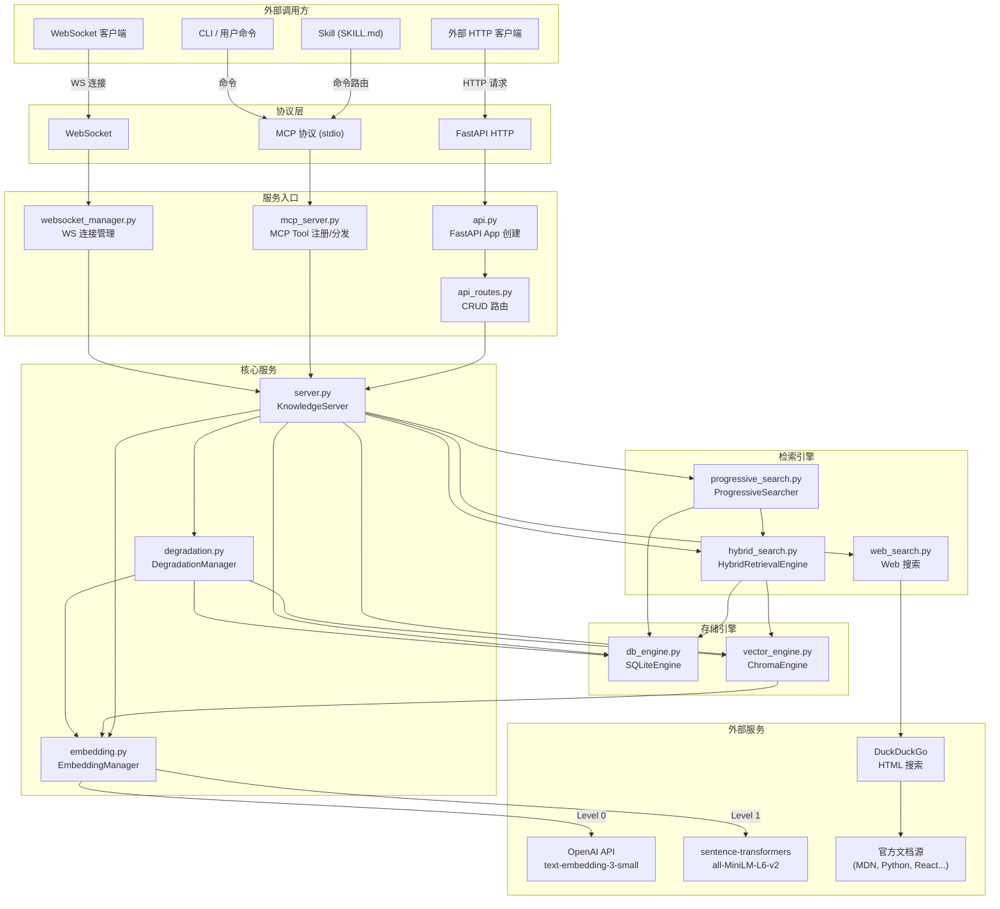
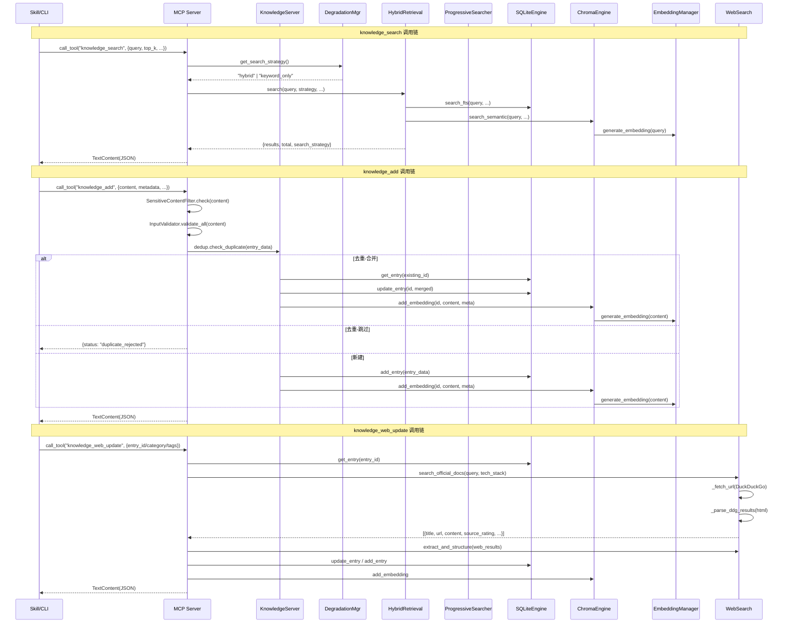
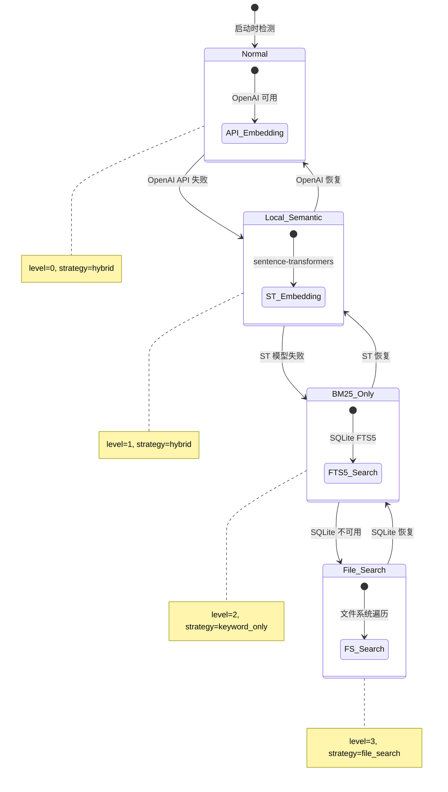
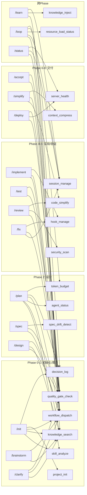
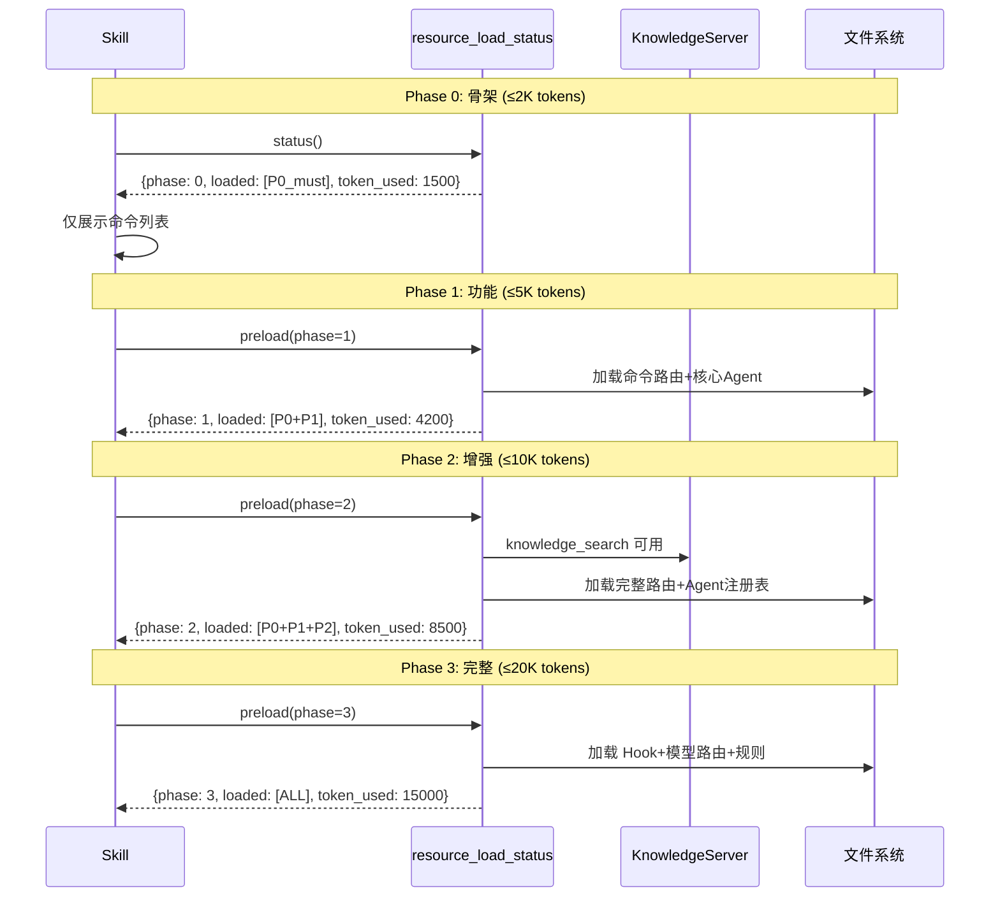
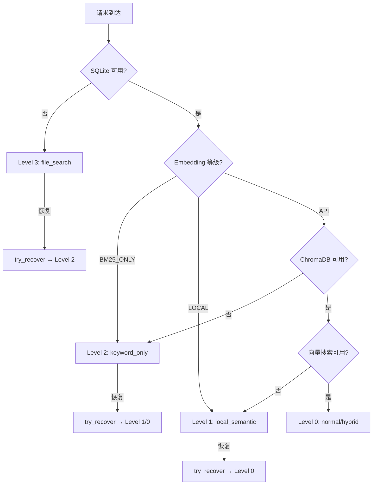

# xuansto-skill-v2 API 规格说明书

> **版本**: v8.0.0  
> **生成日期**: 2026-05-24  
> **适用范围**: 多Agent自主开发编排引擎全量API接口

---

## 目录

1. [现有 API 调用清单](#1-现有-api-调用清单)
   - 1.1 [外部 API — MCP Tool 协议](#11-外部-api--mcp-tool-协议)
   - 1.2 [外部 API — FastAPI HTTP 端点](#12-外部-api--fastapi-http-端点)
   - 1.3 [外部 API — WebSocket 实时推送](#13-外部-api--websocket-实时推送)
   - 1.4 [外部 API — Web 搜索](#14-外部-api--web-搜索)
   - 1.5 [内部 API — 模块间调用](#15-内部-api--模块间调用)
2. [接口依赖拓扑图](#2-接口依赖拓扑图)
3. [重构后 API 设计](#3-重构后-api-设计)
4. [接口契约](#4-接口契约)
5. [异常处理、重试与降级方案](#5-异常处理重试与降级方案)

---

## 1. 现有 API 调用清单

### 1.1 外部 API — MCP Tool 协议

**传输层**: stdio（MCP JSON-RPC over stdin/stdout）  
**协议版本**: MCP 2025-03-26  
**认证方式**: 无（本地进程通信）

| 编号 | Tool 名称 | 请求方式 | 必填参数 | 可选参数 | 返回值 | 只读 | 幂等 | 破坏性 | 开放世界 |
|------|-----------|----------|----------|----------|--------|------|------|--------|----------|
| MCP-01 | `knowledge_search` | call_tool | `query` | `top_k`(5), `search_type`("hybrid"), `filters`({}) | `{results, total, search_strategy, degradation_level, degradation_name}` | ✅ | ✅ | ❌ | ❌ |
| MCP-02 | `knowledge_add` | call_tool | `content` | `metadata`({}), `auto_dedup`(true) | `{id, status, dedup_status, similarity_score?}` | ❌ | ❌ | ❌ | ❌ |
| MCP-03 | `knowledge_update` | call_tool | `id` | `content`, `metadata`({}) | `{id, status}` | ❌ | ❌ | ❌ | ❌ |
| MCP-04 | `knowledge_delete` | call_tool | `id` | — | `{id, status}` | ❌ | ❌ | ✅ | ❌ |
| MCP-05 | `knowledge_stats` | call_tool | — | `detailed`(false), `since`(null) | `{total_entries, by_scope, embedding, chroma_available, ...}` | ✅ | ✅ | ❌ | ❌ |
| MCP-06 | `knowledge_rollback` | call_tool | `id`, `target_version` | — | `{id, status, target_version, current_version}` | ❌ | ✅ | ✅ | ❌ |
| MCP-07 | `knowledge_auto_retrieve` | call_tool | `project_path` | `task_type`("feature"), `query`(null), `token_budget`(2048) | `{context, tech_stack, task_type, query_used, results_count, ...}` | ✅ | ✅ | ❌ | ❌ |
| MCP-08 | `knowledge_progressive_search` | call_tool | `query` | `task_type`("feature"), `tech_stack`({}), `token_budget`(2048) | `{results, total, task_type, search_config, token_budget, pruned_entry_ids, ...}` | ✅ | ✅ | ❌ | ❌ |
| MCP-09 | `knowledge_deep_load` | call_tool | `entry_id` | — | `{id, title, content, scope, confidence, tags, type, category}` | ✅ | ✅ | ❌ | ❌ |
| MCP-10 | `knowledge_web_update` | call_tool | —（至少一项） | `entry_id`, `category`, `tags` | `{id, status, sources_found, best_source_rating, updated_fields?}` | ❌ | ❌ | ❌ | ✅ |

**MCP 错误码体系**:

| 错误码 | 数值 | 说明 |
|--------|------|------|
| `PARSE_ERROR` | -32700 | JSON 解析失败 |
| `INVALID_REQUEST` | -32600 | 请求格式不合法 |
| `METHOD_NOT_FOUND` | -32601 | 未知 Tool 名称 |
| `INVALID_PARAMS` | -32602 | 参数校验失败 |
| `INTERNAL_ERROR` | -32603 | 服务端内部错误 |
| `VALIDATION_ERROR` | -32100 | 输入验证失败 |
| `BAD_REQUEST` | -32101 | 请求参数缺失或无效 |
| `NOT_FOUND` | -32102 | 目标条目不存在 |
| `VERSION_CONFLICT` | -32103 | 乐观锁版本冲突 |
| `DUPLICATE_DETECTED` | -32104 | 重复条目检测 |
| `UNKNOWN_TOOL` | -32105 | 未知工具名 |
| `SENSITIVE_CONTENT` | -32106 | 内容含敏感信息 |

---

### 1.2 外部 API — FastAPI HTTP 端点

**传输层**: HTTP/1.1（uvicorn）  
**默认端口**: 8765  
**认证方式**: 远程模式（`host=0.0.0.0`）需 `X-API-Key` Header；本地模式无认证  
**权限等级**: `admin` / `read-write` / `read-only`  
**限流**: 60 请求/分钟/IP

#### 1.2.1 健康检查与运维

| 编号 | 方法 | 路径 | 认证 | 请求体 | 返回值 |
|------|------|------|------|--------|--------|
| HTTP-01 | GET | `/v1/knowledge/health` | 无 | — | `{status, version, engines, stats, embedding, degradation, websocket_connections}` |
| HTTP-02 | GET | `/v1/health/consistency` | 无 | — | `{consistent, sqlite, chroma, discrepancies}` |
| HTTP-03 | POST | `/v1/knowledge/backup` | admin | `{type, destination?}` | 备份结果 |

#### 1.2.2 CRUD 操作

| 编号 | 方法 | 路径 | 认证 | 请求体 | 返回值 |
|------|------|------|------|--------|--------|
| HTTP-04 | POST | `/v1/knowledge/search` | read-only+ | `SearchRequest` | `{results, total, search_strategy, degradation_*}` |
| HTTP-05 | POST | `/v1/knowledge/stats` | read-only+ | `StatsRequest` | `{total_entries, by_scope, embedding, ...}` |
| HTTP-06 | GET | `/v1/knowledge/get/{entry_id}` | read-only+ | — | 条目完整数据 |
| HTTP-07 | GET | `/v1/knowledge/{entry_id}` | read-only+ | — | 条目完整数据（兼容旧版） |
| HTTP-08 | POST | `/v1/knowledge/add` | read-write+ | `AddRequest` | `{id, status, dedup_status}` |
| HTTP-09 | PUT | `/v1/knowledge/update/{entry_id}` | read-write+ | `UpdateRequest` | `{id, status}` |
| HTTP-10 | PUT | `/v1/knowledge/{entry_id}` | read-write+ | `UpdateRequest` | `{id, status}`（兼容旧版） |
| HTTP-11 | DELETE | `/v1/knowledge/delete/{entry_id}` | read-write+ | — | `{id, status}` |
| HTTP-12 | DELETE | `/v1/knowledge/{entry_id}` | read-write+ | — | `{id, status}`（兼容旧版） |
| HTTP-13 | POST | `/v1/knowledge/rollback` | admin | `RollbackVersionRequest` | `{id, status, target_version}` |
| HTTP-14 | GET | `/v1/knowledge/{entry_id}/versions` | read-only+ | — | `{entry_id, versions, total}` |

#### 1.2.3 高级检索

| 编号 | 方法 | 路径 | 认证 | 请求体 | 返回值 |
|------|------|------|------|--------|--------|
| HTTP-15 | POST | `/v1/knowledge/progressive_search` | read-only+ | `ProgressiveSearchRequest` | `{results, total, task_type, search_config, ...}` |
| HTTP-16 | POST | `/v1/knowledge/deep_load` | read-only+ | `DeepLoadRequest` | 条目完整数据 |
| HTTP-17 | POST | `/v1/knowledge/auto_retrieve` | read-only+ | `AutoRetrieveRequest` | `{context, tech_stack, task_type, ...}` |
| HTTP-18 | POST | `/v1/knowledge/web_update` | read-write+ | `WebUpdateRequest` | `{id, status, sources_found, ...}` |

#### 1.2.4 Pydantic 请求模型一览

| 模型 | 必填字段 | 可选字段 | 校验规则 |
|------|----------|----------|----------|
| `SearchRequest` | `query` | `scope`, `top_k`(5,1-20), `strategy`("hybrid"), `filters`, `agent_role` | strategy∈{hybrid,semantic_only,keyword_only}; scope∈{general,workspace,experience} |
| `AddRequest` | `title`, `content` | `scope`("workspace"), `tags`([]), `source_path`, `source_rating`(3,1-5), `type`, `category`, `summary`, `content_path` | scope∈{general,workspace,experience} |
| `UpdateRequest` | —（至少一字段） | `title`, `content`, `tags`, `confidence`(0-1), `source_rating`(1-5), `type`, `category`, `summary`, `content_path`, `success_count`, `failure_count`, `version` | — |
| `BackupRequest` | — | `type`("full"), `destination` | type∈{full,incremental,snapshot} |
| `RollbackVersionRequest` | `entry_id`, `target_version`(≥1) | — | — |
| `ProgressiveSearchRequest` | `query` | `task_type`("feature"), `tech_stack`({}), `token_budget`(2048,256-8192) | task_type∈{bug_fix,feature,refactor,review,deploy,security} |
| `DeepLoadRequest` | `entry_id` | — | — |
| `AutoRetrieveRequest` | `project_path` | `task_type`("feature"), `query`, `token_budget`(2048,256-8192) | task_type同上 |
| `WebUpdateRequest` | —（至少一项） | `entry_id`, `category`, `tags` | — |
| `StatsRequest` | — | `detailed`(false), `since` | — |

---

### 1.3 外部 API — WebSocket 实时推送

**端点**: `ws://{host}:{port}/ws`  
**认证**: 无  
**协议**: 双向文本帧，服务端主动推送变更事件

| 事件类型 | 触发时机 | 消息体 |
|----------|----------|--------|
| `created` | 条目新增 | `{type, entry_id, timestamp}` |
| `updated` | 条目更新/合并 | `{type, entry_id, timestamp}` |
| `deleted` | 条目删除 | `{type, entry_id, timestamp}` |
| `rolled_back` | 版本回滚 | `{type, entry_id, target_version, timestamp}` |
| `web_updated` | Web 更新 | `{type, entry_id, timestamp}` |
| `web_created` | Web 创建 | `{type, entry_id, timestamp}` |

---

### 1.4 外部 API — Web 搜索

**模块**: `web_search.py`  
**传输层**: HTTP（urllib）  
**搜索引擎**: DuckDuckGo HTML  
**超时**: 15秒/请求  
**认证**: 无

| 函数 | 用途 | 入参 | 返回值 |
|------|------|------|--------|
| `search_official_docs(query, tech_stack?)` | 搜索官方文档 | query: str, tech_stack: list\|None | `[{title, url, content, source_name, source_rating, tech}]` |
| `extract_and_structure(web_results, existing_entry?)` | 提取结构化内容 | web_results: list, existing_entry: dict\|None | `{title, content, scope, tags, source_path, source_rating, type, category, summary, confidence}` |
| `detect_stale_entries(db_path, days?)` | 检测过期条目 | db_path: str, days: int(90) | `[dict]` |
| `detect_new_tech_dependencies(project_path, db_path)` | 检测新技术依赖 | project_path: str, db_path: str | `[{name, dep_name, version}]` |
| `auto_ingest_tech_knowledge(tech_name, tech_version?)` | 自动摄取技术知识 | tech_name: str, tech_version: str\|None | `{status, tech_name, entry_data?, sources_found, ...}` |
| `classify_source_rating(url)` | URL 权威度评级 | url: str | int(1-5) |

**官方源映射**:

| 技术 | 官方源 | 评级 |
|------|--------|------|
| javascript | MDN (developer.mozilla.org) | 5 |
| typescript | typescriptlang.org | 5 |
| python | docs.python.org | 5 |
| rust | doc.rust-lang.org | 5 |
| go | go.dev | 5 |
| react | react.dev | 5 |
| vue | vuejs.org | 5 |
| nextjs | nextjs.org | 5 |

---

### 1.5 内部 API — 模块间调用

#### 1.5.1 KnowledgeServer → SQLiteEngine

| 方法 | 用途 | 入参 | 返回值 | 线程安全 |
|------|------|------|--------|----------|
| `add_entry(entry)` | 新增条目 | dict | `{id, content_hash}` | ✅(RLock) |
| `get_entry(entry_id)` | 获取条目 | str | dict\|None | ✅ |
| `update_entry(entry_id, updates)` | 更新条目 | str, dict | dict\|None | ✅(RLock) |
| `delete_entry(entry_id)` | 删除条目 | str | bool | ✅(RLock) |
| `search_fts(query, scope?, top_k?, type_filters?, category_filters?)` | FTS5 全文检索 | str, ... | `[dict]` | ✅ |
| `count_entries()` | 统计条目数 | — | `{total, general, workspace, experience}` | ✅ |
| `count_by_embedding_status()` | 按嵌入状态统计 | — | `{pending: n, ready: n}` | ✅ |
| `update_embedding_status(entry_id, status)` | 更新嵌入状态 | str, str | void | ✅(RLock) |
| `get_pending_embeddings(limit?)` | 获取待嵌入条目 | int(50) | `[dict]` | ✅ |
| `get_ready_entry_ids()` | 获取已嵌入ID集合 | — | `set[str]` | ✅ |
| `batch_get_metadata(entry_ids)` | 批量获取元数据 | list[str] | `dict[str, dict]` | ✅ |
| `restore_version(entry_id, target_version)` | 恢复历史版本 | str, int | dict\|None | ✅ |
| `get_version_history(entry_id)` | 获取版本历史 | str | `[dict]` | ✅ |
| `find_by_hash(content_hash)` | 按哈希查找 | str | dict\|None | ✅ |
| `sync_tags(entry_id, tags)` | 同步标签 | str, list | void | ✅(RLock) |
| `log_dedup(...)` | 记录去重日志 | ... | void | ✅(RLock) |
| `increment_retry_count(entry_id)` | 增加重试计数 | str | void | ✅(RLock) |
| `log_reconciliation(...)` | 记录一致性修复 | ... | void | ✅(RLock) |
| `get_all_entries()` | 获取全部条目 | — | `[dict]` | ✅ |
| `is_empty()` | 判空 | — | bool | ✅ |
| `check_version(entry_id, expected_version)` | 乐观锁版本检查 | str, int | bool | ✅ |
| `close()` | 关闭连接 | — | void | — |

#### 1.5.2 KnowledgeServer → ChromaEngine

| 方法 | 用途 | 入参 | 返回值 | 前置条件 |
|------|------|------|--------|----------|
| `add_embedding(entry_id, content, metadata?)` | 添加/更新向量 | str, str, dict? | void | `available=True` |
| `search_semantic(query, top_k?)` | 语义检索 | str, int(20) | `[{id, content, _cosine_similarity}]` | `available=True` |
| `delete_embedding(entry_id)` | 删除向量 | str | void | `available=True` |
| `get_vector_count()` | 获取向量总数 | — | int | — |
| `get_all_ids()` | 获取全部向量ID | — | `set[str]` | `available=True` |
| `mark_stale_entries(limit?)` | 标记过期向量 | int(10) | `[str]` | `available=True` |
| `get_stale_entry_ids(limit?)` | 获取过期向量ID | int(10) | `[str]` | `available=True` |
| `close()` | 关闭连接 | — | void | — |

**属性**:
- `available: bool` — ChromaDB 是否可用

#### 1.5.3 KnowledgeServer → EmbeddingManager

| 方法/属性 | 用途 | 返回值 |
|-----------|------|--------|
| `generate_embedding(text)` | 生成嵌入向量 | `(embedding, dim)` |
| `check_api_availability()` | 检查 API 可用性 | bool |
| `level` | 当前等级 | int(0=API, 1=Local, 2=BM25) |
| `level_name` | 等级名称 | str |
| `dimension` | 向量维度 | int(1536/384/0) |
| `degraded` | 是否降级 | bool |

**降级链**: OpenAI API → sentence-transformers → BM25-only

#### 1.5.4 KnowledgeServer → DegradationManager

| 方法/属性 | 用途 | 返回值 |
|-----------|------|--------|
| `check_and_degrade()` | 检测并降级 | int(当前等级) |
| `try_recover()` | 尝试恢复 | int(当前等级) |
| `get_search_strategy()` | 获取搜索策略 | str(hybrid/keyword_only/file_search) |
| `start_periodic_check()` | 启动定期检查 | void |
| `stop_periodic_check()` | 停止定期检查 | void |
| `level` | 当前降级等级 | int(0-3) |
| `level_name` | 等级名称 | str |

**降级等级**:

| 等级 | 名称 | 搜索策略 | 含义 |
|------|------|----------|------|
| 0 | normal | hybrid | 全功能可用 |
| 1 | local_semantic | hybrid | 本地语义嵌入 |
| 2 | bm25_only | keyword_only | 仅关键词检索 |
| 3 | file_search | file_search | 文件系统搜索 |

#### 1.5.5 KnowledgeServer → HybridRetrievalEngine

| 方法 | 用途 | 入参 | 返回值 |
|------|------|------|--------|
| `search(query, scope?, top_k?, strategy?, min_confidence?, tag_filters?, agent_role?, type_filters?, category_filters?)` | 混合检索 | ... | `{results, total, search_strategy}` |

**RRF 融合参数**: `semantic_weight=0.7`, `keyword_weight=0.3`, `rrf_k=60`

#### 1.5.6 KnowledgeServer → ProgressiveSearcher

| 方法 | 用途 | 入参 | 返回值 |
|------|------|------|--------|
| `search(query, task_type, tech_stack, token_budget?)` | 渐进式检索 | ... | `{results, total, task_type, search_config, token_budget, pruned_entry_ids}` |
| `deep_load(entry_id)` | 深度加载 | str | dict（含error字段表示不存在） |

**任务类型搜索配置**:

| task_type | 模式 | 最低置信度 | 作用域优先级 | 关键词权重加成 |
|-----------|------|-----------|-------------|---------------|
| bug_fix | hybrid | 0.6 | experience→workspace→general | +0.1 |
| feature | semantic | 0.5 | workspace→general→experience | 0 |
| refactor | context | 0.6 | workspace→experience→general | +0.05 |
| review | keyword | 0.7 | general→experience→workspace | +0.2 |
| deploy | precise | 0.8 | experience→general→workspace | +0.15 |
| security | precise | 0.8 | general→experience→workspace | +0.2 |

#### 1.5.7 MCP Server → KnowledgeServer

`mcp_server.py` 中 `call_tool` 处理器直接调用 `server`（KnowledgeServer 实例）的方法:

| MCP Tool | 调用的 server 方法/属性 |
|----------|------------------------|
| `knowledge_search` | `server.degradation.get_search_strategy()`, `server.retrieval.search()`, `server.degradation.level/name` |
| `knowledge_add` | `SensitiveContentFilter.check()`, `InputValidator.validate_all()`, `server.dedup.check_duplicate()`, `server.dedup.merge_entries()`, `server.sqlite.*`, `server.chroma.*`, `server.exporter.export_entry()`, `server._touch_change()` |
| `knowledge_update` | `SensitiveContentFilter.check()`, `InputValidator.validate_all()`, `server.sqlite.update_entry()`, `server.chroma.add_embedding()`, `server.sqlite.update_embedding_status()`, `server.exporter.export_entry()`, `server._touch_change()` |
| `knowledge_delete` | `server.mcp_knowledge_delete()` |
| `knowledge_stats` | `server.sqlite.count_entries()`, `server.sqlite.count_by_embedding_status()`, `server.sqlite.get_all_entries()`, `server.chroma.*`, `server.degradation.*`, `server.embedding_manager.*` |
| `knowledge_rollback` | `server.mcp_knowledge_rollback_version()` |
| `knowledge_auto_retrieve` | `server.auto_retrieve()` |
| `knowledge_progressive_search` | `server.mcp_knowledge_progressive_search()` |
| `knowledge_deep_load` | `server.mcp_knowledge_deep_load()` |
| `knowledge_web_update` | `web_search.search_official_docs()`, `web_search.extract_and_structure()`, `server.sqlite.*`, `server.chroma.*`, `server.exporter.export_entry()`, `server._touch_change()` |

#### 1.5.8 FastAPI Routes → KnowledgeServer

`api_routes.py` 中各路由处理器调用 `server` 的方法/属性:

| HTTP 端点 | 调用的 server 方法/属性 |
|-----------|------------------------|
| POST `/v1/knowledge/search` | `server.degradation.get_search_strategy()`, `server.retrieval.search()`, `server.degradation.level/name` |
| POST `/v1/knowledge/stats` | `server.sqlite.*`, `server.chroma.*`, `server.degradation.*`, `server.embedding_manager.*` |
| GET `/v1/knowledge/get/{id}` | `server.sqlite.get_entry()` |
| POST `/v1/knowledge/add` | `InputValidator.validate_all()`, `SensitiveContentFilter.check()`, `server.dedup.*`, `server.sqlite.*`, `server.chroma.*`, `server.exporter.export_entry()`, `server._touch_change()`, `server.ws_manager.broadcast()` |
| PUT `/v1/knowledge/update/{id}` | 同上 + 版本冲突重试(3次) |
| DELETE `/v1/knowledge/delete/{id}` | `server.sqlite.delete_entry()`, `server.chroma.delete_embedding()`, `server._touch_change()`, `server.ws_manager.broadcast()` |
| POST `/v1/knowledge/rollback` | `server.sqlite.restore_version()`, `server.chroma.add_embedding()`, `server.sqlite.update_embedding_status()`, `server._touch_change()`, `server.ws_manager.broadcast()` |
| GET `/v1/knowledge/{id}/versions` | `server.sqlite.get_version_history()` |
| POST `/v1/knowledge/progressive_search` | `server.progressive_searcher.search()`, `server.degradation.*` |
| POST `/v1/knowledge/deep_load` | `server.progressive_searcher.deep_load()` |
| POST `/v1/knowledge/auto_retrieve` | `server.auto_retrieve()` |
| POST `/v1/knowledge/web_update` | `web_search.*`, `server.sqlite.*`, `server.chroma.*`, `server.exporter.export_entry()`, `server._touch_change()`, `server.ws_manager.broadcast()` |

---

## 2. 接口依赖拓扑图

### 2.1 系统整体架构



### 2.2 MCP Tool 调用链



### 2.3 降级链路



### 2.4 命令→MCP工具映射拓扑



---

## 3. 重构后 API 设计

### 3.1 Skill ↔ MCP Server 的 Tool 调用协议

**问题 API-01**: 当前 Skill 层与 MCP Server 之间缺乏显式的调用协议定义，命令路由（`routes.yaml`）仅声明了 `mcp_tools` 列表，缺少调用时序和参数传递规范。

**设计**: 定义 `SkillToolCall` 协议，统一 Skill → MCP Tool 的调用语义。

```
SkillToolCall 协议 v1
├── 调用方: Skill (SKILL.md 命令路由)
├── 传输: MCP stdio / HTTP+MCP
├── 调用流程:
│   1. Skill 解析用户意图 → 匹配 routes.yaml 命令
│   2. 按命令定义的 mcp_tools 列表顺序调用
│   3. 前一 Tool 返回值可作为后一 Tool 入参（链式调用）
│   4. 任一 Tool 失败 → 查 constraints.yaml 降级脚本
│   5. 全部 Tool 失败 → 返回降级结果（包装为统一 JSON）
├── 超时: 单次 Tool 调用 30s，整链 120s
├── 重试: 可重试错误（retryable=true）最多 2 次，指数退避
└── 降级: MCP 不可用 → scripts/*.py --format json
```

**Tool 链式调用参数传递规则**:

| 场景 | 传递方式 | 示例 |
|------|----------|------|
| 独立调用 | 无依赖 | `skill_analyze(skill_path=...)` |
| 顺序依赖 | 前置结果注入 | `knowledge_search(query=plan_result.query)` |
| 聚合依赖 | 多结果合并 | `decision_log(title=..., context=search_result+analyze_result)` |

### 3.2 MCP Server 对外接口

**问题 API-02**: 当前 MCP Tool（10个知识库工具）与 `mcp-tools.md` 文档中定义的 19 个工具存在差异，MCP Server 仅实现了知识库相关工具，其余工具（`skill_analyze`, `quality_gate_check` 等）依赖外部 `xuansto-mcp-server`。

**设计**: 将 MCP Server 对外接口分为两层。

#### 3.2.1 知识库 MCP Tool（内置，当前已实现）

| Tool | 分类 | 说明 |
|------|------|------|
| `knowledge_search` | 检索 | 混合检索 |
| `knowledge_add` | 写入 | 新增条目 |
| `knowledge_update` | 写入 | 更新条目 |
| `knowledge_delete` | 写入 | 删除条目 |
| `knowledge_stats` | 运维 | 统计信息 |
| `knowledge_rollback` | 写入 | 版本回滚 |
| `knowledge_auto_retrieve` | 检索 | 自动检索 |
| `knowledge_progressive_search` | 检索 | 渐进式检索 |
| `knowledge_deep_load` | 检索 | 深度加载 |
| `knowledge_web_update` | 写入 | Web 更新 |

#### 3.2.2 编排 MCP Tool（外部 xuansto-mcp-server）

| Tool | 分类 | 降级脚本 |
|------|------|----------|
| `skill_analyze` | 分析 | `scripts/skill-test.py --analyze` |
| `quality_gate_check` | 质量门禁 | `scripts/skill-test.py --gate` |
| `spec_drift_detect` | 规格偏差 | `scripts/spec-drift-detector.py` |
| `security_scan` | 安全扫描 | `scripts/agentic-security-scanner.py` |
| `code_simplify` | 代码简化 | `scripts/code-simplifier.py` |
| `session_manage` | 会话管理 | `scripts/init-session.py` 等 |
| `workflow_dispatch` | 工作流调度 | `scripts/project-initializer.py` |
| `agent_status` | Agent 查询 | 静态注册表 |
| `agent_manage` | Agent 管理 | 静态注册表 |
| `hook_manage` | Hook 管理 | 内联执行 |
| `resource_load_status` | 资源加载 | 内联检查 |
| `context_compress` | 上下文压缩 | `scripts/context-compressor.py` |
| `server_health` | 健康检查 | `scripts/health-checker.py` |
| `decision_log` | 决策日志 | 内联记录 |
| `token_budget` | Token 预算 | 内联估算 |
| `knowledge_inject` | 知识注入 | 内联注入 |
| `project_init` | 项目初始化 | 内联模板 |
| `metrics_report` | 指标报告 | 内联读取 |

### 3.3 渐进式加载相关接口

**问题 API-03**: 渐进式加载（Phase 0-3）的接口分散在 `constraints.yaml`、`resource_load_status` Tool 和 SKILL.md 标记中，缺乏统一的加载状态查询和控制接口。

**设计**: 统一渐进式加载 API。



**渐进式加载 API 定义**:

| 操作 | Tool | 参数 | 返回值 |
|------|------|------|--------|
| 查询状态 | `resource_load_status(action="status")` | — | `{phase, loaded_resources, token_used, token_budget, available_features, unavailable_features}` |
| 预加载 | `resource_load_status(action="preload", phase=N)` | phase: 0-3 | `{phase, resources, total_resources, loaded_count, token_budget_used, token_budget_remaining}` |
| 缓存查询 | `resource_load_status(action="cache")` | — | `{cached_resources, cache_size_kb}` |
| 清除缓存 | `resource_load_status(action="clear_cache")` | — | `{cleared_count}` |
| 加载进度 | `resource_load_status(action="loading_progress")` | — | `{current_phase, target_phase, progress_pct, estimated_tokens_remaining}` |

**各 Phase 可用功能矩阵**:

| 功能 | Phase 0 | Phase 1 | Phase 2 | Phase 3 |
|------|---------|---------|---------|---------|
| 命令列表 | ✅ | ✅ | ✅ | ✅ |
| 命令执行 | ❌ | ✅ | ✅ | ✅ |
| 工作流概览 | ❌ | ✅ | ✅ | ✅ |
| 核心 Agent (13个) | ❌ | ✅ | ✅ | ✅ |
| 完整 Agent (57个) | ❌ | ❌ | ✅ | ✅ |
| 完整命令路由(含降级) | ❌ | ❌ | ✅ | ✅ |
| knowledge_search | ❌ | ❌ | ✅ | ✅ |
| 参考文档 | ❌ | ❌ | ✅ | ✅ |
| Hook 系统 | ❌ | ❌ | ❌ | ✅ |
| 模型路由 | ❌ | ❌ | ❌ | ✅ |
| 关键规则 | ❌ | ❌ | ❌ | ✅ |

---

## 4. 接口契约

### 4.1 统一响应格式

**问题 API-04**: MCP Tool 和 HTTP 端点使用不同的响应包装格式，MCP 返回 `TextContent(JSON)` 而 HTTP 直接返回 JSON，且错误格式不统一。

**设计**: 统一为以下契约。

#### 4.1.1 成功响应

```json
{
  "status": "ok",
  "data": {
    // 业务数据
  },
  "meta": {
    "tool": "knowledge_search",
    "latency_ms": 89,
    "degraded": false,
    "version": "2.0.0"
  }
}
```

#### 4.1.2 错误响应

```json
{
  "status": "error",
  "data": null,
  "meta": {
    "error": {
      "code": "VERSION_CONFLICT",
      "message": "版本冲突：条目已被其他操作修改",
      "details": {
        "entry_id": "kb-20250122-abc123",
        "current_version": 5,
        "expected_version": 4,
        "mcp_error_code": -32103
      },
      "retryable": true
    }
  }
}
```

#### 4.1.3 冲突响应（非错误）

```json
{
  "status": "conflict",
  "data": {
    "id": "kb-20250122-existing",
    "status": "duplicate_rejected",
    "dedup_status": "duplicate",
    "similarity_score": 0.95
  },
  "meta": {}
}
```

### 4.2 核心 Schema 定义

#### 4.2.1 知识条目（KnowledgeEntry）

```json
{
  "$schema": "https://json-schema.org/draft/2020-12/schema",
  "title": "KnowledgeEntry",
  "type": "object",
  "properties": {
    "id": { "type": "string", "pattern": "^kb-\\d{8}-[a-f0-9]{6}$" },
    "title": { "type": "string", "minLength": 1, "maxLength": 500 },
    "content": { "type": "string", "minLength": 1 },
    "scope": { "type": "string", "enum": ["general", "workspace", "experience"] },
    "tags": { "type": "array", "items": { "type": "string" }, "maxItems": 20 },
    "confidence": { "type": "number", "minimum": 0, "maximum": 1, "default": 0.6 },
    "source_path": { "type": ["string", "null"] },
    "source_rating": { "type": "integer", "minimum": 1, "maximum": 5, "default": 3 },
    "type": { "type": "string", "default": "unknown" },
    "category": { "type": "string", "default": "uncategorized" },
    "summary": { "type": ["string", "null"] },
    "content_path": { "type": ["string", "null"] },
    "version": { "type": "integer", "minimum": 1, "default": 1 },
    "embedding_status": { "type": "string", "enum": ["pending", "ready"] },
    "status": { "type": "string", "enum": ["active", "archived", "deleted"], "default": "active" },
    "created": { "type": "string", "format": "date-time" },
    "updated": { "type": "string", "format": "date-time" }
  },
  "required": ["id", "title", "content", "scope"]
}
```

#### 4.2.2 检索结果（SearchResult）

```json
{
  "title": "SearchResult",
  "type": "object",
  "properties": {
    "results": {
      "type": "array",
      "items": {
        "type": "object",
        "properties": {
          "id": { "type": "string" },
          "title": { "type": "string" },
          "content": { "type": "string" },
          "scope": { "type": "string" },
          "confidence": { "type": "number" },
          "tags": { "type": "array", "items": { "type": "string" } },
          "type": { "type": "string" },
          "category": { "type": "string" },
          "_truncated": { "type": "boolean", "default": false }
        }
      }
    },
    "total": { "type": "integer" },
    "search_strategy": { "type": "string", "enum": ["hybrid", "semantic_only", "keyword_only", "file_search"] },
    "degradation_level": { "type": "integer", "minimum": 0, "maximum": 3 },
    "degradation_name": { "type": "string" }
  }
}
```

#### 4.2.3 降级状态（DegradationStatus）

```json
{
  "title": "DegradationStatus",
  "type": "object",
  "properties": {
    "level": { "type": "integer", "enum": [0, 1, 2, 3] },
    "name": { "type": "string", "enum": ["normal", "local_semantic", "bm25_only", "file_search"] },
    "search_strategy": { "type": "string" },
    "embedding_level": { "type": "integer", "enum": [0, 1, 2] },
    "embedding_level_name": { "type": "string", "enum": ["api", "local_semantic", "bm25_only"] },
    "chroma_available": { "type": "boolean" }
  }
}
```

### 4.3 版本管理建议

**问题 API-05**: 当前 `KB_VERSION = "2.0.0"` 硬编码在 `config.py` 中，Schema 版本（`SCHEMA_VERSION = 12`）与 API 版本独立管理，缺乏语义化版本策略。

**建议**:

| 版本类型 | 当前值 | 管理方式 | 建议策略 |
|----------|--------|----------|----------|
| API 版本 | 2.0.0 | `config.py` KB_VERSION | 语义化版本: MAJOR(破坏性变更).MINOR(新增功能).PATCH(修复) |
| Schema 版本 | 12 | `config.py` SCHEMA_VERSION | 单调递增整数，通过 `schema_version` 表追踪 |
| MCP 协议版本 | — | MCP SDK 内置 | 跟随 MCP 协议规范 |

**版本兼容性规则**:

- **MAJOR 升级**: 删除/重命名 Tool、修改必填参数、变更响应结构 → 需客户端同步升级
- **MINOR 升级**: 新增 Tool、新增可选参数、新增响应字段 → 向后兼容
- **PATCH 升级**: Bug 修复、性能优化、文档更新 → 完全兼容

**API 版本路由策略**:

```
/v1/knowledge/search   ← 当前稳定版
/v2/knowledge/search   ← 未来 MAJOR 版本（预留）
```

**Schema 迁移策略**: 当前通过 `_migrate_v9` ~ `_migrate_v12` 递增迁移，建议增加迁移回滚支持。

---

## 5. 异常处理、重试与降级方案

### 5.1 异常分类与处理

**问题 API-06**: 异常处理分散在各模块，缺乏统一的异常分类和传播机制。MCP 层将所有错误包装为 `TextContent(JSON)`，HTTP 层使用 `HTTPException`，两者映射关系不明确。

**设计**: 统一异常分类。

| 异常类别 | 错误码范围 | HTTP 状态码 | MCP 错误码 | 可重试 | 示例 |
|----------|-----------|-------------|-----------|--------|------|
| 客户端错误 | -32100~-32106 | 400/404/409/422 | 同左 | 否 | 参数缺失、条目不存在 |
| 版本冲突 | -32103 | 409 | -32103 | 是 | 乐观锁冲突 |
| 认证错误 | — | 401/403 | — | 否 | API Key 无效/权限不足 |
| 限流 | — | 429 | — | 是(退避) | 请求频率超限 |
| 服务降级 | — | 503 | -32603 | 是 | 检索引擎不可用 |
| 服务关闭 | — | 503 | — | 否 | 服务器正在关闭 |
| 内部错误 | -32603 | 500 | -32603 | 否 | 未预期异常 |
| 敏感内容 | -32106 | 422 | -32106 | 否 | 内容含 API Key |

### 5.2 重试策略

**问题 API-07**: 当前仅 HTTP `update_entry` 路由实现了版本冲突重试（3次），其余操作无重试机制。嵌入重试通过后台 `_retry_loop` 异步处理。

**设计**: 分层重试策略。

#### 5.2.1 同步重试（调用方）

| 场景 | 最大重试 | 退避策略 | 适用接口 |
|------|----------|----------|----------|
| 版本冲突 | 3 | 立即重试（重新获取版本号） | `knowledge_update` (HTTP) |
| 可重试服务错误 | 2 | 指数退避 1s→2s→4s | 所有 `retryable=true` 的错误 |
| 限流 | 1 | 等待 `retry_after` 秒 | HTTP 429 |
| 嵌入失败 | — | 后台异步重试 | `add_embedding` |

#### 5.2.2 异步重试（后台任务）

| 任务 | 检查间隔 | 最大重试 | 退避 | 实现 |
|------|----------|----------|------|------|
| 待嵌入条目重试 | 60s | 5次（embedding_retry_count） | 线性 | `_retry_loop` → `_retry_pending_embeddings` |
| 过期向量重新嵌入 | 60s | 无限制 | 线性 | `_retry_loop` → `_re_embed_stale_entries` |
| 降级恢复检测 | 30s | 无限制 | 固定间隔 | `DegradationManager._periodic_check_loop` |
| SQLite 备份 | 6h | — | — | `_schedule_sqlite_backup` |
| Chroma 备份 | 24h | — | — | `_schedule_chroma_backup` |
| 增量同步 | 300s | — | — | `_schedule_incremental_sync` |
| 生命周期归档 | 可配置 | — | — | `_schedule_lifecycle_check` |

### 5.3 降级方案

**问题 API-08**: 降级方案分散在 `constraints.yaml`（脚本降级）、`DegradationManager`（引擎降级）和 `EmbeddingManager`（嵌入降级）三处，缺乏统一的降级协调机制。

**设计**: 三层降级体系。

#### 5.3.1 第一层：MCP → 脚本降级

当 MCP Server 完全不可用时，按 `constraints.yaml` 中 `tool_fallbacks` 映射降级到脚本调用。

| MCP Tool | 降级脚本 | 结果格式 |
|----------|----------|----------|
| `skill_analyze` | `scripts/skill-test.py --analyze` | 包装为 MCP 相同 JSON |
| `quality_gate_check` | `scripts/skill-test.py --gate` | 同上 |
| `knowledge_search` | `scripts/knowledge-server.py --search` | 同上 |
| `knowledge_inject` | `scripts/knowledge_server/main.py --inject` | 同上 |
| `spec_drift_detect` | `scripts/spec-drift-detector.py` → 内联漂移检测 | 同上 |
| `security_scan` | `scripts/agentic-security-scanner.py` → 内联扫描 | 同上 |
| `code_simplify` | `scripts/code-simplifier.py` → 内联简化 | 同上 |
| `session_manage` | `scripts/init-session.py` / `session-catchup.py` / `session-persist.py` | 同上 |
| `workflow_dispatch` | `scripts/project-initializer.py` / 内联 Phase 推进 | 同上 |
| `agent_status` | 静态注册表查询(agents/目录) | 同上 |
| `hook_manage` | 内联 Hook 执行 | 同上 |
| `resource_load_status` | 内联状态检查(resource_state.json) | 同上 |
| `context_compress` | `scripts/context-compressor.py` | 同上 |
| `server_health` | `scripts/health-checker.py` → 降级状态返回 | 同上 |
| `decision_log` | 内联 JSON 记录 | 同上 |
| `token_budget` | 内联估算 | 同上 |

**降级检测**: 尝试调用 `skill_analyze`，失败则进入降级模式。

#### 5.3.2 第二层：引擎降级（DegradationManager）



**定期检查**: `DegradationManager` 每 30 秒执行一次 `check_and_degrade` 或 `try_recover`。

#### 5.3.3 第三层：嵌入降级（EmbeddingManager）

| 等级 | 名称 | 模型 | 维度 | 触发条件 |
|------|------|------|------|----------|
| 0 | api | text-embedding-3-small | 1536 | OpenAI API Key 可用且探测成功 |
| 1 | local_semantic | all-MiniLM-L6-v2 | 384 | OpenAI 不可用，sentence-transformers 可用 |
| 2 | bm25_only | — | 0 | 两者均不可用 |

**恢复机制**: `check_api_availability()` 每 300 秒探测一次 OpenAI API，成功则恢复到 Level 0。

#### 5.3.4 知识检索降级链

```
ChromaDB 语义检索 (hybrid)
    ↓ ChromaDB 不可用
SQLite FTS5 全文检索 (keyword_only)
    ↓ SQLite 不可用
文件系统遍历 (file_search)
    ↓ 文件系统不可用
返回空结果 + degradation_level=3
```

#### 5.3.5 Hook 系统降级

| Profile | PreToolUse | PostToolUse | SessionStart | Stop | PreCompact |
|---------|------------|-------------|--------------|------|------------|
| minimal | security-block | — | — | session-save | — |
| standard | +token-budget-check | +auto-format, encoding-check | +load-context, kb-health-check | +git-status-check, experience-precipitate | +save-state |
| strict | +dangerous-cmd-confirm | +console-log-detect, type-check | +platform-detect | +pattern-detect | +decision-log-persist |

**降级行为**: Hook 执行失败不阻塞主流程，仅记录警告日志。

---

## 问题汇总

| 编号 | 严重度 | 描述 | 建议 |
|------|--------|------|------|
| API-01 | 中 | Skill ↔ MCP Server 缺乏显式调用协议 | 定义 SkillToolCall 协议，规范调用时序和参数传递 |
| API-02 | 高 | MCP Tool 实现与文档定义不一致（10 vs 19） | 明确分层：内置知识库 Tool + 外部编排 Tool |
| API-03 | 中 | 渐进式加载接口分散 | 统一 resource_load_status API，增加 Phase 查询/预加载 |
| API-04 | 中 | MCP/HTTP 响应格式不统一 | 统一 make_response/make_error_response 契约 |
| API-05 | 低 | 版本管理缺乏语义化策略 | 引入语义化版本，分离 API/Schema/协议版本 |
| API-06 | 高 | 异常处理分散，MCP/HTTP 映射不明确 | 统一异常分类，建立错误码→HTTP 状态码映射表 |
| API-07 | 中 | 重试机制不完整 | 分层重试：同步重试(版本冲突/可重试错误) + 异步重试(嵌入/降级恢复) |
| API-08 | 高 | 三层降级缺乏统一协调 | 建立降级协调器，统一降级检测→降级执行→恢复探测流程 |
