# xuansto-skill API 接口规格说明书

> 版本: 2.0.0 | 最低兼容版本: 1.0.0 | 文档更新日期: 2026-05-23

---

## 目录

1. [概述](#1-概述)
2. [现有API调用清单](#2-现有api调用清单)
   - 2.1 [外部API：MCP Tool 接口](#21-外部apimcp-tool-接口)
   - 2.2 [外部API：MCP Resource 接口](#22-外部apimcp-resource-接口)
   - 2.3 [内部API：模块间调用](#23-内部api模块间调用)
3. [接口依赖拓扑图](#3-接口依赖拓扑图)
4. [重构后API设计](#4-重构后api设计)
   - 4.1 [Skill ↔ MCP Server Tool调用协议](#41-skill--mcp-server-tool调用协议)
   - 4.2 [MCP Server对外接口](#42-mcp-server对外接口)
   - 4.3 [渐进式加载相关接口](#43-渐进式加载相关接口)
5. [接口契约](#5-接口契约)
   - 5.1 [统一响应Schema](#51-统一响应schema)
   - 5.2 [各Tool请求/响应Schema](#52-各tool请求响应schema)
   - 5.3 [版本管理建议](#53-版本管理建议)
6. [异常处理、重试与降级方案](#6-异常处理重试与降级方案)
   - 6.1 [错误码体系](#61-错误码体系)
   - 6.2 [重试策略](#62-重试策略)
   - 6.3 [降级方案](#63-降级方案)
   - 6.4 [Hook拦截机制](#64-hook拦截机制)
7. [问题清单](#7-问题清单)

---

## 1. 概述

xuansto-skill 项目通过 MCP (Model Context Protocol) Server 对外暴露 17 个 Tool 和 6 个 Resource，为 Skill 层提供全生命周期开发能力。系统采用 **Skill → MCP Server (Tool/Resource) → 内部模块/脚本** 的三层架构，并内置 Hook 拦截、自动重试、多级降级等容错机制。

**当前版本关键数据：**
- MCP API 版本: `2.0.0`，最低兼容: `1.0.0`
- 注册 Tool 数量: 17
- 注册 Resource 数量: 6（含1个模板参数化Resource）
- 降级组件: 4（search_engine / knowledge_base / hooks / resources）
- 降级级别: L1_NORMAL → L2_LOCAL_SEMANTIC → L3_BM25_ONLY

---

## 2. 现有API调用清单

### 2.1 外部API：MCP Tool 接口

所有 Tool 通过 MCP stdio 传输协议暴露，由 `FastMCP` 框架注册。调用方式为 `tool_name(**kwargs)`，返回统一 JSON 结构。

| # | Tool名称 | 传输方式 | 核心action | 认证 | 降级脚本 |
|---|---------|---------|-----------|------|---------|
| 1 | `skill_analyze` | MCP/stdio | analyze | 无 | `scripts/skill-test.py --analyze` |
| 2 | `knowledge_search` | MCP/stdio | retrieve/inject/precipitate | 无 | `scripts/knowledge-server.py --search` |
| 3 | `knowledge_inject` | MCP/stdio | inject/list_available/precipitate | 无 | `scripts/knowledge_server/main.py --inject` |
| 4 | `quality_gate_check` | MCP/stdio | check(54项门禁) | 无 | `scripts/skill-test.py --gate` |
| 5 | `spec_drift_detect` | MCP/stdio | detect | 无 | `scripts/spec-drift-detector.py` → 内联漂移检测 |
| 6 | `security_scan` | MCP/stdio | scan | 无 | `scripts/agentic-security-scanner.py` → 内联agentic+dependency扫描 |
| 7 | `code_simplify` | MCP/stdio | simplify | 无 | `scripts/code-simplifier.py` → 内联simplify+dedup |
| 8 | `session_manage` | MCP/stdio | save/load/list/detect/verify/track/restore | 无 | `scripts/init-session.py` / `session-catchup.py` / `session-persist.py` |
| 9 | `workflow_dispatch` | MCP/stdio | start/status/abort/phase/recover/snapshots | 无 | `scripts/project-initializer.py` / 内联Phase推进 |
| 10 | `agent_status` | MCP/stdio | list/by_phase/detail/create/match/assign/release/instance_status/destroy/schedule | 无 | 静态注册表查询 / `scripts/skill-test.py --agents` |
| 11 | `hook_manage` | MCP/stdio | list/execute | 无 | `scripts/check-encoding.py` / `token-budget-guard.py` / `session-persist.py` / 内联Hook |
| 12 | `resource_load_status` | MCP/stdio | status/preload/cache/clear_cache/loading_progress/token_report | 无 | 内联状态检查(`resource_state.json`) |
| 13 | `context_compress` | MCP/stdio | compress | 无 | `scripts/context-compressor.py` |
| 14 | `server_health` | MCP/stdio | check/negotiate_version | 无 | `scripts/health-checker.py` → 降级状态返回 |
| 15 | `decision_log` | MCP/stdio | log/list/query/update/export/stats | 无 | `scripts/decision-log.py` / 内联JSON记录 |
| 16 | `token_budget` | MCP/stdio | status/set_budget/recommend/report | 无 | `scripts/token-budget-guard.py` / 内联估算 |
| 17 | `project_init` | MCP/stdio | create/validate/detect_stack | 无 | `scripts/project-initializer.py` / 内联模板生成 |

**请求方式：** MCP Tool Call（stdio JSON-RPC）
**认证方式：** 无（本地进程间通信，信任边界为宿主机）
**返回格式：** 统一 JSON（见 [5.1 统一响应Schema](#51-统一响应schema)）

### 2.2 外部API：MCP Resource 接口

Resource 通过 MCP 协议的 `resources/read` 方法访问，返回文本内容（Markdown 或 JSON）。

| # | Resource URI | 类型 | 说明 | 降级行为 |
|---|-------------|------|------|---------|
| 1 | `xuansto://config/skill` | 静态 | 技能配置文件(.skill-config.yaml) | 返回 `# 配置文件不存在` |
| 2 | `xuansto://references/quality-gates` | 静态 | 质量门禁参考文档 | 返回 `# 质量门禁文档不存在` |
| 3 | `xuansto://references/agent-registry` | 静态 | Agent注册表文档 | 返回 `# Agent注册表不存在` |
| 4 | `xuansto://references/workflow-phases` | 静态 | 工作流Phase定义文档 | 返回 `# 工作流定义不存在` |
| 5 | `xuansto://templates/{name}` | 参数化 | 模板文件（按名称加载） | 返回 `Template 'name' not found` |
| 6 | `xuansto://sessions/latest` | 静态 | 最新会话记录 | 返回 `# 无会话记录` |
| 7 | `xuansto://loading/status` | 静态 | 渐进式加载状态(JSON) | 返回降级JSON |

**`xuansto://loading/status` 返回结构：**

```json
{
  "current_phase": "skeleton|functional|enhanced|full",
  "phase_index": 0,
  "loaded_resources": ["..."],
  "loaded_count": 5,
  "resources_map": {},
  "available_references": ["quality-gates.md", "..."],
  "available_functions": {
    "command_routing": true,
    "command_execution": false,
    "quality_gates": false,
    "knowledge_search": false,
    "reference_docs": false,
    "agent_details": false,
    "full_scripts": false
  },
  "loading_progress": {},
  "disclosure_note": "骨架阶段，仅命令路由可用",
  "timestamp": 1700000000.0
}
```

### 2.3 内部API：模块间调用

以下为 MCP Server 内部模块间的调用关系，非对外暴露接口，但影响系统行为和重构方向。

| 调用方 | 被调用方 | 调用方式 | 说明 |
|-------|---------|---------|------|
| `server.py` → `_with_hook_interception` | `hook_engine.execute_pre_hooks` | async call | 每次Tool调用前执行Pre-Hook链 |
| `server.py` → `_with_hook_interception` | `retry_tool_call` | async call | 包装Tool调用，带指数退避重试 |
| `server.py` → `_with_hook_interception` | `hook_engine.execute_post_hooks` | async call | 每次Tool调用后执行Post-Hook链 |
| `server.py` → `_with_hook_interception` | `server_health.record_tool_call` | sync call | 记录Tool调用延迟和成功/失败 |
| `server.py` → `_with_hook_interception` | `resource_load_status.record_token_usage` | sync call | 记录Token使用量 |
| `server.py` → `_with_hook_interception` | `notifications.notify` | sync call | 发送通知（blocked/failed事件） |
| `retry_tool_call` | `is_transient_error` / `is_permanent_error` | sync call | 判断错误类型决定是否重试 |
| `degradation.py` → `DegradationManager` | `_check_*` / `_recover_*` | sync call | 健康检查和恢复函数 |
| `degradation.py` → `DegradationManager` | `atomic_write` | sync call | 持久化降级状态到JSON |
| `degradation.py` → `run_script_fallback` | `subprocess.run` | sync call | 执行Python脚本降级 |
| `skill_resources.py` | `validator.validate_path_safety` | sync call | 验证Resource路径安全性 |
| `hook_engine.py` → `load_hooks_from_config` | `importlib.import_module` | sync call | 从JSON配置动态加载Hook |
| `server_health.py` → `negotiate_version` | `MCP_API_VERSION` / `MCP_MIN_SUPPORTED_VERSION` | sync call | 版本协商逻辑 |

---

## 3. 接口依赖拓扑图

```mermaid
graph TB
    subgraph "Skill 层（命令路由）"
        CMD_INIT["/init"]
        CMD_PLAN["/plan"]
        CMD_IMPL["/implement"]
        CMD_TEST["/test"]
        CMD_REVIEW["/review"]
        CMD_AUDIT["/audit"]
        CMD_SIMPLIFY["/simplify"]
        CMD_LOOP["/loop"]
        CMD_DEPLOY["/deploy"]
        CMD_OTHER["/brainstorm /clarify /spec /design ..."]
    end

    subgraph "MCP Server - Tool 层"
        SA["skill_analyze"]
        KS["knowledge_search"]
        KI["knowledge_inject"]
        QGC["quality_gate_check"]
        SDD["spec_drift_detect"]
        SS["security_scan"]
        CS["code_simplify"]
        SM["session_manage"]
        WD["workflow_dispatch"]
        AS["agent_status"]
        HM["hook_manage"]
        RLS["resource_load_status"]
        CC["context_compress"]
        SH["server_health"]
        DL["decision_log"]
        TB["token_budget"]
        PI["project_init"]
    end

    subgraph "MCP Server - Resource 层"
        R_CONFIG["xuansto://config/skill"]
        R_QG["xuansto://references/quality-gates"]
        R_AR["xuansto://references/agent-registry"]
        R_WP["xuansto://references/workflow-phases"]
        R_TPL["xuansto://templates/{name}"]
        R_SESS["xuansto://sessions/latest"]
        R_LS["xuansto://loading/status"]
    end

    subgraph "核心基础设施"
        HE["HookEngine"]
        DM["DegradationManager"]
        RT["retry_tool_call"]
        NT["NotificationSystem"]
        ERR["ErrorSystem"]
    end

    subgraph "降级层"
        FB_SCRIPT["脚本降级 (scripts/)"]
        FB_INLINE["内联降级 (_inline_*)"]
        FB_STATIC["静态注册表"]
    end

    CMD_INIT --> SA & KS & WD & PI & DL
    CMD_PLAN --> SA & KS & AS & WD & DL & TB
    CMD_IMPL --> WD & QGC & HM
    CMD_TEST --> QGC & WD
    CMD_REVIEW --> QGC & SS & CS
    CMD_AUDIT --> SS & QGC & SDD
    CMD_SIMPLIFY --> CS & QGC & CC
    CMD_LOOP --> WD & SM & RLS & TB & DL
    CMD_DEPLOY --> QGC & SH & WD
    CMD_OTHER --> KS & WD & QGC

    SA & KS & KI & QGC & SDD & SS & CS & SM & WD & AS & HM & RLS & CC & SH & DL & TB & PI --> HE
    HE --> RT
    RT --> ERR
    HE --> NT

    SA -.-> FB_SCRIPT
    KS -.-> FB_SCRIPT
    QGC -.-> FB_SCRIPT
    SDD -.-> FB_INLINE
    SS -.-> FB_INLINE
    CS -.-> FB_INLINE
    SM -.-> FB_SCRIPT
    WD -.-> FB_SCRIPT
    AS -.-> FB_STATIC
    HM -.-> FB_SCRIPT
    RLS -.-> FB_INLINE
    CC -.-> FB_SCRIPT
    SH -.-> FB_SCRIPT
    DL -.-> FB_INLINE
    TB -.-> FB_INLINE
    PI -.-> FB_INLINE

    DM --> FB_SCRIPT & FB_INLINE & FB_STATIC

    R_LS -.-> RLS
```



---

## 4. 重构后API设计

### 4.1 Skill ↔ MCP Server Tool调用协议

**问题 API-01：** 当前 Skill 层通过 YAML 路由表（`routes.yaml`）静态映射命令到 MCP Tool 列表，缺乏运行时协商能力。

**重构设计：**

```
┌──────────────┐     MCP Tool Call      ┌──────────────────┐
│   Skill 层    │ ──────────────────────→ │  MCP Server      │
│  (命令路由)   │ ←────────────────────── │  (Tool 执行)     │
│              │   统一JSON响应           │                  │
└──────────────┘                         └──────────────────┘
       │                                        │
       │ 1. 启动时调用 server_health(check)       │ 2. Hook拦截
       │    获取可用Tool列表和降级级别             │     pre_hooks → tool_fn → post_hooks
       │                                        │
       │ 3. 调用 resource_load_status(status)    │ 4. 自动重试
       │    获取渐进式加载阶段                     │     transient_error → retry(3次)
       │                                        │
       │ 5. 按路由表调用具体Tool                  │ 6. 降级回退
       │    传入 action + 参数                   │     MCP失败 → 脚本降级 → 内联降级
```

**协议要点：**

| 阶段 | Skill行为 | MCP Server行为 |
|------|----------|---------------|
| 初始化 | 调用 `server_health(check)` | 返回可用Tool列表、降级级别、API版本 |
| 版本协商 | 调用 `server_health(negotiate_version, client_version)` | 返回协商后的兼容版本 |
| 加载探测 | 读取 `xuansto://loading/status` | 返回当前加载阶段和可用功能 |
| 命令执行 | 按路由表调用对应Tool | Hook拦截 → 执行 → 重试 → 降级 |
| 结果处理 | 解析统一JSON响应 | 包装为 `{error, api_version, data, degradation_level}` |

### 4.2 MCP Server对外接口

**重构后 Tool 接口分层：**

| 层级 | Tool列表 | 说明 |
|------|---------|------|
| L1 核心 | `server_health`, `session_manage`, `workflow_dispatch` | 始终可用，不受降级影响 |
| L2 功能 | `skill_analyze`, `quality_gate_check`, `agent_status`, `hook_manage`, `project_init`, `decision_log`, `token_budget` | 降级到L2时仍可用（可能功能简化） |
| L3 增强 | `knowledge_search`, `knowledge_inject`, `spec_drift_detect`, `security_scan`, `code_simplify`, `context_compress`, `resource_load_status` | 降级到L3时切换为脚本/内联模式 |

**新增接口建议（API-02）：**

| 接口 | 说明 | 理由 |
|------|------|------|
| `server_health(action="capabilities")` | 返回当前降级级别下可用Tool和功能范围 | 替代客户端硬编码降级逻辑 |
| `resource_load_status(action="disclosure_transition")` | 返回 `DisclosureTransition` 结构，支持阶段转换通知 | 当前 `DisclosureTransition` Schema已定义但未使用 |
| `session_manage(action="checkpoint")` | 创建检查点（含完整状态快照） | 支持更精细的回滚能力 |

### 4.3 渐进式加载相关接口

**当前加载阶段定义（来自 `constraints.yaml`）：**

| 阶段 | Token预算 | 可用功能 | 不可用功能 |
|------|----------|---------|-----------|
| Phase 0: 骨架 | ≤2K | 核心元数据、命令路由、命令列表 | 命令执行、Agent详情、参考文档、知识检索 |
| Phase 1: 功能 | ≤5K | 命令执行、工作流推进、门禁检查、核心Agent | 知识检索、参考文档、Agent完整注册表 |
| Phase 2: 增强 | ≤10K | 知识检索、参考文档、Agent注册表、工作流定义 | 完整脚本集、模板库、全部Agent定义 |
| Phase 3: 完整 | ≤20K | 全部功能 | 无 |

**加载推进接口调用链：**

```
1. Skill启动 → 读取 xuansto://loading/status → 获取当前阶段
2. 用户执行命令 → resource_load_status(action="preload", phase=1) → 推进到功能阶段
3. 需要知识检索 → resource_load_status(action="preload", phase=2) → 推进到增强阶段
4. 深度分析 → resource_load_status(action="preload", phase=3) → 推进到完整阶段
5. Token预算超限 → token_budget(action="status") → 检查剩余预算
6. 预算不足 → context_compress(strategy="semantic") → 压缩上下文
```

**`resource_load_status` 新增参数（已有但未充分使用）：**

| 参数 | 类型 | 说明 |
|------|------|------|
| `auto_upgrade` | bool | Token预算超限时自动推进到下一阶段（默认False） |
| `batch_mode` | bool | 批量预加载模式，并发加载多个资源（默认False） |

---

## 5. 接口契约

### 5.1 统一响应Schema

**成功响应：**

```json
{
  "error": false,
  "api_version": "2.0.0",
  "data": { },
  "degradation_level": "L1_NORMAL"
}
```

| 字段 | 类型 | 必选 | 说明 |
|------|------|------|------|
| `error` | bool | 是 | 固定为 `false` |
| `api_version` | string | 是 | MCP API版本号 |
| `data` | object | 否 | 业务数据 |
| `degradation_level` | string | 否 | 降级级别（仅降级时出现） |

**错误响应：**

```json
{
  "error": true,
  "code": "VALIDATION_ERROR",
  "message": "参数校验失败: 2个错误",
  "details": { },
  "error_code": "ERR_VALIDATION",
  "message_i18n": "Validation failed",
  "language": "zh"
}
```

| 字段 | 类型 | 必选 | 说明 |
|------|------|------|------|
| `error` | bool | 是 | 固定为 `true` |
| `code` | string | 是 | 业务错误码 |
| `message` | string | 是 | 中文错误描述 |
| `details` | object | 是 | 错误详情 |
| `error_code` | string | 否 | 标准化错误码（i18n映射用） |
| `message_i18n` | string | 否 | 英文错误描述（language!="zh"时出现） |
| `language` | string | 是 | 响应语言 |

**Hook拦截响应（特殊）：**

```json
{
  "error": false,
  "api_version": "2.0.0",
  "data": {
    "action": "blocked",
    "tool": "skill_analyze",
    "block_reason": "Pre-hook blocked execution",
    "hook": "token_budget_check"
  },
  "hook_errors": [
    {"hook": "encoding_check", "error": "BOM detected in file"}
  ]
}
```

### 5.2 各Tool请求/响应Schema

#### 5.2.1 skill_analyze

**请求Schema (`SkillAnalyzeInput`)：**

| 参数 | 类型 | 必选 | 默认值 | 约束 | 说明 |
|------|------|------|--------|------|------|
| `skill_path` | str | 是 | - | 非空 | 技能根目录路径 |
| `include_scripts` | bool | 否 | true | - | 是否分析scripts目录 |
| `include_agents` | bool | 否 | true | - | 是否分析agents目录 |
| `depth` | str | 否 | "basic" | enum: basic, full | 分析深度 |

**响应data字段：**

```json
{
  "metadata": { "name": "", "version": "", "agents_summary": "", "tags": [] },
  "structure": { "root": "", "directories": [], "file_count": 0, "total_lines": 0 },
  "agents": { "total": 0, "layers": 0, "by_layer": {} },
  "dependencies": { "mcp_server": "", "scripts": [], "python_version": "" },
  "issues": [{ "severity": "", "code": "", "message": "", "path": "" }]
}
```

#### 5.2.2 knowledge_search

**请求Schema (`KnowledgeSearchInput`)：**

| 参数 | 类型 | 必选 | 默认值 | 约束 | 说明 |
|------|------|------|--------|------|------|
| `action` | str | 否 | "retrieve" | enum: retrieve, inject, precipitate | 操作类型 |
| `query` | str\|null | 否 | null | - | 搜索查询文本 |
| `top_k` | int | 否 | 5 | 1-50 | 返回结果数量上限 |
| `search_type` | str | 否 | "hybrid" | enum: hybrid, semantic_only, keyword_only | 搜索策略 |
| `scope` | str\|null | 否 | null | enum: general, workspace, experience | 搜索范围 |
| `min_confidence` | float | 否 | 0.0 | 0.0-1.0 | 最低置信度阈值 |
| `content` | str\|null | 否 | null | - | 注入内容(inject时) |
| `knowledge_type` | str | 否 | "general" | enum: general, workspace, experience | 知识类型(inject时) |
| `metadata` | dict\|null | 否 | null | - | 附加元数据(inject时) |
| `pattern_ids` | list\|null | 否 | null | - | 模式ID列表(precipitate时) |

**降级链：** ChromaDB → SQLite FTS5 → keyword_fallback

#### 5.2.3 knowledge_inject

**请求Schema (`KnowledgeInjectInput`)：**

| 参数 | 类型 | 必选 | 默认值 | 约束 | 说明 |
|------|------|------|--------|------|------|
| `action` | str | 否 | "inject" | enum: inject, list_available, precipitate | 操作类型 |
| `topics` | list\|null | 否 | null | - | 知识主题列表(inject时) |
| `scope` | str | 否 | "general" | enum: general, workspace, experience | 知识范围 |
| `max_tokens` | int | 否 | 5000 | 100-50000 | 最大注入Token数量 |
| `relevance_threshold` | float | 否 | 0.5 | 0.0-1.0 | 相关性阈值 |
| `category` | str\|null | 否 | null | - | 经验分类(precipitate时) |
| `title` | str\|null | 否 | null | - | 经验标题(precipitate时) |
| `content` | str\|null | 否 | null | - | 经验内容(precipitate时) |
| `tags` | list\|null | 否 | null | - | 标签列表(precipitate时) |
| `confidence` | float | 否 | 0.8 | 0.0-1.0 | 置信度(precipitate时) |

#### 5.2.4 quality_gate_check

**请求Schema (`QualityGateCheckInput`)：**

| 参数 | 类型 | 必选 | 默认值 | 约束 | 说明 |
|------|------|------|--------|------|------|
| `gate_ids` | list\|null | 否 | null | - | 门禁ID列表，空则检查全部 |
| `phase` | str\|null | 否 | null | 0-8 | 按阶段过滤 |
| `project_path` | str | 否 | "." | - | 项目根目录 |
| `severity_filter` | str | 否 | "all" | enum: all, BLOCK, WARN | 严重级别过滤 |
| `force_refresh` | bool | 否 | false | - | 强制刷新缓存 |

**响应data字段：**

```json
{
  "gates_checked": 0,
  "gates_passed": 0,
  "gates_failed": 0,
  "results": [{ "gate_id": "", "status": "PASS|FAIL", "severity": "", "message": "", "details": {} }],
  "phase": "",
  "can_proceed": false
}
```

#### 5.2.5 spec_drift_detect

**请求Schema (`SpecDriftDetectInput`)：**

| 参数 | 类型 | 必选 | 默认值 | 约束 | 说明 |
|------|------|------|--------|------|------|
| `spec_dir` | str | 否 | ".trae/specs" | - | 规格文档目录 |
| `src_dir` | str | 否 | "." | - | 源代码目录 |

#### 5.2.6 security_scan

**请求Schema (`SecurityScanInput`)：**

| 参数 | 类型 | 必选 | 默认值 | 约束 | 说明 |
|------|------|------|--------|------|------|
| `target` | str | 否 | "." | - | 目标扫描目录 |
| `severity_threshold` | str | 否 | "medium" | enum: critical, high, medium, low | 最低报告级别 |
| `include_agentic` | bool | 否 | true | - | 包含OWASP Agentic Top 10 |
| `include_dependency` | bool | 否 | true | - | 包含依赖漏洞扫描 |

#### 5.2.7 code_simplify

**请求Schema (`CodeSimplifyInput`)：**

| 参数 | 类型 | 必选 | 默认值 | 约束 | 说明 |
|------|------|------|--------|------|------|
| `target` | str | 是 | - | 非空 | 目标文件或目录路径 |
| `scope` | str | 否 | "recent" | enum: file, dir, recent | 扫描范围 |
| `include_dedup` | bool | 否 | true | - | 包含重复代码检测 |

#### 5.2.8 session_manage

**请求Schema (`SessionManageInput`)：**

| 参数 | 类型 | 必选 | 默认值 | 约束 | 说明 |
|------|------|------|--------|------|------|
| `action` | str | 是 | - | enum: save, load, list, detect, verify, track, restore | 操作类型 |
| `completed_tasks` | list\|null | 否 | null | - | 已完成任务(save时) |
| `pending_tasks` | list\|null | 否 | null | - | 未完成任务(save/track时) |
| `decisions` | list\|null | 否 | null | - | 关键决策(save/track时) |
| `experience` | list\|null | 否 | null | - | 经验沉淀(save时) |
| `error_log` | list\|null | 否 | null | - | 错误日志(detect时) |
| `pattern_path` | str\|null | 否 | null | - | 模式文件路径(verify时) |
| `success` | bool | 否 | true | - | 验证是否成功(verify时) |
| `current_phase` | int\|null | 否 | null | - | 当前阶段编号(track时) |
| `current_task` | str\|null | 否 | null | - | 当前任务描述(track时) |

#### 5.2.9 workflow_dispatch

**请求Schema (`WorkflowDispatchInput`)：**

| 参数 | 类型 | 必选 | 默认值 | 约束 | 说明 |
|------|------|------|--------|------|------|
| `action` | str | 是 | - | enum: start, status, abort, phase, recover, snapshots | 操作类型 |
| `workflow` | str\|null | 否 | null | - | 工作流名称(start时) |
| `project_path` | str | 否 | "." | - | 项目根目录(start时) |
| `workflow_id` | str\|null | 否 | null | - | 工作流实例ID |
| `phase_action` | str\|null | 否 | null | enum: advance, current | 阶段操作(phase时) |
| `snapshot_phase` | int\|null | 否 | null | - | 恢复快照阶段(recover时) |

#### 5.2.10 agent_status

**请求Schema (`AgentStatusInput`)：**

| 参数 | 类型 | 必选 | 默认值 | 约束 | 说明 |
|------|------|------|--------|------|------|
| `action` | str | 是 | - | enum: list, by_phase, detail, create, match, assign, release, instance_status, destroy, schedule | 操作类型 |
| `phase` | int\|null | 否 | null | 0-8 | 按阶段查询(by_phase时) |
| `agent_name` | str\|null | 否 | null | - | Agent名称(detail时) |
| `agent_type` | str\|null | 否 | null | - | Agent类型(create时) |
| `capabilities` | list\|null | 否 | null | - | 能力列表(create/match时) |
| `agent_id` | str\|null | 否 | null | - | Agent实例ID |
| `task` | str\|null | 否 | null | - | 任务描述(assign时) |

#### 5.2.11 hook_manage

**请求Schema (`HookManageInput`)：**

| 参数 | 类型 | 必选 | 默认值 | 约束 | 说明 |
|------|------|------|--------|------|------|
| `action` | str | 是 | - | enum: list, execute | 操作类型 |
| `profile` | str | 否 | "standard" | enum: minimal, standard, strict | Hook配置级别 |
| `hook_name` | str\|null | 否 | null | - | Hook名称(execute时) |
| `context` | dict\|null | 否 | null | - | 执行上下文(execute时) |

#### 5.2.12 resource_load_status

**请求Schema (`ResourceLoadStatusInput`)：**

| 参数 | 类型 | 必选 | 默认值 | 约束 | 说明 |
|------|------|------|--------|------|------|
| `action` | str | 是 | - | enum: status, preload, cache, clear_cache, loading_progress, token_report | 操作类型 |
| `phase` | int\|null | 否 | null | 0-3 | 目标加载阶段 |
| `resource_ids` | list\|null | 否 | null | - | 指定资源ID列表 |
| `resource_uris` | list\|null | 否 | null | - | 资源URI列表(preload时) |
| `priority` | str | 否 | "normal" | enum: critical, normal, background | 预加载优先级 |
| `batch_mode` | bool | 否 | false | - | 批量预加载模式 |
| `auto_upgrade` | bool | 否 | false | - | 自动升级阶段 |

#### 5.2.13 server_health

**请求Schema (`ServerHealthInput`)：**

| 参数 | 类型 | 必选 | 默认值 | 约束 | 说明 |
|------|------|------|--------|------|------|
| `action` | str | 否 | "check" | enum: check, negotiate_version | 操作类型 |
| `client_version` | str\|null | 否 | null | - | 客户端API版本(negotiate_version时) |

#### 5.2.14 context_compress

**请求Schema (`ContextCompressInput`)：**

| 参数 | 类型 | 必选 | 默认值 | 约束 | 说明 |
|------|------|------|--------|------|------|
| `content` | str | 是 | - | 非空 | 待压缩文本 |
| `strategy` | str | 否 | "semantic" | enum: semantic, selective, lossless | 压缩策略 |
| `target_tokens` | int | 否 | 2000 | 100-50000 | 目标Token数量 |
| `preserve_sections` | list\|null | 否 | null | - | 必须保留的章节标题 |

#### 5.2.15 decision_log

**请求Schema (`DecisionLogInput`)：**

| 参数 | 类型 | 必选 | 默认值 | 约束 | 说明 |
|------|------|------|--------|------|------|
| `action` | str | 是 | - | enum: log, list, query, update, export, stats | 操作类型 |
| `title` | str\|null | 否 | null | - | 决策标题(log时) |
| `description` | str\|null | 否 | null | - | 决策描述(log时) |
| `context` | str\|null | 否 | null | - | 决策上下文(log/query时) |
| `alternatives` | list\|null | 否 | null | - | 备选方案(log时) |
| `decision` | str\|null | 否 | null | - | 最终决策(log时) |
| `rationale` | str\|null | 否 | null | - | 决策理由(log时) |
| `impact` | str\|null | 否 | null | - | 影响范围(log时) |
| `decided_by` | str\|null | 否 | null | - | 决策者(log时) |
| `keyword` | str\|null | 否 | null | - | 搜索关键词(query时) |
| `tag` | str\|null | 否 | null | - | 标签过滤(query时) |
| `date_from` | str\|null | 否 | null | ISO8601 | 起始日期 |
| `date_to` | str\|null | 否 | null | ISO8601 | 截止日期 |
| `limit` | int | 否 | 20 | 1-100 | 返回数量上限 |
| `offset` | int | 否 | 0 | 0-10000 | 偏移量 |
| `format` | str | 否 | "json" | enum: json, markdown | 导出格式(export时) |
| `decision_id` | str\|null | 否 | null | - | 决策ID(update时) |
| `status` | str\|null | 否 | null | enum: proposed, accepted, deprecated, superseded | 决策状态 |

#### 5.2.16 token_budget

**请求Schema (`TokenBudgetInput`)：**

| 参数 | 类型 | 必选 | 默认值 | 约束 | 说明 |
|------|------|------|--------|------|------|
| `action` | str | 是 | - | enum: status, set_budget, recommend, report | 操作类型 |
| `total_budget` | int\|null | 否 | null | ≥1000 | 总Token预算(set_budget时) |
| `phase_allocations` | dict\|null | 否 | null | - | 阶段分配(set_budget时) |
| `project_size` | str\|null | 否 | null | enum: small, medium, large | 项目规模(recommend时) |
| `complexity` | str\|null | 否 | null | enum: low, medium, high | 复杂度(recommend时) |
| `team_size` | int\|null | 否 | null | 1-50 | 团队人数(recommend时) |
| `period` | str | 否 | "session" | enum: daily, weekly, session | 报告周期(report时) |

#### 5.2.17 project_init

**请求Schema (`ProjectInitInput`)：**

| 参数 | 类型 | 必选 | 默认值 | 约束 | 说明 |
|------|------|------|--------|------|------|
| `action` | str | 是 | - | enum: create, validate, detect_stack | 操作类型 |
| `name` | str\|null | 否 | null | - | 项目名称(create时) |
| `description` | str\|null | 否 | null | - | 项目描述(create时) |
| `stack` | list\|null | 否 | null | - | 技术栈列表(create时) |
| `template` | str\|null | 否 | null | - | 项目模板(create时) |
| `directory` | str\|null | 否 | null | - | 项目目录(create时) |
| `project_path` | str\|null | 否 | null | - | 项目路径(validate/detect_stack时) |

### 5.3 版本管理建议

**当前版本机制：**

- `MCP_API_VERSION = "2.0.0"` — 当前API版本
- `MCP_MIN_SUPPORTED_VERSION = "1.0.0"` — 最低兼容版本
- 版本协商通过 `server_health(action="negotiate_version", client_version="x.y.z")` 实现
- `API_CHANGELOG` 字典记录版本变更内容

**版本协商逻辑（`server_health.py`）：**

```
客户端版本 major == 服务端 major → 兼容，使用 min(客户端, 服务端)
客户端版本 major < 服务端 major → 使用客户端版本（向后兼容）
客户端版本 major > 服务端 major → 不兼容，返回错误
```

**建议改进（API-03）：**

| 改进项 | 说明 |
|-------|------|
| 语义化版本号 | 遵循 semver：major 不兼容变更，minor 新增功能，patch 修复 |
| 版本协商响应增强 | 返回 `deprecated_features` 和 `new_features` 列表 |
| 废弃预告 | minor 版本中标记废弃接口，major 版本中移除 |
| 兼容性测试 | 每次发版运行 `test_version_compatibility.py` 和 `test_api_version_negotiation.py` |

---

## 6. 异常处理、重试与降级方案

### 6.1 错误码体系

**标准化错误码（8个）：**

| 错误码 | 中文 | 英文 | 类型 |
|--------|------|------|------|
| `ERR_VALIDATION` | 参数校验失败 | Validation failed | 永久错误 |
| `ERR_NOT_FOUND` | 资源未找到 | Resource not found | 永久错误 |
| `ERR_TIMEOUT` | 操作超时 | Operation timed out | 临时错误 |
| `ERR_DEGRADATION` | 服务降级 | Service degradation | 临时错误 |
| `ERR_CONFIG` | 配置错误 | Configuration error | 永久错误 |
| `ERR_INTERNAL` | 内部错误 | Internal error | 临时错误 |
| `ERR_RATE_LIMIT` | 请求频率超限 | Rate limit exceeded | 临时错误 |
| `ERR_PERMISSION` | 权限不足 | Permission denied | 永久错误 |

**业务异常类层次：**

```
XuanstoMCPError (base)
├── PathNotFoundError       → ERR_NOT_FOUND
├── ScriptExecutionError    → ERR_INTERNAL
├── DegradationError        → ERR_DEGRADATION
├── ValidationError         → ERR_VALIDATION
└── RetryExhaustedError     → ERR_INTERNAL
```

**错误分类：**

| 分类 | 错误码 | 重试策略 |
|------|--------|---------|
| 临时错误 (transient) | TIMEOUT, CONNECTION_ERROR, CONNECTION_RESET, SERVICE_UNAVAILABLE, DEGRADATION, RATE_LIMITED | 自动重试 |
| 永久错误 (permanent) | VALIDATION_ERROR, PATH_NOT_FOUND, WORKFLOW_NOT_FOUND, PERMISSION_DENIED, INVALID_INPUT | 立即失败 |

### 6.2 重试策略

**`retry_tool_call` 参数：**

| 参数 | 默认值 | 说明 |
|------|--------|------|
| `max_retries` | 3 | 最大重试次数 |
| `base_delay` | 1.0s | 基础延迟 |

**指数退避算法：**

```
delay = base_delay * (2 ^ attempt)
attempt 0: 1.0s
attempt 1: 2.0s
attempt 2: 4.0s
```

**重试决策流程：**

```
Tool调用失败
    │
    ├── is_permanent_error? → 是 → 立即抛出异常，不重试
    │
    ├── is_transient_error? → 是 → 指数退避重试
    │                        │
    │                        ├── 重试成功 → 返回结果
    │                        └── 重试耗尽 → 抛出 RetryExhaustedError
    │
    └── 其他异常 → 立即抛出，不重试
```

### 6.3 降级方案

**三级降级架构：**

```
┌─────────────────────────────────────────────────┐
│  L1_NORMAL — 全功能模式                          │
│  ChromaDB语义搜索 + 完整Hook + 全部Resource      │
├─────────────────────────────────────────────────┤
│  L2_LOCAL_SEMANTIC — 本地语义模式                │
│  SQLite FTS5搜索 + 核心Hook + 缓存Resource      │
├─────────────────────────────────────────────────┤
│  L3_BM25_ONLY — 关键词模式                       │
│  BM25关键词搜索 + 无Hook + 最小Resource          │
└─────────────────────────────────────────────────┘
```

**降级组件注册：**

| 组件 | 健康检查 | 恢复函数 | 降级级别链 |
|------|---------|---------|-----------|
| `search_engine` | `_check_search_engine` (ChromaDB连接) | `_recover_search_engine` | chromadb → sqlite_fts → keyword |
| `knowledge_base` | `_check_knowledge_base` (文件存在性) | `_recover_knowledge_base` | full → workspace_only → no_knowledge |
| `hooks` | `_check_hooks` (配置文件存在性) | `_recover_hooks` | full_hooks → essential_only → no_hooks |
| `resources` | `_check_resources` (数据目录存在性) | `_recover_resources` | full_resources → cached_only → minimal |

**降级管理器参数：**

| 参数 | 值 | 说明 |
|------|-----|------|
| 健康检查间隔 | 30s | `_DEFAULT_HEALTH_INTERVAL` |
| 恢复退避基础 | 5s | `_BASE_RECOVERY_BACKOFF` |
| 最大恢复退避 | 300s | `_MAX_RECOVERY_BACKOFF` |
| 退避倍数 | 2x | `_BACKOFF_MULTIPLIER` |

**Tool降级映射 (`FALLBACK_MAP`)：**

每个 Tool 均有对应的降级函数，降级策略分三层：

1. **脚本降级**：调用 `scripts/` 目录下的 Python 脚本（`run_script_fallback`）
2. **内联降级**：调用 `_inline_*` 函数（无外部依赖的纯Python实现）
3. **静态降级**：读取文件系统静态数据（如Agent注册表）

**降级流程：**

```
Tool调用
    │
    ├── MCP Server可用 → 正常执行
    │
    └── MCP Server不可用
         │
         ├── 脚本降级 (scripts/xxx.py --format json)
         │    │
         │    ├── 成功 → 包装为统一JSON返回
         │    └── 失败 → 尝试内联降级
         │
         ├── 内联降级 (_inline_xxx)
         │    │
         │    ├── 成功 → 包装为统一JSON返回
         │    └── 失败 → 返回降级错误
         │
         └── 静态降级 (文件系统读取)
              │
              └── 返回可用数据
```

**降级结果标识：**

降级模式下的响应会包含以下标识字段：

```json
{
  "error": false,
  "api_version": "2.0.0",
  "data": {
    "tool": "skill_analyze",
    "source": "fallback",
    "status": "degraded",
    "note": "主工具不可用，使用降级响应"
  },
  "degradation_level": "L2_LOCAL_SEMANTIC"
}
```

### 6.4 Hook拦截机制

**Hook引擎架构：**

```
Tool调用请求
    │
    ├── Pre-Hook链 (全局 + Tool专属)
    │    │
    │    ├── status == "block" → 返回blocked响应
    │    └── 全部pass → 继续执行
    │
    ├── Tool执行 (带重试)
    │
    └── Post-Hook链 (全局 + Tool专属)
         │
         └── 收集错误信息，附加到响应
```

**Hook注册方式：**

| 方式 | 说明 |
|------|------|
| 代码注册 | `hook_engine.register_hook("pre"/"post", handler, tool_name=None)` |
| 配置文件 | `hooks.json` 中声明 `{type, tool_name, module, function}` |

**内置Hook（从 `hook_manage.py` 注册）：**

| Hook名称 | 类型 | 触发条件 |
|----------|------|---------|
| `PhaseEnter` | post | 阶段转换 |
| `GatePass` | post | 门禁通过 |
| `GateFail` | post | 门禁失败 |
| `SessionStart` | post | 会话初始化 |
| `SessionStop` | post | 会话结束 |

**Hook配置级别：**

| 级别 | 说明 |
|------|------|
| `minimal` | 最小Hook集（仅核心生命周期Hook） |
| `standard` | 标准Hook集（默认） |
| `strict` | 严格Hook集（所有Hook启用，含安全检查） |

---

## 7. 问题清单

| 编号 | 严重级别 | 问题描述 | 影响范围 | 建议修复 |
|------|---------|---------|---------|---------|
| API-01 | 中 | Skill层命令路由为静态YAML映射，缺乏运行时能力协商 | 所有命令执行 | 新增 `server_health(action="capabilities")` 接口，Skill启动时动态获取可用Tool列表 |
| API-02 | 中 | `DisclosureTransition` Schema已定义但未被任何接口使用 | 渐进式加载 | 在 `resource_load_status` 中新增 `disclosure_transition` action，支持阶段转换通知 |
| API-03 | 低 | 版本协商响应缺少废弃功能和新功能信息 | 版本兼容性 | 在 `negotiate_version` 响应中增加 `deprecated_features` 和 `new_features` 字段 |
| API-04 | 高 | `_with_hook_interception` 通过 `mcp._tool_manager._tools` 访问内部属性，存在兼容性风险 | 所有Tool调用 | 使用 FastMCP 公开API或装饰器模式替代内部属性访问 |
| API-05 | 中 | 降级函数中 `run_script_fallback` 为同步阻塞调用（`subprocess.run`），在async上下文中可能阻塞事件循环 | 降级执行 | 改用 `asyncio.create_subprocess_exec` 或 `asyncio.to_thread` 包装 |
| API-06 | 中 | `FALLBACK_MAP` 在模块加载时静态构建，YAML配置热更新后不会刷新 | 降级配置 | 监听 `fallback_config.yaml` 变更事件，触发 `_resolve_fallback_map()` 重新构建 |
| API-07 | 低 | `knowledge_search` 和 `knowledge_inject` 功能高度重叠（均有 inject/precipitate action） | 接口清晰度 | 考虑合并为单一 `knowledge` Tool，通过 action 区分操作 |
| API-08 | 中 | 错误响应中 `code`（业务错误码）和 `error_code`（标准化错误码）并存，语义易混淆 | 错误处理 | 统一为单一错误码字段，或明确文档区分两者用途 |
| API-09 | 低 | Resource 路径安全验证依赖 `validate_path_safety`，但未对模板参数做白名单校验 | 安全性 | 对 `xuansto://templates/{name}` 的 name 参数增加白名单或正则校验 |
| API-10 | 中 | `DegradationManager` 健康检查线程为 daemon 线程，进程退出时可能丢失状态 | 状态持久化 | 在 `atexit` 或信号处理中调用 `_persist_state()` 确保状态落盘 |
| API-11 | 低 | `server_health` Tool 的 `action` 默认值为 "check"，但 `ServerHealthInput` 中 action 为非必填 | 接口一致性 | 统一所有 Tool 的 `action` 参数为必填，或为每个 Tool 提供合理默认值 |
| API-12 | 中 | 降级恢复退避计算 `_compute_backoff` 在高次尝试时可能产生极大值（虽 capped at 300s） | 恢复效率 | 引入抖动（jitter）避免多组件同时恢复造成雪崩 |
