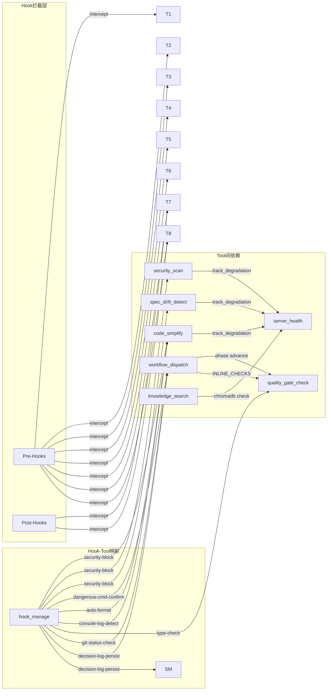
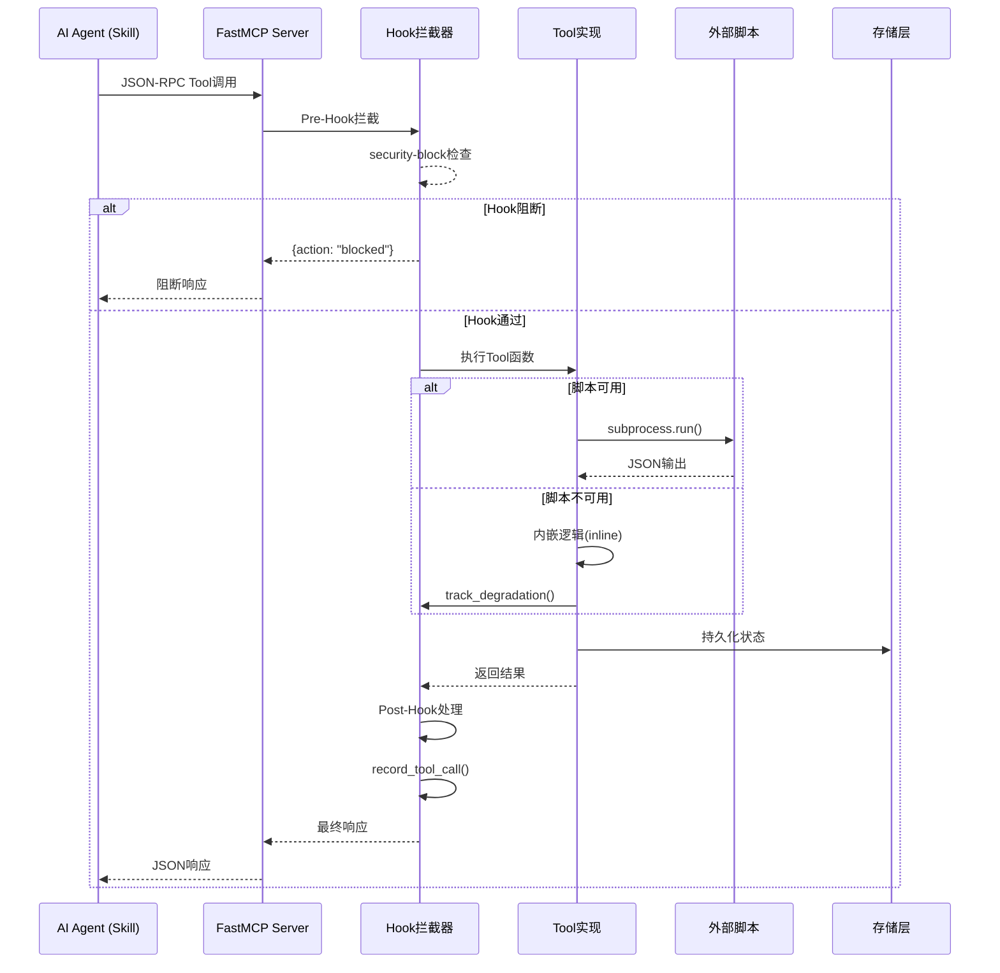
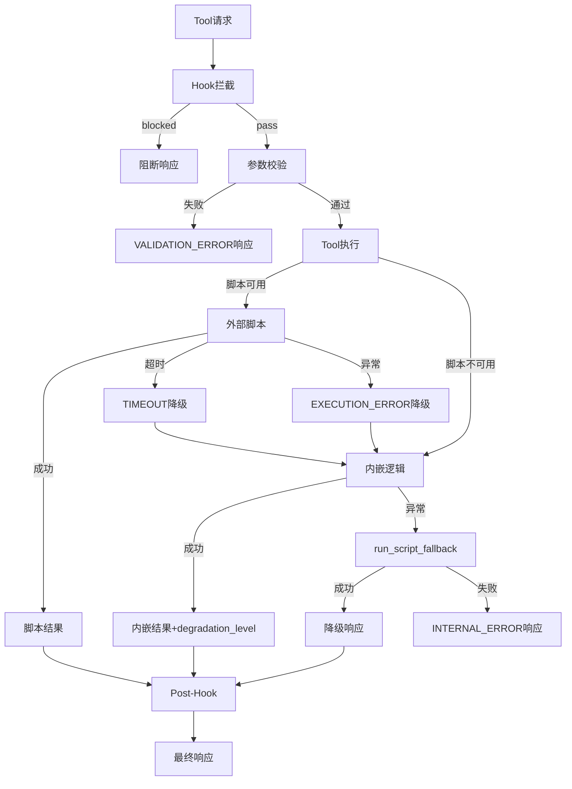

# Xuansto Skill MCP Server API 规格说明书

> 版本: 1.0.0 | 服务器版本: 3.5.0 | 生成日期: 2026-05-22
> 基于 `xuansto-mcp-server` 源码逆向生成，所有接口定义均来自实际代码

---

## 目录

1. [现有API调用清单](#1-现有api调用清单)
2. [接口依赖拓扑](#2-接口依赖拓扑)
3. [重构后API设计](#3-重构后api设计)
4. [接口契约规范](#4-接口契约规范)
5. [异常处理与重试策略](#5-异常处理与重试策略)

---

## 1. 现有API调用清单

### 1.1 内部API — MCP Tool调用协议

所有13个Tool通过MCP (Model Context Protocol) stdio传输层暴露，由 `FastMCP` 框架注册。调用方为Skill层（AI Agent），通过MCP协议发送JSON-RPC请求。

| # | Tool名称 | 传输方式 | 输入Schema | 返回Schema | 只读 | 幂等 | 降级脚本 |
|---|---------|---------|-----------|-----------|------|------|---------|
| 1 | `skill_analyze` | MCP/stdio | `SkillAnalyzeInput` | `{error, api_version, data}` | ✅ | ✅ | `scripts/skill-test.py --analyze` |
| 2 | `knowledge_search` | MCP/stdio | `KnowledgeSearchInput` | `{error, api_version, data, degradation_level}` | ❌ | ❌ | `scripts/knowledge-server.py --search` |
| 3 | `quality_gate_check` | MCP/stdio | `QualityGateCheckInput` | `{error, api_version, data}` | ✅ | ✅ | `scripts/skill-test.py --gate` |
| 4 | `spec_drift_detect` | MCP/stdio | `SpecDriftDetectInput` | `{error, api_version, data, degradation_level}` | ✅ | ✅ | `scripts/spec-drift-detector.py` |
| 5 | `security_scan` | MCP/stdio | `SecurityScanInput` | `{error, api_version, data, degradation_level}` | ✅ | ❌ | `scripts/agentic-security-scanner.py` |
| 6 | `code_simplify` | MCP/stdio | `CodeSimplifyInput` | `{error, api_version, data, degradation_level}` | ✅ | ✅ | `scripts/code-simplifier.py` |
| 7 | `session_manage` | MCP/stdio | `SessionManageInput` | `{error, api_version, data}` | ❌ | ❌ | `scripts/init-session.py` / `session-catchup.py` / `session-persist.py` |
| 8 | `workflow_dispatch` | MCP/stdio | `WorkflowDispatchInput` | `{error, api_version, data}` | ❌ | ❌ | `scripts/project-initializer.py` |
| 9 | `agent_status` | MCP/stdio | `AgentStatusInput` | `{error, api_version, data}` | ✅ | ✅ | 静态注册表查询 / `scripts/skill-test.py --agents` |
| 10 | `hook_manage` | MCP/stdio | `HookManageInput` | `{error, api_version, data}` | ❌ | ❌ | `scripts/check-encoding.py` / `token-budget-guard.py` / `session-persist.py` |
| 11 | `resource_load_status` | MCP/stdio | `ResourceLoadStatusInput` | `{error, api_version, data}` | ✅ | ✅ | 内联状态检查 |
| 12 | `context_compress` | MCP/stdio | `ContextCompressInput` | `{error, api_version, data}` | ✅ | ✅ | `scripts/context-compressor.py` |
| 13 | `server_health` | MCP/stdio | 无参数 | `{error, api_version, data}` | ✅ | ✅ | `scripts/health-checker.py` |

#### 1.1.1 Tool详细参数与返回值

##### skill_analyze

**调用位置**: `tools/skill_analyze.py:register()` → `_with_hook_interception()` 包装

**请求参数**:

| 参数 | 类型 | 必填 | 默认值 | 说明 |
|------|------|------|--------|------|
| `skill_path` | `str` | ✅ | — | 技能根目录路径 |
| `include_scripts` | `bool` | ❌ | `True` | 是否分析scripts目录 |
| `include_agents` | `bool` | ❌ | `True` | 是否分析agents目录 |
| `depth` | `str` | ❌ | `"basic"` | 分析深度: basic / full |

**返回值**:
```json
{
  "error": false,
  "api_version": "1.0.0",
  "data": {
    "metadata": {},
    "structure": {"root": "...", "exists": true, "directories": [], "files_count": 0},
    "agents": [{"name": "...", "layer": "..."}],
    "dependencies": {"total_scripts": 0, "by_type": {}},
    "issues": [{"type": "...", "file": "...", "severity": "..."}],
    "project_scale": "small|medium|large",
    "recommended_workflow": "sdd-tdd-fast|sdd-tdd-medium|sdd-tdd-full",
    "scale_details": {"file_count": 0, "loc_count": 0, "scale": "...", "recommended_workflow": "...", "workflow_phases": 3}
  }
}
```

**错误码**: `PATH_NOT_FOUND`, `VALIDATION_ERROR`, `INTERNAL_ERROR`

---

##### knowledge_search

**调用位置**: `tools/knowledge_search.py:register()`

**请求参数**:

| 参数 | 类型 | 必填 | 默认值 | 说明 |
|------|------|------|--------|------|
| `action` | `str` | ❌ | `"retrieve"` | 操作: retrieve / inject / precipitate |
| `query` | `str\|None` | 条件 | `None` | retrieve时必填 |
| `top_k` | `int` | ❌ | `5` | 返回数量上限 (1-50) |
| `search_type` | `str` | ❌ | `"hybrid"` | hybrid / semantic_only / keyword_only |
| `scope` | `str\|None` | ❌ | `None` | general / workspace / experience |
| `min_confidence` | `float` | ❌ | `0.0` | 最低置信度 (0.0-1.0) |
| `content` | `str\|None` | 条件 | `None` | inject时必填 |
| `knowledge_type` | `str` | ❌ | `"general"` | general / workspace / experience |
| `metadata` | `dict\|None` | ❌ | `None` | inject附加元数据 |
| `pattern_ids` | `list\|None` | 条件 | `None` | precipitate时必填 |

**降级链**: ChromaDB语义搜索 → SQLite FTS5 BM25 → 关键词TF-IDF

**返回值** (retrieve):
```json
{
  "error": false,
  "api_version": "1.0.0",
  "degradation_level": "chromadb|sqlite_fts5|keyword_fallback",
  "data": {
    "results": [{"source": "...", "content": "...", "match_type": "semantic|fts5|keyword", "relevance": 0.92}],
    "total": 5,
    "strategy": "chromadb_semantic|sqlite_fts5_bm25|keyword_tfidf"
  }
}
```

**错误码**: `VALIDATION_ERROR`, `INTERNAL_ERROR`

---

##### quality_gate_check

**调用位置**: `tools/quality_gate_check.py:register()`

**请求参数**:

| 参数 | 类型 | 必填 | 默认值 | 说明 |
|------|------|------|--------|------|
| `gate_ids` | `list\|None` | ❌ | `None` | 门禁ID列表，空则检查全部 |
| `phase` | `str\|None` | ❌ | `None` | 按阶段过滤 (0-8) |
| `project_path` | `str` | ❌ | `"."` | 项目根目录 |
| `severity_filter` | `str` | ❌ | `"all"` | all / BLOCK / WARN |
| `force_refresh` | `bool` | ❌ | `False` | 强制刷新缓存 |

**返回值**:
```json
{
  "error": false,
  "api_version": "1.0.0",
  "data": {
    "checks": [{"gate_id": "...", "status": "PASS|FAIL|SKIP|ERROR", "source": "script|inline|cache", "details": {}}],
    "summary": {"total": 10, "passed": 8, "failed": 1, "skipped": 1, "blocked": true},
    "cache_info": {"hit": true, "hit_count": 10, "miss_count": 0, "cache_age_seconds": 12.3}
  }
}
```

**错误码**: `VALIDATION_ERROR`, `INTERNAL_ERROR`

---

##### spec_drift_detect

**调用位置**: `tools/spec_drift_detect.py:register()`

**请求参数**:

| 参数 | 类型 | 必填 | 默认值 | 说明 |
|------|------|------|--------|------|
| `spec_dir` | `str` | ❌ | `".trae/specs"` | 规格文档目录 |
| `src_dir` | `str` | ❌ | `"."` | 源代码目录 |

**返回值**:
```json
{
  "error": false,
  "api_version": "1.0.0",
  "degradation_level": "script|inline",
  "data": {
    "total_specs": 3,
    "total_pending_tasks": 12,
    "drifts": [{"task": "...", "spec_file": "...", "has_implementation": true, "potential_files": [], "best_match": "...", "match_coverage": 0.8}],
    "implementation_rate": 0.75,
    "analysis_level": "ast|keyword_match|none",
    "interface_coverage": 0.75
  }
}
```

---

##### security_scan

**调用位置**: `tools/security_scan.py:register()`

**请求参数**:

| 参数 | 类型 | 必填 | 默认值 | 说明 |
|------|------|------|--------|------|
| `target` | `str` | ❌ | `"."` | 目标扫描目录 |
| `severity_threshold` | `str` | ❌ | `"medium"` | critical / high / medium / low |
| `include_agentic` | `bool` | ❌ | `True` | 是否包含OWASP Agentic检查 |
| `include_dependency` | `bool` | ❌ | `True` | 是否包含依赖漏洞扫描 |

**返回值**:
```json
{
  "error": false,
  "api_version": "1.0.0",
  "degradation_level": "none|inline",
  "data": {
    "agentic_scan": {"vulnerabilities": [...], "total": 5, "by_severity": {"critical": 0, "high": 1, "medium": 3, "low": 1}, "security_score": 72, "degradation_level": "inline"},
    "dependency_scan": {"dependencies": [...], "total": 15, "vulnerable_count": 2, "degradation_level": "inline"}
  }
}
```

---

##### code_simplify

**调用位置**: `tools/code_simplify.py:register()`

**请求参数**:

| 参数 | 类型 | 必填 | 默认值 | 说明 |
|------|------|------|--------|------|
| `target` | `str` | ✅ | — | 目标文件或目录路径 |
| `scope` | `str` | ❌ | `"recent"` | file / dir / recent |
| `include_dedup` | `bool` | ❌ | `True` | 是否包含重复代码检测 |

**返回值**:
```json
{
  "error": false,
  "api_version": "1.0.0",
  "degradation_level": "full|inline|partial",
  "data": {
    "simplification": {"suggestions": [...], "total": 8, "by_type": {"long_function": 2, "deep_nesting": 1, "unused_import": 3, "dead_code": 2, "high_complexity": 0}, "quality_score": 85, "analysis_level": "ast|text_level"},
    "deduplication": {"duplicates": [...], "total_groups": 3, "total_duplicate_lines": 42}
  }
}
```

---

##### session_manage

**调用位置**: `tools/session_manage.py:register()`

**请求参数**:

| 参数 | 类型 | 必填 | 默认值 | 说明 |
|------|------|------|--------|------|
| `action` | `str` | ✅ | — | save / load / list / detect / verify / track / restore |
| `completed_tasks` | `list\|None` | ❌ | `None` | save时使用 |
| `pending_tasks` | `list\|None` | ❌ | `None` | save/track时使用 |
| `decisions` | `list\|None` | ❌ | `None` | save/track时使用 |
| `experience` | `list\|None` | ❌ | `None` | save时使用 |
| `error_log` | `list\|None` | ❌ | `None` | detect时使用 |
| `pattern_path` | `str\|None` | ❌ | `None` | verify时使用 |
| `success` | `bool` | ❌ | `True` | verify时使用 |
| `current_phase` | `int\|None` | ❌ | `None` | track时使用 |
| `current_task` | `str\|None` | ❌ | `None` | track时使用 |

**返回值** (action=track):
```json
{
  "error": false,
  "api_version": "1.0.0",
  "data": {
    "current_phase": 4,
    "current_task": "实现用户认证模块",
    "decisions": ["ADR-001: 选择React"],
    "pending_tasks": ["任务3", "任务4"],
    "completed_phases": [0, 1, 2, 3],
    "timestamp": "2026-05-22T10:00:00",
    "updated_at": "2026-05-22T14:30:00"
  }
}
```

---

##### workflow_dispatch

**调用位置**: `tools/workflow_dispatch.py:register()`

**请求参数**:

| 参数 | 类型 | 必填 | 默认值 | 说明 |
|------|------|------|--------|------|
| `action` | `str` | ✅ | — | start / status / abort / phase / recover / snapshots |
| `workflow` | `str\|None` | 条件 | `None` | start时必填: sdd-tdd-full / sdd-tdd-medium / sdd-tdd-fast 等 |
| `project_path` | `str` | ❌ | `"."` | start时使用 |
| `workflow_id` | `str\|None` | 条件 | `None` | status/abort/phase/recover/snapshots时使用 |
| `phase_action` | `str\|None` | 条件 | `None` | phase时使用: advance / current |
| `snapshot_phase` | `int\|None` | ❌ | `None` | recover时恢复到指定阶段 |

**返回值** (action=start):
```json
{
  "error": false,
  "api_version": "1.0.0",
  "data": {
    "workflow_id": "wf-abc12345",
    "workflow": "sdd-tdd-full",
    "project_path": "/path/to/project",
    "status": "running",
    "current_phase": 0,
    "started_at": "2026-05-22T14:00:00+00:00",
    "completed_phases": [],
    "phase_definitions": [...]
  }
}
```

**返回值** (action=phase, phase_action=advance):
```json
{
  "error": false,
  "api_version": "1.0.0",
  "data": {
    "workflow_id": "wf-abc12345",
    "previous_phase": 3,
    "new_phase": 4,
    "advanced": true,
    "gates_passed": true,
    "gates_checked": [{"gate_id": "TEST-FIRST", "status": "PASS", "source": "inline"}],
    "message": "阶段推进: 测试先行 -> 代码实现"
  }
}
```

---

##### agent_status

**调用位置**: `tools/agent_status.py:register()`

**请求参数**:

| 参数 | 类型 | 必填 | 默认值 | 说明 |
|------|------|------|--------|------|
| `action` | `str` | ✅ | — | list / by_phase / detail / create / match / assign / release / instance_status / destroy / schedule |
| `phase` | `int\|None` | 条件 | `None` | by_phase时使用 (0-8) |
| `agent_name` | `str\|None` | 条件 | `None` | detail时使用 |
| `agent_type` | `str\|None` | 条件 | `None` | create时使用 |
| `capabilities` | `list\|None` | 条件 | `None` | create/match时使用 |
| `agent_id` | `str\|None` | 条件 | `None` | assign/release/instance_status/destroy时使用 |
| `task` | `str\|None` | 条件 | `None` | assign时使用 |

**返回值** (action=list):
```json
{
  "error": false,
  "api_version": "1.0.0",
  "data": {
    "agents": [{"name": "Orchestrator", "layer": "编排层"}],
    "total": 57
  }
}
```

**返回值** (action=create):
```json
{
  "error": false,
  "api_version": "1.0.0",
  "data": {
    "action": "create",
    "agent_id": "agent-abc12345",
    "agent_type": "developer",
    "capabilities": ["API开发", "数据库操作"],
    "status": "idle",
    "created_at": "2026-05-22T14:00:00+00:00",
    "task_count": 0,
    "total_duration_ms": 0
  }
}
```

---

##### hook_manage

**调用位置**: `tools/hook_manage.py:register()`

**请求参数**:

| 参数 | 类型 | 必填 | 默认值 | 说明 |
|------|------|------|--------|------|
| `action` | `str` | ✅ | — | list / execute |
| `profile` | `str` | ❌ | `"standard"` | minimal / standard / strict |
| `hook_name` | `str\|None` | 条件 | `None` | execute时使用 |
| `context` | `dict\|None` | ❌ | `None` | execute时使用 |

**Hook Profile映射**:
- **minimal**: `security-block`, `session-save`
- **standard**: `security-block`, `token-budget-check`, `auto-format`, `encoding-check`, `load-context`, `kb-health-check`, `session-save`, `git-status-check`, `experience-precipitate`, `save-state`
- **strict**: 全部16个Hook

**内嵌Hook逻辑**: `security-block`, `dangerous-cmd-confirm`, `auto-format`, `console-log-detect`, `type-check`, `git-status-check`, `decision-log-persist`

**返回值** (action=execute):
```json
{
  "error": false,
  "api_version": "1.0.0",
  "data": {
    "hook": "security-block",
    "status": "pass|block|warn|skipped",
    "message": "未检测到危险命令",
    "details": {},
    "source": "inline|script|inline_fallback"
  }
}
```

---

##### resource_load_status

**调用位置**: `tools/resource_load_status.py:register()`

**请求参数**:

| 参数 | 类型 | 必填 | 默认值 | 说明 |
|------|------|------|--------|------|
| `action` | `str` | ✅ | — | status / preload / cache / clear_cache / loading_progress |
| `phase` | `int\|None` | 条件 | `None` | 目标阶段 (0-8) |
| `resource_ids` | `list\|None` | ❌ | `None` | 指定资源ID列表 |
| `resource_uris` | `list\|None` | 条件 | `None` | preload时使用 |
| `priority` | `str` | ❌ | `"normal"` | critical / normal / background |
| `batch_mode` | `bool` | ❌ | `False` | 批量并发加载 |

**Phase-Resource映射**:
- Phase 0: `skill-config`, `agent-registry`, `quality-gates`
- Phase 1: `knowledge-general`, `brainstorm-workflow`
- Phase 2: `knowledge-patterns`, `sdd-tdd-full`
- Phase 3: `test-guidelines`
- Phase 4: `coding-standards`, `karpathy-guidelines`
- Phase 5: `security-guidelines`, `owasp-top10`
- Phase 6: `acceptance-criteria`
- Phase 7: `simplification-rules` (继承Phase 4)
- Phase 8: `desktop-guidelines`, `ipc-contracts`

**返回值** (action=status):
```json
{
  "error": false,
  "api_version": "1.0.0",
  "data": {
    "resources": [{"id": "skill-config", "type": "config", "path": ".skill-config.yaml", "status": "loaded|available|missing|stale|expired"}],
    "total": 3,
    "loaded": 2,
    "stale": 0,
    "expired": 0,
    "available_functions": {"command_routing": true, "quality_gates": true, ...},
    "disclosure_note": "增强阶段，完整脚本集需推进到完整阶段"
  }
}
```

---

##### context_compress

**调用位置**: `tools/context_compress.py:register()`

**请求参数**:

| 参数 | 类型 | 必填 | 默认值 | 说明 |
|------|------|------|--------|------|
| `content` | `str` | ✅ | — | 待压缩文本 |
| `strategy` | `str` | ❌ | `"semantic"` | semantic / selective / lossless |
| `target_tokens` | `int` | ❌ | `2000` | 目标Token数 (100-50000) |
| `preserve_sections` | `list\|None` | ❌ | `None` | 必须保留的章节标题 |

**返回值**:
```json
{
  "error": false,
  "api_version": "1.0.0",
  "data": {
    "compressed": "压缩后内容...",
    "original_tokens": 8500,
    "compressed_tokens": 1950,
    "compression_ratio": 0.23,
    "strategy": "semantic",
    "preserved_chunks": 3,
    "total_chunks": 15
  }
}
```

---

##### server_health

**调用位置**: `tools/server_health.py:register()`

**请求参数**: 无

**返回值**:
```json
{
  "error": false,
  "api_version": "1.0.0",
  "data": {
    "status": "healthy",
    "version": "3.5.0",
    "uptime_seconds": 86400.0,
    "tools_count": 13,
    "resources_count": 7,
    "active_workflows": 1,
    "snapshot_cleanup": {"workflows_checked": 1, "total_deleted": 0, "total_remaining": 3},
    "degradation_stats": {"chromadb_unavailable": 0, "security_scan": 2},
    "performance_metrics": {
      "skill_analyze": {"call_count": 10, "error_count": 0, "error_rate": 0.0, "latency_p50_ms": 120.5, "latency_p95_ms": 340.2, "latency_p99_ms": 510.8}
    },
    "services": {"chromadb": {"available": true, "latency_ms": 15.3}},
    "config": {"data_dir": "...", "skill_root": "...", "work_dir": "...", "data_dir_exists": true, "skill_root_exists": true}
  }
}
```

---

### 1.2 内部API — MCP Resource资源接口

7个Resource通过MCP协议暴露，提供只读数据访问。

| # | URI | 类型 | 数据源 | 说明 |
|---|-----|------|--------|------|
| 1 | `xuansto://config/skill` | 静态 | `SKILL_ROOT/.skill-config.yaml` | 技能配置文件 |
| 2 | `xuansto://references/quality-gates` | 静态 | `REFERENCES_DIR/quality-gates.md` | 质量门禁文档 |
| 3 | `xuansto://references/agent-registry` | 静态 | `REFERENCES_DIR/agent-registry.md` | Agent注册表 |
| 4 | `xuansto://references/workflow-phases` | 静态 | `REFERENCES_DIR/workflow-phases.md` | 工作流定义 |
| 5 | `xuansto://templates/{name}` | 模板 | `TEMPLATES_DIR/{name}.md` | 模板文件（路径遍历保护） |
| 6 | `xuansto://sessions/latest` | 动态 | `SESSION_DIR/session-*.md` | 最新会话记录 |
| 7 | `xuansto://loading/status` | 动态 | `WORK_DIR/resource_state.json` | 渐进式加载状态 |

**Resource 7 (loading/status) 详细返回**:
```json
{
  "current_phase": "skeleton|functional|enhanced|full",
  "phase_index": 0,
  "loaded_resources": ["skill-config", "agent-registry"],
  "loaded_count": 2,
  "available_references": ["quality-gates.md", "workflow-phases.md"],
  "available_functions": {"command_routing": true, "quality_gates": false, ...},
  "loading_progress": {},
  "disclosure_note": "骨架阶段，仅命令路由可用",
  "timestamp": 1747891200.0
}
```

---

### 1.3 内部API — 模块间接口

| 接口 | 调用方 | 被调方 | 调用方式 | 说明 |
|------|--------|--------|---------|------|
| `validate_input(schema, **kwargs)` | 所有Tool | `core/validator.py` | 函数调用 | Pydantic参数校验 |
| `make_success_response(data, degradation_level)` | 所有Tool | `core/errors.py` | 函数调用 | 构造成功响应 |
| `make_error_response(error)` | 所有Tool | `core/errors.py` | 函数调用 | 构造错误响应 |
| `run_script(script_path, args, timeout)` | spec_drift_detect, security_scan, code_simplify, hook_manage | `core/subprocess_utils.py` | 子进程调用 | 执行外部Python脚本 |
| `run_script_fallback(script_name, args, cwd, timeout)` | degradation.py所有降级函数 | `core/degradation.py` | 子进程调用 | 降级脚本执行 |
| `get_fallback(tool_name)` | server.py | `core/degradation.py` | 函数调用 | 获取降级函数 |
| `track_degradation(tool_name)` | spec_drift_detect, security_scan, code_simplify | `tools/server_health.py` | 函数调用 | 记录降级事件 |
| `record_tool_call(tool_name, latency_ms, success)` | server.py `_with_hook_interception` | `tools/server_health.py` | 函数调用 | 记录工具调用指标 |
| `async_execute_pre_hooks(tool_name, kwargs)` | server.py `_with_hook_interception` | `tools/hook_manage.py` | 异步函数调用 | 执行前置Hook |
| `async_execute_post_hooks(tool_name, kwargs, result)` | server.py `_with_hook_interception` | `tools/hook_manage.py` | 异步函数调用 | 执行后置Hook |
| `INLINE_CHECKS[gate_id](project_path)` | quality_gate_check, workflow_dispatch | `tools/quality_gate_check.py` | 函数调用 | 内嵌门禁检查 |
| `atomic_write(path, content)` | knowledge_search, quality_gate_check, session_manage, workflow_dispatch, agent_status, resource_load_status | `core/atomic_write.py` | 函数调用 | 原子文件写入 |
| `reload_config()` | config_watcher, CLI | `core/config.py` | 函数调用 | 热重载配置 |
| `_load_workflow(workflow_id)` | workflow_dispatch, degradation | `tools/workflow_dispatch.py` | 函数调用 | 加载工作流状态 |
| `_parse_agent_registry(path)` | skill_analyze, agent_status | 各自模块 | 函数调用 | 解析Agent注册表 |
| `_chromadb_search(query, top_k, scope, min_confidence)` | knowledge_search | `tools/knowledge_search.py` | 函数调用 | ChromaDB语义搜索 |
| `_sqlite_search(query, top_k, scope, min_confidence)` | knowledge_search | `tools/knowledge_search.py` | 函数调用 | SQLite FTS5搜索 |
| `_keyword_fallback_search(query, top_k, scope)` | knowledge_search | `tools/knowledge_search.py` | 函数调用 | 关键词降级搜索 |

---

### 1.4 外部API — CLI命令行接口

**入口**: `xuansto-cli` (通过 `cli.py:main()`)

| 命令 | 子命令 | 参数 | 映射Tool | 说明 |
|------|--------|------|---------|------|
| `health` | — | — | `server_health` | 健康检查 |
| `invoke` | — | `tool`, `--params` | 任意Tool | 通用工具调用 |
| `gate` | — | `gate_id`, `--project-path` | `quality_gate_check` | 门禁检查 |
| `version` | — | — | — | 显示版本号 |
| `config` | — | — | — | 显示当前配置 |
| `reload` | — | — | `core/config.reload_config` | 重载配置 |
| `workflow` | `start` | `workflow_name` | `workflow_dispatch(action=start)` | 启动工作流 |
| `workflow` | `status` | `--workflow-id` | `workflow_dispatch(action=status)` | 查询状态 |
| `workflow` | `recover` | `--workflow-id`, `--phase` | `workflow_dispatch(action=recover)` | 恢复工作流 |
| `workflow` | `snapshots` | `--workflow-id` | `workflow_dispatch(action=snapshots)` | 列出快照 |
| `session` | `save` | `--label` | `session_manage(action=track)` | 保存会话 |
| `session` | `load` | `--session-id` | `session_manage(action=restore)` | 加载会话 |
| `session` | `list` | — | `session_manage(action=list)` | 列出会话 |
| `agent` | `list` | — | `agent_status(action=list)` | 列出Agent |
| `agent` | `create` | `--type`, `--capabilities` | `agent_status(action=create)` | 创建Agent |
| `agent` | `match` | `--capabilities` | `agent_status(action=match)` | 匹配Agent |

**认证方式**: MCP协议通过stdio本地通信，无认证；CLI通过进程内直接调用Tool函数，无认证。

---

### 1.5 外部API — 第三方依赖接口

| 依赖 | 版本要求 | 调用位置 | 接口类型 | 说明 |
|------|---------|---------|---------|------|
| `mcp` (FastMCP) | — | `server.py`, 所有Tool | Python SDK | MCP协议框架，Tool/Resource注册 |
| `chromadb` | 可选 | `knowledge_search.py`, `server_health.py` | Python SDK | 向量语义搜索，PersistentClient |
| `pydantic` | — | `models/schemas.py`, `core/validator.py` | Python SDK | 输入校验，BaseModel |
| `yaml` (PyYAML) | 可选 | `core/config.py`, `skill_analyze.py`, `workflow_dispatch.py` | Python SDK | YAML配置解析 |
| `sqlite3` | 内置 | `knowledge_search.py` | Python内置 | FTS5全文搜索 |
| `subprocess` | 内置 | `quality_gate_check.py`, `core/subprocess_utils.py`, `core/degradation.py` | Python内置 | 外部脚本执行 |
| `ast` | 内置 | `spec_drift_detect.py`, `code_simplify.py` | Python内置 | Python AST解析 |
| `gzip` | 内置 | `workflow_dispatch.py` | Python内置 | 快照压缩存储 |

---

## 2. 接口依赖拓扑

### 2.1 系统架构总览

```mermaid
graph TB
    subgraph "Skill层 (AI Agent)"
        SKILL[Skill Prompt / SKILL.md]
    end

    subgraph "MCP协议层 (stdio)"
        MCP[FastMCP Server v3.5.0]
    end

    subgraph "Tool层 (13个工具)"
        T1[skill_analyze]
        T2[knowledge_search]
        T3[quality_gate_check]
        T4[spec_drift_detect]
        T5[security_scan]
        T6[code_simplify]
        T7[session_manage]
        T8[workflow_dispatch]
        T9[agent_status]
        T10[hook_manage]
        T11[resource_load_status]
        T12[context_compress]
        T13[server_health]
    end

    subgraph "Resource层 (7个资源)"
        R1[xuansto://config/skill]
        R2[xuansto://references/*]
        R3[xuansto://templates/*]
        R4[xuansto://sessions/latest]
        R5[xuansto://loading/status]
    end

    subgraph "核心层"
        CORE_VALIDATOR[core/validator]
        CORE_ERRORS[core/errors]
        CORE_CONFIG[core/config]
        CORE_DEGRADATION[core/degradation]
        CORE_SUBPROCESS[core/subprocess_utils]
        CORE_ATOMIC[core/atomic_write]
        CORE_LOGGING[core/logging_config]
    end

    subgraph "存储层"
        FS[(文件系统)]
        SQLITE[(SQLite FTS5)]
        CHROMA[(ChromaDB)]
        SCRIPTS[(scripts/*.py)]
    end

    SKILL -->|MCP JSON-RPC| MCP
    MCP --> T1 & T2 & T3 & T4 & T5 & T6 & T7 & T8 & T9 & T10 & T11 & T12 & T13
    MCP --> R1 & R2 & R3 & R4 & R5

    T1 & T2 & T3 & T4 & T5 & T6 & T7 & T8 & T9 & T10 & T11 & T12 --> CORE_VALIDATOR
    T1 & T2 & T3 & T4 & T5 & T6 & T7 & T8 & T9 & T10 & T11 & T12 & T13 --> CORE_ERRORS
    T1 & T2 & T3 & T4 & T5 & T6 & T7 & T8 & T9 & T10 & T11 & T12 & T13 --> CORE_CONFIG

    T4 & T5 & T6 & T10 --> CORE_SUBPROCESS
    T4 & T5 & T6 --> T13
    T2 --> CHROMA
    T2 --> SQLITE
    T3 & T4 & T5 & T6 & T10 --> SCRIPTS
    T7 & T8 & T11 --> CORE_ATOMIC
    CORE_DEGRADATION --> SCRIPTS
    CORE_CONFIG --> FS
```



### 2.2 Tool间调用关系



### 2.3 数据流与控制流



### 2.4 降级链路拓扑

```mermaid
graph TD
    subgraph "knowledge_search 降级链"
        KS1[ChromaDB语义搜索] -->|不可用| KS2[SQLite FTS5 BM25]
        KS2 -->|不可用| KS3[关键词TF-IDF]
        KS3 -->|不可用| KS4[run_script_fallback: knowledge-server.py]
    end

    subgraph "quality_gate_check 降级链"
        QG1[脚本: skill-test.py --gate] -->|脚本不存在| QG2[逐门禁脚本执行]
        QG2 -->|脚本不存在| QG3[INLINE_CHECKS内嵌检查]
        QG3 -->|无内嵌检查| QG4[SKIP标记]
    end

    subgraph "security_scan 降级链"
        SS1[脚本: agentic-security-scanner.py] -->|不可用| SS2[_inline_agentic_scan]
        SS2 -->|依赖扫描| SS3[脚本: dependency-scan.py]
        SS3 -->|不可用| SS4[_inline_dependency_scan]
    end

    subgraph "code_simplify 降级链"
        CD1[脚本: code-simplifier.py] -->|不可用| CD2[_inline_simplify]
        CD3[脚本: deduplication-detector.py] -->|不可用| CD4[_inline_dedup]
    end

    subgraph "spec_drift_detect 降级链"
        SDD1[脚本: spec-drift-detector.py] -->|不可用| SDD2[_inline_spec_drift]
    end

    subgraph "通用降级兜底"
        ANY[任意Tool] -->|MCP不可用| FB[run_script_fallback]
        FB -->|脚本不存在| FB2[_fallback_success 降级响应]
    end
```



---

## 3. 重构后API设计

### 3.1 Skill与MCP Server之间的接口 (Tool调用协议)

#### 3.1.1 当前架构

Skill层通过MCP stdio协议与Server通信，每次调用为独立JSON-RPC请求，无状态保持。

#### 3.1.2 重构建议：分层Tool协议

```mermaid
graph TB
    subgraph "L0 - 骨架层 (启动即加载)"
        L0_T[server_health]
        L0_R[resource_load_status action=status]
        L0_H[hook_manage action=list]
    end

    subgraph "L1 - 功能层 (Phase 0-2)"
        L1_T[skill_analyze]
        L1_Q[quality_gate_check]
        L1_S[session_manage action=save|load|list]
        L1_W[workflow_dispatch action=start|status]
        L1_A[agent_status action=list|by_phase|detail]
    end

    subgraph "L2 - 增强层 (Phase 3-6)"
        L2_K[knowledge_search]
        L2_SD[spec_drift_detect]
        L2_SS[security_scan]
        L2_CS[code_simplify]
        L2_RL[resource_load_status action=preload]
    end

    subgraph "L3 - 完整层 (Phase 7-8)"
        L3_C[context_compress]
        L3_HK[hook_manage action=execute]
        L3_WA[workflow_dispatch action=phase|recover]
        L3_AM[agent_status action=create|match|assign|release]
    end
```

#### 3.1.3 Tool调用协议规范

**请求格式** (MCP JSON-RPC):
```json
{
  "jsonrpc": "2.0",
  "method": "tools/call",
  "params": {
    "name": "tool_name",
    "arguments": {
      "param1": "value1"
    }
  },
  "id": 1
}
```

**响应格式** (统一信封):
```json
{
  "error": false,
  "api_version": "1.0.0",
  "data": {},
  "degradation_level": "none|script|inline|fallback",
  "hook_errors": []
}
```

### 3.2 MCP Server对外暴露的接口

#### 3.2.1 当前传输: stdio

当前仅支持stdio传输，适用于本地进程间通信。

#### 3.2.2 重构建议: 多传输支持

| 传输方式 | 适用场景 | 认证方式 | 延迟 |
|---------|---------|---------|------|
| stdio | 本地IDE集成 | 无需 | <1ms |
| SSE (Server-Sent Events) | Web客户端 | Bearer Token | 10-50ms |
| WebSocket | 实时双向通信 | JWT | 5-20ms |

**SSE传输配置**:
```python
mcp.run(transport="sse", host="127.0.0.1", port=8080)
```

**认证中间件建议**:
```python
from starlette.middleware import Middleware
from starlette.middleware.authentication import AuthenticationMiddleware

class BearerAuthBackend:
    async def authenticate(self, request):
        token = request.headers.get("Authorization", "").replace("Bearer ", "")
        if token in VALID_TOKENS:
            return AuthUser(token=token)
        return None
```

### 3.3 渐进式加载相关接口

#### 3.3.1 加载资源清单

**接口**: `resource_load_status(action="status")`

**渐进阶段定义**:

| 阶段 | 名称 | 可用功能 | 资源数 |
|------|------|---------|--------|
| skeleton | 骨架 | 命令路由 | 3 |
| functional | 功能 | +命令执行、质量门禁 | 5 |
| enhanced | 增强 | +知识检索、参考文档、Agent详情 | 8 |
| full | 完整 | +完整脚本集 | 全部 |

#### 3.3.2 上报加载进度

**接口**: `resource_load_status(action="loading_progress")`

**返回值**:
```json
{
  "action": "loading_progress",
  "total_resources": 15,
  "loaded_resources": 10,
  "progress_percent": 66.67,
  "current_phase": 4,
  "loading": true,
  "started_at": "2026-05-22T14:00:00+00:00",
  "completed_at": null
}
```

#### 3.3.3 获取特效状态

**接口**: `resource_load_status(action="cache")`

**返回值**:
```json
{
  "action": "cache",
  "cached_uris": ["xuansto://agents/registry", "xuansto://gates/definitions"],
  "cache_size": 45678,
  "total_entries": 5,
  "ttl_seconds": 3600,
  "max_entries": 100,
  "expired_entries": 0,
  "stale_entries": 1
}
```

---

## 4. 接口契约规范

### 4.1 请求Schema (JSON Schema片段)

#### 4.1.1 通用请求信封

```json
{
  "$schema": "http://json-schema.org/draft-07/schema#",
  "title": "MCPToolRequest",
  "type": "object",
  "properties": {
    "jsonrpc": {"type": "string", "const": "2.0"},
    "method": {"type": "string", "enum": ["tools/call", "resources/read", "resources/list"]},
    "params": {
      "type": "object",
      "properties": {
        "name": {"type": "string"},
        "arguments": {"type": "object"}
      },
      "required": ["name"]
    },
    "id": {"type": "integer"}
  },
  "required": ["jsonrpc", "method", "id"]
}
```

#### 4.1.2 各Tool输入Schema

**SkillAnalyzeInput**:
```json
{
  "type": "object",
  "additionalProperties": false,
  "required": ["skill_path"],
  "properties": {
    "skill_path": {"type": "string", "description": "技能根目录路径"},
    "include_scripts": {"type": "boolean", "default": true},
    "include_agents": {"type": "boolean", "default": true},
    "depth": {"type": "string", "enum": ["basic", "full"], "default": "basic"}
  }
}
```

**KnowledgeSearchInput**:
```json
{
  "type": "object",
  "additionalProperties": false,
  "properties": {
    "action": {"type": "string", "enum": ["retrieve", "inject", "precipitate"], "default": "retrieve"},
    "query": {"type": ["string", "null"]},
    "top_k": {"type": "integer", "minimum": 1, "maximum": 50, "default": 5},
    "search_type": {"type": "string", "enum": ["hybrid", "semantic_only", "keyword_only"], "default": "hybrid"},
    "scope": {"type": ["string", "null"], "enum": ["general", "workspace", "experience", null]},
    "min_confidence": {"type": "number", "minimum": 0.0, "maximum": 1.0, "default": 0.0},
    "content": {"type": ["string", "null"]},
    "knowledge_type": {"type": "string", "enum": ["general", "workspace", "experience"], "default": "general"},
    "metadata": {"type": ["object", "null"]},
    "pattern_ids": {"type": ["array", "null"], "items": {"type": "string"}}
  }
}
```

**QualityGateCheckInput**:
```json
{
  "type": "object",
  "additionalProperties": false,
  "properties": {
    "gate_ids": {"type": ["array", "null"], "items": {"type": "string"}},
    "phase": {"type": ["string", "null"]},
    "project_path": {"type": "string", "default": "."},
    "severity_filter": {"type": "string", "enum": ["all", "BLOCK", "WARN"], "default": "all"},
    "force_refresh": {"type": "boolean", "default": false}
  }
}
```

**SecurityScanInput**:
```json
{
  "type": "object",
  "additionalProperties": false,
  "properties": {
    "target": {"type": "string", "default": "."},
    "severity_threshold": {"type": "string", "enum": ["critical", "high", "medium", "low"], "default": "medium"},
    "include_agentic": {"type": "boolean", "default": true},
    "include_dependency": {"type": "boolean", "default": true}
  }
}
```

**WorkflowDispatchInput**:
```json
{
  "type": "object",
  "additionalProperties": false,
  "required": ["action"],
  "properties": {
    "action": {"type": "string", "enum": ["start", "status", "abort", "phase", "recover", "snapshots"]},
    "workflow": {"type": ["string", "null"]},
    "project_path": {"type": "string", "default": "."},
    "workflow_id": {"type": ["string", "null"]},
    "phase_action": {"type": ["string", "null"], "enum": ["advance", "current", null]},
    "snapshot_phase": {"type": ["integer", "null"]}
  }
}
```

**AgentStatusInput**:
```json
{
  "type": "object",
  "additionalProperties": false,
  "required": ["action"],
  "properties": {
    "action": {"type": "string", "enum": ["list", "by_phase", "detail", "create", "match", "assign", "release", "instance_status", "destroy", "schedule"]},
    "phase": {"type": ["integer", "null"], "minimum": 0, "maximum": 8},
    "agent_name": {"type": ["string", "null"]},
    "agent_type": {"type": ["string", "null"]},
    "capabilities": {"type": ["array", "null"], "items": {"type": "string"}},
    "agent_id": {"type": ["string", "null"]},
    "task": {"type": ["string", "null"]}
  }
}
```

### 4.2 响应Schema

#### 4.2.1 成功响应

```json
{
  "$schema": "http://json-schema.org/draft-07/schema#",
  "title": "SuccessResponse",
  "type": "object",
  "required": ["error", "api_version"],
  "properties": {
    "error": {"type": "boolean", "const": false},
    "api_version": {"type": "string", "pattern": "^\\d+\\.\\d+\\.\\d+$"},
    "data": {"type": "object"},
    "degradation_level": {"type": ["string", "null"], "enum": ["none", "script", "inline", "fallback", null]},
    "hook_errors": {"type": "array", "items": {"type": "object"}}
  }
}
```

#### 4.2.2 错误响应

```json
{
  "$schema": "http://json-schema.org/draft-07/schema#",
  "title": "ErrorResponse",
  "type": "object",
  "required": ["error", "code", "message"],
  "properties": {
    "error": {"type": "boolean", "const": true},
    "code": {"type": "string"},
    "message": {"type": "string"},
    "details": {"type": "object"}
  }
}
```

### 4.3 错误码体系

| 错误码 | HTTP等价 | 说明 | 来源 |
|--------|---------|------|------|
| `VALIDATION_ERROR` | 400 | 参数校验失败 | `core/errors.py:ValidationError` |
| `PATH_NOT_FOUND` | 404 | 路径不存在 | `core/errors.py:PathNotFoundError` |
| `SCRIPT_EXECUTION_ERROR` | 500 | 脚本执行失败 | `core/errors.py:ScriptExecutionError` |
| `DEGRADATION` | 503 | 服务降级 | `core/errors.py:DegradationError` |
| `INTERNAL_ERROR` | 500 | 内部错误 | `core/errors.py:make_error_response` |
| `SCRIPT_NOT_FOUND` | 404 | 降级脚本不存在 | `core/degradation.py` |
| `TIMEOUT` | 504 | 执行超时 | `core/degradation.py` |
| `EXECUTION_ERROR` | 500 | 降级执行错误 | `core/degradation.py` |
| `TOOL_NOT_FOUND` | 404 | 工具未注册 | `cli.py` |
| `INVALID_JSON` | 400 | JSON解析失败 | `cli.py` |
| `WORKFLOW_NOT_FOUND` | 404 | 工作流不存在 | `tools/workflow_dispatch.py` |
| `NOT_FOUND` | 404 | Agent/资源不存在 | `tools/agent_status.py` |
| `AGENT_BUSY` | 409 | Agent忙碌中 | `tools/agent_status.py` |
| `RECOVER_FAILED` | 500 | 快照恢复失败 | `tools/workflow_dispatch.py` |
| `YAML_PARSE_ERROR` | 400 | YAML配置解析失败 | `core/config.py` |

### 4.4 版本管理建议

#### 4.4.1 当前版本策略

- `MCP_API_VERSION = "1.0.0"` (硬编码于 `core/config.py`)
- 服务器版本 `3.5.0` (硬编码于 `server.py` FastMCP instructions)
- 无语义化版本协商机制

#### 4.4.2 重构建议

1. **API版本嵌入响应**: 当前 `make_success_response` 已包含 `api_version`，保持此模式
2. **版本协商**: 建议在MCP握手阶段增加 `client_api_version` 声明
3. **向后兼容**: 新增字段不破坏旧客户端；删除字段需递增主版本号
4. **版本矩阵**:

| Server版本 | API版本 | 兼容性 |
|-----------|---------|--------|
| 3.5.0 | 1.0.0 | 当前 |
| 4.0.0 | 2.0.0 | 破坏性变更(Tool重命名/参数移除) |

5. **配置文件版本化**: `.xuansto-config.yaml` 增加 `config_version` 字段

---

## 5. 异常处理与重试策略

### 5.1 异常处理架构



### 5.2 网络超时策略

| 场景 | 超时时间 | 来源 | 重试 | 降级 |
|------|---------|------|------|------|
| 脚本执行 (通用) | 30s | `subprocess_utils.py` | ❌ | 内嵌逻辑 |
| 安全扫描脚本 | 120s | `security_scan.py` | ❌ | `_inline_agentic_scan` |
| 依赖扫描脚本 | 60s | `security_scan.py` | ❌ | `_inline_dependency_scan` |
| 规格偏差脚本 | 60s | `spec_drift_detect.py` | ❌ | `_inline_spec_drift` |
| 代码简化脚本 | 60s | `code_simplify.py` | ❌ | `_inline_simplify` |
| 降级脚本执行 | 15-60s | `degradation.py` | ❌ | `_fallback_success` |
| SQLite查询 | 5s busy_timeout | `knowledge_search.py` | 自动重试 | 关键词搜索 |
| ChromaDB查询 | 无显式超时 | `knowledge_search.py` | ❌ | SQLite FTS5 |
| Git命令 | 10s | `hook_manage.py` | ❌ | 跳过检查 |
| pytest收集 | 30s | `quality_gate_check.py` | ❌ | 文件名匹配 |

### 5.3 加载失败处理

#### 5.3.1 资源加载失败

| 失败场景 | 处理策略 | 恢复方式 |
|---------|---------|---------|
| 资源文件不存在 | 返回 `status: "missing"` | 创建缺失文件或跳过 |
| 资源文件过大 (>1MB单文件) | 跳过，记录到 `skipped_large_files` | 拆分文件 |
| 总资源超限 (>10MB) | 截断，`truncated: true` | 减少预加载量 |
| 缓存过期 | 自动刷新缓存 | 重新preload |
| 缓存失效 (hash不匹配) | 标记 `stale`，重新加载 | 重新preload |

#### 5.3.2 工作流恢复

| 失败场景 | 处理策略 | 恢复方式 |
|---------|---------|---------|
| Server崩溃重启 | `load_on_startup()` 恢复 `_ACTIVE_WORKFLOWS` | 自动恢复 |
| 快照损坏 | 跳过损坏快照，尝试更早快照 | `workflow_dispatch(action=recover)` |
| Phase推进门禁失败 | 返回 `advanced: false` + 修复建议 | 修复后重新advance |
| 工作流状态文件损坏 | 日志警告，跳过 | 手动恢复 |

#### 5.3.3 会话恢复

| 失败场景 | 处理策略 | 恢复方式 |
|---------|---------|---------|
| Server重启 | `restore_on_startup()` 加载 `current.json` | 自动恢复 |
| 会话文件损坏 | 返回 `no_tracked_session` | 重新track |
| 旧会话堆积 | `_cleanup_old_sessions(max_sessions=10)` | 自动清理 |

### 5.4 降级方案

#### 5.4.1 三级降级体系

```
Level 0: 完整功能 (脚本 + ChromaDB + 全部检查)
    ↓ 脚本不可用
Level 1: 内嵌逻辑 (inline Python实现，功能缩减)
    ↓ MCP Server不可用
Level 2: 脚本兜底 (run_script_fallback，独立进程)
    ↓ 脚本也不可用
Level 3: 降级响应 (_fallback_success，返回最小可用数据)
```

#### 5.4.2 各Tool降级矩阵

| Tool | Level 0 | Level 1 | Level 2 | Level 3 |
|------|---------|---------|---------|---------|
| skill_analyze | 脚本分析 | 内嵌YAML/目录扫描 | `skill-test.py` | 静态降级响应 |
| knowledge_search | ChromaDB+FTS5 | FTS5 BM25 | 关键词搜索 | `knowledge-server.py` |
| quality_gate_check | 脚本+内嵌 | 内嵌检查 | `skill-test.py --gate` | 逐门禁脚本 |
| spec_drift_detect | 脚本AST分析 | 内嵌AST+关键词 | `spec-drift-detector.py` | 降级响应 |
| security_scan | 脚本扫描 | 内嵌正则扫描 | `agentic-security-scanner.py` | 降级响应 |
| code_simplify | 脚本分析 | 内嵌AST+文本分析 | `code-simplifier.py` | 降级响应 |
| session_manage | 内存+持久化 | 内存临时状态 | `session-persist.py` | 降级响应 |
| workflow_dispatch | 完整调度 | 内联Phase推进 | `project-initializer.py` | 降级响应 |
| agent_status | 动态注册表 | 静态文件扫描 | `skill-test.py --agents` | 降级响应 |
| hook_manage | 脚本+内嵌 | 内嵌Hook逻辑 | 脚本执行 | 空Hook列表 |
| resource_load_status | 缓存+文件 | 文件系统直读 | 状态文件读取 | 降级响应 |
| context_compress | 脚本压缩 | 内嵌分块压缩 | `context-compressor.py` | 降级响应 |
| server_health | 完整指标 | 基本状态 | `health-checker.py` | 降级响应 |

#### 5.4.3 降级自动恢复

| 组件 | 检测机制 | 恢复条件 |
|------|---------|---------|
| ChromaDB | `_check_chromadb_health()` (每次server_health调用) | 连接成功时清除 `_DEGRADATION_COUNTS` |
| 外部脚本 | 文件存在性检查 (`script_path.exists()`) | 脚本文件恢复后自动升级 |
| 配置热重载 | `_config_watcher` 每5秒检查文件mtime | 配置文件修改后自动重载 |

### 5.5 重试策略建议

#### 5.5.1 当前状态

当前实现**无自动重试机制**。所有失败直接降级到下一级。

#### 5.5.2 建议重试策略

| 场景 | 重试次数 | 退避策略 | 超时 |
|------|---------|---------|------|
| ChromaDB查询 | 2次 | 指数退避 (1s, 2s) | 5s/query |
| SQLite查询 | 1次 | 固定间隔 (0.5s) | 5s busy_timeout |
| 脚本执行 | 0次 (直接降级) | — | 30-120s |
| 资源预加载 | 1次 | 固定间隔 (1s) | 无 |
| 工作流Phase推进 | 0次 (返回失败建议) | — | — |

**重试实现建议**:
```python
import asyncio
from functools import wraps

def with_retry(max_retries: int = 2, backoff_base: float = 1.0):
    def decorator(func):
        @wraps(func)
        async def wrapper(*args, **kwargs):
            last_error = None
            for attempt in range(max_retries + 1):
                try:
                    return await func(*args, **kwargs)
                except Exception as e:
                    last_error = e
                    if attempt < max_retries:
                        delay = backoff_base * (2 ** attempt)
                        await asyncio.sleep(delay)
            raise last_error
        return wrapper
    return decorator
```

---

## 附录A: 配置路径映射

| 环境变量 | 默认值 | 说明 |
|---------|--------|------|
| `XUANSTO_SKILL_ROOT` | `{DATA_DIR}` | 技能根目录 |
| `XUANSTO_WORK_DIR` | `{project_root}/.xuansto` | 工作目录 |

**关键目录**:

| 路径常量 | 默认值 | 用途 |
|---------|--------|------|
| `DATA_DIR` | `{package}/data` | 内置数据 |
| `SKILL_ROOT` | `{DATA_DIR}` 或 `$XUANSTO_SKILL_ROOT` | 技能文件根 |
| `WORK_DIR` | `{project_root}/.xuansto` | 运行时状态 |
| `SESSION_DIR` | `{WORK_DIR}/sessions` | 会话文件 |
| `PATTERNS_DIR` | `{WORK_DIR}/patterns` | 模式文件 |
| `SCRIPTS_DIR` | `{SKILL_ROOT}/scripts` | 外部脚本 |
| `KNOWLEDGE_DIR` | `{SKILL_ROOT}/knowledge` | 知识库 |
| `KNOWLEDGE_DB_PATH` | `{KNOWLEDGE_DIR}/index/knowledge.db` | SQLite索引 |
| `KNOWLEDGE_CHROMA_PATH` | `{KNOWLEDGE_DIR}/index/chroma_db` | ChromaDB索引 |
| `WORKFLOWS_DIR` | `{SKILL_ROOT}/workflows` | 工作流定义 |
| `TEMPLATES_DIR` | `{SKILL_ROOT}/templates` | 模板文件 |
| `REFERENCES_DIR` | `{SKILL_ROOT}/references` | 参考文档 |
| `AGENTS_DIR` | `{SKILL_ROOT}/agents` | Agent定义 |
| `HOOKS_PATH` | `{SKILL_ROOT}/hooks/hooks.json` | Hook配置 |

## 附录B: 门禁-阶段映射

| Phase | 名称 | 门禁列表 |
|-------|------|---------|
| 0 | 初始化 | DESIGN-SYSTEM-COMPLETE, ANTI-PATTERN-CHECK, DESIGN-REVIEW-PRODUCT, DESIGN-REVIEW-TECH, DESIGN-REVIEW-DESIGN |
| 1 | 需求分析 | BRAINSTORM-COMPLETE, GATE-001, GATE-002 |
| 2 | 架构设计 | PLAN-ATOMIC, GATE-003, GATE-004 |
| 3 | 测试先行 | TEST-FIRST |
| 4 | 代码实现 | SUBAGENT-REVIEW, REVIEW-CONFIDENCE, GATE-007, TEST-PASS, GATE-009, FILE-ENCODING |
| 5 | 测试验证 | PLAYWRIGHT-E2E-PASS, GATE-011, GATE-012, AI-PENTEST, SPEC-CONSISTENCY |
| 6 | 验收确认 | GATE-013, GATE-014, INFRA-HEALTH, UX-ACCEPTANCE |
| 7 | 持续重构 | SIMPLIFICATION-BEHAVIOR, CHESTERTON-FENCE, GATE-015 |
| 8 | 部署交付 | DESKTOP-BUILD, DESKTOP-SIGN, DESKTOP-UPDATE, DESKTOP-CROSS, IPC-CONTRACT |

## 附录C: Agent-阶段映射

| Phase | Agent列表 |
|-------|----------|
| 0 | Orchestrator, Design System Generator, UI Designer |
| 1 | Product Manager, Brainstorming Facilitator, Knowledge Manager |
| 2 | System Architect, Technical Writer, Knowledge Manager |
| 3 | Test Architect, Unit Tester |
| 4 | Backend Developer, Frontend Developer, Fullstack Developer, Subagent Dispatcher, Task Coordinator |
| 5 | Security Auditor, AI Penetration Tester, E2E Tester, Integration Tester |
| 6 | QA Engineer, UX Designer, Compliance Officer |
| 7 | Refactoring Specialist, Code Reviewer, History Analyzer |
| 8 | Build-Release Engineer, CI/CD Specialist, Runtime Supervisor |
