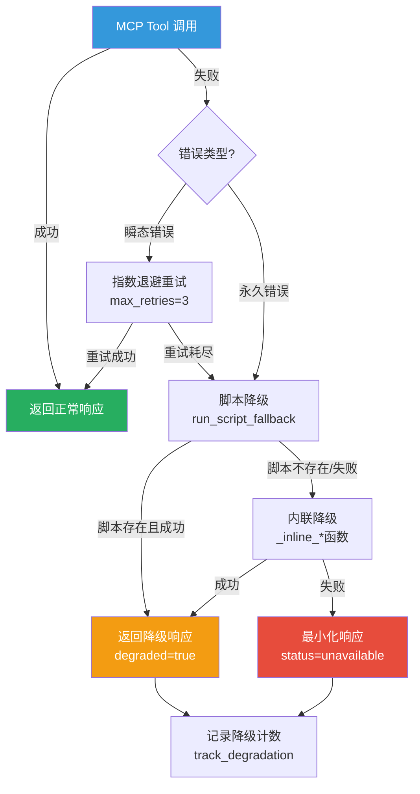

# Xuansto Skill V2 — API 接口规格说明书

> 版本: 3.0.0 | 最低兼容: 2.0.0 | Skill版本: 8.0.0
> 生成日期: 2026-05-25

---

## 目录

1. [现有 API 调用清单](#1-现有-api-调用清单)
2. [接口依赖拓扑图](#2-接口依赖拓扑图)
3. [重构后 API 设计](#3-重构后-api-设计)
4. [接口契约](#4-接口契约)
5. [异常处理、重试与降级方案](#5-异常处理重试与降级方案)

---

## 1. 现有 API 调用清单

### 1.1 内部 API（模块间调用）

#### 1.1.1 server.py → tools/* (20个工具模块)

`server.py` 通过 `register(mcp)` 将20个工具模块注册到 FastMCP 实例：

| 模块 | 工具函数名 | 注册方式 |
|------|-----------|---------|
| `skill_analyze` | `skill_analyze` | `register(mcp)` |
| `knowledge_search` | `knowledge_search` | `register(mcp)` |
| `knowledge_inject` | `knowledge_inject` | `register(mcp)` |
| `quality_gate_check` | `quality_gate_check` | `register(mcp)` |
| `spec_drift_detect` | `spec_drift_detect` | `register(mcp)` |
| `security_scan` | `security_scan` | `register(mcp)` |
| `code_simplify` | `code_simplify` | `register(mcp)` |
| `session_manage` | `session_manage` | `register(mcp)` |
| `workflow_dispatch` | `workflow_dispatch` | `register(mcp)` |
| `agent_status` | `agent_status` | `register(mcp)` |
| `agent_manage` | `agent_manage` | `register(mcp)` |
| `hook_manage` | `hook_manage` | `register(mcp)` |
| `resource_load_status` | `resource_load_status` | `register(mcp)` |
| `context_compress` | `context_compress` | `register(mcp)` |
| `server_health` | `server_health` | `register(mcp)` |
| `decision_log` | `decision_log` | `register(mcp)` |
| `token_budget` | `token_budget` | `register(mcp)` |
| `project_init` | `project_init` | `register(mcp)` |
| `metrics_report` | `metrics_report` | `register(mcp)` |
| `config_manage` | `config_manage` | `register(mcp)` |

注册流程：`server.py` 替换 `mcp.tool` 装饰器为 `_tool_with_hooks`，在每个工具调用前后插入 Hook 拦截逻辑。

#### 1.1.2 server.py → resources/skill_resources.py

通过 `skill_resources.register(mcp)` 注册 MCP Resource，提供只读状态快照：

| Resource URI | 类型 | 说明 |
|-------------|------|------|
| `xuansto://config/skill` | 静态 | 技能配置文件(.skill-config.yaml) |
| `xuansto://references/quality-gates` | 静态 | 质量门禁参考文档 |
| `xuansto://references/agent-registry` | 静态 | Agent注册表参考文档 |
| `xuansto://references/workflow-phases` | 静态 | 工作流阶段定义 |
| `xuansto://templates/{name}` | 模板 | 模板文件按名访问 |
| `xuansto://sessions/latest` | 静态 | 最近会话记录 |
| `xuansto://sessions/{session_id}` | 模板 | 按ID访问会话 |
| `xuansto://agents/{layer}/{name}` | 模板 | 按层级和名称访问Agent |
| `xuansto://loading/status` | 静态 | 渐进式加载状态 |
| `xuansto://metrics/summary` | 静态 | 指标汇总 |
| `xuansto://degradation/status` | 静态 | 降级状态 |
| `xuansto://skill/config` | 静态 | 统一技能配置 |
| `xuansto://skill/constraints` | 静态 | 技能约束 |
| `xuansto://agents/registry` | 静态 | Agent注册表 |
| `xuansto://gates/definitions` | 静态 | 门禁定义 |
| `xuansto://workflows/definitions` | 静态 | 工作流定义 |
| `xuansto://hooks/definitions` | 静态 | Hook定义 |
| `xuansto://knowledge/status` | 静态 | 知识库状态 |
| `xuansto://templates/index` | 静态 | 模板索引 |
| `xuansto://commands/routes` | 静态 | 命令路由表 |
| `xuansto://session/state` | 静态 | 会话状态 |
| `xuansto://health/status` | 静态 | 健康状态 |

#### 1.1.3 server.py → core/hook_engine.py (Pre/Post Hooks)

调用链路：
```
server._with_hook_interception()
  → hook_engine.execute_pre_hooks(tool_name, kwargs)
      → _global_pre_hooks + _pre_hooks[tool_name]
  → [执行工具本体]
  → hook_engine.execute_post_hooks(tool_name, kwargs, result)
      → _global_post_hooks + _post_hooks[tool_name]
```

Hook 类型枚举 (`HookType`)：
- `PRE` / `POST` — 工具调用前后
- `PHASE_ENTER` / `PHASE_EXIT` — 工作流阶段进出
- `GATE_PASS` / `GATE_FAIL` — 门禁通过/失败
- `SESSION_START` / `SESSION_STOP` — 会话启停

#### 1.1.4 server.py → core/rate_limiter.py (限流)

```
server._with_hook_interception()
  → rate_limiter.check_rate_limit(tool_name)
      → TokenBucket.consume()
      → 返回 (allowed: bool, info: dict)
```

默认配置：每工具 60 tokens/分钟，1 token/秒补充速率。

#### 1.1.5 server.py → core/degradation.py (降级)

```
server._with_hook_interception() [异常时]
  → errors.DegradationCoordinator.handle()
      → degradation.get_fallback(tool_name)
          → FALLBACK_MAP[tool_name](**kwargs)
              → run_script_fallback() / _inline_*()
```

#### 1.1.6 tools/* → core/database.py (SQLite 访问)

所有需要持久化的工具通过 `database.py` 访问 SQLite：

| 函数 | 用途 |
|------|------|
| `get_db()` | 获取数据库连接(WAL模式) |
| `init_db()` | 初始化表结构(11张表) |
| `persist_state(table, data)` | 通用UPSERT写入 |
| `load_state(table, query)` | 通用条件查询 |
| `persist_knowledge_dual_write()` | 知识库双写(SQLite+ChromaDB) |
| `reconcile_knowledge_stores()` | 知识库一致性修复 |
| `is_fts5_available()` | FTS5全文检索可用性检测 |

数据库表清单：
- `workflow_instances` — 工作流实例
- `session_states` — 会话状态
- `resource_load_states` — 资源加载状态
- `degradation_states` — 降级状态
- `error_patterns` — 错误模式
- `metrics` — 指标记录
- `decision_records` — 决策记录
- `knowledge_entries` — 知识条目
- `reconciliation_log` — 一致性修复日志
- `token_budget_states` — Token预算状态
- `experience_patterns` — 经验模式

#### 1.1.7 tools/* → core/config.py (配置)

所有工具通过 `config.py` 读取路径和配置：

| 配置项 | 值 |
|--------|-----|
| `SKILL_ROOT` | `.trae/skills/xuansto-skill-v2/` |
| `SCRIPTS_DIR` | `SKILL_ROOT/scripts/` |
| `REFERENCES_DIR` | `SKILL_ROOT/references/` |
| `AGENTS_DIR` | `SKILL_ROOT/agents/` |
| `COMMANDS_DIR` | `SKILL_ROOT/commands/` |
| `WORK_DIR` | `.xuansto/` |
| `KNOWLEDGE_CHROMA_PATH` | `data/knowledge/index/chroma_db/` |
| `KNOWLEDGE_DB_PATH` | `data/knowledge/index/knowledge.db` |
| `MCP_API_VERSION` | `3.0.0` |
| `MCP_MIN_SUPPORTED_VERSION` | `2.0.0` |
| `GATE_SCRIPTS_MAP` | 门禁→脚本映射(5项) |
| `QUALITY_GATES_PHASE_MAP` | 阶段→门禁映射(9阶段) |
| `HOOK_SCRIPTS_MAP` | Hook→脚本映射(18项) |

#### 1.1.8 tools/knowledge_search.py → ChromaDB/SQLite (向量/关键词搜索)

搜索降级链路：
```
ChromaDB (向量语义搜索)
  ↓ 不可用
SQLite FTS5 (全文检索)
  ↓ 不可用
LIKE 关键词匹配
```

### 1.2 外部 API

#### 1.2.1 MCP stdio 传输 (JSON-RPC)

MCP Server 通过 stdio 传输层与客户端通信，使用 JSON-RPC 2.0 协议：

- **传输方式**: 标准输入/输出流
- **协议**: MCP (Model Context Protocol) over JSON-RPC 2.0
- **启动**: `mcp.run(transport="stdio")`
- **消息格式**: 请求/响应/通知三类消息

#### 1.2.2 Knowledge Server HTTP API (FastAPI, 可选)

知识服务器可选部署为独立 HTTP 服务：

- **端口**: 8765
- **框架**: FastAPI
- **路径**: `SCRIPTS_DIR/knowledge_server/`
- **用途**: 提供知识检索和注入的 HTTP 接口

#### 1.2.3 Script 降级 API (subprocess 调用)

当 MCP 工具不可用时，通过子进程调用 Python 脚本：

| 工具 | 脚本 | 参数 |
|------|------|------|
| `skill_analyze` | `scripts/skill-test.py` | `--analyze --path --format json` |
| `knowledge_search` | `scripts/knowledge-server.py` | `--search --query --format json` |
| `knowledge_inject` | `scripts/knowledge-server.py` | `--inject --action --scope --format json` |
| `quality_gate_check` | `scripts/skill-test.py` | `--gate --format json` |
| `spec_drift_detect` | `scripts/spec-drift-detector.py` | `--spec-dir --src-dir --format json` |
| `security_scan` | `scripts/agentic-security-scanner.py` | `--target --severity-threshold --format json` |
| `code_simplify` | `scripts/code-simplifier.py` | `--target --scope --format json` |
| `session_manage` | `scripts/session-persist.py` | `save/load/list --format json` |
| `workflow_dispatch` | `scripts/project-initializer.py` | `--format json` |
| `context_compress` | `scripts/context-compressor.py` | `--strategy --format json` |
| `server_health` | `scripts/health-checker.py` | `--format json` |
| `decision_log` | `scripts/decision-log.py` | `--action --format json` |
| `token_budget` | `scripts/token-budget-guard.py` | `--action --format json` |
| `metrics_report` | `scripts/test-reporter.py` | `--action --format json` |
| `project_init` | `scripts/project-initializer.py` | `--action --format json` |

---

## 2. 接口依赖拓扑图

```mermaid
graph TB
    Client[客户端 / AI Agent] -->|stdio JSON-RPC| MCPServer[MCP Server<br/>FastMCP]
    Client -.->|HTTP :8765 可选| KnowledgeServer[Knowledge Server<br/>FastAPI]

    MCPServer -->|register| Tools[20个工具模块<br/>tools/*]
    MCPServer -->|register| Resources[MCP Resources<br/>skill_resources.py]
    MCPServer -->|pre/post hooks| HookEngine[HookEngine<br/>hook_engine.py]
    MCPServer -->|rate limit| RateLimiter[RateLimiter<br/>rate_limiter.py]
    MCPServer -->|fallback| Degradation[DegradationManager<br/>degradation.py]

    Tools -->|CRUD| SQLite[(SQLite<br/>xuansto.db)]
    Tools -->|向量搜索| ChromaDB[(ChromaDB<br/>chroma_db/)]
    Tools -->|配置读取| Config[Config<br/>config.py]
    Tools -->|通知| Notifications[Notifications<br/>notifications.py]

    knowledge_search -->|语义搜索| ChromaDB
    knowledge_search -->|FTS5/LIKE| SQLite
    knowledge_inject -->|双写| SQLite
    knowledge_inject -->|双写| ChromaDB

    Degradation -->|subprocess| Scripts[Python 脚本<br/>scripts/*]
    Degradation -->|inline fallback| InlineFallback[内联降级函数<br/>_inline_*()]

    Resources -->|读取| FileSystem[文件系统<br/>SKILL_ROOT/]
    Resources -->|读取| SQLite

    HookEngine -->|加载配置| HooksConfig[hooks.json]
    HookEngine -->|执行脚本| Scripts

    Config -->|热重载| YAMLConfig[.xuansto-config.yaml]
    Config -->|watchfiles/polling| YAMLConfig

    Skill[Skill 定义<br/>xuansto-skill-v2] -->|MCP Tool 调用| MCPServer
    Skill -.->|降级调用| Scripts

    style Client fill:#4A90D9,color:#fff
    style MCPServer fill:#E67E22,color:#fff
    style SQLite fill:#27AE60,color:#fff
    style ChromaDB fill:#8E44AD,color:#fff
    style Scripts fill:#C0392B,color:#fff
    style Degradation fill:#F39C12,color:#fff
```

---

## 3. 重构后 API 设计

### 3.1 Skill ↔ MCP Server Tool 调用协议

#### 3.1.1 请求格式

Skill 通过 MCP 协议调用工具，请求格式遵循 JSON-RPC 2.0：

```json
{
  "jsonrpc": "2.0",
  "id": 1,
  "method": "tools/call",
  "params": {
    "name": "<tool_name>",
    "arguments": {
      "action": "<action>",
      "...": "..."
    }
  }
}
```

#### 3.1.2 响应格式

统一响应格式：

```json
{
  "error": false,
  "api_version": "3.0.0",
  "data": {
    "...": "..."
  }
}
```

降级响应附加字段：

```json
{
  "error": false,
  "api_version": "3.0.0",
  "data": { "...": "..." },
  "degradation_level": "L2_LOCAL_SEMANTIC",
  "degraded": true
}
```

### 3.2 MCP Server 对外接口 (stdio + HTTP 统一)

#### 3.2.1 stdio 传输 (主通道)

- 协议: MCP over JSON-RPC 2.0
- 方法: `tools/list`, `tools/call`, `resources/read`, `resources/list`, `prompts/list`, `prompts/get`
- 启动: `mcp.run(transport="stdio")`

#### 3.2.2 HTTP 传输 (可选扩展)

- 端口: 8765
- 端点:
  - `POST /tools/call` — 工具调用
  - `GET /resources/{uri}` — 资源读取
  - `GET /health` — 健康检查
  - `GET /capabilities` — 能力声明

#### 3.2.3 Prompt 接口

| Prompt 名称 | 参数 | 说明 |
|-------------|------|------|
| `xuansto_workflow` | `task_description: str` | 工作流执行提示 |
| `xuansto_analysis` | `skill_path: str` | 技能分析提示 |

### 3.3 渐进式加载相关接口

#### 3.3.1 resource_load_status Tool

**Action: loading_progress**

获取当前加载进度详情，包含阶段可用功能和 Token 预算追踪：

```json
{
  "name": "resource_load_status",
  "arguments": {
    "action": "loading_progress"
  }
}
```

响应：

```json
{
  "error": false,
  "api_version": "3.0.0",
  "data": {
    "current_phase": "functional",
    "phase_index": 1,
    "loaded_resources": ["skill_config", "command_routes"],
    "loaded_count": 2,
    "available_functions": {
      "command_routing": true,
      "command_execution": true,
      "quality_gates": true,
      "knowledge_search": false,
      "reference_docs": false,
      "agent_details": false,
      "full_scripts": false
    },
    "token_budget": {
      "phase_budget": 5000,
      "estimated_usage": 3200,
      "remaining": 1800
    },
    "phase_history": [
      {
        "from_phase": "skeleton",
        "to_phase": "functional",
        "triggered_at": "2026-05-25T10:00:00",
        "trigger": "user_command"
      }
    ],
    "disclosure_note": "功能阶段，知识检索需推进到增强阶段"
  }
}
```

**Action: preload**

预加载指定阶段的资源：

```json
{
  "name": "resource_load_status",
  "arguments": {
    "action": "preload",
    "phase": 2,
    "priority": "normal",
    "batch_mode": false,
    "auto_upgrade": false,
    "resource_uris": ["xuansto://references/quality-gates"]
  }
}
```

响应：

```json
{
  "error": false,
  "api_version": "3.0.0",
  "data": {
    "preloaded": true,
    "target_phase": 2,
    "phase_name": "enhanced",
    "resources_loaded": 5,
    "token_usage": {
      "estimated": 8000,
      "budget": 10000
    }
  }
}
```

**Action: status**

查询当前资源加载状态：

```json
{
  "name": "resource_load_status",
  "arguments": {
    "action": "status"
  }
}
```

**Action: cache / clear_cache**

缓存管理操作。

**Action: token_report**

Token 使用报告。

**Action: disclosure_transition**

阶段转换操作：

```json
{
  "name": "resource_load_status",
  "arguments": {
    "action": "disclosure_transition",
    "target_phase": "enhanced"
  }
}
```

#### 3.3.2 xuansto://loading/status Resource

只读资源，返回当前渐进式加载状态：

```json
{
  "current_phase": "functional",
  "phase_index": 1,
  "loaded_resources": ["skill_config", "command_routes"],
  "loaded_count": 2,
  "resources_map": {},
  "available_references": ["quality-gates.md", "agent-registry.md"],
  "available_functions": {
    "command_routing": true,
    "command_execution": true,
    "quality_gates": true,
    "knowledge_search": false,
    "reference_docs": false,
    "agent_details": false,
    "full_scripts": false
  },
  "loading_progress": {},
  "disclosure_note": "功能阶段，知识检索需推进到增强阶段",
  "timestamp": 1748150400.0
}
```

阶段映射表：

| 阶段索引 | 阶段名称 | Token预算 | 可用功能 |
|----------|---------|----------|---------|
| 0 | skeleton | ≤2K | 命令路由 |
| 1 | functional | ≤5K | +命令执行+质量门禁 |
| 2 | enhanced | ≤10K | +知识检索+参考文档+Agent详情 |
| 3 | full | ≤20K | +完整脚本集 |

#### 3.3.3 Performance Metrics API

通过 `server_health` 工具和 `metrics_report` 工具访问：

- `server_health(action="check")` — 返回性能指标(P50/P95/P99延迟、错误率、降级统计)
- `metrics_report(action="summary")` — 汇总统计
- `metrics_report(action="query", tool_name="...", metric_type="latency")` — 按工具查询
- `metrics_report(action="evaluate", criterion="all")` — 系统健康评估

---

## 4. 接口契约

### 4.1 MCP Tool 接口 Schema

#### 4.1.1 skill_analyze

```json
{
  "name": "skill_analyze",
  "description": "技能分析：分析技能目录结构、脚本、Agent和工作流。支持基础/详细/全面三种深度。",
  "inputSchema": {
    "type": "object",
    "properties": {
      "skill_path": {
        "type": "string",
        "description": "技能根目录路径"
      },
      "include_scripts": {
        "type": "boolean",
        "default": true,
        "description": "是否分析scripts目录"
      },
      "include_agents": {
        "type": "boolean",
        "default": true,
        "description": "是否分析agents目录"
      },
      "depth": {
        "type": "string",
        "enum": ["1", "basic", "2", "detailed", "3", "full", "comprehensive"],
        "default": "basic",
        "description": "分析深度: 1/basic=基础, 2/detailed=详细, 3/full/comprehensive=全面"
      }
    },
    "required": ["skill_path"]
  },
  "outputSchema": {
    "type": "object",
    "properties": {
      "error": { "type": "boolean" },
      "api_version": { "type": "string" },
      "data": {
        "type": "object",
        "properties": {
          "skill_path": { "type": "string" },
          "structure": { "type": "object" },
          "scripts": { "type": "array" },
          "agents": { "type": "array" },
          "workflows": { "type": "array" },
          "summary": { "type": "object" }
        }
      }
    }
  },
  "annotations": {
    "readOnlyHint": true,
    "destructiveHint": false,
    "idempotentHint": true,
    "openWorldHint": false
  }
}
```

#### 4.1.2 knowledge_search

```json
{
  "name": "knowledge_search",
  "description": "知识检索：支持hybrid/semantic_only/keyword_only三种搜索策略，可按scope和置信度过滤。",
  "inputSchema": {
    "type": "object",
    "properties": {
      "action": {
        "type": "string",
        "enum": ["retrieve"],
        "description": "操作类型: retrieve"
      },
      "query": {
        "type": ["string", "null"],
        "description": "搜索查询文本"
      },
      "top_k": {
        "type": "integer",
        "minimum": 1,
        "maximum": 50,
        "default": 5,
        "description": "返回结果数量上限"
      },
      "search_type": {
        "type": "string",
        "enum": ["hybrid", "semantic_only", "keyword_only"],
        "default": "hybrid",
        "description": "搜索策略"
      },
      "scope": {
        "type": ["string", "null"],
        "enum": ["general", "workspace", "experience", null],
        "description": "限定搜索范围"
      },
      "min_confidence": {
        "type": "number",
        "minimum": 0.0,
        "maximum": 1.0,
        "default": 0.0,
        "description": "最低置信度阈值"
      }
    },
    "required": ["action"]
  },
  "outputSchema": {
    "type": "object",
    "properties": {
      "error": { "type": "boolean" },
      "api_version": { "type": "string" },
      "data": {
        "type": "object",
        "properties": {
          "results": {
            "type": "array",
            "items": {
              "type": "object",
              "properties": {
                "id": { "type": "string" },
                "title": { "type": "string" },
                "content": { "type": "string" },
                "score": { "type": "number" },
                "scope": { "type": "string" },
                "tags": { "type": "array", "items": { "type": "string" } }
              }
            }
          },
          "total": { "type": "integer" },
          "search_type": { "type": "string" },
          "query": { "type": "string" }
        }
      }
    }
  },
  "annotations": {
    "readOnlyHint": true,
    "destructiveHint": false,
    "idempotentHint": true,
    "openWorldHint": false
  }
}
```

#### 4.1.3 knowledge_inject

```json
{
  "name": "knowledge_inject",
  "description": "知识注入：向知识库注入/添加/更新知识条目，支持经验沉淀。inject操作按主题和相关性注入知识，add/update操作增删改条目，precipitate操作沉淀经验，list_available操作列出可用知识。",
  "inputSchema": {
    "type": "object",
    "properties": {
      "action": {
        "type": "string",
        "enum": ["inject", "list_available", "precipitate", "add", "update"],
        "description": "操作类型"
      },
      "topics": {
        "type": ["array", "null"],
        "items": { "type": "string" },
        "description": "知识主题列表(inject时使用)"
      },
      "scope": {
        "type": "string",
        "enum": ["general", "workspace", "experience"],
        "default": "general",
        "description": "知识范围"
      },
      "max_tokens": {
        "type": "integer",
        "minimum": 100,
        "maximum": 50000,
        "default": 5000,
        "description": "最大注入Token数量"
      },
      "relevance_threshold": {
        "type": "number",
        "minimum": 0.0,
        "maximum": 1.0,
        "default": 0.5,
        "description": "相关性阈值"
      },
      "category": {
        "type": ["string", "null"],
        "description": "经验分类(precipitate时使用)"
      },
      "title": {
        "type": ["string", "null"],
        "description": "标题(precipitate/add/update时使用)"
      },
      "content": {
        "type": ["string", "null"],
        "description": "内容(precipitate/add/update时使用)"
      },
      "tags": {
        "type": ["array", "null"],
        "items": { "type": "string" },
        "description": "标签列表"
      },
      "confidence": {
        "type": "number",
        "minimum": 0.0,
        "maximum": 1.0,
        "default": 0.8,
        "description": "置信度(precipitate时使用)"
      },
      "entry_id": {
        "type": ["string", "null"],
        "description": "知识条目ID(update时使用)"
      }
    },
    "required": ["action"]
  },
  "annotations": {
    "readOnlyHint": false,
    "destructiveHint": false,
    "idempotentHint": false,
    "openWorldHint": false
  }
}
```

#### 4.1.4 quality_gate_check

```json
{
  "name": "quality_gate_check",
  "description": "质量门禁检查：运行指定门禁或阶段门禁，返回检查结果(含严重级别和修复建议)。",
  "inputSchema": {
    "type": "object",
    "properties": {
      "gate_ids": {
        "type": ["array", "null"],
        "items": { "type": "string" },
        "description": "要检查的门禁ID列表，为空则检查全部"
      },
      "phase": {
        "type": ["string", "null"],
        "description": "按阶段过滤门禁(0-8)"
      },
      "project_path": {
        "type": "string",
        "default": ".",
        "description": "项目根目录路径"
      },
      "severity_filter": {
        "type": "string",
        "enum": ["all", "BLOCK", "WARN"],
        "default": "all",
        "description": "严重级别过滤"
      },
      "force_refresh": {
        "type": "boolean",
        "default": false,
        "description": "强制刷新缓存"
      }
    },
    "required": []
  },
  "annotations": {
    "readOnlyHint": true,
    "destructiveHint": false,
    "idempotentHint": true,
    "openWorldHint": false
  }
}
```

#### 4.1.5 spec_drift_detect

```json
{
  "name": "spec_drift_detect",
  "description": "规格偏移检测：对比规格文档与源代码的一致性，检测偏移项。",
  "inputSchema": {
    "type": "object",
    "properties": {
      "spec_dir": {
        "type": "string",
        "default": ".trae/specs",
        "description": "规格文档目录"
      },
      "src_dir": {
        "type": "string",
        "default": ".",
        "description": "源代码目录"
      }
    },
    "required": []
  },
  "annotations": {
    "readOnlyHint": true,
    "destructiveHint": false,
    "idempotentHint": true,
    "openWorldHint": false
  }
}
```

#### 4.1.6 security_scan

```json
{
  "name": "security_scan",
  "description": "安全扫描：对目标目录执行安全扫描，包含OWASP Agentic Top 10和依赖漏洞检查。",
  "inputSchema": {
    "type": "object",
    "properties": {
      "target": {
        "type": "string",
        "default": ".",
        "description": "目标扫描目录"
      },
      "severity_threshold": {
        "type": "string",
        "enum": ["critical", "high", "medium", "low"],
        "default": "medium",
        "description": "最低报告严重级别"
      },
      "include_agentic": {
        "type": "boolean",
        "default": true,
        "description": "是否包含OWASP Agentic Top 10检查"
      },
      "include_dependency": {
        "type": "boolean",
        "default": true,
        "description": "是否包含依赖漏洞扫描"
      }
    },
    "required": []
  },
  "annotations": {
    "readOnlyHint": true,
    "destructiveHint": false,
    "idempotentHint": true,
    "openWorldHint": false
  }
}
```

#### 4.1.7 code_simplify

```json
{
  "name": "code_simplify",
  "description": "代码简化：检测重复代码和简化机会，支持文件/目录/最近修改三种范围。",
  "inputSchema": {
    "type": "object",
    "properties": {
      "target": {
        "type": "string",
        "description": "目标文件或目录路径"
      },
      "scope": {
        "type": "string",
        "enum": ["file", "dir", "recent"],
        "default": "recent",
        "description": "扫描范围"
      },
      "include_dedup": {
        "type": "boolean",
        "default": true,
        "description": "是否包含重复代码检测"
      }
    },
    "required": ["target"]
  },
  "annotations": {
    "readOnlyHint": true,
    "destructiveHint": false,
    "idempotentHint": true,
    "openWorldHint": false
  }
}
```

#### 4.1.8 session_manage

```json
{
  "name": "session_manage",
  "description": "会话管理：保存/加载/列出/检测/验证/追踪/恢复会话状态。",
  "inputSchema": {
    "type": "object",
    "properties": {
      "action": {
        "type": "string",
        "enum": ["save", "load", "list", "detect", "verify", "track", "restore"],
        "description": "操作类型"
      },
      "completed_tasks": {
        "type": ["array", "null"],
        "items": { "type": "string" },
        "description": "已完成任务列表"
      },
      "pending_tasks": {
        "type": ["array", "null"],
        "items": { "type": "string" },
        "description": "未完成任务列表"
      },
      "decisions": {
        "type": ["array", "null"],
        "items": { "type": "string" },
        "description": "关键决策列表"
      },
      "experience": {
        "type": ["array", "null"],
        "items": { "type": "string" },
        "description": "经验沉淀列表"
      },
      "error_log": {
        "type": ["array", "null"],
        "items": { "type": "string" },
        "description": "错误日志"
      },
      "pattern_path": {
        "type": ["string", "null"],
        "description": "模式文件路径"
      },
      "success": {
        "type": "boolean",
        "default": true,
        "description": "验证是否成功"
      },
      "current_phase": {
        "type": ["integer", "null"],
        "minimum": 0,
        "description": "当前阶段编号"
      },
      "current_task": {
        "type": ["string", "null"],
        "description": "当前任务描述"
      }
    },
    "required": ["action"]
  },
  "annotations": {
    "readOnlyHint": false,
    "destructiveHint": false,
    "idempotentHint": false,
    "openWorldHint": false
  }
}
```

#### 4.1.9 workflow_dispatch

```json
{
  "name": "workflow_dispatch",
  "description": "工作流调度：启动/查询/中止/推进/恢复工作流实例，支持快照管理。",
  "inputSchema": {
    "type": "object",
    "properties": {
      "action": {
        "type": "string",
        "enum": ["start", "status", "abort", "phase", "recover", "snapshots"],
        "description": "操作类型"
      },
      "workflow": {
        "type": ["string", "null"],
        "description": "工作流名称(start时使用): sdd-tdd-full, sdd-tdd-medium, sdd-tdd-fast等"
      },
      "project_path": {
        "type": "string",
        "default": ".",
        "description": "项目根目录路径"
      },
      "workflow_id": {
        "type": ["string", "null"],
        "description": "工作流实例ID"
      },
      "phase_action": {
        "type": ["string", "null"],
        "enum": ["advance", "current", null],
        "description": "阶段操作: advance, current"
      },
      "snapshot_phase": {
        "type": ["integer", "null"],
        "description": "恢复到指定阶段的快照"
      }
    },
    "required": ["action"]
  },
  "annotations": {
    "readOnlyHint": false,
    "destructiveHint": false,
    "idempotentHint": false,
    "openWorldHint": false
  }
}
```

#### 4.1.10 agent_status

```json
{
  "name": "agent_status",
  "description": "Agent状态查询：列出/按阶段查询/详情/匹配/合并Agent。",
  "inputSchema": {
    "type": "object",
    "properties": {
      "action": {
        "type": "string",
        "enum": ["list", "by_phase", "detail", "match", "merge", "merge_policy"],
        "description": "操作类型"
      },
      "phase": {
        "type": ["integer", "null"],
        "minimum": 0,
        "maximum": 8,
        "description": "按阶段查询Agent(0-8)"
      },
      "agent_name": {
        "type": ["string", "null"],
        "description": "Agent名称"
      },
      "capabilities": {
        "type": ["array", "null"],
        "items": { "type": "string" },
        "description": "Agent能力列表"
      },
      "project_file_count": {
        "type": ["integer", "null"],
        "minimum": 0,
        "description": "项目文件数量(merge时使用)"
      }
    },
    "required": ["action"]
  },
  "annotations": {
    "readOnlyHint": true,
    "destructiveHint": false,
    "idempotentHint": true,
    "openWorldHint": false
  }
}
```

#### 4.1.11 agent_manage

```json
{
  "name": "agent_manage",
  "description": "Agent实例管理：创建/分配/释放/查询/销毁/调度Agent实例。",
  "inputSchema": {
    "type": "object",
    "properties": {
      "action": {
        "type": "string",
        "enum": ["create", "assign", "release", "instance_status", "destroy", "schedule"],
        "description": "操作类型"
      },
      "agent_type": {
        "type": ["string", "null"],
        "description": "Agent类型(create时使用)"
      },
      "capabilities": {
        "type": ["array", "null"],
        "items": { "type": "string" },
        "description": "Agent能力列表(create时使用)"
      },
      "agent_id": {
        "type": ["string", "null"],
        "description": "Agent实例ID"
      },
      "task": {
        "type": ["string", "null"],
        "description": "分配的任务描述(assign时使用)"
      }
    },
    "required": ["action"]
  },
  "annotations": {
    "readOnlyHint": false,
    "destructiveHint": false,
    "idempotentHint": false,
    "openWorldHint": false
  }
}
```

#### 4.1.12 hook_manage

```json
{
  "name": "hook_manage",
  "description": "Hook管理：列出/执行Hook，支持minimal/standard/strict三级配置。",
  "inputSchema": {
    "type": "object",
    "properties": {
      "action": {
        "type": "string",
        "enum": ["list", "execute"],
        "description": "操作类型"
      },
      "profile": {
        "type": "string",
        "enum": ["minimal", "standard", "strict"],
        "default": "standard",
        "description": "Hook配置级别"
      },
      "hook_name": {
        "type": ["string", "null"],
        "description": "Hook名称(execute时使用)"
      },
      "context": {
        "type": ["object", "null"],
        "additionalProperties": true,
        "description": "执行上下文(execute时使用)"
      }
    },
    "required": ["action"]
  },
  "annotations": {
    "readOnlyHint": false,
    "destructiveHint": false,
    "idempotentHint": false,
    "openWorldHint": false
  }
}
```

#### 4.1.13 resource_load_status

```json
{
  "name": "resource_load_status",
  "description": "资源加载状态：查询/预加载/缓存管理/渐进式加载进度/Token报告/阶段转换。",
  "inputSchema": {
    "type": "object",
    "properties": {
      "action": {
        "type": "string",
        "enum": ["status", "preload", "cache", "clear_cache", "loading_progress", "token_report", "disclosure_transition"],
        "description": "操作类型"
      },
      "phase": {
        "type": ["integer", "null"],
        "minimum": 0,
        "maximum": 3,
        "description": "目标加载阶段(0-3)"
      },
      "resource_ids": {
        "type": ["array", "null"],
        "items": { "type": "string" },
        "description": "指定资源ID列表"
      },
      "resource_uris": {
        "type": ["array", "null"],
        "items": { "type": "string" },
        "description": "资源URI列表(preload时使用)"
      },
      "priority": {
        "type": "string",
        "enum": ["critical", "normal", "background"],
        "default": "normal",
        "description": "预加载优先级"
      },
      "batch_mode": {
        "type": "boolean",
        "default": false,
        "description": "是否批量预加载模式"
      },
      "auto_upgrade": {
        "type": "boolean",
        "default": false,
        "description": "自动升级阶段"
      },
      "target_phase": {
        "type": ["string", "null"],
        "description": "目标阶段名称(disclosure_transition时使用): skeleton, functional, enhanced, full"
      }
    },
    "required": ["action"]
  },
  "annotations": {
    "readOnlyHint": false,
    "destructiveHint": false,
    "idempotentHint": false,
    "openWorldHint": false
  }
}
```

#### 4.1.14 context_compress

```json
{
  "name": "context_compress",
  "description": "上下文压缩：支持semantic(语义保留)/selective(选择性采样)/lossless(无损截断)三种策略。保留指定章节，压缩其余内容至目标Token数。",
  "inputSchema": {
    "type": "object",
    "properties": {
      "content": {
        "type": "string",
        "description": "待压缩的文本内容"
      },
      "strategy": {
        "type": "string",
        "enum": ["semantic", "selective", "lossless"],
        "default": "semantic",
        "description": "压缩策略"
      },
      "target_tokens": {
        "type": "integer",
        "minimum": 100,
        "maximum": 50000,
        "default": 2000,
        "description": "目标Token数量"
      },
      "preserve_sections": {
        "type": ["array", "null"],
        "items": { "type": "string" },
        "description": "必须保留的章节标题列表"
      }
    },
    "required": ["content"]
  },
  "outputSchema": {
    "type": "object",
    "properties": {
      "error": { "type": "boolean" },
      "api_version": { "type": "string" },
      "data": {
        "type": "object",
        "properties": {
          "compressed": { "type": "string" },
          "original_tokens": { "type": "integer" },
          "compressed_tokens": { "type": "integer" },
          "actual_tokens": { "type": "integer" },
          "target_deviation": { "type": "integer" },
          "compression_ratio": { "type": "number" },
          "strategy": { "type": "string" },
          "token_method": { "type": "string", "enum": ["tiktoken", "char_estimate"] }
        }
      }
    }
  },
  "annotations": {
    "readOnlyHint": true,
    "destructiveHint": false,
    "idempotentHint": true,
    "openWorldHint": false
  }
}
```

#### 4.1.15 server_health

```json
{
  "name": "server_health",
  "description": "MCP Server 健康检查：返回服务器状态、版本、运行时间、配置路径和工具统计。支持API版本协商。",
  "inputSchema": {
    "type": "object",
    "properties": {
      "action": {
        "type": "string",
        "enum": ["check", "negotiate_version", "capabilities"],
        "description": "操作类型"
      },
      "client_version": {
        "type": ["string", "null"],
        "description": "客户端API版本(negotiate_version时使用)"
      }
    },
    "required": ["action"]
  },
  "outputSchema": {
    "type": "object",
    "properties": {
      "error": { "type": "boolean" },
      "api_version": { "type": "string" },
      "data": {
        "type": "object",
        "properties": {
          "status": { "type": "string" },
          "version": { "type": "string" },
          "uptime_seconds": { "type": "number" },
          "tools_count": { "type": "integer" },
          "resources_count": { "type": "integer" },
          "active_workflows": { "type": "integer" },
          "degradation_stats": { "type": "object" },
          "performance_metrics": { "type": "object" },
          "services": {
            "type": "object",
            "properties": {
              "chromadb": {
                "type": "object",
                "properties": {
                  "available": { "type": "boolean" },
                  "latency_ms": { "type": "number" }
                }
              }
            }
          }
        }
      }
    }
  },
  "annotations": {
    "readOnlyHint": true,
    "destructiveHint": false,
    "idempotentHint": true,
    "openWorldHint": false
  }
}
```

#### 4.1.16 decision_log

```json
{
  "name": "decision_log",
  "description": "决策日志管理：记录决策条目、搜索决策、导出决策记录。",
  "inputSchema": {
    "type": "object",
    "properties": {
      "action": {
        "type": "string",
        "enum": ["log", "list", "query", "update", "export", "stats"],
        "description": "操作类型"
      },
      "title": { "type": ["string", "null"], "description": "决策标题" },
      "description": { "type": ["string", "null"], "description": "决策描述" },
      "context": { "type": ["string", "null"], "description": "决策上下文" },
      "alternatives": { "type": ["array", "null"], "items": { "type": "string" }, "description": "备选方案" },
      "decision": { "type": ["string", "null"], "description": "最终决策" },
      "rationale": { "type": ["string", "null"], "description": "决策理由" },
      "impact": { "type": ["string", "null"], "description": "影响范围" },
      "decided_by": { "type": ["string", "null"], "description": "决策者" },
      "keyword": { "type": ["string", "null"], "description": "搜索关键词" },
      "tag": { "type": ["string", "null"], "description": "标签过滤" },
      "date_from": { "type": ["string", "null"], "description": "起始日期(ISO8601)" },
      "date_to": { "type": ["string", "null"], "description": "截止日期(ISO8601)" },
      "limit": { "type": "integer", "minimum": 1, "maximum": 100, "default": 20 },
      "offset": { "type": "integer", "minimum": 0, "maximum": 10000, "default": 0 },
      "export_format": { "type": "string", "enum": ["json", "markdown"], "default": "json" },
      "decision_id": { "type": ["string", "null"], "description": "决策ID" },
      "status": {
        "type": ["string", "null"],
        "enum": ["proposed", "accepted", "deprecated", "superseded", null],
        "description": "决策状态"
      }
    },
    "required": ["action"]
  },
  "annotations": {
    "readOnlyHint": false,
    "destructiveHint": false,
    "idempotentHint": false,
    "openWorldHint": false
  }
}
```

#### 4.1.17 token_budget

```json
{
  "name": "token_budget",
  "description": "Token预算管理：查询预算状态、设置预算、获取推荐、生成使用报告、运行时强制执行。",
  "inputSchema": {
    "type": "object",
    "properties": {
      "action": {
        "type": "string",
        "enum": ["status", "set_budget", "recommend", "report", "enforce"],
        "description": "操作类型"
      },
      "total_budget": {
        "type": ["integer", "null"],
        "minimum": 1000,
        "description": "总Token预算"
      },
      "phase_allocations": {
        "type": ["object", "null"],
        "additionalProperties": { "type": "integer" },
        "description": "阶段分配"
      },
      "project_size": {
        "type": ["string", "null"],
        "enum": ["small", "medium", "large", null],
        "description": "项目规模"
      },
      "complexity": {
        "type": ["string", "null"],
        "enum": ["low", "medium", "high", null],
        "description": "复杂度"
      },
      "team_size": {
        "type": ["integer", "null"],
        "minimum": 1,
        "maximum": 50,
        "description": "团队人数"
      },
      "period": {
        "type": "string",
        "enum": ["daily", "weekly", "session"],
        "default": "session",
        "description": "报告周期"
      }
    },
    "required": ["action"]
  },
  "annotations": {
    "readOnlyHint": false,
    "destructiveHint": false,
    "idempotentHint": false,
    "openWorldHint": false
  }
}
```

#### 4.1.18 project_init

```json
{
  "name": "project_init",
  "description": "项目初始化管理：创建项目、验证项目配置、检测技术栈、配置已有项目。",
  "inputSchema": {
    "type": "object",
    "properties": {
      "action": {
        "type": "string",
        "enum": ["create", "validate", "detect_stack", "init", "detect", "configure"],
        "description": "操作类型"
      },
      "name": { "type": ["string", "null"], "description": "项目名称" },
      "description": { "type": ["string", "null"], "description": "项目描述" },
      "stack": { "type": ["array", "null"], "items": { "type": "string" }, "description": "技术栈列表" },
      "template": { "type": ["string", "null"], "description": "项目模板" },
      "directory": { "type": ["string", "null"], "description": "项目目录" },
      "project_path": { "type": ["string", "null"], "description": "项目路径" }
    },
    "required": ["action"]
  },
  "annotations": {
    "readOnlyHint": false,
    "destructiveHint": false,
    "idempotentHint": false,
    "openWorldHint": false
  }
}
```

#### 4.1.19 metrics_report

```json
{
  "name": "metrics_report",
  "description": "指标报告：查询工具调用指标、汇总统计、评估系统健康度。",
  "inputSchema": {
    "type": "object",
    "properties": {
      "action": {
        "type": "string",
        "enum": ["query", "summary", "evaluate"],
        "description": "操作类型"
      },
      "tool_name": {
        "type": ["string", "null"],
        "description": "工具名称(query时使用)"
      },
      "time_range": {
        "type": "string",
        "enum": ["1h", "6h", "24h", "7d", "all"],
        "default": "all",
        "description": "时间范围"
      },
      "metric_type": {
        "type": "string",
        "enum": ["calls", "errors", "latency", "all"],
        "default": "all",
        "description": "指标类型"
      },
      "criterion": {
        "type": "string",
        "enum": ["error_rate", "availability", "latency", "all"],
        "default": "all",
        "description": "评估标准"
      }
    },
    "required": ["action"]
  },
  "annotations": {
    "readOnlyHint": true,
    "destructiveHint": false,
    "idempotentHint": true,
    "openWorldHint": false
  }
}
```

#### 4.1.20 config_manage

```json
{
  "name": "config_manage",
  "description": "配置管理：重载/查询状态/校验YAML配置文件。",
  "inputSchema": {
    "type": "object",
    "properties": {
      "action": {
        "type": "string",
        "enum": ["reload", "status", "validate"],
        "description": "操作类型"
      }
    },
    "required": ["action"]
  },
  "annotations": {
    "readOnlyHint": false,
    "destructiveHint": false,
    "idempotentHint": true,
    "openWorldHint": false
  }
}
```

### 4.2 统一错误响应格式

所有工具在错误情况下返回统一格式：

```json
{
  "error": true,
  "error_code": "ERR_VALIDATION",
  "message": "参数校验失败: 2个错误",
  "details": {
    "errors": [
      { "field": "action", "message": "不可为空" }
    ]
  },
  "retryable": false,
  "code": "ERR_VALIDATION",
  "_deprecated_exception_type": "VALIDATION_ERROR",
  "_migration_note": "Field 'code' is deprecated; use 'error_code' instead.",
  "language": "zh"
}
```

错误码体系：

| 错误码 | HTTP映射 | 含义 | 可重试 |
|--------|---------|------|--------|
| `ERR_VALIDATION` | 400 | 参数校验失败 | 否 |
| `ERR_NOT_FOUND` | 404 | 资源未找到 | 否 |
| `ERR_TIMEOUT` | 408 | 操作超时 | 是 |
| `ERR_DEGRADATION` | 503 | 服务降级 | 是 |
| `ERR_CONFIG` | 500 | 配置错误 | 否 |
| `ERR_INTERNAL` | 500 | 内部错误 | 视情况 |
| `ERR_RATE_LIMIT` | 429 | 请求频率超限 | 是 |
| `ERR_PERMISSION` | 403 | 权限不足 | 否 |

异常类型映射：

| 异常类 | 错误码 |
|--------|--------|
| `ValidationError` | `ERR_VALIDATION` |
| `PathNotFoundError` | `ERR_NOT_FOUND` |
| `ScriptExecutionError` | `ERR_INTERNAL` |
| `DegradationError` | `ERR_DEGRADATION` |
| `RetryExhaustedError` | `ERR_INTERNAL` |
| `XuanstoMCPError` (基类) | 按code字段映射 |

### 4.3 版本协商

客户端通过 `server_health(action="negotiate_version", client_version="2.1.0")` 进行版本协商。

请求：

```json
{
  "name": "server_health",
  "arguments": {
    "action": "negotiate_version",
    "client_version": "2.1.0"
  }
}
```

响应（兼容情况）：

```json
{
  "error": false,
  "api_version": "3.0.0",
  "data": {
    "server_version": "3.0.0",
    "client_version": "2.1.0",
    "min_supported_version": "2.0.0",
    "compatible": true,
    "deprecated_features": [],
    "new_features": [
      "Progressive loading with phase-based resource preloading",
      "Enhanced loading_progress action with feature availability and token budget tracking",
      "Cumulative phase preloading (loads all resources up to target phase)",
      "Phase history tracking with trigger information"
    ],
    "upgrade_suggestion": "Client is behind server by minor versions. New features available: 4. Consider upgrading to 3.0.0."
  }
}
```

响应（不兼容情况）：

```json
{
  "error": false,
  "api_version": "3.0.0",
  "data": {
    "server_version": "3.0.0",
    "client_version": "1.0.0",
    "min_supported_version": "2.0.0",
    "compatible": false,
    "deprecated_features": [],
    "new_features": [
      "Pluggable search engine architecture (SearchEngine Protocol)",
      "HookEngine plugin system for dynamic hook registration",
      "YAML-based fallback/degradation configuration",
      "Event-driven config hot-reload via watchfiles",
      "Progressive loading with phase-based resource preloading"
    ],
    "upgrade_suggestion": "Major version mismatch. Client (1.0.0) is not compatible with server (3.0.0). Minimum supported: 2.0.0."
  }
}
```

版本协商规则：

| 场景 | compatible | 说明 |
|------|-----------|------|
| 客户端主版本 == 服务端主版本，次版本 ≤ 服务端 | `true` | 向后兼容，返回新特性列表 |
| 客户端主版本 == 最低支持主版本 | `true` | 最低兼容，返回已弃用+新特性 |
| 客户端主版本 > 服务端主版本 | `false` | 客户端过新，需降级 |
| 客户端主版本 < 最低支持主版本 | `false` | 客户端过旧，不兼容 |

API 变更日志：

```json
{
  "2.0.0": [
    "Pluggable search engine architecture (SearchEngine Protocol)",
    "HookEngine plugin system for dynamic hook registration",
    "YAML-based fallback/degradation configuration",
    "Event-driven config hot-reload via watchfiles",
    "Backward compatible with v1.0.0 clients"
  ],
  "3.0.0": [
    "Progressive loading with phase-based resource preloading",
    "Enhanced loading_progress action with feature availability and token budget tracking",
    "Cumulative phase preloading (loads all resources up to target phase)",
    "Phase history tracking with trigger information",
    "Backward compatible with v2.0.0 and v1.0.0 clients"
  ]
}
```

---

## 5. 异常处理、重试与降级方案

### 5.1 3-Strike Protocol（三击协议）

遵循约束规则 `incremental: 分解→实现→测试→重复；3-Strike Protocol: 自动修复→换策略→升级处理`：

```
Strike 1: 自动修复 (Auto-Fix)
  ├── 检测到错误 → 自动重试（指数退避）
  ├── 瞬态错误（超时/连接重置/服务不可用）→ 自动重试
  └── 永久错误（校验/权限/未找到）→ 不重试，直接降级

Strike 2: 换策略 (Change Strategy)
  ├── MCP 工具失败 → 切换到脚本降级
  ├── 脚本降级失败 → 切换到内联降级
  └── 内联降级失败 → 返回最小化响应

Strike 3: 升级处理 (Escalate)
  ├── 记录错误模式到 experience_patterns
  ├── 通过 notifications 发送告警
  ├── 通过 decision_log 记录升级决策
  └── 返回错误响应（含完整上下文）
```

### 5.2 降级链路

完整的降级链路如下：



降级链路详细说明：

| 层级 | 方式 | 说明 | 响应标记 |
|------|------|------|---------|
| L1 | MCP Tool | 正常工具调用 | `degraded: false` |
| L2 | Script Fallback | `subprocess` 调用 Python 脚本 | `degraded: true, source: "fallback"` |
| L3 | Inline Fallback | 进程内 `_inline_*()` 函数 | `degraded: true, degradation_level: "inline"` |
| L4 | Minimal Response | 最小化占位响应 | `degraded: true, degradation_level: "minimal"` |
| L5 | Error Response | 错误响应 | `error: true` |

20个工具的降级映射 (`FALLBACK_MAP`)：

| 工具 | 脚本降级 | 内联降级函数 |
|------|---------|------------|
| `skill_analyze` | `skill-test.py --analyze` | `_inline_skill_analyze` |
| `knowledge_search` | `knowledge-server.py --search` | `_inline_knowledge_search` |
| `knowledge_inject` | `knowledge-server.py --inject` | `_inline_knowledge_inject` |
| `quality_gate_check` | `skill-test.py --gate` | `_inline_quality_gate` |
| `spec_drift_detect` | `spec-drift-detector.py` | `_inline_spec_drift` |
| `security_scan` | `agentic-security-scanner.py` | `_inline_agentic_scan` |
| `code_simplify` | `code-simplifier.py` | `_inline_simplify` |
| `session_manage` | `session-persist.py` | `_inline_session_manage` |
| `workflow_dispatch` | `project-initializer.py` | `_inline_workflow_dispatch` |
| `agent_status` | `skill-test.py --agents` | `_inline_agent_status` |
| `agent_manage` | — | `_inline_agent_manage` |
| `hook_manage` | 按hook名映射脚本 | `_inline_hook_manage` |
| `resource_load_status` | — | `_inline_resource_load_status` |
| `context_compress` | `context-compressor.py` | `_inline_context_compress` |
| `server_health` | `health-checker.py` | `_inline_server_health` |
| `decision_log` | `decision-log.py` | `_inline_decision_log` |
| `token_budget` | `token-budget-guard.py` | `_inline_token_budget` |
| `project_init` | `project-initializer.py` | `_inline_project_init` |
| `metrics_report` | `test-reporter.py` | `_inline_metrics_report` |
| `config_manage` | — | `_inline_config_manage` |

### 5.3 限流机制

#### 5.3.1 Token Bucket 算法

每个工具独立限流，使用令牌桶算法：

| 参数 | 默认值 | 说明 |
|------|--------|------|
| `max_tokens` | 60 | 桶容量（最大突发请求数） |
| `refill_rate` | 1.0 | 每秒补充令牌数 |

限流检查流程：

```
server._with_hook_interception()
  → rate_limiter.check_rate_limit(tool_name)
      → TokenBucket.consume(1.0)
          → 计算已补充令牌 = elapsed * refill_rate
          → 当前令牌 = min(max_tokens, 当前令牌 + 补充量)
          → 若 当前令牌 ≥ 1.0: 消耗1令牌，返回 True
          → 若 当前令牌 < 1.0: 返回 False
```

限流拒绝响应：

```json
{
  "error": true,
  "error_code": "ERR_RATE_LIMITED",
  "message": "Rate limit exceeded for tool: knowledge_search",
  "details": {
    "retry_after_seconds": 60.0,
    "available_tokens": 0
  }
}
```

自定义限流配置：

```python
rate_limiter.configure_tool_limit(
    tool_name="knowledge_search",
    max_tokens=30.0,
    refill_rate=2.0
)
```

### 5.4 Hook 拦截

#### 5.4.1 Pre-Hook 拦截

Pre-Hook 可阻止工具执行：

```
hook_engine.execute_pre_hooks(tool_name, kwargs)
  → 遍历 global_pre_hooks + pre_hooks[tool_name]
  → 若任一返回 {"status": "block"}:
      → 立即返回阻止响应
      → 不执行工具本体
```

阻止响应：

```json
{
  "error": false,
  "api_version": "3.0.0",
  "data": {
    "action": "blocked",
    "tool": "security_scan",
    "block_reason": "Security policy: target path not in allowed list",
    "hook": "security-block"
  }
}
```

#### 5.4.2 Security Hook 失败安全策略

当安全相关 Hook 执行失败时，默认阻止：

```
若 pre_hook 执行异常 且 hook名称含"security":
  → security_hook_failed = True
  → 阻止工具执行
  → 返回: "Security hook execution failed - blocking by default"
```

#### 5.4.3 Hook 失败计数

Hook 连续失败达到阈值（5次）时触发告警：

```
_hook_failure_counts[handler_name]++
  → 若 count == 5: logger.warning("Hook %s has failed %d times")
```

### 5.5 重试与指数退避

#### 5.5.1 重试策略

```python
async def retry_tool_call(tool_name, fn, kwargs, max_retries=3, base_delay=1.0):
    for attempt in range(max_retries + 1):
        try:
            return await fn(**kwargs)
        except Exception as e:
            if is_permanent_error(e):
                raise  # 永久错误不重试
            if not is_transient_error(e):
                raise  # 非瞬态错误不重试
            if attempt >= max_retries:
                break
            delay = base_delay * (2 ** attempt)  # 1s, 2s, 4s
            await asyncio.sleep(delay)
    raise RetryExhaustedError(tool_name, max_retries + 1, last_error)
```

#### 5.5.2 错误分类

| 类别 | 错误码/类型 | 重试策略 |
|------|-----------|---------|
| 瞬态错误 | `TIMEOUT`, `CONNECTION_ERROR`, `CONNECTION_RESET`, `SERVICE_UNAVAILABLE`, `DEGRADATION`, `RATE_LIMITED` | 指数退避重试 |
| 瞬态异常 | `asyncio.TimeoutError`, `TimeoutError`, `ConnectionError`, `OSError` | 指数退避重试 |
| 永久错误 | `VALIDATION_ERROR`, `PATH_NOT_FOUND`, `WORKFLOW_NOT_FOUND`, `PERMISSION_DENIED`, `INVALID_INPUT` | 不重试 |
| Pydantic校验错误 | `pydantic.ValidationError` | 不重试 |
| 未知错误 | 其他 | 不重试 |

#### 5.5.3 退避时间表

| 重试次数 | 延迟时间 |
|---------|---------|
| 第1次重试 | 1.0s |
| 第2次重试 | 2.0s |
| 第3次重试 | 4.0s |

### 5.6 DegradationManager 健康监控

#### 5.6.1 组件注册

DegradationManager 监控4个核心组件：

| 组件 | 健康检查函数 | 恢复函数 | 降级级别 |
|------|------------|---------|---------|
| `search_engine` | `_check_search_engine()` | `_recover_search_engine()` | `chromadb` → `sqlite_fts` → `keyword` |
| `knowledge_base` | `_check_knowledge_base()` | `_recover_knowledge_base()` | `full` → `workspace_only` → `no_knowledge` |
| `hooks` | `_check_hooks()` | `_recover_hooks()` | `full_hooks` → `essential_only` → `no_hooks` |
| `resources` | `_check_resources()` | `_recover_resources()` | `full_resources` → `cached_only` → `minimal` |

#### 5.6.2 降级级别映射

组件级别到全局降级级别的映射：

| 组件级别 | 全局降级级别 |
|---------|------------|
| `chromadb` / `full` / `full_hooks` / `full_resources` / `normal` | `L1_NORMAL` |
| `sqlite_fts` / `workspace_only` / `essential_only` / `cached_only` / `degraded` | `L2_LOCAL_SEMANTIC` |
| `keyword` / `no_knowledge` / `no_hooks` / `minimal` / `unavailable` | `L3_BM25_ONLY` |

#### 5.6.3 恢复退避策略

| 参数 | 值 |
|------|-----|
| 基础退避 | 5.0s |
| 退避乘数 | 2.0 |
| 最大退避 | 300.0s |
| 抖动因子 | 0~0.5 × backoff |

退避时间表：

| 恢复尝试 | 退避时间 |
|---------|---------|
| 第1次 | ~5s |
| 第2次 | ~10s |
| 第3次 | ~20s |
| 第4次 | ~40s |
| 第5次 | ~80s |
| 第6次+ | ~160s~300s |

#### 5.6.4 健康监控循环

```
start_health_monitor()
  → 启动守护线程 (interval=30s)
  → 循环:
      → 对每个组件执行 check_and_degrade()
      → 对降级组件执行 attempt_recovery()
      → 等待 health_interval
```

#### 5.6.5 状态持久化

降级状态持久化到 `WORK_DIR/degradation_state.json`，包含完整性哈希校验：

```json
{
  "overall_level": "L1_NORMAL",
  "components": {
    "search_engine": {
      "name": "search_engine",
      "level": "chromadb",
      "last_check_time": 1748150400.0,
      "last_check_healthy": true,
      "recovery_attempts": 0,
      "degraded_since": null
    }
  },
  "_timestamp": 1748150400.0,
  "_hash": "sha256hexdigest..."
}
```

### 5.7 知识检索降级链

知识检索工具 (`knowledge_search`) 有独立的3级降级链：

```
Level 1: ChromaDB 向量语义搜索
  ↓ ChromaDB不可用(ImportError/运行时异常)
Level 2: SQLite FTS5 全文检索
  ↓ FTS5不可用(OperationalError)
Level 3: LIKE 关键词匹配
  ↓ SQLite不可用
Level 4: 空结果集 + degraded标记
```

### 5.8 通知机制

关键事件通过 `notifications.py` 发送通知：

| 事件类型 | 触发条件 |
|---------|---------|
| `degradation_change` | 组件降级级别变更 |
| `phase_transition` | 工作流阶段转换 |
| `phase_degradation` | 阶段降级 |
| `token_budget_exceeded` | Token预算超限 |
| `gate_failed` | 门禁检查失败 |

通知接口协议：

```python
class NotificationCallback(Protocol):
    def send(self, message: str, level: str = "info") -> None: ...

class MCPNotificationCallback(Protocol):
    def send_notification(self, event_type: str, data: dict[str, Any]) -> None: ...
```

---

> 本文档基于 xuansto-mcp-server 源码自动分析生成，涵盖20个MCP工具、22个MCP Resource、4个核心组件的完整接口规格。
