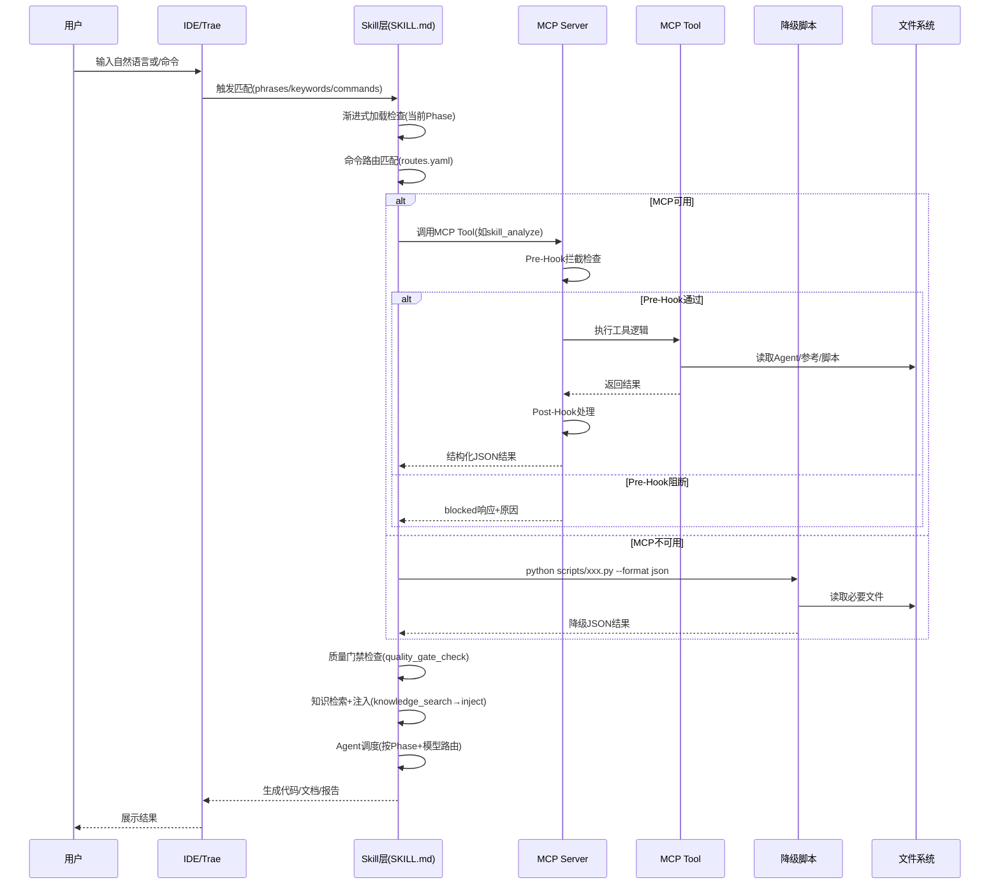
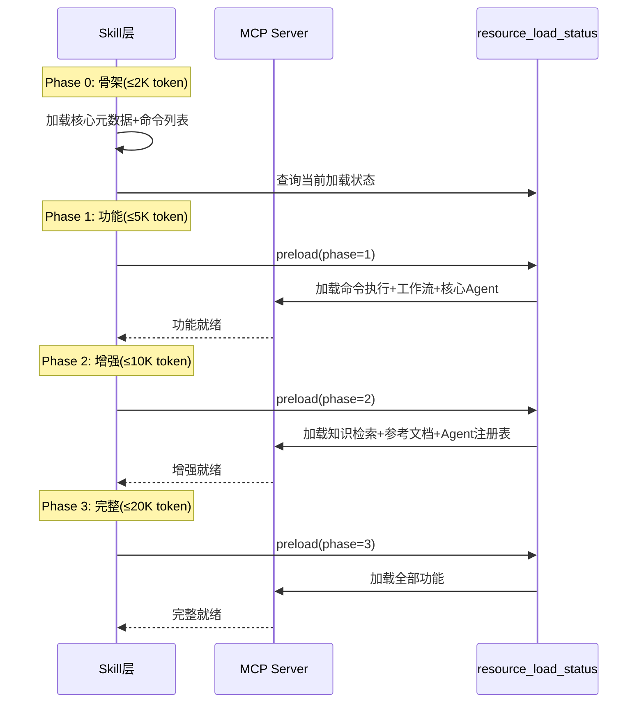
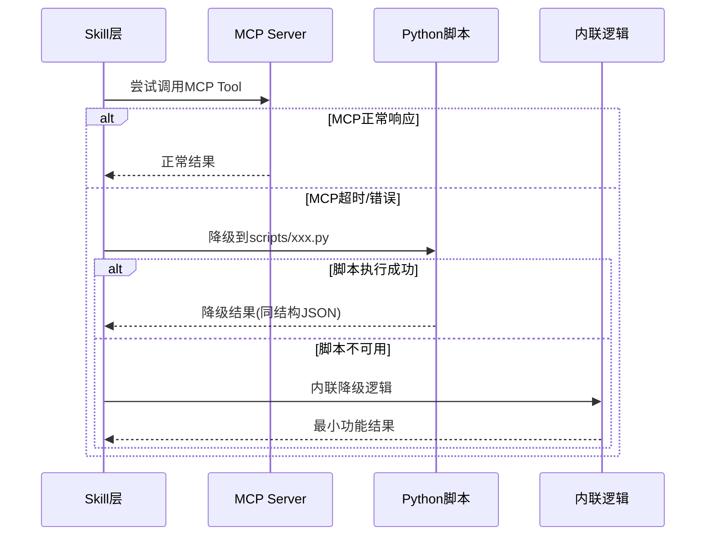

# Xuansto Skill 架构文档

> ARCH-01 | 版本: 8.0.0 (MCP Edition) | 最后更新: 2026-05-23

---

## 1. 项目概览

### 1.1 定位

Xuansto Skill 是一个**多Agent自主开发编排引擎**，通过 MCP (Model Context Protocol) 原子工具驱动 9 阶段全生命周期软件开发流程。它将 SDD (Spec-Driven Development) 与 TDD (Test-Driven Development) 融合，以 57 个 Agent / 13 层编排、54 项质量门禁、27 个命令为核心能力，覆盖从需求分析到部署交付的完整链路。

### 1.2 核心能力

| 能力维度 | 说明 |
|---------|------|
| 多Agent编排 | 57个Agent分13层（编排/产品/设计/工程/跨平台/数据/测试/安全/DevOps/质量/文档/知识/监控），按Phase动态调度 |
| 9阶段工作流 | Phase 0初始化 → Phase 1需求分析 → Phase 2架构设计 → Phase 3测试先行 → Phase 4代码实现 → Phase 5测试验证 → Phase 6验收确认 → Phase 7持续重构 → Phase 8部署交付 |
| 54项质量门禁 | 每阶段关键门禁（如 TEST-FIRST、AI-PENTEST、SPEC-CONSISTENCY），3-Strike恢复协议 |
| MCP工具驱动 | 17个MCP原子工具 + 6个MCP Resource，MCP不可用时自动降级到Python脚本 |
| 渐进式加载 | 4阶段Token预算控制（骨架≤2K → 功能≤5K → 增强≤10K → 完整≤20K），按需注入上下文 |
| 知识闭环 | Retrieve → Inject → Precipitate 三阶段知识工作流，ChromaDB → SQLite FTS → 关键词三级降级 |
| 跨平台桌面 | 支持 Electron / Tauri / Flutter 桌面构建，含IPC安全审计与代码签名 |
| 模型路由 | fast（搜索/简单编辑）/ standard（多文件实现）/ deep（架构设计/安全分析）三级路由 |

### 1.3 用户交互模式

用户通过以下方式与系统交互：

1. **自然语言触发** — 输入触发短语（如"帮我搭建项目"、"安全审计一下"），Skill自动匹配意图
2. **斜杠命令** — 直接使用 `/init`、`/plan`、`/implement` 等27个命令
3. **MCP工具调用** — IDE/Agent通过MCP协议直接调用17个原子工具
4. **CLI命令行** — 通过 `xuansto-cli` 命令行工具调用（health/invoke/gate/workflow/session/agent）

---

## 2. 完整文件目录树

### 2.1 xuansto-skill-v2 (Skill层)

```
.trae/skills/xuansto-skill-v2/
├── SKILL.md                          # Skill入口元数据+核心约束+Phase概览
├── constraints.yaml                  # Token预算/门禁摘要/披露规则/降级规则
├── triggers.yaml                     # 触发条件(phrases/keywords/commands/not_for)
├── agents/
│   ├── registry.yaml                 # 57 Agent注册表(层级/名称/Phase/模型路由)
│   ├── orchestrator/                 # 编排层Agent(3)
│   │   ├── orchestrator.md
│   │   ├── subagent-dispatcher.md
│   │   └── task-coordinator.md
│   ├── product/                      # 产品层Agent(4)
│   ├── design/                       # 设计层Agent(4)
│   ├── engineering/                  # 工程层Agent(6)
│   ├── cross-platform/               # 跨平台层Agent(5)
│   ├── database/                     # 数据层Agent(3)
│   ├── testing/                      # 测试层Agent(10)
│   ├── security/                     # 安全层Agent(3)
│   ├── devops/                       # DevOps层Agent(4)
│   ├── quality/                      # 质量层Agent(7)
│   ├── documentation/                # 文档层Agent(2)
│   ├── knowledge/                    # 知识层Agent(3)
│   └── monitoring/                   # 监控层Agent(3)
├── commands/
│   ├── routes.yaml                   # 27命令路由表(意图→命令→MCP工具链→降级)
│   ├── init.md                       # 各命令详细步骤定义
│   ├── brainstorm.md
│   ├── clarify.md
│   ├── plan.md
│   ├── spec.md
│   ├── design.md / design-system.md
│   ├── implement.md
│   ├── test.md
│   ├── review.md
│   ├── fix.md
│   ├── audit.md
│   ├── accept.md
│   ├── deploy.md
│   ├── build.md / build-desktop.md / release-desktop.md
│   ├── simplify.md / refactor.md
│   ├── loop.md / cancel-loop.md
│   ├── learn.md
│   ├── agent-status.md
│   ├── status.md
│   ├── rollback.md
│   ├── sprint.md
│   ├── execute-plan.md
│   ├── sdd-tdd-medium.md
│   └── sdd-tdd-fast.md
├── configs/
│   └── default.yaml                  # 默认配置(Token预算/降级/Hook/模型路由/会话持久化)
├── hooks/
│   └── hooks.json                    # Hook配置(security-block/token-budget-check/encoding-check等)
├── memory/
│   ├── fixes/                        # 修复经验记忆
│   └── patterns/                     # 模式记忆
├── migrations/
├── references/
│   ├── agent-registry.md             # Agent完整注册详情
│   ├── quality-gates.md              # 质量门禁完整定义
│   ├── workflow-phases.md            # 9阶段工作流详情
│   ├── mcp-tools.md                  # MCP工具参数与返回值
│   ├── knowledge-workflow-details.md # 知识工作流详情
│   └── progressive-loading.md        # 渐进式加载机制
├── scripts/                          # 降级脚本集(49+)
│   ├── knowledge_server/             # 知识服务子模块(28文件)
│   │   ├── main.py                   # 知识服务入口
│   │   ├── api.py / api_routes.py    # API路由
│   │   ├── db_engine.py              # 数据库引擎
│   │   ├── vector_engine.py          # 向量引擎(ChromaDB)
│   │   ├── hybrid_search.py          # 混合搜索
│   │   ├── progressive_search.py     # 渐进式搜索
│   │   ├── embedding.py              # 嵌入模型
│   │   ├── experience_precipitator.py # 经验沉淀
│   │   └── ...                       # 其他模块
│   ├── verification/                 # 验证脚本
│   ├── workflow-tools/               # 工作流工具脚本
│   ├── skill-test.py                 # Skill分析+门禁+Agent状态降级
│   ├── knowledge-server.py           # 知识检索降级
│   ├── agentic-security-scanner.py   # 安全扫描降级
│   ├── code-simplifier.py            # 代码简化降级
│   ├── context-compressor.py         # 上下文压缩降级
│   ├── spec-drift-detector.py        # 规格漂移检测降级
│   ├── health-checker.py             # 健康检查降级
│   ├── session-persist.py            # 会话持久化
│   ├── session-catchup.py            # 会话恢复
│   ├── init-session.py               # 会话初始化
│   ├── project-initializer.py        # 项目初始化
│   ├── token-budget-guard.py         # Token预算守卫
│   ├── check-encoding.py             # 编码检查
│   ├── coverage-check.py             # 覆盖率检查
│   ├── pattern-learner.py            # 模式学习
│   └── ...                           # 其他49+脚本
├── templates/                        # 项目模板(19个)
│   ├── prd-template.md               # 产品需求文档模板
│   ├── adr-template.md               # 架构决策记录模板
│   ├── design-system-template.md     # 设计系统模板
│   ├── test-plan-template.md         # 测试计划模板
│   ├── security-checklist.md         # 安全检查清单
│   ├── ci-cd-pipeline-template.yaml  # CI/CD流水线模板
│   └── ...                           # 其他模板
├── workflows/
│   ├── _yaml/                        # 工作流YAML定义(15个)
│   │   ├── sdd-tdd-full.yaml
│   │   ├── sdd-tdd-medium.yaml
│   │   ├── sdd-tdd-fast.yaml
│   │   ├── brainstorming-workflow.yaml
│   │   ├── security-audit.yaml
│   │   ├── desktop-build-workflow.yaml
│   │   └── ...
│   ├── sdd-tdd-full.md               # 工作流Markdown说明
│   └── ...
├── examples/
│   ├── web-app-development.md
│   └── desktop-app-development.md
├── .knowledge/                       # 知识库运行时目录
│   ├── script-errors/
│   └── temp-scripts/
└── .gitignore
```

### 2.2 xuansto-mcp-server (MCP Server层)

```
xuansto-mcp-server/
├── pyproject.toml                    # 项目元数据(v4.1.0, Python>=3.10, deps: mcp/pydantic/pyyaml)
├── mcp-config.json                   # uvx启动配置(git+https://github.com/skiller-team/xuansto-mcp-server)
├── src/xuansto_mcp/
│   ├── __init__.py
│   ├── server.py                     # FastMCP入口, 17工具注册+Hook拦截+Resource注册
│   ├── cli.py                        # 命令行工具(health/invoke/gate/workflow/session/agent)
│   ├── tools/                        # 17个MCP原子工具
│   │   ├── __init__.py
│   │   ├── skill_analyze.py          # 技能分析(项目结构/Agent/脚本扫描)
│   │   ├── knowledge_search.py       # 知识检索(hybrid/semantic/keyword)
│   │   ├── knowledge_inject.py       # 知识注入+经验沉淀
│   │   ├── quality_gate_check.py     # 质量门禁检查(54门禁,按Phase分组)
│   │   ├── spec_drift_detect.py      # 规格漂移检测
│   │   ├── security_scan.py          # 安全扫描(OWASP Agentic+依赖扫描)
│   │   ├── code_simplify.py          # 代码简化+重复检测
│   │   ├── session_manage.py         # 会话管理(save/load/list/track/restore)
│   │   ├── workflow_dispatch.py      # 工作流调度(start/status/abort/phase/recover)
│   │   ├── agent_status.py           # Agent状态(list/by_phase/detail/create/match)
│   │   ├── hook_manage.py            # Hook管理(list/execute)
│   │   ├── resource_load_status.py   # 资源加载状态(status/preload/cache/token_report)
│   │   ├── context_compress.py       # 上下文压缩(semantic/selective/lossless)
│   │   ├── server_health.py          # 服务器健康检查+版本协商
│   │   ├── decision_log.py           # 决策日志(log/list/query/export/stats)
│   │   ├── token_budget.py           # Token预算管理(status/set_budget/recommend/report)
│   │   └── project_init.py           # 项目初始化(create/validate/detect_stack)
│   ├── resources/
│   │   └── skill_resources.py        # 6个MCP Resource注册
│   │       ├── xuansto://config/skill           # Skill配置
│   │       ├── xuansto://references/quality-gates # 质量门禁文档
│   │       ├── xuansto://references/agent-registry # Agent注册表
│   │       ├── xuansto://references/workflow-phases # 工作流定义
│   │       ├── xuansto://templates/{name}       # 模板文件(动态)
│   │       ├── xuansto://sessions/latest        # 最新会话
│   │       └── xuansto://loading/status         # 加载状态+披露
│   ├── core/                         # 核心基础设施
│   │   ├── __init__.py
│   │   ├── config.py                 # 配置管理(路径解析/YAML加载/热重载/watchfiles)
│   │   ├── degradation.py            # 降级策略管理
│   │   ├── errors.py                 # 错误处理+重试+统一响应格式
│   │   ├── hook_engine.py            # Hook引擎(pre/post回调链+动态注册)
│   │   ├── logging_config.py         # 日志配置
│   │   ├── metrics.py                # 指标收集
│   │   ├── notifications.py          # 通知回调系统
│   │   ├── search_engine.py          # 搜索引擎抽象层(ChromaDB/SQLite/Keyword)
│   │   ├── subprocess_utils.py       # 子进程工具(脚本降级调用)
│   │   └── validator.py              # 路径安全验证
│   └── models/
│       ├── __init__.py
│       └── schemas.py                # Pydantic v2输入模型(17个Input Schema)
└── tests/                            # 测试目录
```

### 2.3 xuansto-skill (v5 废弃版)

```
.trae/skills/xuansto-skill/           # 已废弃, migrate_to: xuansto-skill-v2
├── SKILL.md                          # v5入口(含完整命令路由+Agent索引, 约310行)
├── .skill-config.yaml                # v5配置(Token预算/降级/Hook/模型路由)
├── agents/                           # 与v2相同的57个Agent定义
├── commands/                         # 与v2相同的27个命令
├── configs/
├── evals/                            # v5独有: 评估配置
├── examples/
├── hooks/
├── memory/                           # v5独有: 更详细的记忆结构(errors/fixes/metrics/patterns)
├── migrations/
├── references/                       # v5独有: agent-details/子目录(57个Agent详情)
├── scripts/                          # v5脚本集
├── templates/
└── workflows/
```

---

## 3. 当前架构分层

当前系统采用 **Skill层 → 执行层 → 资源层 → 依赖层** 四层架构：

```
┌─────────────────────────────────────────────────────────────┐
│                     Skill 层 (xuansto-skill-v2)              │
│  SKILL.md + constraints.yaml + triggers.yaml                │
│  命令路由(routes.yaml) + Agent注册表(registry.yaml)          │
│  渐进式加载控制 + 降级策略声明                                 │
├─────────────────────────────────────────────────────────────┤
│                     执行层 (xuansto-mcp-server)              │
│  17个MCP Tool + 6个MCP Resource                              │
│  Hook引擎(pre/post拦截) + 搜索引擎(ChromaDB/SQLite/Keyword)  │
│  会话管理 + 工作流调度 + Agent状态 + Token预算                │
├─────────────────────────────────────────────────────────────┤
│                     资源层 (Skill目录文件系统)                 │
│  agents/ (57个.md) + commands/ (27个.md) + references/       │
│  scripts/ (49+个.py) + templates/ (19个.md) + workflows/     │
│  configs/ + hooks/ + memory/ + .knowledge/                   │
├─────────────────────────────────────────────────────────────┤
│                     依赖层 (Python包 + 外部服务)              │
│  mcp[cli]>=1.0.0 + pydantic>=2.0.0 + pyyaml>=6.0            │
│  [可选] chromadb + fastapi + sentence-transformers            │
│  [可选] openai + watchfiles + uvicorn                        │
└─────────────────────────────────────────────────────────────┘
```

### 3.1 Skill层职责

- **触发匹配**: 通过 `triggers.yaml` 定义 phrases/keywords/commands/not_for，IDE自动匹配
- **渐进式加载**: 通过 `constraints.yaml` 定义4阶段Token预算和披露规则
- **命令路由**: 通过 `commands/routes.yaml` 将用户意图映射到命令→MCP工具链→降级路径
- **Agent注册**: 通过 `agents/registry.yaml` 声明57个Agent的层级/Phase/模型路由
- **核心约束**: Spec > Test > Code、Karpathy准则、3-Strike Protocol等

### 3.2 执行层职责

- **MCP工具服务**: 17个原子工具通过FastMCP注册，stdio传输
- **Hook拦截**: 每个工具调用经过pre-hook检查(可阻断)和post-hook处理
- **搜索引擎**: 可插拔架构(ChromaDB → SQLite FTS → 关键词)，按可用性自动选择
- **降级执行**: MCP不可用时通过 `subprocess_utils` 调用 `scripts/` 目录Python脚本
- **配置热重载**: watchfiles事件驱动 + 线程轮询降级，支持SIGHUP信号
- **会话持久化**: 会话状态保存/恢复/追踪，支持跨会话上下文恢复

### 3.3 资源层职责

- **Agent定义**: 57个Markdown文件定义每个Agent的角色、职责、工作指南
- **命令步骤**: 27个Markdown文件定义每个命令的执行步骤和降级策略
- **参考文档**: 质量门禁、工作流Phase、MCP工具参数等参考文档
- **降级脚本**: 49+个Python脚本，作为MCP工具的降级后备
- **项目模板**: 19个模板文件用于项目初始化
- **工作流定义**: 15个YAML工作流定义 + Markdown说明

### 3.4 依赖层职责

- **核心依赖**: mcp[cli] (MCP协议)、pydantic (数据校验)、pyyaml (配置解析)
- **可选依赖**: chromadb (向量搜索)、fastapi+uvicorn (HTTP API)、sentence-transformers (嵌入)、openai (LLM)、watchfiles (配置热重载)

---

## 4. 调用流程图

### 4.1 主流程：用户输入到最终输出



### 4.2 渐进式加载流程



### 4.3 降级调用链



---

## 5. 目标架构设计

### 5.1 Skill与MCP职责划分

> ARCH-02 | 核心设计原则：Skill管"知道什么"，MCP管"能做什么"

| 维度 | Skill层职责 | MCP Server职责 |
|------|-----------|---------------|
| 知识 | 触发条件、命令路由、Agent注册表、核心约束 | 知识检索、知识注入、经验沉淀 |
| 决策 | 工作流选择(full/medium/fast)、模型路由 | 门禁检查、规格漂移检测、Token预算推荐 |
| 执行 | 命令步骤编排、Agent调度指导 | 工具调用(分析/扫描/简化/压缩)、会话管理 |
| 资源 | 资源定义(Agent.md/命令.md/参考.md/模板) | 资源加载状态、缓存管理、渐进式披露 |
| 降级 | 降级策略声明(constraints.yaml) | 降级执行(脚本调用/内联逻辑/结果包装) |
| 通信 | SKILL.md作为IDE的Skill协议接口 | MCP协议(stdio)作为工具调用接口 |

### 5.2 MCP Server边界

> ARCH-03 | MCP Server是"无状态工具服务"，不持有业务逻辑

**MCP Server应做的事：**
- 提供原子工具能力（分析、检索、检查、扫描、简化、压缩等）
- 管理工具调用的Hook拦截链
- 实现搜索引擎的可插拔架构
- 执行降级脚本调用并包装结果
- 维护会话状态和工作流实例
- 提供资源加载状态和Token预算管理

**MCP Server不应做的事：**
- 不做命令路由决策（由Skill层的routes.yaml负责）
- 不做Agent调度决策（由Skill层的registry.yaml负责）
- 不做工作流选择决策（由Skill层根据项目规模决定）
- 不做渐进式加载策略决策（由Skill层的constraints.yaml定义）
- 不持有业务规则（Spec > Test > Code等约束在Skill层声明）

### 5.3 渐进式加载注入点与触发机制

> ARCH-04 | 渐进式加载是Skill层与MCP层的协作机制

```
┌──────────────────────────────────────────────────────────────┐
│ 渐进式加载注入点                                              │
│                                                              │
│  ┌─────────┐    ┌──────────────┐    ┌───────────────────┐   │
│  │ SKILL.md │───▶│constraints   │───▶│resource_load_     │   │
│  │ (触发入口)│    │.yaml(预算定义)│    │status(MCP执行)    │   │
│  └─────────┘    └──────────────┘    └───────────────────┘   │
│       │                │                     │               │
│       ▼                ▼                     ▼               │
│  触发匹配         Token预算分配         资源预加载/缓存       │
│  (phrases/        (2K→5K→10K→20K)      (preload/cache/      │
│   keywords)                              clear_cache)       │
│                                                              │
│  注入点1: Skill触发时 → Phase 0骨架(≤2K)                     │
│  注入点2: 用户执行命令时 → Phase 1功能(≤5K)                   │
│  注入点3: 需要参考文档时 → Phase 2增强(≤10K)                  │
│  注入点4: 深度分析时 → Phase 3完整(≤20K)                      │
│                                                              │
│  触发机制:                                                    │
│  - 自动触发: Skill加载时自动进入Phase 0                       │
│  - 命令触发: 用户执行命令时自动推进到Phase 1                   │
│  - 显式触发: 调用resource_load_status(preload, phase=N)       │
│  - 披露触发: 访问不可用功能时通过xuansto://loading/status提示  │
└──────────────────────────────────────────────────────────────┘
```

**各阶段注入内容：**

| 阶段 | 触发条件 | 注入内容 | 不可用功能 | 披露方式 |
|------|---------|---------|-----------|---------|
| Phase 0 骨架 | Skill触发时 | 核心元数据、命令路由、命令列表(无详情) | 命令执行、Agent详情、参考文档、知识检索 | xuansto://loading/status |
| Phase 1 功能 | 用户执行命令时 | 命令执行、工作流推进、门禁检查、核心Agent | 知识检索、参考文档、Agent完整注册表 | 提示可通过preload推进 |
| Phase 2 增强 | 需要参考文档时 | 知识检索、参考文档、Agent完整注册表、质量门禁摘要 | 完整脚本集、模板库、全部Agent定义 | 降级到可用范围内执行 |
| Phase 3 完整 | 深度分析时 | 全部功能可用 | 无 | — |

---

## 6. 当前架构 vs 目标架构差异表

> ARCH-05 | 当前状态与目标状态的逐项对比

| # | 维度 | 当前状态 | 目标状态 | 差距 | 优先级 |
|---|------|---------|---------|------|--------|
| 1 | Skill入口 | SKILL.md约70行，外部引用{{include:}} | SKILL.md精简骨架，所有详情按需加载 | 已基本实现，但SKILL.md仍包含Phase概览表 | P2 |
| 2 | 命令路由 | routes.yaml声明式路由，27命令 | 命令路由完全由Skill层声明，MCP仅执行 | 已实现 | — |
| 3 | Agent注册 | registry.yaml声明57个Agent | Agent注册表由Skill层声明，MCP仅查询 | 已实现 | — |
| 4 | MCP工具数 | 17个Tool + 6个Resource | 稳定17+6，按需扩展 | 已实现 | — |
| 5 | 降级策略 | constraints.yaml声明+MCP执行脚本降级 | 每个MCP Tool都有脚本降级路径 | 已实现，但部分降级为"内联"而非独立脚本 | P3 |
| 6 | 渐进式加载 | 4阶段Token预算+resource_load_status | 完整的渐进式加载+披露+自动推进 | Phase 0-1已实现，Phase 2-3的自动推进待完善 | P1 |
| 7 | Hook系统 | hook_engine.py + hooks.json | 可插拔Hook引擎，支持动态注册 | 已实现 | — |
| 8 | 搜索引擎 | search_engine.py可插拔(ChromaDB/SQLite/Keyword) | 三级降级自动切换 | 已实现 | — |
| 9 | 配置热重载 | watchfiles + 线程轮询 + SIGHUP | 事件驱动优先，轮询降级 | 已实现 | — |
| 10 | 知识闭环 | knowledge_search + knowledge_inject | Retrieve→Inject→Precipitate完整闭环 | Retrieve和Inject已实现，Precipitate待完善 | P1 |
| 11 | v5废弃 | xuansto-skill v5仍存在目录 | 完全移除v5，统一到v2 | v5目录仍存在，SKILL.md标记deprecated | P2 |
| 12 | CLI工具 | xuansto-cli基础命令(health/invoke/gate/workflow/session/agent) | 完整CLI覆盖所有MCP工具 | 基础命令已实现，部分工具需通过invoke调用 | P3 |
| 13 | 测试覆盖 | pytest+pytest-asyncio配置 | 核心模块测试覆盖率≥80% | 测试框架已配置，覆盖率待提升 | P1 |
| 14 | Token预算 | token_budget工具+constraints.yaml声明 | 动态预算调整+Phase感知分配 | 基础功能已实现，动态调整待完善 | P2 |
| 15 | 决策日志 | decision_log工具(log/list/query/export/stats) | 决策透明化+ADR集成 | 已实现 | — |
| 16 | 上下文压缩 | context_compress工具(semantic/selective/lossless) | 三级压缩自动触发 | 已实现，自动触发阈值待调优 | P2 |

---

## 7. 风险与约束

### 7.1 架构风险

> ARCH-06 | Skill层与MCP层耦合风险

| 风险ID | 风险描述 | 影响 | 缓解措施 |
|--------|---------|------|---------|
| ARCH-06-1 | Skill层SKILL.md包含Phase概览表，与constraints.yaml重复定义 | 维护不一致风险 | 将Phase概览表移至references/，SKILL.md仅保留引用 |
| ARCH-06-2 | 降级策略中"内联降级"缺乏统一接口 | 降级行为不可预测 | 将所有内联降级提取为独立脚本或统一内联框架 |
| ARCH-06-3 | MCP Server通过`_detect_skill_root()`自动发现Skill目录 | 路径解析失败时静默降级到DATA_DIR | 增加启动时路径验证日志和健康检查告警 |
| ARCH-06-4 | Hook拦截失败不阻塞主流程 | 可能导致安全检查被跳过 | 增加Hook失败计数和告警阈值 |

### 7.2 运行约束

> ARCH-07 | 运行时约束条件

| 约束ID | 约束描述 | 值 |
|--------|---------|-----|
| ARCH-07-1 | Python版本 | >=3.10 |
| ARCH-07-2 | MCP协议版本 | API v2.0.0, 最低兼容v1.0.0 |
| ARCH-07-3 | MCP传输方式 | stdio (不支持SSE/HTTP) |
| ARCH-07-4 | 最大并发MCP调用 | 10 |
| ARCH-07-5 | 每工具上下文预算 | 总预算的8% |
| ARCH-07-6 | Loop最大迭代 | 50次 |
| ARCH-07-7 | Loop最大停滞 | 3次 |
| ARCH-07-8 | 会话最大保存数 | 10个 |
| ARCH-07-9 | 知识检索降级链 | ChromaDB → SQLite FTS → 关键词匹配 |
| ARCH-07-10 | Token降级三级 | L1(0.8): 减少并行+MCP降级 / L2(0.95): 精简模式 / L3(1.0): 最小串行 |

### 7.3 兼容性约束

> ARCH-08 | 版本兼容性

| 约束 | 说明 |
|------|------|
| v5→v2迁移 | xuansto-skill v5已废弃，SKILL.md标记`deprecated: true, migrate_to: xuansto-skill-v2` |
| MCP最低版本 | xuansto-mcp-server >= 4.0.0 |
| API版本兼容 | MCP API v2.0.0向后兼容v1.0.0客户端 |
| ChromaDB路径迁移 | 旧路径`chroma/`自动迁移到`chroma_db/` |

### 7.4 安全约束

> ARCH-09 | 安全相关约束

| 约束 | 说明 |
|------|------|
| 路径安全 | `validator.py`校验所有文件访问路径，防止目录遍历 |
| Hook安全阻断 | `security-block` Hook可在Pre-Hook阶段阻断工具调用 |
| 编码安全 | UTF-8无BOM + 无U+FFFD检测 |
| 脚本安全 | `script-security-scanner.py`扫描脚本安全性 |
| 桌面安全 | IPC安全审计 + 代码签名验证 |

---

## 8. MCP工具清单与降级映射

> ARCH-10 | 17个MCP工具与降级路径完整映射

| MCP Tool | 功能 | 降级脚本 | 降级方式 |
|----------|------|---------|---------|
| skill_analyze | 项目结构/Agent/脚本分析 | scripts/skill-test.py --analyze | 脚本调用 |
| knowledge_search | 知识检索(hybrid/semantic/keyword) | scripts/knowledge-server.py --search | 脚本调用 |
| knowledge_inject | 知识注入+经验沉淀 | scripts/knowledge_server/main.py --inject | 脚本调用 |
| quality_gate_check | 54项质量门禁检查 | scripts/skill-test.py --gate | 脚本调用 |
| spec_drift_detect | 规格漂移检测 | scripts/spec-drift-detector.py | 脚本→内联 |
| security_scan | OWASP Agentic+依赖扫描 | scripts/agentic-security-scanner.py | 脚本→内联 |
| code_simplify | 代码简化+重复检测 | scripts/code-simplifier.py | 脚本→内联 |
| session_manage | 会话管理(save/load/track/restore) | scripts/init-session.py / session-catchup.py / session-persist.py | 脚本调用 |
| workflow_dispatch | 工作流调度(start/status/abort/phase/recover) | scripts/project-initializer.py + 内联Phase推进 | 脚本→内联 |
| agent_status | Agent状态查询(list/by_phase/detail/create/match) | 静态注册表查询 + scripts/skill-test.py --agents | 静态+脚本 |
| hook_manage | Hook管理(list/execute) | scripts/check-encoding.py等 + 内联Hook执行 | 脚本→内联 |
| resource_load_status | 资源加载状态(status/preload/cache) | 内联状态检查(resource_state.json) | 内联 |
| context_compress | 上下文压缩(semantic/selective/lossless) | scripts/context-compressor.py | 脚本调用 |
| server_health | 服务器健康+版本协商 | scripts/health-checker.py | 脚本→降级状态 |
| decision_log | 决策日志(log/list/query/export/stats) | 内联JSON记录 | 内联 |
| token_budget | Token预算(status/set_budget/recommend/report) | 内联估算 | 内联 |
| project_init | 项目初始化(create/validate/detect_stack) | 内联模板生成 | 内联 |

---

## 9. 6个MCP Resource清单

> ARCH-11 | MCP Resource定义

| URI | 功能 | 数据来源 |
|-----|------|---------|
| xuansto://config/skill | Skill配置文件 | .skill-config.yaml |
| xuansto://references/quality-gates | 质量门禁文档 | references/quality-gates.md |
| xuansto://references/agent-registry | Agent注册表 | references/agent-registry.md |
| xuansto://references/workflow-phases | 工作流定义 | references/workflow-phases.md |
| xuansto://templates/{name} | 模板文件(动态参数) | templates/{name}.md |
| xuansto://sessions/latest | 最新会话记录 | sessions/session-*.md |
| xuansto://loading/status | 加载状态+功能披露 | resource_state.json + 运行时计算 |

---

## 10. 9阶段工作流与门禁映射

> ARCH-12 | 工作流Phase与关键门禁、MCP工具的完整映射

| Phase | 名称 | 关键门禁 | MCP工具 | Agent层参与 |
|-------|------|---------|---------|------------|
| 0 | 初始化 | DESIGN-SYSTEM-COMPLETE, ANTI-PATTERN-CHECK | skill_analyze, workflow_dispatch, agent_status, resource_load_status | 编排(3) + 监控(3) + 知识(2) |
| 1 | 需求分析 | BRAINSTORM-COMPLETE, GATE-001~002 | knowledge_search, resource_load_status | 产品(4) + 知识(1) |
| 2 | 架构设计 | PLAN-ATOMIC, GATE-003~004 | knowledge_search, resource_load_status | 产品(1) + 设计(4) + 数据(1) + 文档(1) + 监控(1) |
| 3 | 测试先行 | TEST-FIRST | — | 测试(2: Test Architect + Unit Tester) |
| 4 | 代码实现 | GATE-007, TEST-PASS, FILE-ENCODING | quality_gate_check, agent_status | 工程(6) + 跨平台(3) + 数据(2) + 测试(1) |
| 5 | 测试验证 | AI-PENTEST, SPEC-CONSISTENCY | security_scan, spec_drift_detect, agent_status | 测试(8) + 安全(3) + 质量(4) |
| 6 | 验收确认 | GATE-013~014, UX-ACCEPTANCE | quality_gate_check | 产品(2) + 质量(2) + 文档(2) + 监控(1) |
| 7 | 持续重构 | SIMPLIFICATION-BEHAVIOR, GATE-015 | code_simplify, context_compress | 质量(2) + 知识(1) + 测试(1) |
| 8 | 部署交付 | DESKTOP-BUILD/SIGN/UPDATE/CROSS | — | DevOps(4) + 跨平台(2) + 数据(1) |

---

## 附录A: 问题编号索引

| 编号 | 标题 | 章节 |
|------|------|------|
| ARCH-01 | 文档版本与元数据 | 1 |
| ARCH-02 | Skill与MCP职责划分 | 5.1 |
| ARCH-03 | MCP Server边界 | 5.2 |
| ARCH-04 | 渐进式加载注入点与触发机制 | 5.3 |
| ARCH-05 | 当前架构vs目标架构差异表 | 6 |
| ARCH-06 | Skill层与MCP层耦合风险 | 7.1 |
| ARCH-07 | 运行时约束条件 | 7.2 |
| ARCH-08 | 版本兼容性 | 7.3 |
| ARCH-09 | 安全相关约束 | 7.4 |
| ARCH-10 | MCP工具与降级映射 | 8 |
| ARCH-11 | MCP Resource清单 | 9 |
| ARCH-12 | 工作流Phase与门禁映射 | 10 |
