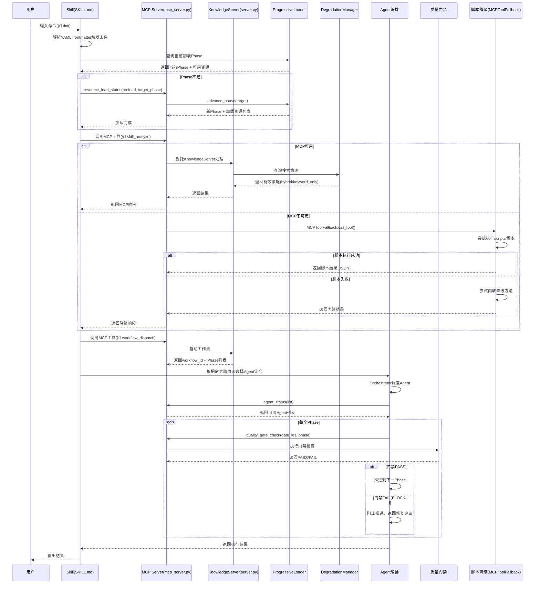

# Xuansto Skill v8.0.0 架构文档

> 版本: 8.0.0 | 更新日期: 2026-05-25 | 状态: 当前架构

---

## 1. 项目概览

### 1.1 定位

Xuansto Skill v8.0.0 是一个**多Agent自主开发编排引擎**，通过 xuansto-mcp-server 的 MCP 原子工具驱动 9 阶段全生命周期开发流程。它将软件开发从"人工逐步操作"升级为"Agent协作编排"，实现从需求澄清到部署交付的端到端自动化。

### 1.2 核心能力

| 维度 | 数量 | 说明 |
|------|------|------|
| Agent | 57个 / 13层 | 覆盖编排、产品、设计、工程、跨平台、数据、测试、安全、DevOps、质量、文档、知识、监控 |
| 编排层级 | 13层 | 从编排层到监控层，每层职责明确 |
| 质量门禁 | 54项 | BLOCK/WARN两级，覆盖9个Phase |
| 命令 | 31个 | 从 /init 到 /budget，覆盖全生命周期 |
| MCP工具 | 26个 | 知识管理11个 + Skill工具15个 |
| 开发阶段 | 9阶段 | 初始化→需求分析→架构设计→测试先行→代码实现→测试验证→验收确认→持续重构→部署交付 |

### 1.3 用户交互模式

```
用户输入命令 → Skill触发 → MCP工具调用 → KnowledgeServer处理 → Agent编排 → 质量门禁检查 → 结果输出
```

- **命令触发**：用户通过 `/command` 或自然语言触发Skill
- **MCP工具调用**：Skill通过MCP协议调用 xuansto-mcp-server 注册的26个工具
- **Agent编排**：根据命令路由表选择对应Phase的Agent集合
- **降级策略**：MCP不可用时自动降级到 scripts/ 目录Python脚本
- **渐进式加载**：按需从 SKELETON→FUNCTIONAL→ENHANCED→FULL 四级推进

---

## 2. 完整文件目录树

```
.trae/skills/xuansto-skill-v2/
├── SKILL.md                          # Skill主定义文件（YAML frontmatter + PHASE标记渐进式加载）
├── constraints.yaml                  # 核心约束与降级规则（Token预算、资源优先级、降级映射）
├── .skill-config.yaml                # 运行时配置（循环控制、规划文件、按需加载、知识服务）
├── CHANGELOG.md                      # 版本变更记录
├── MIGRATION.md                      # 迁移指南
├── PROBLEM.md                        # 已知问题
├── .gitattributes                    # Git属性配置
├── .gitignore                        # Git忽略规则
│
├── agents/                           # 57个Agent定义，13个子目录
│   ├── registry.yaml                 # Agent注册表（13层57个Agent完整索引）
│   ├── orchestrator/                 # 编排层（3个Agent）
│   │   ├── orchestrator.md           #   主编排器 - 全局调度、Phase推进
│   │   ├── subagent-dispatcher.md    #   子Agent调度器 - 任务分发
│   │   └── task-coordinator.md       #   任务协调器 - 并发管理
│   ├── product/                      # 产品层（4个Agent）
│   │   ├── product-manager.md        #   产品经理 - 需求管理
│   │   ├── brainstorming-facilitator.md  # 头脑风暴引导
│   │   ├── system-architect.md       #   系统架构师 - 架构设计
│   │   └── technical-writer.md       #   技术文档
│   ├── design/                       # 设计层（4个Agent）
│   │   ├── design-system-generator.md  # 设计系统生成
│   │   ├── ux-designer.md            #   UX设计师
│   │   ├── frontend-stylist.md       #   前端样式
│   │   └── ui-designer.md            #   UI设计师
│   ├── engineering/                  # 工程层（6个Agent）
│   │   ├── backend-developer.md      #   后端开发
│   │   ├── database-engineer.md      #   数据库工程
│   │   ├── devops-engineer.md        #   DevOps工程
│   │   ├── frontend-developer.md     #   前端开发
│   │   ├── fullstack-engineer.md     #   全栈开发
│   │   └── mobile-developer.md       #   移动开发
│   ├── cross-platform/               # 跨平台层（5个Agent）
│   │   ├── desktop-developer.md      #   桌面开发
│   │   ├── desktop-ui-adapter.md     #   桌面UI适配
│   │   ├── native-module-developer.md  # 原生模块开发
│   │   ├── ipc-specialist.md         #   IPC专家
│   │   └── auto-update-engineer.md   #   自动更新工程
│   ├── database/                     # 数据层（3个Agent）
│   │   ├── data-modeler.md           #   数据建模
│   │   ├── data-seeder.md            #   数据填充
│   │   └── dba.md                    #   数据库管理
│   ├── testing/                      # 测试层（10个Agent）
│   │   ├── ai-penetration-tester.md  #   AI渗透测试
│   │   ├── desktop-tester.md         #   桌面测试
│   │   ├── e2e-tester.md             #   E2E测试
│   │   ├── integration-tester.md     #   集成测试
│   │   ├── performance-tester.md     #   性能测试
│   │   ├── qa-engineer.md            #   QA工程师
│   │   ├── security-tester.md        #   安全测试
│   │   ├── test-architect.md         #   测试架构
│   │   ├── test-maintainer.md        #   测试维护
│   │   └── unit-tester.md            #   单元测试
│   ├── security/                     # 安全层（3个Agent）
│   │   ├── security-auditor.md       #   安全审计
│   │   ├── compliance-officer.md     #   合规审查
│   │   └── penetration-tester.md     #   渗透测试
│   ├── devops/                       # DevOps层（4个Agent）
│   │   ├── build-release-engineer.md #   构建发布
│   │   ├── cicd-specialist.md        #   CI/CD专员
│   │   ├── monitor-specialist.md     #   监控专员
│   │   └── runtime-supervisor.md     #   运行时监控
│   ├── quality/                      # 质量层（7个Agent）
│   │   ├── bug-scanner.md            #   Bug扫描
│   │   ├── code-reviewer.md          #   代码审查
│   │   ├── comment-verifier.md       #   注释验证
│   │   ├── compliance-reviewer.md    #   合规审查
│   │   ├── doc-reviewer.md           #   文档审查
│   │   ├── history-analyzer.md       #   历史分析
│   │   └── refactoring-specialist.md #   重构专家
│   ├── documentation/                # 文档层（2个Agent）
│   │   ├── documentation-engineer.md #   文档工程
│   │   └── specification-keeper.md   #   规格管理
│   ├── knowledge/                    # 知识层（3个Agent）
│   │   ├── knowledge-manager.md      #   知识管理
│   │   ├── learning-specialist.md    #   学习专员
│   │   └── token-optimizer.md        #   Token优化
│   └── monitoring/                   # 监控层（3个Agent）
│       ├── quality-monitor.md        #   质量监控
│       ├── progress-tracker.md       #   进度追踪
│       └── decision-logger.md        #   决策日志
│
├── commands/                         # 31个命令定义
│   ├── routes.yaml                   # 完整命令路由表（意图→命令→MCP工具链→降级策略→Phase）
│   ├── init.md                       # /init 从零开始新项目
│   ├── brainstorm.md                 # /brainstorm 头脑风暴
│   ├── clarify.md                    # /clarify 澄清需求
│   ├── plan.md                       # /plan 规划架构
│   ├── spec.md                       # /spec 写规格文档
│   ├── design.md                     # /design 设计
│   ├── design-system.md              # /design-system 设计系统
│   ├── implement.md                  # /implement 写代码
│   ├── test.md                       # /test 跑测试
│   ├── review.md                     # /review 代码审查
│   ├── audit.md                      # /audit 安全审计
│   ├── fix.md                        # /fix 修复Bug
│   ├── accept.md                     # /accept 验收确认
│   ├── simplify.md                   # /simplify 代码简化
│   ├── refactor.md                   # /refactor 代码重构
│   ├── deploy.md                     # /deploy 部署交付
│   ├── build.md                      # /build 构建项目
│   ├── build-desktop.md              # /build-desktop 桌面构建
│   ├── release-desktop.md            # /release-desktop 桌面发布
│   ├── sprint.md                     # /sprint 冲刺
│   ├── learn.md                      # /learn 知识学习
│   ├── execute-plan.md               # /execute-plan 执行计划
│   ├── loop.md                       # /loop 自主循环
│   ├── cancel-loop.md                # /cancel-loop 取消循环
│   ├── agent-status.md               # /agent-status 查询Agent
│   ├── status.md                     # /status 查询进度
│   ├── rollback.md                   # /rollback 回滚
│   ├── sdd-tdd-medium.md             # /sdd-tdd-medium 中等SDD+TDD
│   ├── sdd-tdd-fast.md               # /sdd-tdd-fast 快速SDD+TDD
│   ├── decision.md                   # /decision 决策记录
│   └── budget.md                     # /budget Token预算
│
├── configs/
│   └── default.yaml                  # 默认配置（编排器、质量门禁、通信协议、桌面、安全等）
│
├── evals/
│   ├── mcp_evaluation.xml            # MCP评估配置
│   └── trigger_eval.json             # 触发评估配置
│
├── examples/
│   ├── desktop-app-development.md    # 桌面应用开发示例
│   └── web-app-development.md        # Web应用开发示例
│
├── hooks/
│   └── hooks.json                    # Hook系统定义（三级配置：minimal/standard/strict）
│
├── memory/
│   ├── README.md                     # 记忆系统说明
│   ├── fixes/                        # 修复记忆
│   │   ├── README.md
│   │   └── refactoring/
│   │       └── README.md
│   └── patterns/                     # 模式记忆
│       └── testing/
│           └── README.md
│
├── migrations/
│   └── .gitkeep                      # 迁移目录占位
│
├── references/                       # 79+参考文档
│   ├── agent-details/                # 57个Agent详细参考文档
│   │   ├── ai-penetration-tester.md
│   │   ├── auto-update-engineer.md
│   │   ├── ...（57个文件，与agents/目录一一对应）
│   │   └── ux-designer.md
│   ├── a2a-protocol.md               # A2A通信协议
│   ├── acceptance-criteria.md        # 验收标准
│   ├── accessibility-testing.md      # 无障碍测试
│   ├── agent-forge-integration.md    # Agent Forge集成
│   ├── agent-interaction-protocol.md # Agent交互协议
│   ├── agent-lifecycle.md            # Agent生命周期
│   ├── agent-registry.md             # Agent注册表
│   ├── agentic-security-frameworks.md  # Agentic安全框架
│   ├── ai-code-review-patterns.md    # AI代码审查模式
│   ├── ai-penetration-tester-details.md  # AI渗透测试详情
│   ├── ai-pentest-frameworks.md      # AI渗透测试框架
│   ├── cangjie-skills-integration.md # 仓颉Skills集成
│   ├── chart-recommendations.md      # 图表推荐
│   ├── ci-cd-integration.md          # CI/CD集成
│   ├── claude-code-collective-integration.md  # Claude Code Collective集成
│   ├── coding-standards.md           # 编码标准
│   ├── collaboration-modes.md        # 协作模式
│   ├── color-palettes.md             # 色彩方案
│   ├── component-testing.md          # 组件测试
│   ├── concurrency-standards.md      # 并发标准
│   ├── database-guidelines.md        # 数据库指南
│   ├── deadlock-detection.md         # 死锁检测
│   ├── design-database.md            # 设计数据库
│   ├── design-guidelines.md          # 设计指南
│   ├── design-token-system.md        # 设计Token系统
│   ├── desktop-dev-guidelines.md     # 桌面开发指南
│   ├── documentation-generation.md   # 文档生成
│   ├── documentation-standards.md    # 文档标准
│   ├── electron-security.md          # Electron安全
│   ├── evaluation-framework.md       # 评估框架
│   ├── flutter-desktop-guidelines.md # Flutter桌面指南
│   ├── flutter-standards.md          # Flutter标准
│   ├── font-pairings.md              # 字体配对
│   ├── frontend-developer-details.md # 前端开发详情
│   ├── gate-recovery-details.md      # 门禁恢复详情
│   ├── git-workflow.md               # Git工作流
│   ├── git-worktree-parallel.md      # Git Worktree并行
│   ├── go-standards.md               # Go标准
│   ├── hivehub-rulebook-integration.md  # HiveHub规则集成
│   ├── hook-system.md                # Hook系统
│   ├── human-collaboration.md        # 人机协作
│   ├── ipc-contracts.md              # IPC契约
│   ├── iteration-scheduling.md       # 迭代调度
│   ├── java-standards.md             # Java标准
│   ├── karpathy-guidelines.md        # Karpathy准则
│   ├── kb-api-reference.md           # 知识库API参考
│   ├── knowledge-base-architecture.md  # 知识库架构
│   ├── knowledge-workflow-details.md # 知识工作流详情
│   ├── mcp-integration-strategy.md   # MCP集成策略
│   ├── mcp-protocol.md              # MCP协议
│   ├── mcp-tools.md                  # MCP工具参考
│   ├── model-routing.md              # 模型路由
│   ├── non-functional-requirements.md  # 非功能需求
│   ├── open-source-agent-frameworks.md  # 开源Agent框架
│   ├── open-source-integration.md    # 开源集成
│   ├── owasp-agentic-top10-2026.md   # OWASP Agentic Top 10
│   ├── owasp-mcp-top10.md            # OWASP MCP Top 10
│   ├── owasp-top10-2026.md           # OWASP Top 10
│   ├── parallelization-strategy.md   # 并行化策略
│   ├── product-reasoning-rules.md    # 产品推理规则
│   ├── progressive-loading.md        # 渐进式加载
│   ├── python-standards.md           # Python标准
│   ├── quality-gates.md              # 质量门禁
│   ├── runtime-supervisor-details.md # 运行时监控详情
│   ├── rust-standards.md             # Rust标准
│   ├── script-standards.md           # 脚本标准
│   ├── sddwcc-integration.md         # SDDWCC集成
│   ├── security-frontier-frameworks.md  # 安全前沿框架
│   ├── security-guidelines.md        # 安全指南
│   ├── session-persistence.md        # 会话持久化
│   ├── spec-drift-handling.md        # 规格偏差处理
│   ├── specification-keeper-details.md  # 规格管理详情
│   ├── tauri-dev-guidelines.md       # Tauri开发指南
│   ├── test-guidelines.md            # 测试指南
│   ├── token-degradation-details.md  # Token降级详情
│   ├── token-optimization.md         # Token优化
│   ├── typescript-standards.md       # TypeScript标准
│   ├── workflow-checkpoints.md       # 工作流检查点
│   ├── workflow-phases.md            # 工作流阶段
│   └── workflows.md                  # 工作流定义
│
├── scripts/                          # 脚本集
│   ├── knowledge_server/             # 核心知识服务（Python包）
│   │   ├── __init__.py               #   包初始化
│   │   ├── mcp_server.py             #   MCP工具注册（26个工具定义+调用分发）
│   │   ├── skill_tools.py            #   15个Skill工具处理器（SkillToolHandler类）
│   │   ├── server.py                 #   KnowledgeServer主类（核心引擎）
│   │   ├── progressive_loader.py     #   渐进式加载（LoadPhase枚举+ProgressiveLoader类）
│   │   ├── degradation.py            #   降级策略（DegradationManager+MCPToolFallback）
│   │   ├── config.py                 #   配置管理（KnowledgeConfig+工具函数）
│   │   ├── db_engine.py              #   SQLite引擎（关系存储）
│   │   ├── vector_engine.py          #   ChromaDB引擎（向量存储）
│   │   ├── hybrid_search.py          #   混合检索引擎（语义+关键词）
│   │   ├── progressive_search.py     #   渐进式搜索（任务类型感知+Token预算控制）
│   │   ├── embedding.py              #   嵌入管理（OpenAI→sentence-transformers→BM25降级）
│   │   ├── dedup.py                  #   去重引擎
│   │   ├── security.py               #   安全过滤（输入验证+敏感内容检测+速率限制）
│   │   ├── auth.py                   #   API密钥认证
│   │   ├── api.py                    #   FastAPI应用创建
│   │   ├── api_models.py             #   API数据模型
│   │   ├── api_routes.py             #   API路由定义
│   │   ├── backup.py                 #   备份管理（SQLite+ChromaDB定时备份）
│   │   ├── context_formatter.py      #   上下文格式化
│   │   ├── distillation.py           #   知识蒸馏
│   │   ├── experience_precipitator.py  # 经验沉淀
│   │   ├── exporter.py               #   知识导出
│   │   ├── importer.py               #   首次导入
│   │   ├── kb_client.py              #   知识库客户端
│   │   ├── lifecycle.py              #   生命周期管理（归档+过期清理）
│   │   ├── main.py                   #   入口（启动HTTP/MCP服务）
│   │   ├── sync.py                   #   增量同步
│   │   ├── tech_stack_detector.py    #   技术栈检测
│   │   ├── web_search.py             #   Web搜索（官方文档检索+结构化提取）
│   │   ├── websocket_manager.py      #   WebSocket管理
│   │   ├── test_auto_retrieve.py     #   自动检索测试
│   │   ├── test_context_formatter_optimization.py  # 上下文格式化测试
│   │   ├── test_kb_client.py         #   知识库客户端测试
│   │   ├── test_progressive_search.py  # 渐进式搜索测试
│   │   └── test_web_search.py        #   Web搜索测试
│   │
│   ├── verification/                 # 验证脚本
│   │   ├── agent-structure-check.py  #   Agent结构检查
│   │   ├── cmd-agent-check.py        #   命令-Agent映射检查
│   │   ├── skill-token-check.py      #   Skill Token检查
│   │   └── wf-gate-check.py          #   工作流门禁检查
│   │
│   ├── workflow-tools/               # 工作流工具
│   │   ├── check-current.py          #   当前状态检查
│   │   ├── check-frontmatter.py      #   Frontmatter检查
│   │   ├── extract-phases.py         #   Phase提取
│   │   ├── fix-frontmatter.py        #   Frontmatter修复
│   │   └── validate-workflow.py      #   工作流验证
│   │
│   ├── accessibility-test.js         # 无障碍测试
│   ├── agent-frontmatter-validator.py  # Agent Frontmatter验证
│   ├── agentic-security-scanner.py   # Agentic安全扫描
│   ├── ai-pentest-runner.py          # AI渗透测试运行器
│   ├── api-contract-validator.py     # API契约验证
│   ├── build-desktop.ps1             # 桌面构建脚本
│   ├── build-optimizer.py            # 构建优化
│   ├── check-comment-lang.py         # 注释语言检查
│   ├── check-complete.py             # 完成度检查
│   ├── check-encoding.py             # 编码检查
│   ├── code-simplifier.py            # 代码简化
│   ├── completion-verifier.py        # 完成验证
│   ├── confidence-scorer.py          # 置信度评分
│   ├── console_monitor.py            # 控制台监控
│   ├── context-compressor.py         # 上下文压缩
│   ├── coverage-check.py             # 覆盖率检查
│   ├── db-migration-validator.py     # 数据库迁移验证
│   ├── deduplication-detector.py     # 去重检测
│   ├── dependency-scan.py            # 依赖扫描
│   ├── design-tokens-sync.js         # 设计Token同步
│   ├── documentation-coverage.py     # 文档覆盖率
│   ├── element_discovery.py          # 元素发现
│   ├── health-checker.py             # 健康检查
│   ├── infra-health-check.py         # 基础设施健康检查
│   ├── init-session.py               # 会话初始化
│   ├── ipc-contract-validator.js     # IPC契约验证
│   ├── kb-branch-sync.py             # 知识库分支同步
│   ├── kb-migrate.py                 # 知识库迁移
│   ├── knowledge-index-builder.py    # 知识索引构建
│   ├── knowledge-server-tests.py     # 知识服务测试
│   ├── knowledge-server.py           # 知识服务独立入口
│   ├── loop-guard.py                 # 循环保护
│   ├── pattern-learner.py            # 模式学习
│   ├── performance-benchmark.js      # 性能基准
│   ├── plan-sync.py                  # 计划同步
│   ├── project-initializer.py        # 项目初始化
│   ├── review-aggregator.py          # 审查聚合
│   ├── review-eligibility-check.py   # 审查资格检查
│   ├── rollback-manager.py           # 回滚管理
│   ├── script-cleanup-checker.py     # 脚本清理检查
│   ├── script-security-scanner.py    # 脚本安全扫描
│   ├── session-catchup.py            # 会话恢复
│   ├── session-persist.py            # 会话持久化
│   ├── sign-desktop.ps1              # 桌面签名
│   ├── skill-md-validator.py         # SKILL.md验证
│   ├── skill-test.py                 # Skill测试
│   ├── spec-drift-detector.py        # 规格偏差检测
│   ├── test-reporter.py              # 测试报告
│   ├── token-budget-guard.py         # Token预算保护
│   ├── token-dashboard.py            # Token仪表盘
│   ├── uat-runner.py                 # UAT运行器
│   ├── verify-auto-update.ps1        # 自动更新验证
│   ├── visual-capture.py             # 视觉捕获
│   ├── visual-regression.js          # 视觉回归
│   └── with_server.py                # 服务器启动辅助
│
└── .knowledge/                       # 知识库运行时数据
    ├── script-errors/
    │   └── .gitkeep
    └── temp-scripts/
        └── .gitkeep
```

---

## 3. 当前架构分层

### 3.1 Skill层（声明与配置）

Skill层负责定义Skill的身份、触发条件、约束规则和渐进式加载策略。

| 组件 | 文件 | 职责 |
|------|------|------|
| SKILL.md | `SKILL.md` | Skill主定义：YAML frontmatter（名称/版本/触发条件/命令列表/兼容性）+ PHASE标记渐进式加载内容（PHASE_0~PHASE_3） |
| constraints.yaml | `constraints.yaml` | 核心约束（5条规则）、Token预算分配（4级）、资源优先级（P0~P3）、降级映射（13个工具→脚本映射）、披露规则 |
| .skill-config.yaml | `.skill-config.yaml` | 运行时配置：循环控制（max_iterations:50）、规划文件、按需加载（default_phase:0）、知识服务（host:127.0.0.1:8765） |

**SKILL.md PHASE标记与加载内容映射：**

| PHASE标记 | 加载内容 | Token预算 |
|-----------|----------|-----------|
| `<!-- PHASE_0_START -->` ~ `<!-- PHASE_0_END -->` | YAML frontmatter + 命令列表 + MCP依赖 + 核心约束(5条) | ≤2K |
| `<!-- PHASE_1_START -->` ~ `<!-- PHASE_1_END -->` | 执行入口 + 工作流Phase概览 + 命令路由表(精简) + 核心Agent索引 | ≤5K |
| `<!-- PHASE_2_START -->` ~ `<!-- PHASE_2_END -->` | 完整命令路由表 + 完整Agent注册表 + 外部参考文件 + MCP工具摘要 | ≤10K |
| `<!-- PHASE_3_START -->` ~ `<!-- PHASE_3_END -->` | Hook系统 + 模型路由 + 关键规则 | ≤20K |

### 3.2 执行层（核心引擎）

执行层是系统的核心，负责MCP工具注册、Skill工具处理、知识服务、渐进式加载和降级策略。

#### 3.2.1 MCP工具注册 — `mcp_server.py`

- 注册26个MCP工具：11个知识管理工具 + 15个Skill工具
- 通过 `@mcp_server.list_tools()` 声明工具定义（名称、描述、inputSchema、outputSchema、annotations）
- 通过 `@mcp_server.call_tool()` 分发工具调用
- 知识管理工具直接调用 `KnowledgeServer` 方法
- Skill工具委托给 `SkillToolHandler.handle()` 处理
- `resource_load_status` 工具直接操作 `ProgressiveLoader`

#### 3.2.2 Skill工具处理器 — `skill_tools.py`

- `SkillToolHandler` 类：15个Skill工具的完整处理器
- 内置质量门禁定义（`_QUALITY_GATES`：13项核心门禁）
- 内置Hook定义（`_HOOK_DEFINITIONS`：minimal/standard/strict三级）
- 内置Token预算分配（`_DEFAULT_BUDGET_ALLOCATIONS`：9阶段分配）
- Agent注册表扫描（从 `agents/` 目录动态读取）
- 降级回退：工具执行失败时调用 `MCPToolFallback.call_tool()`

**15个Skill工具清单：**

| 工具 | 功能 | 读写 |
|------|------|------|
| skill_analyze | 项目结构分析 | 只读 |
| quality_gate_check | 54项质量门禁检查 | 只读 |
| spec_drift_detect | 规格偏差检测 | 只读 |
| security_scan | OWASP+依赖安全扫描 | 只读 |
| code_simplify | 代码简化分析 | 只读 |
| session_manage | 会话状态管理 | 读写 |
| workflow_dispatch | 工作流调度 | 读写 |
| agent_status | Agent状态查询 | 读写 |
| hook_manage | Hook管理 | 读写 |
| context_compress | 上下文压缩 | 只读 |
| server_health | 服务器健康检查 | 只读 |
| decision_log | 决策日志管理 | 读写 |
| token_budget | Token预算管理 | 读写 |
| knowledge_inject | 知识注入 | 读写 |
| project_init | 项目初始化 | 读写 |

#### 3.2.3 KnowledgeServer主类 — `server.py`

`KnowledgeServer` 是知识服务的核心引擎，组合了以下子模块：

| 子模块 | 类 | 职责 |
|--------|-----|------|
| SQLite引擎 | `SQLiteEngine` | 关系存储（条目CRUD、版本管理、FTS5全文搜索） |
| ChromaDB引擎 | `ChromaEngine` | 向量存储（语义搜索、嵌入管理） |
| 嵌入管理 | `EmbeddingManager` | 嵌入生成（OpenAI API → sentence-transformers → BM25 三级降级） |
| 混合检索 | `HybridRetrievalEngine` | 混合搜索（语义+关键词融合） |
| 渐进式搜索 | `ProgressiveSearcher` | 任务类型感知搜索+Token预算控制 |
| 去重引擎 | `DedupEngine` | 自动去重检测与合并 |
| 降级管理 | `DegradationManager` | 搜索降级（normal→local_semantic→bm25_only→file_search） |
| 渐进式加载 | `ProgressiveLoader` | 披露状态管理（SKELETON→FUNCTIONAL→ENHANCED→FULL） |
| 备份管理 | `BackupManager` | SQLite+ChromaDB定时备份 |
| 生命周期 | `LifecycleManager` | 归档+过期清理 |
| 增量同步 | `IncrementalSync` | 文件系统变更检测与同步 |
| 导入器 | `FirstRunImporter` | 首次运行知识导入 |
| 导出器 | `KnowledgeExporter` | 知识条目导出 |
| 安全过滤 | `InputValidator` + `SensitiveContentFilter` | 输入验证+敏感内容检测 |
| 速率限制 | `RateLimiter` | API调用速率限制 |
| WebSocket | `WebSocketManager` | 实时变更通知 |

**启动流程：**
1. 首次导入检测 → `FirstRunImporter.should_import()`
2. 双引擎一致性检查 → `_check_dual_engine_consistency()`
3. 降级管理启动 → `DegradationManager.start_periodic_check()`
4. 嵌入重试循环 → `_retry_loop()`（60秒间隔）
5. 备份调度 → SQLite(6h) + ChromaDB(24h) + 清理(24h)
6. MCP服务初始化 → `register_mcp_tools()`

#### 3.2.4 渐进式加载 — `progressive_loader.py`

```
LoadPhase枚举: SKELETON(0) → FUNCTIONAL(1) → ENHANCED(2) → FULL(3)
```

| Phase | 可用资源 | 可用命令 | Token预算 |
|-------|----------|----------|-----------|
| SKELETON | skill-config, command-list, mcp-dependency, core-constraints | 无 | 2K |
| FUNCTIONAL | +execution-entry, workflow-phase-overview, command-route-compact, core-agent-index, gate-check | 全部31个命令 | 5K |
| ENHANCED | +command-route-full, agent-registry-full, reference-documents, mcp-tool-summary, knowledge-search | 全部31个命令 | 10K |
| FULL | +hook-system, model-routing, key-rules, script-set, disclosure-resources, eval-config | 全部31个命令 | 20K |

**降级机制：** Token使用率>95%或>80%(FULL阶段)时自动降级；FUNCTIONAL阶段闲置>300秒降级到SKELETON。

#### 3.2.5 降级策略 — `degradation.py`

**搜索降级（DegradationManager）：**

| 级别 | 名称 | 搜索策略 | 触发条件 |
|------|------|----------|----------|
| 0 | normal | hybrid（语义+关键词） | ChromaDB可用 + API嵌入可用 |
| 1 | local_semantic | hybrid（本地嵌入） | API嵌入不可用，本地嵌入可用 |
| 2 | bm25_only | keyword_only | 向量引擎不可用 |
| 3 | file_search | file_search | SQLite不可用 |

**MCP工具降级（MCPToolFallback）：**

MCP不可用时，每个工具按以下优先级降级：
1. MCP工具调用（首选）
2. scripts/目录Python脚本（`python scripts/xxx.py --format json`）
3. 内联降级方法（`_inline_xxx`）

### 3.3 资源层（静态资源）

| 目录 | 内容 | 数量 |
|------|------|------|
| agents/ | Agent定义文件（Markdown + YAML frontmatter） | 57个 / 13子目录 |
| references/ | 参考文档（标准、指南、框架、协议） | 79+ 个 |
| commands/ | 命令定义文件（Markdown） | 31个 |
| configs/ | 默认配置 | 1个 |
| hooks/ | Hook系统定义 | 1个 |
| evals/ | 评估配置 | 2个 |
| examples/ | 示例文档 | 2个 |
| memory/ | 记忆模式 | 3个 |

### 3.4 依赖层（外部依赖）

| 依赖 | 版本要求 | 用途 |
|------|----------|------|
| xuansto-mcp-server | ≥4.0.0 | MCP协议服务端（26个工具注册与执行） |
| Python | ≥3.10 | 运行时环境 |
| MCP SDK | — | stdio传输协议（`mcp.server.stdio`） |
| FastAPI / uvicorn | 可选 | HTTP传输协议（API端点 + WebSocket） |
| ChromaDB | 可选 | 向量存储（语义搜索） |
| SQLite | 内置 | 关系存储（FTS5全文搜索） |
| sentence-transformers | 可选 | 本地嵌入生成（API嵌入降级方案） |
| OpenAI API | 可选 | 远程嵌入生成（首选方案） |

---

## 4. 调用流程图



---

## 5. 目标架构设计

### 5.1 Skill与MCP的职责划分

| 维度 | Skill职责 | MCP职责 |
|------|-----------|---------|
| 触发条件 | 定义触发短语、关键词、命令列表 | 不涉及 |
| 命令路由 | 意图→命令→Phase映射 | 执行具体工具调用 |
| 渐进式加载 | SKILL.md PHASE标记定义披露内容 | `resource_load_status` 工具管理加载状态 |
| 约束规则 | constraints.yaml 定义核心约束 | 工具执行时遵守约束 |
| 降级策略 | 声明降级映射（工具→脚本） | `MCPToolFallback` 执行降级 |
| 工具执行 | 不执行，仅声明 | 26个MCP工具的实际执行 |
| 状态管理 | 不管理 | 会话、工作流、Token预算、决策日志 |
| 知识检索 | 声明知识需求 | `knowledge_search` 等工具执行检索 |
| Agent编排 | 声明Agent注册表 | `agent_status` 工具查询与管理 |

### 5.2 MCP Server边界与接口

26个MCP工具分为两组：

**知识管理工具（11个）：**

| 工具 | 类型 | 核心功能 |
|------|------|----------|
| knowledge_search | 只读/幂等 | 三层知识库检索（hybrid/semantic/keyword） |
| knowledge_add | 写入 | 知识条目添加（自动去重） |
| knowledge_update | 写入 | 知识条目更新（乐观锁版本控制） |
| knowledge_delete | 破坏性/幂等 | 知识条目删除 |
| knowledge_stats | 只读/幂等 | 知识库统计（条目数/嵌入状态/降级级别） |
| knowledge_rollback | 破坏性/幂等 | 知识条目版本回滚 |
| knowledge_auto_retrieve | 只读/幂等 | 自动知识检索（任务类型+技术栈感知） |
| knowledge_progressive_search | 只读/幂等 | 渐进式多轮检索（Token预算控制） |
| knowledge_deep_load | 只读/幂等 | 知识条目完整加载（绕过Token预算） |
| knowledge_web_update | 开放世界 | Web官方文档搜索与知识库更新 |
| resource_load_status | 读写/有状态 | 渐进式加载状态查询与控制 |

**Skill工具（15个）：**

| 工具 | 类型 | 核心功能 |
|------|------|----------|
| skill_analyze | 只读/幂等 | 项目结构分析 |
| quality_gate_check | 只读/幂等 | 54项质量门禁检查 |
| spec_drift_detect | 只读/幂等 | 规格偏差检测 |
| security_scan | 只读/幂等/开放世界 | OWASP+依赖安全扫描 |
| code_simplify | 只读/幂等 | 代码简化分析 |
| session_manage | 读写/有状态 | 会话状态管理 |
| workflow_dispatch | 读写/有状态 | 工作流调度 |
| agent_status | 读写/有状态 | Agent状态查询与管理 |
| hook_manage | 读写/有状态 | Hook管理 |
| context_compress | 只读/幂等 | 上下文压缩 |
| server_health | 只读/幂等 | 服务器健康检查 |
| decision_log | 读写/有状态 | 决策日志管理 |
| token_budget | 读写/有状态 | Token预算管理 |
| knowledge_inject | 读写/有状态 | 知识注入到上下文 |
| project_init | 读写/有状态 | 项目初始化 |

### 5.3 渐进式加载注入点

SKILL.md PHASE标记与 `progressive_loader.py` LoadPhase 的双向同步：

```
SKILL.md                          progressive_loader.py
──────────                        ─────────────────────
<!-- PHASE_0_START -->     ←→     LoadPhase.SKELETON (index=0)
  YAML frontmatter               _PHASE_AVAILABLE_RESOURCES[SKELETON]
  命令列表                        = [skill-config, command-list, mcp-dependency, core-constraints]
  MCP依赖声明
  核心约束(5条)
<!-- PHASE_0_END -->

<!-- PHASE_1_START -->     ←→     LoadPhase.FUNCTIONAL (index=1)
  执行入口                        _PHASE_AVAILABLE_RESOURCES[FUNCTIONAL]
  工作流Phase概览                 = P0 + [execution-entry, workflow-phase-overview,
  命令路由表(精简)                  command-route-compact, core-agent-index, gate-check]
  核心Agent索引
<!-- PHASE_1_END -->

<!-- PHASE_2_START -->     ←→     LoadPhase.ENHANCED (index=2)
  完整命令路由表                   _PHASE_AVAILABLE_RESOURCES[ENHANCED]
  完整Agent注册表                 = P0+P1 + [command-route-full, agent-registry-full,
  外部参考文件                      reference-documents, mcp-tool-summary, knowledge-search]
  MCP工具摘要表
<!-- PHASE_2_END -->

<!-- PHASE_3_START -->     ←→     LoadPhase.FULL (index=3)
  Hook系统说明                    _PHASE_AVAILABLE_RESOURCES[FULL]
  模型路由说明                     = P0+P1+P2 + [hook-system, model-routing,
  关键规则                          key-rules, script-set, disclosure-resources, eval-config]
<!-- PHASE_3_END -->
```

**同步机制：**
- SKILL.md 的 PHASE 标记定义了**披露内容**（什么内容在什么阶段可见）
- `ProgressiveLoader` 的 `LoadPhase` 定义了**运行时状态**（当前处于哪个阶段）
- `resource_load_status` MCP工具是两者之间的桥梁：读取/推进 `ProgressiveLoader` 状态，同时告知Skill当前应披露哪些PHASE的内容
- 降级时 `ProgressiveLoader.degrade_phase()` 自动移除高Phase资源

---

## 6. 当前架构 vs 目标架构差异表

| 维度 | 当前架构 | 目标架构 | 差距 |
|------|----------|----------|------|
| **工具注册方式** | `mcp_server.py` 中硬编码26个Tool定义（每个工具~50行定义+~30行处理） | 工具定义与处理逻辑分离，支持动态注册 | 工具定义与处理逻辑耦合在同一文件中，新增工具需同时修改定义和处理代码 |
| **降级策略来源** | 双源：`constraints.yaml` 声明降级映射 + `degradation.py` 硬编码 `TOOL_SCRIPT_MAP` | 统一降级配置源，运行时动态读取 | 降级映射在YAML和Python代码中重复定义，维护时需同步更新两处 |
| **加载状态同步** | `ProgressiveLoader` 内存状态，无持久化 | 加载状态持久化到 `.knowledge/resource_state.json`，跨会话恢复 | `clear_cache` 直接重置为初始状态，`_inline_resource_load_status` 读取文件但 `advance_phase` 不写入文件 |
| **模块化程度** | `skill_tools.py` 单文件2400+行（15个工具处理器+辅助方法） | 按工具分组拆分为独立模块 | 单文件过大，所有Skill工具处理器集中在一个类中 |
| **测试覆盖** | `knowledge_server/` 内5个测试文件，仅覆盖知识检索 | 全量工具测试+集成测试+端到端测试 | Skill工具（15个）无单元测试，降级路径无测试 |
| **Agent实例管理** | `SkillToolHandler._agent_instances` 内存字典，无持久化 | Agent实例状态持久化，支持跨会话恢复 | Agent创建/分配/释放状态仅在内存中，服务重启后丢失 |
| **工作流状态** | `SkillToolHandler._workflows` 内存字典 | 工作流状态持久化，支持崩溃恢复 | 工作流状态仅在内存中，无持久化机制 |
| **Token预算** | 静态分配（`_DEFAULT_BUDGET_ALLOCATIONS`），无实际消耗追踪 | 动态预算分配+实时消耗追踪+自动压缩触发 | Token预算状态仅记录分配和名义使用量，未与实际Token消耗对接 |
| **Hook执行** | `hook_manage` 工具仅返回定义，不实际执行回调 | Hook回调实际执行（调用脚本/工具） | Hook系统是声明式的，`execute` 操作仅模拟执行 |
| **配置热更新** | 配置文件修改需重启服务 | 支持运行时配置热更新 | `KnowledgeConfig` 在初始化时一次性读取，无热更新机制 |
| **错误处理** | 工具级try-catch，降级到脚本或内联方法 | 统一错误码+重试策略+熔断机制 | 错误处理分散，无统一重试策略和熔断 |
| **API版本兼容** | `server_health` 硬编码返回 `version: 4.0.0, api_version: 3.0.0` | 从包元数据动态读取版本号 | 版本号硬编码，升级时需手动同步修改 |

---

## 7. 风险与约束

### 7.1 平台限制

| 限制 | 影响 | 缓解措施 |
|------|------|----------|
| Trae IDE环境 | Skill运行在Trae IDE的沙箱中，文件系统访问受限 | 所有路径使用绝对路径，知识库默认存储在 `.knowledge/` 目录 |
| MCP传输方式 | 仅支持stdio和HTTP两种传输，不支持gRPC | stdio用于本地进程通信，HTTP用于远程服务 |
| 上下文窗口 | LLM上下文窗口有限（通常128K-200K Token） | 渐进式加载+Token预算控制+上下文压缩 |
| 无持久化进程 | Trae会话结束后进程终止 | 会话持久化到文件系统，下次会话恢复 |

### 7.2 向后兼容

| 风险 | 影响 | 缓解措施 |
|------|------|----------|
| v1归档 | `v1_archived: true`，v1用户需迁移 | `MIGRATION.md` 提供迁移指南 |
| MCP Server版本 | `compatible_mcp_server: ">=4.0.0"`，旧版不兼容 | `server_health` 工具检查版本兼容性 |
| 配置格式变更 | `configs/default.yaml` 新增字段 | 新字段均有默认值，旧配置文件自动兼容 |
| 命令路由变更 | 新增命令或修改路由 | `routes.yaml` 路由优先级：精确匹配 > 语义匹配 > 更具体命令优先 > 默认/sprint兜底 |

### 7.3 性能

| 风险 | 影响 | 缓解措施 |
|------|------|----------|
| Token预算控制 | 大项目可能超出Token预算 | 四级渐进式加载（2K→5K→10K→20K），自动降级 |
| 知识检索延迟 | ChromaDB语义搜索可能较慢 | 混合检索策略，降级到FTS5关键词搜索 |
| 并发Agent限制 | `max_concurrent_agents: 3` | 系统级并行容量 `system_parallel_capacity: 10` |
| 脚本降级超时 | `MCPToolFallback` 默认120秒超时 | 可配置超时时间，内联降级无超时限制 |
| 备份性能 | 大型知识库备份耗时 | SQLite 6小时增量备份，ChromaDB 24小时全量备份 |

### 7.4 MCP SDK版本兼容性

| SDK版本 | 兼容性 | 说明 |
|---------|--------|------|
| mcp ≥ 1.0 | ✅ 完全兼容 | 当前使用的版本，支持 `Tool`、`TextContent`、`ToolAnnotations` |
| mcp < 1.0 | ❌ 不兼容 | 缺少 `ToolAnnotations`、`outputSchema` 等特性 |
| 未安装 | ⚠️ 降级模式 | `mcp_available=False`，仅HTTP API和脚本降级可用 |

### 7.5 安全风险

| 风险 | 影响 | 缓解措施 |
|------|------|----------|
| 敏感内容泄露 | 知识库可能包含API密钥、密码 | `SensitiveContentFilter` 检测并拒绝写入 |
| 危险命令执行 | Agent可能执行破坏性操作 | Hook系统 `security-block` 拦截危险命令 |
| MCP工具注入 | 恶意工具可能被注册 | `InputValidator` 验证所有输入，`RateLimiter` 限制调用频率 |
| 依赖漏洞 | 第三方依赖可能存在漏洞 | `security_scan` 工具包含依赖扫描，`dependency_scan_enabled: true` |

---

## 附录A：9阶段工作流Phase概览

| Phase | 名称 | MCP工具 | 关键门禁 | 核心Agent |
|-------|------|---------|----------|-----------|
| 0 | 初始化 | skill_analyze, workflow_dispatch, agent_status, resource_load_status | DESIGN-SYSTEM-COMPLETE, ANTI-PATTERN-CHECK | Orchestrator, Subagent Dispatcher, Task Coordinator |
| 1 | 需求分析 | knowledge_search, resource_load_status | BRAINSTORM-COMPLETE, GATE-001~002 | Product Manager, Brainstorming Facilitator, Technical Writer |
| 2 | 架构设计 | knowledge_search, resource_load_status | PLAN-ATOMIC, GATE-003~004 | System Architect, Design System Generator, UX Designer |
| 3 | 测试先行 | — | TEST-FIRST | Test Architect, Unit Tester |
| 4 | 代码实现 | quality_gate_check, agent_status | GATE-007, TEST-PASS, FILE-ENCODING | Backend/Frontend/Fullstack Developer, Database Engineer |
| 5 | 测试验证 | security_scan, spec_drift_detect, agent_status | AI-PENTEST, SPEC-CONSISTENCY | AI Penetration Tester, Security Tester, E2E Tester, Code Reviewer |
| 6 | 验收确认 | quality_gate_check | GATE-013~014, UX-ACCEPTANCE | Product Manager, QA Engineer, Compliance Reviewer |
| 7 | 持续重构 | code_simplify, context_compress | SIMPLIFICATION-BEHAVIOR, GATE-015 | Refactoring Specialist, Test Maintainer, Learning Specialist |
| 8 | 部署交付 | — | DESKTOP-BUILD/SIGN/UPDATE/CROSS | DevOps Engineer, Build-Release Engineer, Auto-Update Engineer |

## 附录B：13层Agent分布

| 层级 | Agent数 | Agent列表 |
|------|---------|-----------|
| 编排 | 3 | Orchestrator, Subagent Dispatcher, Task Coordinator |
| 产品 | 4 | Product Manager, Brainstorming Facilitator, System Architect, Technical Writer |
| 设计 | 4 | Design System Generator, UX Designer, Frontend Stylist, UI Designer |
| 工程 | 6 | Backend Developer, Database Engineer, DevOps Engineer, Frontend Developer, Fullstack Engineer, Mobile Developer |
| 跨平台 | 5 | Desktop Developer, Desktop UI Adapter, Native Module Developer, IPC Specialist, Auto-Update Engineer |
| 数据 | 3 | Data Modeler, Data Seeder, DBA |
| 测试 | 10 | AI Penetration Tester, Desktop Tester, E2E Tester, Integration Tester, Performance Tester, QA Engineer, Security Tester, Test Architect, Test Maintainer, Unit Tester |
| 安全 | 3 | Security Auditor, Compliance Officer, Penetration Tester |
| DevOps | 4 | Build-Release Engineer, CI/CD Specialist, Monitor Specialist, Runtime Supervisor |
| 质量 | 7 | Bug Scanner, Code Reviewer, Comment Verifier, Compliance Reviewer, Doc Reviewer, History Analyzer, Refactoring Specialist |
| 文档 | 2 | Documentation Engineer, Specification Keeper |
| 知识 | 3 | Knowledge Manager, Learning Specialist, Token Optimizer |
| 监控 | 3 | Quality Monitor, Progress Tracker, Decision Logger |

## 附录C：搜索降级链

```
正常模式 (Level 0)
  └─ hybrid搜索 (ChromaDB语义 + SQLite FTS5关键词)
       │
       ├─ API嵌入不可用 → 本地语义模式 (Level 1)
       │    └─ hybrid搜索 (sentence-transformers + SQLite FTS5)
       │         │
       │         ├─ 向量引擎不可用 → 关键词模式 (Level 2)
       │         │    └─ keyword_only (SQLite FTS5)
       │         │         │
       │         │         └─ SQLite不可用 → 文件搜索模式 (Level 3)
       │         │              └─ file_search (文件系统遍历)
       │         │
       │         └─ 自动恢复: 30秒间隔检查
       │
       └─ 自动恢复: 30秒间隔检查
```
