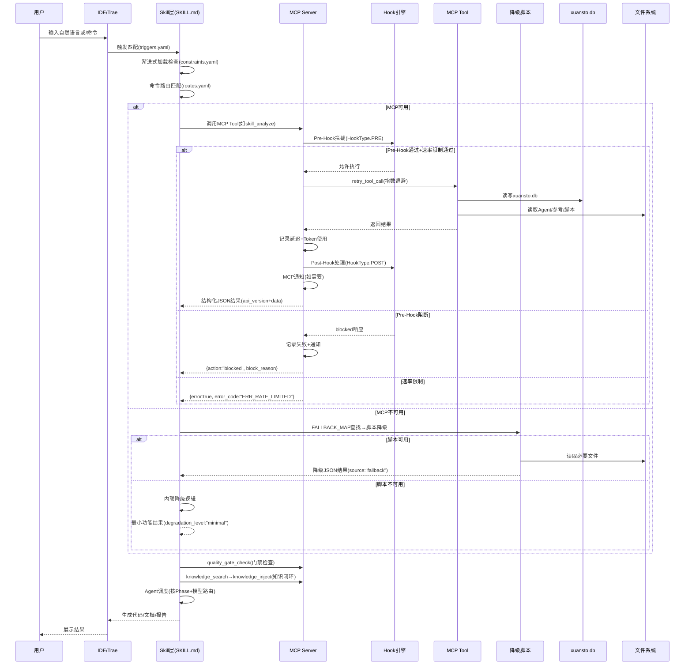
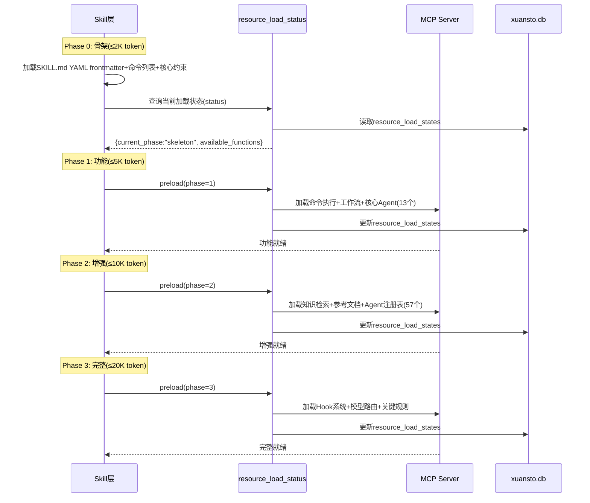
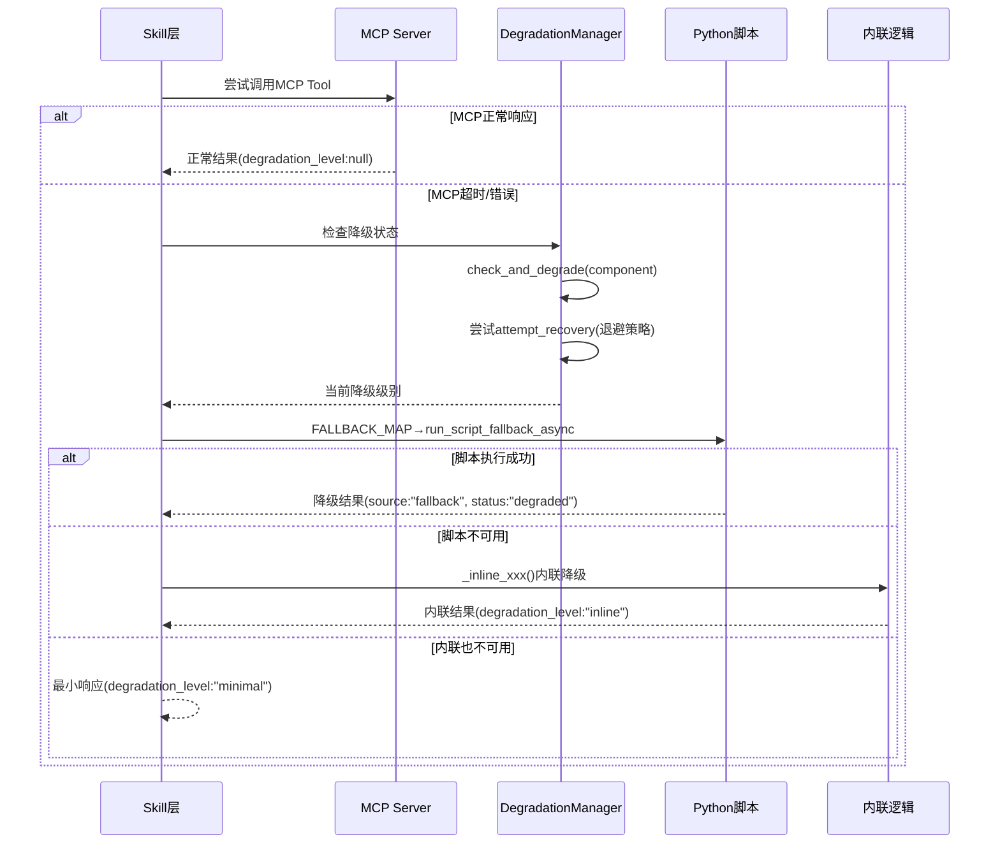
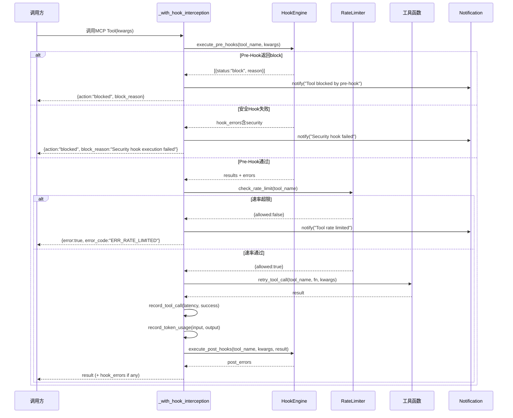

# Xuansto Skill 架构文档

> ARCH-01 | 版本: 8.0.0 (MCP Edition) | 最后更新: 2026-05-23

---

## 1. 项目概览

### 1.1 定位

Xuansto Skill 是一个**多Agent自主开发编排引擎**，通过 MCP (Model Context Protocol) 原子工具驱动 9 阶段全生命周期软件开发流程。它将 SDD (Spec-Driven Development) 与 TDD (Test-Driven Development) 融合，以 57 个 Agent / 13 层编排、54 项质量门禁、31 个命令为核心能力，覆盖从需求分析到部署交付的完整链路。

项目由三个组件构成：

| 组件 | 路径 | 版本 | 状态 |
|------|------|------|------|
| xuansto-skill-v2 (Skill层) | `.trae/skills/xuansto-skill-v2/` | v8.0.0 | ✅ 活跃 |
| xuansto-mcp-server (MCP Server) | `xuansto-mcp-server/` | v8.0.0 | ✅ 活跃 |
| xuansto-skill (v1) | `.trae/skills/xuansto-skill/` | v4.0.0 | ⚠️ ARCHIVED |

### 1.2 核心能力

| 能力维度 | 说明 | 代码依据 |
|---------|------|---------|
| 多Agent编排 | 57个Agent分13层（编排/产品/设计/工程/跨平台/数据/测试/安全/DevOps/质量/文档/知识/监控），按Phase动态调度 | `agents/registry.yaml` |
| 9阶段工作流 | Phase 0初始化 → Phase 8部署交付 | `references/workflow-phases.md` |
| 54项质量门禁 | 每阶段关键门禁（如 TEST-FIRST、AI-PENTEST、SPEC-CONSISTENCY），3-Strike恢复协议 | `core/config.py:DEFAULT_QUALITY_GATES_PHASE_MAP` |
| 19个MCP工具 | 19个MCP原子工具 + 8个MCP Resource，MCP不可用时自动降级 | `server.py:tool_modules` |
| 渐进式加载 | 4阶段Token预算控制（骨架≤2K → 功能≤5K → 增强≤10K → 完整≤20K） | `constraints.yaml:token_budgets` |
| 知识闭环 | Retrieve → Inject → Precipitate 三阶段知识工作流，ChromaDB → SQLite FTS → 关键词三级降级 | `core/search_engine.py` |
| Hook引擎 | HookType枚举(8种) + pre/post回调链 + 安全阻断 + 失败计数告警 | `core/hook_engine.py:HookType` |
| 降级框架 | MCP → 脚本 → 内联 → 最小响应 四级降级 | `core/degradation.py:FALLBACK_MAP` |
| 跨平台桌面 | 支持 Electron / Tauri / Flutter 桌面构建，含IPC安全审计与代码签名 | `agents/cross-platform/` |
| 模型路由 | fast / standard / deep 三级路由 | `agents/registry.yaml:model_routing_rules` |

### 1.3 用户交互模式

用户通过以下方式与系统交互：

1. **自然语言触发** — 输入触发短语（如"帮我搭建项目"、"安全审计一下"），Skill通过 `triggers.yaml` 自动匹配意图
2. **斜杠命令** — 直接使用 `/init`、`/plan`、`/implement` 等31个命令，通过 `commands/routes.yaml` 路由到MCP工具链
3. **MCP工具调用** — IDE/Agent通过MCP协议(stdio)直接调用19个原子工具
4. **CLI命令行** — 通过 `xuansto-cli` 命令行工具调用（health/invoke/gate/workflow/session/agent/config/reload），见 `cli.py`
5. **MCP Resource读取** — 通过 `xuansto://` URI方案读取配置、参考文档、会话、Agent定义等只读资源

---

## 2. 完整文件目录树

### 2.1 xuansto-skill-v2 (Skill层)

```
.trae/skills/xuansto-skill-v2/
├── SKILL.md                          # Skill入口元数据+核心约束+MCP工具摘要+关键规则
├── constraints.yaml                  # Token预算(4阶段)/门禁摘要(54项)/披露规则/降级规则/关键规则
├── triggers.yaml                     # 触发条件(phrases 74条/keywords 130+/commands 31个/not_for 12条)
├── agents/
│   ├── registry.yaml                 # 57 Agent注册表(13层/名称/Phase/模型路由)
│   ├── orchestrator/                 # 编排层(3): Orchestrator, Subagent Dispatcher, Task Coordinator
│   ├── product/                      # 产品层(4): Product Manager, Brainstorming Facilitator, System Architect, Technical Writer
│   ├── design/                       # 设计层(4): Design System Generator, UX Designer, Frontend Stylist, UI Designer
│   ├── engineering/                  # 工程层(6): Backend/Frontend/Fullstack/Mobile/Database Developer, DevOps Engineer
│   ├── cross-platform/               # 跨平台层(5): Desktop Developer, Desktop UI Adapter, Native Module Developer, IPC Specialist, Auto-Update Engineer
│   ├── database/                     # 数据层(3): Data Modeler, Data Seeder, DBA
│   ├── testing/                      # 测试层(10): AI Penetration/Desktop/E2E/Integration/Performance/Security/Unit Tester, QA Engineer, Test Architect, Test Maintainer
│   ├── security/                     # 安全层(3): Security Auditor, Compliance Officer, Penetration Tester
│   ├── devops/                       # DevOps层(4): Build-Release Engineer, CI/CD Specialist, Monitor Specialist, Runtime Supervisor
│   ├── quality/                      # 质量层(7): Bug Scanner, Code/Comment/Compliance/Doc Reviewer, History Analyzer, Refactoring Specialist
│   ├── documentation/                # 文档层(2): Documentation Engineer, Specification Keeper
│   ├── knowledge/                    # 知识层(3): Knowledge Manager, Learning Specialist, Token Optimizer
│   └── monitoring/                   # 监控层(3): Quality Monitor, Progress Tracker, Decision Logger
├── commands/
│   ├── routes.yaml                   # 31命令路由表(意图→命令→MCP工具链→降级策略→Phase)
│   ├── init.md                       # 项目初始化命令步骤
│   ├── brainstorm.md                 # 头脑风暴命令步骤
│   ├── clarify.md                    # 需求澄清命令步骤
│   ├── plan.md                       # 架构规划命令步骤
│   ├── spec.md                       # 规格文档命令步骤
│   ├── design.md / design-system.md  # 设计/设计系统命令步骤
│   ├── implement.md                  # 代码实现命令步骤
│   ├── test.md                       # 测试命令步骤
│   ├── review.md                     # 代码审查命令步骤
│   ├── fix.md                        # Bug修复命令步骤
│   ├── audit.md                      # 安全审计命令步骤
│   ├── accept.md                     # 验收确认命令步骤
│   ├── deploy.md                     # 部署交付命令步骤
│   ├── build.md / build-desktop.md / release-desktop.md  # 构建/桌面构建/桌面发布
│   ├── simplify.md / refactor.md     # 代码简化/重构命令步骤
│   ├── loop.md / cancel-loop.md      # 自主循环/取消循环
│   ├── learn.md                      # 知识学习命令步骤
│   ├── agent-status.md               # Agent状态查询
│   ├── status.md                     # 进度查询
│   ├── rollback.md                   # 回滚命令步骤
│   ├── sprint.md                     # 冲刺命令步骤
│   ├── execute-plan.md               # 执行计划命令步骤
│   ├── sdd-tdd-medium.md             # 中等规模SDD+TDD
│   ├── sdd-tdd-fast.md               # 快速SDD+TDD
│   ├── decision.md                   # 决策记录命令步骤
│   └── budget.md                     # Token预算管理命令步骤
├── configs/
│   └── default.yaml                  # 默认配置(Token预算/降级/Hook/模型路由/会话持久化)
├── hooks/
│   └── hooks.json                    # Hook配置(security-block/token-budget-check/encoding-check等18个)
├── memory/
│   ├── fixes/                        # 修复经验记忆(refactoring/)
│   └── patterns/                     # 模式记忆(testing/)
├── migrations/                       # 迁移目录
├── references/                       # 参考文档(80+个.md)
│   ├── agent-details/                # 57个Agent详细定义
│   ├── agent-registry.md             # Agent完整注册详情
│   ├── quality-gates.md              # 质量门禁完整定义(54项)
│   ├── workflow-phases.md            # 9阶段工作流详情
│   ├── mcp-tools.md                  # MCP工具参数与返回值
│   ├── progressive-loading.md        # 渐进式加载机制
│   ├── hook-system.md                # Hook系统说明
│   ├── model-routing.md              # 模型路由说明
│   ├── knowledge-workflow-details.md # 知识工作流详情
│   ├── session-persistence.md        # 会话持久化说明
│   ├── spec-drift-handling.md        # 规格漂移处理
│   ├── token-optimization.md         # Token优化策略
│   ├── owasp-agentic-top10-2026.md   # OWASP Agentic Top 10
│   ├── owasp-mcp-top10.md            # OWASP MCP Top 10
│   ├── owasp-top10-2026.md           # OWASP Top 10 2026
│   └── ...                           # 其他60+参考文档
├── scripts/                          # 降级脚本集(50+)
│   ├── knowledge_server/             # 知识服务子模块(28文件)
│   │   ├── main.py                   # 知识服务入口
│   │   ├── api.py / api_routes.py / api_models.py  # API路由+模型
│   │   ├── db_engine.py              # 数据库引擎
│   │   ├── vector_engine.py          # 向量引擎(ChromaDB)
│   │   ├── hybrid_search.py          # 混合搜索
│   │   ├── progressive_search.py     # 渐进式搜索
│   │   ├── embedding.py              # 嵌入模型
│   │   ├── experience_precipitator.py # 经验沉淀
│   │   ├── mcp_server.py             # 知识服务MCP Server
│   │   ├── degradation.py            # 知识服务降级
│   │   ├── distillation.py           # 知识蒸馏
│   │   ├── web_search.py             # Web搜索集成
│   │   └── ...                       # 其他模块
│   ├── verification/                 # 验证脚本(4个)
│   ├── workflow-tools/               # 工作流工具脚本(5个)
│   ├── skill-test.py                 # Skill分析+门禁+Agent状态降级
│   ├── knowledge-server.py           # 知识检索降级入口
│   ├── agentic-security-scanner.py   # 安全扫描降级
│   ├── code-simplifier.py            # 代码简化降级
│   ├── context-compressor.py         # 上下文压缩降级
│   ├── spec-drift-detector.py        # 规格漂移检测降级
│   ├── health-checker.py             # 健康检查降级
│   ├── session-persist.py            # 会话持久化
│   ├── session-catchup.py            # 会话恢复
│   ├── init-session.py               # 会话初始化
│   ├── project-initializer.py        # 项目初始化
│   ├── token-budget-guard.py         # Token预算守卫
│   ├── check-encoding.py             # 编码检查
│   ├── coverage-check.py             # 覆盖率检查
│   ├── pattern-learner.py            # 模式学习
│   └── ...                           # 其他20+脚本
├── templates/                        # 项目模板(19个)
│   ├── prd-template.md               # 产品需求文档模板
│   ├── adr-template.md               # 架构决策记录模板
│   ├── design-system-template.md     # 设计系统模板
│   ├── test-plan-template.md         # 测试计划模板
│   ├── security-checklist.md         # 安全检查清单
│   ├── ci-cd-pipeline-template.yaml  # CI/CD流水线模板
│   ├── desktop-build-config-template.yaml  # 桌面构建配置模板
│   ├── flutter-build-config-template.yaml  # Flutter构建配置模板
│   ├── auto-update-config-template.yaml    # 自动更新配置模板
│   └── ...                           # 其他模板
├── workflows/
│   ├── _yaml/                        # 工作流YAML定义(15个)
│   │   ├── sdd-tdd-full.yaml
│   │   ├── sdd-tdd-medium.yaml
│   │   ├── sdd-tdd-fast.yaml
│   │   ├── brainstorming-workflow.yaml
│   │   ├── security-audit.yaml
│   │   ├── desktop-build-workflow.yaml
│   │   ├── cross-platform-workflow.yaml
│   │   ├── flutter-desktop-workflow.yaml
│   │   ├── subagent-driven-workflow.yaml
│   │   └── ...
│   ├── sdd-tdd-full.md               # 工作流Markdown说明
│   └── ...
├── examples/
│   ├── web-app-development.md
│   └── desktop-app-development.md
├── evals/
│   ├── mcp_evaluation.xml            # MCP评估配置
│   └── trigger_eval.json             # 触发器评估配置
├── .knowledge/                       # 知识库运行时目录
│   ├── script-errors/                # 脚本错误记录
│   └── temp-scripts/                 # 临时脚本
├── CHANGELOG.md
├── MIGRATION.md                      # v1→v2迁移指南
├── PROBLEM.md                        # 已知问题
└── .gitignore
```

### 2.2 xuansto-mcp-server (MCP Server层)

```
xuansto-mcp-server/
├── pyproject.toml                    # 项目元数据(v8.0.0, Python>=3.10, hatchling构建)
│                                     # 核心依赖: mcp[cli]>=1.0.0, pydantic>=2.0.0, pyyaml>=6.0
│                                     # 可选依赖[full]: chromadb, fastapi, uvicorn, openai, sentence-transformers, watchfiles
│                                     # 入口: xuansto-mcp = xuansto_mcp.server:main
│                                     #       xuansto-cli = xuansto_mcp.cli:main
├── src/xuansto_mcp/
│   ├── __init__.py                   # 版本号: __version__ = "8.0.0"
│   ├── server.py                     # FastMCP入口: 19工具注册+Hook拦截包装+Resource注册+启动流程
│   ├── cli.py                        # CLI工具: health/invoke/gate/version/config/reload/workflow/session/agent
│   ├── tools/                        # 19个MCP原子工具
│   │   ├── __init__.py
│   │   ├── skill_analyze.py          # 技能分析(项目结构/Agent/脚本扫描, depth=basic|full)
│   │   ├── knowledge_search.py       # 知识检索(action=retrieve, search_type=hybrid|semantic_only|keyword_only)
│   │   ├── knowledge_inject.py       # 知识注入+经验沉淀(inject/list_available/precipitate/add/update)
│   │   ├── quality_gate_check.py     # 质量门禁检查(54门禁, 按Phase分组, severity=BLOCK|WARN)
│   │   ├── spec_drift_detect.py      # 规格漂移检测(spec_dir vs src_dir)
│   │   ├── security_scan.py          # 安全扫描(OWASP Agentic+依赖扫描, severity_threshold=critical|high|medium|low)
│   │   ├── code_simplify.py          # 代码简化+重复检测(scope=file|dir|recent)
│   │   ├── session_manage.py         # 会话管理(save/load/list/detect/verify/track/restore)
│   │   ├── workflow_dispatch.py      # 工作流调度(start/status/abort/phase/recover/snapshots)
│   │   ├── agent_status.py           # Agent状态查询(list/by_phase/detail/match/merge, 只读)
│   │   ├── agent_manage.py           # Agent管理(create/assign/release/instance_status/destroy/schedule, 变更)
│   │   ├── hook_manage.py            # Hook管理(list/execute, profile=minimal|standard|strict)
│   │   ├── resource_load_status.py   # 资源加载状态(status/preload/cache/clear_cache/loading_progress/token_report/disclosure_transition)
│   │   ├── context_compress.py       # 上下文压缩(semantic|selective|lossless, target_tokens=100~50000)
│   │   ├── server_health.py          # 服务器健康检查+版本协商(check/negotiate_version/capabilities)
│   │   ├── decision_log.py           # 决策日志(log/list/query/update/export/stats)
│   │   ├── token_budget.py           # Token预算管理(status/set_budget/recommend/report)
│   │   ├── project_init.py           # 项目初始化(create/validate/detect_stack)
│   │   ├── metrics_report.py         # 指标报告(query/summary, 按Tool/时间/类型)
│   │   └── config_manage.py          # 配置管理(reload/status/validate)
│   ├── resources/
│   │   ├── __init__.py
│   │   └── skill_resources.py        # 8个MCP Resource注册(见§9)
│   ├── core/                         # 核心基础设施(14个模块)
│   │   ├── __init__.py
│   │   ├── config.py                 # 配置管理: 路径解析/YAML加载/热重载(watchfiles+polling+SIGHUP)/门禁映射/Hook映射/API版本(v3.0.0)
│   │   ├── database.py               # 统一SQLite存储: xuansto.db(8表+11索引)/WAL模式/persist_state+load_state/upsert+auto_increment
│   │   ├── cache.py                  # LRU缓存管理
│   │   ├── crypto.py                 # AES-256-GCM加密(快照/敏感数据)
│   │   ├── rate_limiter.py           # 令牌桶速率限制(每工具独立)
│   │   ├── degradation.py            # 降级策略管理: DegradationManager(4组件/健康监控/恢复退避/hash持久化)/FALLBACK_MAP(17工具)/脚本+内联降级
│   │   ├── errors.py                 # 统一错误处理: XuanstoMCPError体系(8种error_code)/i18n/retry_tool_call(指数退避+抖动)/瞬态vs永久错误分类
│   │   ├── hook_engine.py            # Hook引擎: HookType枚举(8种)/HookHandler+AsyncHookHandler Protocol/pre+post回调链/安全阻断/失败计数告警/JSON配置加载
│   │   ├── logging_config.py         # 日志配置
│   │   ├── metrics.py                # 指标收集(TTL自动清理)
│   │   ├── notifications.py          # MCP通知回调系统: NotificationCallback+MCPNotificationCallback Protocol/5种事件类型/Null默认实现
│   │   ├── search_engine.py          # 搜索引擎抽象层: SearchEngine Protocol/ChromaDBSearchEngine/SimpleSearchEngine/SQLiteFTSSearchEngine(BM25)/HybridSearchEngine(0.6语义+0.4BM25)/自动检测
│   │   ├── subprocess_utils.py       # 子进程工具(异步脚本降级调用)
│   │   └── validator.py              # 路径安全验证+名称白名单校验
│   ├── models/
│   │   ├── __init__.py
│   │   ├── schemas.py                # Pydantic v2输入模型(19个Input Schema, action必填, extra="forbid")
│   │   └── config_models.py          # 配置Pydantic模型(SkillConfigModel)
│   └── data/                         # 运行时数据目录
│       ├── knowledge/                # 知识库数据
│       │   ├── general/              # 通用知识(范式/模式/安全/标准/测试/桌面/DevOps)
│       │   ├── workspace/            # 工作区知识(API/架构/约定/桌面/领域/环境/术语)
│       │   ├── experience/           # 经验知识(决策/桌面/错误/集成/模式/性能/重构/安全)
│       │   └── index/                # 索引数据(knowledge.db + chroma_db/)
│       ├── .skill-config.yaml        # Skill运行时配置
│       ├── .xuansto-config.yaml      # MCP Server运行时配置(门禁脚本映射/Hook脚本映射/Phase门禁映射)
│       └── fallback_config.yaml      # 降级配置(YAML可覆盖默认FALLBACK_MAP)
└── tests/                            # 测试目录(pytest+pytest-asyncio, asyncio_mode=auto)
```

### 2.3 xuansto-skill (v1, ARCHIVED)

```
.trae/skills/xuansto-skill/           # 已废弃, migrate_to: xuansto-skill-v2
├── SKILL.md                          # v4入口(含完整命令路由+Agent索引)
├── .skill-config.yaml                # v4配置
├── agents/                           # Agent定义(部分与v2不同)
├── commands/                         # 26个命令(无budget/decision/sdd-tdd-*)
├── configs/
├── evals/                            # 评估配置
├── examples/
├── hooks/
├── memory/                           # 更详细的记忆结构(errors/fixes/metrics/patterns)
├── migrations/
├── references/                       # 参考文档(含agent-details/子目录)
├── scripts/                          # 脚本集
├── templates/
├── workflows/
└── .knowledge/                       # 知识库(含experience+general+workspace完整结构)
```

---

## 3. 当前架构分层

当前系统采用 **Skill层 → MCP执行层 → 数据层 → 依赖层** 四层架构：

```
┌─────────────────────────────────────────────────────────────────┐
│                  Skill 层 (xuansto-skill-v2)                     │
│  SKILL.md + constraints.yaml + triggers.yaml                    │
│  命令路由(routes.yaml, 31命令) + Agent注册表(registry.yaml, 57)  │
│  渐进式加载控制(4阶段Token预算) + 降级策略声明                     │
│  参考文档(80+) + 模板(19) + 工作流(15) + 脚本(50+)               │
├─────────────────────────────────────────────────────────────────┤
│                  MCP 执行层 (xuansto-mcp-server)                 │
│  19个MCP Tool + 8个MCP Resource (FastMCP, stdio传输)             │
│  Hook引擎(HookType 8种枚举+安全阻断+失败告警)                     │
│  搜索引擎(ChromaDB可选/SQLite FTS5+BM25/Keyword/Hybrid)          │
│  降级框架(MCP→脚本→内联→最小响应, 17工具FALLBACK_MAP)             │
│  统一SQLite存储(xuansto.db, 8表11索引, WAL模式)                   │
│  会话管理 + 工作流调度 + Agent管理 + Token预算 + 决策日志          │
│  配置热重载(watchfiles+polling+SIGHUP) + 速率限制(令牌桶)         │
│  MCP通知(5种事件类型) + 指标收集 + AES-256-GCM加密                │
├─────────────────────────────────────────────────────────────────┤
│                  数据层 (文件系统 + SQLite)                        │
│  xuansto.db: workflow_instances / session_states /               │
│    resource_load_states / degradation_states / error_patterns /  │
│    metrics / decision_records / knowledge_entries                │
│  知识库: general/ + workspace/ + experience/ + index/            │
│  运行时: .xuansto-config.yaml / fallback_config.yaml /           │
│    resource_state.json / degradation_state.json                  │
├─────────────────────────────────────────────────────────────────┤
│                  依赖层 (Python包 + 外部服务)                     │
│  核心: mcp[cli]>=1.0.0 + pydantic>=2.0.0 + pyyaml>=6.0          │
│  可选[full]: chromadb>=0.4.0 + fastapi>=0.100.0 + uvicorn +     │
│    openai>=1.0.0 + sentence-transformers>=2.0.0 + watchfiles    │
│  开发[dev]: pytest>=7.0 + pytest-asyncio>=0.21 + pytest-cov     │
└─────────────────────────────────────────────────────────────────┘
```

### 3.1 Skill层职责

- **触发匹配**: 通过 `triggers.yaml` 定义 phrases(74条)/keywords(130+)/commands(31个)/not_for(12条)，IDE自动匹配
- **渐进式加载**: 通过 `constraints.yaml` 定义4阶段Token预算和披露规则，控制上下文注入量
- **命令路由**: 通过 `commands/routes.yaml` 将31个用户意图映射到命令→MCP工具链→降级路径→Phase
- **Agent注册**: 通过 `agents/registry.yaml` 声明57个Agent的层级/Phase/模型路由
- **核心约束**: Spec > Test > Code、Karpathy准则、3-Strike Protocol、2-Action Research等
- **降级声明**: 在 `constraints.yaml` 中声明每个MCP工具的降级脚本和降级链

### 3.2 MCP执行层职责

- **MCP工具服务**: 19个原子工具通过FastMCP注册，stdio传输；本地 `_TOOL_FUNCTIONS` 注册表
- **Hook拦截**: 每个工具调用经过 `_with_hook_interception` 包装 → pre-hook(可阻断) → 速率限制 → 执行(含重试) → post-hook → 通知
- **搜索引擎**: 可插拔架构(`SearchEngine` Protocol)，4种实现(ChromaDB/Simple/SQLiteFTS/Hybrid)，`_detect_best_engine()` 自动检测
- **降级执行**: `FALLBACK_MAP` 覆盖17个工具，每工具3级降级(脚本→内联→最小响应)，YAML配置可覆盖
- **配置热重载**: watchfiles事件驱动 + 线程轮询降级 + SIGHUP信号；`config_manage` Tool提供MCP入口
- **会话持久化**: `session_manage` 管理7种操作，`restore_on_startup()` 启动恢复，atexit handler确保落盘
- **统一存储**: `xuansto.db` (SQLite WAL) 统一8表，`persist_state()` upsert + `load_state()` 查询 + hash验证 + 写入锁
- **降级监控**: `DegradationManager` 管理4组件(search_engine/knowledge_base/hooks/resources)，健康监控线程+恢复退避+hash持久化+MCP通知
- **指标收集**: `server_health` 记录每次工具调用的延迟和成功/失败，`metrics_report` 提供查询和汇总
- **MCP通知**: 5种事件类型(degradation_change/phase_transition/phase_degradation/token_budget_exceeded/gate_failed)

### 3.3 数据层职责

- **xuansto.db**: 8表统一存储，替代分散的JSON/SQLite文件
  - `workflow_instances`: 工作流实例(类型/Phase/状态/数据)
  - `session_states`: 会话状态(数据JSON)
  - `resource_load_states`: 资源加载状态(Phase/资源JSON)
  - `degradation_states`: 降级状态(组件/级别/数据)
  - `error_patterns`: 错误模式(模式/类型/数据)
  - `metrics`: 指标(工具名/类型/值/时间戳, 自增ID)
  - `decision_records`: 决策记录(工作流ID/决策数据)
  - `knowledge_entries`: 知识条目(标题/内容/范围/标签/软删除)
- **知识库文件系统**: general/(通用) + workspace/(工作区) + experience/(经验) 三层知识
- **索引数据**: `knowledge.db` (SQLite FTS5) + `chroma_db/` (ChromaDB向量索引)

### 3.4 依赖层职责

- **核心依赖**: `mcp[cli]` (MCP协议+CLI)、`pydantic` (数据校验+v2模型)、`pyyaml` (配置解析)
- **可选依赖[full]**: `chromadb` (向量搜索)、`fastapi+uvicorn` (HTTP API)、`sentence-transformers` (嵌入)、`openai` (LLM)、`watchfiles` (配置热重载)
- **开发依赖[dev]**: `pytest+pytest-asyncio+pytest-cov` (测试框架)

### 3.5 数据流

1. **启动流程** → `main()` → `setup_logging()` → `start_config_watcher()` → `init_db()` → `restore_on_startup()` → `workflow_load_on_startup()` → `agent_load_on_startup()` → `health_load_on_startup()` → `metrics_load_on_startup()` → `degradation_load_on_startup()` → `start_fallback_watcher()` → `mcp.run(transport="stdio")`
2. **工具调用** → FastMCP路由 → `_TOOL_FUNCTIONS`查找 → `_with_hook_interception`包装 → pre-hook(HookType枚举+安全阻断) → 速率限制 → `retry_tool_call`(指数退避+抖动) → 执行 → 记录延迟+Token使用 → post-hook → 通知 → 返回
3. **知识检索** → `knowledge_search`(只读retrieve) → `search_engine.py`(HybridSearchEngine: 0.6×语义 + 0.4×BM25) → 返回`SearchResult`
4. **知识写入** → `knowledge_inject`(所有写入: inject/precipitate/add/update) → `database.py`写入xuansto.db → `cache.py`更新LRU缓存 → 通知回调
5. **降级路径** → MCP调用失败 → `degradation.py` → `FALLBACK_MAP`查找 → `run_script_fallback_async`(异步脚本调用) → 内联降级 → 最小响应
6. **状态持久化** → atexit handler → hash验证(SHA-256) → 写入锁 → xuansto.db落盘 + JSON文件落盘

---

## 4. 调用流程图

### 4.1 主流程：用户输入到最终输出



### 4.2 渐进式加载流程



### 4.3 降级调用链



### 4.4 Hook拦截流程



---

## 5. 目标架构设计

### 5.1 Skill与MCP职责划分

> ARCH-02 | 核心设计原则：Skill管"知道什么"，MCP管"能做什么"

| 维度 | Skill层职责 | MCP Server职责 |
|------|-----------|---------------|
| 知识 | 触发条件(`triggers.yaml`)、命令路由(`routes.yaml`)、Agent注册表(`registry.yaml`)、核心约束(`constraints.yaml`) | 知识检索(`knowledge_search`)、知识注入(`knowledge_inject`)、经验沉淀 |
| 决策 | 工作流选择(full/medium/fast)、模型路由(fast/standard/deep) | 门禁检查(`quality_gate_check`)、规格漂移检测(`spec_drift_detect`)、Token预算推荐(`token_budget`) |
| 执行 | 命令步骤编排(31个`.md`)、Agent调度指导(57个Agent定义) | 工具调用(分析/扫描/简化/压缩)、会话管理(`session_manage`)、工作流调度(`workflow_dispatch`) |
| 资源 | 资源定义(Agent.md/命令.md/参考.md/模板.md) | 资源加载状态(`resource_load_status`)、缓存管理、渐进式披露(`xuansto://loading/status`) |
| 降级 | 降级策略声明(`constraints.yaml:degradation`) | 降级执行(`degradation.py:FALLBACK_MAP`→脚本→内联→最小响应) |
| 通信 | SKILL.md作为IDE的Skill协议接口 | MCP协议(stdio)作为工具调用接口 |
| 安全 | 安全约束声明(OWASP/IPC/代码签名) | Hook安全阻断(`security-block`)、速率限制(`rate_limiter`)、路径验证(`validator`)、加密(`crypto`) |

### 5.2 MCP Server边界

> ARCH-03 | MCP Server是"无状态工具服务"，不持有业务逻辑

**MCP Server应做的事：**
- 提供原子工具能力（19个Tool: 分析/检索/注入/检查/扫描/简化/压缩/管理/调度/监控等）
- 管理工具调用的Hook拦截链（8种HookType，pre可阻断，post可增强）
- 实现搜索引擎的可插拔架构（4种实现，自动检测最优引擎）
- 执行降级脚本调用并包装结果（17工具FALLBACK_MAP，YAML可覆盖）
- 维护会话状态和工作流实例（xuansto.db 8表，WAL模式）
- 提供资源加载状态和Token预算管理（4阶段渐进式加载）
- 提供MCP通知能力（5种事件类型，可插拔回调）
- 提供指标收集和健康检查（延迟/成功率/Token使用/降级统计）

**MCP Server不应做的事：**
- 不做命令路由决策（由Skill层的`routes.yaml`负责）
- 不做Agent调度决策（由Skill层的`registry.yaml`负责）
- 不做工作流选择决策（由Skill层根据项目规模决定）
- 不做渐进式加载策略决策（由Skill层的`constraints.yaml`定义）
- 不持有业务规则（Spec > Test > Code等约束在Skill层声明）
- 不做模型路由决策（由Skill层的`registry.yaml:model_routing_rules`定义）

### 5.3 渐进式加载注入点与触发机制

> ARCH-04 | 渐进式加载是Skill层与MCP层的协作机制

```
┌──────────────────────────────────────────────────────────────────┐
│ 渐进式加载注入点                                                  │
│                                                                  │
│  ┌───────────┐    ┌──────────────┐    ┌────────────────────┐    │
│  │ SKILL.md  │───▶│constraints   │───▶│resource_load_      │    │
│  │ (触发入口) │    │.yaml(预算定义)│    │status(MCP执行)     │    │
│  └───────────┘    └──────────────┘    └────────────────────┘    │
│       │                 │                      │                 │
│       ▼                 ▼                      ▼                 │
│  触发匹配          Token预算分配          资源预加载/缓存        │
│  (phrases/         (2K→5K→10K→20K)      (preload/cache/         │
│   keywords)                               clear_cache)          │
│                                                                  │
│  注入点1: Skill触发时 → Phase 0骨架(≤2K)                         │
│    加载: YAML frontmatter + 命令列表(31个名称) + MCP依赖 + 5条约束 │
│                                                                  │
│  注入点2: 用户执行命令时 → Phase 1功能(≤5K)                       │
│    加载: 执行入口 + 工作流Phase概览 + 命令路由(精简) + 核心Agent(13)│
│                                                                  │
│  注入点3: 需要参考文档时 → Phase 2增强(≤10K)                      │
│    加载: 完整命令路由(含降级) + Agent注册表(57) + 参考文档 + 知识检索│
│                                                                  │
│  注入点4: 深度分析时 → Phase 3完整(≤20K)                          │
│    加载: Hook系统 + 模型路由 + 关键规则 + 全部上述内容             │
│                                                                  │
│  触发机制:                                                        │
│  - 自动触发: Skill加载时自动进入Phase 0                           │
│  - 命令触发: 用户执行命令时自动推进到Phase 1                       │
│  - 显式触发: 调用resource_load_status(preload, phase=N)           │
│  - 披露触发: 访问不可用功能时通过xuansto://loading/status提示      │
│  - 降级触发: 不可用功能降级到可用范围内执行                        │
└──────────────────────────────────────────────────────────────────┘
```

**各阶段注入内容与降级行为：**

| 阶段 | 触发条件 | 注入内容 | 不可用功能及降级 | 披露方式 |
|------|---------|---------|----------------|---------|
| Phase 0 骨架 | Skill触发时 | 核心元数据、命令列表(无详情)、MCP依赖、5条约束 | 命令执行→仅展示列表；工作流→精简规则；Agent→无信息 | `xuansto://loading/status` |
| Phase 1 功能 | 用户执行命令时 | 命令路由(精简)+执行入口+工作流概览+核心Agent(13)+门禁 | 知识检索→跳过用默认；参考文档→内嵌摘要；完整路由→精简版 | 提示可通过preload推进 |
| Phase 2 增强 | 需要参考文档时 | 完整路由(含降级)+Agent注册表(57)+参考文档+MCP工具摘要+知识检索 | Hook系统→minimal配置；模型路由→默认standard | 降级到可用范围内执行 |
| Phase 3 完整 | 深度分析时 | Hook系统+模型路由+关键规则+全部上述内容 | 无 | — |

---

## 6. 当前架构 vs 目标架构差异表

> ARCH-05 | 当前状态与目标状态的逐项对比

| # | 维度 | 当前状态 | 目标状态 | 差距 | 状态 |
|---|------|---------|---------|------|------|
| 1 | Skill入口 | SKILL.md约83行，含MCP工具摘要表+关键规则 | SKILL.md精简骨架，所有详情按需加载 | SKILL.md仍包含Phase概览和工具摘要 | P2 |
| 2 | 命令路由 | `routes.yaml`声明式路由，31命令 | 命令路由完全由Skill层声明，MCP仅执行 | ✅ 已实现 | — |
| 3 | Agent注册 | `registry.yaml`声明57个Agent(13层) | Agent注册表由Skill层声明，MCP仅查询 | ✅ 已实现 | — |
| 4 | MCP工具数 | 19个Tool + 8个Resource | 稳定19 Tool + 8 Resource，按需扩展 | ✅ 已实现 | — |
| 5 | 降级策略 | `constraints.yaml`声明 + `degradation.py`执行(17工具FALLBACK_MAP) | 每个MCP Tool都有完整降级路径 | ✅ 已实现，异步降级+YAML可覆盖 | — |
| 6 | 渐进式加载 | 4阶段Token预算 + `resource_load_status`(7种action) + `DisclosureTransition`状态机 | 完整的渐进式加载+披露+自动推进+Phase通知 | ✅ 4阶段模型+DisclosureTransition已实现 | — |
| 7 | Hook系统 | `hook_engine.py` + HookType枚举(8种) + `hooks.json` + 失败告警 | 可插拔Hook引擎，支持动态注册+安全阻断+失败计数 | ✅ 已实现 | — |
| 8 | 搜索引擎 | `search_engine.py`可插拔(4种实现+HybridSearchEngine 0.6/0.4权重) | 三级降级自动切换+HybridSearchEngine | ✅ 已实现 | — |
| 9 | 配置热重载 | watchfiles + 线程轮询 + SIGHUP + `config_manage` Tool | 事件驱动优先，轮询降级，MCP入口 | ✅ 已实现 | — |
| 10 | 知识闭环 | `knowledge_search`(只读retrieve) + `knowledge_inject`(所有写入5种action) | Retrieve→Inject→Precipitate完整闭环，读写分离 | ✅ 读写分离完成 | — |
| 11 | v1废弃 | xuansto-skill v1仍存在目录 | 完全移除v1，统一到v2 | v1目录已标记ARCHIVED | P2 |
| 12 | CLI工具 | `xuansto-cli` 8个子命令(health/invoke/gate/version/config/reload/workflow/session/agent) | 完整CLI覆盖所有MCP工具 | 基础命令已实现，部分工具需通过invoke调用 | P3 |
| 13 | 统一存储 | `xuansto.db` (SQLite WAL) 8表11索引 | 替代分散JSON/SQLite文件 | ✅ 已实现，`database.py`统一管理 | — |
| 14 | 安全增强 | `rate_limiter.py`(令牌桶) + `validator.py`(路径安全+白名单) + `crypto.py`(AES-256-GCM) + Hook安全阻断 | 多层安全防护 | ✅ 已实现 | — |
| 15 | 错误统一 | `errors.py`统一error_code(8种) + i18n + `retry_tool_call`(指数退避+抖动) + 瞬态/永久分类 | 一致错误处理 | ✅ 已实现 | — |
| 16 | 状态持久化 | atexit handler + SHA-256 hash验证 + 写入锁 + WAL模式 | 进程退出时状态落盘 | ✅ 已实现 | — |
| 17 | 工具注册 | 本地`_TOOL_FUNCTIONS`注册表 + `_with_hook_interception`包装 | 不依赖`_tool_manager._tools` | ✅ 已实现 | — |
| 18 | 降级监控 | `DegradationManager` 4组件 + 健康监控线程 + 恢复退避 + hash持久化 + MCP通知 | 自动降级检测+恢复+通知 | ✅ 已实现 | — |
| 19 | MCP通知 | `notifications.py` 5种事件 + 可插拔回调 + Null默认 | 事件驱动的状态变更通知 | ✅ 已实现 | — |
| 20 | 指标收集 | `server_health`记录延迟/成功 + `metrics_report`查询汇总 + TTL清理 | 完整的运行时指标 | ✅ 已实现 | — |
| 21 | 测试覆盖 | pytest+pytest-asyncio配置(asyncio_mode=auto) | 核心模块测试覆盖率≥80% | 测试框架已配置，覆盖率待提升 | P1 |
| 22 | Token预算 | `token_budget`工具 + `constraints.yaml`声明 | 动态预算调整+Phase感知分配 | 基础功能已实现，动态调整待完善 | P2 |
| 23 | 上下文压缩 | `context_compress`工具(semantic/selective/lossless) | 三级压缩自动触发 | ✅ 已实现，自动触发阈值待调优 | P2 |
| 24 | 决策日志 | `decision_log`工具(6种action: log/list/query/update/export/stats) | 决策透明化+ADR集成 | ✅ 已实现 | — |
| 25 | API版本 | MCP API v3.0.0, 最低兼容v2.0.0 | 向后兼容的API演进 | ✅ 已实现 | — |

---

## 7. 风险与约束

### 7.1 架构风险

> ARCH-06 | Skill层与MCP层耦合风险

| 风险ID | 风险描述 | 影响 | 缓解措施 | 状态 |
|--------|---------|------|---------|------|
| ARCH-06-1 | Skill层SKILL.md包含MCP工具摘要表，与`references/mcp-tools.md`重复定义 | 维护不一致风险 | 将工具摘要表移至references/，SKILL.md仅保留引用 | P2 |
| ARCH-06-2 | 降级策略中"内联降级"缺乏统一接口(各工具`_inline_xxx()`实现各异) | 降级行为不可预测 | 将所有内联降级提取为独立脚本或统一内联框架 | P3 |
| ARCH-06-3 | MCP Server通过`_detect_skill_root()`自动发现Skill目录，失败时静默降级到DATA_DIR | 路径解析失败时无告警 | ✅ 已增加启动时路径验证日志和警告 | — |
| ARCH-06-4 | Hook拦截失败不阻塞主流程(仅记录hook_errors) | 可能导致安全检查被跳过 | ✅ 安全Hook失败默认阻塞(`security_hook_failed`检查) | — |
| ARCH-06-5 | `FALLBACK_MAP`在`degradation.py`中硬编码17个工具降级函数 | 新增工具需同步更新降级映射 | YAML配置(`fallback_config.yaml`)可覆盖默认映射 | P2 |
| ARCH-06-6 | `DegradationManager`健康监控线程每30秒检查所有组件 | 检查间隔内组件状态可能已变化 | 可配置间隔+MCP通知实时推送状态变更 | P3 |

### 7.2 运行约束

> ARCH-07 | 运行时约束条件

| 约束ID | 约束描述 | 值 | 代码依据 |
|--------|---------|-----|---------|
| ARCH-07-1 | Python版本 | >=3.10 | `pyproject.toml:requires-python` |
| ARCH-07-2 | MCP API版本 | v3.0.0, 最低兼容v2.0.0 | `config.py:MCP_API_VERSION` |
| ARCH-07-3 | MCP传输方式 | stdio (不支持SSE/HTTP) | `server.py:mcp.run(transport="stdio")` |
| ARCH-07-4 | 降级健康检查间隔 | 30秒 | `degradation.py:_DEFAULT_HEALTH_INTERVAL` |
| ARCH-07-5 | 恢复退避策略 | 基础5秒×2^attempt + 抖动, 上限300秒 | `degradation.py:_BASE_RECOVERY_BACKOFF/_MAX_RECOVERY_BACKOFF` |
| ARCH-07-6 | 工具重试 | 最多3次, 指数退避(1s/2s/4s)+抖动 | `errors.py:retry_tool_call` |
| ARCH-07-7 | Hook失败告警阈值 | 5次 | `hook_engine.py:_HOOK_FAILURE_THRESHOLD` |
| ARCH-07-8 | SQLite忙等待 | 5000ms | `database.py:PRAGMA busy_timeout` |
| ARCH-07-9 | 知识检索降级链 | ChromaDB → SQLite FTS5+BM25 → 关键词匹配 | `search_engine.py:_detect_best_engine` |
| ARCH-07-10 | HybridSearch权重 | 语义0.6 + BM25 0.4 | `search_engine.py:HybridSearchEngine` |
| ARCH-07-11 | 降级级别 | L1_NORMAL / L2_LOCAL_SEMANTIC / L3_BM25_ONLY | `degradation.py:DegradationLevel` |
| ARCH-07-12 | 配置热重载 | watchfiles事件驱动优先, 轮询5秒降级 | `config.py:start_config_watcher` |
| ARCH-07-13 | 降级配置热重载 | watchfiles事件驱动优先, 轮询5秒降级 | `degradation.py:start_fallback_watcher` |

### 7.3 兼容性约束

> ARCH-08 | 版本兼容性

| 约束 | 说明 | 代码依据 |
|------|------|---------|
| v1→v2迁移 | xuansto-skill v1已废弃(ARCHIVED)，SKILL.md标记`migrate_to: xuansto-skill-v2` | `.trae/skills/xuansto-skill/` |
| MCP最低版本 | xuansto-mcp-server >= 4.0.0 | `SKILL.md:最低兼容` |
| API版本兼容 | MCP API v3.0.0向后兼容v2.0.0客户端 | `config.py:API_CHANGELOG` |
| ChromaDB路径迁移 | 旧路径`chroma/`自动迁移到`chroma_db/` | `config.py:_migrate_chroma_path` |
| 构建系统 | hatchling (非setuptools) | `pyproject.toml:build-backend` |

### 7.4 安全约束

> ARCH-09 | 安全相关约束

| 约束 | 说明 | 代码依据 |
|------|------|---------|
| 路径安全 | `validator.py`校验所有文件访问路径，防止目录遍历 | `skill_resources.py:_is_safe_path` |
| Hook安全阻断 | `security-block` Hook可在Pre-Hook阶段阻断工具调用 | `server.py:security_hook_failed` |
| 速率限制 | 令牌桶算法，每工具独立限制 | `rate_limiter.py:check_rate_limit` |
| 编码安全 | UTF-8无BOM + 无U+FFFD检测 | `constraints.yaml:script-standard` |
| 脚本安全 | `script-security-scanner.py`扫描脚本安全性 | `scripts/script-security-scanner.py` |
| 加密存储 | AES-256-GCM加密快照和敏感数据 | `core/crypto.py` |
| 桌面安全 | IPC安全审计 + 代码签名验证 | `agents/cross-platform/ipc-specialist.md` |
| Pydantic严格校验 | 所有Input Schema设置`extra="forbid"`，拒绝未知字段 | `models/schemas.py` |

---

## 8. MCP工具清单与降级映射

> ARCH-10 | 19个MCP工具与降级路径完整映射

| # | MCP Tool | 功能 | Input Schema | 降级脚本 | 降级方式 |
|---|----------|------|-------------|---------|---------|
| 1 | skill_analyze | 项目结构/Agent/脚本分析 | SkillAnalyzeInput | `skill-test.py --analyze` | 脚本→内联→最小 |
| 2 | knowledge_search | 知识检索(hybrid/semantic/keyword) | KnowledgeSearchInput | `knowledge-server.py --search` | 脚本→内联→最小 |
| 3 | knowledge_inject | 知识注入+经验沉淀(5种action) | KnowledgeInjectInput | `knowledge_server/main.py --inject` | 脚本→内联→最小 |
| 4 | quality_gate_check | 54项质量门禁检查 | QualityGateCheckInput | `skill-test.py --gate` | 脚本→内联→最小 |
| 5 | spec_drift_detect | 规格漂移检测 | SpecDriftDetectInput | `spec-drift-detector.py` | 脚本→内联→最小 |
| 6 | security_scan | OWASP Agentic+依赖扫描 | SecurityScanInput | `agentic-security-scanner.py` | 脚本→内联→最小 |
| 7 | code_simplify | 代码简化+重复检测 | CodeSimplifyInput | `code-simplifier.py` | 脚本→内联→最小 |
| 8 | session_manage | 会话管理(7种action) | SessionManageInput | `init-session.py`/`session-catchup.py`/`session-persist.py` | 脚本→内联→最小 |
| 9 | workflow_dispatch | 工作流调度(6种action) | WorkflowDispatchInput | `project-initializer.py` + 内联Phase推进 | 脚本→内联→最小 |
| 10 | agent_status | Agent状态查询(5种action, 只读) | AgentStatusInput | 静态注册表查询 + `skill-test.py --agents` | 静态+脚本→内联→最小 |
| 11 | agent_manage | Agent管理(6种action, 变更) | AgentManageInput | — | MCP Only |
| 12 | hook_manage | Hook管理(list/execute) | HookManageInput | `check-encoding.py`/`token-budget-guard.py`/`session-persist.py` | 脚本→内联→最小 |
| 13 | resource_load_status | 资源加载状态(7种action) | ResourceLoadStatusInput | 内联状态检查(`resource_state.json`) | 内联→最小 |
| 14 | context_compress | 上下文压缩(3种策略) | ContextCompressInput | `context-compressor.py` | 脚本→内联→最小 |
| 15 | server_health | 服务器健康+版本协商 | ServerHealthInput | `health-checker.py` | 脚本→内联→最小 |
| 16 | decision_log | 决策日志(6种action) | DecisionLogInput | 内联JSON记录 | 内联→最小 |
| 17 | token_budget | Token预算(4种action) | TokenBudgetInput | `token-budget-guard.py` | 脚本→内联→最小 |
| 18 | project_init | 项目初始化(3种action) | ProjectInitInput | `project-initializer.py` | 脚本→内联→最小 |
| 19 | metrics_report | 指标报告(query/summary) | MetricsReportInput | — | MCP Only |

---

## 9. MCP Resource清单

> ARCH-11 | 8个MCP Resource定义

| # | URI | 功能 | 数据来源 | 参数化 |
|---|-----|------|---------|--------|
| 1 | `xuansto://config/skill` | Skill配置文件 | `.skill-config.yaml` | 否 |
| 2 | `xuansto://references/quality-gates` | 质量门禁文档 | `references/quality-gates.md` | 否 |
| 3 | `xuansto://references/agent-registry` | Agent注册表 | `references/agent-registry.md` | 否 |
| 4 | `xuansto://references/workflow-phases` | 工作流定义 | `references/workflow-phases.md` | 否 |
| 5 | `xuansto://templates/{name}` | 模板文件 | `templates/{name}.md` | 是(name) |
| 6 | `xuansto://sessions/latest` | 最新会话记录 | `sessions/session-*.md` | 否 |
| 7 | `xuansto://sessions/{session_id}` | 指定会话 | `sessions/session-{id}.md` | 是(session_id) |
| 8 | `xuansto://agents/{layer}/{name}` | Agent定义 | `agents/{layer}/{name}.md` | 是(layer+name) |
| 9 | `xuansto://loading/status` | 加载状态+功能披露 | `resource_state.json` + 运行时计算 | 否 |
| 10 | `xuansto://metrics/summary` | 指标摘要 | `tool_metrics.json` + `degradation_stats.json` | 否 |
| 11 | `xuansto://degradation/status` | 降级状态 | `DegradationManager.get_status()` | 否 |

> 注: Resource总数为11个URI模式，其中3个为参数化模板。`skill_resources.py`中注册了8个handler函数(参数化模板各算1个)。

---

## 10. 9阶段工作流与门禁映射

> ARCH-12 | 工作流Phase与关键门禁、MCP工具的完整映射

| Phase | 名称 | 关键门禁 | MCP工具 | Agent层参与 | 命令 |
|-------|------|---------|---------|------------|------|
| 0 | 初始化 | DESIGN-SYSTEM-COMPLETE, ANTI-PATTERN-CHECK | skill_analyze, workflow_dispatch, agent_status, resource_load_status, project_init, decision_log | 编排(3) + 监控(3) + 知识(2) | /init, /sprint, /sdd-tdd-medium |
| 1 | 需求分析 | BRAINSTORM-COMPLETE, GATE-001~002 | knowledge_search, workflow_dispatch, quality_gate_check | 产品(4) + 知识(1) | /brainstorm, /clarify, /sdd-tdd-fast |
| 2 | 架构设计 | PLAN-ATOMIC, GATE-003~004 | skill_analyze, knowledge_search, agent_status, workflow_dispatch, decision_log, token_budget, quality_gate_check, spec_drift_detect | 产品(1) + 设计(4) + 数据(1) + 文档(1) + 监控(1) | /plan, /spec, /design, /design-system |
| 3 | 测试先行 | TEST-FIRST | — | 测试(2: Test Architect + Unit Tester) | (自动) |
| 4 | 代码实现 | SUBAGENT-REVIEW, REVIEW-CONFIDENCE, GATE-007, TEST-PASS, FILE-ENCODING | workflow_dispatch, quality_gate_check, hook_manage, session_manage | 工程(6) + 跨平台(3) + 数据(2) + 测试(1) | /implement, /fix |
| 5 | 测试验证 | PLAYWRIGHT-E2E-PASS, GATE-011~012, AI-PENTEST, SPEC-CONSISTENCY | quality_gate_check, security_scan, spec_drift_detect, code_simplify, agent_status | 测试(8) + 安全(3) + 质量(4) | /test, /review, /audit |
| 6 | 验收确认 | GATE-013~014, INFRA-HEALTH, UX-ACCEPTANCE | quality_gate_check, workflow_dispatch | 产品(2) + 质量(2) + 文档(2) + 监控(1) | /accept |
| 7 | 持续重构 | SIMPLIFICATION-BEHAVIOR, CHESTERTON-FENCE, GATE-015 | code_simplify, quality_gate_check, context_compress | 质量(2) + 知识(1) + 测试(1) | /simplify, /refactor |
| 8 | 部署交付 | DESKTOP-BUILD, DESKTOP-SIGN, DESKTOP-UPDATE, DESKTOP-CROSS, IPC-CONTRACT | quality_gate_check, server_health, workflow_dispatch, skill_analyze | DevOps(4) + 跨平台(2) + 数据(1) | /deploy, /build, /build-desktop, /release-desktop |

---

## 11. HookType枚举与Hook系统

> ARCH-13 | Hook引擎类型安全设计

| HookType | 值 | 触发时机 | 用途 |
|----------|---|---------|------|
| PRE | "pre" | 工具执行前 | 安全检查、参数校验、速率预检 |
| POST | "post" | 工具执行后 | 结果增强、日志记录、通知 |
| PHASE_ENTER | "phase_enter" | Phase进入时 | 阶段初始化、资源预加载 |
| PHASE_EXIT | "phase_exit" | Phase退出时 | 阶段清理、状态持久化 |
| GATE_PASS | "gate_pass" | 门禁通过时 | 记录通过、推进状态 |
| GATE_FAIL | "gate_fail" | 门禁失败时 | 记录失败、触发修复 |
| SESSION_START | "session_start" | 会话开始时 | 上下文加载、状态恢复 |
| SESSION_STOP | "session_stop" | 会话停止时 | 状态保存、经验沉淀 |

**Hook配置文件** (`hooks/hooks.json`): 18个Hook定义，包括security-block、token-budget-check、encoding-check、session-save等。

**Hook加载**: `server.py`启动时通过 `hook_engine.load_hooks_from_config(HOOKS_PATH)` 从JSON加载，支持动态注册(`register_hook`)和卸载(`unregister_hook`)。

---

## 12. 统一数据库设计

> ARCH-14 | xuansto.db 8表设计

| 表名 | 主键 | 核心字段 | 索引 | 用途 |
|------|------|---------|------|------|
| workflow_instances | id(TEXT) | workflow_type, current_phase, status, data_json | status, updated_at | 工作流实例 |
| session_states | id(TEXT) | session_data_json | updated_at | 会话状态 |
| resource_load_states | id(TEXT) | phase, resources_json | phase | 资源加载状态 |
| degradation_states | id(TEXT) | component_name, level, data_json | component_name | 降级状态 |
| error_patterns | id(TEXT) | pattern, error_type, data_json | error_type | 错误模式 |
| metrics | id(AUTO) | tool_name, metric_type, value_json, timestamp | tool_name, timestamp, metric_type | 运行指标 |
| decision_records | id(TEXT) | workflow_id, decision_data_json | workflow_id | 决策记录 |
| knowledge_entries | id(TEXT) | title, content, scope, tags_json, deleted_at | scope, deleted_at | 知识条目 |

**关键设计决策**:
- WAL模式: 支持并发读写
- Upsert模式: `persist_state()` 使用 `ON CONFLICT(id) DO UPDATE SET` 实现幂等写入
- JSON字段: 复杂结构以`_json`后缀存储，自动序列化/反序列化
- 软删除: `knowledge_entries.deleted_at` 支持知识条目软删除
- Hash验证: `degradation_state.json` 使用SHA-256校验完整性

---

## 附录A: 问题编号索引

| 编号 | 标题 | 章节 |
|------|------|------|
| ARCH-01 | 文档版本与元数据 | 1 |
| ARCH-02 | Skill与MCP职责划分 | 5.1 |
| ARCH-03 | MCP Server边界 | 5.2 |
| ARCH-04 | 渐进式加载注入点与触发机制 | 5.3 |
| ARCH-05 | 当前架构vs目标架构差异表 | 6 |
| ARCH-06 | Skill层与MCP层耦合风险 | 7.1 |
| ARCH-07 | 运行时约束条件 | 7.2 |
| ARCH-08 | 版本兼容性 | 7.3 |
| ARCH-09 | 安全相关约束 | 7.4 |
| ARCH-10 | MCP工具与降级映射 | 8 |
| ARCH-11 | MCP Resource清单 | 9 |
| ARCH-12 | 工作流Phase与门禁映射 | 10 |
| ARCH-13 | HookType枚举与Hook系统 | 11 |
| ARCH-14 | 统一数据库设计 | 12 |
