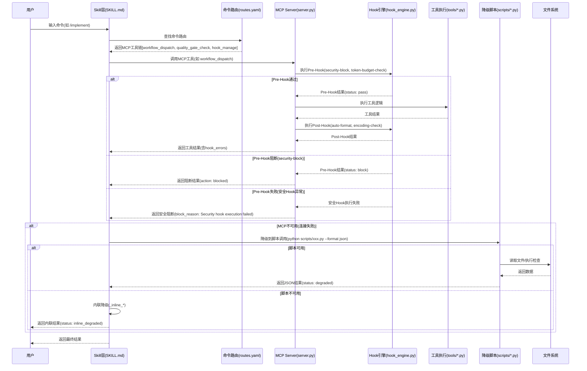
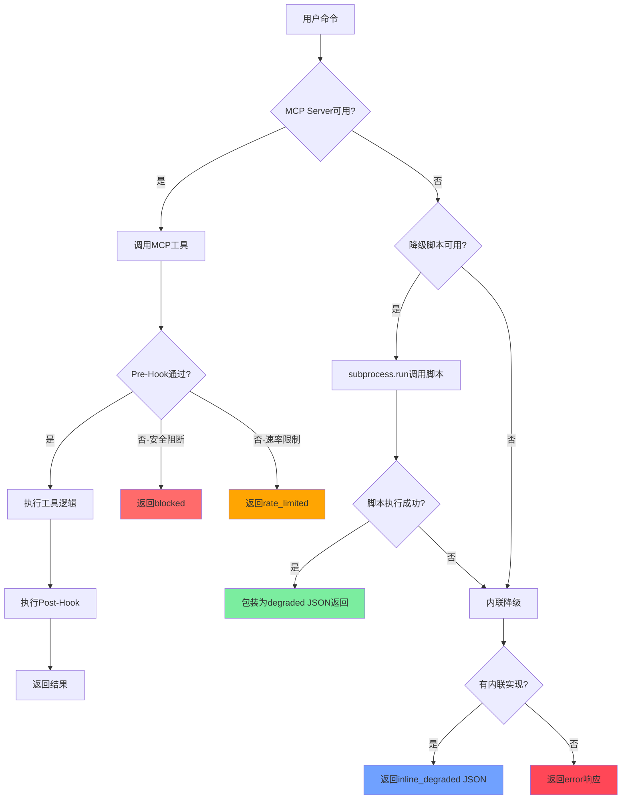
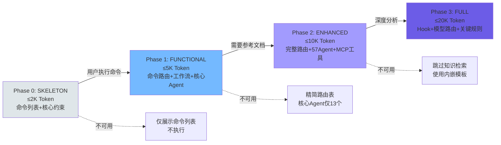

# Xuansto Skill v2 架构文档

> 版本：8.0.0 | 更新日期：2026-05-25
> 分析范围：SKILL.md、57个Agent定义、31个命令、20个MCP工具、降级脚本、渐进式加载、MCP Server资源层

---

## 目录

- [1. 项目概览](#1-项目概览)
- [2. 完整文件目录树](#2-完整文件目录树)
- [3. 当前架构分层](#3-当前架构分层)
- [4. 调用流程图](#4-调用流程图)
- [5. 目标架构设计](#5-目标架构设计)
- [6. 当前架构 vs. 目标架构差异表](#6-当前架构-vs-目标架构差异表)
- [7. 风险与约束](#7-风险与约束)

---

## 1. 项目概览

### 1.1 定位

Xuansto Skill v2 是一个**多Agent自主开发编排引擎**，通过 `xuansto-mcp-server` 的 20 个 MCP 原子工具驱动 9 阶段全生命周期开发流程。其核心设计理念是将软件开发的完整生命周期——从需求分析到部署交付——抽象为可编排、可监控、可降级的自动化工作流。

### 1.2 核心能力

| 维度 | 数量 | 说明 |
|------|------|------|
| Agents | 57 个 / 13 层 | 覆盖编排、产品、设计、工程、跨平台、数据、测试、安全、DevOps、质量、文档、知识、监控 |
| 质量门禁 | 54 项 | 分布在 Phase 0~8，包含编码检查、测试覆盖率、安全扫描、规格一致性等 |
| 命令 | 31 个 | 从 `/init` 到 `/deploy`，覆盖全生命周期 |
| MCP 工具 | 20 个 | 通过 `xuansto-mcp-server` 暴露的原子工具 |
| MCP 资源 | 18+ 个 | 通过 `xuansto://` URI 模式暴露的只读状态快照 |
| MCP Prompts | 2 个 | `xuansto_workflow` 和 `xuansto_analysis` |
| 工作流阶段 | 9 个 | Phase 0(初始化) → Phase 8(部署交付) |
| 降级脚本 | 14+ 个 | MCP 不可用时自动降级到 `scripts/` 目录 Python 脚本 |

### 1.3 用户交互模式

**命令驱动**：用户通过 31 个斜杠命令（如 `/init`、`/plan`、`/implement`）触发工作流。每个命令映射到一组 MCP 工具链和对应的降级策略，定义在 [commands/routes.yaml](../../.trae/skills/xuansto-skill-v2/commands/routes.yaml) 中。

**渐进式加载**：Skill 内容按 4 个 Phase 分段注入，避免一次性加载全部 Token。加载阶段由用户命令执行自动推进：

| Phase | 名称 | Token 预算 | 触发条件 | 可用内容 |
|-------|------|-----------|----------|----------|
| Phase 0 | SKELETON | ≤2K | Skill 触发时 | 核心元数据、命令列表、MCP 依赖、5条核心约束 |
| Phase 1 | FUNCTIONAL | ≤5K | 用户执行命令时 | 命令路由(精简)、工作流概览、核心Agent(13个) |
| Phase 2 | ENHANCED | ≤10K | 需要参考文档时 | 完整命令路由(含降级)、完整Agent注册表(57个)、MCP工具摘要 |
| Phase 3 | FULL | ≤20K | 深度分析时 | Hook系统、模型路由、关键规则、全部内容 |

---

## 2. 完整文件目录树

### 2.1 Skill 层 (`.trae/skills/xuansto-skill-v2/`)

```
.trae/skills/xuansto-skill-v2/
├── SKILL.md                          # Skill主文件，4个PHASE标记分段，249行
├── constraints.yaml                  # 核心约束、Token预算、降级映射、资源优先级
├── .skill-config.yaml                # 运行时配置(循环控制、规划文件、按需加载、知识服务)
├── PROBLEM.md                        # 问题清单(30项，13已修复/17未修复)
├── CHANGELOG.md                      # 版本变更日志
├── MIGRATION.md                      # 迁移指南
├── .gitattributes                    # Git属性
├── .gitignore                        # Git忽略规则
│
├── agents/                           # 57个Agent定义文件，13个子目录
│   ├── registry.yaml                 # Agent注册表：13层57个Agent，含Phase/模型路由
│   ├── orchestrator/                 # 编排层(3个)
│   │   ├── orchestrator.md
│   │   ├── subagent-dispatcher.md
│   │   └── task-coordinator.md
│   ├── product/                      # 产品层(4个)
│   │   ├── product-manager.md
│   │   ├── brainstorming-facilitator.md
│   │   ├── system-architect.md
│   │   └── technical-writer.md
│   ├── design/                       # 设计层(4个)
│   │   ├── design-system-generator.md
│   │   ├── ux-designer.md
│   │   ├── frontend-stylist.md
│   │   └── ui-designer.md
│   ├── engineering/                  # 工程层(6个)
│   │   ├── backend-developer.md
│   │   ├── database-engineer.md
│   │   ├── devops-engineer.md
│   │   ├── frontend-developer.md
│   │   ├── fullstack-engineer.md
│   │   └── mobile-developer.md
│   ├── cross-platform/               # 跨平台层(5个)
│   │   ├── desktop-developer.md
│   │   ├── desktop-ui-adapter.md
│   │   ├── native-module-developer.md
│   │   ├── ipc-specialist.md
│   │   └── auto-update-engineer.md
│   ├── database/                     # 数据层(3个)
│   │   ├── data-modeler.md
│   │   ├── data-seeder.md
│   │   └── dba.md
│   ├── testing/                      # 测试层(10个)
│   │   ├── ai-penetration-tester.md
│   │   ├── desktop-tester.md
│   │   ├── e2e-tester.md
│   │   ├── integration-tester.md
│   │   ├── performance-tester.md
│   │   ├── qa-engineer.md
│   │   ├── security-tester.md
│   │   ├── test-architect.md
│   │   ├── test-maintainer.md
│   │   └── unit-tester.md
│   ├── security/                     # 安全层(3个)
│   │   ├── security-auditor.md
│   │   ├── compliance-officer.md
│   │   └── penetration-tester.md
│   ├── devops/                       # DevOps层(4个)
│   │   ├── build-release-engineer.md
│   │   ├── cicd-specialist.md
│   │   ├── monitor-specialist.md
│   │   └── runtime-supervisor.md
│   ├── quality/                      # 质量层(7个)
│   │   ├── bug-scanner.md
│   │   ├── code-reviewer.md
│   │   ├── comment-verifier.md
│   │   ├── compliance-reviewer.md
│   │   ├── doc-reviewer.md
│   │   ├── history-analyzer.md
│   │   └── refactoring-specialist.md
│   ├── documentation/                # 文档层(2个)
│   │   ├── documentation-engineer.md
│   │   └── specification-keeper.md
│   ├── knowledge/                    # 知识层(3个)
│   │   ├── knowledge-manager.md
│   │   ├── learning-specialist.md
│   │   └── token-optimizer.md
│   └── monitoring/                   # 监控层(3个)
│       ├── quality-monitor.md
│       ├── progress-tracker.md
│       └── decision-logger.md
│
├── commands/                         # 31个命令定义文件
│   ├── routes.yaml                   # 命令路由表：意图→命令→MCP工具链→降级策略→Phase
│   ├── accept.md                     # /accept 验收确认
│   ├── agent-status.md               # /agent-status Agent状态查询
│   ├── audit.md                      # /audit 安全审计
│   ├── brainstorm.md                 # /brainstorm 头脑风暴
│   ├── budget.md                     # /budget Token预算
│   ├── build-desktop.md              # /build-desktop 桌面构建
│   ├── build.md                      # /build 构建项目
│   ├── cancel-loop.md                # /cancel-loop 取消循环
│   ├── clarify.md                    # /clarify 澄清需求
│   ├── decision.md                   # /decision 决策记录
│   ├── deploy.md                     # /deploy 部署交付
│   ├── design-system.md              # /design-system 设计系统
│   ├── design.md                     # /design 设计
│   ├── execute-plan.md               # /execute-plan 执行计划
│   ├── fix.md                        # /fix 修复Bug
│   ├── implement.md                  # /implement 写代码
│   ├── init.md                       # /init 初始化
│   ├── learn.md                      # /learn 知识学习
│   ├── loop.md                       # /loop 自主循环
│   ├── plan.md                       # /plan 规划架构
│   ├── refactor.md                   # /refactor 代码重构
│   ├── release-desktop.md            # /release-desktop 桌面发布
│   ├── review.md                     # /review 代码审查
│   ├── rollback.md                   # /rollback 回滚
│   ├── sdd-tdd-fast.md               # /sdd-tdd-fast 快速SDD+TDD
│   ├── sdd-tdd-medium.md             # /sdd-tdd-medium 中等SDD+TDD
│   ├── simplify.md                   # /simplify 代码简化
│   ├── spec.md                       # /spec 写规格文档
│   ├── sprint.md                     # /sprint 冲刺
│   ├── status.md                     # /status 查询进度
│   └── test.md                       # /test 跑测试
│
├── configs/
│   └── default.yaml                  # 默认配置(编排器/门禁/通信/桌面/日志/知识库/安全/可观测性/成本/人机协作等)
│
├── hooks/
│   └── hooks.json                    # Hook系统定义：3级配置(minimal/standard/strict) + 14个Hook
│
├── evals/
│   ├── mcp_evaluation.xml            # MCP评估配置(5个QA对)
│   └── trigger_eval.json             # 触发评估配置(3条)
│
├── examples/
│   ├── desktop-app-development.md    # 桌面应用开发示例
│   └── web-app-development.md        # Web应用开发示例
│
├── memory/
│   ├── fixes/                        # 修复记忆
│   │   └── refactoring/README.md
│   └── patterns/                     # 模式记忆
│       └── testing/README.md
│
├── migrations/                       # 数据迁移目录
│   └── .gitkeep
│
├── references/                       # 79+参考文档
│   ├── agent-details/                # 57个Agent详细定义
│   │   ├── ai-penetration-tester.md
│   │   ├── ...（共57个）
│   │   └── ux-designer.md
│   ├── quality-gates.md              # 54项质量门禁详细定义
│   ├── agent-registry.md             # 完整Agent注册表
│   ├── mcp-tools.md                  # 20个MCP工具完整参数与返回值
│   ├── workflows.md                  # 9阶段工作流详情
│   ├── workflow-phases.md            # 工作流Phase定义
│   ├── workflow-checkpoints.md       # 工作流检查点
│   ├── progressive-loading.md        # 渐进式加载策略
│   ├── mcp-integration-strategy.md   # MCP集成策略
│   ├── mcp-protocol.md              # MCP协议说明
│   ├── session-persistence.md        # 会话持久化
│   ├── token-optimization.md         # Token优化策略
│   ├── hook-system.md                # Hook系统完整定义
│   ├── model-routing.md              # 模型路由规则
│   ├── spec-drift-handling.md        # 规格偏差处理
│   ├── agent-lifecycle.md            # Agent生命周期
│   ├── knowledge-workflow-details.md # 知识工作流
│   ├── collaboration-modes.md        # 协作模式
│   ├── iteration-scheduling.md       # 智能迭代调度
│   ├── parallelization-strategy.md   # 并行化策略
│   ├── concurrency-standards.md      # 并发编码标准
│   ├── owasp-top10-2026.md           # OWASP Top 10 2026
│   ├── owasp-mcp-top10.md            # OWASP MCP Top 10
│   ├── owasp-agentic-top10-2026.md   # OWASP Agentic Top 10 2026
│   ├── security-guidelines.md        # 安全指南
│   ├── security-frontier-frameworks.md # 安全前沿框架
│   ├── agentic-security-frameworks.md # Agentic安全框架
│   ├── coding-standards.md           # 编码标准
│   ├── typescript-standards.md       # TypeScript标准
│   ├── python-standards.md           # Python标准
│   ├── go-standards.md               # Go标准
│   ├── rust-standards.md             # Rust标准
│   ├── java-standards.md             # Java标准
│   ├── flutter-standards.md          # Flutter标准
│   ├── design-guidelines.md          # 设计指南
│   ├── design-token-system.md        # 设计Token系统
│   ├── desktop-dev-guidelines.md     # 桌面开发指南
│   ├── electron-security.md          # Electron安全
│   ├── tauri-dev-guidelines.md       # Tauri开发指南
│   ├── ipc-contracts.md              # IPC契约
│   ├── database-guidelines.md        # 数据库指南
│   ├── test-guidelines.md            # 测试指南
│   ├── documentation-standards.md    # 文档标准
│   ├── git-workflow.md               # Git工作流
│   ├── git-worktree-parallel.md      # Git Worktree并行
│   ├── ci-cd-integration.md          # CI/CD集成
│   ├── ...（共79+个文件）
│   └── sddwcc-integration.md         # SDDWCC集成
│
├── scripts/                          # 降级脚本 + 工具脚本
│   ├── knowledge_server/             # 知识库服务器(独立HTTP服务)
│   │   ├── tools/                    # 15个工具处理器(拆分自skill_tools.py)
│   │   │   ├── __init__.py           # TOOL_REGISTRY动态注册
│   │   │   ├── _shared.py            # 共享常量和辅助函数
│   │   │   ├── agent_status.py
│   │   │   ├── code_simplify.py
│   │   │   ├── context_compress.py
│   │   │   ├── decision_log.py
│   │   │   ├── hook_manage.py
│   │   │   ├── knowledge_inject.py
│   │   │   ├── project_init.py
│   │   │   ├── quality_gate_check.py
│   │   │   ├── security_scan.py
│   │   │   ├── server_health.py
│   │   │   ├── session_manage.py
│   │   │   ├── skill_analyze.py
│   │   │   ├── spec_drift_detect.py
│   │   │   ├── token_budget.py
│   │   │   └── workflow_dispatch.py
│   │   ├── api.py                    # FastAPI应用
│   │   ├── api_models.py             # API数据模型
│   │   ├── api_routes.py             # API路由
│   │   ├── auth.py                   # 认证模块
│   │   ├── backup.py                 # 备份管理
│   │   ├── config.py                 # 配置管理
│   │   ├── context_formatter.py      # 上下文格式化
│   │   ├── db_engine.py              # 数据库引擎
│   │   ├── dedup.py                  # 去重模块
│   │   ├── degradation.py            # 降级管理
│   │   ├── distillation.py           # 知识蒸馏
│   │   ├── embedding.py              # 向量嵌入
│   │   ├── experience_precipitator.py # 经验沉淀
│   │   ├── exporter.py               # 知识导出
│   │   ├── hybrid_search.py          # 混合搜索
│   │   ├── importer.py               # 知识导入
│   │   ├── kb_client.py              # 知识库客户端
│   │   ├── lifecycle.py              # 生命周期管理
│   │   ├── main.py                   # 服务入口
│   │   ├── mcp_server.py             # MCP服务封装
│   │   ├── progressive_loader.py     # 渐进式加载器
│   │   ├── progressive_search.py     # 渐进式搜索
│   │   ├── security.py               # 安全模块
│   │   ├── server.py                 # HTTP服务器
│   │   ├── skill_tools.py            # 工具处理器委托(74行)
│   │   ├── sync.py                   # 同步模块
│   │   ├── tech_stack_detector.py    # 技术栈检测
│   │   ├── vector_engine.py          # 向量引擎
│   │   ├── web_search.py             # Web搜索
│   │   └── websocket_manager.py      # WebSocket管理
│   ├── verification/                 # 验证脚本
│   │   ├── agent-structure-check.py
│   │   ├── cmd-agent-check.py
│   │   ├── skill-token-check.py
│   │   └── wf-gate-check.py
│   ├── workflow-tools/               # 工作流工具
│   │   ├── check-current.py
│   │   ├── check-frontmatter.py
│   │   ├── extract-phases.py
│   │   ├── fix-frontmatter.py
│   │   └── validate-workflow.py
│   ├── accessibility-test.js         # 无障碍测试
│   ├── agent-frontmatter-validator.py # Agent前置校验
│   ├── agentic-security-scanner.py   # Agentic安全扫描
│   ├── ai-pentest-runner.py          # AI渗透测试运行器
│   ├── api-contract-validator.py     # API契约校验
│   ├── build-desktop.ps1             # 桌面构建(PowerShell)
│   ├── build-optimizer.py            # 构建优化
│   ├── check-comment-lang.py         # 注释语言检查
│   ├── check-complete.py             # 完成度检查
│   ├── check-encoding.py             # 编码检查
│   ├── code-simplifier.py            # 代码简化
│   ├── completion-verifier.py        # 完成验证
│   ├── confidence-scorer.py          # 置信度评分
│   ├── console_monitor.py            # 控制台监控
│   ├── context-compressor.py         # 上下文压缩
│   ├── coverage-check.py             # 覆盖率检查
│   ├── db-migration-validator.py     # 数据库迁移校验
│   ├── deduplication-detector.py     # 去重检测
│   ├── dependency-scan.py            # 依赖扫描
│   ├── design-tokens-sync.js         # 设计Token同步
│   ├── documentation-coverage.py     # 文档覆盖率
│   ├── element_discovery.py          # 元素发现
│   ├── health-checker.py             # 健康检查
│   ├── infra-health-check.py         # 基础设施健康检查
│   ├── init-session.py               # 会话初始化
│   ├── ipc-contract-validator.js     # IPC契约校验
│   ├── kb-branch-sync.py             # 知识库分支同步
│   ├── kb-migrate.py                 # 知识库迁移
│   ├── knowledge-index-builder.py    # 知识索引构建
│   ├── knowledge-server-tests.py     # 知识服务测试
│   ├── knowledge-server.py           # 知识服务入口
│   ├── loop-guard.py                 # 循环守卫
│   ├── pattern-learner.py            # 模式学习
│   ├── performance-benchmark.js      # 性能基准
│   ├── plan-sync.py                  # 计划同步
│   ├── project-initializer.py        # 项目初始化
│   ├── review-aggregator.py          # 审查聚合
│   ├── review-eligibility-check.py   # 审查资格检查
│   ├── rollback-manager.py           # 回滚管理
│   ├── script-cleanup-checker.py     # 脚本清理检查
│   ├── script-security-scanner.py    # 脚本安全扫描
│   ├── session-catchup.py            # 会话追赶
│   ├── session-persist.py            # 会话持久化
│   ├── sign-desktop.ps1              # 桌面签名(PowerShell)
│   ├── skill-md-validator.py         # SKILL.md校验
│   ├── skill-test.py                 # Skill测试
│   ├── spec-drift-detector.py        # 规格偏差检测
│   ├── test-reporter.py              # 测试报告
│   ├── token-budget-guard.py         # Token预算守卫
│   ├── token-dashboard.py            # Token仪表盘
│   ├── uat-runner.py                 # UAT运行器
│   ├── verify-auto-update.ps1        # 自动更新验证
│   ├── visual-capture.py             # 视觉捕获
│   ├── visual-regression.js          # 视觉回归
│   └── with_server.py                # 服务器启动辅助
│
└── .knowledge/                       # 知识运行时目录
    ├── script-errors/                # 脚本错误日志
    │   └── .gitkeep
    └── temp-scripts/                 # 临时脚本
        └── .gitkeep
```

### 2.2 MCP Server 层 (`xuansto-mcp-server/`)

```
xuansto-mcp-server/
├── pyproject.toml                    # 项目配置：Python>=3.10, 依赖mcp[cli]>=1.0.0等
├── mcp-config.json                   # MCP客户端配置
├── README.md                         # 项目说明
├── LICENSE                           # MIT许可证
├── .gitattributes
├── .gitignore
│
├── .github/
│   └── workflows/
│       └── ci.yml                    # CI流水线
│
├── docs/
│   ├── api.md                        # API文档
│   ├── contributing.md               # 贡献指南
│   ├── mcp-tools.md                  # MCP工具文档
│   ├── migration-v1-to-v2.md         # v1→v2迁移指南
│   └── troubleshooting.md            # 故障排除
│
├── scripts/
│   ├── start_server.py               # 服务器启动脚本
│   └── verify_deployment.py          # 部署验证脚本
│
├── spec-locks/                       # Schema锁定(契约版本化)
│   ├── api-contract-version.json     # API契约版本
│   ├── skill-definition-schema.json  # Skill定义Schema
│   └── tool-parameter-schemas.json   # 工具参数Schema
│
├── src/xuansto_mcp/
│   ├── __init__.py
│   ├── server.py                     # MCP服务器主入口：FastMCP实例、Hook拦截、工具注册、启动流程
│   ├── cli.py                        # CLI入口
│   │
│   ├── core/                         # 核心基础设施
│   │   ├── __init__.py
│   │   ├── config.py                 # 配置管理：路径解析、YAML加载、热更新(watchfiles/polling)、API版本
│   │   ├── cache.py                  # 缓存管理
│   │   ├── crypto.py                 # 加密工具
│   │   ├── database.py               # SQLite数据库
│   │   ├── degradation.py            # 降级管理：MCPToolFallback、三级降级链
│   │   ├── errors.py                 # 错误处理：make_success_response、retry_tool_call
│   │   ├── hook_engine.py            # Hook引擎：Pre/Post Hook执行
│   │   ├── logging_config.py         # 日志配置
│   │   ├── metrics.py                # 指标采集
│   │   ├── notifications.py          # 通知系统
│   │   ├── protocol.py               # 协议定义
│   │   ├── rate_limiter.py           # 速率限制
│   │   ├── search_engine.py          # 搜索引擎：ChromaDB→SQLite FTS→关键词
│   │   ├── subprocess_utils.py       # 子进程工具
│   │   └── validator.py              # 路径安全验证
│   │
│   ├── models/                       # 数据模型
│   │   ├── __init__.py
│   │   ├── config_models.py          # Pydantic配置模型(SkillConfigModel)
│   │   └── schemas.py                # JSON Schema定义
│   │
│   ├── resources/                    # MCP资源层(18+个Resource)
│   │   ├── __init__.py
│   │   └── skill_resources.py        # 资源注册：xuansto:// URI模式，含订阅机制
│   │
│   ├── tools/                        # MCP工具层(20个Tool)
│   │   ├── __init__.py               # 工具导出列表
│   │   ├── skill_analyze.py          # 项目结构分析
│   │   ├── knowledge_search.py       # 三层知识库检索(ChromaDB→FTS→关键词)
│   │   ├── knowledge_inject.py       # 知识注入到上下文
│   │   ├── quality_gate_check.py     # 54项质量门禁检查
│   │   ├── spec_drift_detect.py      # 规格偏差检测
│   │   ├── security_scan.py          # OWASP+依赖扫描
│   │   ├── code_simplify.py          # 代码简化分析
│   │   ├── session_manage.py         # 会话状态管理
│   │   ├── workflow_dispatch.py      # 工作流调度
│   │   ├── agent_status.py           # Agent状态查询
│   │   ├── agent_manage.py           # Agent实例管理
│   │   ├── hook_manage.py            # Hook管理
│   │   ├── resource_load_status.py   # 渐进式加载状态
│   │   ├── context_compress.py       # 上下文压缩
│   │   ├── server_health.py          # 服务器健康检查
│   │   ├── decision_log.py           # 决策日志管理
│   │   ├── token_budget.py           # Token预算管理
│   │   ├── project_init.py           # 项目初始化
│   │   ├── metrics_report.py         # 指标报告
│   │   └── config_manage.py          # 配置管理
│   │
│   └── data/                         # 运行时数据
│       ├── .skill-config.yaml        # Skill配置副本
│       ├── .xuansto-config.yaml      # MCP配置
│       ├── fallback_config.yaml      # 降级配置
│       └── knowledge/                # 知识库数据
│           ├── general/              # 通用知识(标准/安全/测试/桌面/模式)
│           ├── workspace/            # 工作区知识(API/架构/约定/桌面/领域/环境/术语)
│           ├── experience/           # 经验知识(错误/集成/模式/性能/重构/安全/决策)
│           └── index/                # 知识索引(SQLite + ChromaDB)
│
└── tests/                            # 测试套件(100+测试文件)
    ├── conftest.py                   # 测试配置
    ├── baselines/                    # 基线数据
    │   ├── command_output_format.json
    │   ├── degradation_behavior.json
    │   └── tool_standard_response.json
    ├── integration/                  # 集成测试
    ├── test_integration/             # 组件集成测试
    ├── test_e2e/                     # 端到端测试
    ├── test_tools/                   # 工具单元测试
    ├── test_compatibility/           # 兼容性测试
    └── test_*.py                     # 100+独立测试文件
```

---

## 3. 当前架构分层

### 3.1 Skill 层

Skill 层是面向 LLM 的 Prompt Engineering 层，负责将开发工作流编码为 LLM 可理解和执行的指令。

**SKILL.md 结构**（4 个 PHASE 标记）：

| PHASE 标记 | 行范围 | 内容 | Token 预算 |
|------------|--------|------|-----------|
| `PHASE_0_START` → `PHASE_0_END` | L21-L44 | YAML frontmatter + 命令列表 + MCP依赖 + 5条核心约束 | ≤2K |
| `PHASE_1_START` → `PHASE_1_END` | L46-L124 | 执行入口 + 工作流Phase概览 + 命令路由表(精简) + 核心Agent索引 | ≤5K |
| `PHASE_2_START` → `PHASE_2_END` | L126-L219 | 完整命令路由({{include:}}) + 完整Agent注册表 + 参考文档索引 + MCP工具摘要 | ≤10K |
| `PHASE_3_START` → `PHASE_3_END` | L221-L249 | Hook系统 + 模型路由 + 关键规则 | ≤20K |

**触发条件**：定义在 SKILL.md YAML frontmatter 的 `triggers` 字段中，包含 50+ 触发短语、60+ 关键词、31 个命令。

**核心约束**（5 条，定义在 [constraints.yaml](../../.trae/skills/xuansto-skill-v2/constraints.yaml)）：

1. `spec-first`：Spec > Test > Code，覆盖率≥80%
2. `karpathy`：Think Before Coding | Simplicity First | Surgical Changes
3. `incremental`：分解→实现→测试→重复；3-Strike Protocol
4. `script-standard`：Python优先 | UTF-8无BOM+无U+FFFD | 验证后删除临时脚本
5. `cross-platform`：Web+Desktop(Electron/Tauri/Flutter)，桌面端需IPC安全+代码签名

**命令路由**（31 个，定义在 [commands/routes.yaml](../../.trae/skills/xuansto-skill-v2/commands/routes.yaml)）：

每个命令包含：意图(`intent`)、命令名(`command`)、MCP工具链(`mcp_tools`)、降级策略(`fallback`)、工作流Phase(`phase`)、详细定义文件(`detail`)。

**Agent 注册表**（57 个 / 13 层，定义在 [agents/registry.yaml](../../.trae/skills/xuansto-skill-v2/agents/registry.yaml)）：

每个 Agent 包含：名称(`name`)、定义文件(`file`)、加载Phase(`phase`)、活跃Phase(`phases`)、模型路由(`model_routing`)。

### 3.2 执行层

执行层是 MCP Server 和降级脚本组成的运行时基础设施。

**MCP Server**（20 个工具，定义在 `xuansto-mcp-server/src/xuansto_mcp/tools/`）：

| 工具 | 文件 | 功能 | 降级脚本 |
|------|------|------|----------|
| skill_analyze | skill_analyze.py | 项目结构分析 | scripts/skill_analyze.py |
| knowledge_search | knowledge_search.py | 三层知识库检索 | ChromaDB→SQLite FTS→关键词 |
| knowledge_inject | knowledge_inject.py | 知识注入到上下文 | scripts/knowledge_inject.py |
| quality_gate_check | quality_gate_check.py | 54项质量门禁 | scripts/quality_gate_check.py |
| spec_drift_detect | spec_drift_detect.py | 规格偏差检测 | scripts/spec_drift_detect.py + 内联 |
| security_scan | security_scan.py | OWASP+依赖扫描 | scripts/security_scan.py + 内联 |
| code_simplify | code_simplify.py | 代码简化分析 | scripts/code_simplify.py + 内联 |
| session_manage | session_manage.py | 会话状态管理 | scripts/session_manage.py |
| workflow_dispatch | workflow_dispatch.py | 工作流调度 | scripts/workflow_dispatch.py + 内联 |
| agent_status | agent_status.py | Agent状态查询 | scripts/agent_status.py + 内联 |
| agent_manage | agent_manage.py | Agent实例管理 | — |
| hook_manage | hook_manage.py | Hook管理 | scripts/hook_manage.py + 内联 |
| resource_load_status | resource_load_status.py | 渐进式加载状态 | 内联 |
| context_compress | context_compress.py | 上下文压缩 | scripts/context_compress.py |
| server_health | server_health.py | 服务器健康检查 | scripts/server_health.py + 内联 |
| decision_log | decision_log.py | 决策日志管理 | scripts/decision_log.py |
| token_budget | token_budget.py | Token预算管理 | scripts/token_budget.py |
| project_init | project_init.py | 项目初始化 | — |
| metrics_report | metrics_report.py | 指标报告 | — |
| config_manage | config_manage.py | 配置管理 | — |

**降级链**（定义在 [constraints.yaml](../../.trae/skills/xuansto-skill-v2/constraints.yaml) 的 `degradation` 节）：

```
MCP工具调用 → 脚本降级(subprocess.run) → 内联降级(_inline_*) → 错误响应
```

- **MCP检测**：尝试调用 `skill_analyze`，失败则进入降级模式
- **脚本降级**：使用 `python scripts/xxx.py --format json` 调用
- **结果格式**：降级模式下结果包装为与MCP工具相同的JSON结构（`degraded`/`inline_degraded`/`error` 三种状态）
- **知识检索降级**：ChromaDB → SQLite FTS → 关键词匹配

### 3.3 资源层

资源层提供只读状态快照，通过 `xuansto://` URI 模式暴露（定义在 [skill_resources.py](../../xuansto-mcp-server/src/xuansto_mcp/resources/skill_resources.py)）。

**MCP Resources**（18+ 个）：

| URI 模式 | 功能 |
|----------|------|
| `xuansto://config/skill` | Skill配置文件(.skill-config.yaml) |
| `xuansto://skill/config` | Skill配置(统一入口) |
| `xuansto://skill/constraints` | 核心约束 |
| `xuansto://references/quality-gates` | 质量门禁文档 |
| `xuansto://references/agent-registry` | Agent注册表 |
| `xuansto://references/workflow-phases` | 工作流Phase定义 |
| `xuansto://templates/{name}` | 模板文件(参数化) |
| `xuansto://templates/index` | 模板索引 |
| `xuansto://sessions/latest` | 最新会话记录 |
| `xuansto://sessions/{session_id}` | 指定会话记录(参数化) |
| `xuansto://agents/{layer}/{name}` | Agent定义(参数化) |
| `xuansto://agents/registry` | Agent注册表(JSON) |
| `xuansto://loading/status` | 渐进式加载状态 |
| `xuansto://metrics/summary` | 指标摘要 |
| `xuansto://degradation/status` | 降级状态 |
| `xuansto://gates/definitions` | 质量门禁定义 |
| `xuansto://workflows/definitions` | 工作流定义 |
| `xuansto://hooks/definitions` | Hook定义 |
| `xuansto://knowledge/status` | 知识库状态 |
| `xuansto://commands/routes` | 命令路由 |
| `xuansto://session/state` | 会话状态 |
| `xuansto://health/status` | 健康状态 |

**references/ 目录**（79+ 文档）：包含 57 个 Agent 详细定义、54 项质量门禁、20 个 MCP 工具参数、9 阶段工作流、安全框架、编码标准等。

**agents/ 目录**（57 个 .md 文件，13 个子目录）：每个 Agent 的完整角色定义。

**commands/ 目录**（31 个 .md 文件）：每个命令的详细执行步骤。

**hooks/hooks.json**：3 级配置（minimal/standard/strict）+ 14 个 Hook 定义。

### 3.4 依赖层

**核心依赖**（定义在 [pyproject.toml](../../xuansto-mcp-server/pyproject.toml)）：

| 依赖 | 版本 | 用途 |
|------|------|------|
| `mcp[cli]` | >=1.0.0 | MCP SDK，提供 FastMCP 框架和 stdio 传输 |
| `pydantic` | >=2.0.0 | 数据验证和配置模型(SkillConfigModel) |
| `pyyaml` | >=6.0 | YAML配置文件解析(constraints.yaml, routes.yaml等) |

**可选依赖**（`[full]` extra）：

| 依赖 | 版本 | 用途 |
|------|------|------|
| `chromadb` | >=0.4.0 | 向量语义搜索(知识库三层检索的首选引擎) |
| `fastapi` | >=0.100.0 | HTTP API服务(知识库服务器) |
| `uvicorn` | >=0.20.0 | ASGI服务器 |
| `openai` | >=1.0.0 | OpenAI Embedding API(向量嵌入) |
| `sentence-transformers` | >=2.0.0 | 本地句子嵌入(离线语义搜索) |
| `watchfiles` | >=0.20.0 | 配置文件热更新(事件驱动监听) |

**开发依赖**（`[dev]` extra）：

| 依赖 | 版本 | 用途 |
|------|------|------|
| `pytest` | >=7.0 | 测试框架 |
| `pytest-asyncio` | >=0.21 | 异步测试支持 |
| `pytest-cov` | >=4.0 | 覆盖率报告 |
| `ruff` | >=0.4.0 | 代码检查和格式化 |

**运行时要求**：Python >= 3.10

---

## 4. 调用流程图

### 4.1 主调用流程



### 4.2 降级回退路径



### 4.3 渐进式加载推进流程



---

## 5. 目标架构设计

### 5.1 Skill 与 MCP 职责划分

| 维度 | Skill 层 | MCP Server 层 |
|------|----------|---------------|
| **核心职责** | Prompt Engineering、工作流编排、Agent调度 | 有状态工具、资源暴露、数据持久化 |
| **状态管理** | 无状态（通过MCP工具读写状态） | 有状态（SQLite、内存、文件系统） |
| **数据存储** | 只读参考文档(references/) | 读写数据库(SQLite + ChromaDB) |
| **交互方式** | 声明式(SKILL.md + YAML配置) | 命令式(Python工具函数) |
| **加载控制** | PHASE标记分段加载 | resource_load_status工具追踪 |
| **降级策略** | 声明降级规则(constraints.yaml) | 实现降级逻辑(degradation.py) |
| **Hook管理** | 声明Hook配置(hooks.json) | 实现Hook引擎(hook_engine.py) |
| **版本兼容** | SKILL.md声明compatible_mcp_server | server.py实现API版本协商 |

### 5.2 MCP Server 边界与接口

**工具边界（20 个 Tool）**：

```
┌─────────────────────────────────────────────────────────┐
│                    MCP Server 边界                       │
│                                                         │
│  Tools (20个, 有副作用)                                  │
│  ├── 项目分析: skill_analyze, project_init               │
│  ├── 知识管理: knowledge_search, knowledge_inject        │
│  ├── 质量保证: quality_gate_check, spec_drift_detect     │
│  ├── 安全扫描: security_scan                             │
│  ├── 代码优化: code_simplify, context_compress           │
│  ├── 工作流:   workflow_dispatch, session_manage         │
│  ├── Agent:    agent_status, agent_manage                │
│  ├── Hook:     hook_manage                               │
│  ├── 加载:     resource_load_status                      │
│  ├── 运维:     server_health, config_manage              │
│  ├── 决策:     decision_log, token_budget                │
│  └── 指标:     metrics_report                            │
│                                                         │
│  Resources (18+个, 只读)                                 │
│  ├── 配置: xuansto://config/skill, skill/config          │
│  ├── 参考: xuansto://references/*                        │
│  ├── 模板: xuansto://templates/*                         │
│  ├── 会话: xuansto://sessions/*                          │
│  ├── Agent: xuansto://agents/*                           │
│  ├── 状态: xuansto://loading/status, session/state       │
│  ├── 指标: xuansto://metrics/summary                     │
│  ├── 降级: xuansto://degradation/status                  │
│  ├── 门禁: xuansto://gates/definitions                   │
│  ├── 工作流: xuansto://workflows/definitions             │
│  ├── Hook: xuansto://hooks/definitions                   │
│  ├── 知识: xuansto://knowledge/status                    │
│  ├── 命令: xuansto://commands/routes                     │
│  └── 健康: xuansto://health/status                       │
│                                                         │
│  Prompts (2个)                                           │
│  ├── xuansto_workflow: 工作流启动提示                     │
│  └── xuansto_analysis: 项目分析提示                       │
└─────────────────────────────────────────────────────────┘
```

### 5.3 渐进式加载注入点

**4 个 Phase 的注入点设计**（定义在 [constraints.yaml](../../.trae/skills/xuansto-skill-v2/constraints.yaml) 的 `disclosure` 节）：

| Phase | SKILL.md 范围 | 注入方式 | 可用功能 | 不可用功能 |
|-------|--------------|----------|----------|-----------|
| SKELETON | `PHASE_0_START` → `PHASE_0_END` | Skill触发时自动加载 | 命令列表、MCP依赖、5条核心约束 | 命令执行、工作流详情、Agent详情、知识检索 |
| FUNCTIONAL | `PHASE_0_START` → `PHASE_1_END` | 用户执行命令时加载 | +命令路由(精简)、工作流Phase概览、核心Agent(13个) | 完整路由(含降级)、完整Agent(57个)、知识检索 |
| ENHANCED | `PHASE_0_START` → `PHASE_2_END` | 需要参考文档时加载 | +完整路由(含降级)、完整Agent(57个)、MCP工具摘要、知识检索 | Hook系统详情、模型路由详情 |
| FULL | `PHASE_0_START` → `PHASE_3_END` | 深度分析时加载 | +Hook系统、模型路由、关键规则 | 无 |

**资源优先级映射**：

| 优先级 | 加载Phase | 内容 |
|--------|----------|------|
| P0_must | Phase 0 | YAML frontmatter、命令列表、MCP依赖、5条核心约束 |
| P1_important | Phase 1 | 执行入口、工作流Phase概览、命令路由(精简)、核心Agent(13个) |
| P2_enhanced | Phase 2 | 完整命令路由(含降级)、完整Agent注册表(57个)、参考文档、MCP工具摘要 |
| P3_optional | Phase 3 | Hook系统、模型路由、关键规则 |

**不可用时的降级行为**（定义在 [constraints.yaml](../../.trae/skills/xuansto-skill-v2/constraints.yaml) 的 `disclosure.on_unavailable` 和 `disclosure.degradation_on_unavailable` 节）：

- 通过 `xuansto://loading/status` 披露当前可用功能范围
- 提示用户可通过 `resource_load_status(preload)` 推进加载
- 降级到可用功能范围内执行

---

## 6. 当前架构 vs. 目标架构差异表

| 维度 | 当前架构 | 目标架构 | 差距 | 计划版本 |
|------|----------|----------|------|----------|
| **Resource 暴露** | 18+ 个 Resource 已实现，含订阅机制 | 完整的 URI 订阅 + 推送通知 | 订阅已实现但推送通知未实现 | v8.2.0 |
| **错误处理** | 部分工具返回字符串而非 JSON | 统一所有工具返回 JSON 格式 | 不统一，调用方需适配多种格式 | v8.3.0 |
| **持久化** | Agent/工作流状态仅内存存储 | Agent + 工作流状态持久化到 SQLite | 重启后状态丢失 | v8.4.0 |
| **审计日志** | MCP 工具调用无审计记录 | 完整的工具调用审计日志 | 无法追踪工具调用历史 | v8.3.0 |
| **Token-Phase 关联** | Token 预算独立于加载阶段管理 | Token 预算与 LoadPhase 关联 | 无法根据加载阶段自动调整 Token 分配 | v8.4.0 |
| **Hook 超时** | Hook 执行无超时限制 | Hook 执行添加超时控制 | 恶意或错误 Hook 可能无限阻塞 | v8.4.0 |
| **配置热更新** | 已实现(watchfiles/polling)，但 constraints.yaml 和 .skill-config.yaml 变更需重启 | 所有配置文件支持热更新 | 部分配置仍需重启 | v8.4.0 |
| **API 版本协商** | 无 API 版本协商机制 | 客户端与服务端版本协商 | 版本不匹配时无法优雅降级 | v8.4.0 |
| **双写一致性** | 决策记录同时写入 SQLite 和文件系统，无事务保证 | 双写事务保证 + 对账机制 | 可能出现数据不一致 | v8.3.0 |
| **SKELETON 命令** | SKELETON 阶段无可用命令 | 为 SKELETON 添加基础命令(/status, /help) | 用户在 SKELETON 阶段无法执行任何操作 | v8.2.0 |
| **HTTP/MCP Schema** | HTTP API 和 MCP stdio 接口返回格式不同 | 统一 Schema | 调用方需适配两套接口 | v8.3.0 |
| **ChromaDB 双写** | 先写 SQLite 标记 pending，再写 ChromaDB | 对账机制 + 自动重试 | ChromaDB 写入失败时 SQLite 标记仍为 pending | v8.3.0 |
| **版本历史清理** | 知识条目版本历史无限增长 | 版本历史清理策略 | 数据库膨胀 | v8.5.0 |
| **v1/v2 重复文件** | agents/、commands/ 等目录在 v1 和 v2 中同时存在 | v2 为唯一维护版本，v1 标记 archived | 维护成本增加，可能出现不一致 | v8.5.0 |

---

## 7. 风险与约束

### 7.1 平台限制

| 风险 | 影响 | 缓解措施 |
|------|------|----------|
| **Windows 兼容性** | `signal.SIGHUP` 在 Windows 上不可用，配置热更新依赖 `watchfiles` 或 polling 回退 | [config.py](../../xuansto-mcp-server/src/xuansto_mcp/core/config.py) 已实现 `watchfiles` 优先 + polling 回退；Windows 跳过 SIGHUP 注册 |
| **Python 3.10+ 要求** | 部分旧环境可能不满足 | [pyproject.toml](../../xuansto-mcp-server/pyproject.toml) 声明 `requires-python = ">=3.10"`，使用 `from __future__ import annotations` 确保类型提示兼容 |
| **ChromaDB 可选依赖** | 未安装 ChromaDB 时知识检索降级到 SQLite FTS | [constraints.yaml](../../.trae/skills/xuansto-skill-v2/constraints.yaml) 定义了 `knowledge_search_degradation: ChromaDB→SQLite FTS→关键词匹配` 三级降级链 |
| **Shell 脚本禁止** | 禁止使用 .sh 脚本，Windows 上无 bash 环境 | [constraints.yaml](../../.trae/skills/xuansto-skill-v2/constraints.yaml) 核心约束 `script-standard: Python优先`，桌面构建使用 PowerShell(.ps1) |

### 7.2 向后兼容

| 风险 | 影响 | 缓解措施 |
|------|------|----------|
| **v1 已归档** | v1 用户需迁移到 v2 | [MIGRATION.md](../../.trae/skills/xuansto-skill-v2/MIGRATION.md) 提供迁移指南；SKILL.md 声明 `v1_archived: true` |
| **API 版本不匹配** | Skill v8.0.0 要求 MCP Server >= 4.0.0 | SKILL.md 声明 `compatible_mcp_server: ">=4.0.0"`；[config.py](../../xuansto-mcp-server/src/xuansto_mcp/core/config.py) 定义 `MCP_API_VERSION = "3.0.0"` 和 `MCP_MIN_SUPPORTED_VERSION = "2.0.0"` |
| **降级脚本格式变更** | 降级脚本返回格式需与 MCP 工具一致 | [PROBLEM.md](../../.trae/skills/xuansto-skill-v2/PROBLEM.md) 记录 API-02 已修复：降级结果统一包装为 JSON 格式 |

### 7.3 性能

| 风险 | 影响 | 缓解措施 |
|------|------|----------|
| **Token 预算** | 一次性加载全部 Skill 内容可能超过 20K Token | [constraints.yaml](../../.trae/skills/xuansto-skill-v2/constraints.yaml) 定义 4 级 Token 预算(2K→5K→10K→20K)，SKILL.md 使用 PHASE 标记分段加载 |
| **ChromaDB 开销** | 向量搜索延迟可能影响响应时间 | ChromaDB 为可选依赖，降级到 SQLite FTS；[configs/default.yaml](../../.trae/skills/xuansto-skill-v2/configs/default.yaml) 配置 `knowledge_top_k: 5` 限制检索量 |
| **Hook 链延迟** | 多个 Pre/Post Hook 串行执行增加延迟 | [hooks.json](../../.trae/skills/xuansto-skill-v2/hooks/hooks.json) minimal 配置仅启用 security-block；strict 配置启用全部 Hook |
| **脚本降级延迟** | subprocess.run 启动 Python 解释器有冷启动开销 | [constraints.yaml](../../.trae/skills/xuansto-skill-v2/constraints.yaml) 定义超时控制(默认120秒)；关键工具提供内联降级避免子进程开销 |

### 7.4 安全

| 风险 | 影响 | 缓解措施 |
|------|------|----------|
| **OWASP Top 10 2026** | 传统 Web 应用安全风险 | [configs/default.yaml](../../.trae/skills/xuansto-skill-v2/configs/default.yaml) 启用 `owasp_top10_enabled: true`；security_scan 工具执行扫描 |
| **OWASP MCP Top 10** | MCP 协议特定安全风险 | [references/owasp-mcp-top10.md](../../.trae/skills/xuansto-skill-v2/references/owasp-mcp-top10.md) 提供参考 |
| **OWASP Agentic Top 10 2026** | AI Agent 特定安全风险 | [configs/default.yaml](../../.trae/skills/xuansto-skill-v2/configs/default.yaml) 启用 `owasp_agentic_top10_enabled: true`；[references/owasp-agentic-top10-2026.md](../../.trae/skills/xuansto-skill-v2/references/owasp-agentic-top10-2026.md) 提供参考 |
| **Hook 安全阻断** | 危险操作可能绕过安全检查 | [hooks.json](../../.trae/skills/xuansto-skill-v2/hooks/hooks.json) 定义 `security-block` Hook，拦截 `rm -rf`、`git push --force`、`DROP TABLE` 等危险命令；[server.py](../../xuansto-mcp-server/src/xuansto_mcp/server.py) 实现安全 Hook 失败时默认阻断 |
| **路径遍历** | 恶意输入可能访问任意文件 | [skill_resources.py](../../xuansto-mcp-server/src/xuansto_mcp/resources/skill_resources.py) 使用 `validate_path_safety()` 验证路径安全；所有参数化 Resource 检查路径是否在允许的基础目录内 |
| **速率限制** | 工具调用可能被滥用 | [server.py](../../xuansto-mcp-server/src/xuansto_mcp/server.py) 集成 `check_rate_limit()` 检查 |
| **安全硬门禁** | 生产部署等关键操作需人工确认 | [configs/default.yaml](../../.trae/skills/xuansto-skill-v2/configs/default.yaml) 定义 `security_hard_gates: [production_deploy, secret_key_rotation, database_schema_destructive_change]` |
| **Hook 无超时** | 恶意或错误 Hook 可能无限阻塞 | [PROBLEM.md](../../.trae/skills/xuansto-skill-v2/PROBLEM.md) 记录 ARCH-09：Hook 执行无超时保护，计划在 v8.4.0 实现 |

---

> 本文档基于 xuansto-skill-v2 v8.0.0 和 xuansto-mcp-server v8.0.0 的实际代码分析生成。
> 关键源文件引用：
> - [SKILL.md](../../.trae/skills/xuansto-skill-v2/SKILL.md)
> - [constraints.yaml](../../.trae/skills/xuansto-skill-v2/constraints.yaml)
> - [.skill-config.yaml](../../.trae/skills/xuansto-skill-v2/.skill-config.yaml)
> - [agents/registry.yaml](../../.trae/skills/xuansto-skill-v2/agents/registry.yaml)
> - [commands/routes.yaml](../../.trae/skills/xuansto-skill-v2/commands/routes.yaml)
> - [configs/default.yaml](../../.trae/skills/xuansto-skill-v2/configs/default.yaml)
> - [hooks/hooks.json](../../.trae/skills/xuansto-skill-v2/hooks/hooks.json)
> - [PROBLEM.md](../../.trae/skills/xuansto-skill-v2/PROBLEM.md)
> - [server.py](../../xuansto-mcp-server/src/xuansto_mcp/server.py)
> - [skill_resources.py](../../xuansto-mcp-server/src/xuansto_mcp/resources/skill_resources.py)
> - [config.py](../../xuansto-mcp-server/src/xuansto_mcp/core/config.py)
> - [pyproject.toml](../../xuansto-mcp-server/pyproject.toml)
