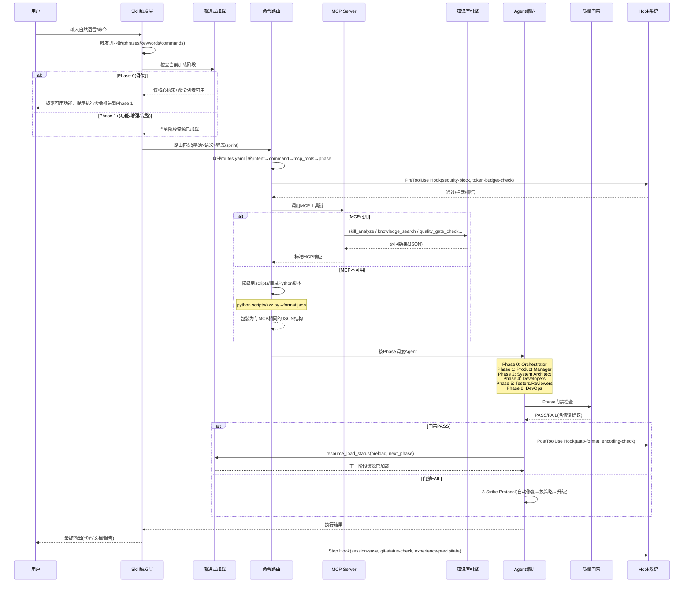
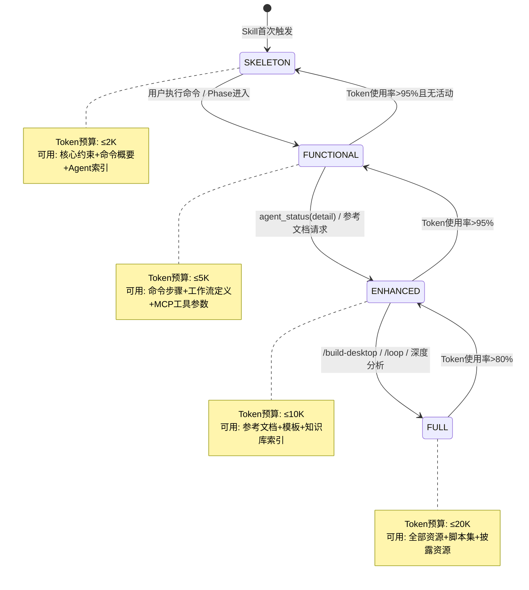
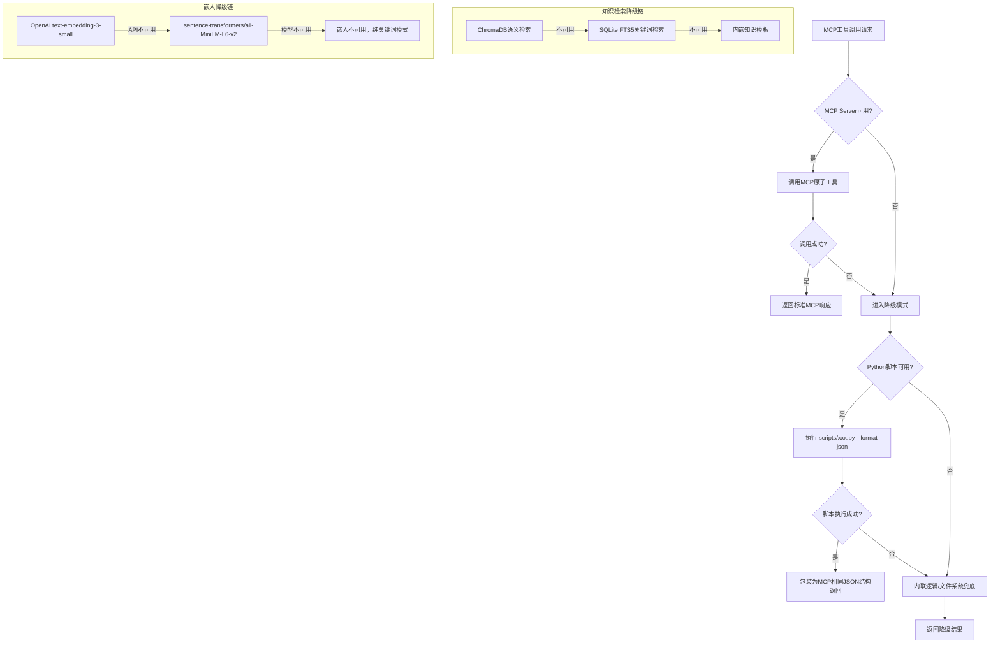

# Xuansto Skill v2 架构文档

> 版本: 8.0.0 | 更新日期: 2026-05-24 | 编码: UTF-8 | 行尾: LF

---

## 目录

1. [项目概览](#1-项目概览)
2. [完整文件目录树](#2-完整文件目录树)
3. [当前架构分层](#3-当前架构分层)
4. [调用流程图](#4-调用流程图)
5. [目标架构设计](#5-目标架构设计)
6. [当前架构 vs 目标架构差异表](#6-当前架构-vs-目标架构差异表)
7. [风险与约束](#7-风险与约束)

---

## 1. 项目概览

### 1.1 定位

Xuansto Skill v2 是一个**多Agent自主开发编排引擎**，通过 17 个 MCP 原子工具驱动 9 阶段全生命周期开发流程。它从 v1 的纯 Skill 内嵌架构演化为 **MCP Server + Skill 双层混合架构**，核心目标是在保持 Skill 声明式编排能力的同时，将计算密集型操作（知识检索、安全扫描、质量门禁等）外置到 MCP Server，实现渐进式加载与 Token 预算控制。

### 1.2 核心能力

| 能力维度 | 规格 | 说明 |
|----------|------|------|
| Agent 编排 | 57 Agents / 13 层 | 覆盖编排→产品→设计→工程→跨平台→数据→测试→安全→DevOps→质量→文档→知识→监控 |
| 质量门禁 | 54 项 | 分布在 Phase 0-8，含 BLOCK/WARN 两级 |
| 命令系统 | 31 个命令 | 意图→命令→MCP工具链→降级策略 完整路由 |
| MCP 工具 | 17+ 个 | skill_analyze, knowledge_search, quality_gate_check 等 |
| 工作流 | 9 阶段 | Phase 0(初始化) → Phase 8(部署交付) |
| 渐进式加载 | 4 级 | 骨架(≤2K) → 功能(≤5K) → 增强(≤10K) → 完整(≤20K) |
| 降级链 | 3 级 | MCP工具 → Python脚本 → 内联逻辑/文件系统 |
| 桌面支持 | 3 框架 | Electron / Tauri / Flutter |

### 1.3 用户交互模式

```
用户输入（自然语言/命令）
    │
    ▼
┌─────────────────────────────────────────────┐
│  Skill 触发层                                │
│  触发词匹配 → 命令路由 → 意图识别            │
└──────────────────┬──────────────────────────┘
                   │
    ┌──────────────▼──────────────┐
    │  渐进式加载控制              │
    │  Phase 0→1→2→3 按需推进     │
    └──────────────┬──────────────┘
                   │
    ┌──────────────▼──────────────┐
    │  MCP 工具调用 / 脚本降级     │
    │  17个原子工具 + 降级脚本链   │
    └──────────────┬──────────────┘
                   │
    ┌──────────────▼──────────────┐
    │  Agent 编排执行              │
    │  57 Agent 按 Phase 调度      │
    └──────────────┬──────────────┘
                   │
                   ▼
              最终输出（代码/文档/报告）
```

---

## 2. 完整文件目录树

```
xuansto-skill-v2/
├── SKILL.md                          # 核心技能定义（YAML frontmatter + 命令 + MCP依赖 + 约束）
├── constraints.yaml                  # 核心约束与降级规则（Token预算/资源优先级/披露阶段/降级回退）
├── PROBLEM.md                        # 已知问题清单（P0-01 ~ P3-02，共9项）
├── MIGRATION.md                      # v1→v2 迁移指南（架构差异/破坏性变更/命令映射）
├── .gitattributes                    # Git属性配置
├── .gitignore                        # Git忽略规则
│
├── agents/                           # 57个Agent定义文件（按13层分目录）
│   ├── registry.yaml                 # Agent注册表（名称/层级/Phase/模型路由）
│   ├── orchestrator/                 # 编排层（3个）：Orchestrator, Subagent Dispatcher, Task Coordinator
│   ├── product/                      # 产品层（4个）：Product Manager, Brainstorming Facilitator, System Architect, Technical Writer
│   ├── design/                       # 设计层（4个）：Design System Generator, UX Designer, Frontend Stylist, UI Designer
│   ├── engineering/                  # 工程层（6个）：Backend/Database/DevOps/Frontend/Fullstack/Mobile Developer
│   ├── cross-platform/               # 跨平台层（5个）：Desktop Developer, Desktop UI Adapter, Native Module Developer, IPC Specialist, Auto-Update Engineer
│   ├── database/                     # 数据层（3个）：Data Modeler, Data Seeder, DBA
│   ├── testing/                      # 测试层（10个）：AI Penetration/Desktop/E2E/Integration/Performance/QA/Security Tester, Test Architect/Maintainer, Unit Tester
│   ├── security/                     # 安全层（3个）：Security Auditor, Compliance Officer, Penetration Tester
│   ├── devops/                       # DevOps层（4个）：Build-Release Engineer, CI/CD Specialist, Monitor Specialist, Runtime Supervisor
│   ├── quality/                      # 质量层（7个）：Bug Scanner, Code/Comment/Compliance/Doc Reviewer, History Analyzer, Refactoring Specialist
│   ├── documentation/                # 文档层（2个）：Documentation Engineer, Specification Keeper
│   ├── knowledge/                    # 知识层（3个）：Knowledge Manager, Learning Specialist, Token Optimizer
│   └── monitoring/                   # 监控层（3个）：Quality Monitor, Progress Tracker, Decision Logger
│
├── commands/                         # 31个命令定义文件 + 路由表
│   ├── routes.yaml                   # 命令路由表（意图→命令→MCP工具→降级→Phase映射）
│   ├── accept.md                     # 验收确认
│   ├── agent-status.md               # Agent状态查询
│   ├── audit.md                      # 安全审计
│   ├── brainstorm.md                 # 头脑风暴
│   ├── budget.md                     # Token预算管理
│   ├── build-desktop.md              # 桌面构建
│   ├── build.md                      # 项目构建
│   ├── cancel-loop.md                # 取消循环
│   ├── clarify.md                    # 需求澄清
│   ├── decision.md                   # 决策记录
│   ├── deploy.md                     # 部署交付
│   ├── design-system.md              # 设计系统
│   ├── design.md                     # 架构设计
│   ├── execute-plan.md               # 执行计划
│   ├── fix.md                        # Bug修复
│   ├── implement.md                  # 代码实现
│   ├── init.md                       # 项目初始化
│   ├── learn.md                      # 知识学习
│   ├── loop.md                       # 自主循环
│   ├── plan.md                       # 架构规划
│   ├── refactor.md                   # 代码重构
│   ├── release-desktop.md            # 桌面发布
│   ├── review.md                     # 代码审查
│   ├── rollback.md                   # 回滚
│   ├── sdd-tdd-fast.md               # 快速SDD+TDD
│   ├── sdd-tdd-medium.md             # 中等SDD+TDD
│   ├── simplify.md                   # 代码简化
│   ├── spec.md                       # 规格文档
│   ├── sprint.md                     # 冲刺
│   ├── status.md                     # 进度查询
│   └── test.md                       # 测试
│
├── configs/
│   └── default.yaml                  # 默认配置（编排器/质量门禁/通信/桌面/日志/知识库/安全/可观测性/成本优化/平台检测/人机协作等）
│
├── hooks/
│   └── hooks.json                    # Hook定义（3级配置：minimal/standard/strict，含安全拦截/Token检查/自动格式化/编码验证等）
│
├── evals/
│   ├── mcp_evaluation.xml            # MCP评估配置
│   └── trigger_eval.json             # 触发器评估配置
│
├── examples/
│   ├── desktop-app-development.md    # 桌面应用开发示例
│   └── web-app-development.md        # Web应用开发示例
│
├── memory/
│   ├── README.md                     # 记忆系统说明
│   ├── fixes/                        # 修复记录
│   │   ├── refactoring/README.md
│   │   └── ...
│   └── patterns/                     # 模式记录
│       ├── testing/README.md
│       └── ...
│
├── migrations/
│   └── .gitkeep                      # 迁移脚本占位
│
├── references/                       # 参考文档库
│   ├── mcp-tools.md                  # 17+ MCP工具完整参数与返回值定义
│   ├── mcp-protocol.md              # MCP协议参考（Anthropic MCP 2025-11-25规范）
│   ├── progressive-loading.md        # 渐进式加载披露规范
│   ├── workflow-phases.md            # 9阶段工作流详情
│   ├── agent-details/                # 57个Agent详细定义
│   │   ├── ai-penetration-tester.md
│   │   ├── backend-developer.md
│   │   └── ...（共57个）
│   ├── a2a-protocol.md               # Agent-to-Agent通信协议
│   ├── acceptance-criteria.md        # 验收标准
│   ├── agent-lifecycle.md            # Agent生命周期
│   ├── agent-registry.md             # Agent注册参考
│   ├── agentic-security-frameworks.md # Agentic安全框架
│   ├── coding-standards.md           # 编码标准
│   ├── collaboration-modes.md        # 协作模式
│   ├── design-guidelines.md          # 设计指南
│   ├── desktop-dev-guidelines.md     # 桌面开发指南
│   ├── documentation-standards.md    # 文档标准
│   ├── electron-security.md          # Electron安全
│   ├── git-workflow.md               # Git工作流
│   ├── hook-system.md                # Hook系统说明
│   ├── human-collaboration.md        # 人机协作
│   ├── knowledge-base-architecture.md # 知识库架构
│   ├── mcp-integration-strategy.md   # MCP集成策略
│   ├── model-routing.md              # 模型路由
│   ├── owasp-agentic-top10-2026.md   # OWASP Agentic Top 10
│   ├── owasp-mcp-top10.md            # OWASP MCP Top 10
│   ├── parallelization-strategy.md   # 并行化策略
│   ├── quality-gates.md              # 质量门禁详情
│   ├── security-guidelines.md        # 安全指南
│   ├── session-persistence.md        # 会话持久化
│   ├── spec-drift-handling.md        # 规格漂移处理
│   ├── test-guidelines.md            # 测试指南
│   ├── token-optimization.md         # Token优化
│   ├── workflow-checkpoints.md       # 工作流检查点
│   └── ...（共90+参考文档）
│
├── scripts/                          # 降级脚本 + MCP Server实现
│   ├── knowledge_server/             # 知识库MCP Server（Python实现）
│   │   ├── __init__.py               # 包初始化
│   │   ├── main.py                   # 入口（CLI参数解析/传输选择/服务启动）
│   │   ├── server.py                 # KnowledgeServer核心类（引擎编排/生命周期/备份/同步）
│   │   ├── mcp_server.py             # MCP工具注册与调用分发（9个知识库MCP工具）
│   │   ├── config.py                 # 配置管理（SQLite/Chroma/Embedding/降级/日志/Schema）
│   │   ├── api.py                    # FastAPI应用工厂
│   │   ├── api_models.py             # API数据模型
│   │   ├── api_routes.py             # API路由定义
│   │   ├── auth.py                   # API Key认证
│   │   ├── db_engine.py              # SQLite引擎（CRUD/FTS5/版本历史/对账日志）
│   │   ├── embedding.py              # 嵌入管理器（OpenAI→sentence-transformers→不可用三级降级）
│   │   ├── vector_engine.py          # ChromaDB向量引擎
│   │   ├── hybrid_search.py          # 混合检索引擎（语义+关键词加权融合）
│   │   ├── progressive_search.py     # 渐进式搜索（多轮/任务类型感知/Token预算控制）
│   │   ├── degradation.py            # 降级管理器（hybrid→keyword_only→unavailable）
│   │   ├── dedup.py                  # 去重引擎（相似度检测/合并/跳过策略）
│   │   ├── distillation.py           # 知识蒸馏
│   │   ├── experience_precipitator.py # 经验沉淀器
│   │   ├── exporter.py               # 知识导出
│   │   ├── importer.py               # 首次导入器
│   │   ├── kb_client.py              # 知识库客户端
│   │   ├── lifecycle.py              # 生命周期管理（归档/过期/清理）
│   │   ├── sync.py                   # 增量同步引擎
│   │   ├── security.py               # 安全模块（输入验证/敏感内容过滤/限流）
│   │   ├── context_formatter.py      # 上下文格式化（Token预算裁剪）
│   │   ├── tech_stack_detector.py    # 技术栈自动检测
│   │   ├── web_search.py             # Web搜索（官方文档检索）
│   │   ├── websocket_manager.py      # WebSocket管理器（实时通知）
│   │   ├── backup.py                 # 备份管理器（全量/增量/快照）
│   │   ├── test_auto_retrieve.py     # 自动检索测试
│   │   ├── test_context_formatter_optimization.py # 上下文格式化优化测试
│   │   ├── test_kb_client.py         # 知识库客户端测试
│   │   ├── test_progressive_search.py # 渐进式搜索测试
│   │   └── test_web_search.py        # Web搜索测试
│   │
│   ├── accessibility-test.js         # 无障碍测试脚本
│   ├── agent-frontmatter-validator.py # Agent定义验证器
│   ├── agentic-security-scanner.py   # Agentic安全扫描（security_scan降级脚本）
│   ├── ai-pentest-runner.py          # AI渗透测试运行器
│   ├── api-contract-validator.py     # API契约验证器
│   ├── build-desktop.ps1             # 桌面构建脚本（PowerShell）
│   ├── build-optimizer.py            # 构建优化器
│   ├── check-comment-lang.py         # 注释语言检查
│   ├── check-complete.py             # 完成度检查
│   ├── check-encoding.py             # 编码检查（encoding-check Hook降级脚本）
│   ├── code-simplifier.py            # 代码简化（code_simplify降级脚本）
│   ├── completion-verifier.py        # 完成验证器
│   ├── confidence-scorer.py          # 置信度评分器
│   ├── console_monitor.py            # 控制台监控
│   ├── context-compressor.py         # 上下文压缩（context_compress降级脚本）
│   ├── coverage-check.py             # 覆盖率检查
│   ├── db-migration-validator.py     # 数据库迁移验证器
│   ├── deduplication-detector.py     # 去重检测器
│   ├── dependency-scan.py            # 依赖扫描
│   ├── design-tokens-sync.js         # 设计令牌同步
│   ├── documentation-coverage.py     # 文档覆盖率检查
│   ├── element_discovery.py          # 元素发现
│   ├── health-checker.py             # 健康检查（server_health降级脚本）
│   ├── infra-health-check.py         # 基础设施健康检查
│   ├── init-session.py               # 会话初始化（session_manage降级脚本）
│   ├── ipc-contract-validator.js     # IPC契约验证器
│   ├── kb-branch-sync.py             # 知识库分支同步
│   ├── kb-migrate.py                 # 知识库迁移
│   ├── knowledge-index-builder.py    # 知识索引构建器
│   ├── knowledge-server-tests.py     # 知识库服务测试
│   └── knowledge-server.py           # 知识库服务入口（CLI模式）
│
└── .knowledge/                       # 运行时知识库数据（不在版本控制中）
    ├── index/                        # 索引数据（SQLite + ChromaDB）
    ├── logs/                         # 日志文件
    ├── backup/                       # 备份数据
    ├── temp-scripts/                 # 临时脚本
    ├── script-errors/                # 脚本错误日志
    └── token-usage/                  # Token使用日志
```

---

## 3. 当前架构分层

当前架构可划分为四层：**Skill层**、**执行层**、**资源层**、**依赖层**。

```
┌─────────────────────────────────────────────────────────────────┐
│                        Skill 层（声明式编排）                     │
│  SKILL.md + constraints.yaml + agents/registry.yaml             │
│  commands/routes.yaml + hooks/hooks.json + configs/default.yaml │
│  职责：触发匹配、命令路由、约束定义、Agent声明、Hook配置          │
└────────────────────────────┬────────────────────────────────────┘
                             │ MCP工具调用 / 脚本降级
┌────────────────────────────▼────────────────────────────────────┐
│                     执行层（运行时引擎）                          │
│  scripts/knowledge_server/                                      │
│  ├── server.py (KnowledgeServer核心编排)                        │
│  ├── mcp_server.py (MCP工具注册与分发)                          │
│  ├── main.py (启动入口，传输选择: http/mcp/http+mcp)            │
│  ├── degradation.py (三级降级管理)                              │
│  ├── hybrid_search.py (混合检索引擎)                            │
│  ├── progressive_search.py (渐进式搜索)                         │
│  └── ... (嵌入/去重/备份/同步/安全/格式化等)                    │
│  职责：MCP工具实现、知识检索、降级管理、数据持久化               │
└────────────────────────────┬────────────────────────────────────┘
                             │ SQLite / ChromaDB / 文件系统
┌────────────────────────────▼────────────────────────────────────┐
│                     资源层（数据与知识）                          │
│  .knowledge/                                                    │
│  ├── index/knowledge.db (SQLite主存储+FTS5全文索引)             │
│  ├── index/chroma_db/ (ChromaDB向量存储)                        │
│  ├── backup/ (全量/增量/快照备份)                               │
│  └── logs/ (运行日志)                                           │
│  references/ (90+参考文档)                                      │
│  agents/ (57个Agent定义.md)                                     │
│  commands/ (31个命令定义.md)                                    │
│  职责：知识存储、参考文档、Agent/命令定义、备份数据              │
└────────────────────────────┬────────────────────────────────────┘
                             │ 外部依赖
┌────────────────────────────▼────────────────────────────────────┐
│                     依赖层（外部服务与库）                        │
│  xuansto-mcp-server >= 4.0.0 (外部MCP Server，提供17个原子工具) │
│  MCP SDK (mcp.server, mcp.types)                               │
│  FastAPI + uvicorn (HTTP传输)                                   │
│  ChromaDB (向量数据库)                                          │
│  OpenAI API / sentence-transformers (嵌入模型)                  │
│  SQLite + FTS5 (关系型存储+全文索引)                            │
│  职责：提供计算能力、存储引擎、协议通信、AI模型服务              │
└─────────────────────────────────────────────────────────────────┘
```

### 3.1 各层职责详述

#### Skill 层

Skill 层是纯声明式配置层，不包含可执行逻辑。所有行为通过 YAML/JSON/Markdown 文件定义：

| 文件 | 类型 | 职责 |
|------|------|------|
| SKILL.md | YAML+Markdown | 技能元数据、触发条件、命令列表、MCP依赖声明、核心约束 |
| constraints.yaml | YAML | Token预算(4级)、资源优先级(P0-P3)、质量门禁摘要、披露阶段、降级回退映射 |
| agents/registry.yaml | YAML | 57个Agent注册（名称/层级/Phase/模型路由） |
| commands/routes.yaml | YAML | 31条命令路由（意图→命令→MCP工具链→降级→Phase） |
| hooks/hooks.json | JSON | 3级Hook配置（minimal/standard/strict），14个Hook定义 |
| configs/default.yaml | YAML | 编排器/质量门禁/通信/桌面/日志/知识库/安全等全部默认配置 |

#### 执行层

执行层是运行时核心，以 `scripts/knowledge_server/` 中的 Python 模块实现：

| 模块 | 核心类/函数 | 职责 |
|------|-------------|------|
| server.py | KnowledgeServer | 引擎编排中心，管理SQLite/Chroma/检索/去重/备份/同步/降级等全部子引擎 |
| mcp_server.py | register_mcp_tools() | 注册9个知识库MCP工具，实现call_tool分发逻辑 |
| main.py | main() | CLI入口，支持http/mcp/http+mcp三种传输模式 |
| degradation.py | DegradationManager | 三级降级：hybrid→keyword_only→unavailable，周期性健康检查 |
| hybrid_search.py | HybridRetrievalEngine | 语义+关键词加权融合检索 |
| progressive_search.py | ProgressiveSearcher | 多轮渐进式搜索，任务类型感知，Token预算控制 |
| embedding.py | EmbeddingManager | 三级嵌入降级：OpenAI API→sentence-transformers→不可用 |
| db_engine.py | SQLiteEngine | CRUD/FTS5/版本历史/对账日志/使用日志 |
| vector_engine.py | ChromaEngine | 向量索引/相似度检索/过期检测 |
| dedup.py | DedupEngine | 相似度去重（阈值0.92），merge/skip/keep_both策略 |
| security.py | InputValidator, SensitiveContentFilter, RateLimiter | 输入验证/敏感内容过滤/限流 |
| config.py | KnowledgeConfig | 配置加载与合并（YAML/环境变量/平台配置） |

#### 资源层

资源层包含持久化数据和静态定义文件：

- **SQLite** (`knowledge.db`)：主存储引擎，含 `knowledge_entries`（知识条目）、`knowledge_fts`（FTS5全文索引）、`version_history`（版本历史）、`dedup_log`（去重日志）、`reconciliation_log`（对账日志）、`usage_logs`（使用日志）、`backup_history`（备份历史）
- **ChromaDB** (`chroma_db/`)：向量存储，支持语义相似度检索
- **参考文档** (`references/`)：90+ Markdown 文件，覆盖编码标准、安全指南、测试策略、桌面开发等
- **Agent定义** (`agents/`)：57个 Markdown 文件，定义每个Agent的角色、能力、调度规则

#### 依赖层

| 依赖 | 版本要求 | 用途 | 降级策略 |
|------|----------|------|----------|
| xuansto-mcp-server | >= 4.0.0 | 提供17个MCP原子工具 | 降级到scripts/目录Python脚本 |
| MCP SDK | mcp.server | MCP协议通信 | 降级到HTTP API |
| FastAPI + uvicorn | — | HTTP传输层 | 仅MCP stdio模式可用 |
| ChromaDB | — | 向量存储 | 降级到SQLite FTS5 |
| OpenAI API | — | 文本嵌入 | 降级到sentence-transformers |
| sentence-transformers | — | 本地嵌入模型 | 降级到纯关键词检索 |
| SQLite + FTS5 | Python内置 | 关系型存储+全文索引 | 无降级（始终可用） |

---

## 4. 调用流程图

### 4.1 完整调用序列（从用户输入到最终输出）



### 4.2 渐进式加载状态机



### 4.3 MCP工具降级链



---

## 5. 目标架构设计

### 5.1 Skill 与 MCP 职责划分

目标架构将当前混合在 Skill 层和执行层的职责进行清晰切分：

```
┌─────────────────────────────────────────────────────────────────────┐
│                     Skill 层（纯声明式，零计算）                     │
│                                                                     │
│  ┌─────────────┐  ┌─────────────┐  ┌─────────────┐                │
│  │ 触发定义    │  │ 命令路由    │  │ 约束声明    │                │
│  │ phrases     │  │ intent→cmd  │  │ spec-first  │                │
│  │ keywords    │  │ →MCP tools  │  │ karpathy    │                │
│  │ commands    │  │ →fallback   │  │ incremental │                │
│  └─────────────┘  └─────────────┘  └─────────────┘                │
│                                                                     │
│  ┌─────────────┐  ┌─────────────┐  ┌─────────────┐                │
│  │ Agent声明   │  │ Hook配置    │  │ 渐进式加载  │                │
│  │ registry    │  │ profiles    │  │ 披露阶段    │                │
│  │ 57 agents   │  │ 14 hooks    │  │ Token预算   │                │
│  └─────────────┘  └─────────────┘  └─────────────┘                │
│                                                                     │
│  职责边界：只定义"做什么"，不定义"怎么做"                          │
└───────────────────────────────┬─────────────────────────────────────┘
                                │ MCP协议调用
┌───────────────────────────────▼─────────────────────────────────────┐
│                   MCP Server 层（计算引擎）                          │
│                                                                     │
│  ┌─────────────────────────────────────────────────────────────┐   │
│  │ 17+ MCP 原子工具                                            │   │
│  │                                                             │   │
│  │ ┌──────────┐ ┌──────────────┐ ┌────────────────┐           │   │
│  │ │分析类    │ │检索类        │ │质量与安全类    │           │   │
│  │ │skill_    │ │knowledge_    │ │quality_gate_   │           │   │
│  │ │analyze   │ │search        │ │check           │           │   │
│  │ │agent_    │ │inject        │ │spec_drift_     │           │   │
│  │ │status    │ │progressive_  │ │detect          │           │   │
│  │ │manage    │ │search        │ │security_scan   │           │   │
│  │ └──────────┘ │deep_load     │ │code_simplify   │           │   │
│  │              │auto_retrieve │ └────────────────┘           │   │
│  │              └──────────────┘                              │   │
│  │                                                             │   │
│  │ ┌──────────┐ ┌──────────────┐ ┌────────────────┐           │   │
│  │ │工作流类  │ │会话与状态类  │ │系统管理类      │           │   │
│  │ │workflow_ │ │session_      │ │server_health   │           │   │
│  │ │dispatch  │ │manage        │ │resource_load_  │           │   │
│  │ │project_  │ │decision_log  │ │status          │           │   │
│  │ │init      │ │token_budget  │ │hook_manage     │           │   │
│  │ └──────────┘ │context_      │ │metrics_report  │           │   │
│  │              │compress      │ └────────────────┘           │   │
│  │              └──────────────┘                              │   │
│  └─────────────────────────────────────────────────────────────┘   │
│                                                                     │
│  职责边界：实现"怎么做"，提供原子化、可组合的计算能力              │
└───────────────────────────────┬─────────────────────────────────────┘
                                │ 数据访问
┌───────────────────────────────▼─────────────────────────────────────┐
│                     数据层（持久化与索引）                            │
│  SQLite + FTS5 │ ChromaDB │ 文件系统 │ 外部API                     │
└─────────────────────────────────────────────────────────────────────┘
```

### 5.2 MCP Server 边界与接口

#### 边界定义原则

| 原则 | 说明 |
|------|------|
| 原子性 | 每个MCP工具只做一件事，可自由组合 |
| 幂等性 | 查询类工具标注 `idempotentHint: true`，重复调用结果一致 |
| 安全性 | 破坏性操作标注 `destructiveHint: true`，只读操作标注 `readOnlyHint: true` |
| 降级透明 | 工具内部处理降级逻辑，调用方无需感知 |
| Schema严格 | `additionalProperties: false`，必填字段显式声明 |

#### MCP工具接口分类

**知识库工具组**（由 `scripts/knowledge_server/` 实现）：

| 工具名 | 类型 | 核心参数 | 降级策略 |
|--------|------|----------|----------|
| knowledge_search | 只读/幂等 | query, top_k, search_type, filters | ChromaDB→SQLite FTS5→关键词 |
| knowledge_add | 写入 | content, metadata, auto_dedup | 敏感内容拦截→去重检测→写入 |
| knowledge_update | 写入 | id, content, metadata | 版本冲突检测→敏感内容拦截 |
| knowledge_delete | 破坏性 | id | 级联删除(ChromaDB+SQLite) |
| knowledge_stats | 只读/幂等 | detailed, since | 始终可用 |
| knowledge_rollback | 破坏性/幂等 | id, target_version | 版本恢复+向量重建 |
| knowledge_auto_retrieve | 只读/幂等 | task_type, project_path, token_budget | 技术栈检测→任务感知检索→上下文格式化 |
| knowledge_progressive_search | 只读/幂等 | query, task_type, tech_stack, token_budget | 多轮渐进+预算裁剪 |
| knowledge_deep_load | 只读/幂等 | entry_id | 绕过Token预算限制加载完整内容 |
| knowledge_web_update | 开放世界 | entry_id/category, tags | Web搜索→结构化提取→更新/创建 |

**编排工具组**（由 `xuansto-mcp-server` 外部服务提供）：

| 工具名 | 类型 | 核心参数 | 降级策略 |
|--------|------|----------|----------|
| skill_analyze | 只读 | skill_path, depth, include_agents | scripts/skill-test.py --analyze |
| quality_gate_check | 只读 | gate_ids, phase, project_path | scripts/skill-test.py --gate |
| spec_drift_detect | 只读 | spec_dir, src_dir | 内联漂移检测 |
| security_scan | 只读 | target, severity_threshold | scripts/agentic-security-scanner.py |
| code_simplify | 只读 | target, scope, include_dedup | scripts/code-simplifier.py |
| workflow_dispatch | 写入 | action, workflow, project_path | scripts/project-initializer.py |
| session_manage | 写入 | action, completed_tasks, decisions | scripts/init-session.py |
| agent_status | 只读 | action, phase, agent_name | 静态注册表查询 |
| hook_manage | 写入 | action, profile, hook_name | 内联Hook执行 |
| resource_load_status | 读写 | action, phase, resource_ids | 内联状态检查 |
| context_compress | 写入 | content, strategy, target_tokens | scripts/context-compressor.py |
| server_health | 只读 | — | scripts/health-checker.py |
| decision_log | 写入 | action, title, decision | 内联JSON记录 |
| token_budget | 读写 | action, total_budget | 内联估算 |
| knowledge_inject | 写入 | action, content, scope | 内联注入 |
| project_init | 写入 | action, name, stack | 内联模板生成 |
| metrics_report | 只读 | action, tool_name, time_range | 内联指标读取 |

### 5.3 渐进式加载注入点与触发机制

#### 注入点设计

渐进式加载通过以下注入点实现资源按需加载：

```
┌─────────────────────────────────────────────────────────────┐
│                    注入点架构                                │
│                                                             │
│  注入点1: SKILL.md Phase标记                                │
│  <!-- PHASE_0_START --> ... <!-- PHASE_0_END -->            │
│  <!-- PHASE_1_START --> ... <!-- PHASE_1_END -->            │
│  <!-- PHASE_2_START --> ... <!-- PHASE_2_END -->            │
│  <!-- PHASE_3_START --> ... <!-- PHASE_3_END -->            │
│  → Host按当前Phase截取SKILL.md内容                          │
│                                                             │
│  注入点2: {{include:}} 指令                                 │
│  {{include:commands/routes.yaml}}                           │
│  {{include:agents/registry.yaml}}                           │
│  {{include:constraints.yaml}}                               │
│  → 按需展开外部文件到上下文                                  │
│                                                             │
│  注入点3: resource_load_status MCP工具                       │
│  action=preload, phase=N                                    │
│  → 主动推进加载阶段，预加载指定Phase资源                     │
│                                                             │
│  注入点4: xuansto://loading/status MCP Resource              │
│  → 查询当前加载状态和可用功能范围                            │
│                                                             │
│  注入点5: context_compress MCP工具                           │
│  strategy=semantic/selective/lossless                        │
│  → Token超限时压缩/释放资源                                 │
└─────────────────────────────────────────────────────────────┘
```

#### 触发机制矩阵

| 触发事件 | 触发源 | 目标Phase | 注入点 | 动作 |
|----------|--------|-----------|--------|------|
| Skill首次触发 | Host | Phase 0 | 注入点1 | 加载SKILL.md PHASE_0范围 |
| 用户执行命令 | 命令路由 | Phase 1 | 注入点1+2 | 展开PHASE_1 + 当前命令.md |
| Phase转换(advance) | workflow_dispatch | Phase 1 | 注入点3 | resource_load_status(preload) |
| Agent调度(detail) | agent_status | Phase 2 | 注入点2+3 | 展开Agent定义 + 参考文档 |
| 知识检索 | knowledge_search | Phase 2 | 注入点3 | 按需检索，不预加载 |
| Token>80% | token_budget | 降级 | 注入点5 | context_compress(semantic) |
| Token>95% | token_budget | 降级 | 注入点5 | 释放P2/P3资源 |
| 桌面构建 | /build-desktop | Phase 3 | 注入点1+2+3 | 加载全部桌面相关资源 |
| 自主循环 | /loop | Phase 3 | 注入点1+2+3 | 全量加载+Token预算管理 |

---

## 6. 当前架构 vs 目标架构差异表

| 维度 | 当前架构 | 目标架构 | 差异编号 |
|------|----------|----------|----------|
| **架构模式** | Skill内嵌 + MCP Server混合，职责边界模糊 | Skill纯声明式 + MCP Server纯计算，清晰分层 | DIFF-01 |
| **MCP工具实现** | 知识库9个工具在scripts/knowledge_server/实现，其余17个声明在SKILL.md但无本地实现 | 全部17+工具由xuansto-mcp-server统一实现，Skill仅声明调用 | DIFF-02 |
| **降级链** | constraints.yaml声明了脚本降级路径，但degradation.py仅返回fallback响应，未实际调用scripts/ | 完整降级链：MCP→scripts/→内联逻辑，每级都有实际执行能力 | DIFF-03 |
| **渐进式加载** | constraints.yaml定义了4级Phase和SKILL.md标记，但SKILL.md未实际添加Phase标记注释 | SKILL.md包含PHASE_0~3标记，Host按Phase截取内容 | DIFF-04 |
| **Token预算** | constraints.yaml定义了4级预算(2K/5K/10K/20K)，但无运行时强制机制 | token_budget工具运行时强制执行，超限自动压缩/降级 | DIFF-05 |
| **Agent加载** | agents/registry.yaml全量声明57个Agent，无按Phase过滤机制 | 按Phase渐进加载：Phase 0无Agent→Phase 1核心13个→Phase 2全部57个 | DIFF-06 |
| **参考文档** | references/有90+文件，但SKILL.md仅引用mcp-tools.md和workflow-phases.md | {{include:}}按需展开，渐进式加载参考文档 | DIFF-07 |
| **Hook系统** | hooks/hooks.json定义了3级14个Hook，但仅security-block有实际拦截逻辑 | 全部14个Hook有完整实现，strict配置下类型检查/日志检测等全部生效 | DIFF-08 |
| **MCP Server版本** | Skill声明v8.0.0，MCP Server实际v3.5.0，版本不一致 | Skill与MCP Server互相声明兼容版本，版本同步 | DIFF-09 |
| **知识库工具** | mcp_server.py实现9个知识库工具，与SKILL.md声明的17个工具不重叠 | 知识库工具纳入xuansto-mcp-server统一管理，17+工具完整可用 | DIFF-10 |
| **传输层** | main.py支持http/mcp/http+mcp三种模式，但MCP stdio模式需单独启动 | 默认http+mcp双传输，MCP stdio自动启动为守护线程 | DIFF-11 |
| **会话持久化** | session_manage声明了save/load/list/track，但无持久化文件实现 | 会话状态持久化到.skill-logs/和.agent_cache/ | DIFF-12 |
| **配置热重载** | configs/default.yaml静态配置，修改需重启 | .xuansto-config.yaml支持watchfiles事件驱动热重载 | DIFF-13 |
| **评估系统** | evals/目录有2个文件，但无实际评估流程 | 完整评估框架，支持触发准确率/工具调用成功率评估 | DIFF-14 |

---

## 7. 风险与约束

### 7.1 架构风险

| 编号 | 风险 | 严重级别 | 影响范围 | 缓解措施 |
|------|------|----------|----------|----------|
| ARCH-01 | MCP Server不可用时降级链断裂 | P0 | 全系统 | 实现degradation.py到scripts/的实际调用链；确保每级降级都有可执行逻辑 |
| ARCH-02 | 参考文档缺失导致Agent执行失败 | P0 | Phase 2+ | 从v1迁移关键参考文档；通过MCP Resource提供在线参考 |
| ARCH-03 | Skill与MCP Server版本不一致 | P1 | 兼容性 | 在SKILL.md和MCP Server中互相声明兼容版本范围；server_health增加版本检查 |
| ARCH-04 | 渐进式加载Phase标记未实际嵌入SKILL.md | P1 | Token消耗 | 在SKILL.md中添加PHASE_0~3标记注释；Host实现按Phase截取逻辑 |
| ARCH-05 | Token预算无运行时强制机制 | P1 | 成本控制 | token_budget工具实现运行时检查；超80%自动压缩；超95%强制降级 |
| ARCH-06 | Hook系统仅security-block有实际实现 | P2 | 代码质量 | 逐步实现auto-format/encoding-check/type-check等Hook的实际逻辑 |
| ARCH-07 | 知识库MCP工具与编排MCP工具分属不同进程 | P2 | 一致性 | 统一工具注册到xuansto-mcp-server；或通过MCP Resource实现跨Server发现 |
| ARCH-08 | Agent合并策略在运行时无实际调度逻辑 | P2 | 性能 | 实现agent_merge_policy的运行时评估和自动激活 |
| ARCH-09 | 评估框架不完整，无法验证触发准确率 | P3 | 质量 | 完善evals/目录，实现自动化评估流程 |
| ARCH-10 | v1与v2存在重复文件，维护成本增加 | P3 | 维护性 | 确立v2为唯一维护版本，v1标记为archived |

### 7.2 约束条件

| 编号 | 约束 | 类型 | 说明 |
|------|------|------|------|
| CONST-01 | Spec > Test > Code | 流程约束 | 先规格再测试最后代码，覆盖率≥80% |
| CONST-02 | Karpathy准则 | 编码约束 | Think Before Coding / Simplicity First / Surgical Changes |
| CONST-03 | 3-Strike Protocol | 错误约束 | 自动修复→换策略→升级处理，最多3次重试 |
| CONST-04 | UTF-8无BOM+LF | 编码约束 | 所有文件UTF-8无BOM，行尾LF，禁止Shell(.sh) |
| CONST-05 | Python优先 | 脚本约束 | 降级脚本优先使用Python，验证后删除临时脚本 |
| CONST-06 | Token预算上限 | 资源约束 | Phase 0: ≤2K / Phase 1: ≤5K / Phase 2: ≤10K / Phase 3: ≤20K |
| CONST-07 | MCP最低兼容 | 依赖约束 | xuansto-mcp-server >= 4.0.0，API版本 3.0.0 |
| CONST-08 | 最大并发Agent | 性能约束 | 单任务最大3个并发Agent，系统级并行容量10 |
| CONST-09 | 安全硬门禁 | 安全约束 | 生产部署/密钥轮换/数据库破坏性变更必须人工确认 |
| CONST-10 | 置信度阈值 | 质量约束 | 审查置信度≥80%方可通过；经验提取最低置信度0.8 |

### 7.3 技术债务

| 编号 | 债务描述 | 来源 | 优先级 | 建议处理方式 |
|------|----------|------|--------|-------------|
| DEBT-01 | degradation.py未实际调用scripts/目录脚本 | P0-01 | P0 | 实现完整的脚本调用链，每级降级都有可执行逻辑 |
| DEBT-02 | references/参考文档不完整 | P0-02 | P0 | 从v1迁移quality-gates.md, agent-registry.md等关键文档 |
| DEBT-03 | MCP Server版本与Skill版本不一致 | P1-01 | P1 | 双向声明兼容版本，server_health增加版本校验 |
| DEBT-04 | server_health工具未在mcp-tools.md中列出 | P1-02 | P1 | 补充server_health工具文档 |
| DEBT-05 | knowledge_search缺少inject/precipitate文档 | P1-03 | P1 | 补充inject和precipitate action的参数与返回值文档 |
| DEBT-06 | 评估配置文件缺失 | P2-01 | P2 | 从v1迁移evals/目录 |
| DEBT-07 | CHANGELOG.md缺失 | P2-02 | P2 | 创建v2专用CHANGELOG.md |
| DEBT-08 | v1与v2重复文件 | P3-01 | P3 | v1标记archived，v2为唯一维护版本 |
| DEBT-09 | SKILL.md可能超过500行 | P3-02 | P3 | 将详细步骤外移到references/，SKILL.md保留概要 |

### 7.4 性能目标

| 指标 | 当前值 | 目标值 | 降低比例 | 实现路径 |
|------|--------|--------|----------|----------|
| Skill触发时Token | ~8,000 | ≤2,000 | 75% | 渐进式加载Phase 0仅加载骨架 |
| 单命令执行Token | ~15,000 | ≤5,000 | 67% | Phase 1按需加载命令详情 |
| 全流程Token(9 Phase) | ~84,000 | ≤30,000 | 64% | 4级渐进加载+Token预算强制 |
| Agent调度Token(单次) | ~500/Agent | ≤150/Agent | 70% | Agent索引摘要→按需加载完整定义 |
| 骨架加载时间 | N/A(全量) | ≤500ms | — | Phase 0仅读取SKILL.md PHASE_0范围 |
| Phase资源预加载 | N/A(全量) | ≤2s/Phase | — | resource_load_status(preload) |
| 知识检索响应 | 1-5s(ChromaDB) | ≤3s(hybrid) | 40% | 混合检索+降级链 |

---

## 附录A：9阶段工作流与Agent调度映射

| 工作流Phase | 名称 | 关键Agent | 关键门禁 | 关键命令 |
|-------------|------|-----------|----------|----------|
| Phase 0 | 初始化 | Orchestrator, Knowledge Manager, Token Optimizer, Quality Monitor | DESIGN-SYSTEM-COMPLETE, ANTI-PATTERN-CHECK | /init, /sprint |
| Phase 1 | 需求分析 | Product Manager, Brainstorming Facilitator, Technical Writer | BRAINSTORM-COMPLETE | /brainstorm, /clarify |
| Phase 2 | 架构设计 | System Architect, Design System Generator, Specification Keeper | PLAN-ATOMIC | /plan, /spec, /design, /design-system |
| Phase 3 | 测试先行 | Test Architect, Unit Tester | TEST-FIRST | /sdd-tdd-fast, /sdd-tdd-medium |
| Phase 4 | 代码实现 | Backend/Frontend/Fullstack/Mobile Developer, Desktop Developer | GATE-007, TEST-PASS, FILE-ENCODING | /implement, /fix |
| Phase 5 | 测试验证 | AI Penetration Tester, Security Tester/Auditor, Code Reviewer, QA Engineer | AI-PENTEST, SPEC-CONSISTENCY | /test, /review, /audit |
| Phase 6 | 验收确认 | Product Manager, Compliance Reviewer, Doc Reviewer | UX-ACCEPTANCE | /accept |
| Phase 7 | 持续重构 | Refactoring Specialist, Test Maintainer, Learning Specialist | SIMPLIFICATION-BEHAVIOR | /refactor, /simplify |
| Phase 8 | 部署交付 | DevOps Engineer, Build-Release Engineer, CI/CD Specialist, DBA | DESKTOP-BUILD/SIGN/UPDATE/CROSS | /deploy, /build, /build-desktop, /release-desktop |

## 附录B：Hook系统三级配置

| Hook名称 | 类型 | minimal | standard | strict |
|----------|------|---------|----------|--------|
| security-block | PreToolUse | ✅ | ✅ | ✅ |
| token-budget-check | PreToolUse | — | ✅ | ✅ |
| dangerous-cmd-confirm | PreToolUse | — | — | ✅ |
| auto-format | PostToolUse | — | ✅ | ✅ |
| encoding-check | PostToolUse | — | ✅ | ✅ |
| console-log-detect | PostToolUse | — | — | ✅ |
| type-check | PostToolUse | — | — | ✅ |
| load-context | SessionStart | — | ✅ | ✅ |
| kb-health-check | SessionStart | — | ✅ | ✅ |
| platform-detect | SessionStart | — | — | ✅ |
| session-save | Stop | ✅ | ✅ | ✅ |
| git-status-check | Stop | — | ✅ | ✅ |
| experience-precipitate | Stop | — | ✅ | ✅ |
| pattern-detect | Stop | — | — | ✅ |
| save-state | PreCompact | — | ✅ | ✅ |
| decision-log-persist | PreCompact | — | — | ✅ |

## 附录C：MCP工具与命令路由映射

| 命令 | MCP工具链 | 降级策略 | 工作流Phase |
|------|-----------|----------|-------------|
| /init | skill_analyze, knowledge_search, workflow_dispatch, project_init, decision_log | ChromaDB→FTS5→关键词；初始化→内联模板 | Phase 0 |
| /brainstorm | knowledge_search, workflow_dispatch | 知识检索→降级链 | Phase 1 |
| /clarify | knowledge_search, workflow_dispatch, quality_gate_check | 知识检索→降级链；门禁→内嵌检查 | Phase 1 |
| /plan | skill_analyze, knowledge_search, agent_status, workflow_dispatch, decision_log, token_budget | 项目分析→基础扫描；知识检索→降级链 | Phase 2 |
| /spec | workflow_dispatch, quality_gate_check, spec_drift_detect | 门禁失败→修复建议；知识检索→默认模板 | Phase 2 |
| /design | quality_gate_check, knowledge_search, workflow_dispatch | 设计门禁→内嵌检查 | Phase 2 |
| /implement | workflow_dispatch, quality_gate_check, hook_manage | 门禁失败→阻止实现+修复建议 | Phase 4 |
| /test | quality_gate_check, workflow_dispatch | 测试门禁FAIL→返回失败文件和建议 | Phase 5 |
| /review | quality_gate_check, security_scan, code_simplify | 安全扫描→内嵌降级；代码简化→内嵌降级 | Phase 5 |
| /audit | security_scan, quality_gate_check, spec_drift_detect | 安全扫描→内嵌agentic+dependency扫描 | Phase 5 |
| /simplify | code_simplify, quality_gate_check, context_compress | 代码简化→内嵌simplify+dedup；压缩→脚本降级 | Phase 7 |
| /loop | workflow_dispatch, session_manage, resource_load_status, token_budget, decision_log | 逐步降级: MCP完整→MCP简化→脚本降级 | 全Phase |
| /deploy | quality_gate_check, server_health, workflow_dispatch | 健康检查→基础状态返回 | Phase 8 |
