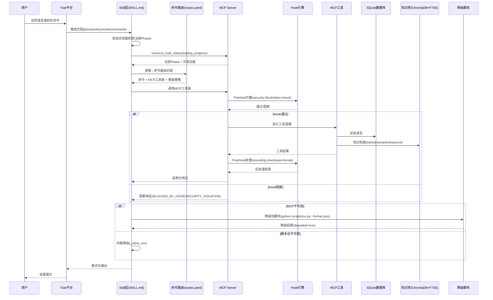
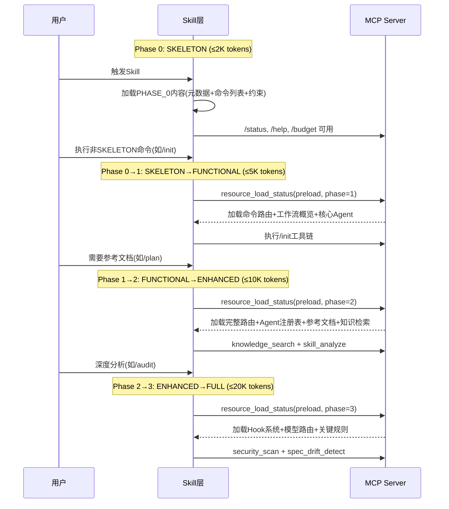
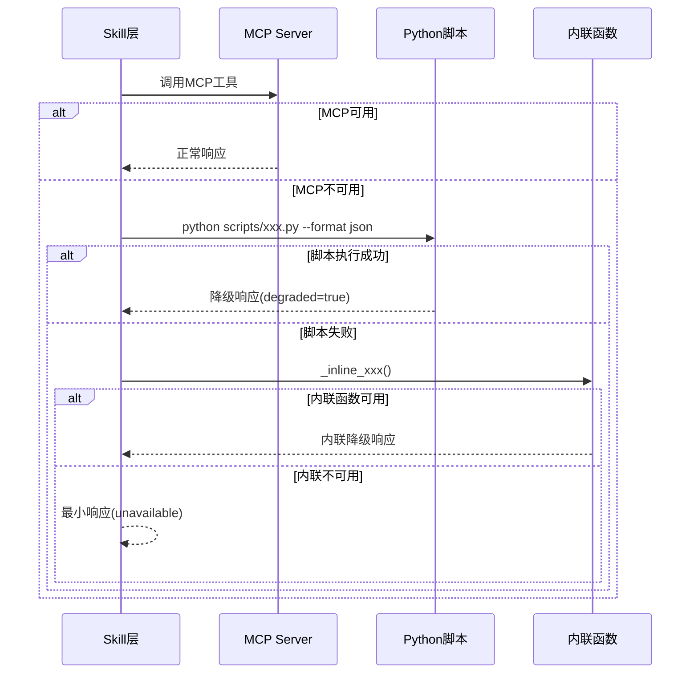
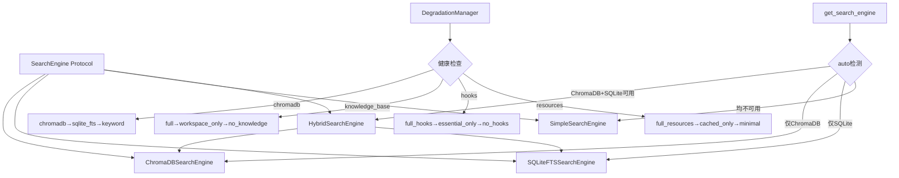
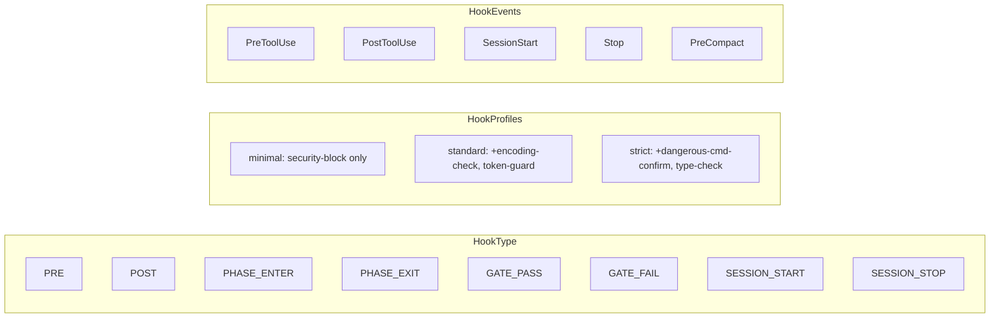

# Xuansto Skill v8.5.0 架构文档

> 版本: 8.5.0 | 57 Agents / 13 层 / 54 质量门禁 / 32 命令 / 9 阶段工作流 / 20 MCP 工具

---

## 1. 项目概述

### 1.1 定位

Xuansto Skill v2 是一个**多 Agent 自主开发编排引擎**，通过 `xuansto-mcp-server` 提供的 20 个 MCP 原子工具驱动 9 阶段全生命周期开发流程。项目采用 **Skill + MCP Server** 双层架构：Skill 层负责提示词编排、命令路由和 Agent 调度，MCP Server 层负责状态持久化、知识检索、质量门禁和降级管理。

### 1.2 核心能力

| 能力 | 说明 |
|------|------|
| 多 Agent 编排 | 57 个 Agent 分 13 层（编排/产品/设计/工程/跨平台/数据/测试/安全/DevOps/质量/文档/知识/监控），按 Phase 动态激活 |
| 9 阶段工作流 | Phase 0 初始化 → Phase 1 需求分析 → Phase 2 架构设计 → Phase 3 测试先行 → Phase 4 代码实现 → Phase 5 测试验证 → Phase 6 验收确认 → Phase 7 持续重构 → Phase 8 部署交付 |
| 54 项质量门禁 | 覆盖设计审查、编码规范、安全扫描、测试覆盖、验收标准、桌面构建等全流程 |
| 渐进式加载 | 4 阶段加载（SKELETON → FUNCTIONAL → ENHANCED → FULL），按需注入上下文，控制 Token 预算 |
| 三级降级 | MCP 工具 → 脚本调用 → 内联函数 → 最小响应，确保任何环境下可用 |
| 双存储知识库 | ChromaDB（语义向量）+ SQLite FTS5（BM25 关键词），支持混合检索 |
| 桌面应用支持 | Electron / Tauri / Flutter 跨平台构建、代码签名、自动更新 |

### 1.3 用户交互模式

用户通过自然语言或斜杠命令与 Skill 交互。Skill 根据触发条件（关键词/短语/命令）自动激活，解析用户意图后路由到对应命令，调用 MCP 工具链执行，最终返回结构化结果。

```
用户输入 → 触发匹配 → 命令路由 → MCP工具调用 → 降级兜底 → 结果输出
```

---

## 2. 完整文件目录树

```
xuansto/                                          # 项目根目录
├── .trae/                                         # Trae 平台配置
│   └── skills/
│       └── xuansto-skill-v2/                      # ===== Skill 层 =====
│           ├── SKILL.md                           # 技能主文件：YAML元数据 + 渐进式分阶段内容（PHASE_0~3）
│           ├── constraints.yaml                   # 核心约束定义：5条规则 + Token预算 + 渐进加载 + 降级映射
│           ├── .skill-config.yaml                 # 运行时配置：循环控制、规划文件、按需加载、知识服务
│           ├── CHANGELOG.md                       # 版本变更日志
│           ├── MIGRATION.md                       # 迁移指南
│           ├── PROBLEM.md                         # 已知问题记录
│           ├── agents/                            # Agent 定义目录
│           │   ├── registry.yaml                  # Agent 注册表：13层57个Agent的完整索引（名称/文件/Phase/模型路由）
│           │   ├── orchestrator/                   # 编排层（3个）：Orchestrator, Subagent Dispatcher, Task Coordinator
│           │   ├── product/                        # 产品层（4个）：Product Manager, Brainstorming Facilitator, System Architect, Technical Writer
│           │   ├── design/                         # 设计层（4个）：Design System Generator, UX Designer, Frontend Stylist, UI Designer
│           │   ├── engineering/                    # 工程层（6个）：Backend/Database/DevOps/Frontend/Fullstack/Mobile Developer
│           │   ├── cross-platform/                 # 跨平台层（5个）：Desktop Developer, Desktop UI Adapter, Native Module Developer, IPC Specialist, Auto-Update Engineer
│           │   ├── database/                       # 数据层（3个）：Data Modeler, Data Seeder, DBA
│           │   ├── testing/                        # 测试层（10个）：AI Penetration/Desktop/E2E/Integration/Performance/QA/Security Tester, Test Architect/Maintainer, Unit Tester
│           │   ├── security/                       # 安全层（3个）：Security Auditor, Compliance Officer, Penetration Tester
│           │   ├── devops/                         # DevOps层（4个）：Build-Release Engineer, CI/CD Specialist, Monitor Specialist, Runtime Supervisor
│           │   ├── quality/                        # 质量层（7个）：Bug Scanner, Code/Comment/Compliance/Doc Reviewer, History Analyzer, Refactoring Specialist
│           │   ├── documentation/                  # 文档层（2个）：Documentation Engineer, Specification Keeper
│           │   ├── knowledge/                      # 知识层（3个）：Knowledge Manager, Learning Specialist, Token Optimizer
│           │   └── monitoring/                     # 监控层（3个）：Quality Monitor, Progress Tracker, Decision Logger
│           ├── commands/                          # 命令定义目录
│           │   ├── routes.yaml                    # 命令路由表：32个命令的意图→命令→MCP工具链→降级策略映射
│           │   ├── init.md                        # /init 命令：从零搭建新项目
│           │   ├── sprint.md                      # /sprint 命令：冲刺规划
│           │   ├── brainstorm.md                  # /brainstorm 命令：头脑风暴
│           │   ├── clarify.md                     # /clarify 命令：需求澄清
│           │   ├── plan.md                        # /plan 命令：架构规划
│           │   ├── spec.md                        # /spec 命令：规格文档
│           │   ├── design.md                      # /design 命令：设计
│           │   ├── design-system.md               # /design-system 命令：设计系统
│           │   ├── implement.md                   # /implement 命令：代码实现
│           │   ├── test.md                        # /test 命令：测试
│           │   ├── review.md                      # /review 命令：代码审查
│           │   ├── audit.md                       # /audit 命令：安全审计
│           │   ├── fix.md                         # /fix 命令：Bug修复
│           │   ├── accept.md                      # /accept 命令：验收确认
│           │   ├── simplify.md                    # /simplify 命令：代码简化
│           │   ├── refactor.md                    # /refactor 命令：代码重构
│           │   ├── deploy.md                      # /deploy 命令：部署交付
│           │   ├── build.md                       # /build 命令：构建项目
│           │   ├── build-desktop.md               # /build-desktop 命令：桌面构建
│           │   ├── release-desktop.md             # /release-desktop 命令：桌面发布
│           │   ├── learn.md                       # /learn 命令：知识学习
│           │   ├── execute-plan.md                # /execute-plan 命令：执行计划
│           │   ├── loop.md                        # /loop 命令：自主循环
│           │   ├── cancel-loop.md                 # /cancel-loop 命令：取消循环
│           │   ├── agent-status.md                # /agent-status 命令：Agent状态查询
│           │   ├── status.md                      # /status 命令：进度查询
│           │   ├── help.md                        # /help 命令：帮助信息
│           │   ├── rollback.md                    # /rollback 命令：回滚
│           │   ├── sdd-tdd-medium.md              # /sdd-tdd-medium 命令：中等规模SDD+TDD
│           │   ├── sdd-tdd-fast.md                # /sdd-tdd-fast 命令：快速SDD+TDD
│           │   ├── decision.md                    # /decision 命令：决策记录
│           │   └── budget.md                      # /budget 命令：Token预算
│           ├── configs/
│           │   └── default.yaml                   # 默认配置：编排器/质量门禁/通信/桌面/日志/知识/安全/可观测/成本/平台检测/人机协作/编码/Token优化/审查/简化/测试
│           ├── hooks/
│           │   └── hooks.json                     # Hook系统定义：三级配置（minimal/standard/strict）+ 14个Hook
│           ├── references/                        # 参考文档目录（80+文件）
│           │   ├── agent-details/                 # 57个Agent详细参考文档
│           │   ├── quality-gates.md               # 54项质量门禁详细定义与判定标准
│           │   ├── agent-registry.md              # 完整Agent注册表
│           │   ├── mcp-tools.md                   # 20个MCP工具完整参数与返回值
│           │   ├── workflow-phases.md             # 9阶段工作流定义
│           │   ├── progressive-loading.md         # 渐进式加载策略
│           │   ├── mcp-integration-strategy.md    # MCP集成策略
│           │   ├── knowledge-base-architecture.md # 知识库架构
│           │   ├── hook-system.md                 # Hook系统完整定义
│           │   ├── model-routing.md               # 模型路由规则
│           │   ├── token-optimization.md          # Token优化策略
│           │   ├── session-persistence.md         # 会话持久化
│           │   ├── spec-drift-handling.md         # 规格偏差处理
│           │   ├── parallelization-strategy.md    # 并行化策略
│           │   ├── owasp-agentic-top10-2026.md    # OWASP Agentic Top 10
│           │   ├── owasp-mcp-top10.md             # OWASP MCP Top 10
│           │   ├── security-guidelines.md         # 安全指南
│           │   ├── coding-standards.md            # 编码标准（多语言）
│           │   ├── test-guidelines.md             # 测试指南
│           │   ├── design-guidelines.md           # 设计指南
│           │   ├── desktop-dev-guidelines.md      # 桌面开发指南
│           │   ├── git-workflow.md                # Git工作流
│           │   └── ...                            # 其他60+参考文档
│           ├── scripts/                           # 降级脚本目录
│           │   ├── knowledge_server/              # 知识服务子模块
│           │   │   ├── api.py                     # 知识服务API
│           │   │   ├── api_models.py              # API数据模型
│           │   │   ├── api_routes.py              # API路由
│           │   │   ├── auth.py                    # 认证
│           │   │   ├── backup.py                  # 备份
│           │   │   └── config.py                  # 配置
│           │   ├── accessibility-test.js          # 无障碍测试脚本
│           │   ├── agent-frontmatter-validator.py # Agent frontmatter验证
│           │   ├── agentic-security-scanner.py    # Agentic安全扫描
│           │   ├── ai-pentest-runner.py           # AI渗透测试
│           │   ├── api-contract-validator.py      # API契约验证
│           │   ├── build-desktop.ps1              # 桌面构建脚本
│           │   ├── build-optimizer.py             # 构建优化
│           │   ├── check-comment-lang.py          # 注释语言检查
│           │   ├── check-complete.py              # 完整性检查
│           │   ├── check-encoding.py              # 编码检查
│           │   ├── code-simplifier.py             # 代码简化
│           │   ├── completion-verifier.py         # 完成验证
│           │   ├── confidence-scorer.py           # 置信度评分
│           │   ├── console_monitor.py             # 控制台监控
│           │   ├── context-compressor.py          # 上下文压缩
│           │   ├── coverage-check.py              # 覆盖率检查
│           │   ├── db-migration-validator.py      # 数据库迁移验证
│           │   ├── deduplication-detector.py      # 去重检测
│           │   ├── dependency-scan.py             # 依赖扫描
│           │   ├── design-tokens-sync.js          # 设计令牌同步
│           │   ├── documentation-coverage.py      # 文档覆盖率
│           │   ├── element_discovery.py           # 元素发现
│           │   ├── health-checker.py              # 健康检查
│           │   ├── infra-health-check.py          # 基础设施健康检查
│           │   ├── init-session.py                # 会话初始化
│           │   ├── ipc-contract-validator.js      # IPC契约验证
│           │   ├── kb-branch-sync.py              # 知识库分支同步
│           │   ├── kb-migrate.py                  # 知识库迁移
│           │   ├── knowledge-index-builder.py     # 知识索引构建
│           │   ├── knowledge-server.py            # 知识服务主脚本
│           │   └── ...                            # 其他脚本
│           ├── evals/
│           │   ├── mcp_evaluation.xml             # MCP评估配置
│           │   └── trigger_eval.json              # 触发条件评估用例
│           ├── examples/
│           │   ├── desktop-app-development.md     # 桌面应用开发示例
│           │   └── web-app-development.md         # Web应用开发示例
│           ├── memory/
│           │   ├── fixes/                         # 修复经验
│           │   │   └── refactoring/               # 重构修复经验
│           │   └── patterns/                      # 模式经验
│           │       └── testing/                   # 测试模式
│           ├── migrations/                        # 数据库迁移目录
│           └── .knowledge/                        # 知识运行时目录
│               ├── temp-scripts/                  # 临时脚本
│               └── script-errors/                 # 脚本错误日志
│
├── xuansto-mcp-server/                            # ===== MCP Server 层 =====
│   ├── pyproject.toml                             # Python项目配置：依赖/构建/测试/lint
│   ├── mcp-config.json                            # MCP客户端配置：stdio和streamable-http两种传输
│   ├── README.md                                  # MCP Server说明文档
│   ├── LICENSE                                    # MIT许可证
│   ├── scripts/                                   # 部署脚本
│   │   ├── migrate_knowledge_to_xuansto.py        # 知识库迁移脚本
│   │   ├── start_server.py                        # 服务器启动脚本
│   │   ├── validate_schemas.py                    # Schema验证脚本
│   │   └── verify_deployment.py                   # 部署验证脚本
│   ├── spec-locks/                                # API契约锁
│   │   ├── api-contract-version.json              # API契约版本
│   │   ├── skill-definition-schema.json           # 技能定义Schema
│   │   └── tool-parameter-schemas.json            # 工具参数Schema
│   ├── docs/                                      # MCP Server文档
│   │   ├── api.md                                 # API文档
│   │   ├── mcp-tools.md                           # MCP工具文档
│   │   ├── migration-v1-to-v2.md                  # v1到v2迁移指南
│   │   ├── troubleshooting.md                     # 故障排除
│   │   └── contributing.md                        # 贡献指南
│   ├── src/xuansto_mcp/                           # 核心源码
│   │   ├── __init__.py                            # 包初始化
│   │   ├── server.py                              # 服务器入口：FastMCP实例、工具注册、Hook拦截、启动逻辑
│   │   ├── cli.py                                 # CLI入口：命令行工具调用
│   │   ├── api_routes.py                          # API路由
│   │   ├── tools/                                 # ===== 20个MCP工具 =====
│   │   │   ├── __init__.py                        # 工具模块索引
│   │   │   ├── skill_analyze.py                   # 项目结构分析
│   │   │   ├── knowledge_search.py                # 三层知识库检索（ChromaDB/SQLite FTS/关键词）
│   │   │   ├── knowledge_inject.py                # 知识注入到上下文
│   │   │   ├── quality_gate_check.py              # 54项质量门禁检查
│   │   │   ├── spec_drift_detect.py               # 规格偏差检测
│   │   │   ├── security_scan.py                   # OWASP+Agentic+依赖安全扫描
│   │   │   ├── code_simplify.py                   # 代码简化分析
│   │   │   ├── session_manage.py                  # 会话状态管理（保存/加载/恢复）
│   │   │   ├── workflow_dispatch.py               # 工作流调度（启动/状态/中止/阶段推进/恢复）
│   │   │   ├── agent_status.py                    # Agent状态查询
│   │   │   ├── agent_manage.py                    # Agent实例管理（创建/分配/释放/销毁）
│   │   │   ├── hook_manage.py                     # Hook管理（列表/执行）
│   │   │   ├── resource_load_status.py            # 渐进式加载状态与预加载
│   │   │   ├── resource_subscribe.py              # 资源订阅管理
│   │   │   ├── context_compress.py                # 上下文压缩（语义/选择性/无损）
│   │   │   ├── server_health.py                   # 服务器健康检查与版本协商
│   │   │   ├── decision_log.py                    # 决策日志管理
│   │   │   ├── token_budget.py                    # Token预算管理
│   │   │   ├── project_init.py                    # 项目初始化
│   │   │   ├── metrics_report.py                  # 指标报告
│   │   │   ├── config_manage.py                   # 配置管理（热重载/验证）
│   │   │   └── audit_query.py                     # 审计日志查询
│   │   ├── core/                                  # ===== 核心基础设施 =====
│   │   │   ├── __init__.py                        # 原子写入工具
│   │   │   ├── config.py                          # 配置管理：路径解析/YAML加载/热重载/watchfiles监听
│   │   │   ├── database.py                        # SQLite数据库：22+表/FTS5/双写/对账/迁移/Agent&Workflow状态
│   │   │   ├── degradation.py                     # 降级管理器：组件注册/健康检查/自动恢复/脚本降级/内联降级
│   │   │   ├── search_engine.py                   # 搜索引擎：Protocol接口/ChromaDB/SQLiteFTS/Simple/Hybrid四引擎
│   │   │   ├── hook_engine.py                     # Hook引擎：8种Hook类型/同步异步处理/超时/错误隔离
│   │   │   ├── errors.py                          # 错误码定义与响应构造
│   │   │   ├── validator.py                       # 路径安全验证
│   │   │   ├── cache.py                           # 缓存管理
│   │   │   ├── crypto.py                          # 加密工具
│   │   │   ├── rate_limiter.py                    # 速率限制
│   │   │   ├── audit_logger.py                    # 审计日志
│   │   │   ├── logging_config.py                  # 日志配置
│   │   │   ├── metrics.py                         # 指标采集
│   │   │   ├── notifications.py                   # MCP通知推送
│   │   │   ├── protocol.py                        # 协议定义
│   │   │   └── subprocess_utils.py                # 子进程工具
│   │   ├── resources/                             # ===== MCP Resources =====
│   │   │   ├── __init__.py
│   │   │   └── skill_resources.py                 # 25+资源端点：xuansto://协议，覆盖配置/参考/会话/Agent/模板/指标/降级/知识/审计等
│   │   ├── models/                                # ===== 数据模型 =====
│   │   │   ├── __init__.py
│   │   │   ├── schemas.py                         # Pydantic输入Schema：20个工具的完整参数定义
│   │   │   └── config_models.py                   # 配置数据模型
│   │   ├── data/                                  # ===== 静态数据 =====
│   │   │   ├── knowledge/                         # 知识库数据
│   │   │   │   ├── general/                       # 通用知识（桌面/DevOps/范式/模式/安全/标准/测试）
│   │   │   │   ├── workspace/                     # 工作区知识（API/架构/约定/桌面/领域/环境/术语）
│   │   │   │   ├── experience/                    # 经验知识（决策/桌面/错误/集成/模式/性能/重构/安全）
│   │   │   │   └── index/                         # 向量索引（chroma_db/）
│   │   │   ├── .skill-config.yaml                 # 数据层技能配置
│   │   │   ├── .xuansto-config.yaml               # 数据层MCP配置
│   │   │   └── fallback_config.yaml               # 降级回退配置
│   │   └── api/
│   │       └── api_routes.py                      # HTTP API路由
│   └── tests/                                     # ===== 测试 =====
│       ├── conftest.py                            # 测试配置
│       ├── test_degradation.py                    # 降级测试
│       ├── test_database.py                       # 数据库测试
│       ├── test_knowledge_search.py               # 知识检索测试
│       ├── test_hook_engine.py                    # Hook引擎测试
│       ├── test_config.py                         # 配置测试
│       ├── test_cli.py                            # CLI测试
│       ├── integration/                           # 集成测试
│       ├── test_e2e/                              # 端到端测试
│       ├── test_integration/                      # 集成场景测试
│       ├── test_compatibility/                    # 兼容性测试
│       └── baselines/                             # 基线输出
│           ├── command_output_format.json         # 命令输出格式基线
│           ├── degradation_behavior.json          # 降级行为基线
│           └── tool_standard_response.json        # 工具标准响应基线
│
├── .github/                                       # GitHub配置
│   ├── workflows/ci.yml                           # CI工作流
│   ├── workflows/release.yml                      # 发布工作流
│   └── ISSUE_TEMPLATE/                            # Issue模板
├── .editorconfig                                  # 编辑器配置
├── .gitattributes                                 # Git属性
└── .gitignore                                     # Git忽略规则
```

---

## 3. 当前架构分层

### 3.1 Skill 层（提示词编排层）

**路径**: `.trae/skills/xuansto-skill-v2/`

**职责**: 定义触发条件、命令路由、Agent调度、渐进式内容披露

#### 触发条件

定义在 [SKILL.md](file:///c:/Users/86156/.trae-cn/worktrees/skiller/feat-develop-main-implement-g6ErtN/.trae/skills/xuansto-skill-v2/SKILL.md) 的 YAML frontmatter 中：

- **phrases**: 50+ 触发短语（中英文），如 "build this properly"、"帮我搭建项目"、"TDD开发"
- **keywords**: 80+ 关键词，如 "xuansto"、"SDD"、"spec-driven"、"桌面应用"
- **commands**: 32 个斜杠命令，如 `/init`、`/sprint`、`/audit`
- **not_for**: 排除场景，如简单单文件编辑、纯文档任务、一行修复

#### 参数与提示词

- [constraints.yaml](file:///c:/Users/86156/.trae-cn/worktrees/skiller/feat-develop-main-implement-g6ErtN/.trae/skills/xuansto-skill-v2/constraints.yaml): 5 条核心约束（Spec>Test>Code、Karpathy准则、增量约束、脚本规范、跨平台）+ Token 预算分配 + 渐进加载规则 + 降级映射表
- [SKILL.md](file:///c:/Users/86156/.trae-cn/worktrees/skiller/feat-develop-main-implement-g6ErtN/.trae/skills/xuansto-skill-v2/SKILL.md): 使用 `<!-- PHASE_X_START/END -->` 标记实现 4 阶段渐进式内容，每阶段追加不同深度的信息
- [commands/routes.yaml](file:///c:/Users/86156/.trae-cn/worktrees/skiller/feat-develop-main-implement-g6ErtN/.trae/skills/xuansto-skill-v2/commands/routes.yaml): 32 个命令的完整路由（意图→命令→MCP工具链→降级策略→Phase→详情文件）
- [agents/registry.yaml](file:///c:/Users/86156/.trae-cn/worktrees/skiller/feat-develop-main-implement-g6ErtN/.trae/skills/xuansto-skill-v2/agents/registry.yaml): 13 层 57 个 Agent 的注册索引（名称/文件/Phase/模型路由）

#### 渐进式加载机制

SKILL.md 内容按 4 个 Phase 标记分段加载：

| Phase | 标记范围 | Token预算 | 加载内容 |
|-------|---------|----------|---------|
| 0 SKELETON | PHASE_0_START → PHASE_0_END | ≤2K | YAML元数据 + 命令列表 + MCP依赖 + 5条核心约束 |
| 1 FUNCTIONAL | PHASE_0_START → PHASE_1_END | ≤5K | + 执行入口 + 工作流概览 + 精简路由表 + 核心Agent索引(13个) |
| 2 ENHANCED | PHASE_0_START → PHASE_2_END | ≤10K | + 完整路由表(含降级) + 完整Agent注册表(57个) + 参考文件表 + MCP工具摘要 |
| 3 FULL | PHASE_0_START → PHASE_3_END | ≤20K | + Hook系统 + 模型路由 + 关键规则 |

### 3.2 执行层（工具调用层）

**路径**: `xuansto-mcp-server/src/xuansto_mcp/tools/` + `.trae/skills/xuansto-skill-v2/scripts/`

**职责**: MCP 工具实现、脚本降级、外部 API 调用

#### MCP 工具（20个）

所有工具通过 [server.py](file:///c:/Users/86156/.trae-cn/worktrees/skiller/feat-develop-main-implement-g6ErtN/xuansto-mcp-server/src/xuansto_mcp/server.py) 注册到 FastMCP，并经 `_with_hook_interception` 包装实现 Hook 拦截、速率限制、审计日志和 Token 统计：

| 工具 | 文件 | 核心功能 |
|------|------|---------|
| skill_analyze | skill_analyze.py | 项目结构分析（依赖/框架/规模） |
| knowledge_search | knowledge_search.py | 三层知识库检索（hybrid/semantic/keyword） |
| knowledge_inject | knowledge_inject.py | 知识注入、经验沉淀 |
| quality_gate_check | quality_gate_check.py | 54项质量门禁检查 |
| spec_drift_detect | spec_drift_detect.py | 规格偏差检测 |
| security_scan | security_scan.py | OWASP+Agentic+依赖扫描 |
| code_simplify | code_simplify.py | 代码简化+去重分析 |
| session_manage | session_manage.py | 会话状态管理 |
| workflow_dispatch | workflow_dispatch.py | 工作流调度 |
| agent_status | agent_status.py | Agent状态查询 |
| agent_manage | agent_manage.py | Agent实例管理 |
| hook_manage | hook_manage.py | Hook管理 |
| resource_load_status | resource_load_status.py | 渐进式加载状态 |
| resource_subscribe | resource_subscribe.py | 资源订阅 |
| context_compress | context_compress.py | 上下文压缩 |
| server_health | server_health.py | 健康检查+版本协商 |
| decision_log | decision_log.py | 决策日志 |
| token_budget | token_budget.py | Token预算管理 |
| project_init | project_init.py | 项目初始化 |
| metrics_report | metrics_report.py | 指标报告 |
| config_manage | config_manage.py | 配置热重载 |
| audit_query | audit_query.py | 审计日志查询 |

#### 降级脚本

当 MCP Server 不可用时，每个工具都有对应的降级路径，定义在 [constraints.yaml](file:///c:/Users/86156/.trae-cn/worktrees/skiller/feat-develop-main-implement-g6ErtN/.trae/skills/xuansto-skill-v2/constraints.yaml) 的 `degradation.tool_fallbacks` 和 [degradation.py](file:///c:/Users/86156/.trae-cn/worktrees/skiller/feat-develop-main-implement-g6ErtN/xuansto-mcp-server/src/xuansto_mcp/core/degradation.py) 的 `FALLBACK_MAP`：

```
MCP工具调用 → 脚本调用(scripts/xxx.py --format json) → 内联函数(_inline_xxx) → 最小响应
```

### 3.3 资源层（静态资源层）

**路径**: `xuansto-mcp-server/src/xuansto_mcp/resources/` + `data/` + `references/`

**职责**: MCP Resources 暴露、静态知识库、配置文件、模板

#### MCP Resources（25+）

通过 [skill_resources.py](file:///c:/Users/86156/.trae-cn/worktrees/skiller/feat-develop-main-implement-g6ErtN/xuansto-mcp-server/src/xuansto_mcp/resources/skill_resources.py) 注册，使用 `xuansto://` 协议：

| 资源URI | 类型 | 内容 |
|---------|------|------|
| xuansto://config/skill | 静态 | 技能配置文件 |
| xuansto://references/quality-gates | 静态 | 质量门禁文档 |
| xuansto://references/agent-registry | 静态 | Agent注册表 |
| xuansto://references/workflow-phases | 静态 | 工作流定义 |
| xuansto://templates/{name} | 模板 | 模板文件 |
| xuansto://sessions/latest | 动态 | 最新会话 |
| xuansto://sessions/{id} | 动态 | 指定会话 |
| xuansto://agents/{name} | 动态 | Agent定义 |
| xuansto://agents/{layer}/{name} | 动态 | 按层Agent定义 |
| xuansto://loading/status | 动态 | 渐进加载状态+功能可用性+性能指标 |
| xuansto://metrics/summary | 动态 | 工具调用指标汇总 |
| xuansto://degradation/status | 动态 | 降级状态 |
| xuansto://knowledge/status | 动态 | 知识库状态 |
| xuansto://knowledge/stats | 动态 | 知识库统计 |
| xuansto://health/status | 动态 | 健康状态 |
| xuansto://audit/log | 动态 | 审计日志 |
| xuansto://decisions/latest | 动态 | 最近决策 |
| xuansto://workflows/active | 动态 | 活跃工作流 |
| xuansto://session/state | 动态 | 会话状态 |
| xuansto://gates/definitions | 静态 | 门禁定义 |
| xuansto://workflows/definitions | 静态 | 工作流定义 |
| xuansto://hooks/definitions | 静态 | Hook定义 |
| xuansto://commands/routes | 静态 | 命令路由 |
| xuansto://templates/index | 静态 | 模板索引 |
| xuansto://skill/config | 静态 | 统一配置 |
| xuansto://skill/constraints | 静态 | 约束定义 |

#### 知识库数据

- **通用知识** (`data/knowledge/general/`): 桌面开发、DevOps、编程范式、设计模式、安全、编码标准、测试
- **工作区知识** (`data/knowledge/workspace/`): API、架构、约定、桌面配置、领域、环境、术语
- **经验知识** (`data/knowledge/experience/`): 决策记录、桌面修复、错误模式、集成模式、性能优化、重构、安全修复

### 3.4 依赖层（外部依赖层）

**职责**: 外部 MCP 服务、环境依赖、第三方库

#### MCP Server 依赖

| 依赖 | 版本要求 | 用途 |
|------|---------|------|
| FastMCP (mcp[cli]) | ≥1.0.0 | MCP协议实现，工具/资源注册 |
| Pydantic | ≥2.0.0 | 数据校验，Schema定义 |
| PyYAML | ≥6.0 | YAML配置解析 |

#### 可选依赖（full 组）

| 依赖 | 用途 |
|------|------|
| chromadb ≥0.4.0 | 语义向量存储 |
| fastapi + uvicorn | HTTP API服务 |
| openai | Embedding生成 |
| sentence-transformers | 本地Embedding |
| watchfiles | 配置文件热重载 |

#### 环境依赖

| 依赖 | 说明 |
|------|------|
| Python | ≥3.10 |
| SQLite | 内置，FTS5扩展（可选） |
| Node.js | 部分脚本需要（.js脚本） |
| PowerShell | 桌面构建脚本（.ps1） |

---

## 4. 调用流程图

### 4.1 完整调用流程（用户输入到最终输出）



### 4.2 渐进式加载流程



### 4.3 降级链流程



---

## 5. 目标架构设计

### 5.1 Skill 与 MCP 职责划分

| 维度 | Skill 层 | MCP Server 层 |
|------|---------|--------------|
| **核心职责** | 提示词编排、意图识别、命令路由、Agent调度 | 状态持久化、工具执行、知识检索、降级管理 |
| **数据所有权** | 只读引用（references/、agents/、commands/） | 读写（SQLite、ChromaDB、配置文件） |
| **状态管理** | 无状态（通过MCP工具读写状态） | 有状态（数据库、缓存、降级状态） |
| **降级策略** | 定义降级映射（constraints.yaml） | 实现降级逻辑（degradation.py） |
| **知识访问** | 通过MCP工具间接访问 | 直接操作ChromaDB/SQLite |
| **配置来源** | SKILL.md + constraints.yaml + .skill-config.yaml | .xuansto-config.yaml + 数据库 |
| **运行时** | Trae平台（LLM上下文） | 独立Python进程（stdio/streamable-http） |

### 5.2 MCP Server 边界与接口

#### 工具接口（20个）

每个工具遵循统一接口规范：

```python
@mcp.tool()
async def tool_name(param1: str, param2: int = 5) -> dict[str, Any]:
    """工具描述"""
    # 1. 参数校验（Pydantic Schema）
    # 2. 业务逻辑
    # 3. 返回统一响应格式
    return make_response(data=result)  # 或 make_response(error=True, ...)
```

统一响应格式：

```json
{
  "status": "success|error",
  "data": { ... },
  "error": { "code": "ERR_XXX", "message": "..." },
  "metadata": { "degraded": false, "tool": "xxx", "source": "mcp" }
}
```

#### 资源接口（25+）

使用 `xuansto://` URI 协议，支持静态资源和参数化模板资源：

```
xuansto://config/skill              # 静态资源
xuansto://agents/{name}             # 参数化模板
xuansto://templates/{name}          # 参数化模板
```

#### Prompt 接口（2个）

```
xuansto_workflow(task_description)  # 工作流提示
xuansto_analysis(skill_path)        # 分析提示
```

#### 传输协议

| 传输方式 | 配置 | 适用场景 |
|---------|------|---------|
| stdio | 默认 | 本地开发、CLI调用 |
| streamable-http | `XUANSTO_TRANSPORT=streamable-http` | 远程服务、多客户端 |

### 5.3 渐进式加载注入点与触发

#### 注入点

| 注入点 | 位置 | 触发方式 |
|-------|------|---------|
| SKILL.md Phase标记 | `<!-- PHASE_X_START/END -->` | Trae平台按Phase截断加载 |
| resource_load_status工具 | `tools/resource_load_status.py` | Skill主动调用preload推进Phase |
| xuansto://loading/status资源 | `resources/skill_resources.py` | 客户端查询当前加载状态 |
| constraints.yaml披露规则 | `constraints.yaml → disclosure` | 定义每Phase可用/不可用功能 |

#### 触发条件

| Phase转换 | 触发条件 | Token预算 |
|----------|---------|----------|
| → SKELETON | Skill首次触发 | ≤2K |
| SKELETON → FUNCTIONAL | 用户执行任意非SKELETON命令 | ≤5K |
| FUNCTIONAL → ENHANCED | 需要参考文档或知识检索 | ≤10K |
| ENHANCED → FULL | 深度分析（安全审计、完整Hook） | ≤20K |

#### 功能可用性矩阵

| 功能 | SKELETON | FUNCTIONAL | ENHANCED | FULL |
|------|---------|-----------|---------|------|
| 命令路由 | ✅ | ✅ | ✅ | ✅ |
| 命令执行 | ❌ | ✅ | ✅ | ✅ |
| 质量门禁 | ❌ | ✅ | ✅ | ✅ |
| 知识检索 | ❌ | ❌ | ✅ | ✅ |
| 参考文档 | ❌ | ❌ | ✅ | ✅ |
| Agent详情 | ❌ | ❌ | ✅ | ✅ |
| Hook系统 | ❌ | ❌ | ❌ | ✅ |
| 模型路由 | ❌ | ❌ | ❌ | ✅ |
| 完整脚本 | ❌ | ❌ | ❌ | ✅ |

---

## 6. 当前架构 vs 目标架构差异表

| 维度 | 当前架构 | 目标架构 | 差距分析 |
|------|---------|---------|---------|
| **Skill-MCP通信** | MCP工具调用（同步/异步混合） | 纯异步MCP工具调用，统一错误处理 | 部分工具仍使用同步调用，需统一为async |
| **降级策略** | 硬编码在degradation.py的FALLBACK_MAP | 从constraints.yaml动态加载，支持运行时更新 | 已实现YAML加载（_load_tool_fallbacks_from_constraints），但FALLBACK_MAP仍作为兜底 |
| **知识库存储** | ChromaDB + SQLite双写，对账机制 | ChromaDB + SQLite + 增量同步，自动修复 | 对账机制已实现（reconcile_knowledge_stores），但缺少自动定时对账 |
| **配置热重载** | watchfiles监听 + 轮询降级 | 纯事件驱动，无轮询 | watchfiles已实现，轮询作为降级；Windows下watchfiles可能不稳定 |
| **渐进式加载** | SKILL.md Phase标记 + resource_load_status | SKILL.md Phase标记 + 自动Phase推进 | 需手动调用preload推进Phase，缺少基于Token消耗的自动推进 |
| **Hook系统** | 8种Hook类型，同步+异步 | 统一异步Hook，超时隔离 | 部分Hook仍为同步，超时机制已实现但不够精细 |
| **Agent管理** | 静态注册表 + 动态实例管理 | 完全动态Agent池，自动扩缩容 | agent_manage已支持动态创建/销毁，但缺少自动扩缩容策略 |
| **API版本协商** | server_health支持版本检查 | 完整的API版本协商，向后兼容 | 已实现negotiate_version，但缺少版本特定的行为分支 |
| **搜索引擎** | 4引擎（ChromaDB/SQLiteFTS/Simple/Hybrid）+ 自动检测 | 可插拔搜索引擎，支持自定义引擎 | SearchEngine Protocol已定义，注册机制已实现 |
| **审计日志** | 内存+文件双写 | 持久化到SQLite，支持查询 | audit_logger已实现，但查询能力有限（audit_query工具） |
| **桌面构建** | PowerShell脚本 | 跨平台构建编排 | 仅Windows PowerShell脚本，缺少macOS/Linux构建脚本 |
| **测试覆盖** | 80+测试文件，覆盖单元/集成/E2E/降级 | 完整测试金字塔，CI集成 | 测试覆盖较全面，但CI集成需完善 |

---

## 7. 风险与约束

### 7.1 平台限制

| 风险 | 影响 | 缓解措施 |
|------|------|---------|
| **Trae平台Token限制** | SKILL.md内容受上下文窗口限制，Phase 3 FULL可达20K tokens | 渐进式加载机制，按需注入；Token预算管理工具 |
| **MCP Server进程管理** | stdio模式下Server生命周期由Trae管理，异常退出时Skill不可用 | 降级链（MCP→脚本→内联→最小响应） |
| **Windows平台兼容** | watchfiles在Windows下可能不稳定；PowerShell脚本仅限Windows | 轮询降级；Python脚本跨平台；桌面构建脚本需扩展 |
| **ChromaDB依赖** | chromadb为可选依赖，未安装时降级到SQLite FTS5 | 自动检测（_is_chromadb_available），HybridSearchEngine降级 |
| **FTS5扩展** | SQLite FTS5非所有Python发行版默认包含 | is_fts5_available()检测，降级到LIKE查询 |

### 7.2 向后兼容

| 风险 | 影响 | 缓解措施 |
|------|------|---------|
| **API版本变更** | MCP API v3.0.0可能不兼容v2.x客户端 | server_health支持版本协商；MCP_MIN_SUPPORTED_VERSION=2.0.0 |
| **数据库Schema迁移** | 新增表/字段可能破坏旧版本 | _run_v13_migration迁移机制；schema_version表追踪版本 |
| **constraints.yaml格式变更** | 新增降级映射字段 | _load_tool_fallbacks_from_constraints容错加载 |
| **SKILL.md Phase标记变更** | 新增Phase或修改标记范围 | 向后兼容：新Phase追加在末尾，不修改已有Phase内容 |
| **Agent注册表扩展** | 新增Agent或层级 | registry.yaml使用列表结构，新增不影响已有Agent |

### 7.3 性能约束

| 风险 | 影响 | 缓解措施 |
|------|------|---------|
| **SQLite并发写入** | 多线程写入可能锁竞争 | WAL模式 + busy_timeout=5000ms + threading.Lock |
| **ChromaDB写入延迟** | 向量索引构建耗时 | 双写机制：先写SQLite（pending），异步写ChromaDB；重试+对账 |
| **知识库规模增长** | 大量条目影响检索性能 | FTS5索引 + ChromaDB向量索引 + 版本清理（cleanup_knowledge_versions） |
| **Hook执行超时** | Hook链过长影响工具响应 | DEFAULT_HOOK_TIMEOUT_SECONDS=30s；失败计数+告警 |
| **降级脚本执行** | 子进程启动开销 | 超时控制（60s默认）；异步执行（run_script_fallback_async） |
| **Token预算超限** | 上下文窗口溢出 | token_budget工具实时监控；warn_threshold=0.8自动压缩；block_threshold=1.0强制降级 |

### 7.4 安全约束

| 风险 | 影响 | 缓解措施 |
|------|------|---------|
| **路径遍历** | 恶意资源URI可能访问任意文件 | validate_path_safety路径校验；资源注册限制在允许目录内 |
| **危险命令执行** | rm -rf、DROP TABLE等破坏性操作 | security-block Hook拦截；dangerous-cmd-confirm Hook确认 |
| **敏感信息泄露** | 日志/审计中可能包含密钥 | security_scan工具检测；审计日志级别控制 |
| **MCP工具滥用** | 速率限制绕过 | rate_limiter速率限制；token-budget-check Hook |

---

## 附录 A: 数据库表清单

SQLite 数据库 `xuansto.db` 包含 22+ 张表：

| 表名 | 用途 |
|------|------|
| workflow_instances | 工作流实例 |
| session_states | 会话状态 |
| resource_load_states | 渐进加载状态 |
| degradation_states | 降级状态 |
| error_patterns | 错误模式 |
| metrics | 指标数据 |
| decision_records | 决策记录 |
| knowledge_entries | 知识条目（主表） |
| knowledge_fts | FTS5全文搜索虚拟表 |
| knowledge_tags | 知识标签 |
| reconciliation_log | 对账日志 |
| token_budget_states | Token预算状态 |
| experience_patterns | 经验模式 |
| agent_states | Agent状态 |
| workflow_states | 工作流状态 |
| schema_version | Schema版本 |
| dedup_log | 去重日志 |
| version_history | 版本历史 |
| usage_logs | 使用日志 |
| backup_history | 备份历史 |
| kb_reconciliation_log | 知识库对账日志 |
| decisions | 决策表（decision_log工具） |

## 附录 B: 搜索引擎架构



## 附录 C: Hook 系统架构


