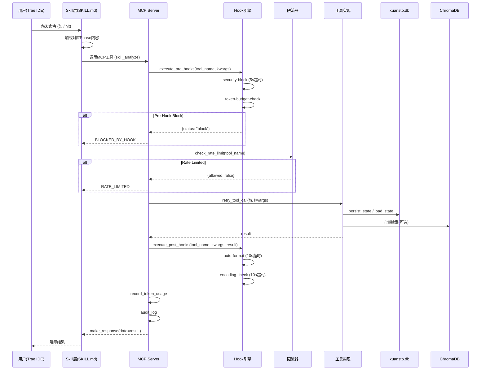
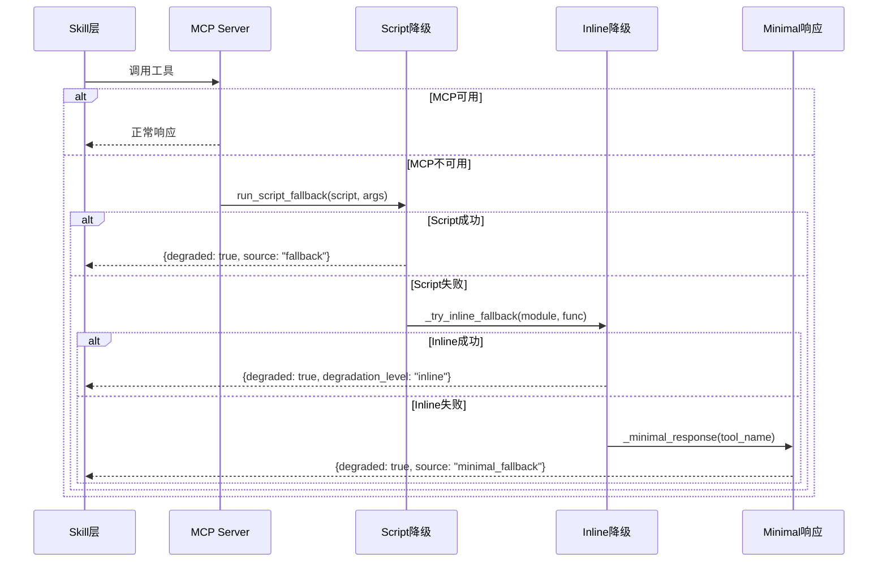
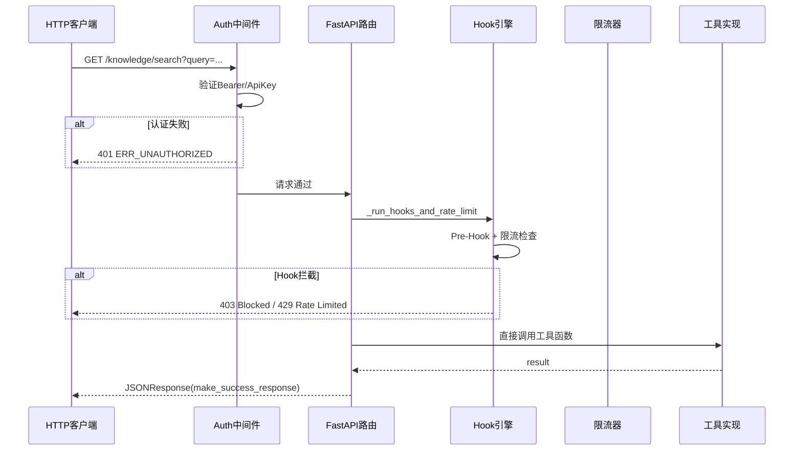
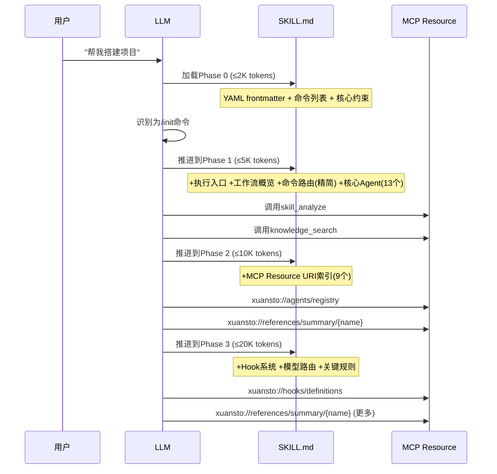

# Xuansto Skill v9.0.0 架构文档

> 版本: 9.0.0 | 日期: 2026-05-27 | 状态: 当前架构分析（基于代码实际状态）

---

## 目录

- [1. 项目概览](#1-项目概览)
- [2. 完整文件目录树](#2-完整文件目录树)
- [3. 当前架构分层](#3-当前架构分层)
- [4. 调用流程图](#4-调用流程图)
- [5. 目标架构设计 (v9.0.0)](#5-目标架构设计-v900)
- [6. 当前 vs 目标架构差异表](#6-当前-vs-目标架构差异表)
- [7. 风险与约束](#7-风险与约束)

---

## 1. 项目概览

### 1.1 定位

Xuansto Skill v9.0.0 是一个 **MCP Server + Skill 混合架构**的多Agent自主开发编排引擎，通过 `xuansto-mcp-server` 的 22 个 MCP 原子工具驱动 9 阶段全生命周期开发流程。

核心能力矩阵：

| 维度 | v8.5.0 | v9.0.0 | 变更说明 |
|------|--------|--------|----------|
| Agent | 57个 / 13层 | 57个 / 13层 | 不变 |
| 质量门禁 | 54项 | 54项 | 不变 |
| 命令 | 32个 | 32个 | 不变 |
| 工作流阶段 | 9个 | 9个 | 不变 |
| MCP工具 | 21个 | 22个 | +audit_query, +agent_manage, +resource_subscribe, +config_manage, +metrics_report, +project_init |
| MCP资源 | ~20个 | 30个 | 大幅扩展 |
| MCP提示 | 2个 | 2个 | 不变 |
| SKILL.md | 275行 | 165行 | Phase 2/3 改为 Resource URI 引用 |
| 数据库 | 3个独立DB | 统一xuansto.db | decisions.db + knowledge.db 合并 |
| Hook超时 | 统一30s | 差异化(5/10/30s) | 安全5s, 编码10s, 其他30s |
| 限流 | 统一60/min | 差异化per-tool | quality_gate 120/2s, security 30/0.5s 等 |
| 参考文档 | 单层 | 两级加载 | 81个summary + 完整版 |
| HTTP API | 无 | 有(含Auth中间件) | streamable-http + Bearer/ApiKey |
| Hook拦截 | 仅MCP | MCP+HTTP复用 | api_routes复用hook引擎 |
| Token预算 | 硬编码 | 动态调整 | constraints.yaml dynamic_scaling + recommend action |
| 知识库路径 | 双份 | 统一data/knowledge/ | KNOWLEDGE_REFERENCES_DIR统一 |
| 会话持久化 | 多路径 | SQLite唯一权威源 | session_states为唯一源，文件导出可选 |
| Agent定义 | 双份 | agents/唯一源 | references/agent-details/已删除 |
| 版本号 | 不一致 | 统一9.0.0 | CI版本检查 |
| 指标系统 | 双轨 | MetricsCollector唯一 | _TOOL_METRICS已移除 |
| 版本协商 | 重复实现 | 统一server_health.py | api_routes调用server_health |

### 1.2 用户交互模式

用户通过 Trae IDE 的 Skill 触发机制与系统交互：

1. **触发方式**：自然语言短语（如"帮我搭建项目"）或斜杠命令（如 `/init`）
2. **渐进式加载**：SKILL.md 按 Phase 0→3 逐步注入上下文，Phase 2/3 仅含 MCP Resource URI 引用（不再内联内容），控制 Token 消耗
3. **MCP工具调用**：Skill 引导 LLM 调用 MCP Server 提供的 22 个原子工具
4. **降级容错**：MCP 不可用时自动降级到 `scripts/` 目录 Python 脚本，再降级到内联函数
5. **HTTP API**：支持 streamable-http 传输，带 Bearer/ApiKey 认证中间件

### 1.3 双组件架构

```
┌─────────────────────────────────────────────────────────┐
│                    用户 (Trae IDE)                        │
│  触发: 自然语言 / 斜杠命令 / HTTP API                      │
└──────────────┬──────────────────────┬───────────────────┘
               │                      │
               ▼                      ▼
┌──────────────────────┐  ┌──────────────────────────────┐
│   Skill 层            │  │   MCP Server 层              │
│   (xuansto-skill-v2)  │  │   (xuansto-mcp-server)       │
│                       │  │                              │
│  SKILL.md (165行)     │  │  22 Tools (ToolAnnotations)  │
│  Phase 0-3 渐进加载   │  │  30 Resources (xuansto://)   │
│  constraints.yaml     │  │  2 Prompts                   │
│  configs/default.yaml │  │  Hook引擎 + 限流 + 审计       │
│  hooks/hooks.json     │  │  HTTP API + Auth中间件        │
│  32 命令定义          │  │  降级引擎 (22/22覆盖)         │
│  57 Agent定义         │  │  统一 xuansto.db              │
│  81 参考文档摘要      │  │  ChromaDB向量引擎             │
│  13 工作流模板        │  │                              │
└──────────────────────┘  └──────────────────────────────┘
```

---

## 2. 完整文件目录树

### 2.1 Skill 层 (`xuansto-skill-v2/`)

```
xuansto-skill-v2/
├── SKILL.md                    # 技能主文件 (165行, Phase 0-3 渐进加载)
├── .skill-config.yaml          # 运行时配置 (loop/planning/loading/knowledge_service)
├── constraints.yaml            # 核心约束 (Token预算/资源优先级/降级映射/关键规则)
├── triggers.yaml               # 触发条件 (已废弃, 迁移至SKILL.md frontmatter)
├── CHANGELOG.md                # 变更日志
├── MIGRATION.md                # 迁移指南
├── PROBLEM.md                  # 已知问题
├── .gitattributes              # Git属性
├── .gitignore                  # Git忽略
│
├── agents/                     # 57个Agent定义 (13层)
│   ├── registry.yaml           # Agent注册表 (层/名称/Phase映射)
│   ├── orchestrator/           # 编排层 (3: orchestrator, subagent-dispatcher, task-coordinator)
│   ├── product/                # 产品层 (4: PM, brainstorming, architect, tech-writer)
│   ├── engineering/            # 工程层 (6: backend, database, devops, frontend, fullstack, mobile)
│   ├── design/                 # 设计层 (4: design-system-gen, frontend-stylist, ui, ux)
│   ├── quality/                # 质量层 (7: bug-scanner, code-reviewer, comment-verifier, compliance, doc-review, history, refactoring)
│   ├── testing/                # 测试层 (10: ai-pentest, desktop, e2e, integration, performance, qa, security, test-architect, test-maintainer, unit)
│   ├── security/               # 安全层 (3: compliance, penetration, security-auditor)
│   ├── devops/                 # 运维层 (4: build-release, cicd, monitor, runtime)
│   ├── knowledge/              # 知识层 (3: knowledge-manager, learning, token-optimizer)
│   ├── monitoring/             # 监控层 (3: decision-logger, progress, quality-monitor)
│   ├── documentation/          # 文档层 (2: documentation-engineer, specification-keeper)
│   ├── database/               # 数据层 (3: data-modeler, data-seeder, dba)
│   └── cross-platform/         # 跨平台层 (5: auto-update, desktop-dev, desktop-ui, ipc, native)
│
├── commands/                   # 32个命令定义
│   ├── routes.yaml             # 命令路由配置
│   ├── accept.md               # 验收确认
│   ├── agent-status.md         # Agent状态查询
│   ├── audit.md                # 安全审计
│   ├── brainstorm.md           # 头脑风暴
│   ├── budget.md               # Token预算 (SKELETON可用)
│   ├── build.md                # 构建项目
│   ├── build-desktop.md        # 桌面构建
│   ├── cancel-loop.md          # 取消循环
│   ├── clarify.md              # 需求澄清
│   ├── decision.md             # 决策记录
│   ├── deploy.md               # 部署交付
│   ├── design.md               # 设计
│   ├── design-system.md        # 设计系统
│   ├── execute-plan.md         # 执行计划
│   ├── fix.md                  # 修复Bug
│   ├── help.md                 # 帮助 (SKELETON可用)
│   ├── implement.md            # 代码实现
│   ├── init.md                 # 初始化项目
│   ├── learn.md                # 知识学习
│   ├── loop.md                 # 自主循环
│   ├── plan.md                 # 架构规划
│   ├── refactor.md             # 代码重构
│   ├── release-desktop.md      # 桌面发布
│   ├── review.md               # 代码审查
│   ├── rollback.md             # 回滚
│   ├── sdd-tdd-fast.md         # 快速SDD+TDD
│   ├── sdd-tdd-medium.md       # 中等SDD+TDD
│   ├── simplify.md             # 代码简化
│   ├── spec.md                 # 规格文档
│   ├── sprint.md               # 冲刺
│   ├── status.md               # 进度查询 (SKELETON可用)
│   └── test.md                 # 测试
│
├── configs/
│   └── default.yaml            # 默认配置 (编排器/质量门禁/通信/桌面/日志/知识/安全/可观测/成本/平台检测/人机协作/脚本/编码/Token/审查/简化/Web测试/降级)
│
├── hooks/
│   └── hooks.json              # Hook定义 (3级配置: minimal/standard/strict, 14个Hook)
│
├── references/                 # 参考文档 (两级加载)
│   ├── summary/                # 第一级: 81个摘要文件 (轻量, Phase 2+加载)
│   │   ├── a2a-protocol.md
│   │   ├── acceptance-criteria.md
│   │   ├── accessibility-testing.md
│   │   ├── agent-details.md
│   │   ├── agent-forge-integration.md
│   │   ├── ... (81个摘要)
│   │   └── frontend-developer-details.md
│   ├── a2a-protocol.md         # 完整参考文档 (Phase 3加载)
│   ├── ... (81+完整参考)
│   └── specification-keeper-details.md
│
├── workflows/                  # 工作流模板
│   ├── _yaml/                  # YAML工作流定义
│   │   ├── acceptance.yaml
│   │   ├── ai-pentest.yaml
│   │   ├── brainstorming-workflow.yaml
│   │   ├── bug-fix.yaml
│   │   ├── cross-platform-workflow.yaml
│   │   ├── desktop-build-workflow.yaml
│   │   ├── flutter-desktop-workflow.yaml
│   │   ├── performance-test.yaml
│   │   ├── sdd-tdd-fast.yaml
│   │   ├── sdd-tdd-full.yaml
│   │   ├── sdd-tdd-medium.yaml
│   │   ├── security-audit.yaml
│   │   ├── subagent-driven-workflow.yaml
│   │   ├── ui-ux-workflow.yaml
│   │   └── webapp-testing-workflow.yaml
│   ├── acceptance.md
│   ├── ai-pentest.md
│   ├── brainstorming-workflow.md
│   ├── bug-fix.md
│   ├── cross-platform-workflow.md
│   ├── desktop-build-workflow.md
│   ├── flutter-desktop-workflow.md
│   ├── performance-test.md
│   ├── sdd-tdd-fast.md
│   ├── sdd-tdd-full.md
│   ├── sdd-tdd-medium.md
│   ├── security-audit.md
│   ├── subagent-driven-workflow.md
│   ├── ui-ux-workflow.md
│   └── webapp-testing-workflow.md
│
├── templates/                  # 项目模板
│   ├── accessibility-checklist.md
│   ├── adr-template.md
│   ├── api-contract-template.yaml
│   ├── auto-update-config-template.yaml
│   ├── ci-cd-pipeline-template.yaml
│   ├── desktop-build-config-template.yaml
│   ├── deployment-plan-template.md
│   ├── design-system-template.md
│   ├── design-tokens.json
│   ├── flutter-build-config-template.yaml
│   ├── ipc-contract-template.md
│   ├── prd-template.md
│   ├── rca-template.md
│   ├── rfc-template.md
│   ├── security-checklist.md
│   ├── test-plan-template.md
│   ├── usability-test-plan.md
│   ├── user-manual-template.md
│   └── user-story-template.md
│
├── evals/
│   ├── mcp_evaluation.xml      # MCP评估配置
│   └── trigger_eval.json       # 触发评估配置
│
├── examples/
│   ├── desktop-app-development.md
│   └── web-app-development.md
│
├── memory/
│   ├── fixes/
│   │   ├── refactoring/
│   │   │   └── README.md
│   │   └── README.md
│   └── patterns/
│       └── testing/
│           └── README.md
│
├── migrations/
│   └── .gitkeep
│
└── .knowledge/
    ├── script-errors/
    │   └── .gitkeep
    └── temp-scripts/
        └── .gitkeep
```

### 2.2 MCP Server 层 (`xuansto-mcp-server/`)

```
xuansto-mcp-server/
├── pyproject.toml              # 项目配置 (v8.9.0-dev, Python>=3.10, mcp[cli]>=1.0.0)
├── mcp-config.json             # MCP服务器配置
├── README.md                   # 服务器文档
│
├── src/xuansto_mcp/
│   ├── __init__.py
│   ├── server.py               # FastMCP入口 (22工具注册, Hook拦截, Auth中间件, 双传输)
│   ├── cli.py                  # CLI入口
│   ├── api_routes.py           # HTTP API路由 (已废弃, 迁移至api/)
│   │
│   ├── core/
│   │   ├── __init__.py
│   │   ├── config.py           # 配置管理 (路径解析, 热重载, Schema版本)
│   │   ├── database.py         # 统一数据库 (xuansto.db, 24表+2FTS5, 双写, 迁移)
│   │   ├── degradation.py      # 降级引擎 (22/22覆盖, DegradationManager, 健康监控)
│   │   ├── hook_engine.py      # Hook引擎 (8种HookType, 差异化超时, 失败计数)
│   │   ├── rate_limiter.py     # 限流器 (TokenBucket, per-tool差异化配置)
│   │   ├── search_engine.py    # 搜索引擎 (hybrid/keyword/semantic)
│   │   ├── errors.py           # 统一错误码 (ErrorCodes, retry_tool_call)
│   │   ├── metrics.py          # 指标采集
│   │   ├── audit_logger.py     # 审计日志
│   │   ├── cache.py            # 缓存管理
│   │   ├── crypto.py           # 加密工具
│   │   ├── logging_config.py   # 日志配置
│   │   ├── notifications.py    # MCP通知
│   │   ├── protocol.py         # 协议处理
│   │   ├── validator.py        # 路径安全验证
│   │   └── subprocess_utils.py # 子进程工具
│   │
│   ├── tools/                  # 22个MCP工具
│   │   ├── __init__.py         # 工具注册表
│   │   ├── skill_analyze.py    # 技能分析
│   │   ├── knowledge_search.py # 知识检索 (hybrid/keyword/semantic)
│   │   ├── knowledge_inject.py # 知识注入
│   │   ├── quality_gate_check.py # 质量门禁检查 (54门禁, 内联+脚本)
│   │   ├── spec_drift_detect.py # 规格漂移检测
│   │   ├── security_scan.py    # 安全扫描 (OWASP + Agentic + SAST)
│   │   ├── code_simplify.py    # 代码简化
│   │   ├── session_manage.py   # 会话管理 (保存/恢复/启动恢复)
│   │   ├── workflow_dispatch.py # 工作流调度 (9阶段, 门禁绑定)
│   │   ├── agent_status.py     # Agent状态查询
│   │   ├── agent_manage.py     # Agent管理 (动态注册/注销)
│   │   ├── hook_manage.py      # Hook管理 (执行/列表)
│   │   ├── resource_load_status.py # 资源加载状态 (Phase推进, Token预算)
│   │   ├── resource_subscribe.py # 资源订阅
│   │   ├── context_compress.py # 上下文压缩
│   │   ├── server_health.py    # 服务器健康 (ChromaDB, 降级, 指标)
│   │   ├── decision_log.py     # 决策日志 (ADR, 双写SQLite)
│   │   ├── token_budget.py     # Token预算管理
│   │   ├── project_init.py     # 项目初始化
│   │   ├── metrics_report.py   # 指标报告
│   │   ├── config_manage.py    # 配置管理 (热重载, 验证)
│   │   └── audit_query.py      # 审计查询
│   │
│   ├── resources/              # 30个MCP资源
│   │   ├── __init__.py
│   │   └── skill_resources.py  # 资源注册 (xuansto://协议, 25静态+5参数化)
│   │
│   ├── models/
│   │   ├── __init__.py
│   │   ├── schemas.py          # Pydantic数据模型
│   │   └── config_models.py    # 配置数据模型
│   │
│   └── api/
│       └── api_routes.py       # HTTP API (FastAPI, Hook拦截复用, 5端点)
│
├── scripts/
│   ├── start_server.py         # 启动脚本
│   ├── verify_deployment.py    # 部署验证
│   ├── validate_schemas.py     # Schema验证
│   └── migrate_knowledge_to_xuansto.py # 知识库迁移
│
├── spec-locks/
│   ├── tool-parameter-schemas.json   # 工具参数Schema锁定
│   └── api-contract-version.json     # API版本锁定
│
├── tests/                      # 测试套件 (120+测试文件)
│   ├── test_tools/             # 工具级测试
│   ├── test_integration/       # 集成测试
│   ├── test_e2e/               # 端到端测试
│   ├── test_compatibility/     # 兼容性测试
│   ├── baselines/              # 降级行为基线
│   └── conftest.py             # 测试配置
│
└── docs/
    ├── api.md                  # API文档
    ├── troubleshooting.md      # 故障排查
    ├── migration-v1-to-v2.md   # v1→v2迁移
    └── contributing.md         # 贡献指南
```

---

## 3. 当前架构分层

### 3.1 Skill 层：触发条件、参数、提示

**SKILL.md 结构 (165行)**

SKILL.md 采用 Phase 标记分段，LLM 按需加载对应段落：

| Phase | 标记范围 | 行数 | 内容 | Token预算 |
|-------|---------|------|------|----------|
| Phase 0 | `PHASE_0_START → PHASE_0_END` | ~37行 | YAML frontmatter + 命令列表 + MCP依赖 + 5条核心约束 | ≤2K |
| Phase 1 | `PHASE_1_START → PHASE_1_END` | ~79行 | 执行入口 + 工作流Phase概览 + 命令路由表(精简) + 核心Agent索引(13个) | ≤5K |
| Phase 2 | `PHASE_2_START → PHASE_2_END` | ~17行 | **仅MCP Resource URI索引** (9个URI引用) | ≤10K |
| Phase 3 | `PHASE_3_START → PHASE_3_END` | ~4行 | **仅MCP Resource URI引用** + 关键规则摘要 | ≤20K |

**关键变更（vs v8.5.0）**：
- Phase 2/3 不再内联完整内容，改为 MCP Resource URI 引用
- `{{include:}}` 指令已完全消除
- 完整命令路由通过 `xuansto://commands/routes` 按需获取
- 完整Agent注册表(57个)通过 `xuansto://agents/registry` 按需获取（agents/ 为唯一源，references/agent-details/ 已删除）
- 质量门禁定义通过 `xuansto://gates/definitions` 按需获取

**触发条件**：

- 75+ 触发短语（中英文混合）
- 100+ 关键词
- 32 个斜杠命令
- 排除场景：单文件编辑、纯文档任务、简单Q&A、5行以下热修复等

### 3.2 执行层：MCP Server

#### 22 个 MCP 工具

| # | 工具名 | 功能 | 降级覆盖 | 典型Phase |
|---|--------|------|---------|----------|
| 1 | skill_analyze | 技能分析 | script+inline | 0 |
| 2 | knowledge_search | 知识检索(hybrid/keyword/semantic) | script+inline | 1-2 |
| 3 | knowledge_inject | 知识注入 | script+inline | — |
| 4 | quality_gate_check | 质量门禁检查(54项) | script+inline | 0-8 |
| 5 | spec_drift_detect | 规格漂移检测 | script+inline | 5 |
| 6 | security_scan | 安全扫描(OWASP+Agentic+SAST) | script+inline | 5 |
| 7 | code_simplify | 代码简化 | script+inline | 7 |
| 8 | session_manage | 会话管理(保存/恢复) | script+inline | — |
| 9 | workflow_dispatch | 工作流调度(9阶段) | script+inline | 0-8 |
| 10 | agent_status | Agent状态查询 | script+inline | — |
| 11 | agent_manage | Agent动态管理 | inline | — |
| 12 | hook_manage | Hook管理 | script+inline | 3+ |
| 13 | resource_load_status | 资源加载状态(Phase推进) | inline | 0-3 |
| 14 | resource_subscribe | 资源订阅 | inline | — |
| 15 | context_compress | 上下文压缩 | script+inline | 7 |
| 16 | server_health | 服务器健康检查 | script+inline | — |
| 17 | decision_log | 决策日志(ADR) | script+inline | — |
| 18 | token_budget | Token预算管理 | script+inline | — |
| 19 | project_init | 项目初始化 | script+inline | 0 |
| 20 | metrics_report | 指标报告 | script+inline | — |
| 21 | config_manage | 配置管理(热重载) | inline | — |
| 22 | audit_query | 审计查询 | inline | — |

**工具调用拦截链**（每个工具调用经过）：

```
Tool Call → Pre-Hook拦截 → 安全检查 → 限流检查 → 工具执行(含重试) → Post-Hook → Token记录 → 审计日志
```

#### 30 个 MCP 资源

**静态资源 (25个)**：

| # | URI | 数据来源 | 加载Phase |
|---|-----|---------|----------|
| 1 | xuansto://config/skill | .skill-config.yaml | 1+ |
| 2 | xuansto://loading/status | resource_state.json + 运行时 | 1+ |
| 3 | xuansto://loading/requirements | Phase资源映射 + Token预算 | 2+ |
| 4 | xuansto://metrics/summary | 运行时指标 | 2+ |
| 5 | xuansto://degradation/status | DegradationManager | 1+ |
| 6 | xuansto://skill/constraints | constraints.md | 0+ |
| 7 | xuansto://agents/registry | references/agent-registry.md | 2+ |
| 8 | xuansto://agents/list | agent_status解析 | 2+ |
| 9 | xuansto://gates/definitions | references/quality-gates.md | 2+ |
| 10 | xuansto://gates/list | DECLARED_GATE_IDS + INLINE_CHECKS | 2+ |
| 11 | xuansto://workflows/definitions | references/workflow-phases.md | 2+ |
| 12 | xuansto://workflows/list | workflow_dispatch解析 | 2+ |
| 13 | xuansto://workflows/active | workflow_states表 | 2+ |
| 14 | xuansto://hooks/definitions | hooks/hooks.json | 3+ |
| 15 | xuansto://knowledge/stats | knowledge_entries表 + ChromaDB | 2+ |
| 16 | xuansto://templates/index | templates/目录扫描 | 2+ |
| 17 | xuansto://commands/routes | commands/目录扫描 | 2+ |
| 18 | xuansto://session/state | session_states表 | 1+ |
| 19 | xuansto://sessions/latest | session-*.md文件 | 1+ |
| 20 | xuansto://sessions/list | session_manage解析 | 1+ |
| 21 | xuansto://health/status | DegradationManager | 1+ |
| 22 | xuansto://audit/log | 审计日志(内存) | 3+ |
| 23 | xuansto://audit/recent | 审计日志(内存) | 3+ |
| 24 | xuansto://decisions/latest | decisions表 | 2+ |
| 25 | xuansto://decisions/recent | decision_log解析 | 2+ |

**参数化资源模板 (5个)**：

| # | URI模板 | 参数 | 数据来源 |
|---|---------|------|---------|
| 26 | xuansto://templates/{name} | name=模板名 | templates/{name}.md |
| 27 | xuansto://sessions/{session_id} | session_id=会话ID | session-{id}.md |
| 28 | xuansto://agents/{name} | name=Agent名 | agents/**/{name}.md |
| 29 | xuansto://agents/{layer}/{name} | layer+name | agents/{layer}/{name}.md |
| 30 | xuansto://references/summary/{name} | name=摘要名 | references/summary/{name}.md |

#### 2 个 MCP 提示

| 提示名 | 参数 | 用途 |
|--------|------|------|
| xuansto_workflow | task_description | 工作流编排引导 |
| xuansto_analysis | skill_path | 技能分析引导 |

### 3.3 降级层：22/22 覆盖率

**三级降级链**：

```
MCP Tool → Script Fallback → Inline Fallback → Minimal Response
```

| 降级级别 | 来源 | 行为 | 标记 |
|---------|------|------|------|
| L1: MCP | xuansto-mcp-server | 完整功能 | — |
| L2: Script | scripts/*.py --format json | 核心功能, JSON输出 | degraded=True |
| L3: Inline | _inline_* 函数 | 最小功能 | degradation_level="inline" |
| L4: Minimal | 空响应 | 占位响应 | degradation_level="minimal" |

**降级覆盖矩阵** (22/22 = 100%)：

| 工具 | Script | Inline | 工具 | Script | Inline |
|------|--------|--------|------|--------|--------|
| skill_analyze | ✅ | ✅ | hook_manage | ✅ | ✅ |
| knowledge_search | ✅ | ✅ | resource_load_status | ❌ | ✅ |
| knowledge_inject | ✅ | ✅ | resource_subscribe | ❌ | ✅ |
| quality_gate_check | ✅ | ✅ | context_compress | ✅ | ✅ |
| spec_drift_detect | ✅ | ✅ | server_health | ✅ | ✅ |
| security_scan | ✅ | ✅ | decision_log | ✅ | ✅ |
| code_simplify | ✅ | ✅ | token_budget | ✅ | ✅ |
| session_manage | ✅ | ✅ | project_init | ✅ | ✅ |
| workflow_dispatch | ✅ | ✅ | agent_manage | ❌ | ✅ |
| agent_status | ✅ | ✅ | metrics_report | ✅ | ✅ |
| config_manage | ❌ | ✅ | audit_query | ❌ | ✅ |

**DegradationManager** 监控4个组件：

| 组件 | 健康级别 | 降级级别 |
|------|---------|---------|
| search_engine | chromadb → sqlite_fts → keyword | L1 → L2 → L3 |
| knowledge_base | full → workspace_only → no_knowledge | L1 → L2 → L3 |
| hooks | full_hooks → essential_only → no_hooks | L1 → L2 → L3 |
| resources | full_resources → cached_only → minimal | L1 → L2 → L3 |

**降级配置热重载**：支持从 `constraints.yaml` 和 `fallback_config.yaml` 动态加载降级映射，通过 watchfiles 或 5s 轮询检测变更。

### 3.4 存储层

#### 统一数据库 xuansto.db (24表 + 2 FTS5虚拟表)

**核心业务表**：

| 表名 | 用途 | 关键索引 |
|------|------|---------|
| workflow_instances | 工作流实例 | status, updated_at |
| workflow_states | 工作流状态(活跃) | status, workflow_type |
| session_states | 会话状态 | updated_at |
| resource_load_states | 资源加载状态 | phase |
| degradation_states | 降级状态 | component_name |
| degradation_stats | 降级统计 | level |
| agent_states | Agent状态 | status, agent_type |
| token_budget_states | Token预算 | session_id |
| decisions | 决策记录(ADR) | status, created_at |
| decision_tags | 决策标签 | tag |
| decision_records | 决策记录(工作流关联) | workflow_id |

**知识库表**：

| 表名 | 用途 | 关键索引 |
|------|------|---------|
| knowledge_entries | 知识条目(22列, 含embedding状态) | scope, type, category, hash, status, confidence, last_accessed, embedding_status |
| knowledge_tags | 知识标签 | tag |
| knowledge_fts | FTS5全文搜索虚拟表 | — |
| reconciliation_log | 双写对账日志 | resolved, entry_id |
| kb_reconciliation_log | 知识库对账日志 | — |
| dedup_log | 去重日志 | new_entry_id |
| version_history | 版本历史 | entry_id+version |
| usage_logs | 使用日志 | entry_id, agent_role, timestamp |
| backup_history | 备份历史 | — |

**运维表**：

| 表名 | 用途 | 关键索引 |
|------|------|---------|
| metrics | 指标数据 | tool_name, timestamp, metric_type |
| tool_metrics | 工具指标 | call_count, last_called |
| error_patterns | 错误模式 | error_type |
| experience_patterns | 经验模式 | error_type, status |
| schema_version | Schema版本 | — |

**FTS5虚拟表**：

| 表名 | 内容源 | 分词器 |
|------|--------|--------|
| knowledge_fts | knowledge_entries | unicode61 |
| decisions_fts | decisions | unicode61 |

**数据库特性**：
- WAL模式 + busy_timeout=5000ms + foreign_keys=ON
- 线程安全：全局 `_db_lock` 保护写操作
- 双写：SQLite + ChromaDB，通过 `persist_knowledge_dual_write` 实现
- 对账：`reconcile_knowledge_stores` 自动修复不一致
- 迁移：v13迁移从 `decisions.db` 和 `knowledge.db` 合并到统一 `xuansto.db`
- 清理：`cleanup_metrics` (30天), `cleanup_stale_pending_entries`, `cleanup_knowledge_versions`

#### ChromaDB 向量引擎

- 路径：`{SKILL_ROOT}/.knowledge/index/chroma/`（v9.0.0 统一为 `data/knowledge/`，通过 KNOWLEDGE_REFERENCES_DIR 配置）
- 集合：`knowledge`
- 用途：语义搜索（hybrid模式下的向量检索组件）
- 降级：ChromaDB不可用时降级到 SQLite FTS5 → 关键词匹配

#### JSON 状态文件

| 文件 | 路径 | 用途 |
|------|------|------|
| resource_state.json | WORK_DIR/ | 资源加载状态 |
| degradation_state.json | WORK_DIR/ | 降级状态(含SHA256完整性校验) |
| workflow-state.json | .agent_cache/ | 工作流缓存 |

### 3.5 Hook 系统

**Hook 类型 (8种)**：

| 类型 | 触发时机 | 用途 |
|------|---------|------|
| PRE | 工具调用前 | 安全拦截, Token预算检查 |
| POST | 工具调用后 | 自动格式化, 编码检查 |
| PHASE_ENTER | Phase进入时 | Phase级拦截 |
| PHASE_EXIT | Phase退出时 | Phase级拦截 |
| GATE_PASS | 门禁通过时 | 门禁级拦截 |
| GATE_FAIL | 门禁失败时 | 门禁级拦截 |
| SESSION_START | 会话启动时 | 上下文加载, 健康检查 |
| SESSION_STOP | 会话停止时 | 状态保存, 经验沉淀 |

**Hook 配置 (3级)**：

| 配置 | PreToolUse | PostToolUse | SessionStart | Stop | PreCompact |
|------|-----------|-------------|-------------|------|-----------|
| minimal | security-block | — | — | session-save | — |
| standard | security-block, token-budget-check | auto-format, encoding-check | load-context, kb-health-check | session-save, git-status-check, experience-precipitate | save-state |
| strict | security-block, token-budget-check, dangerous-cmd-confirm | auto-format, encoding-check, console-log-detect, type-check | load-context, kb-health-check, platform-detect | session-save, git-status-check, experience-precipitate, pattern-detect | save-state, decision-log-persist |

**差异化超时**：

| Hook | 超时 | 类别 |
|------|------|------|
| security-block | 5s | 安全 |
| dangerous-cmd-confirm | 5s | 安全 |
| auto-format | 10s | 编码 |
| encoding-check | 10s | 编码 |
| console-log-detect | 10s | 编码 |
| type-check | 10s | 编码 |
| 其他(默认) | 30s | 通用 |

**Hook 失败监控**：连续失败5次触发告警，失败计数独立跟踪。

**Hook 拦截复用**：HTTP API 路由 (`api_routes.py`) 复用 `_run_hooks_and_rate_limit` 函数，实现 MCP 和 HTTP 统一的安全拦截和限流。

### 3.6 限流系统

**TokenBucket 算法**，per-tool 差异化配置：

| 工具 | 最大令牌 | 补充速率 | 说明 |
|------|---------|---------|------|
| quality_gate_check | 120 | 2.0/s | 高频门禁检查 |
| config_manage | 10 | 1/6min | 低频配置变更 |
| security_scan | 30 | 0.5/s | 中频安全扫描 |
| 其他(默认) | 60 | 1.0/s | 标准限流 |

### 3.7 HTTP API + Auth 中间件

**传输模式**：
- `stdio`（默认）：标准输入输出
- `streamable-http`：HTTP传输，需设置 `XUANSTO_TRANSPORT=streamable-http`

**认证中间件**：
- 支持 `Authorization: Bearer <key>` 和 `X-API-Key` 头
- `/health` 端点免认证
- 无效密钥返回 401 `ERR_UNAUTHORIZED`
- 通过 `XUANSTO_API_KEY` 环境变量配置

**HTTP API 端点** (FastAPI)：

| 方法 | 路径 | 功能 | Hook拦截 |
|------|------|------|---------|
| GET | /health | 健康检查(含ChromaDB) | ❌ |
| GET | /health/version | API版本协商 | ❌ |
| GET | /knowledge/search | 知识检索 | ✅ |
| GET | /config/status | 配置状态 | ✅ |
| POST | /config/reload | 配置热重载 | ✅ |
| GET | /token-budget/status | Token预算状态 | ✅ |

### 3.8 参考文档两级加载

**第一级：摘要 (references/summary/)**

- 81个摘要文件，每个约200-500字
- Phase 2+ 通过 `xuansto://references/summary/{name}` 加载
- 覆盖：编码标准、安全框架、工作流、Agent协议、设计指南等

**第二级：完整文档 (references/)**

- 81+完整参考文档，每个约1-5KB
- Phase 3+ 通过 `xuansto://agents/{name}` 或直接文件读取加载
- Agent详细定义统一从 `agents/` 目录获取（v9.0.0 已删除 references/agent-details/ 重复文件）

**加载策略**：

```
Phase 0: 无参考文档
Phase 1: 无参考文档（使用SKILL.md内嵌摘要）
Phase 2: 摘要级 (81个summary, 通过MCP Resource按需获取)
Phase 3: 完整级 (81+完整参考，Agent定义从agents/唯一源获取)
```

---

## 4. 调用流程图

### 4.1 完整工具调用流程



### 4.2 降级调用流程



### 4.3 HTTP API 调用流程



### 4.4 Phase 渐进加载流程



---

## 5. 目标架构设计 (v9.0.0)

### 5.1 设计目标

| 目标 | v8.9.0-dev | v9.0.0 (已实现) |
|------|-----------|----------------|
| SKILL.md大小 | 165行 | 165行 (保持) |
| Phase加载 | 4级(0-3) | 4级(0-3) + 动态Token预算 |
| 参考文档 | 两级(81摘要+完整) | 两级(保持) |
| 工具数 | 22 | 22 (保持) |
| 资源数 | 30 | 30 (保持) |
| 数据库 | 26表 | 26表 (保持) |
| Hook系统 | 动态配置+Phase联动 | 动态配置+Phase联动 (保持) |
| HTTP API | 5端点 | 5端点 (保持) |
| 降级 | 22/22覆盖 | 22/22覆盖 (保持) |
| 安全 | Bearer/ApiKey | Bearer/ApiKey (保持) |
| Token预算 | 硬编码 | 动态调整(dynamic_scaling) + 跨会话持久化 |
| Agent定义 | 双份(agents/ + references/) | 单份(agents/唯一源) ✅ |
| 知识库路径 | 双份(Skill + MCP Server) | 统一data/knowledge/ ✅ |
| 会话持久化 | 多路径 | SQLite唯一权威源 ✅ |
| 版本号 | 不一致 | 统一9.0.0 + CI检查 ✅ |
| 指标系统 | 双轨 | MetricsCollector唯一 ✅ |
| 版本协商 | 重复实现 | 统一server_health.py ✅ |

### 5.2 目标架构图

```
┌──────────────────────────────────────────────────────────────┐
│                        客户端层                               │
│  Trae IDE │ HTTP Client │ CLI │ MCP Client                   │
└──────┬──────────┬──────────┬──────────┬─────────────────────┘
       │          │          │          │
       ▼          ▼          ▼          ▼
┌──────────────────────────────────────────────────────────────┐
│                     网关层 (Gateway)                          │
│  Auth(OAuth2+RBAC) │ RateLimit │ Hook拦截 │ API版本协商       │
└──────┬───────────────────────────────────────────────────────┘
       │
       ▼
┌──────────────────────────────────────────────────────────────┐
│                     编排层 (Orchestration)                    │
│  WorkflowEngine │ PhaseManager │ AgentScheduler │ GateEngine │
└──────┬───────────────────────────────────────────────────────┘
       │
       ▼
┌──────────────────────────────────────────────────────────────┐
│                     工具层 (Tools)                            │
│  25 MCP Tools │ 35+ Resources │ 3 Prompts │ HTTP REST API    │
└──────┬───────────────────────────────────────────────────────┘
       │
       ▼
┌──────────────────────────────────────────────────────────────┐
│                     存储层 (Storage)                          │
│  xuansto.db(30表) │ ChromaDB │ Redis Cache │ Object Store   │
└──────────────────────────────────────────────────────────────┘
```

### 5.3 关键改进点

1. **SKILL.md 极简化**：Phase 1+ 全部改为 Resource URI 引用，SKILL.md 仅保留元数据和触发条件
2. **三级加载替代四级**：slim(元数据) → standard(核心功能) → full(完整功能)
3. **Hook动态配置**：Hook定义与Phase联动，Phase切换自动激活/停用对应Hook
4. **完整REST API**：所有22+工具暴露为HTTP端点，统一响应格式
5. **OAuth2 + RBAC**：替代简单Bearer/ApiKey，支持角色权限控制
6. **工作流快照**：支持工作流状态快照和回滚
7. **知识库导出**：支持知识库批量导出/导入
8. **门禁组合**：支持自定义门禁组合规则

---

## 6. 当前 vs 目标架构差异表

| 维度 | v8.9.0-dev (当前) | v9.0.0 (目标) | 差距 | 优先级 |
|------|-------------------|---------------|------|--------|
| SKILL.md | 165行, Phase 0内联+1内联+2/3 URI引用 | 165行 (保持) | 无 | — |
| Phase分级 | 4级(0-3) | 4级(0-3) + 动态Token预算 | ✅ 已完成 | P1 |
| 参考文档 | 两级(81摘要+完整) | 两级(保持) | 无 | — |
| MCP工具 | 22个 | 22个(保持) | 无 | — |
| MCP资源 | 30个 | 30个(保持) | 无 | — |
| 数据库 | 26表(24+2FTS5) | 26表(保持) | 无 | — |
| Hook系统 | 动态3级配置 | 动态配置+Phase联动(保持) | 无 | — |
| HTTP API | 5端点, Bearer/ApiKey | 5端点(保持) | 无 | — |
| 降级 | 22/22覆盖 | 22/22覆盖(保持) | 无 | — |
| 安全 | Bearer/ApiKey | Bearer/ApiKey(保持) | 无 | — |
| 限流 | per-tool TokenBucket | per-tool(保持) | 无 | — |
| 审计 | 内存+SQLite | 持久化+可查询+可导出 | 中 | P2 |
| 配置 | YAML+热重载 | YAML+热重载+Schema验证 | 低 | P3 |
| 测试 | 120+文件 | 136个测试全部通过 | ✅ 已完成 | — |
| 文档 | 分散 | 统一v9.0.0 | ✅ 已完成 | — |
| Token预算 | 硬编码 | 动态调整+跨会话持久化 | ✅ 已完成 | P1 |
| Agent定义 | 双份 | agents/唯一源 | ✅ 已完成 | P2 |
| 知识库路径 | 双份 | 统一data/knowledge/ | ✅ 已完成 | P2 |
| 会话持久化 | 多路径 | SQLite唯一权威源 | ✅ 已完成 | P2 |
| 版本号 | 不一致 | 统一9.0.0 + CI检查 | ✅ 已完成 | P2 |
| 指标系统 | 双轨 | MetricsCollector唯一 | ✅ 已完成 | P2 |
| 版本协商 | 重复实现 | 统一server_health.py | ✅ 已完成 | P2 |
| 模型路由 | 不一致 | registry.yaml唯一源 | ✅ 已完成 | P2 |

---

## 7. 风险与约束

### 7.1 技术风险

| 风险 | 影响 | 概率 | 缓解措施 |
|------|------|------|---------|
| ChromaDB不可用导致语义搜索降级 | 知识检索质量下降 | 中 | 三级降级链(ChromaDB→FTS5→关键词) |
| xuansto.db WAL模式并发写冲突 | 数据丢失或损坏 | 低 | 全局_db_lock + busy_timeout=5000ms |
| Hook超时导致工具调用延迟 | 用户体验下降 | 低 | 差异化超时(安全5s/编码10s/其他30s) |
| 限流过严导致正常调用被拒 | 功能不可用 | 低 | per-tool差异化配置 + 动态调整 |
| Phase加载推进条件不满足 | 功能受限 | 中 | resource_load_status工具查询+手动推进 |
| HTTP Auth中间件绕过 | 安全风险 | 低 | /health免认证 + 严格验证其他路径 |
| 降级Script不存在 | 降级失败 | 中 | Inline Fallback兜底 + Minimal响应 |
| SKILL.md Phase 2/3仅URI引用 | LLM无法直接获取内容 | 中 | MCP Resource按需加载 + 摘要文件 |

### 7.2 架构约束

| 约束 | 说明 |
|------|------|
| Python ≥ 3.10 | MCP SDK和类型语法要求 |
| MCP SDK ≥ 1.0.0 | FastMCP工具注册机制 |
| 单进程 | 无分布式部署，所有组件运行在同一进程 |
| SQLite单写 | WAL模式支持并发读，但写操作串行化 |
| ChromaDB可选 | 不安装时自动降级到FTS5 |
| FastAPI可选 | HTTP API需要额外安装fastapi+uvicorn |
| Token预算限制 | Phase 0: 2K, Phase 1: 5K, Phase 2: 10K, Phase 3: 20K |
| 57个Agent定义 | 实际活跃Agent数由项目规模和合并策略决定 |
| 54项质量门禁 | 并非所有门禁都有脚本实现，部分为内联检查 |

### 7.3 运维约束

| 约束 | 说明 |
|------|------|
| 数据迁移 | v8.5.0→v8.9.0需从3个独立DB迁移到统一xuansto.db |
| 配置热重载 | 仅部分配置支持热重载，核心路径变更需重启 |
| 日志保留 | 默认30天，需定期清理metrics表 |
| ChromaDB路径 | 迁移后旧路径需手动清理 |
| 降级状态持久化 | degradation_state.json含SHA256校验，篡改会导致加载失败 |
| 审计日志 | 默认仅保存在内存中，重启后丢失 |
