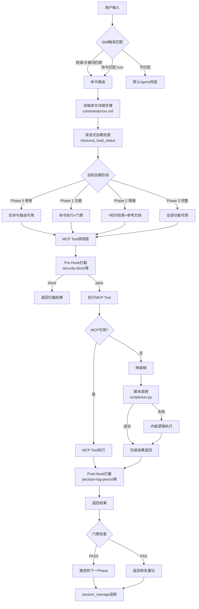
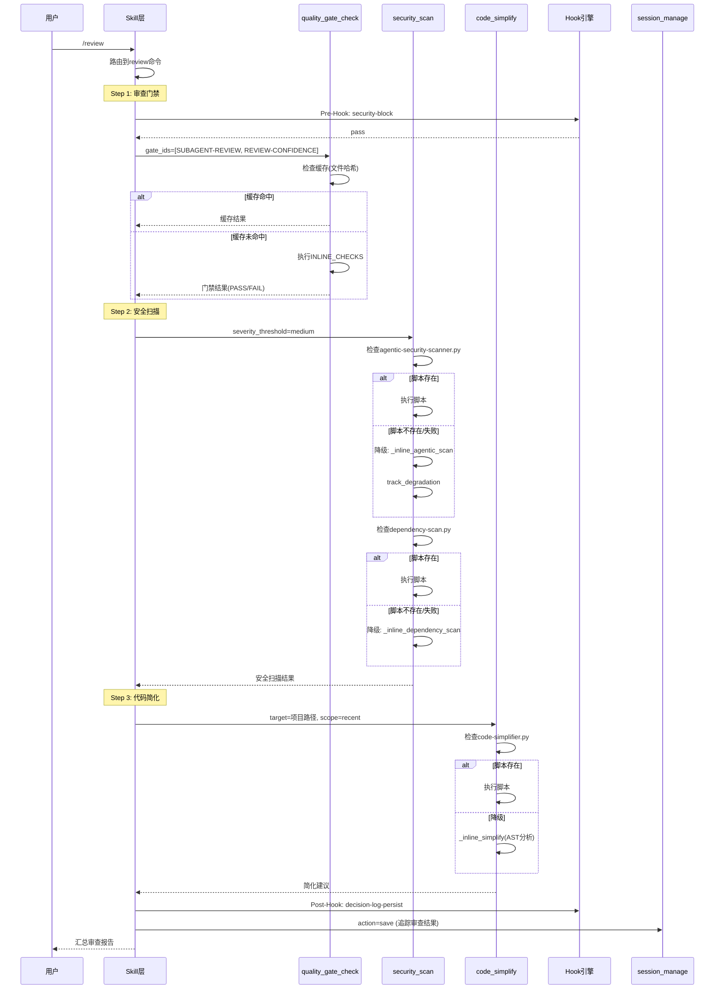
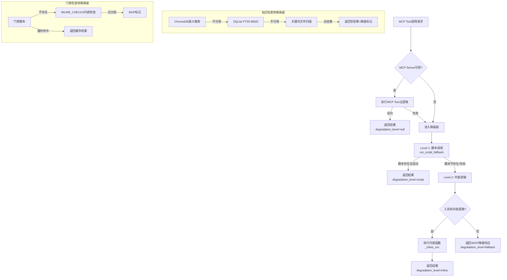
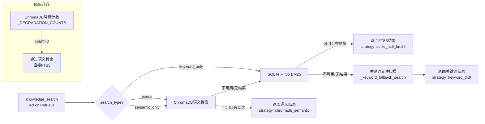
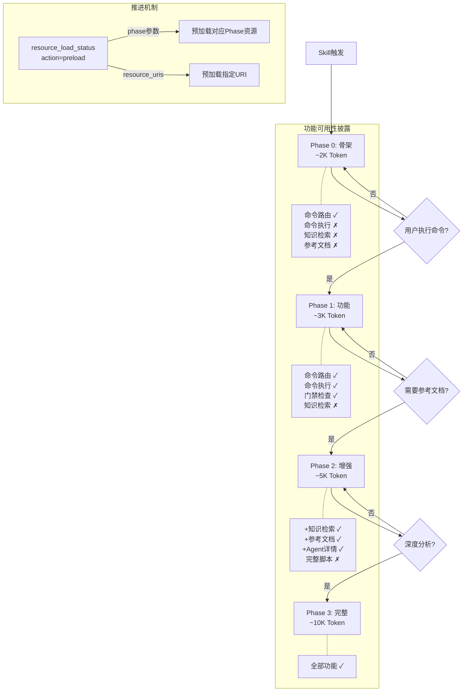

# Xuansto 架构文档

> 版本: Skill v7.0.0 | MCP Server v3.5.0 | API v1.0.0
> 最后更新: 2026-05-22

---

## 1. 项目概览

### 1.1 技能定位

Xuansto 是一个 **MCP + Skill 混合架构** 的多Agent自主开发编排引擎，通过 xuansto-mcp-server 提供的 13 个 MCP 原子工具驱动 9 阶段全生命周期开发流程。系统遵循 SDD(规格驱动开发) + TDD(测试驱动开发) 融合方法论，以规格先行、测试先行、代码最后为核心理念，实现从需求分析到部署交付的端到端自动化开发。

### 1.2 核心能力

| 维度 | 数量 | 说明 |
|------|------|------|
| MCP Tools | 13 | skill_analyze, knowledge_search, quality_gate_check, spec_drift_detect, security_scan, code_simplify, session_manage, workflow_dispatch, agent_status, hook_manage, resource_load_status, context_compress, server_health |
| MCP Resources | 7 | xuansto://config/skill, xuansto://references/quality-gates, xuansto://references/agent-registry, xuansto://references/workflow-phases, xuansto://templates/{name}, xuansto://sessions/latest, xuansto://loading/status |
| Agents | 57 | 13层编排: 编排(3)/产品(4)/设计(4)/工程(6)/跨平台(5)/数据(3)/测试(10)/安全(3)/DevOps(4)/质量(7)/文档(2)/知识(3)/监控(3) |
| Quality Gates | 54 | 覆盖9个Phase的门禁检查，含内嵌检查和脚本检查 |
| Commands | 27 | /init, /clarify, /plan, /spec, /design, /implement, /test, /review, /fix, /accept, /deploy, /build-desktop, /release-desktop, /refactor, /audit, /agent-status, /learn, /brainstorm, /execute-plan, /design-system, /simplify, /loop, /cancel-loop, /build, /status, /rollback, /sprint |
| Workflows | 15 | sdd-tdd-full/medium/fast, brainstorming, bug-fix, security-audit, desktop-build, cross-platform, ui-ux, webapp-testing, performance-test, ai-pentest, acceptance, subagent-driven, flutter-desktop |
| Scripts | 89+ | Python/JS/PS1 脚本集，覆盖编码检查、安全扫描、会话管理、知识检索等 |
| Templates | 19 | PRD, ADR, RFC, 安全检查清单, 测试计划, IPC契约, 桌面构建配置等 |

### 1.3 用户交互方式

1. **命令触发**: 用户输入 `/command` (如 `/review`, `/audit`)，Skill 层路由到对应 MCP 工具调用链
2. **语义触发**: 用户自然语言描述意图(如 "帮我搭建项目"、"做个代码审查")，Skill 层语义匹配到对应命令
3. **自主循环**: 用户执行 `/loop` 启动自主循环模式，系统自动推进 Phase 并执行门禁检查
4. **MCP Resource 访问**: 通过 URI (如 `xuansto://references/agent-registry`) 直接读取只读数据

### 1.4 已实施修复

- **FTS5 unicode61 迁移**: knowledge_search 的 SQLite FTS5 索引已从默认分词器迁移至 unicode61，支持中文分词
- **ChromaDB 路径迁移**: 从 `knowledge/index/chroma` 迁移至 `knowledge/index/chroma_db`，自动检测并迁移旧路径数据
- **知识库 Schema 迁移**: knowledge_entries 表自动检测缺失列并 ALTER TABLE 补全，确保向前兼容
- **降级计数持久化**: server_health 的降级计数和工具指标持久化至 `.xuansto/` 目录，重启后恢复
- **工作流启动恢复**: main() 启动时自动恢复未完成的工作流实例，跳过已中止和损坏的记录
- **Agent 实例持久化**: Agent 实例状态持久化至 `agent_instances.json`，重启后恢复
- **会话启动恢复**: session_manage 在启动时恢复上次追踪状态 (`current.json`)
- **Hook 拦截包装**: 所有 MCP 工具注册后自动包装 Hook 拦截层，支持 Pre/Post Hook 执行和阻断

### 1.5 版本号

| 组件 | 版本 | 说明 |
|------|------|------|
| xuansto-skill-v2 | 7.0.0 | Skill 定义层，SKILL.md + commands/ + agents/ |
| xuansto-mcp-server | 3.5.0 | MCP Server 运行时，13 Tools + 7 Resources |
| MCP API | 1.0.0 | MCP 工具接口协议版本 |

---

## 2. 文件清单与目录树

### 2.1 MCP Server 目录树

```
xuansto-mcp-server/
├── pyproject.toml                          # 项目元数据、依赖、构建配置
├── src/xuansto_mcp/
│   ├── __init__.py                         # 包初始化、版本号
│   ├── server.py                           # FastMCP 入口、工具注册、Hook拦截包装、启动流程
│   ├── cli.py                              # CLI 入口
│   ├── core/
│   │   ├── __init__.py                     # atomic_write 等共享工具
│   │   ├── config.py                       # 配置管理、路径解析、配置热重载、降级映射
│   │   ├── degradation.py                  # 13个降级回退函数、FALLBACK_MAP
│   │   ├── errors.py                       # 错误响应构建、XuanstoMCPError
│   │   ├── logging_config.py               # 日志配置
│   │   ├── subprocess_utils.py             # 脚本执行工具
│   │   └── validator.py                    # Pydantic 输入校验
│   ├── models/
│   │   └── schemas.py                      # 13个 Pydantic Input 模型定义
│   ├── resources/
│   │   └── skill_resources.py              # 7个 MCP Resource 注册(URI→文件映射)
│   ├── tools/
│   │   ├── __init__.py
│   │   ├── skill_analyze.py                # 项目结构分析、规模评估、YAML元数据提取
│   │   ├── knowledge_search.py             # 三层知识库混合检索(ChromaDB/SQLite FTS5/关键词)
│   │   ├── quality_gate_check.py           # 54项质量门禁检查(内嵌+脚本+缓存)
│   │   ├── spec_drift_detect.py            # 规格漂移检测(AST分析+关键词匹配)
│   │   ├── security_scan.py                # OWASP安全扫描+依赖漏洞扫描
│   │   ├── code_simplify.py                # 代码简化分析(AST+文本)+重复代码检测
│   │   ├── session_manage.py               # 会话状态管理(保存/加载/追踪/恢复)
│   │   ├── workflow_dispatch.py            # 工作流调度(启动/推进/中止/快照/恢复)
│   │   ├── agent_status.py                 # Agent状态查询+实例管理(create/assign/release)
│   │   ├── hook_manage.py                  # Hook管理(列出/执行) + Pre/Post Hook引擎
│   │   ├── resource_load_status.py         # 渐进式加载状态(查询/预加载/缓存/进度)
│   │   ├── context_compress.py             # 上下文压缩(semantic/selective/lossless)
│   │   └── server_health.py                # 健康检查+性能指标+降级统计+ChromaDB健康
│   └── data/                               # 运行时数据目录(与Skill共享)
│       ├── .skill-config.yaml              # 技能运行时配置
│       ├── .xuansto-config.yaml            # MCP Server配置(门禁脚本映射等)
│       ├── agents/                         # 57个Agent定义文件(.md)
│       ├── hooks/hooks.json                # Hook定义(3个profile)
│       ├── knowledge/                      # 知识库(general/workspace/experience + 索引)
│       ├── references/                     # 参考文档(100+文件)
│       ├── scripts/                        # 89+脚本(Python/JS/PS1)
│       └── templates/                      # 19个模板文件
└── tests/                                  # 测试目录
```

### 2.2 Skill v2 目录树

```
.trae/skills/xuansto-skill-v2/
├── SKILL.md                                # Skill主定义(触发条件/命令路由/MCP依赖/降级表)
├── PROBLEM.md                              # 已知问题记录
├── configs/
│   └── default.yaml                        # 默认配置(编排器/门禁/安全/知识库/成本优化等)
├── hooks/
│   └── hooks.json                          # Hook定义(minimal/standard/strict 3个profile)
├── agents/                                 # 57个Agent角色定义(.md)
│   ├── orchestrator/                       # 编排层(3): Orchestrator, Subagent Dispatcher, Task Coordinator
│   ├── product/                            # 产品层(4): PM, Brainstorming Facilitator, System Architect, Tech Writer
│   ├── design/                             # 设计层(4): Design System Generator, UX/UI Designer, Frontend Stylist
│   ├── engineering/                        # 工程层(6): Backend/DB/DevOps/Frontend/Fullstack/Mobile Developer
│   ├── cross-platform/                     # 跨平台层(5): Desktop Dev, Desktop UI Adapter, Native Module, IPC, Auto-Update
│   ├── database/                           # 数据层(3): Data Modeler, Data Seeder, DBA
│   ├── testing/                            # 测试层(10): Unit/Integration/E2E/Performance/QA/Security/Desktop/AI-Pentester等
│   ├── security/                           # 安全层(3): Security Auditor, Compliance Officer, Penetration Tester
│   ├── devops/                             # DevOps层(4): Build-Release, CI/CD, Monitor, Runtime Supervisor
│   ├── quality/                            # 质量层(7): Bug Scanner, Code Reviewer, Comment/Doc/Compliance Reviewer等
│   ├── documentation/                      # 文档层(2): Documentation Engineer, Specification Keeper
│   ├── knowledge/                          # 知识层(3): Knowledge Manager, Learning Specialist, Token Optimizer
│   └── monitoring/                         # 监控层(3): Quality Monitor, Progress Tracker, Decision Logger
├── commands/                               # 27个命令详细步骤定义(.md)
├── references/                             # 参考文档(6个核心文档)
│   ├── mcp-tools.md                        # 13个MCP工具详细参考
│   ├── workflow-phases.md                  # 9阶段工作流详细参考
│   ├── agent-registry.md                   # 57个Agent注册表
│   ├── quality-gates.md                    # 54项质量门禁定义
│   ├── knowledge-workflow-details.md       # 知识库工作流详情
│   └── progressive-loading.md              # 渐进式加载详情
├── workflows/                              # 15个工作流定义(.md + .yaml)
│   ├── sdd-tdd-full.md                     # 完整SDD-TDD工作流(9 Phase)
│   ├── sdd-tdd-medium.md                   # 中等SDD-TDD工作流(6 Phase)
│   ├── sdd-tdd-fast.md                     # 快速SDD-TDD工作流(3 Phase)
│   ├── brainstorming-workflow.md           # 头脑风暴工作流
│   ├── bug-fix.md                          # Bug修复工作流
│   ├── security-audit.md                   # 安全审计工作流
│   ├── desktop-build-workflow.md           # 桌面构建工作流
│   ├── cross-platform-workflow.md          # 跨平台工作流
│   ├── ui-ux-workflow.md                   # UI/UX工作流
│   ├── webapp-testing-workflow.md          # Web应用测试工作流
│   ├── performance-test.md                 # 性能测试工作流
│   ├── ai-pentest.md                       # AI渗透测试工作流
│   ├── acceptance.md                       # 验收工作流
│   ├── subagent-driven-workflow.md         # 子Agent驱动工作流
│   ├── flutter-desktop-workflow.md         # Flutter桌面工作流
│   └── _yaml/                              # YAML格式工作流定义
├── scripts/                                # 89+脚本(与MCP Server data/scripts/共享)
├── templates/                              # 19个模板文件
├── examples/                               # 示例文档
├── memory/                                 # 记忆存储(修复记录/模式)
├── migrations/                             # 迁移脚本
└── .knowledge/                             # 临时脚本和错误日志
```

---

## 3. 项目要求

### 3.1 开发原则

| 原则 | 说明 | 实施方式 |
|------|------|----------|
| **SDD + TDD** | Spec > Test > Code，覆盖率≥80% | quality_gate_check(TEST-FIRST门禁) + TEST-PASS门禁 |
| **三省六部** | 编排/产品/设计/工程/跨平台/数据/测试/安全/DevOps/质量/文档/知识/监控 13层57Agent | agent_status(PHASE_AGENT_MAP) + agents/目录 |
| **四维防线** | 门禁检查 + Hook拦截 + 降级链 + 渐进式加载披露 | quality_gate_check + hook_manage + degradation.py + resource_load_status |
| **Karpathy准则** | Think Before Coding \| Simplicity First \| Surgical Changes | quality_gate_check(ANTI-PATTERN-CHECK) + code_simplify + configs/default.yaml |

### 3.2 设计原则

| 原则 | 说明 | 代码实现 |
|------|------|----------|
| **MCP优先降级链** | MCP工具 → 脚本调用 → 内嵌逻辑 | degradation.py FALLBACK_MAP + 每个tool的inline函数 |
| **渐进式加载披露** | Phase 0骨架→Phase 1功能→Phase 2增强→Phase 3完整 | resource_load_status + skill_resources.py(loading/status) |
| **原子化工具** | 13个独立MCP工具，单一职责 | tools/ 目录下13个独立模块 |
| **Hook拦截** | Pre/Post Hook包装所有工具调用 | server.py _with_hook_interception + hook_manage.py |
| **配置驱动** | YAML配置控制门禁映射、Hook脚本、工作流定义 | config.py + .xuansto-config.yaml + default.yaml |
| **会话持久化** | 会话状态、工作流状态、Agent实例持久化 | session_manage + workflow_dispatch + agent_status 各自持久化 |

### 3.3 版本号管理

- **Skill版本**: SKILL.md frontmatter `version: 7.0.0`
- **MCP Server版本**: pyproject.toml `version = "3.5.0"` + server.py `instructions="Xuansto Skill MCP服务器 v3.5.0"`
- **API版本**: config.py `MCP_API_VERSION = "1.0.0"`
- **最低兼容**: SKILL.md `xuansto-mcp-server >= 3.5.0`

---

## 4. 当前架构分层

### 4.1 Skill 层 (触发/路由/Agent/工作流/约束)

Skill 层是用户交互的入口，定义在 `.trae/skills/xuansto-skill-v2/` 目录下：

- **触发机制**: SKILL.md 中定义 triggers.phrases(50+触发短语) + triggers.keywords(60+关键词) + triggers.commands(27个命令)
- **命令路由**: SKILL.md 命令路由表，27个命令各映射到 MCP 工具调用链和降级策略
- **Agent定义**: agents/ 目录下57个.md文件，按13层组织
- **工作流定义**: workflows/ 目录下15个.md文件 + _yaml/ 目录下YAML定义
- **约束规则**: SKILL.md 核心约束 + configs/default.yaml 详细配置

### 4.2 执行层 (13 MCP Tools + 89+脚本 + 3级降级链 + Hook拦截)

执行层是 xuansto-mcp-server 的核心，通过 stdio 传输协议提供 MCP 工具：

```
用户请求 → Skill层路由 → MCP Tool调用
                         ↓
              ┌─────────────────────┐
              │  Hook拦截层(Pre)     │ ← security-block, token-budget-check
              └─────────┬───────────┘
                        ↓
              ┌─────────────────────┐
              │  MCP Tool执行       │ ← 13个原子工具
              └─────────┬───────────┘
                        ↓
              ┌─────────────────────┐
              │  降级链             │ ← MCP → 脚本 → 内嵌逻辑
              └─────────┬───────────┘
                        ↓
              ┌─────────────────────┐
              │  Hook拦截层(Post)    │ ← decision-log-persist
              └─────────────────────┘
```

**13个MCP工具职责**:

| 工具 | 职责 | 降级层级 |
|------|------|----------|
| skill_analyze | 项目结构分析、规模评估 | 脚本(skill-test.py) → 基础扫描 |
| knowledge_search | 三层知识库检索 | ChromaDB → SQLite FTS5 → 关键词 |
| quality_gate_check | 54项门禁检查 | 脚本 → 内嵌检查(INLINE_CHECKS) → 缓存 |
| spec_drift_detect | 规格漂移检测 | 脚本(spec-drift-detector.py) → 内嵌AST分析 |
| security_scan | 安全扫描 | 脚本(agentic-security-scanner.py) → 内嵌模式匹配 |
| code_simplify | 代码简化分析 | 脚本(code-simplifier.py) → 内嵌AST分析 |
| session_manage | 会话状态管理 | 脚本(init-session.py/session-persist.py) → 内存 |
| workflow_dispatch | 工作流调度 | 脚本(project-initializer.py) → 内联Phase推进 |
| agent_status | Agent状态查询 | 静态注册表(agents/目录) → 脚本 |
| hook_manage | Hook管理 | 脚本 → 内嵌逻辑(INLINE_HOOK_LOGIC) |
| resource_load_status | 渐进式加载 | resource_state.json → 基础状态 |
| context_compress | 上下文压缩 | 脚本(context-compressor.py) → 内嵌压缩 |
| server_health | 健康检查 | 脚本(health-checker.py) → 降级状态返回 |

### 4.3 资源层 (7 MCP Resources + 19模板 + 知识库 + 参考文档)

资源层提供只读数据访问：

| URI | 映射文件 | 用途 |
|-----|----------|------|
| `xuansto://config/skill` | .skill-config.yaml | 技能运行时配置 |
| `xuansto://references/quality-gates` | references/quality-gates.md | 54项门禁定义 |
| `xuansto://references/agent-registry` | references/agent-registry.md | 57个Agent注册表 |
| `xuansto://references/workflow-phases` | references/workflow-phases.md | 9阶段工作流定义 |
| `xuansto://templates/{name}` | templates/{name}.md | 19个模板文件(路径遍历保护) |
| `xuansto://sessions/latest` | sessions/session-*.md | 最近会话记录 |
| `xuansto://loading/status` | resource_state.json | 渐进式加载状态+功能可用性披露 |

**知识库三层架构**:
- **general/**: 通用知识(设计模式、安全规范、编码标准、测试实践)
- **workspace/**: 工作区知识(API模型、架构图、约定、环境配置)
- **experience/**: 经验沉淀(错误模式、修复记录、集成经验、性能优化)

**索引引擎**:
- **ChromaDB**: 向量语义搜索(knowledge/index/chroma_db/)
- **SQLite FTS5**: 全文检索+BM25评分(knowledge/index/knowledge.db)
- **关键词匹配**: 文件内容扫描降级方案

### 4.4 依赖层

**核心依赖** (pyproject.toml):
- `mcp[cli]>=1.0.0` — MCP协议实现
- `pydantic>=2.0.0` — 数据校验
- `pyyaml>=6.0` — YAML解析

**可选依赖** (full):
- `chromadb>=0.4.0` — 向量语义搜索
- `fastapi>=0.100.0` + `uvicorn>=0.20.0` — 知识库API服务
- `openai>=1.0.0` — Embedding生成
- `sentence-transformers>=2.0.0` — 本地Embedding

---

## 5. 调用流程图

### 5.1 完整处理流程



### 5.2 MCP Tool调用链示例 (/review)



### 5.3 降级链流程



### 5.4 知识检索降级链



### 5.5 渐进式加载披露流程



---

## 6. 重构目标架构

### 6.1 Skill定义与MCP工具能力拆分

**当前状态**: Skill 层(SKILL.md)同时承载了触发定义、命令路由、MCP工具调用链、降级策略、Agent索引等职责，SKILL.md 文件过大(~400行)。

**目标状态**:

| 职责 | 当前位置 | 目标位置 |
|------|----------|----------|
| 触发条件 | SKILL.md triggers | SKILL.md (保留) |
| 命令路由 | SKILL.md 命令路由表 | commands/routing.yaml (独立) |
| MCP工具调用链 | SKILL.md 每个命令步骤 | commands/{cmd}.md (已有，需增强) |
| 降级策略 | SKILL.md 降级表 + degradation.py | 统一到 degradation.py + 配置文件 |
| Agent索引 | SKILL.md Agent索引表 | MCP Resource xuansto://references/agent-registry (已有) |
| 渐进式加载 | SKILL.md 加载阶段表 | resource_load_status 工具内管理 (已有) |

### 6.2 MCP Server职责边界

**当前MCP Server职责**:
1. 13个原子工具的执行逻辑
2. 降级链管理(脚本→内嵌)
3. Hook拦截引擎
4. 配置热重载
5. 会话/工作流/Agent持久化
6. 性能指标收集
7. 渐进式加载状态管理
8. 7个Resource的URI→文件映射

**目标职责边界**:

```
MCP Server 应负责:
├── 原子工具执行(13 Tools)          ← 核心职责
├── 降级链管理                       ← 核心职责
├── Hook拦截引擎                     ← 核心职责
├── 配置管理                         ← 核心职责
├── 持久化(会话/工作流/Agent)        ← 核心职责
├── Resource映射                     ← 核心职责
└── 性能指标/健康检查                ← 辅助职责

MCP Server 不应负责:
├── 命令路由逻辑                     ← Skill层职责
├── Agent角色定义内容                 ← 数据层职责
├── 工作流Phase推进决策              ← Skill层职责
└── 用户意图匹配                     ← Skill层职责
```

### 6.3 渐进式加载披露注入点与触发机制

**4级加载层次**:

| 层次 | 名称 | 触发条件 | 加载内容 | Token预估 |
|------|------|----------|----------|-----------|
| Level 0 | 骨架(skeleton) | Skill触发时自动 | SKILL.md核心约束 + 命令概要 + Agent索引 | ~2K |
| Level 1 | 功能(functional) | 用户执行命令时 | 命令详细步骤(commands/*.md) + 工作流Phase | ~3K |
| Level 2 | 增强(enhanced) | 需要参考文档时 | 参考文档 + 模板 + 知识库检索 | ~5K |
| Level 3 | 完整(full) | 深度分析时 | 全部资源 + 脚本集 + 披露资源 | ~10K |

**触发机制**:

| 触发方式 | 代码实现 | 说明 |
|----------|----------|------|
| 自动触发(Skill加载) | SKILL.md Phase 0定义 | Skill被激活时自动加载骨架 |
| 命令触发 | commands/{cmd}.md读取 | 用户执行命令时按需加载命令步骤 |
| 显式预加载 | resource_load_status(action=preload) | 主动推进加载阶段 |
| Phase推进触发 | workflow_dispatch(action=phase, phase_action=advance) | 工作流Phase推进时预加载下一Phase资源 |
| MCP Resource查询 | xuansto://loading/status | 查询当前加载状态 |

**功能可用性披露**:

| 加载阶段 | 可用功能 | 不可用功能 | 披露方式 |
|----------|----------|------------|----------|
| skeleton | 命令路由、Agent索引 | 命令执行、门禁、知识检索 | xuansto://loading/status |
| functional | +命令执行、门禁检查 | 知识检索、参考文档、Agent详情 | resource_load_status响应 |
| enhanced | +知识检索、参考文档 | 完整脚本集、评估配置 | disclosure_note字段 |
| full | 全部功能 | 无 | disclosure_note="完整阶段" |

---

## 7. 架构差异分析

### 7.1 当前 vs 目标对比表

| 维度 | 当前架构 | 目标架构 | 差异程度 |
|------|----------|----------|----------|
| **SKILL.md大小** | ~400行，承载路由+降级+Agent索引 | ~100行，仅触发条件+核心约束 | 高 |
| **命令路由** | 内嵌SKILL.md表格 | 独立routing.yaml + commands/*.md | 中 |
| **降级策略** | SKILL.md降级表 + degradation.py双源 | 统一到degradation.py + 配置文件 | 中 |
| **MCP工具内嵌逻辑** | 每个tool文件含_inline_xxx函数 | 内嵌逻辑提取到独立模块 | 中 |
| **Hook拦截** | server.py全局包装 + hook_manage.py执行 | 保持，增加Hook配置热重载 | 低 |
| **渐进式加载** | SKILL.md定义 + resource_load_status实现 | 完全由resource_load_status管理 | 中 |
| **配置管理** | config.py全局变量 + .xuansto-config.yaml | 配置中心化 + 环境变量覆盖 | 低 |
| **持久化** | 各工具独立持久化(3个JSON文件) | 统一持久化层 | 中 |
| **知识库索引** | ChromaDB + SQLite FTS5 + 关键词 | 保持，增加索引健康监控 | 低 |
| **工作流快照** | gzip压缩 + 本地文件系统 | 保持，增加远程备份选项 | 低 |

### 7.2 关键差异量化

| 指标 | 当前值 | 目标值 | 改进幅度 |
|------|--------|--------|----------|
| SKILL.md Token消耗 | ~10K | ~3K | -70% |
| 降级策略定义点 | 2处(SKILL.md + degradation.py) | 1处(degradation.py) | -50% |
| 内嵌逻辑代码行数 | ~800行(分布在8个tool文件) | ~800行(独立模块) | 0%(重构不删减) |
| 持久化文件数 | 5个JSON | 3个JSON(合并) | -40% |
| 配置文件数 | 3个(YAML+JSON) | 2个(合并) | -33% |
| MCP工具数 | 13 | 13 | 0%(稳定) |
| MCP Resource数 | 7 | 7 | 0%(稳定) |

---

## 8. 风险与约束

### 8.1 外部依赖风险

| 依赖 | 风险等级 | 说明 | 缓解措施 |
|------|----------|------|----------|
| ChromaDB | 中 | 可选依赖，未安装时语义搜索不可用 | 三级降级链: ChromaDB→SQLite FTS5→关键词 |
| mcp[cli] | 高 | 核心依赖，版本升级可能破坏API | pyproject.toml锁定>=1.0.0，降级到脚本执行 |
| PyYAML | 中 | 配置解析依赖，YAML解析漏洞 | safe_load + 异常捕获 |
| pydantic | 中 | 输入校验依赖，v2 API变更 | 已使用v2 API( BaseModel + ConfigDict) |
| sentence-transformers | 低 | 可选依赖，本地Embedding | 降级到ChromaDB默认Embedding |

### 8.2 平台限制

| 限制 | 说明 | 影响 |
|------|------|------|
| Windows信号处理 | SIGHUP不可用，配置热重载改用文件监视线程 | config.py中 `sys.platform == "win32"` 分支 |
| stdio传输 | MCP Server仅支持stdio传输，不支持HTTP/SSE | 限制远程调用场景 |
| 子进程超时 | 脚本执行默认30-120秒超时 | 大型项目分析可能超时 |
| 文件系统依赖 | 知识库、会话、工作流状态均依赖本地文件系统 | 不支持分布式部署 |
| Python版本 | 要求Python >= 3.10 | 限制旧环境兼容性 |

### 8.3 向后兼容性

| 兼容性约束 | 说明 |
|------------|------|
| SKILL.md frontmatter | 版本号、触发条件格式变更需所有Host适配 |
| MCP工具签名 | 工具参数变更破坏现有调用方 |
| 降级响应格式 | fallback=True标记需保持一致 |
| 知识库Schema | knowledge_entries表结构变更需迁移脚本 |
| 工作流定义格式 | YAML frontmatter格式需保持兼容 |
| Hook定义格式 | hooks.json结构变更需所有Profile适配 |
| Resource URI | xuansto:// URI模式变更破坏Resource消费者 |

### 8.4 数据一致性风险

| 风险 | 说明 | 缓解措施 |
|------|------|----------|
| 并发写入 | 多个Tool同时写入同一JSON文件 | threading.Lock + atomic_write |
| 缓存过期 | 门禁缓存与文件实际状态不一致 | 文件哈希校验(_compute_file_hashes) + force_refresh参数 |
| 会话丢失 | 进程异常退出时current.json未更新 | SessionStop Hook触发session_manage(save) |
| 工作流状态丢失 | _ACTIVE_WORKFLOWS内存状态未持久化 | 每次变更后_persist_active_workflows |
| ChromaDB索引不一致 | 注入知识后ChromaDB索引失败 | 返回chroma_indexed=False标记，不阻断主流程 |
| 快照膨胀 | 工作流快照无限增长 | _cleanup_snapshots限制max_snapshots_per_workflow=20 + TTL=30天 |
