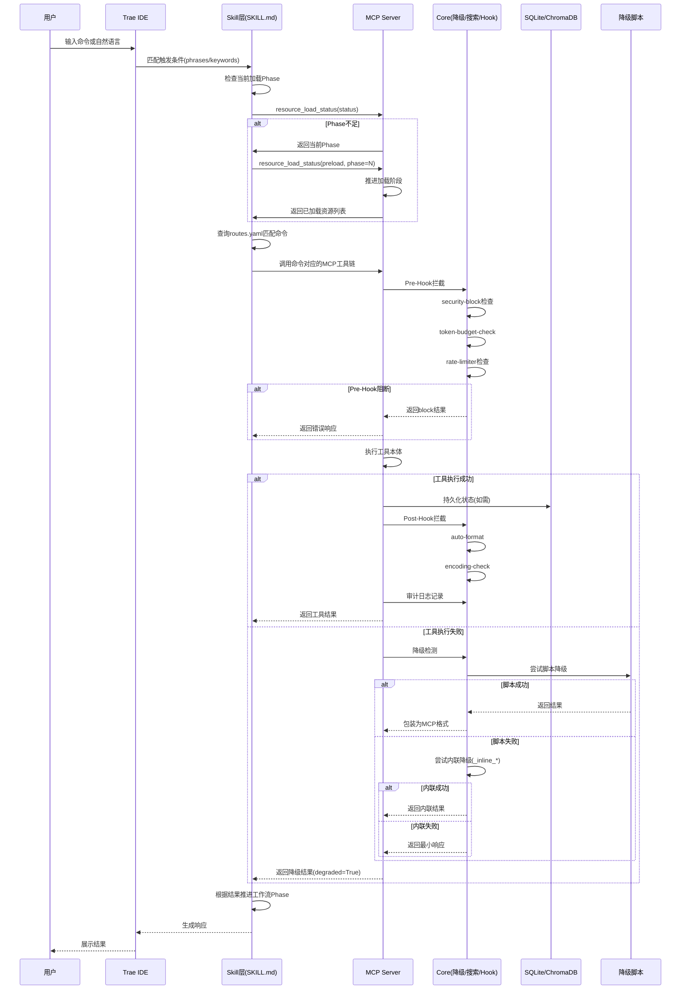
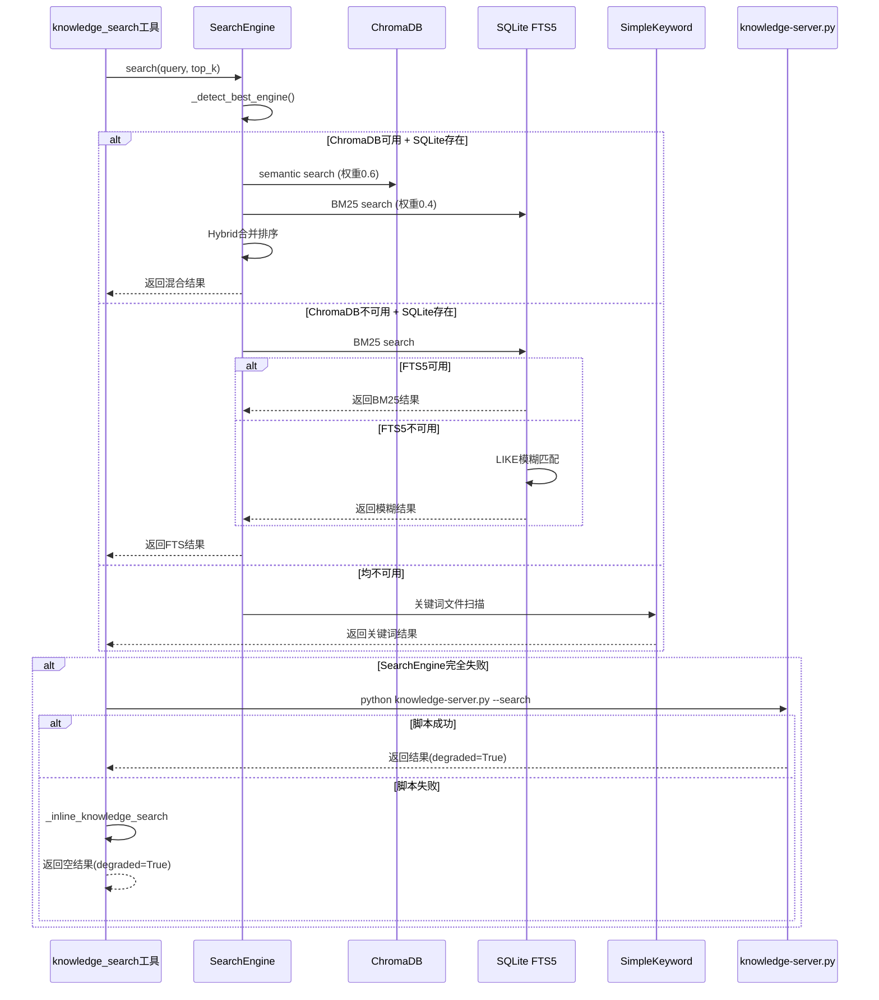
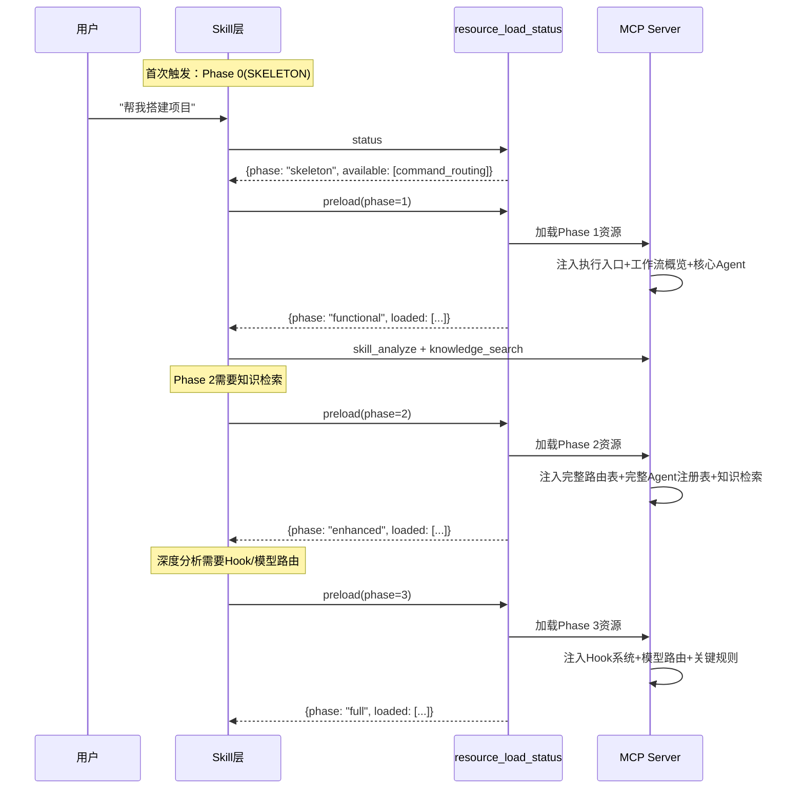

# Xuansto Skill v2 架构文档

> 版本：8.4.0 | 更新日期：2026-05-26
> 范围：xuansto-skill-v2（Skill定义层）+ xuansto-mcp-server（MCP Server执行层）

---

## 1. 项目概览

### 1.1 定位

xuansto-skill-v2 是一个**多Agent自主开发编排引擎**，通过 xuansto-mcp-server 提供的 20 个 MCP 原子工具驱动 9 阶段全生命周期开发流程。它不是一个独立的运行时框架，而是运行在 Trae IDE 的 Skill 体系之上，以 SKILL.md 为入口、以 MCP Server 为执行后端的**声明式编排系统**。

核心定位可概括为：

- **Skill 层**（`.trae/skills/xuansto-skill-v2/`）：纯声明式定义，包含 Agent 角色、命令路由、质量门禁、约束规则、参考文档，由 Trae 的 Skill 加载器在对话上下文中注入
- **执行层**（`xuansto-mcp-server/`）：Python FastMCP 实现，提供 20 个 Tool + 25+ 个 Resource，负责知识检索、质量检查、工作流调度、降级管理等有状态操作
- **资源层**（`scripts/`、`references/`、`data/knowledge/`）：脚本降级后备、参考文档库、知识库数据

### 1.2 核心能力

| 能力维度 | 指标 | 实现方式 |
|----------|------|----------|
| Agent 编排 | 57 Agent / 13 层 | `agents/registry.yaml` 声明 + `agent_status`/`agent_manage` 工具动态管理 |
| 工作流 | 9 Phase 全生命周期 | `workflow_dispatch` 工具 + SQLite 持久化 |
| 质量门禁 | 54 项 | `quality_gate_check` 工具 + `scripts/` 脚本执行 |
| 命令路由 | 31 个命令 | `commands/routes.yaml` 声明 + Skill 层意图匹配 |
| 知识服务 | ChromaDB + SQLite FTS5 + 关键词 | `knowledge_search` 工具 + 三级降级 |
| 渐进式加载 | 4 Phase（SKELETON→FUNCTIONAL→ENHANCED→FULL） | SKILL.md PHASE 标记 + `resource_load_status` 工具 |
| 降级容错 | 3 级链（MCP→脚本→内联→错误） | `core/degradation.py` + `constraints.yaml` |

### 1.3 用户交互模式

用户通过 Trae IDE 的对话界面与 xuansto-skill-v2 交互，交互模式为：

1. **命令驱动**：用户输入 `/init`、`/plan`、`/implement` 等命令，Skill 层根据 `commands/routes.yaml` 路由到对应 MCP 工具链
2. **意图匹配**：用户自然语言描述需求（如"从零搭建项目"），Skill 层通过 `triggers.phrases` + `triggers.keywords` 匹配到对应命令
3. **自主循环**：用户通过 `/loop` 启动自主循环，系统在 Token 预算内自动推进工作流 Phase
4. **渐进式加载**：Skill 首次触发时仅加载骨架信息（≤2K Token），用户执行命令时按需推进加载阶段

---

## 2. 完整文件目录树

```
项目根目录/
├── .trae/skills/xuansto-skill-v2/          # Skill 定义层（声明式）
│   ├── SKILL.md                             # 核心入口：YAML frontmatter + PHASE分段内容
│   ├── constraints.yaml                     # 核心约束：5条规则 + Token预算 + 降级映射 + 资源优先级
│   ├── .skill-config.yaml                   # 运行时配置：循环限制 + 按需加载 + 知识服务端口
│   ├── CHANGELOG.md                         # 版本变更日志
│   ├── MIGRATION.md                         # 迁移指南
│   ├── PROBLEM.md                           # 问题清单（30项，13已修复，17未修复）
│   ├── .gitattributes                       # Git LFS 配置
│   ├── .gitignore
│   ├── agents/                              # Agent 角色定义（57个 .md 文件）
│   │   ├── registry.yaml                    # Agent 注册表：13层57个Agent的元数据索引
│   │   ├── orchestrator/                    # 编排层（3个Agent）
│   │   │   ├── orchestrator.md
│   │   │   ├── subagent-dispatcher.md
│   │   │   └── task-coordinator.md
│   │   ├── product/                         # 产品层（4个Agent）
│   │   ├── design/                          # 设计层（4个Agent）
│   │   ├── engineering/                     # 工程层（6个Agent）
│   │   ├── cross-platform/                  # 跨平台层（5个Agent）
│   │   ├── database/                        # 数据层（3个Agent）
│   │   ├── testing/                         # 测试层（10个Agent）
│   │   ├── security/                        # 安全层（3个Agent）
│   │   ├── devops/                          # DevOps层（4个Agent）
│   │   ├── quality/                         # 质量层（7个Agent）
│   │   ├── documentation/                   # 文档层（2个Agent）
│   │   ├── knowledge/                       # 知识层（3个Agent）
│   │   └── monitoring/                      # 监控层（3个Agent）
│   ├── commands/                            # 命令定义（31个 .md 文件 + 路由表）
│   │   ├── routes.yaml                      # 命令路由表：意图→命令→MCP工具链→降级策略→Phase
│   │   ├── init.md                          # /init 命令详细步骤
│   │   ├── plan.md                          # /plan 命令详细步骤
│   │   ├── implement.md                     # /implement 命令详细步骤
│   │   └── ...                              # 其余28个命令定义
│   ├── configs/
│   │   └── default.yaml                     # 默认配置模板
│   ├── evals/                               # 评估配置
│   │   ├── mcp_evaluation.xml               # MCP工具评估QA对
│   │   └── trigger_eval.json                # 触发条件评估配置
│   ├── examples/                            # 使用示例
│   │   ├── desktop-app-development.md
│   │   └── web-app-development.md
│   ├── hooks/
│   │   └── hooks.json                       # Hook系统定义：3级配置(minimal/standard/strict) + 14个Hook
│   ├── memory/                              # 经验记忆存储
│   │   ├── fixes/                           # 修复经验
│   │   └── patterns/                        # 模式经验
│   ├── migrations/                          # 数据迁移脚本
│   ├── references/                          # 参考文档库（79+个 .md 文件）
│   │   ├── agent-details/                   # 57个Agent详细定义
│   │   ├── quality-gates.md                 # 54项质量门禁详细定义
│   │   ├── mcp-tools.md                     # 20个MCP工具完整参数与返回值
│   │   ├── workflow-phases.md               # 9阶段工作流目标、步骤、门禁
│   │   ├── agent-registry.md                # 完整Agent注册表
│   │   ├── progressive-loading.md           # 渐进式加载策略
│   │   ├── mcp-integration-strategy.md      # MCP集成策略
│   │   ├── knowledge-base-architecture.md   # 知识库架构
│   │   ├── hook-system.md                   # Hook系统完整定义
│   │   ├── model-routing.md                 # 模型路由规则
│   │   ├── token-optimization.md            # Token优化策略
│   │   ├── session-persistence.md           # 会话持久化
│   │   ├── spec-drift-handling.md           # 规格偏差处理
│   │   ├── parallelization-strategy.md      # 并行化策略
│   │   └── ...                              # 其余60+参考文档
│   ├── scripts/                             # 降级脚本（MCP不可用时执行）
│   │   ├── knowledge_server/                # 知识库HTTP服务（FastAPI实现）
│   │   │   ├── __init__.py
│   │   │   ├── api.py                       # FastAPI路由注册（健康检查/CRUD/WebSocket）
│   │   │   ├── api_models.py                # Pydantic请求模型
│   │   │   ├── api_routes.py                # CRUD路由实现
│   │   │   ├── auth.py                      # API Key认证
│   │   │   ├── backup.py                    # 备份管理
│   │   │   ├── config.py                    # 服务配置
│   │   │   ├── context_formatter.py         # 上下文格式化
│   │   │   ├── db_engine.py                 # SQLite引擎
│   │   │   ├── dedup.py                     # 去重检测
│   │   │   ├── degradation.py               # 知识库降级管理
│   │   │   ├── distillation.py              # 知识蒸馏
│   │   │   ├── embedding.py                 # 向量嵌入
│   │   │   └── experience_precipitator.py   # 经验沉淀
│   │   ├── knowledge-server.py              # 知识库MCP Tool脚本入口
│   │   ├── knowledge-server-tests.py        # 知识库测试脚本
│   │   ├── knowledge-index-builder.py       # 知识索引构建
│   │   ├── health-checker.py                # 健康检查脚本
│   │   ├── init-session.py                  # 会话初始化脚本
│   │   ├── coverage-check.py                # 覆盖率检查脚本
│   │   ├── check-encoding.py                # 编码检查脚本
│   │   ├── check-comment-lang.py            # 注释语言检查脚本
│   │   ├── code-simplifier.py               # 代码简化脚本
│   │   ├── context-compressor.py            # 上下文压缩脚本
│   │   ├── agentic-security-scanner.py      # 安全扫描脚本
│   │   ├── dependency-scan.py               # 依赖扫描脚本
│   │   ├── confidence-scorer.py             # 置信度评分脚本
│   │   ├── build-optimizer.py               # 构建优化脚本
│   │   └── ...                              # 其余辅助脚本
│   └── .knowledge/                          # 运行时知识缓存
│       ├── script-errors/                   # 脚本错误记录
│       └── temp-scripts/                    # 临时脚本存储
│
├── xuansto-mcp-server/                      # MCP Server 执行层（Python包）
│   ├── pyproject.toml                       # 包定义：Python>=3.10, mcp[cli]>=1.0.0, pydantic>=2.0.0
│   ├── mcp-config.json                      # MCP客户端配置
│   ├── README.md
│   ├── LICENSE
│   ├── src/xuansto_mcp/                     # 源码包
│   │   ├── __init__.py                      # 版本号 8.4.0
│   │   ├── server.py                        # FastMCP服务器入口：工具注册 + Hook拦截 + 启动流程
│   │   ├── cli.py                           # CLI入口
│   │   ├── api_routes.py                    # HTTP API路由
│   │   ├── core/                            # 核心基础设施
│   │   │   ├── __init__.py
│   │   │   ├── config.py                    # 配置管理：路径解析 + YAML加载 + 热更新(watchfiles) + 版本协商
│   │   │   ├── database.py                  # SQLite持久化：14张表 + FTS5 + 双写对账 + 知识版本清理
│   │   │   ├── degradation.py               # 降级管理器：4组件健康监控 + 自动恢复 + 状态持久化 + 20个降级函数
│   │   │   ├── search_engine.py             # 搜索引擎：4后端(ChromaDB/SQLiteFTS/Simple/Hybrid) + 自动检测
│   │   │   ├── hook_engine.py               # Hook引擎：8种Hook类型 + 超时保护 + 动态注册 + 配置加载
│   │   │   ├── errors.py                    # 错误码定义 + 响应构造 + 重试逻辑
│   │   │   ├── validator.py                 # 路径安全验证
│   │   │   ├── cache.py                     # 缓存管理
│   │   │   ├── crypto.py                    # 加密工具
│   │   │   ├── rate_limiter.py              # 速率限制
│   │   │   ├── audit_logger.py              # 审计日志
│   │   │   ├── logging_config.py            # 日志配置
│   │   │   ├── metrics.py                   # 指标收集
│   │   │   ├── notifications.py             # MCP通知推送
│   │   │   ├── protocol.py                  # MCP协议辅助
│   │   │   └── subprocess_utils.py          # 子进程工具
│   │   ├── models/                          # 数据模型
│   │   │   ├── __init__.py
│   │   │   ├── config_models.py             # Pydantic配置模型
│   │   │   └── schemas.py                   # JSON Schema定义
│   │   ├── tools/                           # 20个MCP工具实现
│   │   │   ├── __init__.py                  # 工具导出列表
│   │   │   ├── skill_analyze.py             # 项目结构分析
│   │   │   ├── knowledge_search.py          # 三层知识库检索
│   │   │   ├── knowledge_inject.py          # 知识注入
│   │   │   ├── quality_gate_check.py        # 54项质量门禁
│   │   │   ├── spec_drift_detect.py         # 规格偏差检测
│   │   │   ├── security_scan.py             # OWASP+依赖扫描
│   │   │   ├── code_simplify.py             # 代码简化
│   │   │   ├── session_manage.py            # 会话管理
│   │   │   ├── workflow_dispatch.py         # 工作流调度
│   │   │   ├── agent_status.py              # Agent状态查询
│   │   │   ├── agent_manage.py              # Agent实例管理
│   │   │   ├── hook_manage.py               # Hook管理
│   │   │   ├── resource_load_status.py      # 渐进式加载状态
│   │   │   ├── context_compress.py          # 上下文压缩
│   │   │   ├── server_health.py             # 服务器健康检查
│   │   │   ├── decision_log.py              # 决策日志
│   │   │   ├── token_budget.py              # Token预算管理
│   │   │   ├── project_init.py              # 项目初始化
│   │   │   ├── metrics_report.py            # 指标报告
│   │   │   └── config_manage.py             # 配置管理
│   │   ├── resources/                       # 25+ MCP Resource
│   │   │   ├── __init__.py
│   │   │   └── skill_resources.py           # Resource注册：配置/参考/会话/Agent/知识/指标/降级/审计等
│   │   └── data/                            # 内置数据
│   │       ├── knowledge/                   # 知识库数据
│   │       │   ├── experience/              # 经验知识（错误/集成/模式/性能/重构/安全）
│   │       │   ├── general/                 # 通用知识（桌面/DevOps/范式/模式/安全/标准/测试）
│   │       │   └── workspace/               # 工作空间知识（API/架构/约定/桌面/领域/环境/术语）
│   │       ├── .skill-config.yaml           # MCP Server内置Skill配置
│   │       ├── .xuansto-config.yaml         # MCP Server运行时配置
│   │       └── fallback_config.yaml         # 降级配置
│   ├── tests/                               # 测试套件
│   │   ├── conftest.py                      # 测试配置
│   │   ├── test_*.py                        # 100+ 单元测试文件
│   │   ├── baselines/                       # 基线测试数据
│   │   ├── integration/                     # 集成测试
│   │   ├── test_e2e/                        # 端到端测试
│   │   ├── test_integration/                # 交互测试
│   │   └── test_compatibility/              # 兼容性测试
│   ├── scripts/                             # 部署脚本
│   │   ├── start_server.py                  # 服务器启动脚本
│   │   └── verify_deployment.py             # 部署验证脚本
│   ├── spec-locks/                          # API契约锁
│   │   ├── api-contract-version.json
│   │   ├── skill-definition-schema.json
│   │   └── tool-parameter-schemas.json
│   └── docs/                                # MCP Server文档
│       ├── api.md
│       ├── mcp-tools.md
│       ├── migration-v1-to-v2.md
│       ├── troubleshooting.md
│       └── contributing.md
│
├── .agent_cache/                             # 运行时Agent状态缓存
│   └── workflow-state.json
├── .skill-logs/                              # 会话日志
└── .github/                                  # CI/CD配置
    ├── workflows/ci.yml
    ├── workflows/release.yml
    └── ISSUE_TEMPLATE/
```

---

## 3. 当前架构分层

系统采用四层架构，从上到下依次为 Skill 层、执行层、资源层、依赖层。

### 3.1 Skill 层（声明式定义）

> 路径：`.trae/skills/xuansto-skill-v2/`

Skill 层是纯声明式的，不包含可执行代码，由 Trae 的 Skill 加载器在对话上下文中注入。核心职责是定义"做什么"和"怎么做"的规则。

| 组件 | 文件 | 职责 |
|------|------|------|
| 入口与元数据 | `SKILL.md` | YAML frontmatter（触发条件/版本/兼容性）+ PHASE分段内容（4段渐进式加载） |
| 核心约束 | `constraints.yaml` | 5条核心规则 + Token预算分配 + 降级映射表 + 资源优先级 + 渐进式加载披露规则 |
| 运行时配置 | `.skill-config.yaml` | 循环限制（max_iterations=50）+ 按需加载开关 + 知识服务端口（8765） |
| Agent注册表 | `agents/registry.yaml` | 13层57个Agent的元数据索引（名称/文件/Phase/模型路由） |
| 命令路由表 | `commands/routes.yaml` | 31个命令的意图→命令→MCP工具链→降级策略→Phase映射 |
| Hook定义 | `hooks/hooks.json` | 3级配置（minimal/standard/strict）+ 14个Hook事件处理器 |
| Agent定义 | `agents/**/*.md` | 57个Agent的角色定义（职责/输入/输出/协作模式） |
| 命令定义 | `commands/**/*.md` | 31个命令的详细执行步骤 |
| 参考文档 | `references/**/*.md` | 79+参考文档（质量门禁/MCP工具/工作流/安全/编码标准等） |

**关键设计：SKILL.md 渐进式加载**

SKILL.md 通过 `<!-- PHASE_N_START -->` / `<!-- PHASE_N_END -->` 标记实现4段渐进式加载：

| Phase | 标记范围 | 内容 | Token预算 |
|-------|----------|------|-----------|
| Phase 0（骨架） | `PHASE_0_START → PHASE_0_END` | YAML frontmatter + 命令列表 + MCP依赖 + 5条核心约束 | ≤2K |
| Phase 1（功能） | `PHASE_0_START → PHASE_1_END` | +执行入口 + 工作流概览 + 精简路由表 + 核心Agent索引(13个) | ≤5K |
| Phase 2（增强） | `PHASE_0_START → PHASE_2_END` | +完整路由表 + 完整Agent注册表(57个) + 参考文档表 + MCP工具摘要 | ≤10K |
| Phase 3（完整） | `PHASE_0_START → PHASE_3_END` | +Hook系统说明 + 模型路由说明 + 关键规则 | ≤20K |

### 3.2 执行层（MCP Server）

> 路径：`xuansto-mcp-server/src/xuansto_mcp/`

执行层是 Python FastMCP 实现，提供有状态的工具和资源服务。核心职责是执行 Skill 层声明的操作逻辑。

| 组件 | 文件 | 职责 |
|------|------|------|
| 服务器入口 | `server.py` | FastMCP实例创建 + 20工具注册 + Hook拦截装饰器 + 启动流程 |
| 配置管理 | `core/config.py` | 路径解析(SKILL_ROOT/DATA_DIR) + YAML配置加载 + 热更新(watchfiles/SIGHUP) + 版本协商 |
| 数据持久化 | `core/database.py` | SQLite 14张表 + FTS5全文索引 + 双写对账 + 知识版本清理 + Agent/Workflow状态持久化 |
| 降级管理 | `core/degradation.py` | DegradationManager(4组件健康监控) + DegradationExecutor(20个降级函数) + 自动恢复 + 状态持久化 |
| 搜索引擎 | `core/search_engine.py` | SearchEngine协议 + 4后端(ChromaDB/SQLiteFTS/Simple/Hybrid) + 自动检测 + 插件注册 |
| Hook引擎 | `core/hook_engine.py` | 8种Hook类型 + 超时保护(30s) + 动态注册/注销 + 配置文件加载 + 失败计数告警 |
| 错误处理 | `core/errors.py` | ErrorCodes枚举 + make_response构造 + retry_tool_call重试 |
| 审计日志 | `core/audit_logger.py` | 工具调用审计记录 + 查询接口 |
| 速率限制 | `core/rate_limiter.py` | 工具调用频率控制 |
| 通知推送 | `core/notifications.py` | MCP通知 + 降级变更推送 |
| 20个工具 | `tools/*.py` | 每个工具模块包含 `register(mcp)` 函数，部分包含 `_inline_*` 内联降级函数 |
| 25+资源 | `resources/skill_resources.py` | MCP Resource注册（xuansto://协议）+ 订阅管理 + 降级资源 |

**关键设计：server.py 工具注册与Hook拦截**

```python
# server.py 核心流程
mcp = FastMCP("xuansto-mcp-server")

# 替换 mcp.tool 装饰器，注入Hook拦截
mcp.tool = _tool_with_hooks

# 注册20个工具模块
for tool_module in [skill_analyze, knowledge_search, ...]:
    tool_module.register(mcp)

# 恢复原始装饰器
mcp.tool = _original_mcp_tool
```

每个工具调用经过 `_with_hook_interception` 装饰器，流程为：
1. 执行 Pre-Hook（安全检查→Token预算检查→速率限制）
2. 执行工具本体（含重试）
3. 执行 Post-Hook（格式化→编码检查→类型检查）
4. 记录审计日志和Token使用

### 3.3 资源层

> 路径：`.trae/skills/xuansto-skill-v2/scripts/` + `xuansto-mcp-server/src/xuansto_mcp/data/`

资源层提供降级脚本、知识库数据和参考文档。

| 组件 | 路径 | 职责 |
|------|------|------|
| 降级脚本 | `scripts/*.py` | MCP工具不可用时的脚本后备（约30个Python脚本） |
| 知识库HTTP服务 | `scripts/knowledge_server/` | FastAPI实现的独立知识库服务（含CRUD/WebSocket/认证/备份/嵌入/降级） |
| 知识库数据 | `xuansto-mcp-server/src/xuansto_mcp/data/knowledge/` | 内置知识库（experience/general/workspace三个作用域） |
| 内置配置 | `xuansto-mcp-server/src/xuansto_mcp/data/*.yaml` | MCP Server的内置配置文件（.skill-config.yaml / .xuansto-config.yaml / fallback_config.yaml） |

### 3.4 依赖层

> 定义在 `xuansto-mcp-server/pyproject.toml`

| 依赖 | 版本要求 | 用途 |
|------|----------|------|
| `mcp[cli]` | >=1.0.0 | MCP协议实现（FastMCP服务器框架） |
| `pydantic` | >=2.0.0 | 数据模型验证 |
| `pyyaml` | >=6.0 | YAML配置解析 |
| `chromadb` | >=0.4.0（可选） | 向量语义搜索 |
| `fastapi` | >=0.100.0（可选） | 知识库HTTP服务 |
| `uvicorn` | >=0.20.0（可选） | ASGI服务器 |
| `openai` | >=1.0.0（可选） | 嵌入生成 |
| `sentence-transformers` | >=2.0.0（可选） | 本地嵌入模型 |
| `watchfiles` | >=0.20.0（可选） | 配置热更新文件监控 |

---

## 4. 调用流程图

### 4.1 命令执行主流程



### 4.2 知识检索降级流程



### 4.3 渐进式加载流程



---

## 5. 目标架构设计

### 5.1 Skill 与 MCP 职责划分

目标架构明确 Skill 层与 MCP Server 层的职责边界：

| 维度 | Skill 层（声明式） | MCP Server 层（执行式） |
|------|-------------------|----------------------|
| **定义内容** | Agent角色、命令路由、约束规则、参考文档 | 工具实现、状态持久化、降级逻辑、搜索服务 |
| **状态管理** | 无状态（纯声明） | 有状态（SQLite + ChromaDB + 内存） |
| **加载方式** | Trae Skill加载器注入对话上下文 | MCP协议（stdio / streamable-http） |
| **变更频率** | 低（Agent/命令/约束变更） | 中（工具逻辑/降级策略/搜索算法变更） |
| **测试方式** | 触发评估（evals/） | pytest单元测试 + 集成测试 + E2E测试 |
| **版本管理** | SKILL.md version字段 | pyproject.toml version + MCP_API_VERSION |

**核心原则**：Skill 层只定义"做什么"（What），MCP Server 层负责"怎么做"（How）。Skill 层通过 `constraints.yaml` 的 `degradation.tool_fallbacks` 声明降级策略，MCP Server 层的 `core/degradation.py` 负责执行。

### 5.2 MCP Server 边界与接口

MCP Server 对外暴露两类接口：

**Tool 接口（20个，有副作用）**

| 分类 | 工具 | 边界约束 |
|------|------|----------|
| 分析 | `skill_analyze` | 只读，不修改项目文件 |
| 知识 | `knowledge_search`, `knowledge_inject` | search只读；inject写入知识库 |
| 质量 | `quality_gate_check`, `spec_drift_detect`, `security_scan`, `code_simplify` | 只读分析，不自动修改代码 |
| 工作流 | `workflow_dispatch`, `session_manage` | 写入SQLite状态 |
| Agent | `agent_status`, `agent_manage` | status只读；manage写入SQLite |
| 系统 | `hook_manage`, `resource_load_status`, `context_compress`, `server_health`, `decision_log`, `token_budget`, `project_init`, `metrics_report`, `config_manage` | 混合读写 |

**Resource 接口（25+个，只读）**

Resource 使用 `xuansto://` 协议，按功能域组织：

| 域 | URI模式 | 示例 |
|----|---------|------|
| 配置 | `xuansto://config/*`, `xuansto://skill/*` | `xuansto://config/skill`, `xuansto://skill/constraints` |
| 参考 | `xuansto://references/*` | `xuansto://references/quality-gates`, `xuansto://references/agent-registry` |
| Agent | `xuansto://agents/*` | `xuansto://agents/{name}`, `xuansto://agents/{layer}/{name}` |
| 知识 | `xuansto://knowledge/*` | `xuansto://knowledge/status`, `xuansto://knowledge/stats` |
| 会话 | `xuansto://sessions/*`, `xuansto://session/*` | `xuansto://sessions/latest`, `xuansto://session/state` |
| 系统 | `xuansto://loading/*`, `xuansto://metrics/*`, `xuansto://degradation/*`, `xuansto://health/*`, `xuansto://audit/*` | `xuansto://loading/status`, `xuansto://health/status` |
| 工作流 | `xuansto://workflows/*` | `xuansto://workflows/active`, `xuansto://workflows/definitions` |
| 决策 | `xuansto://decisions/*` | `xuansto://decisions/latest` |
| 模板 | `xuansto://templates/*` | `xuansto://templates/{name}`, `xuansto://templates/index` |
| 命令 | `xuansto://commands/*` | `xuansto://commands/routes` |
| Hook | `xuansto://hooks/*` | `xuansto://hooks/definitions` |
| 门禁 | `xuansto://gates/*` | `xuansto://gates/definitions` |

**API 版本协商**

MCP Server 实现 API 版本协商（`core/config.py`）：
- 当前版本：`MCP_API_VERSION = "3.0.0"`
- 最低兼容：`MCP_MIN_SUPPORTED_VERSION = "2.0.0"`
- Skill 最低版本：`SKILL_MIN_VERSION = "8.0.0"`
- 版本变更日志记录在 `API_CHANGELOG` 字典中

### 5.3 渐进式加载注入点

渐进式加载在3个层面协同工作：

**1. Skill 层注入点（SKILL.md PHASE标记）**

```
SKILL.md
├── PHASE_0 (≤2K Token) → 触发时自动加载
├── PHASE_1 (≤5K Token) → 用户执行命令时加载
├── PHASE_2 (≤10K Token) → 需要参考文档时加载
└── PHASE_3 (≤20K Token) → 深度分析时加载
```

**2. MCP Server 层注入点（resource_load_status 工具）**

`resource_load_status` 工具提供两个关键 action：
- `status`：查询当前加载阶段、已加载资源、可用功能
- `preload`：主动推进到指定阶段，触发资源预加载

**3. 知识服务注入点（knowledge_search / knowledge_inject）**

- Phase 0-1：知识检索不可用，使用内嵌模板和默认知识
- Phase 2+：`knowledge_search` 工具可用，按需检索参考文档
- Phase 3+：完整知识库访问（含经验沉淀）

**注入点触发规则**（定义在 `constraints.yaml` 的 `disclosure` 部分）：

| 功能 | Phase 0 | Phase 1 | Phase 2 | Phase 3 |
|------|---------|---------|---------|---------|
| 命令路由 | ✅ | ✅ | ✅ | ✅ |
| 命令执行 | ❌ | ✅ | ✅ | ✅ |
| 质量门禁 | ❌ | ✅ | ✅ | ✅ |
| 知识检索 | ❌ | ❌ | ✅ | ✅ |
| 参考文档 | ❌ | ❌ | ✅ | ✅ |
| Agent详情 | ❌ | 核心13个 | 全部57个 | ✅ |
| Hook系统 | ❌ | ❌ | ❌ | ✅ |
| 模型路由 | ❌ | ❌ | ❌ | ✅ |

---

## 6. 当前架构 vs. 目标架构差异表

| 维度 | 当前架构 | 目标架构 | 差距 | 优先级 |
|------|----------|----------|------|--------|
| **Agent持久化** | `agent_states`表已存在，`agent_manage.py`已实现CRUD，但重启后需`load_on_startup`从SQLite恢复 | Agent状态完全持久化，重启自动恢复，跨会话连续 | 部分实现，需验证恢复完整性 | 中 |
| **工作流持久化** | `workflow_states`表已存在，`workflow_dispatch.py`已实现，`load_on_startup`恢复活跃工作流 | 工作流状态完全持久化，重启自动恢复 | 部分实现，需验证Phase推进恢复 | 中 |
| **Token预算关联** | `token_budget.py`独立管理，`resource_load_status.py`记录Token指标，但两者未建立预算分配关联 | Token预算与加载阶段关联，Phase推进自动调整预算分配 | 未实现关联逻辑 | 低 |
| **Hook超时保护** | `hook_engine.py`已实现`DEFAULT_HOOK_TIMEOUT_SECONDS=30.0`，`asyncio.wait_for`超时控制 | Hook执行全部有超时保护，超时后优雅降级 | ✅ 已实现 | - |
| **配置热更新** | `config.py`已实现`watchfiles`/`SIGHUP`/轮询三种热更新机制，`reload_config()`自动重载 | 配置变更无需重启，实时生效 | ✅ 已实现 | - |
| **错误处理统一** | `errors.py`定义`make_response`统一格式，但部分工具仍可能返回非标准格式 | 所有工具返回统一JSON格式 | 大部分实现，需排查边缘情况 | 中 |
| **API版本协商** | `config.py`定义`MCP_API_VERSION`/`MCP_MIN_SUPPORTED_VERSION`，`API_CHANGELOG`记录变更 | 客户端与服务端版本不匹配时优雅降级 | 声明已有，协商逻辑未完整实现 | 低 |
| **Resource暴露** | `skill_resources.py`已注册25+个Resource（xuansto://协议），含订阅管理 | Agent可通过URI模式订阅状态变更 | ✅ 已实现 | - |
| **审计日志** | `audit_logger.py`已实现，`server.py`的`_with_hook_interception`记录每次工具调用 | 完整的工具调用审计追踪 | ✅ 已实现 | - |
| **双写一致性** | `database.py`的`persist_knowledge_dual_write`实现先写SQLite(pending)→再写ChromaDB→成功标记ready，`reconcile_knowledge_stores`实现对账 | ChromaDB与SQLite双写有事务保证，自动对账修复 | 对账机制已有，事务保证为最终一致性 | 中 |
| **知识版本清理** | `database.py`的`cleanup_knowledge_versions`已实现按组保留最近N个版本 | 知识条目版本历史自动清理，防止数据库膨胀 | ✅ 已实现 | - |
| **SKELETON阶段命令** | Phase 0仅展示命令列表，`constraints.yaml`声明`/status`、`/help`、`/budget`可用 | SKELETON阶段有基础命令可用 | 声明已有，需验证实际可用性 | 低 |
| **降级脚本一致性** | `degradation.py`的`FALLBACK_MAP`包含20个降级函数，`constraints.yaml`的`tool_fallbacks`包含14个映射 | 降级脚本与constraints.yaml完全一致，单一权威源 | 数量不一致（20 vs 14），需对齐 | 中 |
| **HTTP API与MCP统一** | `scripts/knowledge_server/api.py`实现HTTP API，`server.py`实现MCP stdio/streamable-http，两套接口返回格式不同 | 统一Schema，调用方无需适配两套接口 | 未统一 | 中 |

---

## 7. 风险与约束

### 7.1 架构风险

| 风险 | 影响 | 缓解措施 | 状态 |
|------|------|----------|------|
| **ChromaDB依赖可选** | 未安装chromadb时语义搜索不可用，降级到BM25/关键词 | `search_engine.py`自动检测，Hybrid→SQLiteFTS→Simple三级降级 | ✅ 已缓解 |
| **SQLite并发写入** | 多线程写入可能冲突 | WAL模式 + `busy_timeout=5000` + `_db_lock`线程锁 | ✅ 已缓解 |
| **降级链过长** | MCP→脚本→内联→最小响应，4级降级延迟叠加 | 每级超时控制（脚本60s/120s，内联即时），`DegradationExecutor`统一5s超时 | ⚠️ 需监控 |
| **SKILL.md Token膨胀** | Phase 3完整加载可达20K Token | 渐进式加载按需推进，Phase 0仅2K Token | ✅ 已缓解 |
| **知识库双写不一致** | ChromaDB写入失败时SQLite标记pending | `reconcile_knowledge_stores`对账 + `cleanup_stale_pending_entries`清理 | ⚠️ 最终一致性 |
| **配置热更新竞态** | watchfiles通知与配置读取可能竞态 | `_config_lock`线程锁保护，原子替换全局变量 | ✅ 已缓解 |

### 7.2 运行约束

| 约束 | 值 | 来源 |
|------|-----|------|
| Python版本 | >=3.10 | `pyproject.toml` |
| MCP协议版本 | >=1.0.0 | `pyproject.toml` dependencies |
| MCP API版本 | 3.0.0 | `core/config.py` MCP_API_VERSION |
| Skill最低版本 | 8.0.0 | `core/config.py` SKILL_MIN_VERSION |
| MCP Server最低兼容 | 4.0.0 | `SKILL.md` compatible_mcp_server |
| 循环最大迭代 | 50次 | `.skill-config.yaml` max_iterations |
| 停滞阈值 | 3次 | `.skill-config.yaml` stagnation_threshold |
| Hook超时 | 30秒 | `hook_engine.py` DEFAULT_HOOK_TIMEOUT_SECONDS |
| 降级健康检查间隔 | 30秒 | `core/config.py` DEGRADATION_HEALTH_CHECK_INTERVAL |
| 降级恢复退避 | 5s~300s（指数退避+抖动） | `degradation.py` _compute_backoff |
| 知识版本保留 | 最近10个 | `core/config.py` KNOWLEDGE_VERSION_CLEANUP_KEEP_LAST_N |
| 知识服务端口 | 8765 | `.skill-config.yaml` knowledge_service.port |

### 7.3 未修复问题清单

以下17个问题来自 `PROBLEM.md`，按优先级排列：

| ID | 类别 | 优先级 | 描述 | 计划版本 |
|----|------|--------|------|----------|
| ARCH-05 / MCP-02 | 架构 | 中 | MCP Server Resource暴露 | ✅ v8.4.0已实现 |
| ARCH-06 | 架构 | 低 | Agent持久化机制 | ✅ v8.4.0已实现 |
| ARCH-07 | 架构 | 低 | 工作流状态持久化 | ✅ v8.4.0已实现 |
| ARCH-08 | 架构 | 低 | Token预算与加载阶段关联 | v8.4.0+ |
| ARCH-09 | 架构 | 低 | Hook执行超时保护 | ✅ v8.4.0已实现 |
| ARCH-10 | 架构 | 低 | 配置热更新 | ✅ v8.4.0已实现 |
| ARCH-11 | 架构 | 中 | 错误处理不统一 | v8.3.0 |
| ARCH-12 | 架构 | 低 | API版本协商机制 | v8.4.0+ |
| DB-01 | 数据 | 中 | 决策记录双写一致性 | v8.3.0 |
| DB-02 | 数据 | 中 | ChromaDB与SQLite双写事务保证 | v8.3.0 |
| DB-03 | 数据 | 低 | 知识条目版本历史清理 | ✅ v8.4.0已实现 |
| MCP-03 | MCP | 中 | 工具调用审计日志 | ✅ v8.4.0已实现 |
| SKILL-02 | Skill | 低 | SKELETON阶段无可用命令 | v8.2.0 |
| API-01 | API | 中 | HTTP API与MCP stdio两套接口无统一Schema | v8.3.0 |
| P3-01 | 通用 | 低 | v1与v2存在重复文件 | v8.5.0 |
| P3-02 | 通用 | 低 | SKILL.md行数可能超过500行 | ✅ 渐进式加载已缓解 |

> 注：部分标记为"v8.4.0已实现"的问题在 PROBLEM.md 中仍列为未修复，但代码分析表明已在 v8.4.0 中实现。建议更新 PROBLEM.md 状态。

### 7.4 技术债务

1. **降级映射不一致**：`degradation.py` 的 `FALLBACK_MAP` 包含20个降级函数，而 `constraints.yaml` 的 `tool_fallbacks` 仅声明14个映射。`metrics_report` 和 `config_manage` 等新增工具在 constraints.yaml 中缺少降级声明
2. **知识库HTTP服务与MCP Server并存**：`scripts/knowledge_server/` 实现了完整的 FastAPI 知识库服务，与 `xuansto-mcp-server` 的 `knowledge_search` 工具功能重叠，两套实现需统一
3. **spec-locks 目录**：`xuansto-mcp-server/spec-locks/` 包含3个JSON Schema锁文件，但未在CI/CD流程中强制校验
4. **测试覆盖不均**：100+测试文件但部分工具（如 `config_manage`、`metrics_report`）缺少专项测试
