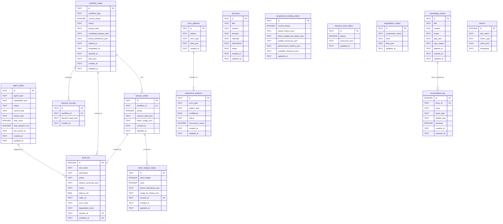

# xuansto-skill-v2 数据库/数据存储设计文档

> 版本: 1.0.0 | 最后更新: 2026-05-25

---

## 目录

1. [当前数据存储盘点](#1-当前数据存储盘点)
2. [持久化/缓存数据实体清单](#2-持久化缓存数据实体清单)
3. [数据生命周期](#3-数据生命周期)
4. [重构后数据模型](#4-重构后数据模型)
5. [ER 图](#5-er-图)
6. [数据迁移策略](#6-数据迁移策略)
7. [存储技术选型建议](#7-存储技术选型建议)

---

## 1. 当前数据存储盘点

### 1.1 SQLite 数据库

**主数据库**: `.xuansto/xuansto.db`（由 `database.py` 管理）

| 表名 | 用途 | 关键字段 |
|------|------|----------|
| `workflow_instances` | 工作流实例状态 | id, workflow_type, current_phase, status, data_json |
| `session_states` | 会话状态快照 | id, session_data_json, created_at, updated_at |
| `resource_load_states` | 资源加载状态 | id, phase, resources_json, updated_at |
| `degradation_states` | 降级状态 | id, component_name, level, data_json, updated_at |
| `error_patterns` | 错误模式 | id, pattern, error_type, data_json, created_at |
| `metrics` | 工具调用指标 | id(AUTO), tool_name, metric_type, value_json, timestamp |
| `decision_records` | 决策记录 | id, workflow_id, decision_data_json, created_at |
| `knowledge_entries` | 知识条目 | id, title, content, scope, tags_json, sync_status, deleted_at |
| `reconciliation_log` | 同步对账日志 | id(AUTO), entry_id, store, issue_type, details_json, resolved |
| `token_budget_states` | Token 预算状态 | id, total_budget, used, phase_allocations_json, usage_by_phase_json, session_id |
| `experience_patterns` | 经验模式 | id, error_type, pattern_json, confidence, status, occurrence_count |

**决策专用数据库**: `.xuansto/decisions.db`（由 `decision_log.py` 管理）

| 表名 | 用途 | 关键字段 |
|------|------|----------|
| `decisions` | 架构决策记录(ADR) | id, title, context, decision, rationale, alternatives, status |
| `decisions_fts` | 决策全文搜索(FTS5) | rowid, id(UNINDEXED), title, context, decision |

**知识库专用数据库**: `.xuansto/knowledge/index/knowledge.db`（由 `knowledge_search.py` 管理）

| 表名 | 用途 | 关键字段 |
|------|------|----------|
| `knowledge_entries` | 知识条目(搜索用) | id, title, content, type, metadata_json, created_at, updated_at |
| `knowledge_fts` | 知识全文搜索(FTS5) | rowid, content, title, type |

### 1.2 文件系统

| 路径 | 格式 | 用途 | 管理模块 |
|------|------|------|----------|
| `.xuansto/sessions/session-*.md` | Markdown | 会话历史记录 | session_manage.py |
| `.xuansto/sessions/current.json` | JSON | 当前会话追踪状态 | session_manage.py |
| `.xuansto/patterns/pattern-*.json` | JSON | 错误模式草稿 | session_manage.py |
| `.xuansto/workflows/*.json` | JSON | 工作流实例持久化 | workflow_dispatch.py |
| `.xuansto/workflow_states.json` | JSON | 活跃工作流全局快照 | workflow_dispatch.py |
| `.xuansto/agent_instances.json` | JSON | Agent 实例持久化 | agent_manage.py |
| `.xuansto/resource_state.json` | JSON | 资源加载状态(含完整性哈希) | resource_load_status.py |
| `.xuansto/tool_metrics.json` | JSON | 工具调用指标持久化 | server_health.py |
| `.xuansto/degradation_stats.json` | JSON | 降级统计持久化 | server_health.py |
| `.xuansto/decisions.json` | JSON | 决策记录(旧格式，已迁移) | decision_log.py |
| `.xuansto/workflow_snapshots/*.json.gz` | JSON+Gzip | 工作流阶段快照 | workflow_dispatch.py |
| `.xuansto/knowledge/experience_patterns.json` | JSON | 经验模式(旧格式，已迁移) | database.py |

### 1.3 ChromaDB 向量数据库

**路径**: `.xuansto/knowledge/index/chroma_db/`

| 集合名 | 用途 | 维度 |
|--------|------|------|
| `knowledge` | 知识条目语义嵌入 | 默认(all-MiniLM-L6-v2) |

- 通过 `chromadb.PersistentClient` 管理
- 与 SQLite `knowledge_entries` 双写，`sync_status` 字段跟踪同步状态
- `reconciliation_log` 表记录同步失败和对账修复

### 1.4 内存数据结构

| 变量名 | 模块 | 类型 | 用途 |
|--------|------|------|------|
| `_TOOL_REGISTRY` | server.py | `dict[str, Any]` | 工具名→工具函数映射 |
| `_TOOL_FUNCTIONS` | server.py | `dict[str, Callable]` | 工具名→包装函数映射 |
| `_REGISTERED_TOOL_NAMES` | server.py | `list[str]` | 已注册工具名列表 |
| `_REGISTERED_RESOURCE_NAMES` | server.py | `list[str]` | 已注册资源名列表 |
| `_resource_subscriptions` | skill_resources.py | `dict[str, list[str]]` | 资源URI→订阅客户端列表 |
| `_ACTIVE_WORKFLOWS` | workflow_dispatch.py | `dict[str, dict]` | 活跃工作流实例缓存 |
| `_AGENT_INSTANCES` | agent_manage.py | `dict[str, _AgentInstance]` | Agent实例内存缓存 |
| `_TOOL_METRICS` | server_health.py | `dict[str, dict]` | 工具调用指标内存缓存 |
| `_DEGRADATION_COUNTS` | server_health.py | `dict[str, int]` | 降级计数内存缓存 |
| `_RESTORED_STATE` | session_manage.py | `dict \| None` | 启动时恢复的会话状态 |
| `_cache` | decision_log.py | `dict[str, dict]` | 决策记录内存缓存 |
| `_TRANSITION_HISTORY` | resource_load_status.py | `list[dict]` | 阶段转换历史 |
| `_TOKEN_METRICS` | resource_load_status.py | `dict[str, dict]` | Token使用指标 |
| `_PHASE_TOKEN_USAGE` | resource_load_status.py | `dict[int, dict]` | 按阶段的Token使用 |
| `_current_phase` | resource_load_status.py | `int` | 当前加载阶段 |
| `_loaded_resources` | resource_load_status.py | `set[str] \| None` | 已加载资源集合 |
| `_resource_lru` | resource_load_status.py | `LRUCache` | 资源内容LRU缓存 |
| `_LOADED_PROGRESS` | resource_load_status.py | `dict` | 加载进度追踪 |

### 1.5 JSON/YAML 配置文件

| 路径 | 格式 | 用途 | 热重载 |
|------|------|------|--------|
| `.skill-config.yaml` | YAML | 技能配置(门禁脚本、Hook脚本、降级配置) | ✅ watchfiles/SIGHUP |
| `.xuansto-config.yaml` | YAML | 运行时配置(同上，优先级更高) | ✅ watchfiles/SIGHUP |
| `constraints.yaml` | YAML | 核心约束定义(Token预算、资源优先级、降级策略) | ❌ |
| `hooks/hooks.json` | JSON | Hook定义 | ❌ |
| `configs/default.yaml` | YAML | 默认配置 | ❌ |

---

## 2. 持久化/缓存数据实体清单

### 2.1 knowledge_entry（知识条目）

```json
{
  "id": "kb-20260525-001",
  "title": "React组件设计模式",
  "content": "使用Compound Components模式...",
  "scope": "general",
  "tags_json": ["react", "design-pattern", "frontend"],
  "sync_status": "ready",
  "deleted_at": null,
  "created_at": "2026-05-25T10:00:00+08:00",
  "updated_at": "2026-05-25T10:00:00+08:00"
}
```

| 属性 | 说明 |
|------|------|
| 存储类型 | SQLite (xuansto.db + knowledge.db) + ChromaDB |
| CRUD触发 | C: knowledge_inject / SDD阶段知识沉淀; R: knowledge_search; U: knowledge_inject(update); D: 软删除(deleted_at) |
| 同步机制 | 双写: 先写SQLite(sync_status=pending)，再写ChromaDB，成功后更新为ready |

### 2.2 session_state（会话状态）

```json
{
  "id": "session-20260525-100000",
  "session_data_json": {
    "current_phase": 4,
    "current_task": "实现用户认证模块",
    "decisions": ["ADR-20260525-001"],
    "pending_tasks": ["编写集成测试", "代码审查"],
    "completed_phases": [0, 1, 2, 3],
    "timestamp": "2026-05-25T10:00:00+08:00",
    "updated_at": "2026-05-25T14:30:00+08:00"
  },
  "created_at": "2026-05-25T10:00:00+08:00",
  "updated_at": "2026-05-25T14:30:00+08:00"
}
```

| 属性 | 说明 |
|------|------|
| 存储类型 | SQLite (xuansto.db) + 文件系统 (sessions/current.json + session-*.md) |
| CRUD触发 | C: session_manage(track); R: session_manage(restore); U: session_manage(track); D: _cleanup_old_sessions(保留最近10个) |

### 2.3 decision_log（决策日志）

```json
{
  "id": "ADR-20260525-001",
  "title": "选择JWT作为认证方案",
  "context": "需要无状态认证机制以支持微服务架构",
  "decision": "采用JWT + Refresh Token双令牌方案",
  "rationale": "无状态、可水平扩展、行业标准",
  "alternatives": ["Session Cookie", "OAuth2 Token", "API Key"],
  "status": "accepted",
  "created_at": "2026-05-25T10:00:00+08:00",
  "updated_at": "2026-05-25T10:00:00+08:00"
}
```

| 属性 | 说明 |
|------|------|
| 存储类型 | SQLite (decisions.db + xuansto.db decision_records) |
| CRUD触发 | C: decision_log(log); R: decision_log(list/query); U: decision_log(update); D: 无(决策不可删除) |

### 2.4 workflow_state（工作流状态）

```json
{
  "workflow_id": "wf-a1b2c3d4",
  "workflow": "sdd-tdd-full",
  "project_path": "/path/to/project",
  "status": "running",
  "current_phase": 4,
  "started_at": "2026-05-25T10:00:00+08:00",
  "completed_phases": [0, 1, 2, 3],
  "phase_definitions": [
    {"id": 0, "name": "初始化", "gates": ["DESIGN-SYSTEM-COMPLETE"]},
    {"id": 1, "name": "需求分析", "gates": ["BRAINSTORM-COMPLETE"]}
  ],
  "_timestamp": 1748150400.0,
  "_hash": "sha256..."
}
```

| 属性 | 说明 |
|------|------|
| 存储类型 | 文件系统 (workflows/*.json + workflow_states.json) + 内存 (_ACTIVE_WORKFLOWS) + SQLite (workflow_instances) |
| CRUD触发 | C: workflow_dispatch(start); R: workflow_dispatch(status); U: workflow_dispatch(phase/advance); D: workflow_dispatch(abort) |

### 2.5 agent_state（Agent实例状态）

```json
{
  "agent_id": "agent-e5f6g7h8",
  "agent_type": "engineering",
  "capabilities": ["code-generation", "test-writing", "refactoring"],
  "status": "busy",
  "task": "实现用户认证API端点",
  "created_at": 1748150400.0,
  "history": [
    {"action": "assign", "task": "设计数据库Schema", "timestamp": 1748150400.0},
    {"action": "release", "task": "设计数据库Schema", "duration_ms": 15000, "timestamp": 1748150415.0}
  ],
  "last_active_at": "2026-05-25T14:30:00+08:00",
  "task_count": 5,
  "total_duration_ms": 75000
}
```

| 属性 | 说明 |
|------|------|
| 存储类型 | 文件系统 (agent_instances.json) + 内存 (_AGENT_INSTANCES) |
| CRUD触发 | C: agent_manage(create); R: agent_manage(instance_status); U: agent_manage(assign/release); D: agent_manage(destroy) |

### 2.6 resource_state（资源加载状态）

```json
{
  "version": 3,
  "updated_at": "2026-05-25T14:30:00+08:00",
  "phase": "enhanced",
  "loaded": ["skill-config", "agent-registry", "quality-gates", "knowledge-general"],
  "resources": {
    "skill-config": {"status": "loaded", "phase": 0, "type": "config", "path": ".skill-config.yaml"},
    "agent-registry": {"status": "loaded", "phase": 1, "type": "reference", "path": "references/agent-registry.md"}
  },
  "_timestamp": 1748150400.0,
  "_hash": "sha256..."
}
```

| 属性 | 说明 |
|------|------|
| 存储类型 | 文件系统 (resource_state.json) + SQLite (resource_load_states) + 内存 (_loaded_resources, _resource_lru) |
| CRUD触发 | C: resource_load_status(preload); R: resource_load_status(status); U: 阶段推进/资源加载; D: resource_load_status(clear_cache) |

### 2.7 tool_metrics（工具调用指标）

```json
{
  "workflow_dispatch": {
    "call_count": 42,
    "error_count": 3,
    "latencies": [120.5, 85.3, 210.7, 95.1]
  },
  "knowledge_search": {
    "call_count": 128,
    "error_count": 1,
    "latencies": [45.2, 38.9, 52.1]
  }
}
```

| 属性 | 说明 |
|------|------|
| 存储类型 | 文件系统 (tool_metrics.json) + SQLite (metrics) + 内存 (_TOOL_METRICS) |
| CRUD触发 | C: record_tool_call(每次工具调用); R: server_health; U: 持续追加; D: cleanup_metrics(>30天) |

### 2.8 degradation_stats（降级统计）

```json
{
  "chromadb_unavailable": 3,
  "script_timeout": 1,
  "fts5_degraded": 0
}
```

| 属性 | 说明 |
|------|------|
| 存储类型 | 文件系统 (degradation_stats.json) + SQLite (degradation_states) + 内存 (_DEGRADATION_COUNTS) |
| CRUD触发 | C: track_degradation(降级事件); R: server_health; U: 降级恢复时清零; D: 无 |

### 2.9 config（配置）

```json
{
  "gate_scripts": {
    "GATE-007": "check-encoding.py",
    "TEST-PASS": "coverage-check.py"
  },
  "gates_by_phase": {
    "0": ["DESIGN-SYSTEM-COMPLETE", "ANTI-PATTERN-CHECK"],
    "1": ["BRAINSTORM-COMPLETE", "GATE-001"]
  },
  "hook_scripts": {
    "security-block": null,
    "token-budget-check": "token-budget-guard.py"
  },
  "degradation": {
    "health_check_interval": 30.0
  }
}
```

| 属性 | 说明 |
|------|------|
| 存储类型 | YAML文件 (.xuansto-config.yaml / .skill-config.yaml) + 内存 (GATE_SCRIPTS_MAP等) |
| CRUD触发 | C: 首次加载; R: 各模块运行时; U: reload_config(热重载); D: 无 |

### 2.10 hook_definition（Hook定义）

```json
{
  "hooks": {
    "security-block": {
      "script": null,
      "trigger": "pre_command",
      "description": "安全阻断检查"
    },
    "token-budget-check": {
      "script": "token-budget-guard.py",
      "trigger": "pre_phase",
      "description": "Token预算检查"
    }
  }
}
```

| 属性 | 说明 |
|------|------|
| 存储类型 | JSON文件 (hooks/hooks.json) + YAML配置 (hook_scripts) |
| CRUD触发 | C: 技能安装; R: hook_manage; U: hook_manage(update); D: hook_manage(remove) |

---

## 3. 数据生命周期

### 3.1 生命周期总览表

| 实体 | 创建触发 | 读取触发 | 更新触发 | 删除/清理触发 |
|------|----------|----------|----------|--------------|
| knowledge_entry | knowledge_inject(inject/precipitate) | knowledge_search(retrieve) | knowledge_inject(update) | 软删除(deleted_at)，物理删除由对账执行 |
| session_state | session_manage(track) | session_manage(restore/load) | session_manage(track) | _cleanup_old_sessions(>10个) |
| decision_log | decision_log(log) | decision_log(list/query) | decision_log(update) | 永久保留 |
| workflow_state | workflow_dispatch(start) | workflow_dispatch(status) | workflow_dispatch(phase/advance) | workflow_dispatch(abort)，快照TTL=30天 |
| agent_state | agent_manage(create) | agent_manage(instance_status) | agent_manage(assign/release) | agent_manage(destroy) |
| resource_state | 首次preload | resource_load_status(status) | 阶段推进/资源加载 | clear_cache |
| tool_metrics | record_tool_call | server_health | 持续追加 | cleanup_metrics(>30天) |
| degradation_stats | track_degradation | server_health | 降级事件/恢复 | 无 |
| config | 首次加载/文件创建 | 各模块运行时 | reload_config(热重载) | 文件删除 |
| hook_definition | 技能安装 | hook_manage | hook_manage(update) | hook_manage(remove) |

### 3.2 关键生命周期流程

#### 知识条目双写流程

```
knowledge_inject(inject)
  ├── 1. 写入 SQLite knowledge_entries (sync_status=pending)
  ├── 2. 写入 ChromaDB collection
  │   ├── 成功 → 更新 sync_status=ready
  │   └── 失败 → 记录 reconciliation_log (issue_type=write_failed/write_error)
  └── 3. reconcile_knowledge_stores() 定期对账
      ├── 查询所有 sync_status!=ready 的条目
      ├── 重试 ChromaDB 写入
      └── 记录对账结果到 reconciliation_log
```

#### 工作流状态持久化流程

```
workflow_dispatch(start)
  ├── 1. 生成 workflow_id (wf-{uuid8})
  ├── 2. 写入 _ACTIVE_WORKFLOWS 内存
  ├── 3. _persist_workflow() → .xuansto/workflows/{id}.json (含SHA256完整性哈希)
  └── 4. _persist_active_workflows() → .xuansto/workflow_states.json

workflow_dispatch(phase/advance)
  ├── 1. 检查质量门禁
  ├── 2. 更新 current_phase, completed_phases
  ├── 3. _persist_workflow() (单实例)
  ├── 4. _persist_active_workflows() (全局快照)
  └── 5. _save_snapshot() → .xuansto/workflow_snapshots/{id}_phase{N}_{ts}.json.gz

启动恢复:
  └── load_on_startup() → 从 workflows/*.json 恢复到 _ACTIVE_WORKFLOWS
```

#### 工具指标持久化流程

```
record_tool_call(tool_name, latency_ms, success)
  ├── 1. 更新 _TOOL_METRICS 内存
  ├── 2. _metrics_persist_count++
  └── 3. 满足条件时持久化:
      ├── _metrics_persist_count >= 100 (调用阈值)
      └── time - _last_metrics_persist_time >= 60s (时间阈值)
          ├── _persist_metrics() → tool_metrics.json
          └── _persist_metrics() → degradation_stats.json
```

---

## 4. 重构后数据模型

### 4.1 新增/修改实体

#### 4.1.1 agent_states 表（新增 — 将 agent_instances.json 迁移至 SQLite）

```json
{
  "$schema": "http://json-schema.org/draft-07/schema#",
  "title": "AgentState",
  "type": "object",
  "required": ["id", "agent_type", "capabilities", "status", "created_at", "updated_at"],
  "properties": {
    "id": {
      "type": "string",
      "description": "Agent实例ID，格式: agent-{uuid8}",
      "pattern": "^agent-[a-f0-9]{8}$"
    },
    "agent_type": {
      "type": "string",
      "description": "Agent类型: orchestrator/product/engineering/testing/security/...",
      "enum": ["orchestrator", "product", "engineering", "testing", "security", "devops", "quality", "design", "cross-platform", "database", "documentation", "knowledge", "monitoring"]
    },
    "capabilities_json": {
      "type": "array",
      "items": {"type": "string"},
      "description": "Agent能力列表"
    },
    "status": {
      "type": "string",
      "enum": ["idle", "busy", "destroyed"],
      "default": "idle"
    },
    "current_task": {
      "type": "string",
      "default": ""
    },
    "history_json": {
      "type": "array",
      "items": {
        "type": "object",
        "properties": {
          "action": {"type": "string", "enum": ["assign", "release"]},
          "task": {"type": "string"},
          "duration_ms": {"type": "integer"},
          "timestamp": {"type": "number"}
        }
      },
      "default": []
    },
    "task_count": {
      "type": "integer",
      "default": 0,
      "minimum": 0
    },
    "total_duration_ms": {
      "type": "integer",
      "default": 0,
      "minimum": 0
    },
    "last_active_at": {
      "type": "string",
      "format": "date-time"
    },
    "created_at": {
      "type": "string",
      "format": "date-time"
    },
    "updated_at": {
      "type": "string",
      "format": "date-time"
    }
  }
}
```

**SQLite DDL:**

```sql
CREATE TABLE IF NOT EXISTS agent_states (
    id TEXT PRIMARY KEY,
    agent_type TEXT NOT NULL DEFAULT '',
    capabilities_json TEXT NOT NULL DEFAULT '[]',
    status TEXT NOT NULL DEFAULT 'idle' CHECK(status IN ('idle', 'busy', 'destroyed')),
    current_task TEXT NOT NULL DEFAULT '',
    history_json TEXT NOT NULL DEFAULT '[]',
    task_count INTEGER NOT NULL DEFAULT 0,
    total_duration_ms INTEGER NOT NULL DEFAULT 0,
    last_active_at TEXT NOT NULL DEFAULT '',
    created_at TEXT NOT NULL,
    updated_at TEXT NOT NULL
);

CREATE INDEX IF NOT EXISTS idx_agent_states_status ON agent_states(status);
CREATE INDEX IF NOT EXISTS idx_agent_states_agent_type ON agent_states(agent_type);
CREATE INDEX IF NOT EXISTS idx_agent_states_last_active ON agent_states(last_active_at);
```

#### 4.1.2 workflow_states 表（增强 — 统一工作流持久化）

```json
{
  "$schema": "http://json-schema.org/draft-07/schema#",
  "title": "WorkflowState",
  "type": "object",
  "required": ["id", "workflow_type", "current_phase", "status", "project_path", "created_at", "updated_at"],
  "properties": {
    "id": {
      "type": "string",
      "description": "工作流实例ID，格式: wf-{uuid8}",
      "pattern": "^wf-[a-f0-9]{8}$"
    },
    "workflow_type": {
      "type": "string",
      "description": "工作流类型: sdd-tdd-full/medium/fast/brainstorming/...",
      "enum": ["sdd-tdd-full", "sdd-tdd-medium", "sdd-tdd-fast", "brainstorming", "bugfix", "refactor", "security-audit", "desktop-build"]
    },
    "current_phase": {
      "type": "integer",
      "minimum": 0,
      "maximum": 8,
      "default": 0
    },
    "status": {
      "type": "string",
      "enum": ["running", "completed", "aborted"],
      "default": "running"
    },
    "project_path": {
      "type": "string",
      "default": "."
    },
    "completed_phases_json": {
      "type": "array",
      "items": {"type": "integer"},
      "default": []
    },
    "phase_definitions_json": {
      "type": "array",
      "items": {
        "type": "object",
        "properties": {
          "id": {"type": "integer"},
          "name": {"type": "string"},
          "gates": {"type": "array", "items": {"type": "string"}}
        }
      },
      "default": []
    },
    "started_at": {
      "type": "string",
      "format": "date-time"
    },
    "completed_at": {
      "type": ["string", "null"],
      "format": "date-time"
    },
    "aborted_at": {
      "type": ["string", "null"],
      "format": "date-time"
    },
    "data_json": {
      "type": "object",
      "default": {},
      "description": "扩展数据(快照路径、恢复信息等)"
    },
    "created_at": {
      "type": "string",
      "format": "date-time"
    },
    "updated_at": {
      "type": "string",
      "format": "date-time"
    }
  }
}
```

**SQLite DDL:**

```sql
CREATE TABLE IF NOT EXISTS workflow_states (
    id TEXT PRIMARY KEY,
    workflow_type TEXT NOT NULL DEFAULT '',
    current_phase INTEGER NOT NULL DEFAULT 0,
    status TEXT NOT NULL DEFAULT 'running' CHECK(status IN ('running', 'completed', 'aborted')),
    project_path TEXT NOT NULL DEFAULT '.',
    completed_phases_json TEXT NOT NULL DEFAULT '[]',
    phase_definitions_json TEXT NOT NULL DEFAULT '[]',
    started_at TEXT NOT NULL DEFAULT '',
    completed_at TEXT,
    aborted_at TEXT,
    data_json TEXT NOT NULL DEFAULT '{}',
    created_at TEXT NOT NULL,
    updated_at TEXT NOT NULL
);

CREATE INDEX IF NOT EXISTS idx_workflow_states_status ON workflow_states(status);
CREATE INDEX IF NOT EXISTS idx_workflow_states_type ON workflow_states(workflow_type);
CREATE INDEX IF NOT EXISTS idx_workflow_states_project ON workflow_states(project_path);
CREATE INDEX IF NOT EXISTS idx_workflow_states_updated_at ON workflow_states(updated_at);
```

#### 4.1.3 progressive_loading_states 表（新增 — 渐进式加载状态持久化）

```json
{
  "$schema": "http://json-schema.org/draft-07/schema#",
  "title": "ProgressiveLoadingState",
  "type": "object",
  "required": ["id", "current_phase", "phase_history_json", "token_budget_per_phase_json", "loaded_resources_json", "performance_metrics_json", "updated_at"],
  "properties": {
    "id": {
      "type": "string",
      "description": "会话ID或固定标识符",
      "default": "default"
    },
    "current_phase": {
      "type": "integer",
      "minimum": 0,
      "maximum": 3,
      "description": "当前加载阶段: 0=skeleton, 1=functional, 2=enhanced, 3=full"
    },
    "phase_history_json": {
      "type": "array",
      "items": {
        "type": "object",
        "required": ["from_phase", "to_phase", "timestamp", "trigger"],
        "properties": {
          "from_phase": {"type": "string"},
          "to_phase": {"type": "string"},
          "started_at": {"type": "string", "format": "date-time"},
          "completed_at": {"type": ["string", "null"], "format": "date-time"},
          "resources_affected": {"type": "array", "items": {"type": "string"}},
          "status": {"type": "string", "enum": ["completed", "failed", "in_progress"]},
          "trigger": {"type": "string", "description": "触发原因: auto_advance/manual/degradation/token_budget"}
        }
      },
      "default": [],
      "description": "阶段转换历史"
    },
    "token_budget_per_phase_json": {
      "type": "object",
      "properties": {
        "0": {"type": "integer", "default": 2000},
        "1": {"type": "integer", "default": 5000},
        "2": {"type": "integer", "default": 10000},
        "3": {"type": "integer", "default": 20000}
      },
      "default": {"0": 2000, "1": 5000, "2": 10000, "3": 20000},
      "description": "每阶段Token预算配置"
    },
    "loaded_resources_json": {
      "type": "object",
      "additionalProperties": {
        "type": "object",
        "properties": {
          "status": {"type": "string", "enum": ["loaded", "available", "missing", "stale", "expired"]},
          "phase": {"type": "integer"},
          "type": {"type": "string"},
          "path": {"type": "string"},
          "cached_at": {"type": "number"},
          "content_hash": {"type": "string"},
          "estimated_tokens": {"type": "integer"}
        }
      },
      "default": {},
      "description": "已加载资源映射"
    },
    "performance_metrics_json": {
      "type": "object",
      "properties": {
        "phase_token_usage": {
          "type": "object",
          "additionalProperties": {
            "type": "object",
            "properties": {
              "estimated_tokens": {"type": "integer"},
              "resource_count": {"type": "integer"}
            }
          }
        },
        "tool_token_metrics": {
          "type": "object",
          "additionalProperties": {
            "type": "object",
            "properties": {
              "total_input_tokens": {"type": "integer"},
              "total_output_tokens": {"type": "integer"},
              "call_count": {"type": "integer"}
            }
          }
        }
      },
      "default": {},
      "description": "性能指标(Token使用等)"
    },
    "available_functions_json": {
      "type": "object",
      "additionalProperties": {"type": "boolean"},
      "default": {},
      "description": "当前阶段可用功能"
    },
    "updated_at": {
      "type": "string",
      "format": "date-time"
    }
  }
}
```

**SQLite DDL:**

```sql
CREATE TABLE IF NOT EXISTS progressive_loading_states (
    id TEXT PRIMARY KEY,
    current_phase INTEGER NOT NULL DEFAULT 0,
    phase_history_json TEXT NOT NULL DEFAULT '[]',
    token_budget_per_phase_json TEXT NOT NULL DEFAULT '{"0": 2000, "1": 5000, "2": 10000, "3": 20000}',
    loaded_resources_json TEXT NOT NULL DEFAULT '{}',
    performance_metrics_json TEXT NOT NULL DEFAULT '{}',
    available_functions_json TEXT NOT NULL DEFAULT '{}',
    updated_at TEXT NOT NULL
);

CREATE INDEX IF NOT EXISTS idx_progressive_loading_phase ON progressive_loading_states(current_phase);
```

#### 4.1.4 audit_log 表（新增 — 工具调用审计日志）

```json
{
  "$schema": "http://json-schema.org/draft-07/schema#",
  "title": "AuditLogEntry",
  "type": "object",
  "required": ["id", "tool_name", "timestamp", "params_summary", "result", "latency_ms", "caller_id"],
  "properties": {
    "id": {
      "type": "integer",
      "description": "自增主键"
    },
    "tool_name": {
      "type": "string",
      "description": "工具名称: workflow_dispatch/knowledge_search/agent_manage/..."
    },
    "timestamp": {
      "type": "string",
      "format": "date-time",
      "description": "调用时间戳"
    },
    "action": {
      "type": "string",
      "description": "工具操作: start/status/advance/..."
    },
    "params_summary": {
      "type": "object",
      "description": "参数摘要(脱敏)",
      "properties": {
        "workflow": {"type": "string"},
        "phase": {"type": "integer"},
        "query_length": {"type": "integer"},
        "resource_count": {"type": "integer"}
      }
    },
    "result": {
      "type": "string",
      "enum": ["success", "error", "degraded"],
      "description": "调用结果"
    },
    "latency_ms": {
      "type": "number",
      "minimum": 0,
      "description": "调用延迟(毫秒)"
    },
    "caller_id": {
      "type": "string",
      "description": "调用者标识(MCP客户端ID/CLI)"
    },
    "error_code": {
      "type": ["string", "null"],
      "description": "错误码(仅result=error时)"
    },
    "degradation_level": {
      "type": ["string", "null"],
      "description": "降级级别(仅result=degraded时)"
    },
    "session_id": {
      "type": "string",
      "description": "关联会话ID"
    },
    "workflow_id": {
      "type": ["string", "null"],
      "description": "关联工作流ID"
    }
  }
}
```

**SQLite DDL:**

```sql
CREATE TABLE IF NOT EXISTS audit_log (
    id INTEGER PRIMARY KEY AUTOINCREMENT,
    tool_name TEXT NOT NULL DEFAULT '',
    timestamp TEXT NOT NULL,
    action TEXT NOT NULL DEFAULT '',
    params_summary_json TEXT NOT NULL DEFAULT '{}',
    result TEXT NOT NULL DEFAULT 'success' CHECK(result IN ('success', 'error', 'degraded')),
    latency_ms REAL NOT NULL DEFAULT 0.0,
    caller_id TEXT NOT NULL DEFAULT '',
    error_code TEXT,
    degradation_level TEXT,
    session_id TEXT NOT NULL DEFAULT '',
    workflow_id TEXT
);

CREATE INDEX IF NOT EXISTS idx_audit_log_tool_name ON audit_log(tool_name);
CREATE INDEX IF NOT EXISTS idx_audit_log_timestamp ON audit_log(timestamp);
CREATE INDEX IF NOT EXISTS idx_audit_log_result ON audit_log(result);
CREATE INDEX IF NOT EXISTS idx_audit_log_session ON audit_log(session_id);
CREATE INDEX IF NOT EXISTS idx_audit_log_workflow ON audit_log(workflow_id);
```

### 4.2 现有表修改

#### workflow_instances → workflow_states（重命名+增强）

| 变更 | 说明 |
|------|------|
| 重命名 | `workflow_instances` → `workflow_states` |
| 新增字段 | `project_path`, `completed_phases_json`, `phase_definitions_json`, `started_at`, `completed_at`, `aborted_at` |
| 约束增强 | `status` 增加 CHECK 约束: `running/completed/aborted` |
| 索引增强 | 新增 `workflow_type`, `project_path` 索引 |

#### session_states（增强）

| 变更 | 说明 |
|------|------|
| 新增字段 | `workflow_id` (关联工作流), `phase` (当前阶段) |
| 新增字段 | `token_usage_json` (Token使用统计) |

#### metrics（增强 → 与 audit_log 分工）

| 变更 | 说明 |
|------|------|
| 定位调整 | 聚合指标表，audit_log 为原始日志 |
| 新增字段 | `p50_ms`, `p95_ms`, `p99_ms` (百分位延迟) |
| 新增字段 | `window_start`, `window_end` (聚合时间窗口) |

---

## 5. ER 图



---

## 6. 数据迁移策略

### 6.1 迁移原则

1. **零数据丢失**: 所有迁移必须可逆，迁移前自动备份
2. **渐进式迁移**: 逐个实体迁移，不一次性切换
3. **双写过渡**: 迁移期间同时写旧存储和新存储，读取优先从新存储
4. **验证后切换**: 数据一致性验证通过后，才切换到新存储

### 6.2 迁移阶段

#### 阶段一: agent_instances.json → agent_states 表

```
迁移脚本: migrate_agent_instances_to_sqlite()

1. 读取 .xuansto/agent_instances.json
2. 对每个Agent实例:
   a. 转换字段名: agent_id → id, capabilities → capabilities_json
   b. 序列化JSON字段: history → history_json
   c. 写入 agent_states 表 (INSERT OR IGNORE)
3. 验证: 对比JSON记录数与SQLite行数
4. 双写期: agent_manage.py 同时写JSON和SQLite
5. 切换: 验证通过后，移除JSON写入逻辑
6. 清理: 保留JSON文件作为备份(.bak)，不自动删除
```

#### 阶段二: workflow JSON文件 → workflow_states 表

```
迁移脚本: migrate_workflow_files_to_sqlite()

1. 读取 .xuansto/workflows/*.json
2. 对每个工作流实例:
   a. 提取字段: workflow_id → id, workflow → workflow_type
   b. 序列化JSON字段: completed_phases → completed_phases_json
   c. 写入 workflow_states 表 (INSERT OR IGNORE)
3. 读取 .xuansto/workflow_states.json (全局快照)
4. 验证: 对比文件记录数与SQLite行数
5. 双写期: workflow_dispatch.py 同时写文件和SQLite
6. 切换: 验证通过后，文件写入降级为备份
7. 快照文件保留: workflow_snapshots/*.json.gz 仍使用文件系统(大文件)
```

#### 阶段三: resource_state.json → progressive_loading_states 表

```
迁移脚本: migrate_resource_state_to_sqlite()

1. 读取 .xuansto/resource_state.json
2. 解析 phase → current_phase (skeleton→0, functional→1, enhanced→2, full→3)
3. 转换 loaded/resources → loaded_resources_json
4. 初始化 phase_history_json (从 _TRANSITION_HISTORY 内存)
5. 写入 progressive_loading_states 表
6. 双写期: resource_load_status.py 同时写JSON和SQLite
7. 切换: 验证通过后，JSON写入降级为备份
```

#### 阶段四: tool_metrics.json + degradation_stats.json → metrics 表 + audit_log 表

```
迁移脚本: migrate_metrics_to_sqlite()

1. 读取 .xuansto/tool_metrics.json
2. 对每个工具:
   a. 写入 metrics 表 (metric_type=tool_call_summary)
3. 读取 .xuansto/degradation_stats.json
4. 对每个降级记录:
   a. 写入 degradation_states 表 (如不存在)
5. 审计日志: 新增 record_audit_log() 函数
   a. 每次工具调用写入 audit_log 表
   b. 定期聚合到 metrics 表
6. 双写期: server_health.py 同时写JSON和SQLite
7. 切换: 验证通过后，JSON持久化降级为备份
```

### 6.3 迁移执行框架

```python
def run_migrations() -> dict[str, Any]:
    results = {}
    migrations = [
        ("agent_instances", migrate_agent_instances_to_sqlite),
        ("workflow_files", migrate_workflow_files_to_sqlite),
        ("resource_state", migrate_resource_state_to_sqlite),
        ("metrics", migrate_metrics_to_sqlite),
    ]
    for name, migration_fn in migrations:
        try:
            result = migration_fn()
            results[name] = {"status": "success", **result}
        except Exception as exc:
            results[name] = {"status": "failed", "error": str(exc)}
            logger.error("Migration %s failed: %s", name, exc)
    return results
```

### 6.4 回滚策略

| 场景 | 回滚方案 |
|------|----------|
| 迁移脚本执行失败 | 事务回滚，JSON文件未被修改 |
| 双写期SQLite写入失败 | 降级到仅写JSON，记录错误 |
| 切换后发现问题 | 从JSON备份文件恢复，禁用SQLite读取 |
| 数据不一致 | 从 reconciliation_log 定位差异，手动修复 |

---

## 7. 存储技术选型建议

### 7.1 选型矩阵

| 存储技术 | 适用场景 | 选型实体 | 理由 |
|----------|----------|----------|------|
| **SQLite** | 结构化数据、事务性操作、复杂查询 | agent_states, workflow_states, session_states, decision_records, audit_log, metrics, progressive_loading_states, knowledge_entries, token_budget_states, experience_patterns, error_patterns, degradation_states, reconciliation_log | 单文件部署、零配置、WAL模式支持并发读、FTS5全文搜索、ACID事务、成熟稳定 |
| **ChromaDB** | 向量语义搜索、嵌入存储 | knowledge (collection) | 原生向量检索、PersistentClient持久化、与SQLite双写保证可靠性 |
| **JSONL** | 仅追加审计日志、高吞吐写入 | audit_log 归档 | 顺序写入高效、易于压缩归档、支持日志轮转、可被外部工具(ELK)消费 |
| **YAML** | 人类可读配置、热重载 | .skill-config.yaml, .xuansto-config.yaml, constraints.yaml | 配置可读性、支持注释、watchfiles热重载、Git友好 |
| **JSON** | 简单状态快照、临时缓存 | resource_state.json, workflow_states.json(过渡期) | 调试友好、原子写入、完整性哈希校验 |
| **Markdown** | 会话记录、文档 | sessions/session-*.md | 人类可读、Git diff友好、MCP Resource直接返回 |
| **Gzip+JSON** | 大体积快照、历史归档 | workflow_snapshots/*.json.gz | 压缩率高(60-80%)、原子写入、按需解压读取 |
| **LRUCache(内存)** | 高频读取、短期缓存 | 资源内容缓存 | 零IO延迟、TTL过期、容量限制、哈希校验 |

### 7.2 存储分层架构

```
┌─────────────────────────────────────────────────────────┐
│                    应用层 (Tools/Resources)               │
├─────────────────────────────────────────────────────────┤
│                    数据访问层 (DAL)                       │
│  ┌──────────┐  ┌──────────┐  ┌──────────┐              │
│  │ SQLite   │  │ ChromaDB │  │  File    │              │
│  │ Gateway  │  │ Gateway  │  │ Gateway  │              │
│  └────┬─────┘  └────┬─────┘  └────┬─────┘              │
├───────┼──────────────┼──────────────┼───────────────────┤
│       ▼              ▼              ▼                    │
│  ┌──────────┐  ┌──────────┐  ┌──────────┐              │
│  │ xuansto  │  │ chroma_db│  │ sessions │              │
│  │   .db    │  │    /     │  │ patterns │              │
│  │decisions │  │          │  │workflows │              │
│  │  .db     │  │          │  │ snapshots│              │
│  │knowledge │  │          │  │  *.json  │              │
│  │   .db    │  │          │  │  *.jsonl │              │
│  └──────────┘  └──────────┘  └──────────┘              │
├─────────────────────────────────────────────────────────┤
│                    持久化层 (磁盘)                        │
│         .xuansto/  +  skill_root/data/                  │
└─────────────────────────────────────────────────────────┘
```

### 7.3 数据一致性保障

| 机制 | 适用范围 | 说明 |
|------|----------|------|
| WAL模式 | 所有SQLite数据库 | journal_mode=WAL，支持并发读写 |
| 原子写入 | JSON文件 | atomic_write: 写临时文件→rename替换 |
| SHA256完整性哈希 | workflow_states.json, resource_state.json | 写入时计算哈希，读取时校验 |
| 双写+sync_status | knowledge_entries ↔ ChromaDB | SQLite为主存储，ChromaDB为索引，sync_status跟踪同步状态 |
| reconciliation_log | knowledge_entries 同步 | 记录同步失败和修复结果 |
| 线程锁 | 内存数据结构 | _db_lock, _workflows_lock, _agents_lock, _metrics_lock, _cache_lock, _phase_lock |
| busy_timeout | SQLite连接 | PRAGMA busy_timeout=5000，等待锁释放 |
| 定期对账 | knowledge_entries | reconcile_knowledge_stores() 修复pending条目 |

### 7.4 数据清理策略

| 实体 | 清理规则 | 触发方式 |
|------|----------|----------|
| metrics | 保留30天 | cleanup_metrics() 定期执行 |
| session Markdown | 保留最近10个 | _cleanup_old_sessions() 每次保存时 |
| workflow snapshots | 每工作流最多20个，TTL=30天 | _cleanup_snapshots() 每次保存时 |
| audit_log | 保留90天，归档为JSONL | 定期任务 |
| reconciliation_log | 已解决记录保留7天 | 定期任务 |
| LRU缓存 | TTL=3600s，最大100条 | _cleanup_cache() 每次preload时 |
| experience_patterns | status=superseded 保留30天 | 定期任务 |

### 7.5 备份与恢复

| 策略 | 说明 |
|------|------|
| SQLite备份 | `sqlite3 .db ".backup backup.db"` — 在线热备 |
| JSON快照 | 迁移期间保留原始JSON文件作为备份 |
| 工作流快照 | 每阶段推进自动创建gzip压缩快照 |
| 配置版本化 | .skill-config.yaml 通过Git版本控制 |
| 恢复优先级 | SQLite > JSON文件 > 内存重建 |
