# xuansto-skill-v2 数据存储设计文档

> **版本**: v8.9.0-dev | **日期**: 2026-05-27 | **状态**: 当前架构

---

## 目录

- [1. 当前数据存储盘点](#1-当前数据存储盘点)
  - [1.1 存储机制总览](#11-存储机制总览)
  - [1.2 存储位置映射](#12-存储位置映射)
  - [1.3 v8.5.0→v8.9.0 关键变更](#13-v850v890-关键变更)
- [2. 所有持久化/缓存数据实体清单](#2-所有持久化缓存数据实体清单)
  - [2.1 统一SQLite数据库实体 (xuansto.db)](#21-统一sqlite数据库实体-xuanstodb)
  - [2.2 FTS5全文索引虚拟表](#22-fts5全文索引虚拟表)
  - [2.3 JSON启动缓存文件](#23-json启动缓存文件)
  - [2.4 ChromaDB向量实体](#24-chromadb向量实体)
  - [2.5 YAML配置实体](#25-yaml配置实体)
  - [2.6 Markdown文件实体](#26-markdown文件实体)
  - [2.7 内存缓存实体](#27-内存缓存实体)
- [3. ER 图](#3-er-图)
- [4. 数据生命周期](#4-数据生命周期)
  - [4.1 实体 CRUD 时序](#41-实体-crud-时序)
  - [4.2 触发条件](#42-触发条件)
  - [4.3 清理策略](#43-清理策略)
- [5. 数据迁移策略](#5-数据迁移策略)
  - [5.1 已完成迁移 (v8.5.0→v8.9.0)](#51-已完成迁移-v850v890)
  - [5.2 迁移验证机制](#52-迁移验证机制)

---

## 1. 当前数据存储盘点

### 1.1 存储机制总览

| # | 存储类型 | 技术栈 | 用途 | 权威性 |
|---|---------|--------|------|--------|
| 1 | SQLite | `xuansto.db` (WAL模式) | 统一关系型数据：工作流、会话、知识条目、决策、Agent、指标、降级等全部24+2表 | **唯一真相源** |
| 2 | ChromaDB | PersistentClient (knowledge/index/chroma_db/) | 向量嵌入存储，语义搜索 | 从属(与SQLite同步) |
| 3 | JSON文件 | 多个独立文件 | 启动快速缓存，SQLite不可用时的降级回退 | 缓存(非权威) |
| 4 | YAML文件 | 配置文件 | 技能配置、约束、门禁映射 | 配置源 |
| 5 | Markdown文件 | agents/commands/references/ | Agent定义、命令路由、参考文档 | 定义源 |
| 6 | 内存缓存 | LRU Cache + 全局字典 | 热数据缓存、降级状态、指标 | 运行时 |

### 1.2 存储位置映射

```
项目根目录/
├── .xuansto/                              # WORK_DIR (运行时数据根)
│   ├── xuansto.db                         # 统一SQLite数据库 (唯一真相源)
│   │                                      #   24张普通表 + 2张FTS5虚拟表
│   ├── degradation_state.json             # 降级状态启动缓存 (schema_version)
│   ├── resource_state.json                # 资源加载状态缓存
│   ├── tool_metrics.json                  # 工具指标启动缓存 (server_health)
│   ├── degradation_stats.json             # 降级统计启动缓存 (server_health)
│   ├── file_hashes.json                   # 门禁文件哈希缓存
│   ├── sessions/                          # 会话记录目录
│   │   ├── session-YYYYMMDD-HHMMSS.md    # 会话快照
│   │   └── current.json                  # 当前追踪状态
│   ├── patterns/                          # 错误模式目录
│   │   └── pattern-YYYYMMDD-HHMMSS.json  # 模式文件
│   ├── workflows/                         # 工作流实例目录 (降级回退)
│   │   └── wf-XXXXXXXX.json              # 工作流实例状态
│   └── workflow_snapshots/                # 工作流快照(gzip)
│       └── wf-XXXXXXXX_phaseN_TS.json.gz
│
├── .trae/skills/xuansto-skill-v2/         # SKILL_ROOT
│   ├── .xuansto-config.yaml               # 主配置文件
│   ├── .skill-config.yaml                 # 技能配置
│   ├── constraints.yaml                   # 约束配置
│   ├── hooks/hooks.json                   # Hook定义
│   ├── agents/                            # Agent定义(Markdown)
│   │   └── registry.yaml                  # Agent注册表
│   ├── commands/                          # 命令路由(Markdown)
│   ├── references/                        # 参考文档(Markdown)
│   ├── workflows/                         # 工作流定义(Markdown)
│   ├── templates/                         # 模板文件
│   └── scripts/                           # 脚本工具
│
└── xuansto-mcp-server/src/xuansto_mcp/data/knowledge/  # KNOWLEDGE_DIR
    ├── general/                           # 通用知识(Markdown)
    ├── workspace/                         # 工作区知识(Markdown)
    ├── experience/                        # 经验知识(Markdown)
    └── index/
        └── chroma_db/                     # ChromaDB向量存储
```

> **关键变化**: `decisions.db` 和 `knowledge.db` 已合并到 `xuansto.db`。旧文件自动重命名为 `.bak`。

### 1.3 v8.5.0→v8.9.0 关键变更

| 编号 | 变更 | 状态 | 说明 |
|------|------|------|------|
| MIG-01 | 3个SQLite数据库合并为1个 | ✅ 已完成 | `decisions.db` + `knowledge.db` → `xuansto.db`，旧文件重命名为`.bak` |
| MIG-02 | 消除双写，SQLite为唯一真相源 | ✅ 已完成 | JSON文件仅作启动缓存，`_file_backup_enabled=False` |
| MIG-03 | 时间戳统一为ISO8601 UTC | ✅ 已完成 | `agent_states`/`workflow_states`的`created_at`/`updated_at`已改为TEXT |
| MIG-04 | JSON文件Schema版本控制 | ✅ 已完成 | `CURRENT_SCHEMA_VERSION="1.0"`，`_ensure_schema_version()`迁移链 |
| MIG-05 | 内存状态持久化 | ✅ 已完成 | `MetricsCollector`/`DegradationManager`双写SQLite+JSON |
| MIG-06 | 指标系统统一 | ✅ 已完成 | `MetricsCollector`单例 + `tool_metrics`表 + `degradation_stats`表 |
| MIG-07 | FTS5统一unicode61分词 | ✅ 已完成 | `knowledge_fts`和`decisions_fts`均使用`tokenize='unicode61'` |
| MIG-08 | 工具指标和降级统计表 | ✅ 已完成 | `tool_metrics`和`degradation_stats`表，含`data_json`扩展字段 |

---

## 2. 所有持久化/缓存数据实体清单

### 2.1 统一SQLite数据库实体 (xuansto.db)

> 定义位置: [database.py](file:///c:/Users/86156/.trae-cn/worktrees/skiller/feat-develop-main-branch-60SHTK/xuansto-mcp-server/src/xuansto_mcp/core/database.py) `_CREATE_TABLES_SQL`

#### 2.1.1 核心业务表

| 表名 | 主键 | 行数估算 | 说明 |
|------|------|---------|------|
| `workflow_instances` | id (TEXT) | 百级 | 工作流实例(含`data_json`存储完整状态) |
| `workflow_states` | workflow_id (TEXT) | 百级 | 工作流状态(含`tasks_json`/`decisions_json`/`completed_phases_json`) |
| `session_states` | id (TEXT) | 十级 | 会话状态 |
| `decisions` | id (TEXT, ADR格式) | 百级 | 决策条目(从`decisions.db`合并) |
| `decision_tags` | (decision_id, tag) | 千级 | 决策标签(多对多，FK→decisions) |
| `decision_records` | id (TEXT) | 百级 | 决策记录(工作流关联) |

#### 2.1.2 知识库表

| 表名 | 主键 | 行数估算 | 说明 |
|------|------|---------|------|
| `knowledge_entries` | id (TEXT) | 千级 | 知识条目(核心表，28+字段) |
| `knowledge_tags` | (entry_id, tag) | 千级 | 知识标签(多对多，FK→knowledge_entries) |
| `dedup_log` | id (AUTO) | 十级 | 去重日志 |
| `version_history` | id (AUTO) | 千级 | 知识条目版本历史(UNIQUE entry_id+version) |
| `usage_logs` | id (AUTO) | 千级 | 知识使用日志 |
| `reconciliation_log` | id (AUTO) | 百级 | 知识库对账日志(SQLite↔ChromaDB) |
| `kb_reconciliation_log` | id (AUTO) | 十级 | 知识库对账日志(SQLite↔ChromaDB统计) |
| `backup_history` | id (AUTO) | 十级 | 备份历史 |
| `experience_patterns` | id (TEXT) | 十级 | 经验模式(从JSON迁移) |

#### 2.1.3 Agent与资源表

| 表名 | 主键 | 行数估算 | 说明 |
|------|------|---------|------|
| `agent_states` | agent_id (TEXT) | 十级 | Agent状态(含`config_json`) |
| `resource_load_states` | id (TEXT) | 个级 | 资源加载状态 |
| `token_budget_states` | id (TEXT) | 个级 | Token预算状态(含`phase_allocations_json`/`usage_by_phase_json`) |

#### 2.1.4 降级与指标表

| 表名 | 主键 | 行数估算 | 说明 |
|------|------|---------|------|
| `degradation_states` | id (TEXT) | 个级 | 降级状态记录(按组件) |
| `degradation_stats` | component (TEXT) | 个级 | 降级统计(含`data_json`扩展字段，`recovery_count`) |
| `error_patterns` | id (TEXT) | 十级 | 错误模式 |
| `metrics` | id (AUTO) | 千级 | 指标时序数据(通用) |
| `tool_metrics` | tool_name (TEXT) | 十级 | 工具指标聚合(含`data_json`详细数据) |

#### 2.1.5 系统表

| 表名 | 主键 | 说明 |
|------|------|------|
| `schema_version` | version (INT) | Schema版本追踪(当前v13) |

#### knowledge_entries 完整字段 (核心表)

> 定义位置: [database.py](file:///c:/Users/86156/.trae-cn/worktrees/skiller/feat-develop-main-branch-60SHTK/xuansto-mcp-server/src/xuansto_mcp/core/database.py) `_CREATE_TABLES_SQL`

```json
{
  "id": "ke-xxxxxxxx",
  "title": "条目标题",
  "content": "条目内容(全文)",
  "scope": "general|workspace|experience",
  "tags_json": ["tag1", "tag2"],
  "metadata_json": {"important": true},
  "sync_status": "ready|pending|failed",
  "deleted_at": null,
  "confidence": 0.8,
  "source_path": "/path/to/source.md",
  "source_rating": 3,
  "occurrences": 1,
  "content_hash": "sha256hex32",
  "type": "unknown|general|experience|...",
  "category": "uncategorized|...",
  "summary": "摘要文本",
  "content_path": "/path/to/content.md",
  "source": "source_name",
  "last_validated": "2026-01-01T00:00:00+00:00",
  "success_count": 0,
  "failure_count": 0,
  "version": 1,
  "embedding_status": "pending|ready|failed",
  "embedding_retry_count": 0,
  "status": "active|archived",
  "last_accessed": "2026-01-01T00:00:00+00:00",
  "created_at": "2026-01-01T00:00:00+00:00",
  "updated_at": "2026-01-01T00:00:00+00:00"
}
```

#### tool_metrics 字段 (v8.9.0新增)

> 定义位置: [database.py](file:///c:/Users/86156/.trae-cn/worktrees/skiller/feat-develop-main-branch-60SHTK/xuansto-mcp-server/src/xuansto_mcp/core/database.py) `_CREATE_TABLES_SQL`

```json
{
  "tool_name": "knowledge_search",
  "call_count": 150,
  "error_count": 3,
  "total_duration_ms": 12500.0,
  "last_called": "2026-05-27T10:00:00+00:00",
  "data_json": {
    "call_count": 150,
    "success_count": 147,
    "failure_count": 3,
    "total_latency_ms": 12500.0,
    "min_latency_ms": 10.0,
    "max_latency_ms": 500.0,
    "latency_samples": [10.0, 50.0, 100.0],
    "total_input_tokens": 5000,
    "total_output_tokens": 15000
  }
}
```

#### degradation_stats 字段 (v8.9.0新增)

```json
{
  "component": "search_engine",
  "level": "chromadb",
  "reason": "",
  "timestamp": "2026-05-27T10:00:00+00:00",
  "recovery_count": 2,
  "data_json": {
    "name": "search_engine",
    "level": "chromadb",
    "last_check_time": 1748300000.0,
    "last_check_healthy": true,
    "recovery_attempts": 0,
    "next_recovery_time": 0.0,
    "degraded_since": null
  }
}
```

### 2.2 FTS5全文索引虚拟表

> 定义位置: [database.py](file:///c:/Users/86156/.trae-cn/worktrees/skiller/feat-develop-main-branch-60SHTK/xuansto-mcp-server/src/xuansto_mcp/core/database.py) `_FTS5_SQL`

| 虚拟表 | 内容表 | 索引字段 | 分词器 | 触发器 |
|--------|--------|---------|--------|--------|
| `knowledge_fts` | knowledge_entries | id(UNINDEXED), summary, type, category | `unicode61` | INSERT/UPDATE/DELETE自动同步 |
| `decisions_fts` | decisions | id(UNINDEXED), title, context, decision | `unicode61` | INSERT/UPDATE/DELETE自动同步 |

**FTS5触发器设计** (以knowledge_fts为例):

```sql
-- AFTER INSERT: 新增行同步到FTS
CREATE TRIGGER knowledge_entries_ai AFTER INSERT ON knowledge_entries BEGIN
    INSERT INTO knowledge_fts(rowid, id, summary, type, category)
    VALUES (new.rowid, new.id, new.summary, new.type, new.category);
END;

-- AFTER DELETE: 删除行从FTS移除
CREATE TRIGGER knowledge_entries_ad AFTER DELETE ON knowledge_entries BEGIN
    INSERT INTO knowledge_fts(knowledge_fts, rowid, id, summary, type, category)
    VALUES ('delete', old.rowid, old.id, old.summary, old.type, old.category);
END;

-- AFTER UPDATE: 先删旧再插新
CREATE TRIGGER knowledge_entries_au AFTER UPDATE ON knowledge_entries BEGIN
    INSERT INTO knowledge_fts(knowledge_fts, rowid, id, summary, type, category)
    VALUES ('delete', old.rowid, old.id, old.summary, old.type, old.category);
    INSERT INTO knowledge_fts(rowid, id, summary, type, category)
    VALUES (new.rowid, new.id, new.summary, new.type, new.category);
END;
```

### 2.3 JSON启动缓存文件

> **设计原则**: JSON文件仅作为SQLite的启动快速缓存，SQLite是唯一真相源。`_file_backup_enabled=False`时JSON文件不写入。

| 文件 | 路径 | 读写方 | 权威源 | schema_version |
|------|------|--------|--------|----------------|
| `degradation_state.json` | WORK_DIR | `DegradationManager` | SQLite `degradation_stats` | ✅ 有 |
| `resource_state.json` | WORK_DIR | `resource_load_status` | SQLite `resource_load_states` | ✅ 有 |
| `tool_metrics.json` | WORK_DIR | `server_health` | SQLite `tool_metrics` | ❌ 无 |
| `degradation_stats.json` | WORK_DIR | `server_health` | SQLite `degradation_stats` | ❌ 无 |
| `file_hashes.json` | WORK_DIR | `quality_gate_check` | 仅缓存 | ❌ 无 |
| `current.json` | SESSION_DIR | `session_manage` | 仅缓存 | ❌ 无 |
| `metrics_*.json` | WORK_DIR | `MetricsCollector` | SQLite `tool_metrics` | ✅ 有 |

**degradation_state.json 示例** (含schema_version和完整性校验):

```json
{
  "schema_version": "1.0",
  "overall_level": "L1_NORMAL",
  "components": {
    "search_engine": {
      "name": "search_engine",
      "level": "chromadb",
      "last_check_time": 1748300000.0,
      "last_check_healthy": true,
      "recovery_attempts": 0,
      "next_recovery_time": 0.0,
      "degraded_since": null
    }
  },
  "health_interval": 30.0,
  "started": true,
  "_timestamp": "2026-05-27T10:00:00+00:00",
  "_hash": "sha256hex"
}
```

**tool_metrics.json 示例** (server_health缓存):

```json
{
  "knowledge_search": {
    "call_count": 150,
    "error_count": 3,
    "latencies": [10.0, 50.0, 100.0]
  }
}
```

**metrics时间戳快照示例** (MetricsCollector持久化):

```json
{
  "schema_version": "1.0",
  "persisted_at": "2026-05-27T10:00:00+00:00",
  "tool_metrics": {
    "knowledge_search": {
      "call_count": 150,
      "success_count": 147,
      "failure_count": 3,
      "total_latency_ms": 12500.0,
      "min_latency_ms": 10.0,
      "max_latency_ms": 500.0,
      "latency_samples": [10.0, 50.0],
      "total_input_tokens": 5000,
      "total_output_tokens": 15000
    }
  },
  "degradation_events": [],
  "quality_gate_results": [],
  "phase_transitions": []
}
```

### 2.4 ChromaDB向量实体

| Collection | 存储内容 | 元数据字段 | HNSW空间 |
|------------|---------|-----------|---------|
| `knowledge` | 知识条目文本嵌入 | `title`, `type`(=scope), `embedding_tier` | cosine |
| `knowledge_primary` | API级嵌入(高精度) | 同上 | cosine |

> 定义位置: [vector_engine.py](file:///c:/Users/86156/.trae-cn/worktrees/skiller/feat-develop-main-branch-60SHTK/.trae/skills/xuansto-skill-v2/scripts/knowledge_server/vector_engine.py)

**ChromaDB与SQLite同步机制**:
- `sync_status`字段追踪: `pending` → `ready`(成功) / `failed`(失败)
- `embedding_status`字段追踪: `pending` → `ready`(成功) / `failed`(重试上限5次)
- `reconciliation_log`记录同步失败事件
- `kb_reconciliation_log`记录对账统计

### 2.5 YAML配置实体

| 文件 | 路径 | 用途 | 加载方式 |
|------|------|------|---------|
| `.xuansto-config.yaml` | SKILL_ROOT | 主配置(门禁脚本/阶段映射/Hook脚本/降级) | 启动加载 + watchfiles热重载 |
| `.skill-config.yaml` | SKILL_ROOT | 技能运行时配置 | 启动加载 + watchfiles热重载 |
| `constraints.yaml` | SKILL_ROOT | 约束配置(编码/Token/降级/工具回退) | 启动加载 + watchfiles热重载 |
| `registry.yaml` | AGENTS_DIR | Agent注册表(层级/名称/阶段) | 按需读取 |
| `hooks.json` | SKILL_ROOT/hooks/ | Hook定义 | 按需读取 |
| `fallback_config.yaml` | DATA_DIR | 降级回退配置 | 按需读取 |

### 2.6 Markdown文件实体

| 目录 | 文件格式 | 用途 |
|------|---------|------|
| `agents/` | `*.md` (含YAML frontmatter) | Agent定义(57个Agent，13层) |
| `commands/` | `*.md` | 命令路由定义(31个命令) |
| `references/` | `*.md` | 参考文档(质量门禁/编码标准/安全指南等) |
| `workflows/` | `*.md` (含YAML frontmatter) | 工作流定义(sdd-tdd-full/medium/fast等) |
| `knowledge/general/` | `*.md` | 通用知识条目 |
| `knowledge/workspace/` | `*.md` | 工作区知识条目 |
| `knowledge/experience/` | `*.md` | 经验知识条目 |
| `sessions/` | `session-*.md` | 会话快照(模板化Markdown) |

### 2.7 内存缓存实体

| 变量 | 位置 | 类型 | 持久化策略 |
|------|------|------|-----------|
| `_ACTIVE_WORKFLOWS` | `workflow_dispatch.py` | `dict[str, dict]` | → SQLite `workflow_instances` + `workflow_states` |
| `_AGENT_INSTANCES` | `agent_manage.py` | `dict[str, _AgentInstance]` | → SQLite `agent_states` |
| `_TOOL_METRICS` | `server_health.py` | `dict[str, dict]` | → SQLite `tool_metrics` + JSON缓存 |
| `_DEGRADATION_COUNTS` | `server_health.py` | `dict[str, int]` | → SQLite `degradation_stats` + JSON缓存 |
| `_tool_metrics` | `metrics.py` (MetricsCollector) | `dict[str, dict]` | → SQLite `tool_metrics` + JSON快照 |
| `_degradation_events` | `metrics.py` (MetricsCollector) | `list[dict]` (上限200) | → JSON快照 |
| `_quality_gate_results` | `metrics.py` (MetricsCollector) | `list[dict]` (上限500) | → JSON快照 |
| `_phase_transitions` | `metrics.py` (MetricsCollector) | `list[dict]` (上限100) | → JSON快照 |
| `_components` | `degradation.py` (DegradationManager) | `dict[str, _ComponentState]` | → SQLite `degradation_stats` + JSON缓存 |
| `_resource_lru` | `resource_load_status.py` | `LRUCache` (100条) | 仅内存 |
| `_loaded_resources` | `resource_load_status.py` | `set[str]` | → SQLite `resource_load_states` |
| `_cache` | `decision_log.py` | `dict[str, dict]` | → SQLite `decisions` |
| `_RESTORED_STATE` | `session_manage.py` | `dict | None` | → SQLite `session_states` |

---

## 3. ER 图

```mermaid
erDiagram
    xuansto_db {
        TEXT DB_PATH "WORK_DIR/xuansto.db"
    }

    workflow_instances {
        TEXT id PK
        TEXT workflow_type
        INTEGER current_phase
        TEXT status
        TEXT data_json
        TEXT created_at
        TEXT updated_at
    }

    workflow_states {
        TEXT workflow_id PK
        TEXT workflow_type
        INTEGER current_phase
        TEXT project_path
        TEXT completed_phases_json
        TEXT tasks_json
        TEXT decisions_json
        TEXT status
        TEXT created_at
        TEXT updated_at
    }

    session_states {
        TEXT id PK
        TEXT session_data_json
        TEXT created_at
        TEXT updated_at
    }

    decisions {
        TEXT id PK
        TEXT title
        TEXT context
        TEXT decision
        TEXT rationale
        TEXT alternatives
        TEXT status
        TEXT created_at
        TEXT updated_at
    }

    decision_tags {
        TEXT decision_id FK
        TEXT tag
    }

    decision_records {
        TEXT id PK
        TEXT workflow_id
        TEXT decision_data_json
        TEXT created_at
    }

    knowledge_entries {
        TEXT id PK
        TEXT title
        TEXT content
        TEXT scope
        TEXT tags_json
        TEXT metadata_json
        TEXT sync_status
        TEXT deleted_at
        REAL confidence
        TEXT source_path
        INTEGER source_rating
        INTEGER occurrences
        TEXT content_hash
        TEXT type
        TEXT category
        TEXT summary
        TEXT content_path
        TEXT source
        TEXT last_validated
        INTEGER success_count
        INTEGER failure_count
        INTEGER version
        TEXT embedding_status
        INTEGER embedding_retry_count
        TEXT status
        TEXT last_accessed
        TEXT created_at
        TEXT updated_at
    }

    knowledge_tags {
        TEXT entry_id FK
        TEXT tag
    }

    version_history {
        INTEGER id PK
        TEXT entry_id FK
        INTEGER version
        TEXT title
        TEXT content
        TEXT scope
        TEXT tags
        REAL confidence
        TEXT content_hash
        TEXT change_type
        TEXT content_snapshot
        TEXT saved_at
    }

    dedup_log {
        INTEGER id PK
        TEXT new_entry_id
        TEXT existing_entry_id
        REAL similarity_score
        TEXT action
        TEXT merged_at
    }

    usage_logs {
        INTEGER id PK
        TEXT entry_id
        TEXT agent_role
        TEXT query_text
        INTEGER result_count
        REAL elapsed_ms
        TEXT timestamp
    }

    reconciliation_log {
        INTEGER id PK
        TEXT entry_id
        TEXT store
        TEXT issue_type
        TEXT details_json
        INTEGER resolved
        TEXT created_at
        TEXT resolved_at
    }

    kb_reconciliation_log {
        INTEGER id PK
        TEXT check_time
        INTEGER sqlite_ready_count
        INTEGER chroma_vector_count
        INTEGER missing_in_chroma
        INTEGER orphan_in_chroma
        INTEGER fixed_count
        TEXT details
    }

    backup_history {
        INTEGER id PK
        TEXT backup_type
        TEXT destination
        INTEGER entry_count
        INTEGER size_bytes
        TEXT status
        TEXT created_at
    }

    experience_patterns {
        TEXT id PK
        TEXT error_type
        TEXT pattern_json
        REAL confidence
        TEXT status
        INTEGER occurrence_count
        TEXT created_at
        TEXT updated_at
    }

    agent_states {
        TEXT agent_id PK
        TEXT agent_name
        TEXT agent_type
        INTEGER phase
        TEXT status
        TEXT config_json
        TEXT created_at
        TEXT updated_at
    }

    resource_load_states {
        TEXT id PK
        INTEGER phase
        TEXT resources_json
        TEXT updated_at
    }

    token_budget_states {
        TEXT id PK
        INTEGER total_budget
        INTEGER used
        TEXT phase_allocations_json
        TEXT usage_by_phase_json
        TEXT session_id
        TEXT created_at
        TEXT updated_at
    }

    degradation_states {
        TEXT id PK
        TEXT component_name
        TEXT level
        TEXT data_json
        TEXT updated_at
    }

    degradation_stats {
        TEXT component PK
        TEXT level
        TEXT reason
        TEXT timestamp
        INTEGER recovery_count
        TEXT data_json
    }

    error_patterns {
        TEXT id PK
        TEXT pattern
        TEXT error_type
        TEXT data_json
        TEXT created_at
    }

    metrics {
        INTEGER id PK
        TEXT tool_name
        TEXT metric_type
        TEXT value_json
        TEXT timestamp
    }

    tool_metrics {
        TEXT tool_name PK
        INTEGER call_count
        INTEGER error_count
        REAL total_duration_ms
        TEXT last_called
        TEXT data_json
    }

    schema_version {
        INTEGER version PK
        TEXT applied_at
        TEXT description
    }

    knowledge_entries ||--o{ knowledge_tags : "has tags"
    knowledge_entries ||--o{ version_history : "has versions"
    knowledge_entries ||--o{ dedup_log : "dedup tracking"
    knowledge_entries ||--o{ usage_logs : "usage tracking"
    knowledge_entries ||--o{ reconciliation_log : "sync issues"
    decisions ||--o{ decision_tags : "has tags"
    decision_records }o--|| workflow_instances : "workflow decisions"
```



**实体关系说明**:

1. **knowledge_entries → knowledge_tags**: 一对多。知识条目通过标签表实现多对多标签关联，`knowledge_tags.entry_id`外键关联`knowledge_entries.id`，ON DELETE CASCADE。

2. **knowledge_entries → version_history**: 一对多。知识条目的每次更新产生一条版本历史记录，`version`字段与`entry_id`组成唯一约束(UNIQUE)。

3. **knowledge_entries → dedup_log**: 一对多。去重日志记录新条目与已有条目的相似度匹配结果。

4. **knowledge_entries → usage_logs**: 一对多。记录知识条目的使用情况(查询、返回结果数、耗时)。

5. **knowledge_entries → reconciliation_log**: 一对多。知识条目在ChromaDB同步失败时产生对账日志。

6. **decisions → decision_tags**: 一对多。决策条目通过标签表实现多对多标签关联，`decision_tags.decision_id`外键关联`decisions.id`，ON DELETE CASCADE。

7. **workflow_instances → decision_records**: 一对多。工作流实例关联的决策记录，通过`workflow_id`字段松耦合。

8. **ChromaDB knowledge collection**: 与SQLite `knowledge_entries`通过`id`字段关联，`sync_status`字段追踪同步状态，`embedding_status`追踪嵌入状态。

9. **tool_metrics / degradation_stats**: 独立实体，分别由`MetricsCollector`和`DegradationManager`管理，通过`data_json`字段存储扩展数据。

---

## 4. 数据生命周期

### 4.1 实体 CRUD 时序

#### 4.1.1 工作流生命周期

```
[用户调用 workflow_dispatch(start)]
    │
    ├─→ 内存: _ACTIVE_WORKFLOWS[workflow_id] = entry
    ├─→ SQLite: workflow_instances 表 (UPSERT via persist_state)
    └─→ SQLite: workflow_states 表 (UPSERT via save_workflow_state)

[阶段推进 workflow_dispatch(phase/advance)]
    │
    ├─→ 门禁检查 (INLINE_CHECKS)
    ├─→ 内存: _ACTIVE_WORKFLOWS 更新
    ├─→ SQLite: workflow_instances + workflow_states 更新
    └─→ 快照:  .xuansto/workflow_snapshots/wf-xxx_phaseN_TS.json.gz

[中止 workflow_dispatch(abort)]
    │
    ├─→ 内存: _ACTIVE_WORKFLOWS 移除
    ├─→ SQLite: workflow_instances 更新status
    └─→ SQLite: workflow_states 删除 (delete_workflow_state)
```

#### 4.1.2 知识条目生命周期

```
[写入 knowledge_inject(add/precipitate)]
    │
    ├─→ SQLite: knowledge_entries (sync_status=pending)
    ├─→ ChromaDB: knowledge collection (upsert)
    │   ├─ 成功 → SQLite: sync_status=ready
    │   └─ 失败 → SQLite: sync_status=failed
    │              + reconciliation_log 记录
    └─→ FTS5: knowledge_fts 自动同步(触发器)

[搜索 knowledge_search(retrieve)]
    │
    ├─→ ChromaDB语义搜索 (L1_NORMAL)
    ├─→ SQLite FTS5 BM25搜索 (L2_LOCAL_SEMANTIC降级)
    └─→ 文件系统关键词搜索 (L3_BM25_ONLY降级)

[清理 knowledge_search(cleanup_versions)]
    │
    └─→ SQLite: knowledge_entries 软删除(deleted_at设置)
```

#### 4.1.3 决策日志生命周期

```
[记录 decision_log(log)]
    │
    ├─→ SQLite: xuansto.db decisions表 (INSERT)
    ├─→ FTS5: decisions_fts 自动同步(触发器)
    └─→ 内存: _cache[entry_id] = entry

[查询 decision_log(query)]
    │
    ├─→ FTS5全文搜索 (优先, unicode61分词)
    └─→ LIKE模糊搜索 (降级)

[启动迁移]
    │
    └─→ decisions.json → SQLite decisions表 (一次性迁移)
```

#### 4.1.4 Agent实例生命周期

```
[创建 agent_manage(create)]
    │
    ├─→ 内存: _AGENT_INSTANCES[agent_id] = _AgentInstance
    └─→ SQLite: agent_states 表 (UPSERT via save_agent_state)

[分配 agent_manage(assign)]
    │
    ├─→ 内存: _AGENT_INSTANCES[id].status = "busy"
    └─→ SQLite: agent_states 表更新

[销毁 agent_manage(destroy)]
    │
    ├─→ 内存: _AGENT_INSTANCES 移除
    └─→ SQLite: agent_states 表删除 (delete_agent_state)
```

#### 4.1.5 降级状态生命周期

```
[健康检查循环 (30s间隔)]
    │
    ├─→ check_and_degrade() → 组件健康检查
    │   ├─ 健康降级 → _persist_state()
    │   │   ├─→ JSON: degradation_state.json (启动缓存)
    │   │   └─→ SQLite: degradation_stats 表 (UPSERT)
    │   └─ 通知: MCP notification + subscriber回调
    │
    ├─→ attempt_recovery() → 尝试恢复
    │   ├─ 恢复成功 → _persist_state()
    │   └─ 恢复失败 → 指数退避重试
    │
    └─→ [进程退出] atexit → _persist_state()

[启动恢复]
    │
    ├─→ SQLite: degradation_stats 表 (_load_stats_from_db, 优先)
    └─→ JSON: degradation_state.json (降级回退)
```

#### 4.1.6 指标收集生命周期

```
[工具调用 record_tool_call()]
    │
    ├─→ 内存: MetricsCollector._tool_metrics 更新
    ├─→ 自动持久化判断 (_should_auto_persist)
    │   ├─ 调用次数≥100 → persist()
    │   └─ 距上次≥60s → persist()
    └─→ persist() 执行:
    ├─→ JSON: metrics_YYYYMMDDTHHMMSSZ.json (快照)
    └─→ SQLite: tool_metrics 表 (UPSERT per tool)

[启动恢复]
    │
    ├─→ SQLite: tool_metrics 表 (_load_metrics_from_db, 优先)
    └─→ JSON: metrics_*.json (最新一个, 降级回退)
```

### 4.2 触发条件

| 事件 | 触发的数据操作 | 涉及存储 |
|------|--------------|---------|
| MCP Server启动 | `init_db()`, `MetricsCollector.load()`, `DegradationManager.load_state()`, `_load_agent_instances()`, `_load_active_workflows()` | SQLite + JSON |
| 配置文件变更 | `reload_config()`, watchfiles事件驱动 | YAML + 内存 |
| 工具调用 | `MetricsCollector.record_tool_call()`, `_persist_metrics()` | 内存 + SQLite + JSON |
| 阶段推进 | `advance_phase()`, `_record_transition()` | 内存 + SQLite |
| 降级事件 | `check_and_degrade()`, `_persist_state()` | 内存 + SQLite + JSON |
| 进程退出 | `atexit._persist_state()`, `atexit._atexit_persist_state()` | SQLite + JSON |
| 知识写入 | `persist_knowledge_dual_write()` | SQLite + ChromaDB |
| 决策记录 | `_log_decision()` | SQLite + 内存 |
| 健康检查 | `_health_loop()` (30s间隔) | 内存 + SQLite + JSON |

### 4.3 清理策略

| 实体 | 清理策略 | 触发条件 | 代码位置 |
|------|---------|---------|---------|
| `metrics`表 | 按天删除(默认30天) | `cleanup_metrics(older_than_days=30)` | `database.py` |
| `metrics_*.json` | 保留最新1个 | `MetricsCollector.load()` 加载最新 | `metrics.py` |
| 会话文件 | 保留最新10个 | `_cleanup_old_sessions(max_sessions=10)` | `session_manage.py` |
| 工作流快照 | TTL+数量限制 | `_cleanup_snapshots(max=20, ttl=30d)` | `workflow_dispatch.py` |
| 知识条目版本 | 按组保留最新N个 | `cleanup_knowledge_versions(keep_last_n=10)` | `database.py` |
| 过期知识条目 | 清理stale pending | `cleanup_stale_pending_entries(max_age_hours=24)` | `database.py` |
| LRU缓存 | 淘汰最久未用 | `LRUCache(maxsize=100/128)` | `cache.py` |
| 降级事件 | 保留最新200条 | `_MAX_DEGRADATION_EVENTS=200` | `metrics.py` |
| 门禁结果 | 保留最新500条 | `_MAX_QUALITY_GATE_RECORDS=500` | `metrics.py` |
| 延迟采样 | 保留最新1000条 | `_MAX_LATENCY_SAMPLES=1000` | `metrics.py` |
| 阶段转换 | 保留最新100条 | `_MAX_PHASE_TRANSITIONS=100` | `metrics.py` |

---

## 5. 数据迁移策略

### 5.1 已完成迁移 (v8.5.0→v8.9.0)

#### MIG-01: 数据库合并 (3→1)

**迁移前**: `xuansto.db` + `decisions.db` + `knowledge.db` 三个独立SQLite数据库

**迁移后**: 统一 `xuansto.db` 包含全部24+2表

**实现机制**:

```
init_db() 执行流程:
1. _run_v13_migration(conn)
   ├─ 检测 knowledge_entries 是否缺少 confidence 列
   ├─ 重命名旧表为 _legacy
   └─ 创建新schema

2. conn.executescript(_CREATE_TABLES_SQL)
   └─ 创建全部24张普通表 (IF NOT EXISTS)

3. _migrate_legacy_databases(conn)
   ├─ ATTACH decisions.db → 复制decisions表 → 重命名为decisions.db.bak
   └─ ATTACH knowledge.db → 复制knowledge_entries表 → 重命名为knowledge.db.bak

4. _copy_v13_legacy_data(conn)
   └─ 从 knowledge_entries_legacy 复制数据到新表

5. FTS5创建 + rebuild
   ├─ knowledge_fts (unicode61)
   └─ decisions_fts (unicode61)

6. 索引创建
```

> 定义位置: [database.py](file:///c:/Users/86156/.trae-cn/worktrees/skiller/feat-develop-main-branch-60SHTK/xuansto-mcp-server/src/xuansto_mcp/core/database.py) `init_db()`

#### MIG-02: 消除双写

**迁移前**: 决策日志同时写入`decisions.db`和`decisions.json`，工作流同时写入JSON+SQLite

**迁移后**: SQLite为唯一真相源，JSON文件仅作启动缓存

**实现机制**:
- `_file_backup_enabled = False` (全局默认关闭)
- `decision_log.py`: `_migrate_json_to_sqlite()` 在模块加载时一次性迁移JSON→SQLite
- `workflow_dispatch.py`: `_load_workflow()` 优先从SQLite加载，JSON仅作降级回退
- `agent_manage.py`: `_persist_agent_instances()` 仅在`_file_backup_enabled=True`时写入JSON

#### MIG-03: 时间戳统一

**迁移前**: `agent_states`/`workflow_states`使用`REAL`(Unix时间戳)，其他表使用`TEXT`(ISO8601)

**迁移后**: 全部统一为`TEXT`类型ISO8601 UTC格式

**实现机制**:
- `agent_states`表: `created_at REAL` → `created_at TEXT` (DDL已更新)
- `workflow_states`表: `created_at REAL` → `created_at TEXT` (DDL已更新)
- `save_agent_state()`/`save_workflow_state()`: 使用`datetime.now(timezone.utc).isoformat()`

#### MIG-04: Schema版本控制

**迁移前**: JSON文件无版本号，迁移困难

**迁移后**: 所有JSON文件添加`schema_version`字段

**实现机制**:
- `CURRENT_SCHEMA_VERSION = "1.0"` (定义在`config.py`)
- `_ensure_schema_version(data)`: 检查并执行迁移链
- `_SCHEMA_MIGRATIONS`: 迁移函数注册表(当前为空，预留扩展)
- `MetricsCollector.persist()`: 写入`schema_version`字段
- `DegradationManager._persist_state()`: 写入`schema_version`字段

#### MIG-05: 内存状态持久化

**迁移前**: 大量状态仅存内存，进程崩溃后丢失

**迁移后**: 关键内存状态双写SQLite+JSON

**实现机制**:
- `MetricsCollector._persist_metrics_to_db()`: 工具指标写入SQLite `tool_metrics`表
- `MetricsCollector._load_metrics_from_db()`: 启动时从SQLite加载
- `DegradationManager._persist_stats_to_db()`: 降级统计写入SQLite `degradation_stats`表
- `DegradationManager._load_stats_from_db()`: 启动时从SQLite加载(优先于JSON)
- `DegradationManager.load_state()`: 先加载SQLite，再加载JSON(仅补充SQLite未覆盖的组件)

#### MIG-06: 指标系统统一

**迁移前**: `MetricsCollector`和`server_health._TOOL_METRICS`两套并行指标系统

**迁移后**: `MetricsCollector`单例 + SQLite `tool_metrics`表

**实现机制**:
- `MetricsCollector`单例模式(`__new__` + `_init_lock`)
- `get_metrics_collector()`: 全局访问点
- `record_tool_call()`: 记录调用次数/成功失败/延迟/Token
- `record_degradation_event()`: 记录降级事件
- `record_quality_gate()`: 记录门禁结果
- `record_phase_transition()`: 记录阶段转换
- 自动持久化: 调用次数阈值(100) + 时间间隔(60s)
- `server_health.py`: 保留独立的`_TOOL_METRICS`/`_DEGRADATION_COUNTS`用于实时监控，定期同步到SQLite

#### MIG-07: FTS5统一unicode61分词

**迁移前**: 三处独立创建FTS5，tokenize配置不一致

**迁移后**: 统一在`database.py`创建，全部使用`unicode61`

**实现机制**:
- `knowledge_fts`: `tokenize='unicode61'`，索引`summary`/`type`/`category`
- `decisions_fts`: `tokenize='unicode61'`，索引`title`/`context`/`decision`
- 自动触发器: INSERT/UPDATE/DELETE自动同步FTS索引
- `is_fts5_available()`: 运行时检测FTS5支持
- `init_db()`: FTS5可用时执行`rebuild`确保索引完整

#### MIG-08: 工具指标和降级统计表

**迁移前**: 无专用表，指标散落在JSON文件中

**迁移后**: `tool_metrics`表 + `degradation_stats`表

**实现机制**:
- `tool_metrics`表: `tool_name`(PK), `call_count`, `error_count`, `total_duration_ms`, `last_called`, `data_json`
- `degradation_stats`表: `component`(PK), `level`, `reason`, `timestamp`, `recovery_count`, `data_json`
- `data_json`字段: 存储扩展数据(延迟采样/Token使用等)，避免频繁ALTER TABLE

### 5.2 迁移验证机制

> 定义位置: [db-migration-validator.py](file:///c:/Users/86156/.trae-cn/worktrees/skiller/feat-develop-main-branch-60SHTK/.trae/skills/xuansto-skill-v2/scripts/db-migration-validator.py)

**验证脚本功能**:
- 迁移文件命名规范检查(3种模式)
- SQL语法验证(括号匹配/关键字检测)
- 事务包装检查(BEGIN/COMMIT)
- 回滚支持检查(ROLLBACK/回滚脚本)
- 危险操作检测(DROP TABLE/TRUNCATE/DELETE without WHERE)
- Python迁移文件检查(upgrade/downgrade函数)
- 迁移文件顺序检查

**schema_version表追踪**:

```sql
INSERT INTO schema_version (version, applied_at, description)
VALUES (13, datetime('now'), 'Unified xuansto.db schema - merged knowledge.db tables');
```

---

> **文档维护说明**: 本文档基于 xuansto-skill-v2 v8.9.0-dev 代码库分析生成，所有代码位置引用均指向实际源文件。当数据模型发生变更时，需同步更新本文档。
