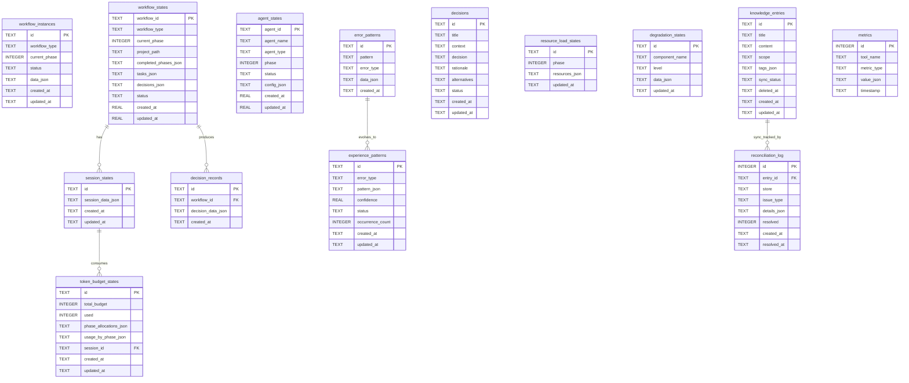

# xuansto-skill-v2 数据库/数据存储设计文档

> 版本: 1.1.0 | 最后更新: 2026-05-26

---

## 目录

1. [当前数据存储盘点](#1-当前数据存储盘点)
2. [持久化/缓存数据实体清单](#2-持久化缓存数据实体清单)
3. [数据生命周期](#3-数据生命周期)
4. [重构后数据模型](#4-重构后数据模型)
5. [ER 图](#5-er-图)
6. [数据迁移策略](#6-数据迁移策略)
7. [存储技术选型建议](#7-存储技术选型建议)

---

## 1. 当前数据存储盘点

### 1.1 SQLite 数据库

**主数据库**: `.xuansto/xuansto.db`（由 `database.py` 管理）

| 表名 | 用途 | 关键字段 |
|------|------|----------|
| `workflow_instances` | 工作流实例状态(旧表，保留) | id, workflow_type, current_phase, status, data_json |
| `session_states` | 会话状态快照 | id, session_data_json, created_at, updated_at |
| `resource_load_states` | 资源加载状态 | id, phase, resources_json, updated_at |
| `degradation_states` | 降级状态 | id, component_name, level, data_json, updated_at |
| `error_patterns` | 错误模式 | id, pattern, error_type, data_json, created_at |
| `metrics` | 工具调用指标 | id(AUTO), tool_name, metric_type, value_json, timestamp |
| `decision_records` | 决策记录 | id, workflow_id, decision_data_json, created_at |
| `knowledge_entries` | 知识条目 | id, title, content, scope, tags_json, sync_status, deleted_at |
| `reconciliation_log` | 同步对账日志 | id(AUTO), entry_id, store, issue_type, details_json, resolved |
| `token_budget_states` | Token 预算状态 | id, total_budget, used, phase_allocations_json, usage_by_phase_json, session_id |
| `experience_patterns` | 经验模式 | id, error_type, pattern_json, confidence, status, occurrence_count |
| `agent_states` | Agent实例状态(已迁移) | agent_id, agent_name, agent_type, phase, status, config_json |
| `workflow_states` | 工作流状态(已迁移) | workflow_id, workflow_type, current_phase, project_path, completed_phases_json, tasks_json, decisions_json, status |

**决策专用数据库**: `.xuansto/decisions.db`（由 `decision_log.py` 管理）

| 表名 | 用途 | 关键字段 |
|------|------|----------|
| `decisions` | 架构决策记录(ADR) | id, title, context, decision, rationale, alternatives, status |
| `decisions_fts` | 决策全文搜索(FTS5) | rowid, id(UNINDEXED), title, context, decision |

**知识库专用数据库**: `.xuansto/knowledge/index/knowledge.db`（由 `knowledge_search.py` 管理）

| 表名 | 用途 | 关键字段 |
|------|------|----------|
| `knowledge_entries` | 知识条目(搜索用) | id, title, content, type, metadata_json, created_at, updated_at |
| `knowledge_fts` | 知识全文搜索(FTS5) | rowid, content, title, type |

### 1.2 文件系统

| 路径 | 格式 | 用途 | 管理模块 |
|------|------|------|----------|
| `.xuansto/sessions/session-*.md` | Markdown | 会话历史记录 | session_manage.py |
| `.xuansto/sessions/current.json` | JSON | 当前会话追踪状态 | session_manage.py |
| `.xuansto/patterns/pattern-*.json` | JSON | 错误模式草稿 | session_manage.py |
| `.xuansto/workflows/*.json` | JSON | 工作流实例持久化 | workflow_dispatch.py |
| `.xuansto/workflow_states.json` | JSON | 活跃工作流全局快照 | workflow_dispatch.py |
| `.xuansto/agent_instances.json` | JSON | Agent 实例持久化(旧格式，已迁移) | agent_manage.py |
| `.xuansto/resource_state.json` | JSON | 资源加载状态(含完整性哈希) | resource_load_status.py |
| `.xuansto/tool_metrics.json` | JSON | 工具调用指标持久化 | server_health.py |
| `.xuansto/degradation_stats.json` | JSON | 降级统计持久化(简单计数) | server_health.py |
| `.xuansto/degradation_state.json` | JSON | 降级管理器完整状态(含组件级别、恢复尝试等) | degradation.py |
| `.xuansto/decisions.json` | JSON | 决策记录(旧格式，已迁移) | decision_log.py |
| `.xuansto/workflow_snapshots/*.json.gz` | JSON+Gzip | 工作流阶段快照 | workflow_dispatch.py |
| `.xuansto/knowledge/experience_patterns.json` | JSON | 经验模式(旧格式，已迁移) | database.py |
| `.xuansto/audit_log.jsonl` | JSONL | 工具调用审计日志 | audit_logger.py |

### 1.3 ChromaDB 向量数据库

**路径**: `.xuansto/knowledge/index/chroma_db/`

| 集合名 | 用途 | 维度 |
|--------|------|------|
| `knowledge` | 知识条目语义嵌入 | 默认(all-MiniLM-L6-v2) |

- 通过 `chromadb.PersistentClient` 管理
- 与 SQLite `knowledge_entries` 双写，`sync_status` 字段跟踪同步状态
- `reconciliation_log` 表记录同步失败和对账修复

### 1.4 内存数据结构

| 变量名 | 模块 | 类型 | 用途 |
|--------|------|------|------|
| `_TOOL_REGISTRY` | server.py | `dict[str, Any]` | 工具名→工具函数映射 |
| `_TOOL_FUNCTIONS` | server.py | `dict[str, Callable]` | 工具名→包装函数映射 |
| `_REGISTERED_TOOL_NAMES` | server.py | `list[str]` | 已注册工具名列表 |
| `_REGISTERED_RESOURCE_NAMES` | server.py | `list[str]` | 已注册资源名列表 |
| `_resource_subscriptions` | skill_resources.py | `dict[str, list[str]]` | 资源URI→订阅客户端列表 |
| `_ACTIVE_WORKFLOWS` | workflow_dispatch.py | `dict[str, dict]` | 活跃工作流实例缓存 |
| `_AGENT_INSTANCES` | agent_manage.py | `dict[str, _AgentInstance]` | Agent实例内存缓存 |
| `_TOOL_METRICS` | server_health.py | `dict[str, dict]` | 工具调用指标内存缓存 |
| `_DEGRADATION_COUNTS` | server_health.py | `dict[str, int]` | 降级计数内存缓存 |
| `_RESTORED_STATE` | session_manage.py | `dict \| None` | 启动时恢复的会话状态 |
| `_cache` | decision_log.py | `dict[str, dict]` | 决策记录内存缓存 |
| `_TRANSITION_HISTORY` | resource_load_status.py | `list[dict]` | 阶段转换历史 |
| `_TOKEN_METRICS` | resource_load_status.py | `dict[str, dict]` | Token使用指标 |
| `_PHASE_TOKEN_USAGE` | resource_load_status.py | `dict[int, dict]` | 按阶段的Token使用 |
| `_current_phase` | resource_load_status.py | `int` | 当前加载阶段 |
| `_loaded_resources` | resource_load_status.py | `set[str] \| None` | 已加载资源集合 |
| `_resource_lru` | resource_load_status.py | `LRUCache` | 资源内容LRU缓存(maxsize=100) |
| `_LOADED_PROGRESS` | resource_load_status.py | `dict` | 加载进度追踪 |
| `_phase_state` | resource_load_status.py | `dict` | 阶段指标和转换时间戳 |
| `_MANAGER` | degradation.py | `DegradationManager` | 降级管理器单例 |
| `_MANAGER._components` | degradation.py | `dict[str, _ComponentState]` | 组件降级状态 |
| `_MANAGER._subscribers` | degradation.py | `list[Callable]` | 降级事件订阅者 |

### 1.5 JSON/YAML 配置文件

| 路径 | 格式 | 用途 | 热重载 |
|------|------|------|--------|
| `.skill-config.yaml` | YAML | 技能配置(门禁脚本、Hook脚本、降级配置) | ✅ watchfiles/SIGHUP |
| `.xuansto-config.yaml` | YAML | 运行时配置(同上，优先级更高) | ✅ watchfiles/SIGHUP |
| `constraints.yaml` | YAML | 核心约束定义(Token预算、资源优先级、降级策略) | ❌ |
| `hooks/hooks.json` | JSON | Hook定义 | ❌ |
| `configs/default.yaml` | YAML | 默认配置 | ❌ |
| `data/fallback_config.yaml` | YAML | 降级回退配置(自定义fallback_map) | ✅ watchfiles/polling(5s) |

---

## 2. 持久化/缓存数据实体清单

### 2.1 knowledge_entry（知识条目）

```json
{
  "id": "kb-20260525-001",
  "title": "React组件设计模式",
  "content": "使用Compound Components模式...",
  "scope": "general",
  "tags_json": ["react", "design-pattern", "frontend"],
  "sync_status": "ready",
  "deleted_at": null,
  "created_at": "2026-05-25T10:00:00+08:00",
  "updated_at": "2026-05-25T10:00:00+08:00"
}
```

| 属性 | 说明 |
|------|------|
| 存储类型 | SQLite (xuansto.db + knowledge.db) + ChromaDB |
| CRUD触发 | C: knowledge_inject / SDD阶段知识沉淀; R: knowledge_search; U: knowledge_inject(update); D: 软删除(deleted_at) |
| 同步机制 | 双写: 先写SQLite(sync_status=pending)，再写ChromaDB，成功后更新为ready |

### 2.2 session_state（会话状态）

```json
{
  "id": "session-20260525-100000",
  "session_data_json": {
    "current_phase": 4,
    "current_task": "实现用户认证模块",
    "decisions": ["ADR-20260525-001"],
    "pending_tasks": ["编写集成测试", "代码审查"],
    "completed_phases": [0, 1, 2, 3],
    "timestamp": "2026-05-25T10:00:00+08:00",
    "updated_at": "2026-05-25T14:30:00+08:00"
  },
  "created_at": "2026-05-25T10:00:00+08:00",
  "updated_at": "2026-05-25T14:30:00+08:00"
}
```

| 属性 | 说明 |
|------|------|
| 存储类型 | SQLite (xuansto.db) + 文件系统 (sessions/current.json + session-*.md) |
| CRUD触发 | C: session_manage(track); R: session_manage(restore); U: session_manage(track); D: _cleanup_old_sessions(保留最近10个) |

### 2.3 decision_log（决策日志）

```json
{
  "id": "ADR-20260525-001",
  "title": "选择JWT作为认证方案",
  "context": "需要无状态认证机制以支持微服务架构",
  "decision": "采用JWT + Refresh Token双令牌方案",
  "rationale": "无状态、可水平扩展、行业标准",
  "alternatives": ["Session Cookie", "OAuth2 Token", "API Key"],
  "status": "accepted",
  "created_at": "2026-05-25T10:00:00+08:00",
  "updated_at": "2026-05-25T10:00:00+08:00"
}
```

| 属性 | 说明 |
|------|------|
| 存储类型 | SQLite (decisions.db + xuansto.db decision_records) |
| CRUD触发 | C: decision_log(log); R: decision_log(list/query); U: decision_log(update); D: 无(决策不可删除) |

### 2.4 workflow_state（工作流状态）

```json
{
  "workflow_id": "wf-a1b2c3d4",
  "workflow_type": "sdd-tdd-full",
  "current_phase": 4,
  "project_path": "/path/to/project",
  "completed_phases_json": [0, 1, 2, 3],
  "tasks_json": {},
  "decisions_json": {},
  "status": "active",
  "created_at": 1748150400.0,
  "updated_at": 1748150400.0
}
```

| 属性 | 说明 |
|------|------|
| 存储类型 | SQLite (workflow_states) + 文件系统 (workflows/*.json + workflow_states.json) + 内存 (_ACTIVE_WORKFLOWS) |
| CRUD触发 | C: save_workflow_state / workflow_dispatch(start); R: load_workflow_states / workflow_dispatch(status); U: save_workflow_state / workflow_dispatch(phase/advance); D: delete_workflow_state / workflow_dispatch(abort) |
| 注意 | SQLite表中时间戳为REAL类型(unix时间戳)，文件系统中同时保留JSON格式持久化 |

### 2.5 agent_state（Agent实例状态）

```json
{
  "agent_id": "agent-e5f6g7h8",
  "agent_name": "engineering-agent",
  "agent_type": "engineering",
  "phase": 2,
  "status": "active",
  "config_json": {
    "capabilities": ["code-generation", "test-writing", "refactoring"],
    "max_concurrent_tasks": 3
  },
  "created_at": 1748150400.0,
  "updated_at": 1748150400.0
}
```

| 属性 | 说明 |
|------|------|
| 存储类型 | SQLite (agent_states) + 文件系统 (agent_instances.json，旧格式备份) + 内存 (_AGENT_INSTANCES) |
| CRUD触发 | C: save_agent_state / agent_manage(create); R: load_agent_states / agent_manage(instance_status); U: save_agent_state / agent_manage(assign/release); D: delete_agent_state / agent_manage(destroy) |
| 注意 | SQLite表中时间戳为REAL类型(unix时间戳)。status默认值为'active'，非文档最初设计的'idle' |

### 2.6 resource_state（资源加载状态）

```json
{
  "version": 3,
  "updated_at": "2026-05-25T14:30:00+08:00",
  "phase": "enhanced",
  "loaded": ["skill-config", "agent-registry", "quality-gates", "knowledge-general"],
  "resources": {
    "skill-config": {"status": "loaded", "phase": 0, "type": "config", "path": ".skill-config.yaml"},
    "agent-registry": {"status": "loaded", "phase": 1, "type": "reference", "path": "references/agent-registry.md"}
  },
  "_timestamp": 1748150400.0,
  "_hash": "sha256..."
}
```

| 属性 | 说明 |
|------|------|
| 存储类型 | 文件系统 (resource_state.json) + SQLite (resource_load_states) + 内存 (_loaded_resources, _resource_lru) |
| CRUD触发 | C: resource_load_status(preload); R: resource_load_status(status); U: 阶段推进/资源加载; D: resource_load_status(clear_cache) |

### 2.7 tool_metrics（工具调用指标）

```json
{
  "workflow_dispatch": {
    "call_count": 42,
    "error_count": 3,
    "latencies": [120.5, 85.3, 210.7, 95.1]
  },
  "knowledge_search": {
    "call_count": 128,
    "error_count": 1,
    "latencies": [45.2, 38.9, 52.1]
  }
}
```

| 属性 | 说明 |
|------|------|
| 存储类型 | 文件系统 (tool_metrics.json) + SQLite (metrics) + 内存 (_TOOL_METRICS) |
| CRUD触发 | C: record_tool_call(每次工具调用); R: server_health; U: 持续追加; D: cleanup_metrics(>30天) |
| 注意 | 内存中latencies列表最多保留1000条，持久化时截断为最近100条 |

### 2.8 degradation_stats（降级统计）

```json
{
  "chromadb_unavailable": 3,
  "script_timeout": 1,
  "fts5_degraded": 0
}
```

| 属性 | 说明 |
|------|------|
| 存储类型 | 文件系统 (degradation_stats.json) + SQLite (degradation_states) + 内存 (_DEGRADATION_COUNTS) |
| CRUD触发 | C: track_degradation(降级事件); R: server_health; U: 降级恢复时清零; D: 无 |

### 2.9 degradation_state（降级管理器完整状态）

```json
{
  "overall_level": "L1_NORMAL",
  "components": {
    "search_engine": {
      "name": "search_engine",
      "level": "chromadb",
      "last_check_time": 1748150400.0,
      "last_check_healthy": true,
      "recovery_attempts": 0,
      "next_recovery_time": 0.0,
      "degraded_since": null
    }
  },
  "health_interval": 30.0,
  "started": true,
  "_timestamp": 1748150400.0,
  "_hash": "sha256..."
}
```

| 属性 | 说明 |
|------|------|
| 存储类型 | 文件系统 (degradation_state.json) + 内存 (DegradationManager._components) |
| CRUD触发 | C: register_component; R: get_status; U: check_and_degrade / attempt_recovery; D: 无 |
| 注意 | 与 degradation_stats.json 不同，此文件由 DegradationManager 管理，包含完整的组件状态、恢复尝试次数等。degradation_stats.json 仅包含简单计数 |

### 2.10 audit_log（审计日志）

```json
{
  "timestamp": 1748150400.0,
  "tool": "workflow_dispatch",
  "params_summary": {"action": "start", "workflow": "sdd-tdd-full"},
  "success": true,
  "latency_ms": 85.3,
  "result_summary": {"error": false, "keys": ["status", "workflow_id"]}
}
```

| 属性 | 说明 |
|------|------|
| 存储类型 | 文件系统 (audit_log.jsonl，JSONL格式追加写入) |
| CRUD触发 | C: AuditLogger.log(每次工具调用); R: AuditLogger.query(按工具名过滤); D: 无(仅追加) |
| 注意 | 采用JSONL格式而非SQLite表，便于高吞吐追加写入和外部工具消费。每行一条JSON记录 |

### 2.11 config（配置）

```json
{
  "gate_scripts": {
    "GATE-007": "check-encoding.py",
    "TEST-PASS": "coverage-check.py"
  },
  "gates_by_phase": {
    "0": ["DESIGN-SYSTEM-COMPLETE", "ANTI-PATTERN-CHECK"],
    "1": ["BRAINSTORM-COMPLETE", "GATE-001"]
  },
  "hook_scripts": {
    "security-block": null,
    "token-budget-check": "token-budget-guard.py"
  },
  "degradation": {
    "health_check_interval": 30.0
  }
}
```

| 属性 | 说明 |
|------|------|
| 存储类型 | YAML文件 (.xuansto-config.yaml / .skill-config.yaml) + 内存 (GATE_SCRIPTS_MAP等) |
| CRUD触发 | C: 首次加载; R: 各模块运行时; U: reload_config(热重载); D: 无 |

### 2.12 hook_definition（Hook定义）

```json
{
  "hooks": {
    "security-block": {
      "script": null,
      "trigger": "pre_command",
      "description": "安全阻断检查"
    },
    "token-budget-check": {
      "script": "token-budget-guard.py",
      "trigger": "pre_phase",
      "description": "Token预算检查"
    }
  }
}
```

| 属性 | 说明 |
|------|------|
| 存储类型 | JSON文件 (hooks/hooks.json) + YAML配置 (hook_scripts) |
| CRUD触发 | C: 技能安装; R: hook_manage; U: hook_manage(update); D: hook_manage(remove) |

---

## 3. 数据生命周期

### 3.1 生命周期总览表

| 实体 | 创建触发 | 读取触发 | 更新触发 | 删除/清理触发 |
|------|----------|----------|----------|--------------|
| knowledge_entry | knowledge_inject(inject/precipitate) | knowledge_search(retrieve) | knowledge_inject(update) | 软删除(deleted_at)，物理删除由对账执行 |
| session_state | session_manage(track) | session_manage(restore/load) | session_manage(track) | _cleanup_old_sessions(>10个) |
| decision_log | decision_log(log) | decision_log(list/query) | decision_log(update) | 永久保留 |
| workflow_state | save_workflow_state / workflow_dispatch(start) | load_workflow_states / workflow_dispatch(status) | save_workflow_state / workflow_dispatch(phase/advance) | delete_workflow_state / workflow_dispatch(abort)，快照TTL=30天 |
| agent_state | save_agent_state / agent_manage(create) | load_agent_states / agent_manage(instance_status) | save_agent_state / agent_manage(assign/release) | delete_agent_state / agent_manage(destroy) |
| resource_state | 首次preload | resource_load_status(status) | 阶段推进/资源加载 | clear_cache |
| tool_metrics | record_tool_call | server_health | 持续追加 | cleanup_metrics(>30天) |
| degradation_stats | track_degradation | server_health | 降级事件/恢复 | 无 |
| degradation_state | register_component | get_status | check_and_degrade / attempt_recovery | 无 |
| audit_log | AuditLogger.log(每次工具调用) | AuditLogger.query | 仅追加 | 无(归档策略待实现) |
| config | 首次加载/文件创建 | 各模块运行时 | reload_config(热重载) | 文件删除 |
| hook_definition | 技能安装 | hook_manage | hook_manage(update) | hook_manage(remove) |

### 3.2 关键生命周期流程

#### 知识条目双写流程

```
knowledge_inject(inject)
  ├── 1. 写入 SQLite knowledge_entries (sync_status=pending)
  ├── 2. 写入 ChromaDB collection
  │   ├── 成功 → 更新 sync_status=ready
  │   └── 失败 → 记录 reconciliation_log (issue_type=write_failed/write_error)
  └── 3. reconcile_knowledge_stores() 定期对账
      ├── 查询所有 sync_status!=ready 的条目
      ├── 重试 ChromaDB 写入
      └── 记录对账结果到 reconciliation_log
```

#### 工作流状态持久化流程

```
workflow_dispatch(start)
  ├── 1. 生成 workflow_id (wf-{uuid8})
  ├── 2. 写入 _ACTIVE_WORKFLOWS 内存
  ├── 3. _persist_workflow() → .xuansto/workflows/{id}.json (含SHA256完整性哈希)
  ├── 4. _persist_active_workflows() → .xuansto/workflow_states.json
  └── 5. save_workflow_state() → SQLite workflow_states 表

workflow_dispatch(phase/advance)
  ├── 1. 检查质量门禁
  ├── 2. 更新 current_phase, completed_phases
  ├── 3. _persist_workflow() (单实例)
  ├── 4. _persist_active_workflows() (全局快照)
  ├── 5. save_workflow_state() → SQLite workflow_states 表
  └── 6. _save_snapshot() → .xuansto/workflow_snapshots/{id}_phase{N}_{ts}.json.gz

启动恢复:
  └── load_on_startup() → 从 workflows/*.json 恢复到 _ACTIVE_WORKFLOWS
```

#### 工具指标持久化流程

```
record_tool_call(tool_name, latency_ms, success)
  ├── 1. 更新 _TOOL_METRICS 内存
  ├── 2. _metrics_persist_count++
  └── 3. 满足条件时持久化:
      ├── _metrics_persist_count >= 100 (调用阈值)
      └── time - _last_metrics_persist_time >= 60s (时间阈值)
          ├── _persist_metrics() → tool_metrics.json
          └── _persist_metrics() → degradation_stats.json
```

#### 降级管理器状态持久化流程

```
DegradationManager.check_and_degrade() / attempt_recovery()
  ├── 1. 更新 _components 内存状态
  ├── 2. _update_overall_level() 计算全局降级级别
  ├── 3. _notify() 通知订阅者 + MCP通知
  └── 4. _persist_state() → degradation_state.json (含SHA256完整性哈希)

启动恢复:
  └── load_state() → 从 degradation_state.json 恢复组件状态
      ├── 验证 _hash 完整性
      └── 仅恢复已注册组件的状态
```

#### 审计日志写入流程

```
AuditLogger.log(tool_name, params, result, latency_ms, success)
  ├── 1. _summarize_params() 参数脱敏(字符串>200截断, 集合>500摘要)
  ├── 2. _summarize_result() 结果摘要(error标志 + keys列表)
  └── 3. 追加写入 audit_log.jsonl (每行一条JSON)

查询:
  └── AuditLogger.query(tool_name=None, limit=100)
      └── 从文件末尾倒序读取，按tool_name过滤
```

---

## 4. 重构后数据模型

### 4.1 已完成的迁移

#### 4.1.1 agent_states 表（✅ 已完成 — 从 agent_instances.json 迁移至 SQLite）

**实际 SQLite DDL（当前代码）:**

```sql
CREATE TABLE IF NOT EXISTS agent_states (
    agent_id TEXT PRIMARY KEY,
    agent_name TEXT NOT NULL,
    agent_type TEXT NOT NULL,
    phase INTEGER,
    status TEXT DEFAULT 'active',
    config_json TEXT,
    created_at REAL,
    updated_at REAL
);

CREATE INDEX IF NOT EXISTS idx_agent_states_status ON agent_states(status);
CREATE INDEX IF NOT EXISTS idx_agent_states_agent_type ON agent_states(agent_type);
```

**与原始设计文档的差异:**

| 差异项 | 原始设计 | 实际实现 | 说明 |
|--------|----------|----------|------|
| 主键字段名 | `id` | `agent_id` | 遵循语义命名 |
| agent_name | 无 | `agent_name TEXT NOT NULL` | 新增字段，Agent名称 |
| phase | 无 | `phase INTEGER` | 新增字段，Agent所属阶段 |
| capabilities_json | 有 | 无 | 移入config_json |
| current_task | 有 | 无 | 移入config_json |
| history_json | 有 | 无 | 移入config_json |
| task_count | 有 | 无 | 移入config_json |
| total_duration_ms | 有 | 无 | 移入config_json |
| last_active_at | 有 | 无 | 移入config_json |
| config_json | 无 | `config_json TEXT` | 新增字段，承载扩展数据 |
| status默认值 | `idle` | `active` | 实际使用'active' |
| status约束 | CHECK(idle/busy/destroyed) | 无CHECK约束 | 实际未添加约束 |
| 时间戳格式 | TEXT(ISO 8601) | REAL(unix时间戳) | 使用浮点数时间戳 |
| 索引 | 含idx_agent_states_last_active | 无此索引 | last_active_at字段不存在 |

**专用CRUD函数（不通过 persist_state/load_state 通用接口）:**

```python
save_agent_state(agent_id, name, agent_type, phase, status, config)  # UPSERT
load_agent_states(status="active")  # 按状态查询，返回列表
delete_agent_state(agent_id)  # 物理删除
```

#### 4.1.2 workflow_states 表（✅ 已完成 — 从 workflow JSON文件迁移至 SQLite）

**实际 SQLite DDL（当前代码）:**

```sql
CREATE TABLE IF NOT EXISTS workflow_states (
    workflow_id TEXT PRIMARY KEY,
    workflow_type TEXT NOT NULL,
    current_phase INTEGER DEFAULT 0,
    project_path TEXT,
    completed_phases_json TEXT,
    tasks_json TEXT,
    decisions_json TEXT,
    status TEXT DEFAULT 'active',
    created_at REAL,
    updated_at REAL
);

CREATE INDEX IF NOT EXISTS idx_workflow_states_status ON workflow_states(status);
CREATE INDEX IF NOT EXISTS idx_workflow_states_workflow_type ON workflow_states(workflow_type);
```

**与原始设计文档的差异:**

| 差异项 | 原始设计 | 实际实现 | 说明 |
|--------|----------|----------|------|
| 主键字段名 | `id` | `workflow_id` | 遵循语义命名 |
| tasks_json | 无 | `tasks_json TEXT` | 新增字段，任务数据 |
| decisions_json | 无 | `decisions_json TEXT` | 新增字段，决策数据 |
| phase_definitions_json | 有 | 无 | 未实现，仍存储在文件中 |
| started_at | 有 | 无 | 未实现 |
| completed_at | 有 | 无 | 未实现 |
| aborted_at | 有 | 无 | 未实现 |
| data_json | 有 | 无 | 扩展数据分散到具体字段 |
| status默认值 | `running` | `active` | 实际使用'active' |
| status约束 | CHECK(running/completed/aborted) | 无CHECK约束 | 实际未添加约束 |
| 时间戳格式 | TEXT(ISO 8601) | REAL(unix时间戳) | 使用浮点数时间戳 |
| 索引 | 含idx_workflow_states_project, idx_workflow_states_updated_at | 无此二索引 | 未创建 |

**专用CRUD函数（不通过 persist_state/load_state 通用接口）:**

```python
save_workflow_state(workflow_id, workflow_type, current_phase, project_path, completed_phases, tasks, decisions, status)  # UPSERT
load_workflow_states(status="active")  # 按状态查询，返回列表
delete_workflow_state(workflow_id)  # 物理删除
```

**注意:** `persist_state()` 和 `load_state()` 的 `_VALID_TABLES` 集合不包含 `agent_states` 和 `workflow_states`，这两个表使用专用函数操作。

#### 4.1.3 experience_patterns 迁移（✅ 已完成）

`migrate_experience_patterns_from_json()` 函数已实现，将 `.xuansto/knowledge/experience_patterns.json` 迁移到 SQLite `experience_patterns` 表。

### 4.2 待实现的迁移

#### 4.2.1 progressive_loading_states 表（❌ 未实现）

原计划将 `resource_state.json` 迁移至 SQLite `progressive_loading_states` 表，当前仍使用文件系统 + 内存数据结构。

**当前实现方式:**
- 文件: `.xuansto/resource_state.json`（含SHA256完整性哈希）
- 内存: `_loaded_resources`, `_resource_lru`(LRUCache), `_TRANSITION_HISTORY`, `_PHASE_TOKEN_USAGE`, `_TOKEN_METRICS`, `_phase_state`
- SQLite: `resource_load_states` 表（存在但使用较少）

**原设计DDL（待实现）:**

```sql
CREATE TABLE IF NOT EXISTS progressive_loading_states (
    id TEXT PRIMARY KEY,
    current_phase INTEGER NOT NULL DEFAULT 0,
    phase_history_json TEXT NOT NULL DEFAULT '[]',
    token_budget_per_phase_json TEXT NOT NULL DEFAULT '{"0": 2000, "1": 5000, "2": 10000, "3": 20000}',
    loaded_resources_json TEXT NOT NULL DEFAULT '{}',
    performance_metrics_json TEXT NOT NULL DEFAULT '{}',
    available_functions_json TEXT NOT NULL DEFAULT '{}',
    updated_at TEXT NOT NULL
);

CREATE INDEX IF NOT EXISTS idx_progressive_loading_phase ON progressive_loading_states(current_phase);
```

#### 4.2.2 audit_log SQLite 表（❌ 未实现 — 改用JSONL方案）

原计划创建 SQLite `audit_log` 表，实际改用 JSONL 文件方案（`audit_log.jsonl`），由 `core/audit_logger.py` 中的 `AuditLogger` 类管理。

**实际实现（JSONL方案）:**

```python
class AuditLogger:
    def __init__(self, log_dir: Path):
        self._log_path = log_dir / "audit_log.jsonl"

    def log(self, tool_name, params, result, latency_ms, success):
        entry = {
            "timestamp": time.time(),          # REAL(unix时间戳)
            "tool": tool_name,
            "params_summary": ...,             # 脱敏后的参数摘要
            "success": success,                # bool
            "latency_ms": round(latency_ms, 2),
            "result_summary": ...,             # 结果摘要
        }
        # 追加写入JSONL文件

    def query(self, tool_name=None, limit=100):
        # 从文件末尾倒序读取
```

**JSONL vs SQLite 对比:**

| 维度 | SQLite表(原设计) | JSONL文件(实际) |
|------|-----------------|----------------|
| 写入性能 | 需获取锁、事务开销 | 追加写入，零开销 |
| 查询灵活性 | SQL查询、索引 | 需全文件扫描 |
| 并发安全 | WAL模式 | 文件锁 |
| 外部消费 | 需SQLite客户端 | ELK/Splunk直接消费 |
| 归档 | 需定期DELETE+VACUUM | 日志轮转、压缩 |

#### 4.2.3 session_states 增强（❌ 未实现）

原计划新增 `workflow_id`, `phase`, `token_usage_json` 字段，当前仍为原始结构：

```sql
-- 当前实际DDL（未变更）
CREATE TABLE IF NOT EXISTS session_states (
    id TEXT PRIMARY KEY,
    session_data_json TEXT NOT NULL DEFAULT '{}',
    created_at TEXT NOT NULL,
    updated_at TEXT NOT NULL
);
```

#### 4.2.4 metrics 增强（❌ 未实现）

原计划新增 `p50_ms`, `p95_ms`, `p99_ms`, `window_start`, `window_end` 字段。

当前百分位延迟在 `server_health.py` 中通过 `_calculate_percentile()` 从内存中的 `_TOOL_METRICS` 实时计算，未持久化到SQLite。

### 4.3 workflow_instances 旧表状态

`workflow_instances` 表仍然存在于数据库中（与新的 `workflow_states` 并存），DDL如下：

```sql
CREATE TABLE IF NOT EXISTS workflow_instances (
    id TEXT PRIMARY KEY,
    workflow_type TEXT NOT NULL DEFAULT '',
    current_phase INTEGER NOT NULL DEFAULT 0,
    status TEXT NOT NULL DEFAULT 'running',
    created_at TEXT NOT NULL,
    updated_at TEXT NOT NULL,
    data_json TEXT NOT NULL DEFAULT '{}'
);
```

此表可通过 `persist_state()` / `load_state()` 通用接口访问，但新代码应优先使用 `workflow_states` 表及其专用CRUD函数。

---

## 5. ER 图



---

## 6. 数据迁移策略

### 6.1 迁移原则

1. **零数据丢失**: 所有迁移必须可逆，迁移前自动备份
2. **渐进式迁移**: 逐个实体迁移，不一次性切换
3. **双写过渡**: 迁移期间同时写旧存储和新存储，读取优先从新存储
4. **验证后切换**: 数据一致性验证通过后，才切换到新存储

### 6.2 迁移阶段

#### 阶段一: agent_instances.json → agent_states 表 ✅ 已完成

```
迁移状态: 已完成

实际实现:
1. agent_states 表已在 database.py 中创建
2. 专用CRUD函数已实现: save_agent_state(), load_agent_states(), delete_agent_state()
3. 时间戳使用REAL类型(unix时间戳)而非TEXT(ISO 8601)
4. 字段结构与原设计有差异(见4.1.1节)
5. persist_state()/load_state() 通用接口不包含此表

待办:
- 考虑添加 status CHECK约束
- 考虑将时间戳统一为ISO 8601格式
```

#### 阶段二: workflow JSON文件 → workflow_states 表 ✅ 已完成

```
迁移状态: 已完成

实际实现:
1. workflow_states 表已在 database.py 中创建
2. 专用CRUD函数已实现: save_workflow_state(), load_workflow_states(), delete_workflow_state()
3. 时间戳使用REAL类型(unix时间戳)而非TEXT(ISO 8601)
4. 字段结构与原设计有差异(见4.1.2节)
5. persist_state()/load_state() 通用接口不包含此表
6. workflow_instances 旧表仍保留，未删除

待办:
- 考虑添加 status CHECK约束
- 考虑将时间戳统一为ISO 8601格式
- 考虑添加 project_path, updated_at 索引
- 评估是否可以删除 workflow_instances 旧表
```

#### 阶段三: resource_state.json → progressive_loading_states 表 ❌ 未实现

```
迁移状态: 未实现

当前状态:
- 仍使用 resource_state.json 文件 + 内存数据结构
- resource_load_states SQLite表存在但使用较少
- 渐进式加载状态主要在内存中管理

迁移脚本: migrate_resource_state_to_sqlite()（待实现）

1. 读取 .xuansto/resource_state.json
2. 解析 phase → current_phase (skeleton→0, functional→1, enhanced→2, full→3)
3. 转换 loaded/resources → loaded_resources_json
4. 初始化 phase_history_json (从 _TRANSITION_HISTORY 内存)
5. 写入 progressive_loading_states 表
6. 双写期: resource_load_status.py 同时写JSON和SQLite
7. 切换: 验证通过后，JSON写入降级为备份
```

#### 阶段四: tool_metrics.json + degradation_stats.json → metrics 表 + audit_log ❌ 部分变更

```
迁移状态: 部分变更 — audit_log改用JSONL方案

实际变更:
1. audit_log: 改用JSONL文件方案(audit_log.jsonl)，由AuditLogger类管理
   - 原因: JSONL追加写入性能更优，便于外部工具消费
   - MCP Resource: xuansto://audit/log 暴露最近50条记录
2. metrics表: 未增强(未添加百分位延迟字段)
   - 百分位延迟在server_health.py中从内存实时计算
3. degradation_state.json: 新增DegradationManager管理的完整状态文件
   - 与degradation_stats.json并存，后者仅含简单计数

待办:
- 评估是否仍需SQLite audit_log表(当前JSONL方案满足需求)
- 考虑metrics表增强(百分位延迟持久化)
- 统一degradation_state.json和degradation_stats.json
```

### 6.3 迁移执行框架

```python
def run_migrations() -> dict[str, Any]:
    results = {}
    migrations = [
        ("agent_instances", migrate_agent_instances_to_sqlite),      # ✅ 已完成
        ("workflow_files", migrate_workflow_files_to_sqlite),        # ✅ 已完成
        ("experience_patterns", migrate_experience_patterns_from_json),  # ✅ 已完成
        ("resource_state", migrate_resource_state_to_sqlite),       # ❌ 待实现
        ("metrics", migrate_metrics_to_sqlite),                     # ❌ 待实现
    ]
    for name, migration_fn in migrations:
        try:
            result = migration_fn()
            results[name] = {"status": "success", **result}
        except Exception as exc:
            results[name] = {"status": "failed", "error": str(exc)}
            logger.error("Migration %s failed: %s", name, exc)
    return results
```

### 6.4 回滚策略

| 场景 | 回滚方案 |
|------|----------|
| 迁移脚本执行失败 | 事务回滚，JSON文件未被修改 |
| 双写期SQLite写入失败 | 降级到仅写JSON，记录错误 |
| 切换后发现问题 | 从JSON备份文件恢复，禁用SQLite读取 |
| 数据不一致 | 从 reconciliation_log 定位差异，手动修复 |
| agent_states/workflow_states回滚 | 从agent_instances.json / workflows/*.json恢复 |

---

## 7. 存储技术选型建议

### 7.1 选型矩阵

| 存储技术 | 适用场景 | 选型实体 | 理由 |
|----------|----------|----------|------|
| **SQLite** | 结构化数据、事务性操作、复杂查询 | agent_states, workflow_states, session_states, decision_records, metrics, resource_load_states, knowledge_entries, token_budget_states, experience_patterns, error_patterns, degradation_states, reconciliation_log, workflow_instances(旧) | 单文件部署、零配置、WAL模式支持并发读、FTS5全文搜索、ACID事务、成熟稳定 |
| **ChromaDB** | 向量语义搜索、嵌入存储 | knowledge (collection) | 原生向量检索、PersistentClient持久化、与SQLite双写保证可靠性 |
| **JSONL** | 仅追加审计日志、高吞吐写入 | audit_log (audit_log.jsonl) | 顺序写入高效、易于压缩归档、支持日志轮转、可被外部工具(ELK)消费 |
| **YAML** | 人类可读配置、热重载 | .skill-config.yaml, .xuansto-config.yaml, constraints.yaml, fallback_config.yaml | 配置可读性、支持注释、watchfiles热重载、Git友好 |
| **JSON** | 简单状态快照、临时缓存 | resource_state.json, workflow_states.json, degradation_state.json, degradation_stats.json, tool_metrics.json | 调试友好、原子写入、完整性哈希校验 |
| **Markdown** | 会话记录、文档 | sessions/session-*.md | 人类可读、Git diff友好、MCP Resource直接返回 |
| **Gzip+JSON** | 大体积快照、历史归档 | workflow_snapshots/*.json.gz | 压缩率高(60-80%)、原子写入、按需解压读取 |
| **LRUCache(内存)** | 高频读取、短期缓存 | 资源内容缓存(maxsize=100, TTL=3600s) | 零IO延迟、TTL过期、容量限制、哈希校验 |

### 7.2 存储分层架构

```
┌─────────────────────────────────────────────────────────┐
│                    应用层 (Tools/Resources)               │
├─────────────────────────────────────────────────────────┤
│                    数据访问层 (DAL)                       │
│  ┌──────────┐  ┌──────────┐  ┌──────────┐              │
│  │ SQLite   │  │ ChromaDB │  │  File    │              │
│  │ Gateway  │  │ Gateway  │  │ Gateway  │              │
│  │(通用+专用)│  │          │  │          │              │
│  └────┬─────┘  └────┬─────┘  └────┬─────┘              │
├───────┼──────────────┼──────────────┼───────────────────┤
│       ▼              ▼              ▼                    │
│  ┌──────────┐  ┌──────────┐  ┌──────────┐              │
│  │ xuansto  │  │ chroma_db│  │ sessions │              │
│  │   .db    │  │    /     │  │ patterns │              │
│  │decisions │  │          │  │workflows │              │
│  │  .db     │  │          │  │ snapshots│              │
│  │knowledge │  │          │  │  *.json  │              │
│  │   .db    │  │          │  │  *.jsonl │              │
│  └──────────┘  └──────────┘  └──────────┘              │
├─────────────────────────────────────────────────────────┤
│                    持久化层 (磁盘)                        │
│         .xuansto/  +  skill_root/data/                  │
└─────────────────────────────────────────────────────────┘
```

### 7.3 数据一致性保障

| 机制 | 适用范围 | 说明 |
|------|----------|------|
| WAL模式 | 所有SQLite数据库 | journal_mode=WAL，支持并发读写 |
| 原子写入 | JSON文件 | atomic_write: 写临时文件→rename替换 |
| SHA256完整性哈希 | resource_state.json, degradation_state.json, workflow_states.json | 写入时计算哈希，读取时校验 |
| 双写+sync_status | knowledge_entries ↔ ChromaDB | SQLite为主存储，ChromaDB为索引，sync_status跟踪同步状态 |
| reconciliation_log | knowledge_entries 同步 | 记录同步失败和修复结果 |
| 线程锁 | 内存数据结构 | _db_lock, _workflows_lock, _agents_lock, _metrics_lock, _cache_lock, _phase_lock, _MANAGER_LOCK, _TOKEN_METRICS_LOCK, _PHASE_TOKEN_USAGE_LOCK |
| busy_timeout | SQLite连接 | PRAGMA busy_timeout=5000，等待锁释放 |
| foreign_keys | SQLite连接 | PRAGMA foreign_keys=ON |
| 定期对账 | knowledge_entries | reconcile_knowledge_stores() 修复pending条目 |

### 7.4 数据清理策略

| 实体 | 清理规则 | 触发方式 |
|------|----------|----------|
| metrics | 保留30天 | cleanup_metrics() 定期执行 |
| session Markdown | 保留最近10个 | _cleanup_old_sessions() 每次保存时 |
| workflow snapshots | 每工作流最多20个，TTL=30天 | _cleanup_snapshots() 每次保存时 |
| audit_log(JSONL) | 无自动清理(待实现归档) | 手动/定期任务 |
| reconciliation_log | 已解决记录保留7天 | 定期任务(待实现) |
| LRU缓存 | TTL=3600s，最大100条 | _cleanup_cache() 每次preload时 |
| experience_patterns | status=superseded 保留30天 | 定期任务(待实现) |
| tool_metrics内存latencies | 每工具最多1000条 | record_tool_call() 自动截断 |
| tool_metrics持久化latencies | 每工具最多100条 | _persist_metrics() 自动截断 |

### 7.5 备份与恢复

| 策略 | 说明 |
|------|------|
| SQLite备份 | `sqlite3 .db ".backup backup.db"` — 在线热备 |
| JSON快照 | 迁移期间保留原始JSON文件作为备份 |
| 工作流快照 | 每阶段推进自动创建gzip压缩快照 |
| 配置版本化 | .skill-config.yaml 通过Git版本控制 |
| 恢复优先级 | SQLite > JSON文件 > 内存重建 |
| 降级状态恢复 | DegradationManager.load_state() 从degradation_state.json恢复 |
