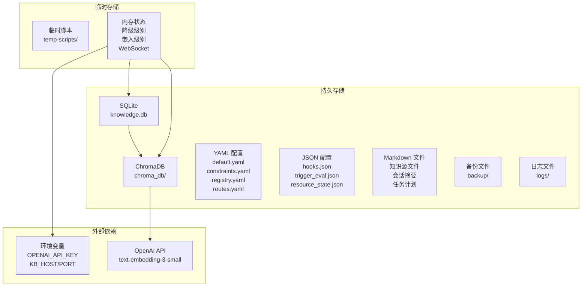
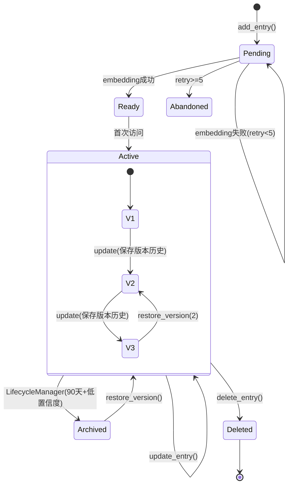
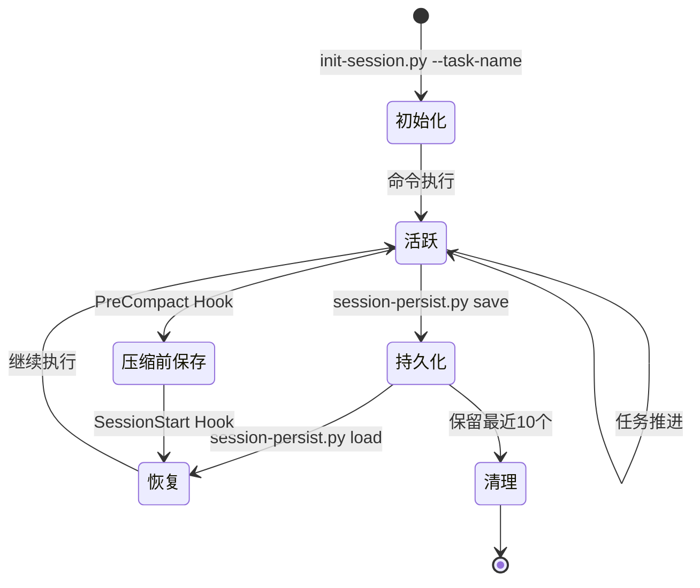
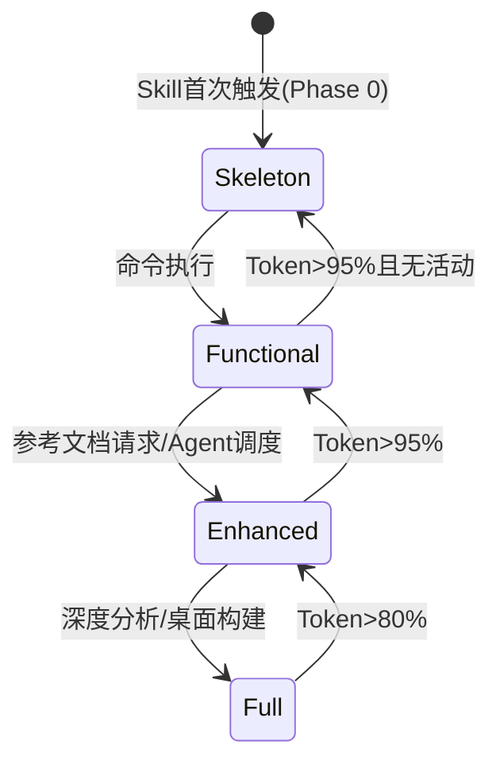
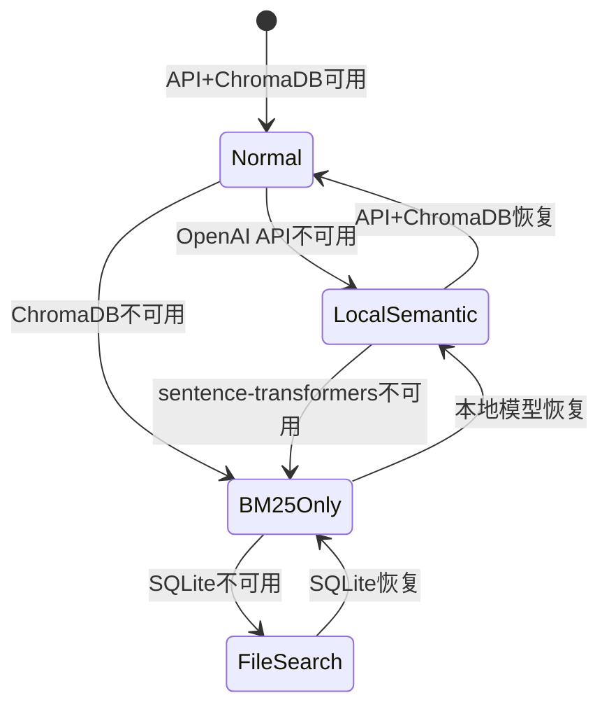
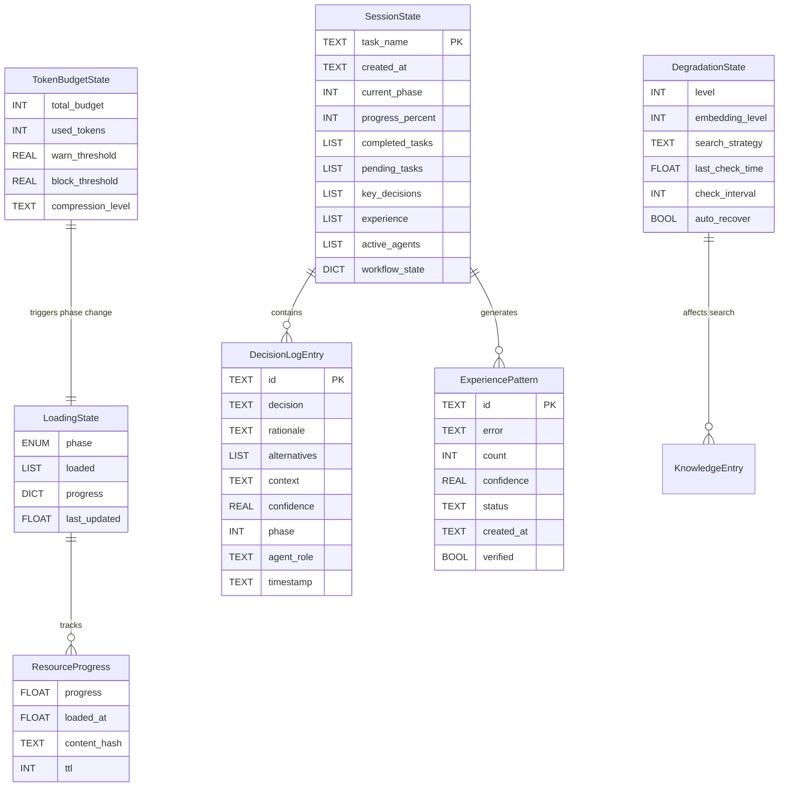
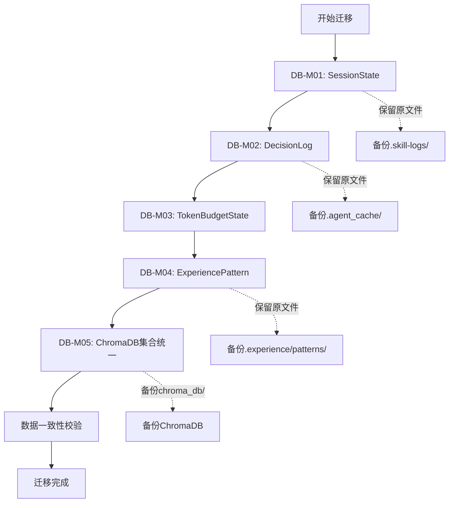

# xuansto-skill-v2 数据存储设计文档

> 版本: 8.0.0 | 编写日期: 2026-05-24 | 编码: UTF-8 | 行尾: LF

---

## 目录

1. [当前数据存储盘点](#1-当前数据存储盘点)
2. [持久化/缓存数据实体清单](#2-持久化缓存数据实体清单)
3. [数据生命周期](#3-数据生命周期)
4. [重构后数据模型](#4-重构后数据模型)
5. [ER图与实体关系描述](#5-er图与实体关系描述)
6. [数据迁移策略](#6-数据迁移策略)
7. [存储技术选型建议](#7-存储技术选型建议)

---

## 1. 当前数据存储盘点

### 1.1 存储介质总览

| 编号 | 存储介质 | 用途 | 位置 | 读/写频率 | 持久性 |
|------|----------|------|------|-----------|--------|
| S-01 | **SQLite 数据库** | 知识条目主存储、版本历史、去重日志、使用日志、备份历史、对账日志 | `.knowledge/index/knowledge.db` | 高频读写 | 持久 |
| S-02 | **ChromaDB 向量库** | 语义搜索嵌入向量（含主集合+primary集合） | `.knowledge/index/chroma_db/` | 中频写/高频读 | 持久 |
| S-03 | **YAML 配置文件** | 默认配置、约束定义、Agent注册表、命令路由 | `configs/default.yaml`, `constraints.yaml`, `agents/registry.yaml`, `commands/routes.yaml` | 低频读 | 持久 |
| S-04 | **JSON 配置文件** | Hook系统配置、评估触发配置 | `hooks/hooks.json`, `evals/trigger_eval.json` | 低频读 | 持久 |
| S-05 | **XML 配置文件** | MCP评估配置 | `evals/mcp_evaluation.xml` | 低频读 | 持久 |
| S-06 | **JSON 状态文件** | 渐进式加载状态 | `resource_state.json` | 中频读写 | 持久 |
| S-07 | **Markdown 会话文件** | 会话摘要（已完成/未完成任务、决策、经验） | `.skill-logs/session-*.md` | 低频写 | 持久 |
| S-08 | **Markdown 任务文件** | 任务计划、发现、进度 | `.agent_cache/{task_name}/task_plan.md`, `findings.md`, `progress.md` | 中频写 | 持久 |
| S-09 | **JSON 模式文件** | 经验模式检测（错误模式、置信度） | `.knowledge/experience/patterns/pattern-*.json` | 低频写 | 持久 |
| S-10 | **Markdown 知识文件** | 知识条目的文件系统源（按scope/category组织） | `{scope}/{category}/*.md` | 中频读写 | 持久 |
| S-11 | **Markdown 导出文件** | 知识条目导出（YAML frontmatter + content） | `{scope}/{category}/{title}.md` | 中频写 | 持久 |
| S-12 | **备份文件** | SQLite备份(.db)、ChromaDB备份(.tar.gz)、JSON备份 | `.knowledge/backup/{full,incremental,snapshot,scheduled}/` | 定时写 | 持久 |
| S-13 | **日志文件** | 知识服务器运行日志（JSON格式，轮转10MB×5） | `.knowledge/logs/knowledge-server.log` | 高频写 | 持久(轮转) |
| S-14 | **临时脚本目录** | 临时脚本存放 | `.knowledge/temp-scripts/` | 临时写 | 临时 |
| S-15 | **错误日志目录** | 脚本执行错误记录 | `.knowledge/script-errors/` | 低频写 | 持久 |
| S-16 | **Token使用日志** | Token消耗记录 | `.knowledge/token-usage/` | 中频写 | 持久 |
| S-17 | **归档目录** | 生命周期归档条目 | `.knowledge/archive/` | 低频写 | 持久 |
| S-18 | **内存状态** | 降级级别、嵌入管理器级别、WebSocket连接、活跃请求计数 | `DegradationManager._level`, `EmbeddingManager._level`, `KnowledgeServer` 实例属性 | 高频读写 | 易失 |
| S-19 | **环境变量** | API密钥、服务器配置覆盖 | `OPENAI_API_KEY`, `KB_HOST`, `KB_PORT`, `KB_LOG_LEVEL`, `KNOWLEDGE_BACKUP_KEY` | 启动时读 | 外部 |

### 1.2 存储介质分布图



### 1.3 已识别问题

| 问题编号 | 严重程度 | 描述 |
|----------|----------|------|
| DB-01 | 高 | **双引擎一致性风险**：SQLite与ChromaDB之间无事务保证，embedding写入失败后仅标记pending，可能导致数据不一致 |
| DB-02 | 中 | **会话状态无结构化存储**：会话摘要以Markdown文件存储，无法程序化查询和聚合 |
| DB-03 | 中 | **决策日志无持久化**：decision_log MCP工具的数据存储机制未定义，PreCompact时才持久化到`.agent_cache/decision-log.md` |
| DB-04 | 中 | **Token预算状态无持久化**：token_budget MCP工具的状态仅存于内存，会话中断后丢失 |
| DB-05 | 低 | **配置分散**：知识库配置分布在`config.yaml`、`platform-config.yaml`、`default.yaml`、`constraints.yaml`多处 |
| DB-06 | 低 | **resource_state.json格式兼容**：旧格式（纯字符串列表）与新格式（含progress对象）需自动升级 |
| DB-07 | 中 | **经验模式文件无索引**：`.knowledge/experience/patterns/`下的JSON文件无统一索引，查询需遍历文件系统 |
| DB-08 | 高 | **备份无加密默认**：备份文件默认明文存储，需手动设置`KNOWLEDGE_BACKUP_KEY`环境变量才启用加密 |
| DB-09 | 中 | **ChromaDB集合分裂**：存在`knowledge`和`knowledge_primary`两个集合，embedding级别切换时可能导致查询遗漏 |
| DB-10 | 低 | **Schema迁移无回滚**：SQLite schema迁移(v9-v12)仅支持前向，无回滚机制 |

---

## 2. 持久化/缓存数据实体清单

### 2.1 SQLite 数据库实体

#### 2.1.1 knowledge_entries（知识条目主表）

```sql
CREATE TABLE knowledge_entries (
    id TEXT PRIMARY KEY,                    -- 格式: kb-{YYYYMMDD}-{hex6}
    title TEXT NOT NULL,
    content TEXT NOT NULL,
    scope TEXT NOT NULL CHECK(scope IN ('general','workspace','experience')),
    tags TEXT DEFAULT '[]',                 -- JSON数组字符串
    confidence REAL DEFAULT 0.6 CHECK(confidence BETWEEN 0 AND 1),
    source_path TEXT,
    source_rating INTEGER DEFAULT 3 CHECK(source_rating BETWEEN 1 AND 5),
    occurrences INTEGER DEFAULT 1,
    content_hash TEXT,                      -- SHA-256前32字符
    type TEXT NOT NULL DEFAULT 'unknown',
    category TEXT NOT NULL DEFAULT 'uncategorized',
    summary TEXT,
    content_path TEXT,
    source TEXT,                            -- v10新增
    last_validated TEXT,
    success_count INTEGER DEFAULT 0,
    failure_count INTEGER DEFAULT 0,
    version INTEGER DEFAULT 1,             -- 乐观锁版本号
    embedding_status TEXT DEFAULT 'pending' CHECK(embedding_status IN ('pending','ready')),
    embedding_retry_count INTEGER DEFAULT 0, -- v9新增
    status TEXT DEFAULT 'active' CHECK(status IN ('active','archived','deleted')), -- v12新增
    last_accessed TEXT,                     -- v12新增
    created TEXT DEFAULT (datetime('now')),
    updated TEXT DEFAULT (datetime('now'))
);
```

**JSON示例**：

```json
{
  "id": "kb-20260524-a1b2c3",
  "title": "React useEffect清理函数最佳实践",
  "content": "在React组件中使用useEffect时，必须返回清理函数以避免内存泄漏...",
  "scope": "general",
  "tags": ["react", "hooks", "memory-leak"],
  "confidence": 0.85,
  "source_path": "general/frontend/react-hooks.md",
  "source_rating": 4,
  "occurrences": 3,
  "content_hash": "e3b0c44298fc1c149afbf4c8996fb924",
  "type": "pattern",
  "category": "frontend",
  "summary": "useEffect必须返回清理函数防止内存泄漏",
  "content_path": null,
  "source": null,
  "last_validated": "2026-05-20 10:30:00",
  "success_count": 5,
  "failure_count": 0,
  "version": 3,
  "embedding_status": "ready",
  "embedding_retry_count": 0,
  "status": "active",
  "last_accessed": "2026-05-24 08:15:00",
  "created": "2026-05-01 12:00:00",
  "updated": "2026-05-24 08:15:00"
}
```

#### 2.1.2 knowledge_tags（标签关联表）

```sql
CREATE TABLE knowledge_tags (
    entry_id TEXT NOT NULL,
    tag TEXT NOT NULL,
    PRIMARY KEY (entry_id, tag),
    FOREIGN KEY (entry_id) REFERENCES knowledge_entries(id) ON DELETE CASCADE
);
```

#### 2.1.3 knowledge_fts（全文搜索虚拟表）

```sql
CREATE VIRTUAL TABLE knowledge_fts USING fts5(
    id UNINDEXED,
    summary,
    type,
    category,
    content='knowledge_entries',
    content_rowid='rowid',
    tokenize='unicode61'
);
```

#### 2.1.4 version_history（版本历史表）

```sql
CREATE TABLE version_history (
    id INTEGER PRIMARY KEY AUTOINCREMENT,
    entry_id TEXT NOT NULL,
    version INTEGER NOT NULL,
    title TEXT,
    content TEXT,
    scope TEXT,
    tags TEXT,
    confidence REAL,
    source_path TEXT,
    source_rating INTEGER,
    content_hash TEXT,
    change_type TEXT DEFAULT 'update',
    content_snapshot TEXT,
    saved_at TEXT DEFAULT (datetime('now')),
    UNIQUE(entry_id, version)
);
```

#### 2.1.5 dedup_log（去重日志表）

```sql
CREATE TABLE dedup_log (
    id INTEGER PRIMARY KEY AUTOINCREMENT,
    new_entry_id TEXT NOT NULL,
    existing_entry_id TEXT NOT NULL,
    similarity_score REAL NOT NULL,
    action TEXT NOT NULL CHECK(action IN ('skip', 'merge', 'keep_both')),
    merged_at TEXT,
    FOREIGN KEY (new_entry_id) REFERENCES knowledge_entries(id),
    FOREIGN KEY (existing_entry_id) REFERENCES knowledge_entries(id)
);
```

#### 2.1.6 usage_logs（使用日志表）

```sql
CREATE TABLE usage_logs (
    id INTEGER PRIMARY KEY AUTOINCREMENT,
    entry_id TEXT,
    agent_role TEXT,
    query_text TEXT,
    result_count INTEGER DEFAULT 0,
    elapsed_ms REAL DEFAULT 0.0,
    timestamp TEXT DEFAULT (datetime('now')),
    FOREIGN KEY (entry_id) REFERENCES knowledge_entries(id) ON DELETE SET NULL
);
```

#### 2.1.7 reconciliation_log（对账日志表）

```sql
CREATE TABLE reconciliation_log (
    id INTEGER PRIMARY KEY AUTOINCREMENT,
    check_time TEXT NOT NULL,
    sqlite_ready_count INTEGER,
    chroma_vector_count INTEGER,
    missing_in_chroma INTEGER DEFAULT 0,
    orphan_in_chroma INTEGER DEFAULT 0,
    fixed_count INTEGER DEFAULT 0,
    details TEXT
);
```

#### 2.1.8 backup_history（备份历史表）

```sql
CREATE TABLE backup_history (
    id INTEGER PRIMARY KEY AUTOINCREMENT,
    backup_type TEXT NOT NULL,
    destination TEXT,
    entry_count INTEGER DEFAULT 0,
    size_bytes INTEGER DEFAULT 0,
    status TEXT DEFAULT 'completed',
    created_at TEXT DEFAULT (datetime('now'))
);
```

#### 2.1.9 schema_version（Schema版本表）

```sql
CREATE TABLE schema_version (
    version INTEGER PRIMARY KEY,
    applied_at TEXT DEFAULT (datetime('now')),
    description TEXT
);
```

**当前Schema版本**: 12

### 2.2 ChromaDB 向量库实体

| 集合名 | 用途 | 嵌入维度 | 距离度量 | 触发条件 |
|--------|------|----------|----------|----------|
| `knowledge` | 默认集合，sentence-transformers嵌入或ChromaDB内置嵌入 | 384 / 动态 | cosine | 始终存在 |
| `knowledge_primary` | 主集合，OpenAI API嵌入 | 1536 | cosine | EmbeddingManager.level == LEVEL_API |

**ChromaDB元数据结构**：

```json
{
  "scope": "workspace",
  "title": "React useEffect清理函数最佳实践"
}
```

**ChromaDB文档结构**：

```json
{
  "ids": ["kb-20260524-a1b2c3"],
  "embeddings": [[0.012, -0.034, ...]],
  "metadatas": [{"scope": "workspace", "title": "..."}],
  "documents": ["在React组件中使用useEffect时..."]
}
```

### 2.3 YAML 配置实体

#### 2.3.1 configs/default.yaml（默认配置）

```yaml
orchestrator:
  max_concurrent_agents: 3
  system_parallel_capacity: 10
  task_timeout_minutes: 60
  retry_policy:
    max_retries: 3
    backoff: exponential
  lean_mode: false
  agent_merge_policy:
    enabled: true
    auto_activate: true
    merge_rules: [...]

quality_gates:
  enforcement: strict
  bypass_requires_approval: true
  coverage_threshold:
    unit: 80
    integration: 70
    high_risk_modules: 90

knowledge_base:
  general:
    auto_sync: true
    sync_interval: weekly
  workspace:
    auto_update: true
    track_changes: true
  experience:
    auto_extract: true
    review_required: true
    min_confidence: 0.8

token_optimization:
  budget: 100000
  warn_threshold: 0.8
  block_threshold: 1.0
  compression_level: semantic
  logging:
    enabled: true
    output: ".knowledge/token-usage"
    granularity: task
```

#### 2.3.2 constraints.yaml（约束配置）

```yaml
version: "8.0.0"
token_budgets:
  phase_0_skeleton: { budget: 2000 }
  phase_1_functional: { budget: 5000 }
  phase_2_enhanced: { budget: 10000 }
  phase_3_full: { budget: 20000 }

resource_priority:
  P0_must: ["SKILL.md核心约束", "命令路由表", "Agent索引表"]
  P1_important: ["命令详细步骤", "工作流Phase定义", "MCP工具参数"]
  P2_enhanced: ["参考文档", "模板文件", "知识库"]
  P3_optional: ["示例文档", "评估配置", "披露资源"]

disclosure:
  skill_md_phase_markers:
    phase_0: { start: "<!-- PHASE_0_START -->", end: "<!-- PHASE_0_END -->" }
    phase_1: { start: "<!-- PHASE_1_START -->", end: "<!-- PHASE_1_END -->" }
    phase_2: { start: "<!-- PHASE_2_START -->", end: "<!-- PHASE_2_END -->" }
    phase_3: { start: "<!-- PHASE_3_START -->", end: "<!-- PHASE_3_END -->" }
```

#### 2.3.3 agents/registry.yaml（Agent注册表）

```yaml
version: "8.0.0"
total_agents: 57
total_layers: 13
layers:
  - name: 编排
    count: 3
    agents:
      - name: Orchestrator
        file: orchestrator/orchestrator.md
        phases: [0, 1, 2]
        model_routing: deep
```

#### 2.3.4 commands/routes.yaml（命令路由表）

```yaml
routing_priority: "精确匹配 > 语义匹配 > 更具体命令优先 > 默认/sprint兜底"
routes:
  - intent: "从零开始新项目"
    command: "/init"
    mcp_tools: [skill_analyze, knowledge_search, workflow_dispatch, project_init, decision_log]
    fallback: "知识检索: ChromaDB→SQLite FTS→关键词"
    phase: 0
    detail: commands/init.md
```

### 2.4 JSON 配置/状态实体

#### 2.4.1 hooks/hooks.json（Hook系统配置）

```json
{
  "version": "1.0.0",
  "profiles": {
    "minimal": { "PreToolUse": ["security-block"], "Stop": ["session-save"] },
    "standard": { "PreToolUse": ["security-block", "token-budget-check"], "PostToolUse": ["auto-format", "encoding-check"] },
    "strict": { "PreToolUse": ["security-block", "token-budget-check", "dangerous-cmd-confirm"] }
  },
  "hooks": {
    "security-block": { "type": "PreToolUse", "matcher": "...", "action": "block" },
    "token-budget-check": { "type": "PreToolUse", "threshold_warn": 0.8, "threshold_block": 0.95 },
    "session-save": { "type": "Stop", "target": ".skill-logs/session-{timestamp}.md" }
  }
}
```

#### 2.4.2 resource_state.json（渐进式加载状态）

**新格式**（向后兼容）：

```json
{
  "phase": "functional",
  "loaded": ["quality-gates", "agent-registry", "workflow-phases"],
  "progress": {
    "quality-gates": { "progress": 1.0, "loaded_at": 1716360000.0 },
    "agent-registry": { "progress": 1.0, "loaded_at": 1716360001.0 }
  },
  "last_updated": 1716360001.0
}
```

**旧格式**（纯字符串列表，自动升级）：

```json
{
  "phase": "skeleton",
  "loaded": ["skill-config", "quality-gates"],
  "last_updated": 1716360000.0
}
```

#### 2.4.3 evals/trigger_eval.json（评估触发配置）

```json
{
  "version": "2.0.0",
  "skill": "xuansto-skill",
  "eval_type": "skill_trigger_accuracy",
  "should_trigger": [
    { "id": 1, "query": "...", "reason": "..." }
  ],
  "should_not_trigger": [
    { "id": 11, "query": "...", "reason": "..." }
  ],
  "metrics": {
    "trigger_rate": "...",
    "rejection_rate": "...",
    "accuracy": "...",
    "target_accuracy": 0.80
  }
}
```

#### 2.4.4 经验模式文件（.knowledge/experience/patterns/pattern-*.json）

```json
{
  "error": "ModuleNotFoundError: No module named 'xxx'",
  "count": 3,
  "confidence": 0.55,
  "status": "draft",
  "created_at": "2026-05-24T10:30:00",
  "verified": false
}
```

### 2.5 Markdown 文件实体

#### 2.5.1 会话摘要（.skill-logs/session-*.md）

```markdown
# Session 20260524-103000

## 已完成任务
- 实现用户认证模块
- 编写单元测试

## 未完成任务
- 集成测试编写

## 关键决策
- 选择JWT而非Session方案

## 经验沉淀
- FastAPI依赖注入可简化中间件逻辑
```

#### 2.5.2 任务计划（.agent_cache/{task}/task_plan.md）

```markdown
# Task Plan
- **Task Name**: user-auth-module
- **Created At**: 2026-05-24T10:00:00Z
- **Current Phase**: Phase 0
- **Progress**: 0%

## Phase Status
| Phase | Name | Status |
|-------|------|--------|
| Phase 0 | Design | Pending |
...
```

#### 2.5.3 知识导出文件（{scope}/{category}/{title}.md）

```markdown
---
id: kb-20260524-a1b2c3
type: pattern
category: frontend
tags:
  - react
  - hooks
version: 3
updated: '2026-05-24 08:15:00'
scope: general
confidence: 0.85
title: React useEffect清理函数最佳实践
summary: useEffect必须返回清理函数防止内存泄漏
source_path: general/frontend/react-hooks.md
---
在React组件中使用useEffect时，必须返回清理函数以避免内存泄漏...
```

---

## 3. 数据生命周期

### 3.1 知识条目生命周期



| 阶段 | 触发条件 | 存储位置 | 数据变更 |
|------|----------|----------|----------|
| 创建 | `knowledge_add` / 首次导入 / 增量同步 | SQLite + ChromaDB(pending) | INSERT knowledge_entries, INSERT knowledge_fts(触发器) |
| 嵌入就绪 | EmbeddingManager生成成功 | ChromaDB | UPDATE embedding_status='ready', UPSERT向量 |
| 嵌入重试 | 后台重试线程(60s间隔) | ChromaDB | UPDATE embedding_retry_count+1 |
| 更新 | `knowledge_update` | SQLite + ChromaDB | UPDATE knowledge_entries, INSERT version_history, UPDATE knowledge_fts(触发器) |
| 去重检测 | `knowledge_add`前检查 | SQLite + ChromaDB | INSERT dedup_log, 可能MERGE到已有条目 |
| 访问记录 | `deep_load` / 搜索命中 | SQLite | INSERT usage_logs, UPDATE last_accessed |
| 归档 | LifecycleManager定时检查(86400s) | SQLite + 文件系统 | UPDATE status='archived', 移动源文件到archive/ |
| 删除 | `knowledge_delete` | SQLite + ChromaDB | DELETE knowledge_entries, DELETE向量, INSERT version_history(change_type='delete') |
| 版本回滚 | `knowledge_rollback` | SQLite + ChromaDB | 保存当前版本到version_history, UPDATE为历史版本数据, 重新嵌入 |

### 3.2 会话生命周期



| 阶段 | 触发条件 | 存储位置 | 数据变更 |
|------|----------|----------|----------|
| 初始化 | `/init` 命令 | `.agent_cache/{task}/` | 创建task_plan.md, findings.md, progress.md |
| 会话保存 | Stop Hook / 手动 | `.skill-logs/session-{ts}.md` | 写入Markdown摘要 |
| 压缩前保存 | PreCompact Hook | `.agent_cache/` | 保存current_phase, workflow_state, active_agents |
| 决策持久化 | PreCompact Hook(strict) | `.agent_cache/decision-log.md` | 写入决策日志 |
| 会话恢复 | SessionStart Hook | 内存 | 读取最近session文件 |
| 清理 | save_session后自动 | `.skill-logs/` | 删除超过10个的旧会话文件 |

### 3.3 渐进式加载生命周期



| 转换 | 触发条件 | 存储变更 | resource_state.json更新 |
|------|----------|----------|------------------------|
| →Skeleton | Skill触发 | 加载P0资源 | phase="skeleton", loaded=[P0 items] |
| →Functional | 命令路由匹配 | 加载P1资源 | phase="functional", loaded+=[P1 items] |
| →Enhanced | Agent调度/知识检索 | 加载P2资源 | phase="enhanced", loaded+=[P2 items] |
| →Full | /build-desktop等 | 加载P3资源 | phase="full", loaded+=[P3 items] |
| →降级 | Token阈值触发 | 释放对应优先级资源 | phase回退, loaded减少 |

### 3.4 降级状态生命周期



| 级别 | 名称 | 搜索策略 | 检测间隔 | 恢复条件 |
|------|------|----------|----------|----------|
| 0 | normal | hybrid | 30s | - |
| 1 | local_semantic | hybrid | 30s | OpenAI API可用+ChromaDB查询成功 |
| 2 | bm25_only | keyword_only | 30s | 嵌入引擎恢复+ChromaDB可用 |
| 3 | file_search | file_search | 30s | SQLite恢复 |

### 3.5 备份生命周期

| 操作 | 触发条件 | 频率 | 保留策略 |
|------|----------|------|----------|
| SQLite定时备份 | 定时器 | 每6小时 | 保留最近10个 |
| ChromaDB定时备份 | 定时器 | 每24小时 | 保留最近7个 |
| 备份清理 | 定时器 | 每24小时 | 删除超限备份 |
| 手动备份 | `knowledge_rollback` API | 按需 | 用户管理 |
| WAL检查点 | 关闭时 | 一次性 | - |

---

## 4. 重构后数据模型

### 4.1 MCP Server 所需状态存储结构体

#### 4.1.1 KnowledgeEntry（知识条目）

```python
from dataclasses import dataclass, field
from enum import Enum
from typing import Optional

class EntryScope(str, Enum):
    GENERAL = "general"
    WORKSPACE = "workspace"
    EXPERIENCE = "experience"

class EntryStatus(str, Enum):
    ACTIVE = "active"
    ARCHIVED = "archived"
    DELETED = "deleted"

class EmbeddingStatus(str, Enum):
    PENDING = "pending"
    READY = "ready"
    FAILED = "failed"

@dataclass
class KnowledgeEntry:
    id: str
    title: str
    content: str
    scope: EntryScope
    tags: list[str] = field(default_factory=list)
    confidence: float = 0.6
    source_path: Optional[str] = None
    source_rating: int = 3
    occurrences: int = 1
    content_hash: Optional[str] = None
    type: str = "unknown"
    category: str = "uncategorized"
    summary: Optional[str] = None
    content_path: Optional[str] = None
    source: Optional[str] = None
    last_validated: Optional[str] = None
    success_count: int = 0
    failure_count: int = 0
    version: int = 1
    embedding_status: EmbeddingStatus = EmbeddingStatus.PENDING
    embedding_retry_count: int = 0
    status: EntryStatus = EntryStatus.ACTIVE
    last_accessed: Optional[str] = None
    created: Optional[str] = None
    updated: Optional[str] = None
```

#### 4.1.2 LoadingProgress（渐进式加载进度）

```python
from dataclasses import dataclass
from enum import Enum
from typing import Optional

class LoadPhase(str, Enum):
    SKELETON = "skeleton"
    FUNCTIONAL = "functional"
    ENHANCED = "enhanced"
    FULL = "full"

@dataclass
class ResourceProgress:
    progress: float
    loaded_at: Optional[float] = None
    content_hash: Optional[str] = None
    ttl: Optional[int] = None

@dataclass
class LoadingState:
    phase: LoadPhase = LoadPhase.SKELETON
    loaded: list[str] = field(default_factory=list)
    progress: dict[str, ResourceProgress] = field(default_factory=dict)
    last_updated: Optional[float] = None
```

**resource_state.json 映射**：

```json
{
  "phase": "functional",
  "loaded": ["quality-gates", "agent-registry"],
  "progress": {
    "quality-gates": { "progress": 1.0, "loaded_at": 1716360000.0, "content_hash": null, "ttl": null }
  },
  "last_updated": 1716360001.0
}
```

#### 4.1.3 DegradationState（降级状态）

```python
from dataclasses import dataclass
from enum import Enum

class DegradationLevel(int, Enum):
    NORMAL = 0
    LOCAL_SEMANTIC = 1
    BM25_ONLY = 2
    FILE_SEARCH = 3

class EmbeddingLevel(int, Enum):
    API = 0
    LOCAL = 1
    BM25_ONLY = 2

@dataclass
class DegradationState:
    level: DegradationLevel = DegradationLevel.NORMAL
    embedding_level: EmbeddingLevel = EmbeddingLevel.BM25_ONLY
    search_strategy: str = "hybrid"
    last_check_time: Optional[float] = None
    check_interval: int = 30
    auto_recover: bool = True

    @property
    def level_name(self) -> str:
        return {0: "normal", 1: "local_semantic", 2: "bm25_only", 3: "file_search"}.get(self.level, "unknown")

    @property
    def embedding_level_name(self) -> str:
        return {0: "api", 1: "local_semantic", 2: "bm25_only"}.get(self.embedding_level, "unknown")
```

#### 4.1.4 SessionState（会话状态）

```python
from dataclasses import dataclass, field
from typing import Optional

@dataclass
class SessionState:
    task_name: str
    created_at: str
    current_phase: int = 0
    progress_percent: int = 0
    completed_tasks: list[str] = field(default_factory=list)
    pending_tasks: list[str] = field(default_factory=list)
    key_decisions: list[str] = field(default_factory=list)
    experience: list[str] = field(default_factory=list)
    active_agents: list[str] = field(default_factory=list)
    workflow_state: Optional[dict] = None
    last_updated: Optional[str] = None
```

#### 4.1.5 DecisionLogEntry（决策日志条目）

```python
from dataclasses import dataclass, field
from typing import Optional

@dataclass
class DecisionLogEntry:
    id: str
    decision: str
    rationale: str
    alternatives: list[str] = field(default_factory=list)
    context: Optional[str] = None
    confidence: float = 0.0
    phase: int = 0
    agent_role: Optional[str] = None
    timestamp: Optional[str] = None
```

#### 4.1.6 TokenBudgetState（Token预算状态）

```python
from dataclasses import dataclass
from typing import Optional

@dataclass
class TokenBudgetState:
    total_budget: int = 100000
    used_tokens: int = 0
    warn_threshold: float = 0.8
    block_threshold: float = 1.0
    compression_level: str = "semantic"
    current_phase_budget: Optional[int] = None
    last_updated: Optional[str] = None

    @property
    def usage_ratio(self) -> float:
        return self.used_tokens / self.total_budget if self.total_budget > 0 else 0.0

    @property
    def is_warn(self) -> bool:
        return self.usage_ratio >= self.warn_threshold

    @property
    def is_block(self) -> bool:
        return self.usage_ratio >= self.block_threshold
```

#### 4.1.7 ExperiencePattern（经验模式）

```python
from dataclasses import dataclass
from typing import Optional

@dataclass
class ExperiencePattern:
    id: str
    error: str
    count: int = 1
    confidence: float = 0.40
    status: str = "draft"
    created_at: Optional[str] = None
    verified: bool = False
    solution: Optional[str] = None
    tags: list[str] = field(default_factory=list)
```

#### 4.1.8 BackupRecord（备份记录）

```python
from dataclasses import dataclass
from typing import Optional

@dataclass
class BackupRecord:
    id: int
    backup_type: str
    destination: Optional[str] = None
    entry_count: int = 0
    size_bytes: int = 0
    status: str = "completed"
    created_at: Optional[str] = None
    encrypted: bool = False
```

### 4.2 渐进式加载相关字段定义

| 字段 | 类型 | 说明 | 默认值 |
|------|------|------|--------|
| `phase` | LoadPhase | 当前加载阶段 | skeleton |
| `loaded` | list[str] | 已加载资源URI列表 | [] |
| `progress.{resource}` | ResourceProgress | 单资源加载进度 | - |
| `progress.{resource}.progress` | float | 加载进度[0.0, 1.0] | 0.0 |
| `progress.{resource}.loaded_at` | float\|None | 加载完成时间戳 | None |
| `progress.{resource}.content_hash` | str\|None | 内容哈希(缓存校验) | None |
| `progress.{resource}.ttl` | int\|None | 缓存TTL(秒), None=不过期 | None |
| `last_updated` | float | 最后更新时间戳 | None |

### 4.3 MCP工具与数据实体映射

| MCP工具 | 读取实体 | 写入实体 | 缓存影响 |
|---------|----------|----------|----------|
| knowledge_search | knowledge_entries, knowledge_fts, ChromaDB | usage_logs | 无 |
| knowledge_add | knowledge_entries(去重检查), ChromaDB | knowledge_entries, knowledge_tags, knowledge_fts, dedup_log, ChromaDB | 清除resource_state缓存 |
| knowledge_update | knowledge_entries | knowledge_entries, version_history, knowledge_fts, ChromaDB | 清除resource_state缓存 |
| knowledge_delete | knowledge_entries | knowledge_entries, version_history, ChromaDB | 清除resource_state缓存 |
| knowledge_stats | knowledge_entries, ChromaDB | 无 | 无 |
| knowledge_rollback | version_history | knowledge_entries, ChromaDB | 清除resource_state缓存 |
| knowledge_progressive_search | knowledge_entries, ChromaDB | usage_logs | 无 |
| knowledge_deep_load | knowledge_entries | usage_logs | 无 |
| knowledge_auto_retrieve | knowledge_entries, ChromaDB, 文件系统 | usage_logs | 无 |
| knowledge_web_update | knowledge_entries, ChromaDB, 外部网络 | knowledge_entries, ChromaDB | 清除resource_state缓存 |
| session_manage | SessionState | SessionState | 无 |
| decision_log | DecisionLogEntry | DecisionLogEntry | 无 |
| token_budget | TokenBudgetState | TokenBudgetState | 触发加载降级 |
| resource_load_status | LoadingState | LoadingState | 可能触发Phase推进 |
| workflow_dispatch | SessionState | SessionState | 无 |
| agent_status | agents/registry.yaml | 无 | 无 |
| hook_manage | hooks/hooks.json | hooks/hooks.json | 无 |

---

## 5. ER图与实体关系描述

### 5.1 核心实体关系图

```mermaid
erDiagram
    knowledge_entries ||--o{ knowledge_tags : "has tags"
    knowledge_entries ||--o{ version_history : "has versions"
    knowledge_entries ||--o{ usage_logs : "tracked by"
    knowledge_entries ||--o{ dedup_log : "new entry ref"
    knowledge_entries ||--o{ dedup_log : "existing entry ref"
    knowledge_entries }o--|| schema_version : "schema governed"

    knowledge_entries {
        TEXT id PK
        TEXT title
        TEXT content
        TEXT scope
        TEXT tags
        REAL confidence
        TEXT source_path
        INT source_rating
        INT occurrences
        TEXT content_hash
        TEXT type
        TEXT category
        TEXT summary
        TEXT content_path
        TEXT source
        TEXT last_validated
        INT success_count
        INT failure_count
        INT version
        TEXT embedding_status
        INT embedding_retry_count
        TEXT status
        TEXT last_accessed
        TEXT created
        TEXT updated
    }

    knowledge_tags {
        TEXT entry_id PK_FK
        TEXT tag PK
    }

    version_history {
        INT id PK
        TEXT entry_id FK
        INT version
        TEXT title
        TEXT content
        TEXT scope
        TEXT tags
        REAL confidence
        TEXT source_path
        INT source_rating
        TEXT content_hash
        TEXT change_type
        TEXT content_snapshot
        TEXT saved_at
    }

    usage_logs {
        INT id PK
        TEXT entry_id FK
        TEXT agent_role
        TEXT query_text
        INT result_count
        REAL elapsed_ms
        TEXT timestamp
    }

    dedup_log {
        INT id PK
        TEXT new_entry_id FK
        TEXT existing_entry_id FK
        REAL similarity_score
        TEXT action
        TEXT merged_at
    }

    reconciliation_log {
        INT id PK
        TEXT check_time
        INT sqlite_ready_count
        INT chroma_vector_count
        INT missing_in_chroma
        INT orphan_in_chroma
        INT fixed_count
        TEXT details
    }

    backup_history {
        INT id PK
        TEXT backup_type
        TEXT destination
        INT entry_count
        INT size_bytes
        TEXT status
        TEXT created_at
    }

    schema_version {
        INT version PK
        TEXT applied_at
        TEXT description
    }
```

### 5.2 外部实体关系图



### 5.3 存储介质与实体映射

```mermaid
erDiagram
    SQLite ||--|{ knowledge_entries : stores
    SQLite ||--|{ knowledge_tags : stores
    SQLite ||--|{ version_history : stores
    SQLite ||--|{ usage_logs : stores
    SQLite ||--|{ dedup_log : stores
    SQLite ||--|{ reconciliation_log : stores
    SQLite ||--|{ backup_history : stores
    SQLite ||--|{ schema_version : stores

    ChromaDB ||--|{ EmbeddingVector : stores

    FileSystem ||--|{ KnowledgeSourceFile : stores
    FileSystem ||--|{ SessionFile : stores
    FileSystem ||--|{ TaskPlanFile : stores
    FileSystem ||--|{ ExperiencePatternFile : stores
    FileSystem ||--|{ BackupFile : stores
    FileSystem ||--|{ LogFile : stores

    YAMLFile ||--|{ DefaultConfig : stores
    YAMLFile ||--|{ ConstraintsConfig : stores
    YAMLFile ||--|{ AgentRegistry : stores
    YAMLFile ||--|{ CommandRoutes : stores

    JSONFile ||--|{ HooksConfig : stores
    JSONFile ||--|{ ResourceState : stores
    JSONFile ||--|{ EvalConfig : stores

    Memory ||--|{ DegradationState : stores
    Memory ||--|{ EmbeddingLevel : stores
    Memory ||--|{ WebSocketConnections : stores

    EmbeddingVector {
        TEXT id PK
        LIST embedding
        DICT metadata
        TEXT document
    }
```



---

## 6. 数据迁移策略

### 6.1 已有Schema迁移记录

| 版本 | 迁移内容 | 影响表 | 回滚支持 |
|------|----------|--------|----------|
| v9 | 新增embedding_retry_count列，默认pending状态 | knowledge_entries | 否 |
| v10 | 新增source列，新增usage_logs表，schema_version新增description列 | knowledge_entries, usage_logs, schema_version | 否 |
| v11 | 新增backup_history表 | backup_history | 否(CREATE IF NOT EXISTS) |
| v12 | 新增status/last_accessed列，新增对应索引 | knowledge_entries | 否 |

### 6.2 resource_state.json 格式迁移

**迁移路径**：旧格式 → 新格式

```python
def migrate_resource_state(data: dict) -> dict:
    if "progress" not in data:
        loaded = data.get("loaded", [])
        data["progress"] = {
            resource: {"progress": 1.0, "loaded_at": data.get("last_updated")}
            for resource in loaded
        }
    return data
```

**兼容性**：读取时自动升级，写入时使用新格式。

### 6.3 建议的新增迁移

#### 迁移DB-M01：SessionState结构化存储

**当前状态**：Markdown文件存储，无法程序化查询

**目标状态**：SQLite表存储

```sql
CREATE TABLE IF NOT EXISTS session_states (
    id TEXT PRIMARY KEY,
    task_name TEXT NOT NULL,
    created_at TEXT NOT NULL,
    current_phase INTEGER DEFAULT 0,
    progress_percent INTEGER DEFAULT 0,
    completed_tasks TEXT DEFAULT '[]',
    pending_tasks TEXT DEFAULT '[]',
    key_decisions TEXT DEFAULT '[]',
    experience TEXT DEFAULT '[]',
    active_agents TEXT DEFAULT '[]',
    workflow_state TEXT,
    last_updated TEXT DEFAULT (datetime('now'))
);
CREATE INDEX IF NOT EXISTS idx_session_task ON session_states(task_name);
CREATE INDEX IF NOT EXISTS idx_session_updated ON session_states(last_updated);
```

**迁移步骤**：
1. 创建session_states表
2. 编写迁移脚本解析现有`.skill-logs/session-*.md`文件
3. 提取结构化数据写入SQLite
4. 保留原Markdown文件作为备份

#### 迁移DB-M02：DecisionLog结构化存储

**当前状态**：PreCompact时写入`.agent_cache/decision-log.md`

**目标状态**：SQLite表存储

```sql
CREATE TABLE IF NOT EXISTS decision_logs (
    id TEXT PRIMARY KEY,
    decision TEXT NOT NULL,
    rationale TEXT,
    alternatives TEXT DEFAULT '[]',
    context TEXT,
    confidence REAL DEFAULT 0.0,
    phase INTEGER DEFAULT 0,
    agent_role TEXT,
    session_id TEXT,
    timestamp TEXT DEFAULT (datetime('now'))
);
CREATE INDEX IF NOT EXISTS idx_decision_phase ON decision_logs(phase);
CREATE INDEX IF NOT EXISTS idx_decision_session ON decision_logs(session_id);
CREATE INDEX IF NOT EXISTS idx_decision_timestamp ON decision_logs(timestamp);
```

#### 迁移DB-M03：TokenBudgetState持久化

**当前状态**：纯内存，会话丢失

**目标状态**：SQLite表存储

```sql
CREATE TABLE IF NOT EXISTS token_budget_states (
    id INTEGER PRIMARY KEY CHECK(id = 1),
    total_budget INTEGER DEFAULT 100000,
    used_tokens INTEGER DEFAULT 0,
    warn_threshold REAL DEFAULT 0.8,
    block_threshold REAL DEFAULT 1.0,
    compression_level TEXT DEFAULT 'semantic',
    current_phase_budget INTEGER,
    last_updated TEXT DEFAULT (datetime('now'))
);
```

#### 迁移DB-M04：ExperiencePattern索引化

**当前状态**：文件系统JSON文件，无索引

**目标状态**：SQLite表存储

```sql
CREATE TABLE IF NOT EXISTS experience_patterns (
    id TEXT PRIMARY KEY,
    error TEXT NOT NULL,
    count INTEGER DEFAULT 1,
    confidence REAL DEFAULT 0.40,
    status TEXT DEFAULT 'draft' CHECK(status IN ('draft','verified','deprecated')),
    created_at TEXT,
    verified INTEGER DEFAULT 0,
    solution TEXT,
    tags TEXT DEFAULT '[]'
);
CREATE INDEX IF NOT EXISTS idx_pattern_error ON experience_patterns(error);
CREATE INDEX IF NOT EXISTS idx_pattern_status ON experience_patterns(status);
CREATE INDEX IF NOT EXISTS idx_pattern_confidence ON experience_patterns(confidence);
```

#### 迁移DB-M05：ChromaDB集合统一

**当前状态**：`knowledge` + `knowledge_primary`双集合

**目标状态**：单集合 + 元数据标记嵌入级别

```python
def migrate_chroma_collections(chroma_engine):
    primary = chroma_engine._primary_collection
    default = chroma_engine._collection
    if primary is None:
        return

    result = primary.get(include=["embeddings", "metadatas", "documents"])
    if result and result["ids"]:
        for i, entry_id in enumerate(result["ids"]):
            meta = result["metadatas"][i] if result["metadatas"] else {}
            meta["embedding_tier"] = "api"
            default.upsert(
                ids=[entry_id],
                embeddings=[result["embeddings"][i]] if result.get("embeddings") else None,
                metadatas=[meta],
                documents=[result["documents"][i]] if result.get("documents") else None,
            )

    primary.delete(ids=result["ids"])
```

### 6.4 迁移执行顺序



### 6.5 迁移安全保障

| 措施 | 说明 |
|------|------|
| 全量备份 | 迁移前执行`create_backup("full")` |
| 保留原文件 | Markdown/JSON文件迁移后不删除，标记为`.migrated` |
| 幂等性 | 所有CREATE TABLE使用IF NOT EXISTS，INSERT使用INSERT OR IGNORE |
| 回滚脚本 | 每个迁移提供对应回滚SQL |
| 校验步骤 | 迁移后对比记录数、内容哈希 |

---

## 7. 存储技术选型建议

### 7.1 当前技术栈评估

| 技术 | 用途 | 优势 | 劣势 | 评分 |
|------|------|------|------|------|
| SQLite | 知识条目主存储 | 零配置、单文件、WAL模式支持并发读、FTS5全文搜索 | 单写者限制、无分布式、无内置向量搜索 | ★★★★☆ |
| ChromaDB | 向量存储 | 开箱即用、支持多种嵌入模型、PersistentClient | 依赖重、集合分裂问题(DB-09)、无事务 | ★★★☆☆ |
| 文件系统(MD/JSON) | 配置/会话/经验 | 人类可读、Git友好 | 无索引、无查询能力、并发风险 | ★★☆☆☆ |
| 内存 | 运行时状态 | 零延迟 | 易失性、无持久化 | ★★★☆☆ |

### 7.2 选型建议

#### 建议1：SQLite作为统一持久化层（优先级：高）

**理由**：
- 已有成熟的SQLite引擎和Schema迁移机制
- 单文件部署，零运维成本
- WAL模式支持并发读取
- FTS5提供全文搜索能力
- 可通过JSON扩展函数处理半结构化数据

**适用场景**：SessionState、DecisionLog、TokenBudgetState、ExperiencePattern的结构化存储

#### 建议2：ChromaDB保持可选依赖（优先级：中）

**理由**：
- ChromaDB为可选依赖，不可用时自动降级到SQLite FTS5
- 向量搜索在知识检索场景有显著优势
- 但需解决DB-09（集合分裂）问题

**改进建议**：
- 统一为单集合，通过元数据`embedding_tier`区分嵌入级别
- 增加ChromaDB健康检查和自动修复机制
- 考虑`sqlite-vss`作为ChromaDB的轻量替代

#### 建议3：配置文件保持YAML/JSON格式（优先级：低）

**理由**：
- 配置文件需要人类可读和Git可追踪
- YAML/JSON是Skill系统的标准配置格式
- 不适合迁移到SQLite（配置变更频率低，查询需求低）

**改进建议**：
- 合并分散的配置到统一入口（解决DB-05）
- 增加配置文件校验和热重载机制

#### 建议4：引入sqlite-vec/sqlite-vss替代ChromaDB（优先级：低，长期）

**理由**：
- 减少外部依赖（ChromaDB依赖链较重）
- 统一存储引擎为SQLite
- 向量搜索与结构化查询在同一事务中

**风险**：
- sqlite-vec/sqlite-vss成熟度不如ChromaDB
- 嵌入维度限制（部分实现限制向量维度）
- 性能可能不如专用向量数据库

### 7.3 技术选型决策矩阵

| 需求 | SQLite | ChromaDB | 文件系统 | 内存 |
|------|--------|----------|----------|------|
| 结构化查询 | ★★★★★ | ★★☆☆☆ | ★☆☆☆☆ | ★★★☆☆ |
| 全文搜索 | ★★★★☆(FTS5) | ★☆☆☆☆ | ★★☆☆☆ | ★☆☆☆☆ |
| 向量搜索 | ★★☆☆☆(vss) | ★★★★★ | ☆☆☆☆☆ | ★☆☆☆☆ |
| 事务支持 | ★★★★★ | ★★☆☆☆ | ☆☆☆☆☆ | ☆☆☆☆☆ |
| 零配置部署 | ★★★★★ | ★★★☆☆ | ★★★★★ | ★★★★★ |
| 并发读取 | ★★★★☆(WAL) | ★★★☆☆ | ★★★★★ | ★★★★★ |
| 人类可读 | ★☆☆☆☆ | ☆☆☆☆☆ | ★★★★★ | ☆☆☆☆☆ |
| Git友好 | ★★☆☆☆ | ☆☆☆☆☆ | ★★★★★ | ☆☆☆☆☆ |
| 持久性 | ★★★★★ | ★★★★☆ | ★★★★★ | ☆☆☆☆☆ |

### 7.4 推荐架构

```mermaid
graph TB
    subgraph 统一持久层
        SQLite["SQLite (WAL模式)<br/>知识条目<br/>会话状态<br/>决策日志<br/>Token预算<br/>经验模式<br/>版本历史<br/>操作日志"]
    end

    subgraph 向量层(可选)
        Chroma["ChromaDB<br/>语义嵌入向量<br/>单集合+元数据标记"]
        AltVec["sqlite-vec<br/>(长期替代方案)"]
    end

    subgraph 配置层
        YAML["YAML/JSON<br/>default.yaml<br/>constraints.yaml<br/>registry.yaml<br/>routes.yaml<br/>hooks.json"]
    end

    subgraph 缓存层
        ResourceState["resource_state.json<br/>渐进式加载状态"]
        Memory["内存缓存<br/>降级状态<br/>嵌入级别<br/>WebSocket连接"]
    end

    subgraph 文件层
        Export["Markdown导出<br/>{scope}/{category}/*.md"]
        Backup["备份文件<br/>backup/"]
        Log["运行日志<br/>logs/"]
    end

    SQLite --> Chroma
    SQLite --> AltVec
    Memory --> SQLite
    Memory --> Chroma
    ResourceState --> Memory
```

### 7.5 问题修复优先级

| 优先级 | 问题编号 | 修复建议 | 预估工作量 |
|--------|----------|----------|-----------|
| P0 | DB-01 | 引入双写确认机制：SQLite写入成功后标记pending，ChromaDB写入成功后标记ready，增加定时对账 | 3天 |
| P0 | DB-08 | 备份默认启用加密（生成随机密钥写入.knowledge/目录），或至少在备份元数据中标记加密状态 | 1天 |
| P1 | DB-09 | 统一ChromaDB为单集合，通过元数据embedding_tier区分 | 2天 |
| P1 | DB-02 | 迁移DB-M01：SessionState结构化存储 | 2天 |
| P1 | DB-03 | 迁移DB-M02：DecisionLog结构化存储 | 1天 |
| P1 | DB-04 | 迁移DB-M03：TokenBudgetState持久化 | 1天 |
| P2 | DB-07 | 迁移DB-M04：ExperiencePattern索引化 | 1天 |
| P2 | DB-05 | 合并配置入口，增加配置校验 | 2天 |
| P2 | DB-06 | resource_state.json格式迁移（已实现自动升级） | 0天 |
| P3 | DB-10 | 增加Schema迁移回滚机制 | 3天 |

---

> 文档结束 | 生成时间: 2026-05-24 | 基于 xuansto-skill-v2 v8.0.0 源码分析
