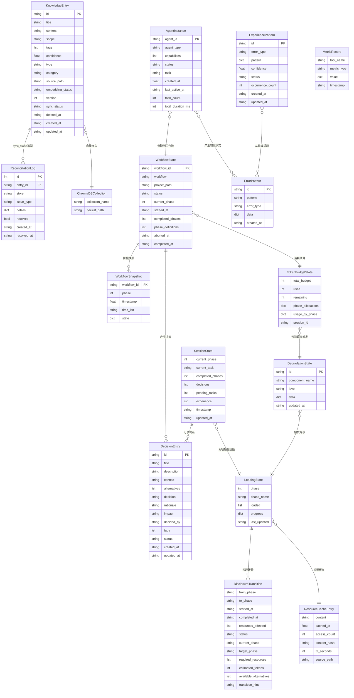

# 数据库设计文档

> 版本: 8.0.0 | Skill目录: `.trae/skills/xuansto-skill-v2/` | MCP Server: `xuansto-mcp-server/`

---

## 1. 当前数据存储盘点

### 1.1 SQLite 数据库

**主数据库**: `xuansto-mcp-server/src/xuansto_mcp/core/database.py` 管理，路径为 `.xuansto/xuansto.db`。

| 表名 | 用途 | 关键字段 |
|------|------|----------|
| `workflow_instances` | 工作流实例状态 | id, workflow_type, current_phase, status, data_json |
| `session_states` | 会话状态 | id, session_data_json |
| `resource_load_states` | 资源加载状态 | id, phase, resources_json |
| `degradation_states` | 降级状态 | id, component_name, level, data_json |
| `error_patterns` | 错误模式 | id, pattern, error_type, data_json |
| `metrics` | 运行指标 | id(AUTO), tool_name, metric_type, value_json |
| `decision_records` | 决策记录(双写) | id, workflow_id, decision_data_json |
| `knowledge_entries` | 知识条目 | id, title, content, scope, tags_json, sync_status, deleted_at |
| `reconciliation_log` | 数据对账日志 | id(AUTO), entry_id, store, issue_type, resolved |
| `token_budget_states` | Token预算状态 | id, total_budget, used, phase_allocations_json, usage_by_phase_json |
| `experience_patterns` | 经验模式 | id, error_type, pattern_json, confidence, status, occurrence_count |

**决策专用数据库**: `xuansto-mcp-server/src/xuansto_mcp/tools/decision_log.py` 管理，路径为 `.xuansto/decisions.db`。

| 表名 | 用途 | 关键字段 |
|------|------|----------|
| `decisions` | 架构决策记录(ADR) | id, title, context, decision, rationale, alternatives, status |
| `decisions_fts` | FTS5全文索引 | id(UNINDEXED), title, context, decision |

**知识库数据库**: `xuansto-mcp-server/src/xuansto_mcp/core/search_engine.py` 引用，路径为 `xuansto-mcp-server/src/xuansto_mcp/data/knowledge/index/knowledge.db`。

### 1.2 ChromaDB 向量存储

**管理模块**: `xuansto-mcp-server/src/xuansto_mcp/core/search_engine.py` 中的 `ChromaDBSearchEngine`。

- **路径**: `xuansto-mcp-server/src/xuansto_mcp/data/knowledge/index/chroma_db/`
- **Collection**: `knowledge`
- **存储内容**: 知识条目的向量嵌入（document + metadata + embedding）
- **降级链**: ChromaDB → SQLite FTS5 BM25 → 关键词匹配（SimpleSearchEngine）
- **双写机制**: `persist_knowledge_dual_write()` 先写SQLite标记`sync_status=pending`，再写ChromaDB，成功后标记`sync_status=ready`

### 1.3 文件系统

| 目录/文件 | 用途 | 管理模块 |
|-----------|------|----------|
| `.xuansto/` | MCP Server工作目录 | `core/config.py` → `WORK_DIR` |
| `.xuansto/workflows/` | 工作流实例JSON | `tools/workflow_dispatch.py` |
| `.xuansto/workflow_states.json` | 活跃工作流快照 | `tools/workflow_dispatch.py` |
| `.xuansto/workflow_snapshots/` | 工作流阶段快照(gz压缩) | `tools/workflow_dispatch.py` |
| `.xuansto/agent_instances.json` | Agent实例持久化 | `tools/agent_manage.py` |
| `.xuansto/resource_state.json` | 资源加载状态 | `tools/resource_load_status.py` |
| `.xuansto/token_budget.json` | Token预算状态 | `tools/token_budget.py` |
| `.xuansto/sessions/` | 会话记录(Markdown) | `tools/session_manage.py` |
| `.xuansto/sessions/current.json` | 当前追踪会话状态 | `tools/session_manage.py` |
| `.xuansto/patterns/` | 错误模式检测记录 | `tools/session_manage.py` |
| `.xuansto/decisions.json` | 决策记录(旧格式，已迁移至SQLite) | `tools/decision_log.py` |
| `.xuansto/plans/` | 计划缓存 | `.skill-config.yaml` |
| `.knowledge/` | 知识库根目录 | `core/config.py` → `KNOWLEDGE_DIR` |
| `.knowledge/general/` | 通用知识(Markdown) | `tools/knowledge_inject.py` |
| `.knowledge/workspace/` | 工作区知识(Markdown) | `tools/knowledge_inject.py` |
| `.knowledge/experience/` | 经验沉淀(Markdown+YAML frontmatter) | `tools/knowledge_inject.py` |
| `.knowledge/temp-scripts/` | 临时脚本 | `configs/default.yaml` |
| `.knowledge/script-errors/` | 脚本错误日志 | `configs/default.yaml` |
| `memory/fixes/` | 修复记录 | Skill目录结构 |
| `memory/patterns/testing/` | 测试模式记录 | Skill目录结构 |

### 1.4 YAML 配置

| 文件 | 用途 | 管理模块 |
|------|------|----------|
| `constraints.yaml` | 约束与降级规则、Token预算、资源优先级、披露策略 | Skill核心约束 |
| `.skill-config.yaml` | 运行时配置(循环控制、计划缓存、按需加载、知识服务) | `core/config.py` |
| `configs/default.yaml` | 默认配置(编排器、门禁、通信、桌面、安全、成本优化等) | `core/config.py` |
| `.xuansto-config.yaml` | MCP Server运行时配置(门禁脚本、Hook脚本、降级) | `core/config.py` → 热重载 |
| `agents/registry.yaml` | Agent注册表 | `tools/agent_status.py` |
| `commands/routes.yaml` | 命令路由表 | `tools/resource_load_status.py` |
| `workflows/_yaml/*.yaml` | 工作流定义 | `tools/workflow_dispatch.py` |

### 1.5 内存状态

| 变量 | 模块 | 用途 |
|------|------|------|
| `_ACTIVE_WORKFLOWS` | `tools/workflow_dispatch.py` | 活跃工作流实例缓存(dict) |
| `_AGENT_INSTANCES` | `tools/agent_manage.py` | Agent实例缓存(dict) |
| `_RESTORED_STATE` | `tools/session_manage.py` | 启动时恢复的会话状态 |
| `_current_phase` | `tools/resource_load_status.py` | 当前渐进式加载阶段(0-3) |
| `_loaded_resources` | `tools/resource_load_status.py` | 已加载资源集合(set) |
| `_resource_lru` | `tools/resource_load_status.py` | 资源内容LRU缓存 |
| `_LOADED_PROGRESS` | `tools/resource_load_status.py` | 加载进度跟踪 |
| `_TRANSITION_HISTORY` | `tools/resource_load_status.py` | 阶段转换历史 |
| `_TOKEN_METRICS` | `tools/resource_load_status.py` | Token使用指标(按工具) |
| `_PHASE_TOKEN_USAGE` | `tools/resource_load_status.py` | 阶段Token使用量 |
| `_cache` | `tools/decision_log.py` | 决策条目内存缓存 |
| `_injected_topics` | `tools/knowledge_inject.py` | 当前会话已注入主题集合 |

### 1.6 渐进式加载状态 (ProgressiveLoader._state)

由 `tools/resource_load_status.py` 管理，核心状态字段：

| 字段 | 类型 | 说明 |
|------|------|------|
| `current_phase` | int (0-3) | 当前加载阶段: 0=骨架, 1=功能, 2=增强, 3=完整 |
| `loaded_resources` | set[str] | 已加载资源ID集合 |
| `progress` | dict | 加载进度(total_resources, loaded_resources, loading, started_at, completed_at) |
| `transition_history` | list[DisclosureTransition] | 阶段转换历史(最近50条) |

---

## 2. 持久化/缓存数据实体清单

### 2.1 KnowledgeEntry（知识条目）

```json
{
  "id": "added-react_patterns-20260525T080000Z",
  "title": "React组件设计模式",
  "content": "## 模式概述\n...",
  "scope": "general",
  "tags": ["react", "design-patterns"],
  "confidence": 0.85,
  "type": "general",
  "category": "frontend",
  "source_path": ".knowledge/general/added-react_patterns-20260525T080000Z.md",
  "embedding_status": "ready",
  "version": 1,
  "sync_status": "ready",
  "deleted_at": null,
  "created_at": "2026-05-25T08:00:00+00:00",
  "updated_at": "2026-05-25T08:00:00+00:00"
}
```

### 2.2 LoadingState（加载状态）

```json
{
  "phase": "enhanced",
  "loaded": [
    "skill-config",
    "agent-registry",
    "quality-gates",
    "brainstorm-workflow",
    "agent-product-manager",
    "agent-orchestrator",
    "agent-system-architect",
    "knowledge-general",
    "sdd-tdd-full",
    "sdd-tdd-medium",
    "sdd-tdd-fast",
    "mcp-tools",
    "workflow-phases",
    "agent-registry-full",
    "progressive-loading"
  ],
  "progress": {
    "total_resources": 8,
    "loaded_resources": 6,
    "loading": false,
    "started_at": "2026-05-25T08:00:00+00:00",
    "completed_at": "2026-05-25T08:00:05+00:00"
  },
  "last_updated": "2026-05-25T08:00:05+00:00"
}
```

### 2.3 SessionState（会话状态）

```json
{
  "current_phase": 4,
  "current_task": "实现用户认证模块",
  "completed_phases": [0, 1, 2, 3],
  "decisions": [
    "选择JWT作为认证方案",
    "使用bcrypt进行密码哈希"
  ],
  "pending_tasks": [
    "实现Token刷新机制",
    "添加权限中间件"
  ],
  "experience": [
    "bcrypt比scrypt更适合Web场景"
  ],
  "timestamp": "2026-05-25T08:00:00",
  "updated_at": "2026-05-25T10:30:00"
}
```

### 2.4 WorkflowState（工作流状态）

```json
{
  "workflow_id": "wf-a1b2c3d4",
  "workflow": "sdd-tdd-full",
  "project_path": "/home/user/my-project",
  "status": "running",
  "current_phase": 4,
  "started_at": "2026-05-25T08:00:00+00:00",
  "completed_phases": [0, 1, 2, 3],
  "phase_definitions": [
    {"id": 0, "name": "初始化", "gates": ["DESIGN-SYSTEM-COMPLETE"]},
    {"id": 1, "name": "需求分析", "gates": ["BRAINSTORM-COMPLETE", "GATE-001"]}
  ],
  "aborted_at": null,
  "completed_at": null
}
```

### 2.5 DecisionEntry（决策条目）

```json
{
  "id": "ADR-20260525-001",
  "title": "选择React作为前端框架",
  "description": "项目前端技术栈选型决策",
  "context": "新项目需要选择前端框架，团队有React和Vue经验",
  "alternatives": ["Vue 3", "Angular", "Svelte"],
  "decision": "采用React 18+TypeScript",
  "rationale": "团队React经验更丰富，生态系统更成熟，TypeScript支持更好",
  "impact": "影响前端架构、组件库选择、构建工具链",
  "decided_by": "system-architect",
  "tags": ["frontend", "architecture"],
  "status": "accepted",
  "created_at": "2026-05-25T08:00:00",
  "updated_at": "2026-05-25T08:00:00"
}
```

### 2.6 TokenBudgetState（Token预算）

```json
{
  "total_budget": 150000,
  "used": 45000,
  "remaining": 105000,
  "phase_allocations": {
    "0": 8000,
    "1": 15000,
    "2": 22000,
    "3": 12000,
    "4": 45000,
    "5": 18000,
    "6": 10000,
    "7": 12000,
    "8": 8000
  },
  "usage_by_phase": {
    "0": {"estimated_tokens": 5000, "resource_count": 1},
    "1": {"estimated_tokens": 8000, "resource_count": 6},
    "2": {"estimated_tokens": 12000, "resource_count": 8}
  },
  "session_id": "default"
}
```

### 2.7 AgentInstance（Agent实例）

```json
{
  "agent_id": "agent-e5f6a7b8",
  "agent_type": "developer",
  "capabilities": ["code_review", "testing", "refactoring"],
  "status": "idle",
  "task": "",
  "created_at": 1716620400.0,
  "last_active_at": "2026-05-25T10:30:00+00:00",
  "task_count": 3,
  "total_duration_ms": 45000,
  "history": [
    {"action": "assign", "task": "实现登录接口", "timestamp": 1716620400.0},
    {"action": "release", "task": "实现登录接口", "duration_ms": 15000, "timestamp": 1716620415.0}
  ]
}
```

---

## 3. 数据生命周期

### 3.1 知识条目 CRUD

| 操作 | 触发条件 | 存储层 | 说明 |
|------|----------|--------|------|
| **Create** | `knowledge_inject(add)` / `knowledge_inject(precipitate)` | SQLite + ChromaDB + 文件系统 | 双写：先SQLite标记pending，再ChromaDB，成功后标记ready |
| **Read** | `knowledge_search(retrieve)` / `knowledge_inject(inject)` | ChromaDB → SQLite FTS5 → 文件系统 | 搜索引擎降级链：hybrid → semantic → keyword |
| **Update** | `knowledge_inject(update)` | SQLite + ChromaDB | 更新字段后重新索引向量 |
| **Delete** | 软删除：设置`deleted_at`字段 | SQLite | 不物理删除，保留审计轨迹 |
| **Reconcile** | 启动时 / 手动触发 | SQLite + ChromaDB | 修复sync_status≠ready的条目 |

### 3.2 会话 保存/加载/恢复

| 操作 | 触发条件 | 存储层 | 说明 |
|------|----------|--------|------|
| **Save** | `session_manage(save)` | 文件系统(`.xuansto/sessions/`) | 生成Markdown会话记录，保留最近10个 |
| **Track** | `session_manage(track)` | 文件系统(`.xuansto/sessions/current.json`) | 实时追踪当前阶段/任务/决策 |
| **Load** | `session_manage(load)` | 文件系统 | 读取最新会话记录 |
| **Restore** | `session_manage(restore)` / 启动时 | 文件系统 + 内存 | 启动时自动恢复`current.json`到`_RESTORED_STATE` |
| **Detect** | `session_manage(detect)` | 文件系统(`.xuansto/patterns/`) | 从错误日志提取重复模式 |
| **Verify** | `session_manage(verify)` | 文件系统 | 提升模式置信度，≥0.80标记为verified |

### 3.3 工作流 启动/推进/中止

| 操作 | 触发条件 | 存储层 | 说明 |
|------|----------|--------|------|
| **Start** | `workflow_dispatch(start)` | 内存 + 文件系统 + SQLite | 创建实例，写入`_ACTIVE_WORKFLOWS` + JSON文件 + SQLite |
| **Advance** | `workflow_dispatch(phase, advance)` | 内存 + 文件系统 + SQLite | 检查门禁→推进阶段→保存快照→持久化 |
| **Abort** | `workflow_dispatch(abort)` | 内存 + 文件系统 | 标记status=aborted，从活跃列表移除 |
| **Recover** | `workflow_dispatch(recover)` | 文件系统(gz快照) | 从快照恢复到指定阶段 |
| **Snapshot** | 每次阶段推进 | 文件系统(gz压缩) | 保存到`.xuansto/workflow_snapshots/`，TTL 30天，最多20个/工作流 |
| **Startup** | MCP Server启动 | 文件系统 | 加载所有非aborted工作流到内存 |

### 3.4 加载阶段 推进/降级

| 操作 | 触发条件 | 存储层 | 说明 |
|------|----------|--------|------|
| **Advance** | `resource_load_status(preload)` | 内存 + 文件系统 | 推进`_current_phase`，更新`resource_state.json` |
| **Degrade** | Token使用率≥80% / `token_budget(enforce)` | 内存 + 文件系统 | 回退`_current_phase`一级，发送降级通知 |
| **Auto-advance** | 用户执行命令时(Phase 0→1) | 内存 | `auto_advance_on_command()`自动从骨架升级到功能阶段 |
| **Cache** | 资源预加载 | 内存(LRU) | 100条上限，1小时TTL，SHA256完整性校验 |
| **Startup** | MCP Server启动 | 文件系统 | 从`resource_state.json`恢复加载阶段 |

---

## 4. 重构后数据模型

### 4.1 MCP Server 状态/资源存储结构体定义

```python
from dataclasses import dataclass, field
from typing import Any

@dataclass
class KnowledgeEntry:
    id: str
    title: str
    content: str
    scope: str = "general"
    tags: list[str] = field(default_factory=list)
    confidence: float = 0.0
    type: str = ""
    category: str = ""
    source_path: str = ""
    embedding_status: str = "pending"
    version: int = 1
    sync_status: str = "pending"
    deleted_at: str | None = None
    created_at: str = ""
    updated_at: str = ""

@dataclass
class LoadingState:
    phase: int = 0
    phase_name: str = "skeleton"
    loaded: list[str] = field(default_factory=list)
    progress: dict[str, Any] = field(default_factory=lambda: {
        "total_resources": 0,
        "loaded_resources": 0,
        "loading": False,
        "started_at": None,
        "completed_at": None,
    })
    last_updated: str = ""

@dataclass
class SessionState:
    current_phase: int | None = None
    current_task: str | None = None
    completed_phases: list[int] = field(default_factory=list)
    decisions: list[str] = field(default_factory=list)
    pending_tasks: list[str] = field(default_factory=list)
    experience: list[str] = field(default_factory=list)
    timestamp: str = ""
    updated_at: str = ""

@dataclass
class WorkflowState:
    workflow_id: str
    workflow: str
    project_path: str
    status: str = "running"
    current_phase: int = 0
    started_at: str = ""
    completed_phases: list[int] = field(default_factory=list)
    phase_definitions: list[dict[str, Any]] = field(default_factory=list)
    aborted_at: str | None = None
    completed_at: str | None = None

@dataclass
class DecisionEntry:
    id: str
    title: str
    description: str = ""
    context: str = ""
    alternatives: list[str] = field(default_factory=list)
    decision: str = ""
    rationale: str = ""
    impact: str = ""
    decided_by: str = ""
    tags: list[str] = field(default_factory=list)
    status: str = "proposed"
    created_at: str = ""
    updated_at: str = ""

@dataclass
class TokenBudgetState:
    total_budget: int = 0
    used: int = 0
    remaining: int = 0
    phase_allocations: dict[str, int] = field(default_factory=dict)
    usage_by_phase: dict[str, Any] = field(default_factory=dict)
    session_id: str = "default"

@dataclass
class AgentInstance:
    agent_id: str
    agent_type: str
    capabilities: list[str] = field(default_factory=list)
    status: str = "idle"
    task: str = ""
    created_at: float = 0.0
    last_active_at: str = ""
    task_count: int = 0
    total_duration_ms: int = 0
    history: list[dict[str, Any]] = field(default_factory=list)

@dataclass
class DegradationState:
    id: str
    component_name: str
    level: str = "none"
    data: dict[str, Any] = field(default_factory=dict)
    updated_at: str = ""

@dataclass
class ErrorPattern:
    id: str
    pattern: str
    error_type: str
    data: dict[str, Any] = field(default_factory=dict)
    created_at: str = ""

@dataclass
class ExperiencePattern:
    id: str
    error_type: str
    pattern: dict[str, Any] = field(default_factory=dict)
    confidence: float = 0.0
    status: str = "active"
    occurrence_count: int = 1
    created_at: str = ""
    updated_at: str = ""

@dataclass
class MetricRecord:
    tool_name: str
    metric_type: str
    value: dict[str, Any] = field(default_factory=dict)
    timestamp: str = ""

@dataclass
class ReconciliationLog:
    entry_id: str
    store: str
    issue_type: str
    details: dict[str, Any] = field(default_factory=dict)
    resolved: bool = False
    created_at: str = ""
    resolved_at: str | None = None
```

### 4.2 渐进式加载相关字段

```python
@dataclass
class DisclosureTransition:
    from_phase: str = ""
    to_phase: str = ""
    started_at: str | None = None
    completed_at: str | None = None
    resources_affected: list[str] = field(default_factory=list)
    status: str = "pending"
    current_phase: str = ""
    target_phase: str = ""
    required_resources: list[str] = field(default_factory=list)
    estimated_tokens: int = 0
    available_alternatives: list[str] = field(default_factory=list)
    transition_hint: str = ""

@dataclass
class ResourceCacheEntry:
    content: str
    cached_at: float
    access_count: int = 0
    content_hash: str = ""
    ttl_seconds: int = 3600
    source_path: str | None = None

@dataclass
class LoadingProgress:
    total_resources: int = 0
    loaded_resources: int = 0
    current_phase: int | None = None
    loading: bool = False
    started_at: str | None = None
    completed_at: str | None = None
```

### 4.3 实体关系图



---

## 5. 数据迁移策略

### 5.1 决策记录 JSON → SQLite

**当前状态**: `decision_log.py` 已实现自动迁移 `_migrate_json_to_sqlite()`。

**迁移步骤**:
1. 启动时检测 `.xuansto/decisions.json` 是否存在
2. 若存在，读取JSON数组，逐条 `INSERT OR IGNORE` 到 `decisions` 表
3. 仅在SQLite表为空时执行迁移（避免重复导入）
4. 迁移完成后保留原JSON文件（不自动删除）

### 5.2 经验模式 JSON → SQLite

**当前状态**: `database.py` 已实现 `migrate_experience_patterns_from_json()`。

**迁移步骤**:
1. 检测 `knowledge/experience_patterns.json` 是否存在
2. 读取JSON，逐条 `persist_state("experience_patterns", pattern)`
3. 迁移完成后保留原JSON文件

### 5.3 ChromaDB 路径迁移

**当前状态**: `config.py` 已实现 `_migrate_chroma_path()`。

**迁移步骤**:
1. 检测旧路径 `knowledge/index/chroma/` 是否存在且非空
2. 检测新路径 `knowledge/index/chroma_db/` 是否冲突
3. 无冲突时 `shutil.move` 整体迁移
4. 冲突时记录警告，使用新路径

### 5.4 资源状态格式迁移

**当前状态**: `resource_load_status.py` 中 `_load_resource_state()` 兼容多种格式。

**迁移步骤**:
1. 检测 `resource_state.json` 格式版本
2. 旧格式(list): 直接转为set，调用 `_save_resource_state()` 升级为v3格式
3. 旧格式(dict无version): 读取 `resources`/`loaded` 字段，升级为v3格式
4. v3格式(dict含version=3): 直接使用，校验 `_hash` 完整性

### 5.5 通用迁移框架建议

```python
MIGRATION_REGISTRY: list[dict[str, Any]] = [
    {
        "name": "decisions_json_to_sqlite",
        "source": ".xuansto/decisions.json",
        "target": ".xuansto/decisions.db",
        "fn": _migrate_json_to_sqlite,
        "reversible": False,
    },
    {
        "name": "experience_patterns_json_to_sqlite",
        "source": "knowledge/experience_patterns.json",
        "target": "xuansto.db::experience_patterns",
        "fn": migrate_experience_patterns_from_json,
        "reversible": False,
    },
    {
        "name": "chromadb_path_migration",
        "source": "knowledge/index/chroma/",
        "target": "knowledge/index/chroma_db/",
        "fn": _migrate_chroma_path,
        "reversible": True,
    },
    {
        "name": "resource_state_format_upgrade",
        "source": ".xuansto/resource_state.json",
        "target": ".xuansto/resource_state.json",
        "fn": _load_resource_state,
        "reversible": False,
    },
]
```

---

## 6. 存储技术选型建议

### 6.1 SQLite 适用场景

| 场景 | 理由 |
|------|------|
| 结构化数据CRUD | 关系模型、事务支持、ACID保证 |
| 知识条目元数据 | 需要按scope/tags/status查询，索引高效 |
| 决策记录 | 需要FTS5全文搜索、日期范围查询、状态过滤 |
| 工作流/会话状态 | 需要持久化+快速恢复，单机场景无需分布式 |
| Token预算 | 结构化字段、频繁更新、需要原子操作 |
| 经验模式 | 需要按error_type/confidence/status聚合查询 |
| 指标数据 | 时序写入、按tool_name/timestamp索引、定期清理 |

**优势**: 零配置、单文件部署、WAL模式并发读、FTS5全文搜索、成熟稳定

**局限**: 不支持多进程写并发、无内置向量搜索、单机无法水平扩展

### 6.2 ChromaDB 适用场景

| 场景 | 理由 |
|------|------|
| 语义搜索 | 向量相似度检索，理解查询意图而非关键词匹配 |
| 知识条目嵌入 | 需要按语义相关性排序，而非精确匹配 |
| 混合搜索(hybrid) | 结合语义(60%权重) + BM25(40%权重)的最优召回 |

**优势**: 开箱即用的向量数据库、PersistentClient本地部署、与SQLite互补

**局限**: 额外依赖(需安装chromadb包)、写入可能失败需对账(reconciliation)、索引构建耗时

### 6.3 文件系统 适用场景

| 场景 | 理由 |
|------|------|
| Markdown知识文档 | 人类可读、Git友好、YAML frontmatter元数据 |
| 工作流快照 | 大型JSON、gzip压缩节省空间、按需恢复 |
| 会话记录 | Markdown格式便于人工审阅、无需查询 |
| YAML配置 | 声明式配置、热重载、版本控制友好 |
| Agent实例持久化 | 简单JSON、启动时全量加载到内存 |

**优势**: 人类可读、Git版本控制、无需数据库依赖、调试方便

**局限**: 无原子性保证(需atomic_write辅助)、无索引、并发写入需加锁、大量文件时性能下降

### 6.4 内存状态 适用场景

| 场景 | 理由 |
|------|------|
| 活跃工作流缓存 | 频繁读写、延迟敏感、启动时从文件恢复 |
| 资源LRU缓存 | 热数据加速、TTL过期淘汰、容量上限 |
| 加载阶段状态 | 全局单例、高频读取、阶段推进时持久化 |
| Token使用指标 | 实时累加、按工具统计、无需持久化(会话级) |

**优势**: 零延迟、无序列化开销

**局限**: 进程重启丢失(需启动恢复)、多进程不共享、内存占用

### 6.5 选型决策矩阵

| 数据类型 | 推荐存储 | 备选存储 | 降级方案 |
|----------|----------|----------|----------|
| 知识条目(元数据) | SQLite | - | 文件系统扫描 |
| 知识条目(向量) | ChromaDB | - | SQLite FTS5 BM25 |
| 知识条目(原文) | 文件系统 | - | SQLite content字段 |
| 决策记录 | SQLite(FTS5) | - | JSON文件 |
| 工作流状态 | 文件系统(JSON) | SQLite | 内存(重启丢失) |
| 会话状态 | 文件系统(JSON+MD) | SQLite | 内存 |
| Agent实例 | 文件系统(JSON) | SQLite | 内存 |
| 加载状态 | 文件系统(JSON) | SQLite | 内存 |
| Token预算 | 文件系统(JSON) + SQLite双写 | - | 内存 |
| 降级状态 | SQLite | - | 内存 |
| 运行指标 | SQLite | - | 内存(定期持久化) |
| 配置 | YAML文件 | - | 硬编码默认值 |
| 资源缓存 | 内存(LRU) | - | 重新加载 |
