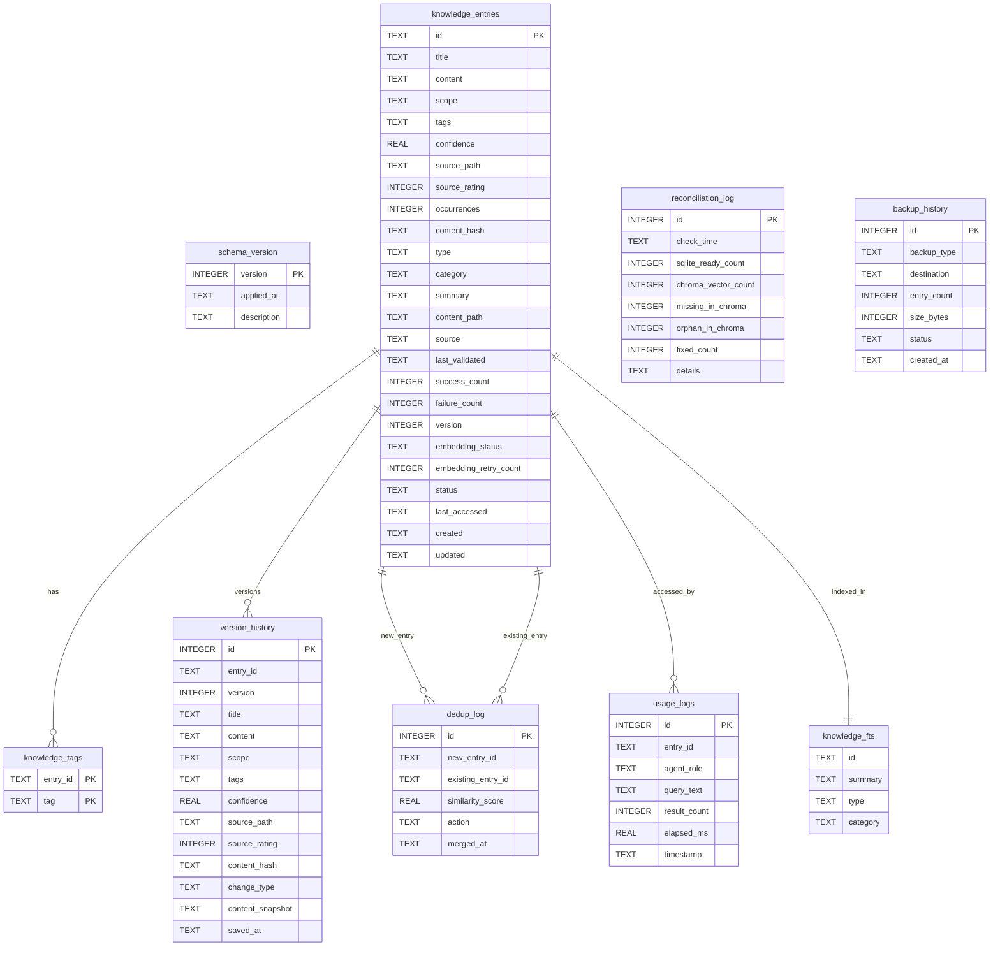
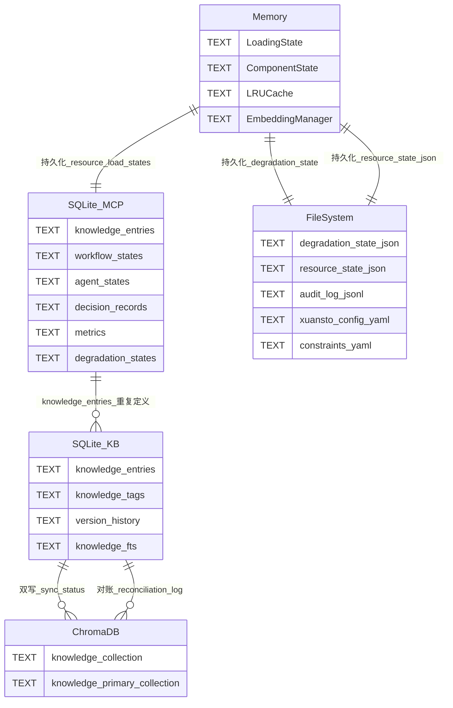

# xuansto-skill-v2 数据库设计文档

> 版本: 1.0 | 最后更新: 2026-05-26
> 范围: xuansto-mcp-server + knowledge_server 双层数据架构

---

## 目录

1. [当前数据存储盘点](#1-当前数据存储盘点)
2. [持久化/缓存数据实体清单](#2-持久化缓存数据实体清单)
3. [数据生命周期](#3-数据生命周期)
4. [重构后数据模型](#4-重构后数据模型)
5. [ER图与实体关系描述](#5-er图与实体关系描述)
6. [数据迁移策略](#6-数据迁移策略)
7. [存储技术选型建议](#7-存储技术选型建议)

---

## 1. 当前数据存储盘点

### 1.1 存储层总览

xuansto-skill-v2 项目采用**五层混合存储架构**，数据分布在 SQLite、ChromaDB、文件系统、环境变量和内存中：

| 存储层 | 技术 | 用途 | 位置 |
|--------|------|------|------|
| 关系型数据库 | SQLite (WAL) | 知识条目、决策、Agent状态、工作流状态、审计日志、指标 | `.xuansto/xuansto.db` / `.knowledge/index/knowledge.db` |
| 向量数据库 | ChromaDB (PersistentClient) | 语义搜索向量存储 | `.knowledge/index/chroma_db` |
| 文件系统 | JSON / YAML | 运行时状态、配置、降级状态、审计日志 | `.xuansto/` / `.knowledge/` |
| 环境变量 | OS env | 路径覆盖、传输配置、清理策略 | 进程环境 |
| 内存 | Python dict / dataclass | 会话状态、工作流缓存、LRU缓存、加载状态 | 进程内 |

### 1.2 SQLite 数据库（双实例）

项目存在**两个独立的 SQLite 数据库实例**，分别服务于不同模块：

#### 实例 A：MCP Server 数据库

- **文件路径**: `WORK_DIR / "xuansto.db"`（默认 `.xuansto/xuansto.db`）
- **配置来源**: `XUANSTO_WORK_DIR` 环境变量
- **代码位置**: [database.py](file:///c:/Users/86156/.trae-cn/worktrees/skiller/feat-develop-main-branch-H3MhdQ/xuansto-mcp-server/src/xuansto_mcp/core/database.py#L18)
- **连接模式**: WAL + `busy_timeout=5000` + `foreign_keys=ON`
- **表清单**:

| 表名 | 主键 | 用途 |
|------|------|------|
| `workflow_instances` | id (TEXT) | 工作流实例（旧版，含 data_json） |
| `session_states` | id (TEXT) | 会话状态（含 session_data_json） |
| `resource_load_states` | id (TEXT) | 资源加载状态（含 phase, resources_json） |
| `degradation_states` | id (TEXT) | 降级状态（含 component_name, level, data_json） |
| `error_patterns` | id (TEXT) | 错误模式记录 |
| `metrics` | id (AUTO) | 工具调用指标（tool_name, metric_type, value_json） |
| `decision_records` | id (TEXT) | 决策记录（含 workflow_id, decision_data_json） |
| `knowledge_entries` | id (TEXT) | 知识条目（含 tags_json, metadata_json, sync_status） |
| `reconciliation_log` | id (AUTO) | 双写对账日志 |
| `token_budget_states` | id (TEXT) | Token预算状态 |
| `experience_patterns` | id (TEXT) | 经验模式（含 pattern_json, confidence） |
| `agent_states` | agent_id (TEXT) | Agent实例状态 |
| `workflow_states` | workflow_id (TEXT) | 工作流状态（含 tasks_json, decisions_json） |

#### 实例 B：Knowledge Server 数据库

- **文件路径**: `knowledge_root / ".knowledge/index/knowledge.db"`（可配置）
- **配置来源**: `KnowledgeConfig.sqlite_path` 属性
- **代码位置**: [db_engine.py](file:///c:/Users/86156/.trae-cn/worktrees/skiller/feat-develop-main-branch-H3MhdQ/.trae/skills/xuansto-skill-v2/scripts/knowledge_server/db_engine.py#L18)
- **连接模式**: WAL + `foreign_keys=ON`（单连接 + 写锁）
- **Schema 版本**: 12（含迁移链 v9→v12）
- **表清单**:

| 表名 | 主键 | 用途 |
|------|------|------|
| `schema_version` | version (INT) | Schema版本追踪 |
| `knowledge_entries` | id (TEXT) | 知识条目（完整字段，含 embedding_status, version, status） |
| `knowledge_tags` | (entry_id, tag) | 标签关联表 |
| `knowledge_fts` | (FTS5虚拟表) | 全文搜索索引 |
| `dedup_log` | id (AUTO) | 去重日志 |
| `version_history` | id (AUTO) | 条目版本历史 |
| `reconciliation_log` | id (AUTO) | SQLite/ChromaDB对账日志 |
| `usage_logs` | id (AUTO) | 使用日志 |
| `backup_history` | id (AUTO) | 备份历史 |

### 1.3 ChromaDB 向量数据库

- **文件路径**: `knowledge_root / ".knowledge/index/chroma_db"`（可配置）
- **配置来源**: `KnowledgeConfig.chroma_path` 属性 / `KNOWLEDGE_CHROMA_PATH`
- **代码位置**: [vector_engine.py](file:///c:/Users/86156/.trae-cn/worktrees/skiller/feat-develop-main-branch-H3MhdQ/.trae/skills/xuansto-skill-v2/scripts/knowledge_server/vector_engine.py#L11)
- **客户端类型**: `PersistentClient`
- **集合清单**:

| 集合名 | 向量空间 | 用途 |
|--------|----------|------|
| `knowledge` | cosine | 默认知识向量集合（支持文档直查） |
| `knowledge_primary` | cosine | API级嵌入专用集合（高维度1536） |

- **元数据字段**: `embedding_model_stale` (bool) — 标记需要重新嵌入的条目
- **双集合策略**: 当 `EmbeddingManager.level == LEVEL_API` 时启用 `knowledge_primary` 集合，否则使用默认 `knowledge` 集合

### 1.4 文件系统状态文件

| 文件路径 | 格式 | 用途 | 代码位置 |
|----------|------|------|----------|
| `.xuansto/resource_state.json` | JSON | 资源加载状态（phase, loaded_resources, progress） | [degradation.py](file:///c:/Users/86156/.trae-cn/worktrees/skiller/feat-develop-main-branch-H3MhdQ/.trae/skills/xuansto-skill-v2/scripts/knowledge_server/degradation.py#L701) |
| `.xuansto/degradation_state.json` | JSON | 降级管理器持久化状态 | [degradation.py](file:///c:/Users/86156/.trae-cn/worktrees/skiller/feat-develop-main-branch-H3MhdQ/xuansto-mcp-server/src/xuansto_mcp/core/degradation.py#L110) |
| `.xuansto/audit_log.jsonl` | JSONL | 审计日志（工具调用记录） | [audit_logger.py](file:///c:/Users/86156/.trae-cn/worktrees/skiller/feat-develop-main-branch-H3MhdQ/xuansto-mcp-server/src/xuansto_mcp/core/audit_logger.py#L12) |
| `.xuansto/sessions/` | 目录 | 会话持久化文件 | [config.py](file:///c:/Users/86156/.trae-cn/worktrees/skiller/feat-develop-main-branch-H3MhdQ/xuansto-mcp-server/src/xuansto_mcp/core/config.py#L373) |
| `.xuansto/patterns/` | 目录 | 经验模式文件 | [config.py](file:///c:/Users/86156/.trae-cn/worktrees/skiller/feat-develop-main-branch-H3MhdQ/xuansto-mcp-server/src/xuansto_mcp/core/config.py#L374) |
| `.xuansto/plans/` | 目录 | 规划缓存文件 | — |
| `.xuansto-config.yaml` | YAML | 项目配置（gate_scripts, hook_scripts, degradation） | [config.py](file:///c:/Users/86156/.trae-cn/worktrees/skiller/feat-develop-main-branch-H3MhdQ/xuansto-mcp-server/src/xuansto_mcp/core/config.py#L120) |
| `constraints.yaml` | YAML | 代码约束配置 | [config.py](file:///c:/Users/86156/.trae-cn/worktrees/skiller/feat-develop-main-branch-H3MhdQ/xuansto-mcp-server/src/xuansto_mcp/core/config.py#L122) |
| `.skill-config.yaml` | YAML | 技能配置 | [config.py](file:///c:/Users/86156/.trae-cn/worktrees/skiller/feat-develop-main-branch-H3MhdQ/xuansto-mcp-server/src/xuansto_mcp/core/config.py#L123) |
| `.knowledge/config.yaml` | YAML | Knowledge Server配置 | [config.py](file:///c:/Users/86156/.trae-cn/worktrees/skiller/feat-develop-main-branch-H3MhdQ/.trae/skills/xuansto-skill-v2/scripts/knowledge_server/config.py#L289) |
| `.knowledge/logs/knowledge-server.log` | 日志 | Knowledge Server运行日志 | [config.py](file:///c:/Users/86156/.trae-cn/worktrees/skiller/feat-develop-main-branch-H3MhdQ/.trae/skills/xuansto-skill-v2/scripts/knowledge_server/config.py#L388) |
| `hooks/hooks.json` | JSON | Hook配置 | [config.py](file:///c:/Users/86156/.trae-cn/worktrees/skiller/feat-develop-main-branch-H3MhdQ/xuansto-mcp-server/src/xuansto_mcp/core/config.py#L378) |
| `.knowledge/experience_patterns.json` | JSON | 经验模式（旧格式，待迁移） | [database.py](file:///c:/Users/86156/.trae-cn/worktrees/skiller/feat-develop-main-branch-H3MhdQ/xuansto-mcp-server/src/xuansto_mcp/core/database.py#L506) |

### 1.5 环境变量

| 变量名 | 默认值 | 用途 | 代码位置 |
|--------|--------|------|----------|
| `XUANSTO_WORK_DIR` | `{project_root}/.xuansto` | MCP Server工作目录 | [config.py](file:///c:/Users/86156/.trae-cn/worktrees/skiller/feat-develop-main-branch-H3MhdQ/xuansto-mcp-server/src/xuansto_mcp/core/config.py#L372) |
| `XUANSTO_SKILL_ROOT` | 自动检测 | 技能根目录 | [config.py](file:///c:/Users/86156/.trae-cn/worktrees/skiller/feat-develop-main-branch-H3MhdQ/xuansto-mcp-server/src/xuansto_mcp/core/config.py#L41) |
| `XUANSTO_TRANSPORT` | `stdio` | MCP传输协议（stdio/streamable-http） | [server.py](file:///c:/Users/86156/.trae-cn/worktrees/skiller/feat-develop-main-branch-H3MhdQ/xuansto-mcp-server/src/xuansto_mcp/server.py#L250) |
| `XUANSTO_HOST` | `127.0.0.1` | HTTP模式监听地址 | [server.py](file:///c:/Users/86156/.trae-cn/worktrees/skiller/feat-develop-main-branch-H3MhdQ/xuansto-mcp-server/src/xuansto_mcp/server.py#L252) |
| `XUANSTO_PORT` | `8000` | HTTP模式监听端口 | [server.py](file:///c:/Users/86156/.trae-cn/worktrees/skiller/feat-develop-main-branch-H3MhdQ/xuansto-mcp-server/src/xuansto_mcp/server.py#L253) |
| `XUANSTO_KNOWLEDGE_CLEANUP_KEEP_LAST_N` | `10` | 版本清理保留数量 | [config.py](file:///c:/Users/86156/.trae-cn/worktrees/skiller/feat-develop-main-branch-H3MhdQ/xuansto-mcp-server/src/xuansto_mcp/core/config.py#L436) |
| `OPENAI_API_KEY` | — | OpenAI嵌入API密钥 | [embedding.py](file:///c:/Users/86156/.trae-cn/worktrees/skiller/feat-develop-main-branch-H3MhdQ/.trae/skills/xuansto-skill-v2/scripts/knowledge_server/embedding.py#L41) |
| `KB_HOST` | `127.0.0.1` | Knowledge Server监听地址 | [config.py](file:///c:/Users/86156/.trae-cn/worktrees/skiller/feat-develop-main-branch-H3MhdQ/.trae/skills/xuansto-skill-v2/scripts/knowledge_server/config.py#L322) |
| `KB_PORT` | `8765` | Knowledge Server监听端口 | [config.py](file:///c:/Users/86156/.trae-cn/worktrees/skiller/feat-develop-main-branch-H3MhdQ/.trae/skills/xuansto-skill-v2/scripts/knowledge_server/config.py#L323) |
| `KB_LOG_LEVEL` | `INFO` | Knowledge Server日志级别 | [config.py](file:///c:/Users/86156/.trae-cn/worktrees/skiller/feat-develop-main-branch-H3MhdQ/.trae/skills/xuansto-skill-v2/scripts/knowledge_server/config.py#L325) |

### 1.6 内存状态

| 状态对象 | 类型 | 代码位置 | 生命周期 |
|----------|------|----------|----------|
| `LoadingState` | dataclass | [progressive_loader.py](file:///c:/Users/86156/.trae-cn/worktrees/skiller/feat-develop-main-branch-H3MhdQ/.trae/skills/xuansto-skill-v2/scripts/knowledge_server/progressive_loader.py#L134) | 进程生命周期 |
| `_workflows` | dict | server.py 启动时加载 | 进程生命周期 |
| `_sessions` | dict | session_manage 工具管理 | 进程生命周期 |
| `LRUCache` | OrderedDict | [cache.py](file:///c:/Users/86156/.trae-cn/worktrees/skiller/feat-develop-main-branch-H3MhdQ/xuansto-mcp-server/src/xuansto_mcp/core/cache.py#L8) | 进程生命周期（maxsize=128） |
| `_ComponentState` | __slots__ | [degradation.py](file:///c:/Users/86156/.trae-cn/worktrees/skiller/feat-develop-main-branch-H3MhdQ/xuansto-mcp-server/src/xuansto_mcp/core/degradation.py#L58) | 进程生命周期 + 持久化 |
| `DegradationManager._components` | dict | [degradation.py](file:///c:/Users/86156/.trae-cn/worktrees/skiller/feat-develop-main-branch-H3MhdQ/xuansto-mcp-server/src/xuansto_mcp/core/degradation.py#L114) | 单例 |
| `SQLiteEngine._conn` | sqlite3.Connection | [db_engine.py](file:///c:/Users/86156/.trae-cn/worktrees/skiller/feat-develop-main-branch-H3MhdQ/.trae/skills/xuansto-skill-v2/scripts/knowledge_server/db_engine.py#L22) | 单例（懒初始化） |
| `ChromaEngine._client` | chromadb.PersistentClient | [vector_engine.py](file:///c:/Users/86156/.trae-cn/worktrees/skiller/feat-develop-main-branch-H3MhdQ/.trae/skills/xuansto-skill-v2/scripts/knowledge_server/vector_engine.py#L16) | 单例 |
| `EmbeddingManager` | 实例 | [embedding.py](file:///c:/Users/86156/.trae-cn/worktrees/skiller/feat-develop-main-branch-H3MhdQ/.trae/skills/xuansto-skill-v2/scripts/knowledge_server/embedding.py#L17) | 单例 |

---

## 2. 持久化/缓存数据实体清单

### 2.1 MCP Server SQLite 表结构

#### workflow_instances

```json
{
  "id": "wf-20260526-abc123",
  "workflow_type": "sdd-tdd-full",
  "current_phase": 3,
  "status": "running",
  "created_at": "2026-05-26T08:00:00+00:00",
  "updated_at": "2026-05-26T09:30:00+00:00",
  "data_json": {
    "project_path": "/path/to/project",
    "snapshots": [],
    "phase_history": []
  }
}
```

#### session_states

```json
{
  "id": "sess-20260526-xyz789",
  "session_data_json": {
    "completed_tasks": ["task-1", "task-2"],
    "pending_tasks": ["task-3"],
    "decisions": ["使用SQLite而非PostgreSQL"],
    "experience": ["TDD模式在小型项目中效率更高"],
    "current_phase": 3
  },
  "created_at": "2026-05-26T08:00:00+00:00",
  "updated_at": "2026-05-26T09:30:00+00:00"
}
```

#### resource_load_states

```json
{
  "id": "default",
  "phase": 2,
  "resources_json": {
    "skill-config": {"progress": 1.0, "loaded_at": 1748246400.0},
    "command-list": {"progress": 1.0, "loaded_at": 1748246400.0},
    "knowledge-search": {"progress": 0.8, "loaded_at": 1748246400.0}
  },
  "updated_at": "2026-05-26T09:30:00+00:00"
}
```

#### degradation_states

```json
{
  "id": "search_engine",
  "component_name": "search_engine",
  "level": "sqlite_fts",
  "data_json": {
    "last_check_time": 1748246400.0,
    "recovery_attempts": 3,
    "degraded_since": 1748246000.0
  },
  "updated_at": "2026-05-26T09:30:00+00:00"
}
```

#### knowledge_entries（MCP Server 版）

```json
{
  "id": "kb-20260526-abc123",
  "title": "React Hooks最佳实践",
  "content": "...(知识内容)...",
  "scope": "general",
  "tags_json": ["react", "hooks", "frontend"],
  "metadata_json": {
    "source": "code_review",
    "confidence": 0.85,
    "important": true
  },
  "sync_status": "ready",
  "deleted_at": null,
  "created_at": "2026-05-26T08:00:00+00:00",
  "updated_at": "2026-05-26T09:30:00+00:00"
}
```

#### agent_states

```json
{
  "agent_id": "agent-dev-001",
  "agent_name": "backend_developer",
  "agent_type": "developer",
  "phase": 3,
  "status": "active",
  "config_json": {
    "capabilities": ["code_review", "testing"],
    "max_concurrent_tasks": 3
  },
  "created_at": 1748246400.0,
  "updated_at": 1748246400.0
}
```

#### workflow_states

```json
{
  "workflow_id": "wf-20260526-abc123",
  "workflow_type": "sdd-tdd-full",
  "current_phase": 3,
  "project_path": "/path/to/project",
  "completed_phases_json": [0, 1, 2],
  "tasks_json": {
    "current": "实现用户认证模块",
    "pending": ["编写集成测试", "代码审查"]
  },
  "decisions_json": {
    "auth_strategy": "JWT + refresh token"
  },
  "status": "active",
  "created_at": 1748246400.0,
  "updated_at": 1748246400.0
}
```

#### decision_records

```json
{
  "id": "dec-20260526-abc123",
  "workflow_id": "wf-20260526-abc123",
  "decision_data_json": {
    "title": "数据库选型",
    "description": "选择SQLite作为主数据库",
    "context": "项目需要嵌入式数据库",
    "alternatives": ["PostgreSQL", "MongoDB"],
    "decision": "SQLite",
    "rationale": "嵌入式部署、零配置、WAL模式支持并发",
    "impact": "不支持多进程写入",
    "decided_by": "architect",
    "tags": ["database", "architecture"],
    "status": "accepted"
  },
  "created_at": "2026-05-26T08:00:00+00:00"
}
```

#### metrics

```json
{
  "id": 123,
  "tool_name": "knowledge_search",
  "metric_type": "call",
  "value_json": {
    "latency_ms": 45.2,
    "success": true,
    "result_count": 5
  },
  "timestamp": "2026-05-26T09:30:00+00:00"
}
```

#### experience_patterns

```json
{
  "id": "exp-20260526-abc123",
  "error_type": "ImportError",
  "pattern_json": {
    "pattern": "chromadb.*ImportError",
    "resolution": "降级到BM25搜索",
    "context": "ChromaDB未安装时自动降级"
  },
  "confidence": 0.9,
  "status": "active",
  "occurrence_count": 5,
  "created_at": "2026-05-26T08:00:00+00:00",
  "updated_at": "2026-05-26T09:30:00+00:00"
}
```

#### reconciliation_log

```json
{
  "id": 456,
  "entry_id": "kb-20260526-abc123",
  "store": "chromadb",
  "issue_type": "write_failed",
  "details_json": {
    "reason": "chroma_write_returned_false"
  },
  "resolved": 0,
  "created_at": "2026-05-26T08:00:00+00:00",
  "resolved_at": null
}
```

### 2.2 Knowledge Server SQLite 表结构

#### knowledge_entries（Knowledge Server 版 — 完整字段）

```json
{
  "id": "kb-20260526-abc123",
  "title": "React Hooks最佳实践",
  "content": "...(知识内容)...",
  "scope": "general",
  "tags": ["react", "hooks", "frontend"],
  "confidence": 0.85,
  "source_path": "reviews/2026-05-26.md",
  "source_rating": 4,
  "occurrences": 3,
  "content_hash": "a1b2c3d4e5f6...",
  "type": "standard",
  "category": "frontend",
  "summary": "React Hooks使用的最佳实践总结",
  "content_path": null,
  "source": "code_review",
  "last_validated": "2026-05-26T08:00:00",
  "success_count": 10,
  "failure_count": 1,
  "version": 3,
  "embedding_status": "ready",
  "embedding_retry_count": 0,
  "status": "active",
  "last_accessed": "2026-05-26T09:30:00",
  "created": "2026-05-26T08:00:00",
  "updated": "2026-05-26T09:30:00"
}
```

#### knowledge_tags

```json
{
  "entry_id": "kb-20260526-abc123",
  "tag": "react"
}
```

#### version_history

```json
{
  "id": 789,
  "entry_id": "kb-20260526-abc123",
  "version": 2,
  "title": "React Hooks最佳实践",
  "content": "...(旧版本内容)...",
  "scope": "general",
  "tags": "[\"react\", \"hooks\"]",
  "confidence": 0.8,
  "source_path": "reviews/2026-05-26.md",
  "source_rating": 4,
  "content_hash": "f6e5d4c3b2a1...",
  "change_type": "update",
  "content_snapshot": null,
  "saved_at": "2026-05-26T08:30:00"
}
```

#### dedup_log

```json
{
  "id": 101,
  "new_entry_id": "kb-20260526-def456",
  "existing_entry_id": "kb-20260526-abc123",
  "similarity_score": 0.95,
  "action": "merge",
  "merged_at": "2026-05-26T09:00:00"
}
```

#### usage_logs

```json
{
  "id": 202,
  "entry_id": "kb-20260526-abc123",
  "agent_role": "code_reviewer",
  "query_text": "React hooks",
  "result_count": 5,
  "elapsed_ms": 45.2,
  "timestamp": "2026-05-26T09:30:00"
}
```

#### backup_history

```json
{
  "id": 303,
  "backup_type": "full",
  "destination": "/backups/kb-20260526.tar.gz",
  "entry_count": 150,
  "size_bytes": 2048000,
  "status": "completed",
  "created_at": "2026-05-26T10:00:00"
}
```

### 2.3 ChromaDB 向量存储结构

#### knowledge 集合

```json
{
  "ids": ["kb-20260526-abc123"],
  "embeddings": [[0.012, -0.034, 0.056, ...]],
  "metadatas": [{"scope": "general", "type": "standard"}],
  "documents": ["React Hooks最佳实践...(内容)..."]
}
```

#### knowledge_primary 集合（API嵌入专用）

```json
{
  "ids": ["kb-20260526-abc123"],
  "embeddings": [[0.012, -0.034, 0.056, ...]],
  "metadatas": [{"scope": "general", "embedding_model_stale": false}],
  "documents": ["React Hooks最佳实践...(内容)..."]
}
```

### 2.4 文件系统配置示例

#### .xuansto-config.yaml

```yaml
gate_scripts:
  GATE-007: check-encoding.py
  TEST-PASS: coverage-check.py
gates_by_phase:
  "0": [DESIGN-SYSTEM-COMPLETE, ANTI-PATTERN-CHECK]
  "1": [BRAINSTORM-COMPLETE, GATE-001]
hook_scripts:
  token-budget-check: token-budget-guard.py
  encoding-check: check-encoding.py
degradation:
  health_check_interval: 30.0
```

#### degradation_state.json

```json
{
  "overall_level": "L1_NORMAL",
  "components": {
    "search_engine": {
      "name": "search_engine",
      "level": "chromadb",
      "last_check_time": 1748246400.0,
      "last_check_healthy": true,
      "recovery_attempts": 0,
      "next_recovery_time": 0.0,
      "degraded_since": null
    }
  },
  "health_interval": 30.0,
  "started": true,
  "_timestamp": 1748246400.0,
  "_hash": "sha256hash..."
}
```

#### .knowledge/config.yaml

```yaml
knowledge_base:
  server:
    host: 127.0.0.1
    port: 8765
    transport: stdio
  database:
    sqlite_path: .knowledge/index/knowledge.db
    chroma_path: .knowledge/index/chroma_db
  embedding:
    primary: text-embedding-3-small
    fallback: sentence-transformers/all-MiniLM-L6-v2
    dimension: 1536
  retrieval:
    semantic_weight: 0.7
    keyword_weight: 0.3
    top_k: 5
    default_strategy: hybrid
  dedup:
    similarity_threshold: 0.92
    action: merge
```

---

## 3. 数据生命周期

### 3.1 知识条目生命周期

```
[创建] → [嵌入pending] → [嵌入ready] → [活跃使用] → [归档] → [软删除]
   │          │               │             │           │
   │          │               │             │           └─ deleted_at 标记
   │          │               │             └─ last_accessed 更新
   │          │               └─ ChromaDB向量写入成功
   │          └─ 嵌入重试(retry_count < 5)
   │              └─ 失败 → reconciliation_log 记录
   └─ content_hash 去重检查
       └─ 相似度 > 0.92 → dedup_log 记录 → skip/merge/keep_both
```

**触发条件**:

| 操作 | 触发 | 代码位置 |
|------|------|----------|
| 创建 | `knowledge_inject` 工具调用 / `SQLiteEngine.add_entry()` | [db_engine.py:130](file:///c:/Users/86156/.trae-cn/worktrees/skiller/feat-develop-main-branch-H3MhdQ/.trae/skills/xuansto-skill-v2/scripts/knowledge_server/db_engine.py#L130) |
| 更新 | `knowledge_inject(action=update)` / `SQLiteEngine.update_entry()` | [db_engine.py:198](file:///c:/Users/86156/.trae-cn/worktrees/skiller/feat-develop-main-branch-H3MhdQ/.trae/skills/xuansto-skill-v2/scripts/knowledge_server/db_engine.py#L198) |
| 版本保存 | 更新/删除时自动 `_save_version()` | [db_engine.py:260](file:///c:/Users/86156/.trae-cn/worktrees/skiller/feat-develop-main-branch-H3MhdQ/.trae/skills/xuansto-skill-v2/scripts/knowledge_server/db_engine.py#L260) |
| 嵌入状态更新 | `SQLiteEngine.update_embedding_status()` | [db_engine.py:481](file:///c:/Users/86156/.trae-cn/worktrees/skiller/feat-develop-main-branch-H3MhdQ/.trae/skills/xuansto-skill-v2/scripts/knowledge_server/db_engine.py#L481) |
| 软删除 | `SQLiteEngine.delete_entry()` / `cleanup_knowledge_versions()` | [db_engine.py:249](file:///c:/Users/86156/.trae-cn/worktrees/skiller/feat-develop-main-branch-H3MhdQ/.trae/skills/xuansto-skill-v2/scripts/knowledge_server/db_engine.py#L249) |
| 版本清理 | `cleanup_knowledge_versions(keep_last_n)` | [database.py:549](file:///c:/Users/86156/.trae-cn/worktrees/skiller/feat-develop-main-branch-H3MhdQ/xuansto-mcp-server/src/xuansto_mcp/core/database.py#L549) |

### 3.2 工作流状态生命周期

```
[创建start] → [运行running] → [阶段推进advance] → [完成completed/中止aborted]
     │              │                   │
     │              │                   └─ workflow_states.current_phase 递增
     │              └─ workflow_states 持久化
     └─ workflow_instances + workflow_states 初始化
```

**触发条件**:

| 操作 | 触发 | 代码位置 |
|------|------|----------|
| 创建 | `workflow_dispatch(action=start)` | [database.py:709](file:///c:/Users/86156/.trae-cn/worktrees/skiller/feat-develop-main-branch-H3MhdQ/xuansto-mcp-server/src/xuansto_mcp/core/database.py#L709) |
| 推进 | `workflow_dispatch(action=phase, phase_action=advance)` | — |
| 中止 | `workflow_dispatch(action=abort)` | — |
| 恢复 | 启动时 `workflow_load_on_startup()` | [server.py:237](file:///c:/Users/86156/.trae-cn/worktrees/skiller/feat-develop-main-branch-H3MhdQ/xuansto-mcp-server/src/xuansto_mcp/server.py#L237) |

### 3.3 Agent 状态生命周期

```
[创建create] → [分配assign] → [执行中] → [释放release] → [销毁destroy]
     │              │            │           │
     │              │            │           └─ delete_agent_state()
     │              │            └─ status=active
     │              └─ save_agent_state(status=assigned)
     └─ save_agent_state()
```

**触发条件**:

| 操作 | 触发 | 代码位置 |
|------|------|----------|
| 创建 | `agent_manage(action=create)` | [database.py:635](file:///c:/Users/86156/.trae-cn/worktrees/skiller/feat-develop-main-branch-H3MhdQ/xuansto-mcp-server/src/xuansto_mcp/core/database.py#L635) |
| 恢复 | 启动时 `agent_load_on_startup()` | [server.py:239](file:///c:/Users/86156/.trae-cn/worktrees/skiller/feat-develop-main-branch-H3MhdQ/xuansto-mcp-server/src/xuansto_mcp/server.py#L239) |

### 3.4 降级状态生命周期

```
[正常L1] → [检测异常] → [降级L2/L3] → [定期恢复检查] → [恢复L1]
    │            │             │              │
    │            │             │              └─ attempt_recovery() 指数退避
    │            │             └─ _persist_state() → degradation_state.json
    │            └─ check_and_degrade()
    └─ 健康监控线程(30s间隔)
```

**触发条件**:

| 操作 | 触发 | 代码位置 |
|------|------|----------|
| 健康检查 | `DegradationManager._health_loop()` (30s间隔) | [degradation.py:366](file:///c:/Users/86156/.trae-cn/worktrees/skiller/feat-develop-main-branch-H3MhdQ/xuansto-mcp-server/src/xuansto_mcp/core/degradation.py#L366) |
| 降级 | `check_and_degrade(component)` | [degradation.py:147](file:///c:/Users/86156/.trae-cn/worktrees/skiller/feat-develop-main-branch-H3MhdQ/xuansto-mcp-server/src/xuansto_mcp/core/degradation.py#L147) |
| 恢复 | `attempt_recovery(component)` | [degradation.py:178](file:///c:/Users/86156/.trae-cn/worktrees/skiller/feat-develop-main-branch-H3MhdQ/xuansto-mcp-server/src/xuansto_mcp/core/degradation.py#L178) |
| 持久化 | 每次状态变更后 `_persist_state()` | [degradation.py:350](file:///c:/Users/86156/.trae-cn/worktrees/skiller/feat-develop-main-branch-H3MhdQ/xuansto-mcp-server/src/xuansto_mcp/core/degradation.py#L350) |
| 恢复加载 | 启动时 `degradation_load_on_startup()` → `load_state()` | [degradation.py:262](file:///c:/Users/86156/.trae-cn/worktrees/skiller/feat-develop-main-branch-H3MhdQ/xuansto-mcp-server/src/xuansto_mcp/core/degradation.py#L262) |

### 3.5 渐进式加载生命周期

```
[SKELETON(0)] → [FUNCTIONAL(1)] → [ENHANCED(2)] → [FULL(3)]
     │                │                 │               │
     │ 2000 tokens    │ 5000 tokens     │ 10000 tokens  │ 20000 tokens
     │ P0_must        │ P0+P1           │ P0+P1+P2      │ P0+P1+P2+P3
     │                │                  │               │
     └─ /status,/help └─ /init,/plan    └─ /audit       └─ /build-desktop
```

**降级路径**: `FULL → ENHANCED → FUNCTIONAL → SKELETON`（空闲>300s时降级）

**触发条件**:

| 操作 | 触发 | 代码位置 |
|------|------|----------|
| 阶段推进 | `ProgressiveLoader.advance_phase()` | [progressive_loader.py:207](file:///c:/Users/86156/.trae-cn/worktrees/skiller/feat-develop-main-branch-H3MhdQ/.trae/skills/xuansto-skill-v2/scripts/knowledge_server/progressive_loader.py#L207) |
| 阶段降级 | `ProgressiveLoader.degrade_phase()` | [progressive_loader.py:270](file:///c:/Users/86156/.trae-cn/worktrees/skiller/feat-develop-main-branch-H3MhdQ/.trae/skills/xuansto-skill-v2/scripts/knowledge_server/progressive_loader.py#L270) |
| 命令触发 | `ProgressiveLoader.get_phase_for_command()` | [progressive_loader.py:316](file:///c:/Users/86156/.trae-cn/worktrees/skiller/feat-develop-main-branch-H3MhdQ/.trae/skills/xuansto-skill-v2/scripts/knowledge_server/progressive_loader.py#L316) |
| 技能同步 | `ProgressiveLoader.sync_from_skill_phase()` | [progressive_loader.py:319](file:///c:/Users/86156/.trae-cn/worktrees/skiller/feat-develop-main-branch-H3MhdQ/.trae/skills/xuansto-skill-v2/scripts/knowledge_server/progressive_loader.py#L319) |

### 3.6 双写一致性生命周期

```
[写入SQLite] → [sync_status=pending] → [写入ChromaDB] → [sync_status=ready]
      │                                    │
      │                                    └─ 失败 → reconciliation_log
      │                                         └─ 定期对账 reconcile_knowledge_stores()
      └─ persist_knowledge_dual_write()
```

**触发条件**:

| 操作 | 触发 | 代码位置 |
|------|------|----------|
| 双写 | `persist_knowledge_dual_write()` | [database.py:322](file:///c:/Users/86156/.trae-cn/worktrees/skiller/feat-develop-main-branch-H3MhdQ/xuansto-mcp-server/src/xuansto_mcp/core/database.py#L322) |
| 对账 | `reconcile_knowledge_stores()` | [database.py:359](file:///c:/Users/86156/.trae-cn/worktrees/skiller/feat-develop-main-branch-H3MhdQ/xuansto-mcp-server/src/xuansto_mcp/core/database.py#L359) |
| 过期清理 | `cleanup_stale_pending_entries(max_age_hours=24)` | [database.py:433](file:///c:/Users/86156/.trae-cn/worktrees/skiller/feat-develop-main-branch-H3MhdQ/xuansto-mcp-server/src/xuansto_mcp/core/database.py#L433) |

---

## 4. 重构后数据模型

### 4.1 MCP Server 状态存储结构体

重构目标：**统一双SQLite实例为单实例**，消除 `knowledge_entries` 表的重复定义。

#### 统一 knowledge_entries 表（合并后）

```sql
CREATE TABLE IF NOT EXISTS knowledge_entries (
    id TEXT PRIMARY KEY,
    title TEXT NOT NULL DEFAULT '',
    content TEXT NOT NULL DEFAULT '',
    scope TEXT NOT NULL DEFAULT 'general'
        CHECK(scope IN ('general','workspace','experience')),
    tags_json TEXT NOT NULL DEFAULT '[]',
    metadata_json TEXT NOT NULL DEFAULT '{}',
    confidence REAL DEFAULT 0.6 CHECK(confidence BETWEEN 0 AND 1),
    source_path TEXT,
    source_rating INTEGER DEFAULT 3 CHECK(source_rating BETWEEN 1 AND 5),
    occurrences INTEGER DEFAULT 1,
    content_hash TEXT,
    type TEXT NOT NULL DEFAULT 'unknown',
    category TEXT NOT NULL DEFAULT 'uncategorized',
    summary TEXT,
    content_path TEXT,
    source TEXT,
    last_validated TEXT,
    success_count INTEGER DEFAULT 0,
    failure_count INTEGER DEFAULT 0,
    version INTEGER DEFAULT 1,
    embedding_status TEXT DEFAULT 'pending'
        CHECK(embedding_status IN ('pending','ready','failed')),
    embedding_retry_count INTEGER DEFAULT 0,
    sync_status TEXT NOT NULL DEFAULT 'ready'
        CHECK(sync_status IN ('pending','ready','failed')),
    status TEXT DEFAULT 'active'
        CHECK(status IN ('active','archived','deleted')),
    last_accessed TEXT,
    deleted_at TEXT,
    created_at TEXT NOT NULL DEFAULT (datetime('now')),
    updated_at TEXT NOT NULL DEFAULT (datetime('now'))
);
```

**合并要点**:
- 保留 Knowledge Server 版的完整字段（embedding_status, version, status 等）
- 保留 MCP Server 版的 sync_status, deleted_at, metadata_json 字段
- `tags` 字段统一为 `tags_json`（JSON字符串存储）
- `created`/`updated` 统一为 `created_at`/`updated_at`
- embedding_status 增加 `failed` 状态

### 4.2 渐进式加载相关字段

#### LoadPhase 枚举

```python
class LoadPhase(str, Enum):
    SKELETON = "skeleton"      # 阶段0: 骨架，2000 tokens
    FUNCTIONAL = "functional"  # 阶段1: 功能，5000 tokens
    ENHANCED = "enhanced"      # 阶段2: 增强，10000 tokens
    FULL = "full"              # 阶段3: 完整，20000 tokens
```

代码位置: [progressive_loader.py:7](file:///c:/Users/86156/.trae-cn/worktrees/skiller/feat-develop-main-branch-H3MhdQ/.trae/skills/xuansto-skill-v2/scripts/knowledge_server/progressive_loader.py#L7)

#### LoadingState 数据类

```python
@dataclass
class LoadingState:
    current_phase: LoadPhase = LoadPhase.SKELETON
    loaded_resources: list[str] = field(default_factory=list)
    progress: dict[str, dict[str, Any]] = field(default_factory=dict)
    last_updated: float = field(default_factory=time.time)
    degraded: bool = False
    degraded_from: Optional[str] = None
```

代码位置: [progressive_loader.py:134](file:///c:/Users/86156/.trae-cn/worktrees/skiller/feat-develop-main-branch-H3MhdQ/.trae/skills/xuansto-skill-v2/scripts/knowledge_server/progressive_loader.py#L134)

#### 资源优先级映射

| 优先级 | 阶段覆盖 | 资源列表 |
|--------|----------|----------|
| P0_must | SKELETON+ | skill-config, command-list, mcp-dependency, core-constraints |
| P1_important | FUNCTIONAL+ | execution-entry, workflow-phase-overview, command-route-compact, core-agent-index, gate-check |
| P2_enhanced | ENHANCED+ | command-route-full, agent-registry-full, reference-documents, mcp-tool-summary, knowledge-search |
| P3_optional | FULL | hook-system, model-routing, key-rules, script-set, disclosure-resources, eval-config |

### 4.3 降级状态存储结构体

#### DegradationLevel 枚举

```python
class DegradationLevel(str, Enum):
    L1_NORMAL = "L1_NORMAL"              # 全功能
    L2_LOCAL_SEMANTIC = "L2_LOCAL_SEMANTIC"  # 本地语义搜索
    L3_BM25_ONLY = "L3_BM25_ONLY"        # 仅关键词搜索
```

代码位置: [degradation.py:32](file:///c:/Users/86156/.trae-cn/worktrees/skiller/feat-develop-main-branch-H3MhdQ/xuansto-mcp-server/src/xuansto_mcp/core/degradation.py#L32)

#### _ComponentState 结构

```python
@dataclass
class _ComponentState:
    name: str
    level: str                    # 当前降级级别
    check_fn: Callable            # 健康检查函数
    recover_fn: Callable          # 恢复函数
    last_check_time: float        # 上次检查时间
    last_check_healthy: bool      # 上次检查结果
    recovery_attempts: int        # 恢复尝试次数
    next_recovery_time: float     # 下次恢复时间
    degraded_since: float | None  # 降级开始时间
    levels: list[str]             # 可用级别列表
```

代码位置: [degradation.py:58](file:///c:/Users/86156/.trae-cn/worktrees/skiller/feat-develop-main-branch-H3MhdQ/xuansto-mcp-server/src/xuansto_mcp/core/degradation.py#L58)

#### 已注册组件

| 组件名 | 级别列表 | 含义 |
|--------|----------|------|
| search_engine | chromadb → sqlite_fts → keyword | 搜索引擎降级 |
| knowledge_base | full → workspace_only → no_knowledge | 知识库降级 |
| hooks | full_hooks → essential_only → no_hooks | Hook系统降级 |
| resources | full_resources → cached_only → minimal | 资源加载降级 |

### 4.4 EmbeddingManager 降级层级

| 层级 | 常量 | 名称 | 模型 | 维度 |
|------|------|------|------|------|
| 0 | LEVEL_API | api | text-embedding-3-small | 1536 |
| 1 | LEVEL_LOCAL | local_semantic | all-MiniLM-L6-v2 | 384 |
| 2 | LEVEL_BM25_ONLY | bm25_only | 无 | 0 |

代码位置: [embedding.py:17](file:///c:/Users/86156/.trae-cn/worktrees/skiller/feat-develop-main-branch-H3MhdQ/.trae/skills/xuansto-skill-v2/scripts/knowledge_server/embedding.py#L17)

---

## 5. ER图与实体关系描述

### 5.1 MCP Server 数据库 ER图

```mermaid
erDiagram
    workflow_instances {
        TEXT id PK
        TEXT workflow_type
        INTEGER current_phase
        TEXT status
        TEXT created_at
        TEXT updated_at
        TEXT data_json
    }

    workflow_states {
        TEXT workflow_id PK
        TEXT workflow_type
        INTEGER current_phase
        TEXT project_path
        TEXT completed_phases_json
        TEXT tasks_json
        TEXT decisions_json
        TEXT status
        REAL created_at
        REAL updated_at
    }

    session_states {
        TEXT id PK
        TEXT session_data_json
        TEXT created_at
        TEXT updated_at
    }

    agent_states {
        TEXT agent_id PK
        TEXT agent_name
        TEXT agent_type
        INTEGER phase
        TEXT status
        TEXT config_json
        REAL created_at
        REAL updated_at
    }

    knowledge_entries {
        TEXT id PK
        TEXT title
        TEXT content
        TEXT scope
        TEXT tags_json
        TEXT metadata_json
        TEXT sync_status
        TEXT deleted_at
        TEXT created_at
        TEXT updated_at
    }

    decision_records {
        TEXT id PK
        TEXT workflow_id
        TEXT decision_data_json
        TEXT created_at
    }

    metrics {
        INTEGER id PK
        TEXT tool_name
        TEXT metric_type
        TEXT value_json
        TEXT timestamp
    }

    reconciliation_log {
        INTEGER id PK
        TEXT entry_id
        TEXT store
        TEXT issue_type
        TEXT details_json
        INTEGER resolved
        TEXT created_at
        TEXT resolved_at
    }

    resource_load_states {
        TEXT id PK
        INTEGER phase
        TEXT resources_json
        TEXT updated_at
    }

    degradation_states {
        TEXT id PK
        TEXT component_name
        TEXT level
        TEXT data_json
        TEXT updated_at
    }

    error_patterns {
        TEXT id PK
        TEXT pattern
        TEXT error_type
        TEXT data_json
        TEXT created_at
    }

    token_budget_states {
        TEXT id PK
        INTEGER total_budget
        INTEGER used
        TEXT phase_allocations_json
        TEXT usage_by_phase_json
        TEXT session_id
        TEXT created_at
        TEXT updated_at
    }

    experience_patterns {
        TEXT id PK
        TEXT error_type
        TEXT pattern_json
        REAL confidence
        TEXT status
        INTEGER occurrence_count
        TEXT created_at
        TEXT updated_at
    }

    workflow_instances ||--o{ decision_records : "has"
    knowledge_entries ||--o{ reconciliation_log : "tracked_by"
```



### 5.2 Knowledge Server 数据库 ER图



### 5.3 跨存储实体关系图



---

## 6. 数据迁移策略

### 6.1 已有迁移链（Knowledge Server）

当前 Knowledge Server 的 Schema 版本迁移链：

| 版本 | 迁移内容 | 代码位置 |
|------|----------|----------|
| v9 | 添加 `embedding_retry_count` 字段，初始化 `embedding_status` | [db_engine.py:59](file:///c:/Users/86156/.trae-cn/worktrees/skiller/feat-develop-main-branch-H3MhdQ/.trae/skills/xuansto-skill-v2/scripts/knowledge_server/db_engine.py#L59) |
| v10 | 添加 `source` 字段，创建 `usage_logs` 表，`schema_version.description` | [db_engine.py:69](file:///c:/Users/86156/.trae-cn/worktrees/skiller/feat-develop-main-branch-H3MhdQ/.trae/skills/xuansto-skill-v2/scripts/knowledge_server/db_engine.py#L69) |
| v11 | 创建 `backup_history` 表 | [db_engine.py:96](file:///c:/Users/86156/.trae-cn/worktrees/skiller/feat-develop-main-branch-H3MhdQ/.trae/skills/xuansto-skill-v2/scripts/knowledge_server/db_engine.py#L96) |
| v12 | 添加 `status`, `last_accessed` 字段，创建索引 | [db_engine.py:111](file:///c:/Users/86156/.trae-cn/worktrees/skiller/feat-develop-main-branch-H3MhdQ/.trae/skills/xuansto-skill-v2/scripts/knowledge_server/db_engine.py#L111) |

### 6.2 ChromaDB 路径迁移

已实现从旧路径 `.knowledge/index/chroma` 到新路径 `.knowledge/index/chroma_db` 的自动迁移。

代码位置: [config.py:402](file:///c:/Users/86156/.trae-cn/worktrees/skiller/feat-develop-main-branch-H3MhdQ/xuansto-mcp-server/src/xuansto_mcp/core/config.py#L402)

迁移逻辑:
1. 检查旧路径是否存在且非空
2. 若新路径不存在或为空，`shutil.move()` 整体迁移
3. 若两者都有数据，保留新路径，输出警告

### 6.3 经验模式 JSON → SQLite 迁移

已实现从 `.knowledge/experience_patterns.json` 到 `experience_patterns` 表的迁移。

代码位置: [database.py:506](file:///c:/Users/86156/.trae-cn/worktrees/skiller/feat-develop-main-branch-H3MhdQ/xuansto-mcp-server/src/xuansto_mcp/core/database.py#L506)

### 6.4 待执行迁移：双SQLite合并

**目标**: 将 Knowledge Server 的 `knowledge.db` 合并到 MCP Server 的 `xuansto.db`，消除 `knowledge_entries` 表的重复定义。

#### 迁移步骤

```
阶段1: Schema统一 (v13)
├── 在 xuansto.db 中创建统一 knowledge_entries 表
├── 创建 knowledge_tags, version_history, dedup_log, usage_logs, backup_history
├── 创建 knowledge_fts FTS5虚拟表及触发器
└── 保留旧表 knowledge_entries_legacy

阶段2: 数据迁移
├── 从 knowledge.db 读取所有 knowledge_entries
├── 字段映射:
│   ├── created → created_at
│   ├── updated → updated_at
│   ├── tags (JSON) → tags_json
│   └── 新增 sync_status='ready', metadata_json='{}'
├── 批量 INSERT 到 xuansto.db
├── 迁移 knowledge_tags, version_history, dedup_log 等关联表
└── 迁移 ChromaDB 向量引用（无需变更）

阶段3: 验证
├── 对比源库和目标库的条目数量
├── 验证 FTS5 索引完整性
├── 验证 ChromaDB 向量ID与SQLite记录ID一致性
└── 运行 reconciliation_log 对账

阶段4: 切换
├── 更新代码引用指向统一数据库
├── 设置 XUANSTO_DB_PATH 环境变量
└── 保留 knowledge.db 作为备份（可手动删除）
```

#### 字段映射表

| knowledge.db 字段 | xuansto.db 字段 | 转换规则 |
|-------------------|-----------------|----------|
| id | id | 直接映射 |
| title | title | 直接映射 |
| content | content | 直接映射 |
| scope | scope | 直接映射 |
| tags (JSON string) | tags_json | 字段重命名 |
| confidence | metadata_json.confidence | 移入metadata |
| source_path | metadata_json.source_path | 移入metadata |
| source_rating | metadata_json.source_rating | 移入metadata |
| occurrences | metadata_json.occurrences | 移入metadata |
| content_hash | metadata_json.content_hash | 移入metadata |
| type | type | 直接映射 |
| category | category | 直接映射 |
| summary | summary | 直接映射 |
| embedding_status | embedding_status | 直接映射 |
| embedding_retry_count | embedding_retry_count | 直接映射 |
| version | version | 直接映射 |
| status | status | 直接映射 |
| last_accessed | last_accessed | 直接映射 |
| created | created_at | 字段重命名 |
| updated | updated_at | 字段重命名 |
| — | sync_status | 默认 'ready' |
| — | metadata_json | 聚合字段 |
| — | deleted_at | 默认 NULL |

---

## 7. 存储技术选型建议

### 7.1 当前架构评估

| 维度 | 评分 | 说明 |
|------|------|------|
| 数据一致性 | ⚠️ 中等 | 双SQLite实例导致 knowledge_entries 重复定义；ChromaDB双写无事务保证 |
| 查询性能 | ✅ 良好 | SQLite WAL模式 + FTS5全文索引 + ChromaDB向量搜索 |
| 可扩展性 | ⚠️ 中等 | SQLite单写限制；ChromaDB集合设计合理但缺乏分片 |
| 运维复杂度 | ❌ 较高 | 5层存储混合；两个SQLite实例需分别维护 |
| 降级容错 | ✅ 优秀 | 三级降级策略完善；脚本回退机制健全 |

### 7.2 已知问题与建议

#### DB-01: 决策双写一致性

**问题**: `decision_records` 表在 MCP Server 中存储 `decision_data_json`，Knowledge Server 中无对应表。决策记录仅存在于 MCP Server 数据库，若 MCP Server 数据库损坏则决策丢失。

**建议**:
- 短期：增加 `decision_records` 到 Knowledge Server 的 Schema，通过 `reconciliation_log` 机制同步
- 长期：合并为单数据库实例，消除跨库一致性问题

#### DB-02: ChromaDB/SQLite 双写一致性

**问题**: `persist_knowledge_dual_write()` 先写 SQLite，再写 ChromaDB。若 ChromaDB 写入失败，SQLite 中 `sync_status='pending'`，需定期对账修复。无分布式事务保证。

**建议**:
- 短期：增加对账频率（当前依赖手动触发），添加 `sync_status='failed'` 状态
- 中期：实现 Write-Ahead Log 模式，先写操作日志，再异步执行双写
- 长期：考虑使用 SQLite 作为唯一真相源（Source of Truth），ChromaDB 作为可重建的派生索引

#### DB-03: 版本历史清理

**问题**: `version_history` 表无自动清理机制，长期运行后数据量持续增长。`cleanup_knowledge_versions()` 仅清理 `knowledge_entries` 的软删除，不清理 `version_history`。

**建议**:
- 短期：添加 `KNOWLEDGE_VERSION_CLEANUP_KEEP_LAST_N` 环境变量控制（已实现，默认10）
- 中期：为 `version_history` 添加基于时间的自动清理（如保留90天）
- 长期：实现版本快照压缩，仅保留差异

### 7.3 存储技术选型矩阵

| 候选方案 | 优势 | 劣势 | 推荐场景 |
|----------|------|------|----------|
| **SQLite (当前)** | 零配置、嵌入式、WAL并发、FTS5 | 单写、无分片、双实例问题 | ✅ 继续使用，合并为单实例 |
| **DuckDB** | 列存储、分析查询快、兼容SQLite | 嵌入式限制同SQLite | 大规模分析场景 |
| **PostgreSQL + pgvector** | 事务ACID、向量搜索一体化、可扩展 | 需要独立部署、运维成本高 | 多用户/团队部署 |
| **LanceDB** | 嵌入式向量数据库、Rust高性能 | 生态较新、Python绑定有限 | 替代ChromaDB |
| **ChromaDB (当前)** | Python原生、PersistentClient、易用 | 无事务、元数据过滤有限 | ✅ 继续使用，作为派生索引 |

### 7.4 推荐架构演进路径

```
当前状态 (Phase 0):
┌─────────────┐  ┌─────────────┐  ┌──────────┐
│ SQLite MCP   │  │ SQLite KB   │  │ ChromaDB │
│ (xuansto.db) │  │(knowledge.db)│  │          │
└─────────────┘  └─────────────┘  └──────────┘

Phase 1: 合并双SQLite
┌──────────────────────────────┐  ┌──────────┐
│ SQLite Unified               │  │ ChromaDB │
│ (xuansto.db)                 │  │ (派生索引)│
│ - knowledge_entries (统一)    │  │          │
│ - knowledge_tags             │  │          │
│ - version_history            │  │          │
│ - workflow/agent/session     │  │          │
│ - metrics/decision           │  │          │
└──────────────────────────────┘  └──────────┘

Phase 2: ChromaDB作为可重建派生索引
┌──────────────────────────────┐  ┌──────────┐
│ SQLite Unified (真相源)       │  │ ChromaDB │
│ - sync_status 追踪同步状态    │──│ (可重建) │
│ - reconciliation_log 自动对账│  │          │
└──────────────────────────────┘  └──────────┘

Phase 3 (可选): PostgreSQL + pgvector
┌──────────────────────────────────────────┐
│ PostgreSQL + pgvector                     │
│ - 关系数据 + 向量搜索一体化               │
│ - ACID事务保证双写一致性                   │
│ - 支持多用户并发                          │
└──────────────────────────────────────────┘
```

### 7.5 关键约束

1. **向后兼容**: 任何迁移必须保留旧格式读取能力，至少支持一个版本周期
2. **零停机**: 迁移过程不应中断 MCP Server 服务
3. **数据完整性**: 迁移后必须验证 SQLite 条目数 = ChromaDB 向量数
4. **环境变量优先**: 路径配置通过环境变量覆盖，不硬编码
5. **降级安全**: ChromaDB 不可用时必须能降级到 BM25 搜索，不影响核心功能

---

> **文档维护说明**: 本文档基于代码库实际分析生成，所有代码引用均指向具体文件路径。当数据模型发生变更时，需同步更新本文档对应章节。
