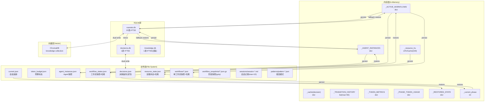
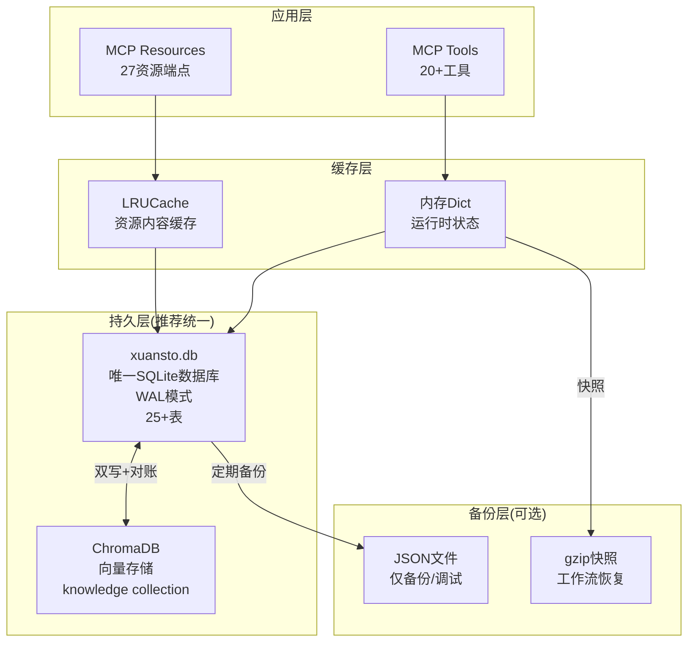

# xuansto-skill-v2 数据库设计文档

> 基于源码分析生成 | 版本: 8.5.0 | 日期: 2026-05-26

---

## 1. 当前数据存储清单

### 1.1 SQLite 数据库

| 数据库文件 | 路径 | 来源 | 说明 |
|---|---|---|---|
| `xuansto.db` | `{WORK_DIR}/xuansto.db` | `core/database.py` L18 | 主数据库，22张表+FTS5虚拟表 |
| `decisions.db` | `{WORK_DIR}/decisions.db` | `tools/decision_log.py` L23 | 决策日志独立数据库，含FTS5 |
| `knowledge.db` | `{KNOWLEDGE_DIR}/index/knowledge.db` | `tools/knowledge_search.py` L98 | 知识索引辅助数据库(旧版兼容) |

> `WORK_DIR` = `{project_root}/.xuansto`（可通过环境变量 `XUANSTO_WORK_DIR` 覆盖）
> `KNOWLEDGE_DIR` = `{data_dir}/knowledge`

### 1.2 ChromaDB 向量数据库

| 路径 | 来源 | 说明 |
|---|---|---|
| `{KNOWLEDGE_DIR}/index/chroma_db` | `core/config.py` L404 | 语义搜索向量存储，collection名 `knowledge` |
| `{KNOWLEDGE_DIR}/index/chroma` (旧) | `core/config.py` L418 | 已废弃，自动迁移到 `chroma_db` |

### 1.3 JSON/YAML 文件

| 文件 | 路径 | 来源 | 说明 |
|---|---|---|---|
| `resource_state.json` | `{WORK_DIR}/resource_state.json` | `tools/resource_load_status.py` L518 | 渐进式加载状态(含完整性哈希) |
| `token_budget.json` | `{WORK_DIR}/token_budget.json` | `tools/token_budget.py` L26 | Token预算状态 |
| `agent_instances.json` | `{WORK_DIR}/agent_instances.json` | `tools/agent_manage.py` L74 | Agent实例运行时状态 |
| `workflow_states.json` | `{WORK_DIR}/workflow_states.json` | `tools/workflow_dispatch.py` L129 | 活跃工作流全局快照(含完整性哈希) |
| `decisions.json` | `{WORK_DIR}/decisions.json` | `tools/decision_log.py` L24 | 决策日志文件备份(双写) |
| `tool_metrics.json` | `{WORK_DIR}/tool_metrics.json` | `resources/skill_resources.py` L358 | 工具调用指标 |
| `degradation_stats.json` | `{WORK_DIR}/degradation_stats.json` | `resources/skill_resources.py` L359 | 降级统计 |
| `current.json` | `{SESSION_DIR}/current.json` | `tools/session_manage.py` L132 | 当前会话追踪状态 |
| `experience_patterns.json` | `{KNOWLEDGE_DIR}/experience_patterns.json` | `core/database.py` L732 | 经验模式(已迁移到SQLite) |
| `workflow/{id}.json` | `{WORK_DIR}/workflows/{id}.json` | `tools/workflow_dispatch.py` L87 | 单个工作流实例快照(含完整性哈希) |
| `pattern-*.json` | `{PATTERNS_DIR}/pattern-*.json` | `tools/session_manage.py` L91 | 错误模式检测记录 |

### 1.4 Markdown 文件

| 文件 | 路径 | 来源 | 说明 |
|---|---|---|---|
| `session-*.md` | `{SESSION_DIR}/session-*.md` | `tools/session_manage.py` L44 | 会话记录(最多保留10个) |
| `workflow_snapshots/*.json.gz` | `{project}/.xuansto/workflow_snapshots/` | `tools/workflow_dispatch.py` L443 | 工作流阶段快照(gzip压缩) |

### 1.5 YAML 配置文件

| 文件 | 路径 | 来源 | 说明 |
|---|---|---|---|
| `.xuansto-config.yaml` | `{SKILL_ROOT}/.xuansto-config.yaml` | `core/config.py` L139 | 主配置(门禁脚本/阶段映射/Hook脚本/降级) |
| `constraints.yaml` | `{SKILL_ROOT}/constraints.yaml` | `core/config.py` L141 | 约束配置(渐进加载/降级策略/Token预算) |
| `.skill-config.yaml` | `{SKILL_ROOT}/.skill-config.yaml` | `core/config.py` L142 | 技能运行时配置 |

### 1.6 内存缓存

| 缓存 | 类型 | 来源 | 说明 |
|---|---|---|---|
| `LRUCache` | `OrderedDict` (maxsize=100) | `core/cache.py` L9 | 资源内容LRU缓存 |
| `_AGENT_INSTANCES` | `dict[str, _AgentInstance]` | `tools/agent_manage.py` L48 | Agent实例内存状态 |
| `_ACTIVE_WORKFLOWS` | `dict[str, dict]` | `tools/workflow_dispatch.py` L72 | 活跃工作流内存状态 |
| `_cache` (decision) | `dict[str, dict]` | `tools/decision_log.py` L27 | 决策记录内存缓存 |
| `_TRANSITION_HISTORY` | `list[dict]` (max=50) | `tools/resource_load_status.py` L262 | 阶段转换历史 |
| `_TOKEN_METRICS` | `dict[str, dict]` | `tools/resource_load_status.py` L268 | Token使用指标 |
| `_PHASE_TOKEN_USAGE` | `dict[int, dict]` | `tools/resource_load_status.py` L272 | 阶段Token消耗 |
| `_RESTORED_STATE` | `dict or None` | `tools/session_manage.py` L188 | 启动恢复的会话状态 |
| `_CONFIG_VALIDATION_RESULTS` | `dict[str, dict]` | `core/config.py` L15 | 配置验证结果 |

### 1.7 环境变量

| 变量 | 默认值 | 来源 | 说明 |
|---|---|---|---|
| `XUANSTO_WORK_DIR` | `{project_root}/.xuansto` | `core/config.py` L391 | 工作目录 |
| `XUANSTO_SKILL_ROOT` / `SKILL_ROOT` | 自动检测 | `core/config.py` L41 | 技能根目录 |
| `XUANSTO_KNOWLEDGE_CLEANUP_KEEP_LAST_N` | `10` | `core/config.py` L455 | 知识版本清理保留数 |

---

## 2. 持久化/缓存数据实体列表

### 2.1 xuansto.db 全部表结构（22张表+1虚拟表）

#### workflow_instances（工作流实例）

来源: `core/database.py` L23-31

```sql
CREATE TABLE IF NOT EXISTS workflow_instances (
    id TEXT PRIMARY KEY,
    workflow_type TEXT NOT NULL DEFAULT '',
    current_phase INTEGER NOT NULL DEFAULT 0,
    status TEXT NOT NULL DEFAULT 'running',
    created_at TEXT NOT NULL,
    updated_at TEXT NOT NULL,
    data_json TEXT NOT NULL DEFAULT '{}'
);
```

```json
{
  "id": "wf-a1b2c3d4",
  "workflow_type": "sdd-tdd-full",
  "current_phase": 3,
  "status": "running",
  "created_at": "2026-05-26T08:00:00+00:00",
  "updated_at": "2026-05-26T09:30:00+00:00",
  "data_json": {}
}
```

#### session_states（会话状态）

来源: `core/database.py` L33-38

```sql
CREATE TABLE IF NOT EXISTS session_states (
    id TEXT PRIMARY KEY,
    session_data_json TEXT NOT NULL DEFAULT '{}',
    created_at TEXT NOT NULL,
    updated_at TEXT NOT NULL
);
```

```json
{
  "id": "sess-20260526",
  "session_data_json": {
    "current_phase": 4,
    "current_task": "实现用户认证模块",
    "decisions": ["使用JWT方案"],
    "pending_tasks": ["编写集成测试"],
    "completed_phases": [0, 1, 2, 3]
  },
  "created_at": "2026-05-26T08:00:00+00:00",
  "updated_at": "2026-05-26T10:00:00+00:00"
}
```

#### resource_load_states（资源加载状态）

来源: `core/database.py` L40-45

```sql
CREATE TABLE IF NOT EXISTS resource_load_states (
    id TEXT PRIMARY KEY,
    phase INTEGER NOT NULL DEFAULT 0,
    resources_json TEXT NOT NULL DEFAULT '{}',
    updated_at TEXT NOT NULL
);
```

```json
{
  "id": "resource-state-default",
  "phase": 2,
  "resources_json": {
    "loaded": ["skill-config", "agent-registry", "quality-gates"],
    "phase_name": "enhanced"
  },
  "updated_at": "2026-05-26T09:00:00+00:00"
}
```

#### degradation_states（降级状态）

来源: `core/database.py` L47-53

```sql
CREATE TABLE IF NOT EXISTS degradation_states (
    id TEXT PRIMARY KEY,
    component_name TEXT NOT NULL DEFAULT '',
    level TEXT NOT NULL DEFAULT 'none',
    data_json TEXT NOT NULL DEFAULT '{}',
    updated_at TEXT NOT NULL
);
```

```json
{
  "id": "degr-chromadb",
  "component_name": "chromadb",
  "level": "L2_DEGRADED",
  "data_json": {"error_count": 3, "last_error": "connection_timeout"},
  "updated_at": "2026-05-26T09:15:00+00:00"
}
```

#### error_patterns（错误模式）

来源: `core/database.py` L55-61

```sql
CREATE TABLE IF NOT EXISTS error_patterns (
    id TEXT PRIMARY KEY,
    pattern TEXT NOT NULL DEFAULT '',
    error_type TEXT NOT NULL DEFAULT '',
    data_json TEXT NOT NULL DEFAULT '{}',
    created_at TEXT NOT NULL
);
```

#### metrics（指标记录）

来源: `core/database.py` L63-69

```sql
CREATE TABLE IF NOT EXISTS metrics (
    id INTEGER PRIMARY KEY AUTOINCREMENT,
    tool_name TEXT NOT NULL DEFAULT '',
    metric_type TEXT NOT NULL DEFAULT '',
    value_json TEXT NOT NULL DEFAULT '{}',
    timestamp TEXT NOT NULL
);
```

```json
{
  "id": 1,
  "tool_name": "knowledge_search",
  "metric_type": "latency",
  "value_json": {"elapsed_ms": 120, "strategy": "chromadb_semantic"},
  "timestamp": "2026-05-26T09:00:00+00:00"
}
```

#### decision_records（决策记录-主库）

来源: `core/database.py` L71-76

```sql
CREATE TABLE IF NOT EXISTS decision_records (
    id TEXT PRIMARY KEY,
    workflow_id TEXT NOT NULL DEFAULT '',
    decision_data_json TEXT NOT NULL DEFAULT '{}',
    created_at TEXT NOT NULL
);
```

```json
{
  "id": "ADR-20260526-001",
  "workflow_id": "wf-a1b2c3d4",
  "decision_data_json": {
    "title": "选择数据库方案",
    "context": "需要支持向量搜索和全文检索",
    "decision": "采用SQLite+ChromaDB双写架构",
    "rationale": "SQLite提供可靠持久化，ChromaDB提供语义搜索",
    "alternatives": ["纯SQLite", "纯ChromaDB", "PostgreSQL+pgvector"],
    "status": "accepted"
  },
  "created_at": "2026-05-26T08:30:00+00:00"
}
```

#### knowledge_entries（知识条目-核心表）

来源: `core/database.py` L78-107

```sql
CREATE TABLE IF NOT EXISTS knowledge_entries (
    id TEXT PRIMARY KEY,
    title TEXT NOT NULL DEFAULT '',
    content TEXT NOT NULL DEFAULT '',
    scope TEXT NOT NULL DEFAULT 'general',
    tags_json TEXT NOT NULL DEFAULT '[]',
    metadata_json TEXT NOT NULL DEFAULT '{}',
    sync_status TEXT NOT NULL DEFAULT 'ready',
    deleted_at TEXT,
    confidence REAL DEFAULT 0.6,
    source_path TEXT,
    source_rating INTEGER DEFAULT 3,
    occurrences INTEGER DEFAULT 1,
    content_hash TEXT,
    type TEXT NOT NULL DEFAULT 'unknown',
    category TEXT NOT NULL DEFAULT 'uncategorized',
    summary TEXT,
    content_path TEXT,
    source TEXT,
    last_validated TEXT,
    success_count INTEGER DEFAULT 0,
    failure_count INTEGER DEFAULT 0,
    version INTEGER DEFAULT 1,
    embedding_status TEXT DEFAULT 'pending',
    embedding_retry_count INTEGER DEFAULT 0,
    status TEXT DEFAULT 'active',
    last_accessed TEXT,
    created_at TEXT NOT NULL,
    updated_at TEXT NOT NULL
);
```

```json
{
  "id": "kno-abc123",
  "title": "TDD最佳实践",
  "content": "测试驱动开发的核心循环：Red-Green-Refactor...",
  "scope": "general",
  "tags_json": ["tdd", "testing", "best-practice"],
  "metadata_json": {"important": true, "source": "experience"},
  "sync_status": "ready",
  "deleted_at": null,
  "confidence": 0.85,
  "source_path": "references/test-guidelines.md",
  "source_rating": 5,
  "occurrences": 3,
  "content_hash": "sha256:abc...",
  "type": "guideline",
  "category": "testing",
  "summary": "TDD核心循环和最佳实践总结",
  "content_path": null,
  "source": "precipitate",
  "last_validated": "2026-05-26T08:00:00+00:00",
  "success_count": 5,
  "failure_count": 0,
  "version": 2,
  "embedding_status": "ready",
  "embedding_retry_count": 0,
  "status": "active",
  "last_accessed": "2026-05-26T09:00:00+00:00",
  "created_at": "2026-05-20T10:00:00+00:00",
  "updated_at": "2026-05-26T09:00:00+00:00"
}
```

#### reconciliation_log（对账日志）

来源: `core/database.py` L109-118

```sql
CREATE TABLE IF NOT EXISTS reconciliation_log (
    id INTEGER PRIMARY KEY AUTOINCREMENT,
    entry_id TEXT NOT NULL DEFAULT '',
    store TEXT NOT NULL DEFAULT '',
    issue_type TEXT NOT NULL DEFAULT '',
    details_json TEXT NOT NULL DEFAULT '{}',
    resolved INTEGER NOT NULL DEFAULT 0,
    created_at TEXT NOT NULL,
    resolved_at TEXT
);
```

#### token_budget_states（Token预算状态）

来源: `core/database.py` L120-129

```sql
CREATE TABLE IF NOT EXISTS token_budget_states (
    id TEXT PRIMARY KEY,
    total_budget INTEGER NOT NULL DEFAULT 0,
    used INTEGER NOT NULL DEFAULT 0,
    phase_allocations_json TEXT NOT NULL DEFAULT '{}',
    usage_by_phase_json TEXT NOT NULL DEFAULT '{}',
    session_id TEXT NOT NULL DEFAULT '',
    created_at TEXT NOT NULL,
    updated_at TEXT NOT NULL
);
```

```json
{
  "id": "budget_default",
  "total_budget": 150000,
  "used": 45000,
  "phase_allocations_json": {"0": 8000, "1": 15000, "2": 22000, "3": 12000, "4": 45000, "5": 18000, "6": 10000, "7": 12000, "8": 8000},
  "usage_by_phase_json": {"4": 32000, "5": 13000},
  "session_id": "default",
  "created_at": "2026-05-26T08:00:00+00:00",
  "updated_at": "2026-05-26T10:00:00+00:00"
}
```

#### experience_patterns（经验模式）

来源: `core/database.py` L131-140

```sql
CREATE TABLE IF NOT EXISTS experience_patterns (
    id TEXT PRIMARY KEY,
    error_type TEXT NOT NULL DEFAULT '',
    pattern_json TEXT NOT NULL DEFAULT '{}',
    confidence REAL NOT NULL DEFAULT 0.0,
    status TEXT NOT NULL DEFAULT 'active',
    occurrence_count INTEGER NOT NULL DEFAULT 1,
    created_at TEXT NOT NULL,
    updated_at TEXT NOT NULL
);
```

#### agent_states（Agent状态）

来源: `core/database.py` L142-151

```sql
CREATE TABLE IF NOT EXISTS agent_states (
    agent_id TEXT PRIMARY KEY,
    agent_name TEXT NOT NULL,
    agent_type TEXT NOT NULL,
    phase INTEGER,
    status TEXT DEFAULT 'active',
    config_json TEXT,
    created_at REAL,
    updated_at REAL
);
```

```json
{
  "agent_id": "agent-a1b2c3d4",
  "agent_name": "agent-a1b2c3d4",
  "agent_type": "developer",
  "phase": 4,
  "status": "active",
  "config_json": {"capabilities": ["code_review", "testing"], "status": "busy", "task": "实现认证模块"},
  "created_at": 1748246400.0,
  "updated_at": 1748250000.0
}
```

#### workflow_states（工作流状态-新表）

来源: `core/database.py` L153-164

```sql
CREATE TABLE IF NOT EXISTS workflow_states (
    workflow_id TEXT PRIMARY KEY,
    workflow_type TEXT NOT NULL,
    current_phase INTEGER DEFAULT 0,
    project_path TEXT,
    completed_phases_json TEXT,
    tasks_json TEXT,
    decisions_json TEXT,
    status TEXT DEFAULT 'active',
    created_at REAL,
    updated_at REAL
);
```

```json
{
  "workflow_id": "wf-a1b2c3d4",
  "workflow_type": "sdd-tdd-full",
  "current_phase": 4,
  "project_path": "/project/my-app",
  "completed_phases_json": [0, 1, 2, 3],
  "tasks_json": {"phase_4": ["实现认证", "编写单元测试"]},
  "decisions_json": {"auth": "使用JWT方案"},
  "status": "active",
  "created_at": 1748246400.0,
  "updated_at": 1748250000.0
}
```

#### schema_version（模式版本）

来源: `core/database.py` L166-170

```sql
CREATE TABLE IF NOT EXISTS schema_version (
    version INTEGER PRIMARY KEY,
    applied_at TEXT DEFAULT (datetime('now')),
    description TEXT
);
```

#### knowledge_tags（知识标签-关联表）

来源: `core/database.py` L172-177

```sql
CREATE TABLE IF NOT EXISTS knowledge_tags (
    entry_id TEXT NOT NULL,
    tag TEXT NOT NULL,
    PRIMARY KEY (entry_id, tag),
    FOREIGN KEY (entry_id) REFERENCES knowledge_entries(id) ON DELETE CASCADE
);
```

#### dedup_log（去重日志）

来源: `core/database.py` L179-186

```sql
CREATE TABLE IF NOT EXISTS dedup_log (
    id INTEGER PRIMARY KEY AUTOINCREMENT,
    new_entry_id TEXT NOT NULL,
    existing_entry_id TEXT NOT NULL,
    similarity_score REAL NOT NULL,
    action TEXT NOT NULL,
    merged_at TEXT
);
```

#### version_history（版本历史）

来源: `core/database.py` L188-204

```sql
CREATE TABLE IF NOT EXISTS version_history (
    id INTEGER PRIMARY KEY AUTOINCREMENT,
    entry_id TEXT NOT NULL,
    version INTEGER NOT NULL,
    title TEXT,
    content TEXT,
    scope TEXT,
    tags TEXT,
    confidence REAL,
    source_path TEXT,
    source_rating INTEGER,
    content_hash TEXT,
    change_type TEXT DEFAULT 'update',
    content_snapshot TEXT,
    saved_at TEXT DEFAULT (datetime('now')),
    UNIQUE(entry_id, version)
);
```

#### usage_logs（使用日志）

来源: `core/database.py` L206-214

```sql
CREATE TABLE IF NOT EXISTS usage_logs (
    id INTEGER PRIMARY KEY AUTOINCREMENT,
    entry_id TEXT,
    agent_role TEXT,
    query_text TEXT,
    result_count INTEGER DEFAULT 0,
    elapsed_ms REAL DEFAULT 0.0,
    timestamp TEXT DEFAULT (datetime('now'))
);
```

#### backup_history（备份历史）

来源: `core/database.py` L216-224

```sql
CREATE TABLE IF NOT EXISTS backup_history (
    id INTEGER PRIMARY KEY AUTOINCREMENT,
    backup_type TEXT NOT NULL,
    destination TEXT,
    entry_count INTEGER DEFAULT 0,
    size_bytes INTEGER DEFAULT 0,
    status TEXT DEFAULT 'completed',
    created_at TEXT DEFAULT (datetime('now'))
);
```

#### kb_reconciliation_log（知识库对账日志）

来源: `core/database.py` L226-235

```sql
CREATE TABLE IF NOT EXISTS kb_reconciliation_log (
    id INTEGER PRIMARY KEY AUTOINCREMENT,
    check_time TEXT NOT NULL,
    sqlite_ready_count INTEGER,
    chroma_vector_count INTEGER,
    missing_in_chroma INTEGER DEFAULT 0,
    orphan_in_chroma INTEGER DEFAULT 0,
    fixed_count INTEGER DEFAULT 0,
    details TEXT
);
```

#### knowledge_fts（FTS5全文索引虚拟表）

来源: `core/database.py` L276-284

```sql
CREATE VIRTUAL TABLE IF NOT EXISTS knowledge_fts USING fts5(
    id UNINDEXED,
    summary,
    type,
    category,
    content='knowledge_entries',
    content_rowid='rowid',
    tokenize='unicode61'
);
```

### 2.2 decisions.db 表结构

来源: `tools/decision_log.py` L32-79

```sql
CREATE TABLE IF NOT EXISTS decisions (
    id TEXT PRIMARY KEY,
    title TEXT NOT NULL DEFAULT '',
    context TEXT NOT NULL DEFAULT '',
    decision TEXT NOT NULL DEFAULT '',
    rationale TEXT NOT NULL DEFAULT '',
    alternatives TEXT NOT NULL DEFAULT '[]',
    status TEXT NOT NULL DEFAULT 'proposed',
    created_at TEXT NOT NULL,
    updated_at TEXT NOT NULL
);

CREATE VIRTUAL TABLE IF NOT EXISTS decisions_fts USING fts5(
    id UNINDEXED,
    title,
    context,
    decision,
    content='decisions',
    content_rowid='rowid'
);
```

### 2.3 JSON文件数据实体

#### resource_state.json（渐进式加载状态）

来源: `tools/resource_load_status.py` L552-574

```json
{
  "version": 3,
  "updated_at": "2026-05-26T09:00:00+00:00",
  "phase": "enhanced",
  "loaded": ["skill-config", "agent-registry", "quality-gates", "sdd-tdd-full"],
  "resources": {
    "skill-config": {"status": "loaded", "phase": 0, "type": "config", "path": ".skill-config.yaml"},
    "agent-registry": {"status": "loaded", "phase": 1, "type": "reference", "path": "references/agent-registry.md"}
  },
  "_timestamp": 1748250000.0,
  "_hash": "sha256:..."
}
```

#### current.json（会话追踪状态）

来源: `tools/session_manage.py` L132-166

```json
{
  "current_phase": 4,
  "current_task": "实现用户认证模块",
  "decisions": ["使用JWT方案", "采用RBAC权限模型"],
  "pending_tasks": ["编写集成测试", "API文档"],
  "completed_phases": [0, 1, 2, 3],
  "timestamp": "2026-05-26T08:00:00+00:00",
  "updated_at": "2026-05-26T10:00:00+00:00"
}
```

#### token_budget.json

来源: `tools/token_budget.py` L67-73

```json
{
  "total_budget": 150000,
  "used": 45000,
  "phase_allocations": {"0": 8000, "1": 15000, "2": 22000, "3": 12000, "4": 45000, "5": 18000, "6": 10000, "7": 12000, "8": 8000},
  "usage_by_phase": {"4": 32000, "5": 13000},
  "session_id": "default",
  "updated_at": "2026-05-26T10:00:00+00:00"
}
```

#### agent_instances.json

来源: `tools/agent_manage.py` L55-76

```json
{
  "agent-a1b2c3d4": {
    "agent_id": "agent-a1b2c3d4",
    "agent_type": "developer",
    "capabilities": ["code_review", "testing"],
    "status": "busy",
    "task": "实现认证模块",
    "created_at": 1748246400.0,
    "history": [{"action": "assign", "task": "实现认证模块", "timestamp": 1748246400.0}],
    "last_active_at": "2026-05-26T09:00:00+00:00",
    "task_count": 3,
    "total_duration_ms": 15000
  }
}
```

---

## 3. 数据生命周期（CRUD时机与触发条件）

### 3.1 工作流数据

| 操作 | 触发条件 | 持久化位置 | 来源 |
|---|---|---|---|
| **Create** | `workflow_dispatch(start)` | 内存+JSON文件+SQLite `workflow_states` | `workflow_dispatch.py` L232-267 |
| **Read** | `workflow_dispatch(status/phase)` | 优先内存→JSON文件→SQLite | `workflow_dispatch.py` L269-278 |
| **Update** | `workflow_dispatch(phase advance)` | 内存+JSON文件+SQLite+快照 | `workflow_dispatch.py` L299-417 |
| **Delete** | `workflow_dispatch(abort)` | 内存移除+JSON更新+SQLite删除 | `workflow_dispatch.py` L280-297 |
| **Recover** | `workflow_dispatch(recover)` | 从快照文件恢复到内存+JSON+SQLite | `workflow_dispatch.py` L585-602 |
| **Startup** | 服务启动 | 从JSON文件+SQLite恢复到内存 | `workflow_dispatch.py` L154-204 |

### 3.2 Agent数据

| 操作 | 触发条件 | 持久化位置 | 来源 |
|---|---|---|---|
| **Create** | `agent_manage(create)` | 内存+JSON文件+SQLite `agent_states` | `agent_manage.py` L202-234 |
| **Update** | `agent_manage(assign/release)` | 内存+JSON文件+SQLite | `agent_manage.py` L235-306 |
| **Delete** | `agent_manage(destroy)` | 内存移除+JSON文件+SQLite删除 | `agent_manage.py` L328-349 |
| **Startup** | 服务启动 | JSON文件→内存，SQLite补充缺失 | `agent_manage.py` L104-129 |

### 3.3 知识库数据（双写架构）

| 操作 | 触发条件 | 持久化位置 | 来源 |
|---|---|---|---|
| **Create** | `knowledge_inject(add/precipitate)` | SQLite `knowledge_entries` + ChromaDB | `database.py` L549-579 |
| **Read** | `knowledge_search(retrieve)` | ChromaDB→SQLite FTS5→关键词降级 | `knowledge_search.py` L402-476 |
| **Update** | `knowledge_inject(update)` | SQLite + ChromaDB upsert | `database.py` L549-579 |
| **Soft Delete** | `deleted_at`字段标记 | SQLite `deleted_at` 设值 | `database.py` L829-830 |
| **Sync** | 写入后自动 | `sync_status`: pending→ready/failed | `database.py` L556-578 |
| **Reconcile** | 定期/手动 | 修复SQLite与ChromaDB不一致 | `database.py` L582-653 |
| **Cleanup** | 定期/手动 | 清理旧版本，保留最近N个 | `database.py` L773-856 |

### 3.4 决策日志数据（三写架构）

| 操作 | 触发条件 | 持久化位置 | 来源 |
|---|---|---|---|
| **Create** | `decision_log(log)` | decisions.db + decisions.json + xuansto.db `decision_records` | `decision_log.py` L178-253 |
| **Read** | `decision_log(list/query)` | decisions.db (FTS5优先) | `decision_log.py` L266-392 |
| **Update** | `decision_log(update)` | decisions.db + 内存缓存 | `decision_log.py` L421-454 |
| **Reconcile** | `decision_log(reconcile)` | decisions.db ↔ decisions.json 双向修复 | `decision_log.py` L542-633 |
| **Migrate** | 首次启动 | decisions.json → decisions.db | `decision_log.py` L121-166 |

### 3.5 渐进式加载状态

| 操作 | 触发条件 | 持久化位置 | 来源 |
|---|---|---|---|
| **Phase Advance** | `resource_load_status(preload)` | resource_state.json + 内存 | `resource_load_status.py` L681-776 |
| **Phase Degrade** | Token预算超限(≥80%) | resource_state.json + 内存 | `resource_load_status.py` L779-808 |
| **Cache Update** | 资源预加载 | LRUCache(内存) | `resource_load_status.py` L476-513 |
| **Startup** | 服务启动 | resource_state.json → 内存 | `resource_load_status.py` L521-549 |

### 3.6 Token预算数据

| 操作 | 触发条件 | 持久化位置 | 来源 |
|---|---|---|---|
| **Create/Update** | `token_budget(set_budget/set_from_phase)` | token_budget.json + SQLite `token_budget_states` | `token_budget.py` L132-167 |
| **Read** | `token_budget(status/report)` | JSON文件优先→SQLite回退 | `token_budget.py` L53-64 |
| **Enforce** | `token_budget(enforce)` | 80%触发压缩，95%触发降级 | `token_budget.py` L215-225 |

### 3.7 会话数据

| 操作 | 触发条件 | 持久化位置 | 来源 |
|---|---|---|---|
| **Save** | `session_manage(save)` | session-*.md文件 | `session_manage.py` L35-61 |
| **Track** | `session_manage(track)` | current.json | `session_manage.py` L125-166 |
| **Restore** | `session_manage(restore)` / 启动时 | current.json → 内存 | `session_manage.py` L169-204 |
| **Cleanup** | 每次save后 | 保留最近10个session文件 | `session_manage.py` L207-210 |

---

## 4. 重构数据模型

### 4.1 MCP Server 状态/资源存储结构定义

#### 4.1.1 核心状态实体

```yaml
WorkflowState:
  description: "工作流执行状态"
  primary_store: "SQLite workflow_states"
  cache_store: "内存 _ACTIVE_WORKFLOWS + JSON文件"
  fields:
    workflow_id: { type: TEXT, pk: true, description: "工作流实例ID，格式wf-{hex8}" }
    workflow_type: { type: TEXT, description: "工作流类型(sdd-tdd-full/medium/fast等)" }
    current_phase: { type: INTEGER, description: "当前阶段(0-8)" }
    project_path: { type: TEXT, description: "项目根路径" }
    completed_phases: { type: JSON, description: "已完成阶段列表" }
    tasks: { type: JSON, description: "各阶段任务" }
    decisions: { type: JSON, description: "各阶段决策" }
    status: { type: TEXT, enum: [active, completed, aborted], description: "状态" }
    created_at: { type: REAL, description: "创建时间戳" }
    updated_at: { type: REAL, description: "更新时间戳" }

AgentState:
  description: "Agent实例状态"
  primary_store: "SQLite agent_states"
  cache_store: "内存 _AGENT_INSTANCES + JSON文件"
  fields:
    agent_id: { type: TEXT, pk: true, description: "Agent实例ID，格式agent-{hex8}" }
    agent_name: { type: TEXT, description: "Agent名称" }
    agent_type: { type: TEXT, description: "Agent类型(developer/reviewer/tester等)" }
    phase: { type: INTEGER, nullable: true, description: "所属阶段" }
    status: { type: TEXT, enum: [active, idle, busy], description: "状态" }
    config: { type: JSON, description: "配置(capabilities/status/task等)" }
    created_at: { type: REAL, description: "创建时间戳" }
    updated_at: { type: REAL, description: "更新时间戳" }

SessionState:
  description: "会话追踪状态"
  primary_store: "JSON current.json"
  cache_store: "内存 _RESTORED_STATE"
  fields:
    current_phase: { type: INTEGER, nullable: true, description: "当前阶段" }
    current_task: { type: TEXT, nullable: true, description: "当前任务" }
    decisions: { type: LIST[TEXT], description: "决策列表" }
    pending_tasks: { type: LIST[TEXT], description: "未完成任务" }
    completed_phases: { type: LIST[INTEGER], description: "已完成阶段" }
    timestamp: { type: TEXT, description: "首次创建时间" }
    updated_at: { type: TEXT, description: "最后更新时间" }

DecisionRecord:
  description: "架构决策记录"
  primary_store: "SQLite decisions.db decisions"
  backup_stores: ["JSON decisions.json", "SQLite xuansto.db decision_records"]
  fields:
    id: { type: TEXT, pk: true, description: "决策ID，格式ADR-YYYYMMDD-NNN" }
    title: { type: TEXT, description: "决策标题" }
    context: { type: TEXT, description: "决策上下文" }
    decision: { type: TEXT, description: "最终决策" }
    rationale: { type: TEXT, description: "决策理由" }
    alternatives: { type: JSON, description: "备选方案列表" }
    status: { type: TEXT, enum: [proposed, accepted, deprecated, superseded], description: "状态" }
    created_at: { type: TEXT, description: "创建时间ISO8601" }
    updated_at: { type: TEXT, description: "更新时间ISO8601" }
```

#### 4.1.2 知识库实体

```yaml
KnowledgeEntry:
  description: "知识条目(双写: SQLite + ChromaDB)"
  primary_store: "SQLite knowledge_entries"
  vector_store: "ChromaDB knowledge collection"
  fields:
    id: { type: TEXT, pk: true }
    title: { type: TEXT, description: "标题" }
    content: { type: TEXT, description: "内容" }
    scope: { type: TEXT, enum: [general, workspace, experience], description: "范围" }
    type: { type: TEXT, description: "类型(guideline/pattern/practice等)" }
    category: { type: TEXT, description: "分类" }
    summary: { type: TEXT, description: "摘要(FTS5索引)" }
    tags: { type: JSON, description: "标签列表" }
    metadata: { type: JSON, description: "元数据" }
    confidence: { type: REAL, description: "置信度(0.0-1.0)" }
    sync_status: { type: TEXT, enum: [pending, ready, failed], description: "同步状态" }
    embedding_status: { type: TEXT, enum: [pending, ready, failed], description: "嵌入状态" }
    version: { type: INTEGER, description: "版本号" }
    content_hash: { type: TEXT, description: "内容SHA256" }
    status: { type: TEXT, enum: [active, deleted], description: "状态" }
    deleted_at: { type: TEXT, nullable: true, description: "软删除时间" }
    created_at: { type: TEXT }
    updated_at: { type: TEXT }

KnowledgeTag:
  description: "知识标签关联"
  primary_store: "SQLite knowledge_tags"
  fields:
    entry_id: { type: TEXT, fk: knowledge_entries.id, on_delete: CASCADE }
    tag: { type: TEXT }
  constraints: ["PRIMARY KEY (entry_id, tag)"]

VersionHistory:
  description: "知识条目版本历史"
  primary_store: "SQLite version_history"
  fields:
    id: { type: INTEGER, auto_increment: true }
    entry_id: { type: TEXT, fk: knowledge_entries.id }
    version: { type: INTEGER }
    change_type: { type: TEXT, default: "update" }
    content_snapshot: { type: TEXT, description: "内容快照" }
    saved_at: { type: TEXT }
  constraints: ["UNIQUE(entry_id, version)"]
```

### 4.2 渐进式加载相关字段

```yaml
ResourceLoadState:
  description: "渐进式加载状态(4阶段: skeleton/functional/enhanced/full)"
  primary_store: "JSON resource_state.json"
  cache_store: "内存 _current_phase + _loaded_resources + LRUCache"
  fields:
    version: { type: INTEGER, default: 3, description: "状态文件格式版本" }
    phase: { type: TEXT, enum: [skeleton, functional, enhanced, full], description: "当前加载阶段" }
    loaded: { type: LIST[TEXT], description: "已加载资源ID列表" }
    resources: { type: MAP[TEXT, ResourceInfo], description: "资源详情映射" }
    updated_at: { type: TEXT, description: "最后更新时间" }
    _hash: { type: TEXT, description: "完整性校验SHA256" }
    _timestamp: { type: REAL, description: "时间戳" }

ResourceInfo:
  description: "单个资源加载信息"
  fields:
    status: { type: TEXT, enum: [loaded, available, missing, stale, expired], description: "加载状态" }
    phase: { type: INTEGER, description: "所属加载阶段(0-3)" }
    type: { type: TEXT, enum: [config, reference, workflow, agent, knowledge, template], description: "资源类型" }
    path: { type: TEXT, description: "资源相对路径" }

PhaseMetrics:
  description: "阶段加载指标(内存中)"
  store: "内存 _phase_state"
  fields:
    phase_metrics:
      type: MAP[TEXT, PhaseMetric]
      description: "各阶段指标(skeleton/functional/enhanced/full)"
    phase_transition_timestamps:
      type: MAP[TEXT, TEXT]
      description: "各阶段转换时间"
    last_transition_at: { type: TEXT, nullable: true, description: "最后转换时间" }

PhaseMetric:
  fields:
    tokens_consumed: { type: INTEGER, description: "累计Token消耗" }
    load_duration_ms: { type: INTEGER, description: "加载耗时(毫秒)" }
    resources_loaded: { type: INTEGER, description: "已加载资源数" }

DisclosureTransition:
  description: "阶段转换披露信息"
  store: "内存 + 返回给客户端"
  fields:
    from_phase: { type: TEXT, description: "源阶段" }
    to_phase: { type: TEXT, description: "目标阶段" }
    started_at: { type: TEXT, nullable: true, description: "转换开始时间" }
    completed_at: { type: TEXT, nullable: true, description: "转换完成时间" }
    resources_affected: { type: LIST[TEXT], description: "受影响资源" }
    status: { type: TEXT, enum: [pending, in_progress, completed, failed], description: "转换状态" }
    current_phase: { type: TEXT, description: "当前阶段名" }
    target_phase: { type: TEXT, description: "目标阶段名" }
    required_resources: { type: LIST[TEXT], description: "所需资源列表" }
    estimated_tokens: { type: INTEGER, description: "估算Token数" }
    available_alternatives: { type: LIST[TEXT], description: "可用替代阶段" }
    transition_hint: { type: TEXT, description: "转换提示" }

TokenBudgetState:
  description: "Token预算状态"
  primary_store: "JSON token_budget.json"
  backup_store: "SQLite token_budget_states"
  fields:
    total_budget: { type: INTEGER, description: "总Token预算" }
    used: { type: INTEGER, description: "已使用Token" }
    phase_allocations: { type: MAP[TEXT, INTEGER], description: "阶段分配(0-8)" }
    usage_by_phase: { type: MAP[TEXT, INTEGER], description: "阶段使用量" }
    session_id: { type: TEXT, description: "会话ID" }
    updated_at: { type: TEXT, description: "更新时间" }
```

### 4.3 实体关系图

```mermaid
erDiagram
    workflow_states ||--o{ decision_records : "产生决策"
    workflow_states ||--o{ workflow_snapshots : "阶段快照"
    workflow_states {
        TEXT workflow_id PK
        TEXT workflow_type
        INTEGER current_phase
        TEXT project_path
        TEXT completed_phases_json
        TEXT tasks_json
        TEXT decisions_json
        TEXT status
        REAL created_at
        REAL updated_at
    }

    agent_states }o--|| workflow_states : "参与工作流"
    agent_states {
        TEXT agent_id PK
        TEXT agent_name
        TEXT agent_type
        INTEGER phase
        TEXT status
        TEXT config_json
        REAL created_at
        REAL updated_at
    }

    decision_records {
        TEXT id PK
        TEXT workflow_id FK
        TEXT decision_data_json
        TEXT created_at
    }

    decisions {
        TEXT id PK
        TEXT title
        TEXT context
        TEXT decision
        TEXT rationale
        TEXT alternatives
        TEXT status
        TEXT created_at
        TEXT updated_at
    }

    knowledge_entries ||--o{ knowledge_tags : "拥有标签"
    knowledge_entries ||--o{ version_history : "版本历史"
    knowledge_entries ||--o{ usage_logs : "使用记录"
    knowledge_entries ||--o{ dedup_log : "去重记录"
    knowledge_entries ||--o{ reconciliation_log : "对账记录"
    knowledge_entries {
        TEXT id PK
        TEXT title
        TEXT content
        TEXT scope
        TEXT tags_json
        TEXT metadata_json
        TEXT sync_status
        TEXT deleted_at
        REAL confidence
        TEXT source_path
        INTEGER source_rating
        INTEGER occurrences
        TEXT content_hash
        TEXT type
        TEXT category
        TEXT summary
        TEXT content_path
        TEXT source
        TEXT last_validated
        INTEGER success_count
        INTEGER failure_count
        INTEGER version
        TEXT embedding_status
        INTEGER embedding_retry_count
        TEXT status
        TEXT last_accessed
        TEXT created_at
        TEXT updated_at
    }

    knowledge_tags {
        TEXT entry_id PK_FK
        TEXT tag PK
    }

    version_history {
        INTEGER id PK
        TEXT entry_id FK
        INTEGER version
        TEXT title
        TEXT content
        TEXT change_type
        TEXT content_snapshot
        TEXT saved_at
    }

    usage_logs {
        INTEGER id PK
        TEXT entry_id FK
        TEXT agent_role
        TEXT query_text
        INTEGER result_count
        REAL elapsed_ms
        TEXT timestamp
    }

    dedup_log {
        INTEGER id PK
        TEXT new_entry_id
        TEXT existing_entry_id
        REAL similarity_score
        TEXT action
        TEXT merged_at
    }

    reconciliation_log {
        INTEGER id PK
        TEXT entry_id
        TEXT store
        TEXT issue_type
        TEXT details_json
        INTEGER resolved
        TEXT created_at
        TEXT resolved_at
    }

    kb_reconciliation_log {
        INTEGER id PK
        TEXT check_time
        INTEGER sqlite_ready_count
        INTEGER chroma_vector_count
        INTEGER missing_in_chroma
        INTEGER orphan_in_chroma
        INTEGER fixed_count
        TEXT details
    }

    token_budget_states {
        TEXT id PK
        INTEGER total_budget
        INTEGER used
        TEXT phase_allocations_json
        TEXT usage_by_phase_json
        TEXT session_id
        TEXT created_at
        TEXT updated_at
    }

    session_states {
        TEXT id PK
        TEXT session_data_json
        TEXT created_at
        TEXT updated_at
    }

    resource_load_states {
        TEXT id PK
        INTEGER phase
        TEXT resources_json
        TEXT updated_at
    }

    degradation_states {
        TEXT id PK
        TEXT component_name
        TEXT level
        TEXT data_json
        TEXT updated_at
    }

    error_patterns {
        TEXT id PK
        TEXT pattern
        TEXT error_type
        TEXT data_json
        TEXT created_at
    }

    experience_patterns {
        TEXT id PK
        TEXT error_type
        TEXT pattern_json
        REAL confidence
        TEXT status
        INTEGER occurrence_count
        TEXT created_at
        TEXT updated_at
    }

    metrics {
        INTEGER id PK
        TEXT tool_name
        TEXT metric_type
        TEXT value_json
        TEXT timestamp
    }

    schema_version {
        INTEGER version PK
        TEXT applied_at
        TEXT description
    }

    backup_history {
        INTEGER id PK
        TEXT backup_type
        TEXT destination
        INTEGER entry_count
        INTEGER size_bytes
        TEXT status
        TEXT created_at
    }

    knowledge_fts {
        TEXT id
        TEXT summary
        TEXT type
        TEXT category
    }

    workflow_instances {
        TEXT id PK
        TEXT workflow_type
        INTEGER current_phase
        TEXT status
        TEXT created_at
        TEXT updated_at
        TEXT data_json
    }

    decision_records }o--|| decisions : "镜像记录"
```

### 4.4 存储层级关系



---

## 5. 数据迁移策略

### 5.1 已实现的迁移

#### v13迁移: knowledge.db合并到xuansto.db

来源: `core/database.py` L305-357

```python
def _run_v13_migration(conn):
    # 1. 检测knowledge_entries是否缺少confidence列
    # 2. 重命名旧reconciliation_log(避免冲突)
    # 3. 重命名knowledge_entries为knowledge_entries_legacy
    # 4. 执行CREATE TABLE(新schema)
    # 5. 从legacy表复制数据到新表
```

**迁移路径**: `knowledge.db(旧schema)` → `xuansto.db(新schema，含confidence/embedding等20+字段)`

#### decisions.json → decisions.db

来源: `tools/decision_log.py` L121-166

```python
def _migrate_json_to_sqlite():
    # 1. 检查decisions.json是否存在
    # 2. 如果decisions.db已有数据则跳过
    # 3. 逐条INSERT OR IGNORE到decisions表
```

#### experience_patterns.json → experience_patterns表

来源: `core/database.py` L730-747

```python
def migrate_experience_patterns_from_json(json_path):
    # 1. 读取experience_patterns.json
    # 2. 逐条persist_state到experience_patterns表
```

#### ChromaDB路径迁移

来源: `core/config.py` L421-449

```python
def _migrate_chroma_path():
    # 旧路径: knowledge/index/chroma
    # 新路径: knowledge/index/chroma_db
    # 自动shutil.move
```

#### FTS5 tokenizer迁移

来源: `tools/knowledge_search.py` L47-86

```python
def _migrate_fts5_to_unicode61(conn):
    # 旧: 默认tokenizer
    # 新: unicode61 tokenizer(支持中文)
    # DROP旧FTS5表+触发器 → CREATE新FTS5表 → REBUILD索引
```

### 5.2 迁移策略总结

| 旧格式 | 新格式 | 迁移方式 | 触发时机 |
|---|---|---|---|
| `knowledge.db`(旧schema) | `xuansto.db knowledge_entries`(新schema) | 表重命名+数据复制 | `init_db()` |
| `decisions.json` | `decisions.db decisions` | 逐条INSERT OR IGNORE | 模块加载时 |
| `experience_patterns.json` | `xuansto.db experience_patterns` | 逐条persist_state | 手动调用 |
| `chroma/`(旧路径) | `chroma_db/`(新路径) | shutil.move | `config.py`加载时 |
| FTS5默认tokenizer | unicode61 tokenizer | DROP+CREATE+REBUILD | `_ensure_knowledge_index()` |
| `resource_state.json`(list格式) | v3 dict格式 | 自动转换并重写 | `_load_resource_state()` |

### 5.3 迁移原则

1. **零停机**: 所有迁移在启动时自动执行，无需手动干预
2. **数据安全**: 使用 `INSERT OR IGNORE` / `ON CONFLICT` 避免重复写入
3. **向后兼容**: 旧格式文件保留，新格式并行写入
4. **渐进迁移**: 旧数据不删除，标记为 `_legacy`，新数据写入新表
5. **完整性校验**: 关键状态文件使用SHA256哈希验证

---

## 6. 存储技术选型建议

### 6.1 当前架构评估

| 维度 | 现状 | 评价 |
|---|---|---|
| **一致性** | SQLite为主，JSON/内存为辅，多级缓存 | ⚠️ 多写一致性问题(3处双写/三写) |
| **可靠性** | 关键文件有SHA256哈希校验 | ✅ 数据完整性有保障 |
| **性能** | 内存LRU缓存+SQLite WAL模式 | ✅ 读性能好，写性能可接受 |
| **可维护性** | 3个SQLite数据库+10+JSON文件 | ⚠️ 存储分散，状态同步复杂 |
| **可扩展性** | 单机SQLite+ChromaDB | ⚠️ 不支持分布式 |

### 6.2 现存问题

1. **数据冗余**: `workflow_instances` 与 `workflow_states` 表结构重叠；`decision_records` 与 `decisions` 表分属不同数据库
2. **多写一致性**: 决策日志三写(decisions.db + decisions.json + xuansto.db)，任一环节失败导致不一致
3. **状态分散**: Agent状态同时存在于内存dict、JSON文件、SQLite三处，恢复逻辑复杂
4. **JSON文件无事务**: resource_state.json等文件在并发写入时可能损坏(虽有atomic_write缓解)
5. **ChromaDB同步**: `sync_status` 机制依赖重试，极端情况下可能丢失数据

### 6.3 推荐方案

#### 短期优化（不改变存储技术）

| 优化项 | 说明 | 优先级 |
|---|---|---|
| **合并数据库** | 将 `decisions.db` 和 `knowledge.db` 合并到 `xuansto.db`，消除跨库查询 | 高 |
| **去重表** | 合并 `workflow_instances` 和 `workflow_states` 为统一表 | 高 |
| **统一双写** | 决策日志从三写简化为SQLite主写+JSON备份，移除 `decision_records` 冗余表 | 中 |
| **JSON→SQLite迁移** | 将 `current.json`、`agent_instances.json`、`workflow_states.json` 迁移到SQLite | 中 |
| **统一恢复路径** | 所有实体从SQLite恢复，JSON文件仅作为备份/调试用途 | 中 |

#### 中期架构（引入轻量级改进）

| 改进项 | 说明 | 优先级 |
|---|---|---|
| **SQLite连接池** | 替换当前的 `get_db()` 每次新建连接，使用连接池减少开销 | 中 |
| **事件驱动同步** | 用SQLite触发器+通知替代应用层双写逻辑 | 低 |
| **ChromaDB健康检查** | 增加定期心跳检测，自动降级到SQLite FTS5 | 低 |
| **Schema版本管理** | 完善schema_version表，支持结构化迁移脚本 | 低 |

#### 长期演进（如需分布式）

| 方向 | 替代方案 | 适用场景 |
|---|---|---|
| SQLite → PostgreSQL | 关系型+pgvector | 多用户/分布式部署 |
| ChromaDB → Qdrant/Milvus | 专业向量数据库 | 大规模语义搜索 |
| JSON文件 → SQLite/Redis | 统一状态存储 | 高并发写入 |
| 内存缓存 → Redis | 分布式缓存 | 多进程/多节点 |

### 6.4 推荐的统一存储架构



**核心原则**:
- **SQLite为唯一权威数据源**: 所有状态变更先写SQLite，JSON文件仅作备份
- **ChromaDB为向量索引**: 通过 `sync_status` 机制保持最终一致
- **内存为性能缓存**: 启动从SQLite恢复，运行时变更同步写SQLite
- **消除多写**: 每个数据实体只有一个写入路径，其他存储通过同步/备份机制更新

---

## 附录A: 索引清单

来源: `core/database.py` L238-273

| 索引名 | 表 | 字段 |
|---|---|---|
| `idx_workflow_instances_status` | workflow_instances | status |
| `idx_workflow_instances_updated_at` | workflow_instances | updated_at |
| `idx_session_states_updated_at` | session_states | updated_at |
| `idx_resource_load_states_phase` | resource_load_states | phase |
| `idx_degradation_states_component` | degradation_states | component_name |
| `idx_error_patterns_error_type` | error_patterns | error_type |
| `idx_metrics_tool_name` | metrics | tool_name |
| `idx_metrics_timestamp` | metrics | timestamp |
| `idx_metrics_metric_type` | metrics | metric_type |
| `idx_decision_records_workflow_id` | decision_records | workflow_id |
| `idx_knowledge_entries_scope` | knowledge_entries | scope |
| `idx_knowledge_entries_deleted_at` | knowledge_entries | deleted_at |
| `idx_knowledge_entries_confidence` | knowledge_entries | confidence |
| `idx_knowledge_entries_type` | knowledge_entries | type |
| `idx_knowledge_entries_category` | knowledge_entries | category |
| `idx_knowledge_entries_hash` | knowledge_entries | content_hash |
| `idx_knowledge_entries_status` | knowledge_entries | status |
| `idx_knowledge_entries_last_accessed` | knowledge_entries | last_accessed |
| `idx_knowledge_entries_embedding_status` | knowledge_entries | embedding_status |
| `idx_reconciliation_log_resolved` | reconciliation_log | resolved |
| `idx_reconciliation_log_entry_id` | reconciliation_log | entry_id |
| `idx_token_budget_states_session` | token_budget_states | session_id |
| `idx_experience_patterns_error_type` | experience_patterns | error_type |
| `idx_experience_patterns_status` | experience_patterns | status |
| `idx_agent_states_status` | agent_states | status |
| `idx_agent_states_agent_type` | agent_states | agent_type |
| `idx_workflow_states_status` | workflow_states | status |
| `idx_workflow_states_workflow_type` | workflow_states | workflow_type |
| `idx_tags_tag` | knowledge_tags | tag |
| `idx_dedup_new` | dedup_log | new_entry_id |
| `idx_version_entry` | version_history | entry_id, version |
| `idx_usage_entry` | usage_logs | entry_id |
| `idx_usage_agent` | usage_logs | agent_role |
| `idx_usage_timestamp` | usage_logs | timestamp |

## 附录B: MCP Resources清单（27个资源端点）

来源: `resources/skill_resources.py` L81-685

| URI | 类型 | 数据来源 |
|---|---|---|
| `xuansto://config/skill` | 静态 | `.skill-config.yaml` 文件 |
| `xuansto://references/quality-gates` | 静态 | `references/quality-gates.md` |
| `xuansto://references/agent-registry` | 静态 | `references/agent-registry.md` |
| `xuansto://references/workflow-phases` | 静态 | `references/workflow-phases.md` |
| `xuansto://templates/{name}` | 参数化 | `templates/{name}.md` |
| `xuansto://sessions/latest` | 动态 | 最新session-*.md文件 |
| `xuansto://sessions/{session_id}` | 参数化 | session文件 |
| `xuansto://agents/{name}` | 参数化 | agents目录搜索 |
| `xuansto://agents/{layer}/{name}` | 参数化 | agents/{layer}/{name}.md |
| `xuansto://loading/status` | 动态 | resource_state.json + 内存 |
| `xuansto://metrics/summary` | 动态 | tool_metrics.json + degradation_stats.json |
| `xuansto://degradation/status` | 动态 | degradation manager |
| `xuansto://skill/config` | 静态 | `.skill-config.yaml` |
| `xuansto://skill/constraints` | 静态 | `constraints.md` 或默认值 |
| `xuansto://agents/registry` | 动态 | agent-registry.md 或目录扫描 |
| `xuansto://gates/definitions` | 动态 | quality-gates.md 或GATE_SCRIPTS_MAP |
| `xuansto://workflows/definitions` | 动态 | workflow-phases.md 或目录扫描 |
| `xuansto://hooks/definitions` | 动态 | hooks.json 或HOOK_SCRIPTS_MAP |
| `xuansto://knowledge/status` | 动态 | SQLite + ChromaDB计数 |
| `xuansto://knowledge/stats` | 动态 | SQLite + ChromaDB统计 |
| `xuansto://templates/index` | 动态 | templates目录扫描 |
| `xuansto://commands/routes` | 动态 | commands目录扫描 |
| `xuansto://session/state` | 动态 | SQLite session_states 或session文件 |
| `xuansto://health/status` | 动态 | degradation manager |
| `xuansto://audit/log` | 动态 | audit logger |
| `xuansto://decisions/latest` | 动态 | decisions.db查询 |
| `xuansto://workflows/active` | 动态 | SQLite workflow_states查询 |

## 附录C: 渐进式加载阶段资源映射

来源: `tools/resource_load_status.py` L26-73

| 阶段 | 名称 | Token预算 | 资源数 | 关键资源 |
|---|---|---|---|---|
| Phase 0 | skeleton | 2,000 | 1 | skill-config |
| Phase 1 | functional | 5,000 | 6 | agent-registry, quality-gates, brainstorm-workflow, 3个核心Agent |
| Phase 2 | enhanced | 10,000 | 8 | knowledge-general, 3个工作流定义, mcp-tools, workflow-phases, agent-registry-full, progressive-loading |
| Phase 3 | full | 20,000 | 22 | 全部参考文档、编码标准、安全指南、模板、全部Agent定义(13层) |
