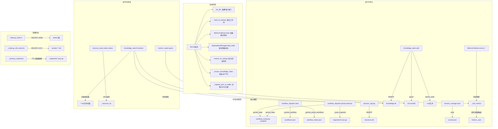
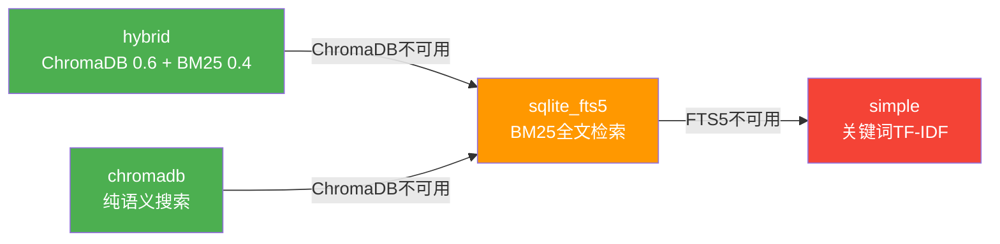
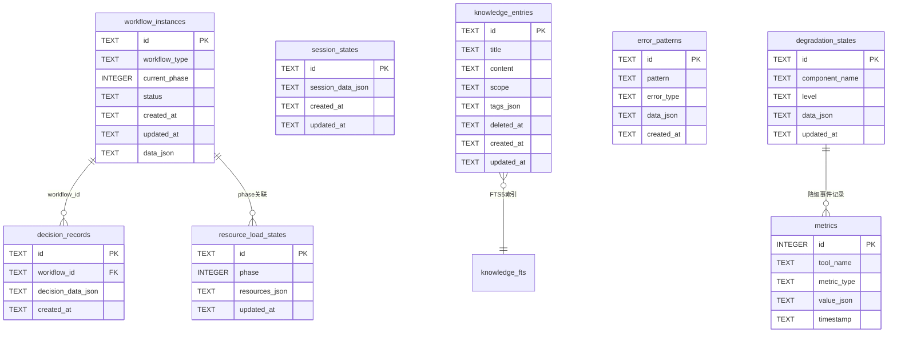
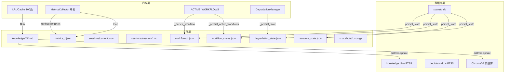
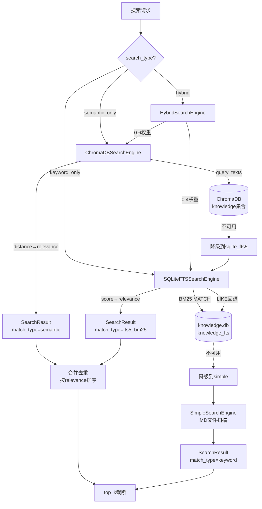
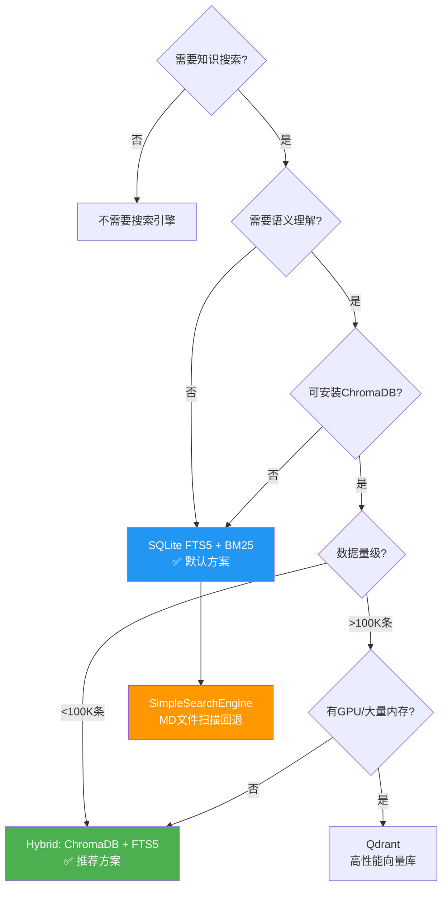

# xuansto-skill v8.0.0 数据存储设计文档

> 版本: 8.0.0 | 最后更新: 2026-05-23 | 基于实际代码生成

---

## 目录

1. [当前数据存储清单](#1-当前数据存储清单)
2. [持久化/缓存数据实体列表](#2-持久化缓存数据实体列表)
3. [数据生命周期](#3-数据生命周期)
4. [重构数据模型](#4-重构数据模型)
5. [实体关系图](#5-实体关系图)
6. [数据迁移策略](#6-数据迁移策略)
7. [存储技术选型建议](#7-存储技术选型建议)

---

## 1. 当前数据存储清单

### 1.1 存储介质总览

| 介质类型 | 位置 | 用途 | 读写模式 |
|---------|------|------|---------|
| SQLite (xuansto.db) | `.xuansto/xuansto.db` | 8张核心业务表 | WAL模式，线程安全 |
| SQLite (knowledge.db) | `knowledge/index/knowledge.db` | 知识库FTS5全文索引 | WAL模式，带FTS5触发器 |
| SQLite (decisions.db) | `.xuansto/decisions.db` | 决策记录独立库 | WAL模式，带FTS5触发器 |
| ChromaDB (可选) | `knowledge/index/chroma_db/` | 向量语义搜索 | PersistentClient |
| JSON文件 | `.xuansto/*.json` | 状态快照、指标持久化 | atomic_write |
| JSON文件 (workflow) | `.xuansto/workflows/*.json` | 工作流实例状态 | atomic_write + SHA256校验 |
| JSON文件 (snapshot) | `<project>/.xuansto/workflow_snapshots/*.json.gz` | 工作流阶段快照 | gzip压缩 + atomic_write |
| Markdown文件 | `.xuansto/sessions/session-*.md` | 会话记录(人类可读) | 文件写入 |
| Markdown文件 | `knowledge/{general,workspace,experience}/*.md` | 知识库源文件 | atomic_write + YAML frontmatter |
| JSON文件 (pattern) | `.xuansto/patterns/pattern-*.json` | 错误模式检测 | 文件写入 |
| 内存 (LRUCache) | `LRUCache(maxsize=100)` | 资源内容缓存 | 线程安全OrderedDict |
| 内存 (MetricsCollector) | 单例 `_instance` | 工具调用指标收集 | 线程安全，定时持久化 |
| 内存 (_ACTIVE_WORKFLOWS) | `dict[str, dict]` | 活跃工作流内存索引 | 线程安全 |
| 环境变量 | `XUANSTO_ENCRYPTION_KEY` | AES-256-GCM加密密钥 | 32字节hex |
| 环境变量 | `XUANSTO_WORK_DIR` | 工作目录覆盖 | 路径字符串 |
| 环境变量 | `SKILL_ROOT` / `XUANSTO_SKILL_ROOT` | 技能根目录覆盖 | 路径字符串 |

### 1.2 文件系统布局

```
.xuansto/
├── xuansto.db                          # 主数据库 (8表)
├── decisions.db                        # 决策记录独立库
├── decisions.json                      # [遗留] 旧格式决策 (自动迁移至SQLite)
├── workflow_states.json                # 活跃工作流汇总状态
├── resource_state.json                 # 渐进式加载状态 (含SHA256校验)
├── degradation_state.json              # 降级管理器状态 (含SHA256校验)
├── tool_metrics.json                   # 工具指标持久化
├── degradation_stats.json              # 降级统计
├── metrics_<timestamp>.json            # MetricsCollector定时快照
├── sessions/
│   ├── current.json                    # 当前追踪状态
│   └── session-<timestamp>.md          # 会话记录 (最多保留10个)
├── patterns/
│   └── pattern-<timestamp>.json        # 错误模式
└── workflows/
    └── <workflow_id>.json              # 工作流实例状态

<project>/.xuansto/workflow_snapshots/
└── <workflow_id>_phase<N>_<timestamp>.json.gz  # gzip压缩快照

knowledge/
├── general/                            # 通用知识 (Markdown)
├── workspace/                          # 工作区知识 (Markdown)
├── experience/                         # 经验沉淀 (Markdown, YAML frontmatter)
└── index/
    ├── knowledge.db                    # 知识库SQLite + FTS5
    └── chroma_db/                      # ChromaDB向量索引 (可选)
```

---

## 2. 持久化/缓存数据实体列表

### 2.1 xuansto.db 核心表 (8张)

#### 2.1.1 workflow_instances — 工作流实例

```sql
CREATE TABLE IF NOT EXISTS workflow_instances (
    id TEXT PRIMARY KEY,                  -- 格式: wf-<uuid8>
    workflow_type TEXT NOT NULL DEFAULT '',-- 工作流名称: sdd-tdd-full/medium/fast等
    current_phase INTEGER NOT NULL DEFAULT 0, -- 当前阶段 (0-8)
    status TEXT NOT NULL DEFAULT 'running',   -- running/completed/aborted
    created_at TEXT NOT NULL,             -- ISO8601 UTC
    updated_at TEXT NOT NULL,             -- ISO8601 UTC
    data_json TEXT NOT NULL DEFAULT '{}'  -- 扩展数据 (JSON)
);
-- 索引: idx_workflow_instances_status, idx_workflow_instances_updated_at
```

**JSON示例:**

```json
{
  "id": "wf-a1b2c3d4",
  "workflow_type": "sdd-tdd-full",
  "current_phase": 3,
  "status": "running",
  "created_at": "2026-05-23T10:00:00+00:00",
  "updated_at": "2026-05-23T12:30:00+00:00",
  "data_json": {
    "project_path": "/path/to/project",
    "completed_phases": [0, 1, 2],
    "phase_definitions": [{"id": 0, "gates": ["DESIGN-SYSTEM-COMPLETE"]}]
  }
}
```

#### 2.1.2 session_states — 会话状态

```sql
CREATE TABLE IF NOT EXISTS session_states (
    id TEXT PRIMARY KEY,                  -- 会话ID
    session_data_json TEXT NOT NULL DEFAULT '{}', -- 会话数据 (JSON)
    created_at TEXT NOT NULL,
    updated_at TEXT NOT NULL
);
-- 索引: idx_session_states_updated_at
```

**JSON示例:**

```json
{
  "id": "session-20260523-100000",
  "session_data_json": {
    "current_phase": 4,
    "current_task": "实现用户认证模块",
    "decisions": ["ADR-20260523-001"],
    "pending_tasks": ["编写集成测试", "代码审查"],
    "completed_phases": [0, 1, 2, 3]
  },
  "created_at": "2026-05-23T10:00:00+00:00",
  "updated_at": "2026-05-23T14:00:00+00:00"
}
```

#### 2.1.3 decision_records — 决策记录

```sql
CREATE TABLE IF NOT EXISTS decision_records (
    id TEXT PRIMARY KEY,                  -- 格式: ADR-<YYYYMMDD>-<NNN>
    workflow_id TEXT NOT NULL DEFAULT '',  -- 关联工作流ID
    decision_data_json TEXT NOT NULL DEFAULT '{}', -- 决策数据 (JSON)
    created_at TEXT NOT NULL
);
-- 索引: idx_decision_records_workflow_id
```

**JSON示例:**

```json
{
  "id": "ADR-20260523-001",
  "workflow_id": "wf-a1b2c3d4",
  "decision_data_json": {
    "title": "选择JWT作为认证方案",
    "context": "需要无状态认证机制",
    "decision": "采用JWT + Refresh Token双令牌方案",
    "rationale": "无状态、可扩展、社区成熟",
    "alternatives": ["Session Cookie", "OAuth2", "API Key"],
    "status": "accepted",
    "decided_by": "system-architect"
  },
  "created_at": "2026-05-23T11:00:00+00:00"
}
```

#### 2.1.4 metrics — 工具指标

```sql
CREATE TABLE IF NOT EXISTS metrics (
    id INTEGER PRIMARY KEY AUTOINCREMENT, -- 自增ID
    tool_name TEXT NOT NULL DEFAULT '',    -- 工具名称
    metric_type TEXT NOT NULL DEFAULT '',  -- 指标类型: calls/latency/errors/tokens
    value_json TEXT NOT NULL DEFAULT '{}', -- 指标值 (JSON)
    timestamp TEXT NOT NULL               -- ISO8601 UTC
);
-- 索引: idx_metrics_tool_name, idx_metrics_timestamp, idx_metrics_metric_type
-- TTL: >30天自动清理 (cleanup_metrics)
```

**JSON示例:**

```json
{
  "id": 42,
  "tool_name": "knowledge_search",
  "metric_type": "calls",
  "value_json": {
    "call_count": 150,
    "success_count": 142,
    "failure_count": 8,
    "avg_latency_ms": 45.3,
    "latency_p50_ms": 32.0,
    "latency_p95_ms": 120.5,
    "latency_p99_ms": 250.1
  },
  "timestamp": "2026-05-23T12:00:00+00:00"
}
```

#### 2.1.5 knowledge_entries — 知识条目

```sql
CREATE TABLE IF NOT EXISTS knowledge_entries (
    id TEXT PRIMARY KEY,                  -- 条目ID (文件名)
    title TEXT NOT NULL DEFAULT '',        -- 标题
    content TEXT NOT NULL DEFAULT '',      -- 内容
    scope TEXT NOT NULL DEFAULT 'general', -- 范围: general/workspace/experience
    tags_json TEXT NOT NULL DEFAULT '[]',  -- 标签列表 (JSON)
    deleted_at TEXT,                       -- 软删除时间 (NULL=未删除)
    created_at TEXT NOT NULL,
    updated_at TEXT NOT NULL
);
-- 索引: idx_knowledge_entries_scope, idx_knowledge_entries_deleted_at
```

**JSON示例:**

```json
{
  "id": "added-jwt_auth_guide-20260523T100000Z",
  "title": "JWT认证最佳实践",
  "content": "## JWT认证方案\n\n1. 使用RS256非对称算法...",
  "scope": "experience",
  "tags_json": ["security", "auth", "jwt"],
  "deleted_at": null,
  "created_at": "2026-05-23T10:00:00+00:00",
  "updated_at": "2026-05-23T10:00:00+00:00"
}
```

#### 2.1.6 error_patterns — 错误模式

```sql
CREATE TABLE IF NOT EXISTS error_patterns (
    id TEXT PRIMARY KEY,                  -- 模式ID
    pattern TEXT NOT NULL DEFAULT '',      -- 错误模式描述
    error_type TEXT NOT NULL DEFAULT '',   -- 错误分类: runtime/syntax/logic/security等
    data_json TEXT NOT NULL DEFAULT '{}',  -- 扩展数据 (JSON)
    created_at TEXT NOT NULL
);
-- 索引: idx_error_patterns_error_type
```

**JSON示例:**

```json
{
  "id": "pattern-20260523-001",
  "pattern": "ImportError: No module named 'xxx'",
  "error_type": "runtime",
  "data_json": {
    "count": 5,
    "confidence": 0.85,
    "status": "verified",
    "verified": true,
    "suggested_fix": "检查依赖安装: pip install xxx"
  },
  "created_at": "2026-05-23T09:00:00+00:00"
}
```

#### 2.1.7 resource_load_states — 资源加载状态

```sql
CREATE TABLE IF NOT EXISTS resource_load_states (
    id TEXT PRIMARY KEY,                  -- 资源ID
    phase INTEGER NOT NULL DEFAULT 0,     -- 加载阶段 (0-3)
    resources_json TEXT NOT NULL DEFAULT '{}', -- 资源数据 (JSON)
    updated_at TEXT NOT NULL
);
-- 索引: idx_resource_load_states_phase
```

**JSON示例:**

```json
{
  "id": "resource_state",
  "phase": 2,
  "resources_json": {
    "loaded": ["skill-config", "agent-registry", "quality-gates"],
    "phase": "enhanced",
    "version": 3
  },
  "updated_at": "2026-05-23T10:30:00+00:00"
}
```

#### 2.1.8 degradation_states — 降级状态

```sql
CREATE TABLE IF NOT EXISTS degradation_states (
    id TEXT PRIMARY KEY,                  -- 组件名
    component_name TEXT NOT NULL DEFAULT '', -- 组件名称
    level TEXT NOT NULL DEFAULT 'none',    -- 降级级别
    data_json TEXT NOT NULL DEFAULT '{}',  -- 扩展数据 (JSON)
    updated_at TEXT NOT NULL
);
-- 索引: idx_degradation_states_component
```

**JSON示例:**

```json
{
  "id": "search_engine",
  "component_name": "search_engine",
  "level": "sqlite_fts",
  "data_json": {
    "levels": ["chromadb", "sqlite_fts", "keyword"],
    "last_check_time": 1716451200.0,
    "last_check_healthy": false,
    "recovery_attempts": 3,
    "degraded_since": 1716450000.0
  },
  "updated_at": "2026-05-23T12:00:00+00:00"
}
```

### 2.2 decisions.db 独立库

```sql
CREATE TABLE IF NOT EXISTS decisions (
    id TEXT PRIMARY KEY,                  -- ADR-<YYYYMMDD>-<NNN>
    title TEXT NOT NULL DEFAULT '',
    context TEXT NOT NULL DEFAULT '',
    decision TEXT NOT NULL DEFAULT '',
    rationale TEXT NOT NULL DEFAULT '',
    alternatives TEXT NOT NULL DEFAULT '[]', -- JSON数组
    status TEXT NOT NULL DEFAULT 'proposed', -- proposed/accepted/deprecated/superseded
    created_at TEXT NOT NULL,
    updated_at TEXT NOT NULL
);

CREATE VIRTUAL TABLE IF NOT EXISTS decisions_fts USING fts5(
    id UNINDEXED, title, context, decision,
    content='decisions', content_rowid='rowid'
);

-- FTS5同步触发器: decisions_fts_ai, decisions_fts_ad, decisions_fts_au
-- 索引: idx_decisions_status, idx_decisions_created_at
```

### 2.3 knowledge.db 独立库

```sql
CREATE TABLE IF NOT EXISTS knowledge_entries (
    id TEXT PRIMARY KEY,
    title TEXT NOT NULL,
    content TEXT NOT NULL,
    type TEXT NOT NULL DEFAULT 'general',
    metadata_json TEXT DEFAULT '{}',
    created_at TEXT NOT NULL,
    updated_at TEXT NOT NULL
);

CREATE VIRTUAL TABLE IF NOT EXISTS knowledge_fts
    USING fts5(content, title, type,
        content=knowledge_entries, content_rowid=rowid,
        tokenize='unicode61');

-- FTS5同步触发器: knowledge_ai, knowledge_ad, knowledge_au
```

### 2.4 内存缓存实体

#### LRUCache (资源缓存)

```python
# 配置: maxsize=100, TTL=3600s
# 键: 资源URI (如 "xuansto://agents/registry")
# 值结构:
{
  "content": "...",               # 资源文本内容
  "cached_at": 1716451200.0,     # 缓存时间戳
  "access_count": 3,             # 访问计数
  "content_hash": "sha256hex",   # 内容哈希 (用于staleness检测)
  "ttl_seconds": 3600,           # TTL
  "source_path": "/abs/path"     # 源文件路径 (用于变更检测)
}
```

#### MetricsCollector (指标收集器)

```python
# 单例模式, 自动持久化间隔60s, 调用阈值100次
# 内存结构:
{
  "_tool_metrics": {
    "tool_name": {
      "call_count": 0,
      "success_count": 0,
      "failure_count": 0,
      "total_latency_ms": 0.0,
      "min_latency_ms": inf,
      "max_latency_ms": 0.0,
      "latency_samples": [],        # 最近1000个样本
      "total_input_tokens": 0,
      "total_output_tokens": 0
    }
  },
  "_degradation_events": [],        # 最近200条
  "_quality_gate_results": [],      # 最近500条
  "_phase_transitions": []          # 最近100条
}
```

### 2.5 文件快照实体

#### 工作流快照 (gzip压缩)

```json
{
  "workflow_id": "wf-a1b2c3d4",
  "phase": 3,
  "timestamp": 1716451200.0,
  "time_iso": "2026-05-23T12:00:00Z",
  "state": {
    "workflow_id": "wf-a1b2c3d4",
    "workflow": "sdd-tdd-full",
    "project_path": "/path/to/project",
    "status": "running",
    "current_phase": 3,
    "completed_phases": [0, 1, 2]
  }
}
```

#### 降级状态文件 (degradation_state.json)

```json
{
  "overall_level": "L2_LOCAL_SEMANTIC",
  "components": {
    "search_engine": {
      "name": "search_engine",
      "level": "sqlite_fts",
      "last_check_time": 1716451200.0,
      "last_check_healthy": false,
      "recovery_attempts": 3,
      "degraded_since": 1716450000.0
    }
  },
  "_timestamp": 1716451200.0,
  "_hash": "sha256hex"
}
```

---

## 3. 数据生命周期

### 3.1 CRUD时序与触发器



### 3.2 各实体生命周期详情

| 实体 | 创建触发 | 更新触发 | 删除/清理 | 持久化方式 |
|------|---------|---------|----------|-----------|
| workflow_instances | `workflow_dispatch(start)` | `phase.advance`, `abort` | `abort`标记status=aborted | persist_state UPSERT + JSON文件双写 |
| session_states | `session_manage(save/track)` | `track`更新current.json | 最多保留10个session MD文件 | JSON文件 + MD文件双写 |
| decision_records | `decision_log(log)` | `update`修改status | 不删除，status标记deprecated/superseded | decisions.db SQLite + FTS5 |
| metrics | `MetricsCollector.record_*` | 每次工具调用追加 | `cleanup_metrics(>30天)` | 内存累积 + 定时JSON快照 |
| knowledge_entries | `knowledge_inject(add/precipitate)` | `update`修改字段 | `deleted_at`软删除 | knowledge.db + ChromaDB + MD文件三写 |
| error_patterns | `session_manage(detect)` | `verify`提升置信度 | 不删除 | patterns/*.JSON文件 |
| resource_load_states | `resource_load_status(preload)` | 每次preload更新 | 不删除 | resource_state.json + LRU缓存 |
| degradation_states | `DegradationManager.check_and_degrade` | 健康检查循环 | 不删除 | degradation_state.json |

### 3.3 自动清理策略

| 清理项 | 条件 | 实现 | 触发方式 |
|--------|------|------|---------|
| metrics表 | `timestamp < NOW - 30天` | `cleanup_metrics(older_than_days=30)` | 手动调用 |
| session MD文件 | 保留最新10个 | `_cleanup_old_sessions(max_sessions=10)` | save时自动 |
| workflow快照 | TTL>30天 或 每工作流>20个 | `_cleanup_snapshots()` | 每次save_snapshot时自动 |
| LRU缓存条目 | TTL>3600s 或 源文件变更 | `_is_cache_valid()` + `_cleanup_cache()` | preload/status时自动 |
| MetricsCollector内存 | latency_samples>1000, events>200等 | 裁剪至最近N条 | record时自动 |

---

## 4. 重构数据模型

### 4.1 MCP Server状态存储结构

```mermaid
classDiagram
    class DatabaseCore {
        +DB_PATH: Path = .xuansto/xuansto.db
        +get_db() sqlite3.Connection
        +init_db() None
        +persist_state(table, data) None
        +load_state(table, query) list
        +cleanup_metrics(older_than_days) int
        -_db_lock: threading.Lock
        -_VALID_TABLES: set
        -_AUTO_INCREMENT_TABLES: set
    }

    class LRUCache {
        +maxsize: int = 100
        +get(key) Any
        +put(key, value) None
        +delete(key) bool
        +clear() None
        +items() list
        -_cache: OrderedDict
        -_lock: threading.Lock
    }

    class Crypto {
        +XUANSTO_ENCRYPTION_KEY: env
        +AES_256_GCM: algorithm
        +NONCE_SIZE: 12 bytes
        +KEY_SIZE: 32 bytes
        +encrypt_data(data) bytes
        +decrypt_data(data) bytes
        +is_encryption_available() bool
    }

    class SearchEngine {
        <<Protocol>>
        +search(query, top_k, filters) list~SearchResult~
    }

    class ChromaDBSearchEngine {
        +search() list~SearchResult~
        -_chroma_path: Path
        -_client: chromadb.PersistentClient
    }

    class SQLiteFTSSearchEngine {
        +search() list~SearchResult~
        +_bm25_score_to_relevance(raw) float
        -_db_path: Path
    }

    class SimpleSearchEngine {
        +search() list~SearchResult~
        -_search_dirs: list~Path~
    }

    class HybridSearchEngine {
        +search() list~SearchResult~
        -_chroma_engine: ChromaDBSearchEngine
        -_fts_engine: SQLiteFTSSearchEngine
        -权重: semantic 0.6 + bm25 0.4
    }

    class MetricsCollector {
        +_instance: singleton
        +record_tool_call(tool, latency, success)
        +record_token_usage(tool, input, output)
        +record_degradation_event(component, from, to, reason)
        +record_quality_gate(gate_id, passed, phase)
        +record_phase_transition(from, to, resources)
        +persist() None
        +load() None
        -_persist_interval: 60.0s
        -_persist_call_threshold: 100
    }

    class DegradationManager {
        +_instance: singleton
        +register_component(name, check_fn, recover_fn, levels)
        +check_and_degrade(component) str
        +attempt_recovery(component) bool
        +start_health_monitor()
        +load_state() / _persist_state()
        -_health_interval: 30.0s
        -_BASE_RECOVERY_BACKOFF: 5.0s
        -_MAX_RECOVERY_BACKOFF: 300.0s
    }

    SearchEngine <|.. ChromaDBSearchEngine
    SearchEngine <|.. SQLiteFTSSearchEngine
    SearchEngine <|.. SimpleSearchEngine
    SearchEngine <|.. HybridSearchEngine
    DatabaseCore --> LRUCache : 资源缓存
    DatabaseCore --> Crypto : 快照加密
    DatabaseCore --> MetricsCollector : 指标收集
    DatabaseCore --> DegradationManager : 降级管理
```



### 4.2 渐进式加载字段 (Progressive Loading)

资源加载分为4个阶段，每个阶段解锁不同的功能和数据：

| Phase | 名称 | Token预算 | 可用功能 | 加载资源 |
|-------|------|----------|---------|---------|
| 0 | skeleton | 2,000 | command_routing | skill-config |
| 1 | functional | 5,000 | +command_execution, quality_gates | agent-registry, quality-gates, core-agents |
| 2 | enhanced | 10,000 | +knowledge_search, reference_docs, agent_details | knowledge-general, workflows, mcp-tools |
| 3 | full | 20,000 | +full_scripts, templates | test-guidelines, security-guidelines, all-agents |

**阶段继承关系:** Phase N 自动包含 Phase 0..N-1 的所有资源。

**自动降级:** 当Token使用率超过80%时，自动回退到上一阶段 (`degrade_phase()`)。

**阶段转换通知:** 通过 `send_mcp_notification("phase_transition", ...)` 广播。

### 4.3 搜索引擎自动降级链



**自动检测逻辑 (`_detect_best_engine`):**

1. ChromaDB可用 + knowledge.db存在 → `hybrid`
2. ChromaDB可用 + knowledge.db不存在 → `chromadb`
3. ChromaDB不可用 + knowledge.db存在 → `sqlite_fts5`
4. ChromaDB不可用 + knowledge.db不存在 → `simple`

### 4.4 降级管理器组件注册

| 组件 | 健康检查 | 降级级别链 |
|------|---------|-----------|
| search_engine | ChromaDB连接测试 | chromadb → sqlite_fts → keyword |
| knowledge_base | DB文件存在性检查 | full → workspace_only → no_knowledge |
| hooks | hooks.json存在性检查 | full_hooks → essential_only → no_hooks |
| resources | DATA_DIR存在性检查 | full_resources → cached_only → minimal |

**整体降级级别映射:**

| 组件级别 | 映射到 |
|---------|-------|
| chromadb / full / full_hooks / full_resources / normal | L1_NORMAL |
| sqlite_fts / workspace_only / essential_only / cached_only / degraded | L2_LOCAL_SEMANTIC |
| keyword / no_knowledge / no_hooks / minimal / unavailable | L3_BM25_ONLY |

---

## 5. 实体关系图

### 5.1 核心ER图



### 5.2 文件-数据库双写关系



### 5.3 搜索引擎数据流



---

## 6. 数据迁移策略

### 6.1 Schema非破坏性迁移

xuansto.db 采用 **仅增不改** 的迁移策略：

1. **新增表**: `CREATE TABLE IF NOT EXISTS` — 幂等创建
2. **新增索引**: `CREATE INDEX IF NOT EXISTS` — 幂等创建
3. **新增列**: `ALTER TABLE ADD COLUMN` — 仅添加，不删除/修改已有列
4. **禁止操作**: `DROP COLUMN`, `ALTER COLUMN`, `DROP TABLE`

**knowledge.db 列迁移实现:**

```python
# _ensure_knowledge_index() 中的列迁移逻辑
_MCP_STANDARD_COLUMNS = {"id", "title", "content", "type", "metadata_json", "created_at", "updated_at"}

cursor.execute("PRAGMA table_info(knowledge_entries)")
existing_cols = {row[1] for row in cursor.fetchall()}
missing = _MCP_STANDARD_COLUMNS - existing_cols
if missing:
    for col in sorted(missing):
        default = _MCP_COLUMN_DEFAULTS.get(col, "NULL")
        conn.execute(f"ALTER TABLE knowledge_entries ADD COLUMN {col} TEXT DEFAULT {default}")
```

### 6.2 FTS5 Tokenizer迁移

```python
# _migrate_fts5_to_unicode61() — 从默认tokenizer迁移到unicode61
# 步骤:
# 1. 检查现有FTS5表的CREATE SQL是否包含"unicode61"
# 2. 如不包含，删除旧触发器和FTS5表
# 3. 使用unicode61 tokenizer重建FTS5表和触发器
# 4. INSERT INTO knowledge_fts(knowledge_fts) VALUES('rebuild') 重建索引
```

### 6.3 JSON→SQLite数据迁移

**decisions.json → decisions.db:**

```python
# _migrate_json_to_sqlite()
# 条件: decisions.json存在 且 decisions表为空
# 步骤:
# 1. 读取decisions.json
# 2. 逐条INSERT OR IGNORE到decisions表
# 3. 保留原JSON文件(不删除)
```

### 6.4 ChromaDB路径迁移

```python
# _migrate_chroma_path()
# 从 knowledge/index/chroma/ 迁移到 knowledge/index/chroma_db/
# 条件: 旧路径存在且有数据，新路径不存在或为空
# 方式: shutil.move
# 安全: 双方都有数据时跳过，仅警告
```

### 6.5 迁移版本追踪

| 迁移项 | 版本 | 检测方式 | 回滚策略 |
|--------|------|---------|---------|
| decisions JSON→SQLite | v2.x | decisions.json存在且SQLite为空 | 保留JSON文件，可重新导入 |
| FTS5 unicode61 | v3.x | 检查CREATE SQL中tokenize参数 | DROP+REBUILD FTS5表 |
| ChromaDB路径 | v3.x | 旧路径存在性检查 | 手动移回 |
| knowledge列补全 | v3.x | PRAGMA table_info比对 | 不删除新列 |
| resource_state v3 | v3.x | JSON中version字段 | 向下兼容list→dict格式 |

### 6.6 数据完整性校验

所有关键状态文件均使用 **SHA256哈希校验**：

```python
# 写入时:
payload["_hash"] = hashlib.sha256(
    json.dumps(core_data, sort_keys=True, ensure_ascii=False).encode("utf-8")
).hexdigest()

# 读取时:
computed_hash = hashlib.sha256(
    json.dumps(core_data, sort_keys=True, ensure_ascii=False).encode("utf-8")
).hexdigest()
if computed_hash != stored_hash:
    logger.warning("State hash mismatch, skipping load")
```

**使用哈希校验的文件:**
- `workflow_states.json`
- `workflows/<id>.json`
- `resource_state.json`
- `degradation_state.json`

---

## 7. 存储技术选型建议

### 7.1 当前选型总览

| 技术 | 用途 | 选型理由 | 替代方案 |
|------|------|---------|---------|
| SQLite (WAL) | 主数据库 | 零配置、单文件、ACID、WAL并发 | LevelDB, DuckDB |
| SQLite FTS5 + BM25 | 全文检索 | 内置、无需额外依赖、unicode61分词 | Whoosh, Tantivy |
| ChromaDB (可选) | 语义向量搜索 | 轻量级、PersistentClient、Python原生 | Qdrant, Milvus, Weaviate |
| LRU Cache (OrderedDict) | 资源内容缓存 | 线程安全、O(1)访问、可控内存 | Redis, Memcached |
| JSON文件 | 状态快照 | 人类可读、易调试、atomic_write安全 | MessagePack, Protobuf |
| Markdown文件 | 知识/会话记录 | 人类可编辑、YAML frontmatter元数据 | 纯JSON, YAML |
| gzip | 快照压缩 | 标准库、6级压缩率 | zstd, lz4 |
| AES-256-GCM | 快照加密 | AEAD认证加密、标准库cryptography | ChaCha20-Poly1305 |

### 7.2 SQLite配置优化

```python
# 当前配置 (get_db / _get_connection)
conn.execute("PRAGMA journal_mode=WAL")      # Write-Ahead Logging，读写并发
conn.execute("PRAGMA busy_timeout=5000")      # 5秒锁等待
conn.execute("PRAGMA foreign_keys=ON")        # 启用外键约束
conn.row_factory = sqlite3.Row                # 行工厂，字典访问
```

**建议增加的PRAGMA:**

| PRAGMA | 建议值 | 理由 |
|--------|-------|------|
| `synchronous=NORMAL` | NORMAL | WAL模式下NORMAL足够安全，性能更好 |
| `cache_size=-64000` | 64MB | 增大页面缓存，减少磁盘IO |
| `temp_store=MEMORY` | MEMORY | 临时表在内存中，避免磁盘临时文件 |
| `mmap_size=268435456` | 256MB | 内存映射IO，大数据库读取更快 |

### 7.3 搜索引擎选型决策树



### 7.4 加密选型

| 特性 | AES-256-GCM (当前) | ChaCha20-Poly1305 |
|------|-------------------|-------------------|
| 密钥长度 | 32字节 | 32字节 |
| Nonce长度 | 12字节 | 12字节 |
| AEAD认证 | ✅ | ✅ |
| 硬件加速 | AES-NI (x86) | 无需 |
| 适用场景 | 服务器/桌面 | 移动端/无AES-NI |
| 依赖 | cryptography库 | cryptography库 |

**当前实现特点:**
- 密钥来源: 环境变量 `XUANSTO_ENCRYPTION_KEY` (hex编码)
- 可选启用: 未设置密钥时透明跳过加密
- Nonce随机: 每次加密生成12字节随机Nonce，前缀存储
- 降级安全: `cryptography`未安装时自动降级为明文

### 7.5 缓存策略对比

| 策略 | 当前实现 | 适用场景 |
|------|---------|---------|
| LRU (内存) | ✅ LRUCache, maxsize=100 | 热点资源内容缓存 |
| TTL过期 | ✅ 3600s默认 | 防止过期数据 |
| 内容哈希校验 | ✅ SHA256 | 检测源文件变更 |
| 持久化缓存 | ❌ | 可选: 缓存序列化到磁盘 |
| 分布式缓存 | ❌ | 多进程场景需Redis |

### 7.6 存储容量估算

| 数据类型 | 单条大小 | 日增量(估) | 30天总量 | 清理策略 |
|---------|---------|-----------|---------|---------|
| metrics | ~500B | ~500条 | ~7.5MB | TTL 30天自动清理 |
| workflow_instances | ~1KB | ~10条 | ~300KB | 不清理(标记aborted) |
| decision_records | ~2KB | ~20条 | ~1.2MB | 不清理(status标记) |
| knowledge_entries | ~5KB | ~5条 | ~750KB | 软删除(deleted_at) |
| workflow_snapshots | ~10KB(gzip) | ~50条 | ~15MB | TTL+数量限制 |
| session_md | ~2KB | ~5条 | ~300KB | 保留最新10个 |
| LRU缓存 | ~50KB/条 | N/A | ~5MB(100条) | LRU淘汰+TTL |

**预估总磁盘占用 (30天):** ~30MB (不含ChromaDB向量数据)

---

## 附录A: 环境变量清单

| 变量名 | 类型 | 默认值 | 说明 |
|--------|------|-------|------|
| `XUANSTO_WORK_DIR` | Path | `<project_root>/.xuansto` | 工作目录覆盖 |
| `XUANSTO_SKILL_ROOT` | Path | 自动检测 | 技能根目录覆盖 |
| `SKILL_ROOT` | Path | 自动检测 | 技能根目录覆盖(别名) |
| `XUANSTO_ENCRYPTION_KEY` | Hex(64字符) | 无 | AES-256-GCM加密密钥 |

## 附录B: SQLite PRAGMA配置参考

```sql
-- 推荐生产配置
PRAGMA journal_mode=WAL;
PRAGMA busy_timeout=5000;
PRAGMA foreign_keys=ON;
PRAGMA synchronous=NORMAL;
PRAGMA cache_size=-64000;
PRAGMA temp_store=MEMORY;
PRAGMA mmap_size=268435456;
```

## 附录C: 搜索引擎注册表

| 名称 | 类 | 依赖 | match_type |
|------|-----|------|-----------|
| `chromadb` | ChromaDBSearchEngine | chromadb | semantic |
| `sqlite_fts5` | SQLiteFTSSearchEngine | knowledge.db | fts5_bm25 |
| `simple` | SimpleSearchEngine | 无 | keyword |
| `hybrid` | HybridSearchEngine | chromadb + knowledge.db | hybrid |
| `auto` | 自动检测最佳引擎 | — | — |

## 附录D: 降级级别枚举

| 级别 | 值 | 含义 |
|------|-----|------|
| L1_NORMAL | `L1_NORMAL` | 全功能可用 |
| L2_LOCAL_SEMANTIC | `L2_LOCAL_SEMANTIC` | 语义搜索降级，本地检索可用 |
| L3_BM25_ONLY | `L3_BM25_ONLY` | 仅BM25/关键词搜索可用 |
