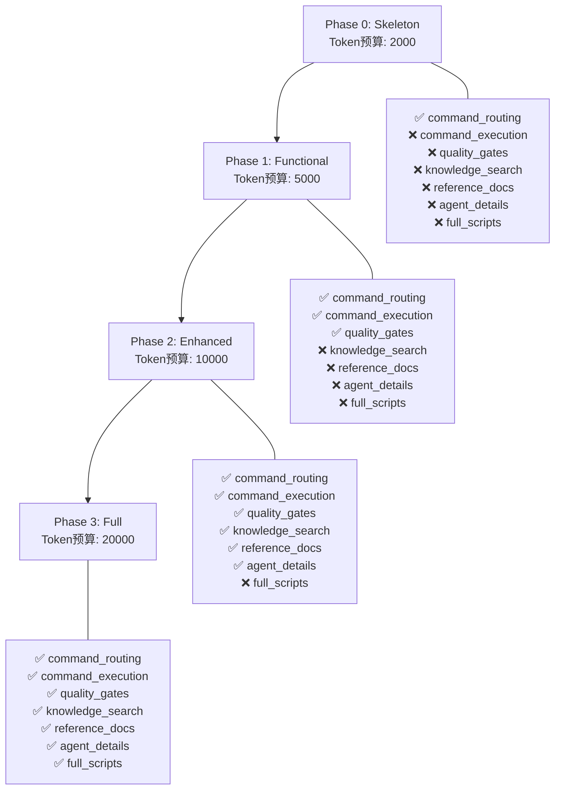
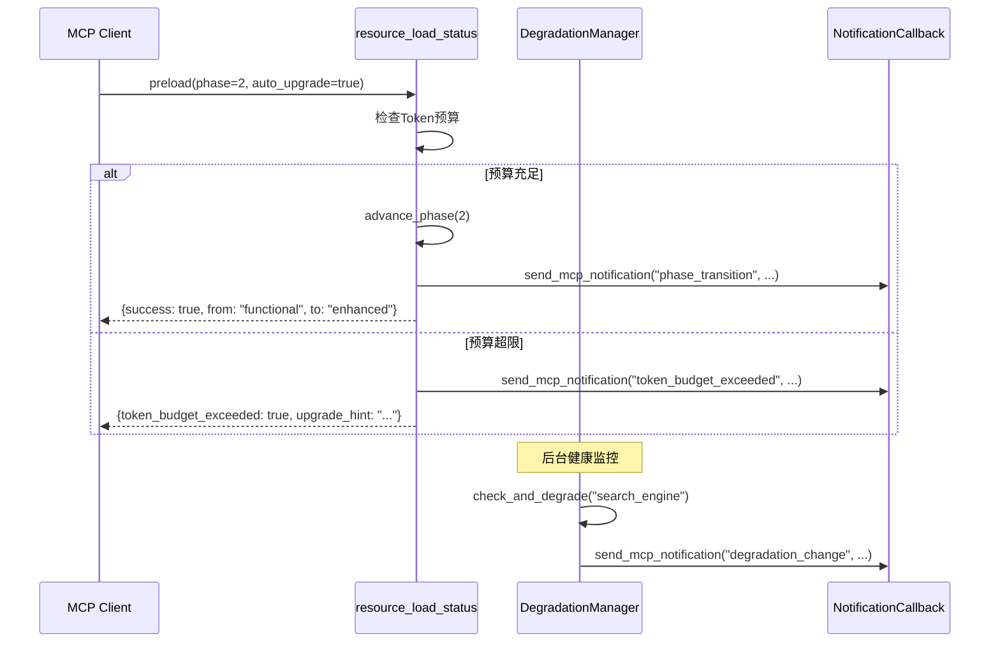
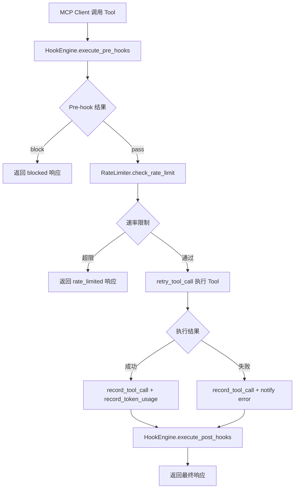
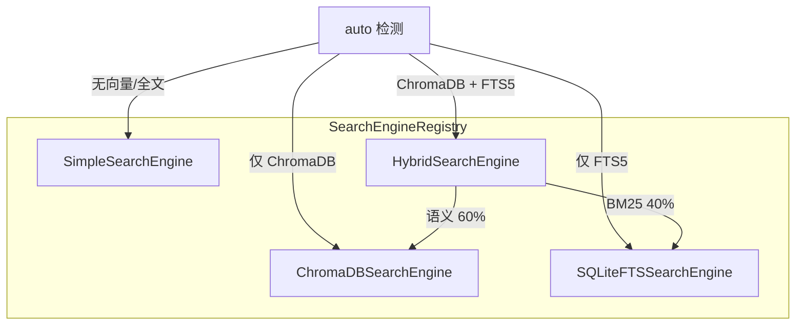
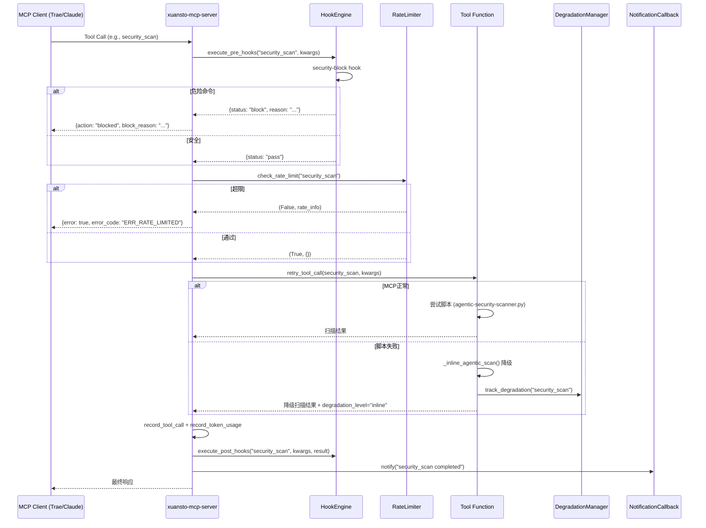

# MCP Review — xuansto-mcp-server v8.0.0

> 基于源码事实的完整 MCP 架构分析文档
> 生成日期: 2026-05-23 | 版本: 8.0.0 | 包名: xuansto-mcp-server

---

## 目录

1. [现有 MCP 调用清单](#1-现有-mcp-调用清单)
2. [MCP-ifiable 能力识别与分类](#2-mcp-ifiable-能力识别与分类)
3. [目标 MCP Server 设计](#3-目标-mcp-server-设计)
4. [mcpServers 配置 JSON 示例](#4-mcpservers-配置-json-示例)
5. [渐进式加载与 MCP 关联](#5-渐进式加载与-mcp-关联)
6. [Skill → MCP 交互协议](#6-skill--mcp-交互协议)

---

## 1. 现有 MCP 调用清单

### 1.1 MCP Tools 清单（19 个）

基于 `server.py` 中的 `_TOOL_FUNCTIONS` 注册表和各 `tools/*.py` 模块的 `register(mcp)` 调用，共注册 **19 个 MCP Tool**：

| # | Tool 名称 | 注册模块 | 只读 | 破坏性 | 幂等 | 开放世界 |
|---|-----------|----------|------|--------|------|----------|
| 1 | `skill_analyze` | tools/skill_analyze.py | ✅ | ❌ | ❌ | ✅ |
| 2 | `knowledge_search` | tools/knowledge_search.py | ✅ | ❌ | ❌ | ✅ |
| 3 | `knowledge_inject` | tools/knowledge_inject.py | ❌ | ❌ | ❌ | ❌ |
| 4 | `quality_gate_check` | tools/quality_gate_check.py | ✅ | ❌ | ❌ | ✅ |
| 5 | `spec_drift_detect` | tools/spec_drift_detect.py | ✅ | ❌ | ✅ | ✅ |
| 6 | `security_scan` | tools/security_scan.py | ✅ | ❌ | ❌ | ✅ |
| 7 | `code_simplify` | tools/code_simplify.py | ✅ | ❌ | ✅ | ❌ |
| 8 | `session_manage` | tools/session_manage.py | ❌ | ❌ | ❌ | ❌ |
| 9 | `workflow_dispatch` | tools/workflow_dispatch.py | ❌ | ❌ | ❌ | ❌ |
| 10 | `agent_status` | tools/agent_status.py | ✅ | ❌ | ✅ | ❌ |
| 11 | `agent_manage` | tools/agent_manage.py | ❌ | ✅ | ❌ | ❌ |
| 12 | `hook_manage` | tools/hook_manage.py | ❌ | ❌ | ❌ | ❌ |
| 13 | `resource_load_status` | tools/resource_load_status.py | ✅ | ❌ | ✅ | ❌ |
| 14 | `context_compress` | tools/context_compress.py | ✅ | ❌ | ✅ | ❌ |
| 15 | `server_health` | tools/server_health.py | ✅ | ❌ | ✅ | ❌ |
| 16 | `decision_log` | tools/decision_log.py | ❌ | ❌ | ❌ | ❌ |
| 17 | `token_budget` | tools/token_budget.py | ❌ | ❌ | ❌ | ❌ |
| 18 | `project_init` | tools/project_init.py | ❌ | ❌ | ❌ | ❌ |
| 19 | `metrics_report` | tools/metrics_report.py | ✅ | ❌ | ✅ | ❌ |
| 20 | `config_manage` | tools/config_manage.py | ❌ | ❌ | ✅ | ❌ |

> **注**: `config_manage` 为第 20 个工具，但用户需求文档中列为 19 个（含 `config_manage`），实际代码注册了 20 个。

### 1.2 MCP Resources 清单（8 个）

基于 `resources/skill_resources.py` 的 `register(mcp)` 调用：

| # | URI 模式 | 类型 | 描述 |
|---|----------|------|------|
| 1 | `xuansto://config/skill` | 静态 | 技能配置文件（.skill-config.yaml） |
| 2 | `xuansto://references/quality-gates` | 静态 | 质量门禁参考文档 |
| 3 | `xuansto://references/agent-registry` | 静态 | Agent 注册表 |
| 4 | `xuansto://references/workflow-phases` | 静态 | 工作流阶段定义 |
| 5 | `xuansto://templates/{name}` | 模板 | 模板文件（按名称） |
| 6 | `xuansto://sessions/latest` | 静态 | 最新会话记录 |
| 7 | `xuansto://sessions/{session_id}` | 模板 | 指定会话记录 |
| 8 | `xuansto://agents/{layer}/{name}` | 模板 | Agent 定义文件（按层级/名称） |
| 9 | `xuansto://loading/status` | 静态 | 渐进式加载状态 |
| 10 | `xuansto://metrics/summary` | 静态 | 工具指标汇总 |
| 11 | `xuansto://degradation/status` | 静态 | 降级状态 |

> **注**: 实际代码注册了 11 个 Resource（含 3 个模板资源），用户需求文档中列为 8 个核心 Resource。

### 1.3 MCP 配置

基于 `mcp-config.json`：

```json
{
  "mcpServers": {
    "xuansto-mcp-server": {
      "command": "uvx",
      "args": [
        "--from",
        "git+https://github.com/skiller-team/xuansto-mcp-server",
        "xuansto-mcp"
      ]
    }
  }
}
```

基于 `pyproject.toml`：

| 属性 | 值 |
|------|-----|
| 包名 | `xuansto-mcp-server` |
| 版本 | `8.0.0` |
| Python | `>=3.10` |
| 入口点 | `xuansto_mcp.server:main` |
| CLI 入口 | `xuansto_mcp.cli:main` |
| 核心依赖 | `mcp[cli]>=1.0.0`, `pydantic>=2.0.0`, `pyyaml>=6.0` |
| 可选依赖 | `chromadb>=0.4.0`, `fastapi`, `uvicorn`, `openai`, `sentence-transformers`, `watchfiles` |
| 传输方式 | `stdio` |

---

## 2. MCP-ifiable 能力识别与分类

### 2.1 分类原则

| 分类 | 判定标准 | 示例 |
|------|----------|------|
| **Tool** | 有副作用、需要参数输入、执行操作 | `agent_manage`, `workflow_dispatch` |
| **Resource** | 只读、状态快照、配置/参考数据 | `xuansto://config/skill`, `xuansto://metrics/summary` |

### 2.2 能力分类矩阵

```mermaid
graph LR
    subgraph Tools["MCP Tools（交互式操作）"]
        T1[skill_analyze]
        T2[knowledge_search]
        T3[knowledge_inject]
        T4[quality_gate_check]
        T5[spec_drift_detect]
        T6[security_scan]
        T7[code_simplify]
        T8[session_manage]
        T9[workflow_dispatch]
        T10[agent_status]
        T11[agent_manage]
        T12[hook_manage]
        T13[resource_load_status]
        T14[context_compress]
        T15[server_health]
        T16[decision_log]
        T17[token_budget]
        T18[project_init]
        T19[metrics_report]
        T20[config_manage]
    end

    subgraph Resources["MCP Resources（只读快照）"]
        R1[xuansto://config/skill]
        R2[xuansto://references/*]
        R3[xuansto://templates/{name}]
        R4[xuansto://sessions/*]
        R5[xuansto://agents/{layer}/{name}]
        R6[xuansto://loading/status]
        R7[xuansto://metrics/summary]
        R8[xuansto://degradation/status]
    end

    Tools -->|Hook拦截| H[HookEngine]
    Tools -->|速率限制| RL[TokenBucket]
    Tools -->|降级回退| D[DegradationManager]
    Resources -->|缓存| C[LRUCache]
```

### 2.3 按功能域分组

| 功能域 | Tools | Resources |
|--------|-------|-----------|
| **分析** | skill_analyze, spec_drift_detect, code_simplify | — |
| **知识** | knowledge_search, knowledge_inject | — |
| **质量** | quality_gate_check, security_scan | xuansto://references/quality-gates |
| **工作流** | workflow_dispatch, session_manage | xuansto://references/workflow-phases, xuansto://sessions/* |
| **Agent** | agent_status, agent_manage | xuansto://references/agent-registry, xuansto://agents/{layer}/{name} |
| **基础设施** | server_health, config_manage, metrics_report, token_budget, context_compress, resource_load_status, hook_manage, project_init, decision_log | xuansto://config/skill, xuansto://loading/status, xuansto://metrics/summary, xuansto://degradation/status, xuansto://templates/{name} |

---

## 3. 目标 MCP Server 设计

### 3.1 Server 元信息

| 属性 | 值 |
|------|-----|
| 名称 | `xuansto-mcp-server` |
| 描述 | Xuansto Skill MCP服务器 v8.0.0 |
| FastMCP 实例 | `FastMCP("xuansto-mcp-server", instructions="Xuansto Skill MCP服务器 v8.0.0")` |
| 传输协议 | stdio |
| API 版本 | 定义于 `core/config.py` 的 `MCP_API_VERSION` |

### 3.2 Tool 详细设计（含 JSON Schema）

#### 3.2.1 skill_analyze

**描述**: 技能结构分析：扫描技能目录结构、验证配置完整性、分析脚本和Agent定义。返回技能元数据、配置校验结果和结构评分。

```json
{
  "name": "skill_analyze",
  "description": "技能结构分析：扫描技能目录结构、验证配置完整性、分析脚本和Agent定义。返回技能元数据、配置校验结果和结构评分。",
  "inputSchema": {
    "type": "object",
    "properties": {
      "skill_path": {
        "type": "string",
        "description": "技能根目录路径"
      },
      "include_scripts": {
        "type": "boolean",
        "default": true,
        "description": "是否分析scripts目录"
      },
      "include_agents": {
        "type": "boolean",
        "default": true,
        "description": "是否分析agents目录"
      },
      "depth": {
        "type": "string",
        "enum": ["basic", "full"],
        "default": "basic",
        "description": "分析深度: basic 或 full"
      }
    },
    "required": ["skill_path"]
  }
}
```

#### 3.2.2 knowledge_search

**描述**: 知识检索引擎：支持hybrid/semantic/keyword三种搜索策略，限定general/workspace/experience范围。ChromaDB可选，默认SQLite FTS5 + BM25。

```json
{
  "name": "knowledge_search",
  "description": "知识检索引擎：支持hybrid/semantic/keyword三种搜索策略，限定general/workspace/experience范围。ChromaDB可选，默认SQLite FTS5 + BM25。",
  "inputSchema": {
    "type": "object",
    "properties": {
      "action": {
        "type": "string",
        "enum": ["retrieve"],
        "description": "操作类型: retrieve"
      },
      "query": {
        "type": ["string", "null"],
        "description": "搜索查询文本"
      },
      "top_k": {
        "type": "integer",
        "default": 5,
        "minimum": 1,
        "maximum": 50,
        "description": "返回结果数量上限"
      },
      "search_type": {
        "type": "string",
        "enum": ["hybrid", "semantic_only", "keyword_only"],
        "default": "hybrid",
        "description": "搜索策略: hybrid, semantic_only, keyword_only"
      },
      "scope": {
        "type": ["string", "null"],
        "enum": ["general", "workspace", "experience"],
        "description": "限定搜索范围: general, workspace, experience"
      },
      "min_confidence": {
        "type": "number",
        "default": 0.0,
        "minimum": 0.0,
        "maximum": 1.0,
        "description": "最低置信度阈值"
      }
    },
    "required": ["action"]
  }
}
```

#### 3.2.3 knowledge_inject

**描述**: 知识注入与经验沉淀：注入知识到上下文、列出可用知识、沉淀经验条目、添加/更新知识条目。

```json
{
  "name": "knowledge_inject",
  "description": "知识注入与经验沉淀：注入知识到上下文、列出可用知识、沉淀经验条目、添加/更新知识条目。",
  "inputSchema": {
    "type": "object",
    "properties": {
      "action": {
        "type": "string",
        "enum": ["inject", "list_available", "precipitate", "add", "update"],
        "description": "操作类型: inject, list_available, precipitate, add, update"
      },
      "topics": {
        "type": ["array", "null"],
        "items": { "type": "string" },
        "description": "知识主题列表(inject时使用)"
      },
      "scope": {
        "type": "string",
        "enum": ["general", "workspace", "experience"],
        "default": "general",
        "description": "知识范围: general, workspace, experience"
      },
      "max_tokens": {
        "type": "integer",
        "default": 5000,
        "minimum": 100,
        "maximum": 50000,
        "description": "最大注入Token数量(inject时使用)"
      },
      "relevance_threshold": {
        "type": "number",
        "default": 0.5,
        "minimum": 0.0,
        "maximum": 1.0,
        "description": "相关性阈值(inject时使用)"
      },
      "category": {
        "type": ["string", "null"],
        "description": "经验分类(precipitate时使用)"
      },
      "title": {
        "type": ["string", "null"],
        "description": "经验标题(precipitate/add/update时使用)"
      },
      "content": {
        "type": ["string", "null"],
        "description": "经验内容(precipitate/add/update时使用)"
      },
      "tags": {
        "type": ["array", "null"],
        "items": { "type": "string" },
        "description": "标签列表(precipitate/add/update时使用)"
      },
      "confidence": {
        "type": "number",
        "default": 0.8,
        "minimum": 0.0,
        "maximum": 1.0,
        "description": "置信度(precipitate时使用)"
      },
      "entry_id": {
        "type": ["string", "null"],
        "description": "知识条目ID(update时使用)"
      }
    },
    "required": ["action"]
  }
}
```

#### 3.2.4 quality_gate_check

**描述**: 质量门禁检查：按ID或阶段执行门禁检查，返回PASS/FAIL/WARN/SKIP状态和修复建议。

```json
{
  "name": "quality_gate_check",
  "description": "质量门禁检查：按ID或阶段执行门禁检查，返回PASS/FAIL/WARN/SKIP状态和修复建议。",
  "inputSchema": {
    "type": "object",
    "properties": {
      "gate_ids": {
        "type": ["array", "null"],
        "items": { "type": "string" },
        "description": "要检查的门禁ID列表，为空则检查全部"
      },
      "phase": {
        "type": ["string", "null"],
        "description": "按阶段过滤门禁(0-8)"
      },
      "project_path": {
        "type": "string",
        "default": ".",
        "description": "项目根目录路径"
      },
      "severity_filter": {
        "type": "string",
        "enum": ["all", "BLOCK", "WARN"],
        "default": "all",
        "description": "严重级别过滤: all, BLOCK, WARN"
      },
      "force_refresh": {
        "type": "boolean",
        "default": false,
        "description": "强制刷新缓存，忽略文件哈希缓存"
      }
    }
  }
}
```

#### 3.2.5 spec_drift_detect

**描述**: 规格漂移检测：对比规格文档与源代码实现的一致性，返回漂移项列表和严重程度。

```json
{
  "name": "spec_drift_detect",
  "description": "规格漂移检测：对比规格文档与源代码实现的一致性，返回漂移项列表和严重程度。",
  "inputSchema": {
    "type": "object",
    "properties": {
      "spec_dir": {
        "type": "string",
        "default": ".trae/specs",
        "description": "规格文档目录"
      },
      "src_dir": {
        "type": "string",
        "default": ".",
        "description": "源代码目录"
      }
    }
  }
}
```

#### 3.2.6 security_scan

**描述**: 安全扫描引擎：OWASP Agentic Top 10检查 + 依赖漏洞扫描。支持严重级别过滤(critical/high/medium/low)，返回分类漏洞列表和修复建议。

```json
{
  "name": "security_scan",
  "description": "安全扫描引擎：OWASP Agentic Top 10检查 + 依赖漏洞扫描。支持严重级别过滤(critical/high/medium/low)，返回分类漏洞列表和修复建议。",
  "inputSchema": {
    "type": "object",
    "properties": {
      "target": {
        "type": "string",
        "default": ".",
        "description": "目标扫描目录"
      },
      "severity_threshold": {
        "type": "string",
        "enum": ["critical", "high", "medium", "low"],
        "default": "medium",
        "description": "最低报告严重级别: critical, high, medium, low"
      },
      "include_agentic": {
        "type": "boolean",
        "default": true,
        "description": "是否包含OWASP Agentic Top 10检查"
      },
      "include_dependency": {
        "type": "boolean",
        "default": true,
        "description": "是否包含依赖漏洞扫描"
      }
    }
  }
}
```

#### 3.2.7 code_simplify

**描述**: 代码简化分析：检测死代码、深层嵌套、过长函数和重复代码。支持文件/目录/最近修改三种扫描范围，返回简化建议和重复代码报告。

```json
{
  "name": "code_simplify",
  "description": "代码简化分析：检测死代码、深层嵌套、过长函数和重复代码。支持文件/目录/最近修改三种扫描范围，返回简化建议和重复代码报告。",
  "inputSchema": {
    "type": "object",
    "properties": {
      "target": {
        "type": "string",
        "description": "目标文件或目录路径"
      },
      "scope": {
        "type": "string",
        "enum": ["file", "dir", "recent"],
        "default": "recent",
        "description": "扫描范围: file, dir, recent"
      },
      "include_dedup": {
        "type": "boolean",
        "default": true,
        "description": "是否包含重复代码检测"
      }
    },
    "required": ["target"]
  }
}
```

#### 3.2.8 session_manage

**描述**: 会话状态管理：保存/加载/列出会话记录，检测重复错误模式，验证经验模式，追踪/恢复会话状态。

```json
{
  "name": "session_manage",
  "description": "会话状态管理：保存/加载/列出会话记录，检测重复错误模式，验证经验模式，追踪/恢复会话状态。",
  "inputSchema": {
    "type": "object",
    "properties": {
      "action": {
        "type": "string",
        "enum": ["save", "load", "list", "detect", "verify", "track", "restore"],
        "description": "操作类型: save, load, list, detect, verify, track, restore"
      },
      "completed_tasks": {
        "type": ["array", "null"],
        "items": { "type": "string" },
        "description": "已完成任务列表(save时使用)"
      },
      "pending_tasks": {
        "type": ["array", "null"],
        "items": { "type": "string" },
        "description": "未完成任务列表(save/track时使用)"
      },
      "decisions": {
        "type": ["array", "null"],
        "items": { "type": "string" },
        "description": "关键决策列表(save/track时使用)"
      },
      "experience": {
        "type": ["array", "null"],
        "items": { "type": "string" },
        "description": "经验沉淀列表(save时使用)"
      },
      "error_log": {
        "type": ["array", "null"],
        "items": { "type": "string" },
        "description": "错误日志(detect时使用)"
      },
      "pattern_path": {
        "type": ["string", "null"],
        "description": "模式文件路径(verify时使用)"
      },
      "success": {
        "type": "boolean",
        "default": true,
        "description": "验证是否成功(verify时使用)"
      },
      "current_phase": {
        "type": ["integer", "null"],
        "description": "当前阶段编号(track时使用)"
      },
      "current_task": {
        "type": ["string", "null"],
        "description": "当前任务描述(track时使用)"
      }
    },
    "required": ["action"]
  }
}
```

#### 3.2.9 workflow_dispatch

**描述**: 工作流调度：启动/查询/中止/阶段推进工作流执行。支持sdd-tdd-full/medium/fast等15种工作流，返回工作流实例ID和当前状态。

```json
{
  "name": "workflow_dispatch",
  "description": "工作流调度：启动/查询/中止/阶段推进工作流执行。支持sdd-tdd-full/medium/fast等15种工作流，返回工作流实例ID和当前状态。",
  "inputSchema": {
    "type": "object",
    "properties": {
      "action": {
        "type": "string",
        "enum": ["start", "status", "abort", "phase", "recover", "snapshots"],
        "description": "操作类型: start, status, abort, phase, recover, snapshots"
      },
      "workflow": {
        "type": ["string", "null"],
        "description": "工作流名称(start时使用): sdd-tdd-full, sdd-tdd-medium, sdd-tdd-fast等"
      },
      "project_path": {
        "type": "string",
        "default": ".",
        "description": "项目根目录路径(start时使用)"
      },
      "workflow_id": {
        "type": ["string", "null"],
        "description": "工作流实例ID(status/abort/phase/recover/snapshots时使用)"
      },
      "phase_action": {
        "type": ["string", "null"],
        "enum": ["advance", "current"],
        "description": "阶段操作(phase时使用): advance, current"
      },
      "snapshot_phase": {
        "type": ["integer", "null"],
        "description": "恢复到指定阶段的快照(recover时使用)"
      }
    },
    "required": ["action"]
  }
}
```

#### 3.2.10 agent_status

**描述**: Agent状态查询：列出全部57个Agent、按Phase查询活跃Agent、查询单个Agent详情、按能力匹配Agent、合并Agent(小项目自动从57合并到~20)。

```json
{
  "name": "agent_status",
  "description": "Agent状态查询：列出全部57个Agent、按Phase查询活跃Agent、查询单个Agent详情、按能力匹配Agent、合并Agent(小项目自动从57合并到~20)。",
  "inputSchema": {
    "type": "object",
    "properties": {
      "action": {
        "type": "string",
        "enum": ["list", "by_phase", "detail", "match", "merge"],
        "description": "操作类型: list, by_phase, detail, match, merge"
      },
      "phase": {
        "type": ["integer", "null"],
        "minimum": 0,
        "maximum": 8,
        "description": "按阶段查询Agent(by_phase时使用, 0-8)"
      },
      "agent_name": {
        "type": ["string", "null"],
        "description": "Agent名称(detail时使用)"
      },
      "capabilities": {
        "type": ["array", "null"],
        "items": { "type": "string" },
        "description": "Agent能力列表(match时使用)，如: ['code_review', 'testing']"
      },
      "project_file_count": {
        "type": ["integer", "null"],
        "minimum": 0,
        "description": "项目文件数量(merge时使用)，用于判断是否自动合并"
      }
    },
    "required": ["action"]
  }
}
```

#### 3.2.11 agent_manage

**描述**: Agent实例管理：创建/分配/释放/销毁Agent实例，查询实例状态，调度规划。变更操作，非只读。

```json
{
  "name": "agent_manage",
  "description": "Agent实例管理：创建/分配/释放/销毁Agent实例，查询实例状态，调度规划。变更操作，非只读。",
  "inputSchema": {
    "type": "object",
    "properties": {
      "action": {
        "type": "string",
        "enum": ["create", "assign", "release", "instance_status", "destroy", "schedule"],
        "description": "操作类型: create, assign, release, instance_status, destroy, schedule"
      },
      "agent_type": {
        "type": ["string", "null"],
        "description": "Agent类型(create时使用)，如: developer, reviewer, tester"
      },
      "capabilities": {
        "type": ["array", "null"],
        "items": { "type": "string" },
        "description": "Agent能力列表(create时使用)，如: ['code_review', 'testing']"
      },
      "agent_id": {
        "type": ["string", "null"],
        "description": "Agent实例ID(assign/release/instance_status/destroy时使用)"
      },
      "task": {
        "type": ["string", "null"],
        "description": "分配的任务描述(assign时使用)"
      }
    },
    "required": ["action"]
  }
}
```

#### 3.2.12 hook_manage

**描述**: Hook管理：列出指定profile的Hook配置，执行指定Hook。支持minimal/standard/strict三种配置级别，16个Hook。

```json
{
  "name": "hook_manage",
  "description": "Hook管理：列出指定profile的Hook配置，执行指定Hook。支持minimal/standard/strict三种配置级别，16个Hook。",
  "inputSchema": {
    "type": "object",
    "properties": {
      "action": {
        "type": "string",
        "enum": ["list", "execute"],
        "description": "操作类型: list, execute"
      },
      "profile": {
        "type": "string",
        "enum": ["minimal", "standard", "strict"],
        "default": "standard",
        "description": "Hook配置级别: minimal, standard, strict"
      },
      "hook_name": {
        "type": ["string", "null"],
        "description": "Hook名称(execute时使用)"
      },
      "context": {
        "type": ["object", "null"],
        "additionalProperties": {},
        "description": "执行上下文(execute时使用)"
      }
    },
    "required": ["action"]
  }
}
```

#### 3.2.13 resource_load_status

**描述**: 渐进式加载状态管理：查询指定Phase的资源加载状态，预加载指定Phase的资源。返回资源ID、状态(loaded/available/missing/stale/expired)和路径。

```json
{
  "name": "resource_load_status",
  "description": "渐进式加载状态管理：查询指定Phase的资源加载状态，预加载指定Phase的资源。返回资源ID、状态(loaded/available/missing/stale/expired)和路径。",
  "inputSchema": {
    "type": "object",
    "properties": {
      "action": {
        "type": "string",
        "enum": ["status", "preload", "cache", "clear_cache", "loading_progress", "token_report", "disclosure_transition"],
        "description": "操作类型: status, preload, cache, clear_cache, loading_progress, token_report, disclosure_transition"
      },
      "phase": {
        "type": ["integer", "null"],
        "minimum": 0,
        "maximum": 3,
        "description": "目标加载阶段(0-3): 0=骨架, 1=功能, 2=增强, 3=完整"
      },
      "resource_ids": {
        "type": ["array", "null"],
        "items": { "type": "string" },
        "description": "指定资源ID列表"
      },
      "resource_uris": {
        "type": ["array", "null"],
        "items": { "type": "string" },
        "description": "资源URI列表(preload时使用)"
      },
      "priority": {
        "type": "string",
        "enum": ["critical", "normal", "background"],
        "default": "normal",
        "description": "预加载优先级(preload时使用): critical, normal, background"
      },
      "batch_mode": {
        "type": "boolean",
        "default": false,
        "description": "是否批量预加载模式(preload时使用)"
      },
      "auto_upgrade": {
        "type": "boolean",
        "default": false,
        "description": "自动升级阶段(preload时使用)，当Token预算超限时自动推进到下一阶段"
      },
      "target_phase": {
        "type": ["string", "null"],
        "description": "目标阶段名称(disclosure_transition时使用): skeleton, functional, enhanced, full"
      }
    },
    "required": ["action"]
  }
}
```

#### 3.2.14 context_compress

**描述**: 上下文压缩：支持semantic(语义保留)/selective(选择性采样)/lossless(无损截断)三种策略。保留指定章节，压缩其余内容至目标Token数。

```json
{
  "name": "context_compress",
  "description": "上下文压缩：支持semantic(语义保留)/selective(选择性采样)/lossless(无损截断)三种策略。保留指定章节，压缩其余内容至目标Token数。",
  "inputSchema": {
    "type": "object",
    "properties": {
      "content": {
        "type": "string",
        "description": "待压缩的文本内容"
      },
      "strategy": {
        "type": "string",
        "enum": ["semantic", "selective", "lossless"],
        "default": "semantic",
        "description": "压缩策略: semantic, selective, lossless"
      },
      "target_tokens": {
        "type": "integer",
        "default": 2000,
        "minimum": 100,
        "maximum": 50000,
        "description": "目标Token数量"
      },
      "preserve_sections": {
        "type": ["array", "null"],
        "items": { "type": "string" },
        "description": "必须保留的章节标题列表"
      }
    },
    "required": ["content"]
  }
}
```

#### 3.2.15 server_health

**描述**: MCP Server 健康检查：返回服务器状态、版本、运行时间、配置路径和工具统计。支持API版本协商。

```json
{
  "name": "server_health",
  "description": "MCP Server 健康检查：返回服务器状态、版本、运行时间、配置路径和工具统计。支持API版本协商。",
  "inputSchema": {
    "type": "object",
    "properties": {
      "action": {
        "type": "string",
        "enum": ["check", "negotiate_version", "capabilities"],
        "description": "操作类型: check, negotiate_version, capabilities"
      },
      "client_version": {
        "type": ["string", "null"],
        "description": "客户端API版本(negotiate_version时使用)"
      }
    },
    "required": ["action"]
  }
}
```

#### 3.2.16 decision_log

**描述**: 决策日志管理：记录决策条目、搜索决策、导出决策记录。SQLite FTS5全文检索。

```json
{
  "name": "decision_log",
  "description": "决策日志管理：记录决策条目、搜索决策、导出决策记录。SQLite FTS5全文检索。",
  "inputSchema": {
    "type": "object",
    "properties": {
      "action": {
        "type": "string",
        "enum": ["log", "list", "query", "update", "export", "stats"],
        "description": "操作类型: log, list, query, update, export, stats"
      },
      "title": { "type": ["string", "null"], "description": "决策标题(log时使用)" },
      "description": { "type": ["string", "null"], "description": "决策描述(log时使用)" },
      "context": { "type": ["string", "null"], "description": "决策上下文(log/query时使用)" },
      "alternatives": { "type": ["array", "null"], "items": { "type": "string" }, "description": "备选方案列表(log时使用)" },
      "decision": { "type": ["string", "null"], "description": "最终决策(log时使用)" },
      "rationale": { "type": ["string", "null"], "description": "决策理由(log时使用)" },
      "impact": { "type": ["string", "null"], "description": "影响范围(log时使用)" },
      "decided_by": { "type": ["string", "null"], "description": "决策者(log时使用)" },
      "keyword": { "type": ["string", "null"], "description": "搜索关键词(query时使用)" },
      "tag": { "type": ["string", "null"], "description": "标签过滤(query时使用)" },
      "date_from": { "type": ["string", "null"], "description": "起始日期(ISO8601)" },
      "date_to": { "type": ["string", "null"], "description": "截止日期(ISO8601)" },
      "limit": { "type": "integer", "default": 20, "minimum": 1, "maximum": 100, "description": "返回数量上限" },
      "offset": { "type": "integer", "default": 0, "minimum": 0, "maximum": 10000, "description": "偏移量" },
      "format": { "type": "string", "enum": ["json", "markdown"], "default": "json", "description": "导出格式(export时使用)" },
      "decision_id": { "type": ["string", "null"], "description": "决策ID(update时使用)" },
      "status": { "type": ["string", "null"], "enum": ["proposed", "accepted", "deprecated", "superseded"], "description": "决策状态" }
    },
    "required": ["action"]
  }
}
```

#### 3.2.17 token_budget

**描述**: Token预算管理：查询预算状态、设置预算、获取推荐、生成使用报告。

```json
{
  "name": "token_budget",
  "description": "Token预算管理：查询预算状态、设置预算、获取推荐、生成使用报告。",
  "inputSchema": {
    "type": "object",
    "properties": {
      "action": {
        "type": "string",
        "enum": ["status", "set_budget", "recommend", "report"],
        "description": "操作类型: status, set_budget, recommend, report"
      },
      "total_budget": { "type": ["integer", "null"], "minimum": 1000, "description": "总Token预算(set_budget时使用)" },
      "phase_allocations": { "type": ["object", "null"], "additionalProperties": { "type": "integer" }, "description": "阶段分配(set_budget时使用)" },
      "project_size": { "type": ["string", "null"], "enum": ["small", "medium", "large"], "description": "项目规模(recommend时使用)" },
      "complexity": { "type": ["string", "null"], "enum": ["low", "medium", "high"], "description": "复杂度(recommend时使用)" },
      "team_size": { "type": ["integer", "null"], "minimum": 1, "maximum": 50, "description": "团队人数(recommend时使用)" },
      "period": { "type": "string", "enum": ["daily", "weekly", "session"], "default": "session", "description": "报告周期(report时使用)" }
    },
    "required": ["action"]
  }
}
```

#### 3.2.18 project_init

**描述**: 项目初始化管理：创建项目、验证项目配置、检测技术栈。

```json
{
  "name": "project_init",
  "description": "项目初始化管理：创建项目、验证项目配置、检测技术栈。",
  "inputSchema": {
    "type": "object",
    "properties": {
      "action": {
        "type": "string",
        "enum": ["create", "validate", "detect_stack"],
        "description": "操作类型: create, validate, detect_stack"
      },
      "name": { "type": ["string", "null"], "description": "项目名称(create时使用)" },
      "description": { "type": ["string", "null"], "description": "项目描述(create时使用)" },
      "stack": { "type": ["array", "null"], "items": { "type": "string" }, "description": "技术栈列表(create时使用)" },
      "template": { "type": ["string", "null"], "description": "项目模板(create时使用)" },
      "directory": { "type": ["string", "null"], "description": "项目目录(create时使用)" },
      "project_path": { "type": ["string", "null"], "description": "项目路径(validate/detect_stack时使用)" }
    },
    "required": ["action"]
  }
}
```

#### 3.2.19 metrics_report

**描述**: 指标报告：查询工具调用指标(按工具名/时间/类型)，汇总统计(总调用/错误率/延迟分布/降级计数)。

```json
{
  "name": "metrics_report",
  "description": "指标报告：查询工具调用指标(按工具名/时间/类型)，汇总统计(总调用/错误率/延迟分布/降级计数)。",
  "inputSchema": {
    "type": "object",
    "properties": {
      "action": {
        "type": "string",
        "enum": ["query", "summary"],
        "description": "操作类型: query, summary"
      },
      "tool_name": { "type": ["string", "null"], "description": "工具名称(query时使用)" },
      "time_range": { "type": "string", "enum": ["1h", "6h", "24h", "7d", "all"], "default": "all", "description": "时间范围" },
      "metric_type": { "type": "string", "enum": ["calls", "errors", "latency", "all"], "default": "all", "description": "指标类型" }
    },
    "required": ["action"]
  }
}
```

#### 3.2.20 config_manage

**描述**: 配置管理：重载/查询状态/校验YAML配置文件。

```json
{
  "name": "config_manage",
  "description": "配置管理：重载/查询状态/校验YAML配置文件。",
  "inputSchema": {
    "type": "object",
    "properties": {
      "action": {
        "type": "string",
        "enum": ["reload", "status", "validate"],
        "description": "操作类型: reload, status, validate"
      }
    },
    "required": ["action"]
  }
}
```

### 3.3 Resource 详细设计

| # | URI | 类型 | 描述 | 参数 |
|---|-----|------|------|------|
| 1 | `xuansto://config/skill` | 静态 | 技能配置文件 | — |
| 2 | `xuansto://references/quality-gates` | 静态 | 质量门禁参考文档 | — |
| 3 | `xuansto://references/agent-registry` | 静态 | Agent注册表 | — |
| 4 | `xuansto://references/workflow-phases` | 静态 | 工作流阶段定义 | — |
| 5 | `xuansto://templates/{name}` | 模板 | 模板文件 | `name`: 模板名称 |
| 6 | `xuansto://sessions/latest` | 静态 | 最新会话记录 | — |
| 7 | `xuansto://sessions/{session_id}` | 模板 | 指定会话记录 | `session_id`: 会话ID |
| 8 | `xuansto://agents/{layer}/{name}` | 模板 | Agent定义 | `layer`: 层级, `name`: 名称 |
| 9 | `xuansto://loading/status` | 静态 | 渐进式加载状态 | — |
| 10 | `xuansto://metrics/summary` | 静态 | 工具指标汇总 | — |
| 11 | `xuansto://degradation/status` | 静态 | 降级状态 | — |

---

## 4. mcpServers 配置 JSON 示例

### 4.1 uvx 方式（推荐）

```json
{
  "mcpServers": {
    "xuansto-mcp-server": {
      "command": "uvx",
      "args": [
        "--from",
        "git+https://github.com/skiller-team/xuansto-mcp-server",
        "xuansto-mcp"
      ]
    }
  }
}
```

### 4.2 uvx + 本地安装方式

```json
{
  "mcpServers": {
    "xuansto-mcp-server": {
      "command": "uvx",
      "args": [
        "--from",
        "/path/to/xuansto-mcp-server",
        "xuansto-mcp"
      ]
    }
  }
}
```

### 4.3 Python 直接运行方式

```json
{
  "mcpServers": {
    "xuansto-mcp-server": {
      "command": "python",
      "args": [
        "-m",
        "xuansto_mcp.server"
      ],
      "cwd": "/path/to/xuansto-mcp-server",
      "env": {
        "PYTHONPATH": "/path/to/xuansto-mcp-server/src"
      }
    }
  }
}
```

### 4.4 带 ChromaDB 可选依赖方式

```json
{
  "mcpServers": {
    "xuansto-mcp-server": {
      "command": "uvx",
      "args": [
        "--from",
        "git+https://github.com/skiller-team/xuansto-mcp-server[full]",
        "xuansto-mcp"
      ]
    }
  }
}
```

---

## 5. 渐进式加载与 MCP 关联

### 5.1 四阶段披露模型

基于 `resource_load_status.py` 中的 `PHASE_AVAILABLE_FUNCTIONS` 和 `PHASE_RESOURCE_MAP`：



### 5.2 阶段 → MCP Tool 可用性映射

| Tool | Phase 0 | Phase 1 | Phase 2 | Phase 3 |
|------|---------|---------|---------|---------|
| server_health | ✅ | ✅ | ✅ | ✅ |
| config_manage | ✅ | ✅ | ✅ | ✅ |
| resource_load_status | ✅ | ✅ | ✅ | ✅ |
| quality_gate_check | ❌ | ✅ | ✅ | ✅ |
| workflow_dispatch | ❌ | ✅ | ✅ | ✅ |
| session_manage | ❌ | ✅ | ✅ | ✅ |
| knowledge_search | ❌ | ❌ | ✅ | ✅ |
| knowledge_inject | ❌ | ❌ | ✅ | ✅ |
| agent_status (detail) | ❌ | ❌ | ✅ | ✅ |
| security_scan | ❌ | ❌ | ✅ | ✅ |
| code_simplify | ❌ | ❌ | ✅ | ✅ |
| spec_drift_detect | ❌ | ❌ | ✅ | ✅ |
| skill_analyze | ❌ | ❌ | ✅ | ✅ |
| context_compress | ❌ | ❌ | ✅ | ✅ |
| decision_log | ❌ | ❌ | ✅ | ✅ |
| agent_manage | ❌ | ❌ | ❌ | ✅ |
| hook_manage (full) | ❌ | ❌ | ❌ | ✅ |
| token_budget (full) | ❌ | ❌ | ❌ | ✅ |
| metrics_report | ❌ | ❌ | ❌ | ✅ |
| project_init | ❌ | ❌ | ❌ | ✅ |

### 5.3 阶段 → MCP Resource 可用性映射

| Resource URI | Phase 0 | Phase 1 | Phase 2 | Phase 3 |
|-------------|---------|---------|---------|---------|
| `xuansto://config/skill` | ✅ | ✅ | ✅ | ✅ |
| `xuansto://loading/status` | ✅ | ✅ | ✅ | ✅ |
| `xuansto://references/agent-registry` | ❌ | ✅ | ✅ | ✅ |
| `xuansto://references/quality-gates` | ❌ | ✅ | ✅ | ✅ |
| `xuansto://references/workflow-phases` | ❌ | ✅ | ✅ | ✅ |
| `xuansto://sessions/latest` | ❌ | ✅ | ✅ | ✅ |
| `xuansto://agents/{layer}/{name}` | ❌ | ❌ | ✅ | ✅ |
| `xuansto://templates/{name}` | ❌ | ❌ | ❌ | ✅ |
| `xuansto://metrics/summary` | ❌ | ❌ | ❌ | ✅ |
| `xuansto://degradation/status` | ❌ | ❌ | ❌ | ✅ |

### 5.4 阶段转换机制



### 5.5 DisclosureTransition 模型

基于 `models/schemas.py` 中的 `DisclosureTransition`：

```json
{
  "from_phase": "skeleton",
  "to_phase": "functional",
  "started_at": "2026-05-23T10:00:00Z",
  "completed_at": "2026-05-23T10:00:01Z",
  "resources_affected": ["commands_detail", "workflow_phases", "quality_gates_summary", "core_agents"],
  "status": "completed",
  "current_phase": "skeleton",
  "target_phase": "functional",
  "required_resources": ["commands_detail", "workflow_phases"],
  "estimated_tokens": 3500,
  "available_alternatives": [],
  "transition_hint": "升级到功能阶段(Phase 1)可解锁：命令执行、工作流推进、门禁检查、核心Agent"
}
```

---

## 6. Skill → MCP 交互协议

### 6.1 请求处理流水线

基于 `server.py` 中的 `_with_hook_interception` 装饰器：



### 6.2 Hook 拦截机制

#### HookType 枚举（类型安全）

基于 `core/hook_engine.py`：

| HookType | 值 | 触发时机 |
|----------|-----|----------|
| `PRE` | `"pre"` | Tool 执行前 |
| `POST` | `"post"` | Tool 执行后 |
| `PHASE_ENTER` | `"phase_enter"` | 阶段进入时 |
| `PHASE_EXIT` | `"phase_exit"` | 阶段退出时 |
| `GATE_PASS` | `"gate_pass"` | 门禁通过时 |
| `GATE_FAIL` | `"gate_fail"` | 门禁失败时 |
| `SESSION_START` | `"session_start"` | 会话启动时 |
| `SESSION_STOP` | `"session_stop"` | 会话停止时 |

#### Hook → Tool 映射

基于 `tools/hook_manage.py` 中的 `_HOOK_TOOL_MAP`：

| Hook | 关联 Tool |
|------|-----------|
| `security-block` | code_simplify, security_scan, spec_drift_detect |
| `dangerous-cmd-confirm` | workflow_dispatch |
| `auto-format` | code_simplify |
| `console-log-detect` | code_simplify |
| `type-check` | quality_gate_check |
| `git-status-check` | workflow_dispatch |
| `decision-log-persist` | workflow_dispatch, session_manage |

#### Hook Profile 配置

| Profile | Hook 列表 |
|---------|-----------|
| `minimal` | security-block, session-save |
| `standard` | security-block, token-budget-check, auto-format, encoding-check, load-context, kb-health-check, session-save, git-status-check, experience-precipitate, save-state |
| `strict` | 全部 16 个 Hook |

### 6.3 降级框架

#### 降级层级

基于 `core/degradation.py` 中的 `DegradationLevel`：


#### 组件降级路径

| 组件 | L1 (正常) | L2 (降级) | L3 (最低) |
|------|-----------|-----------|-----------|
| search_engine | chromadb | sqlite_fts | keyword |
| knowledge_base | full | workspace_only | no_knowledge |
| hooks | full_hooks | essential_only | no_hooks |
| resources | full_resources | cached_only | minimal |

#### 降级回退链

基于 `core/degradation.py` 中的 `FALLBACK_MAP`：

```
MCP Tool 调用
  ↓ (MCP不可用)
Script 子进程 (run_script_fallback)
  ↓ (脚本不存在/执行失败)
Inline 内嵌逻辑 (_inline_* 函数)
  ↓ (内嵌逻辑异常)
Minimal 最小响应 (空结果集 + degradation_level="minimal")
```

### 6.4 速率限制

基于 `core/rate_limiter.py` 中的 `TokenBucket`：

| 参数 | 默认值 | 说明 |
|------|--------|------|
| `max_tokens` | 60.0 | 桶容量（最大令牌数） |
| `refill_rate` | 1.0 | 令牌填充速率（个/秒） |
| 粒度 | per-tool | 每个 Tool 独立令牌桶 |
| 超限响应 | `ERR_RATE_LIMITED` | `retry_after_seconds: 60.0` |

### 6.5 MCP Notification 回调

基于 `core/notifications.py`：

#### NotificationCallback 协议

```python
class NotificationCallback(Protocol):
    def send(self, message: str, level: str = "info") -> None: ...
```

#### MCPNotificationCallback 协议

```python
class MCPNotificationCallback(Protocol):
    def send_notification(self, event_type: str, data: dict[str, Any]) -> None: ...
```

#### 支持的事件类型

| 事件 | 触发场景 |
|------|----------|
| `degradation_change` | 组件降级级别变更 |
| `phase_transition` | 渐进式加载阶段推进 |
| `phase_degradation` | Token预算超限导致阶段降级 |
| `token_budget_exceeded` | Token预算使用超过80% |
| `gate_failed` | 质量门禁检查失败 |

### 6.6 搜索引擎架构

基于 `core/search_engine.py`：



| 引擎 | 匹配类型 | 依赖 | 相关性算法 |
|------|----------|------|------------|
| `ChromaDBSearchEngine` | semantic | chromadb (可选) | 余弦距离 → 1-distance |
| `SQLiteFTSSearchEngine` | fts5_bm25 | SQLite FTS5 (内置) | BM25 原始分数归一化 |
| `SimpleSearchEngine` | keyword | 无 | 词频匹配 + 长度衰减 |
| `HybridSearchEngine` | hybrid | chromadb + FTS5 | 语义60% + BM25 40% 加权融合 |

### 6.7 本地 _TOOL_FUNCTIONS 注册表

基于 `server.py` 中的设计，xuansto-mcp-server **不依赖 FastMCP 内部 API** 来管理工具注册：

```python
_TOOL_FUNCTIONS: dict[str, Callable[..., Any]] = {}

def _tool_with_hooks(**kwargs):
    def decorator(fn):
        tool_name = fn.__name__
        wrapped = _with_hook_interception(tool_name, fn)
        _TOOL_FUNCTIONS[tool_name] = wrapped
        return _original_mcp_tool(**kwargs)(wrapped)
    return decorator

mcp.tool = _tool_with_hooks
```

关键设计点：
- `_TOOL_FUNCTIONS` 是本地注册表，存储所有被 Hook 拦截包装后的 Tool 函数
- `_with_hook_interception` 为每个 Tool 调用注入 Pre-hook → Rate Limit → Execute → Post-hook 流水线
- `mcp.tool` 被临时替换为 `_tool_with_hooks`，注册完成后恢复原始 `mcp.tool`
- `_REGISTERED_TOOL_NAMES` 和 `_TOOL_REGISTRY` 从 `_TOOL_FUNCTIONS` 派生，供 `server_health` 等工具查询

### 6.8 完整交互时序图



---

## 附录 A: 关键源文件索引

| 文件 | 职责 |
|------|------|
| `server.py` | FastMCP 实例、Tool 注册、Hook 拦截装饰器 |
| `tools/skill_analyze.py` | 技能结构分析 |
| `tools/knowledge_search.py` | 知识检索 |
| `tools/knowledge_inject.py` | 知识注入与经验沉淀 |
| `tools/quality_gate_check.py` | 质量门禁检查 |
| `tools/spec_drift_detect.py` | 规格漂移检测 |
| `tools/security_scan.py` | 安全扫描（OWASP + 依赖） |
| `tools/code_simplify.py` | 代码简化分析 |
| `tools/session_manage.py` | 会话状态管理 |
| `tools/workflow_dispatch.py` | 工作流调度 |
| `tools/agent_status.py` | Agent 状态查询 |
| `tools/agent_manage.py` | Agent 实例管理 |
| `tools/hook_manage.py` | Hook 管理与执行 |
| `tools/resource_load_status.py` | 渐进式加载状态 |
| `tools/context_compress.py` | 上下文压缩 |
| `tools/server_health.py` | 服务器健康检查 |
| `tools/decision_log.py` | 决策日志（SQLite FTS5） |
| `tools/token_budget.py` | Token 预算管理 |
| `tools/project_init.py` | 项目初始化 |
| `tools/metrics_report.py` | 指标报告 |
| `tools/config_manage.py` | 配置管理 |
| `resources/skill_resources.py` | MCP Resource 注册 |
| `core/hook_engine.py` | HookEngine + HookType 枚举 |
| `core/degradation.py` | DegradationManager + FALLBACK_MAP |
| `core/notifications.py` | NotificationCallback + MCPNotificationCallback |
| `core/rate_limiter.py` | TokenBucket 速率限制 |
| `core/search_engine.py` | 搜索引擎注册表（4种引擎） |
| `models/schemas.py` | Pydantic 输入模型（20个） |
| `mcp-config.json` | mcpServers 配置 |
| `pyproject.toml` | 包元数据与依赖 |

## 附录 B: 错误码参考

| 错误码 | 含义 |
|--------|------|
| `ERR_VALIDATION` | 输入参数校验失败 |
| `ERR_NOT_FOUND` | 资源/实例未找到 |
| `ERR_RATE_LIMIT` | 速率限制超限 |
| `ERR_PERMISSION` | 权限不足（如 Agent 忙碌） |
| `ERR_INTERNAL` | 内部错误 |
| `ERR_RATE_LIMITED` | TokenBucket 速率限制 |
