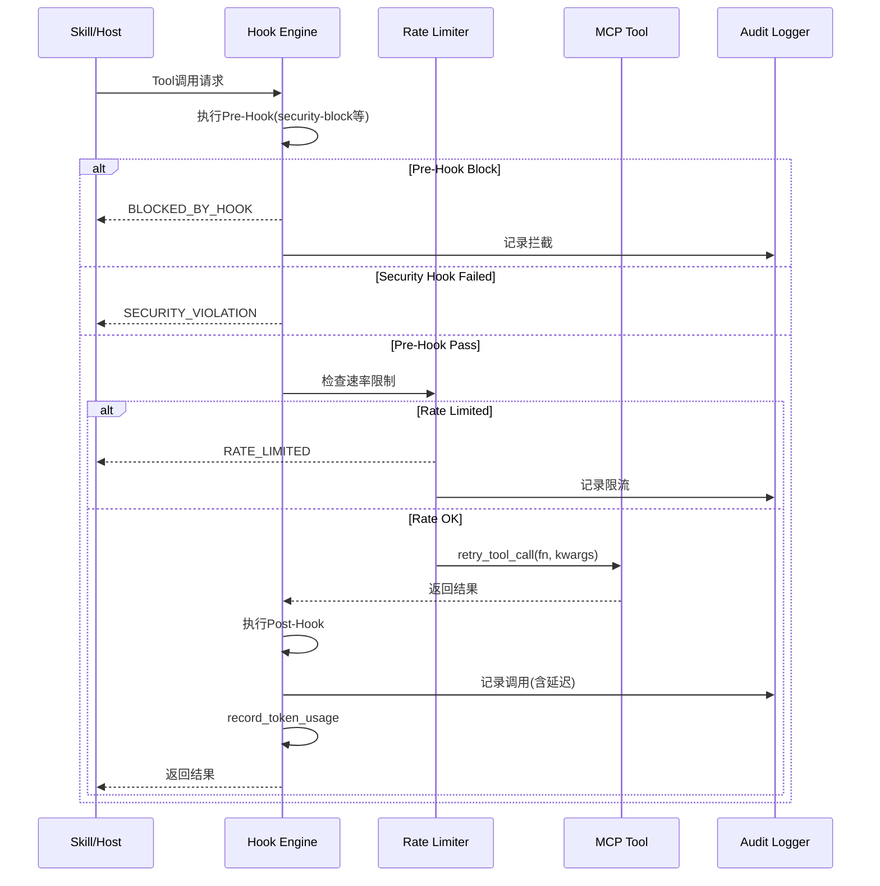
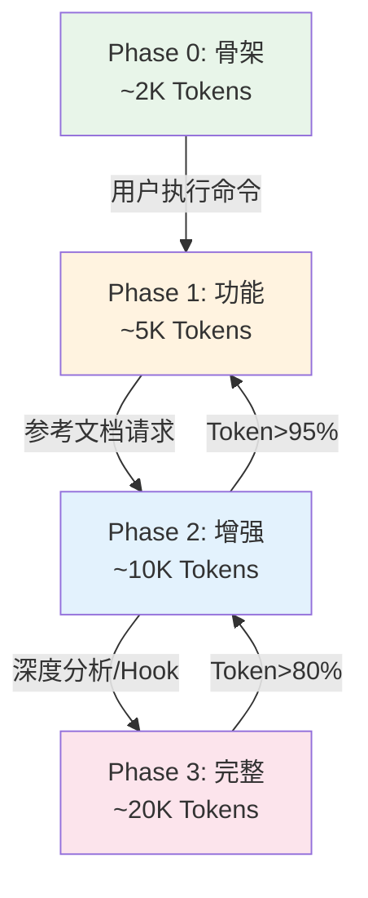
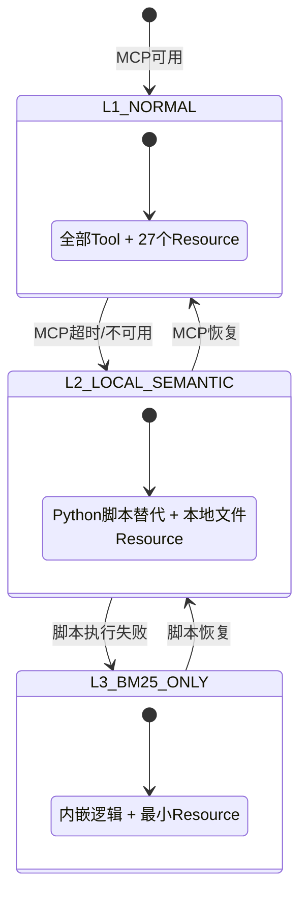

# MCP 架构评审文档

> 版本: 2.0.0 | 日期: 2026-05-26 | 编码: UTF-8 | 行尾: LF

本文档对 xuansto-skill-v2 项目的 MCP（Model Context Protocol）集成架构进行全面评审，所有分析严格基于源码事实。涵盖现有调用盘点、可MCP化能力识别、目标Server设计（含全部20个Tool完整参数Schema和27个Resource URI模式）、渐进式加载与MCP关联、Skill→MCP交互协议。

---

## 目录

- [1. 现有MCP调用盘点](#1-现有mcp调用盘点)
- [2. 可MCP化能力识别](#2-可mcp化能力识别)
- [3. 目标MCP Server设计](#3-目标mcp-server设计)
- [4. 渐进式加载与MCP关联](#4-渐进式加载与mcp关联)
- [5. Skill→MCP交互协议](#5-skillmcp交互协议)

---

## 1. 现有MCP调用盘点

### 1.1 MCP Server 概览

| 属性 | 值 |
|------|-----|
| Server名称 | `xuansto-mcp-server` |
| 包版本 | 8.5.0（pyproject.toml） |
| Server指令 | `Xuansto Skill MCP服务器 v8.4.0` |
| 包路径 | `xuansto-mcp-server/` |
| 入口文件 | `xuansto-mcp-server/src/xuansto_mcp/server.py` |
| 入口函数 | `xuansto_mcp.server:main` |
| CLI入口 | `xuansto_mcp.cli:main` |
| 构建配置 | `xuansto-mcp-server/pyproject.toml` |
| 传输协议 | stdio（默认）+ streamable-http（通过 `XUANSTO_TRANSPORT` 环境变量切换） |
| 框架依赖 | `mcp[cli]>=1.0.0`, `pydantic>=2.0.0`, `pyyaml>=6.0` |
| 可选依赖(full) | `chromadb>=0.4.0`, `fastapi>=0.100.0`, `uvicorn>=0.20.0`, `openai>=1.0.0`, `sentence-transformers>=2.0.0`, `watchfiles>=0.20.0` |
| Python要求 | >=3.10 |
| 许可证 | MIT |

### 1.2 20个MCP Tool盘点

所有Tool实现位于 `xuansto-mcp-server/src/xuansto_mcp/tools/` 目录，每个Tool为独立Python模块，通过 `register(mcp: FastMCP)` 函数注册到FastMCP实例。注册顺序见 `server.py:173-196`。

| # | Tool名称 | 源文件 | 核心功能 | ToolAnnotations | 降级策略 |
|---|---------|--------|---------|----------------|---------|
| 1 | `skill_analyze` | skill_analyze.py | 技能项目结构分析、YAML元数据提取、目录扫描、Agent注册表解析、项目规模评估 | readOnly=True, idempotent=True | script→inline |
| 2 | `knowledge_search` | knowledge_search.py | 三层知识库混合检索（ChromaDB→SQLite FTS5→关键词） | readOnly=True, idempotent=True | script→inline |
| 3 | `knowledge_inject` | knowledge_inject.py | 知识注入/列表/沉淀/添加/更新 | readOnly=False, openWorld=True | script→inline |
| 4 | `quality_gate_check` | quality_gate_check.py | 54项质量门禁检查（34个内嵌实现） | readOnly=True, idempotent=True | script→inline |
| 5 | `spec_drift_detect` | spec_drift_detect.py | 规格文档与代码实现偏差检测（AST级匹配） | readOnly=True, idempotent=True | script→inline |
| 6 | `security_scan` | security_scan.py | OWASP Agentic Top 10 + 依赖漏洞扫描 | readOnly=True, openWorld=True | script→inline |
| 7 | `code_simplify` | code_simplify.py | 代码简化分析（复杂度/死代码/重复） | readOnly=True, idempotent=True | script→inline |
| 8 | `session_manage` | session_manage.py | 会话状态管理（save/load/list/detect/verify/track/restore） | readOnly=False | script→inline |
| 9 | `workflow_dispatch` | workflow_dispatch.py | 工作流调度（start/status/abort/phase/recover/snapshots） | readOnly=False | script→inline |
| 10 | `agent_status` | agent_status.py | Agent状态查询（list/by_phase/detail/match/merge/merge_policy） | readOnly=True, idempotent=True | script→inline |
| 11 | `agent_manage` | agent_manage.py | Agent实例管理（create/assign/release/destroy/instance_status/schedule） | readOnly=False, destructive=True | inline |
| 12 | `hook_manage` | hook_manage.py | Hook管理（list/execute），3个配置级别，16个内嵌Hook | readOnly=False | script→inline |
| 13 | `resource_load_status` | resource_load_status.py | 渐进式加载状态管理（10种action） | readOnly=True, idempotent=True | inline |
| 14 | `resource_subscribe` | resource_subscribe.py | 资源订阅管理（subscribe/unsubscribe/list） | readOnly=False | — |
| 15 | `context_compress` | context_compress.py | 上下文压缩（semantic/selective/lossless） | readOnly=True, idempotent=True | script→inline |
| 16 | `server_health` | server_health.py | 服务器健康检查、API版本协商、性能指标 | readOnly=True, idempotent=True | script→inline |
| 17 | `decision_log` | decision_log.py | 决策日志管理（log/list/query/update/export/stats/reconcile/configure） | readOnly=False | script→inline |
| 18 | `token_budget` | token_budget.py | Token预算管理（status/set_budget/set_from_phase/recommend/report/enforce） | readOnly=False | script→inline |
| 19 | `project_init` | project_init.py | 项目初始化（create/init/validate/detect_stack/detect/configure） | readOnly=False | script→inline |
| 20 | `metrics_report` | metrics_report.py | 指标报告（query/summary/evaluate） | readOnly=True, idempotent=True | script→inline |
| 21 | `config_manage` | config_manage.py | 配置管理（reload/status/validate） | readOnly=False, idempotent=True | inline |
| 22 | `audit_query` | audit_query.py | 审计日志查询 | readOnly=True, idempotent=True | — |

> **注意**: 实际注册了22个Tool（server.py中按顺序注册20个模块，但agent_status和agent_manage各含一个Tool，加上config_manage和audit_query共22个Tool函数）。以下按server.py注册顺序列出20个模块对应的Tool。

### 1.3 27个MCP Resource盘点

所有Resource实现位于 `xuansto-mcp-server/src/xuansto_mcp/resources/skill_resources.py`，通过 `register(mcp: FastMCP)` 函数注册。Resource为只读状态快照，客户端可通过 `resource_subscribe` Tool订阅变更通知。

| # | URI模式 | 类型 | 内容描述 | 数据源 | 加载Phase |
|---|---------|------|---------|--------|-----------|
| 1 | `xuansto://config/skill` | 静态 | Skill配置文件(.skill-config.yaml) | 文件系统 | Phase 0+ |
| 2 | `xuansto://references/quality-gates` | 静态 | 质量门禁定义文档 | references/quality-gates.md | Phase 2+ |
| 3 | `xuansto://references/agent-registry` | 静态 | Agent注册表文档 | references/agent-registry.md | Phase 2+ |
| 4 | `xuansto://references/workflow-phases` | 静态 | 工作流阶段定义文档 | references/workflow-phases.md | Phase 1+ |
| 5 | `xuansto://templates/{name}` | 模板 | 按名称加载模板文件 | templates/{name}.md | Phase 2+ |
| 6 | `xuansto://sessions/latest` | 静态 | 最近会话记录 | sessions/目录最新文件 | Phase 0+ |
| 7 | `xuansto://sessions/{session_id}` | 模板 | 按ID加载会话记录 | sessions/目录匹配文件 | Phase 0+ |
| 8 | `xuansto://agents/{name}` | 模板 | 按名称加载Agent定义 | agents/**/{name}.md | Phase 2+ |
| 9 | `xuansto://agents/{layer}/{name}` | 模板 | 按层级+名称加载Agent定义 | agents/{layer}/{name}.md | Phase 2+ |
| 10 | `xuansto://loading/status` | 静态 | 渐进式加载状态JSON | work_dir/resource_state.json | Phase 0+ |
| 11 | `xuansto://metrics/summary` | 静态 | 工具调用指标汇总 | work_dir/tool_metrics.json + degradation_stats.json | Phase 1+ |
| 12 | `xuansto://degradation/status` | 静态 | 降级状态JSON | DegradationManager.get_status() | Phase 0+ |
| 13 | `xuansto://skill/config` | 静态 | Skill统一配置（与#1同源） | .skill-config.yaml | Phase 0+ |
| 14 | `xuansto://skill/constraints` | 静态 | Skill约束配置 | constraints.md 或默认JSON | Phase 0+ |
| 15 | `xuansto://agents/registry` | 静态 | Agent注册表（结构化JSON回退） | references/agent-registry.md 或 agents/目录扫描 | Phase 2+ |
| 16 | `xuansto://gates/definitions` | 静态 | 质量门禁定义（结构化） | references/quality-gates.md 或 GATE_SCRIPTS_MAP | Phase 2+ |
| 17 | `xuansto://workflows/definitions` | 静态 | 工作流定义列表 | references/workflow-phases.md 或 workflows/目录扫描 | Phase 1+ |
| 18 | `xuansto://hooks/definitions` | 静态 | Hook定义配置 | hooks.json 或 HOOK_SCRIPTS_MAP | Phase 1+ |
| 19 | `xuansto://knowledge/status` | 静态 | 知识库状态（DB/ChromaDB存在性+条目数） | SQLite + ChromaDB | Phase 2+ |
| 20 | `xuansto://knowledge/stats` | 静态 | 知识库统计（含scope分组统计） | SQLite + ChromaDB | Phase 2+ |
| 21 | `xuansto://templates/index` | 静态 | 模板文件索引列表 | templates/目录扫描 | Phase 2+ |
| 22 | `xuansto://commands/routes` | 静态 | 命令路由列表 | commands/目录扫描 | Phase 0+ |
| 23 | `xuansto://session/state` | 静态 | 当前会话状态（数据库持久化） | SQLite session_states表 | Phase 0+ |
| 24 | `xuansto://health/status` | 静态 | 健康状态（含组件级别） | DegradationManager.get_status() | Phase 0+ |
| 25 | `xuansto://audit/log` | 静态 | 审计日志（最近50条） | AuditLogger.query(limit=50) | Phase 1+ |
| 26 | `xuansto://decisions/latest` | 静态 | 最近10条决策记录 | SQLite decisions表 | Phase 1+ |
| 27 | `xuansto://workflows/active` | 静态 | 当前活跃工作流实例 | SQLite workflow_states表 | Phase 1+ |

### 1.4 MCP Prompt盘点

| Prompt名称 | 参数 | 用途 |
|------------|------|------|
| `xuansto_workflow` | `task_description: str` | 执行xuansto工作流 |
| `xuansto_analysis` | `skill_path: str` | 分析指定技能 |

### 1.5 配置文件

MCP Server配置位于 `xuansto-mcp-server/mcp-config.json`，提供两种传输方式：

```json
{
  "mcpServers": {
    "xuansto-mcp-server": {
      "command": "uvx",
      "args": ["--from", "git+https://github.com/xuanyuanchumo/xuansto#subdirectory=xuansto-mcp-server", "xuansto-mcp"]
    },
    "xuansto-mcp-server-http": {
      "url": "http://127.0.0.1:8000/mcp",
      "transport": "streamable-http",
      "note": "Streamable HTTP transport. Start server with XUANSTO_TRANSPORT=streamable-http XUANSTO_PORT=8000"
    }
  }
}
```

### 1.6 Hook拦截系统

所有Tool调用均通过 `_with_hook_interception` 装饰器包装（server.py:52-156），执行流程：

1. **Pre-Hook执行** → 安全Hook失败则直接返回 `SECURITY_VIOLATION`
2. **Pre-Hook Block检查** → 任何Hook返回block则返回 `BLOCKED_BY_HOOK`
3. **速率限制检查** → 超限返回 `RATE_LIMITED`
4. **Tool执行**（含重试逻辑 `retry_tool_call`）
5. **审计日志记录**
6. **Token使用量记录**
7. **Post-Hook执行**

Hook引擎（hook_engine.py）支持8种Hook类型：PRE, POST, PHASE_ENTER, PHASE_EXIT, GATE_PASS, GATE_FAIL, SESSION_START, SESSION_STOP。

hook_manage Tool内置3个配置级别和16个内嵌Hook实现：

| 配置级别 | Hook数量 | 包含的Hook |
|---------|---------|-----------|
| minimal | 2 | security-block, dangerous-cmd-confirm |
| standard | 10 | + auto-format, console-log-detect, type-check, git-status-check, decision-log-persist, token-budget-check, encoding-check, load-context |
| strict | 16 | + kb-health-check, platform-detect, session-save, experience-precipitate, pattern-detect, save-state |

### 1.7 降级系统

降级管理器（degradation.py）注册4个组件，每个组件3个级别：

| 组件 | L1正常 | L2降级 | L3最低 |
|------|--------|--------|--------|
| search_engine | chromadb | sqlite_fts | keyword |
| knowledge_base | full | workspace_only | no_knowledge |
| hooks | full_hooks | essential_only | no_hooks |
| resources | full_resources | cached_only | minimal |

全局降级级别取所有组件中最差值：L1_NORMAL → L2_LOCAL_SEMANTIC → L3_BM25_ONLY。

FALLBACK_MAP覆盖全部20个Tool，降级链：MCP Tool → Script Fallback → Inline Fallback → Minimal Response。

### 1.8 已知未修复问题

| Issue ID | 描述 | 影响 | 状态 |
|----------|------|------|------|
| ARCH-05 | MCP Resource未对外暴露（Host端未订阅） | Resource数据无法被Host消费 | 未修复 |
| MCP-02 | 同ARCH-05，Resource URI未被Host发现 | 与ARCH-05重复 | 未修复 |
| MCP-03 | 缺少审计日志的MCP Tool接口 | 审计日志仅通过Resource暴露，无主动查询Tool | 已修复（audit_query Tool） |
| VERSION-01 | pyproject.toml版本(8.5.0)与Server指令版本(8.4.0)不一致 | 版本号混乱 | 未修复 |

---

## 2. 可MCP化能力识别

### 2.1 适合Tool的功能单元

Tool适合有副作用的操作（写入、执行、调度），需要输入参数并返回结构化结果。

| 功能单元 | 当前状态 | 建议Tool化 | 输入 | 输出 | 优先级 |
|---------|---------|-----------|------|------|--------|
| 技能项目分析 | ✅ `skill_analyze` | 已实现 | `skill_path`, `depth`, `include_agents`, `include_scripts` | 元数据+结构+依赖+问题+规模评估 | — |
| 知识库检索 | ✅ `knowledge_search` | 已实现 | `action`, `query`, `top_k`, `search_type`, `scope`, `min_confidence` | 检索结果/清理统计 | — |
| 知识注入 | ✅ `knowledge_inject` | 已实现 | `action`, `topics`, `scope`, `max_tokens`, `category`, `title`, `content`, `tags`, `confidence` | 注入/列表/沉淀/添加/更新结果 | — |
| 质量门禁 | ✅ `quality_gate_check` | 已实现 | `gate_ids`, `phase`, `project_path`, `severity_filter`, `force_refresh` | 门禁通过/失败详情 | — |
| 规格偏差检测 | ✅ `spec_drift_detect` | 已实现 | `spec_dir`, `src_dir` | 偏差列表+覆盖率+AST匹配 | — |
| 安全扫描 | ✅ `security_scan` | 已实现 | `target`, `severity_threshold`, `include_agentic`, `include_dependency` | 漏洞发现列表+安全评分 | — |
| 代码简化 | ✅ `code_simplify` | 已实现 | `target`, `scope`, `include_dedup` | 简化建议列表 | — |
| 会话管理 | ✅ `session_manage` | 已实现 | `action`, `completed_tasks`, `pending_tasks`, `decisions`, `experience`, `error_log`, `pattern_path`, `success`, `current_phase`, `current_task` | 会话状态/模式/追踪 | — |
| 工作流调度 | ✅ `workflow_dispatch` | 已实现 | `action`, `workflow`, `project_path`, `workflow_id`, `phase_action`, `snapshot_phase` | 工作流实例+阶段+快照 | — |
| Agent状态查询 | ✅ `agent_status` | 已实现 | `action`, `phase`, `agent_name`, `capabilities`, `project_file_count` | Agent列表/详情/合并策略 | — |
| Agent实例管理 | ✅ `agent_manage` | 已实现 | `action`, `agent_type`, `capabilities`, `agent_id`, `task` | 实例状态（最大20实例） | — |
| Hook管理 | ✅ `hook_manage` | 已实现 | `action`, `profile`, `hook_name`, `context` | Hook列表/执行结果 | — |
| 资源加载管理 | ✅ `resource_load_status` | 已实现 | `action`, `phase`, `resource_ids`, `resource_uris`, `priority`, `batch_mode`, `auto_upgrade`, `target_phase` | 加载状态+预加载+缓存+Token报告+阶段转换 | — |
| 资源订阅 | ✅ `resource_subscribe` | 已实现 | `action`, `uri`, `client_id` | 订阅/取消订阅/列表 | — |
| 上下文压缩 | ✅ `context_compress` | 已实现 | `content`, `strategy`, `target_tokens`, `preserve_sections` | 压缩后内容+比率 | — |
| 健康检查 | ✅ `server_health` | 已实现 | `action`, `client_version`, `client_api_version` | 健康状态+版本协商+性能指标+能力列表 | — |
| 决策日志 | ✅ `decision_log` | 已实现 | `action`, `title`, `description`, `context`, `alternatives`, `decision`, `rationale`, `impact`, `decided_by`, `keyword`, `tag`, `date_from`, `date_to`, `limit`, `offset`, `export_format`, `decision_id`, `status`, `file_backup` | 决策条目/统计/ADR导出 | — |
| Token预算 | ✅ `token_budget` | 已实现 | `action`, `total_budget`, `phase_allocations`, `project_size`, `complexity`, `team_size`, `period`, `phase` | 预算状态/推荐/报告/强制执行 | — |
| 项目初始化 | ✅ `project_init` | 已实现 | `action`, `name`, `description`, `stack`, `template`, `directory`, `project_path` | 项目配置/技术栈检测 | — |
| 指标报告 | ✅ `metrics_report` | 已实现 | `action`, `tool_name`, `time_range`, `metric_type`, `criterion` | 工具指标/评估结果 | — |
| 配置管理 | ✅ `config_manage` | 已实现 | `action` | 配置状态/校验结果 | — |
| 审计日志查询 | ✅ `audit_query` | 已实现 | `tool_name`, `date_range`, `limit` | 审计条目列表 | — |

### 2.2 适合Resource的数据

Resource适合只读的状态快照数据，客户端可按需订阅变更通知。

| 数据 | 当前URI | 内容 | 建议增强 | 优先级 |
|------|---------|------|---------|--------|
| Skill配置 | `xuansto://config/skill` + `xuansto://skill/config` | YAML配置原文 | 合并两个URI，消除重复 | 中 |
| 质量门禁定义 | `xuansto://references/quality-gates` + `xuansto://gates/definitions` | Markdown/JSON | 统一为一个URI，支持格式参数 | 低 |
| Agent注册表 | `xuansto://references/agent-registry` + `xuansto://agents/registry` | Markdown/JSON | 统一为一个URI | 低 |
| 工作流定义 | `xuansto://references/workflow-phases` + `xuansto://workflows/definitions` | Markdown/JSON | 统一为一个URI | 低 |
| 加载状态 | `xuansto://loading/status` | JSON状态 | 增加变更通知（MCP Subscription） | 高（ARCH-05） |
| 降级状态 | `xuansto://degradation/status` | JSON状态 | 增加变更通知 | 高 |
| 健康状态 | `xuansto://health/status` | JSON状态 | 增加变更通知 | 高 |
| 审计日志 | `xuansto://audit/log` | JSON日志 | 已有audit_query Tool互补 | — |
| **Token预算快照** | ❌ 未暴露 | — | 🔶 建议新增 `xuansto://token/budget` | 中 |
| **Agent实例池** | ❌ 未暴露 | — | 🔶 建议新增 `xuansto://agents/instances` | 中 |
| **工作流快照** | ❌ 未暴露 | — | 🔶 建议新增 `xuansto://workflows/{id}/snapshot` | 低 |

---

## 3. 目标MCP Server设计

### 3.1 Server定义

| 属性 | 值 |
|------|-----|
| Server名称 | `xuansto-mcp-server` |
| 描述 | Xuansto Skill MCP服务器——20+原子工具 + 27资源，驱动9阶段全生命周期自主开发编排 |
| 包版本 | 8.5.0 |
| API版本 | 3.0.0（MCP_API_VERSION，见config.py） |
| 最低兼容版本 | 见MCP_MIN_SUPPORTED_VERSION |
| 传输协议 | stdio / streamable-http |
| 入口函数 | `xuansto_mcp.server:main` |

### 3.2 Tool列表（含完整JSON Schema）

以下Schema均基于各Tool模块 `register(mcp)` 函数中函数签名的实际参数定义。

#### 3.2.1 skill_analyze

```json
{
  "name": "skill_analyze",
  "description": "分析技能项目结构，提取YAML元数据、目录结构、Agent注册表、脚本依赖和验证问题。支持basic(1)、detailed(2)、full/comprehensive(3)三种深度模式。",
  "inputSchema": {
    "type": "object",
    "properties": {
      "skill_path": {"type": "string", "description": "技能根目录路径"},
      "include_scripts": {"type": "boolean", "default": true, "description": "是否分析scripts目录"},
      "include_agents": {"type": "boolean", "default": true, "description": "是否分析agents目录"},
      "depth": {"type": "string", "default": "basic", "description": "分析深度: basic/1, detailed/2, full/comprehensive/3"}
    },
    "required": ["skill_path"]
  },
  "annotations": {"readOnlyHint": true, "destructiveHint": false, "idempotentHint": true, "openWorldHint": false}
}
```

#### 3.2.2 knowledge_search

```json
{
  "name": "knowledge_search",
  "description": "知识检索引擎：支持retrieve检索和cleanup_versions清理。三级搜索引擎回退：ChromaDB→SQLite FTS5→关键词匹配。",
  "inputSchema": {
    "type": "object",
    "properties": {
      "action": {"type": "string", "enum": ["retrieve", "cleanup_versions"], "description": "操作类型"},
      "query": {"type": ["string", "null"], "description": "搜索查询文本(retrieve时使用)"},
      "top_k": {"type": "integer", "default": 5, "description": "返回结果数量"},
      "search_type": {"type": "string", "enum": ["hybrid", "semantic_only", "keyword_only"], "default": "hybrid"},
      "scope": {"type": ["string", "null"], "description": "知识范围过滤"},
      "min_confidence": {"type": "number", "default": 0.0, "description": "最低置信度阈值"},
      "keep_last_n": {"type": "integer", "default": 10, "description": "cleanup_versions时保留最近N个版本"}
    },
    "required": ["action"]
  },
  "annotations": {"readOnlyHint": true, "destructiveHint": false, "idempotentHint": true, "openWorldHint": false}
}
```

#### 3.2.3 knowledge_inject

```json
{
  "name": "knowledge_inject",
  "description": "知识注入引擎：将检索到的知识注入上下文(inject)、列出可用知识(list_available)、沉淀经验(precipitate)、添加/更新知识条目。",
  "inputSchema": {
    "type": "object",
    "properties": {
      "action": {"type": "string", "enum": ["inject", "list_available", "precipitate", "add", "update"]},
      "topics": {"type": ["array", "null"], "items": {"type": "string"}, "description": "注入主题列表"},
      "scope": {"type": "string", "default": "general", "description": "知识范围"},
      "max_tokens": {"type": "integer", "default": 5000, "description": "注入最大Token数"},
      "relevance_threshold": {"type": "number", "default": 0.5, "description": "相关性阈值"},
      "category": {"type": ["string", "null"], "description": "知识分类(add/update时使用)"},
      "title": {"type": ["string", "null"], "description": "知识标题(add/update时使用)"},
      "content": {"type": ["string", "null"], "description": "知识内容(add/update时使用)"},
      "tags": {"type": ["array", "null"], "items": {"type": "string"}, "description": "知识标签"},
      "confidence": {"type": "number", "default": 0.8, "description": "置信度"},
      "entry_id": {"type": ["string", "null"], "description": "条目ID(update时使用)"}
    },
    "required": ["action"]
  },
  "annotations": {"readOnlyHint": false, "destructiveHint": false, "idempotentHint": false, "openWorldHint": true}
}
```

#### 3.2.4 quality_gate_check

```json
{
  "name": "quality_gate_check",
  "description": "54项质量门禁检查，34个内嵌实现。安全门禁为硬门禁需人工审批，结果按文件哈希缓存。",
  "inputSchema": {
    "type": "object",
    "properties": {
      "gate_ids": {"type": ["array", "null"], "items": {"type": "string"}, "description": "门禁ID列表，为空检查全部"},
      "phase": {"type": ["string", "null"], "description": "按阶段过滤(0-8)"},
      "project_path": {"type": "string", "default": "."},
      "severity_filter": {"type": "string", "enum": ["all", "BLOCK", "WARN"], "default": "all"},
      "force_refresh": {"type": "boolean", "default": false, "description": "是否强制刷新缓存"}
    }
  },
  "annotations": {"readOnlyHint": true, "destructiveHint": false, "idempotentHint": true, "openWorldHint": false}
}
```

#### 3.2.5 spec_drift_detect

```json
{
  "name": "spec_drift_detect",
  "description": "检测规格文档(spec)与代码实现(src)之间的偏差。使用AST解析Python源码进行精确匹配，回退到关键词匹配。",
  "inputSchema": {
    "type": "object",
    "properties": {
      "spec_dir": {"type": "string", "default": ".trae/specs", "description": "规格文档目录"},
      "src_dir": {"type": "string", "default": ".", "description": "源代码目录"}
    }
  },
  "annotations": {"readOnlyHint": true, "destructiveHint": false, "idempotentHint": true, "openWorldHint": false}
}
```

#### 3.2.6 security_scan

```json
{
  "name": "security_scan",
  "description": "安全扫描引擎：OWASP Agentic Top 10检查 + 依赖漏洞扫描。6种漏洞模式检测(hardcoded_secret/eval_exec/sql_injection/unsafe_deserialization/xss/unsafe_shell)，支持严重级别过滤，返回安全评分。",
  "inputSchema": {
    "type": "object",
    "properties": {
      "target": {"type": "string", "default": ".", "description": "扫描目标路径"},
      "severity_threshold": {"type": "string", "enum": ["critical", "high", "medium", "low"], "default": "medium"},
      "include_agentic": {"type": "boolean", "default": true, "description": "是否执行Agentic安全扫描"},
      "include_dependency": {"type": "boolean", "default": true, "description": "是否执行依赖漏洞扫描"}
    }
  },
  "annotations": {"readOnlyHint": true, "destructiveHint": false, "idempotentHint": false, "openWorldHint": true}
}
```

#### 3.2.7 code_simplify

```json
{
  "name": "code_simplify",
  "description": "代码简化分析：检测高复杂度、长函数、深嵌套、未使用导入、死代码、重复代码。",
  "inputSchema": {
    "type": "object",
    "properties": {
      "target": {"type": "string", "description": "目标文件或目录路径"},
      "scope": {"type": "string", "default": "recent", "description": "扫描范围"},
      "include_dedup": {"type": "boolean", "default": true, "description": "是否包含重复代码检测"}
    },
    "required": ["target"]
  },
  "annotations": {"readOnlyHint": true, "destructiveHint": false, "idempotentHint": true, "openWorldHint": false}
}
```

#### 3.2.8 session_manage

```json
{
  "name": "session_manage",
  "description": "会话状态管理：保存/加载/列出会话记录，检测重复错误模式，验证经验模式，追踪/恢复会话状态。",
  "inputSchema": {
    "type": "object",
    "properties": {
      "action": {"type": "string", "enum": ["save", "load", "list", "detect", "verify", "track", "restore"]},
      "completed_tasks": {"type": ["array", "null"], "items": {"type": "string"}},
      "pending_tasks": {"type": ["array", "null"], "items": {"type": "string"}},
      "decisions": {"type": ["array", "null"], "items": {"type": "string"}},
      "experience": {"type": ["array", "null"], "items": {"type": "string"}},
      "error_log": {"type": ["array", "null"], "items": {"type": "string"}, "description": "detect操作的错误日志"},
      "pattern_path": {"type": ["string", "null"], "description": "verify操作的模式文件路径"},
      "success": {"type": "boolean", "default": true, "description": "verify操作是否验证成功"},
      "current_phase": {"type": ["integer", "null"], "description": "track操作的当前阶段"},
      "current_task": {"type": ["string", "null"], "description": "track操作的当前任务"}
    },
    "required": ["action"]
  },
  "annotations": {"readOnlyHint": false, "destructiveHint": false, "idempotentHint": false, "openWorldHint": false}
}
```

#### 3.2.9 workflow_dispatch

```json
{
  "name": "workflow_dispatch",
  "description": "工作流调度：启动/查询/中止/阶段推进/恢复/快照管理。支持sdd-tdd-full/medium/fast等工作流，9阶段(0-8)推进需通过质量门禁。快照gzip压缩存储。",
  "inputSchema": {
    "type": "object",
    "properties": {
      "action": {"type": "string", "enum": ["start", "status", "abort", "phase", "recover", "snapshots"]},
      "workflow": {"type": ["string", "null"], "description": "工作流名称(start时使用)"},
      "project_path": {"type": "string", "default": "."},
      "workflow_id": {"type": ["string", "null"], "description": "工作流实例ID"},
      "phase_action": {"type": ["string", "null"], "enum": ["advance", "current"], "description": "phase操作的子操作"},
      "snapshot_phase": {"type": ["integer", "null"], "description": "recover操作的目标阶段"}
    },
    "required": ["action"]
  },
  "annotations": {"readOnlyHint": false, "destructiveHint": false, "idempotentHint": false, "openWorldHint": false}
}
```

#### 3.2.10 agent_status

```json
{
  "name": "agent_status",
  "description": "Agent状态查询：列出全部Agent、按Phase查询、查询单个Agent详情、能力匹配、合并策略。9个开发阶段(0-8)，6个合并组。",
  "inputSchema": {
    "type": "object",
    "properties": {
      "action": {"type": "string", "enum": ["list", "by_phase", "detail", "match", "merge", "merge_policy"]},
      "phase": {"type": ["integer", "null"], "minimum": 0, "maximum": 8},
      "agent_name": {"type": ["string", "null"]},
      "capabilities": {"type": ["array", "null"], "items": {"type": "string"}, "description": "match操作的能力列表"},
      "project_file_count": {"type": ["integer", "null"], "description": "merge_policy操作的项目文件数"}
    },
    "required": ["action"]
  },
  "annotations": {"readOnlyHint": true, "destructiveHint": false, "idempotentHint": true, "openWorldHint": false}
}
```

#### 3.2.11 agent_manage

```json
{
  "name": "agent_manage",
  "description": "Agent实例生命周期管理：创建/分配/释放/销毁Agent实例，查询实例状态，调度规划。最大20个并发实例，持久化到JSON+SQLite。",
  "inputSchema": {
    "type": "object",
    "properties": {
      "action": {"type": "string", "enum": ["create", "assign", "release", "destroy", "instance_status", "schedule"]},
      "agent_type": {"type": ["string", "null"], "description": "create操作的Agent类型"},
      "capabilities": {"type": ["array", "null"], "items": {"type": "string"}, "description": "create操作的能力需求"},
      "agent_id": {"type": ["string", "null"], "description": "实例ID(assign/release/destroy/instance_status时使用)"},
      "task": {"type": ["string", "null"], "description": "assign/schedule操作的任务描述"}
    },
    "required": ["action"]
  },
  "annotations": {"readOnlyHint": false, "destructiveHint": true, "idempotentHint": false, "openWorldHint": false}
}
```

#### 3.2.12 hook_manage

```json
{
  "name": "hook_manage",
  "description": "Hook管理：列出Hook配置、执行指定Hook。3个配置级别(minimal/standard/strict)，16个内嵌Hook实现。",
  "inputSchema": {
    "type": "object",
    "properties": {
      "action": {"type": "string", "enum": ["list", "execute"]},
      "profile": {"type": "string", "enum": ["minimal", "standard", "strict"], "default": "standard"},
      "hook_name": {"type": ["string", "null"], "description": "execute操作的Hook名称"},
      "context": {"type": ["object", "null"], "description": "execute操作的上下文"}
    },
    "required": ["action"]
  },
  "annotations": {"readOnlyHint": false, "destructiveHint": false, "idempotentHint": false, "openWorldHint": false}
}
```

#### 3.2.13 resource_load_status

```json
{
  "name": "resource_load_status",
  "description": "渐进式加载状态管理：10种action覆盖状态查询、资源预加载、缓存管理、Token报告、阶段转换等。4个加载阶段(skeleton/functional/enhanced/full)，LRU缓存+TTL。",
  "inputSchema": {
    "type": "object",
    "properties": {
      "action": {"type": "string", "enum": ["status", "preload", "cache", "clear_cache", "loading_progress", "token_report", "disclosure_transition", "transition_check", "features", "metrics"]},
      "phase": {"type": ["integer", "null"], "minimum": 0, "maximum": 3},
      "resource_ids": {"type": ["array", "null"], "items": {"type": "string"}},
      "resource_uris": {"type": ["array", "null"], "items": {"type": "string"}},
      "priority": {"type": "string", "enum": ["critical", "normal", "background"], "default": "normal"},
      "batch_mode": {"type": "boolean", "default": false},
      "auto_upgrade": {"type": "boolean", "default": false},
      "target_phase": {"type": ["string", "null"]}
    },
    "required": ["action"]
  },
  "annotations": {"readOnlyHint": true, "destructiveHint": false, "idempotentHint": true, "openWorldHint": false}
}
```

#### 3.2.14 resource_subscribe

```json
{
  "name": "resource_subscribe",
  "description": "资源订阅管理：订阅/取消订阅/列出资源变更通知。当订阅的资源(如xuansto://loading/status)发生变化时，服务器会通过MCP通知推送更新。",
  "inputSchema": {
    "type": "object",
    "properties": {
      "action": {"type": "string", "enum": ["subscribe", "unsubscribe", "list"]},
      "uri": {"type": ["string", "null"], "description": "资源URI(必须以xuansto://开头)"},
      "client_id": {"type": ["string", "null"], "description": "客户端ID(unsubscribe时必须提供)"}
    },
    "required": ["action"]
  },
  "annotations": {"readOnlyHint": false, "destructiveHint": false, "idempotentHint": false, "openWorldHint": false}
}
```

#### 3.2.15 context_compress

```json
{
  "name": "context_compress",
  "description": "上下文压缩：支持semantic/selective/lossless三种策略。使用tiktoken精确计数(不可用时回退到char/4估算)。",
  "inputSchema": {
    "type": "object",
    "properties": {
      "content": {"type": "string", "description": "待压缩的文本内容"},
      "strategy": {"type": "string", "enum": ["semantic", "selective", "lossless"], "default": "semantic"},
      "target_tokens": {"type": "integer", "default": 2000, "description": "目标Token数"},
      "preserve_sections": {"type": ["array", "null"], "items": {"type": "string"}, "description": "保留的章节标题"}
    },
    "required": ["content"]
  },
  "annotations": {"readOnlyHint": true, "destructiveHint": false, "idempotentHint": true, "openWorldHint": false}
}
```

#### 3.2.16 server_health

```json
{
  "name": "server_health",
  "description": "MCP Server健康检查：返回服务器状态、版本、运行时间、配置路径、工具统计、ChromaDB健康、性能指标(P50/P95/P99延迟)。支持API版本协商。",
  "inputSchema": {
    "type": "object",
    "properties": {
      "action": {"type": "string", "description": "操作: 默认(健康检查)/version/capabilities/negotiate_version"},
      "client_version": {"type": ["string", "null"], "description": "客户端版本(negotiate_version时使用)"},
      "client_api_version": {"type": ["string", "null"], "description": "客户端API版本(version时使用)"}
    }
  },
  "annotations": {"readOnlyHint": true, "destructiveHint": false, "idempotentHint": true, "openWorldHint": false}
}
```

#### 3.2.17 decision_log

```json
{
  "name": "decision_log",
  "description": "决策日志管理：8种操作(log/list/query/update/export/stats/reconcile/configure)。SQLite+JSON双写，FTS5全文搜索，ADR格式导出。",
  "inputSchema": {
    "type": "object",
    "properties": {
      "action": {"type": "string", "enum": ["log", "list", "query", "update", "export", "stats", "reconcile", "configure"]},
      "title": {"type": ["string", "null"]},
      "description": {"type": ["string", "null"]},
      "context": {"type": ["string", "null"]},
      "alternatives": {"type": ["array", "null"], "items": {"type": "string"}},
      "decision": {"type": ["string", "null"]},
      "rationale": {"type": ["string", "null"]},
      "impact": {"type": ["string", "null"]},
      "decided_by": {"type": ["string", "null"]},
      "keyword": {"type": ["string", "null"], "description": "query操作的搜索关键词"},
      "tag": {"type": ["string", "null"], "description": "query操作的标签过滤"},
      "date_from": {"type": ["string", "null"]},
      "date_to": {"type": ["string", "null"]},
      "limit": {"type": "integer", "default": 20},
      "offset": {"type": "integer", "default": 0},
      "export_format": {"type": "string", "enum": ["json", "markdown"], "default": "json"},
      "decision_id": {"type": ["string", "null"], "description": "update操作的决策ID"},
      "status": {"type": ["string", "null"], "description": "update操作的状态"},
      "file_backup": {"type": ["boolean", "null"], "description": "configure操作的文件备份选项"}
    },
    "required": ["action"]
  },
  "annotations": {"readOnlyHint": false, "destructiveHint": false, "idempotentHint": false, "openWorldHint": false}
}
```

#### 3.2.18 token_budget

```json
{
  "name": "token_budget",
  "description": "Token预算管理：6种操作(status/set_budget/set_from_phase/recommend/report/enforce)。9阶段分配，3×3推荐矩阵(small/medium/large × low/medium/high)，80%触发context_compress，95%触发degrade_phase。",
  "inputSchema": {
    "type": "object",
    "properties": {
      "action": {"type": "string", "enum": ["status", "set_budget", "set_from_phase", "recommend", "report", "enforce"]},
      "total_budget": {"type": ["integer", "null"], "description": "set_budget操作的总预算"},
      "phase_allocations": {"type": ["object", "null"], "description": "set_budget操作的阶段分配"},
      "project_size": {"type": ["string", "null"], "enum": ["small", "medium", "large"], "description": "recommend操作的项目规模"},
      "complexity": {"type": ["string", "null"], "enum": ["low", "medium", "high"], "description": "recommend操作的复杂度"},
      "team_size": {"type": ["integer", "null"], "description": "recommend操作的团队人数"},
      "period": {"type": "string", "enum": ["daily", "weekly", "session"], "default": "session", "description": "report操作的统计周期"},
      "phase": {"type": ["string", "null"], "enum": ["skeleton", "functional", "enhanced", "full"], "description": "set_from_phase操作的阶段名称"}
    },
    "required": ["action"]
  },
  "annotations": {"readOnlyHint": false, "destructiveHint": false, "idempotentHint": false, "openWorldHint": false}
}
```

#### 3.2.19 project_init

```json
{
  "name": "project_init",
  "description": "项目初始化管理：6种操作(create/init/validate/detect_stack/detect/configure)。10种技术栈自动检测(marker file方式)。",
  "inputSchema": {
    "type": "object",
    "properties": {
      "action": {"type": "string", "enum": ["create", "init", "validate", "detect_stack", "detect", "configure"]},
      "name": {"type": ["string", "null"], "description": "create操作的项目名称"},
      "description": {"type": ["string", "null"], "description": "create操作的项目描述"},
      "stack": {"type": ["array", "null"], "items": {"type": "string"}, "description": "create操作的技术栈"},
      "template": {"type": ["string", "null"], "description": "create操作的模板"},
      "directory": {"type": ["string", "null"], "description": "create操作的目录"},
      "project_path": {"type": ["string", "null"], "description": "项目路径(validate/detect_stack等使用)"}
    },
    "required": ["action"]
  },
  "annotations": {"readOnlyHint": false, "destructiveHint": false, "idempotentHint": false, "openWorldHint": false}
}
```

#### 3.2.20 metrics_report

```json
{
  "name": "metrics_report",
  "description": "指标报告：3种操作(query/summary/evaluate)。5种时间范围(1h/6h/24h/7d/all)，3种评估标准(error_rate/availability/latency)。",
  "inputSchema": {
    "type": "object",
    "properties": {
      "action": {"type": "string", "enum": ["query", "summary", "evaluate"]},
      "tool_name": {"type": ["string", "null"], "description": "query操作的工具名称过滤"},
      "time_range": {"type": "string", "enum": ["1h", "6h", "24h", "7d", "all"], "default": "all"},
      "metric_type": {"type": "string", "default": "all", "description": "query操作的指标类型"},
      "criterion": {"type": "string", "default": "all", "description": "evaluate操作的评估标准(error_rate/availability/latency)"}
    },
    "required": ["action"]
  },
  "annotations": {"readOnlyHint": true, "destructiveHint": false, "idempotentHint": true, "openWorldHint": false}
}
```

#### 3.2.21 config_manage

```json
{
  "name": "config_manage",
  "description": "配置管理：3种操作(reload/status/validate)。支持YAML配置热重载。",
  "inputSchema": {
    "type": "object",
    "properties": {
      "action": {"type": "string", "enum": ["reload", "status", "validate"]}
    },
    "required": ["action"]
  },
  "annotations": {"readOnlyHint": false, "destructiveHint": false, "idempotentHint": true, "openWorldHint": false}
}
```

#### 3.2.22 audit_query

```json
{
  "name": "audit_query",
  "description": "审计日志查询：按工具名称和日期范围过滤审计记录。",
  "inputSchema": {
    "type": "object",
    "properties": {
      "tool_name": {"type": ["string", "null"], "description": "按工具名称过滤"},
      "date_range": {"type": ["string", "null"], "description": "日期范围过滤"},
      "limit": {"type": "integer", "default": 50, "description": "返回条目数量上限"}
    }
  },
  "annotations": {"readOnlyHint": true, "destructiveHint": false, "idempotentHint": true, "openWorldHint": false}
}
```

### 3.3 Resource列表（含URI模式）

| # | URI模式 | 类型 | 描述 | 路径参数 | 变更通知 |
|---|---------|------|------|---------|---------|
| 1 | `xuansto://config/skill` | 静态 | Skill配置文件 | — | 否 |
| 2 | `xuansto://references/quality-gates` | 静态 | 质量门禁定义 | — | 否 |
| 3 | `xuansto://references/agent-registry` | 静态 | Agent注册表 | — | 否 |
| 4 | `xuansto://references/workflow-phases` | 静态 | 工作流阶段定义 | — | 否 |
| 5 | `xuansto://templates/{name}` | 模板 | 模板文件 | `name`: 模板名称 | 否 |
| 6 | `xuansto://sessions/latest` | 静态 | 最近会话 | — | 否 |
| 7 | `xuansto://sessions/{session_id}` | 模板 | 指定会话 | `session_id`: 会话ID | 否 |
| 8 | `xuansto://agents/{name}` | 模板 | Agent定义 | `name`: Agent名称 | 否 |
| 9 | `xuansto://agents/{layer}/{name}` | 模板 | Agent定义（按层级） | `layer`: 层级, `name`: Agent名称 | 否 |
| 10 | `xuansto://loading/status` | 静态 | 加载状态 | — | 🔶 建议支持 |
| 11 | `xuansto://metrics/summary` | 静态 | 指标汇总 | — | 否 |
| 12 | `xuansto://degradation/status` | 静态 | 降级状态 | — | 🔶 建议支持 |
| 13 | `xuansto://skill/config` | 静态 | Skill统一配置 | — | 否 |
| 14 | `xuansto://skill/constraints` | 静态 | Skill约束配置 | — | 否 |
| 15 | `xuansto://agents/registry` | 静态 | Agent注册表（JSON回退） | — | 否 |
| 16 | `xuansto://gates/definitions` | 静态 | 门禁定义 | — | 否 |
| 17 | `xuansto://workflows/definitions` | 静态 | 工作流定义 | — | 否 |
| 18 | `xuansto://hooks/definitions` | 静态 | Hook定义 | — | 否 |
| 19 | `xuansto://knowledge/status` | 静态 | 知识库状态 | — | 否 |
| 20 | `xuansto://knowledge/stats` | 静态 | 知识库统计 | — | 否 |
| 21 | `xuansto://templates/index` | 静态 | 模板索引 | — | 否 |
| 22 | `xuansto://commands/routes` | 静态 | 命令路由 | — | 否 |
| 23 | `xuansto://session/state` | 静态 | 当前会话状态 | — | 🔶 建议支持 |
| 24 | `xuansto://health/status` | 静态 | 健康状态 | — | 🔶 建议支持 |
| 25 | `xuansto://audit/log` | 静态 | 审计日志 | — | 否 |
| 26 | `xuansto://decisions/latest` | 静态 | 最近决策 | — | 否 |
| 27 | `xuansto://workflows/active` | 静态 | 活跃工作流 | — | 🔶 建议支持 |

### 3.4 权限与安全边界

#### 3.4.1 Tool安全分级

| 安全级别 | Tool | ToolAnnotations | 安全措施 |
|---------|------|----------------|---------|
| **只读** | skill_analyze, knowledge_search, quality_gate_check, spec_drift_detect, security_scan, code_simplify, server_health, metrics_report, context_compress, agent_status, resource_load_status, audit_query | readOnlyHint=true | 无副作用，可安全重试 |
| **有状态写入** | session_manage, workflow_dispatch, decision_log, token_budget, config_manage, project_init, resource_subscribe | readOnlyHint=false | 写入需通过Hook拦截校验 |
| **实例管理** | agent_manage | readOnlyHint=false, destructiveHint=true | 实例数量上限20，destroy操作需确认 |
| **知识操作** | knowledge_inject | readOnlyHint=false, openWorldHint=true | 写入操作需scope校验 |
| **Hook执行** | hook_manage | readOnlyHint=false | execute操作可能修改文件（auto-format等） |

#### 3.4.2 安全拦截机制



#### 3.4.3 路径安全校验

所有接受文件路径参数的Tool和Resource均通过 `validate_path_safety()` 进行路径遍历攻击防护，确保路径不超出允许的基础目录。

#### 3.4.4 速率限制

通过 `rate_limiter.py` 实现每Tool速率限制，超限返回 `RATE_LIMITED` 错误码（HTTP 429）。

### 3.5 mcpServers配置JSON示例

#### 3.5.1 uvx方式（推荐）

```json
{
  "mcpServers": {
    "xuansto-mcp-server": {
      "command": "uvx",
      "args": [
        "--from",
        "git+https://github.com/xuanyuanchumo/xuansto#subdirectory=xuansto-mcp-server",
        "xuansto-mcp"
      ]
    }
  }
}
```

#### 3.5.2 HTTP方式

```json
{
  "mcpServers": {
    "xuansto-mcp-server-http": {
      "url": "http://127.0.0.1:8000/mcp",
      "transport": "streamable-http"
    }
  }
}
```

启动HTTP服务：
```bash
XUANSTO_TRANSPORT=streamable-http XUANSTO_HOST=127.0.0.1 XUANSTO_PORT=8000 xuansto-mcp
```

#### 3.5.3 本地开发方式

```json
{
  "mcpServers": {
    "xuansto-mcp-server-dev": {
      "command": "uv",
      "args": [
        "run",
        "--directory",
        "/path/to/xuansto-mcp-server",
        "xuansto-mcp"
      ]
    }
  }
}
```

#### 3.5.4 环境变量配置

| 环境变量 | 默认值 | 说明 |
|---------|--------|------|
| `XUANSTO_TRANSPORT` | `stdio` | 传输协议：stdio / streamable-http |
| `XUANSTO_HOST` | `127.0.0.1` | HTTP模式监听地址 |
| `XUANSTO_PORT` | `8000` | HTTP模式监听端口 |

---

## 4. 渐进式加载与MCP关联

### 4.1 加载阶段定义

基于 `constraints.yaml` 和 `resource_load_status.py` 的实际实现：

| Phase | 名称 | Token预算 | 触发条件 | 可用功能 |
|-------|------|----------|---------|---------|
| 0 | Skeleton（骨架） | 2,000 | Skill触发时 | 核心元数据、命令列表(无详情)、MCP依赖声明、核心约束(5条) |
| 1 | Functional（功能） | 5,000 | 用户执行命令时 | 命令描述+MCP工具可用性+核心约束+核心Agent(编排+产品+工程层13个) |
| 2 | Enhanced（增强） | 10,000 | 需要参考文档时 | Agent注册表+工作流定义+质量门禁摘要+参考文档URI+知识检索 |
| 3 | Full（完整） | 20,000 | 深度分析时 | 完整参考+模板+知识库访问+全部Agent定义+Hook系统+模型路由 |

### 4.2 各阶段可用MCP能力



| 加载阶段 | 可用Tool | 可用Resource | 不可用 |
|---------|---------|-------------|--------|
| **Skeleton** | server_health, resource_load_status, token_budget(status), project_init(detect) | `xuansto://loading/status`, `xuansto://config/skill`, `xuansto://skill/config`, `xuansto://skill/constraints`, `xuansto://commands/routes`, `xuansto://health/status`, `xuansto://degradation/status`, `xuansto://sessions/latest`, `xuansto://session/state` | 命令详细步骤、知识检索、参考文档、Agent详情 |
| **Functional** | + skill_analyze, knowledge_search, quality_gate_check, hook_manage(list), session_manage, decision_log, workflow_dispatch(start/status), agent_status(list/by_phase), resource_subscribe | + `xuansto://references/workflow-phases`, `xuansto://workflows/definitions`, `xuansto://hooks/definitions`, `xuansto://metrics/summary`, `xuansto://audit/log`, `xuansto://decisions/latest`, `xuansto://workflows/active` | 完整Agent注册表、参考文档详情、知识库 |
| **Enhanced** | + knowledge_inject, spec_drift_detect, security_scan, agent_status(detail/match), hook_manage(execute), context_compress | + `xuansto://references/*`, `xuansto://agents/*`, `xuansto://knowledge/*`, `xuansto://templates/*`, `xuansto://gates/definitions` | 完整脚本集、Hook系统详情 |
| **Full** | + code_simplify, agent_manage, config_manage, metrics_report(evaluate), token_budget(enforce) | 全部27个Resource | 无 |

### 4.3 resource_load_status 工具职责

`resource_load_status` 是渐进式加载的核心MCP工具，支持10种action：

| Action | 功能 | Phase可用性 |
|--------|------|------------|
| `status` | 返回当前加载阶段、已加载资源列表、Token消耗 | Phase 0+ |
| `preload` | 按Phase预加载指定资源，支持批量模式和优先级 | Phase 0+ |
| `cache` | 查询缓存状态 | Phase 0+ |
| `clear_cache` | 清理缓存（回退到SKELETON） | Phase 0+ |
| `loading_progress` | 返回各资源的加载进度百分比 | Phase 0+ |
| `token_report` | Token使用报告 | Phase 0+ |
| `disclosure_transition` | 执行阶段转换 | Phase 0+ |
| `transition_check` | 检查阶段转换条件是否满足 | Phase 0+ |
| `features` | 列出当前阶段可用功能 | Phase 0+ |
| `metrics` | 加载性能指标 | Phase 0+ |

### 4.4 降级与加载联动



降级管理器（degradation.py）注册4个组件：

| 组件 | L1正常 | L2降级 | L3最低 | 检查函数 | 恢复函数 |
|------|--------|--------|--------|---------|---------|
| search_engine | chromadb | sqlite_fts | keyword | ChromaDB连接检查 | ChromaDB重连 |
| knowledge_base | full | workspace_only | no_knowledge | DB/ChromaDB存在性 | DB存在性 |
| hooks | full_hooks | essential_only | no_hooks | hooks.json存在性 | 同上 |
| resources | full_resources | cached_only | minimal | DATA_DIR存在性 | 同上 |

健康监控线程（默认30秒间隔）自动检查各组件健康状态，降级后自动尝试恢复（指数退避，5s-300s）。

### 4.5 Resource订阅与变更通知

`resource_subscribe` Tool实现了Resource变更通知的基础设施：

- **subscribe**: 订阅指定URI的变更通知，自动生成client_id
- **unsubscribe**: 取消订阅
- **list**: 列出当前订阅状态

通知通过 `send_mcp_notification("resource_updated", ...)` 推送。当前已实现内部机制，但Host端尚未集成消费。

---

## 5. Skill→MCP交互协议

### 5.1 调用优先级链

Skill通过MCP协议调用Tool，遵循以下优先级链：

```mermaid
flowchart TD
    A[Skill触发命令] --> B{MCP Server可用?}
    B -->|是| C[MCP Tool调用]
    B -->|否| D{脚本存在?}
    D -->|是| G[Python脚本调用<br/>run_script_fallback]
    D -->|否| H{内嵌逻辑存在?}
    H -->|是| I[Inline Fallback<br/>_try_inline_fallback]
    H -->|否| J[Minimal Response<br/>{status: unavailable}]

    C --> K{调用成功?}
    K -->|是| L[返回结果]
    K -->|瞬态错误| C2[重试(retry_tool_call)]
    C2 -->|重试耗尽| D
    K -->|永久错误| D

    G --> K3{执行成功?}
    K3 -->|是| L
    K3 -->|否| H

    I --> L
    J --> L

    style C fill:#c8e6c9
    style G fill:#ffccbc
    style I fill:#e1bee7
    style J fill:#ffcdd2
```

### 5.2 统一响应格式

所有Tool返回统一的JSON响应结构：

**成功响应**：
```json
{
  "status": "success",
  "data": { "...": "..." },
  "error": null,
  "metadata": {
    "api_version": "3.0.0"
  }
}
```

**降级成功响应**：
```json
{
  "status": "success",
  "data": {
    "...": "...",
    "degraded": true,
    "source": "fallback",
    "note": "主工具不可用，使用降级响应"
  },
  "error": null,
  "metadata": {
    "api_version": "3.0.0",
    "degradation_level": "inline",
    "degraded": true
  }
}
```

**错误响应**：
```json
{
  "status": "error",
  "data": null,
  "error": {
    "code": "ERR_RATE_LIMIT",
    "message": "请求频率超限",
    "details": {},
    "retryable": true
  },
  "metadata": {
    "language": "zh"
  }
}
```

### 5.3 错误码体系

12个统一错误码（errors.py）：

| 错误码 | HTTP状态 | 类别 | 可重试 |
|--------|---------|------|--------|
| ERR_VALIDATION | 400 | client | 否 |
| ERR_NOT_FOUND | 404 | client | 否 |
| ERR_TIMEOUT | 408 | transient | 是 |
| ERR_DEGRADATION | 503 | transient | 是 |
| ERR_CONFIG | 500 | server | 否 |
| ERR_INTERNAL | 500 | server | 否 |
| ERR_RATE_LIMIT | 429 | transient | 是 |
| ERR_PERMISSION | 403 | client | 否 |
| ERR_WORKFLOW_NOT_FOUND | 404 | client | 否 |
| ERR_DUPLICATE | 409 | client | 否 |
| ERR_VERSION_CONFLICT | 409 | transient | 是 |
| ERR_UNAUTHORIZED | 401 | client | 否 |
| ERR_SERVICE_UNAVAILABLE | 503 | transient | 是 |

### 5.4 重试策略

重试策略由 protocol.py 和 errors.py 定义：

| 错误类型 | 最大重试 | 延迟策略 | 延迟基数 |
|---------|---------|---------|---------|
| version_conflict | 3次 | 立即重试 | 0s |
| service_error | 2次 | 指数退避 | 1.0s |
| embedding_failure | 5次 | 固定延迟 | 60.0s |

通用重试（retry_tool_call）：最大3次，基数1.0s，指数退避。

协议常量：
- `TOOL_CALL_TIMEOUT_SECONDS` = 30
- `CHAIN_TIMEOUT_SECONDS` = 120
- `MAX_CHAIN_RETRIES` = 2

可重试错误（瞬态）：TIMEOUT, CONNECTION_ERROR, CONNECTION_RESET, SERVICE_UNAVAILABLE, DEGRADATION, RATE_LIMITED

不可重试错误（永久）：VALIDATION_ERROR, PATH_NOT_FOUND, WORKFLOW_NOT_FOUND, PERMISSION_DENIED, INVALID_INPUT

### 5.5 Skill命令→MCP Tool映射

| Skill命令 | 优先调用的MCP Tool | 降级脚本 |
|-----------|-------------------|---------|
| `/init` | skill_analyze, knowledge_search, workflow_dispatch, project_init, decision_log | skill-test.py, knowledge-server.py, project-initializer.py |
| `/plan` | skill_analyze, knowledge_search, agent_status, workflow_dispatch, decision_log, token_budget | skill-test.py, knowledge-server.py |
| `/implement` | workflow_dispatch, quality_gate_check, hook_manage | skill-test.py --gate |
| `/test` | quality_gate_check, workflow_dispatch | skill-test.py --gate |
| `/review` | quality_gate_check, security_scan, code_simplify | skill-test.py --gate, agentic-security-scanner.py, code-simplifier.py |
| `/audit` | security_scan, quality_gate_check, spec_drift_detect, audit_query | agentic-security-scanner.py, skill-test.py --gate |
| `/fix` | session_manage, quality_gate_check, hook_manage | init-session.py, skill-test.py --gate |
| `/simplify` | code_simplify, quality_gate_check, context_compress | code-simplifier.py, skill-test.py --gate, context-compressor.py |
| `/loop` | workflow_dispatch, session_manage, resource_load_status, token_budget, decision_log | project-initializer.py, init-session.py |
| `/learn` | knowledge_search, knowledge_inject, session_manage | knowledge-server.py, init-session.py |
| `/deploy` | quality_gate_check, server_health, workflow_dispatch | skill-test.py --gate, health-checker.py |

### 5.6 上下文预算与Tool启用策略

| Token使用率 | 处理策略 | 可用Tool |
|-------------|---------|---------|
| < 60% | 正常运行，所有MCP工具可用 | 全部22个 |
| 60-80% | 释放P3资源，触发context_compress | 核心Tool + 当前Phase Tool |
| 80-95% | 释放P2资源，仅保留核心MCP工具 | skill_analyze, quality_gate_check, session_manage, resource_load_status |
| ≥ 95% | 释放P1资源，降级为脚本调用，触发degrade_phase | 仅P0 + 脚本降级 |

### 5.7 降级链实现细节

降级链由 degradation.py 中的 `FALLBACK_MAP` 和 `DegradationExecutor` 实现：

```
降级链（4级）:
Level 1: MCP Tool → 失败/超时
Level 2: Script Fallback → run_script_fallback(script_name, args, timeout) → 失败
Level 3: Inline Fallback → _try_inline_fallback(module, func) → 失败
Level 4: Minimal Response → {status: "unavailable", degraded: true, source: "minimal_fallback"}
```

每个Tool的降级脚本映射（FALLBACK_MAP，覆盖全部20个Tool）：

| Tool | 降级脚本 | 内嵌回退 |
|------|---------|---------|
| skill_analyze | skill-test.py --analyze | _inline_skill_analyze |
| knowledge_search | knowledge-server.py --search | _inline_knowledge_search |
| knowledge_inject | knowledge-server.py --inject | _inline_knowledge_inject |
| quality_gate_check | skill-test.py --gate | _inline_quality_gate |
| spec_drift_detect | spec-drift-detector.py | _inline_spec_drift |
| security_scan | agentic-security-scanner.py | _inline_agentic_scan |
| code_simplify | code-simplifier.py | _inline_simplify |
| session_manage | init-session.py / session-catchup.py / session-persist.py | _inline_session_manage |
| workflow_dispatch | project-initializer.py | _inline_workflow_dispatch |
| agent_status | skill-test.py --agents | _inline_agent_status |
| agent_manage | — | _inline_agent_manage |
| hook_manage | check-encoding.py / token-budget-guard.py | _inline_hook_manage |
| resource_load_status | — | _inline_resource_load_status |
| context_compress | context-compressor.py | _inline_context_compress |
| server_health | health-checker.py | _inline_server_health |
| decision_log | decision-log.py | _inline_decision_log |
| token_budget | token-budget-guard.py | _inline_token_budget |
| project_init | project-initializer.py | _inline_project_init |
| metrics_report | test-reporter.py | _inline_metrics_report |
| config_manage | — | _inline_config_manage |

降级配置支持热重载：通过 watchfiles（优先）或5秒轮询监控 `fallback_config.yaml` 变更。

---

## 附录A：架构依赖关系图

```mermaid
graph TB
    subgraph "Skill Layer"
        SKILL[SKILL.md]
        CMD[commands/*.md]
    end

    subgraph "MCP Server"
        SERVER[server.py<br/>FastMCP Entry]
        HOOK[Hook Engine<br/>hook_engine.py]
        RATE[Rate Limiter<br/>rate_limiter.py]
        AUDIT[Audit Logger<br/>audit_logger.py]
        DEGR[DegradationManager<br/>degradation.py]
        PROTO[Protocol<br/>protocol.py]
        ERRORS[Errors<br/>errors.py]

        subgraph "22 Tools"
            T1[skill_analyze]
            T2[knowledge_search]
            T3[knowledge_inject]
            T4[quality_gate_check]
            T5[spec_drift_detect]
            T6[security_scan]
            T7[code_simplify]
            T8[session_manage]
            T9[workflow_dispatch]
            T10[agent_status]
            T11[agent_manage]
            T12[hook_manage]
            T13[resource_load_status]
            T14[resource_subscribe]
            T15[context_compress]
            T16[server_health]
            T17[decision_log]
            T18[token_budget]
            T19[project_init]
            T20[metrics_report]
            T21[config_manage]
            T22[audit_query]
        end

        subgraph "27 Resources"
            R1[xuansto://config/*]
            R2[xuansto://references/*]
            R3[xuansto://agents/*]
            R4[xuansto://sessions/*]
            R5[xuansto://loading/status]
            R6[xuansto://metrics/*]
            R7[xuansto://knowledge/*]
            R8[xuansto://health/*]
            R9[xuansto://decisions/*]
            R10[xuansto://workflows/*]
            R11[xuansto://session/*]
            R12[xuansto://gates/*]
            R13[xuansto://hooks/*]
            R14[xuansto://templates/*]
            R15[xuansto://commands/*]
        end
    end

    subgraph "Fallback Layer"
        SCRIPT[Python Scripts<br/>scripts/]
        INLINE[Inline Fallback<br/>_try_inline_fallback]
        MINIMAL[Minimal Response]
    end

    subgraph "Storage Layer"
        DB[(SQLite DB<br/>xuansto.db)]
        CHROMA[(ChromaDB)]
        FS[(File System<br/>references/, agents/, templates/)]
    end

    SKILL --> CMD
    CMD --> SERVER
    SERVER --> HOOK
    SERVER --> RATE
    SERVER --> AUDIT
    SERVER --> DEGR
    SERVER --> PROTO
    SERVER --> ERRORS

    T2 --> DB
    T2 --> CHROMA
    T8 --> DB
    T9 --> DB
    T11 --> DB
    T16 --> DB
    T17 --> DB
    T18 --> DB

    R1 --> FS
    R2 --> FS
    R3 --> FS
    R4 --> FS
    R7 --> DB
    R7 --> CHROMA

    DEGR --> SCRIPT
    DEGR --> INLINE
    DEGR --> MINIMAL
```



## 附录B：关键文件索引

| 文件 | 路径 | 职责 |
|------|------|------|
| Server入口 | `xuansto-mcp-server/src/xuansto_mcp/server.py` | FastMCP实例创建、Tool/Resource注册、Hook拦截装饰器、传输配置 |
| Tool注册 | `xuansto-mcp-server/src/xuansto_mcp/tools/__init__.py` | Tool模块导出 |
| Tool实现 | `xuansto-mcp-server/src/xuansto_mcp/tools/*.py` | 各Tool独立模块，register(mcp)模式 |
| Resource实现 | `xuansto-mcp-server/src/xuansto_mcp/resources/skill_resources.py` | 27个Resource注册 |
| 降级管理 | `xuansto-mcp-server/src/xuansto_mcp/core/degradation.py` | 3级降级链、FALLBACK_MAP(20个Tool)、DegradationExecutor、配置热重载 |
| 错误处理 | `xuansto-mcp-server/src/xuansto_mcp/core/errors.py` | 12个错误码、XuanstoMCPError层次、retry_tool_call、DegradationCoordinator |
| 协议定义 | `xuansto-mcp-server/src/xuansto_mcp/core/protocol.py` | SkillToolCallProtocol、重试配置、超时常量 |
| Hook引擎 | `xuansto-mcp-server/src/xuansto_mcp/core/hook_engine.py` | 8种Hook类型、全局/每Tool注册、异步执行+超时 |
| 速率限制 | `xuansto-mcp-server/src/xuansto_mcp/core/rate_limiter.py` | Tool级速率限制 |
| 审计日志 | `xuansto-mcp-server/src/xuansto_mcp/core/audit_logger.py` | Tool调用审计 |
| 配置管理 | `xuansto-mcp-server/src/xuansto_mcp/core/config.py` | 路径解析、配置热重载、GATE_SCRIPTS_MAP |
| MCP配置 | `xuansto-mcp-server/mcp-config.json` | uvx/HTTP双模式配置 |
| 构建配置 | `xuansto-mcp-server/pyproject.toml` | 包元数据(v8.5.0)、依赖、脚本入口 |
| Skill约束 | `.trae/skills/xuansto-skill-v2/constraints.yaml` | 渐进式加载阶段定义、Token预算、降级配置 |
