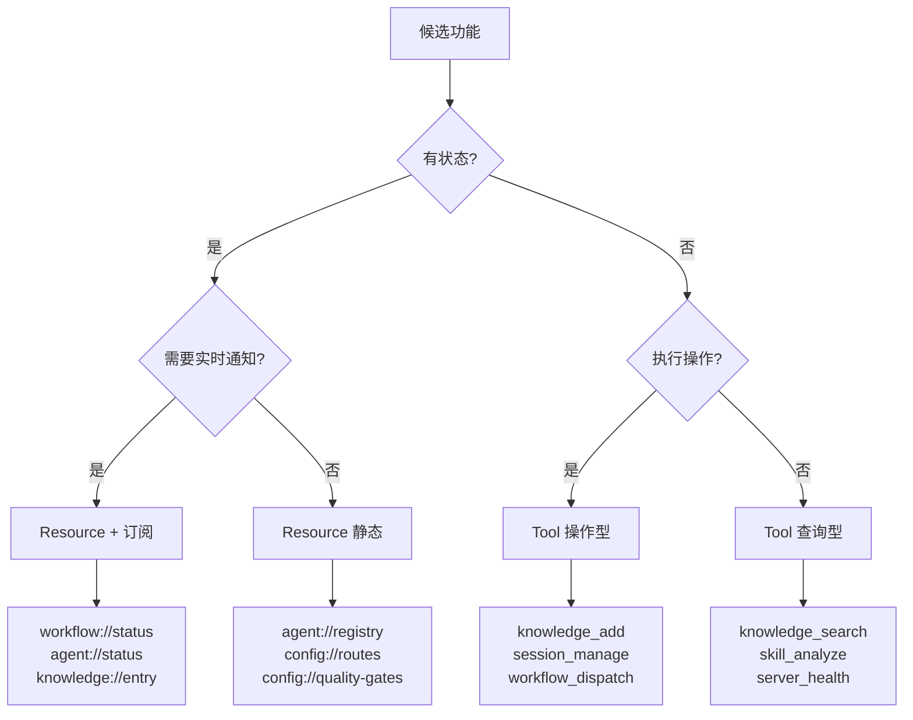
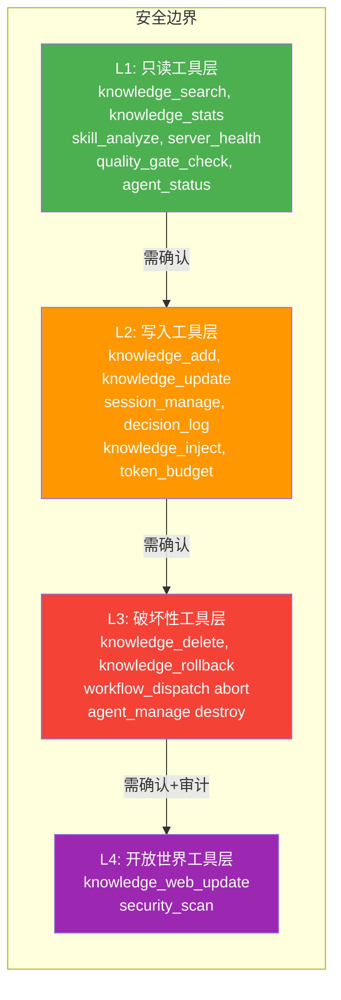
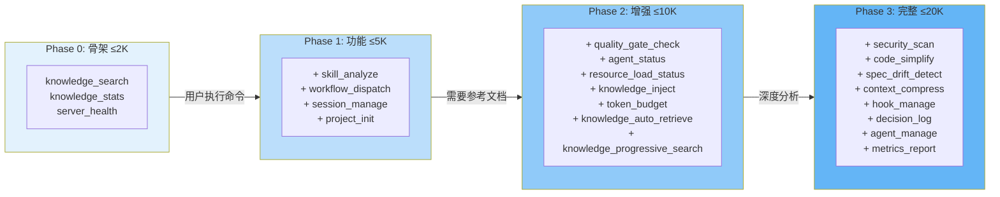
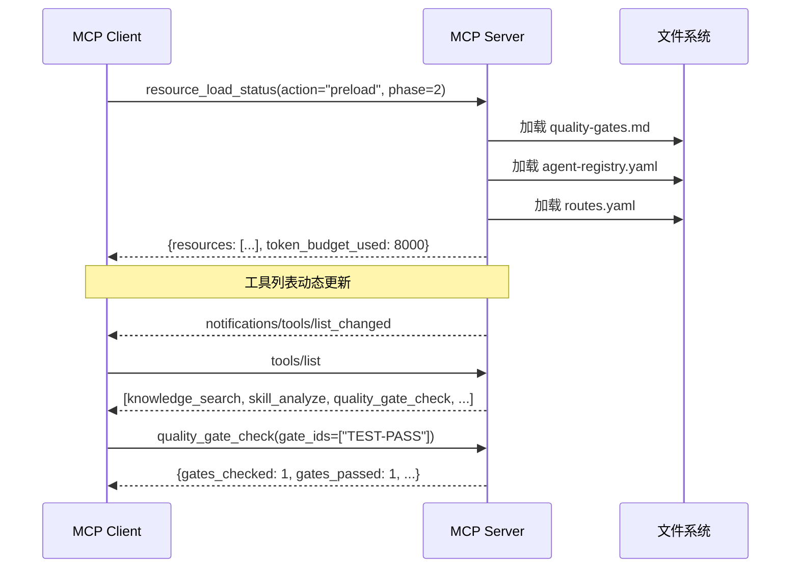
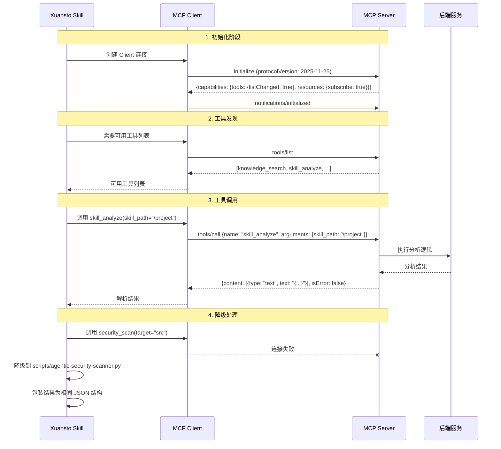
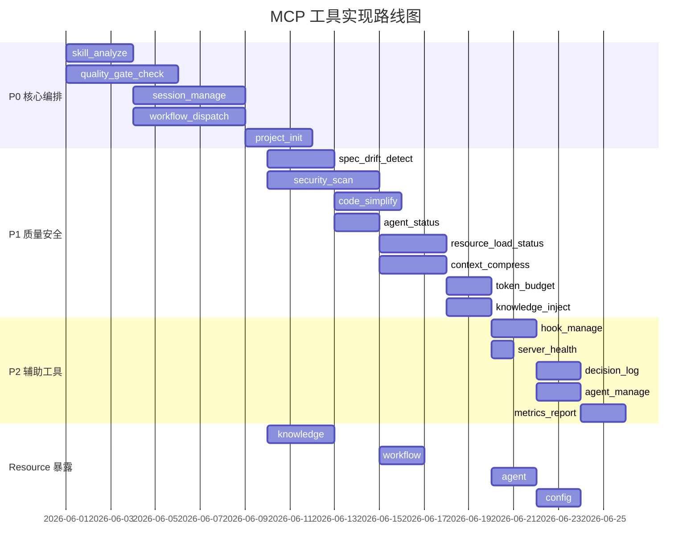

# MCP 综合分析文档 — xuansto-skill-v2

> 版本: 8.0.0 | 日期: 2026-05-24 | 状态: 审查中

---

## 目录

1. [现有 MCP 调用盘点](#1-现有-mcp-调用盘点)
2. [可 MCP 化能力识别](#2-可-mcp-化能力识别)
3. [目标 MCP Server 设计](#3-目标-mcp-server-设计)
4. [mcpServers 配置 JSON 示例](#4-mcpservers-配置-json-示例)
5. [渐进式加载与 MCP 的关联](#5-渐进式加载与-mcp-的关联)
6. [Skill → MCP 交互协议](#6-skill--mcp-交互协议)

---

## 1. 现有 MCP 调用盘点

### 1.1 已实现工具清单

当前 MCP Server（`scripts/knowledge_server/mcp_server.py`）仅实现 **10 个知识库相关工具**：

| # | 工具名 | 类型 | 只读 | 破坏性 | 幂等 | 开放世界 |
|---|--------|------|------|--------|------|----------|
| 1 | `knowledge_search` | 查询 | ✅ | ❌ | ✅ | ❌ |
| 2 | `knowledge_add` | 操作 | ❌ | ❌ | ❌ | ❌ |
| 3 | `knowledge_update` | 操作 | ❌ | ❌ | ❌ | ❌ |
| 4 | `knowledge_delete` | 操作 | ❌ | ✅ | ❌ | ❌ |
| 5 | `knowledge_stats` | 查询 | ✅ | ❌ | ✅ | ❌ |
| 6 | `knowledge_rollback` | 操作 | ❌ | ✅ | ✅ | ❌ |
| 7 | `knowledge_auto_retrieve` | 查询 | ✅ | ❌ | ✅ | ❌ |
| 8 | `knowledge_progressive_search` | 查询 | ✅ | ❌ | ✅ | ❌ |
| 9 | `knowledge_deep_load` | 查询 | ✅ | ❌ | ✅ | ❌ |
| 10 | `knowledge_web_update` | 操作 | ❌ | ❌ | ❌ | ✅ |

### 1.2 声明但未实现工具清单

SKILL.md 声明 **17 个 MCP 工具**，其中 **7 个完全未实现**，另有 **9 个在 mcp-tools.md 有文档但无代码**：

| # | 工具名 | 所在域 | 降级脚本 | 实现优先级 |
|---|--------|--------|----------|------------|
| 1 | `skill_analyze` | 项目分析 | `scripts/skill-test.py --analyze` | P0 |
| 2 | `quality_gate_check` | 质量门禁 | `scripts/skill-test.py --gate` | P0 |
| 3 | `spec_drift_detect` | 规格偏差 | `scripts/spec-drift-detector.py` | P1 |
| 4 | `security_scan` | 安全扫描 | `scripts/agentic-security-scanner.py` | P1 |
| 5 | `code_simplify` | 代码简化 | `scripts/code-simplifier.py` | P1 |
| 6 | `session_manage` | 会话管理 | `scripts/init-session.py` 等 | P0 |
| 7 | `workflow_dispatch` | 工作流调度 | `scripts/project-initializer.py` | P0 |
| 8 | `agent_status` | Agent 状态 | 静态注册表查询 | P1 |
| 9 | `hook_manage` | Hook 管理 | `scripts/check-encoding.py` 等 | P2 |
| 10 | `resource_load_status` | 资源加载 | 内联状态检查 | P1 |
| 11 | `context_compress` | 上下文压缩 | `scripts/context-compressor.py` | P1 |
| 12 | `server_health` | 健康检查 | `scripts/health-checker.py` | P2 |
| 13 | `decision_log` | 决策日志 | `scripts/decision-log.py` | P2 |
| 14 | `token_budget` | Token 预算 | `scripts/token-budget-guard.py` | P1 |
| 15 | `knowledge_inject` | 知识注入 | `scripts/knowledge_server/main.py --inject` | P1 |
| 16 | `project_init` | 项目初始化 | `scripts/project-initializer.py` | P0 |

此外 `references/mcp-tools.md` 还额外文档化了 2 个工具（未出现在 SKILL.md 摘要表中）：

| # | 工具名 | 说明 |
|---|--------|------|
| 17 | `agent_manage` | Agent 实例生命周期管理（从 agent_status 拆分） |
| 18 | `metrics_report` | 工具调用指标查询与汇总 |

### 1.3 实现差距总览


### 1.4 现有资源（Resource）盘点

当前 MCP Server **未暴露任何 Resource**。`list_resources` 和 `list_resource_templates` 处理器未注册。

### 1.5 现有配置

| 配置项 | 文件 | 当前值 | 说明 |
|--------|------|--------|------|
| MCP 协议版本 | `mcp_server.py` | JSON-RPC 2.0 | 通过 `mcp` SDK 实现 |
| 传输层 | `mcp_server.py` | Stdio | `stdio_server()` |
| 工具列表变更通知 | `mcp_server.py` | `listChanged: False` | 静态工具列表 |
| 通信协议 | `configs/default.yaml` | `A2A/v1.1 + mcp_compatible: true` | MCP 兼容模式 |
| 降级策略 | `constraints.yaml` | MCP → 脚本 → 内联 | 三级降级链 |
| Token 预算 | `configs/default.yaml` | 100000 | 默认上限 |

### 1.6 问题清单

| 编号 | 问题 | 严重度 | 说明 |
|------|------|--------|------|
| MCP-01 | 工具实现严重不足 | 🔴 严重 | 声明 17 个工具仅实现 10 个（全部为知识域），8 个核心编排工具完全缺失 |
| MCP-02 | Resource 未暴露 | 🟡 中等 | 知识库条目、项目配置、Agent 注册表等数据未通过 MCP Resource 协议暴露 |
| MCP-03 | Prompt 模板未实现 | 🟡 中等 | MCP Prompt 协议可复用于代码审查、需求澄清等场景，当前未利用 |
| MCP-04 | 工具列表静态 | 🟢 低 | `listChanged: False`，无法动态增减工具 |
| MCP-05 | 降级路径不一致 | 🟡 中等 | 部分工具降级到脚本（如 `skill-test.py`），部分降级到内联逻辑，缺乏统一降级框架 |
| MCP-06 | 错误码未对齐 MCP 规范 | 🟡 中等 | 自定义错误码（-32100~-32106）与 MCP 规范范围一致，但未使用 `isError` 标记区分协议错误与工具执行错误 |
| MCP-07 | 无 Resource 订阅机制 | 🟢 低 | 知识库变更、工作流状态变化无法主动通知客户端 |

---

## 2. 可 MCP 化能力识别

### 2.1 适合封装为 Tool 的功能单元

#### 2.1.1 P0 — 核心编排工具（必须实现）

| 工具名 | 输入 | 输出 | 说明 |
|--------|------|------|------|
| `skill_analyze` | `skill_path: str, include_scripts: bool, include_agents: bool, depth: str` | `{metadata, structure, agents, dependencies, issues}` | 项目结构分析，提取 YAML 元数据、目录结构、Agent 注册表 |
| `quality_gate_check` | `gate_ids: list, phase: int, project_path: str, severity_filter: str, force_refresh: bool` | `{gates_checked, gates_passed, gates_failed, results, can_proceed}` | 54 项质量门禁检查，支持按阶段/ID 过滤 |
| `session_manage` | `action: str, completed_tasks: list, pending_tasks: list, decisions: list, experience: list, ...` | `{action, session_id, state}` | 会话状态管理，支持 save/load/list/detect/verify/track/restore |
| `workflow_dispatch` | `action: str, workflow: str, project_path: str, workflow_id: str, phase_action: str, ...` | `{action, workflow_id, current_phase, phases}` | 工作流调度，支持 start/status/abort/phase/recover/snapshots |
| `project_init` | `action: str, name: str, description: str, stack: list, template: str, directory: str, project_path: str` | `{action, name, directory, config_path, stack}` | 项目初始化，支持 create/validate/detect_stack |

#### 2.1.2 P1 — 质量与安全工具（高优先级）

| 工具名 | 输入 | 输出 | 说明 |
|--------|------|------|------|
| `spec_drift_detect` | `spec_dir: str, src_dir: str` | `{total_specs, drifts_detected, drifts, coverage_pct}` | 规格文档与代码实现偏差检测 |
| `security_scan` | `target: str, severity_threshold: str, include_agentic: bool, include_dependency: bool` | `{total_findings, by_severity, findings, agentic_findings, dependency_findings}` | OWASP Agentic Top 10 + 依赖漏洞扫描 |
| `code_simplify` | `target: str, scope: str, include_dedup: bool` | `{total_suggestions, by_type, suggestions, total_lines_reducible}` | 代码简化分析（死代码/重复/复杂度） |
| `agent_status` | `action: str, phase: int, agent_name: str, ...` | `{action, agents, total_agents, available_count}` | Agent 状态查询，支持 list/by_phase/detail |
| `resource_load_status` | `action: str, phase: int, resource_ids: list, resource_uris: list, priority: str, batch_mode: bool` | `{action, phase, resources, token_budget_used, token_budget_remaining}` | 渐进式加载状态管理 |
| `context_compress` | `content: str, strategy: str, target_tokens: int, preserve_sections: list` | `{original_tokens, compressed_tokens, compression_ratio, compressed_content, quality_score}` | 上下文压缩，支持 semantic/selective/lossless |
| `token_budget` | `action: str, total_budget: int, phase_allocations: dict, project_size: str, complexity: str, ...` | `{total_budget, used, remaining, phase_allocations, usage_by_phase}` | Token 预算管理 |
| `knowledge_inject` | `action: str, content: str, scope: str, source: str, priority: str` | `{action, scope, injected_tokens, source, priority, context_window_usage_pct}` | 知识注入到当前会话上下文 |

#### 2.1.3 P2 — 辅助工具（标准优先级）

| 工具名 | 输入 | 输出 | 说明 |
|--------|------|------|------|
| `hook_manage` | `action: str, profile: str, hook_name: str, context: dict` | `{action, profile, hooks, total_hooks}` | Hook 管理，支持 list/execute |
| `server_health` | — | `{server_status, version, uptime_seconds, tools_available, tools_status, memory_usage_mb}` | 服务器健康检查 |
| `decision_log` | `action: str, title: str, description: str, alternatives: list, decision: str, rationale: str, ...` | `{action, id, entry, total_decisions}` | 决策日志管理 |
| `agent_manage` | `action: str, agent_type: str, capabilities: list, agent_id: str, task: str` | `{action, agent_id, agent_type, capabilities, status}` | Agent 实例生命周期管理 |
| `metrics_report` | `action: str, tool_name: str, time_range: str, metric_type: str` | `{action, tools, total_tools, time_range}` | 工具调用指标查询与汇总 |

### 2.2 适合封装为 Resource 的数据

当前 MCP Server 未暴露任何 Resource。以下数据适合通过 MCP Resource 协议暴露：

| URI 模式 | 描述 | 内容类型 | 订阅价值 | 优先级 |
|----------|------|----------|----------|--------|
| `knowledge://{category}/{entry_id}` | 知识库条目 | `text/markdown` | 高（条目更新通知） | P0 |
| `knowledge://stats` | 知识库统计摘要 | `application/json` | 中（变更检测） | P0 |
| `project://config` | 当前项目配置 | `application/json` | 低 | P1 |
| `project://stack` | 检测到的技术栈 | `application/json` | 低 | P1 |
| `agent://registry` | Agent 注册表（57 个） | `application/json` | 低（静态） | P1 |
| `agent://{agent_name}/status` | 单个 Agent 状态 | `application/json` | 高（状态变化） | P1 |
| `workflow://{workflow_id}/status` | 工作流状态 | `application/json` | 高（阶段推进） | P0 |
| `session://{session_id}` | 会话状态 | `application/json` | 中 | P1 |
| `config://degradation` | 降级策略配置 | `application/json` | 低 | P2 |
| `config://quality-gates` | 质量门禁定义 | `application/json` | 低 | P2 |
| `config://routes` | 命令路由表 | `application/json` | 低 | P2 |
| `metrics://tools` | 工具调用指标 | `application/json` | 中（实时监控） | P2 |

### 2.3 MCP 化决策矩阵



---

## 3. 目标 MCP Server 设计

### 3.1 Server 概览

| 属性 | 值 |
|------|-----|
| Server 名称 | `xuansto-mcp-server` |
| 描述 | 多 Agent 自主开发编排引擎 MCP Server，提供 18+ 原子工具和 12+ 资源 |
| 协议版本 | MCP 2025-11-25 |
| 传输层 | Stdio（本地）/ Streamable HTTP（远程） |
| 最低兼容 | `xuansto-mcp-server >= 4.0.0` |
| API 版本 | 3.0.0 |

### 3.2 Tool 完整列表

#### 3.2.1 知识域工具（已实现，10 个）

| 工具名 | 描述 | 参数 Schema | 返回值 | Annotations |
|--------|------|-------------|--------|-------------|
| `knowledge_search` | 三层知识库混合检索 | `{query: str, top_k: int, search_type: enum, filters: object}` | `{results, total, search_strategy, degradation_level}` | RO, 幂等 |
| `knowledge_add` | 添加知识条目（含去重） | `{content: str, metadata: object, auto_dedup: bool}` | `{id, status, dedup_status, similarity_score}` | 写入 |
| `knowledge_update` | 更新知识条目 | `{id: str, content: str, metadata: object}` | `{id, status}` | 写入 |
| `knowledge_delete` | 删除知识条目 | `{id: str}` | `{id, status}` | 破坏性 |
| `knowledge_stats` | 知识库统计 | `{detailed: bool, since: str}` | `{total_entries, by_scope, embedding, degradation_level}` | RO, 幂等 |
| `knowledge_rollback` | 回滚知识条目版本 | `{id: str, target_version: int}` | `{id, status, target_version, current_version}` | 破坏性, 幂等 |
| `knowledge_auto_retrieve` | 自动检索知识上下文 | `{task_type: enum, project_path: str, query: str, token_budget: int}` | `{context, tech_stack, results_count, degradation_level}` | RO, 幂等 |
| `knowledge_progressive_search` | 渐进式多轮检索 | `{query: str, task_type: enum, tech_stack: object, token_budget: int}` | `{results, total, pruned_entry_ids, degradation_level}` | RO, 幂等 |
| `knowledge_deep_load` | 加载完整知识条目 | `{entry_id: str}` | `{id, title, content, scope, confidence, tags, type, category}` | RO, 幂等 |
| `knowledge_web_update` | 从网络更新知识 | `{entry_id: str, category: str, tags: list}` | `{id, status, sources_found, best_source_rating}` | 开放世界 |

#### 3.2.2 编排域工具（待实现，5 个 P0）

| 工具名 | 描述 | 参数 JSON Schema | 返回值 | Annotations |
|--------|------|------------------|--------|-------------|
| `skill_analyze` | 项目结构分析 | ```json {"type":"object","properties":{"skill_path":{"type":"string","description":"技能根目录路径"},"include_scripts":{"type":"boolean","default":true},"include_agents":{"type":"boolean","default":true},"depth":{"type":"string","enum":["basic","full"],"default":"basic"}},"required":["skill_path"],"additionalProperties":false} ``` | `{metadata, structure, agents, dependencies, issues}` | RO, 幂等 |
| `quality_gate_check` | 54 项质量门禁 | ```json {"type":"object","properties":{"gate_ids":{"type":"array","items":{"type":"string"}},"phase":{"type":"integer","minimum":0,"maximum":8},"project_path":{"type":"string","default":"."},"severity_filter":{"type":"string","enum":["all","BLOCK","WARN"],"default":"all"},"force_refresh":{"type":"boolean","default":false}},"additionalProperties":false} ``` | `{gates_checked, gates_passed, gates_failed, results, can_proceed}` | RO, 幂等 |
| `session_manage` | 会话状态管理 | ```json {"type":"object","properties":{"action":{"type":"string","enum":["save","load","list","detect","verify","track","restore"]},"completed_tasks":{"type":"array","items":{"type":"string"}},"pending_tasks":{"type":"array","items":{"type":"string"}},"decisions":{"type":"array","items":{"type":"object"}},"experience":{"type":"array","items":{"type":"object"}},"current_phase":{"type":"integer"},"current_task":{"type":"string"}},"required":["action"],"additionalProperties":false} ``` | `{action, session_id, state}` | 写入（除 load/list/detect 外） |
| `workflow_dispatch` | 工作流调度 | ```json {"type":"object","properties":{"action":{"type":"string","enum":["start","status","abort","phase","recover","snapshots"]},"workflow":{"type":"string"},"project_path":{"type":"string","default":"."},"workflow_id":{"type":"string"},"phase_action":{"type":"string","enum":["advance","current"]},"snapshot_phase":{"type":"integer"}},"required":["action"],"additionalProperties":false} ``` | `{action, workflow_id, current_phase, phases}` | 写入（start/abort/phase/recover） |
| `project_init` | 项目初始化 | ```json {"type":"object","properties":{"action":{"type":"string","enum":["create","validate","detect_stack"]},"name":{"type":"string"},"description":{"type":"string"},"stack":{"type":"array","items":{"type":"string"}},"template":{"type":"string"},"directory":{"type":"string"},"project_path":{"type":"string"}},"required":["action"],"additionalProperties":false} ``` | `{action, name, directory, config_path, stack}` | 写入（create） |

#### 3.2.3 质量安全域工具（待实现，4 个 P1）

| 工具名 | 描述 | 参数 JSON Schema | 返回值 | Annotations |
|--------|------|------------------|--------|-------------|
| `spec_drift_detect` | 规格偏差检测 | ```json {"type":"object","properties":{"spec_dir":{"type":"string","default":".trae/specs"},"src_dir":{"type":"string","default":"."}},"additionalProperties":false} ``` | `{total_specs, drifts_detected, drifts, coverage_pct}` | RO, 幂等 |
| `security_scan` | 安全扫描 | ```json {"type":"object","properties":{"target":{"type":"string","default":"."},"severity_threshold":{"type":"string","enum":["critical","high","medium","low"],"default":"medium"},"include_agentic":{"type":"boolean","default":true},"include_dependency":{"type":"boolean","default":true}},"additionalProperties":false} ``` | `{total_findings, by_severity, findings}` | RO, 幂等 |
| `code_simplify` | 代码简化分析 | ```json {"type":"object","properties":{"target":{"type":"string"},"scope":{"type":"string","enum":["file","dir","recent"],"default":"recent"},"include_dedup":{"type":"boolean","default":true}},"required":["target"],"additionalProperties":false} ``` | `{total_suggestions, by_type, suggestions, total_lines_reducible}` | RO, 幂等 |
| `agent_status` | Agent 状态查询 | ```json {"type":"object","properties":{"action":{"type":"string","enum":["list","by_phase","detail"]},"phase":{"type":"integer","minimum":0,"maximum":8},"agent_name":{"type":"string"}},"required":["action"],"additionalProperties":false} ``` | `{action, agents, total_agents, available_count}` | RO, 幂等 |

#### 3.2.4 资源管理域工具（待实现，4 个 P1）

| 工具名 | 描述 | 参数 JSON Schema | 返回值 | Annotations |
|--------|------|------------------|--------|-------------|
| `resource_load_status` | 渐进式加载状态 | ```json {"type":"object","properties":{"action":{"type":"string","enum":["status","preload","cache","clear_cache","loading_progress"]},"phase":{"type":"integer","minimum":0,"maximum":8},"resource_ids":{"type":"array","items":{"type":"string"}},"resource_uris":{"type":"array","items":{"type":"string"}},"priority":{"type":"string","enum":["critical","normal","background"],"default":"normal"},"batch_mode":{"type":"boolean","default":false}},"required":["action"],"additionalProperties":false} ``` | `{action, phase, resources, token_budget_used, token_budget_remaining}` | 写入（preload/cache/clear） |
| `context_compress` | 上下文压缩 | ```json {"type":"object","properties":{"content":{"type":"string"},"strategy":{"type":"string","enum":["semantic","selective","lossless"],"default":"semantic"},"target_tokens":{"type":"integer","default":2000,"minimum":100,"maximum":50000},"preserve_sections":{"type":"array","items":{"type":"string"}}},"required":["content"],"additionalProperties":false} ``` | `{original_tokens, compressed_tokens, compression_ratio, compressed_content, quality_score}` | RO |
| `token_budget` | Token 预算管理 | ```json {"type":"object","properties":{"action":{"type":"string","enum":["status","set_budget","recommend","report"]},"total_budget":{"type":"integer","minimum":1000},"phase_allocations":{"type":"object"},"project_size":{"type":"string","enum":["small","medium","large"]},"complexity":{"type":"string","enum":["low","medium","high"]},"period":{"type":"string","enum":["daily","weekly","session"],"default":"session"}},"required":["action"],"additionalProperties":false} ``` | `{total_budget, used, remaining, phase_allocations}` | 写入（set_budget） |
| `knowledge_inject` | 知识注入 | ```json {"type":"object","properties":{"action":{"type":"string","enum":["inject","preview","clear"]},"content":{"type":"string"},"scope":{"type":"string","enum":["session","workflow","global"],"default":"session"},"source":{"type":"string"},"priority":{"type":"string","enum":["low","normal","high"],"default":"normal"}},"required":["action"],"additionalProperties":false} ``` | `{action, scope, injected_tokens, context_window_usage_pct}` | 写入（inject/clear） |

#### 3.2.5 辅助域工具（待实现，5 个 P2）

| 工具名 | 描述 | 参数 JSON Schema | 返回值 | Annotations |
|--------|------|------------------|--------|-------------|
| `hook_manage` | Hook 管理 | ```json {"type":"object","properties":{"action":{"type":"string","enum":["list","execute"]},"profile":{"type":"string","enum":["minimal","standard","strict"],"default":"standard"},"hook_name":{"type":"string"},"context":{"type":"object"}},"required":["action"],"additionalProperties":false} ``` | `{action, profile, hooks, total_hooks}` | 写入（execute） |
| `server_health` | 服务器健康检查 | ```json {"type":"object","properties":{},"additionalProperties":false} ``` | `{server_status, version, tools_available, tools_status, memory_usage_mb}` | RO, 幂等 |
| `decision_log` | 决策日志 | ```json {"type":"object","properties":{"action":{"type":"string","enum":["log","query","export"]},"title":{"type":"string"},"decision":{"type":"string"},"rationale":{"type":"string"},"keyword":{"type":"string"},"format":{"type":"string","enum":["json","markdown"],"default":"json"}},"required":["action"],"additionalProperties":false} ``` | `{action, id, entry, total_decisions}` | 写入（log） |
| `agent_manage` | Agent 实例管理 | ```json {"type":"object","properties":{"action":{"type":"string","enum":["create","assign","release","instance_status","destroy","schedule"]},"agent_type":{"type":"string"},"capabilities":{"type":"array","items":{"type":"string"}},"agent_id":{"type":"string"},"task":{"type":"string"}},"required":["action"],"additionalProperties":false} ``` | `{action, agent_id, agent_type, status}` | 写入 |
| `metrics_report` | 指标报告 | ```json {"type":"object","properties":{"action":{"type":"string","enum":["query","summary"]},"tool_name":{"type":"string"},"time_range":{"type":"string","enum":["1h","6h","24h","7d","all"],"default":"all"},"metric_type":{"type":"string","enum":["calls","errors","latency","all"],"default":"all"}},"required":["action"],"additionalProperties":false} ``` | `{action, tools, total_tools, time_range}` | RO, 幂等 |

### 3.3 Resource 列表

| URI | 描述 | 内容类型 | 可订阅 | 实现优先级 |
|-----|------|----------|--------|------------|
| `knowledge://stats` | 知识库统计摘要 | `application/json` | ✅ | P0 |
| `knowledge://{category}/{entry_id}` | 知识库条目 | `text/markdown` | ✅ | P0 |
| `workflow://{workflow_id}/status` | 工作流状态 | `application/json` | ✅ | P0 |
| `project://config` | 项目配置 | `application/json` | ❌ | P1 |
| `project://stack` | 技术栈检测结果 | `application/json` | ❌ | P1 |
| `agent://registry` | Agent 注册表 | `application/json` | ❌ | P1 |
| `agent://{agent_name}/status` | Agent 状态 | `application/json` | ✅ | P1 |
| `session://{session_id}` | 会话状态 | `application/json` | ✅ | P1 |
| `config://degradation` | 降级策略 | `application/json` | ❌ | P2 |
| `config://quality-gates` | 质量门禁定义 | `application/json` | ❌ | P2 |
| `config://routes` | 命令路由表 | `application/json` | ❌ | P2 |
| `metrics://tools` | 工具调用指标 | `application/json` | ✅ | P2 |

### 3.4 权限与安全边界



| 安全层级 | 工具 | 约束 |
|----------|------|------|
| 只读（L1） | `knowledge_search`, `knowledge_stats`, `skill_analyze`, `server_health`, `quality_gate_check`, `agent_status`, `spec_drift_detect`, `code_simplify`, `metrics_report`, `context_compress`, `resource_load_status(status)` | 无需确认，自由调用 |
| 写入（L2） | `knowledge_add`, `knowledge_update`, `session_manage(save/track)`, `decision_log(log)`, `knowledge_inject(inject)`, `token_budget(set_budget)`, `workflow_dispatch(start/phase)`, `project_init(create)`, `resource_load_status(preload)` | `readOnlyHint: false`，客户端可要求确认 |
| 破坏性（L3） | `knowledge_delete`, `knowledge_rollback`, `workflow_dispatch(abort)`, `agent_manage(destroy)`, `session_manage(restore)` | `destructiveHint: true`，必须用户确认 |
| 开放世界（L4） | `knowledge_web_update`, `security_scan` | `openWorldHint: true`，需网络权限 + 审计日志 |

---

## 4. mcpServers 配置 JSON 示例

### 4.1 Stdio 方式（本地，推荐）

```json
{
  "mcpServers": {
    "xuansto-mcp-server": {
      "command": "uvx",
      "args": [
        "xuansto-mcp-server",
        "--db-path", "${KNOWLEDGE_DB_PATH:-.knowledge/knowledge.db}",
        "--log-level", "info"
      ],
      "env": {
        "KNOWLEDGE_DB_PATH": ".knowledge/knowledge.db",
        "CHROMA_PERSIST_DIR": ".knowledge/chroma",
        "XUANSTO_SKILL_PATH": ".trae/skills/xuansto-skill-v2",
        "LOG_LEVEL": "info"
      }
    }
  }
}
```

### 4.2 npx 方式（Node.js 封装）

```json
{
  "mcpServers": {
    "xuansto-mcp-server": {
      "command": "npx",
      "args": [
        "-y",
        "@xuansto/mcp-server",
        "--transport", "stdio",
        "--db-path", ".knowledge/knowledge.db"
      ],
      "env": {
        "CHROMA_PERSIST_DIR": ".knowledge/chroma",
        "XUANSTO_SKILL_PATH": ".trae/skills/xuansto-skill-v2"
      }
    }
  }
}
```

### 4.3 Streamable HTTP 方式（远程）

```json
{
  "mcpServers": {
    "xuansto-mcp-server-remote": {
      "url": "https://xuansto-mcp.example.com/mcp",
      "headers": {
        "Authorization": "Bearer ${XUANSTO_MCP_TOKEN}",
        "MCP-Protocol-Version": "2025-11-25"
      }
    }
  }
}
```

### 4.4 Python 直接运行方式（开发调试）

```json
{
  "mcpServers": {
    "xuansto-mcp-server-dev": {
      "command": "python",
      "args": [
        "-m",
        "knowledge_server.main",
        "--mcp",
        "--db-path", ".knowledge/knowledge.db"
      ],
      "env": {
        "PYTHONPATH": ".trae/skills/xuansto-skill-v2/scripts",
        "KNOWLEDGE_DB_PATH": ".knowledge/knowledge.db",
        "LOG_LEVEL": "debug"
      }
    }
  }
}
```

---

## 5. 渐进式加载与 MCP 的关联

### 5.1 渐进式加载阶段与 MCP 工具映射

`constraints.yaml` 定义了 4 个渐进式加载阶段，每个阶段对应不同的 MCP 工具可用性：



### 5.2 各阶段工具可用性矩阵

| 工具 | Phase 0 | Phase 1 | Phase 2 | Phase 3 |
|------|---------|---------|---------|---------|
| `knowledge_search` | ✅ | ✅ | ✅ | ✅ |
| `knowledge_stats` | ✅ | ✅ | ✅ | ✅ |
| `server_health` | ✅ | ✅ | ✅ | ✅ |
| `skill_analyze` | ❌ | ✅ | ✅ | ✅ |
| `workflow_dispatch` | ❌ | ✅ | ✅ | ✅ |
| `session_manage` | ❌ | ✅ | ✅ | ✅ |
| `project_init` | ❌ | ✅ | ✅ | ✅ |
| `quality_gate_check` | ❌ | ❌ | ✅ | ✅ |
| `agent_status` | ❌ | ❌ | ✅ | ✅ |
| `resource_load_status` | ❌ | ❌ | ✅ | ✅ |
| `knowledge_inject` | ❌ | ❌ | ✅ | ✅ |
| `token_budget` | ❌ | ❌ | ✅ | ✅ |
| `knowledge_auto_retrieve` | ❌ | ❌ | ✅ | ✅ |
| `knowledge_progressive_search` | ❌ | ❌ | ✅ | ✅ |
| `security_scan` | ❌ | ❌ | ❌ | ✅ |
| `code_simplify` | ❌ | ❌ | ❌ | ✅ |
| `spec_drift_detect` | ❌ | ❌ | ❌ | ✅ |
| `context_compress` | ❌ | ❌ | ❌ | ✅ |
| `hook_manage` | ❌ | ❌ | ❌ | ✅ |
| `decision_log` | ❌ | ❌ | ❌ | ✅ |
| `agent_manage` | ❌ | ❌ | ❌ | ✅ |
| `metrics_report` | ❌ | ❌ | ❌ | ✅ |

### 5.3 工具负责加载，暴露状态/通知

MCP 工具在渐进式加载中承担双重角色：

1. **加载触发器**：`resource_load_status(action="preload", phase=N)` 触发指定阶段的资源加载
2. **状态暴露器**：`resource_load_status(action="status")` 返回当前加载状态，`resource_load_status(action="loading_progress")` 返回加载进度



### 5.4 降级与渐进式加载的协同

| 场景 | MCP 可用 | MCP 不可用 |
|------|----------|------------|
| Phase 0 | `knowledge_search` → MCP 调用 | `knowledge_search` → SQLite FTS5 本地查询 |
| Phase 1 | `skill_analyze` → MCP 调用 | `skill_analyze` → `scripts/skill-test.py --analyze` |
| Phase 2 | `quality_gate_check` → MCP 调用 | `quality_gate_check` → `scripts/skill-test.py --gate` |
| Phase 3 | `security_scan` → MCP 调用 | `security_scan` → `scripts/agentic-security-scanner.py` |

降级策略遵循 `constraints.yaml` 中 `degradation.tool_fallbacks` 定义的映射表，确保 MCP 不可用时功能不中断。

---

## 6. Skill → MCP 交互协议

### 6.1 调用方式

Skill 通过 MCP Client 调用 MCP Server 的工具，遵循以下流程：



### 6.2 参数传递规范

| 传递方向 | 格式 | 示例 |
|----------|------|------|
| Skill → MCP Client | Python dict / JSON | `{"skill_path": "/project", "depth": "full"}` |
| MCP Client → MCP Server | JSON-RPC 2.0 | `{"jsonrpc": "2.0", "method": "tools/call", "params": {"name": "skill_analyze", "arguments": {...}}}` |
| MCP Server → MCP Client | MCP Result | `{"content": [{"type": "text", "text": "{...}"}], "isError": false}` |
| MCP Client → Skill | Python dict | `{"status": "success", "data": {...}, "metadata": {...}}` |

### 6.3 结果处理流程

```mermaid
flowchart TD
    A[收到 MCP 响应] --> B{isError?}
    B -->|true| C{错误类型}
    B -->|false| D[解析 content[0].text]
    
    C -->|协议错误| E[记录日志 + 抛出异常]
    C -->|工具执行错误| F{可重试?}
    
    F -->|是| G{重试次数 < 3?}
    G -->|是| H[指数退避重试]
    G -->|否| I[降级到脚本调用]
    
    F -->|否| J[返回错误信息给 Skill]
    
    D --> K{status 字段?}
    K -->|success| L[提取 data 字段返回]
    K -->|error| M[提取 error 字段处理]
    K -->|无 status| N[直接返回原始数据]
    
    I --> O[包装为统一 JSON 结构]
    O --> L
    
    style A fill:#E3F2FD
    style L fill:#4CAF50,color:#fff
    style E fill:#F44336,color:#fff
    style I fill:#FF9800,color:#fff
```

### 6.4 统一响应格式

无论通过 MCP 调用还是脚本降级，Skill 层面收到的响应格式保持一致：

```json
{
  "status": "success | error | degraded",
  "data": {
    "...": "工具特定返回值"
  },
  "metadata": {
    "tool": "工具名称",
    "latency_ms": 234,
    "degraded": false,
    "fallback_used": null
  },
  "error": {
    "code": "ERROR_CODE",
    "message": "错误描述",
    "details": {},
    "retryable": false
  }
}
```

### 6.5 命令→MCP 工具链映射

基于 `commands/routes.yaml`，每个命令对应一组 MCP 工具链：

| 命令 | MCP 工具链 | 降级策略 |
|------|------------|----------|
| `/init` | `skill_analyze` → `knowledge_search` → `workflow_dispatch` → `project_init` → `decision_log` | 知识检索降级链 + 内联模板 |
| `/plan` | `skill_analyze` → `knowledge_search` → `agent_status` → `workflow_dispatch` → `decision_log` → `token_budget` | 基础扫描 + 降级链 + 内联记录 |
| `/implement` | `workflow_dispatch` → `quality_gate_check` → `hook_manage` | 门禁阻止 + 修复建议 |
| `/review` | `quality_gate_check` → `security_scan` → `code_simplify` | 安全扫描内嵌降级 + 代码简化内嵌降级 |
| `/audit` | `security_scan` → `quality_gate_check` → `spec_drift_detect` | 内嵌 agentic + dependency 扫描 |
| `/simplify` | `code_simplify` → `quality_gate_check` → `context_compress` | 内嵌 simplify + dedup + 脚本降级 |
| `/loop` | `workflow_dispatch` → `session_manage` → `resource_load_status` → `token_budget` → `decision_log` | 三步降级: MCP 完整 → MCP 简化 → 脚本 |
| `/sprint` | `workflow_dispatch` → `session_manage` → `resource_load_status` → `token_budget` → `project_init` | 快速工作流 → 精简 Phase |
| `/status` | `workflow_dispatch` → `session_manage` → `server_health` | 持久化文件读取 |

### 6.6 错误处理与重试策略

| 错误类型 | MCP 错误码 | 处理策略 |
|----------|------------|----------|
| 参数验证失败 | -32602 (InvalidParams) | 修正参数后重试，不降级 |
| 工具不存在 | -32601 (MethodNotFound) | 降级到脚本调用 |
| 服务器内部错误 | -32603 (InternalError) | 指数退避重试 3 次，仍失败则降级 |
| 连接超时 | 传输层错误 | 重试 1 次，失败降级 |
| 工具执行错误 | `isError: true` | 根据 `retryable` 字段决定重试或降级 |
| 降级脚本失败 | — | 返回降级错误，Skill 层面使用最小功能集继续 |

---

## 附录 A: 实现路线图



## 附录 B: 问题追踪

| 编号 | 问题 | 严重度 | 状态 | 修复建议 |
|------|------|--------|------|----------|
| MCP-01 | 工具实现严重不足（17 声明 / 10 实现） | 🔴 严重 | 待修复 | 按 P0→P1→P2 优先级逐步实现 |
| MCP-02 | Resource 未暴露 | 🟡 中等 | 待修复 | 优先暴露 `knowledge://` 和 `workflow://` 资源 |
| MCP-03 | Prompt 模板未实现 | 🟡 中等 | 待评估 | 评估代码审查/需求澄清 Prompt 的 MCP 化价值 |
| MCP-04 | 工具列表静态（`listChanged: False`） | 🟢 低 | 待修复 | 渐进式加载阶段切换时发送 `notifications/tools/list_changed` |
| MCP-05 | 降级路径不一致 | 🟡 中等 | 待修复 | 统一降级框架：MCP → 脚本 → 内联，脚本路径从 `constraints.yaml` 读取 |
| MCP-06 | 错误码未对齐 MCP 规范 | 🟡 中等 | 待修复 | 工具执行错误使用 `isError: true` 返回，协议错误使用 JSON-RPC error |
| MCP-07 | 无 Resource 订阅机制 | 🟢 低 | 待评估 | 知识库变更/工作流状态变化场景评估后决定是否实现 |
