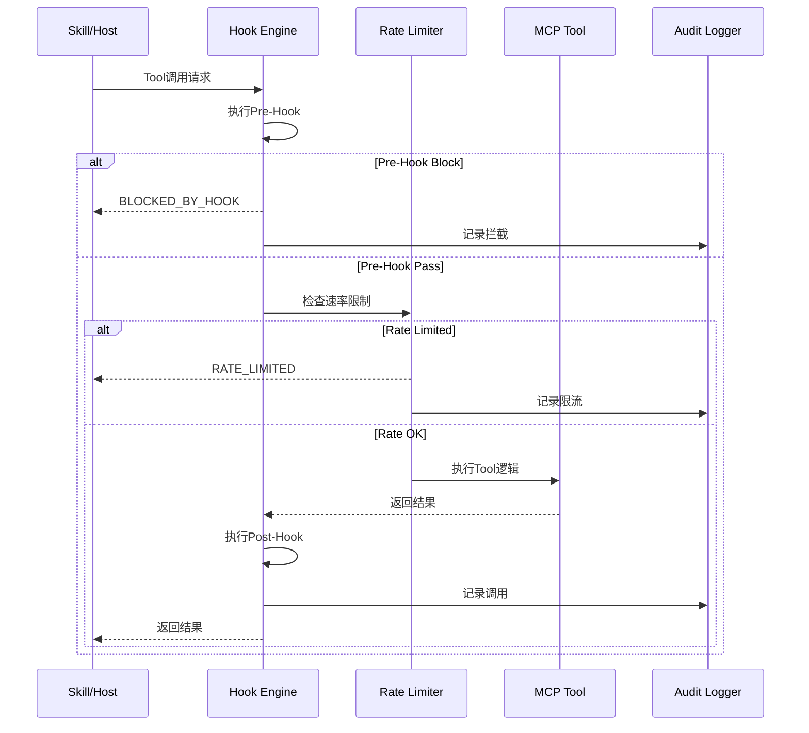
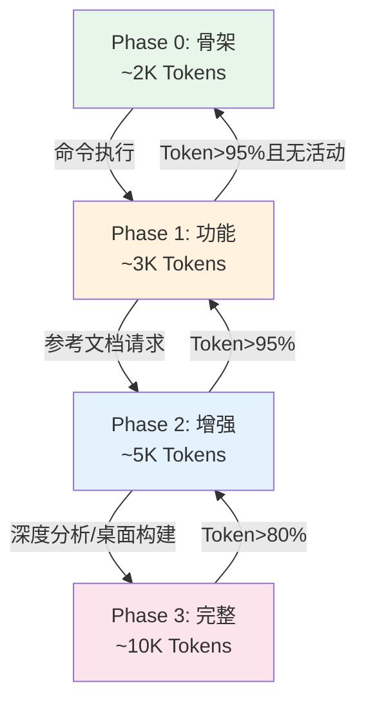
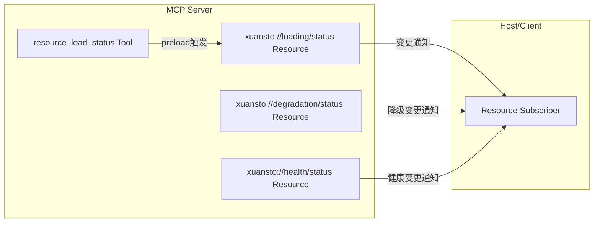
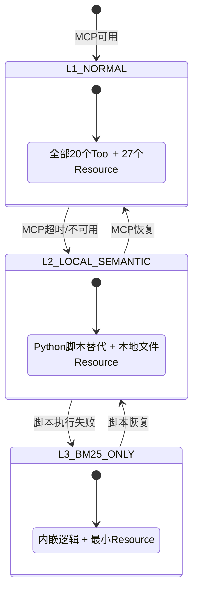
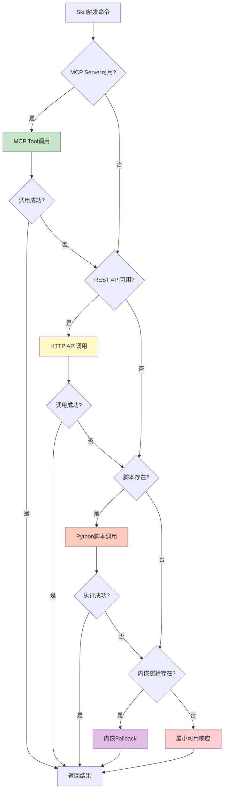
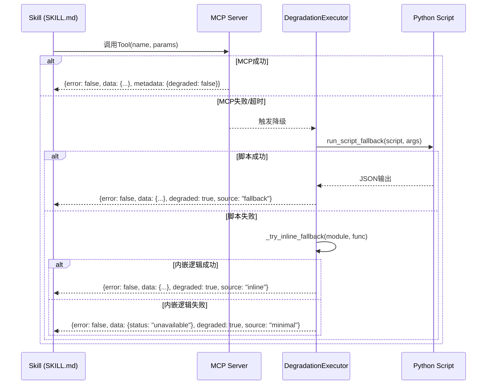

# MCP 架构评审文档

> 版本: 1.0.0 | 日期: 2026-05-26 | 编码: UTF-8 | 行尾: LF

本文档对 xuansto-skill-v2 项目的 MCP（Model Context Protocol）集成架构进行全面评审，涵盖现有调用盘点、可MCP化能力识别、目标Server设计、配置规范、渐进式加载关联及Skill→MCP交互协议。

---

## 目录

- [1. 现有MCP调用盘点](#1-现有mcp调用盘点)
- [2. 可MCP化能力识别](#2-可mcp化能力识别)
- [3. 目标MCP Server设计](#3-目标mcp-server设计)
- [4. mcpServers 配置JSON示例](#4-mcpservers-配置json示例)
- [5. 渐进式加载与MCP关联](#5-渐进式加载与mcp关联)
- [6. Skill→MCP交互协议](#6-skillmcp交互协议)

---

## 1. 现有MCP调用盘点

### 1.1 MCP Server 概览

| 属性 | 值 |
|------|-----|
| Server名称 | `xuansto-mcp-server` |
| 版本 | v8.4.0 |
| 包路径 | `xuansto-mcp-server/` |
| 入口文件 | [server.py](file:///c:/Users/86156/.trae-cn/worktrees/skiller/feat-develop-main-branch-H3MhdQ/xuansto-mcp-server/src/xuansto_mcp/server.py) |
| 构建配置 | [pyproject.toml](file:///c:/Users/86156/.trae-cn/worktrees/skiller/feat-develop-main-branch-H3MhdQ/xuansto-mcp-server/pyproject.toml) |
| 传输协议 | stdio（默认）+ streamable-http（通过 `XUANSTO_TRANSPORT` 环境变量切换） |
| 框架依赖 | `mcp[cli]>=1.0.0`, `pydantic>=2.0.0`, `pyyaml>=6.0` |
| 可选依赖 | `chromadb>=0.4.0`, `fastapi>=0.100.0`, `uvicorn>=0.20.0` |

### 1.2 20个MCP Tool盘点

所有Tool实现位于 `xuansto-mcp-server/src/xuansto_mcp/tools/` 目录，每个Tool为独立Python模块，通过 `register(mcp)` 函数注册到FastMCP实例。

| # | Tool名称 | 源文件 | 核心功能 | 降级脚本 |
|---|---------|--------|---------|---------|
| 1 | `skill_analyze` | [skill_analyze.py](file:///c:/Users/86156/.trae-cn/worktrees/skiller/feat-develop-main-branch-H3MhdQ/xuansto-mcp-server/src/xuansto_mcp/tools/skill_analyze.py) | 技能项目结构分析、YAML元数据提取 | `scripts/skill-test.py --analyze` |
| 2 | `knowledge_search` | [knowledge_search.py](file:///c:/Users/86156/.trae-cn/worktrees/skiller/feat-develop-main-branch-H3MhdQ/xuansto-mcp-server/src/xuansto_mcp/tools/knowledge_search.py) | 三层知识库混合检索（retrieve/inject/precipitate） | `scripts/knowledge-server.py --search` |
| 3 | `knowledge_inject` | [knowledge_inject.py](file:///c:/Users/86156/.trae-cn/worktrees/skiller/feat-develop-main-branch-H3MhdQ/xuansto-mcp-server/src/xuansto_mcp/tools/knowledge_inject.py) | 知识内容注入到会话上下文 | `scripts/knowledge_server/main.py --inject` |
| 4 | `quality_gate_check` | [quality_gate_check.py](file:///c:/Users/86156/.trae-cn/worktrees/skiller/feat-develop-main-branch-H3MhdQ/xuansto-mcp-server/src/xuansto_mcp/tools/quality_gate_check.py) | 54项质量门禁检查 | `scripts/skill-test.py --gate` |
| 5 | `spec_drift_detect` | [spec_drift_detect.py](file:///c:/Users/86156/.trae-cn/worktrees/skiller/feat-develop-main-branch-H3MhdQ/xuansto-mcp-server/src/xuansto_mcp/tools/spec_drift_detect.py) | 规格文档与代码实现偏差检测 | `scripts/spec-drift-detector.py` |
| 6 | `security_scan` | [security_scan.py](file:///c:/Users/86156/.trae-cn/worktrees/skiller/feat-develop-main-branch-H3MhdQ/xuansto-mcp-server/src/xuansto_mcp/tools/security_scan.py) | OWASP Agentic Top 10 + 依赖漏洞扫描 | `scripts/agentic-security-scanner.py` |
| 7 | `code_simplify` | [code_simplify.py](file:///c:/Users/86156/.trae-cn/worktrees/skiller/feat-develop-main-branch-H3MhdQ/xuansto-mcp-server/src/xuansto_mcp/tools/code_simplify.py) | 代码简化分析（死代码/重复/复杂度） | `scripts/code-simplifier.py` |
| 8 | `session_manage` | [session_manage.py](file:///c:/Users/86156/.trae-cn/worktrees/skiller/feat-develop-main-branch-H3MhdQ/xuansto-mcp-server/src/xuansto_mcp/tools/session_manage.py) | 会话状态管理（save/load/list/detect/verify/track/restore） | `scripts/init-session.py` / `session-catchup.py` / `session-persist.py` |
| 9 | `workflow_dispatch` | [workflow_dispatch.py](file:///c:/Users/86156/.trae-cn/worktrees/skiller/feat-develop-main-branch-H3MhdQ/xuansto-mcp-server/src/xuansto_mcp/tools/workflow_dispatch.py) | 工作流调度（start/status/abort/phase/recover/snapshots） | `scripts/project-initializer.py` |
| 10 | `agent_status` | [agent_status.py](file:///c:/Users/86156/.trae-cn/worktrees/skiller/feat-develop-main-branch-H3MhdQ/xuansto-mcp-server/src/xuansto_mcp/tools/agent_status.py) | Agent状态查询（list/by_phase/detail/create/match/assign/release） | 静态注册表查询 |
| 11 | `agent_manage` | [agent_manage.py](file:///c:/Users/86156/.trae-cn/worktrees/skiller/feat-develop-main-branch-H3MhdQ/xuansto-mcp-server/src/xuansto_mcp/tools/agent_manage.py) | Agent实例生命周期管理（create/assign/release/destroy/schedule） | 内联管理 |
| 12 | `hook_manage` | [hook_manage.py](file:///c:/Users/86156/.trae-cn/worktrees/skiller/feat-develop-main-branch-H3MhdQ/xuansto-mcp-server/src/xuansto_mcp/tools/hook_manage.py) | Hook管理（list/execute） | `scripts/check-encoding.py` / `token-budget-guard.py` |
| 13 | `resource_load_status` | [resource_load_status.py](file:///c:/Users/86156/.trae-cn/worktrees/skiller/feat-develop-main-branch-H3MhdQ/xuansto-mcp-server/src/xuansto_mcp/tools/resource_load_status.py) | 渐进式加载状态管理（status/preload/cache/clear_cache/loading_progress） | 内联状态检查 |
| 14 | `context_compress` | [context_compress.py](file:///c:/Users/86156/.trae-cn/worktrees/skiller/feat-develop-main-branch-H3MhdQ/xuansto-mcp-server/src/xuansto_mcp/tools/context_compress.py) | 上下文压缩（semantic/selective/lossless） | `scripts/context-compressor.py` |
| 15 | `server_health` | [server_health.py](file:///c:/Users/86156/.trae-cn/worktrees/skiller/feat-develop-main-branch-H3MhdQ/xuansto-mcp-server/src/xuansto_mcp/tools/server_health.py) | 服务器健康检查与版本兼容性验证 | `scripts/health-checker.py` |
| 16 | `decision_log` | [decision_log.py](file:///c:/Users/86156/.trae-cn/worktrees/skiller/feat-develop-main-branch-H3MhdQ/xuansto-mcp-server/src/xuansto_mcp/tools/decision_log.py) | 决策日志管理（log/query/export） | `scripts/decision-log.py` |
| 17 | `token_budget` | [token_budget.py](file:///c:/Users/86156/.trae-cn/worktrees/skiller/feat-develop-main-branch-H3MhdQ/xuansto-mcp-server/src/xuansto_mcp/tools/token_budget.py) | Token预算管理（status/set_budget/recommend/report） | `scripts/token-budget-guard.py` |
| 18 | `project_init` | [project_init.py](file:///c:/Users/86156/.trae-cn/worktrees/skiller/feat-develop-main-branch-H3MhdQ/xuansto-mcp-server/src/xuansto_mcp/tools/project_init.py) | 项目初始化（create/validate/detect_stack） | `scripts/project-initializer.py` |
| 19 | `metrics_report` | [metrics_report.py](file:///c:/Users/86156/.trae-cn/worktrees/skiller/feat-develop-main-branch-H3MhdQ/xuansto-mcp-server/src/xuansto_mcp/tools/metrics_report.py) | 指标报告（query/summary） | 内联指标读取 |
| 20 | `config_manage` | [config_manage.py](file:///c:/Users/86156/.trae-cn/worktrees/skiller/feat-develop-main-branch-H3MhdQ/xuansto-mcp-server/src/xuansto_mcp/tools/config_manage.py) | 配置管理（reload/status/validate） | 内联配置管理 |

### 1.3 25+ MCP Resource盘点

所有Resource实现位于 [skill_resources.py](file:///c:/Users/86156/.trae-cn/worktrees/skiller/feat-develop-main-branch-H3MhdQ/xuansto-mcp-server/src/xuansto_mcp/resources/skill_resources.py)，通过 `register(mcp)` 函数注册。

| # | URI模式 | 类型 | 内容描述 | 加载Phase |
|---|---------|------|---------|-----------|
| 1 | `xuansto://config/skill` | 静态 | Skill配置文件(.skill-config.yaml) | Phase 0+ |
| 2 | `xuansto://references/quality-gates` | 静态 | 质量门禁定义文档 | Phase 2+ |
| 3 | `xuansto://references/agent-registry` | 静态 | Agent注册表文档 | Phase 2+ |
| 4 | `xuansto://references/workflow-phases` | 静态 | 工作流阶段定义文档 | Phase 1+ |
| 5 | `xuansto://templates/{name}` | 模板 | 按名称加载模板文件 | Phase 2+ |
| 6 | `xuansto://sessions/latest` | 静态 | 最近会话记录 | Phase 0+ |
| 7 | `xuansto://sessions/{session_id}` | 模板 | 按ID加载会话记录 | Phase 0+ |
| 8 | `xuansto://agents/{name}` | 模板 | 按名称加载Agent定义 | Phase 2+ |
| 9 | `xuansto://agents/{layer}/{name}` | 模板 | 按层级+名称加载Agent定义 | Phase 2+ |
| 10 | `xuansto://loading/status` | 静态 | 渐进式加载状态JSON | Phase 0+ |
| 11 | `xuansto://metrics/summary` | 静态 | 工具调用指标汇总 | Phase 1+ |
| 12 | `xuansto://degradation/status` | 静态 | 降级状态JSON | Phase 0+ |
| 13 | `xuansto://skill/config` | 静态 | Skill统一配置（与#1同源） | Phase 0+ |
| 14 | `xuansto://skill/constraints` | 静态 | Skill约束配置 | Phase 0+ |
| 15 | `xuansto://agents/registry` | 静态 | Agent注册表（结构化JSON） | Phase 2+ |
| 16 | `xuansto://gates/definitions` | 静态 | 质量门禁定义（结构化） | Phase 2+ |
| 17 | `xuansto://workflows/definitions` | 静态 | 工作流定义列表 | Phase 1+ |
| 18 | `xuansto://hooks/definitions` | 静态 | Hook定义配置 | Phase 1+ |
| 19 | `xuansto://knowledge/status` | 静态 | 知识库状态（DB/ChromaDB存在性+条目数） | Phase 2+ |
| 20 | `xuansto://knowledge/stats` | 静态 | 知识库统计（含scope分组统计） | Phase 2+ |
| 21 | `xuansto://templates/index` | 静态 | 模板文件索引列表 | Phase 2+ |
| 22 | `xuansto://commands/routes` | 静态 | 命令路由列表 | Phase 0+ |
| 23 | `xuansto://session/state` | 静态 | 当前会话状态（数据库持久化） | Phase 0+ |
| 24 | `xuansto://health/status` | 静态 | 健康状态（含组件级别） | Phase 0+ |
| 25 | `xuansto://audit/log` | 静态 | 审计日志（最近50条） | Phase 1+ |
| 26 | `xuansto://decisions/latest` | 静态 | 最近10条决策记录 | Phase 1+ |
| 27 | `xuansto://workflows/active` | 静态 | 当前活跃工作流实例 | Phase 1+ |

### 1.4 MCP Prompt盘点

| Prompt名称 | 参数 | 用途 |
|------------|------|------|
| `xuansto_workflow` | `task_description: str` | 执行xuansto工作流 |
| `xuansto_analysis` | `skill_path: str` | 分析指定技能 |

### 1.5 配置文件

MCP Server配置位于 [mcp-config.json](file:///c:/Users/86156/.trae-cn/worktrees/skiller/feat-develop-main-branch-H3MhdQ/xuansto-mcp-server/mcp-config.json)，提供两种传输方式：

```json
{
  "mcpServers": {
    "xuansto-mcp-server": {
      "command": "uvx",
      "args": ["--from", "git+https://github.com/xuanyuanchumo/xuansto#subdirectory=xuansto-mcp-server", "xuansto-mcp"]
    },
    "xuansto-mcp-server-http": {
      "url": "http://127.0.0.1:8000/mcp",
      "transport": "streamable-http"
    }
  }
}
```

### 1.6 已知未修复问题

| Issue ID | 描述 | 影响 | 状态 |
|----------|------|------|------|
| ARCH-05 | MCP Resource未对外暴露（Host端未订阅） | Resource数据无法被Host消费 | 未修复 |
| MCP-02 | 同ARCH-05，Resource URI未被Host发现 | 与ARCH-05重复 | 未修复 |
| MCP-03 | 缺少审计日志的MCP Tool接口 | 审计日志仅通过Resource暴露，无主动查询Tool | 未修复 |

---

## 2. 可MCP化能力识别

### 2.1 适合Tool的功能单元

Tool适合有副作用的操作（写入、执行、调度），需要输入参数并返回结构化结果。

| 功能单元 | 当前状态 | 建议Tool化 | 输入 | 输出 | 优先级 |
|---------|---------|-----------|------|------|--------|
| 技能项目分析 | ✅ `skill_analyze` | 已实现 | `skill_path`, `depth`, `include_agents` | 元数据+结构+依赖+问题 | — |
| 知识库检索 | ✅ `knowledge_search` | 已实现 | `action`, `query`, `top_k`, `search_type` | 检索/注入/沉淀结果 | — |
| 知识注入 | ✅ `knowledge_inject` | 已实现 | `action`, `content`, `scope`, `priority` | 注入状态+Token消耗 | — |
| 质量门禁 | ✅ `quality_gate_check` | 已实现 | `gate_ids`, `phase`, `project_path` | 门禁通过/失败详情 | — |
| 规格偏差检测 | ✅ `spec_drift_detect` | 已实现 | `spec_dir`, `src_dir` | 偏差列表+覆盖率 | — |
| 安全扫描 | ✅ `security_scan` | 已实现 | `target`, `severity_threshold` | 漏洞发现列表 | — |
| 代码简化 | ✅ `code_simplify` | 已实现 | `target`, `scope`, `include_dedup` | 简化建议列表 | — |
| 会话管理 | ✅ `session_manage` | 已实现 | `action`, `completed_tasks`, `pending_tasks` | 会话状态 | — |
| 工作流调度 | ✅ `workflow_dispatch` | 已实现 | `action`, `workflow`, `project_path` | 工作流实例+阶段 | — |
| Agent状态查询 | ✅ `agent_status` | 已实现 | `action`, `phase`, `agent_name` | Agent列表/详情 | — |
| Agent实例管理 | ✅ `agent_manage` | 已实现 | `action`, `agent_type`, `capabilities` | 实例状态 | — |
| Hook管理 | ✅ `hook_manage` | 已实现 | `action`, `profile`, `hook_name` | Hook列表/执行结果 | — |
| 资源加载管理 | ✅ `resource_load_status` | 已实现 | `action`, `phase`, `resource_uris` | 加载状态+预加载结果 | — |
| 上下文压缩 | ✅ `context_compress` | 已实现 | `content`, `strategy`, `target_tokens` | 压缩后内容+比率 | — |
| 健康检查 | ✅ `server_health` | 已实现 | `action`, `include_details` | 健康状态+版本 | — |
| 决策日志 | ✅ `decision_log` | 已实现 | `action`, `title`, `keyword` | 决策条目 | — |
| Token预算 | ✅ `token_budget` | 已实现 | `action`, `total_budget`, `phase_allocations` | 预算状态 | — |
| 项目初始化 | ✅ `project_init` | 已实现 | `action`, `name`, `stack` | 项目配置 | — |
| 指标报告 | ✅ `metrics_report` | 已实现 | `action`, `tool_name`, `time_range` | 工具指标 | — |
| 配置管理 | ✅ `config_manage` | 已实现 | `action` | 配置状态/校验结果 | — |
| **审计日志查询** | ❌ 仅Resource | 🔶 建议新增 | `action=query`, `limit`, `tool_name`, `date_from` | 审计条目列表 | 高（MCP-03） |
| **Resource订阅管理** | ❌ 内部函数 | 🔶 建议暴露 | `action=subscribe/unsubscribe`, `uri`, `client_id` | 订阅状态 | 中（ARCH-05） |
| **批量工具调用** | ❌ 未实现 | 🔵 远期建议 | `tools: [{name, params}]`, `chain_timeout` | 批量结果 | 低 |

### 2.2 适合Resource的数据

Resource适合只读的状态快照数据，客户端可按需订阅变更通知。

| 数据 | 当前URI | 内容 | 建议增强 | 优先级 |
|------|---------|------|---------|--------|
| Skill配置 | `xuansto://config/skill` | YAML配置原文 | 合并`xuansto://skill/config`，消除重复 | 中 |
| 质量门禁定义 | `xuansto://references/quality-gates` | Markdown文档 | — | — |
| Agent注册表 | `xuansto://references/agent-registry` | Markdown文档 | — | — |
| 工作流定义 | `xuansto://references/workflow-phases` | Markdown文档 | — | — |
| 模板文件 | `xuansto://templates/{name}` | 模板内容 | — | — |
| 会话记录 | `xuansto://sessions/{session_id}` | Markdown会话 | — | — |
| Agent定义 | `xuansto://agents/{layer}/{name}` | Markdown定义 | — | — |
| 加载状态 | `xuansto://loading/status` | JSON状态 | 增加变更通知（MCP Subscription） | 高（ARCH-05） |
| 指标汇总 | `xuansto://metrics/summary` | JSON统计 | — | — |
| 降级状态 | `xuansto://degradation/status` | JSON状态 | 增加变更通知 | 高 |
| 知识库状态 | `xuansto://knowledge/stats` | JSON统计 | — | — |
| 健康状态 | `xuansto://health/status` | JSON状态 | 增加变更通知 | 高 |
| 审计日志 | `xuansto://audit/log` | JSON日志 | 增加Tool查询接口（MCP-03） | 高 |
| 决策记录 | `xuansto://decisions/latest` | Markdown | — | — |
| 活跃工作流 | `xuansto://workflows/active` | Markdown | — | — |
| **Token预算快照** | ❌ 未暴露 | — | 🔶 建议新增 `xuansto://token/budget` | 中 |
| **Agent实例池** | ❌ 未暴露 | — | 🔶 建议新增 `xuansto://agents/instances` | 中 |
| **工作流快照** | ❌ 未暴露 | — | 🔶 建议新增 `xuansto://workflows/{id}/snapshot` | 低 |

---

## 3. 目标MCP Server设计

### 3.1 Server定义

| 属性 | 值 |
|------|-----|
| Server名称 | `xuansto-mcp-server` |
| 描述 | Xuansto Skill MCP服务器——20个原子工具 + 27个资源，驱动9阶段全生命周期自主开发编排 |
| 版本 | 8.4.0 |
| API版本 | 3.0.0 |
| 传输协议 | stdio / streamable-http |
| 入口函数 | `xuansto_mcp.server:main` |

### 3.2 Tool列表（含JSON Schema）

#### 3.2.1 skill_analyze

```json
{
  "name": "skill_analyze",
  "description": "分析技能项目结构，提取YAML元数据、目录结构、Agent注册表、脚本依赖和验证问题",
  "inputSchema": {
    "type": "object",
    "properties": {
      "skill_path": {"type": "string", "description": "技能根目录路径"},
      "include_scripts": {"type": "boolean", "default": true, "description": "是否分析scripts目录"},
      "include_agents": {"type": "boolean", "default": true, "description": "是否分析agents目录"},
      "depth": {"type": "string", "enum": ["basic", "full"], "default": "basic", "description": "分析深度"}
    },
    "required": ["skill_path"]
  },
  "outputSchema": {
    "type": "object",
    "properties": {
      "status": {"type": "string", "enum": ["success", "degraded", "error"]},
      "data": {
        "type": "object",
        "properties": {
          "metadata": {"type": "object"},
          "structure": {"type": "object"},
          "agents": {"type": "object"},
          "dependencies": {"type": "object"},
          "issues": {"type": "array"}
        }
      },
      "metadata": {"type": "object"}
    }
  },
  "annotations": {"readOnlyHint": true, "destructiveHint": false, "idempotentHint": true}
}
```

#### 3.2.2 knowledge_search

```json
{
  "name": "knowledge_search",
  "description": "三层知识库混合检索引擎。支持retrieve/inject/precipitate三种操作",
  "inputSchema": {
    "type": "object",
    "properties": {
      "action": {"type": "string", "enum": ["retrieve", "inject", "precipitate"], "default": "retrieve"},
      "query": {"type": ["string", "null"], "description": "搜索查询文本"},
      "top_k": {"type": "integer", "minimum": 1, "maximum": 50, "default": 5},
      "search_type": {"type": "string", "enum": ["hybrid", "semantic_only", "keyword_only"], "default": "hybrid"},
      "scope": {"type": ["string", "null"], "enum": ["general", "workspace", "experience", null]},
      "min_confidence": {"type": "number", "minimum": 0.0, "maximum": 1.0, "default": 0.0},
      "content": {"type": ["string", "null"], "description": "注入内容(inject时使用)"},
      "knowledge_type": {"type": "string", "enum": ["general", "workspace", "experience"], "default": "general"},
      "metadata": {"type": ["object", "null"]},
      "pattern_ids": {"type": ["array", "null"], "items": {"type": "string"}}
    }
  },
  "annotations": {"readOnlyHint": false, "destructiveHint": false, "idempotentHint": false}
}
```

#### 3.2.3 knowledge_inject

```json
{
  "name": "knowledge_inject",
  "description": "将检索到的知识内容注入到当前会话上下文中，供Agent在执行任务时参考",
  "inputSchema": {
    "type": "object",
    "properties": {
      "action": {"type": "string", "enum": ["inject", "preview", "clear"]},
      "content": {"type": ["string", "null"], "description": "注入内容"},
      "scope": {"type": "string", "enum": ["session", "workflow", "global"], "default": "session"},
      "source": {"type": ["string", "null"], "description": "知识来源标识"},
      "priority": {"type": "string", "enum": ["low", "normal", "high"], "default": "normal"}
    },
    "required": ["action"]
  },
  "annotations": {"readOnlyHint": false, "destructiveHint": false, "idempotentHint": false}
}
```

#### 3.2.4 quality_gate_check

```json
{
  "name": "quality_gate_check",
  "description": "54项质量门禁检查",
  "inputSchema": {
    "type": "object",
    "properties": {
      "gate_ids": {"type": ["array", "null"], "items": {"type": "string"}, "description": "门禁ID列表，为空检查全部"},
      "phase": {"type": ["string", "null"], "description": "按阶段过滤(0-8)"},
      "project_path": {"type": "string", "default": "."},
      "severity_filter": {"type": "string", "enum": ["all", "BLOCK", "WARN"], "default": "all"},
      "force_refresh": {"type": "boolean", "default": false}
    }
  },
  "annotations": {"readOnlyHint": true, "destructiveHint": false, "idempotentHint": true}
}
```

#### 3.2.5 spec_drift_detect

```json
{
  "name": "spec_drift_detect",
  "description": "规格文档与代码实现偏差检测",
  "inputSchema": {
    "type": "object",
    "properties": {
      "spec_dir": {"type": "string", "default": ".trae/specs"},
      "src_dir": {"type": "string", "default": "."}
    }
  },
  "annotations": {"readOnlyHint": true, "destructiveHint": false, "idempotentHint": true}
}
```

#### 3.2.6 security_scan

```json
{
  "name": "security_scan",
  "description": "OWASP Agentic Top 10 + 依赖漏洞扫描",
  "inputSchema": {
    "type": "object",
    "properties": {
      "target": {"type": "string", "default": "."},
      "severity_threshold": {"type": "string", "enum": ["critical", "high", "medium", "low"], "default": "medium"},
      "include_agentic": {"type": "boolean", "default": true},
      "include_dependency": {"type": "boolean", "default": true}
    }
  },
  "annotations": {"readOnlyHint": true, "destructiveHint": false, "idempotentHint": true}
}
```

#### 3.2.7 code_simplify

```json
{
  "name": "code_simplify",
  "description": "代码简化分析",
  "inputSchema": {
    "type": "object",
    "properties": {
      "target": {"type": "string", "description": "目标文件或目录路径"},
      "scope": {"type": "string", "enum": ["file", "dir", "recent"], "default": "recent"},
      "include_dedup": {"type": "boolean", "default": true}
    },
    "required": ["target"]
  },
  "annotations": {"readOnlyHint": true, "destructiveHint": false, "idempotentHint": true}
}
```

#### 3.2.8 session_manage

```json
{
  "name": "session_manage",
  "description": "会话状态管理",
  "inputSchema": {
    "type": "object",
    "properties": {
      "action": {"type": "string", "enum": ["save", "load", "list", "detect", "verify", "track", "restore"]},
      "completed_tasks": {"type": ["array", "null"], "items": {"type": "string"}},
      "pending_tasks": {"type": ["array", "null"], "items": {"type": "string"}},
      "decisions": {"type": ["array", "null"], "items": {"type": "object"}},
      "experience": {"type": ["array", "null"], "items": {"type": "object"}},
      "error_log": {"type": ["array", "null"], "items": {"type": "string"}},
      "pattern_path": {"type": ["string", "null"]},
      "success": {"type": "boolean", "default": true},
      "current_phase": {"type": ["integer", "null"]},
      "current_task": {"type": ["string", "null"]}
    },
    "required": ["action"]
  },
  "annotations": {"readOnlyHint": false, "destructiveHint": false, "idempotentHint": false}
}
```

#### 3.2.9 workflow_dispatch

```json
{
  "name": "workflow_dispatch",
  "description": "工作流调度：启动/查询/中止工作流执行",
  "inputSchema": {
    "type": "object",
    "properties": {
      "action": {"type": "string", "enum": ["start", "status", "abort", "phase", "recover", "snapshots"]},
      "workflow": {"type": ["string", "null"], "description": "工作流名称(start时使用)"},
      "project_path": {"type": "string", "default": "."},
      "workflow_id": {"type": ["string", "null"]},
      "phase_action": {"type": ["string", "null"], "enum": ["advance", "current", null]},
      "snapshot_phase": {"type": ["integer", "null"]}
    },
    "required": ["action"]
  },
  "annotations": {"readOnlyHint": false, "destructiveHint": false, "idempotentHint": false}
}
```

#### 3.2.10 agent_status

```json
{
  "name": "agent_status",
  "description": "Agent状态查询：列出全部Agent、按Phase查询、查询单个Agent详情",
  "inputSchema": {
    "type": "object",
    "properties": {
      "action": {"type": "string", "enum": ["list", "by_phase", "detail", "create", "match", "assign", "release", "instance_status", "destroy", "schedule"]},
      "phase": {"type": ["integer", "null"], "minimum": 0, "maximum": 8},
      "agent_name": {"type": ["string", "null"]},
      "agent_type": {"type": ["string", "null"]},
      "capabilities": {"type": ["array", "null"], "items": {"type": "string"}},
      "agent_id": {"type": ["string", "null"]},
      "task": {"type": ["string", "null"]}
    },
    "required": ["action"]
  },
  "annotations": {"readOnlyHint": true, "destructiveHint": false, "idempotentHint": true}
}
```

#### 3.2.11 agent_manage

```json
{
  "name": "agent_manage",
  "description": "Agent实例管理：创建/分配/释放/销毁Agent实例，查询实例状态，调度规划",
  "inputSchema": {
    "type": "object",
    "properties": {
      "action": {"type": "string", "enum": ["create", "assign", "release", "instance_status", "destroy", "schedule"]},
      "agent_type": {"type": ["string", "null"]},
      "capabilities": {"type": ["array", "null"], "items": {"type": "string"}},
      "agent_id": {"type": ["string", "null"]},
      "task": {"type": ["string", "null"]}
    },
    "required": ["action"]
  },
  "annotations": {"readOnlyHint": false, "destructiveHint": false, "idempotentHint": false}
}
```

#### 3.2.12 hook_manage

```json
{
  "name": "hook_manage",
  "description": "Hook管理：列出Hook配置、执行指定Hook",
  "inputSchema": {
    "type": "object",
    "properties": {
      "action": {"type": "string", "enum": ["list", "execute"]},
      "profile": {"type": "string", "enum": ["minimal", "standard", "strict"], "default": "standard"},
      "hook_name": {"type": ["string", "null"]},
      "context": {"type": ["object", "null"]}
    },
    "required": ["action"]
  },
  "annotations": {"readOnlyHint": false, "destructiveHint": false, "idempotentHint": false}
}
```

#### 3.2.13 resource_load_status

```json
{
  "name": "resource_load_status",
  "description": "渐进式加载状态管理：查询资源加载状态、预加载指定Phase资源",
  "inputSchema": {
    "type": "object",
    "properties": {
      "action": {"type": "string", "enum": ["status", "preload", "cache", "clear_cache", "loading_progress"]},
      "phase": {"type": ["integer", "null"], "minimum": 0, "maximum": 8},
      "resource_ids": {"type": ["array", "null"], "items": {"type": "string"}},
      "resource_uris": {"type": ["array", "null"], "items": {"type": "string"}},
      "priority": {"type": "string", "enum": ["critical", "normal", "background"], "default": "normal"},
      "batch_mode": {"type": "boolean", "default": false}
    },
    "required": ["action"]
  },
  "annotations": {"readOnlyHint": false, "destructiveHint": false, "idempotentHint": true}
}
```

#### 3.2.14 context_compress

```json
{
  "name": "context_compress",
  "description": "上下文压缩：支持semantic/selective/lossless三种策略",
  "inputSchema": {
    "type": "object",
    "properties": {
      "content": {"type": "string", "description": "待压缩的文本内容"},
      "strategy": {"type": "string", "enum": ["semantic", "selective", "lossless"], "default": "semantic"},
      "target_tokens": {"type": "integer", "minimum": 100, "maximum": 50000, "default": 2000},
      "preserve_sections": {"type": ["array", "null"], "items": {"type": "string"}}
    },
    "required": ["content"]
  },
  "annotations": {"readOnlyHint": true, "destructiveHint": false, "idempotentHint": true}
}
```

#### 3.2.15 server_health

```json
{
  "name": "server_health",
  "description": "服务器健康检查与版本兼容性验证",
  "inputSchema": {
    "type": "object",
    "properties": {
      "action": {"type": "string", "enum": ["check", "version", "status"], "default": "check"},
      "include_details": {"type": "boolean", "default": false}
    }
  },
  "annotations": {"readOnlyHint": true, "destructiveHint": false, "idempotentHint": true}
}
```

#### 3.2.16 decision_log

```json
{
  "name": "decision_log",
  "description": "决策日志管理：记录决策条目、搜索决策、导出决策记录",
  "inputSchema": {
    "type": "object",
    "properties": {
      "action": {"type": "string", "enum": ["log", "query", "export"]},
      "title": {"type": ["string", "null"]},
      "description": {"type": ["string", "null"]},
      "context": {"type": ["string", "null"]},
      "alternatives": {"type": ["array", "null"], "items": {"type": "string"}},
      "decision": {"type": ["string", "null"]},
      "rationale": {"type": ["string", "null"]},
      "impact": {"type": ["string", "null"]},
      "decided_by": {"type": ["string", "null"]},
      "keyword": {"type": ["string", "null"]},
      "tag": {"type": ["string", "null"]},
      "date_from": {"type": ["string", "null"]},
      "date_to": {"type": ["string", "null"]},
      "limit": {"type": "integer", "minimum": 1, "maximum": 100, "default": 20},
      "format": {"type": "string", "enum": ["json", "markdown"], "default": "json"}
    },
    "required": ["action"]
  },
  "annotations": {"readOnlyHint": false, "destructiveHint": false, "idempotentHint": false}
}
```

#### 3.2.17 token_budget

```json
{
  "name": "token_budget",
  "description": "Token预算管理：查询预算状态、设置预算、获取推荐、生成使用报告",
  "inputSchema": {
    "type": "object",
    "properties": {
      "action": {"type": "string", "enum": ["status", "set_budget", "recommend", "report"]},
      "total_budget": {"type": ["integer", "null"], "minimum": 1000},
      "phase_allocations": {"type": ["object", "null"]},
      "project_size": {"type": ["string", "null"], "enum": ["small", "medium", "large"]},
      "complexity": {"type": ["string", "null"], "enum": ["low", "medium", "high"]},
      "team_size": {"type": ["integer", "null"], "minimum": 1, "maximum": 50},
      "period": {"type": "string", "enum": ["daily", "weekly", "session"], "default": "session"}
    },
    "required": ["action"]
  },
  "annotations": {"readOnlyHint": false, "destructiveHint": false, "idempotentHint": true}
}
```

#### 3.2.18 project_init

```json
{
  "name": "project_init",
  "description": "项目初始化管理：创建项目、验证项目配置、检测技术栈",
  "inputSchema": {
    "type": "object",
    "properties": {
      "action": {"type": "string", "enum": ["create", "validate", "detect_stack"]},
      "name": {"type": ["string", "null"]},
      "description": {"type": ["string", "null"]},
      "stack": {"type": ["array", "null"], "items": {"type": "string"}},
      "template": {"type": ["string", "null"]},
      "directory": {"type": ["string", "null"]},
      "project_path": {"type": ["string", "null"]}
    },
    "required": ["action"]
  },
  "annotations": {"readOnlyHint": false, "destructiveHint": false, "idempotentHint": false}
}
```

#### 3.2.19 metrics_report

```json
{
  "name": "metrics_report",
  "description": "指标报告：查询工具调用指标，汇总统计",
  "inputSchema": {
    "type": "object",
    "properties": {
      "action": {"type": "string", "enum": ["query", "summary"]},
      "tool_name": {"type": ["string", "null"]},
      "time_range": {"type": "string", "enum": ["1h", "6h", "24h", "7d", "all"], "default": "all"},
      "metric_type": {"type": "string", "enum": ["calls", "errors", "latency", "all"], "default": "all"}
    },
    "required": ["action"]
  },
  "annotations": {"readOnlyHint": true, "destructiveHint": false, "idempotentHint": true}
}
```

#### 3.2.20 config_manage

```json
{
  "name": "config_manage",
  "description": "配置管理：重载/查询状态/校验YAML配置文件",
  "inputSchema": {
    "type": "object",
    "properties": {
      "action": {"type": "string", "enum": ["reload", "status", "validate"]}
    },
    "required": ["action"]
  },
  "annotations": {"readOnlyHint": false, "destructiveHint": false, "idempotentHint": true}
}
```

### 3.3 Resource列表（含URI）

| URI | 类型 | 描述 | 变更通知 |
|-----|------|------|---------|
| `xuansto://config/skill` | 静态 | Skill配置文件 | 否 |
| `xuansto://skill/config` | 静态 | Skill统一配置（与上同源） | 否 |
| `xuansto://skill/constraints` | 静态 | Skill约束配置 | 否 |
| `xuansto://references/quality-gates` | 静态 | 质量门禁定义 | 否 |
| `xuansto://references/agent-registry` | 静态 | Agent注册表 | 否 |
| `xuansto://references/workflow-phases` | 静态 | 工作流阶段定义 | 否 |
| `xuansto://templates/{name}` | 模板 | 模板文件 | 否 |
| `xuansto://templates/index` | 静态 | 模板索引 | 否 |
| `xuansto://sessions/latest` | 静态 | 最近会话 | 否 |
| `xuansto://sessions/{session_id}` | 模板 | 指定会话 | 否 |
| `xuansto://session/state` | 静态 | 当前会话状态 | 🔶 建议支持 |
| `xuansto://agents/{name}` | 模板 | Agent定义 | 否 |
| `xuansto://agents/{layer}/{name}` | 模板 | Agent定义（按层级） | 否 |
| `xuansto://agents/registry` | 静态 | Agent注册表（结构化） | 否 |
| `xuansto://loading/status` | 静态 | 加载状态 | 🔶 建议支持 |
| `xuansto://metrics/summary` | 静态 | 指标汇总 | 否 |
| `xuansto://degradation/status` | 静态 | 降级状态 | 🔶 建议支持 |
| `xuansto://knowledge/status` | 静态 | 知识库状态 | 否 |
| `xuansto://knowledge/stats` | 静态 | 知识库统计 | 否 |
| `xuansto://gates/definitions` | 静态 | 门禁定义 | 否 |
| `xuansto://workflows/definitions` | 静态 | 工作流定义 | 否 |
| `xuansto://workflows/active` | 静态 | 活跃工作流 | 🔶 建议支持 |
| `xuansto://hooks/definitions` | 静态 | Hook定义 | 否 |
| `xuansto://commands/routes` | 静态 | 命令路由 | 否 |
| `xuansto://health/status` | 静态 | 健康状态 | 🔶 建议支持 |
| `xuansto://audit/log` | 静态 | 审计日志 | 否 |
| `xuansto://decisions/latest` | 静态 | 最近决策 | 否 |

### 3.4 权限与安全边界

#### 3.4.1 Tool安全分级

| 安全级别 | Tool | 安全措施 |
|---------|------|---------|
| **只读** | skill_analyze, quality_gate_check, spec_drift_detect, security_scan, code_simplify, server_health, metrics_report, context_compress | `readOnlyHint=true`, 无副作用 |
| **有状态写入** | session_manage, workflow_dispatch, decision_log, token_budget, resource_load_status, config_manage, project_init | `readOnlyHint=false`, 写入需通过Hook拦截校验 |
| **实例管理** | agent_manage, agent_status, hook_manage, knowledge_inject | `readOnlyHint=false`, 实例数量上限20，需权限校验 |
| **知识操作** | knowledge_search | 混合（retrieve只读，inject/precipitate写入） | 写入操作需scope校验 |

#### 3.4.2 安全拦截机制



实现细节参见 [server.py:50-154](file:///c:/Users/86156/.trae-cn/worktrees/skiller/feat-develop-main-branch-H3MhdQ/xuansto-mcp-server/src/xuansto_mcp/server.py#L50-L154) 中的 `_with_hook_interception` 装饰器。

#### 3.4.3 路径安全校验

所有接受文件路径参数的Tool和Resource均通过 `validate_path_safety()` 进行路径遍历攻击防护，确保路径不超出允许的基础目录。实现参见 [validator.py](file:///c:/Users/86156/.trae-cn/worktrees/skiller/feat-develop-main-branch-H3MhdQ/xuansto-mcp-server/src/xuansto_mcp/core/validator.py)。

#### 3.4.4 速率限制

通过 [rate_limiter.py](file:///c:/Users/86156/.trae-cn/worktrees/skiller/feat-develop-main-branch-H3MhdQ/xuansto-mcp-server/src/xuansto_mcp/core/rate_limiter.py) 实现每Tool速率限制，超限返回 `RATE_LIMITED` 错误码。

---

## 4. mcpServers 配置JSON示例

### 4.1 uvx方式（推荐）

```json
{
  "mcpServers": {
    "xuansto-mcp-server": {
      "command": "uvx",
      "args": [
        "--from",
        "git+https://github.com/xuanyuanchumo/xuansto#subdirectory=xuansto-mcp-server",
        "xuansto-mcp"
      ]
    }
  }
}
```

### 4.2 HTTP方式

```json
{
  "mcpServers": {
    "xuansto-mcp-server-http": {
      "url": "http://127.0.0.1:8000/mcp",
      "transport": "streamable-http"
    }
  }
}
```

启动HTTP服务：
```bash
XUANSTO_TRANSPORT=streamable-http XUANSTO_HOST=127.0.0.1 XUANSTO_PORT=8000 xuansto-mcp
```

### 4.3 本地开发方式

```json
{
  "mcpServers": {
    "xuansto-mcp-server-dev": {
      "command": "uv",
      "args": [
        "run",
        "--directory",
        "/path/to/xuansto-mcp-server",
        "xuansto-mcp"
      ]
    }
  }
}
```

### 4.4 环境变量配置

| 环境变量 | 默认值 | 说明 |
|---------|--------|------|
| `XUANSTO_TRANSPORT` | `stdio` | 传输协议：stdio / streamable-http |
| `XUANSTO_HOST` | `127.0.0.1` | HTTP模式监听地址 |
| `XUANSTO_PORT` | `8000` | HTTP模式监听端口 |

---

## 5. 渐进式加载与MCP关联

### 5.1 加载阶段与MCP工具/Resource映射



### 5.2 各阶段可用MCP能力

| 加载阶段 | 可用Tool | 可用Resource | 不可用 |
|---------|---------|-------------|--------|
| **Skeleton** | skill_analyze, workflow_dispatch, agent_status, resource_load_status, project_init | `xuansto://loading/status`, `xuansto://config/skill`, `xuansto://commands/routes`, `xuansto://health/status` | 命令详细步骤、知识检索、参考文档 |
| **Functional** | + knowledge_search, quality_gate_check, hook_manage, session_manage, decision_log, token_budget | + `xuansto://references/workflow-phases`, `xuansto://sessions/latest`, `xuansto://metrics/summary`, `xuansto://degradation/status` | 参考文档详情、Agent定义、知识库 |
| **Enhanced** | + spec_drift_detect, security_scan, knowledge_inject | + `xuansto://references/*`, `xuansto://agents/*`, `xuansto://knowledge/*`, `xuansto://templates/*` | 完整脚本集 |
| **Full** | + code_simplify, context_compress, config_manage, metrics_report, server_health | 全部27个Resource | 无 |

### 5.3 resource_load_status 工具职责

`resource_load_status` 是渐进式加载的核心MCP工具，负责：

1. **状态查询**（`action=status`）：返回当前加载阶段、已加载资源列表、Token消耗
2. **资源预加载**（`action=preload`）：按Phase预加载指定资源，支持批量模式和优先级
3. **缓存管理**（`action=cache/clear_cache`）：查询缓存状态、清理缓存（回退到SKELETON）
4. **进度查询**（`action=loading_progress`）：返回各资源的加载进度百分比

实现参见 [resource_load_status.py](file:///c:/Users/86156/.trae-cn/worktrees/skiller/feat-develop-main-branch-H3MhdQ/xuansto-mcp-server/src/xuansto_mcp/tools/resource_load_status.py)。

### 5.4 Resource暴露状态与通知



**当前问题（ARCH-05/MCP-02）**：Resource的变更通知机制已在 [skill_resources.py](file:///c:/Users/86156/.trae-cn/worktrees/skiller/feat-develop-main-branch-H3MhdQ/xuansto-mcp-server/src/xuansto_mcp/resources/skill_resources.py) 中实现了 `subscribe_resource`/`unsubscribe_resource` 内部函数，但未暴露为MCP Tool，Host端无法主动订阅Resource变更。

**建议修复**：将 `subscribe_resource`/`unsubscribe_resource` 暴露为MCP Tool，或在 `resource_load_status` 工具中增加 `subscribe`/`unsubscribe` action。

### 5.5 降级与加载联动



降级管理器实现参见 [degradation.py](file:///c:/Users/86156/.trae-cn/worktrees/skiller/feat-develop-main-branch-H3MhdQ/xuansto-mcp-server/src/xuansto_mcp/core/degradation.py)，注册了4个组件：

| 组件 | 降级级别 | 检查函数 | 恢复函数 |
|------|---------|---------|---------|
| search_engine | chromadb → sqlite_fts → keyword | ChromaDB连接检查 | ChromaDB重连 |
| knowledge_base | full → workspace_only → no_knowledge | DB/ChromaDB存在性 | DB存在性 |
| hooks | full_hooks → essential_only → no_hooks | hooks.json存在性 | 同上 |
| resources | full_resources → cached_only → minimal | DATA_DIR存在性 | 同上 |

---

## 6. Skill→MCP交互协议

### 6.1 调用方式

Skill通过MCP协议调用Tool，遵循以下优先级链：



### 6.2 参数传递规范

#### 6.2.1 Tool调用参数

Skill调用MCP Tool时，参数以JSON对象传递，遵循各Tool的 `inputSchema`：

```
Tool调用格式:
{
  "tool_name": "quality_gate_check",
  "arguments": {
    "gate_ids": ["TEST-PASS", "FILE-ENCODING"],
    "project_path": "/path/to/project",
    "severity_filter": "all"
  }
}
```

#### 6.2.2 统一响应格式

所有Tool返回统一的JSON响应结构，无论是否降级：

```json
{
  "error": false,
  "data": {
    "...": "..."
  },
  "metadata": {
    "tool": "quality_gate_check",
    "latency_ms": 156,
    "degraded": false
  }
}
```

降级模式下响应结构保持一致，增加降级标记：

```json
{
  "error": false,
  "data": {
    "...": "...",
    "degraded": true,
    "source": "fallback",
    "note": "主工具不可用，使用降级响应"
  },
  "metadata": {
    "tool": "quality_gate_check",
    "latency_ms": 2340,
    "degraded": true,
    "fallback_method": "script"
  }
}
```

错误响应格式：

```json
{
  "error": true,
  "error_code": "RATE_LIMITED",
  "message": "Rate limit exceeded",
  "details": {},
  "retryable": true
}
```

#### 6.2.3 Resource读取参数

Resource通过URI读取，模板Resource支持路径参数：

```
Resource读取格式:
URI: xuansto://agents/engineering/backend-developer
返回: Agent定义Markdown内容
```

### 6.3 结果处理流程



### 6.4 降级链实现细节

降级链由 [degradation.py](file:///c:/Users/86156/.trae-cn/worktrees/skiller/feat-develop-main-branch-H3MhdQ/xuansto-mcp-server/src/xuansto_mcp/core/degradation.py) 中的 `FALLBACK_MAP` 和 `DegradationExecutor` 实现：

```
降级链（3级）:
Level 1: MCP Tool → 失败
Level 2: Script Fallback → run_script_fallback(script_name, args) → 失败
Level 3: Inline Fallback → _try_inline_fallback(module, func) → 失败
Level 4: Minimal Response → {status: "unavailable", degraded: true}
```

每个Tool的降级脚本映射参见 [degradation.py:1047-1068](file:///c:/Users/86156/.trae-cn/worktrees/skiller/feat-develop-main-branch-H3MhdQ/xuansto-mcp-server/src/xuansto_mcp/core/degradation.py#L1047-L1068) 的 `FALLBACK_MAP`。

### 6.5 重试策略

重试策略由 [protocol.py](file:///c:/Users/86156/.trae-cn/worktrees/skiller/feat-develop-main-branch-H3MhdQ/xuansto-mcp-server/src/xuansto_mcp/core/protocol.py) 和 [errors.py](file:///c:/Users/86156/.trae-cn/worktrees/skiller/feat-develop-main-branch-H3MhdQ/xuansto-mcp-server/src/xuansto_mcp/core/errors.py) 定义：

| 错误类型 | 最大重试 | 延迟策略 | 延迟基数 |
|---------|---------|---------|---------|
| version_conflict | 3次 | 立即重试 | 0s |
| service_error | 2次 | 指数退避 | 1.0s |
| embedding_failure | 5次 | 固定延迟 | 60.0s |

可重试错误（瞬态错误）：`TIMEOUT`, `CONNECTION_ERROR`, `CONNECTION_RESET`, `SERVICE_UNAVAILABLE`, `DEGRADATION`, `RATE_LIMITED`

不可重试错误（永久错误）：`VALIDATION_ERROR`, `PATH_NOT_FOUND`, `WORKFLOW_NOT_FOUND`, `PERMISSION_DENIED`, `INVALID_INPUT`

### 6.6 Skill命令→MCP Tool映射

| Skill命令 | 优先调用的MCP Tool | 降级脚本 |
|-----------|-------------------|---------|
| `/init` | skill_analyze, knowledge_search, workflow_dispatch, project_init, decision_log | skill-test.py, knowledge-server.py, project-initializer.py |
| `/plan` | skill_analyze, knowledge_search, agent_status, workflow_dispatch, decision_log, token_budget | skill-test.py, knowledge-server.py |
| `/implement` | workflow_dispatch, quality_gate_check, hook_manage | skill-test.py --gate |
| `/test` | quality_gate_check, workflow_dispatch | skill-test.py --gate |
| `/review` | quality_gate_check, security_scan, code_simplify | skill-test.py --gate, agentic-security-scanner.py, code-simplifier.py |
| `/audit` | security_scan, quality_gate_check, spec_drift_detect | agentic-security-scanner.py, skill-test.py --gate |
| `/fix` | session_manage, quality_gate_check, hook_manage | init-session.py, skill-test.py --gate |
| `/simplify` | code_simplify, quality_gate_check, context_compress | code-simplifier.py, skill-test.py --gate, context-compressor.py |
| `/loop` | workflow_dispatch, session_manage, resource_load_status, token_budget, decision_log | project-initializer.py, init-session.py |
| `/learn` | knowledge_search, knowledge_inject, session_manage | knowledge-server.py, init-session.py |
| `/deploy` | quality_gate_check, server_health, workflow_dispatch | skill-test.py --gate, health-checker.py |

### 6.7 上下文预算与Tool启用策略

| Token使用率 | 处理策略 | 可用Tool |
|-------------|---------|---------|
| < 60% | 正常运行，所有MCP工具可用 | 全部20个 |
| 60-80% | 释放P3资源，禁用非关键MCP工具 | 核心Tool + 当前Phase Tool |
| 80-95% | 释放P2资源，仅保留核心MCP工具 | skill_analyze, quality_gate_check, session_manage |
| ≥ 95% | 释放P1资源，降级为脚本调用 | 仅P0 + 脚本降级 |

---

## 附录A：架构依赖关系图

```mermaid
graph TB
    subgraph "Skill Layer"
        SKILL[SKILL.md]
        CMD[commands/*.md]
    end

    subgraph "MCP Server"
        SERVER[server.py<br/>FastMCP Entry]
        HOOK[Hook Engine<br/>hook_engine.py]
        RATE[Rate Limiter<br/>rate_limiter.py]
        AUDIT[Audit Logger<br/>audit_logger.py]
        DEGR[DegradationManager<br/>degradation.py]
        PROTO[Protocol<br/>protocol.py]

        subgraph "20 Tools"
            T1[skill_analyze]
            T2[knowledge_search]
            T3[knowledge_inject]
            T4[quality_gate_check]
            T5[spec_drift_detect]
            T6[security_scan]
            T7[code_simplify]
            T8[session_manage]
            T9[workflow_dispatch]
            T10[agent_status]
            T11[agent_manage]
            T12[hook_manage]
            T13[resource_load_status]
            T14[context_compress]
            T15[server_health]
            T16[decision_log]
            T17[token_budget]
            T18[project_init]
            T19[metrics_report]
            T20[config_manage]
        end

        subgraph "27 Resources"
            R1[xuansto://config/*]
            R2[xuansto://references/*]
            R3[xuansto://agents/*]
            R4[xuansto://sessions/*]
            R5[xuansto://loading/status]
            R6[xuansto://metrics/*]
            R7[xuansto://knowledge/*]
            R8[xuansto://health/*]
            R9[xuansto://decisions/*]
            R10[xuansto://workflows/*]
        end
    end

    subgraph "Fallback Layer"
        SCRIPT[Python Scripts<br/>scripts/]
        INLINE[Inline Fallback<br/>_try_inline_fallback]
        MINIMAL[Minimal Response]
    end

    subgraph "Storage Layer"
        DB[(SQLite DB)]
        CHROMA[(ChromaDB)]
        FS[(File System<br/>references/, agents/)]
    end

    SKILL --> CMD
    CMD --> SERVER
    SERVER --> HOOK
    SERVER --> RATE
    SERVER --> AUDIT
    SERVER --> DEGR
    SERVER --> PROTO

    T2 --> DB
    T2 --> CHROMA
    T8 --> DB
    T9 --> DB
    T11 --> DB
    T16 --> DB

    R1 --> FS
    R2 --> FS
    R3 --> FS
    R4 --> FS
    R7 --> DB
    R7 --> CHROMA

    DEGR --> SCRIPT
    DEGR --> INLINE
    DEGR --> MINIMAL
```



## 附录B：关键文件索引

| 文件 | 路径 | 职责 |
|------|------|------|
| Server入口 | `xuansto-mcp-server/src/xuansto_mcp/server.py` | FastMCP实例创建、Tool/Resource注册、Hook拦截、传输配置 |
| Tool注册 | `xuansto-mcp-server/src/xuansto_mcp/tools/__init__.py` | 20个Tool模块导出 |
| Tool实现 | `xuansto-mcp-server/src/xuansto_mcp/tools/*.py` | 各Tool独立模块 |
| Resource实现 | `xuansto-mcp-server/src/xuansto_mcp/resources/skill_resources.py` | 27个Resource注册 |
| 降级管理 | `xuansto-mcp-server/src/xuansto_mcp/core/degradation.py` | 3级降级链、FALLBACK_MAP、DegradationExecutor |
| 错误处理 | `xuansto-mcp-server/src/xuansto_mcp/core/errors.py` | 错误码、重试逻辑、统一响应格式 |
| 协议定义 | `xuansto-mcp-server/src/xuansto_mcp/core/protocol.py` | SkillToolCallProtocol、重试配置 |
| Hook引擎 | `xuansto-mcp-server/src/xuansto_mcp/core/hook_engine.py` | Pre/Post Hook拦截 |
| 速率限制 | `xuansto-mcp-server/src/xuansto_mcp/core/rate_limiter.py` | Tool级速率限制 |
| 审计日志 | `xuansto-mcp-server/src/xuansto_mcp/core/audit_logger.py` | Tool调用审计 |
| 配置管理 | `xuansto-mcp-server/src/xuansto_mcp/core/config.py` | 路径解析、配置热重载 |
| MCP配置 | `xuansto-mcp-server/mcp-config.json` | uvx/HTTP双模式配置 |
| 构建配置 | `xuansto-mcp-server/pyproject.toml` | 包元数据、依赖、脚本入口 |
| Tool参考 | `.trae/skills/xuansto-skill-v2/references/mcp-tools.md` | 20个Tool完整参数/返回值文档 |
| 集成策略 | `.trae/skills/xuansto-skill-v2/references/mcp-integration-strategy.md` | Skill-MCP集成架构 |
| 加载规范 | `.trae/skills/xuansto-skill-v2/references/progressive-loading.md` | 渐进式加载披露规范 |
