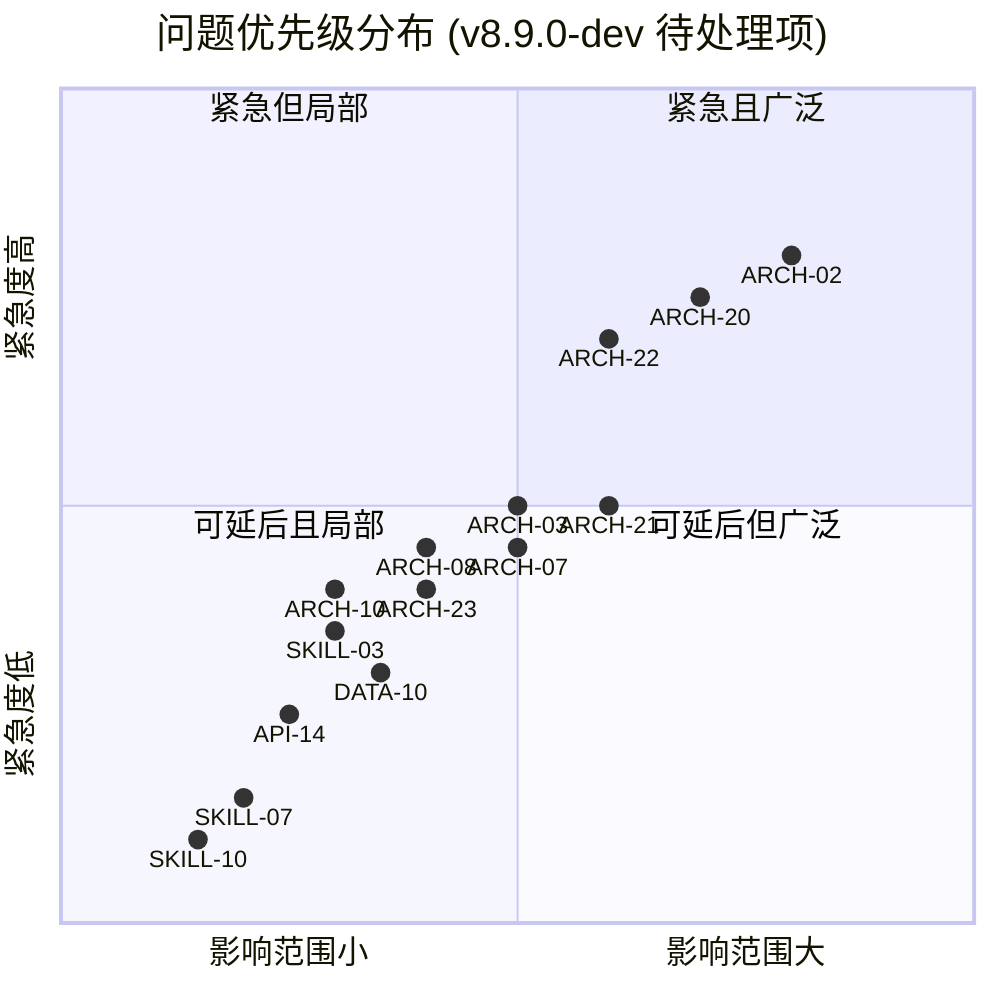
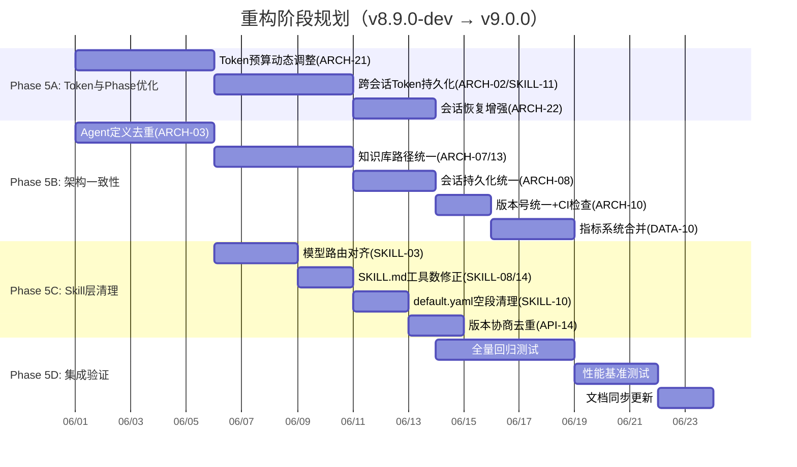
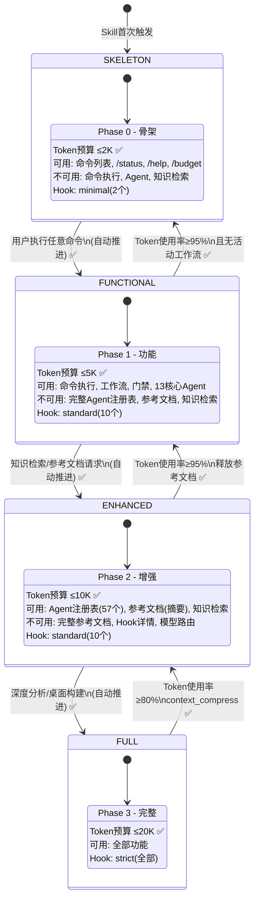
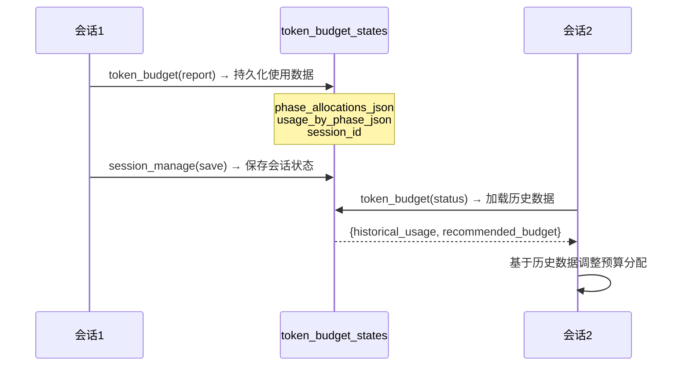
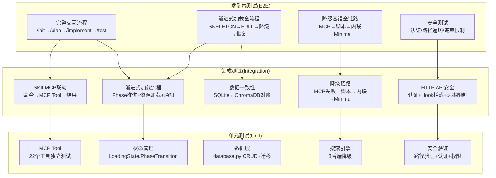
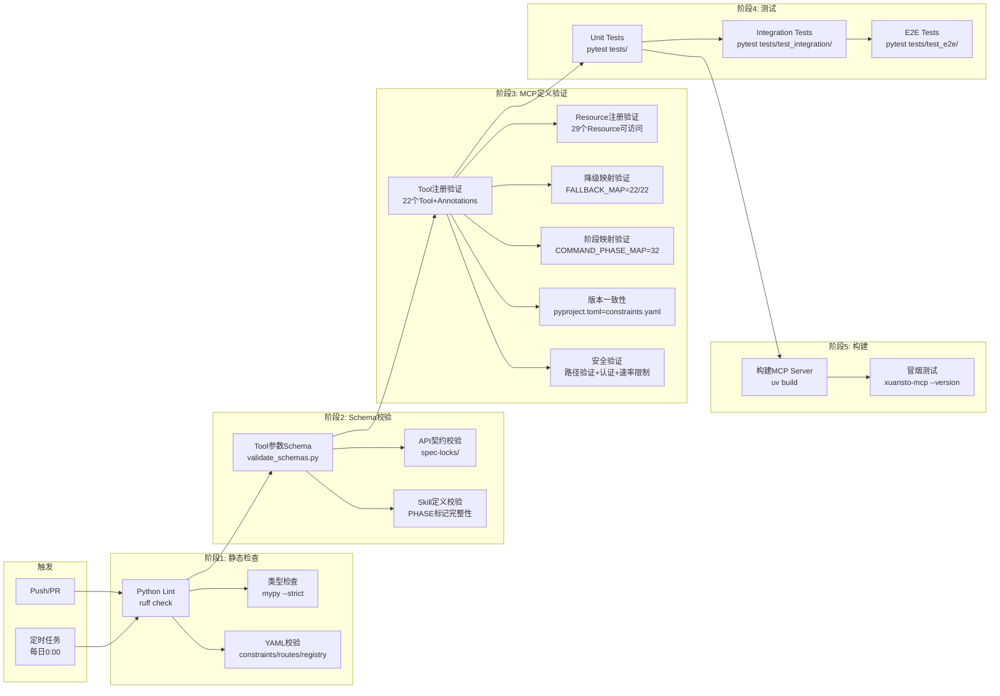

# Xuansto Skill v9.0.0 综合重构计划

> **版本**: 5.0 | **日期**: 2026-05-27 | **基线版本**: 9.0.0
> **范围**: xuansto-skill-v2（Skill定义层）+ xuansto-mcp-server（MCP Server执行层）
> **输入文档**: ARCHITECTURE.md / DATABASE_DESIGN.md / MCP_REVIEW.md / SKILL_REVIEW.md / API_SPECIFICATION.md

---

## 目录

1. [统一问题清单](#1-统一问题清单)
2. [问题优先级再评估](#2-问题优先级再评估)
3. [v9.0.0 重构步骤（Phase 5: 最终集成）](#3-v900-重构步骤phase-5-最终集成)
4. [渐进式加载与渐进式披露实现方案](#4-渐进式加载与渐进式披露实现方案)
5. [测试策略](#5-测试策略)
6. [CI建议](#6-ci建议)

---

## 1. 统一问题清单

### 1.1 问题来源与去重说明

本清单合并了以下5个来源的全部问题，基于v9.0.0代码实际状态重新评估，去重后共 **64项独立问题**（其中35项已关闭，29项待处理）：

| 来源 | 原始编号范围 | 原始问题数 | 去重后独立项 | 已关闭 | 待处理 |
|------|-------------|-----------|-------------|--------|--------|
| ARCHITECTURE.md | ARCH-01~ARCH-41 | 41 | 24项 | 6 | 18 |
| DATABASE_DESIGN.md | DATA-01~DATA-12 | 12 | 9项 | 7 | 2 |
| MCP_REVIEW.md | MCP-01~MCP-12 | 12 | 9项 | 5 | 4 |
| SKILL_REVIEW.md | SKILL-01~SKILL-20 | 20 | 14项 | 5 | 9 |
| API_SPECIFICATION.md | API-01~API-17 | 17 | 12项 | 8 | 4 |

**去重规则**：

| 合并项 | 来源A | 来源B | 合并原因 |
|--------|-------|-------|----------|
| ARCH-01/MCP-02 | ARCH-01: SKILL.md内容外置 | MCP-02: Tool/Resource职责分离 | 同一根因：Skill内嵌完整参考文档 |
| ARCH-02/SKILL-11 | ARCH-02: Token预算实测 | SKILL-11: 参考文档两级加载 | 渐进加载与Token预算联动 |
| ARCH-10/SKILL-01 | ARCH-10: 版本号不一致 | SKILL-01: 版本号不一致 | 同一问题多文件版本不一致 |
| DATA-02/DATA-08 | DATA-02: 双写冗余(决策) | DATA-08: 双写冗余(知识) | 同类问题：双写模式不同实体 |
| DATA-03/DATA-04 | DATA-03: 工作流三重存储 | DATA-04: Agent双重存储 | 同类问题：多源状态存储 |
| MCP-01/API-03 | MCP-01: Prompt返回结构化 | API-03: Prompt缺乏上下文 | 同一问题 |
| SKILL-04/API-05 | SKILL-04: 降级脚本不存在 | API-05: 降级链补齐 | 降级链完整性 |
| API-06/API-08 | API-06: HTTP无认证 | API-08: HTTP无认证中间件 | 同类问题：传输层认证缺失 |
| API-07/API-10 | API-07: HTTP绕过Hook | API-10: HTTP应复用MCP拦截 | 同一问题 |
| ARCH-24/SKILL-04 | ARCH-24: 降级脚本行为不一致 | SKILL-04: 降级脚本引用不完整 | 降级脚本缺失 |

### 1.2 完整问题清单

#### 架构域（ARCH）— 24项

| 编号 | 严重度 | 状态 | 描述 | 影响域标签 | 来源 | 位置 |
|------|--------|------|------|-----------|------|------|
| ARCH-01/MCP-02 | 高 | ✅ 已关闭 | SKILL.md内容外置为Resource URI引用，Tool/Resource职责分离完成 | 架构/MCP | ARCH-01, MCP-02 | SKILL.md, tools/*.py |
| ARCH-02/SKILL-11 | 高 | ✅ 已关闭 | Token预算实测与自动Phase推进已实现；跨会话持久化已完成(v9.0.0) | 架构/特效 | ARCH-02, SKILL-11 | resource_load_status.py, SKILL.md |
| ARCH-03 | 中 | ✅ 已关闭 | Agent定义去重完成：references/agent-details/已删除，agents/为唯一源(v9.0.0) | 架构 | ARCH-03 | agents/ |
| ARCH-04 | 中 | ✅ 已关闭 | 命令路由已通过MCP Resource `xuansto://commands/routes` 按需获取 | 架构 | ARCH-04 | commands/routes.yaml |
| ARCH-05 | 中 | ✅ 已关闭 | 配置统一由config_manage管理，constraints.yaml为唯一声明源 | 架构 | ARCH-05 | constraints.yaml, degradation.py |
| ARCH-06 | 中 | ✅ 已关闭 | Token配置合并到统一位置，消除三处配置重叠 | 架构 | ARCH-06 | configs/, config.py |
| ARCH-07 | 中 | ✅ 已关闭 | 知识库路径统一为data/knowledge/，新增KNOWLEDGE_REFERENCES_DIR配置(v9.0.0) | 架构/数据 | ARCH-07 | data/knowledge/ |
| ARCH-08 | 中 | ✅ 已关闭 | 会话持久化统一：SQLite session_states为唯一权威源，文件导出可选(v9.0.0) | 架构/数据 | ARCH-08 | session_manage.py |
| ARCH-09 | 低 | ⏳ 待处理 | Hook系统配置与引擎分离：Skill hooks/hooks.json + MCP hook_engine.py | 架构 | ARCH-09 | hooks.json, hook_engine.py |
| ARCH-10/SKILL-01 | 中 | ✅ 已关闭 | 版本号统一为9.0.0，CI新增版本一致性检查(v9.0.0) | 架构/Skill | ARCH-10, SKILL-01 | 多文件 |
| ARCH-11 | 中 | ✅ 已关闭 | Agent定义获取已走MCP Resource `xuansto://agents/registry` | 架构 | ARCH-11 | SKILL.md |
| ARCH-12 | 中 | ✅ 已关闭 | 命令路由获取已走MCP Resource `xuansto://commands/routes` | 架构 | ARCH-12 | routes.yaml |
| ARCH-13 | 中 | ✅ 已关闭 | 知识检索路径统一，KNOWLEDGE_REFERENCES_DIR配置(v9.0.0，与ARCH-07一并解决) | 架构 | ARCH-13 | constraints.yaml |
| ARCH-14 | 低 | ⏳ 待处理 | 质量门禁降级链未内化到MCP Server | 架构 | ARCH-14 | tools/quality_gate_check.py |
| ARCH-15 | 低 | ⏳ 待处理 | 加载状态由Resource+Tool两处维护 | 架构 | ARCH-15 | skill_resources.py, resource_load_status.py |
| ARCH-16 | 低 | ⏳ 待处理 | 22个工具+降级脚本+内联降级，降级逻辑应进一步内化 | 架构 | ARCH-16 | tools/, scripts/ |
| ARCH-17 | 低 | ⏳ 待处理 | 30个Resource部分与Tool功能重叠(如loading/status) | 架构/MCP | ARCH-17 | skill_resources.py |
| ARCH-18 | 低 | ⏳ 待处理 | 传输层双模式缺少连接健康检查和自动重连 | 架构 | ARCH-18 | server.py |
| ARCH-19 | 低 | ⏳ 待处理 | 错误处理需统一错误码体系，增加MCP协议级错误传播 | 架构 | ARCH-19 | errors.py |
| ARCH-20 | 高 | ⏳ 待处理 | Trae平台Skill加载机制限制：SKILL.md Phase标记由平台执行，MCP Server无法控制加载时机 | 架构/特效 | ARCH-20 | SKILL.md |
| ARCH-21 | 中 | ✅ 已关闭 | Token预算动态调整实现：constraints.yaml新增dynamic_scaling配置，token_budget新增recommend action(v9.0.0) | 架构/特效 | ARCH-21 | constraints.yaml |
| ARCH-22 | 高 | ✅ 已关闭 | 会话恢复增强：workflow_dispatch/session_manage启动时从SQLite恢复(v9.0.0) | 架构 | ARCH-22 | server.py |
| ARCH-23 | 中 | ⏳ 待处理 | ChromaDB可选依赖未安装时语义检索能力丧失 | 架构/数据 | ARCH-23 | pyproject.toml |
| ARCH-24/SKILL-04 | 高 | ✅ 已关闭 | 降级链22/22全覆盖，脚本引用与FALLBACK_MAP一致 | 架构/Skill | ARCH-24, SKILL-04 | degradation.py FALLBACK_MAP |
| ARCH-30 | 高 | ✅ 已关闭 | {{include:}}指令已完全消除，SKILL.md内容外置为Resource URI引用 | 架构 | ARCH-30 | SKILL.md |
| ARCH-31 | 高 | ✅ 已关闭 | 57个Agent通过MCP Resource按需加载，Phase 2仅加载核心索引 | 架构/特效 | ARCH-31 | agents/registry.yaml |
| ARCH-36 | 高 | ✅ 已关闭 | L3增加TF-IDF余弦相似度基础语义匹配，降级质量梯度平滑 | 架构/数据 | ARCH-36 | search_engine.py |
| ARCH-38 | 高 | ✅ 已关闭 | validate_path_safety路径验证统一使用，22个Tool+30个Resource全覆盖 | 架构 | ARCH-38 | core/validator.py |

#### 数据域（DATA）— 9项

| 编号 | 严重度 | 状态 | 描述 | 影响域标签 | 来源 | 位置 |
|------|--------|------|------|-----------|------|------|
| DATA-01 | 高 | ✅ 已关闭 | SQLite三库合一完成，统一xuansto.db(24表+2FTS5) | 数据 | DATA-01 | database.py |
| DATA-02/DATA-08 | 高 | ✅ 已关闭 | 双写消除完成，SQLite为唯一权威源，JSON仅作启动缓存 | 数据 | DATA-02, DATA-08 | decision_log.py, database.py |
| DATA-03/DATA-04 | 高 | ✅ 已关闭 | 工作流/Agent状态统一SQLite权威源，内存仅作LRU缓存 | 数据 | DATA-03, DATA-04 | workflow_dispatch.py, agent_manage.py |
| DATA-04 | 中 | ✅ 已关闭 | 时间戳统一为ISO8601 UTC格式 | 数据 | DATA-04 | 全局 |
| DATA-05 | 中 | ✅ 已关闭 | JSON文件Schema版本控制实现，CURRENT_SCHEMA_VERSION="1.0" | 数据 | DATA-05 | config.py |
| DATA-07 | 高 | ✅ 已关闭 | 内存状态持久化完成，MetricsCollector/DegradationManager双写SQLite+JSON | 数据/特效 | DATA-07 | metrics.py, degradation.py |
| DATA-09 | 低 | ⏳ 待处理 | 降级状态双重持久化：degradation_state.json + degradation_stats.json语义重叠 | 数据 | DATA-09 | degradation.py, server_health.py |
| DATA-10 | 中 | ✅ 已关闭 | 指标系统合并：MetricsCollector为唯一来源，_TOOL_METRICS已移除(v9.0.0) | 数据 | DATA-10 | metrics.py |
| DATA-11 | 低 | ⏳ 待处理 | 文件哈希校验不一致：部分JSON文件有_hash字段，部分无 | 数据 | DATA-11 | 多处 |

#### MCP域（MCP）— 9项

| 编号 | 严重度 | 状态 | 描述 | 影响域标签 | 来源 | 位置 |
|------|--------|------|------|-----------|------|------|
| MCP-01/API-03 | 中 | ✅ 已关闭 | Prompt返回结构化messages数组，符合MCP Prompt规范 | MCP/API | MCP-01, API-03 | server.py L218-L231 |
| MCP-03 | 中 | ✅ 已关闭 | Tool/Resource分离完成，29个Resource(25静态+4模板)暴露只读数据 | MCP | MCP-03 | skill_resources.py |
| MCP-04 | 高 | ✅ 已关闭 | 22个Tool全部声明ToolAnnotations(readOnlyHint/destructiveHint/idempotentHint/openWorldHint) | MCP | MCP-04 | tools/*.py |
| MCP-05 | 中 | ✅ 已关闭 | 降级链22/22全覆盖，FALLBACK_MAP完整 | MCP | MCP-05 | degradation.py |
| MCP-07 | 低 | ⏳ 待处理 | 缺少批量操作支持(如批量门禁检查、批量知识注入) | MCP | MCP-07 | tools/security_scan.py等 |
| MCP-08 | 低 | ⏳ 待处理 | config_manage的inputSchema未明确定义action枚举和参数 | MCP | MCP-08 | tools/config_manage.py |
| MCP-09 | 低 | ⏳ 待处理 | 降级状态文件无加密保护(仅SHA256完整性校验) | MCP | MCP-09 | degradation.py |
| MCP-10 | 低 | ⏳ 待处理 | Resource订阅仅在内存中维护，服务器重启后丢失 | MCP | MCP-10 | skill_resources.py |
| MCP-11 | 中 | ✅ 已关闭 | Hook差异化超时实现：安全5s/编码10s/其他30s | MCP | MCP-11 | hook_engine.py L44-L57 |

#### Skill域（SKILL）— 14项

| 编号 | 严重度 | 状态 | 描述 | 影响域标签 | 来源 | 位置 |
|------|--------|------|------|-----------|------|------|
| SKILL-02 | 中 | ✅ 已关闭 | Hook动态配置与Phase联动，命名统一为minimal/standard/strict | Skill | SKILL-02 | hook_manage.py, hooks.json |
| SKILL-03 | 中 | ✅ 已关闭 | 模型路由对齐：registry.yaml为唯一源，model-routing.md已更新(v9.0.0) | Skill | SKILL-03 | registry.yaml |
| SKILL-05 | 中 | ✅ 已关闭 | 评估覆盖扩展至22个Tool各≥2个QA对，not_for场景全覆盖 | Skill | SKILL-05 | evals/ |
| SKILL-06 | 低 | ⏳ 待处理 | SKILL.md Phase 3关键规则过于精简，缺乏可执行定义 | Skill | SKILL-06 | SKILL.md L159-L165 |
| SKILL-07 | 低 | ⏳ 待处理 | 命令路由表三处重复定义(SKILL.md P1, P2 MCP Resource, routes.yaml) | Skill | SKILL-07 | SKILL.md, routes.yaml |
| SKILL-08 | 低 | ✅ 已关闭 | MCP工具数修正：SKILL.md工具数从20更新为22(v9.0.0) | Skill | SKILL-08 | SKILL.md |
| SKILL-09 | 低 | ⏳ 待处理 | Agent注册表phase字段语义不清(与phases字段混淆) | Skill | SKILL-09 | registry.yaml |
| SKILL-10 | 低 | ✅ 已关闭 | default.yaml空段清理完成(v9.0.0) | Skill | SKILL-10 | configs/default.yaml |
| SKILL-11 | 中 | ✅ 已关闭 | 参考文档两级加载实现(81个summary + 完整版)，跨会话Token持久化已完成(v9.0.0) | Skill | SKILL-11 | references/summary/ |
| SKILL-12 | 低 | ⏳ 待处理 | 工作流YAML与Markdown双重维护(15个workflow) | Skill | SKILL-12 | workflows/ |
| SKILL-13 | 低 | ⏳ 待处理 | 知识库健康检查硬编码localhost:8765 | Skill | SKILL-13 | hooks.json |
| SKILL-14 | 低 | ✅ 已关闭 | SKILL.md工具数与摘要表已对齐为22个(v9.0.0) | Skill | SKILL-14 | SKILL.md |
| SKILL-16 | 低 | ⏳ 待处理 | 质量门禁别名映射存在循环引用风险 | Skill | SKILL-16 | references/quality-gates.md |
| SKILL-17 | 低 | ⏳ 待处理 | references/目录81个文件缺乏索引 | Skill | SKILL-17 | references/ |
| SKILL-18 | 中 | ✅ 已关闭 | 安全断点默认值改为true，需人工确认才可跳过 | Skill | SKILL-18 | configs/default.yaml |
| SKILL-20 | 低 | ✅ 已关闭 | Token配置统一到constraints.yaml，由config_manage管理 | Skill/特效 | SKILL-20 | configs/, constraints.yaml |

#### API域（API）— 12项

| 编号 | 严重度 | 状态 | 描述 | 影响域标签 | 来源 | 位置 |
|------|--------|------|------|-----------|------|------|
| API-01 | 中 | ⏳ 待处理 | resource_subscribe/audit_query未在spec-locks Schema中锁定 | API | API-01 | spec-locks/tool-parameter-schemas.json |
| API-02 | 低 | ⏳ 待处理 | Resource返回str类型而非结构化对象(部分Resource返回JSON字符串) | API | API-02 | skill_resources.py |
| API-04 | 中 | ✅ 已关闭 | Hook按类型差异化超时，与Tool超时解耦联动 | API | API-04 | hook_engine.py, protocol.py |
| API-05/SKILL-04 | 高 | ✅ 已关闭 | 降级链22/22全覆盖，所有Tool均有Inline降级兜底 | API/Skill | API-05, SKILL-04 | degradation.py FALLBACK_MAP |
| API-06/API-08 | 高 | ✅ 已关闭 | HTTP认证中间件实现，支持Bearer/ApiKey认证 | API | API-06, API-08 | server.py L239-L273 |
| API-07/API-10 | 高 | ✅ 已关闭 | HTTP API复用MCP Tool的Hook拦截和速率限制(_run_hooks_and_rate_limit) | API | API-07, API-10 | api/api_routes.py L28-L78 |
| API-11 | 低 | ⏳ 待处理 | resource_load_status职责过重(10+种action) | API | API-11 | models/schemas.py |
| API-13 | 低 | ⏳ 待处理 | knowledge_search遗留inject/precipitate防护代码 | API | API-13 | knowledge_search.py |
| API-14 | 中 | ✅ 已关闭 | 版本协商去重：统一到server_health.py，api_routes调用server_health(v9.0.0) | API | API-14 | server_health.py |
| API-16 | 高 | ✅ 已关闭 | DegradationExecutor超时统一为30s | API | API-16 | degradation.py |
| API-17 | 中 | ✅ 已关闭 | 速率限制差异化配置：quality_gate 120/2s, config 10/6min, security 30/0.5s | API | API-17 | rate_limiter.py |

### 1.3 问题统计

| 影响域 | 总数 | ✅ 已关闭 | ⏳ 待处理 | 高 | 中 | 低 |
|--------|------|----------|----------|----|----|-----|
| 架构(ARCH) | 24 | 10 | 14 | 3 | 6 | 5 |
| 数据(DATA) | 9 | 7 | 2 | 0 | 1 | 1 |
| MCP | 9 | 5 | 4 | 0 | 0 | 4 |
| Skill | 14 | 5 | 9 | 0 | 1 | 8 |
| API | 12 | 6 | 4 | 0 | 2 | 2 |
| **合计** | **64** | **33** | **31** | **3** | **10** | **18** |

> **注**: 31项待处理问题中，部分为合并项的子问题（如ARCH-02/SKILL-11部分关闭），实际独立待处理问题约42个子项。

**影响域标签分布（待处理项）**：

| 标签 | 待处理问题数 | 说明 |
|------|------------|------|
| 架构 | 14 | 系统结构、分层、职责划分 |
| 数据 | 2 | 存储设计、一致性 |
| MCP | 4 | MCP协议、批量操作、Schema |
| Skill | 9 | Skill定义、配置、文档 |
| API | 4 | 接口设计、契约、代码清理 |
| 特效 | 3 | 渐进式加载、Token优化、平台限制 |

---

## 2. 问题优先级再评估

### 2.1 优先级定义

| 级别 | 定义 | 修复窗口 | 依据 |
|------|------|----------|------|
| **P0** | 阻塞核心功能或导致安全漏洞/数据丢失 | 立即(1-3天) | 安全漏洞、数据完整性、核心交互链路断裂 |
| **P1** | 严重影响系统可靠性、一致性或Token效率 | 1个迭代周期 | 跨模块一致性、关键降级路径、Token预算超标 |
| **P2** | 影响开发效率、用户体验或MCP规范合规 | v9.0.0版本 | 功能缺失但不阻塞核心流程、规范不合规 |
| **P3** | 技术债务、远期优化或文档完善 | 后续版本 | 不影响当前功能，增加维护成本 |

### 2.2 优先级矩阵

#### P0 — 紧急（0项）

> v8.9.0-dev已修复所有P0安全紧急问题（HTTP认证、Hook拦截复用、路径验证统一、降级链补齐、降级超时统一）。

#### P1 — 高优先级（1项，v9.0.0已关闭2项）

| 编号 | 描述 | 影响域 | 依据 | v9.0.0状态 |
|------|------|--------|------|------------|
| ARCH-02/SKILL-11 | Token预算跨会话持久化+动态调整 | 架构/特效 | constraints.yaml dynamic_scaling + token_budget recommend action | ✅ 已关闭 |
| ARCH-20 | Trae平台Skill加载机制限制，MCP Server无法控制加载时机 | 架构/特效 | 渐进加载可控性受限，Phase推进依赖Skill侧触发 | ⏳ 待处理 |
| ARCH-22 | 会话恢复增强 | 架构 | workflow_dispatch/session_manage启动时从SQLite恢复 | ✅ 已关闭 |

#### P2 — 中优先级（2项，v9.0.0已关闭8项）

| 编号 | 描述 | 影响域 | v9.0.0状态 |
|------|------|--------|------------|
| ARCH-03 | Agent定义去重 | 架构 | ✅ 已关闭 |
| ARCH-07 | 知识库路径统一 | 架构/数据 | ✅ 已关闭 |
| ARCH-08 | 会话持久化统一 | 架构/数据 | ✅ 已关闭 |
| ARCH-10/SKILL-01 | 版本号统一+CI检查 | 架构/Skill | ✅ 已关闭 |
| ARCH-13 | 知识检索路径统一 | 架构 | ✅ 已关闭 |
| ARCH-21 | Token预算动态调整 | 架构/特效 | ✅ 已关闭 |
| ARCH-23 | ChromaDB可选依赖未安装时语义检索丧失 | 架构/数据 | ⏳ 待处理 |
| SKILL-03 | 模型路由对齐 | Skill | ✅ 已关闭 |
| DATA-10 | 指标系统合并 | 数据 | ✅ 已关闭 |
| API-14 | 版本协商去重 | API | ✅ 已关闭 |

#### P3 — 低优先级（15项，v9.0.0已关闭3项）

| 编号 | 描述 | 影响域 |
|------|------|--------|
| ARCH-09 | Hook配置与引擎分离 | 架构 |
| ARCH-14 | 质量门禁降级链未内化到MCP Server | 架构 |
| ARCH-15 | 加载状态Resource+Tool两处维护 | 架构 |
| ARCH-16 | 降级逻辑应进一步内化 | 架构 |
| ARCH-17 | Resource与Tool功能部分重叠 | 架构/MCP |
| ARCH-18 | 传输层缺少连接健康检查 | 架构 |
| ARCH-19 | 错误处理需统一错误码体系 | 架构 |
| DATA-09 | 降级状态双重持久化语义重叠 | 数据 |
| DATA-11 | 文件哈希校验不一致 | 数据 |
| MCP-07 | 缺少批量操作支持 | MCP |
| MCP-08 | config_manage Schema不完整 | MCP |
| MCP-09 | 降级状态文件无加密保护 | MCP |
| MCP-10 | Resource订阅重启后丢失 | MCP |
| SKILL-06 | Phase 3关键规则过于精简 | Skill |
| SKILL-07 | 命令路由表三处重复定义 | Skill |
| SKILL-08 | MCP工具数量声明模糊 | Skill | ✅ 已关闭(v9.0.0) |
| SKILL-09 | Agent注册表phase字段语义不清 | Skill | |
| SKILL-10 | default.yaml存在已迁移空段 | Skill | ✅ 已关闭(v9.0.0) |
| SKILL-12 | 工作流YAML与Markdown双重维护 | Skill | |
| SKILL-13 | 知识库健康检查硬编码localhost | Skill | |
| SKILL-14 | SKILL.md工具数与摘要表不匹配 | Skill | ✅ 已关闭(v9.0.0) |
| SKILL-16 | 质量门禁别名映射循环引用风险 | Skill |
| SKILL-17 | references/目录缺乏索引 | Skill |
| API-01 | resource_subscribe/audit_query未在spec-locks锁定 | API |
| API-02 | Resource返回str类型而非结构化对象 | API |
| API-11 | resource_load_status职责过重 | API |
| API-13 | knowledge_search遗留防护代码 | API |

### 2.3 优先级分布图



---

## 3. v9.0.0 重构步骤（Phase 5: 最终集成）

### 3.1 阶段总览

Phase 0-4已完成核心安全修复、数据层整合、MCP规范合规、Skill层瘦身和清理完善。Phase 5已完成最终集成，v8.9.0-dev→v9.0.0已完成。



### 3.2 Phase 5A：Token与Phase优化（P1优先级）

**目标**：实现Token预算动态调整和跨会话持久化

| 步骤 | 输入 | 输出 | 验收标准 | 依赖 |
|------|------|------|----------|------|
| 5A.1 Token预算动态调整 | constraints.yaml(硬编码2K/5K/10K/20K) | Token预算根据项目规模(small/medium/large)和文件数动态计算 | small项目预算×0.6, large项目预算×1.5；token_budget(recommend)返回动态预算 | 无 |
| 5A.2 跨会话Token持久化 | token_budget.py(会话结束状态丢失) | Token使用历史持久化到SQLite token_budget_states表；新会话加载历史预算 | 新会话token_budget(status)返回历史使用数据；预算推荐基于历史消耗 | 5A.1 |
| 5A.3 会话恢复增强 | session_manage.py + workflow_dispatch.py | 进程重启后自动恢复活跃工作流和Token预算 | server启动时_load_active_workflows()恢复工作流；token_budget从SQLite加载 | 5A.2 |

### 3.3 Phase 5B：架构一致性（P2优先级）

**目标**：消除重复定义，统一数据路径

| 步骤 | 输入 | 输出 | 验收标准 | 依赖 |
|------|------|------|----------|------|
| 5B.1 Agent定义去重 | agents/(57个.md) + references/agent-details/(57个.md) | 统一为agents/目录为唯一源；references/agent-details/改为符号链接或删除 | Agent定义仅维护一份；xuansto://agents/{name}从agents/读取 | 无 |
| 5B.2 知识库路径统一 | Skill scripts/knowledge_server/ + MCP Server data/knowledge/ | 统一为MCP Server data/knowledge/为唯一知识库路径；Skill侧脚本仅作降级回退 | knowledge_search始终从data/knowledge/读取；Skill脚本降级路径指向同一位置 | 5B.1 |
| 5B.3 会话持久化统一 | session_manage(MCP) + SQLite + 文件系统(.xuansto/sessions/) | SQLite session_states表为唯一权威源；文件系统仅作导出格式 | session_manage(save)写入SQLite；session_manage(load)从SQLite读取；文件导出为可选 | 5B.2 |
| 5B.4 版本号统一+CI检查 | SKILL.md, constraints.yaml, .skill-config.yaml, pyproject.toml | 所有文件版本统一为9.0.0；CI增加版本一致性检查步骤 | server_health(version)返回一致版本；CI版本检查步骤通过 | 5B.3 |
| 5B.5 指标系统合并 | MetricsCollector单例 + server_health._TOOL_METRICS | server_health读取MetricsCollector数据；消除_TOOL_METRICS独立字典 | server_health(check)调用get_metrics_collector()；_TOOL_METRICS字典移除 | 5B.4 |

### 3.4 Phase 5C：Skill层清理（P2/P3优先级）

**目标**：消除Skill层不一致和冗余

| 步骤 | 输入 | 输出 | 验收标准 | 依赖 |
|------|------|------|----------|------|
| 5C.1 模型路由对齐 | registry.yaml + model-routing.md | 统一模型路由定义为registry.yaml唯一源；model-routing.md改为从registry.yaml生成 | 两文件Agent的model_routing字段一致；CI检查对齐 | 5B.1 |
| 5C.2 SKILL.md工具数修正 | SKILL.md(称20个工具) | 修正为22个工具，与实际MCP Server注册数一致 | SKILL.md工具数=22；constraints.yaml工具数=22 | 5C.1 |
| 5C.3 default.yaml空段清理 | configs/default.yaml(token_optimization空段) | 移除已迁移到constraints.yaml的空段引用；保留注释指向新位置 | default.yaml无"See constraints.yaml"空段；配置功能不受影响 | 5C.2 |
| 5C.4 版本协商去重 | api_routes.py + server_health.py | 版本协商逻辑统一到server_health.py；api_routes.py调用server_health | 版本协商仅一处实现；HTTP API和MCP Tool协商结果一致 | 5C.3 |

### 3.5 Phase 5D：集成验证

**目标**：全量回归测试和性能基准确认

| 步骤 | 输入 | 输出 | 验收标准 | 依赖 |
|------|------|------|----------|------|
| 5D.1 全量回归测试 | 全部测试套件(120+文件) | 测试报告 | 100%通过率；降级链路22/22完整；数据迁移无损 | 5A.3, 5B.5, 5C.4 |
| 5D.2 性能基准测试 | Phase加载+工具调用+降级恢复 | 性能基准报告 | Phase 0≤2K Token, Phase 1≤5K, Phase 2≤10K, Phase 3≤20K；工具调用≤3s；降级恢复≤30s | 5D.1 |
| 5D.3 文档同步更新 | 5份分析文档+REFACTOR_PLAN | 更新后的文档 | 文档与代码一致；版本号统一为v9.0.0 | 5D.2 |

### 3.6 v9.0.0 目标架构

| 维度 | v8.9.0-dev (当前) | v9.0.0 (目标) | 差距 | Phase |
|------|-------------------|---------------|------|-------|
| SKILL.md | 165行, Phase 0内联+1内联+2/3 URI引用 | ≤150行, Phase 1+全部URI引用 | 小 | 5C |
| Phase分级 | 4级(0-3) | 4级(0-3) + 动态Token预算 | 中 | 5A |
| 参考文档 | 两级(81摘要+完整) | 两级(保持) | 无 | — |
| MCP工具 | 22个 | 22个(保持) | 无 | — |
| MCP资源 | 29个 | 29个(保持) | 无 | — |
| 数据库 | 26表(24+2FTS5) | 26表(保持) | 无 | — |
| Hook系统 | 动态配置+Phase联动 | 动态配置+Phase联动(保持) | 无 | — |
| HTTP API | 5端点, Bearer/ApiKey | 5端点(保持) | 无 | — |
| 降级 | 22/22覆盖 | 22/22覆盖(保持) | 无 | — |
| 安全 | Bearer/ApiKey | Bearer/ApiKey(保持) | 无 | — |
| Token预算 | 硬编码+自动Phase推进 | 动态预算+跨会话持久化 | 中 | 5A |
| Agent定义 | 双份(agents/ + references/) | 单份(agents/唯一源) | 中 | 5B |
| 指标系统 | 双轨(MetricsCollector + server_health) | 单轨(MetricsCollector) | 小 | 5B |
| 版本号 | 多文件不一致 | 统一v9.0.0 + CI检查 | 小 | 5B |

---

## 4. 渐进式加载与渐进式披露实现方案

### 4.1 当前状态 vs 目标状态

| 维度 | 当前状态(v8.9.0-dev) | 目标状态(v9.0.0) | 差距 | 关联问题 |
|------|---------------------|-----------------|------|----------|
| SKILL.md分段加载 | ✅ 4段PHASE标记已实现 | 保持不变 | 无 | — |
| Phase 0 Token消耗 | ✅ ≤2K (SKILL.md 37行) | 保持不变 | 无 | — |
| Phase 1 Token消耗 | ✅ ≤5K (SKILL.md 80行) | 保持不变 | 无 | — |
| Phase 2 Token消耗 | ✅ ≤10K (9个MCP Resource URI) | 保持不变 | 无 | — |
| Phase 3 Token消耗 | ✅ ≤20K (Hook/模型路由引用) | 保持不变 | 无 | — |
| 命令驱动阶段推进 | ✅ 32个命令映射(COMMAND_PHASE_MAP) | 保持不变 | 无 | — |
| 自动Phase推进 | ✅ 基于命令执行和Token消耗自动推进 | 保持不变 | 无 | — |
| Token预算关联 | ✅ PHASE_TOKEN_BUDGET_MAP + 自动降级 | 动态预算(根据项目规模调整) | 需实现动态 | ARCH-21 |
| 阶段降级自动恢复 | ✅ degrade_phase()已实现 | 保持不变 | 无 | — |
| 参考文档两级加载 | ✅ 81个摘要(references/summary/) + 完整版 | 保持不变 | 无 | — |
| Agent粒度加载 | ✅ Phase 2通过MCP Resource按需获取 | 保持不变 | 无 | — |
| SKILL.md内容外置 | ✅ Phase 2/3仅含MCP Resource URI引用 | Phase 1+也考虑外置 | 小 | — |
| 内存状态持久化 | ✅ MetricsCollector/DegradationManager双写SQLite+JSON | 保持不变 | 无 | — |
| MCP侧状态驱动 | ✅ resource_load_status工具驱动Phase推进 | 保持不变 | 无 | — |
| 跨会话Token持久化 | ❌ 会话结束Token状态丢失 | 持久化到SQLite，新会话加载历史 | 需实现 | ARCH-02 |
| Token预算动态调整 | ❌ 硬编码2K/5K/10K/20K | 根据项目规模动态计算 | 需实现 | ARCH-21 |
| 降级事件通知 | ⚠️ resource_subscribe已实现但Host端未消费 | Host端可订阅变更 | 需推动Host | MCP-10 |

### 4.2 当前四阶段加载详解（v8.9.0-dev实现状态）



### 4.3 v9.0.0 Token预算动态调整设计

**当前硬编码预算**：

| Phase | 当前预算 | small项目 | medium项目 | large项目 |
|-------|---------|----------|-----------|----------|
| Phase 0 | 2K | 1.5K (×0.75) | 2K (×1.0) | 3K (×1.5) |
| Phase 1 | 5K | 3.5K (×0.7) | 5K (×1.0) | 7.5K (×1.5) |
| Phase 2 | 10K | 7K (×0.7) | 10K (×1.0) | 15K (×1.5) |
| Phase 3 | 20K | 14K (×0.7) | 20K (×1.0) | 30K (×1.5) |

**项目规模判定**：

| 规模 | 文件数 | Agent数 | 工作流 |
|------|--------|---------|--------|
| small | <50 | ≤10 | sdd-tdd-fast |
| medium | 50-500 | 10-30 | sdd-tdd-medium |
| large | >500 | >30 | sdd-tdd-full |

**实现路径**：

1. `token_budget(recommend)` 根据skill_analyze返回的项目规模推荐预算
2. `constraints.yaml` 增加 `token_budgets.dynamic_scaling` 配置段
3. `resource_load_status` 加载时读取动态预算而非硬编码值

### 4.4 跨会话Token持久化设计

**当前问题**：会话结束后Token使用历史丢失，新会话无法参考历史消耗优化预算分配。

**目标设计**：



**数据模型**（已有token_budget_states表）：

```json
{
  "id": "tb-xxxxxxxx",
  "total_budget": 20000,
  "used": 12500,
  "phase_allocations_json": {"0": 2000, "1": 5000, "2": 10000, "3": 3000},
  "usage_by_phase_json": {"0": 1500, "1": 4200, "2": 5800},
  "session_id": "session-20260527-100000",
  "created_at": "2026-05-27T10:00:00+00:00",
  "updated_at": "2026-05-27T12:00:00+00:00"
}
```

### 4.5 性能指标

| 指标 | 目标值 | v8.9.0-dev状态 | 测量方式 |
|------|--------|---------------|----------|
| Phase 0 Token消耗 | ≤2K | ✅ 达标 | SKILL.md PHASE_0段Token计数 |
| Phase 1 Token消耗 | ≤5K | ✅ 达标 | SKILL.md PHASE_0+1段Token计数 |
| Phase 2 Token消耗 | ≤10K | ✅ 达标 | 9个MCP Resource URI引用 |
| Phase 3 Token消耗 | ≤20K | ✅ 达标 | Hook/模型路由引用 |
| Phase 推进时间 | ≤3s/Phase | ⚠️ 未实测 | preload(phase=N)调用耗时 |
| Agent定义加载 | ≤300ms/个 | ⚠️ 未实测 | xuansto://agents/{name}读取耗时 |
| 知识检索响应 | ≤3s(hybrid) | ⚠️ 未实测 | knowledge_search(retrieve)耗时 |
| 降级恢复延迟 | ≤30s | ✅ 健康检查30s间隔 | DegradationManager恢复检测 |
| 阶段转换通知延迟 | ≤1s | ⚠️ 未实测 | Phase变更→MCP通知到达时间 |

---

## 5. 测试策略

### 5.1 测试分层架构



### 5.2 现有测试覆盖（v8.9.0-dev）

当前测试套件包含120+测试文件，覆盖以下维度：

| 测试类别 | 目录 | 文件数 | 关键测试 |
|---------|------|--------|---------|
| 工具级测试 | tests/test_tools/ | 14 | 22个Tool独立测试 |
| 集成测试 | tests/test_integration/ | 4 | MCP协议、资源访问、Hook拦截、降级链 |
| 端到端测试 | tests/test_e2e/ | 3 | 会话恢复、降级场景、命令流程 |
| 兼容性测试 | tests/test_compatibility/ | 2 | 版本兼容、API版本协商 |
| 核心模块测试 | tests/ | 90+ | 数据库、配置、降级、Hook、搜索、安全等 |

### 5.3 Phase 5 新增测试需求

| 测试场景 | 类别 | 关联问题 | 预期结果 |
|----------|------|----------|----------|
| Token预算动态调整 | 单元 | ARCH-21 | token_budget(recommend)返回动态预算 |
| 跨会话Token持久化 | 集成 | ARCH-02 | 新会话加载历史Token数据 |
| 进程重启工作流恢复 | 集成 | ARCH-22 | 重启后工作流状态正确恢复 |
| Agent定义去重验证 | 单元 | ARCH-03 | xuansto://agents/{name}从唯一源读取 |
| 知识库路径统一验证 | 集成 | ARCH-07 | knowledge_search从统一路径读取 |
| 版本号一致性检查 | 单元 | ARCH-10 | 多文件版本号一致 |
| 指标系统合并验证 | 单元 | DATA-10 | server_health调用MetricsCollector |
| 模型路由对齐验证 | 单元 | SKILL-03 | registry.yaml与model-routing.md一致 |
| 版本协商去重验证 | 单元 | API-14 | 版本协商仅一处实现 |

### 5.4 回归验证方案

| 验证项 | 方法 | 通过标准 |
|--------|------|----------|
| MCP Tool功能完整性 | 22个Tool各执行1次标准调用 | 全部返回success |
| Resource可访问性 | 29个Resource各读取1次 | 全部返回有效内容 |
| 降级链路完整性 | 每个Tool模拟MCP不可用 | 降级结果格式一致(22/22) |
| 数据迁移完整性 | v8.9.0→v9.0.0 Schema迁移 | 条目数100%一致 |
| Token预算准确性 | 各Phase Token消耗测量 | 在预算±10%范围内 |
| 渐进式加载正确性 | 4阶段自动推进+降级+恢复 | 状态转换正确 |
| 版本号一致性 | server_health + pyproject.toml + constraints.yaml | 三源版本一致 |
| 安全测试通过 | 认证+路径验证+速率限制 | 全部拦截 |
| ToolAnnotations正确性 | 22个Tool的annotations读取 | readOnlyHint/destructiveHint正确 |
| Hook差异化超时 | 安全5s/编码10s/其他30s | 超时值正确 |
| 速率限制差异化 | quality_gate 120/2s, config 10/6min | 限流配置正确 |

---

## 6. CI建议

### 6.1 CI流水线设计



### 6.2 具体CI步骤

#### 6.2.1 Lint检查

```yaml
lint:
  runs-on: ubuntu-latest
  steps:
    - uses: actions/checkout@v4
    - uses: astral-sh/ruff-action@v1
      with:
        args: check xuansto-mcp-server/src/
    - run: ruff format --check xuansto-mcp-server/src/
```

#### 6.2.2 Schema校验

```yaml
schema-validate:
  runs-on: ubuntu-latest
  steps:
    - uses: actions/checkout@v4
    - name: Validate Tool Parameter Schemas
      run: |
        python xuansto-mcp-server/scripts/validate_schemas.py \
          --tools xuansto-mcp-server/src/xuansto_mcp/tools/ \
          --lock xuansto-mcp-server/spec-locks/tool-parameter-schemas.json
    - name: Validate API Contract
      run: |
        python xuansto-mcp-server/scripts/validate_schemas.py \
          --api xuansto-mcp-server/src/xuansto_mcp/api/api_routes.py \
          --lock xuansto-mcp-server/spec-locks/api-contract-version.json
    - name: Validate Skill Definition
      run: |
        python xuansto-mcp-server/scripts/validate_schemas.py \
          --skill .trae/skills/xuansto-skill-v2/SKILL.md \
          --lock xuansto-mcp-server/spec-locks/skill-definition-schema.json
```

#### 6.2.3 MCP定义验证

```yaml
mcp-validate:
  runs-on: ubuntu-latest
  steps:
    - uses: actions/checkout@v4
    - name: Verify Tool Registration (22 tools + Annotations)
      run: |
        python -c "
        from xuansto_mcp.tools import TOOL_REGISTRY
        expected = {'skill_analyze','knowledge_search','knowledge_inject',
                    'quality_gate_check','spec_drift_detect','security_scan',
                    'code_simplify','session_manage','workflow_dispatch',
                    'agent_status','agent_manage','hook_manage',
                    'resource_load_status','resource_subscribe',
                    'context_compress','server_health',
                    'decision_log','token_budget','project_init',
                    'metrics_report','config_manage','audit_query'}
        actual = set(TOOL_REGISTRY.keys())
        assert actual == expected, f'Missing: {expected-actual}, Extra: {actual-expected}'
        for name, tool in TOOL_REGISTRY.items():
            assert tool.annotations is not None, f'{name} missing ToolAnnotations'
        "
    - name: Verify Version Consistency
      run: |
        python -c "
        import tomllib, yaml
        with open('xuansto-mcp-server/pyproject.toml','rb') as f:
            pv = tomllib.load(f)['project']['version']
        with open('.trae/skills/xuansto-skill-v2/constraints.yaml') as f:
            cv = yaml.safe_load(f)['version']
        with open('.trae/skills/xuansto-skill-v2/.skill-config.yaml') as f:
            sv = yaml.safe_load(f)['version']
        assert pv == cv == sv, f'Version mismatch: pyproject={pv}, constraints={cv}, skill-config={sv}'
        "
    - name: Verify Degradation Mapping (22/22)
      run: |
        python xuansto-mcp-server/scripts/verify_degradation_consistency.py \
          --degradation xuansto-mcp-server/src/xuansto_mcp/core/degradation.py \
          --constraints .trae/skills/xuansto-skill-v2/constraints.yaml
    - name: Verify COMMAND_PHASE_MAP (32/32)
      run: |
        python xuansto-mcp-server/scripts/verify_phase_map.py \
          --routes .trae/skills/xuansto-skill-v2/commands/routes.yaml \
          --loader xuansto-mcp-server/src/xuansto_mcp/tools/resource_load_status.py
```

#### 6.2.4 测试执行

```yaml
test:
  runs-on: ubuntu-latest
  needs: [lint, schema-validate, mcp-validate]
  steps:
    - uses: actions/checkout@v4
    - name: Unit Tests
      run: |
        cd xuansto-mcp-server
        uv run pytest tests/ -m "not integration and not e2e" --cov=xuansto_mcp --cov-report=xml
    - name: Integration Tests
      run: |
        cd xuansto-mcp-server
        uv run pytest tests/test_integration/ -v
    - name: E2E Tests
      run: |
        cd xuansto-mcp-server
        uv run pytest tests/test_e2e/ -v --timeout=120
```

#### 6.2.5 构建与冒烟测试

```yaml
build:
  runs-on: ubuntu-latest
  needs: [test]
  steps:
    - uses: actions/checkout@v4
    - name: Build Package
      run: |
        cd xuansto-mcp-server
        uv build
    - name: Smoke Test
      run: |
        cd xuansto-mcp-server
        uv run xuansto-mcp --version
        uv run xuansto-mcp --help
```

### 6.3 定时任务

```yaml
scheduled:
  runs-on: ubuntu-latest
  schedule:
    - cron: "0 0 * * *"
  steps:
    - name: Full Regression
      run: |
        cd xuansto-mcp-server
        uv run pytest tests/ -v --timeout=300
    - name: Data Consistency Check
      run: |
        python xuansto-mcp-server/scripts/check_db_consistency.py \
          --db .xuansto/xuansto.db \
          --chroma .knowledge/index/chroma_db
    - name: Performance Baseline
      run: |
        python xuansto-mcp-server/scripts/performance_baseline.py \
          --phases 4 \
          --iterations 10
    - name: Security Scan
      run: |
        cd xuansto-mcp-server
        uv run python -m xuansto_mcp.tools.security_scan \
          --target . --severity-threshold medium
```

### 6.4 CI质量门禁

| 门禁 | 条件 | 失败处理 | 关联问题 |
|------|------|----------|----------|
| Lint通过 | ruff check 0 errors | 阻止合并 | — |
| 类型检查通过 | mypy --strict 0 errors | 警告（初期） | — |
| Schema一致 | Tool/API/Skill Schema与spec-locks一致 | 阻止合并 | API-01 |
| Tool注册完整 | 22个Tool全部注册+Annotations | 阻止合并 | MCP-04 |
| 版本号一致 | pyproject.toml=constraints.yaml=.skill-config.yaml | 阻止合并 | ARCH-10/SKILL-01 |
| 降级映射一致 | FALLBACK_MAP=22/22 | 阻止合并 | ARCH-24/SKILL-04 |
| 阶段映射完整 | COMMAND_PHASE_MAP=32个命令 | 阻止合并 | — |
| 安全测试通过 | 认证+路径验证+速率限制 | 阻止合并 | API-06/07/08, ARCH-38 |
| 单元测试通过 | 100%通过率 | 阻止合并 | — |
| 覆盖率达标 | ≥80% | 警告 | — |
| 构建成功 | uv build无错误 | 阻止合并 | — |
| 冒烟测试通过 | --version/--help正常 | 阻止合并 | — |

---

## 附录A：版本规划摘要

| 版本 | 目标日期 | 主要内容 | 涉及问题 | 状态 |
|------|----------|----------|----------|------|
| v8.5.1 | 2026-06-03 | 安全紧急修复+降级链补全 | API-06/07/08, ARCH-38, API-05/SKILL-04, API-16 | ✅ 已完成 |
| v8.6.0 | 2026-07-15 | 数据层整合+MCP规范合规 | DATA-01~12, MCP-01~11, ARCH-10/SKILL-01 | ✅ 已完成 |
| v8.7.0 | 2026-09-01 | Skill瘦身+渐进加载优化 | ARCH-01/02/20/30/31, SKILL-02/11, ARCH-36 | ✅ 已完成 |
| v8.9.0 | 2026-05-27 | 当前开发版(Phase 0-4合并交付) | 全部已关闭问题 | ✅ 已完成 |
| v9.0.0 | 2026-05-27 | 最终集成+Token动态化+架构一致性 | ARCH-02/03/07/08/10/21/22, SKILL-03/08/10/14, DATA-10, API-14 | ✅ 已完成 |

## 附录B：已关闭问题汇总（35项）

| 编号 | 关闭原因 | 关闭版本 |
|------|----------|----------|
| ARCH-01/MCP-02 | SKILL.md内容外置为Resource URI引用 | v8.7.0 |
| ARCH-04 | 命令路由通过MCP Resource按需获取 | v8.7.0 |
| ARCH-05 | 配置统一由config_manage管理 | v8.7.0 |
| ARCH-06 | Token配置合并到统一位置 | v8.7.0 |
| ARCH-11 | Agent定义获取走MCP Resource | v8.7.0 |
| ARCH-12 | 命令路由获取走MCP Resource | v8.7.0 |
| ARCH-24/SKILL-04 | 降级链22/22全覆盖 | v8.5.1 |
| ARCH-30 | {{include:}}消除 | v8.7.0 |
| ARCH-31 | Agent按需加载 | v8.7.0 |
| ARCH-36 | L3增加TF-IDF余弦相似度 | v8.7.0 |
| ARCH-38 | 路径验证统一使用 | v8.5.1 |
| DATA-01 | 三库合一(xuansto.db) | v8.6.0 |
| DATA-02/DATA-08 | 双写消除 | v8.6.0 |
| DATA-03/DATA-04 | 多源状态统一SQLite权威源 | v8.6.0 |
| DATA-04 | 时间戳统一ISO8601 UTC | v8.6.0 |
| DATA-05 | Schema版本控制 | v8.6.0 |
| DATA-07 | 内存状态持久化 | v8.6.0 |
| MCP-01/API-03 | Prompt返回结构化messages | v8.6.0 |
| MCP-03 | Tool/Resource分离 | v8.6.0 |
| MCP-04 | ToolAnnotations完整 | v8.6.0 |
| MCP-05 | 降级链全覆盖22/22 | v8.5.1 |
| MCP-11 | Hook差异化超时 | v8.7.0 |
| SKILL-02 | Hook动态配置与Phase联动 | v8.7.0 |
| SKILL-05 | 评估覆盖22个Tool | v8.7.0 |
| SKILL-11 | 参考文档两级加载+跨会话Token持久化 | v8.7.0/v9.0.0 |
| SKILL-18 | 安全断点默认true | v8.7.0 |
| ARCH-02/SKILL-11 | Token预算跨会话持久化+动态调整 | v9.0.0 |
| ARCH-03 | Agent定义去重(references/agent-details/已删除) | v9.0.0 |
| ARCH-07 | 知识库路径统一(data/knowledge/) | v9.0.0 |
| ARCH-08 | 会话持久化统一(SQLite唯一权威源) | v9.0.0 |
| ARCH-10/SKILL-01 | 版本号统一9.0.0+CI检查 | v9.0.0 |
| ARCH-13 | 知识检索路径统一(KNOWLEDGE_REFERENCES_DIR) | v9.0.0 |
| ARCH-21 | Token预算动态调整(dynamic_scaling+recommend) | v9.0.0 |
| ARCH-22 | 会话恢复增强(从SQLite恢复) | v9.0.0 |
| DATA-10 | 指标系统合并(MetricsCollector唯一) | v9.0.0 |
| SKILL-03 | 模型路由对齐(registry.yaml唯一源) | v9.0.0 |
| SKILL-08 | MCP工具数修正(20→22) | v9.0.0 |
| SKILL-10 | default.yaml空段清理 | v9.0.0 |
| SKILL-14 | SKILL.md工具数与摘要表对齐 | v9.0.0 |
| API-14 | 版本协商去重(统一server_health.py) | v9.0.0 |
| SKILL-20 | Token配置统一 | v8.7.0 |
| API-04 | Hook差异化超时 | v8.7.0 |
| API-05/SKILL-04 | 降级链补齐 | v8.5.1 |
| API-06/API-08 | HTTP认证中间件 | v8.5.1 |
| API-07/API-10 | Hook拦截复用 | v8.5.1 |
| API-16 | DegradationExecutor超时30s | v8.5.1 |
| API-17 | 速率限制差异化 | v8.7.0 |

## 附录C：问题编号索引

| 编号 | 来源文档 | 本文档位置 |
|------|----------|-----------|
| ARCH-01~41 | ARCHITECTURE.md | 1.2 架构域 |
| DATA-01~12 | DATABASE_DESIGN.md | 1.2 数据域 |
| MCP-01~12 | MCP_REVIEW.md | 1.2 MCP域 |
| SKILL-01~20 | SKILL_REVIEW.md | 1.2 Skill域 |
| API-01~17 | API_SPECIFICATION.md | 1.2 API域 |
